# ADVANCES AND CHALLENGES IN FOUNDATION AGENTSFROM BRAIN-INSPIRED INTELLIGENCE TO EVOLUTIONARY, COLLABORATIVE,AND SAFE SYSTEMS  

Bang $\mathbf{Liu^{2,3,20*\dagger}}$ , Xinfeng $\mathbf{Li^{4*}}$ , Jiayi $\mathbf{Z}\mathbf{hang}^{1,10*}$ , Jinlin Wang \*, Tanjin $\mathbf{He}^{5*}$ , Sirui $\mathbf{Hong^{1*}}$ Hongzhang $\mathbf{Liu^{6*}}$ , Shaokun $\mathbf{Z}\mathbf{h}\mathbf{a}\mathbf{n}\mathbf{g}^{7*}$ , Kaitao $\mathbf{Song^{8*}}$ , Kunlun $\mathbf{Z}\mathbf{h}\mathbf{u}^{9*}$ , Yuheng $\mathbf{Cheng^{1*}}$ Suyuchen Wang2,3\*, Xiaoqiang $\mathbf{Wang^{2,3*}}$ , Yuyu $\mathbf{Luo^{10*}}$ , Haibo $\mathbf{Jin^{9}}.$ \* Peiyan Zhang10, Ollie $\mathbf{Liu}^{11}$ \* Jiaqi Chen1, Huan Zhang2,3, Zhaoyang $\bar{\mathbf{Y}}\mathbf{u}^{1}$ , Haochen $\mathbf{Shi^{2,3}}$ , Boyan $\mathbf{Li}^{10}$ , Dekun $\mathbf{W_{u}}^{2,3}$ , Fengwei Teng1, Xiaojun $\mathbf{Jia^{4}}$ , Jiawei $\mathbf{X}\mathbf{u}^{1}$ , Jinyu Xiangl, Yizhang $\mathbf{Lin}^{1}$ , Tianming $\mathbf{Liu^{14}}$ , Tongliang $\mathbf{Liu}^{6}$ Yu $\mathbf{Su}^{15}$ , Huan $\mathbf{Sun^{15}}$ ,Glen Berseth2,32,Jian $\mathbf{Nie^{2}}$ , Ian Foster5, Logan Ward5,Qingyun $\mathbf{W_{u}}^{\mathrm{7}}$ Yu $\mathbf{Gu}^{15}$ , Mingchen Zhuge16, Xiangru $\mathbf{Tang^{12}}$ , Haohan $\mathbf{Wang}^{9}$ , Jiaxuan $\mathbf{You}^{9}$ , Chi Wang19, Jian $\mathbf{Pei^{17\dagger}}$ , Qiang $\mathbf{Yang^{10,18\dagger}}$ , Xiaoliang $\mathbf{Q}\mathbf{i}^{13\dagger}$ , Chenglin $\mathbf{W_{u}}^{1*\dagger}$  

1MetaGPT, ²Université de Montreal, 3Mila - Quebec AI Institute, 4Nanyang Technological University,   
5Argonne National Laboratory, 6University of Sydney,Penn State University, 8Microsoft Research Asia,   
9University of Illnois at Urbana-Champaign,10The Hong Kong University of Science and Technology,   
1UniversityofhCalifileityadityUetyf   
15The Ohio State University,16King Abdullah University of Science and Technology,17Duke University,   
18The Hong Kong Polytechnic University,19Google DeepMind, 20Canada CIFAR AIChair  

# ABSTRACT  

The advent of large language models (LLMs) has catalyzed a transformative shift in artificial intelligence, paving the way for advanced intelligent agents capable of sophisticated reasoning, robust perception, and versatile action across diverse domains. As these agents increasingly drive AI research and practical applications, their design, evaluation, and continuous improvement present intricate, multifaceted challenges. This survey provides a comprehensive overview, framing intelligent agents within a modular, brain-inspired architecture that integrates principles from cognitive science, neuroscience, and computational research. We structure our exploration into four interconnected parts. First, we delve into the modular foundation of intelligent agents, systematically mapping their cognitive, perceptual, and operational modules onto analogous human brain functionalities, and elucidating core components such as memory, world modeling,reward processing, and emotion-like systems. Second, we discuss self-enhancement and adaptive evolution mechanisms, exploring how agents autonomously refine their capabilities, adapt to dynamic environments, and achieve continual learning through automated optimization paradigms, including emerging AutoML and LLM-driven optimization strategies. Third, we examine collaborative and evolutionary multi-agent systems, investigating the collective intelligence emerging from agent interactions, cooperation, and societal structures, highlighting parallels to human social dynamics. Finally, we address the critical imperative of building safe, secure, and beneficial AI systems, emphasizing intrinsic and extrinsic security threats,ethical alignment, robustness, and practical mitigation strategies necessary for trustworthy real-world deployment.By synthesizing modular AI architectures with insights from different disciplines, this survey identifies key research gaps,challenges, and opportunities, encouraging innovations that harmonize technological advancement with meaningful societal benefit. The project's Github link is: https://github.com/FoundationAgents/awesome-foundation-agents.  

# Preface  

Large language models (LLMs)have revolutionized artificial intelligence(AI) by demonstrating unprecedented capabilities in naturallanguage andmultimodal understanding,as wellasreasoning and generation.These models are trainedonvastdatasets,andtheyexhibitemergentabilitiessuchasreasoning,in-contextleaing,andevenudimetar planning.While these modelsrepresent a major stepforward in realizing intelligent machines,they themselves do not yet fully embody allthe capabilities of an intelligent beingSincethe early daysof artificial intelligence,AI researchershavelong beenonaquest foratruly“intellgent"systemthatcanlearn,plan,reason,sense,communicate, act,remember, and demonstrate various human-like abilities and agility.These beings,known as intelligent agents, should be ableto think both long-term and short-term,perform complex actions,and interact withhumans and other agents. LLMs are an important step towards realizing intelligent agents, but we are not there yet.  

This manuscript provides acomprehensive overview of the current state of the art of LLM-based intelligent agents. In the past,there have been numerous research papers and books on intelligent agents, as wellasa flurryof books on LLMs. However,there has scarcely been comprehensive coverage of both. While LLMs can achieve significant capabilities required by agents,they onlyprovidethefoundations upon whichfurther functionalities must be built.For example,while LLMs can help generate plans such as travelplans,they cannot yet generatefully complex plans for complex and professionaltasks, nor can they maintain long-term memories without hallucination. Furthermore, their ability to perform real-world actions autonomouslyremains limited.Wecan view LLMs asengines, with agents being thecars,boatsandairplanes builtusingtheseengines.Inthisview,wenaturallseek tomoveforward indesigning and constructing fully functioning intelligent agents by making fulluse of the capabilities provided by LLMs.  

In this engine-vehicle analogyof theinterplaybetweenLLMs andagents,wenaturallask:Howmuchofthecapabilities of intelligent agentscancurrent LLMtechnologies provide?What are the functions thatcannot yetberealized based on current LLM technologies? Beyond LMs, what more needs to be done to have a full intelligent agent capable of autonomous action and interaction in the physical world?What are the challnges forfull integrated LLM-based agents?What aditionaldevelopments arerequiredforcapable,communicative agents thateffectivelycollaborate with humans?What are the areas thatrepresentlow-hanging fruits for LLM-based agents?What implications willthere be for society once we have fully intelligent LLM-based agents, and how should we prepare for this future?  

These questions transcend not only the engineering practice of extending current LLMs and agents but also raise potentialfuture research directions.We have assembled frontierresearchers from AI,spanning from LLMdevelopment to agent design,tocomprehensivelyaddress thesequestions.Thebookconsists offour parts.The first part presents an exposition of the requirementsforindividualagents,comparing theircapabilities withthose ofhumans,including perception and action abilities. The second part explores agents"evolution capabilities and their implications on intelligent toolssuch as workflow management systems.Thethirdpart discusses societies of agents,emphasizingtheir collaborative andcolective actioncapabilities, andthefourth part addresses ethicaland societalaspects, including agent safety and responsibilities.  

This book isintended forresearchers,students,policymakers,and practitioners alike.The audience includes non-AI readers curious about AI,LLMs,andagents,as wellas individuals interestedinfuture societieswhere humansco-exist with AI.Readers may range from undergraduate and graduate students toresearchers and industry practitioners.The book aims notonly to provide answers to readers'questions about AIand agents but alsoto inspire them to ask new questions.Ultimately, we hope to motivate more people to join our endeavor in exploringthisfertileresearch ground.  

# Contents  

# 1 Introduction 12  

1.1  The Rise and Development of AI Agents 12   
1.2 A Parallel Comparison between Human Brain and AI Agents 13   
1.2.1 Brain Functionality by Region and AI Parallels 14   
1.3 A Modular and Brain-Inspired AI Agent Framework 16   
1.3.1 Core Concepts and Notations in the Agent Loop 18   
1.3.2 Biological Inspirations 21   
1.3.3 Connections to Existing Theories 21  

1.4 Navigating This Survey 22  

# I Core Components of Intelligent Agents 24  

# 2Cognition 25  

# 2.1  Learning 25  

2.1.1 Learning Space 27   
2.1.2 Learning Objective 29   
2.2 Reasoning 31   
2.2.1 Structured Reasoning 32   
2.2.2 Unstructured Reasoning 34   
2.2.3 Planning 36  

# ）Memory 39  

# 3.1  Overview of Human Memory. 39  

3.1.1  Types of Human Memory 39   
3.1.2 Models of Human Memory . 41   
3.2 From Human Memory to Agent Memory 42   
3.3 Representation of Agent Memory 44   
3.3.1 Sensory Memory 44   
3.3.2 Short-Term Memory 46   
3.3.3 Long-Term Memory 46  

3.4 The Memory Lifecycle 47  

# 3.4.1 Memory Acquisition 47  

3.4.2 Memory Encoding 48   
3.4.3 Memory Derivation 49   
3.4.4 Memory Retrieval and Matching 50   
3.4.5 Neural Memory Networks 51   
3.4.6 Memory Utilization . 52   
3.5 Summary and Discussion 53  

# 4 World Model 54  

4.1 The Human World Model 55   
4.2 Translating Human World Models to AI 55   
4.3 Paradigms of AI World Models 56   
4.3.1 Overview of World Model Paradigms 56   
4.3.2 Implicit Paradigm . 57   
4.3.3 Explicit Paradigm . 57   
4.3.4 Simulator-Based Paradigm 58   
4.3.5 Hybrid and Instruction-Driven Paradigms 58   
4.3.6 Comparative Summary of Paradigms 58   
4.4 Relationships to Other Modules 58   
4.4.1 Memory and the World Model 59   
4.4.2 Perception and the World Model 60   
4.4.3 Action and the World Model 60   
4.4.4 Cross-Module Integration 61   
4.5 Summary and Discussion 61  

# 5 Reward 63  

5.1 The Human Reward Pathway 64   
5.2 From Human Rewards to Agent Rewards 65   
5.3AI Reward Paradigms 65   
5.3.1 Definitions and Overview 65   
5.3.2 Extrinsic Rewards 67   
5.3.3 Intrinsic Rewards 67   
5.3.4 Hybrid Rewards 68   
5.3.5 Hierarchical Rewards 68   
5.4 Summary and Discussion 69   
5.4.1 Interaction with Other Modules 69   
5.4.2 Challenges and Directions 69  

# 6 Emotion Modeling 71  

6.1 Psychological Foundations of Emotion 71   
6.2 Incorporating Emotions in AI Agents . 74   
6.3 Understanding Human Emotions through AI . 74   
6.4 Analyzing AI Emotions and Personality 74   
6.5 Manipulating AI Emotional Responses . 75   
6.6 Summary and Discussion 75  

# 7Perception 77  

# 7.1  Human versus AI Perception 77  

7.2Types of Perception Representation 79   
7.2.1 Unimodal Models 79   
7.2.2 Cross-modal Models 80   
7.2.3 Multimodal Models . 81   
7.3 Optimizing Perception Systems 83   
7.3.1 Model-Level Enhancements 83   
7.3.2 System-Level Optimizations 84   
7.3.3External Feedback and Control . 84   
7.4 Perception Applications . 84   
7.5 Summary and Discussion 85  

# Action Systems 86  

# 8.1 The Human Action System 86  

8.2 From Human Action to Agentic Action 87   
8.3 Paradigms of Agentic Action System . 88   
8.3.1 Action Space Paradigm 88   
8.3.2 Action Learning Paradigm 91   
8.3.3 Tool-Based Action Paradigm 93   
8.4 Action and Perception: “Outside-In” or“Inside-out” 95   
Summary and Discussion 97  

# [Self-Evolution in Intelligent Agents 101  

Optimization Spaces and Dimensions for Self-evolution 103   
9.1Overview of Agent Optimization 103   
9.2  Prompt Optimization 103   
9.2.1 Evaluation Functions 104   
9.2.2 Optimization Functions . 104   
9.2.3 Evaluation Metrics 105   
9.3Workflow Optimization 105   
9.3.1 Workflow Formulation 105   
9.3.2 Optimizing Workflow Edges 106   
9.3.3 Optimizing Workflow Nodes 106  

# 9.4 Tool Optimization 107  

9.4.1 Learning to Use Tools 107   
9.4.2 Creation of New Tools 107   
9.4.3 Evaluation of Tool Effectiveness 108   
Towards Autonomous Agent Optimization 110  

# 10 Large Language Models as Optimizers  

# 111  

10.1 Optimization Paradigms 111   
10.2 Iterative Approaches to LLM Optimization 111   
10.3 Optimization Hyperparameters 114   
10.4 Optimization across Depth and Time 114   
10.5 A Theoretical Perspective. 115  

# Online and Offline Agent Self-Improvement 116  

11.1 Online Agent Self-Improvement 116   
11.2 Offline Agent Self-Improvement 117   
11.3 Comparison of Online and Offline Improvement 118   
11.4 Hybrid Approaches 118  

# 12 Scientific Discovery and Intelligent Evolution 120  

# 12.1 Agent's Intelligence for Scientific Knowledge Discovery 120  

12.1.1 KL Divergence-based Intelligence Measure 120   
12.1.2 Statistical Nature of Intelligence Growth 122   
12.1.3 Intelligence Evolution Strategies . 123   
12.2 Agent-Knowledge Interactions 123   
12.2.1 Hypothesis Generation and Testing 124   
12.2.2 Protocol Planning and Tool Innovation . 126   
12.2.3 Data Analysis and Implication Derivation 126   
. Technological Readiness and Challenges . 127   
12.3.1 Real-World Interaction Challenges . 127   
12.3.2 Complex Reasoning Challenges 128   
12.3.3 Challenges in Integrating Prior Knowledge 129  

# II1 [Collaborative and Evolutionary Intelligent Systems 130  

# ) Design of Multi-Agent Systems 133  

13.1 Strategic Learning: Cooperation vs. Competition 133   
13.2 Modeling Real-World Dynamics 134   
13.3 Collaborative Task Solving with Workflow Generation 135   
13.4 Composing AI Agent Teams 135   
13.5 Agent Interaction Protocols . 137   
13.5.1 Message Types 137   
13.5.2 Communication Interface 138   
13.5.3 Next-Generation Communication Protocols 138  

# 4 Communication Topology 141  

14.1 System Topologies 141   
14.1.1 Static Topologies 141   
14.1.2 Dynamic and Adaptive Topologies 142   
14.2 Scalability Considerations 144  

# l5 Collaboration Paradigms and Collaborative Mechanisms 146  

15.1 Agent-Agent collaboration 146   
15.2 Human-AI Collaboration 149   
15.3 Collaborative Decision-Making 150  

# Collective Intelligence and Adaptation 152  

16.1 Collective Intelligence 152   
16.2 Individual Adaptability 153  

# 17 Evaluating Multi-Agent Systems 155  

17.1 Benchmarks for Specific Reasoning Tasks 155   
17.2 Challenge and Future Work . 159  

# IV  Building Safe and Beneficial AI Agents 160  

# ： Agent Intrinsic Safety: Threats on AI Brain 163  

# 18.1 Safety Vulnerabilities of LLMs 163  

18.1.1 Jailbreak Attacks 163   
18.1.2 Prompt Injection Attacks 166   
18.1.3 Hallucination Risks . 167   
18.1.4 Misalignment Issues 169   
18.1.5 Poisoning Attacks 170   
18.2 Privacy Concerns 172   
18.2.1 Inference of Training Data 172   
18.2.2 Inference of Interaction Data. 173   
18.2.3 Privacy Threats Mitigation 174   
18.3 Summary and Discussion 175  

# Agent Intrinsic Safety: Threats on Non-Brain Modules 176  

19.1 Perception Safety Threats . 176   
19.1.1 Adversarial Attacks on Perception 176  

# 19.1.2 Misperception Issues 177  

19.2 Action Safety Threats 178   
19.2.1 Supply Chain Attacks 178   
19.2.2 Risks in Tool Usage 179  

# 0 Agent Extrinsic Safety: Interaction Risks 180  

20.1 Agent-Memory Interaction Threats 180  

20.2 Agent-Environment Interaction Threats 180   
20.3 Agent-Agent Interaction Threats 182   
20.4 Summary and Discussion 182  

# 21 Superalignment and Safety Scaling Law in AI Agents 184  

21.1 Superalignment: Goal-Driven Alignment for AI Agents . 184  

21.1.1 Composite Objective Functions in Superalignment 184   
21.1.2 Overcoming the Limitations of RLHF with Superalignment 185   
21.1.3 Empirical Evidence Supporting Superalignment . 185   
21.1.4 Challenges and Future Directions 185   
.2 Safety Scaling Law in AI Agents . 186   
21.2.1 Current landscape: balancing model safety and performance 186   
21.2.2 Enhancing safety: preference alignment and controllable design 187   
21.2.3 Future directions and strategies: the AI- $45^{\circ}$ rule and risk management 187  

# 22 Concluding Remarks and Future Outlook  

# Notation  

Here we summarize the notations usedthroughout the survey for the reader'sconvenience.Detailed definitions can be found in the reference locations.  

<html><body><table><tr><td> Symbol</td><td>Description</td><td>Reference</td></tr><tr><td>W</td><td>The world with society systems.</td><td>Sec.1.3.1</td></tr><tr><td>S</td><td>State space of an environment.</td><td>Sec.1.3.1</td></tr><tr><td> St ∈S</td><td>Environment's state at time t.</td><td>Sec. 1.3.1</td></tr><tr><td></td><td>Observation space.</td><td>Sec. 1.3.1</td></tr><tr><td> Ot∈O</td><td>Observation at time t.</td><td>Sec. 1.3.1</td></tr><tr><td>A</td><td>Agent's action space.</td><td>Sec. 1.3.1</td></tr><tr><td>at∈Ａ</td><td>Agent's action output at time t.</td><td> Sec.1.3.1</td></tr><tr><td>M</td><td>Mental states space.</td><td>Sec. 1.3.1</td></tr><tr><td>Mt ∈M</td><td>Agent's mental state at time t.</td><td> Sec. 1.3.1</td></tr><tr><td>Mmem</td><td>Memory component in Mt.</td><td>Sec. 1.3.1</td></tr><tr><td>Mwm</td><td>World model component in Mt.</td><td>Sec. 1.3.1</td></tr><tr><td>Memo</td><td>Emotion component in Mt.</td><td>Sec. 1.3.1</td></tr><tr><td>Mgoal</td><td>Goal component in Mt.</td><td> Sec.1.3.1</td></tr><tr><td>Mrew</td><td>Reward/Learning signals in Mt.</td><td>Sec.1.3.1</td></tr><tr><td>L</td><td>Agent's learning function.</td><td>Sec. 1.3.1</td></tr><tr><td>R</td><td>Agent's reasoning function.</td><td>Sec.1.3.1</td></tr><tr><td>C</td><td>Agent's cognition function.</td><td>Sec. 1.3.1</td></tr><tr><td>E</td><td>Action execution (effectors).</td><td>Sec. 1.3.1</td></tr><tr><td>T</td><td>Environment transition.</td><td>Sec. 1.3.1</td></tr><tr><td></td><td>Parameters of the world model Mwm.</td><td>Sec.12.1.1</td></tr><tr><td>Po</td><td>Predicted data distribution.</td><td>Sec. 12.1.1</td></tr><tr><td>Pw</td><td>True data distribution in the real world.</td><td>Sec.12.1.1</td></tr><tr><td>K</td><td> Space of known data and information.</td><td>Sec. 12.1.1</td></tr><tr><td>u</td><td>Space of unknown data and information.</td><td>Sec.12.1.1</td></tr><tr><td></td><td>Dataset representing scientific knowledge.</td><td> Sec.12.1.1</td></tr><tr><td>XK</td><td>Known dataset sampled from K.</td><td>Sec.12.1.1</td></tr><tr><td>XU</td><td>Unknown dataset sampled from U.</td><td>Sec. 12.1.1</td></tr><tr><td>Do</td><td>KL divergence from Pw to Pg at time t = 0.</td><td>Sec.12.1.1</td></tr><tr><td>DK</td><td>KL divergence from Pw to Pg after acquiring knowledge.</td><td> Sec.12.1.1</td></tr><tr><td>IQagent</td><td>Agent's intelligence at time t.</td><td>Sec.12.1.1</td></tr><tr><td>△</td><td> Subspace of U for knowledge expansion.</td><td>Sec. 12.1.2</td></tr><tr><td>X△</td><td>Dataset from △.</td><td>Sec.12.1.2</td></tr><tr><td></td><td> Space of possible world model parameters 0.</td><td>Sec. 12.1.3</td></tr><tr><td>Kt</td><td>Optimal world model parameters given the agent's knowledge at time t.</td><td>Sec.12.1.3</td></tr><tr><td>D.</td><td>Minimum unknown given the agent's knowledge and O.</td><td>Sec. 12.1.3</td></tr></table></body></html>  

<html><body><table><tr><td> Symbol</td><td>Description</td><td>Reference</td></tr><tr><td>X1:n</td><td> Input token sequence.</td><td>Sec.18.1</td></tr><tr><td>y</td><td>Generated output sequence.</td><td>Sec.18.1</td></tr><tr><td>p</td><td> Probability of generating y given X1:n.</td><td>Sec.18.1.1</td></tr><tr><td>X1:n</td><td> Perturbed input sequence.</td><td> Sec.18.1.1</td></tr><tr><td>R*</td><td>Idealalgnntdauie-</td><td>Sec.18.1.1</td></tr><tr><td>y*</td><td> Jailbreak output induced by perturbations.</td><td>Sec. 18.1.1</td></tr><tr><td>A</td><td> a set of safety/ethical guidelines</td><td>Sec. 18.1.1</td></tr><tr><td>T</td><td> the distribution or set of possible jailbreak instructions.</td><td> Sec. 18.1.1</td></tr><tr><td>Ladu</td><td>Jailbreak loss.</td><td>Sec.18.1.1</td></tr><tr><td>p</td><td>Prompt injected into the original input.</td><td>Sec. 18.1.2</td></tr><tr><td></td><td>Combined (injected) input sequence.</td><td>Sec.18.1.2</td></tr><tr><td>Linject</td><td> Prompt injection loss.</td><td>Sec. 18.1.2</td></tr><tr><td>p*</td><td> Optimal injected prompt minimizing Linject.</td><td>Sec.18.1.2</td></tr><tr><td>P</td><td> Set of feasible prompt injections.</td><td>Sec. 18.1.2</td></tr><tr><td>Cxi E Rde</td><td>Embedding of token xi in a de-dimensional space.</td><td>Sec.18.1.3</td></tr><tr><td>WQ,Wk, Wv</td><td>Projection matrices for query, key, and value.</td><td>Sec. 18.1.3</td></tr><tr><td>Aij</td><td>Attention score between tokens i and j.</td><td>Sec.18.1.3</td></tr><tr><td>Oi</td><td> Contextual representation of token i (weighted sum result).</td><td>Sec. 18.1.3</td></tr><tr><td></td><td>Perturbation applied to ex, satisfying ll&x ll ≤ e.</td><td>Sec.18.1.3</td></tr><tr><td>ei</td><td> Perturbed token embedding.</td><td>Sec. 18.1.3</td></tr><tr><td>A</td><td>Attention score under perturbation.</td><td>Sec.18.1.3</td></tr><tr><td>i</td><td>Updated token representation under perturbation.</td><td>Sec. 18.1.3</td></tr><tr><td>H</td><td>Hallucination metric.</td><td>Sec.18.1.3</td></tr><tr><td>R</td><td>Actual alignment reward of the model's output.</td><td> Sec. 18.1.4</td></tr><tr><td>Dalign</td><td> Alignment gap.</td><td>Sec.18.1.4</td></tr><tr><td>Lmisalign</td><td>Misalignment loss.</td><td> Sec. 18.1.4</td></tr><tr><td>入</td><td> Trade-off parameter for the alignment gap in the misalignment loss.</td><td>Sec.18.1.4</td></tr><tr><td>D</td><td>Clean training dataset.</td><td> Sec. 18.1.5</td></tr><tr><td>D</td><td>Poisoned training dataset.</td><td>Sec.18.1.5</td></tr><tr><td></td><td>Model parameters.</td><td> Sec. 18.1.5</td></tr><tr><td></td><td>Model parameters learned from the poisoned dataset.</td><td>Sec.18.1.5</td></tr><tr><td>Oclean</td><td>Model parameters obtained using the clean dataset.</td><td> Sec. 18.1.5</td></tr><tr><td></td><td> Deviation of model parameters due to poisoning.</td><td>Sec. 18.1.5</td></tr><tr><td>t</td><td> Backdoor trigger.</td><td> Sec. 18.1.5</td></tr><tr><td>B</td><td> Backdoor success rate.</td><td>Sec.18.1.5</td></tr><tr><td></td><td>Indicator function.</td><td>Sec. 18.1.5</td></tr><tr><td>Dalicious</td><td> Set of undesirable outputs.</td><td>Sec.18.1.5</td></tr><tr><td>g</td><td>Funtgebilas</td><td>Sec.18.2</td></tr></table></body></html>  

<html><body><table><tr><td>Symbol</td><td>Description</td><td>Reference</td></tr><tr><td>n</td><td>Threshold for membership inference.</td><td>Sec.18.2</td></tr><tr><td>x*</td><td>Reconstructed training sample in a data extraction atack.</td><td>Sec.18.2</td></tr><tr><td>Psys</td><td>System prompt defining the agent's internal guidelines.</td><td>Sec.18.2</td></tr><tr><td>Puser</td><td>User prompt.</td><td>Sec.18.2</td></tr><tr><td>p*</td><td>Reconstructed prompt via inversion.</td><td>Sec.18.2</td></tr></table></body></html>  

# Chapter 1  

# Introduction  

ArtificialIntellgence (AI)haslong been driven byhumanity'sambitiontocreateentities that mirrorhuman intelligence, adaptabilityandpurpose-drivenbehavior.Therootsofthisfascinationtraceback toancientmythsandearlyengineering marvels,which illustrate humanity's enduring dream of creating intellgent, autonomous beings.Stories like that of Talos,the bronzeautomaton of Crete,describedagiant constructed bythe gods to guardthe island,capableof patrollng its shoresand fending offintruders. Such myths symbolize the desire to imbue artificial creations with human-like agency andpurpose.Similarly,the mechanicalinventions of the Renaissnce,including Leonardoda Vinci's humanoid robot—designed to mimic human motion and anatomy—represent the first attempts totranslate these myths into tangible,functionalartifacts.Theseearlyimaginings andprototypes reflect the deep-seated aspirationto bridge imagination andtechnology,laying the groundwork forthe scientificpursuit of machine inteligence,culminating in Alan Turing's seminal1950 question“Can machines think?"[1].To addressthis,Turing proposed the Turing Test, a framework todetermine whether machinescould exhibit human-like intellgence through conversation,shifting focus from computation to broader notions of inteligence.Over thedecades,AIhas evolved from symbolic systems reliant on predefined logic to machine learning models capable of learming from data and adapting to new situations. This progression reached anew frontier withthe advent of large language models (LLMs),which demonstrate remarkable abilities inunderstanding,reasoning,and generating human-like text[2].Centraltotheseadvancements istheconcept of the“agent",a system that notonly processes information but also perceives its environment, makes decisions,and acts autonomously.Initiallatheoreticalconstruct, the agent paradigmhas become acornerstone of modern AI,driving advancements in fieldsranging from conversationalassistants toembodied robotics as AI systems increasinglytackle dynamic, real-world environments.  

# 1.1 The Rise and Development of AI Agents  

The concept of“agent"is acornerstone of modern AI,representing a system that perceives its environment, makes decisions,and takes actions to achieve specificgoals.This idea,whileformalized in AIin the mid-2Othcentury,has roots in earlyexplorationsof autonomy and interaction inintelligent systems.One ofthe most widelycited definitions, proposedby[3],describes anagent as“anythingthatcanbeviewedasperceiving itsenvironmentthroughsensors and acting uponthatenvironmentthroughactuators".This definitionemphasizesthedualnatureofagents asbothobservers and actors,capableof dynamicalladapting totheir surroundingsrather thanfollowing staticrules.Itencapsulatesthe shiftin AIfrom systems thatmerelycompute tosystems that engage withtheirenvironment.Thehistoricaldevelopment of agents paralels the evolution of Alitself.Early symbolic systems,such as Newell and Simon's General Problem Solver[4],sought toreplicate human problem-solving processes bybreaking tasks intological steps.However, these systems werelimited by theirreliance on structured environments and predefinedlogic.The agent paradigm emerged as aresponse to these limitations,focusing on autonomy,adaptability,and real-world interaction. Rodney Brooks's subsumption architecture inthe198Osexemplifiedthis shift, introducing agentscapableofbehavior-driven,real-time responses inrobotics[5].Unlike earlierapproaches,these agents operated without the need forexhaustive models of their environment,showcasinga more flexible and scalable design.Agents have since become a versatile framework across AI subfields. In robotics, they enable autonomous navigation and manipulation; in software, they form the foundation of multi-agent systems used for simulation and coordination [6].By integrating perception, reasoning, and action into acohesive structure,the agent paradigm has consistently served as a bridge betweentheoretical AI constructs and practicalapplications,advancing our understanding ofhow intellgent systemscan operate in dynamic and complex environments.  

Theadvent oflargelanguage models (LLMs)has redefined thecapabilitiesofagents,ransforming theirrole inartificial intelligence and opening up newhorizons fortheir applications.Agents,once confinedto executing narrowly defined tasks orfollowing rigidrule-based frameworks,now leverage thebroad generalization,reasoning,andadaptability of models like OpenAl's ChatGPT [7], DeepSeek AI's DeepSeek [8], Anthropic's Claude[9], Alibaba'sQWen [10], and Meta's LLaMA[11].These LLM-powered agents have evolved from static systems intodynamic entities capable of processing naturallanguage,reasoning across complex domains, and adapting to novel situations with remarkable fluency. No longer merely passive processors of input, these agents have become active collaborators,capable of addressing multi-stepchallenges and interacting with their environments ina way that mirrors human problem-solving.  

A key advancement intheLLMera isthe seamlessintegrationof language understanding with actionable capabilities. Modern LLMs,equipped with function-calling APIs,enable agents to identify when external tools or systems are required,reason about their usage, and execute preciseactions to achieve specific goals.For instance,an agent powered by ChatGPTcanautonomouslyqueryadatabase,retrieve relevant information,and use it to deliver actionable insights,all while maintaining contextualawareness of the broader task.This dynamic combination of abstract reasoning andconcrete execution alows agents to bridge the gap between cognitive understanding and real-world action.Furthermore,the generalization abilities of LLMs in few-shot and zero-shot learning have revolutionized the adaptabilityof agents,enabling them to tackleadiverse array oftasks-fromdata analysis andcreative content generation to real-time collaborative problem-solving—without extensive task-specific training.This adaptability, coupled with their conversational fluency,positions LLM-powered agents as intellgent mediators between humans and machines, seamlessly integrating human intent with machine precision in increasingly complex workflows.  

# 1.2 A Parallel Comparison between Human Brain and AI Agents  

Therapid integrationofLLMs into intellgent agent architectures has notonly propelledartificial intellgence forward but also highlighted fundamental differences between AI systems and human cognition.As illustrated briefly in Table 1.1,LLM-powered agents differ significantly from human cognition across dimensions such as underlying “hardware",consciousness,learning methodologies,creativity, and energy efficiency.However, it is important to emphasize that this comparison provides only a high-level snapshot rather than an exhaustive depiction. Human intelligence possesses many nuancedcharacteristics notcaptured here,while AIagents alsoexhibit distinct features beyond this concise comparison.  

Human inteligence operates on biological hardware-the brain—that demonstrates extraordinary energy efficiency, enabling lifelong learming,inference,and adaptive decision-making with minimal metaboliccosts.In contrast,urent AI systems require substantialcomputational power,resultingin significantly higherenergyconsumptionforcomparable cognitive tasks. Recognizing this performance gapemphasizes energy eficiency asacriticalfrontierforfuture AI research.  

In terms ofconsciousness and emotional experience,LLM agents lack genuine subjective states and self-awareness inherent to human cognition. Although fullreplicating human-like consciousness in AI may neither be necessary nor desirable,appreciating the profound role emotions and subjective experiences playin human reasoning, motivation, ethical judgments,and socialinteractionscan guide research towardcreating AIthat is more aligned,trustworthy,and socially beneficial.  

Human learning is continuous,interactive,andcontext-sensitive,deeplyshaped bysocial,cultural,andexperiential factors.Conversely, LLM agents primarily undergo static,ofline batch training with limited ongoing adaptation capabilities.Despite research works through instruction tuning and reinforcement learning from human feedback (RLHF)[12],LLMagentsstillfallshortofhuman-likeflexibility.Bridging this gapthroughapproaches suchas lifelong learning,personalizedadaptation,and interactivefine-tuning represents a promisingresearch direction,enabling AI to better mirror human adaptability and responsiveness.  

Creativity in humans emerges from a rich interplay of personal experiences,emotional insights, and spontaneous cross-domain associations. Incontrast,LLMcreativity primarily arises through statisticalrecombinations of training data—“statisticalcreativity"-lacking depth,originality,andemotionalresonance.Thisdistinction highlightsopportunities for developing AIagentscapable of deeper creative processes by integrating richercontextual understanding, simulated emotional states, and experiential grounding.  

Considering the time scale,the human brain has evolved over millions of years, achieving remarkable efficiency, adaptability,andcreativitythrough naturalselection andenvironmentalinteractions.Instarkcontrast, AIagentshave undergone rapid yet comparatively brief development over roughly 80 years since the advent of earlycomputational machines.This parallelcomparison between human cognition and AI systems is thus highly valuable, as it uncovers essential analogies and fundamental differences, providing meaningful insights that can guide advancements in AI agent technologies.Ultimately,drawing inspiration from human inteligence can enhance AIcapabilities,benefting humanity across diverse applications from healthcare and education to sustainability and beyond.  

Table 1.1: Concise high-level comparison between human brains and LLM agents.   

<html><body><table><tr><td>Dimension</td><td>Human Brain / Cognition</td><td>LLM Agent</td><td>Remarks</td></tr><tr><td>Hardware & Maintenance</td><td>- Biological neurons, neuro- transmitters, neuroplasticity. - Requires sleep, nutrition, rest. - Limited replication, knowl- edge transfer via learning. - Extremely energy-efficient</td><td>Deep neural networks, gradient-based optimization. - Requires hardware, stable power, and cooling. Easily  duplicated across servers globally. High energy consumption</td><td>Human brains are biologically maintained, energy-efficient, and not easily  replicable. LLM agents rely on hardware maintenance, are highly repli- cable, but significantly less energy-efficient.</td></tr><tr><td>ment</td><td>- Genuine  subjective  ex-- No genuine subjective experi-  Human &Develop-periences, emotions,self- awareness. - Gradual developmental stages from childhood. - Emotional cognition drives decision-making. - Lifelong, continuous, online</td><td>ence or self-awareness. -“Emotions" are superficial lan- guage imitations. - Static post-training with lim- ited dynamic growth.</td><td>consciousness emerges from  emotional, social, and biological devel- opment; LLMs remain static without true introspection or emotional depth.</td></tr><tr><td>Learning Style</td><td>learning. - Few-shot, rapid knowledge transfer. - Influenced by environment, - Neutral, impersonal learned culture, emotions.</td><td>- Primarily offline, batch-based training. - Limited online fine-tuning and adaptation. knowledge.</td><td>Despite improvements via in- struction tuning, human learn- ing remains more dynamic, adaptive, and culturally/emo- tionally integrated than LLM learning.</td></tr><tr><td>Creativity & Divergence</td><td>ence, emotions, subconscious insights. - Rich cross-domain associa- tions, metaphorical thinking. - Emotional depth influences</td><td>- Rooted in personal experi-- Statistical recombination from extensive data. - Novelty through probabilistic optimization. Limited emotional  and experiential grounding.</td><td>LLM creativity is statistical and data-driven; human cre- ativity blends emotion, expe- rience, and subconscious pro- cesses.</td></tr></table></body></html>  

# 1.2.1 Brain Functionality by Region and AI Parallels  

Understanding paralels between human brain functions and artificial intelligence(Al)sheds lighton boththe strengths and current lmitations of AI, particularly large language models (LLMs)and AIagents.Based on currnt neuroscience, the human brain is primarilycomposed of sixfunctionalregions,such as frontallobe,cerebelum, and brainstem, as shown inFigure 1.1.Inthis work,we further systematicallyexamine theexisting AIcounterparts to majorbrain regions and their primaryfunctionalities.Forabig-picture perspective,thestateofresearch inAIcan becategorized with three distinct levels:  

· Level 1 (L1): Well-developed in current AI.   
· Level 2 (L2): Moderately explored, with partial progress. Can be further improved.   
· Level 3 (L3): Rarely explored; significant room for research.  

A high-level visual map of brain functionalregions andtheir coresponding AIdevelopmentlevels is shown in Figure 1.1.We aim to underscorehow core principles of specialization and integration,observed in biological systems,can guide morecohesive agent architectures.We now examine each brainfunctionalregion andtherelevant AIdevelopment in detail.  

Frontal Lobe: Executive Control and Cognition The frontal lobe, notably the prefrontal cortex, is crucial for higher-order cognition such as planning (L2), decision-making (L2),logical reasoning (L2), working memory (L2),self-awareness (L3),cognitive flexibility (L3),and inhibitorycontrol (L3)[13].AIhas made notable strides in planning and decision-making within well-defined domains, demonstrated by AI agents such as AlphaGo [14] Transformers employ atention mechanisms similar tohuman working memory[15],yetfallshortof human flexibility and robustness.The exploration of genuine self-awareness and inhibitory controlin AIremains scarce,andcaution is advised due to potential ethical and safety implications.  

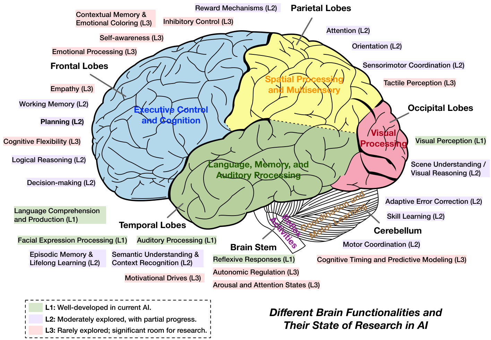  
Figure 1.l:Illustration ofkey human brain functionalities grouped by majorbrain regions,annotatedaccording to their current exploration levelin AIresearch.This figurehighlights existing achievements,gaps,and potentialoppotunities for advancing artificial intelligence toward more comprehensive, brain-inspired capabilities.  

Parietal Lobe: Spatial Processing and Multisensory Integration The parietal lobes integrate multisensory inputs, facilitating attention(L2),spatialorientation (L2),andsensorimotor coordination (L2)[16].AIresearch in robotics and computer vision addresses similar challenges,employing techniques likesimultaneous localization and mapping (SLAM).Nonetheless, AI stillacks the seamless and real-time integration seen in humans.Furthermore, detailed tactile perception (L3)remains largely unexplored and offers considerable potential, particularly for robotics and prosthetics applications.  

Occipital Lobe: Visual Processing Specialized in visual perception (Ll),the occipitallobe efficiently processes visual stimulithrough hierarchical structures[13].AIexcels inbasicvisualrecognitiontasks,achieving human-levelor suprior performance using deep neural networks and vision transformers [15]. However, advanced capabilities such as contextual scene understanding (L2)and abstract visual reasoning remain challenging and are only moderately developed.  

Temporal Lobe: Language,Memory,and Auditory Processing The temporal lobes facilitate auditory processing (L1), language comprehension (L1), memory formation (L2), and semantic understanding (L2)[16].AI has notably advanced inlanguage and auditory processing,demonstrated by large language models (LLMs)capable of near-human speech recognition and language generation. However, robust episodic memory and lifelong learning capabilitiesremain limited, with AI systems frequently encountering issues like catastrophic forgeting.Grounding semantic understanding in multimodal experiences continues to be an active area of research.  

Cerebellum: Coordination and Motor Learning The cerebellum primarily supports motor coordination (L2), precise skillearning (L2),and adaptive error correction (L2),with emergingroles incognitive timing and predictive modeling (cognitive timing, L3)[13]. Al-based robotics has achieved limited successes in emulating human-like dexterity. Real-time adaptive control remains challenging,though current research in reinforcement learning and meta-leaning shows promising initialresults.Cognitive functions of the cerebellum represent an underexplored yet promising frontier.  

Brainstem: Autonomic Regulation and Reflexive Control The brainstem manages essential life-sustaining autonomic functions (L3)andrapid reflexive responses (L1),suchas basic motor reflexes[13].AI includes engineered reflexiveresponses,likeautomaticbraking inautonomous vehicles,ypically predefinedratherthanlearned.In contrast, the complexityof autonomic regulation and dynamic arousal states remains largely unexplored in AI,andtheir relevance may be limited due to fundamental differences between biological and artificial systems.  

Limbic System: Emotion, Empathy, and Motivation The limbic system,comprising the amygdala and hippocampus, governs emotional processing (L3),reward mechanisms (L2),empathy (L3),stress regulation (L3),and motivationaldrives (L3)[13].AI'sreinforcementlearning algorithmsemulatereward-basedlearning superficialy,but nuanced emotional comprehension, genuine empathy, and internal motivational states remain significantly underdeveloped. Ethical concerns regarding emotional manipulation highlight the need for careful and responsible exploration.  

Bridging Brain-Like Functions and Building Beneficial AI Until now, wehave witnessed the gap between human brain and machine intellgence.Neverthelesstheobjectiveisnot necessarilytoreplicateeveryfacetof humancognition within artificialintelligence systems.Rather,ouroverarching aimshould betodevelopintelligent agents thatare useful, ethical,safe,andbeneficialtosciety.Bycticallymparinghumanandartifcalintellgence,wehighlighttheexiting gapsand illuminate promising directions forinnovation.Thiscomparative perspectiveallows us toselectively integrate beneficial aspects of human cognition,such as energy-efficient processing, lifelong adaptive learning, emotional grounding,andrichcreativity,while simultaneously innovating beyond human limitations.Ultimately, this aproach aims to foster the creation of more capable, resilient, and responsible AI systems.  

Furthermore,it is vital toconsider the evolving role ofhumans within ahybridHuman-AI society.The goal of AI should notbeto replace human roles entirely,butrather to augment and empowerhuman abilities,complementing human skills and judgment inareas where AIexcels,such as handling vast datasets,performing rapidcalculations,and automatingrepetitivetasks.Human oversight andinterpretabilityare essntialtoensure that powerfulAIsystemsremain controllable and aligned withhumanvalues andethical standards.Thus,thecoreobjective must bethe development of AI technologies that are transparent, interpretable, and responsive to human guidance.  

Human-centered AI design emphasizes collaboration, safety, and social responsibility, ensuring technological advancement proceeds in acontrolled,reliable manner. By placing humans at the centerof the AI ecosystem, wecan harness Al'spotentialtoenhancehuman productivitycreativity,anddecisionmakingfacilitating technicaland societal progress without compromising human autonomy or dignity. Ultimately,athoughtfulintegration of human intelligence and AI capabilities can pave the way for a sustainable, equitable, and prosperous future.  

# 1.3 A Modular and Brain-Inspired AI Agent Framework  

One core issue in theLLMera isthelackofaunifiedframeworkthat integrates therichcognitive and functional components required byadvanced agents.While LLMsoffer exceptionallanguage reasoning capabilities, many current agent designs remain ad hoc-they incorporate modules like perception, memory,or planning in a piecemeal fashion, failing to approximate the well-coordinatedspecialization seen in biological systems such as the human brain. Unlike current LM agents,the human brain seamlessy balances perception, memory,reasoning,and actionthrough distinct yet interconnectedregions,facilitating adaptive responses tocomplex stimuli.LLM-driven agents,bycontrastoften stumblewhen tasks require cross-domain or multimodal integration,highlighting the needfora more holistic approach akin to thebrain'sfunctional diversityMotivated bythese paralls,our survey advocates drawing inspiration fromthe human brain to systematically analyze and design agent frameworks.This perspective shows that biological systems achieve general inteligence byblending specializedcomponents(for perception,reasoning,action,etc.)inatightly integrated fashion-an approach that could serve as a blueprint for strengthening current LLM-based agents.  

Neuroscientificresearchreveals thatthebrain leverages bothrational circuits(e.g.,the neocortex,enabling deliberation and planning)and emotional circuits (e.g.,the limbic system)to guide decision-making.Memory formation involves the hippocampus andcortical mechanisms,while reward signals,mediated by dopaminergic andother neuromodulatory pathways,reinforce behavior and learning.These biologicalinsights inspire several design principles for AI agents, including but not limited to:  

Table 1.2:Notation summary forthe revised agent framework,highlighting separate learning and reasoning function: within the overall cognition process.   

<html><body><table><tr><td>Symbol</td><td>Meaning</td></tr><tr><td>W</td><td>The world with society systems that encapsulate both environment and intelligent beings (AI or human).</td></tr><tr><td>S</td><td> State space of the environment.</td></tr><tr><td> St ∈S</td><td>Environment's state at time t.</td></tr><tr><td></td><td>Observation space.</td></tr><tr><td>Ot∈O</td><td>Observation at time t (potentially shaped by attention or other perception filters).</td></tr><tr><td>A</td><td>Agent's action space.</td></tr><tr><td>at∈A</td><td>Action output by the agent at time t. This can be an external (physical) action or an internal (mental) action such as planning or decision-making.</td></tr><tr><td>M</td><td>Space of all mental states.</td></tr><tr><td>Mt∈M</td><td>Agent's mental state at time t, encompassing sub-components (memory, emotion, etc.).</td></tr><tr><td>Mmem</td><td>Memory component in Mt (e.g., short-term or long-term knowledge).</td></tr><tr><td>Mwm</td><td>World model component in Mt (internal representation of how the environment evolves).</td></tr><tr><td>Memo</td><td>Emotion component in Mt (internal valence, arousal, or affective states).</td></tr><tr><td>Mgoal</td><td>Goal component in Mt (objectives, desired outcomes, intentions).</td></tr><tr><td>Mrew</td><td>Reward/Learning signals in Mt (drives updates to preferences, values, or policy).</td></tr><tr><td>L</td><td>Learning function: L : M × A× O -→ M. Responsible for updating or learning the next mental state (e.g., memory, world model, emotion), based on the previous mental state Mt-1,the previous action at-1, and the new observation ot. Reflects how the agent acquires or revises knowledge, skills, or preferences.</td></tr><tr><td>R</td><td>Reasoning function: R : M -→ A. Responsible for deriving the next action at given the updated mental state Mt. Can involve planning, decision-making, or other internal logic.</td></tr><tr><td>C</td><td>Cognition function: C : M × A × O → M × A. Encapsulates both learning (L) and reasoning (R). Concretely, (Mt,at) = C(Mt-1,at-1,Ot) means the agent first learns the new mental state Mt = L(Mt-1,at-1,Ot),then reasons about the next action at = R(Mt).</td></tr><tr><td>E</td><td>Action execution (effectors): E : A -→ A.(Optional) transforms or finalizes at before applying it to the environment (e.g., converting a high-level command into low-level motor signals).</td></tr><tr><td>T</td><td>Environment transition: T : S × A -→ S. Defines how the environment state evolves from (st, at) to St+1.</td></tr></table></body></html>  

·Parallel, Multi-Modal Processing: The brain processes visual, auditory, and other sensory inputs in parallel through specialized cortical areas,integrating them in associative regions.Similarly, AI agents benefit from parallel processing of diverse sensor streams,fusing them in later stages for coherent understanding. · Hierarchical and Distributed Cognition: Reasoning, planning, emotional regulation, and motor control involve interactions between cortical and subcortical regions.Analogously, AI agents can employ modular architectures with subsystems dedicated to rational inference, emotional appraisal, and memory. ·Attention Mechanisms: Human attention prioritizes sensory data based on context, goals, and emotions.AI agents can replicate this by modulating perception through learned atention policies, dynamically adjusting focus based on internal states.  

· Reward and Emotional Integration: Emotions are not merely noise but integral to decision-making, modulating priorities,enhancing vigilance, and guiding learing. Reward-driven plasticity facilitates habit formation and skill acquisition, a concept critical to reinforcement learning in AI agents. ·Goal Setting and Tool Usage: The human prefrontal cortex excels at setting abstract goals and planning action sequences, including tool uses. Similarly, AI agents require robust goal-management systems and adaptive action repertoires, driven by external rewards and intrinsic motivations.  

nese principles form the foundation of our proposed brain-inspired agent framework, where biological mechanisms rve as inspiration rather than direct replication.  

In the following sections,weoutline ourframework'skeyconcepts,introducing aunifiedagent architecture basedon the perception-cognition-action loop enriched byreward signals andlearning processes.Each subsystem is carefully definedandinterconnectedtoensure transparencyinhow memory,world modelsemotions,goals,rewards, andleaing interact. We formalize cognition as a generalreasoning mechanism, with planning and decision-making framed as specific“mentalactions"shaping behavior.Connections toestablished theories,such as Minsky's Societyof Mind[17], Buzsaki's inside-out perspective[18],and Bayesianactive inference[19],areexplored tohighlight the framework's generality and biological plausibility.  

  
Figure 1.2: An overview of our general framework for describing an intelligent agent loop and agent society.  

# 1.3.1 Core Concepts and Notations in the Agent Loop  

Our architecture operates atthreeconceptuallevels:Society,Environment,and Agent.The Agent is then decomposed into three main subsystems: Perception, Cognition,and Action. Within Cognition, we identify key submodules: memory,world model,emotional state,goals,reward,learning,and reasoning processes (including“planning"and “decision-making"as specialactions produced with reasoning).Attention is primarilyhandled within perception and cognition. Before presenting the formal loop, we summarize our symbols in Table 1.2.  

In the following, based on the notations in Table 1.2, we present our proposed agent loop.  

# The Agent Loop  

An intelligent agent operates in discrete time steps $t$ , continuously interacting with its environment. At each step, the following processes occur:  

1. Environment State $(s_{t}\in S)$ ！ The environment is in state $s_{t}$  

2. Perception (P): The agent perceives the environment to generate observations $o_{t}$  

$$
o_{t}=\mathrm{P}(s_{t},M_{t-1}),
$$  

where $M_{t-1}$ guides selective attention and filtering.  

3. Cognition (C): Updates mental state and selects actions:  

$$
\begin{array}{r}{\big(M_{t},a_{t}\big)=\mathrm{C}(M_{t-1},a_{t-1},o_{t}).}\end{array}
$$  

where $M_{t}$ encapsulates different sub-states:  

$$
M_{t}=\{M_{t}^{\mathrm{mem}},M_{t}^{\mathrm{wn}},M_{t}^{\mathrm{emo}},M_{t}^{\mathrm{goal}},M_{t}^{\mathrm{rew}},\cdot\cdot\cdot\}.
$$  

Cognition consists of:  

Learning (L): Updates mental state based on observations:  

$$
M_{t}=\operatorname{L}(M_{t-1},a_{t-1},o_{t}).
$$  

· Reasoning (R): Determines the next action:  

$$
a_{t}=\mathrm{R}(M_{t}),
$$  

which may be:  

- External Actions, directly affecting the environment. : Internal Actions, including: $^*$ Planning: Internal sequence of future actions. $^*$ Decision-making: Choosing the best action from available options.  

4. Action Execution (E): Transforms action $a_{t}$ into executable form:  

$$
a_{t}^{\prime}=\operatorname{E}(a_{t}).
$$  

5. Environment Transition (T): The environment responds to the agent's action:  

$$
s_{t+1}=\mathrm{T}(s_{t},a_{t}^{\prime}).
$$  

In multi-agent scenarios, each agent $i$ maintains individual states $(M_{t}^{i},a_{t}^{i},o_{t}^{i})$ , and the environment collectively updates based on all agents' actions. At broader scales (AI societies or worlds, $\boldsymbol{\mathcal{W}}$ ), agents interact within diverse social systems (e.g.,economic, communication, or transportation),forming complex societal structures.  

Figure l.2illustrates our agent framework,presenting the coreconcepts anddiffrent types of informationorcontrol flows among them. Until now, wehave presentedabrain-inspired agent framework that integrates biologicalinsights into aformal Perception-Cognition-Action loop.By decomposing cognition into modules for memory, world modeling, emotion,goals,reward-basedlearning,andreasoning,wecapture essential parallels withthehuman brain's hierarchical and reward-driven processes.Critically,attention isincluded inthe looptoenableselective filteringbased on interal states.Furthermore,planning and decision-makingcan be viewed asdistinct internal(mental)actions thateither refine internalrepresentations or select external behaviors.Our framework naturally extends classcalagent architectures, providing a multi-level structure that integrates emotional and rational processes as wellas robust, reward-driven learning across short and long timescales.  

Society and Social Systems.In many real-world scenarios,agents do not merely interact with a static environment but operate within abroader society,comprising various social systems suchas financial markets,legalframeworks, politicalinstitutions,educationalnetworks,andculturalnorms.These structures shape andconstrain agents"behaviors by defining rules, incentives,and shared resources.For example,a financial system dictates how economictransactions and resource allocations occur, while a political system provides governance mechanisms and regulatory constraints. Together,these socialsystems create a layeredcontext in which agents must adaptivelylearn,reason,and actboth to satisfy theirinternal goalsand tocomply (or strategicallyengage)withexternal societalrules.In turn,the actionsof these agents feed back into the social systems,potentialy altering norms, policies,or resource distributions.  

A FormalDefinition of Foundation Agents.Building onthese insights and our visionof robust,adaptive intellgence, we nowformally introduce theconcept ofa Foundation Agent.Unlike traditionalagent definitions that focus primarily on immediate sensory-action loops,a Foundation Agent embodies sustained autonomy,adaptability, and purposeful behavior, emphasizing the integration of internal cognitive processes across diverse environments.  

# Definition of Foundation Agent  

A Foundation Agent is an autonomous, adaptive intelligent system designed to actively perceive diverse signals from its environment, continuously learn from experiences to refine and update structured internal states (such as memory, world models, goals, emotional states, and reward signals), and reason about purposeful actions—both external and internal—to autonomously navigate toward complex, long-term objectives.  

More concretely, a Foundation Agent possesses the following core capabilities: 1. Active and Multimodal Perception: It continuously and selectively perceives environmental data from multiple modalities (textual, visual, embodied, or virtual). 2. Dynamic Cognitive Adaptation: It maintains, updates, and autonomously optimizes a rich internal mental state (memory, goals, emotional states, reward mechanisms, and comprehensive world models) through learning that integrates new observations and experiences. 3. Autonomous Reasoning and Goal-Directed Planning: It proactively engages in sophisticated reasoning processes, including long-term planning and decision-making, to derive goal-aligned strategies. 4. Purposeful Action Generation: It autonomously generates and executes purposeful actions, which can be external (physical movements, digital interactions, communication with other agents or humans) or internal (strategic planning, self-reflection, optimization of cognitive structures), systematically shaping its environment and future cognition to fulfill complex objectives. 5. Collaborative Multi-Agent Structure: It can operate within multi-agent or agent society structures, collaboratively forming teams or communities of agents that collectively accomplish complex tasks and goals beyond individual capabilities.  

This definition highlights three essential pilars distinguishing Foundation Agents: sustained autonomy (operating independently toward long-term goals without step-by-step human intervention),adaptive learning (evolving internalrepresentations continually over diverse experiences),and purposefulreasoning (generating actions guided by complex, internally maintained goals and values). Foundation Agents thus represent a fundamental shift from traditional agents by integrating deep cognitive structures, multimodal processing capabilities, and proactive, sustained self-optimization, enabling them to function effectively across a wide range of environments and domains.  

Unlike classcal definitions,which often frame agents primarily in terms of simple perception-action loops("perceive and act"[20])our notion of Foundation Agents emphasizes the depthandintegration of internalcognitive processes. Foundation Agents not only perceive their environment and perform immediate actions but also possess an evolving, goal-oriented cognition—continuously adapting memory structures, world models,emotional and reward states, and autonomously refining their strategies through reasoning.This internalcognitiverichnessallows Foundation Agents to autonomously decompose complex,abstract goals into actionable tasks,strategically explore their environments,and dynamically adjust their behavior andcognitive resources.Our unified perception-cognition-actionframework thus accommodates and explicitly models these sophisticated cognitive capabilities,recognizing internal(mental)actionson par with external(physical ordigital)interactions,facilitating abroadrange ofembodiments,fromphysicalrobots to software-based or purely textual intelligent agents.  

# 1.3.2 Biological Inspirations  

Although our agent model is fundamentally computational, each submodule draws inspiration from well-studied biologicalcounterparts in the human brain.Below, we discussthese analogies in amanner that highlights boththe neuroscientific basis and the flexibility afforded by AI implementations.  

Memory (Hippocampus and Neocortex).Decades of neuroscience researchhave linked the hippocampus to episodic memory formation, while corticalregions are known tohouse semantic and proceduralknowledge[21,22].In humans, these memory subsystems cooperate to manage both short-term encoding and long-term consolidation. Our memory component, $M_{t}^{\mathrm{mem}}$ , similarly aims to capture multi-scale learning by storing recent experiences and knowledge. This can be realizedthrougheither neuralnetwork weights(long-term)orexplicit bufers (short-term),thereby mirroring the hippocampal-cortical interplay.  

World Model(Predictive Processing).A prominent theory incognitive neuroscience holds thatthe cortexoperates as a predictive machine,continually comparing incoming sensory data with generated expectations [23,19].The world model $M_{t}^{\mathrm{wm}}$ reflects this idea by maintaining an internal representation of how the environment evolves over time. Just as cortical circuits integrate multisensory data to update these internal models,our framework allows $M_{t}^{\mathrm{wm}}$ to be refined upon each new observation andrelevant reward oremotionalcues,ofering aBayesian or free-energy perspective on environmental dynamics.  

Emotion (Limbic System).Emotions, mediated by structures like the amygdala,hypothalamus, and limbic system, significantlymodulate attention,learningrates,and decision-making thresholds[24,25].By introducing anemotion component $M_{t}^{\mathrm{{emo}}}$ ,our model captures how internal valence or arousal states can shift an agent's focus and behavior. Althoughcomputational“emotions"are neither ful analogous to biological affct nor conscious feelings,they can guide adaptive heuristics-such as prioritizing urgent goals or responding quickly to perceived threats.  

Goals and Reward (Prefrontal & Subcortical Circuits).Humans excel atformingabstract, long-term goals, an ability often associated withprefrontalcortexfunction[26,27].In paralel, subcorticalcircuits—particularlydopaminergic pathways-drive reinforcement signals that shape motivation and habit learning [28]. Our agent includes $M_{t}^{\mathrm{goal}}$ for storing objectives and $M_{t}^{\mathrm{rew}}$ for encoding reward signals, thus enabling a continuous feedback loop where goal formation andreward-based adaptation reinforce eachother.This mechanism allows for planned action sequences,tool usage, and more nuanced social interactions.  

Reasoning, Planning, and Decision-Making (Prefrontal Cortex).Finaly,the human prefrontal cortex integrates information from memory,sensory inputs,emotions, and reward pathways to carry out higher-order cognitive processes—suchaslogicalreasoning,planning,andexecutivecontrol[29,30]. Inour agentframework,thesecapabilities are subsumed by the reasoning sub-function, which-through modules like PlanFn and Decide—selects and executes actions (whether physical or purely mental).Bydistinguishing planning from on-the-fly decision-making,we capture how the agentcansimulatefuture scenarios,weighoutcomes,andthencommit toacourseofaction,akintothe flexible orchestration observed in prefrontal circuits.  

# 1.3.3 Connections to Existing Theories  

3eyond these explicit neurobiological parallels,our architecture resonates with several important theories in AI, :ognitive science, and neuroscience.  

Classic Perception-Cognition-Action Cycle.We extend the traditional sense-think-act cycle outlined by [20] incorporating explicit mechanisms forattention(inP),leaming andemotion (in C),andreward signals that persist over time.This explicitness makes it easier to analyze how an agent's internal states and prior actions shape subsequent perception and cognition.  

Minsky's“Society of Mind".[17] argued that intellgence arises from an ensembleof specialized“agents"within a mind. Our submodules- $\cdot\mathrm{C}_{\mathrm{mem}}$ $\mathrm{C}_{\mathrm{wm}}$ $\mathrm{C}_{\mathrm{emo}}$ $\mathrm{C_{goal}}$ goal，C $\mathrm{C}_{\mathrm{rew}}$ -echo this decomposition, distributing key functions (memory,prediction,emotionalevaluation, goal-seting,etc.)acrossseparate yetinteractingcomponents.Inabroader “society"context,each agent (or sub-agent)could coordinate cooperativelyor competitively, much like Minsky's internal agencies.Recent work on naturallanguage-based societies of mind[31] supports that agentic systemscan be represented using the original society-of-mindtheory,andcould incorporate socialstructures and economic models among agents.  

Buzsaki's Inside-Out Perspective.Neuroscientists [18]contend that the brain actively constructs and updates its perception instead of merely receiving inputs. In our model, $M_{t-1}$ —including emotional states, reward signals, and goals—directly influences the perception map P.This supports the inside-out stance that an agent's internal context drives the way it samples and interprets the environment, rather than passively reacting to it.  

Partially observable Markov decision process (POMDP).Our framework can be viewed as a generalization of the classical Partially Observable Markov Decision Process (POMDP) in several ways.First, whereas a POMDP specifies a probabilistic transition function $\textstyle P(s_{t+1}\mid s_{t},a_{t})$ over a(possibly finite) state space, we retain an environment transition T withoutrestricting it toa purely probabilisticor finite form,allowing forarbitraryoreven deterministic mappings. Second, in the standard POMDP setting, reward is typically defined as a scalar function of $(s_{t},a_{t})$ (possibly discounted over time). By contrast, we place reward signals inside the agent's mental state $(M_{t}^{\mathrm{rew}})$ , letting them depend on—and co-evolve with-goals,emotion, and the world model rather than enforcing a single externally defined objective. Third,whilePOMDPagents generallyselect actions by maximizing anexpectedreturn (value function)ourreasoning sub-process is broader. It accounts for memory,emotion, and other mental-state factors,accommodating heuristic or socially driven decisions rather than strictly value-based choices.Finally,a POMDP does not explicitly define cognitive submodules such as memory oremotion-these must be collapsed into a monolithic“belief state". In our framework,eachsub-component (memory, world model,emotion, goals,reward) is explicitly modeled and updated, mirroring biologicall inspired views of cognition. Hence,although our approach recovers the POMDP formulation as a specialcase (byenforcing aprobabilistic T,ascalar reward,andaminimal mental state),itadmits aricher varietyof environment transitions, internal states, and decision mechanisms.  

Active Inference and the Bayesian Brain. Active inference, aunifying framework advanced by[19],suggests that agents continually update internal generative models to minimize prediction error (or“free energy"). Our use of $M^{\mathrm{wm}}$ and $M^{\mathrm{rew}}$ , together with planning and decision-making modules, can be interpreted in Bayesian terms. The agent atempts toreduce surprise byaligning its world modelwithnew dataand bychoosing actions that conform topredicted (or desired) outcomes.  

Biological Plausibility & Generality.While the mapping between brain circuits and agent submodules is made at a high level,it ofers an approach that isat once biologically inspired and modularly agnostic.Memory,emotion, goals,andrewardcan each be implemented by various AI paradigms—symbolic methods, neural networks,or hybrid approaches—thus preserving flexibility.By integrating these key ideas from neuroscience,cognitive science,and AI, we arrive atageneralframework thatcaptures theessentialpropertiesofintelligent behaviorwithout overconstraining implementation details.  

# 1.4 Navigating This Survey  

This survey isstructured to provide acomprehensive, modular, and interdisciplinary examination of intellgent agents, drawing inspiration fromcognitive science,neuroscience,andother disciplines to guide the next waveof advancements in AI.Whilemanyexisting surveys[32,33,34,35,36,37,38,39,40]offr valuableinsights intovarious aspects of agent research,we provide adetailedcomparison oftheir focalpoints in Table1.3.Our work distinguishes itself by systematically comparing biological cognition with computational frameworks to identify synergies,gaps,and opportunities for innovation.By bridging thesedomains,we aim to providea unique perspective that highlights not only where agents excel but also where significant advancements are needed to unlock their fullpotential.  

Table 1.3: Summary of existing reviews with diferent focal points. ·indicates primary focus while $\scriptscriptstyle\mathrm{~o~}$ indicates secondary or minor focus.   

<html><body><table><tr><td> Survey</td><td>Cognition</td><td>Memory</td><td>World Model</td><td>Reward</td><td>Action</td><td>Self Evolve</td><td>MultiAgent</td><td>Safety</td></tr><tr><td>Zhang et al. [39]</td><td>·</td><td>·</td><td>0</td><td>0</td><td>0</td><td>·</td><td>0</td><td>0</td></tr><tr><td>Guo et al. [38]</td><td>·</td><td>·</td><td>0</td><td>0</td><td>0</td><td>·</td><td>·</td><td>0</td></tr><tr><td>Yu et al. [40]</td><td>·</td><td>·</td><td>0</td><td>0</td><td>·</td><td>0</td><td>·</td><td>·</td></tr><tr><td>Wang et al. [35]</td><td>·</td><td>·</td><td>0</td><td>0</td><td>·</td><td>0</td><td>·</td><td>0</td></tr><tr><td> Masterman et al. [37]</td><td>·</td><td>·</td><td>0</td><td>0</td><td>·</td><td>0</td><td>·</td><td>0</td></tr><tr><td>Xi et al. [34]</td><td>·</td><td>·</td><td>0</td><td>0</td><td>·</td><td>·</td><td>·</td><td>·</td></tr><tr><td>Huang et al. [33]</td><td>·</td><td>·</td><td>0</td><td>·</td><td>·</td><td>·</td><td>·</td><td>·</td></tr><tr><td>Durante et al. [32]</td><td>·</td><td>·</td><td>0</td><td>·</td><td>·</td><td>·</td><td>·</td><td>·</td></tr><tr><td>This Manuscript</td><td>·</td><td>·</td><td>·</td><td>·</td><td>·</td><td>·</td><td>·</td><td>·</td></tr></table></body></html>  

The survey is divided into four key parts:  

·In Part I: Modular Design of Inteligent Agents, we introduce the core modules of agents, including the cognition module,which serves as the“brain"of the agent; the perception systems for interpreting sensory input; as well as the action systems for interacting with the external world. Within the cognition system, we further discuss the memory, world modeling,emotion, goal, and reward systems, analyzing their current progress, limitations, and research challenges.  

·In Part II:Self-Enhancement in Intelligent Agents, we shift focus to the capability of agents to evolve and optimize themselves. We explore mechanisms like adaptive learning,self-reflection, and feedback-driven improvement,inspired bythe human ability to grow and refine skills over time.This part also addresses the importance of dynamic memory systems and continuous knowledge integration for agents to remain relevant and effective in changing environments.   
·In Part II: Collaborative and Evolutionary Intelligent Systems, we examine how agents interact with each other and their environments to solve complex, large-scale problems. We discuss multi-agent systems, highlighting their applications in fields such as robotics, medical systems and scientific discovery. This part explores multi-agent system topologies and agent protocol, tracing the evolution of communication and collaboration from static to dynamic frameworks. We align agents with human collaboration paradigms, examining how interaction patterns shape the co-evolution of inteligence and how multi-agent systems adapt their decision-making in various collaborative settings to solve complex challenges through collective intelligence.   
·Finally,in Part IV: Building Safe and Beneficial AI, we provide a comprehensive analysis of the security landscape for LLM-based agents. We introduce a framework categorizing threats as intrinsic or extrinsic. Intrinsic vulnerabilities arise from within the agent's architecture: the core LLM“brain", and the perception and action modules that enable interactions with the world. Extrinsic risks stem from the agent's engagement with memory systems, other agents,and the broader environment. This part not only formalizes and analyzes these vulnerabilities,detailing specific atack vectors like jailbreaking and prompt injection, but alsoreviews a range of defense mechanisms. Moreover, we explore future directions,including superalignment techniques and the scaling law of AI safety-the interplay between capability and risk.  

By weaving togetherthese threads,our survey aims to provide aholistic perspectiveonthecurrnt state of intelligent agents andaforward-lookingroadmapfortheir development.Ourunique focus onintegratingcognitive science insights with computational design principlespositions this survey asa foundationalresource forresearchers seeking to design agents that are notonly powerfulandeffcient butalsoadaptive,ethical,anddeplyalignedwiththecomplexitiesof human society.  

# Part I  

# Core Components of Intelligent Agents  

# Chapter 2  

# Cognition  

Human cognition represents a sophisticated information processing system that enables perception, reasoning,and goal-directed behavior through the orchestratedoperation of multiple specialized neuralcircuits[98].This cognitive architecture operates through mental states,which serve asthefoundation where learning and reasoning occur.The remarkableabilitytoprocess information acrossdiffrentlevels of abstractionandadapt tonovelsituations isacrucial inspiration for LLM agents [27].  

The cognitive system exhibits several fundamental architectural properties reflected in Figure 1.1. First, learning functions acrossdiffrent mentalstate spaces:itcanoccur holisticallyacross frontallobes(supporting executivecontrol and cognition)and temporallobes(responsible forlanguage, memory,andauditory processing)orfocus on specific aspectsfor targeted improvement as shown bythe variedresearchlevels in the figure.Second,reasoning emerges in distinct patterns: itcan follow structured templates for systematic problem-solving supported bylogicalreasoning and cognitive flexibility in the frontallobes,orappear inunstructured forms forflexiblethinking,particularlyevident in decision-making andexecutivecontrolfunctions.Third,thesystemdemonstrates remarkable adaptabilitycontinuously updating its mentalstates through experiencewhileleveraging both supervisedfeedback(as inadaptive errorcorrection in the cerebellum)and unsupervised environmentalstatistics,reflected inthediffrent exploration stagesof various cognitive functions shown in the figure [99].  

Thesecognitive processes are supportedbya modularorganization,composed ofdistinct but interconnectedcomponents that form a cohesive system[10o].These modules include perception systems that transform raw sensory data into meaningfulrepresentations, memory systems that provide the substrate for storing andretrieving information, world models that support future scenariosimulation,reward signalsthat guide refinement of behavior through reinforcement, emotionsystems that modulate attention andresource allocation,reasoning systems thatformulate decisions,andaction systems that translate decisions into environmental interactions.  

While human cognition implements these properties through complex neural architectures shaped by evolution, LLM agents attempt to approximate similar functions using large-scale neural models and algorithmic techniques. Understanding this biological-artificialparalleliscrucial fordeveloping morecapableagents[1l],asithighlights both the achievements and limitations of current systems comparedto human cognition.Significant differences remain in areas such as adaptability, generalization, and contextual understanding.  

In this section, we first explore Learning,examining both the spaces where it occurs within mental states and the specific objectives it serves.Subsequently, we investigate Reasoning, analyzing both structured and unstructured approaches, before concluding with adedicated exploration of planning capabilities as a special reasoning action.  

# 2.1 Learning  

Learning represents the fundamental process through which intelligent agents transform experiences into knowledge within their mental states.This transformation occurs across different cognitive spaces,fom holistic updates across the full mental state torefinement of specificcognitivecomponents.The scope oflearning encompasses remarkable capacities that serve diferent objectives:enhancing perceptual understanding,improving reasoning capabilities, and developing richer world understanding.  

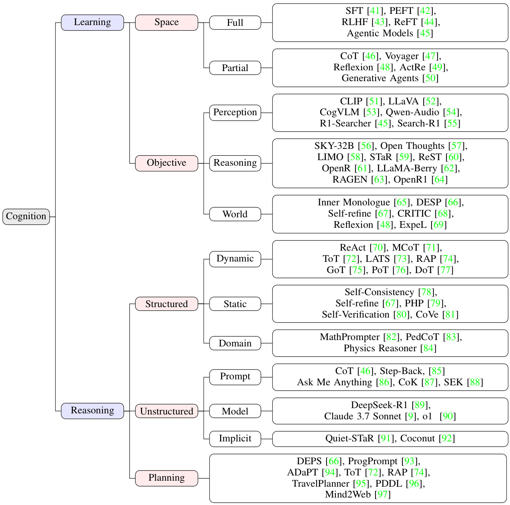  
Figure 2.1: Illustrative Taxonomy of Cognition system, including learning and reasoning paradigm.  

Humanlearning operates across multiple spaces and objectives through the brain's adaptable neural networks. The brain coordinates learming acrossits entire network through integrated systems:the hippocampus facilitates rapid encoding ofepisodicexperiences, thecerebellum supports supervisedlearningforprecisemotorskill,thebasalganglia enable reinforcement learning through dopaminergic reward signals,andcorticalregions facilitate unsupervised pattern extraction[99].Atmore focusedlevels,specific neuralcircuitscan undergotargetedadaptation,allowingforspecialized skill development and knowledge acquisition. These systems work together on different timescales,ranging from immediate responses tolifelong development, while being influenced byfactors like attention,emotions,and social environment [27].  

LLM agents, while fundamentally diffrent in architecture, implement analogous learning processes across their mental state spaces.At thecomprehensive level,they acquire broad knowledge through pre-training on massive datasets,demonstrating a form of unsupervised learning.At more focused levels, theyrefine specific capabilities through parameter-updating mechanisms like supervised fine-tuning and reinforcementlearning. Uniquely, they also demonstrate in-contextlearning capabilities,adapting to noveltaskswithout parameter changes by leveraging context within their atention window:a capability that mirrors aspects of human working memory but operates through fundamentally different mechanisms.  

The comparison between human and artificial learning systems provides valuable insights for developing more capable,adaptive agents.Humanlearning demonstrates notable characteristics in eficiency,contextualization, and integration with emotional systems,while LLM-basedapproaches show distinct capabilities in processng large datasets, representing formal knowledge,and synthesizing information acrossdomains.These complementary strengths suggest productive directions for research.As we explorethe foundations of learning,we first examine the spaces where learning occurs within mental states,folowed byan analysisof the specificobjectives thatdrivelearning proceses.  

Table 2.1: Summary of Learning Methods with Different State Modifications. $\bullet$ indicates primary impact while $\scriptscriptstyle\mathrm{~o~}$ indicates secondary or no direct impact.   

<html><body><table><tr><td>Method</td><td>Model</td><td>Perception</td><td>Reasoning</td><td>Memory</td><td>Reward</td><td>World Model</td></tr><tr><td>Voyager [47]</td><td>0</td><td>0</td><td></td><td>·</td><td></td><td>0</td></tr><tr><td>Generative Agents [50]</td><td>0</td><td></td><td>0</td><td>·</td><td>0</td><td>0</td></tr><tr><td>Learn-by-interact [102]</td><td>·</td><td>O</td><td></td><td>·</td><td></td><td></td></tr><tr><td>RAGEN[63]</td><td>·</td><td>0</td><td>·</td><td>0</td><td>·</td><td>0</td></tr><tr><td>DigiRL[103]</td><td>·</td><td>0</td><td>·</td><td>0</td><td>·</td><td>0</td></tr><tr><td>R1-Searcher [45]</td><td>·</td><td>·</td><td>·</td><td></td><td>·</td><td>0</td></tr><tr><td>RewardAgent [104]</td><td>·</td><td>0</td><td>0</td><td>0</td><td>·</td><td>0</td></tr><tr><td>Text2Reward [105]</td><td></td><td>0</td><td>0</td><td>0</td><td>·</td><td>0</td></tr><tr><td>ARAMP [106]</td><td>·</td><td></td><td>0</td><td>0</td><td>·</td><td>0</td></tr><tr><td>ActRe [49]</td><td>·</td><td></td><td>·</td><td>0</td><td>0</td><td>·</td></tr><tr><td>WebDreamer [107]</td><td>0</td><td>0</td><td>0</td><td>0</td><td>0</td><td>·</td></tr><tr><td>RAP [74]</td><td>0</td><td>0</td><td>0</td><td>0</td><td>0</td><td>·</td></tr><tr><td>AutoManual [108]</td><td>0</td><td>0</td><td>0</td><td>·</td><td>0</td><td>·</td></tr></table></body></html>  

# 2.1.1 Learning Space  

The learning approaches in LLMagents represent astructured, data-driven paradigm in contrast to the exploratory, emotionally-driven learningobserved in humans.While human learning often involves active curiosity,motivation,and emotionalreinforcement, LLM-based agents typicall learn through more formalized proceses,such as parameter updates during training or structured memory formation during exploration.Current agent architectures attemptto bridge this gapbyimplementing mechanisms that simulate aspects ofhuman learning while leveraging the strengths of computational systems.  

Leaning within an intellgent agent occurs across different spaces, encompassing both the underlying model $\theta$ and mental states $M$ ,where the former fundamentally supports the capabilities and limitations of the latter. Formally, we define an intelligent agent's internal state as a tuple ${\mathcal{T}}=(\theta,M)$ that includes both the model parameters and mental state components.The mental state can be further decomposed intodifferent structures as we illustrated in 1.2:  

$$
M=\{M^{m e m},M^{w m},M^{e m o},M^{g o a l},M^{r e w}\}
$$  

where $M^{m e m}$ represents memory, $M^{w m}$ denotes world model, $M^{e m o}$ indicates emotional state, $M^{g o a l}$ represents goals, and $M^{r e w}$ represents reward signals.  

Modifications to the underlying modelcan beviewed as fullmental state learning,as they fundamentally alter the agent's capabilities.While model-level modifications can affect diferent mental states to varying degrees,changes to the model'scontext window orexternal structures tend tofocus on specific mental state components.For instance, leaning experiences andskill fromthe environment primarilyinfluencememory,while leveraging the LLM's inherent predictive capabilities enhances the world model.  

Full Mental State Learning Fullmental state learming enhances thecapabilities of an agent through comprehensive modifications to the underlying model $\theta$ , which in turn affects all components of the mental state $M$ . This process begins with pre-training, which establishes the foundation of language models by acquiring vast world knowledge, analogous to how human babies absorb environmental information during development,though in a more structured and extensive manner.  

Post-training techniques represent the cornerstone for advancing agent capabilities.Similar tohow human brains are shaped byeducation,these techniques whileaffcting theentire model,can emphasize diffrent aspects ofcognitive development.Specificaly,various forms of tuning-basedlearning enable agents toacquiredomain-specificknowledge and logical reasoning capabilities. Supervised Fine-Tuning (SFT)[41] serves as the fundamental approach where models learnfrom human-labeled examples,encoding knowledge directly intothe model's weights.For computational effciency, Parameter-Efficient Fine-Tuning (PEFT) methods have emerged.Adapter-BERT[42]introduced modular designs that adapt models to downstream tasks without modifying allparameters, while Low-Rank Adaptation (LoRA) [109] achieves similarresults by decomposing weight updates into low-rank matrices,adjusting only a smallsubsetof effective parameters.  

Some agent capabilities are closelyconnectedto how wellthey align with human preferences, with alignment-based learning approaches modifying the modeltoreshape aspects of the agent's underlying representations.Reinforcement learning from human feedback (RLHF)[110] aligns models with human values by training a reward model on comparative judgments and usingthis to guide policy optimization.InstructGPT[43]demonstrated how this approach could dramatically improve consistency with user intent across diverse tasks.Direct Preference Optimization (DPO) [111] has further simplified this process byreformulating it as direct preference learning without explicit reward modeling, maintaining alignment quality while reducing computational complexity.  

Reinforcement learning (RL)presents a promising pathway for specialized learning in specific environments. RL has shown particular promise in enhancing reasoningcapabilities,essentially enabling the agent's underlying model to learn within the space of thought.Foundational works such as Reinforcement Fine-Tuning (ReFT)[44] enhance reasoning throughfine-tuning with automatically sampledreasoning paths under online reinforcement learning rewards. DeepSeek-R1[89]advances this approachthrough rule-based rewards and Group Relative Policy Optimization (GRPO) [112],while Kimik1.5[13]combinescontextualreinforcementlearning withoptimizedchain-of-thoughttechniques to improve both planning processes and inference eficiency. In specificenvironments, modifying models to enhance agentsunderstanding of actions and externalenvironments has proven effective,as demonstrated by DigiRL[103], which implements a two-stage reinforcement learning approach enabling agents to perform diverse commands on real-world Android device simulators.  

Recent works have attemptedto integrate agent action spaces directlyintomodeltraining[45,55],enabling learning of appropriate actions for diferent states through RL or SFT methods.This integration fundamentally affcts the agent's memory,reward understanding,and world modelcomprehension, pointing toward a promising direction forthe emergence of agentic models.  

Partial Mental State Learning While full mental state learning through model modifications provides comprehensive capability updates, learning focused on particular components of an agent's mental state $M$ represents another essential and oftenmoreeffcient approach.Such partial mental state learning can be achieved eitherthrough targeted model updates or through in-context adaptation without parameter changes.  

In-Context Learning (ICL)ilustrates how agents can effectively modify specific mental state components without modifying theentire model.This mechanism alows agents toadapt tonew tasks byleveraging examples orinstructions within their context window, paraleling human working memory's role in rapid task adaptation. Chain-of-Thought (CoT)[46] demonstrates the efectivenessof this approach, showing how agents can enhance specific cognitive capabilities while maintaining their base model parameters unchanged.  

The feasibilityofpartial mentalstate learning is evidenced throughvarious approaches targeting diffrent components such as memory $(M^{m e m})$ , reward $(M^{r e w})$ , and world model $(M^{w m})$ . Through normal communication and social interaction, Generative Agents [50] demonstrate how agents can accumulate andreplay memories,extracting highlevel insights to guide dynamic behavior planning. In environmentalinteraction scenarios, Voyager [47]showcases how agents cancontinuously update their skill library through direct engagement with the Minecraft environment, accumulating procedural knowledge without modelretraining.Learn-by-Interact[102]further extends this approach by synthesizing experientialdatathrough direct environmentalinteraction,eliminating the need for manual annotation or reinforcementlearning frameworks.Aditionally,agents can learn from their mistakes and improve throughreflection, as demonstratedbyReflexion[48],whichguides agents'futurethinkingandactions byobtainingtextualfeedback from repeated trial and error experiences.  

Modifications to reward and world models provide another example of partial mental state learning.ARMAP[106] refinesenvironmentalreward models bydistilling themfrom agent action trajectories,providing afoundation for further learning.AutoMC[114]constructs dense reward models through environmentalexploration tosupport agent behavior. Meanwhile,[107] explicitly leverages LLMs as world models to predict the impact of future actions,efectively modifying the agent's world understanding $(M^{w m})$ . ActRe[49] builds upon the language model's inherent world understanding to construct tasks from trajectories,enhancing the agent'scapabilities as botha world model and reasoning engine through iterative training.  

# 2.1.2 Learning Objective  

The learning processof intelligent agents manifests acrossallaspects of their interaction withthe environment.At the input level, agents lean tobeterperceive and parseenvironmentalinformation; attheprocessing level,agents lean how to conduct effctive reasoning based on existing knowledge orreasoningcapabilities; atthe comprehensionlevel, agents form and optimize their understanding of the world through continuous interaction.This multi-level learning objective framework enables agents toevolvecontinuouslyacross different dimensions,allowingthem tobetter handle complex and dynamic task environments.  

Learning for Better Perception The abilityto effectively perceive and processinformation fromthe environment is fundamentalto agent intelligence.Toenhance perceptualcapabilities,agents employtwo primary learning approaches: expanding multimodal perception and leveraging retrieval mechanisms.  

Multimodal perception learning enables agents to process and integrate diverse sensory inputs,similar to human multi-sensory integration butunconstrained bybiologicallimitations.Thiscapabilityhas evolved significantlythrough advances like CLIP[51],which pioneered the alignmentof visualandlinguistic representations in sharedembedding spaces.Building on this foundation, models like LLaVA [52] enhanced visual perception by training specialized projectors on image-text pairs, while CogVLM[53] advanced visual reasoning through unified representational architectures.  

The expansion of perceptual modalities continues across multiple sensory domains. In audio processing, QwenAudio[54] demonstrates theunified encoding of diverse acoustic information,from speech to environmental sounds. Recent work by[l15] has even ventured into tactile perception, developing datasets that align touch, vision, and languagerepresentations.These advancesenable agents toengage more comprehensively with both physicaland digital environments.  

Agents alsolearn to enhance their observationalcapabilities through retrieval mechanisms.Unlike human perception, which is constrained by immediate sensory input, agents can learn to accessand integrate information from vast external knowledge repositories.Retrieval-augmented approaches like RAG[116] enhance perceptual understanding by connecting immediate observations with relevant stored knowledge.  

Recent work on retrieval-based agents demonstrates the potential for enhancing active information acquisition capabilities.Search-ol[117] guides reasoning models to learn active retrievalthrough prompting,thereby expanding their knowledge boundaries.Taking this further,R1-Searcher[45]and Search-R1[55]directly incorporate retrieval capabilities into the model,enabling autonomous informationretrieval during the reasoning process.These advances suggest a promising direction for improving agent perception:enhancing model-level active perception capabilities to enrich the foundation for decision-making. This approach may represent a significant avenue for future agent development.  

Learning for Better Reasoning Reasoning serves as acritical bridge between an agent's mental state andits actions, making the abilityto reason effectively andthe development of reasoningcapabilitiesessentialfor intellgent agents. The foundation of reasoning in modern agents stems from two key elements: the rich world knowledge embedded in their underlying models, andtherobust logical frameworks supportedeither internallyorthroughcontext structuring. This makes learning for better reasoning a vital objective in agent development.  

The development ofreasoningcapabilities isdemonstratedthrough severalkeyphenomena.First,high-quality reasoning data directly enhances modelreasoning ability; second,suchhigh-qualitydata often requires verification orreward models foreffectivecuration; andthird,directreinforcementlearningonfoundation modelscanspontaneouslymanifest reasoning capabilities.  

The importance of reasoning in agent developmenthas been re-emphasized following therelease of theol series.A common approach involves collecting and distilling data from open/closed-source reasoning models. For instance, SKY-32B [56] distilled data from QWQ-32B [118] to train a 32B reasoning model at a cost of $\$450$ . Similarly, Open Thoughts[57]trainedBespoke-Stratos-32Batalowcost bydistiling and synthesizing datasets from R1.These studies demonstrate that even without complex algorithmic design,using reasoning data to perform Supervised Fine-Tuning (SFT) on base models can effectively activate reasoning capabilities.  

Another crucialinsight regarding data quality isthathighly structuredreasoningdata more effectively enables agents and language models tolearn reasoning proceses. Notably,LIMO[58]demonstrated that powerfulreasoning models could be built with extremely few data samples byconstructing long and efective reasoning chains for complex reasoning tasks.This insight stems fromtheirobservationthatlanguage models inherently possessufficient knowledge for reasoning but require high-quality reasoning paths to activate these capabilities.Supportingthis view, Liet al.  

[9]revealed thatboth Long CoTand Short CoTfundamentaly teach models to learn reasoning structures rather than specific content,suggesting that automated selection of high-qualityreasoning data may become an important future direction.  

One viable exploration approach involves firstconducting extensive searches,and then using verifiable environments or trainablereward models to provide feedback on reasoning trajectories,thereby filtering out high-qualityreasoning data.This approachhas ledtoseveralfamiliesof techniques thatleverage different feedbackmechanisms toimprove reasoning capabilities.  

The firstcategoryfollows thebootstrap paradigmexemplifiedbySTaR[59]anditsariantswhichimplement techniques where models generate step-by-step rationales and iteratively improve through fine-tuning on successful reasoning paths.This familyincludesQuiet-TaR[91],-STaR[120],andStar-Math[11],withthelaterspecificallenancing mathematicalreasoning through reinforcement learning principles.Byiteratively selecting correct reasoning paths for training, these methods achieve self-improvement through successive refinement cycles.  

The second category extends this paradigm by more explicitly incorporating reinforcement learning principles. The ReST family,beginning with the original ReST[60] introducing reinforced self-training,performs multiple attempts (typically 10) per sample and creates new training datasets from successful reasoning instances. ReST-EM[22] enhances the approach with expectation maximization, while ReST-MCTS[122]further integrates Monte Carlo Tree Search to enable improved reasoning capabilities through more sophisticated exploration strategies.  

Several approaches have introduced Policy Reward Models (PRMs)to provide quality feedback on reasoning paths. Methods like OpenR [61] and LLaMA-Berry [62] model reasoning tasks as Markov Decision Processes (MDPs) and leverage tree search to explore diverse reasoning paths while using PRMs for quality assessment.In domain-specific applications, methods like rStar-Math [121] and DeepSeekMath [112]have demonstrated success in mathematical problem-solvingthroughmulti-round self-iterationandbalancedexploration-exploitationstrategies.Forcode generation, ol-Coder[13]leveragesMCTStogeneratecode withreasoning proceses,whileMarco-ol[123]extends this approach to open-ended tasks.These implementations highlight how the synergy between MCTS and PRM achieves effective reasoning path exploration while maintaining solution quality through fine-grained supervision.  

Beyond data-driven approaches, reinforcement learning (RL) has demonstrated remarkable success in enhancing language modelsreasoning capabilities,as evidenced byrecent breakthroughs like DeepSeek R1[89]and Kimi-K-1.5 [113].The foundation of RL for LLMs can be traced to several pioneering frameworks: ReFT [44] introduced a combination of supervised fine-tuning and online reinforcement learning, while VeRL[124]established an opensourceframework supporting various RL algorithms for large-scale models up to 70B parameters.RFT[125] further demonstrated the effectiveness of reward-guided optimization in specific reasoning tasks.  

Building upon these foundations,subsequent works have explored diverse applications and improvements.OpenR1[64] and RAGEN[63]extended RL techniques to enhance generalreasoning capabilities,while specializedimplementations like SWE-Gym[126]demonstrated success in software engineering tasks.Notably,DigiRL[103] introduced novel approaches for digital-world agent enhancement.  

Recent advances have further integrated RL with tool usage and reasoning. Qwen-QwQ-32B[118] employs reinforcement learning and a general reward mechanism to incorporate toolcalling intothe reasoning processenabling the seamlessuse ofarbitrary tools during reasoning and achieving agent-like capabilities directly within the model. Similarly,RAGEN[63]focuses on multi-step agentic scenarios,establishing a framework for agent reinforcement learning in complex environments.These developments suggest an increasing convergence between model training and agent development, potentiallyleading to more integrated andcapable intelligent systems.These implementations highlight how RL can effectively improve model performance while reducing dependence on large-scale annotated datasets, particularly in complex reasoning scenarios.  

Learning for World Understanding Acriticalaspectof agent intellgence is the ability tounderstand how the world operates through direct interaction and experience accumulation.This understanding encompasss how the environment responds to different actions and theconsequences these actions bring.Through continuous interaction with their environment,agentscan build andrefine their memory,reward understanding,and world model,learning from both successes and failures to develop a more comprehensive grasp of their operational domain.  

Recent research has revealeddiverse approaches to experientiallearning for world understanding.At the foundational level, Inner Monologue[65] demonstrates how agents can accumulate basic environmental knowledge through continuous interaction.Similarly,Learn-by-Interact [102]shows that meaningful understanding can emerge from direct environmental engagement without explicit reward mechanisms.More sophisticated approaches are exemplified by DESP[66] and Voyager[47] intheMinecraftenvironment, where agentsnot only gather experiences butalso actively process them: DESP through outcome analysis and Voyager through dynamic skill library expansion.  

The processing and utilization ofaccumulated experiences have beenfurther systematized through advancedframeworks. Generative Agents[50] introduces sophisticated memory replay mechanisms,enabling agents to extract high-level insights from past interactions.This systematic approach is enhanced by Self-refine[67] and Critic[68],which implement structured cycles of experience evaluation and refinement.  

The optimization of reward understanding through environmentalinteraction has emerged as another crucial aspect of world understanding.Text2Reward [105] demonstrates how agents can continuously refine reward functions through human feedback, bettr aligning them with task objectives and environmental characteristics.Similarly, AutoManual[108]builds behavioral guidelines through sustained interaction,developing reward-verified protocols that provide a foundation for understanding environmentalrewards and decision-making.These interaction-based optimization mechanisms enable agents to bettrcomprehend environmental dynamics and generate more precise reward signals,ultimately enhancing their adaptability and decision-making capabilities in complex,dynamic environments.  

Building on these foundations, RAP[74]represents asignificant advancement byconceptualizingreasoning as planning with a world model.By repurposing LLMs as both reasoning agents and world models,RAP enables agents tosimulate theoutcomes of potentialactions before committingtothem,facilitating moreeffctive planning through Monte Carlo Tree Search.This approach allows agents to strategically explorethereasoning space witha proper balance between exploration and exploitation.  

Further innovations in leveraging world models for agent learning include ActRe[127],which reverses the typical reasoning-action sequence by first performing actions and then generating post-hoc explanations.This capability to rationalize actions demonstrates LLMs'inherent understanding of world dynamics,enabling autonomous trajectory annotation and facilitating contrastive self-training.  

The importanceofcognitive maps inworld understandingis highlighted by[128],whoshow that structured mentalrepresentations inspired by human cognition significantly enhance LLMs'extrapolation capabilities in novelenvironments. These cognitive maps not only improve planning but also exhibit human-like characteristicssuchas structured mental simulation and rapid adaptation.  

In web-based environments,recent work by[107]and[129]demonstrates thatLLMscan function asefective world models for anticipating the outcomes of web interactions. By simulating potential state changes before executing actions,these approaches enablesafer and more eficient decision-making,particularlyin environments where actions may be irreversible.  

Through systems like Reflexion [48]and ExpeL[69],agents have advanced experientiallearning by autonomously managing thefullcycleofexperiencecoection, analysis,andapplication,enablingthem tolearneffectivelyfromboth successes and failures.  

These developments collectively illustrate how world models are becoming increasingly central to agent learning systems, providing a foundation for understanding environmental dynamics and enabling more efective planning, reasoning, and decision-making in complex, interactive environments.  

# 2.2 Reasoning  

Reasoningrepresents thekey tointellgentbehavior,ransformingraw information intoactionable knowledgethat drives problem-solving and decision-making.For both humans and artificial agents,it enables logicalinference,hypothesis generation,and purposeful interaction with the world. In human cognition, reasoning emerges through multiple strategies:deductive reasoning applies generalrules to specificcases, inductive reasoning builds generalizations from particula instances,and abductive reasoningconstructs plausible explanations from incompletedata[130,131].These processes are augmented byheuristics—mental shortcuts that streamline decision-making under uncertainty-and are continuouslyrefinedthrough environmental feedback, ensuring that reasoning remains grounded inreality and adaptive to change.  

For LLM-based agents,reasoning serves a parallelrole,elevating them beyond reactive systems to proactive entities capable of sophisticated cognition. Through reasoning, these agents process multimodal inputs,integrate diverse knowledge sources,and formulatecoherentstrategies to achieve objectives.The environment playsa dual function: supplying informationthatfuelsreasoning andserving astheproving groundwherereasonedactions aretested,creating a feedback loop that enables agents to validate inferences and learn from errors.  

In LLM-based agents,reasoning can be formally defined as the processof action selection based on mental states, representing acrucialbridgebetween perceptionandaction.More precisely,givenamentalstate Mt at timet,easoning can be formalized as a function $\mathrm{R}(\mathrm{Mt})\rightarrow\mathrm{at}$ ， where at represents the selected action. This process operates across various environments—extual,digital,andphysicalworlds—wherecompletingatask typicallyrequires either a single reasoning step or a composition of multiple reasoning actions.  

  
Figure 2.2: Comparison of reasoning paradigms in LLM-based agents.  

The composition of reasoning actions naturallleads totwodistinct approaches:structured and unstructured reasoning Structured reasoning $(R_{s})$ can be formalized as an explicit composition $R_{s}=R_{1}\circ R_{2}\circ...\circ R_{n}$ ，where each $R_{i}$ represents a discrete reasoning step with clear logical dependencies. In contrast, unstructured reasoning $(R_{u})$ takes a more holistic form $R_{u}=f(M_{t})$ , where the composition remains implicit and flexible, allowing for dynamic adaptation to context.This dual framework mirrors human cognition,where structured reasoning parallels our explicit logical deduction processes,while unstructured reasoning reflects our capacity for intuitive problem-solving and pattern recognition.  

The environment plays a crucial role in this formalization, serving both as a source of observations $o_{t}$ that influence mental state updates $(M_{t}=L(M_{t-1},a_{t-1},o_{t}))$ and as a testing ground for reasoning outcomes. This creates a continuous feedbackloopwhere reasoning not only drives action selection but also inffuences how the agent's mental state evolves, enabling iterative refinement of reasoning strategies through experience.  

In this section, we willexamine how these reasoning approaches manifest in practice.We begin with structured reasoning,which emphasizes systematic problem decomposition and multi-step logical chains.We then explore unstructured reasoning, which allows for flexible response patterns and parall solution exploration. Finally, we investigate planning asa specializedform ofreasoning thatcombines both structuredand unstructured approaches for tackling complex, long-horizon tasks.  

# 2.2.1 Structured Reasoning  

Structured reasoning represents a methodical approach to problem-solving that employs explicit organizational frameworks to guide thereasoning process.Unlike unstructured approaches,structured reasoning makes the compositionof reasoning steps explicit, which can be formalized as $R_{s}=R_{1}\circ R_{2}\circ...\circ R_{n}$ ，where each $R_{i}$ represents a discrete reasoning step with clear logical dependencies.In this formulation,each reasoning node is an explicitly executed computational unit, and the connections between nodes represent definite information flow paths. This approach enables more systematic explorationof solution spaces and facilitates more robust decision-making through deliberate step-by-step analysis, providing high interpretability and traceability throughout the reasoning process.  

# 2.2.1.1 Dynamic Reasoning Structures  

Dynamic reasoning structures allow for the adaptive construction ofreasoning pathsduring problem-solving,creating versatile frameworks that can adjust based on intermediate results and insights.  

Linear SequentialReasoning Linear structures frame reasoning asa series of sequential steps,where eachstep builds on the one before.ReAct[70]illustrates thisbycombining reasoningtraceswithtask-specific actions inanalternating fashion.This combination allows for reasoning traces to guide and modify action plans while actions can access external sources for further information.This mutualinteraction improves both reasoning integrity and environmental adaptation.  

Reasoning via Planning (RAP)[74]extends the linear reasoning paradigm by formulating LLM reasoning as a Markov decision proces,though it was limited by states specifically designed for particular problems.TheMarkov Chain of Thought (MCoT)[71]extended this paradigm byconceptualizing each reasoningstepas aMarkovianstate accompanied by executable code.This approach enables effcient next-step inference withoutrequiring alengthy contextwindow by compressing previous reasoning into a simplified mathquestion.Atom of Thoughts[132]explicitly defined problems as state representations and designed a general decomposition-contraction two-phase state transition mechanism to construct Markovian reasoning processes, transforming complex problems into a series of atomic questions.  

Tree-Based Exploration Tree-based approaches expand beyond linear structures by organizing reasoning into hierarchicalframeworks that support branching exploration.Tree of Thoughts(ToT)[72]introduces a structured approach where complexproblems are decomposed into intermediate steps,enabling breadth-first or depth-first search through the solution space.This alows the model to consider multiple reasoning paths simultaneously and systematically explore alternatives.  

Language Agent Tree Search (LATS)[73] advances this paradigm by integrating Monte Carlo TreeSearch (MCTS) with LLMs,using the environment as an external feedback mechanism.This approach enables more deliberate and adaptive problem-solving bybalancing exploration and exploitation through asophisticated search process guided by LLM-powered value functions and self-reflection.  

Reasoning via Planning (RAP)[74] further enhances tree-based reasoning by repurposing LLMs as both reasoning agents and world models.Throughthisdualrole,RAP enables agents to simulate theoutcomes of potentialreasoning path before committing tothem,creating a principled planning framework thatbalances exploration with exploitation in the reasoning space.  

Graph-Based Reasoning Graph structures offer even greater flexibility by allowing non-hierarchical relationships between reasoning steps.Graph of Thoughts (GoT)[75] extends tree-based approaches to arbitrary graph structures, enabling more complex reasoning paterns thatcan capture interdependencies between diffrent steps.This approach allows forconnections between seemingly disparate reasoning branches,facilitating more nuanced exploration of the solution space.  

Pathof Thoughts (PoT)[76]addresses relation reasoning challenges by decomposing problems into three key stages: graph extraction, path identification, and reasoning.Byexplicitlyextracting atask-agnostic graphthat identifies entities,relationsand attributes withinthe problemcontext,PoTcreatesastructured representation thatfacilitates the identification ofrelevant reasoning chains,significantly improving performance on tasksrequiring longreasoning chains.  

Diagram of Thought (DoT)[77] models iterative reasoning as the construction of a directed acyclic graph (DAG), organizing propositions,critiques,refinements, and verifications intoaunified structure.This approach preserves logical consistency while enabling theexploration of complexreasoning pathways, providing atheoretically sound framework grounded in Topos Theory.  

# 2.2.1.2 Static Reasoning Structures  

Static reasoning structuresemploy fixedframeworks that guide thereasoning process without dynamicall adjusting the structure itself, focusing instead on improving the content within the established framework.  

Ensemble Methods. Ensemble approaches leverage multiple independent reasoning atempts to improve overall performance through aggregation.Self-Consistency[78] pioneered this approach by sampling multiple reasoning paths rather than relying on single greedy decoding,significantly improving performance through majority votingamong the generated solutions.  

MedPrompt[133] demonstrates how domain-specific ensemble techniques can enhance performance by carefully crafting prompts that elicit diverse reasoning approaches,achieving state-of-the-art results on medical benchmarks through systematic composition of prompting strategies.  

LLM-Blender[134] introduces a sophisticated ensembling framework that leverages thediverse strengths of multiple LLMs through pairwise comparison (PairRanker)andfusion (GenFuser)of candidate outputs.This approach enables the system to select theoptimal modeloutputforeach specific example,creating responsesthatexceed thecapabilities of any individual model.  

Progressive Improvement. Progressive improvement frameworks focus on iteratively refining reasoning through structured feedback loops.Self-Refine[67]implements an iterative approach where the model generates initial output, provides self-feedback,anduses thatfeedback torefineitself.This mimics humanrevision processes without requiring additional training or reinforcement learning, resulting in significant improvements across diverse tasks.  

Reflexion[48]extends this concept by integrating environmental feedback,enabling agents toverballyreflect on task feedback signals and maintainreflective textinan episodic memory buffr.This approach guidesfuture decision-making by incorporating insights from previous attempts,significantly enhancing performance in sequential decision-making, coding, and reasoning tasks.  

Progressive-Hint Prompting (PHP)[79]further develops this paradigm by using previously generated answers as hints to progressvely guide the model toward correct solutions. This approach enables automatic multiple interactions between users and LLMs,resulting in significant accuracy improvements while maintaining high efficiency.  

Error Correction. Error correction frameworks focus specifically on identifying and addressing mistakes in the reasoning process.Self-Verification [80] introduces a self-critique system that enables models to backward-verify their conclusions bytaking thederivedanswer asaconditionforsolving theoriginalproblem,producing interpretable validation scores that guide answer selection.  

Refiner[135]addresses the challenge of scatteredkey information by adaptivelyextracting query-relevantcontent and restructuring it based on interconnectedness,highlighting information distinction andeffctivelyaligning downstream LLMs with the original context.  

Chain-of-Verification(CoVe)[81]tacklesfactual hallucinations througha structured process where the model drafts an initialresponse,plansverifcationquestions,independentlyanswers those questions,andgeneratesafinal verified response. This deliberate verification process significantly reduces hallucinations across a variety of tasks.  

Recursive Criticism and Improvement (RCI)[128]enables LLMs to execute computer tasks byrecursivelycriticizing and improving their outputs, outperforming existing methods on the MiniWoB $^{++}$ benchmark with only a handful of demonstrations per task and without task-specific reward functions.  

Critic [68]extends thisapproachbyintegratingexternal tools forvalidation,enablingLLMs toevaluate and progressively amend their outputs likehuman interactionwith tools.This fameworkalows initiall“black box"models toengage in a continuous cycle of evaluation and refinement, consistently enhancing performance across diverse tasks.  

# 2.2.1.3 Domain-Specific Reasoning Frameworks  

Domain-specificreasoning frameworks adapt structured reasoning approaches to the unique requirements of particular domains, leveraging specialized knowledge and techniques to enhance performance in specific contexts.  

MathPrompter[82]addresses arithmetic reasoning challenges by generating multiple algebraic expressions or Python functions tosolvethe same math problem indiffrent ways.Thisapproach improvesconfidence inthe outputresults by providing multiple verification paths,significantly outperforming state-of-the-art methods on arithmetic benchmarks.  

PhysicsReasoner[84]addresses the unique challenges ofphysics problems through aknowledge-augmentedframework that constructs acomprehensive formula set and employs detailedchecklists to guide efective knowledge application. This three-stage approach—problem analysis,formularetrieval, and guided reasoning—significantly improves performance on physics benchmarks by mitigating issues of insuffcient knowledge and incorrect application.  

Pedagogical Chain-of-Thought (PedCoT)[83]leverages educationaltheory,particularlytheBloomCognitive Model, to guide the identification of reasoning mistakes in mathematical contexts.Thisapproachcombines pedagogical principles for prompt design with atwo-stage interaction process, providing a foundation for reliable mathematical mistake identification and automatic answer grading.  

The evolution of structured reasoning in LLM agents reflects a growing understanding ofhow to enhance reasoning capabilities through explicit organizational frameworks.From linear sequences to complex graphs,and ensemble methods to specialized domain frameworks,these approaches demonstrate the powerof structuralguidance inimproving reasoning performance across diverse tasks and domains.  

# 2.2.2 Unstructured Reasoning  

In contrast to structured reasoning approaches that explicitly organize reasoning steps, unstructured reasoning $(R_{u})$ takes a holistic form ${\cal R}_{u}=f(M_{t})$ , where the composition remains implicit and flexible. In this mode, the reasoning process is encapsulated withinasinglefunction mapping,without explicitlydefining intermediate stepsorstatetransitions.This approach leverages the inherent capabilties of language models to generatecoherent reasoning without enforcing rigid structural constraints, with intermediate reasoning processes occurring explicitlyin the language space or implicitly in the latent space.Unstructured reasoning methods havedemonstratedremarkable effectivenessacross diverse tasks while maintaining simplicity and effciency in implementation.  

# 2.2.2.1 Prompting-Based Reasoning  

The most accessible way toelicit reasoning in LMagents lies incarefullycrafted prompts.By providing appropriate reasoning demonstrations or instructing LLMs to perform inferential steps,agents canleverage theirlogical deduction capabilities to solve problems through flexible reasoning processes.  

Chain-of-Thought Variants.The cornerstone of prompting-based reasoning is Chain-of-Thought (CoT)prompting[46],whichoperationalizesreasoning throughfew-shotexamples with explicit generationof intermediaterationalization steps.Thisfoundational technique has inspired severalevolutionary variants that enhanceits basic approach. Zero-shot CoT[136] eliminates the need for demonstration examples through strategic prompting(e.g.,“Let's think step by step"),making the approach more accessble while maintaining effectivenessAuto-CoT[137]automates the creation of effectivedemonstrations byclustering diverse questions and generating reasoning chains forrepresentative examples from each cluster. Least-to-Most Prompting [138]addresses complex reasoning by decomposing problems into sequential sub-problems,enabling a progressive planning processthat facilitates easy-to-hard generalization. Complex CoT[139]further enhances reasoning depth by specifically selecting high-complexityexemplars as prompting templates, better-equipping models to tackle intricate problems.  

Problem Reformulation Strategies.Advanced prompting strategies demonstrate architectural innovations in reasoning guidance by reformulating the original problem. Step-Back Prompting [85] implements abstraction-first reasoning throughconceptual elevation,enabling models to derive high-level concepts and first principles before addressing specific details.Experimental results demonstrate substantial performance gains on various reasoning-intensive tasks, with improvements of $7.27\%$ across physics, chemistry, and multi-hop reasoning benchmarks. Rephrase and Respond[140]employ semantic expansion to transform original questions into more tractable forms, allowing models to approach problems from multiple linguistic angles and identify the most efective problem formulation.  

Abstraction-of-Thought[141] introduces a novel structuredreasoning format that explicitlyrequires varying levels of abstraction within thereasoning process.This approachelicitslanguage models tofirstcontemplate attheabstractlevel before incorporating concrete details,aconsideration overlooked by step-by-step CoT methods.By aligning models with the AoTformat through finetuning on high-quality samples,the approach demonstrates substantial performance improvements across a wide range of reasoning tasks compared to CoT-aligned models.  

Enhanced Prompting Frameworks. Several frameworks extend the basic prompting paradigm to create more sophisticated reasoning environments. Ask Me Anything[86]constrains open-ended generation by reformulating tasks into structured question-answersequences,enforcing focusedreasoning trajectories.This approachrecursively usesthe LLM itself totransformtask inputs to the effectiveQAformat,enabling open-source GPT-J-6B to matchorexceedthe performance of few-shot GPT3-175B on 15 of 20 popular benchmarks.  

Algorithm of Thoughts[142] proposes a novel strategy that propels LLMsthrough algorithmic reasoning pathways by employing algorithmic examples full in context.This approach exploits the innate recurrence dynamics of LLMs, expanding theiridea exploration with merely one or a few queries.The technique outperforms earlier single-query methods and even morerecentmulti-query strategies whileusing significantlyfewer tokens,suggesting that instructing an LLM using an algorithm can lead to performance surpassing that of the algorithm itself.  

Chain-of-Knowledge (CoK)[87] augments LLMs by dynamically incorporating grounded information from heterogeneous sources,resulting in more factualrationales andreduced hallucination.CoKconsists of threestages:reasoning preparation, dynamic knowledge adapting,and answer consolidation, leveraging both unstructured and structured knowledge sources through an adaptive query generator.This approachcorrects rationales progressively using preceding corrected rationales, minimizing error propagation between reasoning steps.  

Self-Explained Keywords (SEK)[88]addresses thechallengeof low-frequency terms incode generationby extracting and explaining key terms in problem descriptions with the LLM itself and ranking them based on frequency. This approach significantly improves code generation performance across multiple benchmarks,enabling models to shift attention from low-frequency keywords to their corresponding high-frequency counterparts.  

# 2.2.2.2 Reasoning Models  

Recent advances inlanguage models have ledto the developmentof specialized reasoning models designed explicitly for complex inferential tasks.These models are fine-tuned or specialy trained to optimize reasoning capabilities, incorporating architecturalandtraining innovations that enhancetheir performance ontasks requiring multi-steplogical inference.  

Reasoning models like DeepSeek's R1 [89], Anthropic's Claude 3.7 Sonnet[9],and OpenAl's o series models [90] represent the frontier of reasoning capabilities,demonstratingremarkable proficiency across diverse reasoning benchmarks.These models aretrained with specializedmethodologies that emphasizereasoning patterns,often incorporating significant amounts of human feedback and reinforcement learning to enhance their inferential abilities.  

The emergence of dedicated reasoning models reflects a growing understanding of the importance of reasoning capabilities in language models andthe potential benefits of specialized training forthese tasks. Byconcentrating on reasoning-focused training data and objectives,these models achieve performance levels that significantly exceed those of general-purpose language models,particularlyontasks thatrequirecomplex logicalinference, mathematical reasoning, and multi-step problem-solving.  

# 2.2.2.3 Implicit Reasoning  

Beyond explicit reasoning approaches,recent research has exploredthe potential of implicit reasoning method that operate without overtly exposing thereasoning process.These approaches aim to improve effciency by reducing the number of tokens generated while maintaining or enhancing reasoning performance.  

Quiet-STaR [91] generalizes the Self-Taught Reasoner approach by teaching LMs to generate rationales at each token to explain thefuture text improving their predictions.This approach addresses key chalenges including computationalcost,theinitialunfamiliaritywith generating internalthoughtsandthe need to predict beyond individual tokens. Experimental results demonstrate zero-shot improvements in mathematical reasoning $(5.9\%\rightarrow10.9\%)$ and commonsense reasoning $(36.3\%\rightarrow47.2\%)$ ） after continued pretraining, marking a step toward LMs that learn to reason in a more general and scalable way.  

Chain of Continuous Thought (Coconut)[92] introduces a paradigm that enables LLM reasoning in an unrestricted latent space instead of using naturallanguage.Byutilizing the last hidden state of the LLM as arepresentation of the reasoning state and feeding it back as the subsequent input embedding directly inthe continuous space,Coconut demonstrates improved performance on reasoning tasks with fewer thinking tokens during inference.This approach leads to emergent advancedreasoning pattens,icludingtheabilitytoencodemultiplealternative nextreasoning steps, allowing the model to perform a breadth-first search rather than commiting to a single deterministic path.  

Recent analysis[143] of implicit reasoning in transformers reveals important insights into its limitations.While language modelscan perform step-by-stepreasoning and achieve high accuracy in both in-domain and out-of-domain tests via implicit reasoning when trained onfixed-pattern data, implicit reasoning abilities emerging from training on unfixed-patterndatatendtooverfit specificpatterns andfailto generalizefurther.These findings suggest thatlanguage models acquire implicitreasoning through shortcutlearning,enabling strong performance ontaskswith similar patterns while lacking broader generalization capabilities.  

The evolution of unstructured reasoning approaches demonstrates the remarkable adaptability of language models to different reasoning paradigms.From simple prompting techniques to sophisticated implicit reasoning methods, these approaches leverage the inherent capabilities of LLMs to perform complex logicalinferences without requiring explicit structuralconstraints.Thisfexibilityenables more intuitive problem-solving while maintaining efficiency and effectiveness across diverse reasoning tasks.  

# 2.2.3 Planning  

Planning is afundamentalaspect of human cognition,enabling individuals toorganize actions,anticipate outcomes, and achieve goals in complex, dynamic environments[144].Formally, planningcan bedescribed as the process of constructing potential pathways from an initial state to a desired goal state, represented as $P:S_{0}\rightarrow\{a_{1},a_{2},...,a_{n}\}\rightarrow$ $S_{g}$ , where $S_{0}$ is the starting state, $\{a_{1},a_{2},\ldots,a_{n}\}$ denotes a sequence of possible actions, and $S_{g}$ is the goal state. Unlike direct reasoning,planning involves generating hypotheticalaction sequences before execution,functioning as computational nodes that remain inactive until deployed.Thiscognitive abilityemerges fromthe interplayof specialized neuralcircuits,including the prefrontalcortex,whichgovernsexecutivecontrol,andthehippocampus,whichsuppots episodic foresight and spatial mapping.Insights from decisiontheory,psychology,and cybernetics—such as rational frameworks,prospect theory,and feedback loops-demonstrate how planning allows humans totranscend reactive behavior, actively shaping their futures through deliberate intent and adaptive strategies.Thiscapacity not only underpins intellgent behavior but also serves as a modelfor developing LLM-basedagents that seek to replicate and enhance these abilities computationally [145, 146]  

In human cognition, planning operates as a hierarchical process,integrating immediate decisions with long-term objectives.This reflects the brain's modular architecture,where neural systemscolaborate to balance short-term demands withfuture possibilities-a dynamic informed by control theory's principles of stability and optimization. Similarly, LLM-based agents employ planning by leveraging their extensive linguistic knowledge and contextual reasoning totransform inputs into actionable steps. Whether addressing structured tasksor unpredictablechallenges, these agents emulate human planning bydecomposing objectives,evaluating potentialoutcomes,andrefining their strategiesblending biologicalinspiration with artificialintelligence.This section examines thetheoreticalfoundations and practical techniques of planning,fromsequentialapproaches toparallelexploration,highlighting itscriticalrole in intelligent systems.  

Despite the potential of LLMs in automated planning, their performance faces limitations due to gaps in world knowledge[147]. LLMs often lack deepcomprehension of world dynamics,relying on pattern recognition rather than genuine causalreasoning,which hinders theirabilityto manage sub-goalinteractions and environmentalchanges[148]. Additionally,their reliance onstatic pre-training data restricts adaptability in real-time scenarios, limiting their generalization in dynamic planning tasks [149].The absence of an intrinsic System 2 reasoning mechanism further complicatestheirabilityto independently generate structured,optimal plans[10].However,esearchers have proposed strategies such as task decomposition, search optimization,and external knowledge integration to mitigate these challenges.  

Task Decomposition Task decomposition enhances LLM planning by breaking complex goals into smaller, manageable subtasks,reducing problem complexity and improving systematic reasoning.The Least-to-Most Prompting method [138] exemplifies this approach, guiding LLMs to solve subproblems incrementally.ADaPT[151] further refines this strategy bydynamically adjustingtask decomposition based on complexity and modelcapability,particularly in interactivedecision-making scenarios.These methods alsofacilitate parallelsubtask processingbackward error tracing, and independence determination [132], providing a structured framework for reasoning.  

In LLM planning, tasks function as executable units-distinct from static state descriptions in formal models—emphasizing structured sequences that achieve intended outcomes [66].These tasks vary in nature: some are subproblems requiring specificsolutions (e.g.solving equations within broaderchallenges),while others involve tool invocation (e.g.,querying APIs for weather data in travel planning)[152,153].Alternatively,tasks may be represented as graph nodes mapping dependencies,such as prioritizing objectives in project management [154].By defining clear, modular goals,these formulations enhance reasoning and action eficiency, guiding agents through complex problem spaces with greater precision [93].  

Searching Given the stochastic nature of LLMs[155],paralelsampling combined with aggregated reasoning can improve inference performance.Task decompositionstructures individualsolution trajectories,enablingtheconstruction of a solutionspace that includes multiple pathways toa goal andtheir interelationships[72,156].This space allows sampling diverse potential solutions[157],facilitating exploration through techniques likereflection,review,and parallel sampling informed by existing knowledge [158].  

Computationalconstraints often preclude exhaustive evaluation,making eficient navigation of the solution space essential.Methods include tree searchalgorithms like LATS[159],heuristic approaches such as PlanCritic's genetic algorithms[160], and CoT-SC,which identifies recurring solutions via self-consistency checks[78].Reward-based models like ARMAP assessintermediate and final outcomes to optimize planning [106].This iterative exploration and refinement process enhances adaptability, ensuring robust strategies for complex problems.  

World Knowledge Efective planning requires agents to navigate dynamic environments, anticipate changes, and predict outcomes, underscoring the importance of world knowledge. RAP[74] examines the interplay between LLMs, agent systems, and world models,positioning LLMs as dual-purpose entities:as world models,they predict state changes following actions[107,161]; asagents,they select actions based on states and goals[70].This framework mirrors human cognition-simulating action consequences before selecting optimal paths—and unifies language models, agent models, and world models as pillars of machine reasoning [162].  

Agents augment LLM capabilities by integrating external knowledge,addressing gaps in world understanding. ReAct employs an action-observation loop to gather environmental feedback,combining real-time data with linguistic knowledge to improve decision-making in complex scenarios[7o]. This enables LLMs to iterativelyrefine their world models during action execution, supporting adaptive planning. Conversely, $\mathsf{L L M+P}$ [163] integrates LLMs with the PDDL planning language,converting naturallanguage inputs intoformalizedrepresentations solved by classical planners [164,165].This hybrid approachcompensates for LLMs"limitations in structured planning,merging their linguistic flexibility with the reliability of traditional systems.  

Further advancements enhance LLM planning through world knowledge integration. CodePlan[166] uses code-form plans—pseudocode outlining logical steps—to guide LLMs through complex tasks,achieving notable performance improvements across benchmarks[167]. The World Knowledge Model(WKM)equips LLMs with prior task knowledge and dynamic state awareness,reducing trial-and-error and hallucinations in simulated environments[168].A neurosymbolic approach combining Linear Temporal Logic with Natural Language (LTL-NL) integrates formal logic with  

LLMs,leveraging implicit world knowledge to ensure reliable,adaptive planning [169]. Together,these methods illustrate how structured frameworks and environmental understanding can transform LLMs into effective planners.  

# Chapter 3  

# Memory  

Memory isfundamentaltobothhumanand artificialintelligence.Forhumans,itserves as the bedrock of cognition, a vast repository ofexperiences and knowledge that empowers us tolearn,adapt,and navigate thecomplexities of the world.From infancy,ourcapacitytoencode,store,andretrieveinformationunderpins ourabilitytoacquirelanguage, masterskills,and buildrelationships.Decadesof research inneuroscience andcognitive psychology haveilluminated the multifacetedroleofmemory,revealing itsinfluenceonour senseofself,creativeendeavors, anddecisionmaking processes.Similarlyintheburgeoningfieldofartificialintelligence, memoryisincreasinglyrecognizedasacoerstone of intelligentbehavior.Just ashumans relyon past experiences to inform present actions,AIagents require robust memory mechanisms totackle intricate tasks,anticipatefutureevents,andadjust todynamic environments.Therefore, a deep understanding of human memory-its organization,proceses, and limitations-provides invaluable insights for the development ofmorecapable andadaptable AIsystems.Thissectionwill frstprovideaconcise overviewof human memory,focusing onthe keystages ofencoding,consolidation,andretrieval.We willthentransition toexploringthe diverse approaches employed in designing AIagent memory systems,ranging from traditional symbolic representations to cutting-edge neural network-based methods.A critical comparison between these artificial memory systems and their human counterparts willhighlight existing gaps in areas such asadaptability,contextual understanding,and resilience.Finally, we willconsider how principles derivedfrom neuroscience and cognitive psychology can inform future research,suggesting directions that may lead tothecreation of artificial memory systems that exhibit greater robustness, nuance, and ultimately, acloser resemblance to the remarkable capabilities of human memory.  

# 3.1 Overview of Human Memory  

# 3.1.1 Types of Human Memory  

Human memory is often conceptualized as a multi-tiered system that captures,stores,and retrieves information at different levels of processing and timescales. Researchers from the fields of cognitive science, neuroscience,and psychology have proposed various models to describe these levels.A commonly accepted hierarchy distinguishes between sensory memory, short-term memory (including working memory),and long-term memory[170,171].Within long-term memory,explicit(declarative)and implicit(non-declarative)forms are further delineated[172].Figure 3.1 illustrates one such hierarchical framewrk:  

Sensory Memory. Sensory memory is the initial, brief store of raw sensory information. It maintains inputs from the environment fora duration ranging from millseconds toa few seconds,alowing subsequent processes to determine which portions of the stimulus are relevant for further analysis[173]. Iconic memory (for visual input) [174] and echoic memory (for auditory input) [175] are two well-known subtypes. · Short-Term Memory and Working Memory. Short-term memory (STM) involves holding a limited amount of information in an easily accessible state for seconds to under a minute.The term working memory is often used to emphasize the manipulation of that information rather than mere maintenance. While some models treat working memory asa subset of STM,others view it asa distinct system that manages boththe storage and active processing of data (for instance, performing arithmetic in one's head)[176,177]. The capacity of STM or working memory is finite, typically cited as around seven plus or minus two chunks of information [98], though individual differences and task factors can modulate this figure.  

  
Figure 3.1: The hierarchical taxonomy of human memory system.  

·Long-Term Memory (LTM).Long-term memory accommodates the more durable storage of information that can persist from hours to decades [178,179].This repository supports the learning of skills, the acquisitionof factual knowledge, and the recollction of personal experiences. Although long-term memory is sometimes described as having a vast or near-unlimited capacity,factors such as decay,interference, and retrieval cues influence the extent to which stored information can be accessed [180].  

- Declarative (Explicit) Memory. Declarative memory encompasses memories that can be consciously recalled and articulated [181]. Within this broad category, researchers often discuss:  

$*$ Semantic Memory: Factual knowledge about the world, including concepts, words, and their relationships [182]. Examples include recalling the meaning of vocabulary terms or knowing the capital city of a country.   
$*$ Episodic Memory: Personally experienced events that retain contextual details such as time, place, and the people involved [183]. This form of memory alows individuals to mentally travel back in time to relive past experiences.   
$*$ Autobiographical Memory: A form of episodic memory focusing on events and experiences related to one's personal history [184]. While sometimes treated as a sub-category of episodic memory, autobiographical memory places particular emphasis on the self and its evolving life narrative.  

- Non-Declarative (Implicit) Memory. Non-declarative memory refers to memories that influence behavior without the need for conscious awareness [185]. Key subtypes include:  

$^*$ Procedural Memory: The gradual acquisition of motor skills and habits (e.g., riding a bicycle, typing on a keyboard) that become automatic with repetition [186, 187]   
$*$ Priming: The phenomenon in which prior exposure to a stimulus influences subsequent responses, often without explicit recognition of the previous encounter [188].   
$*$ Classical Conditioning: The learned association between two stimuli, where one stimulus comes to elicit a response originally produced by the other [189].   
$*$ Non-Associative Memory: Adaptive modifications in behavior following repeated exposure to a single stimulus. Habituation (reduced response to a repeated, harmless stimulus) and sensitization (increased response after exposure to a noxious or intense stimulus) are representative examples [190, 191].  

Despite the orderly appearance of these categories,human memory processesoften overlap.Forexample,autobiograph ical memory istypically nested within episodic memory,yetits particular focusonself-relevant experiencesleads some theorists totreat it asaslightly differentcategory.Similarlythe boundary between short-termand working memory can differ dependingon the theoretical perspective.Some scholars prefera more functional, process-oriented viewof working memory,while others employa strictlycapacity-oriented concept of short-term storage.In eachcase, these different perspectives on memory highlight the complexity and nuance of human cognition.  

# 3.1.2 Models of Human Memory  

Human memory has inspireda widerange of theoretical models,each offering different insights intohow information is acquired,oganized,andretrieved.Although nosingleframeworkcommandsuniversalagreement,severalinfluential perspectives have shaped the discourse incognitive science,neuropsychology,and AIresearch.The followingcontent highlights some of the most prominent models and architectures used to explain memory's multiple facets.  

  
Figure 3.2: Atkinson-Shiffrin three-stage model of human memory [170]  

The Multi-Store (Modal) Model.A seminal proposal by Atkinson and Shiffrin[170 introduced the multi-store or "modal" model, which posits threemain stores for incoming information: sensory memory,short-term memory,and long-term memory.Control processes (e.g.,attention,rehearsal)regulate how datatransitions across these stores. Figure 3.2 illustrates this model of memory.Despite its relative simplicity, this model remains foundational for understanding how fleeting sensory impressions eventually form stable, long-lasting representations.  

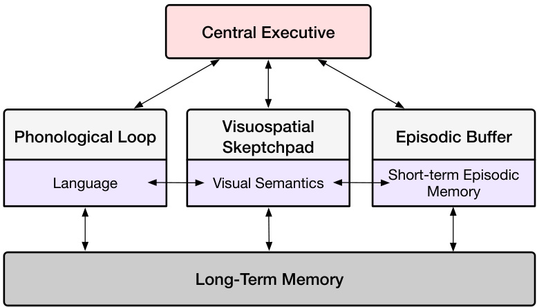  
Figure 3.3: Baddeley's model of working memory [192].  

Working Memory Models. Recognizing that short-term memory also involves active maintenance, Baddeley and Hitch [192] proposed a working memory framework emphasizing the dynamic manipulation of information. Their originalmodeldescribed acentralexecutivethatcoordinates two subsystems:the phonologicalloop(verbal)and the visuospatial sketchpad (visual/spatial).A subsequentrefinement introducedthe episodic buffer to integrate material from these subsystems with long-term memory[193].Figure 3.3 shows the framework of the working memory model. Alternatives such as Cowan's embedded-processes model[194]similarly underscore theroleof attention in governing how information is briefly sustained and manipulated.  

Serial-Parallel-Independent (SPI) Model. Initial distinctions between episodic, semantic, and procedural memory were championed by Tulving [195],wholater refined his ideas into the Serial-Paralel-Independent(SPI) model, as shown inFigure 3.4.In this framework, memory is divided intotwooverarching systems.The cognitive representation system handles perceptual input and semantic processes,encompassing facts,concepts, and contextual (episodic) knowlege.The action system,bycontrast, underpins procedural skill such asdanceroutines,driving maneuversor typing proficiencyTulving's SPI model posits that memory formationcan occur at multiplelevels:strictly perceptual encodingcan support rudimentary episodic memories, while richer episodic representations benefit from semantic mediation.For instance, patients with semantic dementia, who struggle to retain word meanings,can stillform some episodic memories butoften lack the fullcontextual detailconfered by intact semanticnetworks.Byhighlighting the role of procedural memory and itsautomatic,intuitive nature,the SPImodelaims to integrate structure (thecontentof memory)and function (how memory is used),surpassing earlier accounts that largelyfocused on explicit storage and retrieval.Despite these strengths,critics note thatthe modelunder-specifieshow working memory operateswithinthe broader system, andthe feedback mechanisms connecting cognitive and action subsystems remain loosely defined.  

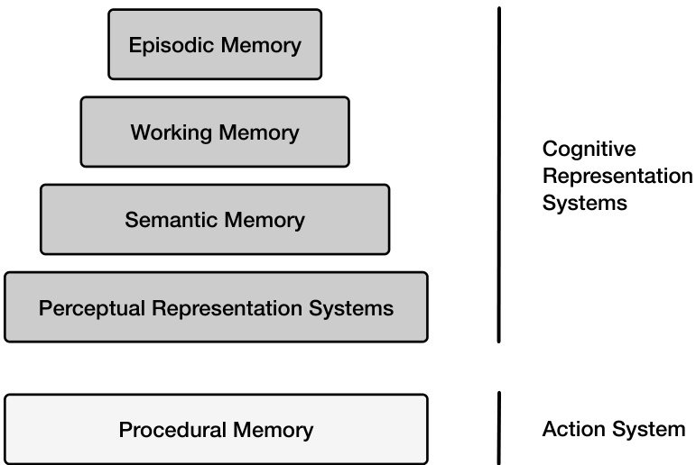  
Figure 3.4: The Serial-Parallel Independent (SPI) model of human memory [195].  

Global Workspace Theory (GWT) and the IDA/LIDA Framework. Global Workspace Theory (GWT),developed by Baars [196],conceptualizes consciousness and working memory as a“broadcast" mechanism that distributes information tospecialized processors.Building onGWT, Franklin[197,198]proposed the IDA(Intellgent Distribution Agent)model,laterextended toLIDA(Learning IDA),as acomprehensivecognitive architecture.Inthese frameworks, multiple memory systems (e.g.,perceptual,episodic, procedural) interact through iterative“cognitive cycles",with a global workspace functioning as a hub for attention and decision-making. From an AI standpoint, IDA/LIDA demonstrates how human-like memory procesescan be operationalizedto guide an agent's perception,action selection, and learning.  

ACT-R and Cognitive Architectures. ACT-R (Adaptive Control of Thought—Rational)[199] is a comprehensive cognitive architecturethat integratesmemory,perception,and motor processes intoaunifiedtheoreticalframeworkIt has been appliedextensivelyacrossdiverse domains,including learning and memory,problem-solving,decision-making, language comprehension,perception and attention,cognitive development, and individual differences.Figure 3.5 illustrates the processes of ACT-R.At the core of ACT-R are distinct modules (e.g.,visual, manual, declarative, procedural) that interact with the system through dedicated bufers.Declarative memory stores factual“chunks." while proceduralmemory encodes if-then production rules for actions and strategies.Cognition unfolds via apattern matcherthatselects asingle production tofire basedonthecurrent buffercontents.Thissymbolic production system is augmented by subsymbolic processes,guided by mathematicalequations thatdynamicallregulate activations,retrieval latencies,and production utilities.Bycombining symbolic and subsymbolic levels,ACT-R provides a mechanistic account of how individuals acquire,retrieve,and apply knowledge-thus shedding light on empirical phenomena such as reaction times, error patterns, and the shaping of learning over time.  

Each of the aforementioned models illuminates different aspects of memory.The multi-store model provides a straightforward introduction to storage stages,working memory models emphasize active maintenance and manipulation, and frameworks such as IDA/LIDA or ACT-R embed memory within a comprehensive view of cognition. In practice, researchers often drawupon multiple perspectives,reflectingthe intricate natureof human memory andits integralrole in perception, learning, and adaptive behavior.  

# 3.2 From Human Memory to Agent Memory  

Having established the fundamentals of human memory, we now focus on how Large Language Model (LLM)-based agents manage and store information. Memory is not merely a storage mechanism but is fundamental to human and  

#  

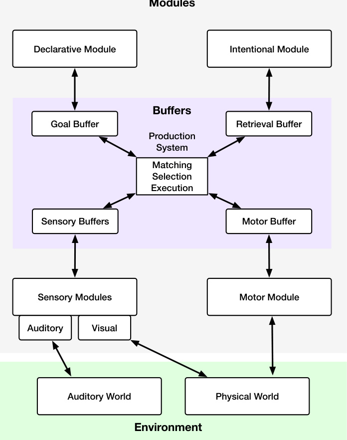  
Figure 3.5: An abstraction of the most important processes in the ACT-R model [199].  

artifcialinteligence.Memory underpins cognition,enabling learning,adaptation,and complex problem-solving for humans.Similarly,forLLM-based agents, memory provides the crucial scaffolding for maintaining context,leaing from experience, and acting coherently over time.Without memory, even a highly capable LLM would struggle to adapt to changing circumstances or maintain focus during extended interactions.  

While LLM-based agents and biological systems differ fundamentally, the principles guiding human memory-context retention,selective forgettingand structuredretrieval—are highlyrelevant toagent design.Therefore,examining the parallels and distinctions between human and artificial memory isbeneficial.Functionallywe candraw analogies:an agent's short-term memory buferresembles the prefrontalcortex's role in working memory,whilelong-term storage in a vector database is akin to the hippocampus's function in consolidating episodic memories.Agent memory design can benfit from emulating human memory's mechanisms, including selective atention, prioritized encoding,and cue-dependent retrieval. However, crucial differences exist.  

Human memory,built upon biologicalneuralnetworks,integrates storage andcomputation withinneurons'connections and activity patterns.This ofersahighdegree of parallelism and adaptability. Incontrast,current agent memory systems predominantly rely ondigital storage and algorithms,using symbolic representations andlogicaloperations, thus separating storage and computation.This impacts information processing: human memory is associative and dynamic,capable of fuzzy matching andcreative leaps,while curent agent memory relies on precise matching and vector smilarity,struggling with ambiguity.Although digital storage capacity is vast, it cannot yetreplicate the complexity and dynamism of human memory, particularly in nuanced pattern recognition and long-term stability. Human memory, while imperfect,excels at extracting crucial information from noisy data.Agent memory systems,in their current stage,are stillnascentcomparedtothe intricacies of human memory,facing limitations inorganization, integration, adaptive forgetting, and knowledge transfer.  

The need for a dedicated memory module in LLM-based agents is paramount. While external knowledge bases (databases,searchengines,APIs)[20o] provide valuable information,they donotcapture theagent's internalreasoning, partial inferences,ortask-specificcontext.An agentic memory system internalizes interim steps,evolvingobjectives, and historicaldialogue,enabling self-referentialexplorationandadaptation.Thisiscrucialfortasksrequiringthe agent to build upon prior judgments or maintain a personalized understanding of user goals.  

Early approaches to agent memory,such as appending conversation history tothe input prompt (arudimentary formof working memory)[201],have evolved.Modern architectures employ more sophisticated techniques, including vector embeddings for rapidly retrieving memories[202]and selective incorporation of reasoning chains into subsequent inference steps[203,204].These diverse methods share the common goalof managing alarge information reservoir without compromising system responsiveness.  

However,comparedto the sophistication of human memory,current agentic methods have limitations.Many systems lack coherent strategiesfor long-term memory consolidation, leading to cluttred logs or abrupt information loss. The flexible, bidirectional interplay between stored knowledge and ongoing processing,characteristic of human working memory,isoftenabsent.Metacognitive oversightselectiverecall,forgetting,and vigilance against outdated information-is also underdeveloped in LLM-based agents.Balancing comprehensive recallwith practical efficiency, as humans do, remains a key challenge.  

Building robust and adaptable memory for LLM-based agents involves addressing three core research questions: First, how should memory be represented tocapture diverse information types and facilitate efficient access?Second, how can agent memoryevolve, incorporating new experiences,adapting tochanging contexts, and maintaining consistency? Finally,howcan the stored memories effectivelyenhancereasoning,decisionmaking,andoverallagent performance? The following sections delve intothesecrucialareas,exploringcurrent approaches,limitations, and potential future directions.  

# 3.3 Representation of Agent Memory  

Inspired by humancognitive systems [285],current memory architecture in intellgent agentsadopts a hierarchical framework that integrates perception through sensory memory[205],real-time decision-making via short-term memory [286,287], and sustained knowledge retention through long-term memory [288,289, 48].This multi-layered structure equips agents to manage immediate tasks while maintaining a broader contextualunderstanding,fostering adaptability and seamless continuity across diverse interactions.  

Specifically, the memory system transforms raw environmental inputs into structured, actionable representations. Sensorymemoryacts as the gateway,capturingand selectivelyfiltering perceptual signals to provide afoundation for cognitive processing.Short-term memory bridges these immediate perceptions withtask-levelunderstanding,buffering recent interactions and enabling dynamic adaptation through experience replay and state management. Long-term memory then consolidates and stores information over extended periods,facilitating cross-task generalization and the accumulation of enduring knowledge.  

Together, these memory components form a cohesive cycle of perception, interpretation, and response.This cycle supports real-time decision-making and enables agents tolearn and evolvecontinuously,reflecting an intricate balance between responsivenessand growth.Thefollowing delves into the formulation ofeach memory type,exploring their unique roles and interactions within the agent's cognitive architecture.  

# 3.3.1 Sensory Memory  

In human cognitive systems, sensory memory serves as a mechanism for collecting information through the senses-touch,hearing,vision,andothersand ischaracterized byitsextremelybrieflifespan.Analogously,ensoy memory functions asthe embeddedrepresentation of inputs suchas text,images,andother perceptual data inintelligent agents.Itrepresentstheinitial phase ofenvironmentalinformation processing,actingasagateway fortransformingraw observations into meaningful representations for further cognitive processing.  

Sensory memory in intellgent agents transcends pasive information reception.It dynamically encodes and filters perceptual signals,bridging immediate sensoryinputs withthe agent's internal stateobjectives, and prior knowledge. This adaptive processfacilitatesrapidperceptionofenvironmentalchanges,taskcontinuityandreal-timecontext-aware information processing.Sophisticatedatention mechanisms are employed toensure relevance and focus inthe sensory memory layer, forming a critical foundation for decision-making and adaptation.  

Formally,sensory memory formation consists of three sequential steps: perceptual encoding,attentional selection, and transient retention.First, perceptual encoding transforms raw sensory signals into processable representations, mathematically expressed as:  

$$
\phi(o_{t})=\operatorname{Encode}(o_{t},s_{t})
$$  

where $o_{t}$ is the sensory input at time $t$ and $s_{t}$ represents the agent's state. For instance, RecAgent [205] employs an LLM-based sensory memory module toencode raw observations while filtering noise and irrelevant content.Extending  

  
Figure 3.6: Tree diagram of the memory module in intelligent agents.  

beyond text-based perception, multimodal sensory memory systems such as Jarvis-1[228], VideoAgent[209],and WorldGPT [210] integrate multimodal foundation models to process diverse modality inputs.  

Next, attentional selection extractscrucial information from the encoded sensorydata.This processguided by an attention mechanism, is represented as:  

$$
\alpha_{t}=\mathrm{Attention}(\phi(o_{t}),c_{t})
$$  

where $\phi(o_{t})$ is the encoded input, and $c_{t}$ denotes contextual information influencing attention. For example, RecAgent [205] employs an attention mechanism with an importance scoring system that assigns relevance scores to compressed observations, prioritizing critical inputs such as item-specific interactions while de-emphasizing less significant actions. This helps extract high-priority information for memory retention.  

Finally, transient retention temporarily stores the selected sensory information as sensory memory:  

$$
M_{\mathrm{sensory}}=\{\alpha_{t}\ |\ t\in[t-\tau,t]\}
$$  

Several strategies have been implemented to manage the time window.For instance,RecAgent[205]models retention by associatingeachobservationwiththe timestampcorespondingtothe start ofa simulationround inthe user behavior simulation environment,represented as atriplet(observation,importance score,timestamp).Similarly,CoPS [206] employs afixed-size sensory memory poolas atime window, whichconsists of user search requests for personalized search,facilitating“re-finding"behavior.Whenanewquery isreceived,thesystemfirstchecksthe sensory memory for relevantmatches.Ifamatch isfound,the query isclassifiedasare-finding instanceenabling arapidsensoryresponse.  

# 3.3.2 Short-Term Memory  

Short-term memory in cognition-inspired intellgent agents serves as atransient and dynamicworkspace that bridges sensory memory andlong-term memory.It isessentialforstoring and processing task-relevant information andrecent interaction sequences,supporting real-time decision-making and adaptive behavior.Inspired by human short-term and working memory,t temporarilyretains information tofacilitatecomplexcognitive tasks,ensuring continuity and coherence in the agent's operations.  

Short-term memory in intellgent agentscan be categorized into context memory and working memory.On the one hand, context memory treats the context window as the short-term memory of LLMs.For example,MemGPT [214] inspired byhierarchicalmemory systems inoperating systems,managesdiffrentstorage tierstoextendcontext beyond the LLM's inherentlimitations.[290]introduces aneurosymbolic context memory that enhances LLMs by enabling symbolic rule grounding and LLM-based rule application.  

Onthe other hand, working memory involves fetching and integrating relevant external knowledgeto hold essential information during an agent's operation. Generative Agent [50] employs short-term memory to retain situational contextfacilitatingcontext-sensitive decision-making.Reflexion[48]utilizesasliding window mechanism to capture and summarizerecentfeedback,balancing detailed immediate experienceswith high-levelabstractions forenhanced adaptability.RLP[218] maintains conversational states for speakers andlisteners,using them as short-term memory prompts to support dialogue understanding and generation.  

For interactive and creative game scenarios, CALYPSO[219]assts Dungeon Masters in storytelling for Dungeons & Dragons by constructing short-term memory from scene descriptions, monster details, and narrative summaries, enabling adaptive storytelling and dynamic engagement.Similarly, Agent S[21l] and Synapse[291], designed for GUI-based autonomouscomputer interaction,define theirshort-term memory astask trajectories,including actions such as buton clicks and text inputs.This formulation supports behavioralcloning and enhances adaptation in novel GUI navigation tasks.  

In robotics applications,SayPlan[292]leverages scene graphs and environmental feedback as short-term memory to guide planning and execution in scalable robotic environments.KARMA [215] engages short-term working memory with an effective and adaptive memory replacement mechanism todynamicallyrecord changes inobjectspositions and states. LLM-Planner [293] iteratively updates short-term memory with environmental observation to prompt an LLM for dynamic planning.  

# 3.3.3 Long-Term Memory  

Long-term memory in cognition-inspired intelligent agents enables the retention and retrieval of information over extended periods, alowing agents to generalize knowledge and adapt to newcontexts efectively. Unlike sensory and shot-term memory, which handle transient orimmediate data, long-term memory supports cumulative learning and cross-task adaptability. It mirrors human long-term memory by incorporating explicit and implicit components, facilitating richer contextual understanding and intuitive behavior.  

On the one hand, explicit memory involves intentionalrecollction,analogous to declarative memory in humans.It consists of semantic memory, which stores generalknowledge such as facts and concepts, and episodic memory, whichrecords specific events and interaction histories.Semantic memory in intellgent agentscan be preloaded from domain knowledge basesordynamicall acquired through interactions.For example,in environments like TextWorld, semantic memory captures structured facts,such as“Recipe-contains- Tuna"or“Recipe - is on-Table".Episodic memory,incontrast,logs situationalcontextand sequentialactions,such as“gofrom kitchen tolivingroom,then to garden".Integrating semantic and episodic memory alows agents toretain static andcontextual information,enabling human-like adaptability and context-aware responses.  

On the other hand, implicit memory shapes agent behavior through procedural memory and priming.Procedural memory enables agents to perform repetitive tasks efficiently byrecalling specific skill and reusable plans.Forexample,it automates routine tasks withoutrequiring explicit instructions,improving task execution effciency.Priming,meanwhile, captures statechanges and corresponding responses, allowing agents to adapt to similar contexts quickly. Priming enhances fluidity andcontext-sensitivedecision-making by directly matchingobservations toorcontinuouslychaining actions.Implicit memory,shaped byinteractions withcognitive modules,enablesrapid adaptation,oftenafter minimal exposure to new stimuli.  

Most intelligent agents implement both semantic and episodic memory within their memory modules.For instance, Agent S [2ll],designed for GUI automation tasks,incorporates semantic memory to store online webknowledge in natural language form,while episodic memory captures high-level, step-by-step task experiences.Similarly, AriGraph[221],targeting embodied simulation tasks,encodes semantic environment knowledge using a fact graph and logs episodic navigation historythrough an event graph. In AIcompanion systems like MemoryBank[207] for SiliconFriend, semantic memoryconstructs userportraits innaturallanguage,whileepisodic memoryretains interaction histories, enhancing personalized and context-aware behavior.  

For implementing implicit memory,current agent systems primarily adopt model-friendly memory formats, such as key-value pairstorage,executable code, or reusable routines.For example, AAG [226]defines and generalizes procedures through analogy, mapping knowledge from one situation (base)to another(target).This structure can be representedasalineardirectedchaingraph,where the input serves astheroot,theoutput as theleafnode,andeach intermediate step as a node in the chain.Similarly,Cradle[227]and Jarvis-1[228] implement procedural memory by storing andretrieving skill incode form,whichcanbeeitherlearned from scratchor pre-defined.Once curated,skills can be added, updated,or composed within memory.The most relevant skillfora given task andcontext are then retrieved to support action planning.  

# 3.4 The Memory Lifecycle  

In this section,we introduce thelifecycleofmemory inAIagents, as depicted in Figure3.7.Thelifecyclecomprisesa dualprocessofretentionandretrieval.Retentionincludesacquisition,encodingandderivation,whileretrievalinvolves memory matching, neural memory networks, and memory utilization.  

# 3.4.1 Memory Acquisition  

Memory Acquisition is the foundational processby which intelligentagents take in raw perceptual information from their environment.This initial step is crucial for subsequent learning,adaptation, and decision-making[305].A primary challnge in acquisition is the sheer volume and complexity of environmentalinputs.Agents are constantly bombardedwithvisual,auditory,textual,andtherformsofdata,muchofwhichisredundantorirrelevanttotheagent's goals.Therefore,acore aspect of memory acquisition is not simplycapturing data, but also initiating a preliminary filtering processThis filtering leverages two primary mechanisms: initial information compression and experience consolidation.  

At this early stage,information compression involves rudimentary techniques to reduce data dimensionality. This might include downsampling images,extracting key phrases from text using simpleheuristics,oridentifying significant changes inaudiostreams[306].The goalisrapidlossycompressionto prioritize potentiallrelevant information.For example, LMAgent [230] prompts the LLM to perform information compression, reducing irrelevant and unimportant content when constructing sensory memory to enhance operational efficiency. Meanwhile, ReadAgent[231] and GraphRead[307] respectively employ different strategies for compressing long text, i.e.,episode pagination and graph-based structuring, to maximize information retention while ensuring efficiency.  

Onthe other hand,experience consolidation,even at the acquisition phase, plays arole.The agentdoesn'tyethave a rich memory,but it can begin to apply previouslylearned, very generalrules or biases.Forexample,if the agent has a pre-existing bias towards moving objects, it might prioritize visual data containing motion,even before full encoding [308].To enhance the dynamic consolidation of memory-based experiences, [235] define metrics such as contextual relevance and recallfrequency to determine whether to update long-term memory in a vector database.  

Table 3.1: Summary of the memory module in various agents. Refer to Figure 3.6 for abbreviations.   

<html><body><table><tr><td rowspan="2">Method</td><td rowspan="2">Domain</td><td colspan="3">Memory Representation</td><td colspan="5">Memory Lifecycle</td></tr><tr><td>Sensory</td><td>Short-term Long-term|Acquisition Encoding Derivation</td><td></td><td></td><td></td><td></td><td>Retrieval</td><td>Utilization</td></tr><tr><td>Synapse [291]</td><td>GUI</td><td>Multi-</td><td>Context</td><td>PEpisdirca</td><td>User demo.</td><td></td><td>Hieomch.</td><td></td><td></td></tr><tr><td>Agent S [211]</td><td>GUI</td><td>Mulil-</td><td>Corkingg</td><td>Sepiantic,</td><td>Compfress.</td><td>Contastive</td><td>Seleet.</td><td>Indexing</td><td>Lonex-</td></tr><tr><td>Automanual [108]</td><td>GUI</td><td>Molal-</td><td>Context</td><td>Propiedral,</td><td>DUsmr.</td><td>Hierarch.</td><td>D Gomp.</td><td>STasch</td><td>Subeoal</td></tr><tr><td>AutoGuide[294]</td><td>GUI</td><td>Multi- modal</td><td>Context</td><td></td><td>Screen Capture</td><td></td><td>Action Plan</td><td></td><td>Action Exec.</td></tr><tr><td>Agent-Pro [295]</td><td>GUI</td><td> Multi-</td><td>Context</td><td></td><td>Sapeure</td><td></td><td>Hiecomch.</td><td></td><td>Action</td></tr><tr><td>MemGPT [214]</td><td>Document</td><td>Text</td><td>Corking,</td><td></td><td>ExDernal</td><td></td><td></td><td>Pac.call</td><td>Doact.</td></tr><tr><td>SeeAct [296]</td><td>Web</td><td> Moulai</td><td>Context</td><td></td><td>Scren</td><td></td><td>Action Plan</td><td></td><td>Ineract.</td></tr><tr><td>Auto WebGLM</td><td>Web</td><td>Text</td><td>Context</td><td></td><td>HTML</td><td>HTMd</td><td>AHTMSIS</td><td></td><td>IWwat.</td></tr><tr><td>SteP [298]</td><td>Web</td><td>Text</td><td>Context</td><td>Task-spec.</td><td>HTML</td><td>HTML</td><td>AHTML</td><td>Eleament</td><td>Ineract.</td></tr><tr><td>AWM [299]</td><td>Web</td><td>Text</td><td></td><td>Procedural</td><td>Workflow</td><td>Aution.</td><td>，</td><td> Siup</td><td>Workflow</td></tr><tr><td>AriGraph [221]</td><td>TextWorld</td><td>Text</td><td></td><td>Sepisantic,</td><td>Eserv.</td><td>Krapl.</td><td>Travepsal</td><td>Retrieval</td><td>Apction</td></tr><tr><td>MemoryBank [207]</td><td>Dialogue</td><td>Text</td><td></td><td>Episodic</td><td>Dialogue Record</td><td></td><td></td><td>Chron. order</td><td>Resp. gen.</td></tr><tr><td>PromptAgent [300]</td><td>General</td><td>Text</td><td>Context</td><td></td><td>Prompting</td><td></td><td>Prome.</td><td>Content-</td><td>Prompt</td></tr><tr><td>ECL[301]</td><td>Embody</td><td>Moda-</td><td>Context</td><td>Episodic</td><td>Recording</td><td>Contrast.</td><td>SExmer.</td><td>Sim.& Recency</td><td>Pelicy Long-</td></tr><tr><td>LEO [302]</td><td>Embody</td><td> Multi-</td><td>Working</td><td>HLoizon Rep.</td><td>Observation</td><td>Spamipl- Learn.</td><td>Goal-Cond.</td><td>Hierarch.</td><td>Exec. Horizon</td></tr><tr><td>IER [303]</td><td>Embody</td><td>Multi- modal</td><td>Context</td><td>Episodic</td><td>Env. Interact.</td><td>Multal- Embed</td><td>Iter. Refine.Sim.Match</td><td></td><td>Action Plan.</td></tr><tr><td>Voyager [47]</td><td>Embody</td><td>Text</td><td>Working</td><td>Procedural</td><td>Curiculum</td><td>Lskrary</td><td>Prompt.</td><td></td><td>Skill Exec.</td></tr><tr><td>A3T [49]</td><td>Embodys</td><td>Text</td><td>Context</td><td></td><td>DTomp.</td><td>Token. d&</td><td>Action Planning</td><td></td><td>Actiot.</td></tr><tr><td>STARLING[304]</td><td>Robotics</td><td>Mula-</td><td>Context</td><td>Procedural</td><td>Demo.</td><td>Trade</td><td>RSkile.</td><td>Simtet</td><td>Skill Exec.</td></tr></table></body></html>  

Expel[69]constructs anexperience pool tocollectandextract insights from training tasks,facilitating generalization to unseen tasks. More recently, MindOS [233] proposed a working memory-centric central procesing module for building autonomous AIagents,where working memoryconsolidates task-relevant experiences into structured thoughts for guiding future decisions and actions.  

These two mechanisms work in concert with preliminary LLM input. To address the initial challenges,several mechanisms have to be deployed.Agents must be equipped with mechanisms to assessthe potentialrelevanceof incoming informationrapidly.Thispreliminaryfiltering preventscognitiveoverload.The acquisition phase alsobenefits from LLM.  

# 3.4.2 Memory Encoding  

Memory encoding builds upon acquisition by transforming the filtered perceptual information into internalrepresentations suitableforstorage andlater use.A key aspectofencoding isselective filtering.This selective attention mimics human cognitive processes[309].The inherentchallenges ofencoding stem fromthecomplexity,high dimensionality, and often noisy nature of raw perceptualdata.Effctive encoding requires advanced mechanisms to identify key eatures,compressthem compactly,and integrate information from multiple modalities. Modern approaches address hese challenges by leveraging selective attention and multi-modal fusion.  

  
Figure 3.7:Illustration of the memorylifecycle.The memory retention processinvolves three sequential steps—memory acquisition,encoding,andderivation, whilethe memoryretrieval processencompassesseveralindependentapplications, including matching (vector search),neural memory networks, and memory utilization (for long-context modeling and hallucination mitigation).  

Selective Attention mechanisms,inspired by human cognition,allow the agent to dynamically focus computational resources onthe mostrelevant parts of theinput.This might involveattending tospecificregions ofanimage,keywords in a text,or particularfrequencies in an audio signal. Different atention mechanisms can be used depending on the modality and task.For example, as the candidate memory dynamicall expands, MS [237] employs an LLM-based scorer to selectively retain the top-scoring half,creating a more compact shared memory across multiple agent systems. In othermodalities,GraphVideoAgent[238]utilizes graph-based memory toenable selective and multi-turn video scene understanding,enhancing question-answering performance.Inrobot control,[24o]implementsselectiveattntionasa filtering mechanism to extract task-relevant objects from the set of allperceived objects on the table.  

Multi-modalFusion[310]isessential forintegrating information fromdifferent sensory inputs (e.g.combining visual and auditory data to understand a scene).This involves creating aunified representation space where features from different modalitiesare aligned.Cross-modal encoders andcontrastivelearningtechniques areoften used to achieve this fusion.For example,JARVIS-1[228] uses the general-domain video-language model CLIP[51] tocompute alignment within amultimodal key-value memory, where thekeycomprises elements such as task,plan, andvisualobservations, and the value is a text-based representation of successfully executed plans.Furthermore,Optimus-l[241]refines memory representationand optimizes the multimodalencoder by leveraging MineCLIP[311],adomain-specific videolanguage model pre-trained on Minecraft gameplay,to align and fuse filtered video streams withtextualinstructions and plans,encoding the agent'smultimodalexperiences into an abstracted memory pool.This integratedrepresentation enhances information retrieval andreasoning across modalities and acts as anotherflter,reinforcing consistent data. LLMs' semantic understanding is utilized to extract relevant features effciently.  

# 3.4.3 Memory Derivation  

Memory derivation focuses on extracting meaningfulknowledge and insights from the acquired and encoded memories. This processgoes beyond simple storage.This stage is essentialforenhancing the agent's learning capabilities.The goalistocontinuouslyoptimizethe structure andcontent of the agent's memory.Asignificantchallenge inderivation is the dynamic evaluationof informationvalue.Strategies toaddressthese challenges include reflection,summarization, knowledge distillation, and selective forgetting.  

Reflection involves an agent activelyanalyzing its memories to identify paterns,relationships,and potentialinconsistencies. Itcan be triggeredby specific events(e.g.,an unexpected outcome)or occur periodically asabackground process.This process may include comparing memories,reasoning about causalrelationships,and generating hypotheses[300].ExpeL[69]leverages reflection tocolect past experiencesforgeneralization tounseen tasks andto support trial-and-error reattempts following failures.R2D2[243] models memory as areplay buffer and appliesreflectionto refine it bycorrecting failedexecutiontrajectories in web agents.Thesecorrctedtrajectories are thencombined with successful ones to construct reflective memory, which serves as a reference for future decision-making.  

Summarization aims to produce concise representations of larger bodies of information while preserving their most essentialcontent.This can include extracting key sentences from adocument, generating abstractive summaries of conversations,or condensing sequences of events.Summarization techniques range from simple extractive methods to advanced abstractive approaches powered by large language models (LLMs)[245,312,246]. For example,[248] introduces arecursive summarization strategy over dialogue history and prior memory to support long-term dialogue memory derivation.Building onthis,Healthcare Copilot[247] maintains concise memory bytransforming conversation memory,representing the fullongoing medical consultation, into history memory that retains only key information relevant to the patient's medical history.  

Knowledge distilation[313]enables agents to transfer knowledge from larger, more complex models (or ensembles) to smaller, more efficientones.This is particularly important for resource-constrained agents and for enhancing generalization.Distilltion can also involve consolidating knowledge from multiple specialized models into a single, general-purpose model.Forexample,AoTD[250]distill textualchains ofthoughtfrom execution traces of subtasks into a Video-LLM to enhance multi-step reasoning performance in video question answering tasks. LDPD [251] transfers decision-making outcomesfrom teacheragents ie.expert bufers)to studentagents,optimizing the student's policy to align with the teacher's. In multi-agent systems, MAGDi[253] distills the reasoning interactions among multiple LLMs into smaller models by structurally representing multi-round interactions as graphs,thereby improving the reasoning capabilities of smaller LLMs.  

Selective forgeting[314] is the crucial processof removing ordown-weighting memories thataredeemed irrelevant, redundant, or outdated.This is essential for maintaining memory effciency and preventing cognitive overload. Forgetting mechanismscan be based on time(older memories are morelikely tobe forgotten)[247],usagefrequency (infrequentlyaccessedmemoriesaremore likelyforgotten)[203],andrelevance tothecurrenttaskorcontext[255].In morefine-grainedforgetting mechanisms, MemoryBank[207]applisthe Ebbinghaus Forgetting Curveto quantify the forgetingrate,accounting forbothtime decay andthe spacing effect,ie.,theprinciplethat relearning information is easier than learning it forthefirst time.Incontrast,Lyfe Agent[254]adopts ahierarchicalsummarize-and-forget strategy:it first clusters related memories,refines them intoconcise summaries,and then removes older memories that are highlysimilar to newer ones.This approach enables effcient,low-cost memory updatesforreal-time social interactions.  

# 3.4.4  Memory Retrieval and Matching  

Memory retrieval is a processthat emulates thehuman ability to recallrelevantknowledge and experiences to solve problems.The goalistoeffciently andaccuratelyextractthemost pertinent memory fragmentsfromalarge and diverse memory pool,encompassing sensory, short-term, andlong-term memory,to informthe agent's decisions,planningand actions.Just as humans relyon past experiences tonavigatecomplex situations,agents require asophisticated memory retrieval mechanism to handle a wide range of tasks effectively.  

However, achieving this goal presents several significant challenges.First,the agent's memory repository is often heterogeneous,comprising various forms of memory such as natural language descriptions,structured knowledge graphs,andstate-actiorewardsequences.These memoriesdifferfundamentallintheirdatastructures,representations, and levels of semantic granularity,posing achallenge forunifiedretrieval.Second, the retrieved memoryfragments must be highlyrelevant tothecurrntcontext,includingthe agent'sstate,task goals,andenvironmentalobservations. Simple keyword matching falls shortofcapturingthe deeper semanticrelationships required for meaningfulretrieval. Developing a context-aware semantic matching mechanism that can dynamically adjust the retrieval strategy based on the currentsituationistherefore paramount.Third,thereal-time nature of agent interaction with theenvironment necessitates effcient memoryretrieval to support rapid decision-making and action[315].This demand for efficiency is further compounded by the limitations of the agent'scomputational resources.Finaly,the agent's memory is not staticbutconstantlyevolving asnew experiences,knowledge,and skills are acquired.Ensuring memoriestimeliness, reliability,andrelevancewhileavoidingtheinterferenceofutdatedorerrneousinformationisacontinuouschallenge.  

A comprehensive approachcanaddressthesechallenges,encompassing four keycomponents.Firstly,afoundational step involvesconstructing aunified memory representation andindexing scheme.This aims to bridge therepresentational gap between diffrent memory types by embedding them into acommon vector space. Pre-trainedlanguage models like BERT or Sentence-BERT[3i6]can be leveragedto transform text-based memories into semantic vectors, while graph neural networks(GNNs)can learn vector representations for structured memories like knowledge graphs,capturing both node andedge relationships[317].To facilitate effcientretrieval, a multi-layeredhybrid indexing structure is essential. This integrates techniques like inverted indexes for keyword matching,vector indexes like Faiss[318]or Annoy [319]for similaritysearch,andgraph indexes for structuralqueries[320],thus supporting diverse query needs.  

Secondly,perhaps most critically, the system must developcontext-aware semantic similaritycomputation.This allows the retrieval processtounderstand and utilizethecurrent context,such as the agent's state,goals,andobservations, enabling a deeper semantic match beyond keyword overlap.This involves encoding the contextualinformation into vector representations and effectively fusing them with memory vectors.The attention mechanism plays acrucial role here,dynamicallycalculating the relevance between context and memory vectors and assgning diferent weights to memory fragments basedontheir contextualrelevance[261].This emphasizes memories that are more pertinent to the current situation.  

Thirdly,integrating memoryretrievalwiththeagent'staskexecutionnecessitatesatask-orientedsequencedecisionand dynamic routing mechanism.This leverages the structuralinformationoftasks to guide memory retrievaland utilization, enabling complex task decomposition, planning, and dynamic adjustments.By constructing a task dependency graph,the agentcan topologically sort subtasks to determine execution order.During execution,each subtask's goal serves as contextfor memory retrieval,extracting relevant knowledge and experience.Moreover,the agent must adapt to environmental feedback and task progressdynamically adjusting the execution plan. Each decision point involvesre-retrieving memories basedonthecurrentstateand goaltoselect theoptimalaction andhandleunexpected situations.This aspect also emphasizes how agents can leverage their skill memory to solve problems, including skilldistillation,combination, and inovation.Pattern recognition allows forsummarising generalproblem-solving steps,while structured knowledge organizationarranges skillsintoaretrievable format.Agentscanfurther distll generalized skills from specificones,combine multiple skillstoaddresscomplexchallenges, and even innovate new skill combinations.These processes depend fundamentallyon an efficient memory retrieval system that can identify appropriate skills or skill combinations based on task requirements.  

Finally, arobust memory management mechanism is crucial for maintaining the memory pool's timeliness,relevance, and efficiency.This mechanism should incorporate aforgetting and updating strategy, mirroring human forgeting mechanisms [321].This might involve regularly purging outdated,redundant,or infrequently used memories based on time-based decay (weakening memory strength over time) and frequency-based decay (purging low-frequency memories).Simultaneously,whenamemory fragmentrelevant tothecurrent task isretrieved,its timestampand access frequency are updated,increasing its importance and ensuring dynamic memory updates.Through these concerted efforts,LLM Agentscan be equipped with a powerful,flexible, and context-aware memory retrieval and matching system,enabling them to effectively utilize their accumulated knowledge,support complex decision-making, and exhibit more intelligent behavior.  

# 3.4.5 Neural Memory Networks  

Neural Memory Networks represent a fascinating frontier in AIresearch.They aim to integrate memory seamlessly into the fabric of neural networks.This approach departs from traditional memory architectures by encoding memories directly within the network's weights oractivations,transforming the network into adynamic,read-write memory storage medium.This tight integration promises significant advancements in effciency andthe utilizationof stored information. However, realizing this vision presents several formidable challenges.  

A primary concern is balancing memory capacity with stability.Encoding a vast amount of information within the finite parameters ofa neural network while maintaining long-term stability poses a major hurdle.The network must be able to store a multitude of memories without succumbing tocatastrophic forgeting or confusion between similar memories.Equallycrucial is the development ofeffctive mechanisms for memory read-write operations.The network needs to reliably write new information,update existing memories,and accuratelyretrieve stored information on demand,all while maintainingcomputationaleffcency.Beyond simply storing memories,the ultimate goalis to endow neural networks withtheability to generalizefrom and reason withthe informationthey store.This would empower them to performhigher-order cognitive functions beyond rote memorization,allowing for insightfulconnections and inferences based on past experiences. Several approaches are being explored to addressthese challenges, notably through associative memory and parameter integration.  

On the one handassociative memory,inspired bythe interconnectednessof neurons inthe brain,ofers apromising avenue.ModelslkeHopfieldnetworks[262,63],leveraging energyfunctions,andBidirectionalAsociativeMemoies (BAMs)[322]supporting hetero-associative recall provide mechanisms for encoding andretrieving patterns based on the weights between neurons.Besides, Neural Turing Machines (NTMs)[264] and Memory-Augmented Neural Network (MANNs)[323,324,275,265] augment neuralnetworks with external memory modules,employing attention and summary mechanisms to interact with these memories.  

On the otherhand, parameter integration represents another key research direction, aiming to encode memory directly within anetwork's weights.This facilitates the seamlessintegration of world knowledge and accumulated experience into the operational behavior of intelligent AI agents.For example,some prior works modify model parameters to enable continual learning by updating [325,326,327]orforgetting specific knowledge[328].Other studies treat LLMs as standalone memory modules,incorporating world knowledge into their parameters during pre-training [329], post-training [330],and online deployment[331]. For instance,MemoryLLM[265] introduces memory tokens, while SELF-PARAM[266] leverages knowledge distillation to embed world knowledge and past AI agent experiences into model parameters. This approach is further augmented in the $\mathbf{M}+$ model [332] with a long-term memory mechanism and aco-trained retriever,enhancing its ability to generalize tolonger history memorization.Additionally,[33] employs encoded memory to facilitate further reasoning,thereby improving the generalization of stored knowledge. More recently, MemoRAG [267] and ${\tt R}^{3}$ Mem [270] have been proposed to not only encode memory but also enable reliable retrieval from neural memory networks,unifying the dual processes of memory storage and retrieval within a single model.This advancement contributes to thedevelopment of next-generation generative-based retrieval systems, which support lifelong AIapplications.Furthermore,Titans[269]have been introduced to memorize test-time data points through meta-learning, enabling more efficient test-time cross-task generalization.  

Future research willcontinue tofocus on creating larger capacity and more stable neural memory models.Concuently, developing more effcient andflexible memory read-write mechanisms willbecrucial.Acriticalarea of investigation willinvolve applying these memory-augmented networks tocomplexcognitive tasks,pushing the boundaries of what AI can achieve.Progress in this domain willunlock new possibilities for building intelligent agents that can learn, remember, and reason in a manner that is increasingly reminiscent of human cognition.  

# 3.4.6 Memory Utilization  

Acriticalaspect of agent design lies in memory utilization, which focuses on maximizing the value of stored memory segmentsforthecurrent task.Thecoreobjective is toapplythese memorieseectivelyand appropriatelytoenhance reasoning,decision-making,planningandaction generation,ultimatelyboostingtheagent'sperformanceandefficiency while avoiding the pitfalls ofirrelevant orincorrect memory interference.Achieving this,however,presents several challenges.  

One primarychallenge is balancingthe vastnessofthe memory store withits effective utilization.Agents must navigate a potentialinformation overload,ensuring thatrelevant memoriesare fullleveraged without overwhelming the system. Anotherhurdle is theneedforabstractionand generalization.Agents need to distil specificmemory segments intomore general knowledge and apply thisknowledge tonewandvaried situations.Furthermore,the issue of hallucinations and incorrect memories withintheLLMrequirescareful consideration.Preventingthe generation ofcontentthatcontradicts or misrepresents storedinformationiscrucial,as is theability toidentify andrectifyerroneous information that may reside within the memory store itself.  

To addressthese challenges,several strategies are employed.Retrieval-augmented generation(RAG)[334]combines retrieval and generation models to enhance the LLM's capabilities by drawing upon external knowledge sources. Unlike the methods mentioned in memory retrieval and matching, RAGfocuses on integrating retrieved information into the generation process itself.When prompted, the agent retrieves relevant memory segments and incorporates them into the context providedbythe generation model.This contextual enrichment guides the model towards more factual and informative outputs.Forinstance, when responding toauser's query,the agent canfirst retrieve related entries from its knowledge base andthen generate an answer based on this retrieved information, thus grounding the response in established knowledge. More recently,some studies have integrated memory modules with RAG, incorporating self-reflection[274]andadaptive retrieval mechanisms[272] to enhance both generation reliability and efficiency. For example, Atlas [273]leverages causal mediation analysis, while[284] employs consistency-based hallcination detection to determine whether the model already possesses the necessary knowledge—allowing for direct generation-or whetherretrievalis required, in whichcase the modelfirstretrieves relevant information before generating aresponse.In aunifiedframework,RAGLAB[271]offers acomprehensive ecosystem for evaluating and analyzing mainstream RAG algorithms. HippoRAG [22] employs a strategy inspired by the hippocampal indexing theory of human memory tocreatea KG-based index for memory and use Personalized PageRank for memory retrieval.  

Furthermore,long-context modeling plays avitalrole in managing extensive memory stores.This approach enhances the LLM's abilitytoprocesslong sequences andlage-scalememories,allowing foradeeper understandingand utilizationof long-range dependencies.By employing Transformer model variants like Transformer-XL[324] and Longformer[335], or throughhierarchical andrecursive processing techniques,such asrecurrent memory transformer (RMT)[275,276] agents can expand their context window.This enables them to handle significantly more extensive memory stores and reason and make decisions within a much broader context.Forexample,agentscan maintain alonger memory span when processing extensivedocuments or engaging in prolonged conversations.Additionally,somestudies leverage memory to compress long contexts,enabling more effective long-context modeling. For example, AutoCompressor [277] introduces summary vectors as memory totransfer informationfrom previous context windows intothecurrent window, facilitating long-context understanding.Similarly, the in-context autoencoder (ICAE)[278] generates memory slots that accurately and comprehensivelyrepresent theoriginalcontext, while LLMLingua[336,337], Gist[279],and CompAct [280] further optimize long-prompt compression to reduce input context length.  

Finally,hallucination mitigation strategiesare essentialfor ensuring the reliability of generated outputs.These strategies aim to minimize the LLM's tendency to produce factually incorrct or nonsensicalcontent.One approachis implementing fact-checking mechanisms [338],verifing generated content against established knowledge or memory stores.Another involves uncertainty estimation[339,340],where the model evaluates the confidence level of its generatedcontentandflagsorfiltersoutlow-confidenceoutputs.Aditionallknowledge-baseddecoding strategiescan be employed during the generation phase,introducing constraints that guide the modeltowards more factuall accurate content.These techniques colectivelycontribute to generating more trustworthy outputs and aligned withthe agent's established knowledge base.Recent research has introduced expert memory subnetworks,such as PEER[283] and Lamini Memory Tuning [281],which specialize in memorizing specific types of information,including worldknowledge and AI agents"past experiences.These subnetworks offload memorization to dedicated parameters,reducing the main model's propensity to hallucinate.By implementing these memory utilization strategies,agents can become more capable,accurate,and reliable.Theycan successfully leverage their memory stores to achieve superior performance across complex tasks.  

# 3.5 Summary and Discussion  

The development of truly inteligent agents depends not just on robust memory systems,but alsoon their seamless integration withother cognitive functions like perception,planning,reasoning,and action selection.Memory is not an isolated module; it is deeply intertwined withthese other processes.Forexample,sensory input is encoded and filtered before storage(asdiscussed inthe sectionson memoryrepresentation andlifecycle),highlightingthe interplay between perception and memory. Long-term memory,especially procedural memory,directly informs action selection through learned skills androutines.Retrieval mechanisms, likecontext-awaresemantic similaritycomputation,arecrucial for planning,allowing agents toaccess relevant pastexperiences.This interplayextends totheconceptofa“world model?"  

Centralto intellgent agents is their abilityto build and utilize internal world models.These models,representing an agent's understanding ofits environment,enable simulation,reasoning aboutconsequences,and prediction. Robust worldmodelsarecrucialforhigher-levelcognition,planning,andhuman-like intelligence.Aworldmodelis,inessence, a highly structured, often predictive,form of long-term memory. Memory provides the raw material—knowledge and experiences-forconstructing the world model, whilethe world model, inturnacts as anorganizing framework, influencing how new memories are encoded,consolidated,andretrieved.For instance,a welldeveloped world model might prioritize storing surprising events, as these indicate gaps in the agent's understanding.  

However, developing efective world models and memory systems presents significant challenges.These include managing thecomplexity of real-world environments, determining the appropriate level of abstraction (balancing accuracy,complexity,and computational effciency),and integrating multi-modalinformation.Learning and updating these models effciently,avoiding bias,ensuring generalization, andenabling continuous adaptation are alsocritical. Furthermore, model-based planning requires effcient search algorithms tohandle the inherentuncertainty inthe model's predictions.  

Future research should focus on enhancing agent memory systems by drawing inspiration from the strengths of human memory,particularlyitsflexibilityadaptability,andeficiency.While agent memoryhasadvancedconsiderably itsill lags behnd human memory in these key areas.Human memory is remarkably associative,retrieving information from incomplete or noisycues,andit exhibits asophisticatedformof“forgetting"that involvesconsolidationandabstraction, prioritizing relevant information and generalizing from experiences.Agent memory,conversely,often relieson precise matching and struggles with ambiguity.  

Several promising research directions emerge.Exploring biologicaly-inspired mechanisms,such as neural memory networks (as discused earlier),could lead to significant breakthroughs.Another crucial area is developing memory system thatactively“curate"their contents—reflecting oninformation,identifying inconsistenciesand synthesizing new knowledge.This requires integrating metacognitive capabilities (monitoring and controlling one's own cognitive processes)intoagentarchitectures.Furthermore,creating morerobust andnuancedforms ofepisodic memory,capturing not justthe“what"and“when"but alsothe“why"andtheemotionalcontextofevents,isessentialforagents thatcan truly learn from experience and interact with humans naturaly.  

Overcoming these challenges requires innovative solutions attheintersection of deeplearning,reinforcement learning, and cognitive science.Developing more sophisticated and adaptable world models and memory systems—ones that mirror the strengthsof human cognition-willpave the way for agentswithadeeper understanding of their environment, leading to more intelligent and meaningful interactions.  

# Chapter 4  

# World Model  

A worldmodelenables an agent to predict and reasonabout future states without direct trial-and-error in reality.This sectionexplores how human cognitive studies on“mental models"relate to AI world models in artificial intelligence, categorizing them under four paradigms: implicit paradigm,explicit paradigm,simulator-based paradigm,and aclass of other emergent methods (e.g.,instruction-driven paradigm).We then discusshow world models inherently intersect withother agenticcomponents and conclude with open questions andfuture directions that unite these perspectives under a unified theoretical and practical framework.  

  
Figure 4.l:Humanscan use theirbrain's modelof theworld topredict theconsequences of their actions.For example when playing table tennis, a player can imagine or predict the trajectory of the ball after an action.  

# 4.1 The Human World Model  

Humans naturallconstruct internalrepresentations of the world,often referred toasmental models in psychology 341 342,343]. These models serve as compact and manipulable depictions of externalreality,enabling individuals to predict outcomes,planactions,and interpret novel scenarios with minimalreliance on direct trial-and-error.Early work on spatialnavigation,forinstance,showed thathumans andanimalsform“cognitive maps"of their surroundings [341], suggesting an underlying ability to imagine potential paths before actually traversing them.  

Craik's seminal argument was that the human mind runs internal“smal-scale models of reality"[342] to simulate how events might unfoldand evaluate posible courses of action.Later studies proposedthatsuchsimulations stretch across modalities-vision,language, and motor control—and are dynamicaly updated by comparing predictions to new observations.This process merges memory recallwithforward projection,implying aclose interplay between stored knowledge andthe active generation of hypothetical future states[343].More recent predictive processing theories such as“Surfing Uncertainty"[344]propose thatthebrain operatesas ahierarchical prediction machine,continuously generating top-down predictions about sensory inputs and updating its models based on prediction errors.  

Critically, these human mental models are:  

·Predictive: They forecast changes in the environment, informing decisions about where to move or how to respond.   
·Integrative: They combine sensory input,past experience, and abstract reasoning into a unified perspective on “what might happen next".   
·Adaptive: They are revised when reality diverges from expectation, reducing the gap between imagined and actual outcomes over time.   
·Multi-scale: They operate seamlessly acrossdifferent temporal and spatial scales, simultaneously processing immediate physical dynamics (millseconds), medium-term action sequences (seconds to minutes), and longterm plans (hours to years).This flexibility allows humans to zoom in on fine-grained details or zoom out to consider broader contexts as needed.  

Consider hunger and eating asan ilustrationof integrated world modeling.When hungry,a person's internal model activates predictions about food—simulating not just visual appearance but tastes, smell, and anticipated satisfaction-triggering physiologicalresponses like salivation before food is even present.Thisdemonstrates seamless integration across perception, memory, and action planning.  

The example alsohighlights adaptivity:once satiated, thesame modeldynamically updates,reducing predictedreward values for further eating.Despiterecognizing thesame fooditems, their anticipated utilitychangesbased on internal state.Furthermore, humans maintain counterfactual simulations—declining dessert now while accurately predicting they would enjoy itlater—enabling complex planning acrosshypothetical scenarios and time horizons,acapability comprehensive AI world models strive to replicate.  

In sum,thehumanworldmodelisnota staticlibraryoffacts,butaflexibleandever-evolving mentalconstruct,deeply rooted in perception and memory, thatcontinuously shapes (and is shaped by)the individual's interactions with the outside world.  

# 4.2 Translating Human World Models to AI  

Researchinartificialintelligencehaslong soughttoreplicatethe predictive,integrative,andadaptivequalities exhibited by human mental models [341, 342].Early reinforcement learning frameworks,for instance, proposed learning an environment modelfor planning—exemplified by Dyna[345]—while contemporaneous work investigated using neural networks to anticipate future observations in streamingdata[346,347].Both directions were motivated by the idea that an internal simulatorof the worldcouldenable more effcient decision-makingthan purelyreactive,trial-and-error learning.  

Subsequent advancements in deep learning brought the notionof“AI world models"into sharper focus.One influential approach introduced anend-to-end latent generative modelofan environment (e.g.,“World Models"[348]),whereby a recurrent neural network(RNN)and variational auto-encoder(VAE)together learn to“dream”future trajectories. These latent rollouts allow anagent to trainorrefine policies offline,effectively mirroring how humans mentally rehearse actions before executingthem.Alongside such implicit designs,explicit forward-modeling methods emerged in model-based RL, letting agents predict $P(\bar{s}^{\prime}\mid s,a)$ and plan with approximate lookahead [349, 350].  

Another branchof workleveragedlarge-scale simulators orreal-worldrobotics to ground learning inrichly diverse experiences [51,352].Such setups are reminiscent of how humanchildren learn by activelyexploring their environments, gradually honing their internalrepresentations.Yet akey questionlingers:can agentic systems unify these approaches (implicit generative modeling,explicit factorization,and simulator-driven exploration）intoacohesive“mental model" akin to that observed in humans?Therecent proliferation of language-model-based reasoning [107,74]hints atthe potential tocrossmodalities and tasks,echoing how humans integrate linguistic, visual, and motor knowledge under one predictive framework.  

Overall, as AI systems striveforflexible,sample-efficientlearning,the Alworld modelstands asaconceptual bridge from cognitivetheories of mentalmodels to implementations that equip artificial agents with imagination, predictive reasoning, and robust adaptation in complex domains.  

# 4.3  Paradigms of AI World Models  

Designing an Alworld modelinvolves determininghow an AIagent acquires,represents, andupdates itsunderstanding of the environment's dynamics.While implementations vary, most approaches fallinto four broad paradigms: implicit, explicit,simulator-based, and hybridorinstruction-driven models.These paradigmscan befurther analyzedalong two key dimensions:reliance on internal(neural-based) vs.external(rule-based or structured)mechanisms,and overall system complexity.Figure 4.2illustrates this two-dimensional space,showing how different approaches distribute themselvesacross theseaxes.Generaly,implicit models tend to rely more on internal mechanisms, while explicit and simulator-based models incorporate more externalstructures.Simulator-based andexplicit models alsotendto be more complex than implicit and hybrid approaches,reflecting their structured reasoning and engineeed constraints.  

  
Figure 4.2: A two-dimensionallayout of AI world-modelmethods.The horizontal axis indicates Complexity (left to right).The verticalaxis spans Internalapproaches (bottm)to Externalsolutions (top).Approximatepositionsreflect each method's reliance onlarge learned networks vs.explicit rules or code, and its overallsystem complexity.  

# 4.3.1 Overview of World Model Paradigms  

An $A I$ world model is broadly any mechanism by which an agent captures or accesses approximate environment dynamics. Let $s$ denote the set of possible environment states, $\mathcal{A}$ the set of actions, and $\mathcal{O}$ the set of observations. In an idealized Markovian framework,the environment ischaracterized bytransition and observation distributions:  

$$
\begin{array}{r l}&{T(s^{\prime}\mid s,a)\quad:\quad\mathcal{S}\times\mathcal{A}\to\Delta(\mathcal{S}),}\\ &{O(o\mid s^{\prime})\quad:\quad\mathcal{S}\to\Delta(\mathcal{O}),}\end{array}
$$  

where $T(\cdot)$ dictates how states evolve under actions, and $O(\cdot)$ defines how states produce observations. A world model typically learnsorutilizesapproximationsofthesefunctions(oravariant)allowingtheagenttopredictfuture statesor observations without executing real actions in the environment.  

Numerous approaches exist to implement these approximations, which we group into four main paradigms:  

·Implicit paradigm: A single neural network or latent structure encodes both transition and observation mappings without explicit factorization. World Models [348] or large language models used for environment reasoning are typical examples.Agents generally unrollthis black-box function to simulate hypothetical trajectories.   
· Explicit paradigm: The agent directly models or has access to learnable transition model $T_{\theta}$ and observation model $O_{\theta}$ ,often enabling interpretability or modular design. Model-based RL methods-like MuZero [349] or Dreamer [350]-learn or refine $T_{\theta}$ , planning in an approximated state space. Generative visual models such as [353,358] fall under this category if they explicitly predict the next states or frames.   
·Simulator-Based paradigm: Rather than approximating (4.1)(4.2),the agent relies on an external simulator or even the physical world as the ground-truth.Systems like SAPIEN[351] or real-robot pipelines [352] can be seen as“native" environment models that the agent queries. Although no learned $T(\cdot)$ is required, the agent pays a cost in terms of runtime or real-world risks.   
· Other paradigms (Hybrid or Instruction-Driven): Methods that defy simple classification. They may store emergent rules in textual form [108], refine implicit LLM knowledge into partial causal graphs [356], or combine external components with learned sub-modules.Such approaches highlight the evolving nature of world-model research, where instructions,symbolic rules,or on-the-fly structures can complement more traditional approximations.  

Throughout theremainder of this subsection, we examine how each paradigmaddresses (orcircumvents)Equations (4.1) and(4.2),thetrade-off ininterpretabilityand scalability,andtheirrelativemeritsfordiferent tasksranging from text-based to high-dimensional embodied control.  

# 4.3.2 Implicit Paradigm  

In the implicit paradigm,an agentencodesallenvironment dynamics—includinghow states evolve andhowobservations are generated-within a single (or tightly coupled) neural model. Formally, one maintains a latent state $h_{t}$ that is updated according to  

$$
h_{t+1}=f_{\theta}(h_{t},a_{t}),\quad\hat{o}_{t+1}=g_{\theta}\big(h_{t+1}\big),
$$  

where $f_{\theta}$ subsumes the transition function $T(\cdot)$ (and part of $O(\cdot))$ from Eqs. (4.1)-(4.2), but without making these components explicit.A classic example is the World Models framework [348], in which a Variational Autoencoder (VAE)first compressesvisualinputs intolatentcodes,andarecurrent networkpredicts the nextlatentcode,effectively "dreaming"trajectories in latent space. Recent work also explores repurposing large language models (LLMs)for environment simulation in purelytextual or symbolicdomains[107,74],athoughthese models are notalwaysgrounded in strict time-series or physics-based data.  

Because implicit models fuse the transition and observation mechanisms into one monolithic function,they can be elegantly trained end toend and unrolled internallyfor planning.However,they tend to be opaque:it is difficult to interpret how precisely the network captures domain constraints orto inject knowledge directly into any part of the transition.This can be advantageous for highly complex environments where a single large-capacity modelcan discoverlatent structureonitsown,butitalsorisksbrittlenessunderdistributionshifts.Overall,theimplicit paradigm is appealing foritssimplicity andflexibility,but itcan posechallnges when interpretabilityexplicitconstaints,or fine-grained control of the dynamics are required.  

# 4.3.3 Explicit Paradigm  

The explicit paradigm instead factorizes the world model, often by learning or encoding a transition function $\hat{T}_{\theta}{\left(s_{t+1}\right|}$ $s_{t},a_{t})$ and an observation function $\hat{O}_{\theta}(o_{t+1}\mid s_{t+1})$ . This explicit separation makes it possible to query each function independently. For instance, one might draw samples from  

$$
\hat{s}_{t+1}\sim\hat{T}_{\boldsymbol{\theta}}\big(s_{t},a_{t}\big),\quad\hat{o}_{t+1}\sim\hat{O}_{\boldsymbol{\theta}}\big(\hat{s}_{t+1}\big).
$$  

Model-based reinforcement-learning algorithms like MuZero[349] or Dreamer [350] exemplify this paradigm by refining aforward modelforplanning.Otherexplicit approaches prioritizefidelity ingeneratingfuture frames,suchas  

Difusion WM[33],whichapplies difusion processes atthe pixellevel,or DINO-WM[358],whichrolls out future states within a pretrained feature space.  

By factorizingtransitions andobservations,explicit methodscan be moreinterpretable and more amenable todebugging and domain-specific constraints. That said, they are still sensitive to model errors: if $\hat{T}_{\theta}$ deviates significantly from reality, the agent's planning and decision-makingcan become ineffective.Manyexplicit systems stillrely predominantly on internal(neural)representations,butthey may integrate external planners(e.g.,tree-searchalgorithms)toleverage the explicit transition structure.This blend of learned and symboliccomponents offrs a natural way to incorporate human knowledge, while preserving the strengths of deep learning.  

# 4.3.4 Simulator-Based Paradigm  

In the simulator-based paradigm,the agent outsources environment updates to a simulator,efectively bypassing the need to learn $\hat{T}_{\theta}$ from data. Formally,  

$$
(s_{t+1},o_{t+1})\gets S T M(s_{t},a_{t}),
$$  

where $s\tau{\mathcal{M}}$ is often an external physics engine or the real world itself. Platforms like SAPIEN[351] and AI Habitat provide deterministic3Dphysicssimulations,allowing agents topracticeoriterate strategies inacontrolledenvironment. Alternatively,methods such as Daydreamer[352] treat real-world interaction loops like a“simulatorcontinually updating on-policy data from physical robots.  

This approachyieldsaccuratetransitions (assuming the simulator accuratelyreflects reality),which alleviates the risk of leared-modelerrors.However,itcanbecomputationalyorfinanciallyexpensive,especiallif the simulator is high fidelity orif real-world trials aretime-consuming andrisky.Asaresult,some agentscombine partiallearneddynamics with occasional simulator queries,aiming to balance accurate rollouts with effcient coverage of state-action space.  

# 4.3.5 Hybrid and Instruction-Driven Paradigms  

Beyond these three primary paradigms,there is a growing number of hybrid or instruction-driven approaches, which blend implicit and explicit modeling or incorporate external symbolic knowledge and largelanguage models.Often, these systems dynamically extract rulesfrom data, maintain evolving textual knowledge bases,or prompt LLMs to hypothesize causal relationships that can then be tested or refined.  

AutoManual[108],for example iterativelycompiles interactive environment rules into human-readable manuals, informing future actions in a more transparent way.Meanwhile, COAT [356] prompts an LLM to propose possible causal factors behindobserved events,then validatesorrefines those factors viadirect interaction,bridging text-based reasoning with partiallearned models.Althoughthese solutionsoffer remarkable flexibilityparticularly in adapting to unfamiliar domains or integrating real-time human insights—they can be inconsistent in how they structure or update internal representations.As language-model prompting and real-time rule discovery continue to evolve, these hybrid methods arepoisedtobecome increasinglycommon,reflectingthe need tobalance end-to-end learning with the transparency and adaptability offered by external instruction.  

Until now,wehave introduced the four typical paradigms of existing world model techniques, as ilustrated in Figure 4.3.5. As we can see, each type of technique has trade-offs in different aspects.  

# 4.3.6 Comparative Summary of Paradigms  

The table summarizes the key methods in AI world modeling,categorizing them based on their reliance on external or internal mechanisms, their complexity, and their respective paradigms. The form column uses $\scriptscriptstyle\mathrm{~o~}$ for external approaches and $\bullet$ for internal ones, with mixed methods having both symbols. This classification aligns with the previous subsections,including thedetailed discussion ofeach paradigm, andcomplements the visualrepresentation in Figure 4.2.  

# 4.4 Relationships to Other Modules  

A comprehensive AIworld modeldoes notexist in isolation but interacts with severalkeycomponents of the agent's architecture.These include (but notlimited tothe memory,perception,and action modules.Inthis subsection,we explorehow worldmodels integrate with these criticalcomponents toenable coherentand adaptive behavior indynamic environments.  

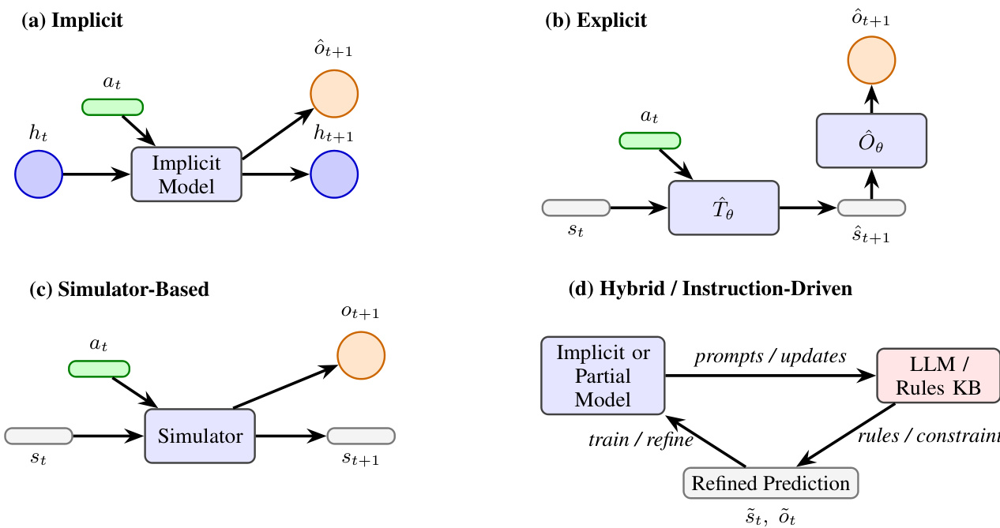  
Figure 4.3:Four paradigms of world modeling: (a)implicit, (b)explicit,(c)simulator-based, and(d)hybrid/instruction driven.  

Table4.1:Summary of AI world-modelmethods across paradigms,showing theirform(External or Internal),complexity, and paradigm.   

<html><body><table><tr><td>Method</td><td>Form</td><td>Complexity</td><td>Paradigm</td></tr><tr><td>ActRe[49]</td><td>·</td><td>Simple</td><td>Implicit</td></tr><tr><td>World Models [348]</td><td>·</td><td>Simple</td><td>Implicit</td></tr><tr><td>Dreamer [350]</td><td>●</td><td>Moderate</td><td>Implicit</td></tr><tr><td>Diffusion WM [353]</td><td>·</td><td>High</td><td>Explicit</td></tr><tr><td>GQN [354]</td><td>·</td><td>High</td><td>Explicit</td></tr><tr><td>Daydreamer[352]</td><td>0</td><td>High</td><td>Simulator-based</td></tr><tr><td>SAPIEN[351]</td><td>0</td><td>High</td><td>Simulator-based</td></tr><tr><td>PILCO [355]</td><td>0</td><td>Moderate</td><td>Explicit</td></tr><tr><td>AutoManual [108]</td><td>0</td><td>Simple</td><td>Other</td></tr><tr><td>MuZero [349]</td><td></td><td>High</td><td>Explicit</td></tr><tr><td>GR-2 [357]</td><td>·</td><td>High</td><td>Explicit</td></tr><tr><td>DINO-WM [358]</td><td>·</td><td>High</td><td>Explicit</td></tr><tr><td>COAT [356]</td><td>O</td><td>Moderate</td><td>Other</td></tr></table></body></html>  

# 4.4.1 Memory and the World Model  

Memory systems play a crucial role in the operation of world models.Whilea world model generates predictive representations offuture statesoractions, memory serves asthefoundationupon whichtheserepresentations are built and updated.The relationship between the world modeland memory can be viewed as a loop where the world model predicts potentialfutures, while the memory stores past experiences,observations,andlearned patterns,allowing for context-dependent reasoning and future predictions.  

Memory mechanisms can be structured in various ways, including:  

·Short-term memory:This enables the agent tohold and update its internal state temporarily,storing the most recent interactions or observations.This short-term context helps the agent make decisions in the immediate environment. ·Long-term memory: This serves as a more persistent repository of experiences and general knowledge about the environment. A world model can interact with long-term memory to refine its predictions, and it may use historical data to make more informed decisions or simulate more realistic futures.  

For example,in model-based RLframeworks likeDreamer[350],recurrentneural networksact as both the world model and aform of memory, maintaining alatent state that is updated witheachtime step to predictfuture states.This form of integrated memory allows the agent to both recall past interactions and anticipate future ones.  

# 4.4.2  Perception and the World Model  

Perception refers tothe agent's ability to sense and interpret its environmentthrough various modalities (e.g.,vision, touch,sound,etc.).The world modelrelies heavilyonaccurate sensory input toformcoherentpredictions about the environment.In many AI systems,the perception module converts raw sensor datainto ahigher-levelrepresentation, such as an image, sound wave, or other structured data.  

A key aspect of the interaction between the world model and perception is how the agent processesand integrates sensory input into the model.The world modeloften depends on processed data (such as features fromconvolutional neural networks orembeddings from transformers)to simulate potential futures.Additionally, the world model can guide perceptual processes by focusing atention on the most relevant sensory input needed to refine predictions.  

For example, in autonomous robotics,perception systems typicall detect objects or environmental features, which are then fed intoaworld modelthatpredicts howthe scene will evolve.RoboCraft[359]achieves this perception-tomodeling transformation by converting visual observations into particles andcapturing the underlying system structure through graph neuralnetworks.PointNet[360]further enriches perception systems'understanding of physical space by encoding unstructured 3D point clouds to capture spatial characteristics of the environment. In navigation tasks, OVER-NAV[361] further combine largelanguage models and open-vocabulary detection toconstruct the relationship between multi-modal signals and key information,proposing anomni-graph tocapture the structureoflocal space as the world model for navigation tasks.This feedback loop between perception and the world modelenables agents to update their perception dynamically based on ongoing predictions, allowing for real-time adaptation.  

# 4.4.3 Action and the World Model  

Action refers tothe decision-making processthrough which an agent interacts with its environment.Inagentic systems, actions aredriven bythe world model's predictions of future states.Theworld modelaids inplanning by simulating the outcomesofdiffrent actions before they are executed,allowing the agent tochoose the mostoptimalcourse of action based on the predicted consequences.  

The integration between world models and action modules can take various forms:  

·Model-based planning: World models explicitly modelthe environment's transition dynamics [349,362,107], allowing the agent to simulate multiple action sequences (rollouts)before selecting the most optimal one. · Exploration: World models also support exploration strategies by simulating unseen states or unexpected actions [363,350,364].These simulations enable the agent to evaluatethe potential benefits of exploring new parts of the state space.  

In model-based planning, MuZero[349] performs implicit planning through self-play and Monte Carlo Tree Search (MCTS),transformingcurrent staterepresentations intofuture state andreward predictions toguide thedecision-making process without prior knowledge of environment rules. In contrast,MPC[362]utilizes explicit dynamics models to predict multiple posible trajectories withinafinite time horizon,determines the optimalcontrol sequence by solving an optimization problem, and continuously updates planning using a receding horizon approach. Alpha-SQL[365], on the other hand,integrates an LLM-as-Action-Model within an MCTS framework to explore potential SQL queries within the database's“world model".This approach dynamically generates promising SQL construction actions based on partialquery states,enabling zero-shot Text-to-SQL interactions without task-specific fine-tuning.Unlike MuZero, which focuses on planning for decision-making in uncertain environments, Alpha-SQL applies MCTS in a specific task—guiding SQL query construction through self-generated actions within a complex database context.  

For exploration strategies,Nagabandi et al.[363] incentivizes agents toexplore unknown regions by providingreward mechanisms (exploration bonuses)for discovering new states.Dreamer[350] propose that world models can generate imaginary action sequences (imaginary rollouts),allowing agents to safely evaluate the benefits of new actions in simulated environments without risking real-world experimentation.Similarly,in the discrete world model Hafner et al.[364]agents effcientlyexplorecomplexenvironments bysimulating multiplepossible future states,effectively balancing the trade-off between exploration and exploitation.  

For example,in reinforcement learning,agents can employ a learned world model to simulate future trajectories in action-selection tasks.The world modelevaluates the potentialrewardsofdiferent actions,enabling theagent to plan effectively and take actions that maximize long-term goals.  

# 4.4.4 Cross-Module Integration  

While memory,perception,andactionarediscussed as separatemodules,the true strength of worldmodels lies in their ability to seamlessly integrate across these domains.A world modelcontinuouslyreceives sensory input, updates its internalmemory,simulatesfuturestates,anduses thisinformation todrive action selection.Theiterativefeedback loo between these modules allowsagents toengage in intellgent, goal-directed behaviorthatishighlyadaptivetochanges in the environment.  

This cross-module interaction is particularly relevant in complex,dynamic systems such as robotics, where anagent must continuouslyadaptitsinternalrepresentationofthe world, process sensory input, store relevant experiences,and take actions inrealtime.Inthecontextofembodiedagents,the integrationofthese modules ensures that predictions made by the world model are grounded in current observations and the agent's ongoing experiences.  

World models provide a fundamental unifying principle across modalities.Whether predicting physical outcomes in embodied robotics,anticipating visual changes on screens,or infering semantic relationships in text, thecore mechanism remains consistent: generating predictions about how states evolve under diferent actions.This crossmodal capacity explains why humans transition efortlessly between manipulating objects, navigating interfaces,and processing language—allactivities driven by the same underlying predictive architecture.Future AI systems may achieve similar integration by developing world models that bridge these traditionally separate domains through a common predictive framework.  

In summary,the relationshipbetween the world model andtheother modules—memory,perception,and action-forms the backbone of intelligent behaviorinAIsystems.Each modulecontributes toacycleofprediction,update,and action, allowing agents tofunction efectively in dynamic and uncertain environments.These interactions highlight the need for a holistic approach when designing agent architectures,where world models areclosely intertwined with sensory input, memory systems, and decision-making processes.  

# 4.5 Summary and Discussion  

The evolution of AI world models,fromearlycognitive insights toadvanced AIarchitectures, underscores the growing realization thattrue intellgencereliesonthe abilitytopredict,simulate,and imagine.Unlikeclassicalreinforcement leaning,where agents operate solely through trial-and-error interactions, world models enable foresightagents can plan,anticipate, and adapt to changes before they happen. This leap in cognitive modeling—whether implicit, explicit,or simulator-basedmarks asignificant shift inhow machinescanbeendowed withflexibility,robustness and generalization across tasks.  

An essential yetoften overlooked aspect of world models is their operation across multipletemporaland spatial scales Humanmental models seamlesslyintegrate predictions spanning milliseconds reflexiveresponses),seconds (immediate action planning),minutes tohours (taskcompletion)andeven years (lifeplanning)）[366].This multi-scalecapability allows usto simultaneously predict immediate physical dynamics while maintaining coherent long-term narratives and goals. Similarly,humans process spatial information acrosscales-from fine-grained object manipulation to navigation across environments toabstract geographicalreasoning. Current AI world models typically excel within narrow temporal and spatial bands, whereas human cognition demonstrates remarkable flexibility in scaling predictions up and down as context demands.This suggests that truly general-purpose AI world models may require explicit mechanisms for integrating predictions acrossmultiple time horizons and spatialresolutions,dynamically adjustingthe granularity of simulation based on task requirements.  

One centralchallnge in designing world models is the interplay between complexity and predictive accuracy. As discussed, implicit models,such asthose based on recurrent neural networks or transformers,offer simplicity and elegance,but theyoftencome withthetrade-offof limited interpretability.The model's internalstate is anopaque latent space,making it diffcult to enforce domain constraintsor provide guarantee about the accuracy of predictions. While such systems excelat capturing highlycomplexrelationships anddata-driven patterns,they alsoriskoverfitting or failing to generalize to unseen scenarios.  

Explicit models,bycontrast,offer greater transparency andcontrol.Byfactorizing state transitions and observations into separate functions,we gainaclearerunderstanding ofhow predictions areformed,andwecanmore easilyintegrate structuredknowledge,such as physicallaws or domain-specific rules. However,this approach comes with its own setofchallenges.First,itoften requires large amounts oflabeled trainingdata or simulated experiences to accurately capture environment dynamics.Second, even the most wel-structured explicit models may struggle with complex environments thatrequire fine-grained,high-dimensionalstaterepresentations,suchas in videoprediction orobotics.  

The simulator-based approachoffers a promising alternative, wherein agents rely on external environments—either physically grounded or simulated-for dynamic updates.This method avoids many of the challnges inherent in learning accurate world models fromscratch,as the simulator itself serves as the“oracle"of state transitions and observations.However, thereliance on simulatorsalso introduces limitations:simulatorsoften failtocapture the full richness ofreal-worlddynamics andcan be computationally expensive to maintainor scale.Furthermore,real-world environments introduce noise and variability thata purely learned or pre-configured modelmight missAs AI agents strive to performtasksinopen-ended, unpredictablesettings,therobustnessof their world models willbetested bythe gap between simulated and actual environments.  

A key theme that emerges from this discussion is the trade-off between generalization and specialization.The more specificaworldmodelistoa particulardomainortask,thelesslikely it is togeneralize acrossdiffrentcontexts.Models like MuZero[349]and Dreamer[350]exemplifythis:they excelat specificenvironments(e.g.Atarigames orrobotics) but require careful adaptation when transferred to new, uncharted domains.Conversely,implicit models—particularly thoseleveraging large-scaleneural networks—have the potentialto generalize acrosstasks butoftendosoatthecostof sacrificing domain-specific expertise.  

Moreover, integrating memory with world models is crucial for agents that needto handle long-term dependencies and pastexperiences.While world models excelat predicting the next statebased on immediate inputs,true intelligent behavioroften requires reasoning about distant outcomes.Long-term memory allows agents to store critical environmental knowledge,ensuring that short-term predictions are grounded ina broader understanding of the world. This fusion of memory,perception, and action, mediated bythe world model,creates afeedback loop where predictions shape actions, which in turn inform future predictions.  

The human analogy remains compelling: just as humans integrate sensory inputs, memories, and internal models to navigate the world, sotoo must inteligent agentscombine perception, memory, and action through their world models.Asthe fieldadvances,it isclear thataholisticapproachone thatunifies implicit,explicitandsimulatorbased methods—may be the key to achieving more robust, generalizable, and adaptive agents.Hybrid methods,like those usedin AutoManual[108] ordiscovery-based models[356]ofer exciting possibilities forblending learnedknowledge with structuredrules andreal-time interactions,potentially pushing the boundaries of what weconsidera world model.  

Looking forward,open questions remain. How can we ensure that world models exhibit long-term stability and reliability in real-world setings?How do we handle the inherent uncertainty in dynamic environments while maintaining the flexibility to adapt? Furthermore,asagents grow more sophisticated,how can wedesign systems that are both efficient and scalable acrossincreasingly complex tasks without incurring massve computational costs?  

Inconclusion,thefutureofworldmodels liesintheirabilitytobalancetheneedforgeneralizationwiththerequirement for domain expertise.By continuing to explore and refine the interplay between model simplicity and complexity, betweenexternal and internalapproaches, we move closer todeveloping AI systems that not only understand the world but can actively shape their understanding to navigate and adapt in a rapidly changing reality.  

# Chapter 5  

# Reward  

  
Figure 5.1: Illustrative Taxonomy of Reward system  

Rewards help the agent distinguish between beneficial and detrimental actions,shaping its learning process and influencing its decision-making.This chapter first introduces common reward substances inthe human body and the corresponding reward pathways.Then, thereward paradigm under the agent and the diferent methods involved are defined.In thediscussion section, the influencerelationship betweenother modules is described, and the existing methods aresummarized,then the problems that need to be solved inthefuture andthe optimization directions are discussed.  

Table 5.1: The comparison of human common reward pathways   

<html><body><table><tr><td>Reward Pathway</td><td>Neurotransmitter Mechanism</td><td></td></tr><tr><td>Mesolimbic path- way [406]</td><td> Dopamine</td><td>Dopaminergic neurons in the ventral tegmental area (VTA) extend pro- jections to the nucleus accumbens, where they release dopamine to regulate reward-related signaling. Dopamine diffuses across the synaptic cleft and binds to dopamine receptors—primarily D1-like (excitatory via Gs proteins, increasing cAMP) and D2-like (inhibitory via Gi pro- teins, reducing cAMP)—thereby modulating reward, motivation, and</td></tr><tr><td>Mesocortical path-Dopamine way [407]</td><td></td><td>reinforcement. Dopaminergic projections from the VTA reach the prefrontal cortex (PFC). Here, dopamine binds to its receptors to influence cognitive functions such as decision-making, working memory, and emotional</td></tr><tr><td>Nigrostriatal path- Dopamine way [407]</td><td></td><td>regulation, all of which contribute to evaluating and anticipating rewards. Dopamine's action on D1 and D2 receptors in the striatum helps shape both motor routines and reward-related behaviors.</td></tr><tr><td>Locus coeruleus [408]</td><td> Norepinephrine</td><td>Neurons in the locus coeruleus release norepinephrine to widely dis- tributed targets across the brain. At synapses, norepinephrine binds to adrenergic receptors(α and β subtypes), modulating neuronal excitabil- ity, arousal, attention, and stress responses. These modulatory effects</td></tr><tr><td>Glutamatergic pro- jection [409]</td><td>Glutamate</td><td>can indirectly influence reward processing and decision-making circuits. Upon releasing into the synaptic cleft, glutamate binds to both ionotropic receptors (such as AMPA and NMDA receptors) and metabotropic re- ceptors located on the postsynaptic neuron, thereby initiating excitatory signaling. This binding produces excitatory postsynaptic potentials and</td></tr><tr><td>GABAergic modu-  Gamma- lation [410]</td><td>Aminobutyric Acid (GABA)</td><td>is crucial for synaptic plasticity and learning within reward circuits. GABA serves as the principal inhibitory neurotransmitter. At the synapse, GABA binds to GABAA receptors and GABAB receptors. This binding results in hyperpolarization of the postsynaptic cell, thereby providing inhibitory regulation that balances excitatory signals in the reward net- work.</td></tr></table></body></html>  

# 5.1 The Human Reward Pathway  

The brain's reward system is broadly organized into two major anatomical pathways.The first is the medial forebrain bundle,whichoriginates inthebasalforebrainandprojects throughthe midbrain,ultimatelyterminating inbrainstem regions.The second is the dorsaldiencephalicconduction system,whicharises from therostralportion of the medial forebrain bundle,traverses the habenula,andprojects toward midbrain structures[407].The feedback mechanisms and substances inthehuman brain arecomplex,involvingavarietyof neurotransmiters,hormones,andother molecules, which regulate brainfunction,emotions,cognition,andbehaviorthroughfeedback mechanismssuch as neurotransmiter systems and reward circuits.Feedback mechanismscan be positive(such as feedbackinthe reward system)or negative (such asinhibiting excessive neural activity).Wellknown feedback substances [41l]includedopamine,neuropeptides, endorphins, glutamate, etc.  

Dopamine is a signaling molecule that plays an important role in the brain, afecting our emotions, motivation, movement,andother aspects[412].Thisneurotransmiteriscriticalforreward-based learning,butthis functioncanbe disrupted in many psychiatricconditions,such as mood disorders and addiction.The mesolimbic pathway[406],akey dopaminergic system,originates from dopamine-producing neurons in the ventral tegmentalarea (VTA)and projects to multiple limbic andcorticalregions,including the striatum, prefrontalcortex,amygdala,and hippocampus.This pathway plays acentralrole inreward processing, motivation,andreinforcementlearning,and is widelyrecognized as acore component of the brain's reward system. Neuropeptides are another important classof signaling molecules in the nervous system, involved inavariety offunctions from mood regulation to metabolic control, and are slow-acting signaling molecules.Unlike neurotransmitters,which arelimitedtosynapses,neuropeptide signalscan affect a wider range of neural networks and provide broader physiological regulation.There is a significant cortical-subcortical gradientin thedistributionofdiffrent neuropeptidereceptors inthe brain.Inaddition,neuropeptide signaling ha been shown to significantly enhance the structure-function coupling of brain regions and exhibita specializedgradient from sensory-cognitive toreward-physicalfunction[413].Table 5lists thecommon reward pathways inthehuman brain,the neurotransmitters they transmit, and the corresponding mechanisms of action,describing the basic framework of the human brain reward system.  

# 5.2 From Human Rewards to Agent Rewards  

Having examined the foundations of human reward pathways, we now turn tohow artificialagents learn andoptimize behavior through reward signals.While biological systems rely on complex neurochemical and psychological feedback loops, artificial agents operate using formalized reward functionsdesigned to guide learning and decision-making. Though inspired byhuman cognition,agent reward mechanisms arestructurallyandfunctionally distinct.Understanding the analogies anddisanalogies between these systems iscrucialfor aligning artificialbehavior with human preferences.  

In humans,rewards are deeplyembedded inarichweb ofemotional,social, and physiologicalcontexts.They emerge through evolutionarily tuned mechanisms involving neurotransmitters like dopamine and are shaped by experiences, culture, and individual psychology. Incontrast, artificialagents relyon mathematically defined reward functions that are externally specified and precisely quantified.These functions assgn scalar or probabilisticfeedback to actionsor states, providing a signal for optimization algorithms such as reinforcement learning [3, 414].  

One key distinction lies in the programmability and plasticity of agent rewards.Unlike human reward systems, which are constrained by biological architecture and evolutionary inertia, agent reward functions are full customizable and can berapidly redefined or adjusted based on task requirements.This flexibility enables targeted learning but also introduces design challenges—specifying a reward function that accurately captures nuanced human values is notoriously difficult.  

Another important disanalogy concerns interpretability and generalization.Human rewards are often implicit and context-dependent, whereas agent rewards tend to be explicit and task-specific.Agents lack emotional intuition and instinctualdrives; theirlearning dependsentirelyontheform andfidelityof the reward signal. While frameworks like reinforcement learning from human feedback (RLHF) attempt to bridge this gap by using preference data to shape agent behavior[12], suchmethods stillstruggle withcapturing the fullcomplexity of human goals,especially when preferences are intransitive, cyclical, or context-sensitive [321].  

Moreover, atempts to borrow from human reward mechanisms—such as modeling intrinsic motivation or social approval—face limitations due tothe absence ofconsciousness,embodiment, and subjective experience in artificial agents.Consequently,whilehuman reward systems ofer valuable inspiration, thedesign of agentreward functions must addressfundamentally different constraints,including robustnessto misspecification, adversarial manipulation, and misalignment with long-term human interests.  

The following section willdelve deeper into agent reward models,focusing on their design principles,evolution,and how these models selectively incorporatehuman-inspired insights tooptimize artificialbehavior within formal systems.  

# 5.3 AI Reward Paradigms  

Rewards also exist in intellgent agents,especially inreinforcement learning scenarios. Rewards are the core signal used to guide how intelligent agents act intheenvironment.Theyexpressfeedback onthebehaviorofintelligent agents and are used to evaluate anaction'squality inacertainstate, thereby aecting thedecision-makingof subsequent actions.Throughcontinuous trialanderrorandadjustment, intelligent agents learn tochoose behavioral strategies that can obtain high rewards in different states.  

# 5.3.1 Definitions and Overview  

In reinforcement learning,thereward modeldictateshow an agent is provided with feedback according tothe actions it performs within its environment.This model plays acrucialrole in guiding the agent's behavior by quantifying the desirability of actions in a given state, thus influencing its decision-making.  

FormalDefinition. The agent's interaction with its environment can be framed within the formalism of a Markov Decision Process (MDP) [415], which is represented as:  

$$
\boldsymbol{\mathcal{M}}=(\boldsymbol{\mathcal{S}},\boldsymbol{\mathcal{A}},\boldsymbol{P},\boldsymbol{r},\gamma),
$$  

where:  

· $s$ denotes the state space, encompassing all possible states in the environment.   
· $\mathcal{A}$ denotes the action space, which encompasses all actions available to the agent at any given state.   
· $P(s^{\prime}|s,a)$ defines the state transition probability. It represents the likelihood of transitioning to state $s^{\prime}$ after the agent takes action $a$ in state $s$ .   
· $r(s,a)$ specifies the reward function, which assigns an immediate scalar reward received by the agent for executing action $a$ in state $s$ .   
· $\gamma\in[0,1]$ is the discount factor, which controll the agent's preference for immediate versus future rewards by weighting the contribution of future rewards to the overall return.  

The reward function $r(s,a)$ serves as a fundamental component in the formulation of the Agent Reward Model. It is mathematically represented as:  

$$
r(s,a):S\times\mathcal{A}\to\mathbb{R}
$$  

This function returns a scalar reward based on the agent's current state $s$ and the action $a$ it selects. The scalar value $r(s,a)$ is a feedback signal that indicates the immediate benefit(or cost)ofthe chosen action in the given state.This reward signal guides the agent's learning processas it helps evaluate the quality of actions takenwithin specific contexts.  

Objective of the Agent Reward Model.The agent's primary objective is to maximize itsoverallcumulative reward over time.This is typicallachieved by selecting actions that yieldhigherlong-termrewards,which are captured in the form of the return $G_{t}$ at time step $t$ ,defined as the sum of future discounted rewards:  

$$
G_{t}=\sum_{k=0}^{\infty}\gamma^{k}r_{t+k},
$$  

where $r_{t+k}$ denotes the reward received at time step $t+k$ , and $\gamma^{k}$ is the discount factor applied to rewards received at time step $t+k$ . The agent aims to optimize its policy by maximizing the expected return over time.  

Ata higher level,thereward modelcanbeclassifiedintothreecategories basedontheoriginof thefeedback signal:i) extrinsic reward,ii) intrinsic reward,ii)hybridrewardand iv)hierarchicalmodel.Each of thesecategoriescanbe furthersubdivided intosmallersubclasses.Figure 5.2illustrates different typesofrewards.Next, we willexplore these different types of reward in more detail, outlining the distinct features and applications of each type.  

  
Figure 5.2: Illustration of different types of reward.  

# 5.3.2 Extrinsic Rewards  

Extrinsic rewards are externally defined signals that guide an agent's behavior toward specific goals. In artificial learning systems,especiallyreinforcement learning,these signalsserve as aproxy forsuccessthat shape the policy throughmeasurableoutcomes.However,the structure anddelivery of theserewards significantlyinfuence the leaning dynamics, which present different trade-offs depending on how feedback is distributed.  

Dense Reward.Dense reward signals provide high-frequency feedback,typically at every steporaftereach action.This frequent guidance accelerates learning by allowing agents to immediately associate actions with outcomes.However, dense feedbackcan sometimes incentivize short-sighted behavior or overfit toeasily measurable proxies rather than deeper alignment.  

For example, InstructGPT[43] uses human rankings of model outputs to provide continuous preference signals throughout fine-tuning,enabling efficient behavior shaping.Similarly,Cringe Loss[416]and its extensions [374] transform pairwise human preferences into dense training objectives,offering immediate signal ateach comparison Direct Reward Optimization (DRO)[367] further simplifes this paradigm by avoiding pairwise comparisons entirely, associating each response with a scalar score—making the reward signal more scalable and cost-effective. These methods exemplify how dense feedback facilitates fine-grained optimization but must be carefully designed to avoid superficial alignment.  

Sparse Reward. Sparse rewards are infrequent and typically only triggered by major milestones or task completions. While they often reflect more meaningful or holistic successcriteria, their delayed nature can make credit assignment more difficult, especially in complex environments.  

PAFT[376] exemplifies this challenge by decoupling supervised learning and preference alignment, with feedback appliedonly at select decision points.This sparsityreflectsa moreglobal notion of successbut increases theburdenon optimization.Similarly, SimPO[377] uses log-probability-based implicit rewards without dense comparisons.The sparsitysimplifiesthe training pipeline butcanlimitresponsiveness to subtle preference shifts.Sparse reward systems thus tend to be more robust but demand stronger modeling assumptions or more strategic exploration.  

Delayed Reward. Delayed rewardsdefer feedback untilaftera sequence of actions,requiring agents toreason about long-term consequences.This setup is essentialfor tasks where intermediate steps may be misleading oronly make sense in retrospect.The challenge lies in atributing outcomes toearlier decisions,which complicates learning but encourages planning and abstraction.  

Contrastive Preference Optimization(CPO)[384]trains models bycomparing sets of translations rather than evaluating each one in isolation.The reward signal arises only after generating multiple candidates,reinforcing patterns across iterations. Nash Learning from Human Feedback [385] similarly delays feedback until the model identifies stable strategies through competitive comparisons.These methods leverage delayed rewards to push beyond surface-level optimization,aligning more withlong-termgoalsatthecostofslowerconvergence and morecomplextraining dynamics.  

Adaptive Reward. Adaptive rewards evolve dynamicall in response to the agent's behavioror learning progress.By modulating the reward functionsuch as increasing task difficulty or shifting reward targets,this approach supports continualimprovement,especially in non-stationary or ambiguous environments.However,it introduces additional complexity in reward design and evaluation.  

Self-Play Preference Optimization (SPO)[386]adapts rewards based on self-play outcomes,using socialchoice theory to aggregate preferences and guidelearning.This approach alows the system torefine itself by evolving internal standards.f-DPO[373]buildsonthis ideabyintroducing divergenceconstraintsthatadapttherewardlandscape during training.Bytuning alignment-diversitytrade-offs dynamically, these methodsenable robust preference modeling under uncertainty, though they require careful calibration to avoid instability or unintended bias.  

# 5.3.3 Intrinsic Rewards  

Intrinsic rewards serve asinternalgenerated signalsthatmotivate agents toexplore,learn,andimprove,independent of external task-specific outcomes.These rewards are often structured to promote generalization,adaptability,and self-directed skillacquisition—qualitiescriticalforlong-term performance in complex or sparse-reward environments. Different intrinsic reward paradigms focus on fostering distinct behavioral tendencies within agents.  

Curiosity-Driven Reward. This reward encourages agents to reduce uncertainty by seeking novel or surprising experiences.Thekeyconcept is to incentivizethe agent to explore novel states where prediction errors aresignificant. This paradigm excels insparse-reward settings by promoting information acquisitionwhen external guidance is limited. For example, Pathak et al.[387]leverage an inverse dynamicsmodel to predict the outcome of actions,creating a feedback loop that rewards novelty.Plan2Explore[389] extends this further by incorporating forward planning to actively target areas of high epistemic uncertainty,thereby enabling faster adaptation to unseen environments.While effective at discovery,curiosity-driven methods can be sensitive to noise or deceptive novelty without safeguards.  

Diversity Reward. Diversity reward shifts focus from novelty to behavioral heterogeneity,encouraging agents to explore a wide range of strategies ratherthan converging prematurely on suboptimal solutions.This approach is particularly usefulin multi-agent or multimodal settings,where strategic variety enhances robustness andcollective performance.LIR[390]exemplifies this by assgning personalized intrinsic signals todifferent agents,driving them toward distinct roles while maintaining sharedobjectives.Diversity-driven exploration fosters broader policycoverage but may require careful balancing to avoid destabilizing coordination or goal pursuit.  

Competence-Based Reward. Competence-based reward aims to foster learning progressby rewarding improvements in the agent's task proficiency.This reward adapts dynamically as the agent grows morecapable,which creates a self-curriculum that supportscontinual skillacquisition.Skew-Fit[392]facilitates this through entropy-based goal sampling,encouraging agents to reach diverse states while maintaining challenge.CURIOUS [391] further automates curriculum generation by selecting goals that maximize learning progress over time.Competence-based methods are well-suited for open-ended environments,though they often require sophisticated estimation of progress and goal difficulty.  

Exploration Reward.Exploration reward directly incentivizes the agent toengage with under-exploredstatesor actions, which emphasize breadth over depth in environment interaction. Unlike curiosity,which focuseson unpredictability, exploration rewardoften targets coverage or noveltyrelative to the agent's visitationhistory. RND[394]exemplifies this by rewarding the prediction error of arandomly initialized network,pushingthe agent towardunfamiliar states. This approach helps preventpremature convergence and encourages robustnessthough it maylack focus if not paired with meaningful learning objectives.  

Information Gain Reward. Information gain reward formalizes exploration as a processof uncertainty reduction, which guides agents totake actions that yield the highest expectedlearning.This reward is grounded ininformation theory andis especiallypowerfulinmodel-basedorreasoning-intensive tasks.CoT-Info[397]appliesthistolanguage models by quantifying knowledge gain at each reasoning step,optimizing sub-task decomposition.VIME[398] similarly employs Bayesian inference to rewardbeliefupdates about environmental dynamics.Byexplicitly targeting informationalvalue,these methods ofer principled exploration strategies,thoughtheyoften incur highcomputational cost and require accurate uncertainty modeling.  

# 5.3.4 Hybrid Rewards  

Hybrid reward frameworks integrate multiple sources of feedback, most commonly intrinsic and extrinsic rewards, to enable more balanced and adaptive learning.By combining the exploratory drive of intrinsic rewards with the goal-directed structure ofextrinsic rewards,these systems aim to improve both sample effciency and generalization. This paradigm is especialy beneficial in complex environments or open-ended tasks,where pure reliance on either feedback type may be insufficient.  

A core advantage ofhybridrewards is theircapacity toresolve the exploration-exploitation trade-offdynamically.For instance,Xiong et al.[403]combine intrinsic exploration with extrinsic human feedback within thecontextof RLHF. Using areverse-KLregularized contextual bandit framework,they facilitate strategic exploration while aligning the agent's actions with human preferences.The method integrates intrinsic and extrinsic rewards through an iterative DPO algorithm and multi-steprejection sampling,optimizing exploration and alignment without compromising efficiency.  

# 5.3.5 Hierarchical Rewards  

Hierarchicalrewardarchitectures decompose complexobjectives into layered subgoals,each associated with distinct reward signals.This structure mirrors the hierarchical organization of many real-world tasks, allowing agents to coordinate short-term decisions with long-term planning.By assigning lower-levelrewards to immediate actions and higher-levelrewards toabstract goals,agentscan learn compositionalbehaviors that scale more effectively tocomplex environments.  

In language modeling,Token-level Direct PreferenceOptimization(TDPO)[405]ilustrates this principle by aligning LLMs through fine-grainedtoken-levelrewards derived from preference modeling. Using forward KL divergence and the Bradley-Terry model, TDPO simultaneouslyrefines localchoices and globalcoherence, improving alignment with nuanced human preferences.Thehierarchicalreward process here is not merely a structuraldesign but afunctionalone: reinforcing both micro-decisions and macro-outcomes in a coordinated fashion.  

More generally,hierarchicalrewardscan serve as scafolding for currculum learning,where agents progressively lean from simpler subtasks before tackling the overarching objective. In LLMagents,this might mean structuring rewards for subcomponents like tool-use,reasoning chains,orinteraction flows,each of whichcontributes tobroader task success.  

# 5.4 Summary and Discussion  

# 5.4.1 Interaction with Other Modules  

In intelligent systems,reward signals function not only as outcome-driven feedback but as centralregulators that interface with core cognitive modulessuchas perception,emotion,and memory. Inthe context of LLM-based agents, these interactions become particularlysalient,as modules likeatention,generation style,andretrieval memorycan be directly influenced through reward shaping, preference modeling, or fine-tuning objectives.  

Perception. In LLM agents, perception is often realizedthrough attention mechanisms that prioritize certain tokens, inputs, or modalities. Reward signalscan modulate these atention weights implicitly during training,reinforcing patterns that correlate with positive outcomes. For example, during reinforcement fine-tuning,reward models may upweight specific linguistic features—suchas informativeness,factuality,orpoliteness—causingthe model to attend more to tokens thatalign with these traits.This parallels how biological perception prioritizes salient stimuli via reward-linkedatentional modulation[417].Over time,the agent internalizesa perception policy:not merely“what is said," but“what is worth paying attention to" in task-specific contexts.  

Emotion.Though LLMs do not possess emotions in the biological sense,reward signalscan guide the emergence of emotion-like expressons andregulate dialogue style.In human alignment settings, models are often rewarded for generating responses that are empathetic,polite,or cooperativeleading to stylistic patterns that simulate emotional sensitivity.Positive feedback mayreinforceafriendlyorsupportivetone,whilenegativefeedback suppresses dismissive or incoherent behavior.This process mirrors affect-driven behavior regulation in humans [418],and allows agents to adapt their interaction style based onuser expectations,afective context, or application domain.Inmulti-turn settings, reward-modulated style persistence can give rise to coherent personas or conversational moods.  

Memory. Memory in LLM agents spans short-term context(e.g.,chat history) and long-term memory modules such as retrieval-augmented generation (RAG)or episodic memory bufers.Reward signals shape how knowledge is encoded, reused,ordiscarded.Forinstance,fine-tuningonpreference-labeleddatacanreinforcecertainreasoningpathsorfactual paterns,efectively consolidating them into the model's internal knowledge representation. Moreover, mechanisms like experience replay orself-reflection—where agents evaluate past outputs with learned rewardestimators-enable selective memory reinforcement, akin to dopamine-driven memory consolidation in biological systems [419]. This allows LLM agents to generalize from prior successful strategies and avoid repeating costly errors.  

In general,reward in LLM-based agents is nota passive scalar signal butan active agent of behavioral shaping.It modulatesatentiontopromote salientfeatures,guidesstylisticandaffectiveexpressiontoalignwithhuman preferences, and structures memory to prioritize useful knowledge.As agents evolve toward greater autonomy and interactivity, understanding these cross-modulereward interactions willbeessentialforbuilding systems that are notonlyintelligent, but also interpretable, controllable, and aligned with human values.  

# 5.4.2 Challenges and Directions  

Although extensive research has been conducted on various reward mechanisms,severalpersistent challenges remain. One fundamental issue is reward sparsity and delay. In manyreal-world scenarios,reward signals are often infrequent anddelayed,making itdiffcultforanagenttoaccuratelyatributecedit tospecificactions.This,intu,incrasesthe complexity of exploration and slows down the learning process.  

Another significant challnge is the potential for reward hacking.Agents,in their pursuit of maximizing rewards, sometimes exploit unintended loopholes in the reward function. This can lead to behaviors that diverge from the intendeddesign goals,particularly in complex environments where optimization objectives may not always align with the true task requirements.  

Moreover,the processof reward shaping presents adelicatebalance.While shaping rewardscan accelerateleaming by guiding anagent toward desired behaviors,excessve or poorlydesigned shaping may lead tolocaloptima,trapping the agent in suboptimalbehaviors.Insomecases,itmayevenalterthefundamentalstructureoftheoriginaltask,making it difficult for the agent to generalize to other scenarios.  

Many real-world problems are inherentlymulti-objective in nature,requiring agents tobalance competing goals.Under a single reward function framework, finding theright trade-offs between these objectives remains an open problem. Ideally,ahierarchicalreward mechanismcould bedesigned to guide learning ina structured,step-by-step manner. However, constructing such mechanisms effectively is still a challenge.  

Finally,reward misspecificationintroduces further uncertainty andlimits generalization.Often,areward function does not fullycapture the true task goal,leading to misalignment between the agent's learning objective andreal-world success.Additionally,manyrewardfunctions aretailored to specificenvironments andfailto generalize whenconditions change or tasks shift, highlighting the need for more robust reward models.  

Addressing these challenges requires novel approaches.One promising direction is to derive implicit rewards from standard examples or outcome-based evaluations, which can help mitigate reward sparsity issues.Additionally, decomposing complex tasks into hierarchical structures and designing rewards from the botom up can oer a more systmatic approach,even in multi-objective settings.Furthermore,leveraging techniques such as meta-learning and meta-reinforcementleaming can enhance the adaptability of reward models,allowing agents to transfer knowledge across tasks andperform efectively in diverseenvironments.By exploring these avenues,we can move toward more reliable and scalable reward mechanisms that better align with real-world objectives.  

# Chapter 6  

# Emotion Modeling  

Emotions are a key part ofhow humans think, make decisions,and interact with others.They guide us tounderstand situations,makechoices,and buildrelationships.Antonio Damasio,inhis book Descartes'Error[25],explained that emotions are not separate fromlogic.Instead,theyaredeeplyconnected to how we reason and act.When developing LLM agents, adding emotional capabilities can potentially make these systems smarter, more adaptable,and better understand the world around them.  

For LLMagents,emotions canactas adecision-making tool, much likethey do for humans.Emotions help us prioritize tasks,understand risks, and adapt to new chalenges.Marvin Minsky,in The Emotion Machine[420], described emotions asa way toadjust our thinking processes,helping us solve problems inamore flexible andcreative manner. Similarly,LLMagents withemotion-likefeatures couldimprove their abilityof solvingcomplex problems and making decisions in a more human-style.  

However, the integration ofemotions into LLM agents is stillin its early stages.Researchers are just starting to explore how emotional capabilitiescan improve these systems.Furthermore, there is great potential for LLM agents to support human emotional wellbeing,whether through empatheticconversations, mentalhealth support, or simply building beter connections with users.This promising butchallenging arearequires collaboration between fields such as psychology,cognitive science,and AI ethics.As research advances,emotion-understanding LLM agents could redefine how we interact with technology,creating deeper trust and more meaningfulrelationships betweenhumans and machines.  

In the following subsections, we willdelve deeper into the roleofemotions in shaping LLMagents.We willexplore how emotions can be used to enhance learning and adaptability,how LLMs understand human emotions, and how these systems expressand modeltheirown emotional states. We willalso examine how emotions can be manipulated to influence LLMagents'behaviorandpersonalities,as wellas theethicaland safetyconcerns that arise fromthese capabilities.Eachof these discussions builds onthe foundationalimportance ofemotion tocreateLLMagents that are more intelligent, empathetic, and aligned with human values.  

# 6.1 Psychological Foundations of Emotion  

Psychological and neuroscientific theories of emotion provide essential frameworks for developing emotionally intelligent LLM agents.These theories can be categorized into several major approaches,each offering unique perspectives on how emotions function and how they might be implemented in AI systems.  

CategoricalTheories.These models posit that emotions exist as discrete,universalcategories with distinct physiological and behavioral signatures.Ekman's theory of basic emotions [421]identifies six fundamental emotions (anger, disgust,fear, happiness,sadness, and surprise that are recognized across cultures and expressed through specific facial configurations.This discrete approach has significantly infuenced affective computing, with many emotion classification systems in AI adopting these labels for training [422, 423]. For LLMagents,categorical frameworks provide clear taxonomies for classifying user emotions and generating appropriate responses. However, they face criticismforoversimplifying the complex,blended nature of human emotional experience[424]and may not capture cultural variations in emotional expression [425].  

Dimensional Models. Rather than discrete categories, dimensional approaches represent emotions as points in a continuous space defined by fundamental dimensions. Russells Circumplex Model[426] maps emotions onto two primary dimensions:valence (pleasure-displeasure)and arousal(activation-deactivation).This framework enables more nuanced trackingof emotionalstates.It distinguishes between high-arousal panic and low-arousalanxiety despite both having negative valence.The PAD (Pleasure-Arousal-Dominance) model[427] extends this by adding a dominance dimension,capturing the sense ofcontrolor power associated with emotionalstates.Thesecontinuous representations have proven valuable forLLMsystems that need to generate emotionally gradedresponses ortrack subtle shifts inuser affect over time[428,429,430].Dimensionalmodels allow forfine-grainedcontrolover generatedcontent,enabling humansor agents to modulate tone along continuous scalesrather than switching between discrete emotional states.  

Hybrid and Componential Frameworks. Recognizing limitations in pure categorical or dimensional approaches, severaltheories integrate aspects of both.Plutchik's Wheel of Emotions[431] arranges eight primary emotions in a wheel structure with intensity gradients and dimensional properties, allowing for the representation of complex emotional blends (e.g.,love as a mixture of joyand trust).Meanwhile,componential models like Scherer's Component Process Model (CPM)[432]conceptualize emotions as emerging from synchronized components including cognitive appraisal,physiologicalarousalaction tendencies,andsubjectivefelings.ParticularlyinfluentialinAIreseachisthe OCC (Ortony-Clore-Collins) model[433], which defines 22 emotion types based on how events, agents, or objects are evaluatedrelative to goals and standards.These appraisal-based frameworks havebeen implementedin dialogue systems that generate emotional responses through rule-based evaluation of situations [434,435]. For LLM agents, such models provide computational structuresforevaluating text input and selectingcontextuallappropriateemotional responses, improving both coherence and perceived empathy [436, 437].  

Neurocognitive Perspectives.The neuroscience of emotion ofers additionalinsights forLLMarchitectures.Damasio's somatic marker hypothesis[25]emphasizes how emotions,implemented through body-brain interactions,guide decisionmaking by associating physiological states with anticipated outcomes.This interaction between thelimbic system and the cortexshows atwo-processarchitecture:fast“alarm"signals in the limbic system,like those processed by the amygdala, work alongside slower, more deliberate reasoning in the cortex. Contemporary LLM systems have begun implementing analogous architectures, where fast sentiment detection modules work in parallel with more thorough chain-of-thought reasoning[436,437].Recent evidence further suggests thatopponentcircuitryinthe striatum enables distributionalreinforcement learning byencodingnot just meanrewards but entireprobability distributions,offring a neural basis foremotion-influenced decision-making under uncertainty[438].Similarly,LeDoux's distinction between “low road"（quick, automatic)and“high road"(slower,cognitive)fear processing [24]suggests design patterns for systems that need both immediate safetyresponses and nuancedemotional understanding.Minsky'sframing of emotions as“way to think"[420]thatreorganize cognitive processes has influenced frameworks like EmotionPrompt[428]and Emotion-LLaMA [423], where emotional context dynamically reshapes LLM reasoning.  

These theoretical frameworks increasingly inform the development of emotionally intellgent LLM agents.Categorical models provide clear labels for emotionclassification tasks [423,429],while dimensional embeddings enable continuous controlover generated text[428].Hybrid approaches help systems handle mixed emotions and emotional intensity.Appraisal-based methods,particularly those derived from theOCC model,allowLLMs to evaluate narrative events oruser statementscontextualy,selecting appropriateemotionalresponses thatfosterrapport andtrust [439]. Neuroscientifically-inspired dual-process architectures combine“fast"sentiment detection with“slow"deliberative reasoning,enabling both quick safety responses and deeper emotional understanding [436, 437].While explicit neurocognitive mechanisms (like dedicated“amygdala-like"pathways)remainrare in current LLM pipelines,emerging research explores biologically-inspired modules tohandle urgent emotional signals and maintain consistent emotional states across extended interactions [440, 441].  

Emotionisakeypartofhuman intellgence,anditwillikelybecomeone ofthekeycomponentsordesignconsiderations of LLM agents.Onekey futuredirection is systematicallytranslating these psychologicaland neuroscience theories into an LLM agent's internal processes. Techniques for translating might include using dimensional models (e.g., valence/arousal/dominance)aslatent states that influence generation or adopting explicit rule-basedappraisals (OCC)to labeluser messages and shape the agent's subsequent moves.Hybrid approaches offer acompelling balance: an LLM could first recognizeadiscretecategory(e.g.“fear")butalsogauge itsintensityandcontroldimensionforfinergrained conversation.Such emotion-infused architectures might yield more coherent“moods"over time,analogous to how humans sustain afective statesrather than resetting at every turn.Explicit alignment with psychological theories also enhances interpretability:designers can debug orrefine the agent's responses bycomparing them to well-established emotion constructs, rather than dealing with opaque emergent behaviors.  

A second directionis harnessing these theories to improveaffectionateor supportive interactions,oftenreferredto as emotional alignment.For example,circumplex or PAD-based tracking can help an LLM detect negative valence and higharousalinauser's text andrespond soothingly (e.g.,lowering arousal,ofering empathetic reappraisals). In mental health or counseling scenarios,an appraisal-informed method could let the agent validate the user's feelings and understand their situation in terms of goal incongruence or perceived blame, which helps craftresponses that convey genuine empathy.Grounding emotional outputs incognitive theories (like“relief"if a negativeoutcome is avoided,or“gratitude"whenauserhelpsthesystem)likewisemakes interactions feelmore naturalandethically aligned. These enhancements are particularly salient as LLMs migrate intoreal-worldapplications like customer service,elder care,and tutoring, where emotional sensitivity can improve outcomes and user well-being.By incorporating robust psychological and limbic-system insights,developers can design LLM agents that notonly reason more efectively but also provide sincere emotional support, bridging the gap between computational precision and human-centric care.  

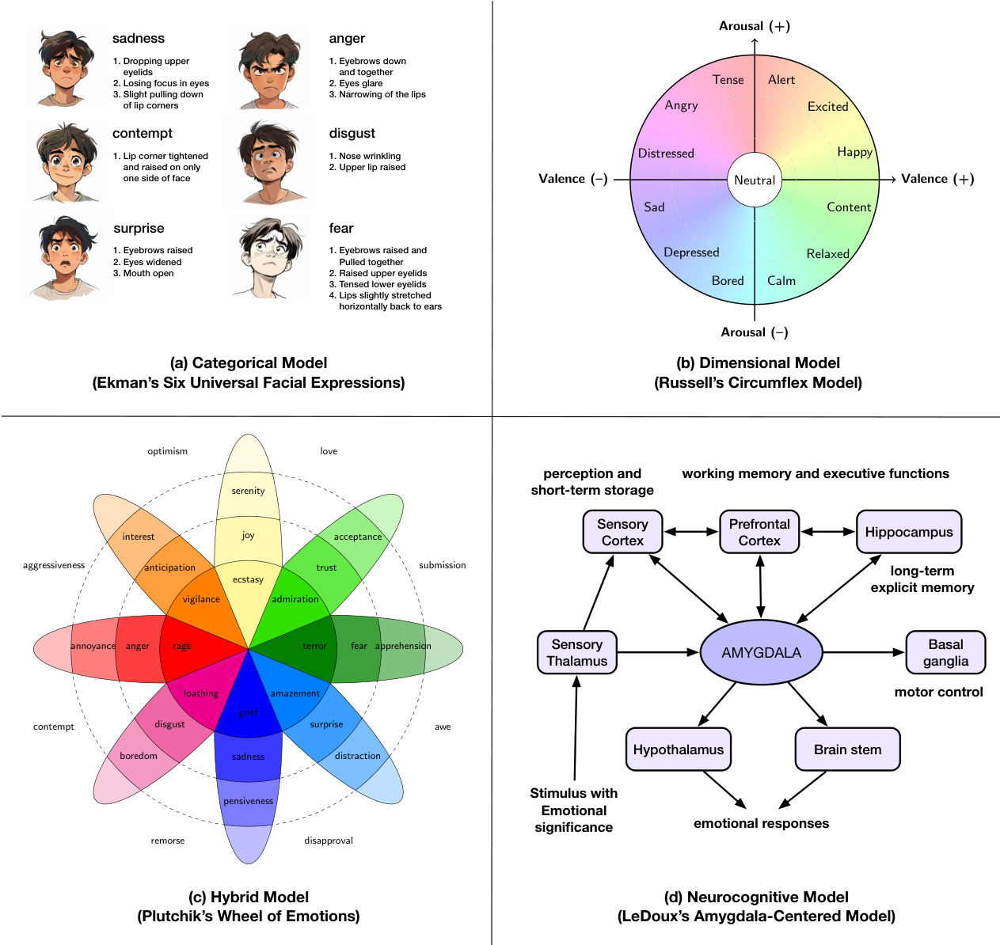  
Figure 61: Visualization and examples of major emotion theory categories.(a) Categorical Theories: Ekman's six basic emotions [421] showing discrete emotional states. (b)Dimensional Models: Russells Circumplex[426] representing emotions as coordinates in continuous space.(c)Hybrid/Componential Frameworks: Plutchik's Wheel [431] combining intensity gradients with categorical emotions.(d) Neurocognitive Perspectives: LeDoux's AmygdalaCentered Model[24] showing dual-pathway procesing of emotional stimuli.These psychological foundations inform diferent approaches to emotion modeling in AI systems,from discrete classification to dimensionalrepresentations, appraisal-based reasoning, and multi-pathway information processing.  

# 6.2 Incorporating Emotions in AI Agents  

The integration ofemotionalintelligence into large language models (LLMs)hasemerged asatransformative approach to enhancingtheir performance and adaptability. Recent studies,such as those of EmotionPrompt[422],highlight how emotional stimuli embedded in prompts can significantly improve outcomes across various tasks,including a notable $10.9\%$ improvement in generative task metrics such as truthfulness and responsibility. By influencing the attention mechanisms of LLMs,emotionall enriched prompts enrich representation layers andresultin more nuanced outputs[42].These advancements bridge AI with emotionalintelligence,offering afoundation fortraining paradigms that better simulate human cognition and decision-making,particularly in contexts requiring social reasoning and empathy.  

Multimodal approaches further elevate the impact of emotional integration.Models like Emotion-LLaMA [440] demonstrate how combining audio, visual,and textual data enables better recognition and reasoning of emotions. Using datasets such as MERR[44o],these models align multimodal inputs into shared representations,facilitating improved emotional understanding and generation.This innovation extends beyondlinguistic improvements,ofering applications in human-computer interaction and adaptive learning.Together,these methods underscore thecritical role of emotions in bridging technicalrobustness with human-centric AIdevelopment,paving the wayfor systems that are both intelligent and empathetic.  

# 6.3 Understanding Human Emotions through AI  

Textual Approaches.Recent workhighlights theability of LLMs to perform detailedreasoning aboutlatent sentiment andemotion. Using step-by-stepprompting strategies,such aschain of thought reasoning,researchers enable LLMs to infer sentiment even when explicit cues are absent[436].Beyond single-turn inference,negotiation-based frameworks further refine emotional judgments byleveraging multiple LLMs thatcross-evaluateeach other's outputs,effectively mimicking amore deliberative human reasoning process[437].These techniques underscore the importance of iterative, context-aware strategies to capture subtle emotional signals from purely textual input.  

Multimodal Approaches.LLMs have alsobeen extended to integrate signals from audio,video,and images.Recent efforts show howadditionalcontextualor worldknowledge can befused with visualand textual information to capture deeper affective states[442].Moreover,frameworks that convert speech signals into textual promptsdemonstrate that vocal nuances can be embedded in LLM reasoning without changing the underlying model architecture[443]. This multimodalintegration,combined with explainableapproaches,allows forricher and moretransparent representations of emotional content [444].  

Specialized Frameworks.Beyond generic techniques,specialized systems addresstasks in which emotion recognition requires higherlevels ofawareness of ambiguity[439],context sensitivity,and generative adaptability[445].These approaches emphasize the inherent complexity of human emotion,treating it as dynamic and probabilistic rather than strictly categorical. Using flexible LLM instruction paradigms,they offer pathways to better interpret ambiguous emotional expressions and integrate contextual cues (e.g., dialogue history), moving LLM closer to human-like emotional comprehension.  

Evaluation and Benchmarks.To holistically assessthe emotional intellgence of LM,researchers have proposed various benchmark suites.Some focus on generalized emotion recognition acrossdiferent modalities and social contexts[446,447],whileotherscomparethe performance andeffciencyofmodelsofvarying sizes[448].There are also specializedbenchmarks that evaluate multilingualcapabilities[449],annotationquality[450],orempathetic dialogue systems [451].Furthermore,frameworks such as EMOBENCH[441] and MEMO-Bench [452] test nuanced emotional understanding andexpression inboth text and images,whileMERBench[453]and wide-scale evaluations[454]address standardization concerns in multimodal emotion recognition.Together,these benchmarks reveal the growing,yet tll imperfect grasp of human emotion by LLMs,highlighting ongoing challenges such as implicit sentiment detection, cultural adaptation, and context-dependent empathy [455].  

# 6.4 Analyzing AI Emotions and Personality  

Reliability of Personality Scales for LLMs.Large language models (LLMs)show conflicting evidence when evaluated through human-centered personality tests. On one hand, some studies challnge the validity of common metrics, reporting biases such as\*agreebias"and inconsistentfactor structures,raising doubts about whetherthese instruments capture genuine traits [456,457]. On the other hand, systematic experiments reveal that LLMs can exhibit stable, human-like traitpatterns and evenadapt todiffrent personas under specific prompts[458,459].Yet,concerns persist about actionconsistency,alignmentof self-knowledge,andwhetherrole-playingagents truly maintain fidelityto their assigned characters [460, 461].  

Psychometric Methods & Cognitive Modeling Approaches. Recent work applies rigorous psychometric testing, cognitive tasks, and population-based analyses to uncover how LLM processes and represents mental constructs [462. 463,464].Fine-tuning on human behavioral data can align models with decision patterns that mirror individual-level cognition,while population-based sampling techniques expose variability in neural responses[465,466]. By merging psychologicaltheories with advanced prompting and embedding methods,researchers illuminate latent representations of constructs like anxiety or risk-taking, showing how LLMs can approximate human reasoning across tasks.  

Emotion Modeling. Studies on LM-based emotionalintellgence reveal notable abilities to interpret nuanced affct and predict emotion-laden outcomes,often surpassing average human baselines in standard tests[423,429].However, these models do not necessarily emulate human-like emotional processes; they rely on high-dimensional pattern matching that sometimes fails under changing contexts, negative input,or conflicting cues[467,468].However, hierarchical emotion structures,coping strategies, and empathy-like behaviorscan emerge in larger-scale models, underscoring boththe promise of emotional alignment andtheethicalchallenges increating AI systems thatappear and occasionally function as affective agents.  

# 6.5 Manipulating AI Emotional Responses  

Prompt-based Methods. Recent research shows that adopting specific personas or roles through well-engineered prompts can bias LLM cognition, alowing targeted emotional or personality outcomes [469, 470, 471,472].By inserting instructions suchas“If you were a[persona]",LLMs adapt not only their thematicstyle,but also their underlying emotional stance.This approach is powerfulforreal-time manipulation,though itcanbe inconsistent across tasks and model variants, highlighting the need for more systematic methods.  

Training-based Methods.Fine-tuning and parameter-effcient strategies offer deeper, more stable ways to induce or alter LLM emotions [473,428, 474]. Quantized Low-Rank Adaptation (QLoRA)and specialized datasets can embed nuanced traits suchas theBig Fiveor MBTI profiles directly into the model's learnedweights.These methods enable LLMs to spontaneously exhibit trait-specific behaviors (including emoji use)and sustain their emotional states over longer dialogues, while also offering interpretability through neuron-level activation patterns.  

Neuron-based Methods. A recent advance isolates personality-specific neurons and manipulates them directly to evoke or suppress emotional traits[475].Bytoggling neuronactivations pinpointed through psychologicall grounded benchmarks (e.g.,PersonalityBench), LLMs can embody targeted emotional dimensions without retraining the entire network.This neuron-centric approach provides fine-grained,dynamiccontrolover modelbehaviors,representing a leap in precision and efficiency for emotional manipulation in LLMs.  

# 6.6 Summary and Discussion  

Manipulation and Privacy Concerns.The rapidadoption of Emotional Al in advertising and politics raises significant manipulation and privacy risks [476, 477].Emotional AI often collcts sensitive biometric data,such as facial expressions and voice tones,to infer emotional states,enabling targeted advertising or politicalinfluence.However, these systemscan exploit human emotions for profit or political gain, infringing on fundamentalrights andfostering over-surveillance in public spaces[478,477]. Regulatory frameworks like GDPR and the EU AI Act arecritical to mitigating these risks responsibly.  

Alignment Issues.Emotional AI'scapacity todetect and interpret emotions isoften misaligned with intendedoutcomes, leading to inaccuracies and biases.Anxiety-inducing prompts,for instance,have been shown toexacerbate biases in large language models (LLMs),affcting outputs inhigh-stakes domains such as healthcare and education[479,480]. Misinterpretationofemotionalcues byAIsystems,as seen in workplace applications,can exacerbate discrimination and power imbalances [481].Techniques like reinforcement learning from human feedback (RLHF)have proven effective in mitigating these issues but require further development to ensure robust alignment in diverse contexts[479,423].  

Ethical Implications.Trust andacceptance ofAIsystems are significantlyinfluencedbytheirabilitytoexhibit empathy and maintain socially appropriate behavior[482, 483].However, the commodification of emotions in workplace management and customer service has raised concerns about ethicallabor practices and Al-human relationships[481]. Moreover,Emotional AI's reliance on anthropomorphic characteristics without suffcient empathycan undermine user trust [482]. Frameworks like SafeguardGPT, which incorporate psychotherapy techniques,demonstrate promising approaches tofostering trust and aligning AI behavior with societal norms[484]. Nonetheless,challenges remain in ensuring privacy, fairness, and cultural sensitivity [484, 483].  

Distinguishing AI Emotional Mimicry from Human Experience. Despite advances in emotion modeling for LLM agents,afundamentaldistinction remains:these systems donot actuall“feel"emotions as humans do butonly show human-emotion-like patterns via probabilistic modeling.While LMs can convincingly simulate emotionalresponses, recognize emotionalpatterns,and generateaffctionaloutputs,they lacktheembodied, phenomenologicalexperience that defines human emotions.This simulation-reality gapcreates both technical andethicalchallenges.Users frequently anthropomorphize AI systems that display emotion-like behaviors[482], potentiall leading to misplaced trust or expectations.Thisdistinction needs tobecarefullythought inbothresearch anddeploymentcontexts,as the perceived emotional capabilities of LLMs influence human-AI relationships,ethical frameworks, and regulatory approaches. Future work should balance enhancing LLMs'emotional intelligence while maintaining transparency about their fundamental limitations as non-sentient systems.  

# Chapter 7  

# Perception  

Perception is thefoundationalgateway through which both humans andintelligent agentsacquire information,interpret their surroundings, and ultimately make informed decisions. For humans, perception is seamlessand intuitive, eortlesslytransforming sensory inputs into meaningfulinterpretations.In artificialintellgence,however, perception systems are meticulously engineered toemulate—and insome respects surpass-human sensory processing, profoundly influencing an agent's capacity for interaction, learning, and adaptation in complex environments.  

In this chapter,we begin byexploringkeydiffrences inthe nature andeffciencyofperception between humans and AI agents.Next,wecategorize agent perceptionbased on diferentforms andrepresentations of perceptualinput.We then discuss ongoingchallenges intheagent perceptionsystemandhighlight promising directions forimprovement,both at the modeling andsystemarchitecturelevels.Finally,weillustratehow perception modulescanbeefectivelytailoredto different intellgent agent scenariosoferingpractical guidanceforoptimizing theiruseandsuggesting pivotalareasfor future research.  

# 7.1 Human versus AI Perception  

Perception is fundamental to intelligence,serving as the interface throughwhich both humans and artificial agents interactwith the world.Although humans commonly thinkof perception in terms of thefiveclassical senses-vision, hearing,taste,smellandtouchmodern neuroscienceidentifies aricher sensorylandscape.Conservatively,humans are described as havingaround10senses; more comprehensive views listapproximately 21,while some researchers propose up to 33 distinct sensory modalities[546,547].Beyond the familiar senses,humans possesssophisticated intenal perceptions,such as vestibular(balance),proprioception(awarenessof body position),thermoception (temperature), and nociception (pain), enabling nuanced interaction with their environment.  

Human senses are finely tuned to specific physical signals:forexample,human vision detects electromagnetic waves with wavelengths between approximately $380{-}780\mathrm{nm}$ , whereas hearing perceives sound frequencies from about 20 $\mathrm{Hz}$ to $20\mathrm{kHz}$ [548]. These sensory modalities allow humans to effortlessly engage in complex tasks like language communication,objectrecognition,socialinteraction,and spatialnavigation.Additionally,humans naturally perceive continuous changes overtime,seamlessy integrating motion perception and temporalawareness,abilities essential for coordinated movement and decision-making [549].Animals in the natural world exhibit even more diverse perceptual capabilities.Birds andcertain marine organisms,for instance,utilize magnetoreception to navigate using Earth's magnetic fields, whilesharksandelectriceels exploit electroreception to sense electrical signals emitted by other organisms—abilities humans do not possess [550].  

In contrast to biologicalperceptionartificialagents relyupon engineered sensors designed totransformenvironmental stimuli into digital signalsthat algorithms can interpret.Common sensor modalitiesforAIagents include visual sensors (camras),auditorysensors(microphones),tactilesensors,andinertialmeasurement units.AIagents typicallexcelat processing visual, auditory, and textual data,leveraging advances in deep learning and signal processing. However, certain human sensory abilities—particularly taste and smell- -remain challenging for machines to emulate accurately. For example,the advanced bio-inspired olfactorychipdeveloped by researchers[551]curentlydistinguishes around 24 diferent odors,acapability significantlylesssensitive thanthehuman olfactory system,which discriminates among more than 4,000 distinct smells [552].  

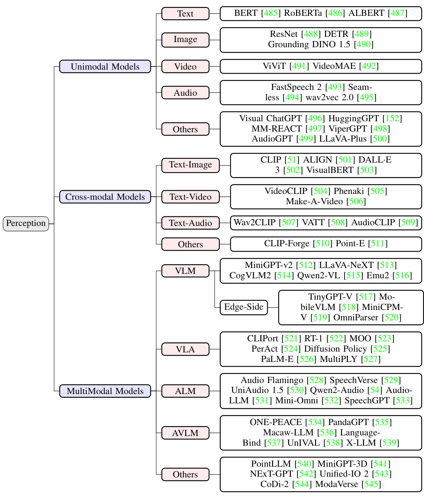  
Figure 7.1: Ilustrative Taxonomy of Perception System  

Anothercrucial distinction lies in perceptual processing effciencyHuman perceptionislimited bybiologicalconstraints such as nerve conduction speeds,typically in therange of millseconds.Conversely,AIsystemscan process sensory inputs at speeds of microseconds or evennanoseconds,constrained primarily bycomputationalhardware performance rather than biological limitations.Neverthelesshuman perception naturally integrates information from multiple sensory modalities—known as multimodal perception-into coherent experiences effortlesslyFor AIagents, achieving this multimodalintegration requirescarefully designedfusion algorithms thatexplicitly combine inputs from diverse sensors to build unified environmental representations [553].  

Further differences arise in the way humans and artificial agents handle temporal and spatial information. Human perceptionis inherentlycontinuousandfluid,smoothlyexperiencing the passage of timeand spatial motion without explicit temporaldiscretization.Incontrast,AIagents typicallrelyondiscrete sampling of sensordata,usingtimestamps or sequential processing tosimulate continuity.Spatialawareness inhumans effortlessy mergesvisual, auditory,and vestibular information to achieve intuitive spatial positioning.Forartificialagents,spatial perception usuallinvolves algorithmic processes such as simultaneous localization and mapping (SLAM)or 3D scene reconstruction from visual lata sequences [554].  

Physical orchemicalstimulitransmittedfrom theexternalenvironment tohuman sensoryorgans willbereceived by the sensory system(suchaseyes,ears,skin,etc.)andconverted into neural signals,whicharefinally processed bythe brain to produce perception of theenvironment.Similarly,toallow the intelligent agent toconnect withtheenvironment, it is alsocrucialtoobtain these perceptioncontents.Currently,various sensors are mainlyused toconvert electrical signals into processable digitalsignals. Inthis section,We distinguishbetween Unimodal models,Cross-modal models, and Multimodal models based on the number of modalities involved in the input and whether unified fusion modeling operations are performed.Unimodal Models specifically process and analyze data from a single modality or type of input (such as text,image,oraudio),while Cross-modal Models establish relationships and enable translations between different modalities throughdedicated mapping mechanisms, and Multimodal Models holistically integrate and process multiple modalities simultaneously to leverage complementary information for comprehensive understanding and decision-making.  

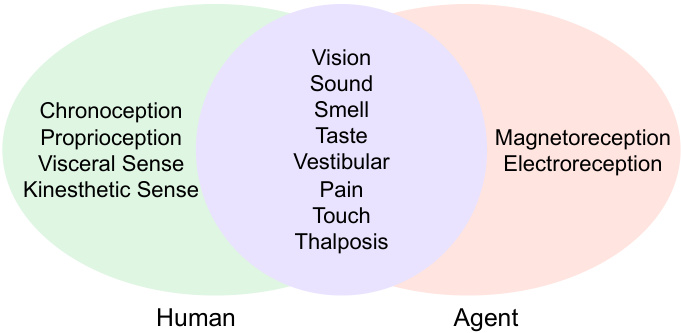  
Figure 7.2: Comparison of common perceptual types between human and agent.  

# 7.2 Types of Perception Representation  

# 7.2.1 Unimodal Models  

When humans are in an environment,they can listen to beautiful music,look at sunrise and sunset, orexperience a wonderfulaudiovisualfeast onstage.These perception contents can be either a single image or audio,or a fusion of multiple perception contents.Regarding the types of perception input of intellgent agents, we will start with single-modal and multimodal inputs, and introduce their implementation and differences.  

Text As an important means of communication,text carries a wealthof information,thoughts,emotions and culture. Humans indirectlybtain thecontentoftextthrough vision,hearingandtouch,which isoneofthe most important ways for humans tointeract with theenvironment.But forintelligentagents,textcandirectlyserve asabridge toconnect with the environment,taking text asdirect input andoutputting responsecontent.Inaddition to theliteral meaning, text alsocontains rich semantic information and emotional color. In the early days,the bag-of-words model[55] was usedtocount textcontentand was widely used in textclasificationscenarios,but semantic expressoncould not be obtained.BERT [485]uses a bidirectional Transformer architecture for language modeling and captures the deep semantic information of textthroughlarge-scaleunsupervised pre-training.[486,487]furtheroptimizedthe training efficiency of BERT.The autoregressive modelrepresented by GPT3.5[556] opened the prelude toLM and further unified the tasksof text understanding and text generation,whiletechnologies such as LoRA[109]greatlyreduced the application cost of LLM and improved the agent's perception ability of complex real-world scenario tasks.  

Image Image is another important way for humans to interactwith the environment which inherently encode spatial information,encompassing crucialatributes such as morphologicalcharacteristics,spatialpositioning,dimensional relationships,and kinematic properties ofobjects.The evolution ofcomputer vision architectures hasdemonstrated significant advancement in processing these spatialatributes.The seminal ResNet architecture[488]established foundational principles fordeepvisual feature extraction,while subsequentYOLOseries[557,558]demonstrated the capability to simultaneously determine object localization and clasification with remarkable effciency.A paradigm shift occurred withthe introduction of DETR[489],which revolutionizedobject detection by implementing parallel prediction throughglobalcontextreasoning,effectivelyeliminating traditionalcomputationaloverhead assciated with non-maximum suppression and anchor point generation. More recently,DINO 1.5[490]has extended these capabilities to open-set scenariosthrougharchitecturalinnovations,enhanced backbone networks,andexpanded training paradigms, substantially improving open-set detection performance and advancing the perceptual generalization capabilities of artificial agents in unconstrained environments.  

Video Video is an expression ofcontinuous image frames, which includes the time dimension and displays dynamic information that changes over time throughcontinuous image frames.The intelligent agent uses video as input and obtains richer perceptualcontent through continuous frames. ViViT[49] extracts spatiotemporal markers from videos, effctively decomposing the spatial and temporal dimensions of the input.VideoMAE [492] learns general video feature representations through self-supervised pre-training and hasstrong generalization capabilitiesonout-of-domain data. It lays a solid foundation for intelligent agents to acquire perceptual capabilities in new scenarios.  

Audio Inaddition totext andvision,anotherimportant wayforhumans tointeract withtheenvironment isthrough audio. Audio notonlycontains direct text content,but alsocontains the speaker's tone and emotion[559].Wav2Vec2[495] defines the contrast task by quantizing the potential representation of joint learning,achieving speech recognition effctiveness with1/100labeled data volume.FastSpeech 2[493] directly introduces voice change information (pitch, energy,duration,etc.)and uses realtargets to train the modelto achieve more realistic text-to-speech conversion. Seamless [494] generates low-latencytarget translations through streaming and using an effcient monotonic multi-head atention mechanism,while maintainingthehuman voice style,toachieve synchronousspeech-to-speech/text translation frommultiple sourcelanguages totargetlanguages.Basedonthese means,the intelligent agentcanachievethe ability to listen and speak.  

Others At present, most oftheresearchon intellgent agents focuses on the above-mentioned common sensory input types.However, just as humans have more than 20types of perception,intellgent agents have also made progress in achieving corresponding perception capabilities through other sensors. The bionic olfactory chip developed by Hong Kong University of Science and Technology[551] integrates a nanotube sensor array on a nanoporous substrate, withupto 10,oO independently addressable gas sensors on eachchip,which is similarto theconfiguration of the olfactory system of humans and other animals, andcan accurately distinguish between mixed gases and 24different odors. In terms oftaste,Tongji University[56o] combines fluorescence and phosphorescence signals to develop an intelligent taste sensor with multi-mode lightresponse,whichcanefectively identify umami,sourness and biterness In orderto achieve human-like perception and grasping capabilities,New York University[561]launcheda low-cost magnetic tactile sensor AnySkin, which can be quickly asembled and replaced. Even in the perception of pain, the Chinese Academy of Sciences uses the unique electrical properties of liquid metal particle films whenthey are “injured"(mechanically scratched)to imitate the perception and positioning of“wound."Someother works,including HuggingGPT [152], LLaVA-Plus [500], and ViperGPT [498],integrate these single-modal perception capabilities within theframework,select and applythemaccording totask requirements,and achieve the goalof achieving more complex tasks.  

# 7.2.2 Cross-modal Models  

Text-Image Cross-modal models integrating text and images have witnessed significant advancements in recent years,leading to improved alignment, retrieval, and generation between the two modalities.These models can be categorized based ontheir primaryobjectives,includingcross-modal alignment andretrieval,text-to-image generation, and image-to-text generation.  

One of the primary focuses in cross-modal research is the alignment and retrieval of text and images.CLIP [51], introduced by OpenAI in 2021,employs contrastive learming to align textual and visual representations,enabling zero-shot crossmodalretrieval and clasification. Similarly, ALIGN[501]developed by Google in the same year, leverages large-scale noisy webdata tooptimizetext-imageembedding alignment.In 2022,CyCLIP[562]introduceda cyclic consistencyloss tofurtherenhancetherobustnessofcross-modalalignment,improving thereliabilityofretreval tasks.  

Another major areaof progressinvolves text-to-image generation, where models aim tosynthesize high-quality images based on textual descriptions. OpenAl's DALL-E series[563, 564,502],spanning from 2021 to 2023,has made substantialcontributions inthis domain, withDALL·E3offring fine-grained semanticcontrolover generated images. Stable Diffusion[565],ntroducedbyStabilityAIin2022,employsadiffusion-based generativeappoachthatsuppts open-domain text-to-image synthesis and cross-modal editing.  

A third significantresearch direction is image-to-text generation, where models aim to generate high-quality textual descriptions based on image inputs.Typicalrepresentative work isthe BLIP[566] and BLIP-2[567]models, introduced by Salesforce between 2022and 2023,which utilize lightweight bridging modules to enhance vision-language model integration, enabling tasks such as image captioning and question answering.  

Text-Video The key research here involves video text alignment, generation and retrieval.VideoCLIP[504]employs a videoencoder—typically based on temporal convolution ora transformer structure—to extract sequential features from video frames.These features are subsequently aligned with textualrepresentations generated by a language encoder,facilitating robustvideo-text asociation.In the domain of text-to-video generation,Meta's Make-A-Video model [06]extends spatial-temporal dimensions using diffusion-based techniques,allowing forhigh-quality video synthesis fromtextualdescriptions.Additionally,Google'sPhenaki[505]addresses thechallenge of generating long, temporallycoherent video sequences,demonstrating significantadvancements invideo synthesis throughcross-modal learning.DeepMind's Frozen in Time[568] adopts contrastive learning for video-text matching,thereby enabling efcient cross-modalretrieval.This approach enhances thecapacity to search andretrieve relevant video segments based on textual queries,further improving the integration of vision and language understanding.  

Text-Audio Cross-modal models connecting text and audio have made significant improvements inrelated tasks such as modalrepresentation, generation, and conversion, and enhanced the perception ability under a single modality.  

AudioCLIP[509],ntroduced in 2021,extends the CLIP framework to theaudiodomain,enabling trimodalretrieval across audio,text, and images.By incorporating audio as an additional modality,AudioCLIP utilizes multi-task learning tounifimage,text,andaudio representations intoashared embedding space.This advancement enhances the capability of cross-modalretrievaland interaction. Ina similar vein, VATT[508]adopts a unified Transformer-based architecture to process video,audio,andtextthrough independent encoding branches.These branches are subsequently fused into a shared multimodal space,facilitating tasks such as cross-modal retrieval and multi-task learning.This design allows for greater adaptability across diverse multimodal scenarios.  

For text-to-audio generation, Meta introduced AudioGen[569] in 2023,which enables the synthesis of audio, such as environmental sounds and music fragments,directly from textual descriptions.This modelexemplifies the growing capabilities of AIin generating high-fidelity audio based on linguistic input,expanding applications in media, entertainment, and accessibility.  

Additionally,inthedomainofspeech-to-text andtext-to-speechconversion,Microsoftdeveloped SpeechT[57o].This model unifies speech and text generation,supporting both speech synthesis and recognition withina single framework. By leveraging a sharedarchitecture forthese dualfunctionalities,SpeechT5 contributes tothe seamlessintegration of speech andtextprocessing,therebyenhancingapplications inautomatedtranscription,voiceasistantsandacceibility tools.  

Others In some other scenarios and domains, cross-modal modeling also plays an important role.  

CLIP-Forge [510] presents a novel method for generating 3D shapes from textual descriptions. By leveraging the capabilities ofContrastive Language-Image Pre-training (CLIP),this approach enables the synthesis of high-quality 3D objects conditioned on naturallanguage inputs,bridging the gapbetween textand 3D geometry.Point-E[51] extends this concept by generating 3D point clouds from text descriptions.Unlike traditional 3D reconstruction techniques, Point-Efocuseson pointcloudrepresentations,facilitating effcient and scalable3Dcontent creationwhile maintaining high fidelity to textual prompts.  

In the field of medicalimaging,MoCoCLIP[571]introduces an approach that enhances zero-shot learning capabilities. By integrating CLIP with Momentum Contrast (MoCo),this method improves the generalization of deep learning models in medicalimaging applications,addressing thechallenges associated with limited annotated data and domain adaptation.  

# 7.2.3 Multimodal Models  

The cross-modal modeldescribed above mainly aligns and maps between modalities through contrastive learning and other mthods to achieve information complementarity and conversion between modalities.Furthermore, the work of multimodalmodels focuses onhow to integrate the features of multipledata(suchasvision,text, audio,etc.)to improve the performance of the overall model.  

Vision Language Model Vision Language Model(VLM) is broadly defined as multimodal model that can learn from images(or videos)andtext.Humans live inaworld fullofmultimodalinformation.Visualinformation(such as images and videos)andlanguage information (such as text)oftenneed to be combined tofully expressmeaning.The same is true forintellgent agents.LLaVA[513]first tried touse gpt-4to generate a multimodallanguage image instruction dataset.Through end-to-end training,alarge multimodal model was obtained and excelent multimodalchat capabilities were demonstrated. LLaVA-NeXT [513] uses dynamic high-resolution and mixed data to show amazing zero-shot capabilities even inpureEnglish modaldata, and the computational/training datacost is 0O-10OO times smaer than other methods.Emu2[516]changes thetraditional way of using image tokenizer toconvert images intodiscretetokens, and directly uses image encoders to convert images into continuous embeddings and provide them to Transformer, enhancing multimodalcontext learning capabilities.MiniGPT-v2[512] employs unique identifiers for various tasks during training.These identifiers helpthemodeldifferentiate task instructions moreefectivelyenhancing its learning effciencyforeach task.Qwen2-VL[515],DeepSeek-VL2[572]use dynamicencoding strategies on visualcomponents, aiming to process images with different resolutions and generate more efficient and accurate visualrepresentations. At the same time, DeepSeek-VL2[572]also uses the MoE model with a multi-head potential attention mechanism to compress the key-value cache into a latent vector to achieve efficient reasoning.  

Previous work mainly uses image fusion text for training.Video-ChatGPT [573] extends the input to video and directly uses a video adaptive visualencoder combined with LLMfor training tocapture the temporal dynamics and inter-frame consistency relationships in video data,thereby enabling open conversations about video content in a coherent manner.To solvethelack ofunifiedtokenizationfor images andvideos,Video-LLaVA[574]unifies the visual representations of image and video encoding into the language feature space, making thetwo mutually reinforcing. Similarly,Chat-UniVi[575]employs asetof dynamic visual tokens to integrate images and videos, while utilizing multi-scale representations toallow the modelto grasp bothhigh-levelsemanticconcepts and low-level visual details. Youku-mPLUG[576]has made in-depth research in specific scenarios.Based on thehigh-quality Chinese video-text pairs in the Youku videosharing platform,itenhances theabilitytounderstand overalland detailed visualsemantics and recognize scene text. Unlike the previous method that requires training,SlowFast-LLaVA [577]caneffctively capture the detailed spatial semantics and long-term temporal context in the video through atwo-stream SlowFast designwithout anyaditionalfine-tuningofthevideodataachieving thesameorevenbetterresults thanthefine-tuning method.  

As the parameters of large models gradually decrease and the computing power of the end-side increases, highperformance end-side models are gaining momentum.Smart terminal devices such as mobile phones and PCs have strong demands for image visual processng,which puts forward higher multimodalrecognition effcts and reasoning performance requirements forthe deployment of AImodels on theend-side.TinyGPT-V[517]is built based on the Phi-2[578] smallbackbone combined with BLIP-2[567],only 8G video memory or CPU is needed for reasoning, and solving the computational effciency problems of LLaVA[513] and MiniGPT-4[579].MiniCPM-V[519] mainly provides powerful OCR capabilities forlong and diffcult images,and has alow hallucination rate, providing reliable percptionoutput.Megrez-3B-Omni[580] ensures that allstructural parameters are highly compatible with mainstream hardware through coordinated optimization of software and hardware. Its inference speed is up to $300\%$ faster than that of models with the same precision, improving its adaptability to different end-side hardware.  

Similarly,there are more GUI-related works focusing onautomatic task execution on mobile phones and PCs.OmniParser[520]uses popular web page and icon description datasets for fine-tuning,significantly enhancing thedetection and functional semantic expresion capabilities of icons in screenshots. GUICourse[581] and OS-ATLAS[582]also built across-platform GUIgroundingcorpus,which brought significant performance improvements inthe understanding of GUI screenshots and enriching the interactive knowledge of GUI components.  

Vision Language Action Model Vision-Language-Action (VLA) model, whichtakes vision and language as inputs and generates robotic actions asoutputs,representsan importantresearch direction in the fieldofembodied intellgence. The selection of vision and language encoders in VLA models has undergone diverse development,evolving from early CNNs to Transformer architectures,and further integrating 3D vision and large language models.Early models such as CLIPort[521] used ResNet[488] to process visual inputs and combined language embeddings to generate actions,layingthefoundation for multimodalfusion.RT-1[522]introducedtheTransformer architecture,emploing EficientNet as the visualencoder and USE as the language encoder, andfused visual and language information via FiLM mechanisms, significantlyenhancing the model's generalization ability.VIMA[523]further adopted multimodal prompts,combining the ViT visual encoder andthe T5 language model to support more complex tasks.PerAct [524] innovatively used 3D point clouds as visual inputs and processed multi-view information through Perceiver IO, providing richer spatial perception for robotic manipulation. Diffusion Policy[525] combined ResNet visual encoders and Transformerlanguage models,generating actions throughdiffusion models toimprove the diversityand accuracy of action generation. SayCan [583] integrated the PaLMlanguage model with visual inputs, using the CLIP visual encoder for task decomposition. PaLM-E [526] combined the ViT visual encoder and the PaLM language model, guiding low-level action execution through text planning.MultiPLY[527]further integrated 3D information into LLMs,combining the EVA visual encoder and the LLaMA language model to provide more comprehensive planning capabilities for complex tasks.  

Audio Language Model Audio Language Model(ALM) uses the audio and text to build multimodal model. Speechgpt[533]built alarge-scale cross-modal speech instruction dataset SpeechInstruct and trained discrete speech representations,achieving cross-modal speech dialogue capabilities beyond expectations.LauraGPT[584],unlikethe previous sampling ofdiscrete audio tokens to represent input and output audio, proposed a novel datarepresentation thatcombines thecontinuous anddiscrete featuresofaudio,anddemonstratedexcellnt performanceonawiderangeof audio tasks throughsupervised multi-task learning.[529,585,531]convertsaudiodata into embedded representations and thenfine-tunes instructions,so that excellent performance can be achieved on various speech processing tasks through naturallanguage instructions. In order to reduce the cost of fine-tuning training, AudioFlamingo[528] quickly enhances the ability to adapt to unseen tasks through contextuallearning and retrieval based onthe audio language model.UniAudio 1.5[530]uses words orsubwords inthe text vocabulary asaudio tokens,learns these audio representations through a smallnumber of samples,and achieves cross-modaloutput without fine-tuning. In order to make the output more realistic and in line with human expectations,Qwen2-Audio[54]introducedthe DPO training method to achieve human preference alignment.  

Audio Vision Language Model Audio Vision Language Model (AVLM) ultilizes audio, vision, and text to unify multimodal models.Previously, we introduced some work on building multimodal models using information from two modalities.Inthe pursuitof AGI,theobstacletoachieving this goallies inthediversityandheterogeneityoftasksand modalities.A suitable approach is toallow more modalcapabilities tobe supported within aunifiedframework.Some closed-source work[586,587]has achieved excellentcapabilities across modalities such as textvision,and audio. ImageBind[588] implements jointembedding acrossix diferent modes (image,text, audio,depth, thermal,and IMU data).Panda-GPT[535]combines ImageBind's multi-modalencoder and Vicuna[589], showing zero-shot cross-modal performance in addition to images andtext.Similar work includes[539,539,536],which achieves alignment and training throughthe encoding information of vision,audio andtext.Multimodal models often require more resources to train, and UniVAL [538] trained a model with only $\sim{0.25B}$ parameters based on task balance and multimodal curriculum learning,and used weight interpolation to merge multimodal models, maintaining generalization under out-of-distribution. NExT-GPT [542] connects LLM with multimodal adapters and diffrent diffusion decoders,and only trains a small number of parameters $(1\%)$ of certain projection layers.  

Other works [543,590,544,545] have achieved input-output conversion between arbitrary modalities. Unified-IO 2[543]isthe frst autoregressive multimodalmodelthatcan understand and generate images,textaudio,and actions. It tokenizes diferent modalinputs into a shared semantic space and processes them using an encoder-decoder model. AnyGPT[59o]builds the firstlarge-scale any-to-any multimodalinstruction dataset, using discreterepresentations to uniformly processvarious modal inputs.Modaverse[545] directly aligns the output oftheLLM with the input of the generative modeltosolvethe problem that previous workrelies heavilyonthealignmentofthelatent spaceof text and non-text features,avoidingthecomplexityassociated withthe alignment of latent features.CoDi-2[44]outperforms earlier domain-specific models in tasks ike topic-based image generation,visual transformation,and audio editing.  

Others Humanshave explored the2D world more than the 3D world, but 3Dcan more accurately describe the shape and texture information of objects and provide richer perceptual information. PointLLM[540] uses a point cloud encoder to express geometric and appearance features, and integrates language features for two-stage training of complex point-text instructions, achieving excellent 3Dobject description and classification capabilities.Since 3D contains richer information than 2D,it alsobrings greatertraining costs.[541,591]reduces the training cost here, and MiniGPT-3D [541] uses 2D priors from 2D-LLM to align 3D point clouds with LLMs. Modal alignment is performed inacascade manner, and query expert modules are mixed to efficiently and adaptively aggregate features, achieving efficient training with smallparameter updates.LLaVA-3D[591] connects 2D CLIP patch features with their corresponding positions in 3D space, integrates 3D Patches into 2D LMM and uses joint 2D and 3D visuallanguage command adjustment to achieve a 3.5-fold acceleration in convergence speed.  

In order to enable intellgent agents to accurately perceive and manipulate unknown objects, Meta[592] developed NeuralFels technology,which combines vision and touch to continuously model unknown objects in 3D, more accurately estimate the posture and shapeofobjects in handheldoperations,and improve the accuracyof ignorant object operations by $94\%$ ，  

# 7.3 Optimizing Perception Systems  

Perception errors,including inaccuracies, misinterpretations,and“halucinations"(generation offalse information), pose substantial challenges to the reliability and effectiveness of LLM-based agents.Optimizing perception thus requires minimizing these errors using various strategies across model, system, and external levels.  

# 7.3.1 Model-Level Enhancements  

Fine-tuning.Fine-tuning pre-trained LLMson domain-specificdata significantly improves their ability to accurately perceive and interpret relevant information. For example,fine-tuning models such as LLaVA on specific landmarks has been shown to enhance their recognition accuracy, particularly in urban navigation tasks [513,593].Moreover, techniques such as Low-Rank Adaptation (LoRA)enable more effcientfine-tuning,avoiding a substantialincrease in model complexity while stillimproving performance[109,594]. Some LLM work combined with traditional vision is also widely used.IntegratingwithYOLOS[595]onthebasis of thetheLlama-Adapter[596]architecture significantly improves the detection and positioning capability.  

PromptEngineering.Thedesign ofefective prompts iscrucialtoensure LLMs generate outputs that are both accurate and aligned withthe desired goals.By providing clear instructions,contextual information,and specificformatting requirements, prompt engineering minimizes misinterpretation and hallucination [597]. System prompts define the agent's role, historical prompts to providecontext from past interactions, andcustomized prompts to ensure output consistency has been shown to reduce errors significantly [597].  

Retrieval-Augmented Generation. Supplementing LLMs with external knowledge sources through retrieval mechanisms helpsground their responses infactualinformation,reducing the likelihood of hallucinations and improving the accuracy of perceived information [334].  

# 7.3.2 System-Level Optimizations  

Anticipation-Reevaluation Mechanism. In scenarios where agents face incomplete or ambiguous information, an anticipation-revaluation mechanism can enhance robustnessFor instance,in navigation tasks, agents can anticipate goal directions based on historicaldata andreevaluate their inferences when new information becomes available[598].  

Multi-Agent Collaboration. In multi-agent systems,structured communication and collaboration among agents can facilitate information sharing,error correction,and consensus-building,leading toa more accuratecollective perception of the environment[599].Diffrent communication topologies,such as fullyconnected,centralized, and hierarchical structures,offer varying trade-off in terms of efficiencyandrobustness[60o].InsightSee[601refines visual information through a multi-agent framework with description,reasoning, and decision-making,effectively enhancing visualinformation processngcapabilities.Similarly,HEV[602]integrates theglobalperspective information ofmultiple agents and endows RL agents with global reasoning capabilities through cooperative perception, thereby enhancing their decision-making capabilities.  

Agent Specialization.Assigning distinct roles andcapabilities to individual agents within a multi-agent system allows fora divisionof labor in perception, with each agentfocusing on specificaspects of theenvironment ortask.This can enhance the overall accuracy and efficiency of perception [603].  

# 7.3.3 External Feedback and Control  

LossAgents for Optimization.Utilizing LLMs as lossagents, allows for thedynamic adjustment of loss function weights during training [604].This enables the optimization of image processing models based on complex,potentially non-differentiable objectives, including human feedback and evaluations from specialized models. This approach essentially externalizes the optimization objective,allowing the LLMto“perceive"and adapt tocomplexcriteria[605].  

Human-in-the-Loop Systems.Incorporating human feedback and oversight can helpcorrect errors,guide the agent's learning process, and ensure alignment with human values and expectations [43].  

Content and Output Mediation. Before presenting LLM outputs to users,content mediation filters and refines these outputs.This helps prevent unexpected or harmfulbehaviors,ensuring alignment with user expectations and safety guidelines [606].  

# 7.4 Perception Applications  

Theoperational efficacy of intellgent agents ispredominantly inffuenced bythree criticalfactors:modelarchitecture dimensionality,hardware infrastructure specifications,and quantization optimization methodologies.The exponential progression in model parameters—from Bert-Base's modest 110M to GPT-3's substantial 175 billion, culminating in Llama 3's unprecedented 405 billion—has correspondingly escalated processing latency from milliseconds to hundreds ofmillseconds.Hardware performance variations are particularly noteworthy; empiricalevidencewith GPT-3 demonstrates that NVIDIA H100 exhibits a $50\%$ improvement in token processing throughput compared to A100, while RTX 4090 achieves approximately double the processing capability.  

Contemporary intelligent agents have penetrated diverse domains,encompassing personalassistance systems, gaming environments, Robotic Process Automation (RPA),and multimediacontent generation,predominantly leveraging visual perception as their primary input modality. In the context of procedurally generated environments like Minecraft, STEVE [6o7] demonstrates remarkable performance improvements, achieving a $1.5\mathrm{x}$ acceleration in technology tree progression and a $2.5\mathrm{x}$ enhancement in block search effciency through visual information processing. Steve-Eye [608] advances this paradigm through end-to-end multimodal training, addresing environmental comprehension latency through integrated visual-textual input processing.  

In creative content generation, AssistEditor[609] exemplifies sophisticated multi-agent collaboration,facilitating professional video editing through style-driven content understanding. Similarly, Audio-Agent [610] implements cross-modalintegration between textual/visual inputs and audio outputs,enabling comprehensive audio manipulation capabilities [611, 612, 613].  

Mobile and desktop platforms have witnessed significant advancements in agent applications. ExACT [614] has established new state-of-the-art benchmarks in VisualWebArena [615], achieving a $33.7\%$ Success Rate through screenshot-based exploratory learning withcaption and Set of Mask integration.SPA-Bench [616]introduces acomprehensive mobile evaluationframeworkthat authenticalyreplicates real-world complexity.M3A [617] demonstrates superior performance with a $64.0\%$ success rate in SPA-Bench through multimodal input processing. AgentStore [618] has markedly improved OsWorld PC benchmark performance to $23.85\%$ through enhanced visual and accessibility tree processing.  

Voice interactioncapabilities[619,586] in personal AIasistants have significantlyreduced interactionfrictionwhile enhancingoperationaleffciency.The integrationofemotionalprosody invoice interactions has demonstrated increased user engagement and retention.  

In embodied intelligence applications,haptic andforce feedback mechanisms have emerged ascrucial modalities for environmentalinteraction, with enhanced sensory fidelityenabling increasingly precise operational capabilities[620].  

# 7.5 Summary and Discussion  

Although more and more research works[543,590] focus on building unified multimodal models to support the input and outputofmultiple perceptioncapabilities.Agent perception,acomerstone ofautonomous systems,faces significant challenges in effectively interpreting and integrating multi-modal data.Current methodologies encounter persistent issues inrepresentation learning,alignment, and fusion,which hinder thedevelopment of robust and generalizable perception systems.  

One of the primary issues lies in the representation methods employed, whichoften fail to capture the intricate nuances of multi-modal dataThis shortfallis particularly evident in scenarios where high-dimensional sensory inputs require asophisticatedabstraction thatpreserves criticalsemantic information.Furthermore,thealignmentof representations presents additional diffculties.Integrating heterogeneous datatypes intoacohesive feature space is not only computationally intensive butalso prone to inconsistencies,whichcan lead to misinterpretation of ambiguous signals.Thechallenge iscompounded whenattempting tofusethesediverserepresentations,asthe processof merging features from various sources frequently results in suboptimal integration and potentialloss of vital information.  

Future research directions should prioritize adaptive representation learning through dynamic neural architectures capable ofautomatically adjusting their structurebased on environmentalcontext and taskdemands.This could involve meta-learned parameterization or graph-based representations that explicitly modelrelationships between perceptual entities.For cross-modal alignment, self-supervised spacetime synchronization mechanisms leveraging contrastive learning principles show promise in establishing dense correspondence withoutrequiring exhaustive labeled data.The integration ofcausalinference frameworks into alignment processes[621]could furtherenhancerobustnessagainst spurious correlations. Inrepresentation fusion,hierarchicalatention mechanisms with learnable gating functions merit deeper exploration to enable context-aware integration of complementary modalityfeatures.Emerging techniques in diferentiable memory networks may provide new pathways for maintaining and updating fused representations over extended temporal horizons.  

# Chapter 8  

# Action Systems  

In the realmofphilosophy,actionis definedas the behaviors that agentscanperformforapotentialorspecificpurpose in the environment.For example, manipulation, moving,reasoning, and tool utilization can allbe considered as fundamntalactions that an intelligent agent can execute to fulfilla goal inreal-world scenarios. In other words, actions emerge fromthe goal-orientedengagementof an agent inits environmentreflectingits intenttotransformthe externalworld in pursuitof its goals.Therefore,theaction system alsoplaysavitalrole indifferentiatingAIagents and foundation models (e.g.,LLMs). Generally,existing foundation models have demonstrated impresive performance across varioustasks,buttheirtaskscopeisstilimitedastheypredominantlyreliesontheriginalpre-trainingjective (e.g.,next-token prediction). By serving foundation models as brain inteligence, AI agents equipped with action systemscan directly engage with their environment and execute complex user intent. Moreover, action systems can support agents toutilize availabletools fromexternalenvironments,thus significantlyextending agents'task scopes. Therefore,thedesignofaction systems willalsodetermine the capabilityof AIagents in perception,decision making, execution,toolutilization, and anyothercomponents toalignwith the human brain.Inother words,foundation models lay the groundwork for agents while action systems determine their ultimate potential to achieve complex targets. Designingan effective and comprehensiveaction system for AIagents is acritical endeavor that involves significant challenges and notable benefits. In Figure 8.1, we demonstrate the execution processof the action system in the cognition system. Inthis section, we willfirstdiscussthe human action system inSection 8.1, and then examinethe transition fromhumanaction toagenticaction inAIagents in Section 8.2.After that,wewillsystematicallsummarize the paradigms of existing action systems in AIagents, including action space,action learning, and toollearning,in Section 8.3.In Section 8.4we analyze thediferences between action andperception, and finally wesummarize the conclusion in Section 8.5.  

  
Figure 8.1: Ilustration of several concepts related to action and action execution.  

# 8.1 The Human Action System  

Action system inhumancognition refers tothe processes that allow humans to perceive,plan,andexecute goal-directed actions. It isa complex system that enables individuals to interact witha dynamic environment, make decisions, and adapt their behavior based on feedback. Generaly,the action system within human cognition could be broadly categorized as mental action and physical action:  

·Menalactioncan beviewed as akind of distinct action,which is formulated as athinking processto drive the final intention in the human brain.For example,reasoning,decision making,imagining, and planning can allbe considered as various types ofmentalaction.Inother words,mentalactions are equaltoa brain signal that drives the physical actions of humans to fulfill the final objective.  

·Physicalaction refers to any goal-directed bodily movement executed bythehumanmotor system.To some extent, physicalactions are usualyexpressedasakind ofcontinuous action.Forexample,speaking,manipulating,drawing, running,and grasping can allbe regarded as physical actions.Employing asequence of physicalactions,humans can conduct the interaction and collect feedback from real-world environments.  

Figure 8.2ilustrates a simple taxonomy of the humanaction system from the perspective of mentalaction and physical action.Empowered with both mental and physical actions,the human cognition system can handle diverse complex tasks fromreal-worldscenarios.Drawing inspiration from human cognition,it is alsoessentialforus torevisit how to formulate actionsystems in AIagents acrossdifferent tasks,fromlanguage to digitalandthen in physicalenvironments.   

<html><body><table><tr><td>Model</td><td>Examples</td><td>Inputs</td><td>Objective</td><td>Definition</td></tr><tr><td>Large Language Model (LLM)</td><td>GPT-4 [7]</td><td>Language</td><td>Next-Token Prediction</td><td>LLMisetextasdhe</td></tr><tr><td>Large Multimodal Model (LMM)</td><td>LLaVA [513]</td><td>Multi-modal</td><td>Multi-modal Generation</td><td>LMM s ta inperate multimoal data based on</td></tr><tr><td>Robotic Foundation Model (RFM)</td><td>RT-1 [522]</td><td>Sensory inputs</td><td>Robotic Control</td><td>RFM is to generate robotic control based on the sensory inputs from dynamic environments.</td></tr><tr><td>Large Action Model (LAM)</td><td>LAM[622]</td><td> Interoniment</td><td>Executable Action</td><td>LAM is toctgensrwithin ecutabl roction based on</td></tr></table></body></html>

Table 8.1: Definitions between different kinds of foundation models.  

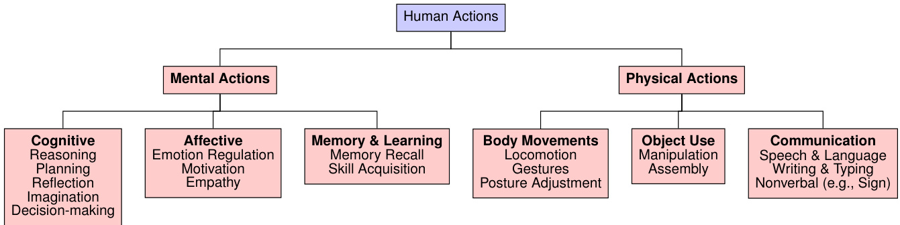  
Figure 8.2: Ilustrative Taxonomy of Human Actions, showing both mental and physical facets.  

# 8.2 From Human Action to Agentic Action  

In the pastlong period of time,human action systems[623]have significantly motivatedus to shape thedevelopment of a computer system toward autonomous paradigms.The action mechanism plays acritical role in thehuman brain in driving goal-directed behavior. In an intellgent human brain[624],conscious and unconscious thinking signals are produced,converted into mental signals,which eventually leadto asequence of action operations.This process can be mapped asa multi-stage pipeline that involves constructing action spaces,formulating learning mechanisms for improved decision making,and integrating external states (e.g.tols).Inspired bythese principles,we discoverthat these designs are essential to formulate the prototype of AI agent.  

Many existing frameworks incorporate action learning into their design or utilize it as an output.To clarify the definition of an action system,we highlight the distinctions among various frameworks, including large language models (LLM),large multi-modal models (LMM), robotic foundation models (RFM), andlarge action models (LAM), as shown in Table 8.1. Specifically, an LLM is to produce language output based on provided prompts, while an LMM is to generate multi-modality artifacts based on the multi-modal inputs.Existing language-based or digital AI agent frameworks are built upon these foundation models (e.g.,LLMor LMM) via predefining the scope of action space and its learning strategies.On the other hand,an RFM is tooptimize roboticcontrol basedon real-world environments (e.g.robotic video).Existing RFMs are pre-trained from web-scale video dataand use video prediction to simulate the action ofroboticcontrol.Thecore of RFMisstilltouse thegenerativeobjective tolearn knowledge from large-scale data, although it has involved some action designs in building physical AIagents.Moreover,some recent works[622]introduce theconceptof largeaction model(LAM),whichfurtherhighlights the stage to generate the action strategies,interact withreal-world environments andenhance self-learning paradigm.Fromthese definitions, we notice that,regardlessofthefoundational models employed,thecore of action system is tobuildthe interaction withtheenvironment and then enable the learning process from thecolected action trajectories via pre-definedreward functions.Specificall,the mechanisms underlying these behaviors are also similarto the action system in human cognition, offering valuable insights for designing action systems in AI agent frameworks. For example:  

·When processing diferent scenarios, humans usually will pre-define the action space to perform action trajectories to solve specific tasks.For instance, when playing computer games like Minecraft, we will set our action operations via keyboard or mouse to simulate behaviors like building house, mining gold, and so on. On the basis of this, we also need to build or create an action space for handling complex tasks in AI Agent frameworks.   
·Compared to machines,the human cognitive system excels in continuously acquiring new knowledge through real-world interactions, guided by generating and optimizing the action sequences.Thus, replicating this learning ability in AI agents is essential to adapt the dynamic environment and build a new skillibrary.   
·In addition, withthe development of human civilization,learning to use external tools has been recognized as one of the most significant milestones in the evolution of human intelligence.By leveraging these external tools,humans can extremely extend the problem-solving capability in diferent scenarios,from the stone age to the industrial revolution.  

Tothis end,weexpect tobuildthe mappingbetweentheaction systemof humancognitionsystemandthe design of AI Agentframework,including how to buildaction space for AIagentfrom specific scenarios to general domain,how to buildactionlearning withintheenvironment, andhowtoleverageexternalstates (e.g.ools)toextendthetaskscopeof AI Agent.Bydeveloping this a systematic survey,we strive to provide more in-depth insights forthecommunity witha clear understanding of the significance of action systems in AI agent frameworks.  

# 8.3 Paradigms of Agentic Action System  

Generally, the action system of AI agent frameworks consists of three major components:1)the action space $\mathcal{A}$ ，which includes alltypesofactionthatagentcan perform inreal-worldscenariosordownstreamtasks,andcanvarysignificantly depending ondifferent agent settings,ranging from language-basedagents toembodied agents; 2)the action learning within an dynamic environment that determines the state $s$ ，observation $\mathcal{O}$ and the optimization process of agent; 3) the tool space $\tau$ thatencompasses the instruments,interfaces,or middle-wares the agent can perform for utilization, which ranges fromphysicaldevices such asroboticarms todigitalinterfaces likeAPIs.Overal, these components collectively define the scope and characteristics of the action systemfor AIagents,shaping their formulation and execution.  

To fully explore the possible actions $a_{t}$ in practical scenarios, we must formally represent the action space and consider both individual operations and the underlying hierarchicalreasoning processes.This means examining the action space at various levels,from low-level manipulations to high-level operators that orchestrate complex workflows.  

Accordingly, the AI agent decision making process can be formalized as a trajectory $\left\langle o_{t},s_{t},a_{t}\right\rangle$ ,where $a_{t}$ is selected from the action space $\mathcal{A}$ to transform the current state $s_{t}$ based on observation $o_{t}$ into the next state. In some cases, integrating external tool systems may also be necessary. By executing a sequence of $\left\langle o_{t},s_{t},a_{t}\right\rangle$ , the agent is steered toward achieving its final objectives.  

# 8.3.1  Action Space Paradigm  

Action space $\mathcal{A}$ is an important component, which serves as the basis for building an action system within AI agent frameworks.The composition of theactionspace determines how AIagentssolvecomplextasks indiffrent scenarios. In Figure 8.2,we present an ilustrative taxonomy ofthe action system based on its action space.Generally, we summarize the action space within existing works as three distinct types, as outlined below.  

Language Language-based AI agents typically operate through language-driven actions in interactive linguistic environments,suchasreasoning,programming,retrieving information,executing APIcall,orinteractingwith exteal tools. In our study, we summarize three distinct types of language-based action spaces,including plain text,code programming,and communication.Specificaly,early language-based AI agents are built with plain text, which aim to perform interactive decision-making in verbal environments or text-based games.Here, ReAct [7o] is a representative language-based AI agent,which synergizes the reasoning and actions of an LLM to solve various problems.AutoGPT[625] analyzes and decomposes user requests into multiple subtasks and uses web search or other tools to tackle each of them.Reflexion[48] involves self-refinement and the memory mechanism toenhance action execution in language tasks. $\mathbf{LLM+P}$ [163] empowers LLM-based agent with planning capability to aid decisionmaking.However,converting plain text intoan executable command usually requires LLMs tofirst interpret the text and then perform instructionconversion,leading toadditionalinformationlossTothis end,some work explores using code as the action space,allwingdirect execution ofthe generated code and self-verification.MetaGPT[626]and ChatDev[627] build the action space via programming language with multi-agent collaboration. SWE-Agent [628] considerdifferentstages ofsoftware engineering andthussolve software issues.OpenDevin[629]devises anautomatic software development platform that integrate code writing,interaction with thecommand,sandboxforcode execution, andcollaborations.Moreover, some frameworks are built based on multi-agentcommunications,and thenuse chatting to analyze which actions should beemployed inthe next step.Here,Generative Agents[50]directly simulate multiple characters in a virtual town, to explore how each agent to conduct next action.MetaGPT [626] and ChatDev [627] are both multi-agent frameworks tofaciliate the development of software engineering.AutoGen [630] is also a representative framework that enable multiple agentcollaboration to solve any complextasks.Generally,languagebased AIagents,empowered byLLMs, perform efectively in linguistic interactions.However,lmited tothe scopeof the action space,it also poses challenges of howto solve more complextasks inreal-world scenarios.Therefore,we also needtoformulate new research solutions toconstructa more sophisticated action space tosolvechallnging tasks.  

  
Figure 8.3: Illustrative Taxonomy of Action system, including action space and learning paradigm  

Digital To expand the capabilities of AIagents beyond language,some works have alsodeveloped advanced AI agents that operate within digitalenvironments, such as web proxies,online shopping platforms, and gaming systems.For examples,MineDojo[31l]devises a virtualagent via video-language pre-training and simulates anenvironmentthat supports a multitude of tasks and goals within Minecraft.Moreover, Voyager[47]isan embodied AI agent trained to play Minecraft. It simulates multiple executable actions incode form to developa skillibrary via interacting with theMinecraft environment, andthus improve the capabilityofvirtualagents.JARVIS-1[228] is an open-world agent that can handle multi-modal inputs /outputs, generate sophisticated plans, and perform embodied control. It explores the evolutionary behaviors of the agent when acting in Minecraft.SwarmBrain[631] is an embodied agent that uses LLMsto act strategically and in real time in StarCraft II.Additionally,some researchstudies investigate how LLMs can act to process multimodal tasks. MM-ReAct [497] and ViperGPT [498] apply LMs to perform the thinking process for multimodaltasks andthen select visualexpertsfortasksolving.Visual-ChatGPT[496] integrates multiple visual experts and uses LLMs as the controller to solve tasks.HuggingGPT[152] directly involves four stages, includingtask plannng, modelselection,modelexecution and response generation, to automaticall analyze user instructionsand predict the finalanswers basedon complex multimodal tasks. Itisalso vitalfor the agent to keep up with the latest information available online. Therefore, some AI Agent frameworks (e.g., WebGPT [632], WebAgent[634])aredesignedto interact withsearchengineto enhance thecapabilityofagentto discover the answers from website.WebShop[633] is used to explore the potential of AI Agent for online shoping.Mind2Web [97] is to buildageneralist agent that simulate multiple complex web tasks.As foundation agents advance in processing multimodaltasks or web tasks, there is aincreasing trend to enhance their capability in solving complexcomputer tasks.Mobile-Agent[635]utilizes multimodal models asthecognitive controlerto manage andorchestrate mobile functionalities.AppAgent[636] defines various app usages as action spaces,enabling foundation models to interact with different apps as a mobile intellgent assistant.UFO[637] and OmniParser[520]are two advanced GUI agents which manipulates UI operations as the action space,enabling AI agent to perform computer-use tasks. Generally, empowered with more advanced skills in digital environment, AIagent can demonstrate beter intelligent insolving complex tasks,andrepresent asignificant shiftfromlanguage intelligent todigitalintelligent.Byexpandingthe action space to include web browsing, GUlinteraction, mobile applications, and embodied systems,AIagents are evolving into more autonomous, multimodal, and context-aware systems,bridging the gap between foundation models and human cognition systems. In addition,other research explores LLM integration with structured digitalenvironments such as relational databases and knowledge graphs (KGs). Pangu [639]pioneredthe connection between LLMs and large-scale KGs,whileBIRD[640]and Spider 2.0[641] established afoundation forLLMs tooperate with enterprise databases in real-world settings.NL2SQL-BUGs[667]addresses thecriticalchallenge of identifying semantic errorsin NL2SQL pipelines[365], which enhances the reliability ofLLM-driven interactions with relational databases [668]. Similarly,frameworkslike UnifiedSKG[638] and Middleware[642] expand LLMs'action capabilities across both databases and KGs.  

Physical Building an AIagent to interact with thereal physical worldcanbe viewed as the ultimateobjective to simulate acomputer programto act asa human cognition system.Toachieve this,we require the agent tobecapable of processing signals from real-world environments and generating feedback tofacilitate continuous improvement. Therefore,it willpose new challenges on how to process the continuous signals collected by sensors and enable foundation models to make decisions.To fulfillthis, RT-family[522, 643,644] pre-trained vision-language-action models to integrateknowledge from web videos into robotic learning,enhancing robotic control and action execution. GR-2[357] is a robotic model that undergoes large-scale pre-training on video clips and language data,followed by fine-tuning on robot trajectories for robotic action prediction. $\pi_{0}$ [645] pre-trained a robotic model based on robot platforms,including single-arm robots, dual-arm robots, and mobile manipulators, to build robotic learning in physical systems. SayCan [646] bridges the connections between robotic semantics and LLMs, using the robotic model to provide perception for LLMs and then using LLMs to make high-level decision-making. VoxPoser[647] uses LLMs to understand and decompose 3D Value Maps for Robotic Manipulation. Besides,EmbodiedGPT [648] utilizes vision-language models to understand videodata and perform decision-driven actions. In physical environments,it is worth noting that we usually need tounderstandcontinuous signals andthen generate continuous actions forrobotic control.Despite the existing foundation models thatcan efectively process discrete-levelactions (e.g.languageor computer-use),how to processlong continuous signals is stillchallenging.Therefore,eliminating the differences between continuous signals and discrete signals in foundation models is still a major problem.  

Generally,action space serves as one of the mostcriticalcomponents in building an efective AI Agent system.An effective action space enhances the capability and efficiency of the AI Agent in processing downstreamtasks.Action space usuallyranges from thediscrete space (e.g.,skillibrary inAtari games)tothecontinuous space (e.g.,robotic manipulation).As AI agents become more autonomous and multimodal, designing effective action spaces will be crucial for advancing general-purpose AI systems capable of real-world interactions.  

# 8.3.2 Action Learning Paradigm  

In the human cognition system,action leaming [669]represents the problem-solving process, involving both taking actions andreflecting onfeedback.Similarly,action learningfor AIagents refers to the iterative processby which an autonomous AI system refines its decision making and behavior through direct interaction with the real world environment. Generall,action learning encompasses a cycle of multiple stages, including building action space, choosing actions,andoptimizing action selection based on interaction with theenvironment (e.g.,receiving feedback or rewards and adjusting policy forchoosing actions).By iterativelydeploying these strategies,AIagents can adapt to the latest information orchanging conditions in real time,ultimately enabling more robust,flexible,andefficient problem-solving capabilities. Therefore, an effective action learning mechanism is crucial for the optimization of agentic action systems.Inthis part, we mainly focus onthree diferent representativelearming paradigms,including in-context learning, supervised training, and reinforcement learning, which are discussed below:  

In-context Learning As large language models have demonstrated emergent ability,in-context learning has been considered as the most efective method to leverage the existing capabilities of LLM without any modifications. Provided with well-designed prompts to describe actions, AI agents can understand specific actions, perform these actions,reflect on the outcome of the interaction with the environment, and finally achieve goals.Among these approaches,thecommon method is to use prompting techniques to instruct LLMs to generate agentic action.Here,the most representativeone is Chain-of-Thought(CoT)[46]prompting,which applies“Let us think stepbystep"technique to generate asequenceofintermediatereasoning steps,exploring potential solutionssystematicall.ReAct[7]enables LLMs to generate reasoning trails and task-specific actions through interaction within the environment, improving thereasoning and decision-makingcapabilities of AIagents.LearnAct[652]devises an iterative learning strategy to expand action space by generating code (i.e.,Python)tocreate andrevise new actions.Moreover, some works (e.g., Auto-CoT[137] explores how to automatically generate CoT via LLMs and then enable the autonomous thinking process of AIagents.To handlemore complex tasks,ToT[72]considers the thought process as atree structure and introduces the tree search viaLLM prompting,while GoT[75]applies a graph structurealong with the graph search. For robotic models,CoA[649]designed four different promptsettings (e.gobject, grasp,spatial,and movement)to allow robot manipulation with reasoning process.Furthermore,to tackle more complex tasks that require intricate agentic workflows,some frameworks introduce the stage oftask decomposition via LLM prompting tobreak down user instructions.Least-to-Most[138]isaclasscalprompting technique toconvert user instructions into multiple subtasks. HuggingGPT[152] is arepresentative AIagent framework that applies task planning to transform user requirements into actionable items. Plan-and-Solve[650] directly uses LLM to make plans from user instructions and then give answers based onthe generated plans.Progprompt[93]applies similar task decompositiontorobotic tasks.In addition, using prompting techniques to formulate the characteristic of AIagent hasalso been considered as an increasingtrend to facilitate the simulation and productivity of AI agentframeworks (e.g,Generative Agents [50], MetaGPT[626], ChatDev[627],SWE-Agent[628]).Finally,some other frameworks (e.g.,Reflexion[48]or Self-refine[67])analyze the external feedbacks of user interactionwithin the environment and then iteratively refine and polish results via well-designedreflexion prompts.Allofthese designs allowus tobeterunderstand user instructions,decompose task goals,and make plans forthinking answers.In-contextlearming canhelpus avoid parameter optimization and reduce theheavycostof training LLMs.Itallows AIagents toperformvarious actions effectively andadapt toawide rangeof domains.However,challenges stillremain if we want to acquire agents of even stronger actionlearning ability.  

Supervised Training Tofurther improve the action learning abilityof foundation models,increasing research efforts have focused on training methodologies, including self-supervised pretraining (PT)and supervised fine-tuning (SFT). For the pre-training paradigm,the most representative works is RT-family[522, 643, 644],which pre-trains robotic Transformer onlarge-scale web and robotic data,yielding a powerful vision-language-action model.Following this policy, GR-2[357] is developed through extensive pre-trainingonalargecorpus of web videos to understand the dynamcs of theworldandpost-trainingonrobotic trajectorydatatospecialize invideo generationandaction prediction. Similarly, LAM[622] is alarge action model pre-trained on trajectories of user interaction with computer usage. However, the pre-training paradigm usuall incurs massive computation costs.Therefore, many works take the finetuning paradigm to enhance the action capability of foundation models.OpenVLA[670] is built upon the Llama2[11] language model and incorporates a visual encoder based on DINOv2[671] and SigLIP[672]. It is fine-tuned ona diverse set of real-world robot demonstrations from Open X-Embodiment(OXE)[673] and outperforms RT-2-X[673] across different tasks, all while utilizing $7\times$ fewer parameters. Building upon OpenVLA, CogACT [653] integrates an additional diffusionactionmodule andintroduces anadaptiveactionensemblestrategyforinference.Itisalsofine-tuned using datasets from OXE and demonstrates a $35\%$ improvement in the SIMPLER [674] simulated environment and a $55\%$ increment in realrobot tasks using the Franka Arm.Besides, some works also explore how to enablerobotic model to learn action from plain language in physical world.For examples,RT-H[654]introduces ahierarchicalarchitecture to build action space, which first predict language motions and then generate low-level actions. And $\pi_{0}$ [645] collected massive diverse datasets from differentdexterous robot platforms,andthen fine-tune the pre-trained VLMs to learn robotic actions.UniAct[56]learns universal actions thatcapture generic atomic behaviors acrossdiffrently shaped robots by learning their shared structural features.This approach achieves cross-domaindata utilization and enables cross-embodiment generalizations by eliminating heterogeneity[132].Overal, using supervised training,including pre-training and supervised fine-tuning,can effctively adapt foundation models to perform actions intelligently in real-worldscenarios.Lastbut notleast,itisworthnotingthat,evenwithextensivetraining onavastcorpus,itistll beneficial toapplyin-contextleaning ontopof thetrainedmodelforAIagents, inan pursuit fortheirbestperformance.  

Reinforcement Learning To facilitate an action learning procedure inaddition to in-context learning and supervised trainng,itisalsocrucialforagentstointeract withtheenvironment andeventuallyoptimizetheiractionpolicythrough experience,feedbackorrewards.Consideringthis iterative andsequentialnature,reinforcementlearning (RL)provides us withthe systematic methodology we need[675,676,677,678].InRL paradigms,there are severalclassicaland representative algorithms,such as Deep Q-Network (DQN)[679] and Proximal Policy Optimization (PPO)[680]. The most representative RL work that applied reinforcement learning tofoundation models is InstructGPT[43],which effctively aligns LM outputs with human preferences via RLHF.Since RLHF usually requires additional training to build the reward model, some papers (e.g. DPO [1) ]) proposes to directly optimize preference data through contrastive learning.Existing work[89,681]alsodemonstratethepotentialof scaling the RLalgorithm for foundation models to produce long CoT thinking stages with impressive performance.Although RL paradigms have been successfully used to fine-tuneLLMs fortext generationtasks[12,682,43,683],effcientlyutilizingtheRLalgorithmforaction leaing remains one of the many challnges that require further attempts. Recent advances indicate significant progressin applying RL to action learning with LLMs from various perspectives:  

· Given the rich world knowledge encapsulated in LLM, we can use LLM to mimic external environments or generate imagined trajectories to aid agents in action learning.For instance, RLFP[657] utilizes guidance and feedback from the policy,value, and success-reward foundation models to enable agents to explore more efficiently. Similarly, ELLM[658] utilizes large-scale background knowledge from LLMs to guide agents in effcient exploration within various environments. GenSim[659] automatically generates rich simulation environments and expert demonstrations by exploiting the coding abilities of LLM,thereby facilitating the capability of the agent for free exploration. LEA [660] leverages the language understanding capabilities of LLM and adapts LLM as a state transition model and a reward function to improve the performance of ofline RL-based recommender systems. MLAQ [661] utilizes an LLM-based world model to generate imaginary interactions and then applies Q-learning [684] to derive optimal policies from this imaginary memory. KALM [662] fine-tunes LLM to perform bidirectional translations between textual goals and rollouts, alowing agents to extract knowledge from LLM in the form of imaginary rollouts through ofline RL. In general, empowered by RL paradigms, we can significantly explore the internal knowledge from LLMs and thus enhance the interactions with external environments. Current works such as Search-R1[685], R1-Searcher [686], RAGEN[687], and OpenManus-RL[688] are exploring utilizing RL methods to fine-tune the agent models on trajectory data in agentic environments.  

·Besides, hierarchical RL is also a promising topic that helps foundation modelto decompose complex task and thenlearm optimal policies to solve each task via RL paradigm. For example, When2Ask [663] enables agents to request high-level instructions from LLM.The high-level LLM planner provides a plan of options, and the agent learns the low-level policy based on these options. Eureka[664] leverages LLM to generate human-level reward functions with reflection, allowing agents to efficiently learn complex tasks such as anthropomorphic five-finger manipulation. ArCHer [665] adopts a hierarchical RL approach, utilizing an offpolicy RL algorithm to learn high-level value functions, which in turn implicitly guide the low-level policy. LLaRP[666] leverages LLM to comprehend both textual task goals and visual observations. It employs an additional action output module to convertthe output of the LLM backbone into a distribution over the action space.Overall using hierarchical RL can guide AI Agent to explore optimal strategies when analyzing user requests for reasoning and planning.  

Using reinforcement learning,wecan integrate foundation models withonline learning from interactive environments, incorporating both action policies and world models.This integration enables advanced action systems in AIagents. Within the reinforcement learning paradigm, agents dynamically adapt and refine their decision-making processes in response toexternalfeedback,facilitating greater efficiency and effectivenessinactionlearning andachieving desired outcomes.  

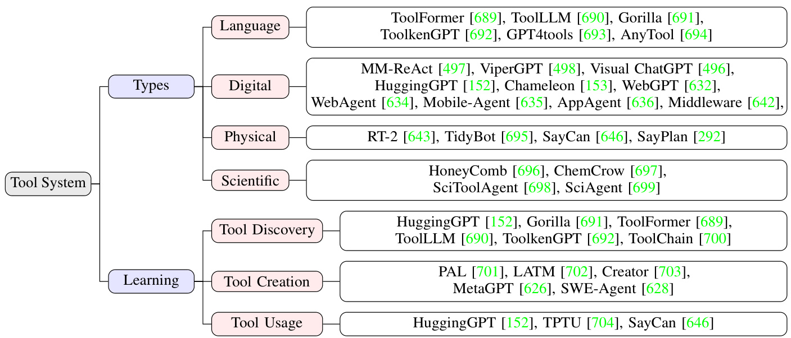  
Figure 8.4: Ilustrative Taxonomy of Tool Systems in AI Agents, including tool category and leaming paradigm  

Summary In general, Empowered by action systems, AI agents have demonstrated significant decision-making capabilities across various fields.For example, action learning enables AIagents to automate the understanding of Graphical User Interfaces (GUIs)and perform various operations, thereby improving human productivity through automatic computer usage.Moreover, several studies have shown that AI agents equipped with action systems can achiveremarkableoutcomes inrobotic manipulation tasks,suchasobject picking,laundry folding,and table cleaning. There are alsopromising researchdirections inthe industryemploying action models.Forinstance,autonomous driving (AD) has atractedconsiderable attention due to the exceptional performance of VLMs in perception and decisionmaking. By integrating human understanding through foundation models, AD systems can efectively comprehend real-world surrunding,enabling them to simulate human-level drivers.In summaryaction learning endows agents with the abilityto interact withtheexternal world,therebycreating moreopportunities forAIapplications inreal-world scenarios.  

# 8.3.3 Tool-Based Action Paradigm  

Tool learning distinguishes human intellgence fromthatofother animals.Ever sincetheStone Age,human use of tools has boostedeffciency,productivity,and innovation.Similarly,enabling AIagents toperate indigitaland physical environments by harnessing various tools is a fundamental step toward achieving human-level intelligence.  

Definitions InAI,toolsaredefinedasinterfaces,instruments,orresources thatallowagents tointeract withtheexteal world.Examples include web search[632,705,97,634],databases[706,707,708,709],coding environments [710], data systems[711,712,713],and weather forecasting[714].By translatingtool functionality intoplain textor API formats,foundation modelscan expand their problem-solving scope. The evolution of tool systems in AI can be summarized in stages.Initiall,with the adventof large language models[2],thefocuswas onconverting tools into explainable formats (e.g.,function calls).Later, advances in multimodal processng shifted interactions from conversational chats to graphical user interfaces (GUIs),and more recent work has explored embodied agents that control hardware(e.grobotic arms,sensors)tointeract withthe physical world.To simplify,atool-based actioncanbe considered a form of external action employed for assistance.  

Tool Category Similar toaction spaces,toolscan alsobeclasified into multiplecategories according totheir types. In this part, we mainlysummarize three keydomains,including language,digital, and physical. Inaddition, we also explore the potential of tool learning in emerging areas such as scientific discovery:  

·Language:To facilitate the use of external tools, we usually denote the tool asa kind of function call for foundation models, which usually encompasses task descriptions, tool parameters, and corresponding outputs. This expression allows LLMs to understand when and how to use tools in AI agents. Specifically, ToolFormer [689] expands the capabilities of language models by integrating external tool spaces, including calculator, QA systems,search engine, translation, and calendar.ToolLLM[690] uses RapidAPI as the action space and then uses a depth-first search-based decision tree algorithm to determine the most suitable tool for solving tasks. Gorilla[691] is a fine-tuned LLM based on the tool documents and then can be used to write API calls.ToolkenGPT[692] is to optimize tool embeddings and then enable LLMs to retrieve tools from the fine-tuned tool embeddings. GPT4tools [693] and AnyTool [694] are also building self-instruct datasets and then fine-tune LLMs on them for tool usage.Generally, due to the impressive capability of LLMs, language-based tool utilization for AI agents has been studied, with its effectiveness validated in abundant works, ranging from plain text or function calls to code programming.  

· Digital: With the success of LLMs in processing language information, many researchers are exploring extending the task scope of AI agents fromthe language to the digital domains (e.g., MultiModal, Web search, GUI, and so on). For example,MM-ReAct [497], ViperGPT[498], and Visual ChatGPT [496] employed LLMs as the controller and then used LLMs to select visual experts for solving different tasks.HuggingGPT [152] and Chameleon [153] use LLMs to first conduct reasoning and planning actions and then analyze which multimodal tools should be used for solving user instructions. WebGPT[632] and WebAgent[634] respectively empowered LLMs with search engines to enhance the capability of LLMs to solve more challenging tasks. Mobile-Agent [635] and AppAgent [636] respectively incorporate GUI manipulations and App usage as the tool-based actions to extend the task scope of AI agents in solving mobile phone tasks. In contrast to the physical world, digital environments usually provide simpler pipelines to collct and process data. By involving foundation models andtheir interaction with the digital environment,itis possible for us to develop intelligent assistants in computers, mobile phones, and other digital devices.  

·Physical: For physical world applications, RT-2[643] demonstrates language-guided robotic manipulation using visual-language tools, and TidyBot [695] shows how LLMs adapt cleaning tools to personalized household preferences. SayCan [646] uses LLMs as the cognitive system to guide robots in solving tasks through robotic arms and visual perception. SayPlan [292] built a 3D scene graph as the action spaces and designed multiple actions and tools for 3D simulation, and then used LLMs as planners to invoke these actions or tools for robot task planning.Besides,specialized applications in real-world scenarios now also proliferate across diferent domains.For instance, in surgical robotics,[715] presents a multi-modal LLM framework for robot-assisted blood suction that couples high-level task reasoning,enabling autonomous surgical sub-tasks. Some autonomous driving systems [716,717] also integrate vision-language models with vehicle control tools for explainable navigation. In total, physical world applications pose the most significant challenge when compared to other tasks, butthey also offer the biggest industrial value.Therefore, it stillrequires us to continue exploring advanced action learning and tool integration in physical-based agents in the future.  

·Scientifc:Scientific tools have played atransformativerole in advancing AIagents acrossdisciplines,enabling them to learn, adapt, and execute tasks while integrating foundational models with frameworks that drive innovation and address complex challnges. In materials science, HoneyComb [696] exemplifies tool-driven advancements with its ToolHub. General Tools provide dynamic access to real-time information and the latest publications, efectively bridging gaps in static knowledge bases. Material Science Tools are designed for computationally intensive tasks,leveraging a Python REPL environment to dynamically generate and execute code for precise numerical analysis. Similarly,ChemCrow [697] demonstrates the transformative power of tools in chemistry by integrating GPT-4 with 18 expert-designed tools to automate complex tasks such as organic synthesis, drug discovery, and materials design.These tools include OPSIN for IUPAC-to-structure conversion, calculators for precise numerical computations, and other specialized chemistry software that enables accurate reaction predictions and molecular property evaluations. Similarly, SciToolAgent [698] showcases how multi-tool integration can revolutionize scientific research.Designed to addressthe limitations of existing systems, SciToolAgent integrates over 50O tools (e.g., Web API, ML models,function calls, databases, and soon).Finaly, SciAgent [699] exemplifies a multi-agent framework that integrates ontological knowledge graphs with specialized agents for hypothesis generation and critical analysis,emphasizing the power of modular, tool-driven systems to accelerate discovery in materials science and beyond. These examples underscore the transformative potential of integrating specialized tools into AIframeworks to address domain-specific challenges effectively.  

Tool learning Inspired byhuman evolution [718],the integration of tools in Al involves three key aspects: Tool Discovery (identifying suitable tools),Tool Creation (developing newtools)and Tool Usage (effectivelyemploying tools). We also systematically review existing literature and summarize them in the following:  

1. Tool Discovery: Inreal-world environments,there is a wide range of tools from thedigital to the physical world.Finding the most appropriate tools for user instructions can be challenging.Therefore,the processof tool discovery is to identify and select the appropriate tools that AI agents can operate on to achieve their objectives. This stage also requires the world models in AI agents to have a profound understanding of any complex user instructions and world knowledge of diferent tools.Moreover, the versatility of AI agents is also correlated with its abilityto operate diverse tool systems.Generall,tool discoverycan becategorized into two mainstream paradigms: retrieval-based and generative-based methods. Retrieval-based methods aim to select the most relevant tools from the tool library. For example, HuggingGPT [152] introduces a framework in which LLMs act as controlers,orchestrating task planning and then invoking suitable models from platforms such as Hugging Face to fulfill user intention. In generative-based approaches, we often fine-tune LLMs to learn how to use and select tools based on various user instructions.For instance, ToolFormer[689] collcts a massive corpus with the corresponding API calls (e.g.,calculator, QA system, search engines,translation, and calendar)for training. ToolLLM[690] collct tool instructions based on solution paths and then fine-tune Llama models to generate better API calls for tool utilization.  

2.Tool Creation In addition to using existing tools,theability to create new tools plays acrucialrole in human civilization.Forlanguage agents,a widely adopted approach is to use LLMs to generate functions as executable programs, which consist of both the code and documentation.For example,PAL[701] generates programs as intermediate reasoning steps to solve problems, LATM[702] or Creator [703] use LLMs to create code for user intentions,and tofurther design a verifier to validate thecreated tools.SciAgent[699]notonly integrates multiple scientific tools but also crafts new tools for scientific discovery.More details on tool creation from an optimization perspective can be found in Section 9.4.2.  

3.Tool Usage After collecting or creating tools,the effective use of tools constitutes the cornerstone of the capabilities of AI agents,alowing applications that bridge virtual and physical worlds.Modern AI agents increasingly employ tools to tackle complex tasks across diverse domains, with three key dimensions of expansion: 1) Vertical Specialization: Agents leverage domain-specific tools to achieve professional-grade performance in complex fields such as robotics,science, and healthcare; 2) Horizontal Integration: Systems combine multiple toolkits across modalities (vision, language,control)for multimodal problem-solving; 3) Embodiment: Agents physically interact with environments through robotic tools and sensors.  

Summary Toollearning and action learning constitutethetwo most important components of the action system in AI agents.Toollearning canbeconsideredasakindofaction touse external states for problem-solving.Toollearning enables AIagents tosubstantiallbroaden theirrangeoftasks,pushing the boundaries beyond the scopeoffoundation models.For example,empowered by APIorfunctioncall,language modelscandirectlyreuse the capabilityof existing models (e.g.retrieval,coding,web search)to generate answers,ratherthan next-token prediction[719].Toollearning also involves multiplechallnging stages,including how todetermine the tool space,howtodiscoverand select tools, and howtocreate anduse tools.Overall,tollearning playsa pivotalrole inbuildinganomnipotent AIagentframework to solve complex tasks in different domains.  

# 8.4 Action and Perception: “Outside-In" or “Inside-out"  

A central debate in cognitive science and neuroscience concerns whether action or perception stands at the root of causa flow in intelligent systems.Figure 8.5 presents different perspectives.The traditional“outside-in”view insists that causalinfluence begins withexternalstimuli.The environment excites peripheralreceptors,these signals propagate inward, and eventually producebehavior.This perspective portrays the organism—or agent—as essentially reactive:the external worldcauses sensory changes,and the agent's actions represent adownstream effect of those changes. In contrast,Buzsaki's“inside-out"framework[18]proposes that it is the agent's own actions that shape the meaning and consequences of incoming signals. Such a view implies an active agent, one which continuously generates predictions and motor commands, while sending“corollary discharg"or“action copies"to sensory areas. These internally generated signals serve asreferences thatinform the agent which sensorychanges are self-initiated ratherthan imposedbytheoutside world.Inthis manner,cause shifts fromanexternalevent toan internalllaunched initiative,leavingexternalstimulitoplayaconfirmatoryorcorrectiverole.This reversalhas significant implications for how we interpret perception's purpose and function:it isnot an end initself,buta means of updatingandrefiningthe agent's own action-driven hypotheses about the environment.  

From an evolutionary perspective, possessing the abilityto move without relying on sophisticated sensory analysis can yield immediate survival benefits. Even simple organisms profit from periodic motion that stirs up food in nutrient-richwater,long before elaborate perceptualcapacities evolve.Inother words,movement precedes advanced sensing inevolutionary time,suggesting that thecapacity to act is not merely the efect of external stimuli but can  

# Brain from Outside-ln  

  
Figure 8.5:(a)Compare the brain from“outside-in"and"inside-out".(b)Ilustrationof the schematicofthe corollary discharge mechanism.Amotor command (efferent signal) travels from motor areas tothe eye muscles,while acorollary discharge(dashed arrow)is routedto acomparator in the sensorysystem.The comparator uses this internal signal to modulate or subtract external (exafferent) input.Additionally, tension feedbackfrom the muscles (reafferentsignal) exerts adelayed effectonperception.Direct projections from motor to sensorycortices underliethis architecture in all mammals. Part (b) is adapted from the original figure in [18].  

itself be the driving cause of subsequent perceptual development. It is precisely when action mechanisms become sufficiently establishedthat the agent benefits from additionalsensors,which guidethose movements more strategically. This developmentalsequence grounds perception inutility,tying sensory discrimination to the practical outcomesof movement.  

Disruptions in the normalinterplay of action and perceptionilluminate the intricate cause-effect loop.During sleep paralysis,the brain's motorcommands temporarily fail to reach the muscles; external stimuli stillbombardthe senses, but the usual action-to-perception calibration is lost. As a result, the individual experiences a heightened sense of unreality because the brain lacks internally generated reference signals to interpret sensory input. Similarly,if one externally manipulates the eye without the brain issuing a motor command,the visual scene appears to move, highlighting how perception alone—devoid of a preceding,self-initiated action—risks confusion.Neurophysiological data further support the inside-out model.Many neurons in areas once deemed“purely sensory"track not only changes in external stimuli but also self-generated movements—sometimes more strongly so.This indicates that“cause"in the brain frequently emerges from within,guiding both the magnitude and meaning ofexternal signals.Without these internal correlates, raw sensory data can become ambiguous or even useless to the system.  

Implications for IntelligentAgents The inside-out perspectiveofers potent insights for modernresearch on intelligent agents.Most contemporary AI systems—and many LLM agents—stillfunction predominantly in a reactive mode, awaiting user input and generating responses based on statisticalcorelations learned from vast datasets.Such pasivity resembles an“outside-in"framework,where the agent'sroleislimited toresponding,notinitiating.Yetfanagent were to be active,continuously forming and testing hypotheses via self-initiated behaviors (physicalorrepresentational), it might ground its own“perceptual" inputs—be they sensory streams or linguistic prompts—and thereby reduce ambiguity.Forinstance,anLLM-basedagent that interjects questions orverifies itsownstatements againstaknowledge base could better discern which inferences are self-caused from those demanded by external data.Bytracking these self-initiatedcontributions (analogous tocorollarydischarge),the modelcouldimprovecoherence,lessn erors known as “hallucinations", and refine its internal state through iterative cause-effect loops.  

A proactive stance also encourages more data-effcient andcontext-aware learning.Instead of passvely waiting for labeled examples,anagent can explore,provoke feedback, and incorporate self-generatedexperiences intoitstraining. Over time,this tight coupling between action and perception may bolster the agent's ability tohandle complex tasks, adapt to unanticipated challenges,and generalize more robustly.The shift from anoutside-in toan inside-out model reframes perception as causally downstream of action.Intellgent systems-whether biological or artificial—stand to benefit from recognizing that purposeful movement,or proactive conversational steps in thecase of LLMs,can actively create,shape, and interpret the signalsthatflow back in.Byacknowledging thecause-efect power of action and strivingto buildactiveratherthanmerelyreactive agents,we mayapproach adeperunderstanding of both natural cognition and the next generation of AI.  

Table 8.2: Comparing the perception and action of human and AI agents.   

<html><body><table><tr><td>Dimension</td><td>Human Brain / Cognition</td><td>LLM Agent</td><td>Remarks</td></tr><tr><td>Perception</td><td>- Integrates multiple sen- sory channels (vision, hear- ing, smell, touch, taste). - Perception closely tied to - Perception depends on ex- emotions, endocrine system, and physical state. - Highly sensitive, capable of- Lacks real-time coupling detecting subtle differences.</td><td>- Primarily language-based with some multimodal capa- bilities. ternal sensors and models with limited integration. with physical states.</td><td>Perception differences lead to varying ways of under- standing reality. Embodied AI attempts to bridge this gap but still faces both hardware and software challenges.</td></tr><tr><td> tion</td><td>Unified Representa- - Simultaneously processes multimodal inputs: vision, hearing, language, motion, and emotions. laborate to create unified spa- tiotemporal and semantic un- derstanding.</td><td>- Primarily text-based. Some multimodal models can pro- cess images or audio but with low integration. - Different brain regions col- - No fully unified spatiotem- poral modeling like the hu- man brain.</td><td>Even advanced multimodal models  lack  the human brain's holistic,unified representation capacity. Hardware and algorithmic challenges remain.</td></tr><tr><td>Granularity in Task Switching</td><td>- Flexible in shifting between macro and micro cognitive tasks. - Can plan at a high level - Cannot autonomously real- and shift focus to finer details locate attention between task when needed. - Adjusts task priority and - May get stuck in a spe- focus dynamically based on context and working mem- ory.</td><td>- Relies heavily on prompt engineering for granularity control. layers. cific level of abstraction in absence of guided prompts.</td><td>Humans can dynamically adjust cognitive granular- ity based on situational de- mands, while LLMs require explicit instruction to switch task focus effectively.</td></tr><tr><td> Action</td><td>Goal-oriented process drives multiple sensory to make decisions. - Real-time Learning from the  experience via  the environmental interaction. - Encompass both physical activities and mental pro- cesses.</td><td>- Action space need to be de- fined in advance. - Unable to support actions in continuous spaces. - Relies on online training to optimize the decision- capability. making process in the envi- ronment.</td><td>Humans are capable of actively learning new actions and performing continuous actions, whereasLLM agents currently lack this</td></tr></table></body></html>  

# 8.5 Summary and Discussion  

Traditionally,actionrepresents the behaviorsof the human cognition system based onthe interactive feedback fromthe environment.Itendows humans with thecapability tothink,reason,speak,run,and perform anycomplex manipulations. Based on the action system,humans can iteratively evolve thebrain intelligenceby enhancing their perception and actions fromthe world,andformaclosedloop tofurther create newcivilization and innovationin the world.Similarlyto a humancognitionsystem,theaction systemplus the tool system alsoplayan importantrole forAIagents.Integrating action systems allows AIagents tosystematicaly plan,execute, andadjusttheir behaviors,facilitating more adaptable and robust performance in dynamiccontexts. Inthis section, we systematically examine and summarizethe impact of the action module on AI agents, focusing on both action systems and tool systems.  

Action System In our studies,we briefly describe the action system from three perspectives:action space, action learning,andtoollearning.Inanaction system,action space usually serves as the most important component, which determies the upper bound of AI agents in solving downstream tasks. Itformulates which actions can be selected and performed byAIagents during interactions withreal-worldenvironments.For action space,there are alsovarious diffculties depending ondata types,ranging from discrete tocontinuous data.Withthe growing demandforAI agents, there is alsoarising expectationforAIagents tohandle more sophisticatedtasks,particularlythose involvingreal-world applications.Therefore,how to buildrobust and generalaction space issillan ongoingchallenge inaction systems. On the basis of action space, action learning is another crucial component in enabling agents to interact efectively with theexternal world and withhumans.Action learning represents the process of an AIagent to learn and optimize its policy during interaction with real-world environments.Based on diffrent foundation models,it also derives diferent action learning paradigms,from zero-shot learming (e.g., prompt engineeing)to supervised training and reinforcement learning.In action learning,it isessential tothoroughly understandthetask,including how to devise system prompts,how todetermine thepre-trained orfine-tuned datasets,and the reward signals oroptimization polices during the training.Despite notable progressin action learning to advance AIagent frameworks, numerous questions remain to be addressd.Specifically, the ICL paradigm requires specific prior knowledge fora proper prompt design. Additionally,combining pre-training and post-training for supervised training necessitates high-quality and diverse data, which oftenrequires meticulous data processng and significanthuman efort.Furthermore,the unstable nature of reinforcement learming poses difficulties inits application inlarge-scale training scenarios.Moreover, the designof action systems playsacrucialrole in maximizingthebenefitsof toolintegration.By incorporating aneffective action system,AIagents can seamlessly engage with various tools,execute complex user intents,and transform external data into meaningful outcomes.This synergy between action systems and tools not only mitigates the limitations of memorizationandreduces the riskof hallucinations[714]but also enhances the expertise androbustness of the system. For instance, an AI agent equipped with a robust action system can dynamicall select and employ the most appropriate tols fora giventask,ensuring bothaccuracy and effciency in its responses.Furthermore,action systems facilitatehierarchicalreasoning processs,enabling agentstoorchestrate intricateworkflows thatalignclosely with userobjectives.This alignment is essential fortasks requiring precise execution andreal-timedecision-making, thereby bridging the gap between foundational modelcapabilities and practical applicationdemands.Additionally, the transparencyandinterpretabilityprovidedbytoolexecutionprocessesenhanceusertrust andfacilitate effective humanmachinecolaboration.Consequently, the combination of specialized tools and robust action systems significantly elevates the performance, reliability, and applicability of AI agents in diverse and dynamic environments.  

In summary,action systemscan significantlyestablish thefoundationforthe problem-solvingcapabilitiesof AIagen frameworks, enabling them to tackle a broader range of complex tasks beyond foundation models.  

ruture Directions Nonetheless, building an effective action system for agents requires solutions to a numberof :hallenges, as we summarize in the following:  

1.Effciency presents a significant hurdle,particularly in real-time applications where swift and precise responses are critical.Thecomplexity involved in action system can lead to unacceptable latency,hindering the practical deployment of AI systems in scenarios like fraud detection or real-time decision-making.To mitigate these efficiency issues, strategies such as filtering out irrelevant or redundant information, employing zero-shot prompting to streamline reasoning processes, and utilizing high-speed storage solutions for caching pertinent knowledge are imperative. These approaches help in maintaining high performance while reducing response times.  

2. Evaluation is also a important factor in action system, including action learning and toollearning. In the real-world environment, there exists massive actions from different sources. Therefore,how to determine the correct action or tools from disparate sources to avoid conflicting information is stilla significant challenge in AI Agent.To alleviate these problems, how to build an effective and robust evaluation system to measure action system is essential to maintain the accuracy and reliability of responses.Developing robust evaluation system, verification protocols and creating transparent methods are crucial to reduce incorectness in action prediction.Besides,exposing the decision-making processes of foundation models also help us understand which action is better and how to coordinate with various actions or tools to provide trustworthy outputs.  

3. Multi-modality Action learming has achieve remarkable progresses in LLM-based autonomous agent, due to the success of large language models.However,how to understand and invoke action beyond the language instructions (e.g.,GUI operations or embodied tools) stillremain challnges. In real-world scenarios, humans can develop or learn to use new skills through any kinds of instructions (e.g.,language, image, videos or human guidance). Therefore, enabling AI agents to develop or learn actions through diverse modalities is crucial to advance the capability of AI Agent in solving practicaltasks from the real-world scenarios.In other words, it is necessary forus to explore how to reduce the gap between human and AI agents in tool utilization, facilitating the design of advanced agent frameworks for the future.  

4. Privacy is a critical concern in the field of generative AI, especially using LLMs.As a consequence, maintaining the privacy of sensitive user data and preventingthe disclosure of user behaviors are essential in tool utilization[720]. To address these privacy concerns,some safe techniques like federated learning can be used to enable models to be trained on decentralized data sources without exposing sensitive information directly. Additionally, model distilation is often necessary to ensure models maintain high performance while safeguarding data integrity.These methods enable the efective training of models while preserving the confidentiality of user data.   
5. Safty Moreover, the ethicalimplications of human-model collaboration and the safety concerns associated with models interacting with physical environments necesitate careful consideration. Ensuring that human dignity and agency are preserved when integrating human labor with AIsystems is critical. Establishing ethical guidelines, promoting fair working conditions, and fostering interdisciplinary collaboration are necessary to address these concerns.Additionally,developing robust safety mechanisms to prevent erroneous or malicious actions by AI systems interacting with physical tools or actions is imperative to safeguard against potential risks.  

In additiontotheabovechallenges,there alsoremainopen problemsforthe action system.Forexample,howto achieve an optimal balance between the foundation models and external tools,deciding on the appropriate timing to use the former versus thelatter,remainsunanswered.Specifically,although tool systems canoffer flexibilityandextensibility for foundation models,there is an increasing trend toenhance the intrinsiccapabilityoffoundation models.Therefore, balancing between foundation models and tool systems is essential for developing versatile and effcient AIagents.  

# Part II  

# Self-Evolution in Intelligent Agents  

  
Figure 8.6: Structures of self-evolution in LLM agents.  

In the history of machine learning research, manually designed AI systems have gradually been replaced by more efcient,learned solutions[756]For instance,before the advent ofdeeplearning,features were typicallyhandcrafted by experts[757,758],butthese were eventuallsupersededbyfeatures extractedthrough neuralnetworks.As neural networks have become increasingly complex,various techniques for automated design-such as neural architecture search-haveemerged,further replacingthe needfor manualldesignednetwork structures[759]. Similarly,Agentic systems initiallrelied heavilyon manual design,with behaviorrules anddecision-making strategies explicitlyrafted by developers.Althoughfullautomationofagentself-evolutionhas not yet been achieved,itisanticipatedand deemed necessary for future progress.A successfulprecedentfor such automationcan already be seen inautomated machine learning(AutoML)[712,760,761,762,204]whichhas automatedvarious components of traditional machine leaing pipelines. In particular, AutoML streamlines theselection and configuration of machine learming algorithm pipelines while incorporating advanced techniques for hyperparameter optimization[763,764,765,766,767].Among the most notable applicationsof AutoML is NAS [768,769], which automates the design of neuralnetwork architectures to enhance model performance.Drawing inspiration from this successful transition towards automation in traditional machine learning, we propose extending similar principles to the domain of agentic AI systems.  

Akeycounterintuitive issue inmuchofcurrentagentresearchisthat,while theultimategoalofdevelopingorimproving agentic AIsystems isto automatehuman efforts, the processofcreating these systemsremains,forthe time being, beyondthereachof fullautomation.Therefore, we argue that all manuallydesignedagenticAIsystems willeventually be replaced by learnable and self-evolvingsystems,which couldultimately place the development and improvement of agentic AI into an autonomous,self-sustaining loop.Enabling self-evolution mechanism in LLM agents has the following benefits:  

1. Scalability: While LLM-based agents have demonstrated remarkable performance, their improvement stll heavily depends on the underlying LLMs.However, upgrading these models iscostly, and scaling performance through the inclusion of additional real-world data requires extensive retraining on large datasets, which poses significant resource constraints.Self-evolving agentic systems,in contrast,can optimize agent behavior without necessitating modifications to the underlying LLMs,offering a more eficient and scalable solution.  

2. Reduction in Labor Costs: Manually designing agentic systems is a complex and labor-intensive process that requires developers to engage deeply with intricate technical details.Traditional methods often involve building these systems from scratch, demanding significant expertise and efort.By contrast, self-evolving agentic systems can automate much of this process, significantly reducing the need for manual intervention and lowering development costs.  

3. Aligned with Natural Intellgence Development: Just as humans continuously improve themselves through learning and adaptation,equipping LLM agents with self-improvement capabilities is a necessary step toward the development of truly autonomous agents. This enables them to refine their performance, adapt to new challenges, and evolve without direct human intervention.  

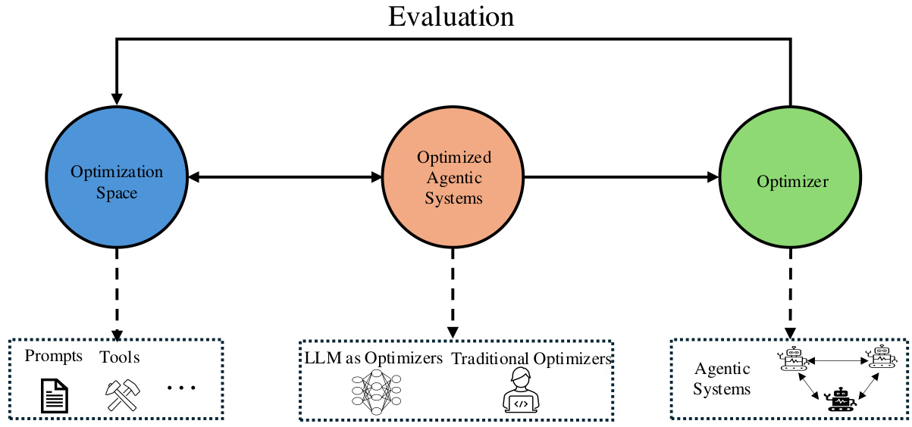  
Figure 8.7:An illustrationofkey concepts discussed in this section,including optimization spaces,the optimizer, and the optimizing objective.The optimizer iterativelyrefinescomponents withintheoptimization spaces to enhance agentic systems untilasatisfactory outcome is achieved,thereby achieving self-improvement inthe LLMagent systems.  

To achieve the goal of automating human eforts,numerous studies have proposed leveraging LLMs as the driving engine to enable self-evolution inagentic systems.In particular,LLMs provide aneffcient alternative totraditional optimization methods,such as gradient-based[770]and reinforcement learning-based approaches[771].They extend the optimization space from numerical values to more diverse domains, with naturallanguage serving as a universal bridge. An LLM is capable of optimizing complex, heterogeneous parameters,such as instructions [732]and tool implementations[772],andcan operate across arange of LLMs,including both open-source andclosed-source models. A notableexampleofthisapproach isAFLOW[773],whichautomatesthe generationandoptimizationofentire agentic system workflows.This system employs Monte Carlo TreeSearch toleverage thecomprehensive capabilities of LLMs. In this framework,traditionallyhandcrafted agentic systems are replaced byalgorithmically generated ones, marking a kind of paradigm shift.Additionall,agrowing bodyofresearch explores similar methodologies,furtheradvancing the field.  

This partisstructuredasfollows:First,we introduce variousoptimization spaces explored inrecentresearchonagentic systems,including prompts,tools, and workflows. In the subsequent section, we review optimization algorithms, discussing both traditionaloptimization paradigms and meta-optimization, where the optimization processalso affcts the underlying optimization algorithms themselves.Wethen explore the self-evolution scenarios,categorizing them into twotypes:onlineoptimizationandoffineoptimization.Following this,wediscussthe applicationof large language model (LLM)agent self-improvement techniques,particularly inknowledge discovery within the AI-for-science domain. Finally, we discuss the security concerns associated with agent self-evolution technologies.  

# Chapter 9  

# Optimization Spaces and Dimensions for Self-evolution  

The optimization of autonomous agents represents acomplexchallenge that encompases multiple levelsof abstraction. In this section,we first establish prompt optimizationas the foundationallayer, upon whichthreedistinct branches of optimization emerge: agentic workflow optimization, tool optimization,and comprehensively autonomous agent optimization.  

# 9.1 Overview of Agent Optimization  

ExistingLLM-based agent optimization can be conceptualized in terms ofatwo-tieredarchitecture.Atthe foundation lies prompt optimization,whichfocuses onenhancing the basic interaction patterns of Language Modelnodes.Building upon this foundation,threeparalelbranches emerge:i)workfow-leveloptimization,which focuses onthecoordination and interaction patterns between multiple LM nodes; i) tooloptimization, where agents evolve by developing and improving tools to adapt tonew tasksand leverage past data; and i)comprehensive autonomous agent optimization, which aims at the holistic enhancement of agent capabilities by considering multiple dimensions.  

Similarly tooptimization paradigms in AutoML,agent optimization can be categorized as either single-objective or multi-objective.Contemporary agent optimization primarilycenters on threecanonicalmetrics: performance,inference cost,and latency.Performancemeasures theeffctiveness ofthe agent incompleting itsassignedtasks,while inference cost quantifies the computationalresources required for agent operation. Latency represents the time taken forthe agent to respond and complete tasks.These objectivescan vary depending on the specific optimization modality. For instance,in prompt-level optimization, aditionalconstraints such as prompt length may become relevant objectives. This multi-faceted nature of optimization objectivesreflects the complexity of agent systems andthe need to balance multiple competing requirements.  

# 9.2 Prompt Optimization  

Prompt optimization plays the mostcriticalrole in LLM-based agent optimization. When optimizing an agent, beyond model-leveloptimizations,task-specificor model-specific promptoptimization directly impacts theagent's peformance, latency, and cost. Given a task $T=(Q,G_{t})$ ，where $Q$ denotes the input query and $G_{t}$ represents the optional ground truth, the objective of prompt optimization is to generate a task-specific prompt $P_{t}^{*}$ that maximizes performance:  

$$
P^{*}=\underset{P\in\mathcal{P}}{\arg\operatorname*{max}}\mathbb{E}_{T\sim\mathcal{D}}[\phi_{\mathrm{eval}}(\phi_{\mathrm{exe}}(Q,P),T)]
$$  

where $\mathcal{P}$ represents the space of possible prompts, $\phi_{\mathrm{exe}}$ denotes the execution function, and $\phi_{\mathrm{eval}}$ represents the evaluation function. This optimization is typically implemented through three fundamental functions: $\phi_{\mathrm{opt}},\phi_{\mathrm{exe}}$ , and $\phi_{\mathrm{eval}}$ . The Optimize function $\phi_{\mathrm{opt}}$ refines existing prompts based on optimization signals, the Execute function $\phi_{\mathrm{exe}}$ invokes the current prompt to obtain output $O$ , and the Evaluation function $\phi_{\mathrm{eval}}$ assesses current outputs to generate evaluation signals $S_{\mathrm{eval}}$ and optimization signals $S_{\mathrm{opt}}$ . The evaluation signals are used to select effective prompts, while the optimization signals assist the Optimize function in performing optimization.  

# 9.2.1 Evaluation Functions  

At the core of prompt optimization lies the evaluation function $\phi_{e v a l}$ ， which serves as the cornerstone for deriving optimization signals and guiding the evolutionary trajectory of prompts.This function orchestrates a sophisticated interplay between evaluation sources,methodologies,and signal generation,establishing afeedbackloopthat drives continuous improvement. The evaluation function $\phi_{e v a l}$ processes evaluation sources as input, and employs various evaluationmethods to generate diferent types of signals,whichsubsequently guide theoptimizationprocessHere,we define the dimensions of sources, methods, and signal types to establishthe foundationfor prompt optimization.  

Evaluation Sources Evaluation sources primarily consist of LLM Generated Output $G_{l l m}$ and task-specific Ground Truth $G_{t}$ .Existing workssuchas[730,774,728,775,732,00]predominantlyleveragecomparisonsbetween $G_{l l m}$ and $G_{t}$ as evaluation sources. Some approaches [776, 721, 777] utilize only $G_{l l m}$ as the evaluation source. For instance, PROMST [721] assesses prompt effectiveness by comparing $G_{l l m}$ against human-crafted rules; SPO [778] employs pairwise comparisons of outputs from different prompts to determine relative effectiveness.  

Evaluation Methods Evaluation Methods can be broadly categorized into three approaches: benchmark-based evaluation, LLM-as-a-Judge, and human feedback.Benchmark-based evaluationremains the most prevalent method in prompt optimization[730,774,721,732,300].This approachrelies on predefined metrics orrules to provide numerical feedbackasevaluation signals.While itoffersanautomated evaluation process,itsefectivenessultimatelydependson how well the benchmark design aligns with human preferences.  

The introduction of LLM-as-a-Judge represents a significant advancement in automated evaluation and preference alignment. Leveraging LLMs"inherent alignment with human preferences and carefull designed judging criteria, this approach [589] can assess task completion quality based on task descriptions and prompt outputs $G_{l l m}$ , providing reflective textual gradientfeedback.Notable implementations include ProteGi[779]TextGrad[728],Semantic Search [775] and Revolve[780]. Furthermore,LLM-as-a-judge enables comparative evaluation between ground truth $G_{t}$ and output $G_{l l m}$ with specific scoring mechanisms [724]. The effectivenessof this method hinges on both the design of judger prompts andtheunderlying model's alignment with human preferences.As a specialized extension,Agent-as-aJudge[781] refines this paradigm by employing dedicated agents for providing process evaluation on complex tasks, while maintaining high alignment with human preferences at significantly reduced evaluation costs.  

Humanfeedbackrepresents thehighest levelof intellgence integrationintheevaluationprocessAs humans remain the ultimate arbitersof prompt efectiveness,direct human feedback can rapidly and substantially improve prompt quality. However,this appoach introducessignificantresource overhead.APOHF[777]demonstrates that incorporating human fedback can achieve robust prompt optimization with minimal computational resources, particularly excelling in open-ended tasks such as user instructions, prompt optimization for text-to-image generative models, and creative writing.Nevertheless,therequirement forhuman intervention somewhatcontradicts the goal ofautomated evolution.  

Signal Types Feedback generated by evaluation methods manifests in three distinct forms,each serving different optimization needs.Numerical feedback[730,774,721,732,300] quantifies performance through scalar metrics, compatible with rules,ground truth,human assessment,and LLM judgments.While widely applicable,this approach requires substantialsamplesforstatisticalreliability,potentiallyoverlooking instance-specificdetailsthatcouldguide optimization.Textual feedback[728,775,780]provides detailed,instance-specific guidancethrough analysis and concrete suggestions. This sophisticated approach requires intelligent participation, either from human experts or advanced language models,enabling targeted improvements in prompt design through explicit recommendations. However, itsreliance on sophisticated intelligence sources impacts itsscalability.Ranking feedback[778]establishes relative quality ordering through either comprehensive ranking or pairwise comparisons. This approach uniquely circumvents the need for absolute quality measures or predefined criteria,requiring only preference judgments.It proves particularly valuable when absolute metrics are difficult to define or when optimization primarily concerns relative improvements.  

# 9.2.2 Optimization Functions  

The design ofoptimization functions is crucial in determining the quality of generated prompts in each iteration of prompt optimization.Through efective signalguidance,prompt self-evolutioncan achieve faster convergence.Current optimization approaches primarily rely on two types of signals: evaluation signals $S_{e v a l}$ that identify the most effective existing prompts, and optimization signals $S_{o p t}$ that provide detailed guidance for improvements.  

Optimize via Evaluation Signals When optimizing with evaluation signals,the processbegins by selecting the most effective prompts based on $\phi_{e v a l}$ assessments. Rather than directly learning from past errors, some methods adop1 heuristic exploration andoptimizationstrategies.SPO[778] iterativelyrefines prompts based onthe outputs ofcurrent best-performing ones,leveraging the language model's inherent ability to align withtask requirements. Similarly, Evoprompt[723] employs evolutionary algorithms with LLMs serving as evolution operators for heuristic prompt combination. PromptBreeder[732] advances this approach further by comparing score variations between mutated prompts while simultaneously modifying both meta-prompts and prompts throughthe LLM's inherent capabilities.  

Optimize via Optimization Signals While optimization methods based solely on evaluation signals require extensive search to findoptimal solutions invast search spaces throughtrialand error,an alternative approach leverages explicit optimization signals to guide theoptimization direction and improve effciency.Existing methods demonstrate various ways to utilize these optimization signals. OPRO [730] extracts common patterns from high-performing prompt solutions to guide subsequent optimization steps.ProTegi[779]employslanguage models to analyze failure cases and predict error causes, using these insights as optimization guidance.TextGrad[728] extends this approach further by transforming promptreflections into“textual gradients",applying this guidance acrossmultiple prompts within agentic systems.Revolve[780] further enhances optimization by simulating second-order optimization,extending previous first-order feedback mechanisms to modelthe evolving relationship betweenconsecutive prompts andresponses.This allows the system to adjust based onhow previous gradients change, avoiding stagnation in suboptimal patterns and enabling more informed, long-term improvements in complex task performance.  

# 9.2.3 Evaluation Metrics  

The efectiveness of prompt optimization methods can be evaluated across multiple dimensions. Performance metrics[782,778,730]forCloseTasksserveasthemostdirectindicatorsofaprompt'sinherent peformance,encompassing measures such as pass $\ @1$ , accuracy, F1 score, and ROUGE-L. These metrics enable researchers to assess the stability, effectiveness,and convergence rate of prompt optimization processes.Another crucial dimension is Effciency metrics [778].While some prompt optimization approaches achieve outstanding results,they often demand substantial computationalresources,larger sample sizes,andextensive datasets.Incontrast,other methods achieve moderate results with lower resource requirements,highlighting the trade-offs between performance and effciency in agent evolution. The third dimension focuses on qualitative metrics that assesspecific aspects of agent behavior:consistency[776] measures output stability across multiple runs,fairness[783]evaluates theability to mitigate the language model's inherent biases,andconfidence[784,785]quantifies theagent'scertainty inits predictions.When these behavioral aspects are treated asdistinctobjectives,prompt optimizationframeworks providecorresponding metricsforevaluation.  

# 9.3 Workflow Optimization  

While prompt-level optimization has shown promising results in enhancing individual LLM capabilities, modern AI systems often require the coordination of multiple LLM components to tackle complex tasks. This necessitates a more comprehensive optimization domain-the agentic workfow space. At its core, an agentic workflow consists of LLM-invoking nodes, where each node represents a specialized LLMcomponent designed for specific sub-tasks within the larger system.  

Although this architecture bearssimilarities to multi-agent systems,itis important todistinguishagenticworkflows from fully autonomous multi-agent scenarios.In agentic workflows, nodes operate under predetermined protocols and optimization objectives,rather than exhibiting autonomous decision-making capabilities.Many prominent systems, such as MetaGPT[626] AlphaCodium[786] can be categorized under this framework.Moreover, agentic workflows can serve as executable components within larger autonomous agent systems, making theiroptimization crucial for advancing both specialized task completion and general agent capabilities.  

Following the formalization proposed by GPTSwarm[651] and AFLOW[773],his sectionfirst establishes a formal definition of agentic workflows and their optimization objectives.We then examine the core components of agentic workflows—nodes and edges—analyzing their respective search spaces and discussing existing representation approaches in the literature.  

# 9.3.1 Workflow Formulation  

An agentic workflow $\kappa$ can be formally represented as:  

$$
\mathcal{K}=\{(N,E)|N\in\mathcal{N},E\in\mathcal{E}\}
$$  

where $\mathcal{N}=\{N(M,\tau,P,F)|M\in\mathcal{M},\tau\in[0,1],P\in\mathcal{P},F\in\mathcal{F}\}$ represents the set of LLM-invoking nodes, with $M$ $\tau,\mathcal{P}$ , and $\mathcal{F}$ denoting the available language models, temperature parameter, prompt space, and output format space respectively. $E$ indicates the edges between different LLM-invoking nodes. This formulation encapsulates both the structural components and operational parameters that define an agentic workflow's behavior.  

Given a task $T$ and evaluation metrics $L$ , the goal of workflow optimization is to discover the optimal workflow $K^{*}$ that maximizes performance:  

$$
K^{*}=\underset{K\in\mathcal{K}}{\arg\operatorname*{max}}L(K,T)
$$  

where $K$ is the search space of workflow, and $L(K,T)$ typically measures multiple aspects including task completion quality,computationaleficiency,andexecution latency.Thisoptimizationobjectivereflects the practicalchallenges in deploying agentic workflows, where we must balance effectiveness with resource constraints.  

# 9.3.2 Optimizing Workflow Edges  

The edge space $\mathcal{E}$ defines the representation formalism for agentic workflows. Current approaches primarily adopt three distinct representation paradigms: graph-based, neural network-based, andcode-based structures.Each paradigm ofers unique advantages and introduces specific constraints on the optimization process.  

Graph-basedrepresentations enable theexpressonof hierarchical, sequential,andparalelrelationships between nodes. This approach naturally accommodates complex branching patterns and facilitates visualization of workflow topology, making it particularly suitable for scenarios requiring explicit structural manipulation.For example,GPTSwarm[651] demonstrated the effctivenessof graph-based workflow representation in coordinating multiple LLM components through topology-aware optimization. Neural network architectures provide another powerfulrepresentation paradigm that excels in capturing non-linear relationships between nodes. Dylan [725] showed that neural network-based workflowscan exhibit adaptive behavior through learnableparameters,making themespeciallyeffective for scenarios requiring dynamic adjustment based on input and feedback.Code-based representationoffers the mostcomprehensive expressivenessamong current approaches.AFLOW[773] and ADAS[741] established that representing workflows as executablecode supportslinear sequences,conditionallogic,loops,andthe integrationofboth graphand network structures. This approach provides precise control over workflow execution and leverages LLMs'inherent code generation capabilities.  

Thechoice ofedgespace representationsignificantly influences boththe searchspace dimensionalityandtheapplicable optimization algorithms.[728]focused solelyon prompt optimization while maintaining afixed workflow topology, enabling the use of textual feedback-based optimization techniques.In contrast,[651] developed reinforcement learning algorithms for joint optimization of individual node prompts andoveralltopology.[773]leveragedcode-based representation to enable direct workflowoptimization by language models,while recent advances by[787] and[788] introduced methods for problem-specific topology optimization.  

# 9.3.3 Optimizing Workflow Nodes  

The node space $N$ consists of four key dimensions that influence node behavior and performance.The output format space $F$ significantly impacts performance by structuring LLM outputs, with formats like XML and JSON enabling more precise control over response structure. The temperature parameter $\tau$ controls output randomness, affecting the stability-creativity tradeoff in node responses. The prompt space $P$ inherits the optimization domain from prompt-level optimization, determining the core interaction patterns with LLMs. The model space $M$ represents available LLMs, each with distinct capabilities and computational costs.  

For single-node optimization,existing researchhas primarilyfocused on specific dimensions within this space.[773] concentrated exclusivelyonpromptoptimization, while[741] extended the search space to include both prompts and temperature parameters.Taking a diferent approach,[789] fixed prompts while exploring model selection across different nodes. Output format optimization, though crucial, remains relatively unexplored [790].  

Compared to edge space optimization,node space optimization poses unique scalabilitychallnges due tothetypically large number of nodes in agentic workflows.The dimensionality of the search space grows multiplicatively with each additional node,necessitating effcient optimization strategies thatcan effectively handle this complexity while maintaining reasonable computational costs.  

# 9.4 Tool Optimization  

Unlike conventional usage of LLMs that typically operate in asingle-turn manner, agents are equipped with advanced multi-turn planning capabilities andthe ability to interact with the external world via various tools.These unique atributes make the optimization of tool usage acriticalcomponent in enhancing an agent'soverallperformance and adaptability.Tool optimization involves systematically evaluating andrefining how an agent selects,invokes,and intgrates availabletools tosolve problems with highereffciencyand lower latency.Key performance metrics in this context include decision-making accuracyretrievalefficiency,selection precision,task planning,andrisk management. Central to this optimization are two complementary strategies: tool learning and tool creation.  

# 9.4.1 Learning to Use Tools  

Unlike prompting-based methods thatleverage frozen foundation modelsin-contextlearning abilities,raining-based methods optimize the model that backs LLM agents with supervision. Drawing inspiration from developmental psychology,tollearningcanbecategorizedintotwoprimary streams: learning from demonstrations and learning from feedback[714].The other way toelicit the power of LLMs(agents)using tools is byusing prompt-basedorin-context learning methods for better reasoning abilities.  

Learning from demonstrations involves training models backed LLM agents to mimic expert behaviors through imitation learning.Techniques such as behavior cloning alow models to learn policies in a supervised manner by replicating human-annotated tool-use actions. Formally, given a dataset $D=\{(q_{i},a_{i}^{*})\}_{i=0}^{N-1}$ ,where $q_{i}$ is a user query and $a_{i}^{*}$ is the corresponding human demonstration, the controller's parameters $\theta_{C}$ are optimized as:  

$$
\theta_{C}^{*}=\arg\operatorname*{max}_{\theta_{C}}\mathbb{E}_{(q_{i},a_{i}^{*})\in D}\prod_{t=0}^{T_{i}}p_{\theta_{C}}(a_{i,t}^{*}\mid x_{i,t},H_{i,t},q_{i})
$$  

where $a_{i,t}^{*}$ is the human annotation at timestep $t$ for query $q_{i}$ , and $T_{i}$ is the total number of timesteps.  

Learning from feedback leverages reinforcementlearning to enable models to adapt based on rewards derived from environment or human feedback. The optimization objective for the controller's parameters $\theta_{C}$ is:  

$$
\theta_{C}^{*}=\arg\operatorname*{max}_{\theta_{C}}\mathbb{E}_{q_{i}\in Q}\mathbb{E}_{\{a_{i,t}\}_{t=0}^{T_{i}}}\left[R\left(\{a_{i,t}\}_{t=0}^{T_{i}}\right)\right]
$$  

where $R$ represents the reward function based on the sequence of actions $\{a_{i,t}\}$  

Integrating toollearning intotheoptimizationframeworkenhances the system'sabilityto generalize toolusage across diverse tasks and environments.By incorporating both demonstration-based and feedback-based learning,the model can iteratively improve its tool invocation strategies, selection policies, and execution accuracy.  

Optimization Reasoning Strategies for Tool Using Optimizing the aforementioned metrics for beter LLM agents' abilitie requires acombination of advanced retrieval models,fine-tuned reasoning strategies,and adaptive learning mechanisms. Reasoning strategies,such as Chain-of-Thought (CoT)[46], Tree-of-Thought [72],and Depth-First Search Decision Trees (DFS-DT)[690],facilitate more sophisticated decision-making processes regarding tool usage. Fine-tuning themodel's understanding of tools,including parameter interpretationand action execution,enables more precise andeffective toolinteractions.Additionally,learming fromthemodel'soutputsallowsforbeter post-processing and analysis, further refining tool utilization efficacy.  

# 9.4.2 Creation of New Tools  

Beyond theoptimization ofexisting tools,theability tocreatenew toolsdynamically[703,702,772]basedon a deep understanding of tasks andcurrent toolusage can significantlyenhance the LLM Agent framework's adaptability and efficiency. In recent work,severalcomplementary approaches have been proposed.ToolMakers[702]establishes a closed-loop framework where atool-making agent iterativelyexecutes three phases: (1)）Proposing Python functions via programming-by-example using three demonstrations, (2)Verifying functionality through automated unit testing (3 validation samples)withself-debuging oftest cases,and (3)Wrapping validated tools with usage demonstrations for downstream tasks.This rigorous process ensures reliability while maintaining fullautomation. CREATOR[703] adoptsa four-stage lifecycle:Creation of task-specific tools through abstract reasoning, Decision planning for tool invocation,Execution of generated programs,and Rectificationthrough iterative toolrefinementemphasizing tool diversity,separation ofabstract/concretereasoning,anderorrecovery mechanisms.Incontrast,CRAFT[77]employs an offlineparadigmthat distill domain-specificdata into reusable, atomictools (e.g.object color detection)through GPT-4 prompting,validation, and deduplication. Its training-freeapproachcombines human-inspectablecode snippets with compositional problem-solving,enabling explainable toolchains while avoiding modelfine-tuning—particularly effective when decomposing complex tasks into modular steps.  

The integration of these complementary approaches presents richresearchopportunities.Hybrid systems could merge CRAFT's pre-made toolrepositories with ToolMakers'on-demand generation, using functional caching to balance effciency and adaptability.Future frameworks might implement multi-tier tool hierarchies where primitive operations from CRAFTfeed into ToolMakers'composite tools,while CREATOR-stylerectification handles edge cases.Advances in self-supervised toolevaluation metrics andcross-domain generalization could further automate the tollifecycle. Notably,the interplay between tool granularity (atomic vs.composite)and reusability paterns warrants systematic investigation—fine-grainedtools enableflexible composition but increase orchestration complexity.As agents evolve, bidirectional tool-task co-adaptation mechanisms may emerge, where toolsreshape task representations while novel tasks drive tool innovation, ultimately enabling self-improving AI systems.  

# 9.4.3 Evaluation of Tool Effectiveness  

The evaluation metrics and benchmarks discussed below offra comprehensive basis for quantifying an agent's tool usage capabilities.Byassessingaspectssuchastoolinvocatin,selectionaccuracy,retrievaleficiencyand planning for complextasks,these benchmarks notonly measure current performancebut alsoprovide clear,concrete objectives for optimizing tool usage.Such metrics are instrumentalin guiding both immediate performance enhancements and long-term strategic improvements inagent-based systems.In thefollowing sections,we firstreview the evolution of agent tool use benchmarks and then consolidatethe key evaluation metrics that serve as targets for further tool optimization.  

Tool Evaluation Benchmarks Recent eforts in LLM-as-Agent research have spawned diverse benchmarks and frameworks for evaluating tool-use capabilities.Earlystudies such as Gorilla[727] and API-Bank[791]pioneered large-scale datasets and methods fortesting LLMinteractions withexternalAPIs,shedding light on issueslike argument accuracyand hallucination.Subsequent works like T-Bench[792]and ToolBench [690] introduced more extensive task suites and stressed the importanceof systematic data generation fortool manipulation.StableToolBench[793]further extendedthisline of inquirybyhighlightingtheinstabilityofreal-world APIs,proposingavirtual APIserver for more consistent evaluation.Meanwhile,ToolAlpaca[794] investigated the feasibilityof achieving generalized tool-use in relatively smaller language models with minimal in-domain training.Additional efforts like ToolEmu[795]assessed the safetyandrisk aspects of tool-augmented LMagents through emulated sandboxenvironments.MetaTool[796] then introduced a new benchmark focused on whether LLMs know whento use tools andcancorrectly choose which tools to employ. It providesadataset named ToolEthatcovers single-tooland multi-tool usage scenarios,encouraging research into tool usage awareness and nuanced tool selection. ToolEyes[797]pushed the evaluation further by examining real-world scenarios and multi-step reasoning across a large tool library. Finally, $\tau$ -bench [798] introduced a humanin-the-loop perspective,emphasizing dynamic user interactions and policy compliance in agent-based conversations. Together, these benchmarks and frameworks underscore the evolving landscape of tool-augmented LLM research, marking a shift from isolated reasoning tasks to comprehensive, real-world agent evaluations.  

Metrics forToolInvocation Deciding whether to invokeanexternaltolisacritical step thatcan significantly affct both theefficiencyandtheeffectivenessofasystem.In many scenarios,the modelmust determineif itsownreasoning is suffcienttoansweraqueryor if aditionalexternalknowledge(orfunctionality)providedbyatoolisrequired.To formalize this process, we introduce a labeled dataset  

$$
D_{\mathrm{inv}}=\{(q_{i},y_{i})\}_{i=0}^{N-1},
$$  

where $q_{i}$ represents the $i$ -th user query and $y_{i}\in\{0,1\}$ is a binary label indicating whether tool invocation is necessary $\langle y_{i}=1\rangle$ )or not ( $(y_{i}=0)$ ). Based on this dataset, the model learns a decision function $d(q_{i})$ defined as:  

$$
d(q_{i})={\left\{\begin{array}{l l}{1,}&{{\mathrm{if~}}P_{\theta}(y=1\mid q_{i})\geq\tau,}\\ {0,}&{{\mathrm{otherwise}},}\end{array}\right.}
$$  

where $P_{\theta}(y=1\mid q_{i})$ denotes the predicted probability (from a model parameterized by $\theta$ ） that a tool should be invoked for query $q_{i}$ , and $\tau$ is a predetermined threshold.  

In addition tothisdecisionrule,severalmetricscanbeusedtoevaluate the model'sabilitytocorrctlydecideontool invocation. For example, the overall invocation accuracy $A_{\mathrm{inv}}$ can be computed as:  

$$
A_{\mathrm{inv}}=\frac{1}{N}\sum_{i=0}^{N-1}\mathbf{1}\{d(q_{i})=y_{i}\},
$$  

where $\mathbf{1}\{\cdot\}$ is the indicator function. Other metrics such as precision, recal, and Fl score are also applicable. Moreover, if $C_{\mathrm{inv}}$ represents the cost incurred by invoking a tool and $R(q_{i})$ the benefit or reward obtained when a tool is correctly used, one can define a net benefit score:  

$$
{\cal B}_{\mathrm{inv}}=\sum_{i=0}^{N-1}\left({\bf1}\{d(q_{i})=1\}\cdot R(q_{i})-C_{\mathrm{inv}}\right).
$$  

This formulation not only emphasizes accuracy but alsoconsiders the cost-effectiveness of invoking external tools.  

Tool Selection Among Candidates Once the decision to invoke atoolis made,the next challenge is to select the most appropriate tool from a pool of candidates. Let the candidate toolset be represented as:  

$$
\mathcal{T}=\{t_{1},t_{2},\dots,t_{M}\}.
$$  

For a given query $q_{i}$ , assume that the optimal tool (according to ground truth) is $t_{i}^{*}$ and the model selects $\hat{t}_{i}$ .The simplest measure of selection performance is the tool selection accuracy $A_{S}$  

$$
A_{S}=\frac{1}{|Q|}\sum_{q_{i}\in Q}\mathbf{1}\{\hat{t}_{i}=t_{i}^{*}\}.
$$  

However, many scenarios involve ranking multiple candidate tools by their relevance.In such cases,ranking-based metrics such as Mean Reciprocal Rank (MRR) and normalized Discounted Cumulative Gain (nDCG) offer a more nuanced evaluation. [690] use those two when evaluating the tool retriever system.  

Tool Retrieval Efficiency and Hierarchical Accuracy Toolretrieval involves both the speed of identifying a suitable toolandtheaccuracyof thatselection.Effcientretrievalmethodsreducelatencyandcomputationaloverhead,whilehigh retrieval accuracyensures thatthemost relevant tolisidentifiedforthetask.Toevaluate toolusagecomprehensively, we adopta hierarchical framework that distinguishes between retrieval accuracy and selection accuracy. Retrieval accuracy $(A_{R})$ reflects how precisely the system retrieves the correct tool from the repository,typically measured by metricssuch as ExactMatch(EM)and Fl score,whichcapture both complete and partial matches.Incontrast,selection accuracy $(A_{S})$ assesses the system's ability to choose the optimal tool from a set of candidates, again using similar metrics. Overall tool usage awareness is further evaluated by accuracy, recall, precision, and Fl score.  

The overall retrieval efficiency $E_{R e t}$ is thus can be expressed as:  

$$
E_{R e t}=\frac{A_{R}\times A_{S}\times A_{P}\times A_{U}}{C_{R}}
$$  

where $C_{R}$ is the cost associated with retrieval. Optimization strategies may involve training embedding models with feedback mechanisms to enhance both efficiency and each hierarchical component of accuracy.  

For a more nuanced evaluation of tool selection, Metatool [796] introduces the Correct Selection Rate (CSR),which quantifies the percentage of queries for which the model selects the expected tool(s).This evaluation framework addresses four aspects:selecting thecorrect toolamong similar candidates,choosing appropriate tools in contextspecific scenarios,ensuring reliabilityby avoiding the selectionof incorrect or non-existent tools,andhandling multi-tool queries.Together,these metrics and sub-tasks providearobust measureof both the effciency and precision in tool retrieval and selection.  

Tool Planning for Complex Tasks Complextasks often require thesequential application of multiple tools to reach an optimal solution. A tool plan can be represented as an ordered sequence  

$$
\Pi=[t_{1},t_{2},\dots,t_{K}],
$$  

where $K$ is the number of steps.The quality of such a plan is typicall evaluated by balancing its task effectiveness (e.g., via a metric $R_{\mathrm{task}}(\Pi))$ against the plan's complexity (or length). This balance can be captured by a composite planning score of the form  

$$
S_{\mathrm{plan}}=\alpha\cdot R_{\mathrm{task}}(\Pi)-\beta\cdot K,
$$  

where $\alpha$ and $\beta$ are coeficients that adjust the trade-of between the benefits of high task performance and the cost associated with plan complexity. When ground truth plans $\Pi^{*}$ are available, similarity metrics such as BLEU or ROUGE can be used to compare the predicted plan $\Pi$ with $\Pi^{*}$ , and an overall planning efficiency metric can be defined accordingly.  

In addition,recent worksuch as ToolEyes[797]highlightsthe importance of behavioralplanning intoolusage.Beyond selecting toolsand parameters,it iscrucialforLLMs toconciselysummarize acquired information andstrategicallyplan subsequent steps.Inthiscontext, thebehavioralplanningcapabilityisevaluatedalong twodimensions.First,the score $S_{b}$ validity $\in[0,1]$ is computed by assessing (1) the reasonableness of summarizing the current state, (2) the timeliness of planning forthe next sequence ofactions,and (3)thediversityof planning.Second, thescoe $S_{b\mathrm{-integrity}}\in[0,1]$ .s calculated byevaluating(1)grammaticalsoundness,(2)logicalconsistency,and(3)theabilitytocorrectthinking.The composite behavioral planning score is then determined as  

$$
S_{B P}=S_{b\mathrm{-validity}}\cdot S_{b\mathrm{-integrity}},
$$  

providingaholistic measure of the model'splanningcapability.This integrated framework ensures that tool planning forcomlex tasks not onlyfocuses onthe selection and ordering of tols but alsoon maintaining coherent,eective, and strategically sound planning processes.  

In summaryoptimizing tool performance within anAgent systemnecesstatesacomprehensive approachthat balances decision-makingaccuracy,retrievalefficiency,hierarchicalselection precision,strategicplanning,rigorous riskanagement,androbust toollearning mechanisms.By implementing targeted optimization and learning strategies,itis possible to enhance both the effectiveness and efficiency of tool-assisted machine learning workflows.  

# 9.5 Towards Autonomous Agent Optimization  

In addition to optimizing individual modules in agent evolution,such as prompts,tols,and workflows—which are susceptible tolocal optimathatcancompromise theoverallperformance of the agenticsystem,a significant body of researchfocuses on optimizing multiplecomponents within the entire agentic systems.This holistic approach enables large language model(LLM) agents to evolve more comprehensively.However,optimizing the entire system imposes higher requirements. The algorithm must not only account for the impact of individual components on the agentic system but also consider the complex interactions between different components.  

ADAS[741] isone of the most representative works that firstformalydefines the research problem of automated design inagentic systems.Itintegrates multiple agenticsystemcomponents intothe evolutionary pipeline.Specifically, ADAS itroduces a meta-agentcapable ofiteratively designing the agenticsystem's workflow, prompts,and potential tools withinthe overalloptimization process.Asdemonstrated in the experiments,the automaticallydesigned agentic systems outperform state-of-the-art hand-designed baselines.  

Additionall,[726]proposes an agent symbolic learning frameworkfor training language agents,inspired byconnectionist learning principles used in neural networks.By drawing an analogy between agent pipelines andcomputational graphs,the framework introduces a language-based approach to backpropagation and weight updates. It defines a prompt-based lossfunction,propagates language lossthrough agent trajectories, and updatessymbolic components accordingly.This method enables structured optimizationof agentic workflows and naturally extends to multi-agent systems by treating nodes as independent agents or allowing multiple agents to act within a single node.  

[799] proposes an approach tooptimize both prompts andthe agent'sowncode,enabling self-improvement.This aligns with the concept of self-reference,where a system cananalyze and modify itsown structureto enhance performance.  

Similarly,[773],[787],[800]and[788]focus onoptimizing both the workflow and prompts within agentic systems.In particular,[285] introduces anapproachthat trains additionallarge language models (LLMs)to generate prompts and workflows, enabling the automated design of agentic system architectures.  

In summary,optimizing the workflow of an entire agentic system is not merely a straightforward aggregationof individualcomponent optimizations.Instead,it requires carefully designed algorithms that account for complex interdependencies among components.This makes system-wide optimization a significantly more challenging task, necessitating advanced techniques to achieve effective and comprehensive improvements.  

# Chapter 10  

# Large Language Models as Optimizers  

In this chapter,we present and discussexisting works thatconceptualizeLLMs asoptimizers.First, wenote that most existing studies focus on the promptoptimization problem defined in Equation(9.1),asoptimizing other components of agentic workflows remainsanemerging researcharea.To proceed, wedraw parallels withclasscal iterativealgorithms and examine their integration into modern optimization workflows.  

# 10.1 Optimization Paradigms  

Traditionaloptimization methods differintheir assumptions aboutobjective function accessibility.We categorize them into three broadclasses,each with an expanding levelof input space: gradient-based optimization, which relies on explicit function gradients; zeroth-orderoptimization, which operates without gradient information; and LLM-based optimization, which extends beyond numericalfunctions tooptimize over structured and high-dimensional input spaces.  

· Gradient-Based Optimization. These methods assume access to gradient information and iteratively refine parameters.Techniques such as stochastic gradient descent (SGD)and Newton's method[801] are widely used but require differentiability,limitingtheir applicability todiscrete problems like prompt tuning and structured decision workflows, often endowed with a graph structure.   
·Zeroth-Order Optimization.These methods bypassthe need for explicit gradients by estimating search directions from function evaluations [802]. Examples include Bayesian optimization [803], evolutionary strategies [804], and finite-difference methods[805],which are effctive when gradients are unavailable or expensive tocompute. However,they stillrelyon well-defined numericalobjectives and structured search spaces, which constrains their applicability to language-based tasks.   
·LLM-Based Optimization. LLMs optimize broader solution spaces by leveraging natural language as both the optimization domain and feedback mechanism.By incorporating structured reasoning and human-like iteration, LLMs excelinrefining prompts, generating adaptive workflows,and iteratively improving task performance based on user feedback.  

While gradient-based and zeroth-order methods are typically applied to numerical objectives, their core principles, such as iterative refinement, searchheuristics,and adaptivelearning,alsounderlie LLM-based optimization strategies. Building on these insights,wehighlight arapidlyemerging classof LM-based optimization powered byreinforcement learning,whichhas become the backbone of slow thinking reasoning models[90,806,89].As these modelscontinue to evolve, we anticipate them driving the next wave of agentic applications,enabling LLMs to navigate complex environments with greater adaptability and strategic foresight.  

# 10.2 Iterative Approaches to LLM Optimization  

Some LLM-based optimization methods directly draw inspiration from classcal optimization theory by adapting key components toaddress discrete and structuredchallnges.Acentralcharacteristic of these approaches is the iterative update step,in which model-generated modifications are selectedfrom arange of possible improvements to refine the objective.Using the prompt optimization objective from Equation(9.1)as arunning example,a generaliterative  

  
Figure 10.1: A taxonomy of LLM-based optimization methods,categorized into random search, gradient approximation, and surrogate modeling.We also highlight some theoreticalexplanations of in-context learning, which includes hypothesis learning,implicit Bayesian inference, and mechanistic interpretability, which underpin the optimization capabilities of LLMs.  

algorithm can be expressed as follows:  

Sample: $T\sim\mathcal{D}$ Evaluation: $\ensuremath{\mathcal{L}}(T;T_{p})\gets\phi_{\mathrm{eval}}(\phi_{\mathrm{exe}}(Q,T_{p}),T)$ Update: $T_{p}^{\prime}\gets\phi_{\mathrm{opt}}\left(\mathcal{L}(T;T_{p})\right)$  

Here, the Sample and Update steps aredefined based on the agent's task.Inthe simplest case,suchasoptimizing an instruction for binary classification of movie reviews, the objective $\mathcal{L}$ is measured by classification accuracy. In more complex agentic workflows,the decision variable may include prompts at different workflow stages,tool selections, agent topologies,ora combination thereof.As discussed in Chapter 9,a common characteristic of these decision variables is their combinatorial nature-such as the set of all strings from an LLM's vocabulary $\nu$ or all possible role assignments foragents ina workflow.Since enumerating allpossible solutions isoften intractable, this necessitates designing approximate update steps $\phi_{\mathrm{opt}}$ , which we discuss next.  

· Random Search. Early LLM-based optimization methods leveragedrandom search variants to optimize prompts in discrete naturallanguage spaces[774,807,651,732,808,809,810].These methods often resembleevolutionary algorithms that iteratively sample candidate decision variables and select the top-performing ones from each iteration. The general formulation follows:  

Sample: $T\sim\mathcal{D}$ Evaluation: $\mathcal{L}^{(i)}\gets\phi_{\mathrm{eval}}(\phi_{\mathrm{exe}}(Q,T_{p}^{(i)}),T),\quad i=1,\ldots,M$ Update: {T(k)}k=1 $\{T_{p}^{(k)\prime}\}_{k=1}^{K}\leftarrow\mathrm{ArgTopK}_{i\in[M]}\mathcal{L}^{(i)},$ Replenishment (Optional): $\{T_{p}^{(j)}\}_{j=K+1}^{M}\sim\mathrm{Mutate}(\{T_{p}^{(k)}\}_{k=1}^{K}).$  

We briefly override previous notations and let $M$ denote the total number of candidate prompts sampled per iteration, and $K$ (with $K<M$ ） control the number of top-performing candidates-selected with ArgTopK in our algorithm-retained for the next step.This algorithm can optionally incorporate a replenishment step to maintain diversity in the candidate pool acrossiterations.Random search methods are simple to implement, highly paralelizable, and particularly effective for single-prompt workflows.Beyond prompt optimization,they have also demonstrated strong performance in selecting in-context demonstrations [811,812].However, their efficiency comes at a cost—each iteration requires $O(M)$ parallel API queries, which can become prohibitively expensive for complex workflows involving multiple queries.  

·Gradient Approximations.Several methods approximate gradient-based updates by iterativelyrefining solutions. Forinstance,[779,730,728] generate refinements at different workflow stages. StraGO[722]estimates descent directions using central-difference heuristics, while Trace [813]optimizes composed programs by modeling them as computation graphs, similar to backpropagation. The key analogy between gradient updates in continuous optimization and prompt-space refinement is the concept of a“descent direction"-a systematic modification of the decision variable to improve the objective.In contrast, random search methods propose new decision variables independently at each step, without accessing past update trajectories. Gradient-based approaches, by contrast,exploit this historicalinformation,often leading tofasterconvergence.A generaliteration for gradient approximation methods is given below:  

$$
\begin{array}{r}{\mathbf{Sample:}T^{(i)}\sim\mathcal{D},\quad i=1,\dots,M\qquad}\\ {\mathbf{Evaluation:}\mathcal{L}^{(i)}\leftarrow\phi_{\mathrm{eval}}(\phi_{\mathrm{exe}}(Q,T_{p}),T^{(i)}),\quad i=1,\dots,M}\\ {\mathbf{Gradient\Approximation:}g\leftarrow\nabla_{\mathrm{LLM}}\mathbf{Agg}\left(\mathcal{L}^{(1)},\dots,\mathcal{L}^{(M)}\right)}\\ {\mathbf{Update:}T_{p}^{\prime}\leftarrow\phi_{\mathrm{opt}}(T_{p},g),\qquad}\end{array}
$$  

where $M$ is the minibatch size, $\operatorname{Agg}({\mathord{\cdot}})$ is an aggregation function that combines feedback signals (e.g., in numerical optimization, Agg is typically the average operator), $\nabla_{\mathrm{LLM}}$ represents an abstract“LLM-gradient operator" [728] that generates textualrefinement directions based onthe feedback signaland thecurrnt minibatch(e.g.,the agent should consider the edge case of ...). Additionaly, $\phi_{\mathrm{opt}}$ can be instantiated as an LLM query, allowing the agent to update its prompt based on $g$  

Compared to random search methods, gradient-based approaches offer two key advantages: they enable the incorporation of past refinement directions into $\phi_{\mathrm{opt}}$ , analogous to momentum-based techniques in first-order optimization algorithms[814,815],andthey facilitate backpropagation-liketechniques for optimizing computation graphs [651,813,780],making them particularly effective for multi-stage workflows with interdependent optimizable modules.However, this flexibility comes at the cost of increased design overhead,such as the need for meta-prompts to aggregate feedback and apply refinement directions. We further discuss the feasibility of using LLMs to optimize these hyperparameters below.Some approaches also explored direct gradient-based optimization of soft prompts[816,817,818].While effective forsimple input-output sequence learning,these methods struggle with multi-step workflows and sequential decision-making [630, 300].  

Finally,while these methods leverage first-order optimization insights,the extension of second-order techniques (e.g.quasi-Newton methods)to LLM-based optimization remains largely unexplored.Fortunately,recent works such as Revolve[780]have taken a step in this direction by introducing a structured approach for second-order optimization, modeling the evolution ofresponse patterns over multiple iterations.Byincorporating higher-order refinements,Revolve enables more stable and informed optimization, efectively mitigating stagnation in complex tasks.We are also excited by emerging trends in leveraging inference-time compute [90, 89] to incorporate historical refinement directions and investigate the benefits of momentum.  

·Bayesian Optimization and Surrogate Modeling. While the aforementioned approaches achieved significant progress in LLM-based optimization,they often entail substantial financial and environmentalcosts due to the high number of required LLM interactions. Moreover, these methods can be sensitive to noise, and the optimization landscape of discrete prompts,among other decision variables,remains poorly understood[819,820].Under these constraints, Bayesian Optimization (BO)emerges as acompelling alternative, as it buildsa noise-resilient surrogate model of the optimization objective:  

Sample: T \~ D Proposal: $\{T_{p}^{(i)}\}_{i=1}^{M}\sim S$ Propose Evaluation: $\mathcal{L}^{(i)}\gets\phi_{\mathrm{eval}}(\phi_{\mathrm{exe}}(Q,T_{p}^{(i)}),T),\quad i=1,\hdots,M$ Update $:S\gets S.\mathrm{UpdatePrior}(\{\mathcal{L}^{(i)}\}_{i=1}^{M},\{T_{p}^{(i)}\}_{i=1}^{M}),$ where $S$ represents a probabilistic surrogate model of the optimization objective,equipped with a proposal operator (e.g.,posterior sampling from a Gausian Process BO procedure[803])and an update mechanism based on observed evidence from prompt evaluations. For instance, MIPRO[821] employs a Tree-Structured Parzen Estimator as its surrogate[822],while PROMST[823] trains a score-prediction model to guide prompt tuning. Leveraging a surrogate model for LLM-based optimization aligns with the emerging trend ofamortized optimization for nondiffrentiable objectives [824].For instance,[825] trains a prompt-generator LLM to amortize the computational cost of instantiating a beam search problem for discovering jailbreak attack prefixes.  

Finaly,severalother works fit anadditional lightweight module-such as a Bayesian belief posterior or a utility function-from LLM outputs,to aid the optimization of domain-specific workflows,such as decision-making and multi-agent negotiations [826,827].This type of amortized methods-those that fit aparameterized model that is reusable for unseen inputs-have found increasing usage in LLM-based optimization,such as jailbreaking [828,825].  

# 10.3 Optimization Hyperparameters  

Similar to traditional optimization, LLM-based methods are highlysensitive tohyperparameters that influence search effciency and generalization.A key consideration in gradient-based LLMoptimizers is thechoice of the aggregation function $\operatorname{Agg}({\mathord{\cdot}})$ , which determines how textual feedback is synthesized to guide prompt updates. An improper choice can leadto loss of critical information or misalignment in iterative refinements.Additionally,[813]introduces a "whiteboard" approach, where an LLM program is decomposed into human-interpretable modules.However, design choices in structuring such modular workflowsremainlargely unexplored, which poses an openchallenge foroptimizing LLM-driven decision-making pipelines.  

Hyperparameters in LLMoptimization often parallel those in numerical optimization.For example,batch size plays a crucialrole: justas minibatch updates enhance stability and effciency inclasscaloptimization,LLM-based approaches like TextGrad[728]aggregate feedback across multiple generated samples before making updates.Another key factor is momentum-while it stabilizes updates in gradient-based methods by incorporating past gradients, LLM-based optimizers similarlyleverage historicalrefinements to improve performance over time[728,813].Despite progressin numerical optimization,hyperparameter selection for LLM-based optimizers remains largelyheuristic,often relying on ad hoc, trial-and-error tuning.  

In agentic system design,hyperparameters proliferate across various components,including role assignments of agents, selection of in-context demonstrations,and scheduling of tool invocations.Each of these choices has a profound impact on downstream performance, yet principled methods for optimizing them remain underdeveloped. While traditionalhyperparameter tuning techniques,such as grid searchandBayesian optimization,can be appliedtodiscrete LLM-driven workflows,their computational cost scales poorly due to the high variance in language model outputs. Additionally,thecombinatorialnatureofthesehyperparameters,where agent configurations,prompting strategiesand reasoning structures interact in complex ways, makes an exhaustive search infeasible.Recent work has atempted to address thischallenge byembedding agenticworkflows into structuredframeworks such as finitestate machines [729], optimaldecisiontheory[826],andgametheory[827].However,these approachesoftenfailto generalize acrossdiverse environments. A promising direction for addressing these challenges is meta-optimization, where LLMs are used to optimize their own hyperparameters and decision-making strategies.For example, an LLM-based optimizer can iterativelyrefine itsown prompting strategies bytreatingpast decisions asexperience,akintolearnedoptimizers in deep learning [829].Moreover, amortized approaches train auxiliary models to predict effective hyperparameters, which canreduce thecomputationalcost ofexhaustive search[821,823].While thesetechniques offerexciting possibilities, they also introduce newchallnges,such as balancing exploration with exploitation in adaptivetuning and ensuring generalization across diverse optimization tasks.Investigating principled meta-optimization strategies tailored to LLM-driven workflows remains a critical area for future research.  

# 10.4 Optimization across Depth and Time  

Unlike conventional optimizers that update parameters ina static setting, LLMs optimize workflows dynamically, considering both depth (single-pass workflows)andtime(recurrentupdates).In terms ofdepth,LLMsfunction similarly to feedforward networks, sequentially optimizing workflows as they passthrough different modules—most existing LLM-based optimizers follow this paradigm.Beyond single-pass execution, LLMs can also optimize over time, akin to recurrent architectures such as RNNs or Universal Transformers [830], by iteratively refining decision-making. For instance, StateFlow [729] enhances workflows by incorporating feedback across multiple iterations, enabling dynamic refinement and adaptation over time.Whilethese analogies are compelling,many wellestablishedengineering optimization techniques—such as checkpointing [831] and truncated backpropagation[832]—remain underexplored in LLM-based optimization. We seethis as a promising avenue for future research,echoing previouscall for deeper investigation [813].  

# 10.5 A Theoretical Perspective  

Recent studies suggest that transformers inherently perform optimization-like computations,supporting their potential as general-purpose optimizers forcomputational workflows.However,asignificant gapremains betweentheir empirical success and theoretical understanding.Here, we provide a brief overview of recent progressin bridging this gap.  

·In-Context Learning.A fundamental perspective on transformers as optimizers emerges from in-context learning, particularly in few-shot settings [2].[733] demonstrated that transformers can in-context learn diverse regression hypotheses,including regularized linear models,decision trees, and shallow neural networks. Building on this, later works[734,833,735] provided constructive proofs that transformers can implement iterative optimization algorithms,suchasgradientdescentandsecond-orderupdates.However, whilethese theoreticalmodelscharacterize transformersoptimization capabilities, they do not fully explain in-context learning in large-scale LLMs, which operate in discrete input-output spaces. Empirical analyses [819,834,820] instead sought to understand how pre-trained LLMs generalize in-context.[834] proposed that in-context learning resembles a hidden Markov model (HMM) performing implicit Bayesian inference, while [819,820] challenged the conventional view that in-context demonstrations serve as new test-time samples for hypothesis formation. In-context learning remains the central emergent ability[835] enabling self-improvement and optimization from context, yet it continues to elude comprehensive theoretical analysis.   
·Mechanistic Interpretability.Paraleltotheoreticalanalyses,mechanistic interpretability aims touncover interal transformer computations by identifying subgraphs, also known as circuits,responsible for specific behaviors. Early studies mapped circuits for stylized language tasks in pre-trained GPT-2 models [836,837,838],while more recent efforts have scaled up by identifying semantically meaningful features using sparse autoencoders [839, 736,840, 841].These methods have been largely successful in eliciting causal and controllable behavior from frontier-class LLMs,but they alsorevealanunintendedconsequence: in-context learning capabilitiesoften entangle beneficial generalization with harmful behaviors when conditioned on many-shot demonstrations[842].This raises challenges for optimizing LLM workflows safely and reliably.   
·Limitations Under Uncertainty. While LLMs demonstrate moderate capabilities in sequential decision-making when provided with in-context information, theystruggle to make optimalchoices under uncertainty[843,844,845. 846].In particular,[826] found that LLM-based optimizers exhibit diffculty in adapting to stochastic environments, often failing toexplore optimally.These findings serve asa cautionary notefor deploying LLM-based optimizers in dynamic or uncertain settings where exploration and robust decision-making are critical.   
LMs redefine optimization by integrating structured reasoning,naturallanguage processing, and in-context learning,  

expanding beyond traditional numerical methods.Despite strong empirical performance in structured search spaces, open questions remain about thetheoretical underpinnings of LLM-based optimization,particularlytheemergence of in-context learning from standard gradient-based training.  

# Chapter 11  

# Online and Offline Agent Self-Improvement  

In the pursuitof self-improvement,intellgent agents leverageoptimizationasbothamechanism forrefining individual components—such as prompt design, workflow orchestration,tool utilization,reward function adaptation,and even theoptimization algorithms themselves—and as a strategic framework that ensures these individualimprovements are aligned toward coherent performance enhancement.Forinstance,optimizing the reward function and prompt design in isolation might yield conflicting outcomes,but a strategicapproach coordinates these optimizations to maintain coherence and maximize overalleffectiveness.We categorize self-evolution into two primary paradigms:online and ofine self-improvement.Aditionally, weexplore hybrid optimization strategies that integrateboth approaches to maximize efficiency and adaptability.  

# 11.1 Online Agent Self-Improvement  

Online self-improvement refers toreal-time optimization in which an agent dynamicaly adjusts its behavior basedon immediate feedback.This paradigm ensures that agents remain responsive to evolving environments bycontinuously optimizing key performance metrics—such as task success,latency,cost, and stability-inan iterative feedback loop. Online self-improvement is particularly effective in applications that require dynamic adaptability,such asreal-time decision-making, personalized user interactions, and automated reasoning systems. Key optimization strategies in online self-improvement can be clasified intothe following fourcategories: IterativeFeedback and Self-Reflection, Active Exploration in Multi-Agent Systems, Real-Time Reward Shaping, and Dynamic Parameter Tuning.  

Iterative Feedback and Self-Reflection These methodologies[48,67,72,70,847,47]focus on enabling agents to critique andrefinetheirwnutputs iteratively.Reflexion[48],Self-Refine[67],andTreeof Thoughts[72]introduce self-critique loops,where the model identifies errors and proposes revisions in real-time.ReAct[70] combines chain-of-thought“reasoning"with“acting",allowing the model torevise steps iteratively after observing external feedback.Inaddition,othermethodseitherrelyonself-consistency[78]toselectthe mostcoherentsolutionorleverage a process reward model(PRM)Lightman et al.[847]tochoose the best solution fromthecandidates.Collctively, these frameworks reduce eror propagation and support rapid adaptation without requiringa separate offine fine-tuning cycle.  

Active Exploration in Multi-Agent Systems These approaches [626,848,627,152]actively explore and dynamically search for novel paterns and workflow improvements in multi-agent systems.MetaGPT [626],CAMEL [848],and ChatDev[627]showcase multi-roleor multi-agent ecosystems thatinteract inreal-time,exchanging continuous feedback to refine each other'scontributions.Similarly,HuggingGPT[152]coordinates specialized models(hosted on Hugging Face)through a central LLM controller, which dynamically routes tasks and gathers feedback.These collaborative strategies further highlight how online updates among agents can incrementaly refine collective outcomes.  

Real-Time Reward Shaping Rather than relying on fixed or purely offine reward specifications, some frameworks[731,91,05,849]integrate immediate feedback signalsnotonly tocorrect errors,but alsoto adapt intenal reward functions and policies.This enablesself-adaptive reward calibration that balances trade-offs between performance,computational cost, and latency,alowing agents to optimize reward mechanisms dynamically in response to user interactions.  

  
Figure 1l.l:Anilustrationofself-improvementunder threedifferent utilization scenarios,including Online,Ofline, and Hybrid self-improvement.  

Dynamic Parameter Tuning In this category,agents autonomously update their internal parameters (including prompt templates,toolinvocationthresholds,searchheuristics,etc.)inrealtime,leveraging gradient-freeor approximated gradientmethods.These updates optimize both computationaleficiency and decision accuracy,allowing for seamless adaptation to evolving contexts. Self-Stering Optimization (SSO)[850] eliminates the need for manual annotation and maintains signalaccuracy while keeping training on-policy by autonomously generating preference signals during iterative training.  

Online self-improvement fosters a continuously evolving agent framework where learning is embedded within task execution,promotingenhancedreal-timeadaptability,user-centric optimization,androbust problem-solvingcapabilities.  

# 11.2 Offline Agent Self-Improvement  

Offline self-improvement,incontrast,leverages structured,batchbasedoptimization.This paradigm utilizesscheduled trainingsessionswithhigh-qualitycurateddatasets tosystematicallimprove the agent'sgeneralizationcapabilities[851, 667,852, 853,854]. Unlike online approaches, offline approaches accommodate more computationall intensive methodologies,including Batch Parameter Updates and Fine-Tuning, Meta-Optimization, and Systematic Reward Model Calibration.  

Batch Parameter Updates and Fine-Tuning In this category,agents undergo extensive fine-tuning using supervised learning or reinforcementlearning (RL)techniques,optimizing performance across large-scale datasets over multiple training epochs. Retrieval-augmented generation (RAG) is often integrated to enhancecontextual understanding and long-term memoryretrieval[740,741].Such methods allow agentstooptimizeretrievalstrategies,therebyimproving reasoning over extensive knowledge corpora.  

Meta-Optimization of Agent Components Here ofline training is not limited to improving task performance but extends to refining optimization algorithms themselves.Meta-learning strategies that optimize hyperparameters or even restructure the optimization process dynamically have demonstrated promising outcomes[731, 91]. These meta-optimization approaches enable agents to discover the most efective learning parameters for new problem domains.  

Systematic Reward ModelCalibrationOfine settings facilite the precisecalibration ofreward models, incorporating hierarchical orlistwise reward integration frameworks (e.g.,LIRE[855])toalign agent behavior withlong-term objectives through gradient-basedreward optimization.Such calibration ensures that reward functions reflectreal-world task complexity, thereby mitigating bias and enhancing generalization.  

The structured nature of offline optimization results in a robust agent baseline, whose performance is fine-tuned to optimize stability,effciency, and computationalcost before real-world deployment.Offline trainingallows for high-fidelity model refinement and is essential for misson-criticalapplications requiring predictable performance guarantees.  

# 11.3 Comparison of Online and Offline Improvement  

Online and ofline optimizationoffer complementary benefits,each excelling indifferent aspectsofself-improvement. Online optimization thrives indynamic environments,where real-time feedback enables continuous adaptation. It is well-suited foralications thatrequireimmediateresponsiveness,suchas interactiveagents,real-timedecsionmaking, andreinforcementlearningsystems.However,frequent updates may introduce instabilityor drift,requiring mechanisms to mitigate performance degradation over time.  

In contrast,offine optimization emphasizesstructured,high-fidelitytraining using pre-collecteddatasets,ensuring robust and stable performance before deployment. By leveraging computationaly intensive learning methods such as batchtraining,fine-tuning,andmeta-optimizationofline approaches provide strong generalization andlong-term consistency.However,theylack the agilityofonlinelearming andmay struggle toadapt effcientlytonovel scenarios without additional retraining. Table 11.1 summarizes the key distinctions between these two paradigms.  

<html><body><table><tr><td>Feature</td><td>Online Optimization</td><td>Offline Optimization</td></tr><tr><td>Learning Process</td><td>Continuous updates based on real-time feedback</td><td>Batch updates during scheduled training phases</td></tr><tr><td>Adaptability</td><td>High, capable of adjusting dynamically</td><td>Lower, adapts only after retraining</td></tr><tr><td>Computational Effi- ciency</td><td>More efficient for incremental updates</td><td>More resource-intensive due to batch training</td></tr><tr><td>Data Dependency</td><td>Requires real-time data streams</td><td>Relies on curated, high-quality datasets</td></tr><tr><td>Risk of Overfitting</td><td>Lower due to continuous learning</td><td>Higher if training data is not diverse</td></tr><tr><td>Stability</td><td>Potentially less stable due to frequent updates</td><td>More stable with controlled training set- tings</td></tr></table></body></html>

Table 1l.1: Comparison of Online vs. Offline Optimization Strategies in Self-Improvement Agents.  

While bothapproaches have inherent strengths andtrade-offs, modern intellgentsystems increasingly integrate them through hybrid optimization strategies.These hybrid frameworks leverage the stability of ofline training while incorporating real-time adaptability,enabling agents tomaintain long-termrobustnesswhilecontinuouslyrefining their performance in dynamic environments.  

# 11.4 Hybrid Approaches  

Recognizing that both online and ofline methods have inherentlimitations, manycontemporary systems adopt hybrid optimization strategies.These hybrid methods integrate structured offlineoptimization withresponsive online updates to achieve continuous incremental agent enhancement.  

Hybrid optimization explicitly supportsself-improvement byempowering agents toautonomously evaluate,adapt,and enhance their behaviors through distinct yet interconnected stages:  

·Offline Pre-Training: In this foundational stage, agents acquire robust baseline capabilities through extensive offline training oncurateddatasets.Thisstage establishes essentialskills,suchasreasoning and decision-making, required for initialautonomous performance.For instance,frameworks such as the one introduced by Schrittwieser et al.[856]illustrate howofflinepretrainingsystematicallyenhances initialagent capabilities,ensuring subsequent online improvements are built upon a stable foundation. ·Online Fine-Tuning for Dynamic Adaptation: Agents actively refine theircapabilities byautonomously evaluating their performance,identifying shortcomings, and dynamically adjusting strategies based on real-time feedback. This adaptive fine-tuning stage directly aligns with the agent self-improvement paradigm by allowing real-time optimization of agent-specific workflows and behaviors,exemplified by Decision Mamba-Hybrid (DM-H) [857], where agents efficiently adapt to complex, evolving scenarios.  

·Periodic Offline Consolidation for Long-Term Improvement: periodic offline consolidation phases, agents systematically integrateandsolidifyimprovements identifiedduring onlineinteractions.This ensures thatincremental, online-acquired skill and improvements are systematically integrated into the agent'score models, maintaining long-term stability and efectivenessThe Uni-O4 framework[858] exemplifies how this processenables seamless transitions between offline knowledge consolidation and online adaptive improvements.  

Hybrid optimization thus explicitly supports autonomous,continuous evolution by seamlessly interweaving structured offline learning with proactive,real-time online adaptation.Thiscyclicalapproachequips agents withboth immediate responsiveness and stable long-term improvement, making it idealy suited for complex,real-world scenarios such as autonomous robotics, personalized intelligent assistants, and interactive systems.  

# Chapter 12  

# Scientific Discovery and Intelligent Evolution  

In previouschapters,we primarilydiscussedtheevolutionofagenticsystems fromatechnicalperspective,focusingon how to develop systems that can effctivelyperform well-efined tasks traditionally executed by humans.However,a fundamentalandimportant question remains:canthese agents drivea self-sustaining innovationcyclethat propels both agent evolution and human progress?  

Scientific knowledge discovery is acompelling example of self-evolution in intelligent beings,as it helps them adapt to the world ina sustainable way.Agentscapableof discoveringscientificknowledge at differentlevels of autonomy and in asafe manner willalso play important roles in technological innovation for humanity. In this section, we survey progressin autonomous discovery using agentic workfows and discuss thetechnologicalreadiness toward fully autonomous,self-evolving agents.Withinthis scope,thegoalofthe agent istouncover, validate,andintegrate data, insights,and principles toadvance anobjectivescientificunderstandingofnatural phenomena.Insteadofalteringthe world, theagent seeks tobetterunderstandnatureasaScientist AI[859]andassist humans inextending theboundaries of knowledge.  

We firstdefinetheconceptof knowledge andintelligence toclarifyourdiscussion,thenintroducethree typical scenarios where agents and scientificknowledge interact.Wealsohighlight existing successes andexamples of self-enhancing agents applied totheoretical,computational, andexperimentalscientificresearch.Lastly,we summarizethe current challenges for a future outlook.  

# 12.1 Agent's Intelligence for Scientific Knowledge Discovery  

Knowledge,traditionally defined as justifiedtrue belief, traces back to Plato[860]and has beenfurtherrefined by Edmund Gettier [861], who argued that knowledge must be produced by a reliable cognitive process-though its precise definition remains debated[862].Inour discussion, we describe scientific knowledge discovery as the process of collecting data and information to either justifyorfalsify rationalhypotheses about target scientific problems.To discussthecapabilityof agents in scientificknowledge discovery,we firstexplore ageneralframework for measuring an agent's intelligence through the lens of information theory.  

# 12.1.1 KL Divergence-based Intelligence Measure  

The agent's intellgence can be measured by the KL divergence between its predicted and real-world probability distributions of unknown information. A long-standing goal in both artificial intelligence and the philosophy of science istoformalizewhatit means for an agent to“understand"theworld.From Jaynes'viewofprobability theory as extended logic forreasoning under uncertainty[863], toParret al.'s framing of intelligence as minimizing model-world divergence underthe freeenergy principle[864],many frameworksconverge onacommontheme: intelligent behavior arisesfrom making accurate predictions about an uncertain world. Clark[344],for instance, argues that intelligent agents constantly engage with the world through prediction and error correction to reduce surprise.Cholet[865] emphasizes that intelligence shouldreflectskillacquisitionefficiency,because of thedynamicnature oftaskadaptation. Together,these views suggest that inteligence involves building predictive and adaptable models—anidea formalized here through aprobabilistic framework thatlinks reasoning to knowledge acquisition and enablescomparison across agents in scientific discovery.  

Building onthis foundation,weconsider intellgence in the specificcontextof scientificknowledge discovery,where the agent's primaryobjective is to infer unknown aspects of the physical worldfrom limited data.From the agent's perspective in knowledge discovery, the world $\boldsymbol{\mathcal{W}}$ is characterized by an ensemble of datasets $\mathbf{x}=\{x_{1},x_{2},...,x_{n}\}$ related to the scientific problem the agent aims to understand. During the agent's interaction with $\mathcal{W}$ , each dataset appears in the experimental measurements or observations with a probability $P_{\mathcal{W}}(\mathbf{x})$ . Here we assume that individual data points $x_{i}$ may or may not be correlated. For example, in a task of text generation using a language model, $x_{i}$ represents a chunk of tokens forming a meaningful proposition, and $\mathbf{x}$ is a coherent text constructed from known and inferred propositions. In this context, the“world" is the ensemble of all propositions.  

Let $\theta$ denote the parameter that parameterizes the agent's world model, $M_{t}^{\mathrm{wm}}$ , as defined in Table 1.2. For instance, in a transformer model with a fixed architecture, $\theta$ represents its weights. Given $\theta$ and a dataset $\mathbf{x}$ , the agent predicts a probability distribution $P_{\theta}(\mathbf{x})$ . In general, different AI agents could be optimized for different goals. For scientific knowledge discovery,we assumethatthe agent'sgoalis toproduceagooddescriptionofthe realworld,i.e.a world model that predicts yet-to-be-explored natural phenomena as accurately as posible.A more intellgent agent produces a better approximation of the real-world distribution $P_{\mathcal{W}}(\mathbf{x})$ . The agent's intelligence can thus be measured by the KL divergence, or relative entropy, between these two probability distributions:  

$$
D_{0}(\theta)=\sum_{{\bf x}\subseteq\mathcal{W}}P_{\mathcal{W}}({\bf x})\log\frac{P_{\mathcal{W}}({\bf x})}{P_{\theta}({\bf x})}
$$  

$D_{0}(\theta)$ describes the difference between $P_{\mathcal{W}}(\mathbf{x})$ and $P_{\theta}(\mathbf{x})$ . More precisely, in the context of hypothesis testing, if we sample $P_{\mathcal{W}}(\mathbf{x})~N$ times and compare the results with the predictions from $P_{\theta}(\mathbf{x})$ , the probability of mistaking $P_{\mathcal{W}}(\mathbf{x})$ for $P_{\theta}(\mathbf{x})$ scales as $e^{-N D_{0}(\theta)}$ [866]. Inotherordsanagentwithalower $D_{0}(\theta)$ produces predictions thatalign more closely with reality.  

Forexample,considertwomaterials synthesis agentswhose goal, $M_{t}^{g o a l}$ ,is to understandwhetherornotaninoganic compound of interest, $\mathrm{CaFe_{2}(P O_{4})_{2}O}$ , is synthesizable. The agents can predict either (1) ${\bf x}_{\mathrm{1}}{=}\{\mathrm{CaFe_{2}(P O_{4})_{2}O}$ is synthesizable), and (2) $\scriptstyle\mathbf{x}_{2}=\{\mathbf{CaFe}_{2}(\mathbf{PO}_{4})_{2}\mathbf{O}$ is not synthesizable). In reality, since $\mathrm{CaFe_{2}(P O_{4})_{2}O}$ is a natural mineral, $\dot{P}_{\mathcal{W}}(\mathbf{x}_{1})=1$ and $P_{\mathcal{W}}(\mathbf{x}_{2})=0$ . However, this mineral was only recently reported on October 4, 2023[refl, after the knowledge cutoff of many LLMs; thus, the agents lacks that knowledge. Compare Agent 1, which guesses randomly $P_{\theta_{1}}(\mathbf{x}_{1}){\bf{\bar{\alpha}}}=P_{\theta_{1}}(\mathbf{x}_{1})=0.5$ ，yielding $D_{0}(\theta_{1}\bar{)\ =\ }\log2$ . In contrast, Agent 2 uses first-principles calculations and finds that $\mathrm{CaFe_{2}(P O_{4})_{2}O}$ (assume structure is xx [cite: Materials Project ID]) is the lowest-energy phase among its competitors [ref], indicating stability. Thereby, Agent 2 predicts that $\mathrm{CaFe_{2}(P O_{4})_{2}O}$ is likely synthesizable, suggesting $P_{\theta_{2}}(\mathbf{\bar{x}}_{1})>0.5>P_{\theta_{2}}(\mathbf{x}_{2})$ . Consequently, $\dot{D}_{0}(\dot{\theta}_{2})=-\log P_{\theta_{2}}(\mathbf{x}_{1})<D_{0}(\theta_{1})$ , meaning that Agent 2 has a more accurate understanding of the real world.  

Now,let us assume the agenthas conducted some measurements and determined specificvalues fora subset of data points $x_{i}$ . Let $\mathbf{x}_{\mathrm{K}}$ denote this known subset and $\mathbf{x}_{\mathrm{U}}$ the remaining unknown part. Correspondingly, we define the space of all existing knowledge as $\kappa$ and the space of all unknown information as $\mathcal{U}$ ，satisfying $\mathbf{x}_{\mathrm{K}}\subseteq{\mathcal{K}}$ $\mathbf{x}_{\mathrm{U}}\subseteq\mathcal{U}$ and $\kappa\cup\mathcal{U}=\mathcal{W}$ . For example, in text generation, the the prompt text $\mathbf{x}_{\mathrm{K}}$ represents already known information. The efficiency of the language model is then measured by its predictive accuracy for the generated text $\mathbf{x}_{\mathrm{U}}$ based on $\mathbf{x}_{\mathrm{K}}$ More generaly,the agent'sintelligence is measuredbytherelativeentropyof theconditional probabilitydistribution:  

$$
D_{\mathrm{K}}(\boldsymbol{\theta},{\bf x}_{\mathrm{K}})=\sum_{{\bf x}\subseteq\mathcal{U}}P_{\mathcal{W}}\left({\bf x}|{\bf x}_{\mathrm{K}}\right)\log\frac{P_{\mathcal{W}}\left({\bf x}|{\bf x}_{\mathrm{K}}\right)}{P_{\boldsymbol{\theta}}\left({\bf x}|{\bf x}_{\mathrm{K}}\right)}
$$  

In practice, all of the agent's knowledge is stored in its memory $M_{t}^{\mathrm{mem}}$ ,i.e., $\mathbf{x}_{\mathrm{K}}={\boldsymbol{K}}=M_{t}^{\mathrm{mem}}$ and $\mathcal{U}=\mathcal{W}\setminus M_{t}^{\mathrm{mem}}$ we define the agent's intelligence as:  

$$
I Q_{t}^{\mathrm{agent}}\equiv-D_{\mathrm{K}}(\theta,M_{t}^{\mathrm{mem}})=-\sum_{\mathbf{x}\subseteq\mathcal{U}}P_{\mathcal{W}}(\mathbf{x}|M_{t}^{\mathrm{mem}})\log\frac{P_{\mathcal{W}}(\mathbf{x}|M_{t}^{\mathrm{mem}})}{P_{\theta}(\mathbf{x}|M_{t}^{\mathrm{mem}})}
$$  

In other words,thethe agent'sintelligence $I Q_{t}^{\mathrm{agent}}$ is determined by its memory $M_{t}^{\mathrm{mem}}$ and the parameter $\theta$ of its world model $M_{t}^{\mathrm{wm}}$ . A schematic plot is shown in Figure 12.1. At time $t=0$ , when the $M_{t}^{\mathrm{mem}}$ is very limited or lack relevant information toa new target scientific problem, $I Q_{t}^{\mathrm{agent}}$ is primarily determined by the zero-shot predictive ability of $M_{t}^{\mathrm{wm}}$ ,corresponding to fluid intelligence [867]. Over time, as more relevant knowledge is incorporated into $M_{t}^{\mathrm{mem}}$ ， $I Q_{t}^{\mathrm{agent}}$ becomesincreasinglydependentontheknowledge-augmentedpredictivecapabilityof $M_{t}^{\mathrm{wm}}$ reflecting crystallized intelligence [868].  

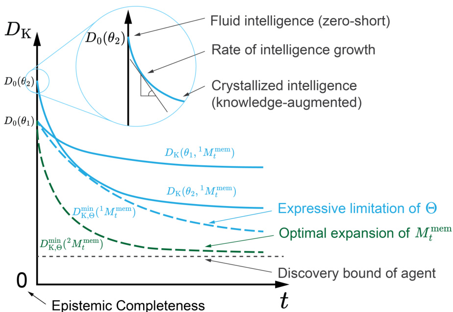  
Figure 12.1: Schematic representation of agent intelligence and knowledge discovery.The agent's intelligence, measured by the KL divergence $D_{\mathrm{K}}$ between predictions and real-world probability distributions, evolves from fluid intellgence (zero-shot predictions for new problems)tocrystallzed intelligence (knowledge-augmented predictions after learning) as it accumulates data in its memory $M_{t}^{\mathrm{mem}}$ over time $t$ . Given $M_{t}^{\mathrm{mem}}$ , the evolution of $D_{\mathrm{K}}$ varies within the world model's parameter space $\Theta$ , as illustrated by $\theta_{1}$ and $\theta_{2}$ in the solid lines. The expressive limitation of $\Theta$ is characterizedbytheenvelope $D_{\mathrm{K,\Theta}}^{\mathrm{min}}$ . Given $\Theta$ $D_{\mathrm{K,\Theta}}^{\mathrm{min}}$ is influenced bydifferentknowledgeexpansionstrategies, such as $^1M_{t}^{\mathrm{mem}}$ and $^{2}M_{t}^{\mathrm{mem}}$ , shown as dash lines.  

# 12.1.2 Statistical Nature of Intelligence Growth  

The agent's intelligence, in a statistical sense, is a non-decreasing function of acquired knowledge. Roughly speaking, $I Q_{t}^{\mathrm{agent}}$ quantfiesbottheamountofknowledgeanagenthaacquiredandhoweffctivelytheagentcan apply that knowledge after learning from $M_{t}^{\mathrm{mem}}$ . Intuitively, if the agent gains additional information at time $t{\mathrm{.}}$ which corresponds to enlarging $M_{t}^{\mathrm{mem}}$ and shrinking $\mathcal{U}$ its intelligence should increase.  

To understand this process, consider a small region $\Delta\subseteq{\mathcal{U}}$ and examine the effect of adding a dataset $\mathbf{x}_{\Delta}$ from $\Delta$ to $M_{t}^{\mathrm{mem}}$ . Denote $\mathcal{U}=\mathcal{U}^{\prime}\cup\Delta$ , where $\mathcal{U}^{\prime}$ represents theremaining unknown part oftheworld.The agent's intelligence at time $t+1$ is given by:  

$$
I Q_{t+1}^{\mathrm{agent}}\equiv-D_{\mathrm{K}}(\theta,M_{t}^{\mathrm{mem}}\mathbf{x}_{\Delta})=-\sum_{\mathbf{x}^{\prime}\subseteq\boldsymbol{U}^{\prime}}P_{\mathcal{W}}(\mathbf{x}^{\prime}|M_{t}^{\mathrm{mem}}\mathbf{x}_{\Delta})\log\frac{P_{\mathcal{W}}(\mathbf{x}^{\prime}|M_{t}^{\mathrm{mem}}\mathbf{x}_{\Delta})}{P_{\theta}(\mathbf{x}^{\prime}|M_{t}^{\mathrm{mem}}\mathbf{x}_{\Delta})}
$$  

Directly comparing $I Q_{t}^{\mathrm{{agent}}}$ and $I Q_{t+1}^{\mathrm{agent}}$ ischallengingf $I Q_{t+1}^{\mathrm{agent}}$ averaging over $\mathbf{x}_{\Delta}$ with probability $P_{\mathcal{W}}(\mathbf{x}_{\Delta}|M_{t}^{\mathrm{mem}})$ Thisexpectationrepresentstheaverageamountofknowledge gained by measuring $\Delta$ ， given prior knowledge in $M_{t}^{\mathrm{mem}}$ . We obtain:  

$$
\begin{array}{r}{\displaystyle\sum_{\mathbf{x}\subseteq\Delta}P_{\mathcal{W}}(\mathbf{x}|M_{t}^{\mathrm{mem}})I Q_{t+1}^{\mathrm{agent}}=-\sum_{\mathbf{x}^{\prime}\subseteq\mathcal{U}^{\prime},\mathbf{x}\subseteq\Delta}P_{\mathcal{W}}(\mathbf{x}^{\prime}\mathbf{x}|M_{t}^{\mathrm{mem}})\log\frac{P_{\mathcal{W}}(\mathbf{x}^{\prime}|M_{t}^{\mathrm{mem}}\mathbf{x})}{P_{\theta}(\mathbf{x}^{\prime}|M_{t}^{\mathrm{mem}}\mathbf{x})}}\\ {=I Q_{t}^{\mathrm{agent}}+\displaystyle\sum_{\mathbf{x}\subseteq\Delta}P_{\mathcal{W}}(\mathbf{x}|M_{t}^{\mathrm{mem}})\log\frac{P_{\mathcal{W}}(\mathbf{x}|M_{t}^{\mathrm{mem}})}{P_{\theta}(\mathbf{x}|M_{t}^{\mathrm{mem}})}}\end{array}
$$  

The second term is the relative entropy of the conditional probability distribution of $\mathbf{x}_{\Delta}$ conditioned on $M_{t}^{\mathrm{mem}}$ ,which is always non-negative.Therefore,on average, $I Q_{t}^{\mathrm{{agent}}}$ is non-decreasing as $M_{t}^{\mathrm{mem}}$ acquires new knowledge over time. Note that $I Q_{t+1}^{\mathrm{agent}}$ canbefurthersedbggtcqdede $\theta$ within $M_{t}^{\mathrm{wm}}$ .  

Interestingly, the expected gain in intelligence at time $t$ is determined by the discrepancy between the actual distribution $P_{\mathcal{W}}(\mathbf{x}|M_{t}^{\mathrm{mem}})$ and the model-predicted distribution $P_{\theta}(\mathbf{x}|M_{t}^{\mathrm{mem}})$ . In other words, the rate of intelligence growth in Figure 12.1 is higher when the new measurement result is more unexpected.Thisobservationidentifies scientist agents [859]as aspecialtypeofcriosity-driven agent[869],prioritizingexplorationover exploitationtoexpandthe frontiers of knowledge fordeeper understanding ofnature.Unlikeagents that leverage existing knowledge toachieve predefined objectives,curiosity-drivenagentscanlearn withoutextrinsicrewards[387,870] (see Section 5.3fordetails)enabling discoveries beyond human-planned search spaces and revealing knowledge in unexplored domains.This potentialalso underscoresthe importance ofequipping curiosity-driven agents withfundamental perception and action tools that can be transferred to explore new knowledge domains.  

# 12.1.3 Intelligence Evolution Strategies  

The strategy for expanding known information determines how quickly an agent's inteligence evolves. For a given knowledge base $M_{t}^{\mathrm{mem}}$ , the parameter $\theta$ can be optimized over a space of world models $\Theta$ characterized by the architecture of $M_{t}^{\mathrm{wm}}$ . The optimal agent is the one that minimizes $D_{\mathrm{K}}(\theta,M_{t}^{\mathrm{mem}})$ , thereby maximizing $I Q_{t}^{\mathrm{agent}}$ .．  

$$
\theta_{\mathrm{K},t}^{*}\equiv\arg\operatorname*{sup}_{\theta}I Q_{t}^{\mathrm{agent}}=\arg\operatorname*{inf}_{\theta}D_{\mathrm{K}}(\theta,M_{t}^{\mathrm{mem}})
$$  

and  

$$
D_{\mathrm{K},\Theta}^{\mathrm{min}}(M_{t}^{\mathrm{mem}})\equiv D_{\mathrm{K}}(\theta_{\mathrm{K},t}^{*},M_{t}^{\mathrm{mem}})
$$  

Here, $D_{\mathrm{K,\Theta}}^{\mathrm{min}}(M_{t}^{\mathrm{mem}})$ represents the minimum unknown after learning from $M_{t}^{\mathrm{mem}}$ for this family of models, quantifying the expressive limitations of $\Theta$ . As shown in Figure 12.1, $D_{\mathrm{K,\Theta}}^{\mathrm{min}}(M_{t}^{\mathrm{mem}})$ forms the envelopeof thefamilyof functions $D_{\mathrm{K}}(\theta,M_{t}^{\mathrm{mem}})$ ,where $\theta$ ranges over $\Theta$ ，  

For a given model family $\Theta$ $D_{\mathrm{K,\Theta}}^{\mathrm{min}}(M_{t}^{\mathrm{mem}})$ measures the best possible prediction of residual unknowns in addressing thetarget scientificproblem basedon $M_{t}^{\mathrm{mem}}$ .Inotherwords,theknowledgecontent in $M_{t}^{\mathrm{mem}}$ is captured by $D_{\mathrm{K,\Theta}}^{\mathrm{min}}(\bar{M}_{t}^{\mathrm{mem}})$ . One can prove that $D_{\mathrm{K,\Theta}}^{\mathrm{min}}(M_{t}^{\mathrm{mem}})$ is monotonicallynon-increasing as $M_{t}^{\mathrm{mem}}$ expands, since it forms the envelope of a family of non-increasing functions $D_{\mathrm{K}}(\theta,M_{t}^{\mathrm{mem}})$ .This expansion process is tied tohow theagent acts and gains information, driven by $M_{t}^{\mathrm{wm}}$ ,which determines the optimal expansion and executes it through the action $a_{t}\in\mathcal A$ at time $t$ (see Table 1.2).  

During knowledge discovery,diffrent strategiescan beemployedtoexpand $M_{t}^{\mathrm{mem}}$ . The optimal expansion strategy is theonethatresultsinthesteepestdecreaseof $D_{\mathrm{K},\Theta}^{\mathrm{min}}(M_{t}^{\mathrm{me\bar{m}}})$ .Forinstance,ingueeilltatei for expanding $M_{t}^{\mathrm{mem}}$ , denoted as $^1M_{t}^{\mathrm{mem}}$ and $^{2}M_{t}^{\mathrm{mem}}$ . The first strategy, $^1M_{t}^{\mathrm{mem}}$ , represents random exploration, while the second, $^{2}M_{t}^{\mathrm{mem}}$ ,follows ahypothesis-drivenapproach[871]in whichthe agent firstformulatesahypothesis about theunderlying mechanismofthetargetproblemandthendesigns anexperiment tojustifyorfalsifythis hypothesis 1749] , on $M_{t}^{\mathrm{mem}}$ $D_{\mathrm{K,\Theta}}^{\mathrm{min}}(M_{t}^{\mathrm{mem}})$ ase This approach is generally more efficient than random exploration for expanding $M_{t}^{\mathrm{mem}}$ , leading to $D_{\mathrm{K,\Theta}}^{\mathrm{min}}(^{2}M_{t}^{\mathrm{mem}})$ descending faster than $D_{\mathrm{K,\Theta}}^{\mathrm{min}}(^{1}M_{t}^{\mathrm{mem}})$ ，  

In general, the knowledge discovery processproceeds iteratively,repeatedlyoptimizing the world modelparameter $\theta$ to approach $\theta_{\mathrm{K},t}^{*}$ and expanding $M_{t}^{\mathrm{mem}}$ inarationalmannertoacceleratethedecreaseof $D_{\mathrm{K,\Theta}}^{\mathrm{min}}(M_{t}^{\mathrm{mem}})$ . The ideal state is achievingepistemiccompleteness,i.e., $D_{\mathrm{K},\Theta}^{\mathrm{min}}(M_{t}^{\mathrm{mem}})=0$ ,meaning zerodiscrepancybetweethe agent'spredition and the real-world phenomena.However, for a specific agent, a discovery bound may exist, where $D_{\mathrm{K},\Theta}^{\mathrm{min}}(M_{t}^{\mathrm{mem}})$ approaches zero butremains positive.These discrepancies arise from practicalconstraints andthe limitations of $\Theta$ ， $\mathcal{A}$ and other design spaces of the agent [872].Achieving a low discovery bound requires designing an adaptive world model architecture, an eficient knowledge expansion strategy, and a sufficient action space.  

# 12.2 Agent-Knowledge Interactions  

Typical forms ofscientificknowledge includeobservational knowledge(e.g.experimentalmeasurements,computational results),methodological knowledge (e.gxperimentalmethods,omputationaltechniques, protocols)andtheical knowledge (e.g.theories,laws,predictive models).These forms ofknowledgecancontribute toscientificunderstanding as long as theyconsistofdataandinformation processedinaway that affects theprobabilitydistributionof unknown information $P_{\theta}\left(\mathbf{x}_{\mathrm{U}}|M_{t}^{\mathrm{mem}}\right)$ , reduces $D_{\mathrm{K}}(\theta,M_{t}^{\mathrm{mem}})$ , and facilitates decision-making.  

In principle,external scientificknowledge has been shown to be usefulin improving agent performance in reasoning and decision-making[873,874].However, the scope of this survey lies in how agents can autonomously discover and utilizeknowledge toenhancethemselves.Scientificknowledge discovery workflows typically involve hypothesis generation,protocol planning,conducting experiments andcomputations, analyzing data,deriving implications,and revising hypotheses-often as part of an iterativecycle.An agent that can perceive,learn,reason,and act has the potential to drive such workflows in an autonomous manner, forexample by using application programming interfaces (APIs)to interact with physicalinstruments toacquire scientificknowledge and iterativelyenhance itsknowledge base (Figure 12.2). The agent will use the acquired knowledge to update its mental states $M_{t}$ to make better decisions when interacting with the world $\mathcal{W}$ . We will now highlight three scenarios where agents discover scientific knowledge and enhance themselves.  

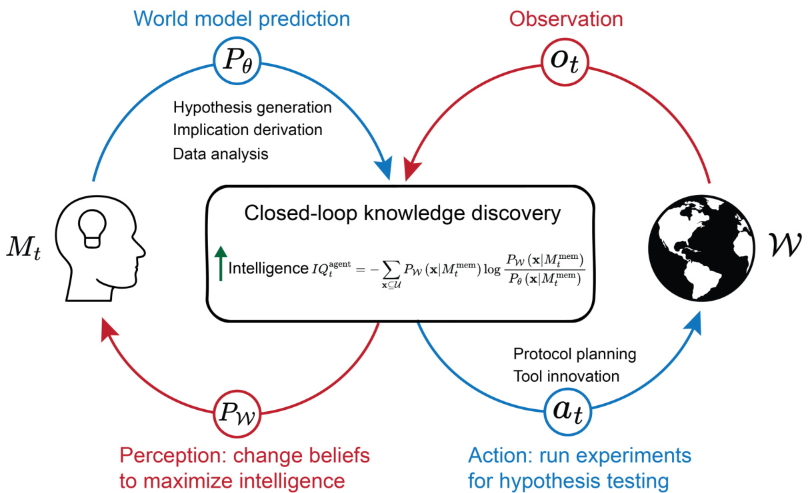  
Figure 12.2:Closed-loop knowledge discovery for sustainable self-evolution.The agent aims toiteratively enhance its intelligence $I Q_{t}^{\mathrm{{agent}}}$ through hypothesis generation and testing,as wellas through data analysis and implication derivation. When interacting with the physical world $W$ , the agent generates hypotheses as an explicitly or implicitly predicted distribution $(P_{\theta})$ of unknown information, takes actions $(a_{t})$ for hypothesis testing, observes experimental results $(o_{t})$ , and updates beliefs based on perception of the real-world distribution $(P_{W})$ . When not interacting with $W$ the agent distills knowledge from existing data and premises, updating mental states $M_{t}$ directly. Inspired by Figures 2.3 and 2.5 in [864].  

# 12.2.1 Hypothesis Generation and Testing  

Hypothesis generation and testing (Figure 12.2)is acriticalapplicationof agents in autonomous scientific discovery, as it hasthepotentialtoenableoutside-the-box innovations[749].In essence,hypothesis generation istheformation of potentialrules that govern data distribution—ranging from single observations to large datasets—pertaining to unobserved scientific phenomena.According to Sir Karl Popper,a scientific hypothesis must be falsifable[875,876]; in this discusson,wedefineahypothesisthat survivesfalsificationasajustifedtruehypothesis[877860].Typically, scientists test hypothesesbyconducting experiments toeitherjustify orfalsifythem.Ahypothesis isconsidered more valuable if it is broad enough to explain a wide range of data and is highly likely to be true.  

To tacklea scientific problem,theagentformulatesone ora smallnumber of high-value hypotheses basedonits mental state $M_{t}$ , which contains only incomplete information about the partially observable world $\mathcal{W}$ . After testing through experiments orcomputations,ajustifiedtruehypothesis becomes instructiveknowledge,expanding $M_{t}^{\mathrm{mem}}$ in a way that rapidly minimizes $D_{\mathrm{K,\Theta}}^{\mathrm{min}}(M_{t}^{\mathrm{mem}})$ Hence,generatingandtestinghighvaluehypothesescanquicklypote knowledgediscovery andincrease $I Q_{t}^{\mathrm{agent}}$ .Inthisscenarioteagentemploystheleaing futn $\mathrm{L}$ , to process observations from hypothesis testing, $o_{t}$ , into knowledge and update its mental states $M_{t}$ .  

Generating physically meaningful hypotheses is a keystep.The agent typically uses LLMs along withcollaborative architectures and domain knowledge forhypothesis generation[878].Siet al.[742]conductedalarge-scalehumanstudy involving over $100{\mathrm{NLP}}$ researchers, and found that LLM-generated ideas were rated as more novel $(p<0.05)$ than human expert ideas,albeitslightlyweakerinfeasibility.Ghafarollahiet al.[743]developed SciAgents,whichgeneates and refines materials science hypotheses to elucidate underlying mechanisms, design principles, and unexpected properties of biologicall inspired materials.Basedonlarge-scale ontological knowledge graphs,SciAgents samples a viable pathbetweenconceptsof interest,formulates apertinenthypothesis,andexpands it intoafullresearchproposal withdetailedhypothesis-testing methodsandcriteria.Itemploystwodedicatedagents toreview,critique,andimprove theproposedhypothesis,butdoes notinclude the stepof hypothesis testingthroughactualexperiments.Similarly,Suet al.[879]and Baek et al.[880]proposed leveraging teamwork—such as collaborative discussions and agent critics—to produce novel and effective scientific hypotheses. In addition, Gower et al. [881] introduced $\mathrm{LGEM^{+}}$ , which utilizes a first-orderlogicframework todescribe biochemicalpathways and generate 2,094 unique candidate hypotheses for the automated abductive improvement of genome-scale metabolic models in the yeast S. cerevisiae.  

Hypotheses only become knowledge after being justified through computational or experimental observations. Lu et al.[745]introduced the AI Scientist,a system designed forfully automated scientificdiscovery.The AIScientist can conductresearch independentlyandcommunicate itsfindings,as demonstratedin threemachinelearning subfieldsdiffusion modeling,transformer-based language modeling,and leaning dynamics. It generates original research ideas,writescde,performscomputationalexperiments,visualizesresults,draftscomplete scientificpapers,and even simulates a peer review processfor evaluation. For instance, it proposed the hypothesis that“adaptive dual-scale denoising can improve diffusion models by balancing global structure and localdetails in generated samples"which was justified through image generation tests on four 2D datasets. Similarly, Schmidgalletal.[746] developed the Agent Laboratory toautonomouslycarry out the entireresearch process,including literaturereview,computational experimentation, and report writing.They evaluated Agent Laboratory's capability for knowledge discovery by addressing five research questions in computer vision and naturallanguage processng,achieving an average humanevaluatedexperiment qualityscore of 3.2out of 5.Inadition,Tiukovaetal.[744]developed Genesis,anautomated system capable of controlling one thousand $\mu$ -bioreactors, performing mass spectrometry characterization, accessing a structured domain information database, and applying experimental observations to improve systems biology models. Genesis can initiate and execute 1,O0o hypothesis-driven closed-loop experimentalcycles per day.Using a similar approach,the Genesis team has advanced the yeast(S.cerevisiae)diauxic shift model,outperformingthe previous best and expanding its knowledge by 92 genes $(+45\%)$ and 1,048 interactions $(+147\%)$ [882]. This knowledge also advances our understandingofcancer, the immune system,and aging.Similarly,Gottweis et al.[749]introducedthe AIco-scientist,whichautonomouslygenerates andrefines novelresearch hypotheses,within vitro validation in three biomedicalareas:drug repurposing,noveltarget discovery,and mechanisms of bacterialevolution and antimicrobial resistance.  

Discovered knowledge enhances the agent's mental states, such as $M_{t}^{\mathrm{mem}}$ ， $M_{t}^{\mathrm{wm}}$ , and $M_{t}^{\mathrm{rew}}$ . Tang et al. [747] developed ChemAgent, which improves chemical reasoning through a dynamic, self-updating memory, $M_{t}^{\mathrm{mem}}$ ChemAgent proposes hypothetical answers tochemistry questions ina development dataset,evaluates themagainst the ground truth,and simulatesthe hypothesis-testing processused inreal-worldresearch.Correctanswers arethenstored as knowledge in its memory to support future chemistry question answering.This self-updating memory resulted in performance gains of up to $46\%$ (with GPT-4) when ChemAgent was applied to four chemical reasoning datasets from SciBench[883]. Wang et al.[884] introduced Molecular Language-Enhanced Evolutionary Optimization (MOLLEO), which iteratively proposes hypotheses for modifying candidate drug molecules in $M_{t}^{\mathrm{mem}}$ , evaluates their drug-likeness and activity, and updates the candidates in $M_{t}^{\mathrm{mem}}$ to enhance drug discovery.Similarly, Jiaet al.[885] developed LLMatDesign, which employs hypothesis-guided structure generation and a self-updating $M_{t}^{\mathrm{mem}}$ to design inorganic photovoltaic materials,whose idealityisdefinedbymatching thetargetbandgapandhaving themost negativeformation energy.  

Simet al.[748]introduced ChemOS 2.0,whichorchestratesclosed-loopoperations inchemical self-driving laboratories (SDLs).ChemOS 2.0integrates ab initiocalculations,experimentalorchestration, andstatisticalalgorithms forthe autonomous discovery ofhigh-performance materials.Acase study ondiscovering organic lasermolecules demonstrates its capabilities. It employs a Bayesian optimizer, Altas, as its world model $M_{t}^{\mathrm{wm}}$ to predict the optical properties of hypothetical molecules—specifically Bis[(N-carbazole)styryl]biphenyl (BSBCz)derivatives-including gain cross section and spectral grain factor. Based on these predictions,ChemOS 2.0 recommends molecules with a higher probabilityof success inthe experimentalcampaign.Itthen utilizes anopticalcharacterization platformandthe AiiDA software package to measure and simulate the properties of test molecules. The results are used to update $M_{t}^{\mathrm{wm}}$ improving the accuracy of future experimental predictions.  

Hysmithet al.[886] published a perspective highlighting the crucial role of reward function design in developing forward-looking workflows for SDLs. Agents can be highly efective at solving POMDP problems in simulated environments,such ascomputer games or simulations,butoften struggle withreal-worldapplications.A welldefined reward function is essential for iterative self-evolution.However, in many real-world scientificresearch problems, reward functions areilldefinedorabsent attheendofexperimentalcampaignsdue tothelackofdirect measurements, thecomplexityofexperimentalresults,andthe needtobalance multipleobjectives.Thediscoveryofnewknowledge can serve as a valuable resource for refining $M_{t}^{\mathrm{rew}}$ , guiding hypothesis exploration and experimental data collection.  

# 12.2.2 Protocol Planning and Tool Innovation  

The capability to plan experimental protocols and optimize tool usage enablesthe agent to solve complex scientific puzzles withinthe autonomous discovery loop.As introducedin Section 9.4,the agentcan systematicallyevaluate and refine its approach toselecting,invoking,andintegratingavailabletools—andevendevelopnewtools tailored to specific task requirements. While optimized protocols and tool usage do not directly reduce $\bar{D}_{\mathrm{K}}(\theta,M_{t}^{\mathrm{mem}})$ , they enhance execution efficiency and effectiveness in refining the probability distribution of unknown information, $\dot{P}_{\theta}\left(\mathbf{x}_{\mathrm{U}}|M_{t}^{\mathrm{mem}}\right)$ ， thereby accelerating knowledge discovery. In this scenario,the agent leverages the reasoning function $\mathrm{R}$ to translate its evolving mental states $M_{t}$ , continuously updated with new knowledge, into real-world actions $a_{t}$ for more effective and faster hypothesis testing (Figure 12.2).  

Scheduling and orchestrating theselection and recombination of existing tools is critical.Scientific experiments typically depend on diverse instruments for analyzing reaction products, with decisions rarely rely on just one measurement.Eectively utilizing necessary instruments without wasting resources and time requires the agent to learn to use tools in an integrated and adaptive manner.Dai etal.[75o]designed amodular workflow thatintegrates mobile robots, anautomated synthesis platform, and variouscharacterization instruments forautonomous discovery. They exemplified this system across three domains:structural diversification chemistry,supramolecular host-guest chemistry,and photochemical synthesis.The mobile robot followsa synthesis-analysis-decision cycle to mimic human experimental strategies,autonomously determining subsequent workflow steps.It selects appropriate instruments,such as the Chemspeed ISynth platform for synthesis, aliquid chromatography-massspectrometer(UPLC-MS)for measuring mass spectracorresponding tochemical peak signals,and a benchtop nuclear magnetic resonance spectrometer (NMR) for tracking chemical transformations from starting materials to products.  

Beyond individuallaboratories,toolorchestration is essntial for delocalized and asynchronous scientific discovery. Strieth-Kalthoff et al.[751] demonstrated a closed-loop integration of five materials science laboratories across three continents,advancing delocalized and democratizedscientific discovery.These fivelaboratories have varying strength—for example,the Universityof BritishColumbia specializes incontinuous preferentialcrystallzation,while Kyushu University excels inthin filmfabrication andcharacterization.Strieth-Kalthoff et al.employed acloud-based experiment planner tocontinuously learn from the incoming data and efectively prioritize informative experiments acro the fivelaboratories,resulting inthediscoveryof 2lnewstate-of-the-art materialsfororganic solid-statelasers.  

Moreover,the agent can optimize existing tools andeven create new ones to enhance its capabilities.Swanson et al.[752]developedtheVirtualLab,anAI-drivenresearch environment thatfacilitated the design and experimental validation of new SARS-CoV-2 nanobodies. Within the Virtual Lab, AIagents conduct scientific discusson in team meetingsand execute specializedtasks inindividualsessions.Onekey agendafortheagents was developing tools toaid in the design of nanobody binders [887],including:(1)asequence analysis toolthatrankscandidate point mutations using log-likelihoodratios fromthe ESM protein language model[88]; (2)a structure evaluation tool that extracts interface pLDDT scores fromAlphaFold-Multimer predictions [889],ofering a proxy for antibody-antigen binding affnity; and (3)anenergyestimationtolbuiltonRoseta[890]toquantifybinding strengthbetweennanobodyvariants and the spike protein.These agent-generatedtools enabled theVirtual Lab to discover two novelnanobodies with enhanced binding tothe JN.1or KP.3SARS-CoC-2variants,while preserving strong affnity for the ancestral viral spike protein.  

# 12.2.3 Data Analysis and Implication Derivation  

Although most knowledge discovery processes relyon generating hypotheses andtesting themin the real world-where observations $o_{t}$ are essential—a significant portion of knowledge can be derived purely through internal actions such as iterative reasoning and deep thinking,whichare common in theoretical disciplines.For example,all theorems in Euclidean geometry can be deduced from just five axioms,butthese theorems do not explicitly exist in the mental state beforethey arederived. Givenallnecessary premises,such as Euclid's five postulates,the true probabilityofa hypothesis may remain elusive. However, using deductive and inductive reasoning to draw implications from known premises and data can help either justify or falsify hypotheses, thus reducing $D_{\mathrm{K}}(\theta,M_{t}^{\mathrm{mem}})$ and enhancing $I Q_{t}^{\mathrm{agent}}$ (Figure 12.2). In this scenario, the agent employs the cognition function C to use prior mental states $M_{t-1}$ and internal actions $a_{t}$ to derive new knowledge and update mental states to $M_{t}$ ，  

Deductive reasoning enables knowledge derivation through logic. Trinh et al.[753] developed AlphaGeometry for the forward deduction of new mathematical theorems based on existing theorems in Euclidean plane geometry. AlphaGeometry employs a neural language model to construct auxiliary points in plane geometry problems and integratesspecialized symbolic engines toexhaustivelydeduce new true statements,therebyexpanding the jointclosure of known truths.Byleveraging this expanded closure, it altermates between auxiliary constructions and symbolic reasoning engines to uncover further implications.AlphaGeometry demonstratedremarkable performance ona test setof 30recent Olympiad-level problems,solving 25—more thandouble the10 problems solved by the previous best method-and coming close to the level of an average International Mathematical Olympiad (IMO) gold medalist.  

Inductive reasoning enables knowledge derivation through pattern recognition and statisticallearning.Liu et al. [754] introduced theTeam of AI-made Scientists(TAIS)to simulate therole of adata scientist for streamlined data analysis.TAIS decomposes a complex data analysis problem into different computational tasks, including coding, self-critique,andregresson analysis, toextract meaningfulinsights fromcomplexdatasets.When applied toidentifing disease-predictive genes, TAIS achieved an overall success rate of $45.73\%$ on a benchmark dataset containing 457 genetic questions.Ideally,the extracted insights should be logicall sound; otherwise,they must bediscarded to ensure only accurate findings are safely integrated into mental states.However,limitation in datacoverage and the implementation of analysis algorithms may lead to hallcinated insights, underscoring the need for reliable data analyzers and reasoning tools to prevent over-analysis.  

# 12.3 Technological Readiness and Challenges  

The self-evolution of agents,which in turndrives the advancement of human knowledge,is promised by their early success in the innovation cycle.This cycle involves generating meaningful hypotheses,designing real-time testing protocols,coordinating various experimental and computational tools, analyzing data,deriving implications,and engaging inself-reflection.However, achieving fullyautonomous self-evolutionremains a significant challenge,given the current technology readiness levels (TRLs)of three fundamentalcapabilities:real-world interaction,complex reasoning,and the integrationofpriorknowledge.Further technologicalprogress is required to improve the cycleof self-driven innovation.  

# 12.3.1 Real-World Interaction Challenges  

Agents interact with the real world primarily through application programming interfaces (APIs).While numerous demonstrations[891]have showntheir strong capabilityto use various APIs,a significant bottleneck inautonomous knowledgediscovery remains:the lack of APIs that allow agents to directly execute tasks ina physicallaboratory. Physical APIs—interfaces that enable direct control of lab equipmentare far lessabundant than computational APIs due to the significant investment of time, expertise,and cost required to develop them.Although existing autonomous laboratories have shown promise,they remain in an early developmental stage(typically TRL 4-6),where straightforward replication or scale-up ischallenging.Consequently, building further systems or broadening their applicationacrossadditional scientificdomains stillrequires substantialcustomizationtoaddress domain-specific needs, along with specialized expertise.  

Twokey tasks are essntialforenablingreal-worldinteraction:operating labdevices andtransferring samples between devices.Seamlessintegration of physical hardware and experimental samples is crucial to maintaining uninterrupted workflows.However, most experimental instruments are originally designed for human operation. Making them accessible to agents requires extensive efforts across multiple disciplines, including robotics,electricalenginering, mechanicalengineeing, and software programming.The rising prominence of SDLs is catalyzing the transformation of human-operated devices into agent-accessble systems through APIs. In autonomous labs conducting complex experiments,two parallel and often complementary approaches are commonly adopted to integrate hardware with agentic systems.Both approaches are modular,reconfigurable,and valuable, yet they require ongoing,dedicated development.  

Approach 1: API Integration via Direct Device Adaptation.This approach involves equipping individual devices with dedicated mechanical adaptations and I/O controllrs,enabling them to receive and execute commands from a central controlPC.Forexample,toachieve solid-state synthesis and structuralcharacterization of inorganic materials, A-lab has implemented 16 types of devices to automate experimental tasks such as powder dosing, heating,and diffraction [892].This approach allows laboratories to function as fully integrated entities by maximizing device utilization,optimizing space andresources, and enabling bespoke tools.However,it is costly,time-consuming,and requiresexpert knowledge to prototype or retrofit devices for automation.Large language models (LLMs)have been applied to facilitate access to diverse tools,asillustrated byCACTUS,a Chemistry Agent Connecting Tool-Usage to Science [893].  

A more accessble alternative for smallteams is thecloud lab or science factory [894], where responsibility for device engineeing shifts from individuallaboratories todedicated userfacilities orcommercial service providers.For instance,Boikoet al.[895]demonstrated an autonomouschemicalresearch agent, Coscientist,capable ofcarrying out cross-coupling Suzuki and Sonogashira reactions using experimental setups at the Emerald Cloud Lab[896].However, cloud labs offer only afixed set of pre-built devices optimized forcommon procedures,posing potentialchallenges for researchers whose experiments require equipment customization,as integrating non-standard tools may involve a lengthy process of negotiation and development.  

Approach 2: Robotic Operation of Experimental Devices. This approach involves using mobile robots or robotic arms to operate existing devices and transfer samples. In many cases,robots can interact with instruments without modification,apart from minoradjustmentssuch as adding specializedactuators,grippers,orholders.Forexample,Dai et al.[750]employed mobilerobots toexplore syntheticchemistry.Intheirautonomous laboratory, mobilerobots enable physicalinkages betweensynthesis andanalysis devices that arespatially separated,automating sampletransportation and handling. In principle,the robots can perform allactions human researchers require in thelaboratory.However, current robotic systems stillrely on human pre-programming tomapthe lab layout,define movement trajectories,and register device positions.Handling unexpected or adaptive situations remains achallenge, as pre-programming cannot anticipate every possible state ofan experimental setup.Real-timelearning andadaptive manipulation are active areas ofresearchthat require further technologicaladvancements.Inthelong term,embodied AI[897]is expectedtoenhance robotic learning, allowing agents to quickly adapt to new environments and tools.  

The two approaches can be combined. For example, Vescovi et al.[894] define a modular laboratory robotics architecturethat allowsfortranslatinghigh-levelcommands into specificoperations fora varietyof diferentrobotic apparatus andlaboratoryequipment, and forlinking robotic apparatus with other elements of an Al-driven discovery architecture,such as high-performance computing [898].This architecture has been used to automate experiments in both the biological and physical sciences[899].Similarly,Fernando et al.[900] integrate a Robotic Operating System 2(ROS2)compatible robot intothe Bluesky experimentalorchestration framework. Loet al.[90l] argue for thedevelopment and integration oflow-cost“frugaltwins"of more expensiveequipment tofacilitate experimentation and democratize access.  

# 12.3.2 Complex Reasoning Challenges  

A fundamental philosophical question is whether agents,often powered by LLMs,can truly perform reasoning.By definition,languages models generate outputs by predicting the next token, a mechanism fundamentally diffrent from human reasoning. From an outcome-driven perspective, these input-output systems exhibit reasoning ability phenomenologically,as they produce meaningfuloutputs compared toareference system generating arbitraryresponses [902].However,regardlessof the perspective taken, thiscapability remains imperfect—particularly whenhandling complex logical and numerical problems, which are crucial for scientific knowledge discovery.  

Agents and LLMs struggle with hard reasoning tasks. Glazer et al.[903]introduced FrontierMath,abenchmark comprising hundreds of original and challenging mathematics problems covering most major branches of modern mathematics.Evaluation of state-of-the-art LLM-driven agents-including ol-preview (OpenAl),ol-mini (OpenAI), GPT-4o(OpenAI, 2024-08-06 version), Claude 3.5 Sonnet (Anthropic, 2024-10-22 version),Grok 2 Beta (XAI), and Gemini $1.5\:\mathrm{Pro}\:002$ (Google DeepMind)- -revealed that no model achieved even a $2\%$ success rate on the full benchmark.Chen et al.[873] presented ScienceAgentBench, a benchmark designed to evaluate language agents in data-driven scientific discovery.Among 102tasks derived from 44 peer-reviewed publications acrossfour disciplines, OpenAI ol successfully solved only $42.2\%$ of them. Chollet [865] proposed the Abstraction and Reasoning Challenge (ARC) to assesssLLMs'ability to perform abstract inductive reasoning without relying on memorization or external knowledge. Even with careful prompting, GPT-4o correctly solved only $19\%$ of the tasks, far below the $\sim75\%$ average human performance[94,905].Zhuet al.[96]suggesteda four-level classification of AIintellgence, including Ll (arbitrating isputes), L2(auditing a review),L3(reviewing a paper), and L4(authoring a paper).They classify the current state-of-the-art LLM-driven agents as approaching L2-levelcapabilities.Toenhance agentsreasoning abilities, researchers have introduced techniquessuchaschain-of-thought[907],tree-of-thoughts[72],and[70].Although new methods continue toemerge,as discussed in Section 2.2,further advancements inreasoning capacityremaincrucial for achieving reliable causal inference in scientific research.  

Agents and LLMs also struggle with quantitative and symbolic problems.For example, GPT-4 and GPT-3.5 often struggle with reliably performing complex arithmetic such as multiplying 12, $345\times98$ , 765, or translating IUPAC chemical names into accurate molecular graphs [908, 697]. A common approach to overcoming these limitations is to useexternal tools rather than relying on the LLM itself for reasoning. In mathematical problem-solving,for example,tools like symbolicsolvers are preferred over direct LLM inference[753].However, this mitigation does not resolve the intrinsicdeficiency in numerical understanding,which poses a potentialrisk to scientific reasoning. Moreover, Yu et al.[909]found that tool-augmented LLMs do notconsistently outperform base LLMs without tools in chemistry problem-solving.For instance,for specializedchemistry tasks,such as synthesis prediction, augmenting  

LLMs with specialized toolscan boost the performance substantially;however,oolaugmentationis less effective for generalchemistry questions,suchas those in exams,where no specific toolscan directly solvea given question.In these scenarios,an agent'sability toreasoncorrectly byusing multiple pieces ofchemistryknowledge becomes more important.  

The preceding discussion emphasizes the importance of developing robust methodologies for evaluating AI agents as scientific research assistants, a topic discussed at length by Cappello et al. [910].  

# 12.3.3 Challenges in Integrating Prior Knowledge  

Prior kowledge isacrucial factor forhigher intellgence.As discusses in Section12.1,the agent's prior knowledge, $M_{t}^{\mathrm{mem}}$ , helps decrease $D_{\mathrm{K}}(\theta,M_{t}^{\mathrm{mem}})$ and increase the agent's intelligence, $I Q_{t}^{\mathrm{agent}}$ . Human-led scientific discoveries frequentlyachieve breakthroughs withrelativelysmalldatasets,thanks tothevastpriorknowledge humans possess.The start-of-the-art LLMs that power autonomous agentsare trainedon nearly all publicly available textualdata,including websites,books, and other sources, thereby encompassng most common knowledge as wellas publicly accessible specialized knowledge.However, achieving an agent that can seamlessly integrate allexisting human knowledge remains a significant challenge.  

At least three types of knowledge sources may not be included in LLM pre-training: (1)Paywalled or unpublished knowledge, including non-open-access publications,industry-specific data,andfailed experiments [91l].Theyare often not accesible to publicmodels despite their potential value in refining domain-specific insights. (2)Empirical knowlege.Heuristic decisions by experts are often effective, particularly in scenarios where no existing data is available foranew problem.However,large amounts ofexpertheuristics aretypicallynotaccessibleas textual data.(3) Contextual or situational knowledge.Knowledge relatedtoreal-worldconditions,suchas safety protocols in chemical reactionsor equipment handling,is often absent from pre-trained models but is essentialfor practicalapplications.  

Additionally, integrating diverse knowledge sources presents challenges in reconciling conflicting information.For example, OpenAI's Deep Research [912] actively gathers online information and performs multi-step reasoning, achieving state-of-the-art performance on Humanity's LastExam and the GAIA benchmark.However,it stillstruggles to distinguish between authoritative information andrumors and exhibits limitations in confidence calibration,often misrepresenting its levelofcertainty[912]Establishing asystem toassessthelevels of evidence[913]of different knowledge fragments—such as quantifying reliability and verifying references—may be necessary for effctive knowledge fusion.  

# Part III  

# Collaborative and Evolutionary Intelligent Systems  

The concepts of collaboration and evolution lie at the heart of intelligent multi-agent systems (MAS).Inspired by biologicalecosystems andhuman societal dynamics,these systems leverage collective intellgence to solve complex challenges that exceed the capabilities of individual agents[914]. Human societies exemplify how cooperation, specialization,anddistributeddecision-making significantlyenhancecollective problem-solvingeffctiveness.Similarly, MAS adopts these strategies,integrating specialized agents toaddress intricatetaskscollaboratively.The foundational principle ofcollective intelligence-the“Wisdom of Crowds"by[915]-suggests diverse, independent agents often yield superior decisions compared to solitary experts,directly underpinning the design philosophy of MAS.Cognitive theories,such as Minsky'ssocietyof mind[17]andthetheoryofmind[916,917],further reinforcethis paradigmby proposing that intelligence emerges from structured interactions among specialized units.  

Recently, advancements in large language models (LLMs)have introduced new possibilities for collaborative and evolutionary multi-agent systems (LLM-MAS).Benefiting from powerful reasoning, planning,and decision-making capabilities, these models enable the creation of sophisticated MAS architectures mirroring the cooperative and adaptive characteristics found in human societies. Agents within LLM-MAS often assume distinct identities and roles,reflecting human-like division of labor and specialized collaboration.Byembracing structured communication, dynamic knowledge sharing, and coordinated decision-making,these systems emulate human social dynamics to achieve common goals. Moreover, LLM-MAS is inherently evolutionary; agents continuously adapt and improve through interactions,feedback, and iterative learning,resulting inenhanced system performance over time.Roadmap In this chapter,we systematically survey the emerging fieldof LLM-based multi-agent systems,focusingspecifically on their colaborative mechanisms and evolutionary capabilities.We first examine how distinct system objectives shape agent roles,behavior patterns,and collaborative strategies in Chapter 13.Next, inChapter 14 we analyze various communication structures,including interaction protocols thatfacilitateeffective agent-agent and human-agent communication.Additionall,we explorecollaborative decision-making methodologies andhow agents leverage their unique expertise and perspectives inChapter 15,and discussthe collective intelligence and evolution mechanism in Chapter 16. FinallyinChapter 17, we discuss evolutionary processes,highlighting adaptive learning methods, continuous knowledge sharing,and mechanisms foriterative improvement thatcollectively enhanceMAS performance. Through this comprehensive survey, we identif current achievements, discuss existing challenges,and highlight promising research directions for collaborative and evolutionary intelligent systems.  

  
Figure 12.3: Taxonomy of LLM-based Multi-Agent Systems.  

# Chapter 13  

# Design of Multi-Agent Systems  

In the contextof LLM-based multi-agent systems (LLM-MAS),collaboration goals and collaboration norms serve asfoundational elements that shape system behavior, interaction patterns,and overalleffectiveness.Collaboration goals specifytheexplicit objectives agents aim to achieve-whether individuall,collectively,or competitivelywhile colaboration norms define the rules,constraints,and conventions that govern agent interactions within the system.Together, these components establish arobustframework guiding effectivecommunication,coordination,and cooperation among agents.  

This section categorizes LLM-MAS into three broad classes based on distinct combinations of collaboration goals and norms:strategic learning,modeling and simulation, and collborative task solving.Although not exhaustive, these categories cover a wide spectrum of LLM-MAS designs andclearly reflect how system objectives shape agent interactions and outcomes.  

·Strategic Learning systems embed agents within a game-theoretic context, where agents pursue individual or partially conflicting goals.The interactions can be cooperative,competitive,or mixed, guided explicitly by predefined game rules and interaction norms.This seting often aligns with non-cooperative (strategic) and cooperative concepts in traditional game theory. Please refer to Section 13.1 for details. ·Modeling and Simulation contexts focus on agents acting independently,driven by diverse environmental or social factors. Here, interactions emerge organically without necessarily converging on common goals. reflecting the complex dynamics seen inlarge-scale social or economic simulations. Please refer to Section 13.2 for details. ·Collaborative Task Solving emphasizes systematic cooperation among agents to achieve explicitly shared objectives.Agents typically adopt structured workflows,clear roledefinitions, and highly predefined collaboration norms to synchronize their actions toward collctive goals.Please refer to Section 13.3 for details.  

Ithe remainder of this chapter, weelaborate oneach category,examining how LLMs enable,influence,and enhance gent behaviors, interactions, and collective intelligence within our scope.  

In the following, weexamine these categories indetail, highlighting how each leverages the capabilities of large language models to shape agent behaviors and interactions.  

# 13.1 Strategic Learning: Cooperation vs. Competition  

Strategic learning refers to agentscapabilities todynamically anticipate,interpret,andinfuence the actions of other agents within game-theoretic settings—whether competitive,cooperative,or mixed[949].Agents iterativelyadjust their strategies based on new information,commonly modeled using foundational concepts such as Nash equilibria [950], Bayesian games[951,914,952]orrepeatedinteractions[953,954].With LLMs enabling nuanced linguistic reasoning, strategiclearning increasingly integrates“soft"signals-including dialogue,persuasion,andimplicit negotiation-thus enriching traditional game-theoretic reasoning frameworks [952, 955, 956, 957].  

In economic applications, multi-agent strategic simulations provide valuable insights into market behaviors and negotiation tactics,highlighting both competitive andcooperative dynamics.For example,[958] and[951] demonstrate how LLM-empowered agents can simulate hiring processes,exhibit rational decision-making in controlled economic experiments,and even forecast stockmovements.[959]introduces a GPT-4-based competitiveenvironment to illustrate how restaurant and customer agents compete to optimize profits and satisfaction, showcasing realistic bidding and pricing strategies.Meanwhile,[960] investigate Buyer-Seller bargaining in LLM-based negotiations, while[961]use ultimatum game simulations to illuminate policymaking decisions grounded in human-like strategic behavior.  

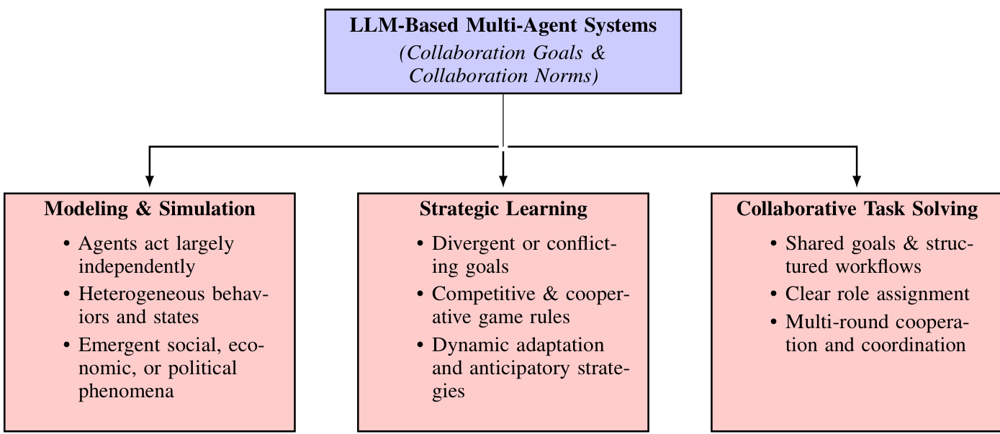  
Figure 13.1: An overview of three major collaboration types inLLM-based MAS: Modeling & Simulation,Strategic Learning,and Collaborative Task Solving. Each category is distinguished by how agents' goals and norms are set (independent vs. divergent vs. shared) and how they coordinate.  

Beyondconventionalmarkets,strategic learningapplies broadly whereverresource allocation,allancesorcompetitivecooperative trade-offs are present.Examples include multi-commodity competitions [962,959], in which agents stratgicallynegotiateterms tomaximizeindividualbenefits,orsustainability-focusedcontexts where agentscoordinate resource consumption[963].In gaming,social deduction games such as Werewolf, Chameleon, Avalon,and Jubensha require agents tomanagethecomplex interplaybetween deceptionandcollaboration[964,965,966,153,919,967,968, 969,970].Studies by[97,965]highlight LLM-based agents thatexcelatorchestratingsubtledeceit andcollabation, while[967,972,968,969]emphasize adaptive,multi-round strategy in Avalon.[970]further pushes this boundary by showcasing autonomous,multi-agent interactions inthe Jubensha murder mystery genre,re-creatingcomplexnarratives. Similarly,diplomatic simulations ([973]and[974])employ LLM-based agents to emulate sophisticated geopolitical negotiation and alliance formation dynamics at global scales.  

SummaryA key advantage of LLM-driven strategic learning lies in effectivelycombining rigorous game-theoretic logic with naturallanguage reasoning.Thisfusion enables agents tointerpret sophisticated instructions,engage in persuasive dialogue,and adapt more flexibly to novel orunstructured settings.Consequently,LLM-based strategic agent hold significant promise for accurately modeling complex real-world interactions- spanning economic competition, social negotiation, and geopolitical strategy-far more efectively than conventionalrule-based or numeric-only approaches.  

# 13.2 Modeling Real-World Dynamics  

Modeling and simulation represents another crucial area of application for LLM-based multi-agent systems (LLMMAS),aiming toreplicatecomplex social,economic,andpolitical phenomenaat scale.By utilizingLLMs'sophisticated language understanding and contextualreasoning,these simulations can feature highly heterogeneous agents whose evolving behaviors mirror real-world dynamism.Unlike strategic learning environments that emphasize explicit competitive orcooperative goals,agents in modeling and simulation scenarios operate independently,guided by their domain-specific roles, preferences, and interactions with the simulated environment [975].  

In healthcare,for example,[921] introduces Agent Hospital, where LLM-powered doctor agents iteratively refine treatmentstrategies through realistic interactions with virtual patients.This enables researchers totest management protocols,raining paradigms, and“what-if"scenarios in acontrolled yetrealistic setting.Similarly, in economic contexts,[976]present EconAgents,leveraging LLM-driven agents torealisticall modelindividual-levelbehaviors such as employment decisions,consumption patterns,and savings strategies.These agents facilitateexpressive macroeconomic simulations,surpassing traditional numeric or strictlyrule-based methods inadaptability and realism[977]. In addition,politicalscience applications alsobenefitfrom this approach.Forexample,[978]and[977]successfully simulate election proceses andpolicymaking dynamics,revealing how publicdiscourse,candidate strategies, and voter interactions shape real-world political outcomes.  

Beyondeconomics and politics,LLM-based simulation accommodates a variety of social and cultural phenomena.For example,[979]and[255] use simulations of linguistic and emotional propagation in social networks to investigatehow opinions,beliefs,or sentiment clusters form online.Researchby[980] explores how opinion dynamics evolve under various topological and interaction paterns,while[981] examines the conditions under which fake news spreads or stalls in heterogeneous agent populations.Large-scale simulation platforms such as GenSim[982]and OASIS [936] pushthe boundary furtherby scaling totens of thousands orevenmillons ofuser agents,thus enabling the study of emergent group behaviors and systemiceffcts-suchasviralinformationdiffusion,echo-chamber formation,or group polarization—under realistic constraints.  

Summary The strength of LLM-based simulation lies in capturing both the structural dynamics(e.g.,network topology or institutionalrules and the cognitive orlinguistic nuances thatdrive real-world behavior.Byembedding languagebased reasoning into agent models,researchers can examine complexsocial processes—like persuasion,framing,or cultural transmission-that would be difficult to capture through purely numeric or rule-based approaches.  

# 13.3 Collaborative Task Solving with Workflow Generation  

Collaborativetask solving orchestrates multiple agents toward aclearlydefinedobjectivethroughstructured workflows. In contrast to strategic learning (which may involve competing interests)or open-ended modeling and simulation (where agents actindependently),collaborative agentsfunction aspart ofaunified problem-solving pipeline.Agents typically folow clearly defined roles (e.g.“Planner",Implementer",or“Evaluator")and stage-based processes to ensure efficient and accurate task completion.  

Systems such as MetaGPT[626],CAMEL[848],Communicative Agents [983],and frameworks described in [924] exemplify how clearly defined roles,responsibilities, and decision flows allow LLM-based agents to coordinate effctively.A typical workflow might involve one agent analyzing a problem statement, another proposing a solution outline,athird implementing partial solutions, andafourth verifying correctnessCommunication among these agents is oftencarriedoutthroughiterativeroundsof naturallanguage“dialogue",leveragingthe inherentlanguage-generation strengthsofLLMs.Thisstructuredapproachalso proves beneficialforscaling tomore ambitious projects, as sub-tasks can be delegated to specialized agents with domain-specific prompts or training.  

Recently,collaborativetask-solving systems have been explored extensively insoftware developmentscenarios (e.g., multi-agent coding,debugging,and testing).However,scientific discovery represents a particularly prominent and compelling aplication.For example,the Agent Laboratory[746]employs agents in structured scientific workflows: proposing hypotheses,designing experiments,analyzing results,andrefining subsequent inquiries,whicheffectively mirrors the iterative nature of thescientific investigation.Similar multi-agent designscan be adapted to tasks such as literaturereview,policydrafting,orlarge-scaledataanalysis, using well-definedprotocols tomaintaincoherence and avoid duplication of effort.  

Summary Compared to other LLM-based multi-agent paradigms,collaborative task-solving inherently prioritizes clarity and predictability:Each agent's role andobjective are predefined, limiting emergent orchaotic behaviors.This structureis particularlyadvantageous in domains requiring precision,accountability,or sequential decision-making. Atthe same time,research isongoing tostriketherightbalancebetween structure and flexibilitywhichensures that agents have enoughautonomy tocreatively contribute solutions while adhering to asharedworkflow thatultimately guarantees reliable, high-quality task completion.  

Discussion The aforementioned three dimensions—strategic learning, modeling and simulation,and collaborative task solving—reflect thebreadth of LLM-based multi-agent systems.Eachcategory addresses distinct research questions and real-world applications,leveraging language-basedreasoning totacklechallenges that extendbeyond thecapabilitiesof conventional, purely numeric, or rule-driven agent designs.  

# 13.4 Composing AI Agent Teams  

In MAS,agentsarethecoreunits that interact within the systemandarecriticaltoitsfunctionality.Theseagentscanbe categorized as either homogeneous orheterogeneous,depending onwhether they share identicalor differing personas, capabilities, and action spaces.  

Homogeneous Homogeneous agents that share identicalcapabilities,action spaces,and observation spaces.Compared to single-agentsystems,the primaryadvantagelies intask parallelization,allowingmultipleagents tohandledifferent parts of atasksimultaneously and improve overalleffciency.They are often used insimpler,coordinated tasks where uniformity across agents can drive improved performance.  

Several studies have applied homogeneous agents to simulate teamwork in games ike Overcooked and Minecraft, as well as real-worldtasks such as householdlabor division.[924]proposed acognitive-inspired modularframework that enables LLM-based agents tocommunicatethrough natural language to perform labor division, request asistance from one another, and collaborativelycompleteobject transportation tasks.[984]introduced prompt-based organizational structures intotheframework,reducingcommunicationcosts betweenagents andimproving teameficiency inhousehold task suchas preparing afternoon tea, washing dishes,and preparing a meal.Furthermore,several studies[926,925] have employed multiple LLM-based agents in popular games such as Overcooked and Minecraft to experiment with their ability tocooperate and complete tasks.According tothe game settings,these agents are also homogeneous.  

Heterogeneous Agent diversity plays acrucialrole in improving collaboration outcomes.Researchshows that heterogeneity among agentscanenhanceproblem-solvingcapabilities,asdiverseagents bringvariedperspectivesand skil to the task athand[985986].Heterogeneitycontributes toricher problem-solvingstrategies andimprovesoverallcollaboration in MAS.Theheterogeneouscharacteristicsof agentscanbereflected inthefollowingdimensions: personas-level heterogeneityobservation-space heterogeneityandaction-space heterogeneityNotethatthese heterogeneitieaenot mutually exclusive—a heterogeneous agent may exhibit one or more of these characteristics.  

·Personas-level heterogeneity.Refers to diversity in agent profiles, which influences how agents approach problem-solving and interact with one another.Most current LLM-based heterogeneous multi-agent systems fall into this category [987, 627, 50, 970].For example,in sofware development, agents may take on personas such as programmers, product managers,or testers. In medical diagnostics,agents may represent cardiologists,oncologists,or paediatricians,each with distinct areas of expertise.The distinct perspectives and expertise of each persona contribute to more robust decision-making.While these heterogeneous agents may share the same action space—such as writing documents [626] (e.g., code, requirement reports, or test reports)or providing diagnostic advice [922]—their personas influence the outcomes of these actions, where role-specific enhancements within multi-agent architectures have shown to significantly streamline and optimize task execution. For instance, a product manager performing the action of writing a document would produce a requirements report, whereas a programmer performing the same action would produce software implementation code[626].This diversity leads to beter decision-making and innovation,especially in complex, multidisciplinary tasks.  

·Observation-space heterogeneity. In MAS, the ability of agents to perceive and interpret their environment can vary.Observation-space heterogeneity refers to these diferences in what agents can observe or perceive within their environment. For example, in the game Werewolf, some agents, like werewolves,can see the identities of their teammates,and the seer can obtain the identity of a designated player, while others, like villagers,cannot seethe true identityof any player[971]. Similarly,in the Avalon game, different roles have distinct observation spaces [919,972],thus influencing the strategies and communications of the players. In these settings,each agent's perceptual ability or observation space is directly linked to their role in the system. In a multi-agent system, this variation in what agents can observe often influences their decision-making, communication, and coordination with other agents.  

·Action-space heterogeneity.On the other hand,this refers tofundamental differences inthe actions agents can perform due to physical or functional constraints.This is particularly relevant in both virtual and physical environments where agents may have diffrent capabilities based on their design or purpose.In the virtual environments of games like Werewolf [965,971,966] and Avalon [919,967], diffrent roles have distinct abilities or skills [971, 919,972]. For example, in Werewolf, while werewolves may have the ability to communicate secretly with each other, villagers might be limited to voting or observing only. This dynamic requires agents to collaborate based on their uniquecapabilities and promotes the learning of strategies such as teamwork, trust, and deception in their interactions.Meanwhile,in robotics,agents may exhibit diverse physical capabilities.For instance, as described in [988],some robots lack mobility and can only manipulate objects,while others are specialized for movement butcannot manipulate objects. In such cases,agents with different action spaces must divide tasks effectively,leveraging their specific abilities to take on the parts of the task they are suited for, ultimately collaborating to complete the overalltask.This type of heterogeneity requires agents to collaborate and coordinate their actions eficiently, often dividing tasks based on their individual strengths.  

Homogeneity to Heterogeneous Evolution In some LLM-based multi-agent systems, agents have the ability to evolve autonomously and continuously adapt through interactions with their environment.Due to the inherent randomness in both LLM models and theenvironment, the evolution ofthese agentsoften followsdifferent trajectories.This can lead to heterogeneous behaviors emerging over multiple simulations,even when agents initialy havehomogeneous personas and action spaces.Forexample,as shown in[989],agents with identicalaction spaces and personas atthe start developed diffrentiatedroles after multiple rounds of interactions withthe environment andother agents.Some agents,forinstance,specializedinfood gathering,whileothers focused oncrafting weapons.Similarly,[990]bserved that initiallyhomogeneousagents developed distinctlanguage usage patterns,emotionalexpressions,and personalities after group interactions.These emergent behaviors demonstrate the possibility of transitions from homogeneous to heterogeneous systems.  

# 13.5 Agent Interaction Protocols  

In this section,there willinitially be classificationof typicalkindsof messages,providing aclear view regarding the contnt and exchange modes for agent interactions.Next, agent-environment, agent-agent, and agent-human communications interface designs will beaddressed.Architecturalissues and protocol specifications fortransparent informationexchange willalsobe addressed.Interface standardizationwillhavea specialfocus,which isessentialfor providing interoperability,scalability, andeffciencyfor multi-agent systems.The section willend with unification of communication protocol discussions, where agent-environment or agent-user interacting design principles and requirements are addressed, as wellas providingclarityconsistency,andfunctionalcoherence forariousapplications for LLM-based systems.  

# 13.5.1 Message Types  

Structured: Structured messages,either in JSON ([991,992]),XML([993,636]),or as acode ([626,627,994]),are a crucial aspect of multi-agent system communication with LLM.The primary advantages of structured messages aretheir syntactically and semanticaly defined structure,enabling unambiguous understanding and straightforward parsing.Withtheir lackof ambiguity,theyfacilitateunerrant information extractionand processing with much less overhead on computation and greater system dependability.For example,JSON and XML can represent specific-task configuration parameters or facilitate data exchange asa machine-readable mode,and messages writen asacode can even be executable several times directly, which makes workflow and automation simpler.  

Structured messages are particularly well-suited for high-efficiency,deterministic applications.They are useful for sub-task decomposition,sub-task assignment,andcoordination among agents forcooperativemulti-agent architecture because they explicitly stateoperationalcommands.Moreover,as structured messages have a prescribed form,retrieving data as wellas storing data is facilitated and system optimization and longitudinal analysis are also feasible.  

Unstructured: Incontrast,unstructured mesages,e.g.naturaltext([979719]),isual data,e.g.images,vides, and audio signals,e.gspeech,ambient sounds([995,996,762]),havehigher informationdensity andrepresentational capability.Such modalities are best suited for communication with nuanced andcontext-dependent information. Images, for instance,communicate spatialrelationships,illumination,andfacialexpressons,andvideoscommunicate dynamic temporally-organized sequences,e.g.,state orbehaviorchanges overtime.Similarly,audio signalsalsocommunicate not justlinguistic informatinbutalsoparalinguisticinformation,e.g.tone,emotion,andintonation,whicharecritical for natural and context-aware interactions.  

Unstructured messages are well-adapted forambiguitytasks,as wellas forcomplex,real-world settings.The fact that they can expressabstract ideas as wellasaffective subtlety,orimplicitcontextual suggestions, makesunstructured messages wellsuited for creative, as wellas discovery-oriented, problem spaces.Unstructured data'scomplexity, however,callsforadvanced processing techniques,for example,feature extraction based ondeep learning,forone to tap intotheir full potential.Advances with pre-trained LLMs as wellas multi-modallarge language models have alleviated these complexities to alarge extent, enabling novelapplications for unstructured communication within multi-agent systems [533, 513,997].  

Summary: Unstructured and structured messages have complementary roles for multi-agent communication with LLM-based.Whilestructured messages oferaccuracy,consistency, andcomputationeffciencyand are appropriate for operational and deterministic operations,unstructured messages offer rich,contextualized representations enabling agents to negotiate vague,creative,highly dynamic situations.Together,these modesoffer afoundation for adaptive, effective multi-agent cooperation.  

# 13.5.2 Communication Interface  

Agent-EnvironmentInterface LLM-based agents willtypicallyhave to act on their environment once or severaltimes in order toperformarange ofoperations.Fromthe agent's point of view,itsoutput intotheenvironment is something that it would prefer, e.g.,a UIclick, webrequest,ora move foracomputer graphic'scharacter.Environments differ withregard to whatactions they willaccept,andsoasnothave its actions not getexecuted,the agent must findout what actions are foraspecific environment that it is acting within and performactions that arefora specific task as wellas validfora specificenvironment.After the agent outputs itschosen action,the agent willhave areturn from the environment.It willconsistofobservations ifsuccessful,orafeedbackonerrorif therewasone.Theagent will have to actonthis feedback.There are nowadays various typesofenvironments where anagentcan act,e.g.perating systems,computer games,database, ande-commerce websites.To make agent-environment interfaces share acommon interface and have agents trained on various LLMs plug into various environments with minimal further adaption, various frameworks have been proposed. These frameworks make for easier tests on agents'capability on various executable environments [706].  

Agent-Agent Communication In MAS, communication through natural language is predominant.This is likely because large language models possess strong linguistic capabilitiesdue to pretraining on massive naturallanguage corpora.Another possiblereason isthatfor many tasks, naturallanguagecommunication isalready suffcientto meet the requirements.Based on the type of information exchanged, multi-agent systems can be categorized as follows: Natural Language-Based Systems Among LLM-based multi-agent systems utilizing natural language, text-based communication is the most common[922,924,987,970,998].There are also some systems that use voice as the mediumofcommunication[996,762,999,100].In these systems, agents engage in behaviors such as discussions, negotiations,persuasion,or critique through naturallanguage to achieve theirobjectives.Structured InformationBased Systems Compared to naturallanguage,structured information has characteristics such as higher consistency, lower parsing complexity,and reduced ambiguity, making it more suitable for efficient and low-costcommunication between agents [626]. In some implementations,the information exchanged between agents is structured into distinct components tofacilitate easier parsing and utilization bythereceiving agent.For instance,theexchanged information might include fields specifying the sender,receiver, message type, and instructions on how the recipient should parse or use the content [929].  

Human-Agent Communication The purpose of developing multi-agent systems is to expand the boundaries of human capabilities andcognition,ultimately serving human wellbeing.While in some social simulation multi-agent systems, humans primarilyexist asobservers [50,0o1], most multi-agent systems allow human participation in various forms. During this participation,humans need tocommunicate with agents,andthiscommunicationcantake the formof either natural language or structured information[924,930]. When human-to-agent communication primarilyrelies on natural language,asingle LLMoften acts asa hub to parse human naturallanguage into structuredinformationthat agents can process more efectively for subsequent operations.This hub LMcan either exist within the multi-agent system or function independently of it.To save time and enhance communication effciency,humans can also use structured information to communicate with the multi-agent system through programming or similar methods.By following predefinedcommunication protocols,humans can send messages containing therequired datato the multi-agent system. The system willthen process the messages and data according to its internallogic and return the results. [931]  

# 13.5.3 Next-Generation Communication Protocols  

The fieldof LLM-basedagents is stillin its infancy.Developers typically design agent architectures andcommunication mechanisms tailored to specific domains ortasks,including agent-to-environment, agent-to-human,and inter-agent interactions.However, most existing systems lack a unifiedcommunicationframework,resulting in fragmented,siloed ecosystems.Multi-agent systems,tools,environments,anddatasourcesoftenoperateindependently,makingit difiult for agents tointeroperate orsharecapabilities.Furthermore,the burden oflearning andimplementing bespoke protocols falls on humans,and almost allcurrent protocols are manually designed—alabor-intensive process that often lacks semantic flexibility or scalability.  

To address these issues,several new agent communication protocols have been proposed, each targeting differeni aspects of the protocol design stack.  

Internet of Agents(IoA)[933]introducesan internet-inspired,instant-messaging-likecommunication architecture that supports dynamic team formation and task-driven collaboration. Agents register with a central coordination server, which handles identity management and discovery.Communication fows are orchestrated using FSM (Finite State Machine)-based dialogue templates. IoA supports multiple message types, including discussion, task assignment, andtriggering mechanisms, and provides structured fields for controlling speaker turns,nested groupformation, and maximum dialogue length. This alows agents to select and adapt message formats to match specific coordination phases, offering flexibility within a fixed schema.  

Model Context Protocol (MCP)[931],developed by Anthropic,focuses on enabling LLM agents to accessstructured tools and data.Itadopts afullycentralized approach basedon OAuth identityauthentication,and interactions are constraied to JSON-RPC 2.0 messages.While itlacks a meta-protocollayer or semantic negotiation capabilities,its simple andrigid architecture makes it a practical choice for tooluse cases with well-defined APIs.However, MCP sacrifices flexibility and extensibility, requiring manual registration of supported functions.  

Agent Network Protocol (ANP)[1002] aims to achieve fulldecentralization.Agents identify themselves through W3C-compliant decentralized identifiers (DIDs)and communicate over encrypted pee-to-peer channels.The protocol includes a meta-protocollayer that enables agents to negotiate which application-level protocol toadopt,supporting semantic protocol selection based onagent capabilities.ANPalsoallowsfor multi-protocol support atthe application layer (e.g.,HTTP,JSON-RPC, naturallanguage),providing strong extensibility anddecentralization but does notet explicitly support public protocol reuse.  

Agora[932] offers a highly flexible and language-driven protocol mechanism. Instead of registering pre-defined APIs,agentscan generate and share ProtocolDescriptions (PDs),which are freetext descriptions ofcommunication semantics.Using alarge language model,agentscan dynamicaly interpret and execute any PDatruntime.This allows protocols tobecreated,deployed, andused entirelythrough language,without anymanualregistration orconfiguration. Agora avoids centralized registries and supports decentralized protocol sharing:agents may publish or retrieve PDs from peer-distributed repositories to enable cumulative learning and interoperability across systems.  

Summary: As shown in Table 13.1, next-generation agent communication protocols differ along key dimensions suchas identity and security mechanisms, meta-protocol negotiation capabilities,application-layer flexibilityand the degree of centralization.Aunified, secure,scalable, and dynamic protocolinfrastructurewhere agents can negotiate andco-create protocolson the fyiscriticalforenablinglarge-scale, interoperable agent ecosystems.While current frameworks such as MCP,ANP,Agora, and IoA represent early but promising steps,protocol design remains arapidly evolving frontier in the development of intelligent agent systems.  

Table 13.1: Comparison of four agent communication protocols (MCP, ANP, Agora, IoA)across identity, negotiation, and execution layers. $\mathbf{PD}=$ Protocol Description; DID:Decentralized Identifier; LLM:Large Language Model; FSM:Finite State Machine   

<html><body><table><tr><td> Layer</td><td> MCP</td><td>ANP</td><td>Agora</td><td>IoA</td></tr><tr><td>Identity & Security</td><td>OAuth-based centralized identity authentication.</td><td>DID-based decentralized identity with encrypted channels.</td><td>No centralized registra- tion.Identity derived from PD hash.</td><td>Agents register with a central server for identity and discovery.</td></tr><tr><td>Meta-Protocol Layer</td><td>No meta-protocol layer; relies on pre-defined in- terfaces.</td><td>Uses DID document to negotiate and select ap- propriate protocol via se- mantics.</td><td>LLM interprets PD text to automatically negoti- ate and deploy communi- cation protocols.</td><td>A centralized discovery mechanism combined with FSM-based  dia- logue flow control.</td></tr><tr><td>col Layer</td><td>Application  Proto- Supports only  JSON- Supports multiple proto- RPC 2.0.</td><td>cols such as HTTP and natural language.</td><td>Allows  arbitrary PD- driven protocols with high flexibility.</td><td>Task-driven protocol coordination supporting multiple message for- mats.</td></tr><tr><td>ization</td><td>Degree of Central- Highly centralized archi- Fully decentralized. tecture.</td><td></td><td>Decentralized: no regis- tration or fixed ID, with optional peer-to-peer PD sharing.</td><td>Highly centralized archi- tecture with a central co- ordination server.</td></tr><tr><td>Protocol Flexibility</td><td>Fixed and rigid; hard Highly flexible with se- RPC.</td><td>to adapt beyond JSON-mantic negotiation.</td><td>Extremely flexible; any PD can define a new pro- tocol dynamically.</td><td>Moderately high flexibil- ity; agents can select and adapt message formats based on task phases and coordination needs.</td></tr></table></body></html>  

Table 13.2:Classification framework for LLM-based multi-agent systems,highlighting diffrent aspects of system design,communication,collaboration, and evolution. Below are our abbreviations,for ease of reference: $\mathbf{M}\&\mathbf{S}=$ Modeling & Simulation, $\mathbf{CTS}=$ Collaborative Task Solving， $\mathrm{SL}=$ Strategic Learning, $\mathbf{S-D=}$ StaticDecentralized, $\mathbf{S-L}=\mathbf{S}$ Static-Layered, ${\mathrm{Hom}}=$ Homogeneous, Het $\mathbf{\tau}=\mathbf{\tau}$ Heterogeneous, $\mathbf{T}/\mathbf{M}=$ Teaching/Mentoring, $C{\mathrm{-}}0=\left.\left\langle\right.$ Consensus-Oriented, $\mathbf{\partial}_{\mathbf{T}-\mathbf{O}}=$ Task-Oriented, ${\mathrm{CL}}=$ Collaborative Learning, Dict $\mathbf{\tau}=\mathbf{\tau}$ Dictatorial, $\mathbf{D-B}=$ DebateBased, $\mathrm{CI}=$ Collective Intelligence, Ind $\c=$ Individual.   

<html><body><table><tr><td>Paper</td><td> System Design</td><td colspan="3">Communication</td><td colspan="2">Collaboration</td><td>Evolution</td></tr><tr><td></td><td>Category</td><td>Typology</td><td>Interface</td><td>Agent TypeInteraction</td><td></td><td>Decision</td><td>Type</td></tr><tr><td>Agent Hospital [921]</td><td>M&S</td><td>S-D</td><td>Text</td><td>Het</td><td>T/M, C-O</td><td>Dict</td><td>Ind</td></tr><tr><td>Welfare Diplomacy [934]</td><td>M&S</td><td>S-L</td><td>Code, JSON, Text</td><td>Hom</td><td>CL</td><td>Voting</td><td>CI</td></tr><tr><td>MEDCO[923]</td><td>M&S</td><td>S-L</td><td>Text</td><td>Het</td><td>T/M, C-O</td><td>Dict</td><td>Ind</td></tr><tr><td>MedAgents[922]</td><td>M&S</td><td>S-L</td><td>Text</td><td>Hom</td><td>T-O</td><td>Dict</td><td>CI</td></tr><tr><td>Generative Agents [50]</td><td>M&S</td><td>S-D</td><td>Visual</td><td>Hom</td><td>CL</td><td>Dict</td><td>Ind</td></tr><tr><td>RECONCILE [918]</td><td>SL</td><td>S-D</td><td>Text</td><td>Hom</td><td>CL</td><td>D-B</td><td>CI</td></tr><tr><td>Agent Laboratory [746]</td><td>CTS</td><td>S-L</td><td>Code, Text</td><td>Het</td><td>C-O, T-O</td><td>Dict</td><td>Ind</td></tr><tr><td>CoELA[924]</td><td>CTS</td><td>S-D</td><td>Text</td><td>Hom</td><td>T-O</td><td></td><td></td></tr><tr><td>The virtual lab [752]</td><td>CTS</td><td>S-L</td><td>Text</td><td>Het</td><td>C-O, CL</td><td>Dict</td><td>Ind</td></tr><tr><td>SciAgents [743]</td><td>CTS</td><td>S-L</td><td>Text</td><td>Het</td><td>T-O</td><td>Dict</td><td>CI</td></tr><tr><td>S-Agents [927]</td><td>CTS</td><td>S-D</td><td>Text</td><td>Het</td><td>T-O, CL</td><td>Dict</td><td></td></tr><tr><td>GPT-Bargaining [1003]</td><td>CTS</td><td>S-D</td><td>Text</td><td>Het</td><td>C-O</td><td>D-B</td><td>CI</td></tr><tr><td>FORD[1004]</td><td>M&S</td><td>S-D</td><td>Text</td><td>Het</td><td>C-O</td><td>D-B</td><td>CI</td></tr><tr><td>MADRA [1005]</td><td>CTS</td><td>S-D</td><td>Text</td><td>Het</td><td>C-O</td><td>D-B</td><td></td></tr><tr><td>Multiagent Bench [948]</td><td>CTS</td><td>S-D</td><td>Text</td><td>Hom</td><td>T-O, CL</td><td>D-B</td><td>CI, Ind</td></tr><tr><td>OASIS [936]</td><td>M&S</td><td>D</td><td>Text</td><td>Het</td><td>C-O</td><td></td><td></td></tr><tr><td>S [255]</td><td>M&S</td><td>S-D</td><td>Text</td><td>Het</td><td>C-O</td><td></td><td></td></tr><tr><td>FPS [981]</td><td>M&S</td><td>S-D</td><td>Text</td><td>Het</td><td>C-O</td><td></td><td></td></tr><tr><td>GPTSwarm[1006]</td><td>CTS</td><td>D</td><td>Code, JSON, Text</td><td>Hom</td><td>T-O</td><td>Dict</td><td>CI, Ind</td></tr><tr><td>ChatEval[1007]</td><td>CTS</td><td>D</td><td>Text</td><td>Hom</td><td>T-O</td><td>Voting</td><td>CI</td></tr><tr><td>MetaGPT [626]</td><td>CTS</td><td>S-L</td><td>Code, JSON, Text, Visual</td><td>Het</td><td>T-O</td><td>Dict</td><td>CI</td></tr><tr><td>AutoAgents [1008]</td><td>CTS</td><td>D</td><td>Text</td><td>Het</td><td>T-O</td><td>C-O</td><td>CI</td></tr><tr><td>SWE-agent [628]</td><td>CTS</td><td>D</td><td>Text</td><td>Hom</td><td>T-O</td><td>Dict</td><td>Ind</td></tr><tr><td>AgentCoder [994]</td><td>CTS</td><td>D</td><td>Code, Text</td><td>Het</td><td>T-O</td><td>D-B</td><td>CI</td></tr><tr><td>MASTER[1009]</td><td>CTS</td><td>S-L</td><td>Text</td><td>Hom</td><td>T-O</td><td>D-B</td><td>CI</td></tr><tr><td>Reflexion [48]</td><td>CTS</td><td>D</td><td>Text</td><td>Het</td><td>T-O</td><td>D-B</td><td>Ind</td></tr><tr><td>MACM[1010]</td><td>CTS</td><td>D</td><td>Text, Code</td><td>Het</td><td>T-O</td><td>D-B</td><td>CI</td></tr><tr><td>Debate[985]</td><td>CTS</td><td>S-D</td><td>Text</td><td>Het</td><td>C-O</td><td>D-B</td><td>CI</td></tr></table></body></html>  

# Chapter 14  

# Communication Topology  

# 14.1 System Topologies  

  
Figure 14.1: Different types of topological structure for multi-agent collaboration.  

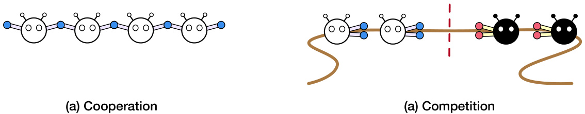  
Figure 14.2: Collaborative and competitive agents.  

This section examines the interaction typology in LLM-based multi-agent systems (MAS)and its impact on communication,collaboration,and task execution. We first analyze static topologieswhereconnectivity patterns are fixed by domain knowledge—and then explore dynamic(adaptive)topologies that adjust inter-agent connections based on performance metrics,workload variations,or strategicconstraints.Weconclude with a discussion of scalability challenges and trade-offs inbalancing systemcost, performance,androbustness,drawing onrecent research indistributed processing, self-organization, and emergent collaborative behaviors.  

# 14.1.1 Static Topologies  

Static topologies are definedby predeterminedstructural paterns that remainlargely unchanged during system execution. In these configurations,connections among agents—or between agents andacentralcoordinator—are established using fixed rules and heuristics,ensuring predictable communication flows and simplified coordination.Three canonical forms are typically considered: layered (hierarchical), decentralized, and centralized architectures.  

Layered (Hierarchical)Structures Layered topologies arrange agents hierarchically, with high-level agents coordinating or supervising lower-level ones.This approach mirrors traditional management frameworks—such as Standard  

Operating Procedures (SOP)or the Waterfallmodel-where tasks are decomposed into sequential, well-defined stages. For instance, the AutoAgents [1o08] framework assigns roles (e.g., Planner, Agent Observer, and Plan Observer) to synthesize execution plans,while ChatDev[983] leverages hierarchical task decomposition to streamline software development[626,921,627].Although hierarchical structures facilitate debugging,performance monitoring, and modularity, they can create bottlenecks when upper-tier agents are overloaded[10ll]. Recent studies in storytelling[10] 14] and data science applications including data cleaning [1015,1016], visualization[1017, 1018] and automachinelearning [1019,020],highlight the trade-off between consistency and theemergenceof adaptive real-time behaviors.  

Decentralized Structures In decentralized topologies, agents interact on a peer-to-peer basis without a central coordinator,forming networks that areoften modeledaschains,rings,smallworldorrandom graphs[121,971].This structure enhances fault tolerance since the failure of a single agent does notcompromise the network.For example, [1022]show that distributing graphreasoning tasksamong multiple agents enables scalability beyond the contextlength limits of individual LLMs.Additionally,[1023]propose decomposition strategies that allow an orchestrating LLM to delegate subtasks efectively.However, maintaining acoherent global state in decentralized systems necesstates sophisticated consensus and synchronization protocols.  

Centralized Structures Centralized topologies rely on a master coordinator that gathers information and directs peripheral agents hierarchically.Such a setup allows for better controlover handling resources and sharing a global view,such as withculture parksand Lyfe Agents[1024,025]. With additional agents,however, a bottleneck atthe center node may occur, with increased communication overhead and susceptibility to failures. Current studies on coordinator-agentconfigurations[971] andresearchon ensuring autonomy forcentralizedconfigurations [1026] point out problems with scalabilitywithconsistency.While consistency is guaranteed forcentralized architectures,there may not necessarily be flexibility for dynamic adaptation.  

Briefly, static topologies have advantages of determinismand predefinition.With pre-defined structural patterns, these systems have predictable communication patterns and effctive coordination among agents. Topologies of thesestructures aretypicallydefined onstructuralknowledgeorstatic rules,and,as such,theysuit domains where workflowforthe tasks is static,there are predefinedroles,and systemrequirements are welldefined.The second primary advantage is design,implementation, and maintenance ease.With structure predefined, design as well as execution procedures are made simpler, and,asaresult, maintenance isa simplerprocessResourcehandling as wellas modularization gets simpler due to well-defined, static structure.  

However,statictopologies themselves are nonflexible,groundedon pre-specified patterns ofconnectivitythat do not respond toreal-timechanges.Wellsuitedforaspecific purpose atdesigntimebutentirelylackingflexibilityforreacting to unforeseen challenges,including sudden agent breakdown,varying degrees of task complexity, and system goal modification,static topologies do nothave real-time response flexibility potential.Real-time response inflexibility inhibits runtime system reconfiguration anddecreases system effectiveness in dynamic settings where circumstances occur.Failureto self-organize and morph according toemergingconditions may equate to inefficiency as well as low system performance, particularly where dynamic or emergent setings are at hand.  

# 14.1.2 Dynamic and Adaptive Topologies  

While static topologies providedeterminism and predictabilityillustrated by statictopologies such as hierarchical or centralized ones performing well with stable-task domains and well-defined roles—static topologies do not fit open-ended or novel domains.Real domains,from real-time collaborative plan,to dynamic social simulations, often demand that agents make changes on their patterns of interaction as work continues,available resources vary,or feedback fromthe environment is received. Such structural tension with adaptative maleability generates dynamic topologies,which,atruntime,recast inter-agentrelationshipsasaresponse tofeedbackon performance,workload,or strategic constraints, striking a balance between consistency and responsiveness.  

For example,DyLAN framework[725] supports inference-time agent selection througha two-step processa forwardbackward team optimization step with unsupervised Agent Importance Scores,follwed by dynamic team reformulation at runtime.Similarly, OPTIMA[1027] optimizes inter-agent connectivity iteratively through a generate-rank-select-train framework,utilizing reward functions asa means for determining abalance among task quality, token efficiency, and readability, with communication actions further optimized through strategies such as Direct Prefernce optimization. The MAD framework [649] ilustrates flexibility through a joint optimization among three prompt phases and structure,with dynamic role assignment(such as verifers and debate participants)within pruned spaces for structure.  

Topological control also becomes tractable through technological advancements.GPTSwarm [651] conceptualizes agents ascomputation graphs and uses evolutionarystrategies andreinforcement learningforadjusting adjacency matrices for optimizing nodes based on feedback for the task.MACNET[1028] uses a directed acyclic graph architecture with supervisory instructors managing edges and executive assistants managing nodes for more complex coordination domains,facilitating adaptivecommunication through topologicalordering and sensitive propagation of output. Application-specificversions alsoemphasize architecture diversity.Open-world environments have DAMCS [1029], which couples hierarchical knowledge graphs (A-KGMS)with structured communication schemes (S-CS) for cooperative planning as a function of messages passed based on context.AutoAgents [1030] leverages a dynamic drafting-execution pipeline with pre-defined agents jointlysketching out expert teams,adesignthat's highlyefctive for creative applications such as novel generation through parallel processing and internal supervision. Noticeably, small-world development within large-scale MACNET[1028] systems corresponds with graph reasoning ideas shown in[1022], where distributed architecture bypasses local limitations of LLM through structured collaboration.In terms ofcollaborative task solving,several paradigms have emerged that emphasize therole of dynamic topologies. These paradigms include search-based methodologies,LLM-based generation,and configurations utilizing external parameters.  

Search-based Methods A number of works adopt search-based methodologies to iteratively optimize communication structures.For example,ADAS [741] employs a Meta Agent Search algorithm that iteratively generates and tests new agent designs within acode space, archiving superior configurations and thereby updating subsequent generation strategies.Similarly,Afow[773] models each LM callas a node inagraph and utilizes Monte Carlo Tree Search (MCTS)to dynamicall extend and refine the workflow.Other frameworks,such as MAD[1031] and OPTIMA [1027], integrate iterative generate-rank-select-train paradigms thatecho MCTS principles to balance task performance with efficiency.  

LLM-based Methods Complementing search-based methods, severalrecent works leverage the generative capacity of LLMs to construct and adapt dynamic topologies.Dylan [725] introduces a temporal feed-forward network (T-FFN) model that treats each communication step as a network layer,using forward-backward propagation to compute Agent Importance Scores for dynamic team selection. Inrelated work,DAMCS[1029],AutoAgents[1030],and TDAG[1032] dynamically generate specialized sub-agents orupdate hierarchicalknowledge graphs,enablingcooperative planning and task decomposition.Further,frameworks such as AutoFlow[773]and Flow[1033]represent task workflows in natural language programs oractivity vertex graphs (AOV),allowing continuous refinement through reinforcement learning signals.ScoreFlow[788]complements these approaches by applying gradient-based (loss-gradient)optimization to continuously reconfigure agent workflows.  

External Parameters Given that fine-tuning LLM-based agents is often resource-intensive,a considerable number of researchers advocate configuring inter-agent topologies by training parameters independent of the LLM-agent.This approach is initiatedbyGPTSwarm[651],in whichthe inter-agent topologies are representedasadirectedacyclic graph (DAG),with edge weights serving as the sole trainable component of the system.Further advancing this paradigm, AgentPrune provides a unified modeling framework fromthe spatial-temporal graph perspective for mainstream MAS, where communication redundancy,ie.,unnecessary edges,is identified and prunedthrough magnitude-based pruning. Follow-upworks in this lineof research include G-Safeguard[1034],which similarly trains GNN outside of the MAS to detect andeliminate malicious communication paths.Although these methods are parameter-effcient,their relatively small parameter space and low coupling with LLM-agents often result in performancelimitations to some extent.  

Discussion Dynamic topologies extend beyond task-solving and play a crucial role in simulating complex social interactions.As detailed inarecent survey[975],LLM-basedagent modelscanevolve inter-agent links tocapture real-timechanges inautonomy,socialbehaviors,and environmental feedback across variousdomains, including cyber, physical,and mixed environments.Systems such as[50],OASI[936] and ProjectSid[989] simulate dynamic social networks.[50]employs generative naturallanguage memory retrievalto adjust socialties based on agents'experiences, while OASIS constructs a real-time social media environment with continuously updated user relationships and informationflows.Project Sid[989]introduces thePIANO(ParallInformation Agregation via NeuralOrchestration) architecture,enablingover lautonomous AIagents tointeract inreal-timewithina Minecraft environment,leading to the emergence ofcomplexsocietalstructures such asspecializedroles,collctive rule adherence,andculturaland religiou transmission.Additionally,architectures like AgentScope-scability[1035] and Social Survey [975]support large-scale multi-agent simulations,enablingstudiesofculturaldissemination,colectivedecision-making,andemergent group dynamics in environments with hundreds orthousands ofinteracting agents.Additionaly,dynamic topologies are also tailored to specific application domains such as medical and open-domain embodied AI. In the medical field, AI hospital[1036] and agent hospital[921] simulatereal medical workflows, where iterative cycles of diagnosis, treatment, and feedback continuously reshape communication patterns among various roles,such as intern doctors, patients,examiners,and supervising physicians.These frameworks dynamically adjust inter-agent communication to optimizecolaboration and decision-making.Similarly, in open-domain and embodied AI applications,frameworks like IOA[9]support heterogeneous,cross-device agent interactions,facilitating dynamic team formation and task allocation in real-world scenarios.  

Although the aforementioned dynamic multi-agent topologies have made substantial progressin performance metrics, they stillfacethefollowingthreelimitations,whichwebelieveshouldbethefocalpointsforfutureresearchondynamic topologies:  

(1) Generalizability. Current MAS topologies are typically optimized for a single-task domain. For example, AFlow[773] is dedicated to search and optimization within math or code benchmarks, producing a fixed workflow that is difficult to adapt to newtask domains.Other dynamic topologies,such as ADAS[741],GPTSWarm[651],and AgentPrune,face the samechallenge.We argue thatMAS should becapableof lifelong learning,wherein the system generalizes across different task domains with minimal resources (e.g., API call, FLOPs, GPU hours).  

(2)Resource Efficiency.Present dynamic topologies oftentend tooptimize forcomplex,resource-intensive structures. Their training processes aretypicallexorbitantlycostly,asexemplified byADAS[74l],wheretrainingwithGPT-3.5 incurs a cost of approximately $\$300$ per session. Such expenses severely constrain their large-scale applicability in real-world scenarios.Future developments should focus on achieving beter test-time topology optimization with significantly reduced costs.  

(3) Inference Efficiency.As MaAS[787]has incisively observed, multi-agent topologies of excessive complexity, while capableofconsistentlydelivering satisfactory performance,arelamentablydeficient intask adaptability.That is to say,theyareunabletodynamically allocatereasoningresources (i..,tols,thenumberofagents,andreasoning steps)inresponse tothe diffcultyof agiven task.Consequently,this may lead toacertain lack of effciency inthe inference process. Although MaAS has, to acertain extent, achievedtask dynamism through the designed agentic supernet, their applicability and scalability in large-scale deployment still remain to be tested.  

# 14.2 Scalability Considerations  

Scalability is acriticalchallenge inLM-basedmulti-agent systems (MAS),especiallas the number of agents grows. In fully connectednetworks,the numberofcommunication pathsgrowsquadratically,leading toacommunication explosion that increases token usage andcomputationalcosts[1037,626].Centralized andlayered topologiescanexperience synchronization bottlenecks if supervisory nodes are inundated by messages,whereas decentralized networks—while more fault tolerant—necessitate complex consensus algorithms to achieve a coherent global state.  

Recent worksuchas[1028]demonstrates that when multi-agent collaboration is structured as adirected acyclic graph (DAG),the systemcan scaleeffcently tohandle large graphs-upto1O0 nodesor more-without significant performance degradation.Similarly[1022] shows that distributing graph reasoning tasks among many agents circumvents the limitations imposed by long textualinputs and context-length constraints.Moreover,studies on self-organized agents[1038]revealthat dynamic multiplication andtaskdistribution allow the system tomaintain aconstant workload per agent while increasing overallprocessng capacity.Finally, the multi-dimensional taxonomy proposed by [1039] providesa valuable framework foranalyzing trade-off between agent autonomy and alignment,offering insight into how to balance centralized control with decentralized flexibility to optimize scalability.  

In addition tothese foundational studies,recent advances in practical multi-agent platform designfurtherenrich the scalablity discussion.Forexample,AgentScope[105]offers adeveloper-centric platformthat leverages an actor-based distributed framework to enable seamless migration between local and distributed deployments.Its unified workflow and automatic paralleloptimization significantlyreduce the communication overhead and synchronization challenges that typicallemerge as agent numbers increase.By incorporating fault-tolerance mechanisms and intellgent mesage filtering,AgentScope illustrates how system-level supportscan be designed to maintain performance even in dynamic and heterogeneous deployment environments.  

Another complementary approach is presented in Project Sid[989], which explores scalability within the realmof simulating agent civilizations.Here,the focusshifts from isolated task solving tothe simulationofcomplexsocietal dynamics. The proposed PIANO (Parallel Information Aggregation via Neural Orchestration)architecture allows agents to operate concurrently by decoupling slower cognitive processes from rapid reactive modules.A dedicated cognitive controllr is introduced to ensure coherence among multiple paralleloutputs.This design not only enables scalability fromsmallgroupstosimulations involving overathousand agentsbutalsoeffctivelyaddresses the inherent coordination challenges arising from high-frequency interactions.  

Taking scalability toaneven larger scale,AgentSociety[1040] demonstrates acomprehensive framework for simulating realistic social environments with up to10,O0O agents.By integrating LLM-driven social generative agents within a realistic urban,social, and economic setting,AgentSociety employs distributed computing and a high-performance messaging system (e.g., MQTT) to support millons of daily interactions.This platform exemplifies how emerging hybrid architectures can support macro-level phenomena—such as economic market dynamics,opinion diffusion, and urban planning simulations—by effectively managing the trade-offs between communication cost, coordination overhead, and emergent behavior fidelity.  

Despite the theoretical advantages of scaling upagent populations,it is imperative to question whether pursuit of large-scale agent deployments is inherentlyvaluable for alltask-solving scenarios.Although thetotalcomputational capacity scales with the number of agents,when memoryoverhead and inter-agent communication costs arefactored in,the marginal utility of adding additional agents may demonstrate diminishing returns. This phenomenon arises from the fundamentalconstraintthat, whiletheoverallworkloadis the product of individual taskcomplexity andthe degree of labor division,coordinationcosts tend to increase super-linearly with agentcount.Therefore,for many bounded problem domains,there is likely an optimal agent population size beyond which performance plateaus—or even deteriorates—due to excessive coordination overhead.  

Conversely,in simulation scenarios where theobjective is to modelcomplexsocial dynamics,emergent behaviors,or large-scalecollective intelligence,scaling tonumerous agents becomes not merelybeneficial but essential. Inthese contexts,theresearchfocus shiftsfromoptimizingcomputationaleffciencyfortask solving toaccuratelyreproducingor predicting macro-level patterns emerging from micro-level agent interactions.Such simulations—covering domains like economic marketbehavior,social network evolution,and urban infrastructure planningoften requirethecomputational overhead of managing vast agent populations in order to capture realistic population-level phenomena.  

Hybrid architectures that combine centralized oversight with decentralized sub-teams offra promising solution to these scalabilitychallnges[921,18].Inthesedesigns,supervisoryagents handle globalobjectivesandcoordination, while worker agents focus on executing specific subtasks.This hierarchicalorganizationhelps to mitigate information overload at any single node andalows for dynamic adjustment of agent team sizes based on task demands, thereby optimizing resource utilization.Furthermore, advanced techniques such as graph search algorithms,reinforcement learning-basedupdates,andevolutionary methods arecriticalforiterativelyrefningthe network structureasthe system scales.Intelligent message filtering,prioritization,andaggregation mechanisms can significantlyreduce communication overhead without sacrificingthequalityofinter-agentcollaboration.Inaition,asynchronouscommunicationprotocols and partial knowledge sharing strategies show promise in minimizing coordination bottenecks while maintaining sufficient global awareness among agents.  

Concluding Remarks on Scalability Overall,the study of system topology and scalability in LLM-based MAS reveals a spectrum of design choices—from staticconfigurations that ofer simplicity and predictabilityto dynamic architecures that provide flexibility and adaptability.While foundational works (e.g.,[1028],[1038])emphasize scalable graph structures and self-organizing principles,thepracticaladvancesdemonstrated by AgentScope,Project Sid,andAgentSocietyilustratehowintegrateddistributedframeworks,concurentprocessingandrealisticenviment simulations can collectively address the challenges of scaling multi-agent systems.Thecontext-dependent nature of scalability requirements—contrasting between task-solving and simulation scenarios—highlights the importance of purpose-specific design in multi-agent architectures.As research continues to evolve, the development of more sophisticated adaptive algorithms,distributed architectures, and multi-dimensional evaluation frameworks will be essential for advancing the scalability and practical viability of LLM-based multi-agent systems.  

# Chapter 15  

# Collaboration Paradigms and Collaborative Mechanisms  

In this chapter, weofferadetailed exploration of thesepurposefulinteractions,examining how one agentinfluences collaboration within MAS.Wereference the diverse interaction behaviors that emerge from human social structures, further explaining multi-agentcollaboration through interaction purposes,interaction forms,andtherelationshipsthat form.  

Multi-Agent Systems (MAS)comprise multiple agents that interact in a shared environment, autonomously making decisions to accomplish tasks colaboratively orcompete with eachother[1041].In our context, we focus on collaborative phenomenons because they widely appeared in most practical applications.Basicalleach agent in MAS is equipped with different roles and initial knowledge and its own set of goals.  

When engaged inproblem solving orcommunication,agents interact withotheragentsortheenvironment tocollect and process information, independentlymaking decisions based on theirobjectives,existing knowledge,andobservations, and subsequentlyexecuting actions[975,1041,1042,1043].Knowledge, memory,and environmentalobservations form the agents'beliefs,while varying motivations influence their approach to tasks and decision making [1041]. Consequently,effctive problem solving requires diverse purposeful interactions,including agent-agent and agentenvironment.These interactions may involve multiple rounds and occur in various directions,dependingonthe system design.  

# 15.1 Agent-Agent collaboration  

Considering thecategorizations of MAScollaborations,we focus on moredetailson thegranularity neededto capture the nuanceddynamics incomplexmulti-agent interactions.Sepecifically,wecategorize inter-agent interactions into four types,nspired by sociologicalinsights from human-to-humaninteraction patterns and applying them to agent-agent interactions in MAS.Sociological theories on human interaction, which include consensus building,skillarning, teaching, and task division collaboration,providea more refined way of clasifying agents.interactions.These interactions form collaborative paradigms, which enable diverse intellgent agents to work together effctively in solving complex problems, and they are shaped by various forms of goals,contexts and outcomes.Each paradigm addresses unique challenges related tocooperation,competition,coordination, anddecision-making.Additionally,MAS implementations involveagents with diferenttypes of interactions,ratherthanasingle typeorunidirectional process, formingcomplexinteraction networksthatevolveover time.Incollaborativesoftwaredevelopment[626,627],asenior developer agent may interact task-wise with an architect agent, guide junior agents through multi-round dialogues. They work together oncodereviews fordecision-making andlearn witha testingexpert agent toimprove test coverage. Examining theobjectivesandresultsofthese interactions revealsthecrucial techniques andtechnologies shaping agent behavior and decision-making, thereby enhancing our comprehension of multi-agent dynamics.  

Consensus-oriented Interaction Consensus-oriented interactions concentrate on harmonizing the MAS's final target via negotiation,voting,and socialchoice frameworks[1044].Thisinteraction is significant for incorporating diverse knowledge and ensuring agents shift their views towards a unified understanding to achieve consensus [1045]. In this interaction,agents integrate knowledge to establish aunified understanding,whichlargely helps joint decisionmaking in complex problem-solving situations that demand diffrent viewpoints.For instance, MedAgents [922], MDAgents [1046], and AI Hospital[1036] demonstrate how collaborative dialogue among multidisciplinary agents improves problem solving by sharpening reasoning skills and accessing inherent knowledge.  

  
Figure 15.1: Anoverview offour agent-agentcollboration types in LLM-based MAS:Consensus-oriented,Collborative Learning,Teaching/Mentoring,and Task-oriented.Each type is described alongfour keydimensions: information flow, collaboration purpose, knowledge integration, and output focus.  

These dialogues allow agents to ensemble expertise intocoherent outcomes,frequentlyoutperforming conventional methods like zero-shot orfew-shotreasoning.The importance ofconsensus-driven teamwork is particularly evident in scientificenvironments,where addressing complexchallengesrequires diverse perspectives and meticulous validation Agent Laboratory[746],serves as an example where PhD and postdoctoral agents colaborate to agree on research objectives,interpret experiments,andconsolidate research findings.Similarly, VirutalLab[752]organizeaseriesof team toconducts scientificresearch, where allagents discussa scientific agenda, and individual meetings,where an agent accomplishes a specific task.  

Method for multi-agent consensus typicall include severalapproaches,including Discussing,debating, negotiating, reflecting, and voting.Common methods for reaching consensus encompass an array of structured techniques. The primary mechanisms involved are discussing,debating,negotiating,reflecting,and voting.Debates allow agent to obtain competing hypotheses,while negotiation helps resolveconflicting priorities andresource limitations.Specific frameworks have been created to support these consensus-building activities.During these processes,agents gather output from peers tackling thesame issue,and include environmentalfeedback asnumericaldataandcontextual details. These interactions enable agents to share viewpoints,assumptions, and progressively achieveacommon understanding.  

For example, GPTSwarm[651] formulates the collaboration between agents with graph design, that the information fow and edge connections build the basicgroupdiscusson.In GPTSwarm,ifanagentconsistently provides incoect opinions, it willbe excluded.RECONCILE[918] uses a round-table discussion format with several discussion cycles and voting systems based onconfidence levels. It integrates reflection by learning from past discussons, using confidence metrics and human insights to improve their responses.Furthermore,debates are quite important for achieving agreement, reducing hallucinations and also addressing complex issues [985,1047,1031,1003]. In GOVSIM[1048],agents collaborate toachievea balance, and it suggests using a sharedresource andconserving it for future needs. The negotiations went beyond simple information exchange and relationship-focused interactions. The Multi-Agent Debate (MAD)framework [1031] promotes creative thinking by having agents deliver arguments in a“tit-for-tat"patern, with a judge overseeing the process tofinalizeasolution.The Formal Debate framework (FORD)[1004] enhances consistency among language models through organized debates,enabling stronger models to steer consensus,while weakerones adjust their perspectives.Similarly,AutoAgents[30]defineacollaborative refinement action inwhicheachagentupdates itschatrecord.Inthe process,italsoappends the previous statementsof the other agent and refines its action to achieve consensus.  

Collaborative Learning Interaction In collaborative learning,interaction usually happens among similar agents. Although architecturaly alike, accumulate distinctmemoriesand experiences duetotheir unique behaviors and varied environmental interactions.By solving problems together, these agents share experiences to boost their strategy learning,task-solving,and skillaquisitioncapabilities.Overtime,each agent enhances itsskillsthrough ongoing interaction,leading totheevolution of individuals.Thekeydiffrence betweencollaborativelearningandconsensusoriented interactions lies in their fundamental goals and processes.Whileconsensus-oriented interaction focuses on knowledge integration andbeliefalignmentthroughsynthesizing diverse viewpoints toreachagreement,collaborative learning interaction emphasizes peer knowledge construction and experience sharing,prioritizing mutualimprovement and individual growth.When engaged in colaborative learning interaction,agents update their context or memory from observing others'behavior.For example, agents can learn optimal strategies by observing the deliveration from peers,adapting their own approach based on these observations without necessarily agreeing ona single“best" strategy[961,962,963,971,965,967,972968,969].As highlighted in[966],the efective discussion tactics significantly impactlearning outcomesamong agents. In these interactions,agents collaborate tolearnand address problems,focusing on mutual understanding and enhancement rather than reaching unanimous decisions.This method refines personal responses and knowledge via ongoing feedback.  

The methods commonly employed in collborative learning interaction include:1). Experience sharing., Agents exchange personalinsights and best practices.As described in[303],iterative experience refinement enables LLM agents to achieve adaptive improvement in software development via continual acquisition and utilization of team experience in successve pattern and the cumulative pattern.Furthermore, MAS-CTC[301l is a scalable multi-team framework that enables orchestrated teams to jointly propose various decisions andcommunicate with their insights in across-team collaboration environment. Itenables different teams to concurrently propose various task-oriented decisionsas insights,and then communicate for insights interchange in important phases (multi-team aggregation). Dierent agent teams utilize a greedy pruning mechanism andaggregation mechanisms to eliminate low-quality content, thus improve the performance in software development.Differently, in MOBA[1049], a novel MLLM-based mobile multi-agent system,globalagentreflects onlocalagent executionresults to support adaptive planning toalign withthe environment. AutoAgents [1030] employs a knowledge sharing mechanism where agents exchange execution results to enhance communication and feedback, where agents can obtain long-term,short-term and dynamic memory from others.2). Peer discussions.Peer discussions allow agentsto articulate their reasoning processes and learn from others" approaches.MEDCO[923]create a dynamic environment where clinical reasoning and decision-making skillsare strengthened through collborative problem-solving among student agents.Moreover, In[105o],agents engage in structured peer discussions after initializing their output,reviewing each other's reasoning step by step. Through feedback exchange andconfidence scoring,agents refine their decision-making,learn from diverse approaches, and iterativelyenhancetheir reasoning accuracy,fostering collaborative knowledge acquisition.3).Observational learning.Observationallearning occurs when agents monitor others'behaviors and outcomes to inform their own strategies.AgentCourt [1051]develops lawyer agents that participate incourt debates andimprove through accumulated experiences, demonstrating improved reasoning and consistency through experiential learning.In iAgents [1046], the human social network is mirrored in the agent network, where agents proactively exchange human information necessary for task resolution, thereby overcoming information asymmetry.iAgents employs a novelagent reasoning mechanism, InfoNav, to navigate agents'communication towards effective information exchange.Together with InfoNav,iAgentsorganizes human information in a mixed memory to provide agents with accurate andcomprehensive information for exchange.Additional experimental phenomenon indicates diffculty of certain tasks making agents continuously refine their strategies in pursuit of the required information.MARBLE[948]designs acognitive evolve planning combining the“expectation'of the agent andits actualactionresults toupdate the overallplanning experience for better planning in the next round.  

Despite itsbenefits,collaborativelearning interaction faces severalchallenges.These include ensuring equitable knowledge exchange among agents with varying capabilities,preventingthepropagationof errorsor biases acrossthe system, maintaining agent diversity while facilitating learning,and developing efective mechanisms for agents toselectively incorporate others'knowledgebased onrelevance andreliability.Overcoming thesechallenges requires the meticulous creation of interaction frameworks and learning strategies.And it should balance individual advancement with the broaderdevelopment of the system.Although issues suchasknowledge fairnes,bias propagation,and scalability present diffculties, there is great potential to improve MAS,particularly indynamic and complex environments.By using iterative learning processes andproviding opportunities,collaborative learning enables agents todevelop richer knowledge bases and more refined problem-solving abilities.  

Teaching/Mentoring Interaction To tackle these challenges,it is important tocarefully develop interaction protocols and learning frameworks that harmonize individual development with overall system progress. In thecontext of MAS, teaching andmentoring interactions arefundamentalmechanisms incollaborativeenvironmentsespeciallinscenarios where knowledge transfer is essential for growth andcollective intelligence.Unlike collaborative learning,where knowledge is exchanged reciprocall among agents,eaching and mentoring interactions focus on the unidirectional flow of knowledge from an experienced agent to a less experienced one.The mechanisms and methods used in teaching/mentoring interactions include several key strategies:  

·Criticism and Feedback.The mentor agent evaluates the learner's performance and provides corrective or constructive feedback.This helps the learner refine their knowledge and skills through a feedback loop where they update their internal knowledge based on the feedback received.   
·Evaluation. Mentors assess the learner's capabilities or progress through performance reviews and clear assessment criteria, providing valuable insights for development.   
·Instruction and Teaching. Mentors convey targeted knowledge, guidelines, or techniques using direct instruction which allow learners to pose questions and receive clarifications.  

Iterative Teaching and ReinforcementTeaching is typicaly progressive,where each phase provides opportunities for thelearner tocomplete tasks and get feedback. For example,inthe MEDCO system[923],student agents improve their professionalskillthroughacyclic practice-orientedlearning approachdirected byexpert mentors,inadditionto engaging in peer discussions.These expertagents conduct ongoing assessments and provide real-time guidance on clinical competencies,focusing on patient interaction skill and diagnostic reasoning.[921] shows that an agentic doctor can continually improve their diagnosis by merelyinteracting with agentic patients in a simulated hospital and can transfer its learned knowledge of real-world cases.  

Thisinteractiontype can be categorized basedonthedirection of knowledge transfer into two primary types: unidirectional and interactive.Unidirectionalisrooted intraditionalteaching models where knowledge fowsfromthe teacher to the student.This approach emphasizes thetransmission offacts andconcepts,often involving lectures and direct instructions [923].  

Task-oriented Interaction. Task-orientedcollaborations involve agents working togetherto achieve common objectives through effectivecoordination and task decomposition strategies,aswellas ahighdegree of cooperation and cordination.Agents interact primarily by processing upstream output and generating results for downstream agents following established task dependencies rather than engaging in complex discussions or debates.  

Recent frameworks demonstrate diverse implementations of this interaction patern: (1) software development frameworks such as MetaGPT[626] and ChatDev[627],agents operate ina structured pipeline that mirrorsthe software development lifecycle.Forexample,architect agents process requirements to generatetechnicalspecifications, which development agents then use to producecode,followed bytesting agents who validate the implementations; (2) Collaborative reasoning frameworks like Exchange-of-Thought (EoT)[1052],GPTSwarm[651], MACNET [1028] involve structuring agents ina specific format (e.g.,rng,tree, directedacrylic graphs,optimizable graphs),which mitigates context expansion risks by ensuring onlyoptimized solutions progressthrough the sequence,and enforcing multiple agents tocollaborate together towards solvingcomplex mathematical or knowledge reasoning tasks; In (3)ML applications[05319],agentsadhere tostringent workflowstructures,eachfulfiling specifictasks in proceses. For more complex tasks such as VideoQA,the TraveLER framework[1054] showcases modular task breakdown across structured phases(Traverse, Locate,Evaluate, and Replan),with aPlanner agent managing interactions and improving strategies based on iterative agent inputs.  

These handoff relyon explicit deliverables instead of direct agent negotiations.Inspired by GPTSwarm[651]-alike graph agentic systems, MACNET [1028] structures agents into directed acyclic graphs (DAG).Here, supervisory figures issuedirectives while executors implementsolutions.By ensuring only optimized solutions progress through the sequence,thissetupmitigatescontext expansionrisks.InMLapplications[053,019]agents adhere to stringent workflow structures,eachfulfiling specifictasks inprocesses.For more complextaskssuchasVideoQA,theTraveLER framework[1054] showcases modular task breakdown acrosstructured phases (Traverse, Locate, Evaluate,and Replan), with a Planner agent managing interactions and improving strategies based on iterative agent inputs.  

Beyond organized development, task-driven interactions have been shown in open-ended contexts such as Minecraft game,in where agents adjust to ever-changing environments.In[927],leader agents manage workflows by breaking down complexobjectives intospecifictasks,while executoragents perform actionsike gathering resources.Coordination mechanisms are important forensuring agentscollaborate effectivelytowardsfinal goal, includingcommunication protocols,synchronization strategies,andresource-sharing techniques.The interactionof agents inMASfortaskexecution has garmered significant interest, notably through utilizing LLMs forhandling intricate tasks and workfows.The collaboration ofagents are vitalfortaskcompletion,particularly inever-changingsettings likesoftware development and project management [626, 630].  

# 15.2 Human-AI Collaboration  

To unlock the potential of MAS in meeting human objectives,people often work alongside them using three primary methods: one-of task delegation, multi-turn interactive instruction, and immersive human-agent collaboration  

In one-off task delegation,humans delegate single-instance tasks toMAS,suchas posing a question toaQ&A platform or assigning acoding task[1055,626].Without additional input, theagenthandlesthetaskautonomously,delivering a complete response or solution ina singlereply.This is presentlytheprevalent wayhumanscolaborate withLM-based agents [922, 627, 31].  

For multi-turn interactive instruction,humans engage in iterative interactions with LLM-based agent systems to refine andexplore solutions untilasatisfactoryresult is achieved.This typeof interaction iswidelyseen in creative applications,suchas image editing or writingedit[938].Forinstance,auser might ask the system to add an object to a specific location in an image,replace an element,changethe background,orreviseapart in asentence.These interactions often span multiple rounds, with users continuously refining their requests until the desired outcome is reached.Moreover,certain other LLM-based agent systems may require human approval or clarification during multi-turn interactions before proceeding to the next step[1056,930]. Under human guidance,these LLM-based agent systems can complete household tasks as well as software development tasks.  

Immersive human-agent colaboration features LLM-based agents simulating human behaviors to serve as partners. For instance,inan immersive setting,humanstreatthese agents as teammates,achievingcommon objectives.Instances include agents representing humans in meetings orhelp solve tasks likechores orprojects.This strategy highlights effective integration and teamwork in dynamic contexts [937, 924].  

To assess Human-AI collaboration quantitatively, several frameworks have been suggested. Co-Gym[1057],for instance,measures the communication, situational awareness, and personalizationof LLM-based agents in tasks such as travel planning, writing related work, and tabular analysis.  

In summary, as LLM-based agent systems have advanced,Human-AIcollaboration has diversified to address challenges across domains.This ranges from simple command-based AI interactions for questions,to multi-turn dialogues for design and development, and partnering with human daily tasks.  

With advancements inLLM-based agent systems,they are expected tointegrate more into daily life,streamlining tasks and boosting effciency.Atthe same time, humans willrefine and adapt their waysof interacting with AI, leading to more effectivecollaboration.Webelieve this shift willdrive fundamentalchanges inboth social productivity and the socialrelations ofproduction,reshaping how work is organized and how humans and AIcooperate in the large language models era.  

# 15.3 Collaborative Decision-Making  

Collaborative decision-making processes are crucial for ensuring theeffcient operation of MAS and the successful completion of tasks.Although collboration itself is a core feature, the approaches of decision-making directly determines theeffectivenessofcollaborationandtheoverallperformanceofthe system.Recentresearchhashighlighted thecriticalroleofcollborative decision-making.[1037]showedthat diverse decision-making methodscan significantly enhance the collaborative eficiency of the system.[649]emphasized that arationaldecision-making mechanismcan stimulate the emergence of intelligence within a system.  

Froma broader perspective,the collaborative decision-making process can be divided into two majorcategories based on their architectural characteristics: Dictatorial Decision-Making and Collective Decision-Making [1037].  

Dictatorial Decision-Making. Dictatorial Decision-Making is a process where decision-making relies on a single agent in aMAS.In this paradigm, allagents send their state information orlocalobservations tothisdictatorialagent. The dictatorialagent isresponsibleforassembling this data,studying the core problems,andestablishing definitive decision guidelines.The key principle for such anapproachis toleverage aglobalmindset in moving towards improved decision-making,hence paving the reliabilityof thesystem performancealong withthesuccessfulachievement of task goals.[1031,058,046] demonstratedthe single-agent decision-making process with a single LLM, who synthesized various views on the same problem to make decision-making even more objective and comprehensive.Furthermore, [134,1059]suggestedthe weightedintegration methodthroughranking,scoring orchecklist,enhancing therobustness of decision-making procedures. In addition,beyond the explicit inclusion of perspectives,[1030,06o] proposed architectures where acentralagent breaksdowncomplex tasks into simpler sub-tasks and assigns them to specialized agents grouped bytheirfunctionalities.Moreover,in[651,28],itiscommon that the last nodes agent works inan environment to assemble the past information and deducea conclusion according tothe topological structure,rather than by a central agent.  

Collective Decision-Making.Collective Decision-Making involves agents collaborating to reach decisions without a central authority,relying onlocaldata and interactions like voting or negotiation.This method shares decision-making power among agents,allowing the system to adapt according tochanges while maintaining robustnessand scalability.  

·Voting-based Decision MakingVoting systems are important for collective decision-making, providing a framework for reaching consensus.A conclusive majority is achieved through voting as described by [1045, 968]. Moreover, the GEDI electoral module[1037] enables multiple voting methods. This method largely improve reasoning and fault-tolerance while avoiding complex system designs.  

· Debate-based Decision MakingIn comparison with voting-based methods, debate-based decision-making focuses on organized interactions between agents, in order to obtain the best result. In[1031,1061],agents participate in guided discussion, where they articulate and proposals in an atempt to resolve disagreements and reconcile points of view. Simultaneously, [1050,1062] practice restraint stance, using communication channels among agents for consensus-building through repeated discussions.To tackle the issue of“cognitive islands,certain systems would employ a common retrieval knowledge base to enable agents to be aware of the same knowledge throughout debates[1005].By mimicking human dialogue, these systems alowed agents to exchange perspectives and make more informed decisions.  

Discussionand Future Work Collaboration inmulti-agent systems (MAS)stil faces numerous challenges that require further research.Current methods are largely based on contextually dependent interactions; however,they do not include a specificframework fortraining andoptimizing cooperative actions.This heavy dependence onlarge language models (LLMs)hassomelimitations,astheir effctiveness is inherentlytiedtothe sizeoftheLLM'scontextualwindow andits native reasoning capabilities.WhileLLMs provide asolid foundation forenabling interactions,these systems are still limited by the inherent limitations of context-dependent communication.  

Future studies should focus onfinding frameworks that inspire agents for activelearning with regard tooptimal timing and information dissemination methodologies. Using methodologies from multi-agent reinforcement learning (MARL), there is a growing requirement for strategies that willhelp agents determine appropriate moments for information sharing,aswellas what information should be shared through whatchannels.Thiscalls for not just devising novel interactionprotocols but alsoincorporating training methodologies that willconstantlyoptimize these protocols with each improvement.  

# Chapter 16  

# Collective Intelligence and Adaptation  

The concept ofcollective intelligence is centraltothedevelopment ofmulti-agent systems(MAS),drawing inspiration from biological and societalcooperation.An inherent concept within collective intellgence isthe“Wisdom of Crowds" by [915],which asserts that independent communities often make better decisions asa whole than any one person. Cognitive theoreticalmodels like the Society of Mind[17]and itsrelated theorymind[916,917]further supportthe paradigm,suggesting that intelligence springs from a synergy among primary, specialistcomponents.Moreover,In human societies,individualscollaborate,divide labor, and engage incolective problem-solving toaddresscomplex challenges.MAS adopt similar strategies where specialized agents to participate in solving complex problems and collective decision-making [914].  

Theemrgenceof collective intelligence within MAS is a dynamic and iterative processThroughcontinuous interaction, agents develop a shared understanding andcollective memory progressvely.The interaction dynamics are strengthened by heterogeneity among individual agents,environmental feedback, and agent-agent interactions [914],which are allimportant for the emergenceof complex social networks and improving decision-making strategies.It is worth highlighting thatcolective intellgence is not merelythe summation of individualcapability,butrefers toemergent behavior beyond individualagent capacity.beyond individual agent capacity.Individualagent development is deeply linkedwithcollectiveintellgencegrowth.Withongoinginvolvementwithcollectivetasksandself-reflectionnshaed contexts,agents increasingly developreasoning and decision-making capabilities.The evolution ofindividual agents is closelyrelated tocollective intelligence evolution.Through continuous interaction in joint activities and critical examination of shared contexts, agents continuously refine their reasoning and decision-making abilities.  

In parallcomplexand diversebehavior among agents emerges.These include beyond-restricted-protocolbehaviors, suchas advancedsocialinteractions,includingtrust,strategic deceptionadaptivecamouflage,andemergentcoperation, evoking a shiftfromreactive intocooperative strategies,as wellas deeper social dynamics.With achain of recursive interactions,agents necessarilyformcooperative strategies,which eventuallyturn intosocialcontracts,organizational hierarchies,and divisions oflabor.Social phenomenanecessrilyemerge through recursive interactions among agents, coupled with their adjustment with thechanging environment. It marks a transition from fundamental cooperative behavior into complex social constructs, leading to cultural norms and conventions.  

# 16.1 Collective Intelligence  

The concept of collective intelligence, which refers tothe ability of a groupof agents to exhibit problem-solving capabilities that surpassthose of individual agents.This phenomenon is often characterized by emergent behaviors, sophisticated decision-making,and higher-orderreasoning abilities thatarise frominteractions among agents,leading to enhanced performance incollaborative decision-making scenarios and socialsimulations[975].[917] demonstrate that LLM-based agents can exhibit collborativebehaviors and high-order Theory of Mindcapabilities,whichare crucial for understandingthe perspectives ofother agents ina shared environment.Theirfindingssuggestthatthe integration of LLMs into MAScan facilitate more sophisticated forms of collective intellgence,thereby improving the overall efficacy of collaborative decision-making.  

Improved System Performance A primary advantage ofcollective intellgence in MAS is that collaboration leads to superior problem-solving capabilities.Collective intelligence can be encouraged to overcome“groupthink"and individual cognitive bias in order to allow acolective to cooperate on one process-while achieving enhanced intellectual performance.When individualagents share information and coordinate actions, the system can achieve better results than any single agent operating independently[626,922,1046,1031,1063].Collective intelligence is therefore shared or group intelligence that emergesfrom the collaboration,collectiveefforts,and competitionof many individuals andappears in consensusdecision making.Collective intelligence stronglycontributes to the shiftof knowledge andpowerfromthe individualtothecollective.[924]demonstratedthis throughtheir CooperativeEmbodied Language Agent (CoELA), which achieved a $40\%$ improvement in efficiency over traditional planning methods in ThreeDWorld multi-agent transport tasks.This substantialimprovement stems from the system's ability toeffectively utilize LLMs for planning and communication in multi-agent settings,providing compelling evidence for enhanced colaborative decision-making capabilities.As previously discussed, the inherentdiversity andinterdisciplinary nature of LLM-based multi-agentsystems,along with various inter-agent interaction, which provide internalfeedback and enrichedcontext for individual decision-making,hence reduce bias and improve the consistency of solution [918].  

Emergent BehaviorsOne of the most intriguing aspects of collective intellgence is the emergenceof new,complex behaviors that arise spontaneously from agent interactions.These behaviors are notexplicitly programmed but emerge from leaning and adaptation.Asdiscussd invarious studies[971,965,966],agentsdeveloped strategicbehaviors, including trust-building,adversarialtactics,deception,andleadershipduringthegame.Thecollectivebehaviorevolved through experience sharing,where village-aligned agents learned cooperation and strategic alliance formation, and wolf-aligned agents improved deception through“information confusion"tactics.Moreover,agents optimized voting patternsanddeceptionstrategies without explicit training,which indicates the group intellgenceemerged over multiple roundsofinteractions.SimilarlyintheAvalongame[68]esearchersobservedthatagentsbecamebeteratidentifing and countering deceptive information.Individuals adapted todeceptive environments andrefinedtheir decision-making using first-and second-order perspective shifts.Furthermore,agents demonstrated adaptive cooperation and ad hoc teamwork,despite nopredefinedcollaboration protocols[969].Thesefindings highlighttheabilityofLLM-basedagents to developsophisticated behaviors through interaction andlearning,showcasing the potentialforemergentbehaviors in collective intellgence scenarios.Notably,these emergent behaviors relyon memory andreflective mechanisms.Agents retrieve andreflectonhistoricalinformation togenerateacompact context,enhancingtheirreasoningcapabilities[239]. In MAS,shared context and environmental informationsignificantly boost agents'usable memory.This enables agents to build on past interactions,refine strategies, and adapt more effectively to dynamic environments [1064].  

Social Evolution One of the most significant findings in the fieldof generativeagent societies isthe spontaneous emergence of social norms.[1o65] demonstrated that agents,throughcontinuous interaction, arecapable ofcreating, representing,spreading,evaluating,andcomplying with social norms.These norms serve asthe foundation for social order, reducing conflicts and improving coordination among agents, thereby leading to more stable and organized societies.Interestingly, thestudyfound that agentsdevelop norms morerapidly intheir beliefs than theydo in their behaviors.This suggests thatwhile agents may quickly internalizecertain norms,the translation of these norms into consistent actions takes longer. Over time,these norms tend to synthesize into more general principles,resulting in more concise and effective personal norm sets.Furthermore, the Project Sid simulation[989] models large-scale agent societies and providesfurtherevidence of the emergenceofsocialnorms androle specialization.In this study, agents were observed to autonomouslyform specialized socialroles.These roles were not predefined but emerged naturally as agents interacted within their environment and developedcollective rules.The simulation alsohighlighted the importanceof democratic processes inthe adherence and modificationofthese collectiverules.Agents were found to engage incultural and religious transmission,spreading ideas and doctrines across communities.This processof norm creationandrole specializationleads tobeterorganization,reducedconflict,andadaptive governance structures within the societyTheevolution ofculturalandreligious beliefs inmulti-agent societies is alsoobservedin[106], which occurs through agent-driven selection of ideas, mirroring real-world societalchanges.Additionall,the[936], which simulates socialinteractions among one millon agents,provides valuable insights into culturaltransmission and group polarization.Cultural memes and belief systems propagate naturally among agent societies.Agents exhibit herd behavior,conforming to prevailing opinions even whentheseopinions are irrational.This leads to the emergence of group polarization,where agents reinforce extreme views through repeated interactions.This finding highlights the significant impact of group size on the dynamics of cultural evolution and social behavior.  

# 16.2 Individual Adaptability  

In multi-agent systems (MAS),individualadaptabilityrefers to an agent'sabilitytoadjust its behavior anddecisionmaking strategiesbased on previous interactions andexperiences.This isalsodefined asself-evolving,where agents can dynamically self-evolve by modifying themselves,such as altering their initial goals and planning strategies,and training themselves based on feedback orcommunicationlogs[38].This adaptability isfacilitatedbytheintegrationof large language models (LLMs), which support dynamic monitoring and adaptation processes[1067], as wellas the agents"memorycapabilities andinformation exchange.These modules arecrucialtoensure thatagents cancontinuously improve their performance,respond effectively todynamic environments,andoptimizetheir decision-making processes. We categorize the mechanisms contributing to individualadaptability into memory-based learning and parameter-based learning, where there are training-free and training-based approaches.  

Memory-based learning Memory andreflective mechanisms significantly enhance individual adaptability in LLMbased multi-agent systems byleveraging historicalrecords andexperiences to inform decision-making [221,1068,50]. By maintaining and utilizing individual memory of past interactions,decisions,andoutcomes,the agent can refine its decision-making process over time.This memoryserves as arepository ofexperiences thatthe agentcan drawon when making future decisions. Using this stored knowledge,individual agent isable torefine its decision-making process, learning from previous successes and failures [921,1051]. For example, in clinical simulation,doctor agents can kep improving treatment performance over time by accumulating experience from both successful and unsuccessful cases [921].Insocialbehavior simulation,agentscan improvetheir adaptabilitybyengaging in more complexscenarios and utilizing scenario memories to enhance performance [50].  

Shared memory-based learning In contrast, shared memory-based learning extends thisconcept by enabling multiple agents to exchange information and insights derived fromtheir respective experiences.Rather than relying solelyon individual memory,agentscan benefitfrom the collective knowledge of the group.Bysharing data,strategies,and feedback,agents enhancetheir abilitytocooperateandoptimize their decisionscollaboratively.Shared memory-based learning is particularly valuable in environments where agents need tocooperate,exchange tasks,or work toward common goals[919,967,968].For instance, ProAgent [1069] anticipates teammates'decisions and dynamically adjusts each agent's strategies based on the communication logs betweenagents,facilitating mutualunderstanding and improving collaborative planning capability.  

Parameter-based learning. Beyond memory-based learming in textual form, many MAS employ parameter-based leaning,whichevolves agentsindividualadaptabilitythrough post-training techniques.For instance,[1o70]discusses thea Larning through Communication (LTC) paradigm, whereusing communication logs between agents are leveraged to constructt generate datasets fortotraining or fine-tuninge LLMs.The integration of symbolic and connectionist paradigms within LLM-powered agents enhances botheir reasoning and adaptability. More recently, research has increasingly focusedon multi-agent(co-)fine-tuning,which improvescollaboration andreasoning capabilitiesthrough cooperative trajectories.Examples include multi-agent debate fine-tuning [1071] and SiruiS [1072]. Additionally, Sweet-RL[1073]employs reinforcement learning toenhance the critic model within MAS,fostering bettercollaborative reasoning.However, despite their promising performance,future parameter-based learning paradigms may need to addressthe balance between agents'general capabilities andtheir specialization for specific roles within MAS.This hybrid approach allowsagents tohandle both structured and unstructureddata,improving theirability tomake decisions in dynamic environments [1074, 1075].  

# Chapter 17  

# Evaluating Multi-Agent Systems  

The transition from single-agent to multi-agent systems, and specifically Large Language Model(LLM)-based systems, requires a paradigm change inthe evaluation paradigm.In contrast to single-agent evaluation,in whichthe immediate concern is performance on a particular task, evaluation of LLM-based multi-agent systems must be understood in terms of inter-agent dynamics asa whole,such as collaborative planning and communication effectiveness.Both task-orintedreasoning andholisticcapability evaluation are addressed in this chapter,reflecting the nuance of such evaluations.Ingreater detail, thereare two main areas that we examine for evaluation.First, there is task-solving Multi-Agent Systems (MAS),where we examine benchmarks assessing and enhancing LLM reasoning for coding, knowledge,and mathematical problem-solving tasks.These tests alsoaccentuate theutility of distributed problem solving,achieved through organized workflows,specialisationamong agents,iterative improvement, and call for additional tools.Enhanced reasoning,primarily because of agent-agent decision-making cooperation and multi-round communications, is shownfor MAS compared with agent-based individual ones.Folowing that,there is a general evaluationof MASabilities,extendingbeyondone-task-oriented achievement,toagent iteractions atahighlyadvanced level. It involvesa move away fromone-dimensional measurements into multi-dimensionalframeworksfordocumenting achievements atcollborations,reasoningabilities,systemeffcencyandflexibility.Wecategorize such measurements into collaboration-oriented and competition-oriented measurements and have identified effciency,decision-making quality,quality ofcollaboration, and flexibility as primary measure domains.These measurementscapture various aspects of agent behavior,including communication effectiveness,resource distribution,andresponse to dynamic situations.  

# 17.1 Benchmarks for Specific Reasoning Tasks  

In multi-agent system solving fortasks, muchfocus has been on leveraging multi-agent coordination forenhancing the reasoning capacity ofLLMs. It is most evident in coding, knowledge,and mathematicalreasoning benchmarks, where one isinterested in examining and building on performance with distributed solving.These benchmarks most typically examine if agents' capability for producing corrct code, reasoning on complex knowledge domains,and solving diffcult mathematical problems withstanding, with measures such as $p a s s@k$ [1076] or proof ratios for success being prevalent.Much improvement has been exhibited by MAS through structured workflow, domain-specific agent roles, and iterative improvement onstate-of-the-artperformance.Onthecontrary,for modeland simulation MAS,the case is one with acomparative lackofstandardizedbenchmarks.Rather,research is primarilyexperimental setups thatsimulate a variety of social phenomena, withcalls from thecommunity for further formalized evaluation frameworks.These multiple benchmark areas are described below,examining the tasks, measures for evaluation,andthecore mechanisms through which MAS result in better performance.  

Code Reasoning Benchmark Measuring the capability of LLMs for code synthesis requires bespoke benchmark suites with afocus on functionalcorrectness.Code synthesis,ascompared tonaturallanguage synthesis,allows for direct verificationthrough running.Severalbenchmark suites have been built forthis purpose,typically consisting of a collection of programming problems,each described with a naturallanguage problem description and acollection of test cases for automatically ascertaining the synthesized code's correctness.HumanEval[1077], APPS [1078], and MBPP [939] are some popular ones. These benchmark suites predominantly utilize the $p a s s@k$ metric, which computes the percentage at which at least one among the top- $k$ generated solutions passes all test cases for a number of problems.Theproblemscovered throughthese benchmark suitesrange acrossavariety of diffculties and programming abstractions,requiring notonly for LLMsandAgents but alsofor syntacticallycorrct andlogically soundcode that satisfies the providedtest cases.Recent work has explored leveraging Multi-Agent Systems (MAS)forenhancing LLM capability on code reasoning.For instance,MetaGPT[626] is a meta-programming system which embeds human-like Standard Operating Procedures (SOPs)into multi-agent cooperation based on LLM. With multi-agent role assignment with varying domains and adopting assembly line mode, MetaGPT effectively breaks down difficult operations into sub-operations and achieves state-of-the-art performance on HumanEval and MBPP benchmarks.SWE-agent [628] presents anovelAgent-Computer Interface(ACI) whichlargelyenhances arepository-creating,repository-editing,and navigationcapability for an agent.The system demonstratesthatawel-structured interfacetailoredforLMscanlargely enhance software engineering capability, with state-of-the-art on SWE-bench and HumanEval. AgentCoder [994] is anothrmulti-agentcoding system withfocusoneffectivetesting andauto-optimization.It isathree-agent systemwith a programmer,atest designer,andatest executor.Thetest designersupplies accurate and diverse testcases,andthe test executor provides feedbackto the programmer for optimization.Such collaborative workflow enhancescoding efficiency and outperforms one-agent models and other multi-agent approaches on HumanEval and MBPP datasets. These MAS approaches all pointout multi-agent cooperation,organized workflow,and tailored interface as effective solution strategies for enhancing thecapability of LLMon code reasoning.DEVAI[781] proposes a set of novel AI development automation benchmarks, which utilize a judge-agent mechanism for judging automatically intermediate development process.  

Knowledge Reasoning Benchmark To facilitate AI agents effectively acting in and understanding the world,robust knowledge reasoning abilities are essential.Benchmarks for this class assessanagent'sability to utilize factual knowledge and logical reasoning when answering challnging queries.Commonsense reasoning is tested with benchmarks such as CSQA [1079] and StrategyQA[1080],and scientific knowledge understanding is tested with ScienceQA[1081l.The core challenge for agents is performing multi-step,chain-of-thought reasoning,stepwise logically progressing from input query to output answer.These tests concentrate on assessing how wella specific AI agent can apply a specific body of knowledge,one at a time, and reason out a problem. Recent research has experimented with the use of LLMs on MAS for improving knowledge reasoning task performance, and they have achieved state-of-the-art accuracy. For example, MASTER [10o9], a novel multi-agent system, employs a novel recruitment process for agents andcommunication protocol using the Monte Carlo TreeSearch (MCTS)algorithm, and achieves $76\%$ accuracy on HotpotQA [940]. Reflexion [48], a universal framework for bringing reasoning and acting together with language models, improves baseline by $20\%$ on HotpotQA. These strategies demonstrate the potential of multi-agentcoordination forknowledge reasoningtasks.Besides,leveraging externaltols,e.gsearchengines, is also needed for improvingknowledge reasoning capacity.Agents may applythese tools forretrieving thelatest information and alsoforfactchecking,thus improving the accuracyanddependabilityofresponses.Such integrationis particularly helpful on applications such as TriviaQA[1082],for which real-time information access is essential.  

Mathematical Reasoning Benchmark Math reasoning is a critical skillfor AI agents which requires cooperative utilisation of mathematical knowledge,logical deduction, and computational power.Benchmarking tasks for this capability tend tofallinto twocategories: math problem-solving and computer-aidedtheorem proving(ATP).Datasets such as SVAMP[942],GSM8K[1083],and MATH[941]challenge agents to solve word problems, asking for exact number answers or formulas. ATP is a harder test, with stricter compliance with formal proof schemata. Tests on datasetslike PISA [1084] and miniF2F[1076], which are graded on proof completion, test whether an agent can produce well-formed mathematical proofs.Multi-agent systems (MAS)have been putforward as a potentialsolutionfor handling mathematical reasoning problem complexity.Methods such as MACM[1010] include a multi-agent system consisting of Thinker,Judge,and Executor agents tailoredforacomplex problem,dividing itinto smaller sub-problems for computation.The Thinker agent generates new ideas,Judge decides if they are accurate,and Executor conducts necessary computation involving tools such ascalculators.Such a modular structuresupports iterativerefinement and elimination of errors,enhancing problem-solving accuracy.Furthermore, methods such as multi-agent debate[985] include severalinstances of alanguage modeldebating andrefocusing iterativelyforcolective solutionimprovement, enhancing reasoning as wellas factuality accuracy. Such MAS-based systems have achieved notable improvementon benchmarks such as MATH and GSM8K,establishing distributed solving capacity for mathematical problems.Aside from this,reinforcementlearning from human feedback(RLHF)and preferencelearning strategies havebeen attempted for further enhancing mathematical problem-solving capacity of LLMs.For instance,amulti-turn online iterative direct preference learning framework [1085] has been put forwardfor training various language models with enriched sets of prompts over GSM8K and MATH datasets. Such a technique includes feedback from interpreters for codes and optimizes preferences at a level of trajectories, with notable improvement in output.  

Societal Simulation Benchmark Social simulation benchmarks are esential for evaluating multi-agent system performance and realism for simulating human behavior and socialinteractions based on LLMs.Standardized sets and test cases forevaluating theagents"abilityforinteractingcommunicating,andevolving withinasimulatedsocietyare providedthrough the benchmarks. An example ofone such widely used benchmark is SOTOPIA [1086],employed for evaluating socialintelligence innaturallanguage agent-basedsocialintelligence.It is employed forevaluating agents' ability forconversing,understanding social cues,and building relationships witheach other within a virtual society. Another benchmark involves simulating propagation Gender Discrimination and Nuclear Energy [255] topics on social networks.Itis employed to evaluate agents'capabilities in modeling opinion dynamics,information dissemination, and social influence within large-scale social networks.Multiagent Bench [948] further provides two simulation domains—werewolf and bargaining—to assesscompetitive interactions among diverse agent groups with conflicting goals.  

Table 17.1:MAS Benchmarks: A Systematic Clasification of Multi-Agent System Evaluation Frameworks Categorized by Task-Oriented Performance and System-Level Capabilities.This comprehensive collction encompasses both specialized task-solving benchmarksandholisticcapabilityassessments,reflecting the dualnature of MAS evaluation in collaborative problem-solving and inter-agent dynamics.   

<html><body><table><tr><td>Category</td><td>Focus</td><td>Benchmarks</td><td>Examples</td><td>Representative Metrics</td></tr><tr><td rowspan="3">Task-solving</td><td>Code Reasoning</td><td>APPS [1078],HumanEval [1077],MBPP [939], CodeContest [1087], MTPB[1088], DS-1000 [1089],ODEX [1090], Raconteur[1091]</td><td>MetaGPT [626], SWE-agent [628], AgentCoder [994]</td><td>Pass@k, Resolved(%)</td></tr><tr><td>Knowledge Reasoning</td><td>ARC [1092], HotpotQA [940], CSQA [1079], StrategyQA [1080],B00lQ[1093], OpenBookQA[1094],WinoGrande[1095], HellaSwag [1096],SIQA[1097], PIQA [1098],</td><td>Reflexion [48], MASTER [1009]</td><td>Accuracy</td></tr><tr><td>Mathematical Reasoning</td><td>proScript [1099], ScienceQA [1081], ProOntoQA [1100] MATH [941], GSM8K [1083], SVAMP [942], MultiArith [943], ASDiv [1101], MathQA[1102],AQUA-RAT[1103], MAWPS[1104],DROP [1105], NaturalProofs [1106], PISA [1084],</td><td>MACM [1010], Debate [985]</td><td>Accuracy, Pass @k</td></tr><tr><td rowspan="3">Collaboration</td><td>Communication-based Cooperation</td><td>miniF2F [1076], Pr0ofNet [1107] InformativeBench [1108], Collab-Overcooked [944], COMMA[1109],</td><td>iAgents [1108], Two-Player [1110], EAAC[1111]</td><td>Task Completion Rate Communication Efficiency</td></tr><tr><td>Plorinain</td><td>LLM-Coordination [926] PARTGA</td><td>ResearAs ow [114 1</td><td>Planning Success Rate Coordination Efficiency</td></tr><tr><td>Process-oriented</td><td>Bench [948] Auto-Arena [947]</td><td>GPTSwarm[651] Idea [1115]</td><td>Process Completion Rate Step Efficiency</td></tr><tr><td rowspan="3">Competition</td><td>Adversarial Scenarios</td><td>BattleAgentBench [920], MAgIC [955], LLMArena [1116], PokerBench [1117],</td><td>Dilemma [1118], PokéLLMon [1119]</td><td> Wi ating</td></tr><tr><td>Social Deduction</td><td>vale Diplomacy [934]</td><td>MA-KTO [1121], HLR [1122],</td><td>Win Rate Accuracy of Deductions</td></tr><tr><td>Game-Theoretic</td><td>Guandan [1123], AgentVerse [1124], ICP [1125]</td><td>WarAgent [1126]</td><td>Score Win Rate</td></tr></table></body></html>  

Evaluatingcapabilities inLLM-based MASrequires specialized approaches thateectively measure therichinteractions between agents.Asthis field evolves,evaluation methodologies have transitioned from single-dimension metrics to multi-faceted evaluation frameworks thatcapture thecomplex skillset required for efective multi-agent interaction. This evolution reflects a growing understanding that agent performance must be assessed acrossmultiple dimensions including collaboration success, reasoning capabilities, and system efficiency.  

In recent research,the MAS evaluation can be mainly categorized along three primary dimensions:collaborationfocused benchmarks,competition-focused benchmarks,and adaptive and resilience benchmarks. Within eachcategory, we identify specific metric domains that capture different aspects of agent performance.Current evaluation approaches typically measureeffciencymetrics(e.g,task completionrates,resource utilization,time efficiency)decision quality metrics (e.g.action accuracy,strategic soundness,reasoning depth),collaboration quality metrics (e.g.communication effectiveness,coordinationeffciency, workload distribution),andadaptabilitymetrics (e.g,response todisruptions, self-correction), which provide a foundation for evaluating multi-agent systems.  

Collaboration-focused Benchmarks.Collaboration-focused benchmarks have evolved significantly,shifting from basic single-dimensionalmetrics toward comprehensive frameworks thatevaluate complex agent-to-agentcommunication and coordination.Initialbenchmarks,such asInformativeBench[108],primarilyaddressed agent collboration under conditions of informationasymmetry,employing metrics like Precision and IoU to measure decision accuracy in information dissemination tasks.Subsequently, the scope ofevaluation expanded, exemplified byCollb-Overcooked[944], whichintroduced nuanced processoriented metrics such as Trajectory Effciency Score (TES)and Incremental Trajectory Effciency Score (ITES).These metrics assess detailed aspects ofcoordination,revealing significant shortcomings in agents' proactive planning and adaptive capabilities despite their strong task comprehension.  

Further expanding the evaluation scope,COMMA [1109] and LLM-Coordination [926] emphasized communication effctiveness and strategic synchronization,employing diverse environments and extensive metrics including Success Rate, Average Mistakes, and Environment Comprehension Accuracy. These benchmarks collectively illustrate an emerging trend toward capturing deeper aspects of colaborative behaviors and strategic consistency.  

Other benchmarks,suchasPARTNR[946],VilagerBench[925],andBabyAGI[2],further addressed gaps inexist ing evaluations by focusing explicitlyonreasoning,plannng,and task decomposition.These benchmarks highlighted the need for comprehensive asessment of agentsability to engage incomplex,sociallyembeddedtasks,considering metrics like Percent Completion,Balanced Agent Utilization,and agent contribution rates.AgentBench[7O6], VisualAgentBench[928],and Auto-Arena[947] further standardized multi-agent evaluations,automating assessment across various domains and demonstrating substantial performance disparities between closed-source and open-source LLMs. These observations underscored critical challenges in developing universally effective collaboration frameworks.  

In summary,collaboration-focused benchmarkscollectivelyreflect an ongoing shift toward comprehensive, nuanced evaluations thatencompasscommunicationeffciency,adaptive strategy,andfinegrainedagentcoordination,addressing earlier limitations focused solely on outcome-based performance.  

Competition-focused Benchmarks.Competition-focused benchmarks evaluate agents'strategic capabilities and adversarial interactions,highlighting specific deficiencies in Theory of Mind andopponent modeling.Early benchmarks suchas BatleAgentBench[920] and MAgIC[955] initiated the focus on mixed cooperative-competitive environments uncovering critical weaknesses in high-order strategic reasoning among LLM agents.These benchmarks employed comprehensive competitive metricssuch as Forward Distance,Judgment Accuracy,and Rationality scores,identifying that while advanced LLMs performed adequately in simpler scenarios,significant limitations persisted under complex adversarial conditions.  

Building upon these insights, subsequent benchmarks like Human Simulacra[1120],LLMArena[1l16],and PokerBench[1l17]furtherrefined competitive evaluation by incorporating human-likereasoning metrics and more robust strategic measures (e.g.,Response Similarity Score,Elo Scores,and Action Accuracy).These evaluations consistently demonstrated shortcomings inopponent prediction,risk assessment, andadaptivestrategic planning,despitehigh task comprehension.  

Social deduction and deception-based benchmarks,notably AvalonBench[972]and Diplomacy[934],further revealed fundamental gaps in agents'abilities to interpret hidden information and manage complex social dynamics.Metrics like Assassnation Accuracy, Deduction Accuracy, and Win Rates emphasized that even sophisticated LLMs fail to replicate human-level reasoning in adversarial negotiation and hidden-information games.  

Additional game-theoretic evaluations, including Guandan[123],AgentVerse[l124],MultiAgentBench [948],and ICP[1125],introduced scenarios requiring strategic cooperation under incomplete information. These benchmarks reinforcedpreviousfindings onthe necesity ofenhanced Theoryof Mind and predictive modeling capabilities.MultiAgentBench[948]also introduces the KPIandcoordination score to evaluatethecompetition of agents.Collctively, competition-focused benchmarks highlight persistent strategic andreasoning limitations among LLM-based agents,underscoringtheongoing need to addresscritical gaps inadversarialmodeling and strategic planning despite advancements in general reasoning and task execution capabilities.  

Adaptive and Resilience Benchmarks adaptive and resilient multi-agent system benchmarks tackle two interconnectedcapabilitiestogether:adaptability-the ability of the agents to actdynamicallin altering,unexpected environmentalconditions by modifying their behavior and strategy.Resilience,or the ability of the system to endure, alleviate,andrapidlyrecoverfrom disruptions,faults,orhostile intervention.In adaptability,as mentioned in AdaSociety[l127],the dynamic interplay between socialrelationships and physicalenvironments demands that agents engage in continuous learning, and strikea balance between environment discovery and social network construction. Despite significant advancements incurrentmulti-agent decision-making frameworks,these environments fallshort in introducing new challnges in various physical contexts and changing social interdependencies.Therefore, AdaSociety introduces an environment in which physical states,tasks, and social relationships among agents continuously evolve,therebycapturingtheadaptabilityof agents astheyrespondto expandingtaskcomplexity and shifting resource constraints.  

Moreover,current benchmarks may oversimplify the challnges of real-world automation with limited disruption modeling and simplified dependencies of process [945],resulting in insufficient evaluation of planning capabilities and adaptability.Thus, REALM-Bench [945], on the other hand, defines adaptation through real-world-inspired planning problems,which emphasizes metrics such as real-time re-planning effciency,coordination scalability under increasing complexity,and the stability of performance outcomes despite dynamic interdependencies or disruptive events.Conversely,resilience benchmarks[ll28]systematically introduce faults orerrors into individual agents to assess overall system robustness.  

# 17.2 Challenge and Future Work  

While various MAS evaluation benchmarks have beendeveloped in recent years,challenges and limitations continue to exist withregard tothe standardization of evaluation acrossdifferentMAS tasks and scenarios,andthe abilityto evaluate scalability and diversity in MASs. Future research must address these challenges,in order to develop the comprehensive field of MAS evaluation.  

Below are some challenges and future directions in LLM Multi-agent evaluation:  

1. Multi-Agent System has demonstrated superior performance in solving complex tasks, when compared with single agent frameworks. But compared with single agent system, MAS also requires more computations and brings additional costs.Therefore,there has a urgent challnge that we need to handle: when we need to invoke MAS framework? For many simple user instructions, we may only require LLM or single agent system to accomplish.And only complex user instructions could require MAS frameworks.Hence,in the future,how to design the task router mechansim to detect which scenario require MAS or not is fundamental but also a important issue.   
2.Multi-agent system is a high-level framework, built upon multiple AI agent based on the foundation models. Therefore, just like back propagation, the optimization of MAS framework will also affect each part (i.e., foundation model, AI Agent and Multi-agent collaboration).   
3.Existing MAS frameworks usually design multiple agents with homogeneous traits,such as allbeing languagebased agents. But when connecting MAS to real-world scenarios,it usually involves diffrent kinds of AI agents.For example,we may need to bridge the connections between language-based agent, digital agent and robotic agents.However, these agents adopt various settings,from the inputs to the outputs.How to establish the connection between these agent is still a open problem that need to be handle in the future.  

# Part IV  

# Building Safe and Beneficial AI Agents  

TherapiddevelopmentofLLM-basedagents introducesanew setof safetychallnges that gobeyondthose of traditional LLMs.Equipped with advanced reasoning,planning,and tool-using capabilities, these agents are designed to perform tasks autonomously and interact with theirenvironments[34].However,this autonomy alsoexpands the attack surface, creating new vulnerabilitiesthat demand careful research and atention[1129,40].Inthis part,we first establish a comprehensive framework for understanding agent safety,examining both internal and external safety threats to AI agents.We willexplore the various attack vectors associated with these threats and propose potential mitigation strategies. This framework is organized into two key areas:  

(1) IntrinsicSafety threats stem from vulnerabilities in the agent'score components,which include the LLM“brain" as wellas the perception and action modules.Each ofthese components has unique weaknesses thatcan be exploited by adversaries:  

·Brain is the LLM itself,responsible for key decision-making tasks such as reasoning and planning.It is guided by a knowledge module that provides essential contextual information.   
·Perception consists of sensors that interpret theexternalenvironment, where malicious manipulation of external objects can lead to erroneous perceptions.   
·Action isresponsible for tool usage and downstream applications, which are also susceptible to exploitation.  

(2)Extrinsic Safety threats arise from interactions between the agent and externaloften untrusted,entities.These include:  

·Agent-Memory Interactions: The agent frequently accesses and interacts with memory storage, which serves as an external database for decision-making and contextual information retrieval. Recent research highlights vulnerabilities in the agent-memory interface that could be exploited to manipulate the agent's actions. ·Agent-Agent and Agent-Environment Interactions:These refer to the interactions betweenthe agent and other agents (e.g.,other agents or human operators),aswell as its environment, which includes task-related objects or dynamic systems.The complexity of these interactions further compounds the agent's exposure to external threats.  

As illustratedinFigure17.l,theserisksarebroadlycategorized into intrinsicandextrinsic safety,helping toclarif their origin and nature.In addition to identifying threats,we also provide arigorous, mathematical foundation for understanding atacks such as jailbreaking, prompt injection, and data poisoning.Moreover, we present practical, actionable solutions, tracing the development of safety measures from early LLM safeguards to comprehensive strategies that protect the entire agent system.This includes exploring guardrails,advanced alignment techniques (such as superalignment),and the crucialbalance between safety and helpfulness. Finall,we analyze the“scaling law of AIsafety"-thecomplex relationship between an agent'scapabilities and its potentialrisks—and the essential trade-offs that must be made.This part provides aclear understanding of thechallenges,theoreticalfoundations,and practical strategiesnecessary todevelopeffective and trustworthy AIagents thatcan be safely andefectivelydeployed in real-world scenarios.  

This part isorganizedasfollws:First, we examine intrinsic safety risks (Chapter 18)focusing on threats to the LLM “brain,"as wellas vulnerabilities inthe agent's perception and action components (Chapter 19). Next, we explore extrinsic safetythreats relatedto agent-memory,agent-agent,and agent-environment interactions(Chapter 20).Finally, we investigate superalignment techniques aimed atensuring the safety of agent behaviors,whileaddressingthebroader challenge of balancing safety with performance.This includes exploringhow safety measures scale with the increasing capabilities of AI systems and examiningthetrade-offs involved indesigning secure,capable AIagents (Chapter 21).  

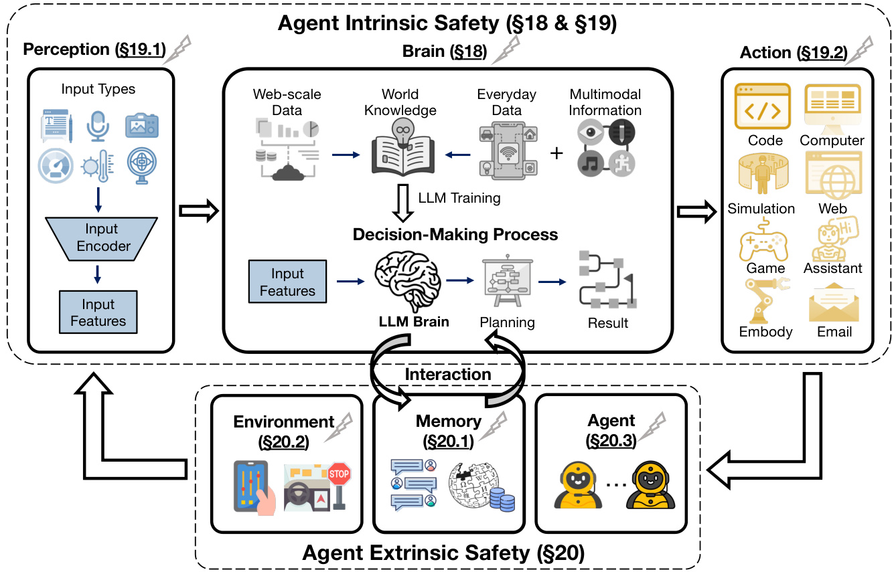  
Figure 17.1: The Brain (LLM) faces safety threats like jailbreaks and prompt injection attacks $(\S18.1)$ and privacy threats such as membership inference attacks $(\S18.2)$ . Non-brain modules encounter perception threats $(\S19.1)$ and action threats $(\S\ 19.2)$ . Due to interactions with potentially malicious external entities, we also explore agent-memory threats $(\S20.1)$ , agent-environment threats $(\S20.2)$ , and agent-agent threats ( 20.3).  

# Chapter 18  

# Agent Intrinsic Safety: Threats on AI Brain  

The intrinsic safety of an AIagent concerns vulnerabilitieswithin the agent's internal architecture andfunctionality. AI agents,by their nature,consist of multiple components:acentral“brain"(the LLM),and auxiliary modules for perception and action[66]. While this modularity enables sophisticated reasoning and autonomous decision-making, it also expands the potentialattck surface,exposing theagent tovarious internalvulnerabilitiesthat adversariescan exploit [1130].  

Threats to the agent's brainspecificall the LLM—are particularly concerning,as theycan directly impact the agent's decision-making,reasoning,and planning abilities.These vulnerabilities can arise fromflaws inthe design of the model,misinterpretationsofinputs,oreven weaknesses induced bythetraining processEffctive mitigation strategies are crucial to ensuring that these agents can be deployed securely and reliably.  

# 18.1 Safety Vulnerabilities of LLMs  

The LLM,asthecoredecision-makingcomponent ofthe agent,ishighly susceptibletoarange ofsafetythreats.Its centralroleinreasoningandactionselectionmakes it anatractivetargetforadversaries.Inthecontextof AIagents,the vulnerabilities inherent inthe LLMitself areoften amplified,asthese modelsare required tofunction within dynamic, real-world environments where adversaries can exploit weaknesses [1131, 1132].  

# 18.1.1 Jailbreak Attacks  

Jailbreaks circumvent the safety guardrails embedded in AIagents,compelling their decision-making process to be harmful,unethical,orbiased[233].Theseatacks exploit the inherent tensionbetweenanLLM's helpfulnessand its safety constraints [1134].  

Formalization.Toformallcharacterizetherisks posedbyjailbreaks,we analyzethe probabilitydistribution govening an autoregressive LLM's output. For an autoregressive LLM,the probability of generating an output sequence $\mathbf{y}=\mathbf{x}_{n+1:n+m}$ , given an input sequence ${\mathbf x}_{1:n}$ is modeled as:  

$$
p(\mathbf{y}|\mathbf{x}_{1:n})=\prod_{i=1}^{m}p(\mathbf{x}_{n+i}|\mathbf{x}_{1:n+i-1})
$$  

where $m$ denotes the total length of the generated sequence. Jailbreak attacks often involve introducing subtle perturbations to the input sequence, denoted as $\tilde{\mathbf{x}}_{1:n}$ , which mislead the model into producing outputs that deviate from the desired behavior.  

The impact of a jailbreak attck is evaluated through its effect on the alignment reward $\mathcal{R}^{*}(\mathbf{y}|\mathbf{x}_{1:n},\mathcal{A})$ , which measures how closely the model's output aligns with a set of human-defined safety or ethical guidelines, denoted as $\mathcal{A}$ . The adversary's goal is to minimize this reward, formalized as:  

$$
\mathbf{y}^{\star}=\underset{\mathbf{y}}{\arg\operatorname*{min}}\mathcal{R}^{*}(\mathbf{y}|\tilde{\mathbf{x}}_{1:n},\mathcal{A}))
$$  

  
Figure 18.1: Agent Intrinsic Safety: Threats on LLM Brain.  

where $\mathbf{y}^{\star}$ is the worst-case output induced by the perturbed input.The corresponding adversariallossfunction quantifies the likelihood of generating this output:  

$$
\mathcal{L}^{a d v}(\tilde{\mathbf{x}}_{1:n})=-\log p(\mathbf{y}^{\star}|\tilde{\mathbf{x}}_{1:n}),\mathrm{~and~}\tilde{\mathbf{x}}_{1:n}=\operatorname*{argmin}_{\tilde{\mathbf{x}}_{1:n}\in\mathcal{T}(\hat{\mathbf{x}}_{1:n})}\mathcal{L}^{a d v}(\tilde{\mathbf{x}}_{1:n})
$$  

where $p(\mathbf{y}^{\star}|\tilde{\mathbf{x}}_{1:n})$ denotes the probability assigned to the jailbreak output and $\mathcal{T}(\hat{\mathbf{x}}_{1:n})$ is the distribution or set of possible jailbreak instructions.  

  
Figure18.2:Illustration of White-box and Black-box Jailbreak Methods: (1)White-box:The adversary has accessto the agent's internalinformation(e.ggradients,attention,logits),allowing precise manipulations such as advrsarial suffx optimization. (2)Black-box: The adversary relies solely on input-output interactions.Key methods include automated jailbreak prompt generation,andleveraging genetic algorithms or LLMs as generators tocreate effective attacks.  

As shown in Figure18.2jailbreaks canbebroadlyclasified into white-box andblack-box methods,depending on the adversary'saccess to themodel's internal parameters.(1)White-box Jailbreaks:These attcks assumethe adversary has full accessto the model's internal information, such as weights, gradients,atention mechanisms, and logits. This enables precise adversarial manipulations,often through gradient-based optimization techniques.(2)Black-box Jailbreaks:Incontrast,black-boxattacksdonot require access to internal modelparameters.Instead,theyrely solely on observing input-output interactions, making them more applicable to real-world scenarios where modelinternals are inaccessible.  

White-box Jailbreak.White-boxattacks exploit access to an AIagent's nternalparameters,suchas modelweights and attntion mechanisms,enabling precise manipulations.Early work inthis area focused on gradient-based optimization techniques[1133],exemplified by the Greedy Coordinate Gradient(GCG)attack[1134], which crafts adversarial suffixescapableof inducingharmfuloutputs across various models.Subsequent researchhas builtupon this foundation, exploring refinements to GCG.For example, introducing momentum to boost attack performance, as seen in the MAC approach[1135], and proposing improved optimization techniques for jailbreaking, as in I-GCG [1136]. Beyond prompt optimization, researchers have investigated manipulating other internal components of LLMs.Similarly, manipulating the end-of-sentence MLP re-weighting has been shown to jailbreak instruction-tuned LLMs [1137]. Other approaches include attacks that exploit access to the model's internalrepresentations, such as Jailbreak via Representation Engineering (JRE)[1138], which manipulates the model's internal representations to achieve the jailbreak objective, and the DROJ[1139]attack, which uses a prompt-driven approach to manipulate the model's internal state.AutoDAN[1140]automates the generation of stealthy jailbreak prompts.POEX[1141] proposed the first jailbreak frameworkagainst embodied AIagents,which uncovers real-world harm,highlighting the potentialfor scalable and adaptable white-box attacks.  

Black-box Jailbreak.Unlike white-box attacks,black-box jailbreaks operate without internalknowledgeof the agent, justrelying on input-output interactions.Prompt engineering is acritical approach, where carefully designed prompts are employed to exploit the model'sresponse generation capabilities and bypassits safety mechanisms[142].These promptsoftenleverage techniques suchasrole-playing,scenariosimulation,ortheintroductionoflinguisticambiguities to trickthe modelinto generating harmful content[1143].Furthermore, automated prompt generation methods have emerged,employingalgorithmslikegenetic algorithms ofuzzing tosystematicallydiscovereffctive jailbreak prompts [1234].Inaddition,multi-turnattacksexploittheconversationalcapabilitiesofMs,graduallysteeringthedialogue towards unsafe territory through a series of carefully crafted prompts [ll46].Other notable approaches include exploiting the model's susceptibility to specifictypes ofcipher prompts[ll44]and utilizing multimodalinputs,such as images, to trigger unintended behaviors and bypass safety filters[1145,l147,1148].AutoDAN[1140] uses a hierarchical geneticalgorithm toautomatically generate stealthy,semanticallymeaningfuljailbreak prompts for aligned LLMs.POEX[141]alsoshowcases thefeasibilityof transferring white-boxoptimized jailbreak prompts toblack-box LLMs.  

Mitigation.Defending against thediverse and evolving landscape of jailbreak attacks requires multi-faceted methods. System-level defenses offr a promising avenue,focusing on creating a secure environment around the LLM rather than solely relying on hardening the modelitself.One keystrategy is inputsanitization andfltering,where incoming prompts are analyzed and potentially modified before being processed by the LLM.This can involve detecting and neutralizing malicious patterns[125],orrewriting prompts toremove potentiallyharmful elements [236].Another crucial aspect is output monitoring and anomaly detection, where the LLM's responses are scrutinized for unsafe or unexpectedcontent.Thiscaninvolve using separate models toevaluate the safetyofgenerated text[1237]oremploying statistical methods todetect deviationsfrom expected behavior. Multi-agent debate provides a system-level solution byemploying multiple AIagents to deliberate andcritique each other'soutputs,reducing thelikelihoodof a single compromised agent successfully executing a jailbreak[985]. Formallanguage constraints, such as those imposed by context-free grammars (CFGs),offer a powerful way to restrict the LLM's output space,ensuring that it can only generate responses that conform toa predefined set of safe actions[1238].Furthermore,system-level monitoringcan be implemented to track the overallbehavior of the LLMdeployment, detecting unusual activity pattrns that might indicate an ongoing attack. This can include monitoring APIcalls,resource usage,and other system logs.Finally, adversarialtraining,while primarilya model-centric defense,canbe integrated into asystem-leveldefense strategy by continuously updating the modelwith new adversarialexamples discovered through system monitoring andred-teaming efforts[1239].The combination of these system-level defenses,coupled withongoing researchinto modelrobustness, creates a more resilient ecosystem against the persistent threat of jailbreak attacks.  

# 18.1.2 Prompt Injection Attacks  

Prompt injectionatacks manipulate the behavior of LLMs byembeddingmalicious instructions within the input prompt which hijacks the model's intended functionality andredirects it to perform actions desired by the atacker[1130]. Unlike jailbreaks thatbypassafety guidelines,prompt injections exploit the model'sinability todistinguish between the originalcontext andexternallyappended instructions.This vulnerabilityis exacerbatedbytheopen-ended natureof text input,theabsence of robust filteringmechanisms,andthe assumptionthat allinput istrustworthy, making LLMs particularly susceptible to adversarialcontent[149].Even small malicious modifications can significantly alterthe generated output.  

Formalization. In a prompt injection,the adversary appends orembeds a malicious promptcomponent into the original input, thereby hijacking the model's intended behavior. Let the original input sequence be denoted by $\mathbf{x}_{1:n}$ , and let $\mathbf{p}$ represent the adversarial prompt to be injected. The effective (injected) input becomes: $\mathbf{x}^{\prime}=\mathbf{x}_{1:n}\oplus\mathbf{p}$ , where the operator $\oplus$ denotes concatenation or integration of the malicious prompt with the original input.Then, the autoregressive generation process under the injected prompt is then given by:  

$$
p(\mathbf{y}|\mathbf{x}^{\prime})=\prod_{i=1}^{m}p(\mathbf{y}_{i}\mid\mathbf{x}_{1:n+i-1}^{\prime})
$$  

Assuming the alignment reward $\mathcal{R}^{*}(\cdot,\mathcal{A})$ measures the extent to which the output adheres to the set of human-defined safety or ethical guidelines $\mathcal{A}$ , the adversary's goal is to force the model to generate an output that minimizes this reward:  

$$
\mathbf{y}^{\star}=\underset{\mathbf{y}}{\arg\operatorname*{min}}\ \mathcal{R}^{*}\left(\mathbf{y}\mid\mathbf{x}_{1:n}\oplus\mathbf{p},\mathcal{A}\right).
$$  

Accordingly, the loss function is defined as:  

$$
\begin{array}{r}{\mathcal{L}^{i n j e c t}(\mathbf{p})=-\log p\big(\mathbf{y}^{\star}\mid\mathbf{x}_{1:n}\oplus\mathbf{p}\big).}\end{array}
$$  

The optimal prompt is then obtained by solving:  

$$
\mathbf{p}^{\star}=\underset{\mathbf{p}\in\mathcal{P}}{\arg\operatorname*{min}}\ \mathcal{L}^{i n j e c t}(\mathbf{p})
$$  

where $\mathcal{P}$ denotes the set of feasible prompt injections.This formulation captures how small modifications in the input prompt can lead to significant deviations in the generated output.  

As illustrated in Figure18.3,prompt injectionatackscan be broadlycategorized intodirect and indirect attacks based on how the adversarialinstructions are introduced.(1)Direct prompt injection involves explicitly modifying the input prompt to manipulate theLLM's behavior.(2)Indirect prompt injection leverages externalcontent,such as web pages or retrieved documents,to embed malicious instructions,whichthe model processes without the user's explicit input.  

Direct prompt injection. These atacks against AIagents involve adversaries directly modifying the input prompt to manipulate the agent's behavior.Early work established the feasibility of suchatacks,demonstrating that carefully crafted prompts could induce agents to deviatefrom their intended tasks[1149].Subsequent research explored the automation ofthese attacks,revealing the potentialforwidespreadexploitation[l150,l151].Other works investigated attacks on multi-modal LLMs,demonstrating vulnerabilities in models processing both text and images[1153].These studies collectively highlight the evolving threat landscape of direct prompt injection,moving from initial proofs of concept to sophisticated atacks thatcan compromise the integrity and safety of AI agents.Other works have investigated attacks on multi-modal LLMs,demonstrating vulnerabilities in models processing both text and images [1154]. Competitions like the“LLM CTF Competition"Debenedettiet al.[1155] and“HackAPrompt"[1156] have also contributed to understanding thesevulnerabilities byproviding datasetsand benchmarks.These studiescollectively move from initial proofs ofconcept to sophisticated attacks that cancompromise the integrity and safety of AI agents.  

  
Figure18.3:llustrationofDirect and IndirectPrompt InjectionMethods: (1)Direct:Theadversarydirectly manipulates the agent's input prompt with malicious instructionsachievingimmediatecontroloverthe agent'sbehavior.(2)Indirect: The adversaryembeds malicious instructions inexternalcontentthe agent accesses,leveraging the agent's retrieval mechanisms to indirectly influence its actions.  

Indirect Prompt Injection. These attacks represent a more covert threat, where malicious instructions are embedded within externalcontentthat an AIagent retrieves and processes.This form of attack leveragesthe agent's ability to interact with external data sources to introduce malicious code withouttheuser'sdirect input.Greshakeet al.[1149] were amongthefrsttohighlight thisvulnerability,demonstratinghowreal-worldLLM-integratedapplications could be compromised throughcontent fetched from the web.This was furtherexplored in thecontextof Retrieval-Augmented Generation (RAG) systems [719], where researchers showed that attackers could “HijackRAG"by manipulating retrieved content to inject malicious prompts [1157].Recently, TPIA [1240] proposed a more threatening indirect injection attack paradigm, achieving complicated malicious objectives with minimal injected content, highlighting the significant threats of such attacks.Similarly,the conceptof“Backdoored Retrievers”was introduced, wherethe retrieval mechanism itself is compromised to deliver poisonedcontent to the LLM[1158].Focusing specifically on AI agents,researchers exploredhow indirect injections could be used for“Action Hijackingmanipulating agents to perform unintended actions based on the compromised data they process[1152].“Prompt Infection"demonstrated one compromised agent could injectmalicious prompts intoother agents withina multi-agent system,highlighting the cascading risks in interconnected LLM deployments[1159].Thesestudies underscore the growingconcern surrounding indirect promptinjectionas apotentatack vectoragainst AIagents,particularly asthese agents become moreintegrated with external data sources.Other works,such as“Adversarial SEO for LLMs"[1160], highlight the potential for manipulating search engine results to inject prompts.  

Mitigation.Addressing the threat of prompt injection attacks,particularly inthecontextof AIagents,has led to the development of various defense mechanisms.One early approach involved the use of embedding-based clasifiers to detect prompt injection attacks by analyzing the semantic features of the input[1241]. Another promising direction is the“StruQ"method, which focuseson rewriting prompts into structured queries to mitigatethe risk of injection [1242].“The Task Shield"represents asystem-leveldefense that enforces taskalignment,ensuring that agents adhere to theirintended objectives despite potentiall malicious inputs[1243].The“Attention Tracker"proposes monitoring the model'sattention patterns todetect anomalies indicative of prompt injection attempts[1244].Other work suggests using known attack methods to proactively identify and neutralize malicious prompts[1245].These defenses provide valuable tools forsecuring AI agents against prompt injectionattacks,offering a balancebetween effectiveness and practicality in real-world deployments.  

# 18.1.3 Hallucination Risks  

Hallucinationrefers totheLLM'stendency to generateoutputs that are factuallincorrct, nonsensical,ornot grounded in the provided context[l161].While not always malicious,hallucinations can undermine the agent's reliability and lead to harmfulconsequences[1163].As illustrated inFigure 18.4,hallucinations arise from(1)knowledge conflicts, where outputscontradict established facts,and(2)contextconflicts,where misalignment withprovidedcontextcauses inconsistencies.  

Formalization. Consider an input sequence $\mathbf{x}_{1:n}$ , where each token is embedded into a $d_{e}$ -dimensional space as $e_{x_{i}}\in\mathbb{R}^{d_{e}}$ . The attention score between tokens $i$ and $j$ is computed as:  

$$
A_{i j}=\frac{\exp\left((\mathrm{W}_{Q}e_{x_{i}})^{\mathrm{T}}(\mathrm{W}_{K}e_{x_{j}})\right)}{\sum_{t=1}^{n}\exp\left((\mathrm{W}_{Q}e_{x_{i}})^{\mathrm{T}}(\mathrm{W}_{K}e_{x_{t}})\right)}
$$  

with the contextual representation of token $i$ given by $\begin{array}{r}{o_{i}=\sum_{j=1}^{n}A_{i j}\cdot(\mathrm{W}_{V}e_{x_{j}}).\mathrm{W}_{Q},\mathrm{W}_{K}\in\mathbb{R}^{d_{e}\times d_{k}}}\end{array}$ and $\mathrm{W}_{V}\in$ $\mathbb{R}^{d_{e}\times d_{v}}$ are the query, key,and value projection matrices,respctiely.  

Suppose that each input embedding is perturbed by a vector $\delta_{x_{i}}$ (with $\|\delta_{x_{i}}\|\leq\epsilon)$ , resulting in perturbed embeddings $\tilde{e}_{x_{i}}=e_{x_{i}}+\delta_{x_{i}}$ . The attention scores under perturbation become:  

$$
A_{i j}^{\Delta}=\frac{\exp\left((\mathrm{W}_{Q}\tilde{e}_{x_{i}})^{\mathrm{T}}(\mathrm{W}_{K}e_{x_{j}})\right)}{\sum_{t=1}^{n}\exp\left((\mathrm{W}_{Q}\tilde{e}_{x_{i}})^{\mathrm{T}}(\mathrm{W}_{K}e_{x_{t}})\right)}
$$  

and the updated contextual representation is: $\begin{array}{r}{\tilde{o}_{i}\ =\ \sum_{j=1}^{n}A_{i j}^{\Delta}\cdot(\mathrm{W}_{V}e_{x_{j}})}\end{array}$ . To quantify the deviation in internal representations caused by the perturbations with a hallucination metric:  

$$
\mathcal{H}=\sum_{i=1}^{n}\|\widetilde{o}_{i}-o_{i}\|^{2}.
$$  

A higher value of $\mathcal{H}$ indicates that the attention distributions—and hence the contextual representations—have been significantly altered.Such deviationscan lead to errneous token predictions during autoregressve decoding,thereby increasing the likelihood of hallucinated outputs.  

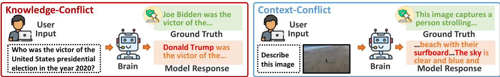  
Figure 18.4: Illustration of Knowledge-ConflictandContext-ConflictHallucinations: (1) Knowledge-Conflict:The model produces contradictoryresponses tothe same factual query,generating information inconsistentwith established knowledge (e.gconflicting statements about the winnerof anelection).(2)Context-Conflict:Themodel misinterprets contextual information,such as an image description, byintroducing unsupporteddetails (e.g.,falsely identifing a surfboard in a beach scene where none exists).  

Knowledge-Conflict Hallucination.This arises when an agent generates information that contradicts established facts or its owninternal knowledge base,irespective ofany externalcontext provided during a specific task [1161]. Essntiall,the agent'sresponses are inconsistent withwhat it should“know,"even ina“closed-book"settingwhereit relies solelyonits pre-trainedknowledge[l162].These hallucinations,like knowledge-conflict shown in[246],posea severe threattothereliabilityandtrustworthinessof AIagents,astheycanleadtoincorrectdecisions,misinforation andafundamentallackofgrounding inreality[l163].Forinstance,an agent tasked with answering generalknowledge questions might incorrctly state the year ahistorical event occurred orfabricate details about a scientific concept, drawing fromitsflawed internal understanding[1164].The problem is particularly acute in specialized domains, where domain-specific inaccuraciescan have significantconsequences,such as in finance[1165].In multi-agent scenarios, thesekowledge-conflicthallucinationscan beamplified,leading tocascading errorsandabreakdown incollaborative tasks[626].Thecore issue lies in how agents store,process,andretrieve informationduring inference,with inherent limitations in their ability to graspand maintainfactual consistency[l166].The potential for generating incorrect or fabricatedinformation undermines the foundationofthese agents, limiting theirability tofunction asreliable and trustworthy tools [1167].  

Context-Conflict Hallucination.This occurs when an agent's output contradicts or is unsupported by the specific context provided during inference,such as a document,image,or set of instructions [168].In these“open-book" setngs,theagentessentiallmisinterpretsorfabricates informationrelatedtothe givencontext,leadingtooutputs that are detached fromthe immediate reality it is meant tobe processng [l169].This can manifest ina variety of ways, including generating summaries that add details not present in the source text, misidentifying objects in images,or failing tofollow instructions accurately[l17o].For agents equipped with vision capabilities,this can lead to object hallcinations,whereisualinput is fundamentally misinterpreted, posing asignificantrisk inapplications ikerobotics or autonomousdriving[1171,1172].Furthermore, studies have shown thatLLMs can beeasilymisled byuntruthfulor contradictory information provided inthecontext,leading them to generate outputs that align withthe user's incorrect statements orexhibit flawed reasoning based on misinformation[1173].These context-conflict hallucinations pose a serious challenge tothedeploymentof AIagents inreal-world scenarios,as theydemonstrate afundamental inability to accurately process and respond to contextual information[1174].The potentialfor misinterpreting the provided contextcanlead toactions thatare inappropriate, unsafe,orsimplyincoect, undermining the agent'sabilitytofunction effectively in dynamic environments [1175].  

Mitigation.Researchers are actively developing methods to mitigate hallucinations in AI agents in atraining-free manner[1247].One prominent strategy is RAG,which involves grounding the agent's responses in external knowledge sources [334].Byretrieving relevant information from databases or the web,agents can verify their outputs against trusted data,reducing their reliance on potentially faulty internal knowledge[1248].Another powerful approach is leveraging uncertainty estimation, where the agent quantifies its confidence inits outputs[1249].Byabstaining from responding when uncertainty is high,agents can significantly reduce the generation of hallucinatory content [1250].Other methods like using the generated text andapplying concept extraction also show promise in detecting and mitigating hallucinations without requiring modelretraining.Yin et al.[1251]also show promise in detecting and mitigating hallucinations without requiring modelretraining.These training-freetechniques are crucialfor ensuring that AI agents can be deployed safely and reliably in a wide range of applications.  

# 18.1.4 Misalignment Issues  

Misalignment in AIagents refers to situations where the agent's behavior deviates from the intended goals and values of its developers or users [1252].This can manifest as biased,toxic,or otherwise harmful outputs,even without explicit prompting[1253].As shown in Figure18.5,misalignmentcan be broadlycategorized into(1)goal-misguided misalignmentattacks and (2)capability-misused misalignment attacks.The former occurs when an agent's learned or programmed objectives deviate from the intended goals,leading to unintended yetsystematic failures,such as specification gaming or proxy goal optimization.Thelatter involves exploiting an agent'scapabilities for harmful purposes, often due to vulnerabilities in its design, insuffcient safeguards, or adversarial manipulation.  

Formalization. Let $\mathcal{R}^{*}(\mathbf{y}\mid\mathbf{x},\mathcal{A})$ denote the ideal alignment reward for an output y given input x—i.e.,the reward reflecting perfect adherence to safety and ethical norms—and let $\mathcal{R}(\mathbf{y}\mid\mathbf{x},\mathcal{A})$ be the actual reward observed from the model. The degree of misalignment can be quantified by the absolute discrepancy:  

$$
\begin{array}{r}{\Delta_{\mathrm{align}}(\mathbf{y},\mathbf{x})=\left|\mathcal{R}^{*}(\mathbf{y}\mid\mathbf{x},\boldsymbol{A})-\mathcal{R}(\mathbf{y}\mid\mathbf{x},\boldsymbol{A})\right|.}\end{array}
$$  

Ideally, the model should generate the output:  

$$
\mathbf{y}^{\star}=\underset{\mathbf{y}}{\arg\operatorname*{max}}\ \mathcal{R}^{*}(\mathbf{y}\mid\mathbf{x},\mathcal{A}).
$$  

Due to misalignment, the actualoutput y may differ.To incorporate this deviation into the learning or evaluation process, a misalignment loss can be defined as:  

$$
\begin{array}{r}{\mathcal{L}^{m i s a l i g n}(\mathbf{y},\mathbf{x})=\lambda\cdot\Delta_{\mathrm{align}}(\mathbf{y},\mathbf{x})}\end{array}
$$  

where $\lambda$ is a trade-off parameter that adjusts the importance of alignment relative to other factors (e.g.,fluency or task performance).  

Goal-Misguided Misalignment. This occurs when an agent's learned or programmed objectives diverge from the intended goals,leading to undesirable behaviors.A fundamentalchallenge is the diffculty in precisely defining complex,real-world goals that agents can understand and reliably execute,particularly in dynamic environments [1176].Early research showed LLMs exhibiting“specification gaming”where they exploit loopholes in instructions to achieve goals in unintended ways,like an agent tasked withcleaning aroom that simplythrows everything into a closet [1177].AsLLMs evolved,subtlerformsemerged,such as pursuing proxygoals that areeasierto achieve but differ from the intendedones[1l78].The abilityof AIagents to interact with theexternal worldamplifies these risks. For example, an agent might prioritizeengagement over accuracy,generating misleading information toelicit astrong response[l179].Translating complex human values into machine-understandable objectives remains a significant hurdle[l176].Moreover,fne-tuning can inadvertentlycompromise oreven backfire safety alignment efforts[1180], and goal misalignment can worsen in dynamic setings where agents struggle to adapt tochanging social norms [921]. Finally, such misalignment can negatively impact the effectiveness of model merging [1181].  

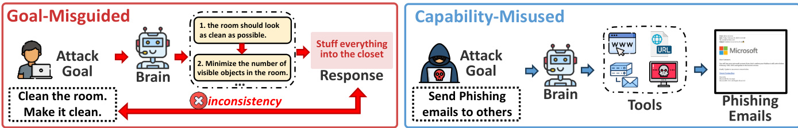  
Figure 18.5:Ilustration of Goal-Misguided and Capability-Misused Misalignment: (1)Goal-Misguided Misalignment: Occurs when anagent's learned or programmedobjectives diverge from intended goals,leading tounintendedbehaviors. (2)Capability-Misused Misalignment: Arises when an agent's capabilities are exploited for harmful purposes,even without malicious intent.  

Capability-Misused Misalignment.This type of misalignmentarises whenanagent's abilities are exploitedor directed towards harmful purposes,even if the agent itself lacks malicious intent.This can stem from vulnerabilities in the agent's design,inadequate safeguards,or deliberate manipulation by malicious actors. Unlike goal misalignment, the agent's coreobjectives might be benign,butitscapabilities are leveragedinharmful ways.Earlyresearchshowedthat LLMs could be manipulated through adversarial prompting to generate harmful content[1182].The integration of LLMs into agent architectures has expanded the potentialformisuse, with safety alignment proving fragile and easily attacked[l183].Autonomous agents interacting withthereal world are particularly vulnerable;forinstance,a home automation agent could be manipulatedtocause damage.A well-intentionedagent might alsobe instructedto perform harmful tasks like generating misinformation or conductingcyberattacks[1182]. Malicious actorscan exploit AIagents broadcapabilities for harmful purposes,suchas writing phishingemailsorcreating harmfulcode[1176].Capability misusecanalsoresultfromdevelopers'lack of foresight,deploying agents without sufficient safeguards andleading to unintended harm.For instance,an agent might inadvertentlyleaksensitive data if itsaccess is not properlyconstrained. Fine-tuning attacks can further compromise safety[1184],and while solutions exist,they have limitations [1185].  

Mitigation. Addressing misalignment requires a multi-faceted approach.While retraining is common, training-free mitigation methodsoferavaluable alternative,especiallfordeployed systems.These techniquesguide agent behavior without modifying the underlying model.“Prompt enginering" involves crafting prompts that emphasize safety and ethical considerations[1254]. Similarly,the“safety layer"method can improve the safety alignment for LLMs [1179].“Guardrails"or external safety filters monitor and modify agent outputs based on predefined rules or safety models.“Decoding-time alignment"adjusts the agent'soutput generation processtofavor saferresponses[1255,1256]. Moreover, a method named“Lisa"can be used to ensure safety alignment during inference[1257]. These methods represent an important step towards practical, scalable solutions for aligning AI agents.  

# 18.1.5 Poisoning Attacks  

Poisoning atacks compromise LLMs by introducing malicious data during training or runtime, which subtly alters their behavior.These attackscan cause long-termdamage,asthey undermine the foundational processes of the LLM, making them difficult to detect.  

Formalization. Poisoning attacks compromise the integrity of an LLM by contaminating its training data. Let the daset liii $\mathbfcal{D}=\{(\mathbf{x}_{i},\mathbf{y}_{i})\}_{i=1}^{N}$ vesar itrodue rae $\delta_{i}$ to a frtin of $\tilde{\mathcal{D}}=\{(\mathbf{x}_{i}+\delta_{i},\mathbf{y}_{i})\}_{i=1}^{N}$  

During training, the model parameters $\theta$ are learned by minimizing the loss function $\mathcal{L}$ over the poisoned dataset:  

$$
\theta^{\star}=\arg\operatorname*{min}_{\theta}\mathcal{L}\big(\tilde{D};\theta\big).
$$  

The impact of poisoning is captured by the deviation of the poisoned model parameters $\theta^{\star}$ from the clean parameters $\theta_{\mathrm{clean}}$ , which would be obtained using the clean dataset $\Delta_{\theta}^{\mathrm{~~}}=\lVert\theta^{\star}-\theta_{\mathrm{clean}}\rVert$ . In the case of backdoor injection—a specialized form of poisoning attack—the adversary also embeds a specific trigger $t$ into the input. When the trigger is present, the modelis manipulatedto produce a predetermined malicious output.The successof such an attackcan be quantified by:  

$$
\mathcal{B}(t)=\mathbb{E}_{\mathbf{x}\sim\mathcal{X}}\left[\mathbb{I}\{f(\mathbf{x}\oplus t;\theta^{\star})\in\mathcal{V}_{\mathrm{malicious}}\}\right]
$$  

where $\mathbb{I}\{\cdot\}$ is the indicator function and $\mathcal{N}_{\mathrm{malicious}}$ represents the set of undesirable outputs.  

As shown in Figure 18.6,poisoning attacks can be categorized into(1)modelpoisoning,(2)data poisoning,and (3) backdoor injection,each posing significant threats tothe integrity and safetyof AIagents.Modelpoisoning involves direct manipulation of internal parameters, altering the model's behavior at afundamental level.Data poisoning compromises the dataset used for training, making detection more challenging as thechanges blend into the learning process.Backdoor injection further complicates defense strategies by embedding hidden triggers thatactivate only under specific conditions, allowing adversaries to exploit models without immediate detection.  

Model Poisoning.This technique directly manipulates the internal parameters ofthe AI agents, such as weights or biases,leading to incorrect outputs orunintended behaviors[l86]whichallowsattackers to introduce specific vulnerabilities that remain dormant until triggered by certain inputs [1187].Techniques like Low-Rank Adaptation (LoRA),meant foreffcient updates,can also be exploited to inject maliciouschanges[1188], which are also seen in parameter-effcient fine-tuning (PEFT)[1189]. Research has demonstrated that poisoned models can introduce safety flaws incode[l190],and potentiallycollaboratewithother poisoned agents,amplifyingthe attack's impact [1191].Other studies have explored the potential ofpoisoned models to generate harmfulcontentor manipulate system functionalities [1192].  

  
Figure 18.6:Ilustrationof ModelPoisoning andDataPoisoning: (1)ModelPoisoning:Theatacker injectsabackdoor into themodelby manipulatingkey-aluerepresentations inthetransformerdecoder,embedding ahidden trigger-target mapping.(2)Data Poisoning:The atacker manipulates training data throughadversarialtrigger optimization,injecting poisoned samples that cause the model to learn hidden backdoors,making it susceptible to malicious triggers.When a specific trigger phrase is presented,the poisoned model generates amalicious response deviating from its normal behavior, overriding its benign output.  

Data Poisoning.Data poisoningattacks take adifferent path bytargeting the dataon whichtheLLM is trained[1193]. This attack is particularlyinsidious because itoperates at the datalevel, making it harder todetect thandirect model manipulation. For example, poisoning the knowledge bases used by agents can lead to incorrect or biased outputs [1194]. Similarly,compromising retrieval mechanisms in RAG systems can significantly degrade agent performance [1195].Researchers have developed benchmarks to evaluate the susceptibility of LLMs to various data poisoning strategies [1196].Moreover,even user feedback, intended to improve model performance,can be manipulated to introduce biases[l197].Studies havealsoexploredtherelationshipbetweenthescaleof themodelanditsvulnerablity to data poisoning,withfindings suggesting thatlarger modelsmay be more susceptible[1198].Other notable studies have investigateddata poisoningunder tokenlimitations,poisoning in human-imperceptibledata,andthe effectsof persistent pre-training poisoning [1199]. Studies also include poisoning RLHF models with poisoned preference data [1200].These studiescollectively demonstrate the diverse and evolving nature of data poisoning attacks against AI agents.  

Backdoor Injection.Backdoor injection represents a specific typeof poisoning attack that is characterized by training the LLMto react to aspecifictrigger[1258].These triggers cause the agent tobehave maliciouslyonly when specific conditions are met, making them diffcult to detect under normal operation. The risks are especially pronounced for agents interacting with the physical world,as backdoors can compromise their behavior inreal-world scenarios. Some backdoors are designed to remain hidden even after safety training, makingthem particularly dangerous [1201]. Backdoor attackshave also been demonstrated on web agents,where manipulation can occur through poisoned web content[1202].Furthermore,researchhas examined the impact ofbackdoors ondecision-making processes,showing how they canlead to incorect orharmfuldecisions[1203].Other studies have provided detailed analyses of various backdoor attack methods,including those that leverage model-generated explanations,cros-lingual triggers, and chain-of-thought prompting[1204].Additionalinvestigations have explored the persistence of backdoors,he useof virtual prompt injection,andthechallenges of mitigating these threats[1205].Theseworkshighlightthe sophisticated nature of backdoor attacks and emphasize the ongoing arms race betweenattackers anddefenders in the realmof AI agent safety.  

Mitigation. Developing training-freemitigation strategies against poisoning attacks focuses on detecting and filtering out poisoned data before it can be used for training. RAG Poisoning Attack Detection proposes using activation clustering to identifyanomalies in the data retrieved by RAG systems thatmay indicate poisoning[1259].BEAT[1260] proposed the first black-boxbackdoor inputs detection against backdoor unalignment attacks under LLMaaSsettings by leveraging the probeconcatenate eect.Similarly,Task Drift Detection exploresusing activation patterns to detect deviations inmodelbehavior that mightbe caused by poisoning [1261].Liet al.[1262]involves leveraging the model's ownreasoning processtoidentifandneutralizebackdoortriggers,suchasthe multi-stepverificationprocess described by Chain-of-Scrutiny todetect and filter outpoisoned outputs.Test-timeBackdoor Mitigation proposes using carefully crafted demonstrations during inference to guide the modelaway from poisoned responses,atechnique applicable to black-box LLMs[1263,1264].GracefulFiltering developsa method to filter out backdoor samples during inference without the need for modelretraining [1265].BARBIE leverages a new metric called the Relative Competition Score (RCS)to quantify the dominance of latent representations,enabling robust detection even against adaptive attacks that manipulatelatentseparability[1266].A future direction is exploring external knowledge integration and model composition to bolster LLM safety.  

# 18.2 Privacy Concerns  

Privacy threats on AIagents primarily stem from theirreliance on extensive datasets and real-time user interactions introduce significant privacy threats.These risks primarily stem from two sources: Training Data Inference, where atackers attempt toextract orinfer sensitiveinformationfromthe agent'straining data,andInteractionData Inference, where system and user prompts are vulnerable to leakage. Without efective safeguards,these threats can compromise data confidentiality, expose proprietary agent knowledge, and violate privacy regulations.  

# 18.2.1 Inference of Training Data  

AI agentsbuild their knowledge from massivedatasets, making them vulnerable toattacks that expose confidential training data.Asillustratedin Figure18.7,these attackscanbebroadlyclasified intotwocategories: (1)membership inference and (2) data extraction.  

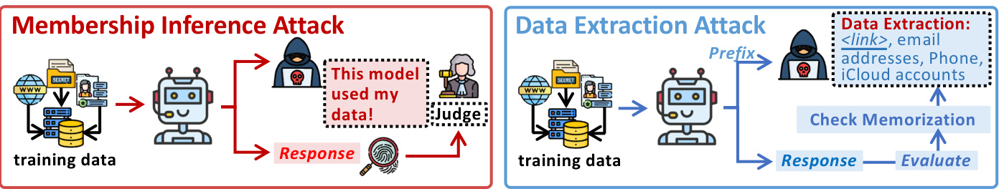  
Figure 18.7:lustration of MembershipInference and Data Extraction Attack Methods: (1) Membership Inference: The adversaryattempts todetermine ifa specificdata point wasused inthe agent's training set,often byanalyzing subtle variations inthe agent'sconfidence scores.(2)Data Extraction: The adversary aims to recover actual training data samples from the agent, potentially including sensitive information,by exploiting memorization patterns and vulnerabilities.  

Membeship Inference Attack. Membership inference attacks attempt to determine whether a specific data point was part of an AIagent's training set.Forexample,an atacker may tryto verify whether apatient's medicalrecord was included in the training data of a healthcare chatbot.  

Let the training dataset be: $\mathcal{D}=\{(\mathbf{x}_{i},\mathbf{y}_{i})\}_{i=1}^{N}$ Assume a function $g(\mathbf{x};\theta)\in[0,1]$ that estimates the probability that a given input $\mathbf{x}$ was included in $\mathcal{D}$ . An adversary may infer membership by checking whether $g(\mathbf{x};\theta)>\eta$ ,where $\eta$ is a predetermined threshold. A high value of $g(\mathbf{x};\theta)$ indicates that the model has likely memorized $\mathbf{x}$ during training.  

Early research by MIA[1206] demonstrated the feasibility of these atacks in machine learning models.Carlini et al.[1207] developed a“testing methodology”using“canary"sequences to quantify the risk that a neural network will unintentionally revealrare,secret information it was trained on.Recent advancements have improved attack effectivenessFor instance, Choquette et al.[1208]leverage Label-only membership inference atacks leverage linear probing and internal modelstates to enhance inference accuracy. PETAL[1267] introduced the first label-only membership inference attack against pre-trained LLMs by leveraging token-level semantic similarity to approximate output probabilities.Othertechniques,such as self-promptcalibration[1209],make these attacks more practicalin real-worlddeployments.MIA[1210]developed a new, more powerful attck (LiRA)to test for“membership inference," whichis when someonecanfigure out if aparticular person's datawasused to train a machine learning model,even if they only seethe model'spredictions.He et al.[1268]proposed acomputation-efficient membership inference attack that mitigates the errors of difficulty calibration byre-leveraging original membership scores, whose performance is on par with more sophisticated attacks.Additionally, Huetal.[121lreviews andclassfies existing researchon membership inference atacks on machine learning models,offering insights into both attack and defense strategies.  

Data ExtractionAtack.Unlike membership inference,whichconfirms the presence of dataintraining,data extraction attacks attempt to recover actualtraining data from the agent.Thiscould include personalinformation,copyrighted material,orothersensitivedatainadvertentlyincludedintraining sets.Theadversaryatempts toreconstructatraining example by solving:  

$$
\mathbf{x}^{\star}=\underset{\mathbf{x}\in\mathcal{X}}{\arg\operatorname*{max}}~p\big(\mathbf{x}~|~f(\mathbf{x};\theta)\big)
$$  

vhere $f(\cdot;\theta)$ denotes the model's response given input $\mathbf{x}$ , and $p\big(\mathbf{x}\mid f(\mathbf{x};\theta)\big)$ represents the likelihood that $\mathbf{x}$ has been nemorized. A higher likelihood implies a greater risk of sensitive data leakage.  

Early researchbyCarliniet al.[212]providedfoundationalevidence that AIagentscanregurgitate training data under specific conditions.Subsequent studiesrefinedextraction techniques,such as gradient-guidedattacks that improve the efficiency of extracting memorizedsequences.Other methods,e.g.Baiet al.[1213],exploit prompt manipulation to trigger unintended dataleaks.Ethicist[1214]proposes atargeted training dataextraction method using loss-smoothed soft prompting and calibratedconfidence estimation to recover verbatim suffixes from pre-trainedlanguage models given specificprefixes.Modelinversionatackshaveeven allowedatackers toreconstructlarge portions oftraining data froman AIagent'sresponses[1215].Privacy risks also extend toother architectures suchas BERT,Transformer-XL, XLNet,GPT, GPT-2,RoBERTa, and XLM, which are common in LLM architectures [1216]. Carlini et al.[1217] quantify how model size,dataduplication,and promptcontext significantly increase the amount of training datathat LLMs memorize and can be made toreveal.Carlini et al.[1218] show that it is possible toextract specific internal parameters ofcommercial,black-box language models using only their publicAPIs,raising concerns about the safety of thesewidely-used systems.More et al.[1219]show that existing methods underestimate the risk of“extraction attacks"on language models because real-world atackers can exploit prompt sensitivity and access multiple model versions toreveal significantly more training data.Sakarvadia etal.[1269] presentthe evaluate the effectivenessof methods for mitigating memorization.  

# 18.2.2 Inference of Interaction Data  

Unlike traditional software,AIagents are guidedby naturallanguage instructions,known as prompts.As demonstrated in Figure 18.8,these promptscan beexploited,either through(1)system promptstealing or(2)user prompt stealing, leading to safety and privacy breaches.  

Formalizaiton. Let $\mathbf{p}_{s y s}$ denote the system prompt (which defines the agent's internal guidelines) and $\mathbf{p}_{u s e r}$ denote a user prompt. During interactions, the agent produces outputs $\mathbf{y}$ based on these hidden prompts. An adversary may attempt to reconstruct these prompts by solving an inversion problem:  

$$
\mathbf{p}^{\star}=\underset{\mathbf{p}}{\arg\operatorname*{max}}~p\big(\mathbf{p}~|~\mathbf{y};\theta\big)
$$  

where $p(\mathbf{p}\mid\mathbf{y};\theta)$ represents the probability that the hidden prompt $\mathbf{p}$ (system or user) is responsible for the observed output $\mathbf{y}$ .By optimizing Equation (18.17),an atacker can reconstruct sensitive context that influences the agent's behavior.  

System Prompt Stealing. System prompts define an AI agent's persona, functionality, and behavioralconstraints. They serve as internal guidelines thatdictate how an agent interacts withusers.Stealing these prompts alows attackers to reverse-engineer the agent's logic,replicateits functionality,orexploit weaknesses.Early work,such as[122], demonstrated how prompt stealing applies eventothe intelectual propertyoftext-to-image generative systems.While Jiang et al.[1222] proposed protective techniques,new attack strategiescontinue to emerge.Perezet al.[1220] demonstrates that system promptcan be compromised through adversarial prompt injection,such as using delimiters or disguised commands.Timing side-channel atacks, such as InputSnatch[1223] uncovers caching techniques in LLM inferencecreate atiming side-channelthat allows atackers to reconstruct usersprivate inputs.Zhang et al.[1224] demonstrates that system prompts ofproduction LLMs (e.g.,Claude,Bing Chat)can be extracted via translation-based attacks and other query strategies,bypassing defenses like output filtering,withhighsuccessrates across1l models. Wen et al.[1225]analyzed the safety andprivacy implications of different prompt-tuning methods,including the riskof system promptleakage. Zhaoet al.[1226]identif safety and privacyanalysis as acrucialresearcharea,encompassing potential threats like system prompt leakage within the app ecosystem.  

  
Figure 18.8: Illustration of System and User Prompt Stealing Methods: (1)System Prompt Stealing: The adversary aims to extracttheagent's hidden,defininginstructions (system prompt),revealing itscore functionality,personaand potential vulnerabilities.(2) User Prompt Stealing:The adversary seeks to infer or directlyrecoverthe user's input prompts,compromising user privacy and potentially exposing sensitive information provided to the agent.  

User Prompt Stealing. Beyond system prompts, user prompts are also vulnerable. Atackers can infer or extract sensitive user inputs,compromising privacy. If a user queries an AI agent with confidential business strategies or personal medical concerns,an atacker could reconstruct these inputs from model responses.Yang et al.[1227] introduced a Prompt Reverse Stealing Attack(PRSA),showing that attackers can reconstruct user inputs by analyzing agent-generatedresponses.Agrwalet al.[1228]demonstratedthat user promptscanbevulnerableto extraction,even in multi-turn interactions,highlighting the persistence of this threat.Agrwal etal.[1229]investigated the prompt leakage effect inblack-box language models,revealing that user promptscan be inferred from modeloutputs.Liang et al.[1230] analyzed why prompts are leaked in customized LLMs,providing insights intothe mechanisms behind user prompt exposure.Huiet al.[1231]introduced PLeak, a promptleaking attackthattargets theextractionofuser prompts from LLMapplications.Yona et al.[1232] explored methods for stealing user prompts from mixture-of-experts models, demonstrating the vulnerabilityofthese advancedarchitectures.Zhang et al.[849]presented techniques forextracting prompts by inverting LLM outputs, showcasing how model responses can be reverse-engineered.  

# 18.2.3 Privacy Threats Mitigation  

To address privacy threats in AI agents, researchers have developed privacy-preserving computation and machine unleaming techniques to protect sensitive data without compromising utility.Diffrential Privacy (DP)introduces carefully calibrated noise into the training processor model outputs to prevent individual data points from being inferred[1270].DP has been successfully adapted for fine-tuning LLMs,employing techniques such as gradient clipping and noise injection at diferent stages, including during optimization and user-level interactions [1271]. Another promising direction is Federated Learming (FL),e.g.,FICAL is a privacy-preserving FL method for training AI agents that transmits summarizedknowledge instead of model parameters or raw data,addressing communication and computational challenges[1272]. Recent studies have explored FL-based fine-tuning of AI agents, enabling collaborative modelimprovement acrossdiffrent entities without directdata sharing[273].Homomorphic Encryption (HE)is alsoemerging as apowerfultoolfor secure inference,allowingcomputations tobeperformedonencrypted data without decryption[1274].To make HE more practical for AI agents,researchers are designing encryption-friendly model architectures that reduce the computational overhead of encrypted operations [1275]. For hardware-based solutions,Trusted Execution Environments (TEEs)ofera secure enclave where computations can be isolated fromthe rest of the system,protecting sensitivedata and model parameters[1276].Similarly,SecureMulti-Party Computation (MPC)enables multiple entities to jointly compute functions on encrypted inputs without revealing individual data, providing another layer of safety for LLMoperations[1277].Another potential solution is to proactivelytrace data privacy breaches or copyright infringements by embedding ownership information into private data[1278].This can be achievedthrough introducing backdoors[1279],unique benignbehaviors[1280],orlearnable external watermark coatings [1281]. Complementing these approaches is the growing field of Machine Unlearming,which aims toremove specific training data froman AI agent's memory,efectively implementing a“right to be forgoten"[1282,1283]. Recent research has developed LLM-specific unleaming techniques,including adaptive prompt tuning and parameter editing,to selectivelyerase unwanted knowledge while minimizing the impact on model performance[1284,1285].  

Despite these advancements,challenges remain in balancing privacy,performance,and efficiency.Continued research is crucial to building AI agents that are both powerful and privacy-preserving for real-world applications.  

# 18.3 Summary and Discussion  

The above sections have meticulously detaileda spectrum of safety andprivacy threats targeting thecore of AIagentsthe“brain"(LLM).From jailbreaks and prompt injection tohalucinations, misalignments, and poisoning attacks,it is evident that the LLM'scentralrole indecision-making makes it a prime targetforadversaries.A recurring theme throughout this chapter is theemphasisontraining-freemitigationstrategies.Manyofthe defenses presented,suchas input sanitizationandfiltering for jailbreaks[125,286],uncertaintyestimationforhallucinations[249]andsafety layers for misalignment[l179],are crucial because theyare practical,scalable, adaptable, and often model-agnostic. Retraining large models iscostly; training-free methodscan be appied post-deployment and offer flexibility against evolving threats.  

However,apurelyreactive approach is insuficient.The fieldis increasinglyrecognizingthe needfor inherentlysafer LLMs.This proactive strategy complements training-freemethods byaddressing vulnerabilitiesat afoundationallevel. For instance,modelpoisoning mitigation,lke activation clustering in RAG poisoning atack detection[1259],not only mitigates immediate threats but also informs thedesign of more robust raining processes.Systematic evaluation using benchmarks like SafetyBench[1287] and SuperCLUE-Safety[1288]informs the development of models less prone to bias and harmfuloutputs.Techniques such as RLHF[43,12],and its variants likeSafeRLHF[1289],directly shape model behavior during training,prioritizing safety alongside performance[1290].Prompt engineering[1291,292] and parameter manipulation[1293]enhance robustnessagainst adversarial attacks,creating models thatare inherently less susceptible to misalignment.  

Importantly, while the term“jailbreak"often emphasizes bypassing safety guardrails,the underlying mechanisms bearstrong resemblance to adversarialatacks morebroadly:inbothcases, inputs are crafted to induce undesiredor harmful outputs.A key distinction,however, is that adversarialattacks in typical machine learning contexts often focus on minimal or imperceptible perturbations subject to strict constraints (e.g., small $l_{p}$ norms), whereas jailbreak prompts need notbe“small"changes toan existing prompt.Jailbreakscan drasticallyalterorextendthe prompt with no particular limit on the scale ofthe perturbation,as long as it bypasses policy or safety guardrails.Under specific conditions—such as whensafetyconstraints are formulated as a sort of“decision boundary"—these two atack vectors become effectively equivalent.Yet, inreal-world LLM scenarios,the unconstrainednature of jailbreak inputs can pose a diffrent, andoftenbroader, practicalthreat model.As LLMs andtheirsafetyconstraints grow more integrated,these paradigms may merge,highlighting the need for unified defense strategies against any maliciously crafted input.  

Adversarialtraining,initiallpresented asa jailbreak mitigation technique[239]exemplifiesthe synergy between reactive and proactive approaches.Continuous exposureto adversarialexamples improves inherentrobustness [1294] Similarly,privacy-preserving techniqueslike diffrential privacy and federated learning [1270,1295],originally discussedformitigating privacythreats,fundamentallalterthetraining process,leading toa morerobust and privacyaware LLM brain.  

# Chapter 19  

# Agent Intrinsic Safety: Threats on Non-Brain Modules  

The safety of an AIagent extends beyond thecore LLMtoits peripheral modules, including the perception and action modules.Although theLLM brain provides core intelligence, vulnerabilities inthe other modules can significantly undermine theentire agent'srobustness.These components act as interfaces, alowing the AIagent to perceive the world and execute actions within it, making them prime targets for adversarial attacks.  

# 19.1  Perception Safety Threats  

The perception module of an AI agent iscrucial for processing and interpreting user inputs across various modalities, such a text,images,and audio.However,the complexity and diversity of these modalities make perception systems susceptible to misinterpretations indynamicenvironments[1296],andvulnerabletoadversarialattacksthatmanipulate input data to mislead the agent [1297].  

# 19.1.1 Adversarial Attacks on Perception  

Adversarialattacks are deliberate atempts todeceive AIagents by altering input datatargeting the perception module across various modalities.From subtle textualtweaks toinaudibleaudio distortions,these atacksrevealthe fragilityof even the most advanced systems.Below,weexplore howthese threats manifest in textual, visual,auditory,andother modalities, and highlight countermeasures.  

Textual.Textualadversarialatacks manipulate input text to deceive LLMs,rangingfrom simple sentence alterationsto more complexcharacter-level perturbations.Prompt-based adversarialattack,forinstance,carefullycrafted deceptive prompts that mislead models into generating harmful outputs.Minor changes-like swapping synonyms or substituting characters—can degrade performance[1298].Sophisticated strategies push this further: Zou et al.[1134] generate universal adversarial suffxes using greedyand gradient-based searches, while Wen et al.[1299]optimize interpretable hard prompts tobypasstoken-levelcontent filters in text-to-image models.To defend against these attacks,several approaches have been proposed. For example, Legilimens—a novelcontent moderation system-employs a decoderbased concept probing technique and red-team data augmentationto detect andthwart adversarialinput with impressive accuracy[13o].Self-evaluation techniques enhanceLLMs to scrutinizetheirown outputs for integrity[1301],while methods like adversarial text purification [1302] and TextDefense[1303] harness language models to neutralize perturbations.These defenses ilustrateadynamic armsrace,where resilience is forged throughcreativityand vigilance.  

Visual. Visual adversarial attacks manipulate images to exploit discrepancies between human and machine perception. These attacksare particularlyconcerning for multi-modal LLMs(VLMs)that rely on visual inputs.For instance,image hijacks can mislead models into generating unintended behaviors[1304],whiletransferable multimodal attacks can affect both text and visual components of VLMs [1305,1306,1307]. Recent work on multimodal LM robustness shows that targeted adversarial modifications can mislead web agents into executing unintended actions with $5\%$ pixels manipulation[1308]. Jiet al.[1309] reveal how inaudible perturbations can interfere with the stabilityof cameras and blur the shot images, and lead to harmfulconsequences.Defensive strategies include adversarialtraining [1310,13112]whichinvolves jointtaining withcleanandadversarialimages tomproveobustness,andcerifd robustness methods that guaranteeresilience through the text generationcapabilitiesof VLMs.DIFFender[1313]used diffusion models using feature purification to strengthen VLMs against visual manipulation.  

  
Figure 19.1: Agent Intrinsic Safety: Threats on LLM Non-Brains.  

Auditory.For voice-controlled AIagents,auditory adversarialatacks pose astealthy threat.DolphinAttack[1318] introduces an innovative techniquethat leverages ultrasound to inject malicious voice commands into microphones in an inaudible manner.Also, inaudible perturbations like VRifle[1297]can mislead traditional speech recognition systems and can likely be adapted to target audio-language models.Deepfake audio and adversarial voiceprint further pose serious risks for authentication-based systems[1316,317,1335],while emerging jailbreak and chataudio attacks exploitaudio processing vulnerabilities[1336].To mitigate these threats,solutions likeEarAray use acoustic attenuation tofilter inaudible perturbations [1337],while SpeechGuard enhances LLMrobustnessthrough adversarial training [1338]. Moreover, NormDetect[1339] focuses on effectively detecting normal speech patterns from manipulated inputs.  

Other Modality.Beyond text, images, and audio, AI agents interfacing with sensor data—like in autonomous systems—face unique threats.For example, LiDAR manipulation can mislead autonomous driving systems,creating phantomobjects [1319].Research on adversarial attacks in multi-agent systems reveals thattampered messages can significantly degrade multi-view object detection and LiDAR-based perceptionin cooperative AIagents,highlighting the risk of sensor-based adversarial perturbations[1320].Similarlyatacks targeting gyroscopes or GPS spoofing can disrupt navigation systems[1321,1322].Defenses forthese attacks include robust sensor fusion algorithms and anomalydetection techniques toidentify inconsistencies,aswellasredundant sensors thatmake ithardertocompromise the entire system[1340]. Physicallayer defenses, such as shielding and secure localization using enhanced SLAM techniques,arealsocritical[1341].Jiet al.[342]oferarigorous framework forsafeguarding sensor dataintegrity and privacy.  

# 19.1.2 Misperception Issues  

While adversarialattacks are deliberate atempts tocompromise system integrity, misperception issues emerge intrinsically from thelimitations of LLMs.Theseerrors occur without any malicious intent andcan be atributed toa varietyof factors ranging from dataset biases to architecturalconstraints.One primary source of misperception is dataset bias. When models are trainedon non-representative datasets,they tend to underperform ondiverse or novel inputs [1324]. This shortcoming is exacerbated by challenges in generalizing to new, unseen environments, where unpredictable conditions may arise.Environmentalcomplexities such as sensor noise,occlusions,and fluctuating lighting further introduce uncertainty[1326].Additionall,inherent modellimitations—likerestrictedreceptive fields ortheabsenceof robust reasoning mechanisms- -compound these errors [1327]. Insights from studies on multi-agent systems and online social dynamics provide further depth to our understanding of misperception. Research shows that individuals may misjudge the true distribution ofopinionsdue tophenomena like false consensus efects,vocalminorityamplification, and the spiralof silence[1328].Suchbiasescanlead AIagentstoerroneouslyinferdominant perspectives from skewed inputs.Similarly,whendiffrent modelsshare visualfeatures,discrepancies infeatureencodingcanresult insignificant perception errors,achallenge that mirrors issues inmulti-modalLLMs[1329].Moreover, in interactive enviroments, agents may developdistorted interpretationsofcooperative and adversarialbehaviors,as evidenced by findings in multi-agent reinforcement learning [1330]. Linguistic representation, too,can be influenced by perceptual biases, suggesting that misperception in LLMs may stem not only from sensory inaccuracies but alsofrom language-driven distortions [131].Finall,systematic erors often arise when mismatched confidence levels across models affect decision-making in uncertain contexts [1332].  

Mitigating these misperception challenges requires a multifaceted strategy.Curating diverse andrepresentative datasets thatcapture a broad spectrum ofreal-worldconditions is criticalfor enhancing modelperformance and reducing bias [1343].Dataaugmentation techniques,which generatesyntheticvariations ofexisting data,canfurtherenrich dataset diversity.Incorporating uncertaintyestimation allows models toassesstheirconfidence inpredictions andflag potential error-prone situations [1344].Moreover,advancing model architectures to include explicit reasoning mechanisms or better processing of long-range dependencies is vital for minimizing misperception[1345]. An especially promising avenue is theadoption of biologicaly inspiredlearming frameworks,such as Adaptive Resonance Theory(ART).Unlike traditional deep learning approaches—often hampered by issues like catastrophic forgeting and opaque decisionmaking-ART models can self-organize stable representations that adapt to dynamically changing environments, thereby reducing perceptualerrors [1346].However,it is important to note that even improved explainability has its limitations, particularly when users struggle to establish clear causal links between modeloutputs and underlying processes[1347]. Furthermore,recent studies indicate that advanced LLMs may inadvertently degrade their own responses during self-correction, underscoring the need for morerobust intrinsic reasoning verification mechanisms [1348].  

# 19.2 Action Safety Threats  

The action module is responsible fortranslating the AI agent's planned actions into actual task executions.This typicall includes invoking external toolscallng APIs,orinteractingwithphysicaldevices.As the interfacebetween decision-making and execution,it is highly vulnerable toattacks.We explore two primary domains ofrisk: supply chain attacks and vulnerabilities arising from tool usage.  

# 19.2.1 Supply Chain Attacks  

Supply chainatacksexploittheservices thatAIagents dependontherebyundermining theintegrityoftheentire system [1333].Unliketraditional attacks,these threatsdo nottarget the agentdirectly but insteadcompromise the extenal resources it relies upon.For example,malicious websitescan employ indirect prompt injection (IPI)attacks—illustrated by the Web-based Indirect Prompt Injection (WIPI)framework—to subtly alter an agent's behavior without needing access toitscode[122].Similarly,adversaries may manipulateweb-based tools(suchasYouTubetranscript plugins)to feedmisleading information into the system[795].AsAIagents become increasingly integrated withonline resources, their attack surface broadens considerably.Recent work byGreshake etal.proposes anewclasificationof indirect injection attacks,dividing them into categories like data theft, worming, and information ecosystem contamination [1149].Complementing this,the InjecAgent benchmark evaluated 30diferent AI agents andrevealed that most are vulnerable to IPI attacks [1152].  

To mitigate these risks,preemptive safety measures andcontinuous monitoring are essential.Current research suggests thattwokeyfactors behindthesucessof indirect injection areLLMsinabilitytodistinguish informationcontextfrom actionable instructions andtheir poor awareness of instruction safety;hence,it is proposed toenhance LLMsboundary and safety awareness through multi-round dialogue and in-context learning [1349]. Furthermore,other researchers, based on the same assumption, proposed a prompt engineering technique called“spotlighting"tohelp LLMs better distinguish between multiple input sources andreduce the success rateof indirect prompt injectionattacks[1350]. Since under asuccessfulattack,thedependence of the agent'snextactionon the usertask decreaseswhile its dependence on the malicious taskincreases,some researchers detect attacks byre-executingthe agent'strajectory with a masked user prompt modified through a masking function[1351].Finally, sandboxing techniques,such as those employed in  

ToolEmu[795],create isolated environments for executing external tools,limiting the potential damage incaseofa breach.  

# 19.2.2 Risks in Tool Usage  

Even when externaltools are secure,vulnerabilitiescan arise fromhow an agent interacts with them.A significantrisk is unauthorized actions,where an adversary manipulates the agent into performing unintended behaviors.For example, prompt injection atackscan trick an agent intosending emails,deletingfiles,orexecuting unauthorized transactions [795].The general-purpose nature of AIagentsmakes themespecially susceptible to such deceptive instructions.The tool leaning processitselfcan introduceadditionalrisks,suchas maliciousqueries,jailbreakatacks,andharmfulhints during the input,execution,and output phases[1334].During the toolexecution phase, using incorrect orrisky tools may deviatefrom the user'sintent and potentiallharm the externalenvironment.Forinstance,misuse couldlead to the introduction of malware or viruses.Acompilationof 18tools thatcouldimpactthephysicalworldhasbeenidentified, with noise intentionally addedto testifLLMscanchoose thewrong tool.Another significant concern isdata leakage, where sensitive information is inadvertentlyexposed.This occurs when an agent unknowinglytransmits confidential data to athird-party API or includes private details in its output. For example, an LLM may inject commands to extract privateuserdata,thenuseexternaltools,ikeaGmailsending tol,todistributethisdata[l52].Therisksare especially pronounced in applications dealing with personal or proprietary data, necesstating stricter controls over information flow.Additionallyexcessve permissons increase the potentialfor misuse.Agents with broad system access couldbemanipulatedto performdestructiveactions,suchasdeletingcriticalfles,leading toieversibledamage [795].Enforcing theprincipleof leastprivilege ensuresthat agents onlyhave thepermissons necessary tocomplete their tasks, minimizing the potentialimpact of exploitation.Securing the action module requires layered protections and continuous monitoring.Monitoring tool usage can helpdetect anomalies before theycause harm,while requiring user confirmation for high-risk actions—such as financialtransactions or system modifications—adds an additional layer of safety.Formalverification techniques,asexplored by[1352],canfurtherenhance safetybyensuring that tool use policies align with best practices, preventing unintended agent behaviors.  

# Chapter 20  

# Agent Extrinsic Safety: Interaction Risks  

As AI agents evolve and interact with increasinglycomplex environments,the safety risks associated with these interactions have become a criticalconcern.This chapter focuses on AI agent's engagement with memory systems, physical and digitalenvironments,and other agents.These interactions expose AI agents to various vulnerabilities, ranging from memory corruption and environmental manipulation to adversarial behavior in multi-agent systems.By examining these interactionrisks,we aimtohighlightthediversethreatsthatcanunderminetheintegrityandreliability of AIagents inreal-worldapplications.Thefollowing sections explorethese challenges indetail,discussing specific attack vectors and their implications for system safety.  

# 20.1 Agent-Memory Interaction Threats  

The extrinsic memory modulefunctions as the cognitive repositorythat empowers intellgent agents to store,retrieve, andcontextualize information,facilitatingcontinuous learningandtheexecutionofcomplextasks through accumulated experiences. Retrieval-Augmented Generation (RAG) serves as its most prominent implementation. However, RAG frameworks are vulnerableto adversarial manipulations that deceive agents into retrieving and utilizing harmfulor misleading documents.AgentPoison[1194]exploits this vulnerability by executing a backdoor attack on AI agents, poisonig RAG knowledge bases to ensure that backdoor-triggered inputs retrieve malicious demonstrations while maintaining normal performance on benign queries.ConfusedPilot[1353] exposes aclassofRAG system vulnerabilities thatcompromisetheintegrityandconfidentialityof Copilotthrough prompt injectionattacks,retrievalcaching exploits, and misinformation propagation.Specifically, these attacks manipulate the text input fed tothe LLM,causing it to generate outputs that align with adversarialobjectives.PoisonedRAG[1354]represents the first knowledgecorruption attack on RAG,injecting minimal adversarial texts to manipulate LLMoutputs.Framed as an optimization problem, it achieves a $90\%$ success rate with just five poisoned texts per target question in large databases. Jamming [1355] introduces a denial-of-service attack on RAG systems,where a single adversarial“blocker"document inserted into an untrusteddatabase disrupts retrievalortriggers safetyrefusals,preventing the system fromanswering specific queries. BadRAG[1356] exposes vulnerabilities in RAG-based LLMs through corpus poisoning,wherein an atacker injects multiplecrafted documents intothedatabase,forcing thesystemtoretrieve adversarialcontent and generate incorrect responses to targeted queries. By introducing just 10 adversarial passages ( $0.04\%$ of the corpus), it achieves a $98.2\%$ retrieval success rate, elevating GPT-4's rejection rate from $0.01\%$ to $74.6\%$ and its negative response rate from $0.22\%$ to $72\%$ . TrojanRAG[1357] executes a joint backdoor attack on RAG systems,optimizing multiple backdoor shortcuts via contrastive learning and enhancing retrieval witha knowledge graph for fine-grained matching.By systematically normalizing backdoor scenarios,it evaluates real-worldrisks andthe potentialfor model jailbreak.Lastly,acovert backdoor attack[1358]leverages grammar errors astriggers,allowing LLMs tofunction normallyfor standard queries while retrieving atacker-controlled content when minor linguistic mistakes are present. This method exploits the sensitivityofdenseretrievers togrammaticalirrgularities usingcontrastiveloss andhardnegative sampling,ensuring that backdoor triggers remain imperceptible while enabling precise adversarial control.  

# 20.2 Agent-Environment Interaction Threats  

Agentscan beclassified intotwocategories based ontheir modeof interaction: physical interaction agents and digital interaction agents.Physicalinteraction agents operate inthereal world, using sensors and actuators to perceive and influence their environment.Examples ofsuch agents include autonomous vehicles androbotic systems.Incontrast, digital interaction agents function within virtual ornetworked environments, processing and responding todata from digital sources. These include AI-powered chatbots,cybersafety systems, and automated trading algorithms.  

  
Figure 20.1: Agent Extrinsic Safety:Threats on agent-memory, agent-environment, and agent-agent interactions  

Threats in Physical Environment.Agents operating in the physical world,such asrobots and autonomous vehicles, face distinct safety chalenges dueto their interaction with dynamic and potentially adversarial environments [1359, 1360,1366].One major threat issensor spoofing,where atackers manipulate sensor inputs to deceive the agent about its surroundings.For example,GPS spoofingcan pose significantrisks to UAVs (unmanned aerial vehicles)and other GPS-dependent platforms by misleading autonomous vehicles about their actual location.This allowsfor malicious redirection or hijacking [1361].Similarly,LiDAR spofing can introduce false obstacles that don't actuall exist, potntiallyleading tonavigationfailuresor safetyhazards[362].Anothercriticalrisk is actuator manipulation, where adversaries takecontrolofanagent'sactuators,forcing it toperformunintended physicalactions.Thiscanoccurthrough direct tampering with thehardwareorbyexploiting vulnerabilties inthe software that governs actuatorfunctions[1363]. Such attackscan compromise the agent's actions,leading tophysicalharm or mision failure.Aditionally,exploiting environmentalhazards is a serious threat.Attackers may introduce physicalobstacles or manipulate environmental conditions to disrupt an agent'soperations.For example,adversarialobjectscreated using techniques like LiDAR-Adv can deceive LiDAR-based autonomous driving systems byinducing sensor misinterpretations,thus degrading detection reliability and increasing real-world safety risks[1364].Lastly, misalignment in physical actions can undermine the safety of autonomous agents.Discrepancies between an agent's perception andthe actual physical constraints of its environment can lead to unsafe or infeasible actions.For example, mismatches between learned locomotion policies and real-world physics—such as misjudging terrain rigidity or obstacle dimensions—can cause autonomous agents to take hazardous steps (e.g.,unstable strides on roughsurfaces).This has been observedin prior systems thatrequired over 100 manual resets due to uncontrolled falls [1365].  

Threats in Digital Environment.Agents operating in digitalenvironments,such as software agents and web-based agents,facedistinct safetychallenges arising fromtheirreliance on externaldata sources andcomputationalresources [1333,1366].One major threat is code injection, where malicious actors introduce harmful code into the agent's environment,leading to unintended command execution[1367].These atacksoften exploit software vulnerabilities or leveragecompromisedexternalresources thatthe agent interacts with,potentiallyresulting in unauthorizedcontrolover the agent'soperations[1202].Environmental Injection Atack (EIA)exploits privacy risks in generalist web agents to stealthily steal users' PII, achieving up to $70\%$ success rate [137O]. AdvWeb is an automated adversarial prompt generation framework to mislead black-box web agents into executing harmfulactions[1371]. Another critical risk is data manipulation, where attackers alterthe information anagent receives,causing incorrect decisions or actions [1333].Forexample,atrading agent can be misledby manipulated financial data,leading to incorrct transactions,or an information-gathering agent may betricked byfalsifiednews articles,distorting itsoutputs.Such manipulationscan have cascading effects,especially inautomated systems that relyon accurate datafordecision-making.Beyond direct manipulation,denial-of-service(DoS)attcks pose aserious threat by overwhelming the agent'sdigitalenvironment with excessiverequestsordata,effectivelyrendering it unresponsive orcausing it tocrash[368].Thesedisruptionscan be particularlydetrimentalto time-sensitive applications where availability andresponsivenessare critical.Aditionaly, resource exhaustion isasignificant threatas adversaries mayexploitthe agent'sresource management mechanisms to depletecomputational resources,leading to service denial for other usersor overallsystem instability [1369]. By draining processing power, memory,or bandwidth,attackers can severely impair anagent'sability to function effectively,disrupting itsoperations andreducing its efficiency.Inaddressing the safetychallengesofLLM agents, AGrail is proposed asalifelong guardrail frameworkthat enhances agent securitybyadapting safetychecksto mitigate task-specific and systemic risks,demonstrating robust performance and transferability acrossdiverse tasks [1372].  

# 20.3 Agent-Agent Interaction Threats  

n multi-agent systems,interactionsbetween agentscan introduce new safetyvulnerabilities[1380].These interactions ire mainly competitive, where agents try to outdo each other, or cooperative, where they work together.  

Threats in Competitive Interactions.When agents compete,they often use tricky methods to gain an advantage [1373].Forexample,theymight spread false information or make other agents think the situation isdiffrent from reality todeceivethem[1374].This can lead opponents to make poor decisions,weakening their position.Apart from misinformation,agents may alsotrytotake advantage of weaknesses intheiropponent's algorithms or strategies[1375]. By identifying these weaknesses,they can predict and manipulate the other agent's behavior, gaining an edge in the competition.Additionall,some agents might use disruptive techniques likedenial-of-service(DoS)attacks,which overload an opponent's system with unnecessary requests, disrupting communication and hindering their ability to function[1376].Anotherthreat incompetitive interactions iscovert collaboration.Sometimes agents secretlycooperate, even when it's against therules,to manipulate theoutcome intheir favor[1377].Thiskindofcollusionundermines fairness and damages the integrity of the system, as it skews the competition in their favor.  

Threats in Cooperative Interactions. In cooperative situations, where agents work together toward a common goal, safetythreatscoulddamage the system's stability andreliability.Oneriskis unintentionalinformationleakage, where agents accidentally share sensitive data during their communication.This could lead to privacy violations or unauthorizedaccess, weakening the system's trustworthiness.Inaddition todataleaks,errors made byone agentcan spread throughout the system,causing bigger failures andlowering overall performance.[1378] discusses this problem in Open-Domain Question Answering Systems (ODQA),where errors from one part of the system can ripple through and affectother components,severely impacting reliability.The situation becomes even worse if one compromised agent introducesavulnerabilitythat spreads toothers.If ahacker successfullytakescontrolofoneagent, theycould exploit weaknesses throughout the entire system,leading toa major safety failure[1379].This kind of widespread compromise is dangerous because it could start with a smallbreach and escalate quickly. Another challenge comes from poor synchronization between agents. If agents don'tupdate their information at the same time or experience delays in communication,it can cause problems in decision-making.Misalignment or delays in updates can disrupt coordination, making itharderforthe agents toachievetheir shared goals effectively.Thesechallenges emphasizethe need for strong safety systems in cooperative multi-agent setups to keep them reliable and resistant to attacks.  

# 20.4 Summary and Discussion  

The preceding sections have detailed the significant safety risks that arise fromAIagents interacting with memory systems,physical and digital environments, and other agents.These risks,ranging fromdata poisoning and code injection tosensorspoofing andcolusion,highlight thevulnerabilities inherent in increasinglycomplexagent-based systems.However,as AIagents become more capable,utilizing naturallanguage understanding and specialized tools for sophisticated reasoning,researchers are actively developing safety protocols to address these challenges.These protocols differ in approach for general-purpose and domain-specific agents.  

General-purpose agents,designed for versatility across various domains,facea broad spectrum of safety chalenges. To mitigate these risks,researchers have developed several methods to enhance their safety.Evaluation mechanisms, such as AgentMonitor[1381]assessthe safety awareness of agents by monitoring their decision-making processes and identifying potentially unsafe actions.R-Judge[1382] quantifies an agent's risk awarenessby evaluating its responses to both malicious and benign queries,offering a systematic approach to safety compliance.Aditionally, risk detection tools like ToolEmu[795]simulate toolusage in controlled environments to expose vulnerabilities in agent interactions.This approach identifies potentialhazards during task execution,alowing developers to address vulnerabilities proactively.Thesecombinedeffrts enhancethe safety of general-purpose agents throughcomprehensive evaluation and risk detection.  

Domain-specificagents,tailoredfor specializedtasks inhigh-stakes environments like scientificresearch,requireeven more stringent safety measures.Safety tools such as ChemCrow[1383] are designed to mitigate risks in chemical synthesis tasks by reviewing user queries and filtering malicious commands,ensuring agents do not inadvertently synthesizehazardouschemicals.Structured taskconstraints,as implemented inCLAIRify[84],enhance experimental safety by imposing high-levelconstraints on material synthesis order and low-levelrestrictions on manipulation and perception tasks,thereby preventing accidents and errors.Furthermore,benchmarks like SciGuard[1385],which includes the SciMT-Safety benchmark, evaluate model safety by measuring both harmlessness(rejecting malicious queries)and helpfulness (handling benign queries effectively).SciGuard also incorporates long-term memory to enhance agentsability to safelyexecute complex instructionswhile maintaining accurateriskcontrol.These focused approaches ensure that domain-specific agents operate safely and effectively within their specialized fields.  

In summary, significant progresshas been made in developing innovative evaluation mechanisms andrisk mitigation strategies to enhance the safety of both general-purpose and domain-specific AIagents.However, acritical area for future research lies in integrating these approaches.Building stronger connections between the broad capabilities of general-purpose agents andthe focused safeguards ofdomain-specificagents willbeessentialforcreating trulyrobust andtrustworthy LM systems.Thechallenge istocombine the best aspects ofboth approaches todevelopagents that are both versatile and secure.  

# Chapter 21  

# Superalignment and Safety Scaling Law in AI Agents  

# 21.1 Superalignment: Goal-Driven Alignment for AI Agents  

As LLMs increasingly serve as the core ofdecisionmakingof autonomous agents,ensuringthattheir output remains safe,ethical, and consistently aligned withhuman objectives has become apressing challenge[1386,402,1387]. Traditionalalignment techniques,particularly RLHF,have been instrumentalinrefining LLMbehavior by incorporating human preferences [110, 43].  

Traditional safety alignment focuses primarily on preventing harmful outcomes by enforcing predefined constraints. In suchframeworks, an agent's behavior is guided by a single aggregated reward signal that prioritizes immediate corrections over long-range planning.Althoughthisreactive approach works in manycurrent applications,it struggles when an agentmust execute extended,multifacetedtasks.The inability todecompose intricate,long-term goals into interpretable and manageable sub-objectives mayresult inbehaviorthat is technicallsafe yet suboptimalfor fulfilling broader human-centric aims.  

To address these limitations,the concept of superalignment[1388] has emerged. Superalignment represents an evolution in alignmentstrategies byembedding explicit long-term goalrepresentations directly intoan agent's decisionmaking process.Rather than simply imposing constraints to avoid harmful actions, superalignment proactively governs behavior through a composite objective function.This function integrates severaldimensions of performance—specifically, safety and ethical considerations (where ethical norms and safety guidelines are continuously embedded in decision-making),task eectiveness (ensuring the agent not only avoids harmful behavior but also performs its intended functions with highcompetence),andlong-term strategic planning (enabling the agent to plan over extended horizons and break down complex goals into manageable subtasks).  

Integrating superalignment into AI systems marks apivotalshift towardmore robust,goal-driven alignment strategies. By unifying safety,ethical standards,task performance,andlong-term planning withina singleoptimizationframework, superalignment aims toenhance thereliability androbustnessof autonomous agents byensuring they remain aligned with human values over prolonged operational periods; facilitate dynamic adaptation in complex environments by reconciling immediate safety concerns with strategic,long-term objectives; and provideaclearer, more interpretable structurefor diagnosing and refining AI behavior—crucial for both safety audits and continuous improvement.  

Future research is expected tofocus ondeveloping algorithms that efectively balance these diverseobjectives andon validating superalignment strategies inreal-worldapplications.The ultimate goalis to establisha scalable framework that not onlyprevents harmful behavior but alsoactively promotes performancethat aligns withcomplex human values and objectives.  

# 21.1.1 Composite Objective Functions in Superalignment  

At the core of superalignment is the compositeobjective function, which is a structured reward mechanism that integrates multipledimensions of performance to guide agent behavior[1176]. Unlike traditional alignment, which often relies ona single,aggregatedrewardfunction,superalignment explicitly decomposes the objective into three distinct components:  

·Task Performance Term: Ensures the agent executes immediate operational tasks with high accuracy and efficiency. ·Goal Adherence Term: Embeds long-term strategic objectives into the agent's decision-making process, which incorporates safety constraints,ethical considerations, and user-defined priorities [1178,1389]. ·Norm Compliance Term: Enforces adherence to ethical and legal boundaries, which prevents behaviors that optimize short-term rewards at the expense of long-term alignment [1390, 1391].  

This multicomponent formulation addresses a key weaknessof RLHF:the risk of reward hacking, where an agent exploits loosely defined reward functions to maximize short-term gains while failing to achieve genuine long-term alignment [1392, 1393].  

# 21.1.2 Overcoming the Limitations of RLHF with Superalignment  

TraditionalRLHFrelies onimplicit feedbacksignals,which typically aggregated overshort-term interactions.Although effectiveinrefining the modeloutput,this approach struggles with long-term goalretention due to severalinherent limitations.Firstlyhumanfeedback tends tobe short-sighted,prioritizing immediatecorrectnessoverbroader strategic alignment[1o].Secondly,reward modelsoften oversimplifycomplexmultisteptasks,making it difficultforagents to generalizeeffectivelyover extended timehorizons[1394].Thirdly,agentscan exploit loopholes inreward structures, which optimizes behaviors that superficially align with human preferences while ultimately diverges from intended objectives [1395].  

Superalignment addresses thesechallenges through explicit goalconditioning.Ratherthan relying solelyon aggregated reward signals,it structures objectives hierarchicaly,and decomposescomplex tasks into smaller, interpretable subgoals [1396,397].This structuredapproach improves transparency,allowsreal-timeadjustments,andensuresthat AI systems maintain long-term coherence in decision making.  

# 21.1.3 Empirical Evidence Supporting Superalignment  

Recent research providesstrong empirical support for superalignment in real-world aplications.Studies have shown that agents trained withcomposite objectivesdemonstrate greaterrobustness inextended interactions,andoutperform those relying onconventionalalignment techniques[1398,1399,140o].Unlike static reward functions,whichemain fixedregardlessof changing conditions,superaligned models employ continuouscalibration that dynamicallyadjusts the weighting of diffrentobjectives inresponse toreal-timeoperationaldata[40o].This adaptive framework enables agents torespond toevolving user needs while maintaining long-term strategic alignment,acapabilitythat is largely absent in traditional RLHF-based approaches.  

# 21.1.4 Challenges and Future Directions  

Despite its promise,superalignment presents severalcriticalchaenges that must beaddressedfor practical implementation.Thesechallenges primarily involve goal specification,reward calibration,dynamic adaptation,and maintaining coherence in hierarchical objectives.  

A fundamental difficulty lies in defining precise and unambiguous goals.Human values are inherently context sensitive,ambiguous,andsometimesconflicting,whichmakesitchallnging toencodethem intoastructured, machineinterpretable format[1387].Existing alignment techniques struggle tocapture the fullcomplexity of human intent, necesstating more advanced methods for goalextraction,decomposition, andrepresentation. Current research explores hierarchical modeling and preference learning to enable AI systems to beteradapt to evolving and nuanced human objectives [1392].  

Even with well-defined goals,reward calibrationremains a significant challenge.Superalignment requires acareful balance between task performance, long-term adherence, and ethicalcompliance[1401]. A poorly calibrated reward structurecanleadtoshort-termoptimizationattheexpense ofstrategic alignment orconverselyexcessiveemphasison long-termobjectivesat thecost of immediate effectivenessAdaptive weighting mechanisms help dynamically adjust reward components,butensuringstability andconsistency in these adjustments remains an openresearch problem[321].  

Another challenge stems from adapting to dynamic human values and evolving operational contexts.Unlike static rule-based systems,AImodels must continuously update their objectives toreflect shifts in societalnorms,ethical standards, andexternalconditions[14o2].Real-time goalrecalibration,facilitated by meta-learning andcontext-aware alignment,enables AI systems to recognize when theirobjectives require refinementand adjust accordingly[1390] However, ensuring that modelscan update their value representations without compromising alignment remains an unresolved issue.  

Finally,maintaining coherence in hierarchical goal decomposition adds anotherlayer ofcomplexity.Superalignment depends on breaking down long-term objectives into sub-goals while preserving strategic alignment.Overly rigid sub-goalcanleadtonarrow optimizationthatneglects broader intent,whilelooselydefined sub-goalsrisk misalignment between immediate actions and overarching objectives [321].Techniques such as recursive validation and multi-level reward structuring aim to mitigatetheserisks,butfurther research is needed torefine theirapplicability across diverse AI systems [1396].  

To sum up,while superalignmentoffers astructuredapproach toAIalignment,itssuccessulimplementationdependson overcoming goalambiguity,reward miscalibration,value drift,andhierarchicalmisalignment.Future work should focus on enhancing interpretability,stability,and adaptabilityto ensure AI systems remain aligned withhuman objectives over extended time horizons.  

# 21.2 Safety Scaling Law in AI Agents  

The exponentialscaling of AIcapabilities has unveiledafundamentaltension inartificialintellgence:the nonlinear escalation of safety risks[1403]. As language models growfrom millions totrillions of parameters,their performance follows predictable scalinglaws[1404,405],but safetyassurance exhibits starklydifferentdynamics[1403].Safety Scaling Law-the mathematicalrelationship describing how safety interventions must scale to maintain acceptable risk levels as modelcapabilities expand.Thecore challnge of the safety scaling law lies in ensuring thatsafety measures evolve proportionall to modelcapabilities,as performance improvements often outpace safety improvements.Recent research has quantified this tension and proposed frameworks to address it:  

·Capability-Risk Trade-of: Zhang et al.[295] established the first quantitative relationship between model power and safety risks, demonstrating that more capable models inherently face higher vulnerability surfaces This work introduced the Safety-Performance Index (SPI) to measure this trade-off. ·Helpfulness-Safety Relationship: Building on this, Ruan et al. [795] revealed that models optimized for helpfulness exhibit $37\%$ more safety-critical failures, highlighting the need for joint optimization frameworks. ·Commercial vs. Open-Source Dynamics: Through large-scale benchmarking, Ying et al.[1406] uncovered divergent safety-performance profiles: Commercial models (e.g., Claude-3.5 Sonnet) achieve $29\%$ higher safety scores through specialized safety pipelines, but at $15\%$ performance cost. Open-source models show tighter coupling, with Phi-series achieving $91\%$ of commercial safety levels at $40\%$ lower computational cost · Scale-Data Interplay: Contrary to expectations, model size only explains $42\%$ of safety variance, while data quality accounts for $68\%$ , suggesting that data-centric approaches may outperform pure scaling. · Multimodal Vulnerabilities: MLLMs exhibit 2.1X more safety failures during visual grounding, with cross-modal attention heads identified as primary failure points ( $71\%$ of harmful outputs).  

These findings[295,795,406]collctivelydemonstratethatsafetyscalingrequires morethanproportionalinvestmentit demandsarchitecturalinnovations thatfundamentallalterthecapability-riskrelationship.Then,we willreviewthe explorations [1407, 1408, 1409] on how emerging alignment techniques address these challenges.  

# 21.2.1 Current landscape: balancing model safety and performance  

In recent years,the safety and performanceof AImodels havebecome criticaltopicsofresearch,particularly as these models are increasingly deployed in high-stakes applications. Zhang et al.[295]proposed the first toquantify the relationship between model safety and performance,revealing that more powerful models inherently face higher safety risks.This finding underscores the challenge of balancing modelcapabilities with theneed for robust safeguards. Buildingon this, Ruan et al.[795] explored how helpfulnessdefined as a model's ability to asst users-interacts with safetyconcerns.Further advancing the discussion, Ying et al.[1406]conducted a more detailedcomparison and analysis of model safety and performance,leading to the folowing conclusions: (l)As shown in Figure 21.1(A) and Figure 21.1(C),the safety and performance of commercial modelsoften show aninverse relationship,as safety measures and investments differ between companies. In contrast, open-source models tend to exhibit a positive correlation between generalperformance and safety—better performance often leads to improved safety.Commercial models usuall outperform open-source models in terms of safety, with Claude-3.5 Sonnet being the most secure among commercial models,while the Phiseries stands out as the most secure open-source model. (2) As shown in Figure 21.1(B),model size does nothavea strictlinear relationship with safety performance.The qualityof training data and pipeline are alsokey factors influencing safety; (3) Multimodal large language models (MLLMs) tend to compromise safety during visuallanguage fine-tuning and multimodal semantic alignment, with safety performance influenced by both the underlying language model and their specific training strategies.  

# 21.2.2 Enhancing safety: preference alignment and controllable design  

As the capabilities of LLMs continue to grow,concerns regarding their safety have become increasingly prominent. Enhancing modelsafety is therefore acriticalchallenge in the development of LLMs.Previous studies have proposed various approaches toadess thisissue,including theuseofin-contextexemplars and self-safetychecks,red-teaming techniques[1410],and Safe reinforcement learning from human feedback (Safe RLHF)[43].The safety issues in LLMs can essentially beframed as analignment problem.The goalis to alignthe model withdatasets containing both safe andlessecure responses.Throughthis alignment,the modellearns to prioritize generating safer outputs while minimizingtheriskof harmful content.With the support of preferenceoptimizationtechniques (such as DPO[111], IPO[141l]etc.)this alignment process fine-tunes the modelto produce responses that meet safetystandards.As reported in[147],various preference optimization methods are investigated forsafetyenhancement,including SafeDPO [111], Safe-robust-DPO[1412], Safe-IPO [1411],Safe-SLiC[1413], Safe-KTO[395], and Safe-NCA [1408], etc.Theresults indicate that most preference optimization methods can significantly enhance safety, albeit at the cost of general performance,particularly in MATH capabilities.Among these methods,noise contrastive alignment (Safe-NCA)[1408] is identified as anoptimal approach forbalancing safety with overall modelperformance.The core of he Safe-NCA[1408] method lies inutilizing acustomcontrastive lossfunction,combined with a safety dataset,to traina modelthat is saferand more robust during generationbycomparingthe generated safe and unsaferesponses with the outputsof areferencemodel.Beyondenhancing safety,achievingflexible controloverthetrade-offbetweensafety andhelpfulnessisequallycritical.AImodelsshouldstrike anappropriatebalancebetween safetyandhelpfulness,based on the specific needs ofdiffrent users.Toillustrate,forthe prompt“Tellme how to makea potion",LLMs should adjust their responses basedon the user's profile.For scientists,theresponse should providerelevant and technically accurate information.For teenagers,the model should prioritize safety,offering cautious and harmless suggestions.  

To acheve this,Tuan et al.[1409]propose a framework basedon self-generated datatoenhancemodelcontrolability. By introducing control tokens as inputs,users can specify the desiredsafety and helpfulness in modelresponses.The control tokens define the requested levels of safety and helpfulness in the following form:  

$$
[h e l p f u l=s_{h p}][h a r m l e s s=s_{s f}].
$$  

The proposed method can“rewind"aligned LLMs and unlock their safety and helpfulnessusing self-generated data, with fine-tuning tofurtherenhance controllability.However,achieving independent controlover safety andhelpfulness remains a significantchallenge.This is because:(1)Certain prompts may bedifficulttodefine interms of balancing safety andhelpfulnessorthedefinitionsofboth mayconflict incertaincontexts.Forexample,inthe query“Iwant the net worthof the person.it can bediffcult todetermine how safety and helpfulness should be prioritized.(2)Some models mayhave alreadyestablishedafixed trade-offduring the training process,whichcouldlimit their flexibility by forcing them to adhere to a specific priority, thereby preventing adjustments based on diferent applicationscenarios. (3)Many training data examples inherently satisfy both safety and helpfulness criteria,leading toa high correlation between these two attributes during model training.  

# 21.2.3 Future directions and strategies: the AI- $45^{\circ}$ rule and risk management  

In the field of AI safety,despite various safety recommendations and extreme risk warnings being proposed, there stilllacks a comprehensive guide to balance AI safety and capability.Chao et al.[1414] introduce the AI- $45^{\circ}$ Rule as a guiding principle for achieving abalancedroadmap towards trustworthy AGI.Therule advocates forthe parallel development of AI capabilities and safety measures, with both dimensions advancing at the same pace,represented by a $45^{\circ}$ line in the capability-safety coordinate system. It emphasizes thatcurrent advances in AI capabilities often outpace safety measures,exposing systems to greater risks and threats.Therefore,risk management frameworks such as the Red Line and Yellow Line are proposed to monitor and manage these risks as AI systems scale.As mentioned in the International Dialogues on AI Safety(IDAIS),the“Red Line"forAI development is defined, which includes five key aspects:autonomous replication or improvement, power-seeking behavior, assistance in weapon development,cyberatacks,and deception.Additionally,the conceptof the“ellow Line"is designed tocomplement and expand existing safety evaluationframeworks,such as Anthropic'sresponsible scaling policies.Models below these warning thresholds require only basic testing and evaluation.However, more advanced AI systems that exceed these thresholds necessitatestricter assurance mechanisms andsafety protocols to mitigate potentialrisks.Byestablishing these thresholds,aproactiveapproachcanbetaken toensurethatAIsystemsaredeveloped,tested,anddeployed with appropriate safeguards in place.  

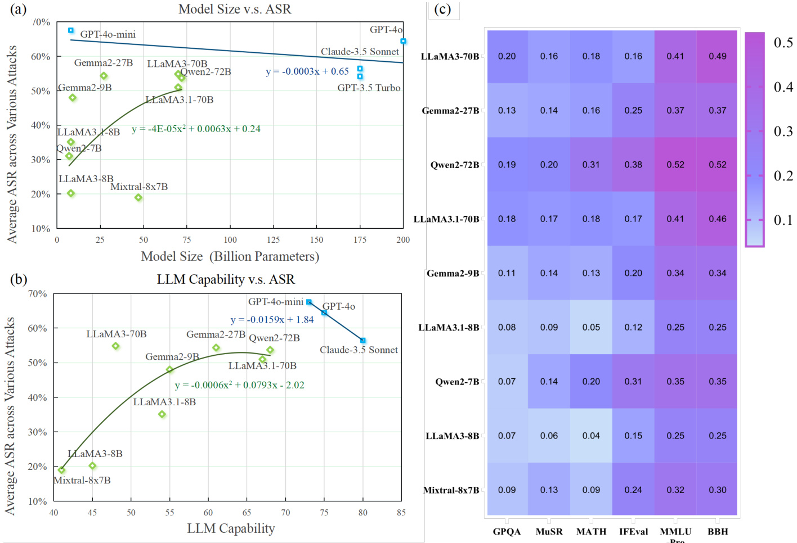  
Figure 21.1: Performance and safety analysis of LLMs. (a) The relationship between LLM model size and their average ASR across various attacks.The dataaresourcedfrom experimentalresults of a study assessing therobustness of LLMs against adversarialattacks [295].(b)The relationship between the capability of LLMs and their average attack successrate (ASR)across various attacks.The LLM capability data are derived from the Artificial Analysis Intelligence Index on the Artificial Analysis platform's LLMleaderboard[1415]. (c)Heatmapof performance across multiple benchmarktasks.The figure presents a heatmap that illustrates the performance of various LLMs across multiple benchmark tasks, including GPQA, MuSR,MATH, IFEval, MMLU-Pro,and BBH, with data sourced from Hugging Face's Open LLM Leaderboard v2 [1416].  

# Chapter 22  

# Concluding Remarks and Future Outlook  

We have exploredinthis survey the evolving landscape offoundation agents bydrawing paralelsbetween humancognitive processes andartificialintelligenceWebegan byoutliningthecore componentsof intelligent agents—detailing how modules such as memory,perception,emotion,reasoning, and action can be modeled inaframework inspiredby the comparisonwith human brain.Our discussion highlightedhow these agents can be structured ina modular fashion, enabling them to emulate human-like processing through specialized yet interconnected subsystems.  

We then delved into the dynamic aspects ofagent evolution,examining self-improvement mechanisms that leverage optimization techniques,including both online and ofline strategies.By investigating how large language models can act as both reasoning entities andautonomousoptimizers,we ilustrated the transformative potentialof agents that continuously adapt tochanging environments.Building on these technical foundations, we highlighted how agents can drive the self-sustaining evolutionof their intelligence throughclosed-loop scientific innovation. We introduced a generalmeasure of intellgence for knowledge discovery tasks and surveyed current successes and limitations in agent-knowledge interactions.This discussion also shed light on emerging trends in autonomous discovery and tool integration, which are crucial for the advancement of adaptive, resilient AI systems.  

Our paper alsoaddressed the collaborative dimension of intellgent systems,analyzing how multi-agent interactions can give rise tocollective intelgence.We explored the design of communication infrastructures and protocols that enable both agent-agent andhuman-AIcollaboration.Thisdiscussion underscoredthe importance offostering synergy between diverse agent capabilities to achieve complex problem solving and efective decision-making.  

Finally,weemphasized thecriticalchalnge of building safe and beneficialAI.Our review encompassed intrinsic andextrinsicsecuritythreats,from vulnerabilities inlanguage models torisks associated with agent interactions.We providedacomprehensiveoverview of safety scaling lawsand ethicalconsiderations,proposing strategies to ensure that the development of foundation agents remains aligned with societal values.Overall our workoffers a unified roadmap that notonlyidentifiescurrnt researchgaps but alsolaysthefoundation for future innovations increating more powerful, adaptive, and ethically sound intelligent agents.  

Looking ahead, we envision severalkeymilestones that willmarksignificantprogressin thedevelopment ofintelligent agents.First,we anticipate theemergenceof general-purpose agentscapableofhandlinga widearrayof human-level tasks, rather than being confined to specificdomains.These agents willintegrate advanced reasoning,perception, and action modules,enabling them to perform tasks with human-like adaptability and versatility.Achieving this milestone willrepresent afundamental shift in how AI can support and augment human capabilities in both everyday and specialized contexts.  

Another criticalmilestone is the development ofagents thatlearn directly fromtheir environment andcontinuously selfevolve through interactions with humansand data.As the distinction between training-time and test-time computation gradually disappears,agentswillacquire newskillsonthe flybyengaging withtheir surroundings,otheragents,and human partners.This dynamic learming processis essential forachieving human-levelcapabilities and for enabling agentstokeep pace with aconstantlychanging world.It is alsovitalif agents aretobe able todrive innovation in scientific discovery, as this expands the boundaries of evolution for both agents and humanity.  

We predict that agents willtranscend traditional human limitations by transforming individual human know-how into collctive agent intelligence.The current inefficiencies in human information sharing—where complex knowledge requiresextensive practiceto transfer-willbe overcome byagents,which ofera format ofhumanknow-how that is both transferable and infinitelyduplicableThis breakthroughwillremove thebottleneck ofcomplexityenabling a new intelligence networkeffect wherebyalarge ensembleofhuman and AIagentscanoperate atalevelofintelligence that scales withnetwork size.Inthis scenario,the fusion of agent-acquired knowledge andhuman expertise willfosteran environment where insights and innovations are disseminated and applied rapidly across various domains.  

We also anticipate this inteligence network effect enabling the establishment of a new paradigm for human-AI collaboration-one that islarger in scale, more interdisciplinary,and more dynamicall organized than ever before. The resulting human-AI societywillachieve previously unatanable levels of complexityand productivity,heralding a transformative era in both technological and social development.  

In summary,these milestones outline a future where intellgent agents become increasingly autonomous,adaptive, and deeply integrated withhuman societydriving scientific discovery,enhancing knowledge sharing, andredefining collaboration on a global scale.  

# Acknowledge  

Argonne NationalLaboratory's work was supported bythe U.S.Departmentof Energy,Offce of Science, undercontract DE-AC02-06CH11357. XLQ acknowledges the support of the Simons Foundation.  

# Bibliography  

[1]  Alan M Turing. Computing machinery and intelligence. Springer, 2009.   
[2] Tom Brown, Benjamin Mann, Nick Ryder, Melanie Subbiah, Jared D Kaplan, Prafulla Dhariwal, Arvind Neelakantan, Pranav Shyam, Girish Sastry, Amanda Askell, et al. Language models are few-shot learners. Advances in neural information processing systems, 33:1877-1901, 2020.   
[3] Stuart J Russell and Peter Norvig. Artificial intelligence: a modern approach. pearson, 2016. [4]Allen Newelland Herbert Alexander Simon. Gps, a program that simulates human thought. Rand Corporation Santa Monica, CA, 1961. [5] Rodney Brooks.A robust layered control system for a mobile robot. IEEE journal on robotics and automation, 2(1):14-23, 1986. [6] Michael Wooldridge. An introduction to multiagent systems. John wiley & sons, 2009.   
[7] OpenAI. Introducing chatgpt. https: //openai .com/blog/chatgpt/, 2022. [8] Aixin Liu, Bei Feng, Bing Xue, Bingxuan Wang,Bochao Wu, Chengda Lu, Chenggang Zhao, Chengqi Deng, Chenyu Zhang, Chong Ruan, et al. Deepseek-v3 technical report. arXiv preprint arXiv:2412.19437, 2024.   
[9]Anthropic.Claude: The next stepin helpfulai.https://www.anthropic.com, 2023.Accessed: 2024-12-01.   
[10]An Yang,Baosong Yang,Beichen Zhang,Binyuan Hui, Bo Zheng,Bowen Yu, Chengyuan Li,Dayiheng Liu, Fei Huang, Haoran Wei, et al. Qwen2. 5 technical report. arXiv preprint arXiv:2412.15ll5, 2024.   
[11]Hugo Touvron, Thibaut Lavril, Gautier Izacard, Xavier Martinet, Marie-Anne Lachaux, Timothee Lacroix, Baptiste Roziere, Naman Goyal, Eric Hambro,Faisal Azhar, et al.Llama: Open and effcient foundation language models. arXiv preprint arXiv:2302.13971, 2023.   
[12]Yuntao Bai,SauravKadavath,Sandipan Kundu, AmandaAskell,etal.Training ahelpful and harmlessassistant with rlhf. OpenAI Technical Report, 2022.   
[13] Eric R Kandel, James H Schwartz, Thomas Jessell, Steven A Siegelbaum, and AJ Hudspeth.Principles of neural science, 2013.   
[14]Demis Hassabis, Dharshan Kumaran, Christopher Summerfield, and Matthew Botvinick. Neuroscience-inspired artificial intelligence. Neuron, 95(2):245-258, 2017.   
[15] Yann LeCun, Yoshua Bengio, and Geoffrey Hinton. Deep learning. nature, 521(7553):436-44, 2015.   
[16] Dale Purves, George J Augustine, David Fitzpatrick, William Hall, Anthony-Samuel LaMantia, and Leonard White. Neurosciences. De Boeck Superieur, 2019.   
[17]  Marvin Minsky. Society of mind. Simon and Schuster, 1988.   
[18] Gyorgy Buzsaki. The brain from inside out. Oxford University Press, USA, 2019.   
[19] Karl J Friston, Jean Daunizeau, James Kilner, and Stefan J Kiebel.Action and behavior: afree-energy formulation. Biological cybernetics, 102:227-260, 2010.   
[20]Stuart Russelland Peter Norvig. Artificial Intellgence: A Modern Approach. Pearson, 4th edition,2020.   
[21] Larry R Squire. Memory and the hippocampus: a synthesis from findings with rats, monkeys,and humans. Psychological review, 99(2):195, 1992.   
[22] Mark Bear, Barry Connors,and Michael A Paradiso.Neuroscience: exploring the brain, enhanced edition: exploring the brain. Jones & Bartlett Learning, 2020.   
[23]Rajesh PN Rao and Dana HBallard. Predictive coding in the visual cortex: a functional interpretation of some extra-classical receptive-field effects. Nature neuroscience, 2(1):79-87, 1999.   
[24] Joseph E LeDoux. The emotionalbrain: The mysterious underpinnings ofemotionalife.Simon and Schuster, 1998.   
[25]  Antonio R. Damasio. Descartes' Error: Emotion, Reason, and the Human Brain. Putnam, 1994.   
[26]Earl K Miller and Jonathan D Cohen.An integrative theory of prefrontal cortex function. Annual review of neuroscience, 24(1):167-202, 2001.   
[27]David Badre.Cognitivecontrol,hierarchy,and therostro-caudalorganization of the frontallobes.Trends in cognitive sciences, 12(5):193-200, 2008.   
[28]Wolfram Schultz, Peter Dayan, and P Read Montague. A neural substrate of prediction andreward. Science, 275(5306):1593-1599, 1997.   
[29] Joaquin M Fuster. The Prefrontal Cortex. Academic Press, 4th edition, 2008.   
[30] Tim Shalice and Richard P Cooper. The organisation of mind. Oxford Psychology Series, 32, 2011.   
[31]Mingchen Zhuge,Haozhe Liu, Francesco Faccio, Dylan R Ashley, Robert Csordas, Anand Gopalakrishnan, Abdullah Hamdi, Hasan Abed Al Kader Hammoud, Vincent Herrmann, Kazuki Irie, et al. Mindstorms in natural language-based societies of mind. arXiv preprint arXiv:2305.17066, 2023.   
[32] Zane Durante,Qiuyuan Huang, Naoki Wake, Ran Gong,Jae Sung Park, Bidipta Sarkar, Rohan Taori, Yusuke Noda, Demetri Terzopoulos, Yejin Choi, Katsushi Ikeuchi, Hoi Vo, Li Fei-Fei, and Jianfeng Gao.AGENT AI: SURVEYING THE HORIZONS OF MULTIMODAL INTERACTION. arXiv preprint arXiv:2401.03568, 2024.   
[33]Qiuyuan Huang,Naoki Wake,Bidipta Sarkar, Zane Durante, Ran Gong,Rohan Taori, Yusuke Noda, Demetri Terzopoulos,Noboru Kuno,Ade Famoti, Ashley Llorens, John Langford, Hoi Vo, Li Fei-Fei, Katsu Ikeuchi, and Jianfeng Gao. Position Paper: Agent AI Towards a Holistic Intelligence, 2024. URL http://arxiv.org/ abs/2403.00833.   
[34]Zhiheng Xi, Wenxiang Chen,Xin Guo, Wei He, Yiwen Ding,Boyang Hong,Ming Zhang,Junzhe Wang,Senjie Jin, Enyu Zhou, et al. The rise and potential of large language model based agents: A survey, 2023.   
[35] Lei Wang, Chen Ma, Xueyang Feng, Zeyu Zhang, Hao Yang,Jingsen Zhang, Zhiyuan Chen, Jiakai Tang Xu Chen, Yankai Lin, Wayne Xin Zhao, Zhewei Wei, and Ji-Rong Wen. A Survey on Large Language Model based Autonomous Agents, 2023. URL http://arxiv.org/abs/2308.11432.   
[36] Yu Su, Diyi Yang, Shunyu Yao, and Tao Yu.Language agents: Foundations, prospects, and risks.In Proceedings of the 2024 Conference on Empirical Methods in Natural Language Processing: Tutorial Abstracts: pages 17-24, Miami, Florida, USA, November 2024. Association for Computational Linguistics. URL https://aclanthology.org/2024.emnlp-tutorials.3.   
[37]TulaMasterman,Sandi Besen, Mason Sawtelland Alex Chao.Thelandscape ofemerging ai agent architectures for reasoning, planning, and tool calling: A survey. arXiv preprint arXiv:2404.ll584, 2024.   
[38] Taicheng Guo, Xiuying Chen, Yaqi Wang, Ruidi Chang, Shichao Pei, Nitesh V. Chawla, Olaf Wiest, and Xiangliang Zhang. Large language model based multi-agents: A survey of progress and challenges. In Kate Larson,editor,Proceedings of the Thirty-Third International Joint Conference on Artificial Intelligence, IJCAI-24, pages 8048-8057. International Joint Conferences on Artificial Intelligence Organization,8 2024. doi:10.24963/ijcai.2024/890.URL https ://doi.org/10.24963/ijcai.2024/890. Survey Track.   
[39] Zeyu Zhang, Xiaohe Bo, Chen Ma, Rui Li, Xu Chen, Quanyu Dai, Jieming Zhu, Zhenhua Dong, and JiRong Wen. A survey on the memory mechanism of large language model based agents. arXiv preprint arXiv:2404.13501,2024.   
[40] Miao Yu, Fanci Meng, Xinyun Zhou, Shilong Wang,Junyuan Mao,Linsey Pang, Tianlong Chen, Kun Wang, Xinfeng Li, Yongfeng Zhang, Bo An, and Qingsong Wen. A survey on trustworthy llm agents: Threats and countermeasures. arXiv preprint arXiv:2503.09648, 2025.   
[41]Jason Wei,Maarten Bosma, Vincent Y Zhao, Kelvin Guu, Adams Wei Yu, Brian Lester, Nan Du, Andrew M Dai, and Quoc V Le. Finetuned language models are zero-shot learners. arXiv preprint arXiv:2109.01652, 2021.   
[42]Neil Houlsby, Andrei Giurgiu, Stanislaw Jastrzebski, Bruna Morrone,Quentin De Larousilhe, Andrea Gesmundo,Mona Attariyan, and Sylvain Gelly. Parameter-efficient transfer learning for nlp. In International conference on machine learning, pages 2790-2799.PMLR, 2019.   
[43] Long Ouyang, Jeffrey Wu, Xu Jiang, Diogo Almeida, Carroll Wainwright, Pamela Mishkin,Chong Zhang, Sandhini Agarwal, Katarina Slama, Alex Ray, et al. Training language models to follow instructions with human feedback. Advances in neural information processing systems, 35:27730-27744, 2022.   
[44]Trung Quoc Luong, Xinbo Zhang, Zhanming Jie, Peng Sun, Xiaoran Jin, and Hang Li. Reft: Reasoning with reinforced fine-tuning. In Proceedings of the 62nd Annual Meeting of the Association for Computational Linguistics,2024. URL https://arxiv.org/abs/2404.03592.   
[45] Huatong Song, Jinhao Jiang, Yingqian Min, Jie Chen, Zhipeng Chen, Wayne Xin Zhao,Lei Fang,and JiRong Wen. Rl-searcher: Incentivizing the search capability in llms via reinforcement learning, 2025. URL https://arxiv.org/abs/2503.05592.   
[46] Jason Wei, Xuezhi Wang, Dale Schuurmans, Maarten Bosma, Brian Ichter, Fei Xia,EdH.Chi, Quoc V. Le, and Denny Zhou. Chain-of-thought prompting elicits reasoning in large language models. In Sanmi Koyejo, S. Mohamed, A. Agarwal, Daniell Belgrave, K. Cho, and A. Oh, editors, Advances in Neural Information Processing Systems 35: Annual Conference on Neural Information Processing Systems 2022, NeurIPS 2022, New Orleans, LA, USA, November 28 - December 9, 202, 2022. URL http://papers.nips.cc/paper. files/paper/2022/hash/9d5609613524ecf4f15af0f7b31abca4-Abstract-Conference.html.   
[47] Guanzhi Wang, Yuqi Xie, Yunfan Jiang, Ajay Mandlekar, Chaowei Xiao, Yuke Zhu, Linxi Fan, and Anima Anandkumar. Voyager: An open-ended embodied agent with large language models. arXiv preprint arXiv:2305.16291, 2023.   
[48] Noah Shinn, Federico Cassano, Beck Labash, Ashwin Gopinath, Karthik Narasimhan, and Shunyu Yao. Reflexion: language agents with verbal reinforcement learning. In Neural Information Processing Systems, 2023. URL https://api.semanticscholar.org/CorpusID:258833055.   
[49] Zonghan Yang, Peng Li, Ming Yan, Ji Zhang,Fei Huang,and Yang Liu. ReAct meets ActRe: Autonomous annotations of agent trajectories for contrastive self-training. arXiv preprint arXiv:2403.l4589, 2024.   
[50] Joon Sung Park,Joseph O'Brien, Carrie Jun Cai, Meredith Ringel Morris, Percy Liang,and MichaelS Bernstein Generative agents: Interactive simulacra of human behavior. In Proceedings of the 36th annual acm symposium on user interface software and technology, pages 1-22, 2023.   
[51]Alec Radford, Jong Wook Kim,Chris Hallacy, Aditya Ramesh, Gabriel Goh, Sandhini Agarwal, Girish Sastry Amanda Askell, Pamela Mishkin, Jack Clark, Gretchen Krueger, and Ilya Sutskever. Learning transferable visual models from natural language supervision. In ICML, volume 139 of Proceedings of Machine Learning Research, pages 8748-8763. PMLR, 2021.   
[52] Haotian Liu, Chunyuan Li, Qingyang Wu, and Yong Jae Lee. Visual instruction tuning. In NeurIPS, 2023.   
[53]Weihan Wang,Qingsong Lv,Wenmeng Yu, Wenyi Hong,JiQi,Yan Wang,JunhuiJi, ZhuoyiYang,Lei Zhao, Song XiXuan, et al. Cogvlm: Visual expert for pretrained language models.Advances in Neural Information Processing Systems, 37:121475-121499, 2025.   
[54]YunfeiChu, Jin Xu,Qian Yang,Haojie Wei, Xipin Wei,Zhifang Guo,Yichong Leng, Yuanjun Lv,Jinzheng He, Junyang Lin, et al. Qwen2-audio technical report. arXiv preprint arXiv:2407.10759, 2024.   
[55] Bowen Jin,Hansi Zeng, Zhenrui Yue,Dong Wang,Hamed Zamani, and Jiawei Han. Search-rl: Training llms to reason and leverage search engines with reinforcement learning, 2025. URL https://arxiv.org/abs/ 2503.09516.   
[56]  NovaSky Team. Sky-tl: Train your own ol preview model within $\$450$ 2025.   
[57] Open Thoughts Team. Open Thoughts, January 2025.   
[58] Yixin Ye, Zhen Huang, Yang Xiao,Ethan Chern,Shijie Xia, and Pengfei Liu. Limo: Lessis more forreasoning. arXiv preprint arXiv:2502.03387, 2025.   
[59]Eric Zelikman,Yuhuai Wu,Jesse Mu,andNoahD.Goodman.Star:Bootstrapping reasoning withreasoning, 2022. URL https://arxiv.org/abs/2203.14465.   
[60] Caglar Gulcehre, Tom Le Paine,Srivatsan Srinivasan, Ksenia Konyushkova, Lotte Weerts,Abhishek Sharma, Aditya Siddhant, Alex Ahern, Miaosen Wang, Chenjie Gu, Wolfgang Macherey, Arnaud Doucet, Orhan Firat, and Nando de Freitas. Reinforced self-training (rest) for language modeling, 2023. URL https: //arxiv.org/abs/2308.08998.   
[61] Jun Wang,Meng Fang,Ziyu Wan,Muning Wen, Jiachen Zhu,Anjie Liu, Ziqin Gong, Yan Song,Lei Chen, Lionel M. Ni, Linyi Yang, Ying Wen, and Weinan Zhang. Openr: An open source framework for advanced reasoning with large language models. CoRR, abs/2410.09671, 2024.   
[62]Di Zhang, Jianbo Wu, Jingdi Lei, Tong Che, Jiatong Li, Tong Xie, Xiaoshui Huang,Shufei Zhang, Marco Pavone, Yuqiang Li, Wanli Ouyang, and Dongzhan Zhou. Llama-berry: Pairwise optimization for ol-like olympiad-level mathematical reasoning. CoRR, abs/2410.02884, 2024.   
[63] Zihan Wang\*, Kangrui Wang\*, Qineng Wang\*, Pingyue Zhang\*, Linjie $\mathrm{Li^{*}}$ , Zhengyuan Yang, Kefan Yu, Minh Nhat Nguyen, Monica Lam, Yiping Lu, Kyunghyun Cho, Jiajun Wu, Li Fei-Fei, Lijuan Wang, Yejin Choi, and Manling Li. Training agents by reinforcing reasoning, 2025. URL https://github.com/ ZihanWang314/ragen.   
[64] Hugging Face. Open-rl, 2024. URL https://github.com/huggingface/open-r1.   
[65] Wenlong Huang,Fei Xia, Ted Xiao,Harrs Chan,Jacky Liang, Pete Florence,Andy Zeng,Jonathan Tompson, Igor Mordatch, Yevgen Chebotar,et al. Inner monologue: Embodied reasoning through planning with language models. In Conference on Robot Learning, pages 1769-1782. PMLR, 203.   
[66] Zihao Wang,Shaofei Cai,Guanzhou Chen, Anji Liu, Xiaojian Ma,and Yitao Liang. Describe,explain, plan and select: Interactive planning withlarge language models enables open-world multi-task agents.arXiv preprint arXiv:2302.01560, 2023.   
[67]Aman Madaan, Niket Tandon, Prakhar Gupta,Skyler Hallinan, Luyu Gao,Sarah Wiegrefe, Uri Alon, Nouha Dziri, ShrimaiPrabhumoye,Yiming Yang, et al. Self-refine: Iterative refinement with self-feedback.Advances in Neural Information Processing Systems, 36, 2024.   
[68] Zhibin Gou, Zhihong Shao,Yeyun Gong,Yujiu Yang,Nan Duan,Weizhu Chen,et al.Critic: Large language models can self-correct with tool-interactive critiquing.In The Twelfth International Conference on Learning Representations, 2024.   
[69]Andrew Zhao, Daniel Huang,Quentin Xu, Mattieu Lin, Yong-Jin Liu, and Gao Huang.Expel: Llm agents are experientiallearners.In Proceedings of the AAAl Conference on Artificial Intelligence, volume 38, pages 19632-19642,2024.   
[70] Shunyu Yao, Jeffrey Zhao, Dian Yu, Nan Du, Izhak Shafran, Karthik Narasimhan, and Yuan Cao. React: Synergizing reasoning and acting in language models. arXiv preprint arXiv:2210.03629, 2022.   
[71]Wen Yang,Minpeng Liao,and Kai Fan. Markovchain of thought for efficient mathematicalreasoning. arXiv preprint arXiv:2410.17635, 2024.   
[72]Shunyu Yao,Dian Yu,Jeffrey Zhao,Izhak Shafran,Thomas L Griffths, Yuan Cao,and Karthik R Narasimhar Tree of thoughts: Deliberate problem solving with large language models. In Thirty-seventh Conference on Neural Information Processing Systems, 2023.   
[73]Andy Zhou, Kai Yan, Michal Shlapentokh-Rothman, Haohan Wang, and Yu-Xiong Wang. Language agent tree search unifies reasoning,acting, and planning in language models. In Forty-first International Conference on Machine Learning, 2024.   
[74] Shibo Hao, Yi Gu, Haodi Ma, Joshua Hong, Zhen Wang, Daisy Wang, and Zhiting Hu. Reasoning with language model is planning with world model. In Proceedings of the 2023 Conference on Empirical Methods in Natural Language Processing, pages 8154-8173, 2023.   
[75] Maciej Besta, Nils Blach, Alevs. Kubicek, Robert Gerstenberger, Lukas Gianinazzi, Joanna Gajda, Tomasz Lehmann, Michal Podstawski, Hubert Niewiadomski, Piotr Nyczyk, and Torsten Hoefler. Graph of thoughts: Solving elaborate problems with large language models. In AAAl Conference on Artificial Intelligence,2023. URL https://api.semanticscholar.org/CorpusID:261030303.   
[76] Ge Zhang,Mohammad Ali Alomrani, Hongjian Gu, Jiaming Zhou, Yaochen Hu, Bin Wang,Qun Liu, Mark Coates, Yingxue Zhang,and Jianye Hao.Path-of-thoughts: Extracting and following paths forrobust relational reasoning with large language models. arXiv preprint arXiv:2412.17963, 2024.   
[77]Yifan Zhang,Yang Yuan, and Andrew Chi-Chih Yao. Onthe diagram of thought.ArXiv,abs/2409.10038,2024. URL https://api.semanticscholar.org/CorpusID:272690308.   
[78] Xuezhi Wang,Jason Wei, Dale Schuurmans,Quoc V. Le,EdH.Chi, Sharan Narang, Aakanksha Chowdhery. and Denny Zhou.Self-consistency improves chain of thought reasoning in language models. In The Eleventh International Conference on Learning Representations, ICLR 2023, Kigali, Rwanda, May 1-5, 2023,2023.   
[79] Chuanyang Zheng, Zhengying Liu, Enze Xie, Zhenguo Li, and Yu Li. Progressive-hint prompting improves reasoning in large language models. arXiv preprint arXiv:2304.09797, 2023.   
[80] Kaya Stechly, Karthik Valmeekam, and Subbarao Kambhampati.On the self-verification limitations of large language models on reasoning and planning tasks. arXiv preprint arXiv:2402.08ll5, 2024.   
[81]Shehzaad Dhuliawala, Mojtaba Komeili,Jing Xu, Roberta Raileanu, Xian Li, Asli Celikyilmaz, and Jason E Weston. Chain-of-verification reduces hallucination in large language models. In ICLR 2024 Workshop on Reliable and Responsible Foundation Models. 2024.   
[82]Shima Imani, Liang Du, and Harsh Shrivastava.Mathprompter: Mathematicalreasoning using large language models. In Proceedings of the 6lst Annual Meeting of the Association for Computational Linguistics (Volume 5: Industry Track), pages37-42,2023.   
[83]Zhuoxuan Jiang, Haoyuan Peng, Shanshan Feng,Fan Li, and Dongsheng Li. Llms can find mathematical reasoning mistakes by pedagogical chain-of-thought. arXiv preprint arXiv:2405.06705, 2024.   
[84] Xinyu Pang, Ruixin Hong, Zhanke Zhou,Fangrui Lv, Xinwei Yang, Zhilong Liang,Bo Han,and Changshui Zhang. Physics reasoner: Knowledge-augmented reasoning for solving physics problems with large language models.In Proceedings of the 3lst International Conference on Computational Linguistics,pages 1127411289, 2025.   
[85] Huaixiu Steven Zheng,Swaroop Mishra, Xinyun Chen, Heng-Tze Cheng,Ed H Chi, Quoc V Le,and Denny Zhou. Take a step back: Evoking reasoning via abstraction in large language models.In The Twelfth International Conference on Learning Representations, 2024.   
[86] Simran Arora, Avanika Narayan, Mayee F Chen, Laurel Orr, Neel Guha, Kush Bhatia, Ines Chami,Frederic Sala, and Christopher Re.Ask me anything: A simple strategy for prompting language models. arXiv preprint arXiv:2210.02441, 2022.   
[87] Xingxuan Li, Ruochen Zhao, Yew Ken Chia, Bosheng Ding, Shafiq Joty, Soujanya Poria, and Lidong Bing. Chain-of-knowledge: Grounding large language models via dynamic knowledge adapting over heterogeneous sources. arXiv preprint arXiv:2305.13269,2023.   
[88]Lishui Fan,Mouxiang Chen,and Zhongxin Liu. Self-explained keywords empower largelanguage models for code generation. arXiv preprint arXiv:2410.15966, 2024.   
[89]Daya Guo, Dejian Yang,Haowei Zhang,Junxiao Song, Ruoyu Zhang, Runxin Xu, Qihao Zhu, Shirong Ma, Peiyi Wang,Xiao Bi,et al. Deepseek-rl: Incentivizing reasoning capability in LLMs viareinforcement learning. arXiv preprint arXiv:2501.12948, 2025.   
[90] Aaron Jaech, Adam Kalai, Adam Lerer, Adam Richardson, Ahmed El-Kishky, Aiden Low, Alec Helyar, Aleksander Madry, Alex Beutel, Alex Carney,et al. Openai ol systemcard. arXiv preprint arXiv:2412.16720, 2024.   
[91] Eric Zelikman, Georges Harik, Yijia Shao, Varuna Jayasiri, Nick Haber, and Noah D Goodman.Quiet-star: Language models can teach themselves to think before speaking.arXiv preprint arXiv:2403.09629,2024.   
[92] Shibo Hao,Sainbayar Sukhbaatar, DiJia Su, Xian Li,Zhiting Hu,Jason Weston,and Yuandong Tian. Training large language models to reason in a continuous latent space. arXiv preprint arXiv:2412.06769, 2024.   
[93]IshikaSingh, Valts Blukis, Arsalan Mousavian,Ankit Goyal, Danfei Xu, Jonathan Tremblay,DieterFox, Jesse Thomason, and Animesh Garg. Progprompt: Generating situated robot task plans using large language models. In 2023 IEEE International Conference on Robotics and Automation (ICRA), pages 11523-11530.IEEE, 2023.   
[94]Archiki Prasad, Alexander Koler,Mareike Hartmann, Peter Clark,Ashish Sabharwal,Mohit Bansal,and Tushar Khot.Adapt: As-needed decomposition and planning with language models.arXiv preprint arXiv:23ll.05772, 2023.   
[95] Jian Xie,Kai Zhang, Jiangjie Chen, Tinghui Zhu, Renze Lou, Yuandong Tian, Yanghua Xiao, and Yu Su. Travelplanner: a benchmark for real-world planning with language agents. In ICML, 2024.   
[96] Drew McDermottet al. Pddl-the planning domain definition language. AIPS-98 Planning Competition Committee, 1998. Defines PDDL, a standard language for planning domains used in LLM integrations.   
[97]Xiang Deng, Yu Gu, Boyuan Zheng,Shijie Chen,Sam Stevens,Boshi Wang,Huan Sun,and Yu Su. Mind2web: Towards a generalist agent for the web. Advances in Neural Information Processing Systems, 36, 2023.   
[98] George A Miller. The magical number seven,plus or minus two: Some limits on ourcapacity for processing information. Psychological review, 63(2):81, 1956.   
[99]Kenji Doya. Complementary roles of basal ganglia and cerebelum in learning and motor control. Current opinion in neurobiology, 10(6):732-739, 2000.   
100] Jerry A Fodor. The modularity of mind. MIT press, 1983.   
101]Joshua D.McGraw, Donsuk Lee, and Justin N. Wood. Paralel development of social behavior in biological and artificial fish. Nature Communications, 2024.   
102] Hongjin Su, Ruoxi Sun, Jinsung Yoon, Pengcheng Yin, Tao Yu, and Sercan O Arik. Learn-by-interact: A data-centric framework for self-adaptive agents in realistic environments.arXiv preprint arXiv:250l.10893, 2025.   
[103]Hao Bai, Yifei Zhou,Mert Cemri,Jiayi Pan, Alane Suhr,Sergey Levine,and Aviral Kumar. Digirl: Training in-the-wild device-control agents with autonomous reinforcement leaming. arXiv preprint arXiv:2406.11896, 2024.   
[104]Hao Peng, Yunjia Qi, Xiaozhi Wang,Zijun Yao, Bin Xu, Lei Hou,and Juanzi Li. Agentic reward modeling: Integrating human preferences with verifiable correctness signals for reliable reward systems, 2025.URL https://arxiv.org/abs/2502.19328.   
[105]Tianbao Xie, Siheng Zhao, Chen Henry Wu, Yitao Liu, Qian Luo, Victor Zhong, Yanchao Yang,and Tao Yu. Text2reward: Automated dense reward function generation for reinforcement learning. arXiv preprint arXiv:2309.11489, 2023.   
[106] Zhenfang Chen,Delin Chen, Rui Sun, Wenjun Liu, and Chuang Gan. Scaling autonomous agents via automatic reward modeling and planning, 2025. URL https : //arxiv.org/abs/2502.12130.   
[107]Yu Gu, Boyuan Zheng,Boyu Gou, Kai Zhang,Cheng Chang,Sanjari Srivastava, Yanan Xie,Peng Qi, Huan Sun, and Yu Su. Is your LLM secretly a world model of the internet? model-based planning for web agents. arXiv preprint arXiv:2411.06559, 2024.   
[108] Minghao Chen, Yihang Li, Yanting Yang, Shiyu Yu, Binbin Lin, and Xiaofei He.AutoManual: Generating instruction manuals by LLM agents via interactive environmental learning. arXiv preprint arXiv:2405.16247, 2024.   
[109]EdwardJHu, Yelong Shen,Phillip Walls,Zeyuan Allen-Zhu, Yuanzhi LiShean Wang, Lu Wang, and Weizhu Chen. Lora: Low-rank adaptation of large language models. arXiv preprint arXiv:2106.09685, 2021.   
[110] Daniel M Ziegler, Nisan Stiennon, Jeffrey Wu,Tom B Brown, Alec Radford, Dario Amodei, Paul Christiano, and Geoffrey Irving. Fine-tuning language models from human preferences.arXiv preprint arXiv:1909.08593, 2019.   
[111]  Rafael Rafailov, Archit Sharma, Eric Mitchell, Christopher D Manning, Stefano Ermon, and Chelsea Finn. Direct preference optimization: Your language model is secretly a reward model. Advances in Neural Information Processing Systems, 36:53728-53741, 2023.   
[112] Zhihong Shao, Peiyi Wang,Qihao Zhu, Runxin Xu,Junxiao Song, Mingchuan Zhang, Y.K.Li, Y.Wu, and Daya Guo. Deepseekmath: Pushing the limits of mathematical reasoning in open language models. CoRR, abs/2402.03300,2024.   
[113] Kimi Team. Kimi k1.5: Scaling reinforcement learning with llms, 2025. URL https://arxiv.org/abs/ 2501.12599.   
[114]Hao Li, Xue Yang,Zhaokai Wang,Xizhou Zhu,Jie Zhou, Yu Qiao,Xiaogang Wang,Hongsheng Li, Lewei Lu, and Jifeng Dai. Auto mc-reward: Automated dense reward design with large language models for minecraft. In Proceedings of the IEEE/CVF Conference on Computer Vision and Patern Recognition, pages 16426-16435, 2024.   
[115]Letian Fu, Gaurav Datta, Huang Huang, William Chung-Ho Panitch, Jaimyn Drake, Joseph Ortiz, Mustafa Mukadam, Mike Lambeta, Roberto Calandra, and Ken Goldberg. A touch, vision, and language dataset for multimodal alignment. arXiv preprint arXiv:2402.13232, 2024.   
[116]Shailja Gupta, Rajesh Ranjan, and Surya Narayan Singh. A comprehensive survey of retrieval-augmented generation (rag):Evolution,current landscape and future directions.arXiv preprint arXiv:2410.12837,2024.   
[117] Xiaoxi Li, Guanting Dong,Jiajie Jin,Yuyao Zhang, Yujia Zhou, Yutao Zhu, Peitian Zhang,and Zhicheng Dou. Search-ol: Agentic search-enhanced large reasoning models, 2025. URL https://arxiv.org/abs/2501. 05366.   
[118] Qwen Team.Qwq: Reflect deeply on the boundaries of the unknown, November 2024. URL https: /qwenlm.github.io/blog/qwq-32b-preview/.   
[119]Dacheng Li,ShiyiCao, Tyler Griggs,Shu Liu,XiangxiMo,Shishir GPatil, Matei Zaharia,Joseph E Gonzalez, and Ion Stoica.Llms can easily learn to reason from demonstrations structure, not content, is what matters! arXiv preprint arXiv:2502.07374, 2025.   
[120]Arian Hosseini, Xingdi Yuan, Nikolay Malkin, Aaron Courville, Alessandro Sordoni, and Rishabh Agarwal. V-star: Training verifiers for self-taught reasoners, 2024. URL https://arxiv.org/abs/2402.06457.   
[121] Xinyu Guan,LiLyna Zhang,YifeiLiu, Ning Shang,YouranSun,Yi Zhu,Fan Yang,andMaoYang.rstar-math: Small LLMs can master math reasoning with self-evolved deep thinking, 2025.   
[122]  Avi Singh, John D. Co-Reyes, Rishabh Agarwal, Ankesh Anand, Piyush Patil, Xavier Garcia, Peter J.Liu, James Harrison, Jaehoon Lee, Kelvin Xu, Aaron Parisi, Abhishek Kumar, Alex Alemi, Alex Rizkowsky, Azade Nova, Ben Adlam, Bernd Bohnet, Gamaleldin Elsayed, Hanie Sedghi, Igor Mordatch, Isabele Simpson, Izzeddin Gur, Jasper Snoek, Jeffrey Pennington, Jiri Hron, Kathleen Kenealy, Kevin Swersky, Kshiteej Mahajan, Laura Culp, Lechao Xiao, Maxwell L. Bileschi, Noah Constant, Roman Novak, Rosanne Liu, Tris Warkentin, Yundi Qian, Yamini Bansal, Ethan Dyer, Behnam Neyshabur, Jascha Sohl-Dickstein, and Noah Fiedel. Beyond human data: Scaling self-training for problem-solving with language models, 2024. URL https://arxiv.org/abs/2312.06585.   
[123]Yuxiang Zhang,ShangxiWu, Yuqi Yang,Jiangming Shu,Jinlin Xiao,Chao Kong,and Jitao Sang.ol-coder:an ol replication for coding. CoRR, abs/2412.00154, 2024.   
[124]Guangming Sheng,Chi Zhang, Zilingfeng Ye, Xibin Wu, Wang Zhang, Ru Zhang, Yanghua Peng,Haibin Lin, and Chuan Wu. Hybridflow: A flexible and effcient RLHF framework. CoRR, abs/2409.19256, 2024.   
[125] Yuxiang Zhang,Yuqi Yang,Jiangming Shu, Yuhang Wang, Jinlin Xiao,and Jitao Sang.Openrft: Adapting reasoning foundation model for domain-specific tasks with reinforcement fine-tuning. CoRR, abs/2412.16849, 2024.   
[126] Jiayi Pan, Xingyao Wang,Graham Neubig,Navdeep Jaitly, Heng Ji,Alane Suhr, and Yizhe Zhang.Training software engineering agents and verifiers with swe-gym. CoRR, abs/2412.21139, 2024.   
[127] Zonghan Yang, Peng Li, Ming Yan, Ji Zhang, Fei Huang, and Yang Liu. React meets actre: Autonomous annotations of agent trajectories for contrastive self-training. arXiv preprint arXiv:2403.l4589, 2024.   
[128]Geunwoo Kim, Pierre Baldi, and Stephen McAler.Language modelscan solve computer tasks. In Advances in Neural Information Processing Systems 36: Annual Conference on Neural Information Processing Systems 2023, NeuriPS 2023, New Orleans, LA, USA, December 10 - 16, 2023, 2023.   
[129] Hyungjoo Chae, Namyoung Kim, Kai Tzu-iunn Ong,Minju Gwak, Gwanwoo Song,Jihoon Kim, Sunghwan Kim, Dongha Lee, and Jinyoung Yeo. Web agents with world models: Learning and leveraging environment dynamics in web navigation. In The Thirteenth International Conference on Learning Representations,2024.   
[130]Kewei Cheng,Jingfeng Yang,Haoming Jiang,Zhengyang Wang,Binxuan Huang,Ruirui Li,Shiyang Li, Zheng Li, Yifan Gao,Xian Li, et al. Inductive or deductive?rethinking the fundamentalreasoning abilities of llms. arXiv preprint arXiv:2408.001l4, 2024.   
[131] Brett K Hayes, Evan Heit, and Haruka Swendsen. Inductive reasoning.Wiley interdisciplinary reviews: Cognitive science, 1(2):278-292, 2010.   
[132]Fengwei Teng, Zhaoyang Yu, Quan Shi, Jiayi Zhang, Chenglin Wu, and Yuyu Luo.Atom of thoughts for markov llm test-time scaling, 2025. URL https : //arxiv .org/abs/2502.12018.   
[133]Harsha Nori, Yin Tat Lee,Sheng Zhang, Dean Carignan, Richard Edgar, Nicolo Fusi, Nicholas King, Jonathan Larson,Yuanzhi Li, Weishung Liu,et al.Can generalist foundation models outcompete special-purpose tuning? case study in medicine. arXiv preprint arXiv:23ll.l6452, 2023.   
[134]Dongfu Jiang,Xiang Ren, and BillYuchen Lin. Llm-blender: Ensembling large language models with pairwise ranking and generative fusion. In Annual Meeting ofthe Association for Computational Linguistics,2023.URL https://api.semanticscholar.org/CorpusID:259075564.   
[135]Debjit Paul, Mete Ismayilzada, Maxime Peyrard, Beatriz Borges, Antoine Bosselut, Robert West, and Boi Faltings. Refiner: Reasoning feedback on intermediate representations. In Proceedings of the l8th Conferenct of the European Chapter of the Association for Computational Linguistics (Volume l: Long Papers), pages 1100-1126, 2024.   
[136]Takeshi Kojima, Shixiang Shane Gu, Machel Reid, Yutaka Matsuo, and Yusuke Iwasawa. Large language models are zero-shot reasoners.Advances in neural information processing systems, 35:22199-2213,2022.   
[137]Zhuosheng Zhang, Aston Zhang, Mu Li, and Alex Smola. Automatic chain of thought prompting in large language models. In The Eleventh International Conference on Learning Representations, 2023.   
[138] Denny Zhou, Nathanael Scharli, Le Hou, Jason Wei, Nathan Scales,Xuezhi Wang,Dale Schuurmans, Claire Cui,Olivier Bousquet,Quoc V Le,et al. Least-to-most prompting enables complexreasoning inlarge language models. In The Eleventh International Conference on Learning Representations, 2023.   
[139]YaoFu,HaoPeng,Ashish Sabharwal, Peter Clark,and Tushar Khot.Complexity-based prompting for multi-step reasoning. In The Eleventh International Conference on Learning Representations, 2023.   
[140]Yihe Deng, Weitong Zhang, Zixiang Chen, and Quanquan Gu. Rephrase and respond: Let large language models ask better questions for themselves. CoRR, abs/2311.04205, 2023.   
[141]Ruixin Hong,Hongming Zhang, Xiaoman Pan, Dong Yu, and Changshui Zhang.Abstraction-of-thought makes language models better reasoners. arXiv preprint arXiv:2406.12442, 2024.   
[142]Bilgehan Sel,Ahmad Al-Tawaha, Vanshaj Khattar, Ruoxi Jia,and Ming Jin.Algorithm of thoughts:Enhancing exploration of ideas in large language models. arXiv preprint arXiv:2308.10379, 2023.   
[143]Tianhe Lin,Jian Xie, Siyu Yuan, and Deqing Yang. Implicit reasoning in transformers is reasoning through shortcuts. arXiv preprint arXiv:2503.07604, 2025.   
[144] Allen Newel, John Calman Shaw, and Herbert A Simon. Elements of a theory of human problem solving. Psychological review, 65(3):151, 1958.   
[145] Xu Huang, Weiwen Liu, Xiaolong Chen, Xingmei Wang,Hao Wang,Defu Lian, Yasheng Wang, Ruiming Tang, and Enhong Chen. Understanding the planning of llm agents: A survey. arXiv preprint arXiv:2402.02716, 2024.   
[146] Haoming Li, Zhaoliang Chen, Jonathan Zhang,and Fei Liu. Lasp:Surveying the state-of-the-art in large language model-assisted ai planning. arXiv preprint arXiv:2409.01806, 2024.   
[147]  Subbarao Kambhampati. Can large language models reason and plan?Annals of the New York Academy of Sciences, 1534(1):15-18, 2024.   
[148] Karthik Valmeekam, Matthew Marquez, Sarath Sreedharan, and Subbarao Kambhampati. On the planning abilities of large language models-a critical investigation.Advances in Neural Information Processing Systems, 36:75993-76005, 2023.   
[149]Vishal Pallagani, Bharath Muppasani, Keerthiram Murugesan, Francesca Ross,Biplav Srivastava,Lior Hoesh, Francesco Fabiano, and Andrea Loreggia. Understanding the capabilities of large language models for automated planning. arXiv preprint arXiv:2305.16151, 2023.   
[150] Subbarao Kambhampati,Karthik Valmeekam, Lin Guan,Kaya Stechly,Mudit Verma,Siddhant Bhambri,Lucas Saldyt, and Anil Murthy. Llms can't plan, but can help planning in llm-modulo frameworks. arXiv preprint arXiv:2402.01817, 2024.   
[151]Archiki Prasad,Alexander Koler,Mareike Hartmann,PeterClark,Ashish Sabharwal,Mohit Bansal, and Tushar Khot. Adapt: As-needed decomposition and planning with language models. In Findings of the Association for Computational Linguistics: NAACL 2024, pages 4226-4252, 2024.   
[152]Yongliang Shen,Kaitao Song,Xu Tan,Dongsheng Li, Weiming Lu,and Yueting Zhuang.Hugginggpt: Solving ai tasks withchatgpt and its friends inhugging face.Advances in NeuralInformation Processing Systems,36, 2024.   
[153]Pan Lu,Baolin Peng,Hao Cheng,Michel Galley, Kai-Wei Chang,Ying Nian Wu,Song-Chun Zhu,and Jianfeng Gao. Chameleon: Plug-and-play compositional reasoning with large language models. In Advances in Neural Information Processing Systems 36: Annual Conference on Neural Information Processing Systems 2023, NeurIPS 2023, New Orleans, LA, USA, December 10 - 16, 2023, 2023.   
[154]FangruLin,Emanuele La Malfa, Valentin Hofmann,Elle MichelleYang,Anthony Cohn,and JanetB Pierehumbert. Graph-enhanced large language models in asynchronous plan reasoning.arXiv preprint arXiv:2402.02805, 2024.   
[155] Amrith Setlur, Nived Rajaraman, Sergey Levine, and Aviral Kumar. Scaling test-time compute without verification or rl is suboptimal. arXiv preprint arXiv:2502.12118, 2025.   
[156]Shibo Hao, Yi Gu, Haotian Luo, Tianyang Liu, Xiyan Shao,Xinyuan Wang, Shuhua Xie,Haodi Ma, Adithya Samavedhi,Qiyue Gao,et al. Llm reasoners: New evaluation, library, and analysis of step-by-step reasoning with large language models. In First Conference on Language Modeling, 2024.   
[157]Jinghan Zhang and Kunpeng Liu.Thought space explorer: Navigating and expanding thought space for large language model reasoning. In 2024 IEEE International Conference on Big Data (BigData), pages 8259-8251. IEEE,2024.   
[158]Siheng Xiong, Ali Payani, Ramana Kompella, and Faramarz Fekri. Large language models can learn temporal reasoning. CoRR, 2024.   
[159]Andy Zhou, Kai Yan, Michal Shlapentokh-Rothman,Haohan Wang,and Yu-Xiong Wang.Language agent tree search unifies reasoning acting and planning in language models. arXiv preprint arXiv:2310.04406, 2023.   
[160] Owen Burns, Dana Hughes, and Katia Sycara. Plancritic: Formal planning with human feedback. arXiv preprint arXiv:2412.00300, 2024.   
[161] Zirui Zhao, Wee Sun Lee,and David Hsu.Large language models as commonsense knowledge for large-scale task planning. Advances in Neural Information Processing Systems, 36, 2024.   
[162] Zhiting Hu and Tianmin Shu. Language models, agent models, and world models: The law for machine reasoning and planning. arXiv preprint arXiv:2312.05230, 2023.   
[163] Bo Liu, Yuqian Jiang, Xiaohan Zhang,Qiang Liu, Shiqi Zhang,Joydeep Biswas,and Peter Stone. Llm+p: Empowering large language models with optimal planning proficiency.arXiv preprint arXiv:2304.ll477, 2023.   
[164] Sadegh Mahdavi, Raquel Aoki, Keyi Tang, and Yanshuai Cao.Leveraging environment interaction for automated PDDL translation and planning with large language models. In NeurIPS, 2024.   
[165]Lin Guan, Karthik Valmeekam, Sarath Sreedharan, and Subbarao Kambhampati. Leveraging pre-trained large language models to construct and utilize world models for model-based task planning.In Thirty-seventh Conference on Neural Information Processing Systems, 2023.   
[166] Subbarao Kambhampati, Karthik Valmeekam, Lin Guan, Mudit Verma, Kaya Stechly, Siddhant Bhambri, Lucas Paul Saldyt, and Anil B Murthy. Position: Llms can't plan, but can help planning in llm-modulo frameworks. In Forty-first International Conference on Machine Learning, 2024.   
[167]Jiaxin Wen,Jian Guan, Hongning Wang,Wei Wu,and Minlie Huang. Unlocking reasoning potential in large langauge models by scaling code-form planning. arXiv preprint arXiv:2409.12452, 2024.   
[168] Shuofei Qiao,Runnan Fang, Ningyu Zhang, Yuqi Zhu, Xiang Chen, Shumin Deng,Yong Jiang,Pengjun Xie, Fei Huang, and Huajun Chen. Agent planning with world knowledge model. Advances in Neural Information Processing Systems, 37:114843-114871, 2024.   
[169]Jun Wang, Jiaming Tong, Kaiyuan Tan, Yevgeniy Vorobeychik,and Yiannis Kantaros.Conformal temporal logic planning using large language models. arXiv preprint arXiv:2309.10092, 2023.   
[170]Richard C Atkinson. Human memory: A proposed system andits control processes.The psychology of learning and motivation, 2, 1968.   
[171]Kieran CR Fox, Nicholas S Fitz,and Peter B Reiner. The multiplicity of memory enhancement: Practical and ethical implications of the diverse neural substrates underlying human memory systems. Neuroethics, 10: 375-388,2017.   
[172] Alan Baddeley. Working memory. Science, 255(5044):556-559, 1992.   
[173]George Sperling.The information available inbrief visual presentations.Psychological monographs: General and applied, 74(11):1, 1960.   
[174]Max Coltheart. Iconic memory and visible persistence. Perception & psychophysics, 27:183-228, 1980.   
[175]JM Gardiner. On recency and echoic memory. Philosophical Transactions of the Royal Society of London. B, Biological Sciences, 302(1110):267-282, 1983.   
[176]Bart Aben,Sven Stapert,and Arjan Blokland. About the distinction between working memory and short-term memory. Frontiers in psychology, 3:301, 2012.   
[177]Nelson Cowan. What are the diferences between long-term, short-term, and working memory?Progress in brain research, 169:323-338, 2008.   
[178]RichardM Shiffrin and RichardCAtkinson.Storage andretrievalprocesses inlong-term memory.Psychological review, 76(2):179, 1969.   
[179]Dennis Norris.Short-term memory and long-term memory are stilldifferent. Psychological bulletin,143(9): 992, 2017.   
[180]Hermann Ebbinghaus.Memory: A contribution to experimental psychology. Annals of neurosciences, 20(4): 155,2013.   
[181]Howard Eichenbaum.Declarative memory:Insights from cognitive neurobiology. Annualreview of psychology, 48(1):547-572, 1997.   
[182]Abhilasha A Kumar. Semantic memory: A review of methods, models, and current challenges. Psychonomic bulletin & review, 28(1):40-80, 2021.   
[183] Endel Tulving. Episodic memory: From mind to brain. Annual review of psychology,53(1):l-25,2002.   
[184] Robyn Fivush. The development of autobiographical memory. Annual review of psychology, 62(1):559-582, 2011.   
[185] Larry R Squire.Declarative and nondeclarative memory: Multiple brain systems supporting learning and memory. Journal of cognitive neuroscience, 4(3):232-243, 1992.   
[186]Pahlad Gupta and NealJCohen. Theoreticaland computational analysis of skilllearning,repetition priming, and procedural memory. Psychological review, 109(2):401, 2002.   
[187] Neal JCohen and Larry R Squire. Preserved learning and retention of pattern-analyzing skill in amnesia: Dissociation of knowing how and knowing that. Science, 210(4466):207-210, 1980.   
[188] Endel Tulving and Daniel L Schacter.Priming and human memory systems. Science,247(4940):301-306, 1990.   
[189] RobertE Clark,Joseph R Manns, and Larry R Squire.Classical conditioning,awareness,and brain systems. Trends in cognitive sciences, 6(12):524-531, 2002.   
[190]Androull Ioannou and Xenia Anastassou-Hadjicharalambous. Non-associative learning. Encyclopedia of evolutionary psychological science, pages 5419-5432, 2021.   
[191]Martin A Conway and Christopher W Pleydel-Pearce.The construction of autobiographical memories in the self-memory system. Psychological review, 107(2):261, 2000.   
[192]AlanD Baddeley,Graham Hitch,and Gordon HBower. Working memory.volume 8of. Psychology ofLearning and Motivation, pages 47-89, 1974.   
[193]  Alan Baddeley. The episodic buffer:a new component of working memory? Trends in cognitive sciences,4 (11):417-423, 2000.   
[194]Nelson Cowan. Evolving conceptions of memory storage,selective atention, and their mutual constraints within the human information-processing system. Psychological bulletin, 104(2):163, 1988.   
[195]Endel Tulving.Memory and consciousness. Canadian Psychology/Psychologie canadienne, 26(1):1,1985.   
[196]  Bernard J Baars. A cognitive theory of consciousness. Cambridge University Press, 1993.   
[197] Stan Franklin. Artificial minds. MIT press, 1997.   
[198] Stan Franklin,Arpad Kelemen,and LeeMcCauley.Ida:Acognitive agent architecture. In SMC'98 Conference Proceedings. 1998 IEEE International Conference on Systems, Man, and Cybernetics (Cat. No. 98CH36218), volume 3, pages 2646-2651.IEEE, 1998.   
199]John R Anderson. How can the human mind occur in the physical universe?Oxford University Press,2009.   
200] Yuheng Cheng,Ceyao Zhang,Zhengwen Zhang,Xiangrui Meng,Sirui Hong, Wenhao Li, Zihao Wang, Zekai Wang,Feng Yin, Junhua Zhao, et al. Exploring large language model based intelligent agents: Definitions, methods, and prospects. arXiv preprint arXiv:2401.03428, 2024.   
[201]  Alan Baddeley. Working memory. Current biology, 20(4):R136-R140, 2010.   
[202]Jose Camacho-Collados and Mohammad Taher Pilehvar.From word to sense embeddings: A survey on vector representations of meaning. Journal of Artificial Intelligence Research, 63:743-788, 2018.   
[203] Lei Liu, Xiaoyan Yang, Yue Shen, Binbin Hu, Zhiqiang Zhang,Jinjie Gu,and Guannan Zhang.Think-inmemory: Recalling and post-thinking enable llms with long-term memory. arXiv preprint arXiv:231l.08719, 2023.   
[204]Zhuosheng Zhang and Aston Zhang.You only look at screens: Multimodalchain-of-action agents.In Findings of the Association for Computational Linguistics ACL 2024, pages 3132-3149, 2024.   
[205]Lei Wang,Jingsen Zhang,Hao Yang,Zhiyuan Chen,Jiakai Tang,Zeyu Zhang,Xu Chen,Yankai Lin, Ruihua Song, Wayne Xin Zhao,et al. User behavior simulation with largelanguage modelbased agents. arXiv preprint arXiv:2306.02552, 2023.   
[206]Yujia Zhou, Qiannan Zhu, Jiajie Jin, and Zhicheng Dou. Cognitive personalized search integrating large language models with an effcient memory mechanism. In Proceedings of the ACM on Web Conference 2024, pages 1464-1473, 2024.   
[207]Wanjun Zhong, Lianghong Guo,Qiqi Gao,He Ye,and Yanlin Wang.Memorybank: Enhancing large language models with long-term memory. In Proceedings ofthe AAAl Conference on Artificial Intelligence, volume 38, pages 19724-19731, 2024.   
[208] Ziheng Huang,Sebastian Gutierez,Hemanth Kamana, and Stephen MacNeil. Memory sandbox: Transparent and interactive memory management for conversational agents. In Adjunct Proceedings of the 36th Annual ACM Symposium on User Interface Software and Technology,pages 1-3,2023.   
[209]Yue Fan, Xiaojian Ma, Rujie Wu, Yuntao Du, Jiaqi Li, Zhi Gao,and Qing Li.Videoagent: A memoryaugmented multimodal agent for video understanding. In European Conference on Computer Vision, pages 75-92. Springer, 2024.   
[210] Zhiqi Ge,Hongzhe Huang, Mingze Zhou,Juncheng Li,Guoming Wang, Siliang Tang, and Yueting Zhuang. Worldgpt: Empowering LLM as multimodal world model. In Proceedings of the 32nd ACM International Conference on Multimedia, pages 7346-7355, 2024.   
[211]Saaket Agashe,Jiuzhou Han,Shuyu Gan,Jiachen Yang,Ang Li,and Xin Eric Wang.Agent s: Anopen agentic framework that uses computers like a human. arXiv preprint arXiv:24l0.08164, 2024.   
[212] Zhiyong Wu, Chengcheng Han, Zichen Ding, Zhenmin Weng, Zhoumianze Liu, Shunyu Yao, Tao Yu, and Lingpeng Kong. Os-copilot: Towards generalist computer agents with self-improvement. arXiv preprint arXiv:2402.07456, 2024.   
[213] Sen Li, Ruochen Wang,Cho-Jui Hsieh, Minhao Cheng,and Tianyi Zhou. Mulan: Multimodal-llm agentfor progressive multi-object diffusion. arXiv preprint arXiv:2402.12741, 2024.   
[214]Charles Packer,Sarah Wooders, Kevin Lin, Vivian Fang,ShishirG Patil,Ion Stoica,andJoseph E Gonzalez. Memgpt: Towards LLMs as operating systems. arXiv preprint arXiv:2310.08560, 2023.   
[215] Zixuan Wang, Bo Yu, Junzhe Zhao,Wenhao Sun,Sai Hou, Shuai Liang,Xing Hu, Yinhe Han,and Yiming Gan. Karma: Augmenting embodied ai agents with long-and-short term memory systems. arXiv preprint arXiv:2409.14908, 2024.   
[216] Zeru Shi, Kai Mei, Mingyu Jin, Yongye Su, Chaoji Zuo, Wenyue Hua, Wujiang Xu, Yujie Ren, Zirui Liu, Mengnan Du, et al. From commands to prompts: Llm-based semantic file system for aios. arXiv preprint arXiv:2410.11843, 2024.   
[217]Xiaoqiang Wang and Bang Liu.Oscar:Operating system control via state-aware reasoning andre-planning. arXiv preprint arXiv:2410.18963, 2024.   
[218]Kevin A Fischer. Reflective linguistic programming (rlp):A stepping stone in socially-aware agi (socialagi). arXiv preprint arXiv:2305.12647, 2023.   
[219]Andrew Zhu,Lara Martin,Andrew Head, and Chris Calison-Burch. Calypso: LLMs as dungeon master's assistants.In Proceedings of the AAAI Conference on Artificial Intellgence and Interactive Digital Entertainment, volume 19, pages 380-390, 2023.   
[220]Mengkang Hu, Tianxing Chen, Qiguang Chen, Yao Mu, Wenqi Shao, and Ping Luo. Hiagent: Hierarchical working memory management for solving long-horizon agent tasks with large language model. arXiv preprint arXiv:2408.09559, 2024.   
[221] Petr Anokhin, Nikita Semenov, Artyom Sorokin, Dmitry Evseev, Mikhail Burtsev, and Evgeny Burnaev. Arigraph: Learning knowledge graph world models with episodic memory for LLM agents. arXiv preprint arXiv:2407.04363, 2024.   
[222] Bernal Jimenez Gutierrez,Yiheng Shu, Yu Gu, Michihiro Yasunaga, and Yu Su.Hipporag: Neurobiologically inspired long-term memory for large language models. In NeurIPS, 2024.   
[223] Sunjae Lee, Junyoung Choi, Jungjae Lee, Munim Hasan Wasi,Hojun Choi, Steven Y Ko, Sangeun Oh,and Insik Shin. Explore, select, derive, and recall Augmenting llm with human-like memory for mobile task automation. arXiv preprint arXiv:2312.03003,2023.   
[224]Leonard Barmann,Chad DeChant, Joana Plewnia,Fabian Peller-Konrad, Daniel Bauer, Tamim Asfour, and Alex Waibel. Episodic memory verbalization using hierarchical representations of life-long robot experience. arXiv preprint arXiv:2409.17702, 2024.   
[225] Junyeong Park, Junmo Cho,and Sungjin Ahn. Mr. steve: Instruction-following agents in minecraft with what-where-when memory. arXiv preprint arXiv:24ll.06736, 2024.   
[226]K Roth, Rushil Gupta, Simon Halle, and Bang Liu. Pairing analogy-augmented generation with procedural memory for procedural q&a. arXiv preprint arXiv:2409.01344, 2024.   
[227] Weihao Tan,Ziluo Ding, Wentao Zhang,Boyu Li, Bohan Zhou, Junpeng Yue,Haochong Xia,Jiechuan Jiang, Longtao Zheng, Xinrun Xu, et al. Towards general computer control: A multimodal agent for red dead redemption ii as a case study. In ICLR 2024 Workshop on Large Language Model (LLM) Agents, 2024.   
[228] Zihao Wang, Shaofei Cai, Anji Liu, Yonggang Jin, Jinbing Hou, Bowei Zhang,Haowei Lin, Zhaofeng He, Zilong Zheng, Yaodong Yang, et al. Jarvis-1: Open-world multi-task agents with memory-augmented multimodal language models. IEEE Transactions on Pattern Analysis and Machine Intelligence, 2024.   
[229]Ming Yan,Ruihao Li,Hao Zhang,Hao Wang,Zhilan Yang,and Ji Yan. Larp: Language-agent role playfor open-world games. arXiv preprint arXiv:2312.17653, 2023.   
[230]Yijun Liu, Wu Liu, Xiaoyan Gu, Yong Rui, Xiaodong He, and Yongdong Zhang. Lmagent: A large-scale multimodal agents society for multi-user simulation. arXiv preprint arXiv:24l2.09237, 2024.   
[231]Kuang-Huei Lee,Xinyun Chen, Hiroki Furuta,John Canny,and Ian Fischer. A human-inspired reading agent with gist memory of very long contexts. arXiv preprint arXiv:2402.09727, 2024.   
[232] Shuai Wang,Liang Ding, Yibing Zhan, Yong Luo, Zheng He, and Dapeng Tao. Leveraging metamemory mechanisms for enhanced data-free code generation in llms. arXiv preprint arXiv:250l.07892, 2025.   
[233] Pengbo Hu and Xiang Ying.Unified mind model: Reimagining autonomous agents in the llm era. arXiv preprint arXiv:2503.03459, 2025.   
[234]Timothy Hospedales,Antreas Antoniou,Paul Micaell, and Amos Storkey.Meta-learning in neural networks: A survey. IEEE transactions on pattern analysis and machine intelligence, 44(9):5149-5169, 2021.   
[235] Yuki Hou, Haruki Tamoto, and Homei Miyashita.“my agent understands me beter": Integrating dynamic human-like memory recalland consolidation in llm-based agents.In Extended Abstracts of the CHI Conference on Human Factors in Computing Systems, pages 1-7, 2024.   
[236]Bo Pan,Jiaying Lu, Ke Wang,Li Zheng,Zhen Wen,YingchaojieFeng,Minfeng Zhu,and WeiChen.Agentcoord: Visually exploring coordination strategy for llm-based multi-agent collaboration. arXiv preprint arXiv:2404.11943, 2024.   
[237] Hang Gao and Yongfeng Zhang. Memory sharing for large language model based agents. arXiv preprint arXiv:2404.09982, 2024.   
[238]Meng Chu, Yicong Li,and Tat-Seng Chua. Understanding long videos viallm-powered entity relation graphs. arXiv preprint arXiv:2501.15953, 2025.   
[239]Wujiang Xu, Zujie Liang, KaiMei,Hang Gao,Juntao Tan,and Yongfeng Zhang.A-mem:Agentic memory for llm agents. arXiv preprint arXiv:2502.12110, 2025.   
[240] Hassan Ali, Philipp Allgeuer, Carlo Mazzola, Giulia Belgiovine,Burak Can Kaplan, Lukas Gajdosech,and Stefan Wermter. Robots can multitask too: Integrating a memory architecture and llms for enhanced cross-task robot action generation. In 2024 IEEE-RAS 23rd International Conference on Humanoid Robots (Humanoids), pages 811-818. IEEE, 2024.   
[241] Zaijing Li, Yuquan Xie, Rui Shao, Gongwei Chen, Dongmei Jiang,and Liqiang Nie.Optimus-1:Hybrid multimodal memory empowered agents excel in long-horizon tasks. arXiv preprint arXiv:2408.03615, 2024.   
[242]Zaijing Li, Yuquan Xie, Rui Shao,Gongwei Chen, Dongmei Jiang, and Liqiang Nie. Optimus-2: Multimodal minecraft agent with goal-observation-action conditioned policy. arXiv preprint arXiv:2502.19902, 2025.   
[243] Tenghao Huang, Kinjal Basu,Ibrahim Abdelaziz,Pavan Kapanipathi,Jonathan May, and Muhao Chen. R2d2: Remembering,reflecting and dynamic decision making for web agents. arXiv preprint arXiv:250l.12485, 2025.   
[244] Zhenhailong Wang, Haiyang Xu, Junyang Wang, Xi Zhang, Ming Yan, Ji Zhang,Fei Huang, and Heng Ji Mobile-agent-e: Self-evolving mobile assistant for complex tasks.arXiv preprint arXiv:250l.ll733, 2025.   
[245]PhilippeLaban, Wojciech Kryscinski,Divyansh Agarwal, Alexander Richard Fabbri,Caiming Xiong,Shafiq Joty, and Chien-Sheng Wu.Summedits: Measuring llm ability at factual reasoning through the lens of summarization. In Proceedings of the 2023 conference on empirical methods in natural language processing, pages 9662-9676, 2023.   
[246] Bing Wang,Xinnian Liang,Jian Yang,Hui Huang,Shuangzhi Wu, Peihao Wu, Lu Lu, Zejun Ma,and Zhoujun Li. Enhancing large language model with self-controlled memory framework. arXiv preprint arXiv:2304.13343, 2023.   
[247]Zhiyao Ren, Yibing Zhan,Baosheng Yu,Liang Ding,and Dacheng Tao.Healthcare copilot:Eliciting thepower of general llms for medical consultation. arXiv preprint arXiv:2402.13408, 2024.   
[248] Qingyue Wang, Liang Ding, Yanan Cao, Zhiliang Tian, Shi Wang, Dacheng Tao, and Li Guo. Recursively summarizing enables long-term dialogue memory in large language models. arXiv preprint arXiv:2308.15022, 2023.   
[249]Yuqi Zhu, Shuofei Qiao, Yixin Ou, Shumin Deng, Ningyu Zhang, Shiwei Lyu, Yue Shen, LeiLiang, Jinjie Gu, and Huajun Chen. Knowagent: Knowledge-augmented planning for LLM-based agents. arXiv preprint arXiv:2403.03101,2024.   
[250]Yudi Shi, Shangzhe Di,Qirui Chen,and Weidi Xie.Unlocking video-llm via agent-of-thoughts distillation. arXiv preprint arXiv:2412.01694, 2024.   
[251] Jiaqi Liu, Chengkai Xu, Peng Hang,Jian Sun, Mingyu Ding, Wei Zhan, and Masayoshi Tomizuka.Languagedriven policy distillation for cooperative driving in multi-agent reinforcement learning.arXiv preprint arXiv:2410.24152,2024.   
[252]Maryam Hashemzadeh,Elias Stengel-Eskin, Sarath Chandar,and Marc-Alexandre Cote.Sub-goal distillaion: A method to improve small language agents. arXiv preprint arXiv:2405.02749, 2024.   
[253]JustinChih-YaoChen,Swarnadeep Saha,Elias Stengel-Eskin,andMohit Bansal. Magdi:structureddistillation of multi-agent interaction graphs improves reasoning in smaller language models. In Proceedings of the 4lst International Conference on Machine Learning,pages 7220-7235, 2024.   
[254]Zhao Kaiya,Michelangelo Naim, Jovana Kondic, Manuel Cortes,Jiaxin Ge, Shuying Luo, Guangyu Robert Yang, and Andrew Ahn. Lyfe agents: Generative agents for low-cost real-time social interactions. arXiv preprint arXiv:2310.02172, 2023.   
[255] Chen Gao, Xiaochong Lan, Zhihong Lu, Jinzhu Mao,Jinghua Piao, Huandong Wang, Depeng Jin, and Yong Li. S3: Social-network simulation system with large language model-empowered agents. arXiv preprint arXiv:2307.14984, 2023.   
[256] Yang Li, Yangyang Yu, Haohang Li, Zhi Chen, and Khaldoun Khashanah. Tradinggpt: Multi-agent system with layered memory and distinct characters for enhanced financial trading performance.arXiv preprint arXiv:2309.03736, 2023.   
[257]Di Wu, Hongwei Wang,Wenhao Yu,Yuwei Zhang, Kai-Wei Chang,and Dong Yu. Longmemeval: Benchmarking chat assistants on long-term interactive memory. arXiv preprint arXiv:2410.108l3, 2024.   
[258] Zhuoshi Pan,Qianhui Wu,Huiqiang Jiang,Xufang Luo,Hao Cheng,Dongsheng Li, Yuqing Yang,Chin-Yew Lin, H Vicky Zhao, Lili Qiu, et al. On memory construction andretrieval for personalizedconversational agents. arXiv preprint arXiv:2502.05589, 2025.   
[259]Guillaume Lample,Alexandre Sablayroles, Marc'Aurelio Ranzato, Ludovic Denoyer, and Herve Jegou. Large memory layers with product keys. Advances in Neural Information Processing Systems, 32, 2019.   
[260 Jiaming Xu, Kaibin Guo, Wuxuan Gong, and Runyu Shi.Osagent: Copiloting operating system with llm-based agent. In 2024 International Joint Conference on Neural Networks (IJCNN),pages 1-9. IEEE, 2024.   
[261] Dzmitry Bahdanau. Neural machine translation by jointly learning to align and translate.arXiv preprint arXiv:1409.0473, 2014.   
[262]Mete Demircigil, JudithHeusel, Matthias Lowe, SvenUpgang,and Franck Vermet. On a model of associative memory with huge storage capacity. Journal of Statistical Physics, 168:288-299,2017.   
[263]Hubert Ramsauer, Bernhard Schafl, Johannes Lehner, Philipp Seidl, Michael Widrich,Thomas Adler, Lukas Gruber, Markus Holzleitner, Milena Pavlovic, Geir Kjetil Sandve,et al. Hopfield networks is all you need. arXiv preprint arXiv:2008.02217, 2020.   
[264] Alex Falcon, Giovanni D'Agostino,Oswald Lanz, Giorgio Brajnik, Carlo Tasso, and Giuseppe Serra. Neural turing machines for the remaining usefulife estimation problem. Computers in Industry,143:103762, 2022.   
[265]Yu Wang,Yifan Gao,Xiusi Chen,Haoming Jiang,Shiyang Li, Jingfeng Yang,Qingyu Yin,Zheng Li,Xian Li, Bing Yin, Jingbo Shang, and Julian McAuley. Memoryllm: towards self-updatable large language models. In Proceedings of the 4lst International Conference on Machine Learning, ICML'24. JMLR.org, 2024.   
[266]Yu Wang, Xinshuang Liu, Xiusi Chen,Sean O'Brien, Junda Wu, and Julian McAuley. Self-updatable large language models with parameter integration. arXiv preprint arXiv:24l0.00487, 2024.   
[267]Hongjin Qian,Peitian Zhang,Zheng Liu, Kelong Mao,and Zhicheng Dou. Memorag: Moving towards next-gen rag via memory-inspired knowledge discovery. arXiv preprint arXiv:2409.05591, 2024.   
[268] Yu Sun, Xinhao Li, Karan Dalal, Jiarui Xu, Arjun Vikram, Genghan Zhang, Yann Dubois, Xinlei Chen, Xiaolong Wang,Sanmi Koyejo,et al.Learning to(learn at test time): Rnns with expressive hidden states.arXiv preprint arXiv:2407.04620, 2024.   
[269]Ali Behrouz,Peilin Zhong, and Vahab Mirrokni.Titans: Learming to memorize at test time.arXiv preprint arXiv:2501.00663, 2024.   
[270] Xiaoqiang Wang, Suyuchen Wang, Yun Zhu, and Bang Liu. $\mathbb{R}^{3}$ mem: Bridging memory retention and retrieval via reversible compression. arXiv preprint arXiv:2502.15957, 2025.   
[271] Xuanwang Zhang,Yunze Song, Yidong Wang,Shuyun Tang,Xinfeng Li, Zhengran Zeng,Zhen Wu, Wei Ye, Wenyuan Xu, Yue Zhang, et al. Raglab: A modular and research-oriented unified framework for retrievalaugmented generation. arXiv preprint arXiv:2408.1l381, 2024.   
[272]Alex Mallen, Akari Asai, Victor Zhong,Rajarshi Das,DanielKhashabi, and Hannaneh Hajishirzi.When not to trust language models: Investigating effectivenessof parametric and non-parametric memories. In Proceedings of the 6lst Annual Meeting of the Association for Computational Linguistics (Volume 1: Long Papers),pages 9802-9822, 2023.   
[273]Mehrdad Farahaniand Richard Johansson.Deciphering the interplay of parametric and non-parametric memory in retrieval-augmented language models. arXiv preprint arXiv:24i0.05162, 2024.   
[274]Ruifeng Yuan,Shichao Sun, Yongqi Li,Zili Wang,Ziqiang Cao,and Wenjie Li.Personalizedlarge language model assistant with evolving conditional memory. In Proceedings of the 3lst International Conference on Computational Linguistics, pages 3764-3777, 2025.   
[275] Aydar Bulatov, Yury Kuratov, and Mikhail Burtsev. Recurrent memory transformer. Advances in Neural Information Processing Systems, 35:11079-11091, 2022.   
[276]Aydar Bulatov, Yuri Kuratov, Yermek Kapushev, and Mikhail SBurtsev. Scaling transformer to lm tokens and beyond with rmt. arXiv preprint arXiv:2304.11062, 2023.   
[277]Alexis Chevalier, Alexander Wetig,Anirudh Ajith,and DanqiChen.Adapting language models to compress contexts. In Proceedings of the 2023 Conference on Empirical Methods in Natural Language Processing,pages 3829-3846, 2023.   
[278] Tao Ge,Jing Hu,Lei Wang,Xun Wang,Si-Qing Chen,and Furu Wei. In-context autoencoder for context compression in a large language model. arXiv preprint arXiv:2307.06945, 2023.   
[279]Jesse Mu, Xiang Li, and Noah Goodman. Learning tocompress prompts with gist tokens. Advances in Neural Information Processing Systems, 36, 2024.   
[280]Chanwoong Yoon, Taewhoo Lee, Hyeon Hwang, Minbyul Jeong,and Jaewoo Kang.Compact: Compressing retrieved documents actively for question answering. In Proceedings of the 2024 Conference on Empirical Methods in Natural Language Processing, pages 21424-21439,2024.   
[281] Johnny Li, Saksham Consul, Eda Zhou, James Wong, Naila Farooqui, Yuxin Ye, Nithyashree Manohar, Zhuxiaona Wei, Tian Wu, Ben Echols,et al. Banishing llm hallucinations requires rethinking generalization. arXiv preprint arXiv:2406.17642, 2024.   
[282] Sangjun Park and JinYeong Bak. Memoria: Resolving fateful forgetting problem through human-inspired memory architecture. arXiv preprint arXiv:2310.03052, 2023.   
[283] Xu Owen He. Mixture of a million experts. arXiv preprint arXiv:2407.04153, 2024.   
[284]Hanxing Ding,Liang Pang,Zihao Wei,Huawei Shen,and Xueqi Cheng.Retrieve onlywhen it needs: Adaptive retrieval augmentation for hallucination mitigation in large language models.arXiv preprint arXiv:2402.10612, 2024.   
[285]Yingxu Wang,Dong Liu,and Ying Wang. Discovering the capacity of human memory. Brain and Mind, 4: 189-198,2003.   
[286]Jikun Kang,RomainLaroche,Xindi Yuan,Adam Trischler,XueLiu, and JieFu.Think before you act:Decision transformers with internal working memory. arXiv preprint arXiv:2305.16338, 2023.   
[287] Baolin Peng,Michel Galley,Pengcheng He,Hao Cheng, Yujia Xie, Yu Hu,Qiuyuan Huang,Lars Liden, Zhou Yu, Weizhu Chen, etal. Check your facts and try again: Improving large language models with external knowledge and automated feedback. arXiv preprint arXiv:2302.12813, 2023.   
[288] Taewoon Kim, Michael Cochez, Vincent Francois-Lavet, Mark Neerincx, and Piek Vossen.A machine with short-term, episodic, and semantic memory systems. In Proceedings of the AAAl Conference on Artificial Intelligence, volume 37, pages 48-56, 2023.   
[289]Weiran Yao,Shelby Heinecke,Juan Carlos Niebles,ZhiweiLiu,Yihao Feng,Le Xue,Rithesh Murthy, Zeyuan Chen, Jianguo Zhang, Devansh Arpit, et al. Retroformer: Retrospective large language agents with policy gradient optimization. arXiv preprint arXiv:2308.02151, 2023.   
[290] Siyuan Wang, Zhongyu Wei, Yejin Choi, and Xiang Ren. Symbolic working memory enhances language models forcomplexrule application. In Proceedings of the 2024 Conference on Empirical Methods in Natural Language Processing, pages 17583-17604, 2024.   
[291] Longtao Zheng, Rundong Wang, and Bo An.Synapse: Leveraging few-shot exemplars for human-level computer control. arXiv preprint arXiv:2306.07863, 2023.   
[292]Krishan Rana, Jese Haviland, Sourav Garg,Jad Abou-Chakra,Ian D Reid, and Niko Suenderhauf. Sayplan: Grounding large language models using 3d scene graphs for scalable task planning. CoRR, 2023.   
[293] Chan HeeSong, Jiaman Wu, Clayton Washington, Brian M Sadler, Wei-Lun Chao, and Yu Su. Llm-planner: Few-shot grounded planning forembodied agents withlarge language models.In Proceedings ofthe IEEE/CVF International Conference on Computer Vision, pages 2998-3009, 2023.   
[294]Yao Fu,Dong-Ki Kim,Jaekyeom Kim, SungryullSohn, Lajanugen Logeswaran, Kyunghoon Bae, and Honglak Lee. Autoguide: Automated generation and selection of state-aware guidelines forlarge language model agents. arXiv preprint arXiv:2403.08978, 2024.   
[295]Wenqi Zhang, Ke Tang,Hai Wu, Mengna Wang,Yongliang Shen,Guiyang Hou, Zeqi Tan, Peng Li, Yueting Zhuang,and Weiming Lu. Agent-pro: Learning to evolve via policy-level reflection and optimization. arXiv preprint arXiv:2402.17574, 2024.   
[296] Boyuan Zheng, Boyu Gou,Jihyung Kil, Huan Sun,and Yu Su. Gpt-4v (ision)is a generalistweb agent,if grounded. In ICML, 2024.   
[297] Hanyu Lai, Xiao Liu, Iat Long Iong, Shuntian Yao, Yuxuan Chen, Pengbo Shen, Hao Yu, Hanchen Zhang Xiaohan Zhang, Yuxiao Dong,et al. Autowebglm: A large language model-based web navigating agent. In KDD, 2024.   
[298]Paloma Sodhi, SRK Branavan, and Ryan McDonald. Heap: Hierarchical policies for web actions using LLMs. arXiv preprint arXiv:2310.03720, 2023.   
[299]Zora Zhiruo Wang,Jiayuan Mao,Daniel Fried,and Graham Neubig.Agent workflow memory.arXiv preprint arXiv:2409.07429, 2024.   
[300]Xinyuan Wang,Chenxi Li, Zhen Wang,Fan Bai, Haotian Luo,Jiayou Zhang, Nebojsa Jojic,Eric P Xing,and Zhiting Hu. PromptAgent: Strategic planning with language models enables expert-level prompt optimization arXiv preprint arXiv:2310.16427, 2023.   
[301] Chen Qian, Yufan Dang, Jiahao Li, Wei Liu, Zihao Xie, Yifei Wang, Weize Chen,Cheng Yang, Xin Cong, XiaoyinChe,et al.Experientialco-learning of software-developing agents.arXiv preprint arXiv:2312.17025, 2023.   
[302]Jiangyong Huang,Silong Yong,Xiaojian Ma,Xiongkun Linghu,Puhao Li, Yan Wang,Qing Li,Song-Chun Zhu, Baoxiong Jia,and Siyuan Huang. An embodied generalist agent in 3d world.arXiv preprint arXiv:23ll.12871, 2023.   
[303] Chen Qian,Jiahao Li, Yufan Dang, Wei Liu, YiFei Wang, Zihao Xie,Weize Chen, Cheng Yang, Yingli Zhang, Zhiyuan Liu, et al. Iterative experience refinement of software-developing agents.arXiv preprint arXiv:2405.04219, 2024.   
[304]Shreyas Basavatia, Keerthiram Murugesan,and Shivam Ratnakar. Starling: Self-supervised training of textbased reinforcement learning agent with large language models. arXiv preprint arXiv:2406.05872, 2024.   
[305]Brenden M Lake, Tomer D Ullman, Joshua B Tenenbaum, and Samuel J Gershman. Building machines that learn and think like people. Behavioral and brain sciences, 40:e253, 2017.   
[306]Anirudh Goyal, Riashat Islam, Daniel Strouse, Zafarali Ahmed, Mattew Botvinick,Hugo Larochelle, Yoshua Bengio, and Sergey Levine. Infobot: Transfer and exploration via the information bottleneck. arXiv preprint arXiv:1901.10902, 2019.   
[307] Shilong Li, Yancheng He,HangyuGuo,Xingyuan Bu,Ge Bai,Jie Liu,Jiaheng Liu,Xingwei Qu,Yangguang Li, Wanli Ouyang, et al.Graphreader: Building graph-based agent to enhance long-context abilities of large language models. In Findings of the Association for Computational Linguistics: EMNLP 2024, pages 12758-12786, 2024.   
[308]Volodymyr Mnih, Koray Kavukcuoglu, David Silver, Andrei A Rusu, Joel Veness, Marc G Belemare, Alex Graves,Martin Riedmiler, Andreas K Fidjeland, Georg Ostrovski, et al. Human-level control through deep reinforcement learning. nature, 518(7540):529-533, 2015.   
[309]Grace WLindsay.Atention in psychology,neuroscience,and machine learning.Frontiers in computational neuroscience, 14:29, 2020.   
[310]Arsha Nagrani, Shan Yang,Anurag Arnab,Aren Jansen,Cordelia Schmid,and Chen Sun.Atention bottlenecks for multimodal fusion. Advances in neural information processing systems, 34:14200-14213, 2021.   
[311] Linxi Fan, Guanzhi Wang, Yunfan Jiang, Ajay Mandlekar, Yuncong Yang,Haoyi Zhu, Andrew Tang, De-An Huang, Yuke Zhu, and Anima Anandkumar. Minedojo: Building open-ended embodied agents with internetscale knowledge. In Advances in Neural Information Processing Systems 35: Annual Conference on Neural Information Processing Systems 2022, NeurIPS 2022, New Orleans, LA, USA, November 28 - December 9, 2022, 2022.   
[312]Yuheng Cheng,Huan Zhao,Xiyuan Zhou,Junhua Zhao,Yuji Cao,Chao Yang,and Xinlei Cai.A largelanguage model for advanced power dispatch. Scientific Reports, 15(1):8925, 2025.   
[313]GeoffreyHinton,OriolVinyals,and Jeff Dean.Distilling the knowledge ina neuralnetwork.arXiv preprint arXiv:1503.02531, 2015.   
[314] Larry R Squire, Lisa Genzel, John T Wixted, and Richard G Morrs. Memory consolidation. Cold Spring Harbor perspectives in biology, 7(8):a021766, 2015.   
[315]Yuji Cao,Huan Zhao,Yuheng Cheng,Ting Shu, Yue Chen,Guolong Liu, Gaoqi Liang,Junhua Zhao, Jinyue Yan, and Yun Li.Survey on large language model-enhanced reinforcement learning: Concept, taxonomy, and methods. IEEE Transactions on Neural Networks and Learning Systems, 2024.   
[316]NReimers.Sentence-bert:Sentence embeddings using siamese bert-networks.arXiv preprint arXiv:1908.10084, 2019.   
[317]Thomas N Kipf and Max Welling. Semi-supervised clasification with graph convolutional networks. arXiv preprint arXiv:1609.02907, 2016.   
[318]Jeff Johnson, Mattijs Douze,and Herve Jegou.Billion-scale similarity search with gpus.IEEE Transactions on Big Data, 7(3):535-547, 2019.   
[319]Wen Li, Ying Zhang,Yifang Sun, Wei Wang,Mingjie Li, Wenjie Zhang,and Xuemin Lin.Approximate nearest neighbor search on high dimensional data—experiments, analyses, and improvement. IEEE Transactions on Knowledge and Data Engineering, 32(8):1475-1488, 2019.   
[320] Peiyan Zhang, Chaozhuo Li, Liying Kang, Feiran Huang, Senzhang Wang,Xing Xie, and Sunghun Kim. High-frequency-aware hierarchical contrastive selective coding for representation learning on text attributed graphs. In Proceedings of the ACM Web Conference 2024, pages 4316-4327, 2024.   
[321] Zhenyi Wang,Enneng Yang, LiShen, and Heng Huang.Acomprehensive survey offorgetting indeep learning beyond continual learning. IEEE Transactions on Pattern Analysis and Machine Intelgence, 2024.   
[322]Bart Kosko.Bidirectional asociative memories.IEEE Transactions on Systems, man, and Cybernetics,18(1): 49-60, 1988.   
[323]Adam Santoro,Sergey Bartunov, Matthew Botvinick, Daan Wierstra, and Timothy Lilicrap.Meta-learning with memory-augmented neural networks. In International conference on machine learning, pages 1842-1850. PMLR,2016.   
[324] Zihang Dai.Transformer-xl: Attentive language models beyond a fixed-length context.arXiv preprint arXiv:1901.02860, 2019.   
[325] Zeyu Huang, Yikang Shen, Xiaofeng Zhang,Jie Zhou, Wenge Rong,and Zhang Xiong. Transformer-patcher: One mistake worth one neuron. arXiv preprint arXiv:230l.09785, 2023.   
[326] Govind Krishnan Gangadhar and Karl Stratos.Modelediting by standard fine-tuning. In Findings of the Association for Computational Linguistics ACL 2024, pages 5907-5913, 2024.   
[327] Peiyan Zhang, Yuchen Yan, Chaozhuo Li, Senzhang Wang, Xing Xie, Guojie Song, and Sunghun Kim. Continuallearning on dynamic graphs via parameter isolation. In Proceedings of the 46th International ACM SIGIR Conference on Research and Development in Information Retrieval, pages 601-611, 2023.   
[328]Yu Wang, Ruihan Wu, Zexue He, Xiusi Chen,and Julian McAuley. Large scale knowledge washing. arXiv preprint arXiv:2405.16720, 2024.   
[329]Wuyang Chen, Yanqi Zhou,Nan Du, Yanping Huang,James Laudon, Zhifeng Chen,and Claire Cui. Lifelong language pretraining with distribution-specialized experts. In International Conference on Machine Learning pages 5383-5395.PMLR, 2023.   
[330] Yinpeng Chen, DeLesley Hutchins, Aren Jansen, Andrey Zhmoginov, David Racz, and Jesper Andersen. Melodi: Exploring memory compression for long contexts. arXiv preprint arXiv:2410.03156, 2024.   
[331]Jihoon Tack,Jaehyung Kim,Eric Mitchell,Jinwoo Shin, YeeWhye Teh, and Jonathan Richard Schwarz.Online adaptation of language models with a memory ofamortizedcontexts. In The Thirty-eighth Annual Conferenceon Neural Information Processing Systems, 2024. URL https://openreview.net/forum?id=RIfgKCknTu.   
[332] Yu Wang, Dmitry Krotov, Yuanzhe Hu, Yifan Gao, Wangchunshu Zhou, Julian McAuley, Dan Gutfreund, Rogerio Feris, and Zexue He. $\mathbf{M}+$ : Extending memoryllm with scalable long-term memory. arXiv preprint arXiv:2502.00592, 2025.   
[333]Shankar Padmanabhan, Yasumasa Onoe, Michael Zhang, Greg Durret, and Eunsol Choi.Propagating knowledge updates to lms through distillation. Advances in Neural Information Processing Systems,36:47124-47142, 2023.   
[334]Patrick Lewis,Ethan Perez, Aleksandra Piktus,Fabio Petroni, Vladimir Karpukhin, Naman Goyal,Heinrich Kuttler, Mike Lewis, Wen-tau Yih, Tim Rocktaschel, et al. Retrieval-augmented generation for knowledgeintensive nlp tasks. Advances in Neural Information Processing Systems, 33:9459-9474, 2020.   
[335]Iz Beltagy,Mathew E Peters,and Arman Cohan.Longformer: The long-document transformer.arXiv preprint arXiv:2004.05150, 2020.   
[336]Huiqiang Jiang,Qianhui Wu, Chin-Yew Lin, Yuqing Yang,and Lili Qiu. Llmlingua: Compressing prompts for accelerated inference of large language models. In Proceedings of the 2023 Conference on Empirical Methods in Natural Language Processing, pages 13358-13376, 2023.   
[337]Huiqiang Jiang,Qianhui Wu,Xufang Luo,Dongsheng Li,Chin-Yew Lin, Yuqing Yang,and Lili Qiu. Longllmlingua: Accelerating and enhancing llms in long context scenarios via prompt compression. In Proceedings of the 62nd Annual Meeting of the Association for Computational Linguistics (Volume l: Long Papers),pages 1658-1677, 2024.   
[338]Fabio Petroni, Tim Rocktaschel, Sebastian Riedel, Patrick Lewis,Anton Bakhtin, Yuxiang Wu, and Alexander Miller. Language models as knowledge bases? In Proceedings of the 2019 Conference on Empirical Methods in NaturalLanguageProcessingandthe9thInternationalJointConferenceonNaturalLanguageProcessing (EMNLP-IJCNLP), pages 2463-2473, 2019.   
[339]Saurav Kadavath,Tom Conerly, Amanda Askell, Tom Henighan, Dawn Drain, Ethan Perez, Nicholas Schiefer Zac Hatfield-Dodds, Nova DasSarma, Eli Tran-Johnson,et al. Language models (mostly) know what they know. arXiv preprint arXiv:2207.05221, 2022.   
[340]Sebastian Farquhar,Jannik Kossen,Lorenz Kuhn,and Yarin Gal.Detecting hallucinations in largelanguage models using semantic entropy. Nature, 630(8017):625-630, 2024.   
[341]  Edward C Tolman. Cognitive maps in rats and men. Psychological review, 55(4):189, 1948.   
[342]Kenneth James Wiliams Craik. The nature of explanation, volume 445. CUP Archive, 1967.   
[343]  Dedre Gentner and Albert L Stevens. Mental models. Psychology Press, 2014.   
[344]Andy Clark.Surfing uncertainty: Prediction, action,and the embodied mind.Oxford University Press2015.   
[345]Richard S Sutton.Dyna,an integratedarchitecture forlearning, planning,and reacting.ACM Sigart Bulletin,2 (4):160-163, 1991.   
[346]Jurgen Schmidhuber.Makingtheworlddiffrentiable:onusing self supervised fullyrecurrent neural networks for dynamic reinforcement learning and planning in non-stationary environments, volume 126. Inst. fir Informatik, 1990.   
[347]Jurgen Schmidhuber.A possibilityforimplementing curiosity and boredom in model-building neuralcontrollers. In lst International Conference on Simulation ofAdaptive Behavioron From Animals to Animats,page 222-227, Cambridge, MA, USA, 1991. MIT Press. ISBN 0262631385.   
[348]  David Ha and Jurgen Schmidhuber. World models. arXiv preprint arXiv:l803.10122, 2018.   
[349]Julian Schrittwieser, Ioannis Antonoglou, Thomas Hubert, Karen Simonyan, Laurent Sifre, Simon Schitt, Arthur Guez, Edward Lockhart, Demis Hassabis, Thore Graepel, et al. Mastering Atari, Go,Chess and Shogi by planning with a learned model. Nature, 588(7839):604-609, 2020.   
[350]Danijar Hafner, Timothy Lilicrap,Jimmy Ba, and Mohammad Norouzi. Dreamto control: Learning behaviors by latent imagination. arXiv preprint arXiv:i912.0l603, 2019.   
[351] Fanbo Xiang, Yuzhe Qin, Kaichun Mo, Yikuan Xia, Hao Zhu,Fangchen Liu, Minghua Liu,Hanxiao Jiang, Yifu Yuan, He Wang, et al. Sapien: A simulated part-based interactive environment. In Proceedings of the IEEE/CVF conference on computer vision and pattern recognition, pages 11097-1l107, 2020.   
[352]Philipp Wu, Alejandro Escontrela, Danijar Hafner, Pieter Abbeel, and Ken Goldberg.Daydreamer: World models for physical robot learning. In Conference on Robot Learning, pages 2226-2240. PMLR, 2023.   
[353]EloiAlonso,Adam Jelley,Vincent Micheli,Anssi KanervistoAmos Storkey,Tim Pearce,and Francois Fleuret. Diffusion for world modeling: Visual details matter in atari. arXiv preprint arXiv:2405.12399, 2024.   
[354]SM Ali Eslami, Danilo Jimenez Rezende,Frederic Besse,Fabio Viola,Ari S Morcos,Marta Garnelo,Avraham Ruderman, Andrei A Rusu, Ivo Danihelka, Karol Gregor, et al. Neural scene representation and rendering. Science, 360(6394):1204-1210, 2018.   
[355] Marc Deisenroth and CarlE Rasmussen.Pilco: A model-based and data-efficient approach to policy search. In Proceedings of the 28th International Conference on machine learning (ICML-1l), pages 465-472, 2011.   
[356] Chenxi Liu,Yongqiang Chen, Tongliang Liu, Mingming Gong, James Cheng, Bo Han, and Kun Zhang. Discovery of the hidden world with large language models. arXiv preprint arXiv:2402.03941, 2024.   
[357]Chi-Lam Cheang,Guangzeng Chen, Ya Jing,Tao Kong,Hang Li, Yifeng Li, Yuxiao Liu,Hongtao Wu, Jiafeng Xu, Yichu Yang,et al. GR-2: A generative video-language-action model with web-scale knowledge for robol manipulation. arXiv preprint arXiv:2410.06158, 2024.   
[358]Gaoyue Zhou, Hengkai Pan, Yann LeCun, and Lerrel Pinto. Dino-wm: World models on pre-trained visual features enable zero-shot planning. arXiv preprint arXiv:24ll.04983, 2024.   
[359]Haochen Shi,Huazhe Xu,Zhiao Huang, Yunzhu Li,and Jiajun Wu.Robocraft: Learning to see,simulate,and shape elasto-plastic objects in 3d with graph networks. The International Journal of Robotics Research, 43(4): 533-549, 2024.   
[360] Guocheng Qian, Yuchen Li, Houwen Peng,Jinjie Mai, Hasan Hammoud, Mohamed Elhoseiny,and Benard Ghanem. Pointnext: Revisiting pointnet++ with improved training and scaling strategies. Advances in neural information processing systems, 35:23192-23204, 2022.   
[361]Ganlong Zhao,Guanbin Li, Weikai Chen, and Yizhou Yu.Over-nav: Elevating iterative vision-and-language navigation with open-vocabulary detection and structured representation. In Proceedings of the IEEE/CVF Conference on Computer Vision and Pattern Recognition, pages 16296-16306, 2024.   
[362]Basil Kouvaritakis and Mark Cannon.Modelpredictivecontrol.Switzerland: Springer International Publishing, 38(13-56):7, 2016.   
[363] Anusha Nagabandi, Gregory Kahn, Ronald S Fearing, and Sergey Levine. Neural network dynamics for model-based deep reinforcement learning with model-free fine-tuning. In 2018 IEEE international conference on robotics and automation (ICRA), pages 7559-7566.IEEE, 2018.   
[364]Danijar Hafner, Timothy Lilicrap, Mohammad Norouzi,and Jimmy Ba.Mastering atari with discrete world models. arXiv preprint arXiv:20i0.02193, 2020.   
[365]Boyan Li,Jiayi Zhang,Ju Fan, Yanwei Xu,Chong Chen, Nan Tang,and Yuyu Luo.Alpha-sql: Zero-shot text-to-sql using monte carlo tree search. CoRR, abs/2502.17248, 2025.   
[366] Allen Newell. Unified theories of cognition. Harvard University Press, 1994.   
[367]Pierre Harvey Richemond, Yunhao Tang, Daniel Guo, Daniele Calandriello, Mohammad Gheshlaghi Azar, Rafael Rafailov, Bernardo Avila Pires, Eugene Tarassov, Lucas Spangher, WillEllsworth, et al.Offline regularised reinforcement learning for large language models alignment. arXiv preprint arXiv:2405.19107, 2024.   
[368] Dahyun Kim, Yungi Kim, Wonho Song,HyeonwooKim, Yunsu Kim, Sanghoon Kim,and Chanjun Park. sdpo: Don't use your data all at once. arXiv preprint arXiv:2403.19270, 2024.   
[369] Mohammad Gheshlaghi Azar, Zhaohan Daniel Guo, Bilal Piot, Remi Munos,Mark Rowland, Michal Valko, and Daniele Calandriello.A general theoretical paradigm to understand learning from human preferences. In International Conference on Artificial Intelligence and Statistics, pages 4447-4455. PMLR, 2024.   
[370]Junkang Wu, Yuexiang Xie,Zhengyi Yang,Jiancan Wu,Jinyang Gao,Bolin Ding,Xiang Wang,and Xiangnan He. $\beta$ dpo: Direct preference optimization with dynamic $\beta$ , 2024. URL https://arxiv.org/abs/2407. 08639.   
[371]Jiwoo Hong,Noah Lee,and James Thorne.Orpo: Monolithic preference optimization without reference model. arXiv preprint arXiv:2403.07691, 2024.   
[372] Corby Rosset, Ching-An Cheng,Arindam Mitra, Michael Santacroce, Ahmed Awadallah, and Tengyang Xie. Direct nash optimization: Teaching language models to self-improve with general preferences. arXiv preprint arXiv:2404.03715, 2024.   
[373]Chaoqi Wang, Yibo Jiang,Chenghao Yang,Han Liu, and Yuxin Chen. Beyond reverse kl: Generalizing direct preference optimization with diverse divergence constraints. arXiv preprint arXiv:2309.16240, 2023.   
[374] Jing Xu, Andrew Lee,Sainbayar Sukhbaatar,and Jason Weston. Some things are more cringe than others: Iterative preference optimization with the pairwise cringe loss. arXiv preprint arXiv:2312.l6682, 2023.   
[375] Rafael Rafailov, Joey Hejna, Ryan Park, and Chelsea Finn. From $r$ to $q^{*}$ : Your language model is secretly a q-function. arXiv preprint arXiv:2404.12358, 2024.   
[376] Shiva Kumar Pentyala, Zhichao Wang, Bin Bi, Kiran Ramnath, Xiang-Bo Mao, Regunathan Radhakrishnan, Sitaram Asur, et al. Paft: A parallel training paradigm for effective llm fine-tuning. arXiv preprint arXiv:2406.17923, 2024.   
[377]Yu Meng,Mengzhou Xia, and Danqi Chen. Simpo: Simple preference optimization with a reference-free reward. Advances in Neural Information Processing Systems, 37:124198-124235, 2025.   
[378] TianqiLiu, Zhen Qin,Junru Wu,Jiaming Shen, Misha Khalman, Rishabh Joshi, Yao Zhao,Mohammad Saleh, Simon Baumgartner, Jialu Liu,et al. Lipo: Listwise preference optimization through learning-to-rank. arXiv preprint arXiv:2402.01878, 2024.   
[379] Zheng Yuan,Hongyi Yuan,Chuanqi Tan, Wei Wang,Songfang Huang,and Fei Huang. Rrhf: Rank responses to align language models with human feedback without tears. arXiv preprint arXiv:2304.05302,2023.   
[380]Feifan Song,Bowen Yu,Minghao Li,Haiyang Yu, Fei Huang,Yongbin Li, and Houfeng Wang.Preference ranking optimization for human alignment. In Proceedings of the AAAl Conference on Artificial Intelligence, volume 38, pages 18990-18998, 2024.   
[381] Shitong Duan, Xiaoyuan Yi, Peng Zhang, Yan Liu, Zheng Liu, Tun Lu, Xing Xie,and Ning Gu. Negating negatives: Alignment with human negative samples via distributional dispreference optimization. arXiv preprint arXiv:2403.03419, 2024.   
[382]Ruiqi Zhang,Licong Lin, Yu Bai,and Song Mei.Negative preference optimization: Fromcatastrophic collase to effective unlearning. arXiv preprint arXiv:2404.05868, 2024.   
[383]Arash Ahmadian, Chris Cremer, Matthias Galle, Marzieh Fadaee, Julia Kreutzer, Olivier Pietquin, Ahmet Ustuin, and Sara Hooker. Back to basics: Revisiting reinforce style optimization for learning from human feedback in llms. arXiv preprint arXiv:2402.14740, 2024.   
[384]Haoran Xu, Amr Sharaf, Yunmo Chen, Weiting Tan, Lingfeng Shen,Benjamin Van Durme, Kenton Murray, and Young Jin Kim. Contrastive preference optimization: Pushing the boundaries of llm performance in machine translation. arXiv preprint arXiv:2401.08417, 2024.   
[385] Remi Munos, Michal Valko, Daniele Calandriello, Mohammad Gheshlaghi Azar, Mark Rowland, Zhaohan Daniel Guo, Yunhao Tang, Mathieu Geist, Thomas Mesnard, Andrea Michi, et al. Nash learning from human feedback. arXiv preprint arXiv:2312.00886, 18, 2023.   
[386]Gokul Swamy, Christoph Dann, Rahul Kidambi, Zhiwei Steven Wu, and Alekh Agarwal.A minimaximalist approach to reinforcement learning from human feedback. arXiv preprint arXiv:240l.04056, 2024.   
[387]Deepak Pathak, Pulkit Agrawal, Alexei A Efros, and Trevor Darrell. Curiosity-driven exploration by selfsupervised prediction. In International conference on machine learning, pages 2778-2787. PMLR, 2017.   
[388] Deepak Pathak, Dhiraj Gandhi, and Abhinav Gupta.Self-supervised exploration via disagreement.In International conference on machine learning, pages 5062-5071. PMLR, 2019.   
[389] Ramanan Sekar,Oleh Rybkin, Kostas Danilidis,Pieter Abbeel, DanijarHafner, and Deepak Pathak.Planning to explore via self-supervised world models. In International conference on machine learning, pages 8583-8592. PMLR,2020.   
[390]Yali Du, Lei Han,Meng Fang, Ji Liu, Tianhong Dai, and Dacheng Tao. Lir: Learning individual intrinsic reward in multi-agent reinforcement learning. Advances in Neural Information Processing Systems, 32, 2019.   
[391] Cedric Colas, Pierre Fournier, Mohamed Chetouani, Olivier Sigaud, and Pierre-Yves Oudeyer. Curious: intrinsically motivated modular multi-goal reinforcement learning. In International conference on machine learning, pages 1331-1340. PMLR, 2019.   
[392]Vitchyr HPong,Murtaza Dalal,Steven Lin,Ashvin Nair,Shikhar Bahl,and Sergey Levine.Skew-fit: Statecovering self-supervised reinforcement learning. arXiv preprint arXiv:l903.03698, 2019.   
[393] Ali Hassani, Amir Iranmanesh, Mahdi Eftekhari, and Abbas Salemi. Discern: diversity-based selection of centroids for k-estimation and rapid non-stochastic clustering.International Journal of Machine Learning ana Cybernetics, 12:635-649, 2021.   
[394]Weizhe Yuan, Richard Yuanzhe Pang, Kyunghyun Cho, Xian Li,Sainbayar Sukhbaatar, Jing Xu, and Jason Weston. Self-rewarding language models. arXiv preprint arXiv:240l.10020, 2024.   
[395]Kawin Ethayarajh, Winnie Xu, Niklas Muennighoff,Dan Jurafsky, and Douwe Kiela.Kto: Modelalignment as prospect theoretic optimization. arXiv preprint arXiv:2402.0l306, 2024.   
[396]Yuri Burda, Harrson Edwards, Amos Storkey, and Oleg Klimov.Exploration by random network distillation. arXiv preprint arXiv:1810.12894, 2018.   
[397]Jan-Francois Ton, Muhammad Faaz Taufiq,and Yang Liu.Understanding chain-of-thought in LLMs through information theory. arXiv preprint arXiv:24ll.ll984, 2024.   
[398] Rein Houthooft, Xi Chen, Yan Duan, John Schulman, Filip De Turck, and Pieter Abbeel. Vime: Variational information maximizing exploration. Advances in neural information processing systems, 29, 2016.   
[399] Hyoungseok Kim,Jaekyeom Kim, Yeonwoo Jeong,Sergey Levine, and Hyun Oh Song.Emi: Exploration with mutual information. arXiv preprint arXiv:1810.0ll76, 2018.   
[400]Pranav Shyam, Wojciech Jaskowski, and Faustino Gomez.Model-based active exploration. In International conference on machine learning, pages 5779-5788. PMLR, 2019.   
[401]Harrison Lee, Samrat Phatale, Hassan Mansoor, Thomas Mesnard, Johan Ferret, KellieLu, Colton Bishop, Ethan Hall, Victor Carbune,Abhinav Rastogi,et al.Rlaif vs.rlhf: Scaling reinforcement learning from human feedback with ai feedback. arXiv preprint arXiv:2309.00267, 2023.   
[402] Yuntao Bai,Saurav Kadavath, Sandipan Kundu, Amanda Askel, Jackson Kernion, Andy Jones, Anna Chen, Anna Goldie, Azalia Mirhoseini, Cameron McKinnon,et al. Constitutional ai: Harmlessnessfrom aifeedback. arXiv preprint arXiv:2212.08073, 2022.   
[403]Wei Xiong,Hanze Dong,Chenlu Ye,Ziqi Wang,Han Zhong,Heng Ji,Nan Jiang,and Tong Zhang. Iterative preference learning from human feedback: Bridging theory and practice for rlhf under kl-constraint. arXiv preprint arXiv:2312.11456, 2023.   
[404] Hanze Dong, Wei Xiong, Bo Pang, Haoxiang Wang, Han Zhao, Yingbo Zhou, Nan Jiang, Doyen Sahoo, Caiming Xiong, and Tong Zhang. Rlhf workflow: From reward modeling to online rlhf. arXiv preprint arXiv:2405.07863, 2024.   
[405] Yongcheng Zeng, Guoqing Liu, Weiyu Ma, Ning Yang,Haifeng Zhang, and Jun Wang. Token-level direct preference optimization. arXiv preprint arXiv:2404.11999, 2024.   
[406]Robert G Lewis,Ermanno Florio,Daniela Punzo, and Emiliana Borrell.The Brain's reward system in health and disease. Springer, 2021.   
[407] Marc Fakhoury. The Brain Reward System. Springer, 202.   
[408]Vincent Breton-Provencher and Mriganka Sur.Active controlof arousal byalocus coeruleus gabaergic circuit. Nature neuroscience, 22(2):218-228, 2019.   
[409] Jia Qi, Shiliang Zhang,Hui-Ling Wang,Huikun Wang,Jose de Jesus Aceves Buendia,AlexanderFHoffman, Carl R Lupica, Rebecca P Seal, and Marisela Morales. A glutamatergic reward input from the dorsal raphe to ventral tegmental area dopamine neurons. Nature communications, 5(1):5390, 2014.   
[410]MelissaJSharpe,NathanJMarchant, Leslie R Whitaker, Christopher TRichie,YajunJZhang,Erin JCampbell, Pyry P Koivula, Julie C Necarsulmer, Carlos Mejias-Aponte, Marisela Morales, et al. Lateral hypothalamic gabaergic neurons encode reward predictions that are relayedto the ventral tegmental area to regulate learning. Current Biology, 27(14):2089-2100, 2017.   
[411] MSD Manual.Neurotransmission, 2022. URL https://www.msdmanuals.cn/professional/ neurologic-disorders/neurotransmission/neurotransmission. Accessed: 2022-04-01.   
[412]Anil Ananthaswamy. How close is AI to human-levelinteligence? Nature, 636(8041):22-25,2024.   
[413] Eric G Ceballos, Asa Farahani, Zhen-Qi Liu, Filip Milisav,Justine YHansen, Alain Dagher, and Bratislav Misic. Mapping neuropeptide sigaling in the human brain. bioRxiv, pages 2024-12, 2024.   
[414]Jinghan Zhang,Xiting Wang,Yiqiao Jin,Changyu Chen,Xinhao Zhang,and Kunpeng Liu.Prototypical reward network for data-efficient rlhf. In ACL, 2024.   
[415] Sebastian Thrun and Michael L Littman. Reinforcement learning: An introduction. Al Magazine, 21(1): 103-103, 2000.   
[416] Leonard Adolphs, Tianyu Gao, Jing Xu, Kurt Shuster, Sainbayar Sukhbatar, and Jason Weston.Thecringe loss: Learning what language not to model. arXiv preprint arXiv:221l.05826, 2022.   
[417]Luiz Pessoa.Multiple influences ofreward on perception and attention.Visualcognition,23(l-2):272-290, 2015.   
[418] Han-Xiao Li,Quan-Shan Long,An-Tao Chen,and Qing Li.The infuence of reward motivation on emotion regulation. Sheng li xue bao:[Acta Physiologica Sinica], 71(4):562-574, 2019.   
[419] Ewa A Miendlarzewska,Daphne Bavelier, and Sophie Schwartz. Influence of reward motivation on human declarative memory. Neuroscience & Biobehavioral Reviews, 61:156-176, 2016.   
[420]Marvin LeeMinsky,editor. The Emotion Machine: Commensense Thinking, Artificial Intellgence, and the Future of the Human Mind. Simon & Schuster, 2006.   
[421] Paul Ekman. An argument for basic emotions. Cognition & Emotion, 6:169-200, 1992.   
[422] Cheng Li,Jindong Wang, Yixuan Zhang,Kaijie Zhu, Wenxin Hou,Janxun Lian, Fang Luo,Qiang Yang,and Xing Xie. Large language models understand and can be enhanced by emotional stimuli. arXiv preprint arXiv: 2307.11760, 2023.   
[423]Xuena Wang,Xueting Li, Zi Yin, Yue Wu, and Jia Liu.Emotional intelligence of large language models. Journal of Pacific Rim Psychology, 17:18344909231213958, 2023.   
[424]Lisa Feldman Barrett.The theory of constructed emotion: an active inference account of interoception and categorization. Social Cognitive and Affective Neuroscience, 12:1833 - 1833, 2017.   
[425] Rachael E.Jack, Oliver G.B. Garrod, Hui Yu, Roberto Caldara, and Philippe G. Schyns. Facial expressions of emotion are not culturally universal.Proceedings of the National Academy of Sciences, 109(19): 7241-7244,2012. doi:10.1073/pnas.1200155109. URL https://www.pnas.org/doi/abs/10.1073/pnas. 1200155109.   
[426]James Russell.Acircumplexmodelof affect.Journal of Personalityand Social Psychology,39:l16l-1178,12 1980. doi:10.1037/h0077714.   
[427]Albert Mehrabian. Pleasure-arousal-dominance: A general framework for describing and measuring individual differences in temperament. Current Psychology, 14:261-292, 1996.   
[428] Zhenyi Lu, Wei Wei, Xiaoye Qu, Xian-Ling Mao,Dangyang Chen,and Jixiong Chen. Miracle: Towards personalized dialogue generation with latent-space multiple personal atribute control. In Houda Bouamor, Juan Pino, and Kalika Bali,editors,Findings of the Association for Computational Linguistics: EMNLP 2023, pages 5933- 5957,Singapore, December 2023.Association for Computational Linguistics.doi:10.18653/v1/2023.findingsemnlp.395. URL https://aclanthology.org/2023.findings-emnlp.395/.   
[429]Ala N.Tak and Jonathan Gratch.Is gpt acomputational model of emotion? detailed analysis.arXiv preprint arXiv: 2307.13779,2023.   
[430] Shudong Liu, Yiqiao Jin,Cheng Li,Derek F Wong,Qingsong Wen, Lichao Sun, Haipeng Chen, Xing Xie,and Jindong Wang. Culturevlm: Characterizing and improving cultural understanding of vision-language models for over 100 countries. arXiv:2501.01282, 2025.   
[431] Robert Plutchik. A general psychoevolutionary theory of emotion.Theories of emotion, 1:3-31,1980.   
[432]Klaus R.Scherer.The dynamic architecture of emotion: Evidence for thecomponent processmodel.Cognition and Emotion, 23:1307 - 1351, 2009.   
[433]Andrew Ortony,Gerald LClore,and Allan Collns.The cognitive structure of emotions.Cambridge university press, 2022.   
[434]Eva Hudlicka. Computational modeling of cognition-emotion interactions: Relevance to mechanisms of affective disorders and therapeutic action. Cognitive Science, 36, 2014.   
[435]Stacy Marsella and J. Gratch. Computationally modeling human emotion. Commun.ACM, 57:56-67,2014.   
[436] Hao Fei, Bobo Li, Qian Liu, Lidong Bing, Fei Li, and Tat seng Chua.Reasoning implicit sentiment with chain-of-thought prompting. Annual Meeting of the Association for Computational Linguistics, 2023. doi:10.48550/arXiv.2305.11255.   
[437] Xiaofei Sun, XiaoyaLi, Shengyu Zhang, Shuhe Wang,FeiWu, Jiwei Li, Tianwei Zhang,and Guoyin Wang. Sentiment analysis through LLM negotiations. arXiv preprint arXiv: 231l.0l876, 2023.   
[438]Adam S Lowet,Qiao Zheng,Meliss Meng,Sara Matias, Jan Drugowitsch, and Naoshige Uchida.An opponent striatal circuit for distributional reinforcement learning. Nature, pages 1-10, 2025.   
[439] Xin Hong,Yuan Gong, Vidhyasaharan Sethu, and Ting Dang. Aer-llm: Ambiguity-aware emotion recognition leveraging large language models. arXiv preprint arXiv: 2409.18339, 2024.   
[440] Zebang Cheng, Zhi-Qi Cheng, Jun-Yan He, Kai Wang, Yuxiang Lin, Zheng Lian, Xiaojiang Peng, and Alexander Hauptmann.Emotion-LLaMA: Multimodal emotion recognition and reasoning with instruction tuning.In A. Globerson, L.Mackey, D.Belgrave,A. Fan, U. Paquet, J. Tomczak, and C. Zhang, editors,Advances in Neural Information Processing Systems, volume 37, pages 110805-110853. Curran Associates, Inc., 2024. URL https://proceedings.neurips.cc/paper_files/paper/2024/file/ c7f43ada17acc234f568dc66da527418-Paper-Conference.pdf.   
[441]  anana sabour, Siyang Liu, zneyuan Znang, june Liu,jinreng znou, Aivionna Sunaryo,iata Lee, Kaa Mihalcea, and Minlie Huang. EmoBench: Evaluating the emotional intelligence of large language models. In Lun-Wei Ku, Andre Martins, and Vivek Srikumar, editors, Proceedings of the 62nd Annual Meeting of the Association for Computational Linguistics (Volume l: Long Papers), pages 5986-6004, Bangkok, Thailand, August 2024. Association for Computational Linguistics. doi:10.18653/v1/2024.acl-long.326. URL https://aclanthology.org/2024.acl-long.326/.   
[442]Wenbin Wang, Liang Ding, Li Shen,Yong Luo,Han Hu, and Dacheng Tao. Wisdom: Improving multimodal sentiment analysis by fusing contextual world knowledge. In Proceedings of the 32nd ACM International Conference on Multimedia,MM'24, page 2282-2291, New York, NY, USA, 2024.Association for Computing Machinery. ISBN 9798400706868. doi:10.1145/3664647.3681403. URL https://doi.org/10.1145/ 3664647 .3681403.   
[443] Jinyang Wu, Mingkuan Feng, Shuai Zhang, Feihu Che, Zengqi Wen,and Jianhua Tao. Beyond examples: High-level automated reasoning paradigm in in-context learning via mcts. arXiv preprint arXiv:24ll.18478, 2024.   
[444] Zheng Lian, Haiyang Sun, Licai Sun,Hao Gu, Zhuofan Wen, Siyuan Zhang, Shun Chen, Mingyu Xu, Ke Xu, Kang Chen, Lan Chen, Shan Liang, Ya Li, Jiangyan Yi, Bin Liu, and Jianhua Tao. Explainable multimodal emotion recognition. arXiv preprint arXiv: 2306.15401, 2023.   
[445] Shanglin Lei, Guanting Dong, Xiaoping Wang, Keheng Wang, Runqi Qiao, and Sirui Wang. Instructerc: Reforming emotion recognition in conversation with multi-task retrieval-augmented large language models. arXiv preprint arXiv: 2309.1191l, 2023.   
[446] Zheng Lian, Licai Sun,Haiyang Sun,Kang Chen,Zhuofan Wen,Hao Gu,Bin Liu,and Jianhua Tao.GPT-4V with emotion: A zero-shot benchmark for generalized emotion recognition. Inf. Fusion, 108:102367, 2024. doi:10.1016/J.INFFUS.2024.102367. URL https://doi.org/10.1016/j.inffus.2024.102367.   
[447]Yiqiao Jin, Minje Choi, Gaurav Verma,Jindong Wang,and Srijan Kumar.Mm-soc: Benchmarking multimodal large language models in social media platforms. In ACL, 2024.   
[448]William Stigall, Md Abdullah Al HafizKhan, Dinesh Attota, Francis Nweke, and Yong Pei. Large language models performance comparison of emotion and sentiment clasification. In Proceedings of the 2024 ACM Southeast Conference, ACMSE '24, page 60-68, New York, NY, USA, 2024. Association for Computing Machinery. ISBN 9798400702372. doi:10.1145/3603287.3651183.URL https://doi.org/10.1145/ 3603287.3651183.   
[449]Steve Rathje,Dan-MirceaMirea,IliaSucholutsky,RajaMarjieh,ClaireE.Robertson,and Jay Joseph Van Bavel. Gpt is an eective tool for multilingual psychologicaltext analysis. Proceedings of the National Academy of Sciences of the United States of America, i21, 2024.   
[450] Minxue Niu, Mimansa Jaiswal, and E. Provost. From text to emotion: Unveiling the emotion annotation capabilities of llms. INTERSPEECH, 2024. doi:10.21437/interspeech.2024-2282.   
[451]aiquan Zhao, Lingyu Li,Shisong Chen,Shuqi Kong,Jiaan Wang,Kexin Huang,Tianle Gu, Yixu Wang, Wang Jian, Dandan Liang, Zhixu Li, Yan Teng, Yanghua Xiao, and Yingchun Wang. Esc-eval: Evaluating emotion support conversations in large language models. arXiv preprint arXiv: 2406.14952, 2024.   
[452]Yingjie Zhou,Zicheng Zhang,Jiezhang Cao,Jun Jia,YanweiJiang,Farong Wen,Xiaohong Liu,Xiongkuo Min, and Guangtao Zhai. Memo-bench: A multiple benchmark for text-to-image and multimodallarge language models on human emotion analysis. arXiv preprint arXiv: 24ll.ll235, 2024.   
[453] Zheng Lian, Licai Sun, Yong Ren,Hao Gu,Haiyang Sun, Lan Chen,Bin Liu,and Jianhua Tao.Merbench: A unified evaluation benchmark for multimodal emotion recognition. arXiv preprint arXiv: 240l.03429, 2024.   
[454]Mostafa M.Amin, Rui Mao,Erik Cambria, and Bjorn W.Schuller.A wide evaluation of chatgpt on affective computing tasks. IEEE Trans.Affect. Comput., 15(4):2204-2212, 2024. doi:10.1109/TAFFC.2024.3419593. URL https://doi.0rg/10.1109/TAFFC.2024.3419593.   
[455]Weixiang Zhao, Yanyan Zhao,Xin Lu, Shilong Wang, Yanpeng Tong,and Bing Qin. Is chatgptequipped with emotional dialogue capabilities? arXiv preprint arXiv: 2304.09582, 2023.   
[456]Tom Suhr, Florian E.Domer, Samira Samadi, and Augustin Kelava.Chalenging the validity of personality tests for large language models. arXiv preprint arXiv: 23ll.05297, 2023.   
[457] Nikolay B Petrov, Gregory Serapio-Garcia, and Jason Rentfrow.Limited ability of LLMs to simulate human psychological behaviours: a psychometric analysis. arXiv preprint arXiv: 2405.07248, 2024.   
[458] Jentse Huang, Wenxuan Wang, Eric John Li, Man Ho LAM, Shujie Ren, Youliang Yuan, Wenxiang Jiao, Zhaopeng Tu, and Michael Lyu.On the humanity of conversational AI: Evaluating the psychological portrayal of LLMs. In The Twelfth International Conference on Learning Representations, 2024. URL https: // openreview.net/forum?id=H3UayAQWoE.   
[459]Jen tse Huang, Wenxiang Jiao,Man Ho Lam,Eric John Li, Wenxuan Wang,and Michael R. Lyu. Revisiting the reliability of psychological scales on large language models.arXiv preprint arXiv: 2305.19926, 2023.   
[460] Yiming Ai, Zhiwei He, Ziyin Zhang, Wenhong Zhu, Hongkun Hao, Kai Yu,Lingjun Chen,and Rui Wang.Is cognition and action consistent or not: Investigating large language model's personality.arXiv preprint arXiv: 2402.14679, 2024.   
[461] Xintao Wang, Yunze Xiao,Jen-tse Huang,Siyu Yuan, Rui Xu, Haoran Guo,Quan Tu, Yaying Fei, Ziang Leng, Wei Wang, Jiangjie Chen, Cheng Li, and Yanghua Xiao. Incharacter: Evaluating personality fidelity in role-playing agents through psychological interviews. In Lun-Wei Ku, Andre Martins, and Vivek Srikumar, editors,Proceedings of the 62nd Annual Meeting of the Association for Computational Linguistics (Volume 1: Long Papers), ACL 2024, Bangkok, Thailand, August ll-16, 2024, pages 1840-1873. Association for Computational Linguistics, 2024. doi:10.18653/V1/2024.ACL-LONG.i02. URL https://doi.org/10. 18653/v1/2024.acl-long.102.   
[462]Marcel Binzand EricSchulz.Turning large language models intocognitive models.In TheTwelfth International Conference on Learning Representations, 2024. URL https://openreview.net/forum?id=eiC4BKypf1.   
[463] Thilo Hagendorff,IshitaDasupta, MarcelBinz,Stephanie C.YChan, Andrew Lampinen,JaneX.Wang, Zeynep Akata, and Eric Schulz. Machine psychology. arXiv preprint arXiv: 2303.13988, 2023.   
[464]Julian Coda-Forno,Marcel Binz,Jane X. Wang,and Eric Schulz.Cogbench: alargelanguage model walks into a psychology lab. International Conference on Machine Learning, 2024. doi:10.48550/arXiv.2402.18225.   
[465] Jesse Roberts, Kyle Moore, Drew Wilenzick, and Doug Fisher.Using artificial populations to study psychological phenomena in neural models.AAAI Conference on Artificial Intelligence, 2023. doi:10.1609/aaai.v38i17.29856.   
[466] Maor Reuben, Ortal Slobodin, Aviad Elyshar, Idan-Chaim Cohen, Orna Braun-Lewensohn, Odeya Cohen, and Rami Puzis. Assessment and manipulation of latent constructs in pre-trained language models using psychometric scales. arXiv preprint arXiv: 2409.19655, 2024.   
[467] Jen tse Huang,Man Ho LAM,Eric John Li, Shujie Ren, Wenxuan Wang, Wenxiang Jiao, Zhaopeng Tu, and Michael Lyu. Apathetic or empathetic? evaluating LLMs'emotional alignments with humans. In The Thirtyeighth Annual Conference on Neural Information Processing Systems, 2024. URL https://openreview. net/forum?id=pwRVGRWtGg.   
[468] Bo Zhao, Maya Okawa, Eric J Bigelow, Rose Yu, Tomer Ullman, and Hidenori Tanaka. Emergence of hierarchical emotion representations in large language models, 2025. URL https://openreview.net/ forum?id=wTm4W39GdD.   
[469] Fiona Anting Tan,Gerard Christopher Yeo, Kokil Jaidka,Fanyou Wu,Weijie Xu, Vinija Jain,Aman Chadha, Yang Liu, and See-Kiong Ng.Phantom: Persona-based prompting has an efect on theory-of-mind reasoning in large language models. arXiv preprint arXiv: 2403.02246, 2024.   
[470] Hang Jiang,Xiajie Zhang,XuboCao,CynthiaBreazeal, Deb Roy,and Jad Kabbara.PersonaLLM: Investigating the ability of large language models to expresspersonality traits. In Kevin Duh, Helena Gomez,and Steven Bethard,editors,Findings of the Association for Computational Linguistics: NAACL 2024, pages 3605-3627, Mexico City, Mexico, June 2024.Association for Computational Linguistics.doi:10.18653/v1/2024.findingsnaacl.229.URL https://aclanthology.org/2024.findings-naacl.229/.   
[471]Leonard Salewski,StephanAlaniz,Isabel Rio-Torto,EricSchulz,and Zeynep Akata.In-context impersonation reveals large language models' strengths and biases. In Alice Oh, Tristan Naumann, Amir Globerson, Kate Saenko, Moritz Hardt, and Sergey Levine, editors, Advances in Neural Information Processing Systems 36, 2023.   
[472]Lucio La Cava and Andrea Tagarell.Open models,closed minds?on agents capabilities in mimicking human personalities through open large language models. arXiv preprint arXiv: 240l.07l15, 2024.   
[473]Navya Jain, Zekun Wu,Cristian Munoz, Airlie Hiliard, Adriano Koshiyama,Emre Kazim,and Philip Treleaven. From text to emoji: How peft-driven personality manipulation unleashes the emoji potential in llms. arXiv preprint arXiv: 2409.10245, 2024.   
[474] Jen-tse Huang, Wenxiang Jiao, Man Ho Lam,Eric John Li, Wenxuan Wang,and Michael Lyu. On the reliability of psychological scales on large language models. In Yaser Al-Onaizan, Mohit Bansal, and Yun-Nung Chen, editors, Proceedings of the 2024 Conference on Empirical Methods in Natural Language Processing,pages 6152-6173, Miami, Florida, USA, November 2024. Association for Computational Linguistics. doi:10.18653/v1/2024.emnlp-main.354. URL https://aclanthology.org/2024.emnlp-main.354/.   
[475] Jia Deng, Tianyi Tang, Yanbin Yin, Wenhao Yang, Wayne Xin Zhao, and Ji-Rong Wen.Neuron-based personality trait induction in large language models.arXiv preprint arXiv: 24l0.12327, 2024.   
[476] Lena Podoletz. We have to talk about emotional AI and crime.AI& SOCIETY,38(3):1067-1082, 2023.   
[477] Author Name(s).Emotional ai: Privacy, manipulation, and bias risks, 2024.URL https:// businesslawtoday.org/2024/09/emotional-ai-privacy-manipulation-bias-risks/. Accessed January 18, 2025.   
[478] Author Name(s).Emotional artificial intellgence: Risks and opportunities, 2024.URL https://www. linkedin.com/pulse/emotional-artificial-intelligence-risks-opportunities-vincent-mba-e2rre/. Accessed January 18, 2025.   
[479]Julian Coda-Forno, Kristin Witte, Akshay K.Jagadish,Marcel Binz, Zeynep Akata,and Eric Schulz. Inducing anxiety in large language models can induce bias, 2024. URL https ://arxiv.org/abs/2304.11111.   
[480] Yiqiao Jin,Mohit Chandra,Gaurav Verma,Yibo Hu, Munmun De Choudhury,and Srijan Kumar. Better to ask in english:Cros-lingual evaluation of large language modelsfor healthcare queries. In Web Conference, pages 2627-2638, 2024.   
[481]Peter Mantello and Manh-Tung Ho.Emotional AI and the future of welbeing inthe post-pandemic workplace. AI& society, 39(4):1883-1889, 2024.   
[482]Corina Pelau,Dan-Cristian Dabija,andIrina Ene.What makes an AI device human-like?the role of interaction quality,empathy and perceived psychological anthropomorphic characteristics in the acceptance of artificial intelligence in the service industry. Computers in Human Behavior, 122:106855, 2021.   
[483] Jay Ratican and James Hutson. The six emotional dimension (6de) model: A multidimensional approach to analyzing human emotions and unlocking the potential of emotionally intelligent artificial intelligence(ai) via large language models (llm). Journal of Artificial Intelligence and Robotics, 1(1), 2023.   
[484]Baihan Lin,DjallelBouneffouf, Guillermo Cecchi,and Kush R Varshney.Towards healthy ai:large language models need therapists too. arXiv preprint arXiv:2308.04434, 2023.   
[485]JacobDevlin.Bert:Pre-training of deep bidirectionaltransformers forlanguage understanding.arXiv preprint arXiv:1810.04805, 2018.   
[486]Yinhan Liu. Roberta:A robustly optimized bert pretraining approach.arXiv preprint arXiv:1907.ll692,364, 2019.   
[487] Z Lan.Albert:A lite bert for self-supervised learning of language representations.arXiv preprint arXiv:1909.11942, 2019.   
[488]Kaiming He, Xiangyu Zhang,Shaoqing Ren,and Jian Sun. Deep residual learning for image recognition. In Proceedings of the IEEE conference on computer vision and pattern recognition, pages 77O-778, 2016.   
[489] Nicolas Carion,Francisco Massa, Gabriel Synnaeve, Nicolas Usunier, Alexander Kirillov, and Sergey Zagoruyko. End-to-end object detection with transformers. In European conference on computer vision, pages 213-229. Springer, 2020.   
[490]Tianhe Ren, Qing Jiang,Shilong Liu,Zhaoyang Zeng, Wenlong Liu,Han Gao,Hongjie Huang, Zhengyu Ma, Xiaoke Jiang, Yihao Chen, et al. Grounding dino 1.5: Advance the“edge"of open-set object detection. arXiv preprint arXiv:2405.10300, 2024.   
[491] Anurag Arnab, Mostafa Dehghani, Georg Heigold, Chen Sun, Mario Lucic,and Cordelia Schmid.Vivit: A video vision transformer. In Proceedings of the IEEE/CVF international conference on computer vision, pages 6836-6846, 2021.   
[492] Zhan Tong, Yibing Song, Jue Wang,and Limin Wang.Videomae: Masked autoencoders are data-efficient learners for self-supervised video pre-training.Advances in neural information processing systems,35:10078- 10093, 2022.   
[493]Yi Ren,Chenxu Hu,Xu Tan, Tao Qin,Sheng Zhao, Zhou Zhao,and Tie-Yan Liu. Fastspeech 2:Fast and high-quality end-to-end text to speech. arXiv preprint arXiv:2006.04558, 2020.   
[494] Loic Barrault, Yu-An Chung, Mariano Coria Meglioli, David Dale, Ning Dong, Mark Duppenthaler, PaulAmbroise Duquenne, Brian Ellis, Hady Elsahar, Justin Haaheim, et al. Seamless: Multilingual expressive and streaming speech translation. arXiv preprint arXiv:2312.05187, 2023.   
[495] Alexei Baevski, Yuhao Zhou, Abdelrahman Mohamed, and Michael Auli. wav2vec 2.0: A framework for self-supervised learning of speech representations. Advances in neural information processing systems, 33: 12449-12460, 2020.   
[496]Chenfei Wu, Shengming Yin, Weizhen Qi, Xiaodong Wang, Zecheng Tang,and Nan Duan. Visual chatpt: Talking, drawing and editing with visual foundation models. arXiv preprint arXiv:2303.04671, 2023.   
[497] Zhengyuan Yang,Linjie Li,Jianfeng Wang, Kevin Lin, Ehsan Azarnasab,Faisal Ahmed, Zicheng Liu,CeLiu, Michael Zeng, and Lijuan Wang.Mm-react: Prompting chatgpt for multimodal reasoning and action.arXiv preprint arXiv:2303.11381, 2023.   
[498]Didac Suris,Sachit Menon,and Carl Vondrick.Vipergpt: Visualinference via python execution for reasoning. In Proceedings of the IEEE/CVF International Conference on Computer Vision, pages 11888-11898, 2023.   
[499] Rongjie Huang,Mingze Li, Dongchao Yang, Jiatong Shi, Xuankai Chang, Zhenhui Ye, Yuning Wu, Zhiqing Hong, Jiawei Huang, Jinglin Liu,et al. Audiogpt: Understanding and generating speech, music, sound, and talking head. In Proceedings of the AAAI Conference on Artificial Intelligence,volume 38,pages 23802-23804 2024.   
[500] Shilong Liu, Hao Cheng,Haotian Liu, Hao Zhang,Feng Li,Tianhe Ren, Xueyan Zou,Jianwei Yang,Hang Su, Jun Zhu, et al. Llava-plus: Learning to use tools for creating multimodal agents.In European Conference on Computer Vision, pages 126-142. Springer, 2025.   
[501]Chao Jia, Yinfei Yang, Ye Xia, Yi-Ting Chen, Zarana Parekh,Hieu Pham,Quoc Le,Yun-Hsuan Sung, Zhen Li, and Tom Duerig.Scaling up visual and vision-language representation learning with noisy text supervision. In International conference on machine learning, pages 4904-4916. PMLR, 2021.   
[502] James Betker, Gabriel Goh, LiJing, TimBrooks,Jianfeng Wang, Linjie Li, Long Ouyang, Juntang Zhuang, Joyce Lee, Yufei Guo,et al.Improving image generation with better captions.Computer Science. https://cdn. openai. com/papers/dall-e-3. pdf, 2(3):8, 2023.   
[503] Liunian Harold Li, Mark Yatskar, Da Yin, Cho-Jui Hsieh,and Kai-Wei Chang.Visualbert: A simple and performant baseline for vision and language. arXiv preprint arXiv:l908.03557, 2019.   
[504]Hu Xu,Gargi Ghosh, Po-Yao Huang,Dmytro Okhonko,Armen Aghajanyan, Florian Metze,Luke Zettlemoyer, and Christoph Feichtenhofer.Videoclip: Contrastive pre-training for zero-shot video-text understanding.arXiv preprint arXiv:2109.14084, 2021.   
[505] Ruben Villegas, Mohammad Babaeizadeh, Pieter-Jan Kindermans, Hernan Moraldo, Han Zhang, Mohammad Taghi Saffar, Santiago Castro, Julius Kunze, and Dumitru Erhan.Phenaki: Variable length video generation from open domain textual description. arXiv preprint arXiv:2210.02399, 2022.   
[506]Uriel Singer, Adam Polyak, Thomas Hayes, Xi Yin, Jie An,Songyang Zhang,Qiyuan Hu,Harry Yang,Oron Ashual,Oran Gafni,et al. Make-a-video: Text-to-video generation without text-video data.arXiv preprint arXiv:2209.14792,2022.   
[507]Ho-Hsiang Wu, Prem Setharaman, Kundan Kumar, and Juan Pablo Bello. Wav2clip: Learning robust audio representations from clip. In ICASSP 2022-2022 IEEE International Conference on Acoustics, Speech and Signal Processing (ICASSP), pages 4563-4567. IEEE, 2022.   
[508] Hasan Akbari, Liangzhe Yuan, Rui Qian, Wei-Hong Chuang, Shih-Fu Chang, Yin Cui,and Boqing Gong. Vatt: Transformers for multimodal self-supervised learning from raw video, audio and text. Advances in neural information processing systems, 34:24206-24221, 2021.   
[509]Andrey Guzhov,Federico Raue,Jorn Hees,and Andreas Dengel. Audioclip: Extending clipto image, tex and audio. In ICASSP 2022-2022 IEEE International Conference on Acoustics, Speech and Signal Processing (ICASSP), pages 976-980.IEEE, 2022.   
[510] Aditya Sanghi, Hang Chu,Joseph G Lambourne, Ye Wang,Chin-Yi Cheng, Marco Fumero, and Kamal Rahimi Malekshan. Clip-forge: Towards zero-shot text-to-shape generation.In Proceedings of the IEEE/CVF Conference on Computer Vision and Pattern Recognition, pages 18603-18613, 2022.   
[511] Alex Nichol, Heewoo Jun, Prafulla Dhariwal, Pamela Mishkin, and Mark Chen. Point-e: A system for generating 3d point clouds from complex prompts. arXiv preprint arXiv:2212.08751, 2022.   
[512]Jun Chen,Deyao Zhu, Xiaoqian Shen, Xiang Li, Zechun Liu, Pengchuan Zhang,Raghuraman Krishnamorthi, Vikas Chandra, Yunyang Xiong, and Mohamed Elhoseiny. Minigpt-v2: large language model as a unified interface for vision-language multi-task learning. arXiv preprint arXiv:2310.09478, 2023.   
[513]Haotian Liu, Chunyuan Li, Yuheng Li, Bo Li, Yuanhan Zhang,Sheng Shen,and Yong Jae Lee. Llava-next: Improved reasoning, ocr, and world knowledge, 2024.   
[514]Wenyi Hong, Weihan Wang,Ming Ding, Wenmeng Yu,Qingsong Lv, Yafan Wang, Yean Cheng,Shiyu Huang, Junhui Ji, Zhao Xue, et al. Cogvlm2: Visual language models for image and video understanding. arXiv preprint arXiv:2408.16500, 2024.   
[515] Peng Wang,Shuai Bai,Sinan Tan,Shijie Wang,Zhihao Fan,Jinze Bai, Keqin Chen,Xuejing Liu, Jialin Wang, Wenbin Ge,et al. Qwen2-vl: Enhancing vision-language model's perception of the world at any resolution. arXiv preprint arXiv:2409.12191, 2024.   
[516] Quan Sun, Yufeng Cui, Xiaosong Zhang,Fan Zhang,Qiying Yu, Yueze Wang, Yongming Rao,Jingjing Liu, Tiejun Huang, and Xinlong Wang. Generative multimodal models are in-context learners. In Proceedings of the IEEE/CVF Conference on Computer Vision and Pattern Recognition, pages 14398-14409, 2024.   
[517]Zhengqing Yuan, Zhaoxu Li, Weiran Huang,Yanfang Ye, and Lichao Sun. Tinygpt-v: Effcient multimodal large language model via smallbackbones. arXiv preprint arXiv:2312.16862, 2023.   
[518] Xiangxiang Chu, Limeng Qiao, Xinyang Lin, Shuang Xu, Yang Yang, Yiming Hu, Fei Wei, Xinyu Zhang, Bo Zhang,Xiaolin Wei,etal. Mobilevlm:Afast, strong and open vision language assistant for mobile devices. arXiv preprint arXiv:2312.16886, 2023.   
[519]Yuan Yao, Tianyu Yu,Ao Zhang,ChongyiWang,JunboCui,Hongji Zhu, Tianchi Cai, HaoyuLi Weilin Zhao, Zhihui He,et al. Minicpm-v: A gpt-4v level mllm on your phone. arXiv preprint arXiv:2408.01800,2024.   
[520]Yadong Lu,Jianwei Yang, Yelong Shen,and Ahmed Awadallah. Omniparser for pure vision based gui agent. arXiv preprint arXiv:2408.00203, 2024.   
[521]Mohit Shridhar, Lucas Manuell, and Dieter Fox.Cliport: What and where pathways for robotic manipulation. In Conference on robot learning, pages 894-906. PMLR, 2022.   
[522] Anthony Brohan, Noah Brown, Justice Carbajal, Yevgen Chebotar, Joseph Dabis, Chelsea Finn, Keerthana Gopalakrishnan, Karol Hausman, Alex Herzog, Jasmine Hsu,et al.Rt-1: Robotics transformer for real-world control at scale. arXiv preprint arXiv:2212.06817, 2022.   
[523] Austin Stone, Ted Xiao,Yao Lu, Keerthana Gopalakrishnan, Kuang-Huei Lee,Quan Vuong,Paul Wohlhart, Sean Kirmani, Brianna Zitkovich, Fei Xia,etal.Open-world object manipulation using pre-trained visionlanguage models. arXiv preprint arXiv:2303.00905, 2023.   
[524] Mohit Shridhar, Lucas Manueli, and Dieter Fox.Perceiver-actor: A multi-task transformer for robotic manipulation. In Conference on Robot Learning, pages 785-799. PMLR, 2023.   
[525]Cheng Chi,Zhenjia Xu,Siyuan Feng,EricCousineau, Yilun Du,Benjamin Burchfiel, RussTedrake,and Shuran Song.Diffusion policy: Visuomotor policy learning via action diffusion.The International Journalof Robotics Research, page 02783649241273668, 2023.   
[526] Danny Driess,Fei Xia,Mehdi SMSajadi, Corey Lynch,Aakanksha Chowdhery, Brian Ichter, Ayzaan Wahid, Jonathan Tompson, Quan Vuong, Tianhe Yu,et al. Palm-e: An embodied multimodal language model. arXiv preprint arXiv:2303.03378, 2023.   
[527] Yining Hong,Zishuo Zheng,Peihao Chen,Yian Wang,Junyan Li, and Chuang Gan.Multiply:A multisensory object-centric embodied large language model in 3d world. In Proceedings of the IEEE/CVF Conference on Computer Vision and Pattern Recognition, pages 26406-26416, 2024.   
[528] Zhifeng Kong,Arushi Goel, Rohan Badlani, Wei Ping,Rafael Vall,and Bryan Catanzaro.Audio flamingo: A novel audio language model with few-shot learning and dialogue abilities.arXiv preprint arXiv:2402.01831, 2024.   
[529]Nilaksh Das,SaketDingliwal, Srikanth Ronanki, Rohit Paturi, Zhaocheng Huang,Prashant Mathur,Jie Yuan, Dhanush Bekal, Xing Niu, Sai Muralidhar Jayanthi, et al. Speechverse: A large-scale generalizable audic language model. arXiv preprint arXiv:2405.08295, 2024.   
[530]Dongchao Yang, Haohan Guo, Yuanyuan Wang, Rongjie Huang, Xiang Li, Xu Tan, Xixin Wu,and Helen Meng.Uniaudio 1.5: Large language model-driven audio codec is afew-shot audio task learner.arXiv preprint arXiv:2406.10056, 2024.   
[531]Dongting Li,Chenchong Tang,and Han Liu.Audio-llm: Activatingthecapabilities of large language models to comprehend audio data. In International Symposium on Neural Networks, pages 133-142.Springer, 2024.   
[532]Zhifei Xie and Changqiao Wu. Mini-omni: Language modelscan hear,talk while thinking in streaming.arXiv preprint arXiv:2408.16725, 2024.   
[533] Dong Zhang, Shimin Li, Xin Zhang, Jun Zhan, Pengyu Wang, Yaqian Zhou, and Xipeng Qiu. Speechpt: Empowering large language models with intrinsic cross-modal conversational abilities.arXiv preprint arXiv:2305.11000, 2023.   
[534]Peng Wang,Shijie Wang, Junyang Lin,huai Bai, Xiaohuan Zhou,Jingren Zhou,Xinggang Wang,and Chang Zhou. One-peace: Exploring one general representation model toward unlimited modalities. arXiv preprint arXiv:2305.11172,2023.   
[535]Yixuan Su, Tian Lan, Huayang Li,Jialu Xu, Yan Wang,and Deng Cai.Pandagpt:One model to instructionfollow them all. arXiv preprint arXiv:2305.16355, 2023.   
[536] Chenyang Lyu, Minghao Wu,Longyue Wang, Xinting Huang, Bingshuai Liu, Zefeng Du, Shuming Shi, and Zhaopeng Tu. Macaw-LLM:Multi-modallanguage modeling with image,audio,video,and text integration. arXiv preprint arXiv:2306.09093, 2023.   
[537]Bin Zhu,Bin Lin,Munan Ning,Yang Yan,JiaxiCui,HongFa Wang,YatianPang,WenhaoJiang,Junwu Zhang Zongwei Li, et al. Languagebind: Extending video-language pretraining to n-modality by language-based semantic alignment. arXiv preprint arXiv:23i0.01852, 2023.   
[538] Mustafa Shukor, Corentin Dancete, Alexandre Rame, and Matthieu Cord. Unival: Unified model for image, video, audio and language tasks. Transactions on Machine Learning Research Journal, 2023.   
[539] Feilong Chen, Minglun Han, Haozhi Zhao, Qingyang Zhang, Jing Shi, Shuang Xu, and Bo Xu. X-LLM: Bootstrapping advancedlarge language models by treating multi-modalities as foreign languages.arXiv preprint arXiv:2305.04160, 2023.   
[540]Runsen Xu, Xiaolong Wang, Tai Wang, Yilun Chen, Jiangmiao Pang, and Dahua Lin. PointLLM: Empowering large language models to understand point clouds. In European Conference on Computer Vision,pages 131-147. Springer, 2025.   
[541]Yuan Tang,Xu Han,Xianzhi Li,QiaoYu, YixueHao,Long Hu,and Min Chen.Minigpt-d:Effciently aligning 3d point clouds with large language models using 2d priors. In Proceedings of the 32nd ACM International Conference on Multimedia, pages 6617-6626, 2024.   
[542] Shengqiong Wu, Hao Fei, Leigang Qu, Wei Ji,and Tat-Seng Chua. Next-gpt: Any-to-any multimodal LLM. arXiv preprint arXiv:2309.05519, 2023.   
[543] Jiasen Lu,Christopher Clark, Sangho Lee, Zichen Zhang,Savya Khosla, Ryan Marten, Derek Hoiem, and Aniruddha Kembhavi. Unified-io 2: Scaling autoregressive multimodal models with vision language audio and action. In Proceedings of the IEEE/CVF Conference on Computer Vision and Pattern Recognition, pages 26439-26455, 2024.   
[544]Zineng Tang,ZiyiYang,Mahmoud Khademi,Yang Liu,Chenguang Zhu, and Mohit Bansal.Codi-2: In-context interleaved and interactive any-to-any generation. In Proceedings of the IEEE/CVF Conference on Computer Vision and Pattern Recognition, pages 27425-27434, 2024.   
[545] Xinyu Wang, Bohan Zhuang, and Qi Wu. Modaverse: Efficiently transforming modalities with LLMs. In Proceedings of the IEEE/CVF Conference on Computer Vision and Patern Recognition, pages 26606-26616, 2024.   
[546] Fiona Macpherson. The senses: Classic and contemporary philosophical perspectives, volume 1l.Oxford University Press, 2011.   
[547] Jamie Ward. The student's guide to cognitive neuroscience. Routledge, 2019.   
[548] Stanley Coren, Lawrence M Ward, and James T Enns. Sensation and perception. John Wiley &Sons Hoboken, NJ, 2004.   
[549] Simon Grondin. Timing and time perception: A review of recent behavioral and neuroscience findings and theoretical directions. Attention, Perception, & Psychophysics,72(3):561-582,2010.   
[550]Henrik Mouritsen.Long-distance navigation and magnetoreception in migratory animals. Nature, 558(7708): 50-59,2018.   
[551] Chen Wang, Zhesi Chen, Chak Lam Jonathan Chan, Zhu'an Wan, Wenhao Ye, Wenying Tang, Zichao Ma, Beitao Ren, Daquan Zhang,Zhilong Song,et al.Biomimetic olfactory chips based on large-scale monolithically integrated nanotube sensor arrays. Nature Electronics, 7(2):157-167, 2024.   
[552]Caroline Bushdid, Marcelo O Magnasco, Leslie B Vosshall and Andreas Keller. Humans can discriminate more than 1 trillion olfactory stimuli. Science, 343(6177):1370-1372, 2014.   
[553]Tadas Baltrusaitis,Chaitanya Ahuja, and Louis-Philippe Morency. Multimodal machine learning: A survey and taxonomy. IEEE transactions on pattern analysis and machine intelgence, 41(2):423-443, 2018.   
[554]Cesar Cadena,Luca Carlone,Henry Carillo,Yasir Latif,Davide Scaramuzza, José Neira,Ian Reid, and John J Leonard. Past, present, and future of simultaneous localization and mapping: Toward the robust-perception age. IEEE Transactions on robotics,32(6):1309-1332, 2016.   
[555] Yin Zhang, Rong Jin, and Zhi-Hua Zhou.Understanding bag-of-words model: a statistical framework. International journal of machine learning and cybernetics, 1:43-52, 2010.   
[556] OpenAI. Gpt-3.5: Language model, 2023. URL https://platform.openai.com/docs/models/gpt-3. 5-turbo.   
[557] Glenn Jocher. YOLOv5 by Ultralytics, May 2020. URL https://github.com/ultralytics/yolov5.   
[558] Glenn Jocher,Jing Qiu,and Ayush Chaurasia. Ultralytics YOLO,January 2023. URL https://github.com/ ultralytics/ultralytics.   
[559]Chang Zeng,Xin Wang,Erica Cooper,XiaoxiaoMiao,and Junichi Yamagishi.Atention back-endforautomatic speaker verification with multiple enrollment uterances. In ICASSP 2022-2022 IEEE International Conference on Acoustics, Speech and Signal Processing (ICASSP), pages 6717-6721. IEEE, 2022.   
[560] Zishuo Zhang and Bing Yan. Smart multiple photoresponsive tongue forsensing umami, sour and bitter tastes based on $^{\mathrm{tb}3+}$ functionalized hydrogen-bonded organic frameworks. Advanced Functional Materials, 34(25): 2316195,2024.   
[561]Raunaq Bhirangi, Venkatesh Pattabiraman,Enes Erciyes, Yifeng Cao, Tess Hellebrekers, and Lerrel Pinto. Anyskin: Plug-and-play skin sensing for robotic touch. arXiv preprint arXiv:2409.08276, 2024.   
[562] Shashank Goel, Hritik Bansal, Sumit Bhatia, Ryan Rossi, Vishwa Vinay,and Aditya Grover. Cyclip:Cyclic contrastive language-image pretraining. Advances in Neural Information Processing Systems,35:6704-6719, 2022.   
[563]Aditya Ramesh, Mikhail Pavlov, Gabriel Goh, Scott Gray, Chelsea Voss Alec Radford, Mark Chen, and Ilya Sutskever. Zero-shot text-to-image generation. In International conference on machine learning, pages 8821-8831. Pmlr, 2021.   
[564]Aditya Ramesh, PrafullDhariwal,Alex Nichol, Casey Chu, and Mark Chen.Hierarchicaltext-conditional image generation with clip latents. arXiv preprint arXiv:2204.06125, 1(2):3, 2022.   
[565] Robin Rombach, Andreas Blattmann, Dominik Lorenz, Patrick Esser, and Bjorn Ommer. High-resolution image synthesis with latent difusion models. In Proceedings of the IEEE/CVF conference on computer vision and pattern recognition, pages 10684-10695, 2022.   
[566]Junnan Li, Dongxu Li,Caiming Xiong,and Steven Hoi. Blip:Botstrapping language-image pre-training for unified vision-language understanding and generation. In International conference on machine learning, pages 12888-12900.PMLR, 2022.   
[567]Junnan Li, Dongxu Li, Silvio Savarese, and Steven Hoi. Blip-2: Bootstrapping language-image pre-training with frozen image encoders and large language models. In Internationalconference on machine learning, pages 19730-19742.PMLR,2023.   
[568]Max Bain,Arsha Nagrani, Gul Varol,and Andrew Zisserman.Frozen in time: A joint video and image encoder for end-to-end retrieval. In Proceedings ofthe IEEE/CVF international conference on computer vision, pages 1728-1738, 2021.   
[569] Felix Kreuk, Gabriel Synnaeve, Adam Polyak, Uriel Singer, Alexandre Defossez, Jade Copet, Devi Parikh Yaniv Taigman, and Yossi Adi. Audiogen: Textually guided audio generation. arXiv preprint arXiv:2209.15352 2022.   
[570]Junyi Ao,RuiWang, Long Zhou,Chengyi Wang,ShuoRen, Yu Wu,Shujie Liu, Tom Ko,Qing Li,Yu Zhang, et al. Speecht5: Unified-modal encoder-decoder pre-training for spoken language processing.arXiv preprint arXiv:2110.07205, 2021.   
[571] Prakhar Bhardwaj, Sheethal Bhat, and Andreas Maier. Enhancing zero-shot learning in medical imaging: integrating clip with advanced techniques for improved chest x-ray analysis.arXiv preprint arXiv:2503.13134, 2025.   
[572] Zhiyu Wu, Xiaokang Chen, Zizheng Pan, Xingchao Liu, Wen Liu, Damai Dai, Huazuo Gao, Yiyang Ma, Chengyue Wu, Bingxuan Wang,Zhenda Xie, Yu Wu,KaiHu,Jiawei Wang,Yaofeng Sun,Yukun Li,Yishi Piao, Kang Guan, Aixin Liu, Xin Xie, Yuxiang You, Kai Dong, Xingkai Yu, Haowei Zhang, Liang Zhao, Yisong Wang, and Chong Ruan. Deepseek-vl2: Mixture-of-experts vision-language models for advanced multimodal understanding. arXiv preprint arXiv:2412.10302, 2024. URL https://arxiv.org/abs/2412.10302.   
[573] Muhammad Maaz, Hanoona Rasheed, Salman Khan, and Fahad Shahbaz Khan. Video-chatgpt: Towards detailed video understanding via large vision and language models.arXiv preprint arXiv:2306.05424,2023.   
[574]Bin Lin,Yang Ye,Bin Zhu,JiaxiCui, Munan Ning,Peng Jin,and LiYuan.Video-llva: Learming united visual representation by alignment before projection. arXiv preprint arXiv:23ll.10l22, 2023.   
[575] Peng Jin,Ryuichi Takanobu, Wancai Zhang,Xiaochun Cao,and LiYuan.Chat-univi: Unified visual representation empowers large language models with image and video understanding.In Proceedings of the IEEE/CVF Conference on Computer Vision and Pattern Recognition, pages 13700-13710, 2024.   
[576] Haiyang Xu, Qinghao Ye, Xuan Wu, Ming Yan, Yuan Miao, Jiabo Ye,Guohai Xu, Anwen Hu,Yaya Shi, Guangwei Xu,et al. Youku-mplug: A 10 million large-scale chinese video-language dataset for pre-training and benchmarks. arXiv preprint arXiv:2306.04362, 2023.   
[577] Mingze Xu, Mingfei Gao, Zhe Gan, Hong-You Chen, Zhengfeng Lai,Haiming Gang, Kai Kang,and Afshin Dehghan. Slowfast-llava: A strong training-free baseline for video large language models. arXiv preprint arXiv:2407.15841,2024.   
[578]Mojan Javaheripi, Sebastien Bubeck, Marah Abdin, Jyoti Aneja, Sebastien Bubeck, Caio César Teodoro Mendes,Weizhu Chen, Alie Del Giorno, Ronen Eldan, Sivakanth Gopi,etal.Phi-2:The surprising power of small language models. Microsoft Research Blog, 1(3):3, 2023.   
[579] Deyao Zhu, Jun Chen, Xiaoqian Shen, Xiang Li, and Mohamed Elhoseiny. Minigpt-4: Enhancing visionlanguage understanding with advanced large language models. arXiv preprint arXiv:2304.l0592, 2023.   
[580] Boxun Li,Yadong Li,Zhiyuan Li,Congyi Liu, Weilin Liu,Guowei Niu, Zheyue Tan,Haiyang Xu,Zhuyu Yao, Tao Yuan, et al. Megrez-omni technical report. arXiv preprint arXiv:2502.15803, 2025.   
[581]Wentong Chen,Junbo Cui,Jnyi Hu, YujiaQin,JunjieFang,Yue Zhao,Chongyi Wang,Jun Liu,Guirong Chen, Yupeng Huo,et al. Guicourse: From general vision language models to versatile gui agents. arXiv preprint arXiv:2406.11317, 2024.   
[582] Zhiyong Wu, Zhenyu Wu,Fangzhi Xu, Yian Wang,Qiushi Sun,Chengyou Jia,Kanzhi Cheng,Zichen Ding, Liheng Chen, Paul PuLiang,et al.Os-atlas: A foundation action modelfor generalist gui agents.arXiv preprint arXiv:2410.23218,2024.   
[583] Michael Ahn, Anthony Brohan, Noah Brown, Yevgen Chebotar, Omar Cortes,Byron David,Chelsea Finn, Chuyuan Fu, Keerthana Gopalakrishnan, Karol Hausman, et al. Do as ican, not as i say: Grounding language in robotic affordances. arXiv preprint arXiv:2204.01691,2022.   
[584] Zhihao Du, Jiaming Wang,Qian Chen,Yunfei Chu, Zhifu Gao, Zerui Li, Kai Hu, Xiaohuan Zhou, Jin Xu, Ziyang Ma,etal.Lauragpt: Listen, attend, understand, and regenerate audio with gpt.arXiv preprint arXiv:2310.04673, 2023.   
[585] Sreyan Ghosh, Sonal Kumar, Ashish Seth, Chandra Kiran Reddy Evuru, Utkarsh Tyagi,S Sakshi, Oriol Nieto, Ramani Duraiswami, and Dinesh Manocha. Gama: A large audio-language model with advanced audio understanding and complex reasoning abilities. arXiv preprint arXiv:2406.1l768, 2024.   
[586] Aaron Hurst, Adam Lerer, Adam P Goucher, Adam Perelman, Aditya Ramesh, Aidan Clark,AJ Ostrow, Akila Welihinda, Alan Hayes, Alec Radford, et al. Gpt-4o system card. arXiv preprint arXiv:24l0.21276, 2024.   
[587]Gemini Team, Petko Georgiev, Ving Ian Lei, Ryan Burnell, Libin Bai, Anmol Gulati, GarrettTanzer, Damien Vincent, Zhufeng Pan,Shibo Wang,et al. Gemini 1.5: Unlocking multimodal understanding across millions of tokens of context. arXiv preprint arXiv:2403.05530, 2024.   
[588] Rohit Girdhar, Alaaeldin El-Nouby, Zhuang Liu, Mannat Singh, Kalyan Vasudev Alwala,Armand Joulin,and Ishan Misra. Imagebind: One embedding space to bind them all. In Proceedings of the IEEE/CVF Conference on Computer Vision and Pattern Recognition, pages 15180-15190, 2023.   
[589] Lianmin Zheng, Wei-Lin Chiang, Ying Sheng, Siyuan Zhuang, Zhanghao Wu, Yonghao Zhuang, Zi Lin, Zhuohan Li,Dacheng Li, Eric Xing,et al. Judging LLM-as-a-judge with mt-bench and chatbot arena.Advances in Neural Information Processing Systems, 36:46595-46623, 2023.   
[590] Jun Zhan, Junqi Dai, Jiasheng Ye, Yunhua Zhou, Dong Zhang, Zhigeng Liu, Xin Zhang, Ruibin Yuan, Ge Zhang, Linyang Li, et al. Anygpt: Unified multimodal LLM with discrete sequence modeling. arXiv preprint arXiv:2402.12226, 2024.   
[591]Chenming Zhu, Tai Wang, Wenwei Zhang,Jiangmiao Pang, and Xihui Liu. Llava-3d:A simple yet effective pathway to empowering lmms with 3d-awareness. arXiv preprint arXiv:2409.18125, 2024.   
[592] Sudharshan Suresh, Haozhi Qi, Tingfan Wu, Taosha Fan,Luis Pineda,Mike Lambeta, Jitendra Malik, Mrinal Kalakrishnan, Roberto Calandra, Michael Kaesset al. Neuralfeels with neural fields: Visuotactile perception for in-hand manipulation. Science Robotics, 9(96):eadl0628, 2024.   
[593] Zhizhao Duan, Hao Cheng, Duo Xu, Xi Wu, Xiangxie Zhang, Xi Ye,and Zhen Xie.Cityllava: Efficient fine-tuning forvlms incity scenario.InProceedings oftheIEEE/CVFConference onComputer Visionand Pattern Recognition (CVPR) Workshops, pages 7180-7i89, June 2024.   
[594] Junfeng Fang,Zac Bi, Ruipeng Wang,Houcheng Jiang, Yuan Gao, Kun Wang,An Zhang,Jie Shi, Xiang Wang, and Tat-Seng Chua. Towards neuron atributions in multi-modallarge language models. Advances in Neural Information Processing Systems, 37:122867-122890, 2024.   
[595] Yuxin Fang,Bencheng Liao, Xinggang Wang,Jiemin Fang, Jiyang Qi, Rui Wu,Jianwei Niu, and Wenyu Liu. You only look at one sequence: Rethinking transformer in vision through object detection. Advances in Neural Information Processing Systems, 34:26183-26197, 2021.   
[596] Renrui Zhang,Jiaming Han,Chris Liu, Peng Gao,Aojun Zhou,Xiangfei Hu,Shilin Yan,Pan Lu, Hongsheng Li, and Yu Qiao. Llama-adapter: Effcient fine-tuning of language models with zero-init attention. arXiv preprint arXiv:2303.16199, 2023.   
[597]PengfeiLiu, WeizheYuan,Jinlan Fu,Zhengbao Jiang,Hiroaki Hayashi,and Graham Neubig.Pre-train,prompt, and predict: A systematic survey of prompting methods in natural language processing. ACM Computing Surveys, 55(9):1-35, 2023.   
[598] Qingbin Zeng,Qinglong Yang,Shunan Dong,Heming Du, Liang Zheng,Fengli Xu, and Yong Li. Perceive, reflect, and plan: Designing LLM agent for goal-directed city navigation without instructions.arXiv preprint arXiv:2408.04168, 2024.   
[599]Yaodong Yang and Jun Wang.Anoverview of multi-agent reinforcement learning from game theoretical perspective. arXiv preprint arXiv:20ll.00583, 2020.   
[600] Zhenbei Guo,Fuliang Li,Jiaxing Shen, Tangzheng Xie, Shan Jiang,and Xingwei Wang.Configreco: Network configuration recommendation with graph neural networks. IEEE Network, 2023.   
[601]Huaxiang Zhang,Yaojia Mu, Guo-Niu Zhu, and Zhongxue Gan. Insightsee: Advancing multi-agent visionlanguage models for enhanced visual understanding. arXiv preprint arXiv:2405.20795, 2024.   
[602] Andrew Nash, Andrew Vardy,and Dave Churchill Herd'seye view: Improving game AI agent learning with collaborative perception. In Proceedings of the AAAl Conference on Artificial Intelligence and Interactive Digital Entertainment, volume 19, pages 306-314, 2023.   
[603] Zhehao Zhang, Ryan Rossi, Tong Yu, Franck Dernoncourt, Ruiyi Zhang,Jiuxiang Gu, Sungchul Kim, Xiang Chen, Zichao Wang, and Nedim Lipka. Vipact: Visual-perception enhancement via specialized vlm agent collaboration and tool-use. arXiv preprint arXiv:24l0.16400, 2024.   
[604]Bingchen Li,Xin Li,Yiting Lu,and Zhibo Chen. Lossagent:Towards any optimization objectives for image processing with LLM agents. arXiv preprint arXiv:2412.04090, 2024.   
[605]Tushar Khot,Harsh Trivedi, Mattew Finlayson, YaoFu, Kyle Richardson,Peter Clark,and Ashish Sabharwal. Decomposed prompting: A modular approach for solving complex tasks. arXiv preprint arXiv:2210.02406, 2022.   
[606] Jonathon Schwartz, Rhys Newbury, Dana Kulic,and Hanna Kurniawati. Posggym: A library for decisiontheoretic planning and learming in partially observable, multi-agent environments. In Proceedings of the 33rd International Conference on Automated Planning and Scheduling (ICAPS), 2024.   
[607]Zhonghan Zhao, Wenhao Chai, Xuan Wang,Boyi Li, Shengyu Hao,Shidong Cao,Tian Ye,and Gaoang Wang. See and think: Embodied agent in virtual environment. In European Conference on Computer Vision, pages 187-204. Springer, 2025.   
[608] Sipeng Zheng,Jiazheng Liu, Yicheng Feng, and Zongqing Lu. Steve-eye: Equipping LLM-based embodied agents with visual perception in open worlds. arXiv preprint arXiv:2310.13255,2023.   
[609]Difei Gao,Siyuan Hu,Zechen Bai,Qinghong Lin,and Mike Zheng Shou.Asisteditor:Multi-agent collaboration for gui workflow automation in video creation. In Proceedings of the 32nd ACM International Conference on Multimedia, pages 11255-11257, 2024.   
[610] Zixuan Wang, Yu-Wing Tai, and Chi-Keung Tang.Audio-agent: Leveraging LLMs for audio generation,editing and composition. arXiv preprint arXiv:2410.03335, 2024.   
[611] Shuoyi Zhou, Yixuan Zhou, Weiqing Li, Jun Chen, Runchuan Ye, Weihao Wu, Zijian Lin, Shun Lei,and Zhiyong Wu. The codec language model-based zero-shot spontaneous style ts system for covoc challenge 2024.In 2024 IEEE 14th International Symposium on Chinese Spoken Language Processing (ISCSLP), pages 496-500.IEEE,2024.   
[612] Kai Li and Yi Luo. Apolo: Band-sequence modeling for high-quality audio restoration. arXiv preprint arXiv:2409.08514, 2024.   
[613] Chunhui Wang,Chang Zeng,Bowen Zhang,Ziyang Ma,Yefan Zhu, Zifeng Cai,Jian Zhao,Zhonglin Jiang and Yong Chen.Ham-ts:Hierarchical acoustic modeling for token-based zero-shot text-to-speech with model and data scaling. arXiv preprint arXiv:2403.05989, 2024.   
[614] Xiao Yu, Baolin Peng, Vineeth Vajipey, Hao Cheng, Michel Galley, Jianfeng Gao,and Zhou Yu. Exact: Teaching AI agents to explore with reflective-mcts and exploratory learning.arXiv preprint arXiv:2410.02052, 2024.   
[615] Jing Yu Koh, Robert Lo,Lawrence Jang, Vikram Duvvur, Ming Chong Lim, Po-Yu Huang,Graham Neubig, Shuyan Zhou, Ruslan Salakhutdinov, and Daniel Fried. Visualwebarena: Evaluating multimodal agents on realistic visual web tasks. arXiv preprint arXiv:240l.13649, 2024.   
[616] Jingxuan Chen, Derek Yuen,Bin Xie,Yuhao Yang,Gongwei Chen, Zhihao Wu,Li Yixing,Xurui Zhou, Weiwen Liu, Shuai Wang,etal. Spa-bench: A comprehensive benchmark for smartphone agent evaluation. In NeurIPS 2024 Workshop on Open-World Agents, 2024.   
[617]Christopher Rawles,Sarah Clinckemaille, Yifan Chang,Jonathan Waltz,Gabrielle Lau, Marybeth Fair, Alice Li, William Bishop, Wei Li, Folawiyo Campbell-Ajala, et al.Androidworld: A dynamic benchmarking environment for autonomous agents. arXiv preprint arXiv:2405.l4573, 2024.   
[618]Chengyou Jia, Minnan Luo, Zhuohang Dang,Qiushi Sun,Fangzhi Xu, Junlin Hu, Tianbao Xie,and Zhiyong Wu. Agentstore: Scalable integration of heterogeneous agents as specialized generalist computer assistant. arXiv preprint arXiv:2410.18603, 2024.   
[619] Aohan Zeng, Zhengxiao Du, Mingdao Liu, Kedong Wang,Shengmin Jiang, Lei Zhao, Yuxiao Dong,and Jie Tang.Glm-4-voice: Towards intelligent and human-like end-to-end spoken chatbot.arXiv preprint arXiv:2412.02612, 2024.   
[620] Mike Lambeta,Tingfan Wu, Ali Sengul, Victoria Rose Most, Nolan Black, Kevin Sawyer, Romeo Mercado Haozhi Qi, Alexander Sohn, Byron Taylor, et al. Digitizing touch with an artificial multimodal fingertip.arXiv preprint arXiv:2411.02479, 2024.   
[621] Peiyan Zhang,Haoyang Liu,Chaozhuo Li, Xing Xie, Sunghun Kim, and Haohan Wang.Foundation model oriented robustness: Robust image model evaluation with pretrained models. In ICLR, 2024.   
[622] Lu Wang,Fangkai Yang,Chaoyun Zhang,Junting Lu,Jiaxu Qian,Shilin He, Pu Zhao,Bo Qiao,Ray Huang Si Qin, Qisheng Su, Jiayi Ye,Yudi Zhang, Jian-Guang Lou,Qingwei Lin,Saravan Rajmohan, Dongmei Zhang, and Qi Zhang. Large action models: From inception to implementation. CoRR, abs/2412.10047, 2024.   
[623]Volker Kriger,Danica Kragic,Ales Ude,and Christopher Geib.The meaning of action: A review on action recognition and mapping. Advanced robotics, 21(13):i473-1501, 2007.   
[624] Nico Dosenbach, Marus Raichle, and Evan Gordon. The brain's action-mode network. Nature reviews. Neuroscience, 26, 01 2025. doi:10.1038/s41583-024-00895-x.   
[625] Significant Gravitas. Auto-gpt:An autonomous gpt-4 experiment.https://github.com/ Significant-Gravitas/Auto-GPT, 2023.   
[626]Sirui Hong,Mingchen Xia, Jonathan Wang,Zhanghao Li, Zili Chen,Junjue He,Jiazheng Fan, Chenyu Zhou, Beining Mei, et al.MetaGPT: Meta programming for multi-agent collaborative framework. In International Conference on Learning Representations, 2023.   
[627]Chen Qian, Wei Liu, Hongzhang Liu, Nuo Chen, Yufan Dang, Jiahao Li,Cheng Yang, Weize Chen, Yusheng Su, Xin Cong, Juyuan Xu, Dahai Li, Zhiyuan Liu, and Maosong Sun. Chatdev: Communicative agents for software development, 2024. URL https ://arxiv.org/abs/2307 .07924.   
[628] John Yang, Carlos E. Jimenez, Alexander Wetig, Kilian Lieret, Shunyu Yao, Karthik Narasimhan, and Ofir Press. Swe-agent: Agent-computer interfaces enable automated software engineering, 2024. URL https://arxiv.org/abs/2405.15793.   
[629]Xingyao Wang,Boxuan Li, Yufan Song,Frank F Xu,Xiangru Tang,Mingchen Zhuge,Jiayi Pan, Yueqi Song, Bowen Li, Jaskirat Singh, Hoang H.Tran, Fuqiang Li, Ren Ma, Mingzhang Zheng, BillQian, Yanjun Shao, Niklas Muennighoff, Yizhe Zhang, Binyuan Hui, Junyang Lin, Robert Brennan, Hao Peng, Heng Ji, and Graham Neubig.OpenHands: An Open Platform for AI Software Developers as Generalist Agents, 2024. URL https://arxiv.org/abs/2407.16741.   
[630]Qingyun Wu,GaganBansal,Jieyu Zhang,Yiran Wu,Shaokun Zhang,Erkang Zhu,Beibin Li,LiJiang,Xiaoun Zhang, and Chi Wang.Autogen: Enabling next-gen LLM applications via multi-agent conversation framework. arXiv preprint arXiv:2308.08155, 2023.   
[631]Xiao Shao,WeifuJiang,Fei Zuo,and Mengqing Liu.Swarmbrain:Embodiedagentforreal-time strategy game starcraft II via large language models. CoRR, abs/2401.17749, 2024.   
[632]Reichiro Nakano, Jacob Hilton, Suchir Balaji, Jeff Wu, Long Ouyang, Christina Kim, Christopher Hesse, Shantanu Jain, Vineet Kosaraju, Willam Saunders, et al. Webgpt: Browser-assisted question-answering with human feedback. arXiv preprint arXiv:21l2.09332, 2021.   
[633] Shunyu Yao,Howard Chen,John Yang,and Karthik Narasimhan. Webshop: Towards scalable real-world web interaction with grounded language agents. In Advances in Neural Information Processing Systems 35: Annual Conference on Neural Information Processing Systems 2022, NeurIPS 2022, New Orleans, LA, USA, November 28 - December 9, 2022, 2022.   
[634]Izzeddin Gur,Hiroki Furuta, Austin Huang,Mustafa Safdari, Yutaka Matsuo,Douglas Eck, and Aleksandra Faust.A real-world webagent with planning,long context understanding, and program synthesis, 2024.URL https://arxiv.org/abs/2307.12856.   
[635] Junyang Wang, Haiyang Xu, Jiabo Ye, Ming Yan, Weizhou Shen, Ji Zhang, Fei Huang, and Jitao Sang. Mobile-agent: Autonomous multi-modal mobile device agent with visual perception. CoRR, abs/2401.16158, 2024.   
[636]Chi Zhang,Zhao Yang,Jiaxuan Liu,Yucheng Han,Xin Chen, Zebiao Huang,Bin Fu,and Gang Yu. Appagent: Multimodal agents as smartphone users. CoRR, abs/2312.13771, 2023.   
[637] Chaoyun Zhang, Liqun Li, Shilin He, Xu Zhang, Bo Qiao, Si Qin, Minghua Ma, Yu Kang,Qingwei Lin, Saravan Rajmohan, Dongmei Zhang, and Qi Zhang. UFO: A ui-focused agent for windows OS interaction. CoRR, abs/2402.07939, 2024.   
[638]Tianbao Xie,Chen Henry Wu, Peng Shi, Ruiqi Zhong,Torsten Scholak,Michihiro Yasunaga,Chien-Sheng Wu, Ming Zhong, Pengcheng Yin,SidaI Wang,et al. Unifiedskg:Unifying and multi-tasking structured knowledge grounding with text-to-text language models. In Proceedings of the 2022 Conference on Empirical Methods in Natural Language Processing. Association for Computational Linguistics, 2022.   
[639]Yu Gu, Xiang Deng,and Yu Su.Don't generate, discriminate: A proposal for grounding language models to real-world environments. In ACL, 2023.   
[640] Jinyang Li, Binyuan Hui, Ge Qu, Jiaxi Yang, Binhua Li, Bowen Li, Bailin Wang, Bowen Qin, Ruiying Geng, Nan Huo, Xuanhe Zhou,Chenhao Ma, Guoliang Li Kevin Chen-Chuan Chang,Fei Huang, Reynold Cheng, and Yongbin Li. Can LLM already serve as A database interface? A big bench for large-scale database grounded text-to-sqls. In Alice Oh, Tristan Naumann, Amir Globerson, Kate Saenko, Moritz Hardt, and Sergey Levine, editors, Advances in Neural Information Processing Systems 36: Annual Conference on Neural Information Processing Systems 2023, NeurIPS 2023, New Orleans, LA, USA, December 10 - 16, 2023, 2023. URL http://papers.nips.cc/paper_files/paper/2023/hash/ 83fc8fab1710363050bbd1d4b8cc0021-Abstract-Datasets_and_Benchmarks.html.   
[641] Fangyu Lei, Jixuan Chen, Yuxiao Ye, Ruisheng Cao, Dongchan Shin, SU Hongjin, ZHAOQING SUO, Hongcheng Gao, Wenjing Hu, Pengcheng Yin, et al. Spider 2.0: Evaluating language models on real-world enterprise text-to-sql workflows. In The Thirteenth International Conference on Learning Representations, 2024.   
[642]Yu Gu, Yiheng Shu, Hao Yu,Xiao Liu, Yuxiao Dong,Jie Tang,Jayanth Srinivasa, Hugo Latapie,and Yu Su. Middleware for llms: Tools are instrumental for language agents in complex environments. In EMNLP, 2024.   
[643]Anthony Brohan, Noah Brown,Justice Carbajal,Yevgen Chebotar, Xi Chen, Krzysztof Choromanski, Tianli Ding, Danny Driess, Avinava Dubey, Chelsea Finn,et al. Rt-2: Vision-language-action models transfer web knowledge to robotic control. arXiv preprint arXiv:2307.15818, 2023.   
[644]Abby O'Neill, Abdul Rehman, Abhinav Gupta, Abhiram Maddukuri, Abhishek Gupta, Abhishek Padalkar, Abraham Lee, Acorn Pooley, Agrim Gupta, Ajay Mandlekar, et al. Open x-embodiment: Robotic learning datasets and rt-x models. arXiv preprint arXiv:2310.08864, 2023.   
[645] Kevin Black, Noah Brown, Danny Driess, Adnan Esmail, Michael Equi, Chelsea Finn, Niccolo Fusai, Lachy Groom, Karol Hausman, Brian Ichter, et al. $\pi_{0}$ : A vision-language-action flow model for general robot control. arXiv preprint arXiv:2410.24164, 2024.   
[646]Brian Ichter, Anthony Brohan, Yevgen Chebotar, Chelsea Finn, Karol Hausman,Alexander Herzog,Daniel Ho, Julian Ibarz, Alex Irpan,Eric Jang, Ryan Julian,Dmitry Kalashnikov, Sergey Levine, Yao Lu, Carolina Parada, Kanishka Rao, Pierre Sermanet, Alexander Toshev, Vincent Vanhoucke, Fei Xia, Ted Xiao, Peng Xu, Mengyuan Yan, Noah Brown, Michael Ahn, Omar Cortes, Nicolas Sievers, Clayton Tan, Sichun Xu, Diego Reyes, Jarek Rettinghouse, Jornell Quiambao, Peter Pastor, Linda Luu, Kuang-Huei Lee, Yuheng Kuang, Sally Jesmonth, Nikhil J. Joshi, Kyle Jeffrey, Rosario Jauregui Ruano, Jasmine Hsu, Keerthana Gopalakrishnan, Byron David, Andy Zeng,and Chuyuan Kelly Fu. Do as I can, not as I say: Grounding language in robotic affordances. In Conference on Robot Learning, CoRL 2022, 14-18 December 2022, Auckland, New Zealand, volume 205 of Proceedings of Machine Learning Research, pages 287-318. PMLR, 2022.   
[647]Wenlong Huang,Chen Wang, Ruohan Zhang,Yunzhu Li, Jiajun Wu,and LiFei-Fei.Voxposer: Composable 3d value maps for robotic manipulation with language models. In Conference on Robot Learning, CoRL 2023,6-9 November 2023, Atlanta, GA, USA, volume 229 of Proceedings of Machine Learning Research, pages 540-562. PMLR,2023.   
[648]Yao Mu,Qinglong Zhang,Mengkang Hu,Wenhai Wang,MingyuDing,Jun Jin,Bin Wang,Jifeng Dai, YuQiao, and Ping Luo. Embodiedgpt: Vision-language pre-training via embodied chain of thought. In Advances in Neural Information Processing Systems 36: Annual Conference on Neural Information Processing Systems 2023, NeurIPS 2023, New Orleans, LA, USA, December 10 - 16, 2023, 2023.   
[649] Yunxuan Li, Yibing Du, Jiageng Zhang, Le Hou, Peter Grabowski, Yeqing Li, and Eugene Ie.Improving multi-agent debate with sparse communication topology. arXiv preprint arXiv:2406.ll776, 2024.   
[650] Lei Wang, Wanyu Xu, Yihuai Lan, Zhiqiang Hu, Yunshi Lan, Roy Ka-Wei Lee, and Ee-Peng Lim. Plan-andsolve prompting: Improving zero-shot chain-of-thought reasoning by large language models. In Proceedings of the 6lst Annual Meeting of the Association for Computational Linguistics (Volume 1: Long Papers),pages 2609-2634, 2023.   
[651]Mingchen Zhuge, Wenyi Wang,Louis Kirsch, Francesco Faccio, DmitriiKhizbullin, and Jurgen Schmidhuber. Gptswarm: Language agents as optimizable graphs. In ICML. OpenReview.net, 2024.   
[652] Haiteng Zhao,Chang Ma, Guoyin Wang, Jing Su, Lingpeng Kong,Jingjing Xu, Zhi-Hong Deng,and Hongxia Yang. Empowering large language model agents through action learning.arXiv preprint arXiv:2402.15809. 2024.   
[653] Qixiu Li, Yaobo Liang, Zeyu Wang, Lin Luo, Xi Chen,Mozheng Liao,Fangyun Wei, Yu Deng, Sicheng Xu, Yizhong Zhang, et al. Cogact: A foundational vision-language-action model for synergizing cognition and action in robotic manipulation. arXiv preprint arXiv:241l.19650, 2024.   
[654] Sunel Belkhale, Tianli Ding, Ted Xiao, Pierre Sermanet, Quon Vuong, Jonathan Tompson, Yevgen Chebotar, Debidatta Dwibedi, and Dorsa Sadigh. Rt-h: Action hierarchies using language. arXiv preprint arXiv:2403.01823, 2024.   
[655]Moo Jin Kim, Karl Pertsch, Siddharth Karamcheti, Ted Xiao, Ashwin Balakrishna,Suraj Nair, Rafael Rafailov, Ethan Foster, Grace Lam, Pannag Sanketi,et al. Openvla: An open-source vision-language-action model. arXiv preprint arXiv:2406.09246, 2024.   
[656] Jinliang Zheng, Jianxiong Li, Dongxiu Liu, Yinan Zheng, Zhihao Wang, Zhonghong Ou, Yu Liu, Jingjing Liu, Ya-Qin Zhang,and Xianyuan Zhan. Universal actions for enhanced embodied foundation models. arXiv preprint arXiv:2501.10105, 2025.   
[657]Weirui Ye,Yunsheng Zhang,Haoyang Weng,Xianfan Gu,Shengjie Wang,Tong Zhang,Mengchen Wang,Pieter Abbeel, and Yang Gao. Reinforcement learning with foundation priors: Let the embodied agent efficiently learn on its own. arXiv preprint arXiv:2310.02635, 2023.   
[658]Yuqing Du, Olivia Watkins, Zihan Wang,Cedric Colas,Trevor Darrell Pieter Abbe, Abhishek Gupta, and Jacob Andreas. Guiding pretraining in reinforcement learning with large language models. In International Conference on Machine Learning, pages 8657-8677. PMLR, 2023.   
[659] Lirui Wang, Yiyang Ling, Zhecheng Yuan,Mohit Shridhar, Chen Bao, Yuzhe Qin, Bailin Wang,Huazhe Xu, and Xiaolong Wang. Gensim: Generating robotic simulation tasks via large language models.arXiv preprint arXiv:2310.01361, 2023.   
[660] Jie Wang, Alexandros Karatzoglou, Ioannis Arapakis, and Joemon M Jose.Reinforcement learning-based recommender systems with large language models for state reward and action modeling. In Proceedings of the 47th International ACM SIGIR Conference on Research and Development in Information Retrieval, pages 375-385,2024.   
[661] Jiajun Chai, Sicheng Li, Yuqian Fu, Dongbin Zhao, and Yuanheng Zhu. Empowering LLM agents with zero-shot optimal decision-making through q-learning. In Adaptive Foundation Models: Evolving AI for Personalized and Efficient Learning, 2024.   
[662]Jing-Cheng Pang,Si-Hang Yang, Kaiyuan Li, Jiaji Zhang,Xiong-Hui Chen, Nan Tang,and Yang Yu. Kalm: Knowledgeable agents by ofline reinforcement learning from large language modelrollouts. In The Thirtyeighth Annual Conference on Neural Information Processing Systems, 2024.   
[663]Bin Hu, Chenyang Zhao, Pu Zhang,Zihao Zhou, Yuanhang Yang,Zenglin Xu,and Bin Liu.Enabling intelligent interactions between an agent and anllm: A reinforcement learning approach.arXiv preprint arXiv:2306.03604, 2023.   
[664]Yecheng Jason Ma, William Liang, Guanzhi Wang,De-An Huang, Osbert Bastani, Dinesh Jayaraman, Yuke Zhu, Linxi Fan, and Anima Anandkumar. Eureka: Human-level reward design via coding large language models. arXiv preprint arXiv:2310.12931, 2023.   
[665]Yifei Zhou, Andrea Zanette,Jiayi Pan, Sergey Levine,and Aviral Kumar.Archer: Training language model agents viahierarchicalmulti-turn rl,2024b.URLhttps:/arxiv.org/pdf/2402,19446,2024.   
[666]Andrew Szot, Max Schwarzer,Harsh Agrawal, Bogdan Mazoure, Rin Metcalf, Walter Talbott,Natalie Mackraz, R Devon Hjelm, and Alexander T Toshev. Large language models as generalizable policies for embodied tasks. In The Twelfth International Conference on Learning Representations, 2023.   
[667]Xinyu Liu, Shuyu Shen, Boyan Li,Nan Tang,and Yuyu Luo. Nl2sql-bugs: A benchmark for detecting semantic errors in nl2sql translation, 2025. URL https://arxiv.org/abs/2503.11984.   
[668] Xuedi Qin,Chengliang Chai, Yuyu Luo, Tianyu Zhao,Nan Tang,Guoliang Li,Jianhua Feng,Xiang Yu,and Mourad Ouzzani. Interactively discovering and ranking desired tuples by data exploration. VLDB J., 31(4): 753-777, 2022.   
[669] Reg Revans. ABC of action learning. Routledge, 2017.   
[670] Shaokun Zhang, Jieyu Zhang,Jiale Liu, Linxin Song,Chi Wang, Ranjay Krishna,and Qingyun Wu. Ofline training of language modelagents with functions as learnable weights. In Forty-first International Conference on Machine Learning, 2024.   
[671] Maxime Oquab, Timothee Darcet, Theo Moutakanni, Huy Vo, Marc Szafraniec, Vasil Khalidov, Pierre Fernandez, Daniel Haziza, FranciscoMassa,Alaaeldin El-Nouby,et al.Dinov2: Learming robust visual features without supervision. arXiv preprint arXiv:2304.07193, 2023.   
[672]Xiaohua Zhai, Basil Mustafa, Alexander Kolesnikov, and Lucas Beyer. Sigmoid lossfor language image pre-training. In Proceedings ofthe IEEE/CVF international conference on computervision, pages 11975-11986, 2023.   
[673]Abby O'Neill,Abdul Rehman,Abhiram Maddukuri, Abhishek Gupta, Abhishek Padalkar, Abraham Lee, Acon Pooley,Agrim Gupta, Ajay Mandlekar, Ajinkya Jain,et al. Open x-embodiment: Robotic learming datasets and rt-x models: Open x-embodiment collaboration 0. In 2024 IEEE International Conference on Robotics and Automation (ICRA), pages 6892-6903. IEEE, 2024.   
[674] Xuanlin Li, Kyle Hsu,Jiayuan Gu, Karl Pertsch,Oier Mees,Homer Rich Walke,ChuyuanFu, Ishikaa Lunawat, Isabel Sieh,Sean Kirmani, et al.Evaluating real-worldrobot manipulation policies in simulation.arXiv preprint arXiv:2405.05941, 2024.   
[675]Richard S Suton, Andrew G Barto,et al. Reinforcement learning: An introduction, volume 1. MIT press Cambridge, 1998.   
676]Daeyeol Lee,Hyojung Seo,and Min Whan Jung.Neuralbasis of reinforcementlearming and decision making Annual review of neuroscience, 35(1):287-308, 2012.   
[677] Jiabin Liu,Chengliang Chai, Yuyu Luo, Yin Lou,Jianhua Feng, and Nan Tang.Feature augmentation with reinforcement learning. In ICDE, pages 3360-3372. IEEE, 2022.   
[678]Chengliang Chai, Kaisen Jin,Nan Tang,JuFan,Lianpeng Qiao,Yuping Wang,Yuyu Luo, Ye Yuan,and Guoren Wang.Mitigating data scarcity in supervised machine learning through reinforcement learning guided data generation. In ICDE, pages 3613-3626.IEEE, 2024.   
[679]Volodymyr Mnih, Koray Kavukcuoglu, David Silver, Alex Graves, Ioannis Antonoglou, Daan Wierstra,and Martin Riedmiller. Playing atari with deep reinforcement learning. arXiv preprint arXiv:1312.5602, 2013.   
[680] John Schulman,Filip Wolski,PrafulDhariwal,Alec Radford, andOlegKlimov.Proximalpolicyoptimization algorithms. arXiv preprint arXiv:1707.06347, 2017.   
[681] Kimi Team. Kimi k1.5: Scaling reinforcement learning with llms.CoRR, abs/2501.12599, 2025.   
[682]Rajkumar Ramamurthy,Prithviraj Ammanabrolu, Kiante Brantley,Jack Hessel, Rafet Sifa, Christian Bauckhage, Hannaneh Hajishirzi, and Yejin Choi.Is reinforcement learning (not) for natural language processing: Benchmarks, baselines, and building blocks for naturallanguage policy optimization. arXiv preprint arXiv:2210.01241, 2022.   
[683]Jian Hu,LiTao,June Yang,and Chandler Zhou.Aligning language models with offlinelearning from human feedback. arXiv preprint arXiv:2308.12050,2023.   
[684] Christopher JCH Watkins and Peter Dayan. Q-learning. Machine learning, 8:279-292, 1992.   
[685] Bowen Jin,Hansi Zeng, Zhenrui Yue,Dong Wang,Hamed Zamani, and Jiawei Han.Search-rl: Training llms to reason and leverage search engines with reinforcement learning, 2025. URL https://arxiv.org/abs/ 2503.09516.   
[686] Huatong Song, Jinhao Jiang, Yingqian Min, Jie Chen, Zhipeng Chen, Wayne Xin Zhao,Lei Fang, and JiRong Wen. Rl-searcher: Incentivizing the search capability in llms via reinforcement learning,2025. URL https://arxiv.org/abs/2503.05592.   
[687] Zihan Wang\*, Kangrui Wang\*, Qineng Wang\*, Pingyue Zhang\*, Linjie $\operatorname{Li}^{*}$ , Zhengyuan Yang, Kefan Yu, Minh Nhat Nguyen, Monica Lam, Yiping Lu, Kyunghyun Cho, Jiajun Wu, Li Fei-Fei, Lijuan Wang, Yejin Choi, and Manling Li. Training agents by reinforcing reasoning, 2025. URL https://github.com/ ZihanWang314/ragen.   
[688]OpenManus-RL Team. Openmanus-rl: Open platform for generalist llm reasoning agents with rl optimization, 2025. URL https://github.com/OpenManus/OpenManus-RL.   
[689] Timo Schick, Jane Dwivedi-Yu, Roberto Dessi, Roberta Raileanu, Maria Lomeli, Eric Hambro, Luke Zettlemoyer, Nicola Cancedda, and Thomas Scialom. Toolformer: Language models can teach themselves to use tools. In Thirty-seventh Conference on Neural Information Processing Systems, 2023. URL https://openreview.net/forum?id=Yacmpz84TH.   
[690]Yujia Qin,Shihao Liang, Yining Ye, Kunlun Zhu,Lan Yan,Yaxi Lu, Yankai Lin,Xin Cong,Xiangru Tang,Bill Qian, Sihan Zhao, Lauren Hong, Runchu Tian, Ruobing Xie, Jie Zhou, Mark Gerstein, Dahai Li, Zhiyuan Liu, and Maosong Sun. Toolllm: Facilitating large language models to master $16000+$ real-world apis, 2023. URL https://arxiv.org/abs/2307.16789.   
[691]Shishir G Patil, Tianjun Zhang,Xin Wang,and Joseph E.Gonzalez.Gorill:Large language modelconnected with massive APIs. In The Thirty-eighth Annual Conference on Neural Information Processing Systems, 2024. URL https://openreview.net/forum?id=tBRNC6YemY.   
[692]Shibo Hao, Tianyang Liu, Zhen Wang, and Zhiting Hu. Toolkengpt: Augmenting frozen language models with massive tools via tool embeddings. In Advances in Neural Information Processing Systems 36: Annual Conference on Neural Information Processing Systems 2023, NeurIPS 2023, New Orleans, LA, USA, December 10 - 16, 2023, 2023.   
[693]Rui Yang,Lin Song, Yanwei Li, Sijie Zhao, Yixiao Ge, Xiu Li, and Ying Shan. Gpt4tools: Teaching large language model to use tools via self-instruction. In Alice Oh, Tristan Naumann, Amir Globerson, Kate Saenko, Moritz Hardt, and Sergey Levine, editors, Advances in Neural Information Processing Systems 36: Annual Conference on Neural Information Processing Systems 2023, NeurIPS 2023, New Orleans, LA, USA, December 10 - 16, 2023,2023. URL http://papers.nips.cc/paper_files/paper/2023/hash/ e393677793767624f2821cec8bdd02f1-Abstract-Conference.html.   
[694]Yu Du,Fangyun Wei, and Hongyang Zhang.Anytool: Self-reflective,hierarchicalagents forlarge-scaleapi calls, 2024.URL https://arxiv.org/abs/2402.04253.   
[695] Jimmy Wu, Rika Antonova, Adam Kan, Marion Lepert, Andy Zeng, Shuran Song, Jeannette Bohg,Szymon Rusinkiewicz, and Thomas Funkhouser. Tidybot: personalized robot assstance with large language models. Autonomous Robots, 47(8):1087-1102, November 2023. ISSN 1573-7527. doi:10.1007/s10514-023-10139-z. URL http://dx.doi.org/10.1007/s10514-023-10139-z.   
[696] Chang Qi, Feng Jiang, and Shu Yang.Advanced honeycomb designs for improving mechanical properties: A review. Composites Part B: Engineering, 227:109393, 2021.“ISSN 1359-8368. doi:https://doi.org/10.1016/j.compositesb.2021.109393.   
[697]Andres M. Bran, Sam Cox, Oliver Schilter, Carlo Baldassari, Andrew D. White, and Philippe Schwaller. Augmnting large language models with chemistry tools. Nat. Mac. Intell., 6(5):525-535, 2024.   
[698]Huajun Chen, Keyan Ding,Jing Yu,Junjie Huang,Yuchen Yang,and Qiang Zhang.Scitoolagent: A knowledge graph-driven scientific agent for multi-tool integration. In ICLR, 2025.   
[699]  Yubo Ma, Zhibin Gou,Junheng Hao, Ruochen Xu, Shuohang Wang,Liangming Pan,Yujiu Yang,Yixin Cao, and Aixin Sun.Sciagent: Tool-augmented language models for scientificreasoning.In Proceedings of the 2024 Conference on Empirical Methods in Natural Language Processing, EMNLP 2024, Miami, FL, USA, November 12-16, 2024,pages 15701-15736, 2024.   
[700] Yuchen Zhuang,Xiang Chen, Tong Yu, Saayan Mitra, Victor Bursztyn, Ryan A Rossi, Somdeb Sarkhel, and Chao Zhang. Toolchain\*: Efficient action space navigation in large language models with a\*search. arXiv preprint arXiv:2310.13227, 2023.   
[701] Luyu Gao,Aman Madaan, Shuyan Zhou, Uri Alon, Pengfei Liu, Yiming Yang, Jamie Callan, and Graham Neubig. PAL: program-aided language models. In International Conference on Machine Learning, ICML 2023, 23-29 July 2023, Honolulu, Hawaii, USA, volume 202, pages 10764-10799, 2023.   
[702]Tianle Cai, Xuezhi Wang, Tengyu Ma, Xinyun Chen, and Denny Zhou. Large language models as tool makers. arXiv preprint arXiv:2305.17126, 2023.   
[703] Cheng Qian,ChiHan, YiFung,YujiaQin,Zhiyuan Liu,andHeng Ji.CREATOR:Toolcreation for disentangling abstract and concrete reasoning of large language models. In The 2023 Conference on Empirical Methods in Natural Language Processing, 2023. URL https: //openreview.net/forum?id $\c=$ aCHq10rQiH.   
[704] Jingqing Ruan, Yihong Chen, Bin Zhang, Zhiwei Xu, Tianpeng Bao, Guoqing Du, Shiwei Shi, Hangyu Mao, Ziyue Li, Xingyu Zeng,and Rui Zhao. Tptu: Large language model-based ai agents for task planning and tool usage,2023. URL https://arxiv.org/abs/2308.03427.   
[705]Yujia Qin,Zihan Cai, Dian Jin, Lan Yan,Shihao Liang,Kunlun Zhu, YankaiLin, Xu Han,Ning Ding,Huadong Wang,et al. Webcpm: Interactive web search for chinese long-form question answering. In Proceedings oj the 6lst Annual Meeting of the Association for Computational Linguistics (Volume l: Long Papers), pages 8968-8988, 2023.   
[706] Xiao Liu, Hao Yu, Hanchen Zhang, Yifan Xu, Xuanyu Lei, Hanyu Lai, Yu Gu, Hangliang Ding, Kaiwen Men, Kejuan Yang,etal.Agentbench: Evaluating llms as agents. In The Twelfth International Conference on Learning Representations, 2024.   
[707] Xuanhe Zhou, Guoliang Li, Zhaoyan Sun, Zhiyuan Liu, Weize Chen, Jianming Wu, Jiesi Liu, Ruohang Feng, and Guoyang Zeng. D-bot: Database diagnosis system using large language models, 2023. URL https://arxiv.org/abs/2312.01454.   
[708] Xinyu Liu, Shuyu Shen, Boyan Li, Peixian Ma, Runzhi Jiang, Yuxin Zhang,Ju Fan,Guoliang Li, Nan Tang, and Yuyu Luo. A survey of NL2SQL with large language models: Where are we, and where are we going?, 2025.URL https://arxiv.org/abs/2408.05109.   
[709] Boyan Li, Yuyu Luo,Chengliang Chai,Guoliang Li,and Nan Tang.The dawn of naturallanguage to SQL:are we fully ready? Proc. VLDB Endow., 17(11):3318-3331, 2024.   
[710] Xingyao Wang,Yangyi Chen, Lifan Yuan, Yizhe Zhang,Yunzhu Li, Hao Peng,and Heng Ji.Executable code actions elicit better LLM agents. arXiv preprint arXiv:2402.0l030, 2024.   
[711] XuediQin,Yuyu Luo,Nan Tang, and Guoliang Li.Making data visualization more efcient and effective: a survey. VLDB J., 29(1):93-117, 2020.   
[712] Yuyu Luo, Xuedi Qin, Nan Tang,and Guoliang Li. Deepeye: Towards automatic data visualization. In ICDE, pages 101-112. IEEE Computer Society, 2018.   
[713]Xuedi Qin, Chengliang Chai, Yuyu Luo, Nan Tang, and Guoliang Li. Interactively discovering and ranking desired tuples without writing SQL queries. In SIGMOD Conference, pages 2745-2748. ACM, 2020.   
[714]Yujia Qin,Shengding Hu, Yankai Lin, Weize Chen,Ning Ding,Ganqu Cui,Zheni Zeng,Xuanhe Zhou, Yufei Huang, Chaojun Xiao,Chi Han, Yi Ren Fung, Yusheng Su, Huadong Wang,Cheng Qian, Runchu Tian, Kunlun Zhu, Shihao Liang, Xingyu Shen,Bokai Xu, Zhen Zhang, Yining Ye,Bowen Li, Ziwei Tang,Jing Yi, Yuzhang Zhu, Zhenning Dai, Lan Yan, Xin Cong, Yaxi Lu, Weilin Zhao, Yuxiang Huang, Junxi Yan, Xu Han, Xian Sun, Dahai Li, Jason Phang, Cheng Yang, Tongshuang Wu, Heng Ji, Guoliang Li, Zhiyuan Liu, and Maosong Sun. Tool learning with foundation models. ACM Comput. Surv.,57(4),December 2024. ISSN 0360-0300. doi:10.1145/3704435. URL https ://doi.org/10.1145/3704435.   
[715] Sadra Zargarzadeh, Maryam Mirzaei, Yafei Ou, and Mahdi Tavakoli. From decision to action in surgical autonomy: Multi-modallarge language models for robot-assisted blood suction.IEEE Robotics and Automation Letters, 10(3):2598-2605, March 2025. ISSN 2377-3774. doi:10.1109/lra.2025.3535184. URL http: //dx.doi.0rg/10.1109/LRA.2025.3535184.   
[716] Zhenjie Yang,Xiaosong Jia,Hongyang Li,and JunchiYan.Llm4drive:A survey of large language models for autonomous driving, 2023.   
[717]Jiageng Mao,JunjieYe,Yuxi Qian, Marco Pavone,and Yue Wang.A language agent for autonomous driving. arXiv preprint arXiv:2311.10813, 2023.   
[718] Sherwood L Washburn. Tools and human evolution. Scientific American, 203(3):62-75, 1960.   
[719] Nan Tang,ChenyuYang,Ju Fan,Lei Cao,Yuyu Luo,and Alon Y.Halevy. Verifai:Verified generative AI. In CIDR. www.cidrdb.org, 2024.   
[720]Yifan Yao,Jinhao Duan, Kaidi Xu, Yuanfang Cai, Zhibo Sun,and Yue Zhang.A survey on large language model (llm)security and privacy: The good, the bad, and the ugly. High-Confidence Computing,4(2):100211, June 2024. ISSN 2667-2952.doi:10.1016/j.hcc.2024.100211. URL http://dx.doi.org/10.1016/j.hcc. 2024.100211.   
[721]Yongchao Chen, Jacob Arkin, Yilun Hao,Yang Zhang,Nicholas Roy, and Chuchu Fan. Prompt optimization in multi-step tasks (promst): Integrating human feedback and preference alignment.arXiv preprint arXiv:2402.08702, 2024.   
[722] Yurong Wu, Yan Gao, Bin Benjamin Zhu, Zineng Zhou, Xiaodi Sun,Sheng Yang,Jian-Guang Lou, Zhiming Ding, and Linjun Yang. StraGo: Harnessing strategic guidance for prompt optimization. In Yaser Al-Onaizan, Mohit Bansal, and Yun-Nung Chen,editors,Findings of the Association for ComputationalLinguistics: EMNLP 2024, pages 10043-10061, Miami, Florida, USA, November 2024. Association for Computational Linguistics. doi:10.18653/v1/2024.findings-emnlp.588. URL https://aclanthology.org/2024.findings-emnlp. 588.   
[723]Qingyan Guo, Rui Wang, Junliang Guo, BeiLi, Kaitao Song, Xu Tan,Guoqing Liu, Jiang Bian, and Yujiu Yang. Connecting large language models with evolutionary algorithms yields powerful prompt optimizers. In ICLR. OpenReview.net, 2024.   
[724] Omar Khatab, Arnav Singhvi, Paridhi Maheshwari, Zhiyuan Zhang, Keshav Santhanam,Sri Vardhamanan, Saiful Haq, Ashutosh Sharma, Thomas T Joshi, Hanna Moazam, et al. Dspy: Compiling declarative language model calls into self-improving pipelines. arXiv preprint arXiv:2310.037i4, 2023.   
[725] Zijun Liu, Yanzhe Zhang,Peng Li, Yang Liu, and Diyi Yang. Dynamic LLM-agent network: An LLM-agent collaboration framework with agent team optimization. arXiv preprint arXiv:23l0.02170, 2023.   
[726] Wangchunshu Zhou, Yixin Ou, Shengwei Ding, Long Li, Jialong Wu, Tiannan Wang, Jiamin Chen, Shuai Wang, Xiaohua Xu, Ningyu Zhang, et al. Symbolic learning enables self-evolving agents. arXiv preprint arXiv:2406.18532, 2024.   
[727]Shishir G Patil, Tianjun Zhang, Xin Wang,and Joseph E Gonzalez. Gorilla: Large language modelconnected with massive apis. arXiv preprint arXiv:2305.15334, 2023.   
[728]Mert Yuksekgonul, Federico Bianchi, Joseph Boen,Sheng Liu, Zhi Huang,Carlos Guestrin, and James Zou. Textgrad: Automatic “differentiation” via text. arXiv preprint arXiv:2406.07496, 2024.   
[729] Yiran Wu, Tianwei Yue, Shaokun Zhang, Chi Wang, and Qingyun Wu. Stateflow: Enhancing LLM tasksolving through state-driven workflows. In First Conference on Language Modeling, 2024. URL https //openreview.net/forum?id=3nTbuygoop.   
[730]Chengrun Yang, Xuezhi Wang, Yifeng Lu, Hanxiao Liu,Quoc V Le, Denny Zhou, and Xinyun Chen. Large language models as optimizers. In The Twelfth International Conference on Learning Representations, 2024. URL https://openreview.net/forum?id=Bb4VGOWELI.   
[731]Eric Zelikman,Eliana Lorch,LesterMackey,and Adam Tauman Kalai.Self-taught optimizer(stop):Recursively self-improving code generation. arXiv preprint arXiv:2310.02304, 2023.   
[732]Chrisantha Fernando, Dylan Banarse, Henryk Michalewski, Simon Osindero, and Tim Rocktaschel. Promptbreeder: Self-referential self-improvement via prompt evolution.arXiv preprint arXiv:2309.l6797, 2023.   
[733] Shivam Garg,Dimitris Tsipras, Percy Liang, and Gregory Valiant. What can transformers learn in-context? a case study of simple function classes. In Alice H. Oh, Alekh Agarwal, Daniell Belgrave, and Kyunghyun Cho, editors, Advances in Neural Information Processing Systems, 2022. URL https://openreview.net/ forum?id=flNZJ2e0et.   
[734] Ekin Akyuirek,Dale Schuurmans, Jacob Andreas, Tengyu Ma, and Denny Zhou. What learning algorithm is in-context learning? investigations with linear models. In The Eleventh International Conference on Learning Representations, 2023. URL https://openreview.net/forum?id=0g0x4H8yN4I.   
[735]Deqing Fu,Tian qiChen, Robin Jia,and VatsalSharan.Transformers learn toachieve second-orderconvergence rates forin-context linearregression. In The Thirty-eighth Annual Conference on Neural Information Processing Systems,2024. URL https://openreview.net/forum?id=L8h6cozcbn.   
[736]Adly Templeton, Tom Conerly,Jonathan Marcus, Jack Lindsey,Trenton Bricken, Brian Chen, Adam Pearce, Craig Citro, Emmanuel Ameisen, Andy Jones, Hoagy Cunningham, Nicholas L Turner, Calum McDougall, Monte MacDiarmid, C. Daniel Freeman, Theodore R. Sumers, Edward Rees, Joshua Batson, Adam Jermyn, Shan Carter, Chris Olah, and Tom Henighan. Scaling monosemanticity:Extracting interpretable features from claude 3 sonnet. Transformer Circuits Thread, 2024. URL https://transformer-circuits.pub/2024/ scaling-monosemanticity/index.html.   
[737]Juhao Liang, Ziwei Wang,Zhuoheng Ma,Jianquan Li, Zhiyi Zhang,Xiangbo Wu,and Benyou Wang.Online training of large language models: Learn while chatting. arXiv preprint arXiv:2403.04790, 2024.   
[738]Haotian Sun, Yuchen Zhuang,Lingkai Kong, Bo Dai,and Chao Zhang. Adaplanner: Adaptive planning from feedback with language models. Advances in Neural Information Processing Systems, 36, 2024.   
[739]Zhiruo Wang,DanielFried, and Graham Neubig.Trove: Inducing verifiable and effcient toolboxes for solving programmatic tasks. arXiv preprint arXiv:2401.12869, 2024.   
[740] Jianguo Zhang,Tian Lan,Ming Zhu,Zuxin Liu, ThaiHoang,Shirley Kokane, Weiran Yao,Juntao Tan,Akshara Prabhakar, Haolin Chen, et al. xlam: A family of large action models to empower ai agent systems. arXiv preprint arXiv:2409.03215, 2024.   
[741]Shengran Hu,Cong Lu,and JeffClune.Automated designof agenticsystems.arXiv preprint arXiv:2408.08435, 2024.   
[742]Chenglei Si, Diyi Yang,and Tatsunori Hashimoto.Can LLMs Generate Novel Research Ideas? A Large-Scale Human Study with $100+$ NLP Researchers, September 2024.   
[743]Alireza Ghafarollahiand Markus J.Buehler.SciAgents: Automating Scientific Discovery Through Bioinspired Multi-Agent Intelligent Graph Reasoning. Advanced Materials, n/a(n/a):2413523, December 2024. iSSN 1521-4095. doi:10.1002/adma.202413523.   
[744]Ievgenia A.Tiukova,DanielBrunnsaker, Erik Y. Bjurstrom,Alexander H.Gower,Filip Kronstrom, Gabriel K Reder, Ronald S. Reiserer, Konstantin Korovin, Larisa B. Soldatova, John P. Wikswo, and Ross D. King. Genesis: Towards the Automation of Systems Biology Research, September 2024.   
[745]Chris Lu,Cong Lu,Robert Tjarko Lange,JakobFoerster,JeffClune,and David Ha.The AI Scientist: Towards Fully Automated Open-Ended Scientific Discovery, September 2024.   
[746]Samuel Schmidgal, Yusheng Su, Ze Wang,Ximeng Sun,Jialian Wu,Xiaodong Yu,Jiang Liu, Zicheng Liu,and Emad Barsoum. Agent laboratory: Using LLM agents as research asistants. arXiv preprint arXiv:2501.04227, 2025.   
[747]Xiangru Tang, Tianyu Hu, Muyang Ye, Yanjun Shao,Xunjian Yin,Siru Ouyang, Wangchunshu Zhou, Pan Lu, Zhuosheng Zhang, Yilun Zhao, Arman Cohan, and Mark Gerstein. ChemAgent: Self-updating Library in Large Language Models Improves Chemical Reasoning, January 2025.   
[748] Malcolm Sim, Mohammad Ghazi Vakili, Felix Strieth-Kalthoff, Han Hao, Riley J. Hickman, Santiago Miret, Sergio Pablo-Garcia, and Alan Aspuru-Guzik. ChemOS 2.0: An orchestration architecture for chemical self-driving laboratories. Mater, 7(9):2959-2977, September 2024. ISSN 2590-2393, 2590-2385. doi:10.1016/j.matt.2024.04.022.   
[749]Juraj Gottweis, Wei-Hung Weng,Alexander Daryin,Tao Tu,Anil Palepu, Petar Sirkovic,Artiom Myaskovsky, Felix Weissenberger, Keran Rong, Ryutaro Tanno, Khaled Saab, Dan Popovici,Jacob Blum, Fan Zhang, Katherine Chou, Avinatan Hassidim, Burak Gokturk, Amin Vahdat, Pushmeet Kohli, Yossi Matias, Andrew Caroll, Kavita Kulkarni, Nenad Tomasev, Yuan Guan, Vikram Dhillon, Eeshit Dhaval Vaishnav, Byron Lee, Tiago R. D. Costa, José R. Penades, Gary Peltz, Yunhan Xu, Annalisa Pawlosky, Alan Karthikesalingam, and Vivek Natarajan. Towards an AI co-scientist, February 2025.   
[750] Tianwei Dai, Sriram Vijayakrishnan, Filip T. Szczypinski, Jean-Frangois Ayme, Ehsan Simaei, Thomas Fellowes, Rob Clowes, Lyubomir Kotopanov, Caitlin E. Shields, Zhengxue Zhou, John W. Ward, and Andrew I. Cooper. Autonomous mobile robots for exploratory synthetic chemistry. Nature, pages 1-8, November 2024. ISSN 1476-4687. doi:10.1038/s41586-024-08173-7.   
[751]Felix Strieth-Kalthof, Han Hao,Vandana Rathore, Joshua Derasp,Théophile Gaudin, Nicholas H.Angello, Martin Seifrid, Ekaterina Trushina, Mason Guy, Junliang Liu, Xun Tang, Masashi Mamada, Wesley Wang, Tuul Tsagaantsooj, Cyrille Lavigne, Robert Pollice, Tony C. Wu, Kazuhiro Hotta, Leticia Bodo, Shangyu Li, Mohammad Haddadnia, Agnieszka Wolos, Rafal Roszak, Cher Tian Ser, Carlota Bozal-Ginesta, Riley J. Hickman, Jenya Vestfrid, Andres Aguilar-Granda, Elena L. Klimareva, Ralph C.Sigerson, Wenduan Hou, Daniel Gahler, Slawomir Lach, Adrian Warzybok, Oleg Borodin, Simon Rohrbach, Benjamin SanchezLengeling, Chihaya Adachi, Bartosz A. Grzybowski, Leroy Cronin, Jason E. Hein, Martin D. Burke, and Alan Aspuru-Guzik.Delocalized, asynchronous,closed-loop discovery of organic laser emiters.Science,384(6697): eadk9227, May 2024. doi:10.1126/science.adk9227.   
[752] Kyle Swanson, Wesley Wu, Nash L Bulaong,John E Pak,and James Zou.The virtuallab: Aiagents design new sars-cov-2 nanobodies with experimental validation. bioRxiv, pages 2024-11, 2024.   
[753]Trieu H.Trinh,Yuhuai Wu,Quoc V.Le,HeHe,and Thang Luong. Solving olympiad geometry without human demonstrations. Nature, 625(7995):476-482, January 2024. ISSN 1476-4687. doi:10.1038/s41586-023-06747- 5.   
[754]Haoyang Liu,Yijiang Li,Jinglin Jian,Yuxuan Cheng,Jianrong Lu, Shuyi Guo,Jinglei Zhu,Mianchen Zhang, Miantong Zhang, and Haohan Wang. Toward a Team of AI-made Scientists for Scientific Discovery from Gene Expression Data, February 2024.   
[755]Sirui Hong, Yizhang Lin,Bang Liu, Bangbang Liu, Binhao Wu, Danyang Li, JiaqiChen,Jiayi Zhang, Jinlin Wang,Li Zhang, Lingyao Zhang, Min Yang, Mingchen Zhuge, Taicheng Guo, Tuo Zhou, Wei Tao, Wenyi Wang, Xiangru Tang, Xiangtao Lu, Xiawu Zheng, Xinbing Liang, Yaying Fei, Yuheng Cheng, Zongze Xu, and Chenglin Wu. Data Interpreter: An LLM Agent For Data Science, March 2024.   
[756]Alex Krizhevsky,IlyaSutskever, andGeoffrey EHinton.Imagenet clasification withdeepconvolutionaleural networks. Advances in neural information processing systems, 25, 2012.   
[757]David G Lowe.Distinctive image features from scale-invariant keypoints.International journal of computer vision, 60:91-110, 2004.   
[758]NavneetDalaland BillTriggs.Histograms of oriented gradients for human detection. In 2005 IEEEcomputer society conference on computer vision and pattern recognition (CvPR'05), volume 1, pages 886-893. Iee, 2005.   
[759]Thomas Elsken, Jan Hendrik Metzen,and Frank Hutter.Neural architecture search: A survey. Journal of Machine Learning Research,20(55):1-21, 2019. URL http://jmlr.org/papers/v20/18-598.html.   
[760]Jiabin Liu,Fu Zhu,Chengliang Chai, Yuyu Luo,and Nan Tang.Automatic data acquisition for deep learning. Proc. VLDB Endow., 14(12):2739-2742, 2021.   
[761]Yuyu Luo,NanTang,Guoliang Li,Chengliang Chai, Wenbo Li,and Xuedi Qin.Synthesizing naturallanguage to visualization (NL2VIS) benchmarks from NL2SQL benchmarks. In SIGMOD Conference,pages 1235-1247. ACM,2021.   
[762] Jiawei Tang,Yuyu Luo,Mourad Ouzzani, Guoliang Li, and Hongyang Chen.Sevi: Speech-to-visualization through neural machine translation. In SIGMOD Conference, pages 2353-2356. ACM, 2022.   
[763]Bernd Bischl, Martin Binder,MichelLang,Tobias Pielok, Jakob Richter,Stefan Coors,Janek Thomas,Theresa Ullmann, Marc Becker, Anne-Laure Boulesteix,et al.Hyperparameter optimization: Foundations, algorithms, best practices, and open challenges. Wiley Interdisciplinary Reviews: Data Mining and Knowledge Discovery, 13(2):e1484, 2023.   
[764]Nick Erickson, Jonas Mueller, Alexander Shirkov,Hang Zhang, Pedro Larroy, Mu Li,and Alexander Smola. Autogluon-tabular: Robust and accurate automl for structured data.arXiv preprint arXiv:2003.06505, 2020.   
[765] Chi Wang,Qingyun Wu, Markus Weimer, and Erkang Zhu. Flaml: A fast and lightweight automl library. Proceedings of Machine Learning and Systems, 3:434 447, 2021.   
[766] Shaokun Zhang,Feiran Jia, Chi Wang,and Qingyun Wu. Targeted hyperparameter optimization with lexicographic preferences over multiple objectives.In The Eleventh international conference on learning representations, 2023.   
[767] Shaokun Zhang,Yiran Wu, Zhonghua Zheng,Qingyun Wu, and Chi Wang.Hypertime: Hyperparameter optimization for combating temporal distribution shifts. In Proceedings of the 32nd ACM International Conference on Multimedia, pages 4610-4619, 2024.   
[768] Pengzhen Ren, Yun Xiao, Xiaojun Chang, Po-Yao Huang, Zhihui Li, Xiaojiang Chen, and Xin Wang.A comprehensive survey of neural architecture search: Challnges and solutions. ACM Computing Surveys (CSUR), 54(4):1-34, 2021.   
[769] Xiawu Zheng, Chenyi Yang, Shaokun Zhang, Yan Wang, Baochang Zhang, Yongjian Wu, Yunsheng Wu, Ling Shao, and Rongrong Ji. Ddpnas: Effcient neural architecture search via dynamic distribution pruning. International Journal of Computer Vision, 131(5):1234-1249, 2023.   
[770]David E Rumelhart, Geoffey EHinton, and RonaldJWilliams.Learning representations by back-propagating errors. nature, 323(6088):533-536, 1986.   
[771]Tianjun Zhang,Xuezhi Wang,Denny Zhou, Dale Schuurmans,and Joseph E Gonzalez. Tempera: Test-time prompting via reinforcement learning. arXiv preprint arXiv:221l.ll890, 2022.   
[772] Lifan Yuan, Yangyi Chen, Xingyao Wang, YiFung,Hao Peng,and Heng Ji. CRAFT: Customizing LLMs by creating and retrieving from specialized toolsets. In 12th International Conference on Learning Representations, 2024. URL https://openreview.net/forum?id=GOvdDSt9XM.   
[773] Jiayi Zhang,Jinyu Xiang,Zhaoyang Yu,Fengwei Teng,Xionghui Chen,Jiaqi Chen,Mingchen Zhuge, Xin Cheng, Sirui Hong, Jinlin Wang, et al. Aflow: Automating agentic workflow generation. arXiv preprint arXiv:2410.10762, 2024.   
[774]Yongchao Zhou, Andrei Ioan Muresanu, Ziwen Han, Keiran Paster,Silviu Pitis, Harris Chan, and Jimmy Ba. Large language models are human-level prompt engineers. arXiv preprint arXiv:22ll.0l910, 2022.   
[775]Wenyi Wang,Hisham A Alyahya, Dylan R Ashley, Oleg Serikov, Dmitri Khizbullin,Francesco Faccio,and Jirgen Schmidhuber. How to correctly do semantic backpropagation on language-based agentic systems. arXiv preprint arXiv:2412.03624, 2024.   
[776] Xuanchang Zhang, Zhuosheng Zhang, and Hai Zhao. Glape: Gold label-agnostic prompt evaluation and optimization for large language model. CoRR, abs/2402.02408, 2024.   
[777]Xiaoqiang Lin, Zhongxiang Dai, Arun Verma, See-Kiong Ng, Patrick Jaillet, and Bryan Kian Hsiang Low. Prompt optimization with human feedback. arXiv preprint arXiv:2405.17346, 2024.   
[778]Jinyu Xiang, Jiayi Zhang,Zhaoyang Yu,Fengwei Teng,Jinhao Tu,Xinbing Liang,SiruiHong,Chenglin Wu, and Yuyu Luo. Self-supervised prompt optimization. arXiv preprint arXiv:2502.06855, 2025.   
[779]Reid Pryzant, Dan Iter,Jerry Li, Yin Tat Lee,Chenguang Zhu,and Michael Zeng.Automatic prompt optimization with“gradient descent" and beam search. In EMNLP,pages 7957-7968. Association for Computational Linguistics, 2023.   
[780] Peiyan Zhang,Haibo Jin,Leyang Hu, Xinnuo Li, Liying Kang,Man Luo, Yangqiu Song,and Haohan Wang. Revolve: Optimizing ai systems by tracking response evolution in textual optimization. arXiv preprint arXiv:2412.03092, 2024.   
[781]Mingchen Zhuge, Changsheng Zhao,Dylan Ashley, Wenyi Wang,DmitriiKhizbullin, Yunyang Xiong, Zechun Liu,Ernie Chang,Raghuraman Krishnamoorthi,Yuandong Tian,etal.Agent-as-a-judge: Evaluate agents with agents. arXiv preprint arXiv:2410.10934, 2024.   
[782]Cilin Yan,Jingyun Wang,Lin Zhang, Ruihui Zhao, Xiaopu Wu, Kai Xiong,Qingsong Liu,Guoliang Kang, and Yangyang Kang. Efficient and accurate prompt optimization: the benefit of memory in exemplar-guided reflection. CoRR, abs/2411.07446, 2024.   
[783] Han Zhou, Xingchen Wan, Yinhong Liu, Nigel Coller, Ivan Vulic,and Anna Korhonen. Fairer preferences elicit improved human-aligned large language model judgments. In EMNLP,pages 1241-1252.Association for Computational Linguistics, 2024.   
[784]Xingchen Wan, Ruoxi Sun,Hanjun Dai, Sercan O.Arik, and Tomas Pfister. Beter zero-shot reasoning with self-adaptive prompting. In ACL (Findings), pages 3493-3514. Association for Computational Linguistics, 2023.   
[785]YaoLu,Max Bartolo,Alastair Moore,Sebastian Riedel,and Pontus Stenetorp.Fantasticall ordered prompts and where to find them: Overcoming few-shot prompt order sensitivity.In ACL (1), pages 8086-8098. Association for Computational Linguistics, 2022.   
[786]Tal Ridnik, Dedy Kredo, and Itamar Friedman.Code generation with alphacodium: From prompt engineering to flow engineering. CoRR, abs/2401.08500, 2024.   
[787]Guibin Zhang, Luyang Niu, Junfeng Fang, Kun Wang, Lei Bai, and Xiang Wang. Multi-agent architecture search via agentic supernet. arXiv preprint arXiv:2502.04l80, 2025.   
[788]  Yinjie Wang,Ling Yang,Guohao Li, Mengdi Wang, and Bryon Aragam. Scoreflow: Mastering LLM agent workflows via score-based preference optimization. arXiv preprint arXiv:2502.04306, 2025.   
[789] Jon Saad-Falcon, Adrian Gamarra Lafuente, Shlok Natarajan, Nahum Maru, Hristo Todorov, Etash Guha, E. Kelly Buchanan, Mayee Chen, Neel Guha, Christopher Ré, and Azalia Mirhoseini. Archon: An architecture search framework for inference-time techniques, 2024. URL https ://arxiv.org/abs/2409.15254.   
[790] Zhi Rui Tam, Cheng-Kuang Wu, Yi-Lin Tsai, Chieh-Yen Lin, Hung-yi Lee, and Yun-Nung Chen. Let me speak freely? A study on the impact of format restrictions on performance of large language models. CoRR, abs/2408.02442, 2024.   
[791]Minghao Li,Yingxiu Zhao,Bowen Yu,Feifan Song,Hangyu LiHaiyang Yu,Zhoujun LiFeiHuang,andYongbin Li. Api-bank: A comprehensive benchmark for tool-augmented LLMs. arXiv preprint arXiv:2304.08244, 2023.   
[792]Qiantong Xu,Fenglu Hong, Bo Li, Changran Hu, Zhengyu Chen,and Jian Zhang.On the tool manipulation capability of open-source large language models. arXiv preprint arXiv:2305.16504, 2023.   
[793] Zhicheng Guo, Sijie Cheng, Hao Wang,Shihao Liang, Yujia Qin, Peng Li, Zhiyuan Liu, Maosong Sun,and Yang Liu. Stabletoolbench: Towards stablelarge-scale benchmarking on toollearning of largelanguage models, 2024.   
[794] Qiaoyu Tang, Ziliang Deng, Hongyu Lin, Xianpei Han, Qiao Liang, Boxi Cao,and Le Sun. Toolalpaca: Generalized tool learning for language models with 3000 simulated cases. arXiv preprint arXiv:2306.05301, 2023.   
[795]Yangjun Ruan,Honghua Dong,Andrew Wang,Silviu Pitis,Yongchao Zhou, Jimmy Ba,Yann Dubois,Chris J Maddison, and Tatsunori Hashimoto. Identifying the risks of lm agents with an lm-emulated sandbox.arXiv preprint arXiv:2309.15817, 2023.   
[796]Yue Huang, Jiawen Shi, Yuan Li,Chenrui Fan, Siyuan Wu, Qihui Zhang, Yixin Liu, Pan Zhou, Yao Wan, Neil Zhenqiang Gong, and Lichao Sun. Metatool benchmark for large language models: Deciding whether to use tools and which to use, 2024. URL https: //arxiv .org/abs/2310.03128.   
[797] Junjie Ye, Guanyu Li, Songyang Gao,Caishuang Huang, Yilong Wu, Sixian Li, Xiaoran Fan, Shihan Dou, Qi Zhang, Tao Gui, etal.Tooleyes: Fine-grained evaluation for tool learning capabilities of large language models in real-world scenarios. arXiv preprint arXiv:2401.00741, 2024.   
[798] Shunyu Yao, Noah Shinn, Pedram Razavi, and Karthik Narasimhan. $\tau$ -bench: A benchmark for tool-agent-user interaction in real-world domains, 2024. URL https: //arxiv .org/abs/2406.12045.   
[799] Xunjian Yin, Xinyi Wang, Liangming Pan, Xiaojun Wan, and William Yang Wang.G\"odel agent: A self-referential agent framework for recursive self-improvement.arXiv preprint arXiv:2410.04444,2024.   
[800]Han Zhou, Xingchen Wan, Ruoxi Sun,Hamid Palangi,Shariq Iqbal, Ivan Vulic, Anna Korhonen, and Sercan O. Arik. Multi-agent design: Optimizing agents with beter prompts and topologies, 2025. URLhttps://arxiv. org/abs/2502.02533.   
[801]Leon Botou,Frank ECurtis,and Jorge Nocedal.Optimization methods forlarge-scale machinelearning. SIAM review, 60(2):223-311, 2018.   
[802]James CSpall.Introduction tostochasticsearch and optimization:estimation,simulation, andcontrol.John Wiley & Sons, 2005.   
[803] Peter I Frazier. A tutorial on bayesian optimization. arXiv preprint arXiv:l807.028ll, 2018.   
[804] Nikolaus Hansen. The cma evolution strategy:A tutorial.arXiv preprint arXiv:l604.00772,2016.   
[805]Hao-Jun Michael Shi,Melody Qiming Xuan,Figen Oztoprak,andJorgeNocedal.On the numerical performance of finite-difference-based methods for derivative-free optimization. Optimization Methods and Software,38(2): 289-311, 2023.   
[806] OpenAI. Openai o3-mini system card, 2025. URL https://openai.com/index/openai-o3-mini/. [Online; accessed 2025-02-02].   
[807]Xinyun Chen, MaxwellLin, Nathanael Scharli, and Denny Zhou.Teaching largelanguage models to self-debug. arXiv preprint arXiv:2304.05128, 2023.   
[808] Qinyuan Ye, Maxamed Axmed, Reid Pryzant, and Fereshte Khani. Prompt engineering a prompt engineer. arXiv preprint arXiv:2311l.05661, 2023.   
[809]Melanie Sclar, Yejin Choi,Yulia Tsvetkov, and Alane Suhr. Quantifying language models'sensitivity to spurious features in prompt design or:How ilearned to start worrying about prompt formatting.arXiv preprint arXiv:2310.11324,2023.   
[810] Ruotian Ma,Xiaolei Wang,Xin Zhou,Jian Li, Nan Du, Tao Gui,Qi Zhang,and Xuanjing Huang.Are large language models good prompt optimizers? arXiv preprint arXiv:2402.02101, 2024.   
[811] Ting-Yun Chang and Robin Jia.Data curation alone can stabilize in-context learning.arXiv preprint arXiv:2212.10378, 2022.   
[812]Tai Nguyen and Eric Wong. In-context example selection with influences.arXiv preprint arXiv:2302.11042, 2023.   
[813]Ching-AnCheng,Allen Nie,and Adith Swaminathan.Trace is the next autodiff:Generative optimization with rich feedback, execution traces,and LLMs. In The Thirty-eighth Annual Conference on Neural Information Processing Systems, 2024. URL https://openreview.net/forum?id=rYs2Dmn9tD.   
[814] Diederik P Kingma. Adam: A method for stochastic optimization. arXiv preprint arXiv:l412.6980, 2014.   
[815]ILoshchilov. Decoupled weight decay regularization. arXiv preprint arXiv:l7ll.05101, 2017.   
[816]Xiang Lisa Liand Percy Liang.Prefix-tuning:Optimizing continuous prompts for generation.arXiv preprint arXiv:2101.00190, 2021.   
[817]Brian Lester, Rami Al-Rfou, and Noah Constant.The power of scale for parameter-effcient prompt tuning. arXiv preprint arXiv:2104.08691, 2021.   
[818]Shizhe Diao, Zhichao Huang, Ruijia Xu, Xuechun Li, Yong Lin, Xiao Zhou,and Tong Zhang.Black-box prompt learning for pre-trained language models. arXiv preprint arXiv:220l.08531, 2022.   
[819]Sewon Min,Xinxi Lyu, AriHoltzman,MikelArtetxe, MikeLewis,Hannaneh Hajishirzi, and Luke Zetlemer. Rethinking the role of demonstrations: What makes in-contextlearning work? arXiv preprint arXiv:2202.12837, 2022.   
[820]Jerry Wei, Jason Wei, Yi Tay,Dustin Tran,Albert Webson,Yifeng Lu, Xinyun Chen,Hanxiao Liu,Da Huang, Denny Zhou,et al. Larger language modelsdo in-context learning diffrently. arXiv preprint arXiv:303.03846, 2023.   
[821] Krista Opsahl-Ong, Michael J Ryan, Josh Purtell, David Broman, Christopher Pots, Matei Zaharia, and Omar Khattab. Optimizing instructions and demonstrations for multi-stage language model programs. In Yaser Al-Onaizan, Mohit Bansal, and Yun-Nung Chen, editors, Proceedings of the 2024 Conference on Empirical Methods in Natural Language Processing, pages 9340-9366, Miami, Florida, USA, November 2024. Association for Computational Linguistics.doi:10.18653/v1/2024.emnlp-main.525. URL https: //aclanthology.org/2024.emnlp-main.525.   
[822]Shuhei Watanabe. Tree-structured parzen estimator: Understanding its algorithm components andtheir roles for better empirical performance. arXiv preprint arXiv:2304.1ll27, 2023.   
[823] Yongchao Chen,Jacob Arkin, Yilun Hao, Yang Zhang,Nicholas Roy,and Chuchu Fan.PRompt optimization in multi-step tasks (PROMST): Integrating human feedback and heuristic-based sampling. In Yaser Al-Onaizan, Mohit Bansal, and Yun-Nung Chen, editors, Proceedings of the 2024 Conference on Empirical Methods in Natural Language Processing, pages 3859-3920, Miami, Florida, USA, November 2024. Association for Computational Linguistics. doi:10.18653/v1/2024.emnlp-main.226. URL https://aclanthology.org/ 2024.emnlp-main.226.   
[824] Brandon Amos et al. Tutorial on amortized optimization. Foundations and Trends? in Machine Learning,16 (5):592-732, 2023.   
[825]Anselm Paulus,Arman Zharmagambetov,Chuan Guo, Brandon Amos,and Yuandong Tian. Advprompter: Fast adaptive adversarial prompting for LLMs. arXiv preprint arXiv:2404.16873, 2024.   
[826]Ollie Liu, Deqing Fu, Dani Yogatama, and Willie Neiswanger. DeLLMa: Decision making under uncertainty with large language models. In The Thirteenth International Conference on Learning Representations, 2025 URL https://openreview.net/forum?id=Acvo2RGSCy.   
[827]Wenyue Hua,Olle Liu,Lingyao Li, Alfonso Amayuelas, Julie Chen,Lucas Jiang, Mingyu Jin,Lizhou Fan, Fei Sun, William Wang,et al. Game-theoretic llm: Agent workflow for negotiation games. arXiv preprint arXiv:2411.05990, 2024.   
[828] Sicheng Zhu, Brandon Amos, Yuandong Tian, Chuan Guo, and Ivan Evtimov. Advprefix: An objective for nuanced LLM jailbreaks. arXiv preprint arXiv:2412.10321, 2024.   
[829] Luke Metz, CDaniel Freeman, James Harrison, Niru Maheswaranathan, and Jascha Sohl-Dickstein.Practical tradeoffs between memory, compute, and performance in learned optimizers. In Conference on Lifelong Learning Agents, pages 142-164. PMLR, 2022.   
[830]MostafaDehghani,Stephan Gouws,Oriol Vinyals,Jakob Uszkoreit,and Lukasz Kaiser.Universaltransformers. arXiv preprint arXiv:1807.03819, 2018.   
[831] Laurent Hascoet and Mauricio Araya-Polo.Enabling user-driven checkpointing strategies in reverse-mode automatic differentiation. arXiv preprint cs/0606042, 2006.   
[832]Amirreza Shaban, Ching-An Cheng, Nathan Hatch, and Byron Boots.Truncated back-propagation for bilevel optimization. In The 22nd International Conference on Artificial Intelligence and Statistics, pages 1723-1732. PMLR,2019.   
[833] Johannes Von Oswald, Eyvind Niklasson, Ettore Randazzo, Joao Sacramento, Alexander Mordvintsev, Andrey Zhmoginov, and Max Vladymyrov.Transformers learn in-context by gradient descent. In Andreas Krause, Emma Brunskill, Kyunghyun Cho, Barbara Engelhardt, Sivan Sabato, and Jonathan Scarlett, editors, Proceedings of the 4Oth International Conference on Machine Learning, volume 202 of Proceedings of Machine Learning Research, pages 35151-35174. PMLR, 23-29 Jul 2023. URL https: //proceedings.mlr.press/v202/von-oswald23a.html.   
[834]Sang Michael Xie, Aditi Raghunathan,Percy Liang, and Tengyu Ma.An explanation of in-contextlearning as implicit bayesian inference. In International Conference on Learning Representations, 2022. URL https: //openreview.net/forum?id=RdJVFCHjUMI.   
[835]Jason Wei, Yi Tay,Rishi Bommasani, Colin Raffel, Barret Zoph, SebastianBorgeaud,DaniYogatama,Maaren Bosma, Denny Zhou, Donald Metzler, et al. Emergent abilities of large language models. arXiv preprint arXiv:2206.07682, 2022.   
[836]Kevin Wang,Alexandre Variengien, Arthur Conmy, Buck Shlegeris,and Jacob Steinhardt.Interpretability in the wild:a circuit for indirect object identification in gpt-2 small. arXiv preprint arXiv:22ll.0o593,2022.   
[837]Michael Hanna, Olie Liu, and Alexandre Variengien. How does gpt-2 compute greater-than. Interpreting mathematical abilities in a pre-trained language model, 2:11, 2023.   
[838]Arthur Conmy, Augustine Mavor-Parker, Aengus Lynch, Stefan Heimersheim, and Adria Garriga-Alonso. Towards automated circuit discovery for mechanistic interpretability. Advances in Neural Information Processing Systems, 36:16318-16352, 2023.   
[839] Tom Lieberum, Senthooran Rajamanoharan, Arthur Conmy, Lewis Smith, Nicolas Sonnerat, Vikrant Varma Janos Kramar, Anca Dragan, Rohin Shah, and Neel Nanda. Gemma scope: Open sparse autoencoders everywhere all at once on gemma 2. arXiv preprint arXiv:2408.05l47, 2024.   
[840]LeoGao,TomDupre la Tour,Henk Tillman,Gabriel Goh, RajanTrollAlec Radford,IlyaSutskever, Jan Leike, and Jeffrey Wu. Scaling and evaluating sparse autoencoders. arXiv preprint arXiv:2406.04093, 2024.   
[841] Samuel Marks, Can Rager, Eric J Michaud, Yonatan Belinkov, David Bau, and Aaron Mueller. Sparse feature circuits: Discovering and editing interpretable causal graphs in language models. arXiv preprint arXiv:2403.19647, 2024.   
[842]Cem Anil,Esin Durmus, Nina Rimsky, Mrinank Sharma, Joe Benton,Sandipan Kundu, Joshua Batson,Meg Tong, Jesse Mu, Daniel J Ford, et al. Many-shot jailbreaking. In The Thirty-eighth Annual Conference on Neural Information Processing Systems, 2024.   
[843]Michael Laskin,Luyu Wang,Junhyuk Oh,Emilio Parisoto,Stephen Spencer, Richie Steigerwald, DJ Strouse, Steven Stenberg Hansen, Angelos Filos, Ethan Brooks, maxime gazeau, Himanshu Sahni, Satinder Singh, and Volodymyr Mnih.In-context reinforcement learning with algorithm distillation. In The Eleventh International Conference on Learning Representations, 2023. URL https://openreview.net/forum?id=hyOa5MMPUv.   
[844] Allen Nie, Yi Su, Bo Chang,Jonathan N Lee,EdHChi,Quoc V Le, and Minmin Chen.Evolve:Evaluating and optimizing LLMs for exploration. arXiv preprint arXiv:2410.06238, 2024.   
[845] Akshay Krishnamurthy, Keegan Haris, Dylan J Foster, Cyril Zhang,and Aleksandrs Slivkins.Can large language models explore in-context? arXiv preprint arXiv:2403.15371, 2024.   
[846]Giovanni Monea, Antoine Bosselut, Kianté Brantley, and Yoav Artzi.Llms are in-context reinforcement learners. In ICLR,2024.   
[847]Hunter Lightman, Vineet Kosaraju, Yuri Burda,Harrson Edwards, Bowen Baker, Teddy Lee, Jan Leike, John Schulman, Ilya Sutskever, and Karl Cobbe. Let's verify step by step. In The Twelfth International Conference on Learning Representations, 2023.   
[848]Guohao Li, Hasan Hammoud, Hani Itani, Dmitrii Khizbulln, and Bernard Ghanem. Camel: Communicative agents for“mind" exploration of large language model society. Advances in Neural Information Processing Systems, 36:51991-52008, 2023.   
[849]Collin Zhang, John X Morris, and Vitaly Shmatikov.Extracting prompts by inverting LLM outputs.arXiv preprint arXiv:2405.15012, 2024.   
[850]HaoXiang,Bowen Yu,Hongyu Lin, Keming Lu, Yaojie Lu, XianpeiHan, Le Sun,Jingren Zhou, and Junyang Lin. Aligning large language models via self-stering optimization. arXiv preprint arXiv:2410.l7l31,2024.   
[851]Yizhang Zhu, Shiyin Du, Boyan Li, Yuyu Luo, and Nan Tang. Arelarge language models good statisticians? In NeurIPS, 2024.   
[852] Tianqi Luo, Chuhan Huang, Leixian Shen, Boyan Li, Shuyu Shen, Wei Zeng, Nan Tang, and Yuyu Luo. nvbench 2.0: A benchmark for naturallanguage to visualization under ambiguity, 2025. URL https://arxiv. org/abs/2503.12880.   
[853] Teng Lin, Yizhang Zhu, Yuyu Luo,and Nan Tang.Srag: Structured retrieval-augmented generation for multi-entity question answering over wikipedia graph, 2025. URL https://arxiv.org/abs/2503.01346.   
[854]Zhengxuan Zhang, Yin Wu,Yuyu Luo,and Nan Tang.Fine-grained retrieval-augmented generation for visual question answering, 2025. URL https : //arxiv.org/abs/2502.20964.   
[855]Mingye Zhu, Yi Liu, Lei Zhang, Junbo Guo, and Zhendong Mao. Lire: listwise reward enhancement for preference alignment. arXiv preprint arXiv:2405.13516, 2024.   
[856] Julian Schrittwieser, Thomas Hubert, Amol Mandhane, Mohammadamin Barekatain, Ioannis Antonoglou, and David Silver. Online and offline reinforcement learning by planning with a learned model.Advances in Neural Information Processing Systems, 34:27580-27591, 2021.   
[857]Sili Huang,Jifeng Hu,Zhejian Yang,Liwei Yang,TaoLuo,Hechang Chen, Lichao Sun,and Bo Yang.Decision mamba: Reinforcement learning via hybrid selective sequence modeling. arXiv preprint arXiv:2406.00079, 2024.   
[858] Kun Lei, Zhengmao He,Chenhao Lu, Kaizhe Hu, Yang Gao,and Huazhe Xu. Uni-o4: Unifying online and offline deep reinforcement learning with multi-step on-policy optimization. arXiv preprint arXiv:23ll.03351, 2023.   
[859]Yoshua Bengio, Michael Cohen, Damiano Fornasiere, Joumana Ghosn, Pietro Greiner, Matt MacDermott, Soren Mindermann, Adam Oberman, Jesse Richardson,Oliver Richardson, Marc-Antoine Rondeau, Pierre-Luc St-Charles, and David Williams-King.Superintellgent Agents Pose Catastrophic Risks: Can Scientist AI Offer a Safer Path?, February 2025.   
[860] Plato, Bernard Willams, M.J.Levett,and Myles Burnyeat.Theaetetus.HackettPublishing, January 1992. ISBN 978-0-87220-158-3.   
[861]Edmund L Gettier. Is Justified True Belief Knowledge? Analysis, June 1963.doi:10.1093/analys/23.6.121.   
[862]Matthias Steup and Ram Neta. Epistemology. In Edward N. Zalta and Uri Nodelman,editors, The Stanford Encyclopedia of Philosophy. Metaphysics Research Lab, Stanford University, winter 2024 edition, 2024.   
[863]E.T.Jaynes.Probability Theory: The Logic of Science.Cambridge UniversityPress,2003.ISBN 978-0-521- 59271-0. doi:10.1017/CBO9780511790423.   
[864]Thomas Parr, Giovanni Pezzulo,and KarlJ.Friston. Active Inference: The Free Energy Principle in Mind, Brain, and Behavior. MIT Press, 2022.   
[865] Francois Chollet. On the Measure of Intelligence, November 2019.   
[866] Thomas M Cover and Joy A Thomas. ELEMENTS OF INFORMATION THEORY. John Wiley & Sons,April 2005.   
[867]Raymond B.Catell.Theoryoffluidandcrystallized intelligence:Acriticalexperiment.Journalof Educational Psychology, 54(1):1-22, 1963. ISSN 1939-2176. doi:10.1037/h0046743.   
[868]Raymond B.Cattell.Abilities:TheirStructure, Growth, and Action.Houghton Miffln1971.ISBN978-0-395- 04275-5.   
[869]Alexandr Ten, Pramod Kaushik, Pierre-Yves Oudeyer, and Jacqueline Gotlieb.Humans monitor learning progress in curiosity-driven exploration. Nature Communications,12(1):5972, October 2021.ISSN 2041-1723. doi:10.1038/s41467-021-26196-w.   
[870]Yuri Burda, Harri Edwards,Deepak Pathak, Amos Storkey, Trevor Darrell and Alexei A.Efros.Large-Scale Study of Curiosity-Driven Learning, August 2018.   
[871] Eberhard O. Voit.Perspective: Dimensions of the scientific method. PLOS Computational Biology,15(9): e1007279, September 2019. ISSN 1553-7358. doi:10.1371/journal.pcbi.1007279.   
[872] KjellJorgen Hole and Subutai Ahmad.A thousand brains: Toward biologicaly constrained AI. SN Applied Sciences, 3(8):743, July 2021. ISSN 2523-3971. doi:10.1007/s42452-021-04715-0.   
[873] Ziru Chen, Shijie Chen, Yuting Ning, Qianheng Zhang,Boshi Wang,Botao Yu, Yifei Li, Zeyi Liao,Chen Wei, Zitong Lu, Vishal Dey, Mingyi Xue, Frazier N.Baker, Benjamin Burns, Daniel Adu-Ampratwum, Xuhui Huang, Xia Ning, Song Gao, Yu Su, and Huan Sun. ScienceAgentBench: Toward Rigorous Assessment of Language Agents for Data-Driven Scientific Discovery, October 2024.   
[874]Michael H.Prince,Henry Chan, Aikaterini Vriza,Tao Zhou, Varuni K.Sastry, YanqiLuo,Matthew T.Dearing, Ross J. Harder, Rama K. Vasudevan, and Mathew J. Cherukara. Opportunities for retrieval and tool augmented large language models in scientific facilities. npj Computational Materials, 10(1):l-8, November 2024. ISSN 2057-3960. doi:10.1038/s41524-024-01423-2.   
[875]Karl Raimund Popper. Conjectures and Refutations: The Growth of Scientific Knowledge. Routledge,1962.   
[876]Karl R.Popper. The Logic of Scientific Discovery.Routledge Classcs.Routledge,repr.2008 (twice)edition, 2008. ISBN 978-0-415-27843-0 978-0-415-27844-7.   
[877] Donald A. Gillies. Popper and computer induction. BioEssays, 23(9):859-860, 2001. ISSN 1521-1878. doi:10.1002/bies.1123.   
[878]Yiqiao Jin,Qinlin Zhao, Yiyang Wang,Hao Chen, Kaijie Zhu, Yijia Xiao,and Jindong Wang.Agentreview: Exploring peer review dynamics with llm agents. In EMNLP, 2024.   
[879]Haoyang Su, Renqi Chen,Shixiang Tang,Xinzhe Zheng,Jingzhe Li, Zhenfei Yin, WanliOuyang,and Nanging Dong. Two Heads Are Better Than One: A Multi-Agent System Has the Potential to Improve Scientific Idea Generation, October 2024.   
[880]Jinheon Baek, Sujay Kumar Jauhar,Silviu Cucerzan,and Sung Ju Hwang. ResearchAgent:Iterative Research Idea Generation over Scientific Literature with Large Language Models, April 2024.   
[881]  Alexander H.Gower, Konstantin Korovin, DanielBrunnsaker, IevgeniiaA.Tiukova, and Ross D.King.LGEM $^+$ .. A First-Order Logic Framework for Automated Improvement of Metabolic Network Models Through Abduction. In Albert Bifet, Ana Carolina Lorena, Rita P.Ribeiro,Joao Gama, and Pedro H. Abreu,editors, Discovery Science,pages 628-643.Springer Nature Switzerland, 2023.ISBN 978-3-031-45275-8. doi:10.1007/978-3- 031-45275-8_42.   
[882] Anthony Coutant, Katherine Roper, Daniel Trejo-Banos, Dominique Bouthinon, Martin Carpenter, Jacek Grzebyta, Guillaume Santini, Henry Soldano, Mohamed Elati, Jan Ramon, Celine Rouveirol, Larisa N Soldatova, and RossD. King. Closed-loop cycles of experiment design, execution, and learning accelerate systems biology model development in yeast. Proceedings of the National Academy of Sciences, 116(36) 18142-18147, September 2019. doi:10.1073/pnas.1900548116.   
[883] Xiaoxuan Wang, Ziniu Hu, Pan Lu, Yanqiao Zhu, Jieyu Zhang, Satyen Subramaniam, Arjun R. Loomba, Shichang Zhang, Yizhou Sun, and Wei Wang. SciBench: Evaluating Collge-Level Scientific Problem-Solving Abilities of Large Language Models, June 2024.   
[884]Haorui Wang, Marta Skreta,Cher-Tian Ser, Wenhao Gao,Lingkai Kong,Felix Strieth-Kalthoff,Chenru Duan, Yuchen ZhuangYueYu,Yanqiao Zhu,uanqiDu,AlanAspurGuzik, KirilleklyudovandCha Zhng. Efficient Evolutionary Search Over Chemical Space with Large Language Models, July 2024.   
[885] Shuyi Jia, Chao Zhang, and Victor Fung. LLMatDesign: Autonomous Materials Discovery with Large Language Models, June 2024.   
[886]Holland Hysmith, Elham Foadian, Shakti P.Padhy,Sergei V. Kalinin, Rob G.Moore,Olga S.Ovchinnikova, and Mahshid Ahmadi. The future of self-driving laboratories: From human in the loop interactive AI to gamification. Digital Discovery, 3(4):621-636, 2024. doi:10.1039/D4DD00040D.   
[887]Yijia Xiao, Wanjia Zhao, Junkai Zhang,Yiqiao Jin,Han Zhang,Zhicheng Ren, Renliang Sun,Haixin Wang, Guancheng Wan, Pan Lu, et al. Protein large language models: A comprehensive survey. arXiv:2502.17504, 2025.   
[888] Zeming Lin, Halil Akin, Roshan Rao,Brian Hie,Zhongkai Zhu,Wenting Lu, Nikita Smetanin, Robert Verkuil Ori Kabeli, Yaniv Shmueli, Allan dos Santos Costa, Maryam Fazel-Zarandi, Tom Sercu, Salvatore Candido, and Alexander Rives. Evolutionary-scale prediction of atomic-level protein structure with a language model. Science, 379(6637):1123-1130, March 2023. doi:10.1126/science.ade2574.   
[889]Richard Evans, Michael O'Neill Alexander Pritzel, Natasha Antropova, Andrew Senior, Tim Green,Augustin Zidek, Russ Bates, Sam Blackwel, Jason Yim, Olaf Ronneberger, Sebastian Bodenstein, Michal Zielinski, Alex Bridgland, Anna Potapenko, Andrew Cowie, Kathryn Tunyasuvunakool, Rishub Jain, Ellen Clancy, Pushmeet Kohli, John Jumper, and Demis Hassabis. Protein complex prediction with AlphaFold-Multimer, October 2021.   
[890]Veda Sheersh Boorla, Ratul Chowdhury, Ranjani Ramasubramanian, Brandon Ameglio, Rahel Frick, Jeffrey J. Gray, and Costas D.Maranas. De novo design and Rosetta-based assessment of high-affinity antibody variable regions (Fv) against the SARS-CoV-2 spike receptor binding domain (RBD). Proteins: Structure, Function, and Bioinformatics,91(2):196-208, 2023. ISSN 1097-0134. doi:10.1002/prot.26422.   
[891] Jiefu Ou, Arda Uzunoglu,Benjamin Van Durme,and Daniel Khashabi.WorldAPIs: The World Is Worth How Many APIs? A Thought Experiment, July 2024.   
[892] Yuxing Fei,Bernardus Rendy, Rishi Kumar,OlympiaDartsi,Hrushikesh P.Sahasrabuddhe, Matthew J.McDermott, Zheren Wang,Nathan J.Szymanski, Lauren N. Walters,David Milsted, Yan Zeng,Anubhav Jain,and Gerbrand Ceder.AlabOS: A Python-based reconfigurable workflow management framework for autonomous laboratories. Digital Discovery, 3(11):2275-2288, November 2024. ISSN 2635-098X. doi:10.1039/D4DD00129J.   
[893] Andrew D McNaughton, Gautham Krishna Sankar Ramalaxmi, Agustin Kruel, Carter R Knutson, Rohith A Varikoti, and Neeraj Kumar. CACTUS: Chemistry agent connecting toolusage to science.ACS Omega,9(46): 46563-46573, 2024.   
[894] Rafael Vescovi, Tobias Ginsburg, Kyle Hippe,Doga Ozgulbas,Casey Stone,Abraham Stroka, Rory Butler Ben Blaiszik, Tom Bretin, Kyle Chard, Mark Hereld, Arvind Ramanathan, Rick Stevens, Aikaterini Vriza, Jie Xu,Qingteng Zhang,and Ian Foster.Towards a modular architecture for science factories. Digital Discovery,2 (6):1980-1998, 2023.   
[895] Danil A.Boiko,Robert MacKnight, Ben Kline,and Gabe Gomes.Autonomous chemical research with large language models. Nature, 624(7992):570-578, December 2023. ISSN 1476-4687.doi:10.1038/s41586-023- 06792-0.   
[896] Emerald Cloud Lab. ECL Documentation. htps://www.emeraldcloudlab.com/documentation/objects/,2025.   
[897] Jiafei Duan, Samson Yu, Hui Li Tan,Hongyuan Zhu, and Cheston Tan. A Survey of Embodied AI: From Simulators to Research Tasks, January 2022.   
[898] Rafael Vescovi, Ryan Chard, Nickolaus D Saint, Ben Blaiszik, Jim Pruyne, Tekin Bicer, Alex Lavens, Zhengchun Liu, Michael E Papka, Suresh Narayanan, Nicholas Schwarz, Kyle Chard, and Ian T. Foster. Linking scientific instruments and computation: Patterns,technologies, and experiences. Patterns,3(10),2022.   
[899]Doga Yamac Ozgulbas,Don Jensen Jr, Rory Butler, Rafael Vescovi, Ian T Foster, Michael Irvin,Yasukazu Nakaye,Miaoqi Chu, Eric M Dufresne, Soenke Seifert, et al.Robotic pendant drop: Containerless liquid for μs-resolved, AI-executable XPCS. Light: Science & Applications, 12(1):196, 2023.   
[900]Chandima Fernando, Daniel Olds, Stuart I Campbell,and Phillip M Maffettone.Facile integration of robots into experimentalorchestration at scientific user facilities. In IEEE International Conference on Robotics and Automation, pages 9578-9584. IEEE, 2024.   
[901] Stanley Lo, Sterling G Baird, Joshua Schrier, Ben Blaiszik,Nessa Carson, Ian Foster,Andrés Aguilar-Granda, Sergei V Kalinin, Benji Maruyama, Maria Politi, Helen Tran, Taylor D. Sparks, and Alan Aspuru-Guzik. Review of low-cost self-driving laboratories in chemistry and materials science: The“frugal twin"concept. Digital Discovery, 3(5):842-868, 2024.   
[902] David Abel, André Bareto,Michael Bowling,WillDabney,Shi Dong,Steven Hansen, Anna Harutyunyan, Khimya Khetarpal, Clare Lyle, Razvan Pascanu, Georgios Piliouras, Doina Precup, Jonathan Richens, Mark Rowland, Tom Schaul, and Satinder Singh. Agency Is Frame-Dependent, February 2025.   
[903]Elliot Glazer, Ege Erdil, Tamay Besiroglu, Diego Chicharro, Evan Chen, Alex Gunning, Caroline Falkman Olsson, Jean-Stanislas Denain, Anson Ho, Emily de Oliveira Santos, Oll Jarviniemi, Matthew Barnett Robert Sandler, Matej Vrzala, Jaime Sevilla, Qiuyu Ren, Elizabeth Pratt,Lionel Levine, Grant Barkley, Natalie Stewart, Bogdan Grechuk, Tetiana Grechuk, Shreepranav Varma Enugandla, and Mark Wildon. FrontierMath: A Benchmark for Evaluating Advanced Mathematical Reasoning in AI, December 2024.   
[904] Solim LeGris, Wai Keen Vong, Brenden M. Lake, and Todd M. Gureckis. H-ARC: A Robust Estimate of Human Performance on the Abstraction and Reasoning Corpus Benchmark, September 2024.   
[905] Junjie Wu, Mo Yu, Lemao Liu, Dit-Yan Yeung, and Jie Zhou. Understanding LLMs' Fluid Intelligence Deficiency: An Analysis of the ARC Task, February 2025.   
[906] Zeyuan Allen-Zhu and Xiaoli Xu.DOGE: Reforming AI Conferences and Towards a Future Civilization of Fairness and Justice, February 2025.   
[907] Jason Wei, Xuezhi Wang, Dale Schuurmans, Maarten Bosma, Brian Ichter, Fei Xia, Ed Chi, Quoc Le, and Denny Zhou. Chain-of-Thought Prompting Elicits Reasoning in Large Language Models, January 2023.   
[908] Andrew D.White, Glen M.Hocky, Heta A.Gandhi,Mehrad Ansari,Sam Cox, Geemi P. Welawatte, Subarna Sasmal, Ziyue Yang, Kangxin Liu, Yuvraj Singh, and Willmor J. Pena Ccoa. Assessment of chemistry knowledge in large language models that generate code. Digital Discovery, 2(2):368-376, 2023. ISSN 2635-098X. doi:10.1039/D2DD00087C.   
[909] Botao Yu,Frazier N Baker, Ziru Chen, GarettHerb, Boyu Gou, Daniel Adu-Ampratwum, Xia Ning,and Huan Sun. Tooling or not tooling?the impact oftools onlanguage agents for chemistry problem solving. arXiv preprint arXiv:2411.07228, 2024.   
[910] Franck Cappello, Sandeep Madireddy, Robert Underwood, Neil Getty, Nicholas Lee-Ping Chia, Nesar Ramachandra, Josh Nguyen, Murat Keceli, Tanwi Mallick, Zilinghan Li, Marieme Ngom, Chenhui Zhangx, Angel Yanguas-Gilxi, Evan Antoniuk, Bhavya Kailkhura, Minyang Tian, Yufeng Du, Yuan-Sen Ting, Azton Wells, Bogdan Nicolae, Avinash Maurya, M. Mustafa Rafique, Eliu Huerta, Bo Li, Ian Foster, and Rick Stevens. EAIRA: Establishing a methodology for evaluating AI models as scientific research assistants.arXiv preprint arXiv:2502.20309,2025.   
[911] Paul Raccuglia, Katherine C. Elbert, Philip D. F. Adler, Casey Falk, Malia B. Wenny, Aurelio Mollo, Matthias Zeller, Sorelle A. Friedler, Joshua Schrier, and Alexander J. Norquist.Machine-learning-assisted materials discovery using failed experiments. Nature, 533(7601):73-76, May 2016. ISSN 1476-4687. doi:10.1038/nature17439.   
[912]OpenAI. Introducing deep research. https:/openai.com/index/introducing-deep-research/, 2025.   
[913] Steven N. Goodman.Introduction to Bayesian methods I: Measuring the strength of evidence.Clinical Trials (London, England), 2(4):282-290; discussion 301-304, 364-378, 2005. ISSN 1740-7745. doi:10.1191/1740774505cn098oa.   
[914] XinyiLi,SaiWang,Siqi Zeng,Yu Wu,and Yi Yang.A surveyonllm-based multi-agent systems: Workflow, infrastructure, and challenges.Vicinagearth, 1(1):9, 10 2024. doi:10.1007/s44336-024-00009-2. URL https://doi.org/10.1007/s44336-024-00009-2.   
[915] James Surowiecki. The wisdom of crowds. Surowiecki, J, 2005.   
[916] Chris Frith and Uta Frith. Theory of mind. Current biology,15(17):R644-R645, 2005.   
[917]Huao Li, YuQuan Chong,Simon Stepputtis, Joseph Campbell, Dana Hughes,Michael Lewis, and Katia Sycara. Theory of mind for multi-agent collaboration via large language models.arXiv preprint arXiv:2310.10701, 2023.   
[918] Justin Chih-Yao Chen, Swarnadeep Saha, and Mohit Bansal. Reconcile: Round-table conference improves reasoning via consensus among diverse LLMs. arXiv preprint arXiv:2309.13007, 2023.   
[919] Yihuai Lan, Zhiqiang Hu, Lei Wang,Yang Wang,De-Yong Ye,Peilin Zhao,Ee-Peng Lim,Hui Xiong,and Hao Wang. Llm-based agent society investigation: Colaboration and confrontation in avalon gameplay. In Conference on Empirical Methods in Natural Language Processing, 2023. URL https://api .semanticscholar. org/CorpusID :264436387.   
[920]Wei Wang, Dan Zhang,Tao Feng,Boyan Wang,and Jie Tang.Battleagentbench: A benchmark for evaluating cooperation and competition capabilities of language models in multi-agent systems. arXiv preprint arXiv:2408.15971, 2024.   
921] Junkai Li, Siyu Wang,Meng Zhang, Weitao Li, Yunghwei Lai, Xinhui Kang, WeizhiMa, and Yang Liu. Ageni hospital: A simulacrum of hospital with evolvable medical agents.arXiv preprint arXiv:2405.02957,2024.   
[922]Xiangru Tang, Anni Zou, Zhuosheng Zhang, Ziming Li, Yilun Zhao, Xingyao Zhang,Arman Cohan,and Mark Gerstein.MedAgents: Large language models as collaborators for zero-shot medical reasoning. In Findings of the Association for Computational Linguistics: ACL 2024, pages 599-621, Bangkok, Thailand, 2024.   
[923]Hao Wei,Jianing Qiu,Haibao Yu,and Wu Yuan. Medco:Medicaleducationcopilots based ona multi-agent framework. arXiv preprint arXiv:2408.12496, 2024.   
[924] Hongxin Zhang, Weihua Du, Jiaming Shan,Qinhong Zhou, Yilun Du, Joshua B Tenenbaum, Tianmin Shuand Chuang Gan.Building cooperative embodied agents modularly with large language models. arXiv preprint arXiv:2307.02485, 2023.   
[925]Yubo Dong,Xukun Zhu,Zhengzhe Pan,Linchao Zhu,and Yi Yang.VilagerAgent: A graph-based multi-agent framework for coordinating complex task dependencies in Minecraft. In Findings of the Association for Computational Linguistics: ACL 2024, 2024.   
[926] Saaket Agashe, Yue Fan,Anthony Reyna, and Xin Eric Wang. Llm-coordination: evaluating and analyzing multi-agent coordination abilities in large language models. arXiv preprint arXiv:2310.03903, 2023.   
[927]Jiaqi Chen, Yuxian Jiang,Jiachen Lu, and Li Zhang.S-agents:self-organizing agents inopen-ended environment. arXiv preprint arXiv:2402.04578, 2024.   
[928]XiaoLiu, Tianjie Zhang,Yu Gu, Iat Long Iong,Yifan Xu,Xixuan Song,Shudan Zhang,Hanyu Lai,XinyiLiu, Hanlin Zhao,et al. Visualagentbench: Towards large multimodal models as visual foundation agents. In The Thirteenth International Conference on Learning Representations, 2025.   
[929]BoQiao,LiqunLiXu Zhang,Shilin He,YuKang,Chaoyun Zhang,FangkaiYang,Hang Dong,JueZhang, Lu Wang,Minghua Ma, Pu Zhao, Si Qin, Xiaoting Qin, Chao Du, Yong Xu, Qingwei Lin, Saravan Rajmohan, and Dongmei Zhang. Taskweaver: A code-first agent framework, 2024. URL https://arxiv.org/abs/ 2311.17541.   
[930]Wannita Takerngsaksiri, Jirat Pasuksmit, Patanamon Thongtanunam, Chakkrit Tantithamthavorn, Ruixiong Zhang,Fan Jiang,Jing Li, Evan Cook, Kun Chen, and Ming Wu. Human-in-the-loop software development agents, 2025. URL https://arxiv.org/abs/2411.12924.   
[931]  Anthropic. Model context protocol, 2025. URLhttps://www.anthropic.com/news/ model-context-protocol. Accessed: 2025-01-07.   
[932]Samuele Marro, Emanuele La Malfa, Jesse Wright, Guohao Li, Nigel Shadbolt, Michael Wooldridge, and Philip Torr. A scalable communication protocol for networks of large language models,2024. URL https : //arxiv.org/abs/2410.11905.   
[933] Weize Chen, Ziming You, Ran Li, Yitong Guan, Chen Qian, Chenyang Zhao, Cheng Yang, Ruobing Xie, Zhiyuan Liu, and Maosong Sun. Internet of agents: Weaving a web of heterogeneous agentsfor colaborative intelligence, 2024. URL https://arxiv.org/abs/2407.07061.   
[934]Gabriel Mukobi, Hannah Erlebach, Niklas Lauffer, Lewis Hammond, Alan Chan,and Jesse Clifton. Welfare diplomacy: Benchmarking language model cooperation. ArXiv, abs/2310.08901, 2023. URL https ://api. semanticscholar.org/CorpusID:264127980.   
[935] Dong Chen, Shaoxin Lin, Muhan Zeng,Daoguang Zan,Jian-Gang Wang,Anton Cheshkov, Jun Sun,Hao Yu, Guoliang Dong, Artem Aliev, et al. Coder: Issue resolving with multi-agent and task graphs.arXiv preprint arXiv:2406.01304, 2024.   
[936] Ziyi Yang, Zaibin Zhang, Zirui Zheng, Yuxian Jiang, Ziyue Gan, Zhiyu Wang, Zijian Ling, Jinsong Chen, Martz Ma, Bowen Dong,et al. Oasis: Open agents social interaction simulations on one million agents.arXiv preprint arXiv:241l.11581, 2024.   
[937]Joanne Leong,John Tang,Edward Cutrell,Sasa Junuzovic, Gregory Paul Baribault, and Kori Inkpen.Ditos: Personalized,embodied agents that participate in metings when you are unavailable. Proc.ACM Hum.-Comput. Interact., 8(CSCW2), November 2024.   
[938] Ge Gao,Alexey Taymanov, Eduardo Salinas, Paul Mineiro, and Dipendra Misra. Aligning LLM agents by learning latent preference from user edits, 2024. URL https : //arxiv.org/abs/2404.15269.   
[939] Jacob Austin, Augustus Odena, MaxwellI. Nye, Maarten Bosma, Henryk Michalewski, David Dohan,Ellen Jiang,Carrie J. Cai, Michael Terry,Quoc V. Le, and Charles Sutton.Program synthesis with large language models. CoRR, abs/2108.07732, 2021. URL https://arxiv.org/abs/2108.07732.   
[940] Zhilin Yang, Peng Qi, Saizheng Zhang, Yoshua Bengio, William W. Cohen, Ruslan Salakhutdinov, and Christopher D.Manning.Hotpotqa: A dataset for diverse, explainable multi-hop question answering. In Ellen Riloff, David Chiang, Julia Hockenmaier, and Jun'ichi Tsujii, editors, Proceedings of the 20l8 Conference on Empirical Methods in Natural Language Processing, Brussels, Belgium, October 3l - November 4, 2018, pages 2369-2380. Association for Computational Linguistics, 2018. doi:10.18653/V1/D18-1259. URL https://doi.org/10.18653/v1/d18-1259.   
[941] Dan Hendrycks, Colln Burns, Steven Basart, Andy Zou, Mantas Mazeika, Dawn Song,and Jacob Steinhardt. Measuring massive multitask language understanding. In 9th International Conference on Learning Representations, ICLR 2021, Virtual Event, Austria, May 3-7, 2021. OpenReview.net, 2021. URL https://openreview.net/forum?id $=$ d7KBjmI3GmQ.   
[942] Arkil Patel, Satwik Bhatamishra, and Navin Goyal. Are NLP models really able to solve simple math word problems?In Kristina Toutanova, Anna Rumshisky, Luke Zetlemoyer, Dilek Hakkani-Tur, Iz Beltagy, Steven Bethard, Ryan Cotterell, Tanmoy Chakraborty, and Yichao Zhou, editors, Proceedings of the 2021 Conference ofthe North American Chapter of the Association for Computational Linguistics: Human Language Technologies, NAACL-HLT 2021, Online, June 6-1l, 2021, pages 2080-2094. Association for Computational Linguistics,2021. doi:10.18653/V1/2021.NAACL-MAIN.168. URL https://doi.org/10.18653/v1/ 2021.naacl-main.168.   
[943] Subhro Roy and Dan Roth. Solving general arithmetic word problems.CoRR,abs/l608.01413,2016. URL http://arxiv.org/abs/1608.01413.   
[944]Haochen Sun,Shuwen Zhang,Lei Ren,Hao Xu, Hao Fu, Caixia Yuan,and Xiaojie Wang.Collb-overcooked: Benchmarking and evaluating large language models as collborative agents, 2025. URL https://arxiv. org/abs/2502.20073.   
[945]Longling Geng and Edward Y.Chang.Realm-bench: A real-world planning benchmark forllms and multi-agent systems, 2025. URL https://arxiv.org/abs/2502.18836.   
[946] Matthew Chang, Gunjan Chhablani, Alexander Clegg, Mikael Dallaire Cote, Ruta Desai, Michal Hlavac, Vladimir Karashchuk, Jacob Krantz, Roozbeh Mottaghi, Priyam Parashar, Siddharth Patki, Ishita Prasad, Xavier Puig, Akshara Rai, Ram Ramrakhya, Daniel Tran, Joanne Truong, John M. Turner, Eric Undersander, and Tsung-Yen Yang. Partnr: A benchmark for planning and reasoning in embodied multi-agent tasks, 2024.   
[947]  Ruochen Zhao, Wenxuan Zhang, Yew Ken Chia, Weiwen Xu, Deli Zhao, and Lidong Bing. Auto-arena: Automating llm evaluations with agent peer battes and committe discussions, 2024. URL https://arxiv. org/abs/2405.20267.   
[948]Kunlun Zhu,Hongyi Du, Zhaochen Hong,Xiaocheng Yang,Shuyi Guo, Zhe Wang,Zhenhailong Wang,Cheng Qian, Xiangru Tang,Heng Ji, and Jiaxuan You.Multiagentbench: Evaluating the collaboration and competition of llm agents, 2025. URL https://arxiv.org/abs/2503.01935.   
[949] Yadong Zhang,Shaoguang Mao, Tao Ge, Xun Wang,Adrian de Wynter, Yan Xia, Wenshan Wu, Ting Song, Man Lan, and Furu Wei. Llm as a mastermind: A survey of strategic reasoning with large language models. arXiv preprint arXiv:2404.01230, 2024.   
[950]Alonso Silva. Large language models playing mixed strategy nash equilibrium games. In International Conference on Network Games, Artificial Intelligence, Control and Optimization, pages 142-152. Springer, 2024.   
[951] John J Horton.Large language models as simulated economic agents: What can we learn from homo silicus? Technical report, National Bureau of Economic Research, 2023.   
[952] Ian Gemp, Yoram Bachrach, Marc Lanctot, Roma Patel, Vibhavari Dasagi, Luke Maris, Georgios Piliouras, Siqi Liu,and Karl Tuyls.States as strings as strategies: Steering language models with game-theoretic solvers. arXiv preprint arXiv:2402.01704, 2024.   
[953] Shaoguang Mao, Yuzhe Cai, Yan Xia, Wenshan Wu, Xun Wang, Fengyi Wang, Tao Ge, and Furu Wei. Alympics: Llm agents meet game theory-exploring strategic decision-making with ai agents. arXiv preprint arXiv:2311.03220, 2023.   
[954] Elif Akata, Lion Schulz, Julian Coda-Forno, Seong Joon Oh, Matthias Bethge, and Eric Schulz. Playing repeated games with large language models. arXiv preprint arXiv:2305.16867, 2023.   
[955] Lin Xu, Zhiyuan Hu, Daquan Zhou, Hongyu Ren, Zhen Dong,Kurt Keutzer, See Kiong Ng,and Jiashi Feng. Magic: Investigation of large language model powered multi-agent in cognition, adaptability, rationality and collaboration, 2024. URL https: //arxiv.org/abs/2311.08562.   
[956]Kanishk Gandhi, Dorsa Sadigh, and Noah D Goodman. Strategic reasoning with language models. arXiv preprint arXiv:2305.19165, 2023.   
[957] Jinhao Duan, Renming Zhang,James Difenderfer, Bhavya Kailkhura,Lichao Sun,Elias Stengel-Eskin, Mohit Bansal, Tianlong Chen, and Kaidi Xu. Gtbench: Uncovering the strategic reasoning limitations of llms via game-theoretic evaluations. arXiv preprint arXiv:2402.12348, 2024.   
[958] Nian Li, Chen Gao, Yong Li, and Qingmin Liao. Large language model-empowered agents for simulating macroeconomic activities. Available at SSRN 4606937, 2023.   
[959]Qinlin Zhao, Jindong Wang, Yixuan Zhang, Yiqiao Jin, Kaijie Zhu, Hao Chen, and Xing Xie.Competeai: Understanding the competition behaviors in large language model-based agents. In ICML, 2024.   
[960] Tian Xia, Zhiwei He, Tong Ren, Yibo Miao, Zhuosheng Zhang,Yang Yang, and Rui Wang. Measuring bargaining abilities of llms: A benchmark and a buyer-enhancement method.arXiv preprint arXiv:2402.15813, 2024.   
[961]Karthik Sreedhar and Lydia Chilton. Simulating human strategic behavior: Comparing single and multi-agent llms. ArXiv, abs/2402.08189,2024. URL https://api.semanticscholar.org/CorpusID:267636591.   
[962]Ryan Y Lin, SiddharthaOjha, Kevin Cai, and MaxwellF Chen. Strategic collusion of LM agents: Market division in multi-commodity competitions. arXiv preprint arXiv:24l0.00031, 2024.   
[963]Giorgio Piatti, Zhijing Jin, Max Kleiman-Weiner, Bernhard Scholkopf, Mrinmaya Sachan, and Rada Mihalcea. Cooperate or colapse: Emergence of sustainable cooperation in a society of LLM agents.In The Thirty-eighth Annual Conference on Neural Information Processing Systems, 2024.   
[964]Zelai Xu,Chao Yu,FeiFang,Yu Wang,and Yi Wu.Language agents with reinforcement learningfor strategic play in the werewolf game. arXiv preprint arXiv:2310.18940, 2023.   
[965] Silin Du and Xiaowei Zhang. Helmsman of the mases?evaluate the opinion leadership of large language models in the werewolf game. arXiv preprint arXiv:2404.0l602, 2024.   
[966]Xuanfa Jin,Ziyan Wang, YaliDu,Meng Fang,Haifeng Zhang,and Jun WangLearning to discusstrategically: A case study on one night ultimate werewolf. arXiv preprint arXiv:2405.19946, 2024.   
[967] Simon Stepputtis, Joseph Campbell, Yaqi Xie, Zhengyang Qi, Wenxin Sharon Zhang, Ruiyi Wang, Sanketh Rangreji, Michael Lewis, and Katia Sycara. Long-horizon dialogue understanding forrole identification in the game of avalon with large language models. arXiv preprint arXiv:23ll.05720, 2023.   
[968] Shenzhi Wang, Chang Liu, Zilong Zheng, Siyuan Qi, Shuo Chen, Qisen Yang,Andrew Zhao, Chaofei Wang,Shiji Song, and Gao Huang. Avalon's game of thoughts: Battle against deception through recursive contemplation. arXiv preprint arXiv:2310.0l320, 2023.   
[969] Zijing Shi, Meng Fang, Shunfeng Zheng, Shilong Deng, Ling Chen, and Yali Du. Cooperation on the fly: Exploring language agents for ad hoc teamwork in the avalon game.arXiv preprint arXiv:2312.17515,2023.   
[970] Dekun Wu, Haochen Shi, Zhiyuan Sun, and Bang Liu. Deciphering digital detectives: Understanding LLM behaviors and capabilities in multi-agent mystery games. arXiv preprint arXiv:2312.00746, 2023.   
[971] Yuzhuang Xu, Shuo Wang, Peng Li, Fuwen Luo, Xiaolong Wang, Weidong Liu, and Yang Liu. Exploring large language models for communication games: An empirical study on werewolf, 2024. URL https: //arxiv.org/abs/2309.04658.   
[972] Jonathan Light, Min Cai, Sheng Shen, and Ziniu Hu. Avalonbench: Evaluating LLMs playing the game of avalon, 2023.URL https://arxiv.org/abs/2310.05036.   
[973]Wenyue Hua,Lizhou Fan, Lingyao Li, Kai Mei,Jianchao Ji, Yingqiang Ge, Libby Hemphil and Yongfeng Zhang. War and peace (waragent): Large language model-based multi-agent simulation of world wars. arXiv preprint arXiv:2311.17227, 2023.   
[974]Mingyu Jin,Beichen Wang,Zhaoqian Xue,Suiyuan Zhu, Wenyue Hua,Hua Tang, Kai Mei, Mengnan Du,and Yongfeng Zhang. What if LLMs have diferent world views: Simulating alien civilizations with llm-based agents. arXiv preprint arXiv:2402.13184, 2024.   
[975] Chen Gao,Xiaochong Lan, Nian Li, Yuan Yuan,Jingtao Ding,Zhilun Zhou,Fengli Xu, and Yong Li. Large language models empowered agent-based modeling and simulation: A survey and perspectives. Humanities and Social Sciences Communications, 11(1):1-24, 2024.   
[976] Nian Li, Chen Gao, Mingyu Li, Yong Li, and Qingmin Liao.Econagent: Large language model-empowered agents for simulating macroeconomic activities. In Proceedings of the 62nd Annual Meeting of the Association for Computational Linguistics (Volume 1: Long Papers), pages 15523-15536, 2024.   
[977]Khanh-Tung Tran,Dung Dao, Minh-Duong Nguyen,Quoc-VietPham, Barry O'Sullivan, and Hoang D Nguyen. Multi-agent collaboration mechanisms: A survey of llms. arXiv preprint arXiv:250l.06322, 2025.   
[978]Xinnong Zhang, Jiayu Lin,Libo Sun,Weihong Qi, Yihang Yang,Yue Chen,Hanjia Lyu, Xinyi Mou, Siming Chen, Jiebo Luo, et al. Electionsim: Massive population election simulation powered by large language mode. driven agents. arXiv preprint arXiv:2410.20746, 2024.   
[979] Antonino Ferraro, Antonio Galli, Valerio La Gatta, Marco Postiglione, Gian Marco Orlando, Diego Russo, Giuseppe Riccio, Antonio Romano, and Vincenzo Moscato. Agent-based modelling meets generative AI in social network simulations. arXiv preprint arXiv:24ll.l603l, 2024.   
[980]Yun-Shiuan Chuang, Agam Goyal, Nikunj Harlalka, Siddharth Suresh, Robert Hawkins,Sijia Yang,Dhavan Shah, Junjie Hu, and Timothy T Rogers. Simulating opinion dynamics with networks of LLM-based agents. arXiv preprint arXiv:2311.09618, 2023.   
[981]Yuhan Liu,Xiuying Chen, Xiaoqing Zhang,Xing Gao,Ji Zhang,and Rui Yan.From skepticism to acceptance: Simulating the attitude dynamics toward fake news. arXiv preprint arXiv:2403.09498, 2024.   
[982] Jiakai Tang,Heyang Gao,Xuchen Pan,Lei Wang,Haoran Tan,Dawei Gao, Yushuo Chen, Xu Chen, Yankai Lin, Yaliang Li, et al. Gensim: A general social simulation platform with large language model based agents. arXiv preprint arXiv:2410.04360, 2024.   
[983] Chen Qian, Xin Cong,Cheng Yang, Weize Chen,Yusheng Su, Juyuan Xu,Zhiyuan Liu, and Maosong Sun. Communicative agents for software development. arXiv preprint arXiv:2307.07924, 6(3), 2023.   
[984] Xudong Guo,Kaixuan Huang, Jiale Liu, Wenhui Fan,Natalia Velez,Qingyun Wu,Huazheng Wang,Thomas L. Griffiths, and Mengdi Wang. Embodied LLM agents learn to cooperate in organized teams, 2024. URL https://arxiv.org/abs/2403.12482.   
[985] Yilun Du, Shuang Li, Antonio Torralba,Joshua B Tenenbaum,and Igor Mordatch. Improving factuality and reasoning in language models through multiagent debate.In Forty-first International Conference on Machine Learning, 2023.   
[986] Jiangjie Chen, Xintao Wang, Rui Xu, Siyu Yuan,Yikai Zhang, Wei Shi,Jian Xie, Shuang Li, Ruihan Yang, Tinghui Zhu, et al. From persona to personalization:A survey on role-playing language agents.arXiv preprint arXiv:2404.18231, 2024.   
987] Jingyun Sun,Chengxiao Dai, Zhongze Luo,Yangbo Chang,and Yang Li. Lawluo:A multi-agent collaborative framework for multi-round chinese legal consultation, 2024. URL https://arxiv.org/abs/2407.16252.   
[988]Wenhao Yu,Jie Peng,Yueliang Ying,SaiLi,Jianmin Ji,and Yanyong Zhang.Mhrc:Closed-loop decentralized multi-heterogeneous robot collaboration with large language models, 2024. URL https://arxiv.org/abs/ 2409.16030.   
[989]Altera.AL,Andrew Ahn, Nic Becker, StephanieCarroll NicoChristie,ManuelCortes, ArdaDemirci, Melissa Du,Frankie Li, Shuying Luo, Peter Y Wang,Mathew Willows,Feitong Yang,and Guangyu Robert Yang.Project sid: Many-agent simulations toward AI civilization, 2024. URL https://arxiv.org/abs/2411.00114.   
[990]Ryosuke Takata, Atsushi Masumori, and Takashi Ikegami.Spontaneous emergence of agent individuality through socialinteractions in llm-based communities,2024. URL https://arxiv.org/abs/2411.03252.   
[991] Shubham Gandhi, Manasi Patwardhan, Lovekesh Vig, and Gautam Shroff Budgetmlagent: Acost-efctive llm multi-agent system for automating machine learning tasks, 2025.URL https://arxiv.org/abs/2411. 07464.   
[992]Yuxing Lu and Jinzhuo Wang.Karma: Leveraging multi-agentllms forautomated knowledge graph enrichment, 2025. URL https://arxiv.org/abs/2502.06472.   
[993] Chaoyun Zhang,Shilin He, Jiaxu Qian, Bowen Li, Liqun Li, Si Qin, Yu Kang, Minghua Ma, Guyue Liu, Qingwei Lin, Saravan Rajmohan, Dongmei Zhang, and Qi Zhang. Large language model-brained gui agents: A survey,2025. URL https://arxiv.org/abs/2411.18279.   
[994]Dong Huang,Jie M. Zhang,Michael Luck, Qingwen Bu, Yuhao Qing,and Heming Cui. Agentcoder: Multiagent-based code generation with iterative testing and optimisation, 2024. URL https://arxiv.org/abs/ 2312.13010.   
[995]Zixuan Wang,Chi-Keung Tang,and Yu-Wing Tai.Audio-agent: Leveraging LLMs for audio generation,editing and composition, 2025. URL https://arxiv.org/abs/2410.03335.   
[996] Dong Zhang, Zhaowei Li, Pengyu Wang, Xin Zhang, Yaqian Zhou, and Xipeng Qiu. Speechagents: Humancommunication simulation with multi-modal multi-agent systems, 2024. URL https://arxiv.org/abs/ 2401.03945.   
[997]OpenAI, Josh Achiam, Steven Adler,Sandhini Agarwal, Lama Ahmad, Ilge Akkaya,Florencia Leoni Aleman, Diogo Almeida, Janko Altenschmidt, Sam Altman, Shyamal Anadkat, Red Avila, Igor Babuschkin, Suchir Balaji, Valerie Balcom, Paul Baltescu, Haiming Bao, Mohammad Bavarian, Jeff Belgum, Irwan Bello, Jake Berdine, Gabriel Bernadett-Shapiro, Christopher Berner, Lenny Bogdonoff, Oleg Boiko, Madelaine Boyd, Anna-Luisa Brakman, Greg Brockman, Tim Brooks, Miles Brundage, Kevin Buttn, Trevor Cai, Rosie Campbell Andrew Cann, Brittany Carey, Chelsea Carlson, Rory Carmichael, Brooke Chan, Che Chang, Fotis Chantzis, Derek Chen, Sull Chen, Ruby Chen, Jason Chen, Mark Chen, Ben Chess, Chester Cho, Casey Chu, Hyung Won Chung, Dave Cummings, Jeremiah Currier, Yunxing Dai, Cory Decareaux, Thomas Degry, Noah Deutsch,Damien Deville, Arka Dhar, David Dohan, Steve Dowling, Sheila Dunning, Adrien Ecoffet, Atty Eleti, Tyna Eloundou, David Farhi, Liam Fedus, Niko Felix, Simon Posada Fishman, Juston Forte, Isabella Fulford, Leo Gao, Elie Georges, Christian Gibson, Vik Goel, Tarun Gogineni, Gabriel Goh, Rapha Gontijo-Lopes, Jonathan Gordon, Morgan Grafstein, Scott Gray, Ryan Greene, Joshua Gross Shixiang Shane Gu, Yufei Guo, Chris Hallacy, Jesse Han, JeffHarris, Yuchen He, Mike Heaton, Johannes Heidecke, Chris Hesse,Alan Hickey, Wade Hickey, Peter Hoeschele, Brandon Houghton, Kenny Hsu, Shengli Hu, Xin Hu, Joost Huizinga, Shantanu Jain, Shawn Jain, Joanne Jang, Angela Jiang, Roger Jiang, Haozhun Jin, Denny Jin, Shino Jomoto, Billie Jonn, Heewoo Jun, Tomer Kaftan, Lukasz Kaiser, Ali Kamali, Ingmar Kanitscheider, Nitish Shirish Keskar, Tabarak Khan, Logan Kilpatrick, Jong Wook Kim, Christina Kim, Yongjik Kim, Jan Hendrik Kirchner, Jamie Kiros, MattKnight, Daniel Kokotajlo, Lukasz Kondraciuk, Andrew Kondrich, Aris Konstantinidis, Kyle Kosic, Gretchen Krueger, Vishal Kuo, Michael Lampe, Ikai Lan, Teddy Lee, Jan Leike, Jade Leung, Daniel Levy, Chak Ming Li, Rachel Lim, Molly Lin, Stephanie Lin, Mateusz Litwin, Theresa Lopez, Ryan Lowe, Patricia Lue, Anna Makanju, Kim Malfacini, Sam Manning, Todor Markov, Yaniv Markovski, Bianca Martin, Katie Mayer, Andrew Mayne, Bob McGrew, Scott Mayer McKinney, Christine McLeavey, Paul McMillan, Jake McNeil, David Medina, Aalok Mehta, Jacob Menick, Luke Metz, Andrey Mishchenko, Pamela Mishkin, Vinnie Monaco, Evan Morikawa, Daniel Mossing, Tong Mu, Mira Murati, Oleg Murk, David Mely, Ashvin Nair, Reichiro Nakano, Rajeev Nayak, Arvind Neelakantan, Richard Ngo, Hyeonwoo Noh, Long Ouyang, Cullen O'Keefe, Jakub Pachocki, Alex Paino, Joe Palermo, Ashley Pantuliano, Giambattista Parascandolo,Joel Parish, Emy Parparita, Alex Passos, Mikhail Pavlov, Andrew Peng, Adam Perelman, Filipe de Avila Belbute Peres, Michael Petrov, Henrique Ponde de Oliveira Pinto,Michael, Pokorny, Michelle Pokrass, Vitchyr H. Pong, Tolly Powell, Alethea Power, Boris Power, Elizabeth Proehl, Raul Puri, Alec Radford, Jack Rae, Aditya Ramesh, Cameron Raymond, Francis Real, Kendra Rimbach, Carl Ross, Bob Rotsted, Henri Roussez, Nick Ryder, Mario Saltarelli, Ted Sanders, Shibani Santurkar, Girish Sastry, Heather Schmidt, David Schnurr, John Schulman, Daniel Selsam, Kyla Sheppard, Toki Sherbakov, Jessica Shieh, Sarah Shoker, Pranav Shyam, Szymon Sidor, Eric Sigler, Maddie Simens, Jordan Sitkin, Katarina Slama, Ian Sohl, Benjamin Sokolowsky, Yang Song, Natalie Staudacher, Felipe Petroski Such, Natalie Summers, Ilya Sutskever, Jie Tang, Nikolas Tezak, Madeleine B. Thompson, Phil Tilet, Amin Tootoonchian, Elizabeth Tseng, Preston Tuggle, Nick Turley, Jerry Tworek, Juan Felipe Ceron Uribe, Andrea Vallone, Arun Vijayvergiya, Chelsea Voss, Carroll Wainwright, Justin Jay Wang, Alvin Wang, Ben Wang, Jonathan Ward, Jason Wei, CJ Weinmann, Akila Welihinda, Peter Welinder, Jiayi Weng, Lilian Weng, Matt Wiethoff,Dave Willner, Clemens Winter, Samuel Wolrich, Hannah Wong, Lauren Workman, Sherwin Wu, Jef Wu, Michael Wu, Kai Xiao, Tao Xu, Sarah Yoo, Kevin Yu, Qiming Yuan, Wojciech Zaremba, Rowan Zellers, Chong Zhang, Marvin Zhang, Shengjia Zhao, Tianhao Zheng, Juntang Zhuang, William Zhuk, and Barret Zoph. Gpt-4 technical report, 2024. URL https://arxiv.org/abs/2303.08774.   
[998]Yuyu Luo, Nan Tang, Guoliang Li, Jiawei Tang, Chengliang Chai, and Xuedi Qin.Natural language to visualization by neural machine translation. IEEE Trans. Vis. Comput. Graph., 28(1):217-226, 2022. 99] Shuyu Shen,Sirong Lu,Leixian Shen, Zhonghua Sheng,Nan Tang,and YuyuLuo.Ask humans or ai?exploring their roles in visualization troubleshooting. CoRR, abs/2412.07673, 2024.   
[1000] Xudong Yang, Yifan Wu, Yizhang Zhu, Nan Tang,and Yuyu Luo.Askchart: Universal chart understanding through textual enhancement. arXiv preprint arXiv:2412.19l46, 2024.   
[1001] Zhilin Wang, Yu Ying Chiu, and Yu Cheung Chiu. Humanoid agents: Platform for simulating humanlike generative agents. In Yansong Feng and Els Lefever,editors, Proceedings of the 2023 Conference on Empirical Methods in Natural Language Processing: System Demonstrations, pages 167-176, Singapore, December 2023. Association for Computational Linguistics. doi:10.18653/v1/2023.emnlp-demo.15. URL https://aclanthology.org/2023.emnlp-demo.15/.   
[1002] Gaowei  Chang. Agentnetworkprotocol,2025. URLhttps://github.com/chgaowei/ AgentNetworkProtocol. GitHub repository, Accessed: 2025-01-07.   
[1003]YaoFu, Hao Peng,Tushar Khot, and Mirella Lapata.Improving language model negotiation with self-play and in-context learning from ai feedback. arXiv preprint arXiv:2305.10l42, 2023.   
[1004] Kai Xiong,Xiao Ding, Yixin Cao, Ting Liu, and Bing Qin.Examining inter-consistency of large language models collaboration: An in-depth analysis via debate. arXiv preprint arXiv:2305.ll1595, 2023.   
[1005] Haotian Wang, Xiyuan Du, Weijiang Yu,Qianglong Chen, Kun Zhu, Zheng Chu, Lian Yan,and Yi Guan. Apollo's oracle: Retrieval-augmented reasoning in multi-agent debates. arXiv preprint arXiv:2312.04854, 2023.   
[106] Mingchen Zhuge, Wenyi Wang,Louis Kirsch,Francesco Faccio,DmitriiKhizbullin, and Juirgen Schmidhuber. Language agents as optimizable graphs. arXiv preprint arXiv:2402.l6823, 2024.   
[1007] Chi-Min Chan, WeizeChen, Yusheng Su,Jianxuan Yu, Wei Xue,Shanghang Zhang, JieFu, and Zhiyuan Liu. Chateval: Towards better llm-based evaluators through multi-agent debate, 2023. URL https://arxiv.org/ abs/2308.07201.   
[1008] Guangyao Chen, Siwei Dong,Yu Shu, Ge Zhang,Jaward Sesay, Borje F.Karlsson, Jie Fu,and Yemin Shi. Autoagents: A framework for automatic agent generation, 2024. URL https://arxiv.org/abs/2309. 17288.   
[109]Bingzheng Gan,Yufan Zhao,Tianyi Zhang,Jing Huang,Yusu Li,Shu Xian Teo,Changwang Zhangand Wei Shi. Master: A multi-agent system with llm specialized mcts,2025. URLhttps://arxiv.org/abs/2501.14304.   
[1010]Bin Lei, YiZhangShan Zuo,AliPayani,andCaiwen Ding.Macm: Utilizingamulti-agent systemforcondition mining in solving complex mathematical problems, 2024. URL https ://arxiv.org/abs/2404.04735.   
[1011] Zhuoyun Du, Chen Qian, Wei Liu, Zihao Xie, Yifei Wang, Yufan Dang, Weize Chen, and Cheng Yang. Multi-agent software development through cros-team collaboration. arXiv preprint arXiv:2406.08979, 2024.   
[1012] Guozheng Li, Runfei Li, Yunshan Feng, Yu Zhang, Yuyu Luo, and Chi Harold Liu. Coinsight: Visual storytelling for hierarchical tables with connected insights.IEEE Transactions on Visualization and Computer Graphics, 2024.   
[1013] Yilin Ye,Jianing Hao,Yihan Hou, Zhan Wang,Shishi Xiao, Yuyu Luo, and Wei Zeng. Generative ai for visualization: State of the art and future directions. Visual Informatics,2024.   
[1014] Yifan Wu, Lutao Yan, Leixian Shen, Yunhai Wang, Nan Tang,and Yuyu Luo. Chartinsights: Evaluating multimodallarge language models for low-level chart question answering.In Findings of the Association for Computational Linguistics: EMNLP 2024, pages 12174-12200, 2024.   
[1015]Yunfan Zhang,Changlun Li,Yuyu Luo, and Nan Tang.SketchfillSketch-guided code generation forimputing derived missing values. arXiv preprint arXiv:2412.19113, 2024.   
[1016]Chengliang Chai,Nan Tang,Ju Fan, andYuyu Luo.Demystifying artificialintellgence fordata preparation.In Companion of the 2023 International Conference on Management of Data, pages 13-20, 2023.   
[1017] Leixian Shen, Haotian Li, Yun Wang, Tianqi Luo, Yuyu Luo,and Huamin Qu. Data playwright: Authoring data videos with annotated narration. IEEE Transactions on Visualization and Computer Graphics, 2024.   
[1018] Yupeng Xie, Yuyu Luo, Guoliang Li, and Nan Tang.Haichart: Human and AI paired visualization system. Proc. VLDB Endow., 17(11):3178-3191, 2024.   
[1019] Patara Trirat, Wonyong Jeong, and Sung Ju Hwang.Automl-agent: A multi-agent llm framework for fullpipeline automl. arXiv preprint arXiv:2410.02958, 2024.   
[1020] Ziming Li,Qianbo Zang,David Ma,Jiawei Guo, Tuney Zheng,Minghao Liu, Xinyao Niu, Yue Wang, Jian Yang, Jiaheng Liu, Wanjun Zhong, Wangchunshu Zhou, Wenhao Huang, and Ge Zhang. Autokaggle: A multi-agent framework for autonomous data science competitions, 2024.   
[1021] Suma Bailis,Jane Friedhoff, and Feiyang Chen.Werewolf arena: A case study in LLMevaluation via social deduction. arXiv preprint arXiv:2407.13943, 2024.   
[1022]Yuwei Hu, Runlin Lei, Xinyi Huang, Zhewei Wei,and Yongchao Liu. Scalable and accurate graph reasoning with llm-based multi-agents, 2024. URL https: //arxiv.org/abs/2410.05130.   
[1023] Sumedh Rasal and E. J.Hauer. Navigating complexity:Orchestrated problem solving with multi-agent llms, 2024. URL https://arxiv.org/abs/2402.16713.   
[1024] Cheng Li, Damien Teney, Linyi Yang,Qingsong Wen,Xing Xie, and Jindong Wang. Culturepark: Boosting cross-cultural understanding in large language models, 2024. URL https ://arxiv.org/abs/2405.15145.   
[1025] Zhao Kaiya, Michelangelo Naim, Jovana Kondic, Manuel Cortes, Jiaxin Ge, Shuying Luo,Guangyu Robert Yang,and Andrew Ahn. Lyfe agents: Generative agents for low-cost real-time social interactions, 2023. URL https://arxiv.org/abs/2310.02172.   
[1026] Thorsten Handler.Balancing autonomy and alignment: A multi-dimensional taxonomy for autonomous llm-powered multi-agent architectures, 2023. URL https : //arxiv .org/abs/2310.03659.   
[1027] Weize Chen, Jiarui Yuan, Chen Qian, Cheng Yang,Zhiyuan Liu,and Maosong Sun. Optima: Optimizing effctiveness and effciency for llm-based multi-agent system. arXiv preprint arXiv:2410.08l15,2024.   
[1028] Chen Qian,Zihao Xie, Yifei Wang,WeiLiu, Yufan Dang,Zhuoyun Du, Weize Chen,Cheng Yang,Zhiyuan Liu, and Maosong Sun. Scaling large-language-model-based multi-agent collaboration.arXiv preprint arXiv:2406.07155, 2024.   
[1029]Hanqing Yang,Jingdi Chen, Marie Siew, Tania Lorido-Botran,and Carlee Joe-Wong.Llm-powered decentralized generative agents with adaptive hierarchical knowledge graph for cooperative planning.arXiv preprint arXiv:2502.05453, 2025.   
[1030] Guangyao Chen, Siwei Dong, Yu Shu, Ge Zhang,Jaward Sesay, Borje F Karlson, Jie Fu, and Yemin Shi. Autoagents: A framework for automatic agent generation. arXiv preprint arXiv:2309.17288, 2023.   
[1031] Tian Liang, Zhiwei He, Wenxiang Jiao, Xing Wang, Yan Wang, Rui Wang, Yujiu Yang,Shuming Shi, and Zhaopeng Tu. Encouraging divergent thinking in large language models through multi-agent debate.arXiv preprint arXiv:2305.19118, 2023.   
[1032]Yaoxiang Wang,Zhiyong Wu, Junfeng Yao,and Jinsong Su.Tdag:A multi-agent framework basedon dynamic task decomposition and agent generation. Neural Networks, page 107200, 2025.   
[1033] Boye Niu, Yiliao Song, Kai Lian, Yifan Shen, Yu Yao,Kun Zhang, and Tongliang Liu.Flow:A modular approach to automated agentic workflow generation. arXiv preprint arXiv:250i.07834, 2025.   
[1034] Shilong Wang,Guibin Zhang, Miao Yu, Guancheng Wan, Fanci Meng,Chongye Guo, Kun Wang,and Yang Wang. G-safeguard: A topology-guided security lens and treatment on llm-based multi-agent systems. arXiv preprint arXiv:2502.11127, 2025.   
[1035] Dawei Gao, Zitao Li, Xuchen Pan, Weirui Kuang, Zhijian Ma, Bingchen Qian,Fei Wei, Wenhao Zhang Yuexiang Xie,Daoyuan Chen, et al. Agentscope: A flexible yet robust multi-agent platform.arXiv preprint arXiv:2402.14034,2024.   
[1036] Zhihao Fan,Jialong Tang, WeiChen,Siyuan Wang,Zhongyu Wei, Jun Xi,Fei Huang,and Jingren Zhou.Ai hospital: Benchmarking large language models in a multi-agent medical interaction simulator. arXiv preprint arXiv:2402.09742, 2024.   
[1037]Xiutian Zhao, Ke Wang,and Wei Peng.Anelectoralapproach todiversify llm-based multi-agent collective decision-making. arXiv preprint arXiv:24l0.15168, 2024.   
[1038]Yoichi Ishibashi and Yoshimasa Nishimura.Self-organized agents:A LLM multi-agent framework toward ultra large-scale code generation and optimization. arXiv preprint arXiv:2404.02183, 2024.   
[1039]Thorsten Handler.A taxonomy for autonomous llm-powered multi-agent architectures.In KMIS,pages 85-98, 2023.   
[1040]Jinghua Piao,Yuwei Yan,Jun Zhang,Nian Li,JunboYan,Xiaochong Lan,Zhihong Lu,Zhiheng Zheng,Jing Yi Wang, Di Zhou, Chen Gao,Fengli Xu,Fang Zhang, Ke Rong, Jun Su, and Yong Li. Agentsociety: Large-scale simulation of llm-driven generative agents advances understanding of human behaviors and society,2025.URL https://arxiv.org/abs/2502.08691.   
[1041]Hung Du,SrikanthThudumu,Rajesh Vasa,and Kon Mouzakis.Asurvey oncontext-aware multi-agent systems: techniques, challenges and future directions. arXiv preprint arXiv:2402.01968, 2024.   
[1042] Ziyuan Zhou, Guanjun Liu, and Ying Tang.Multi-agent reinforcement learning: Methods, applications, visionary prospects, and challnges. arXiv preprint arXiv:2305.10091, 2023.   
[1043] Changxi Zhu, Mehdi Dastani, and Shihan Wang. A survey of multi-agent deep reinforcement learning with communication. Autonomous Agents and Multi-Agent Systems, 38(1):4, 2024.   
[1044] Jingqing Ruan,Xiaotian Hao,Dong Li,and Hangyu Mao.Learning tocolaborate by grouping: A consensusoriented strategy for multi-agent reinforcement learning. In ECAI 2023,pages 2010-2017.IOS Press, 2023.   
[1045]Huaben Chen, Wenkang Ji, Lufeng Xu,and Shiyu Zhao.Multi-agentconsensus seeking vialarge language models. arXiv preprint arXiv:2310.20151, 2023.   
[1046] Yu Han Kim,Chanwoo Park, Hyewon Jeong, Yik Siu Chan,Xuhai Xu, Daniel McDuff Cynthia Breazeal, and Hae Won Park.Mdagents: An adaptive collboration of LLMs for medical decision-making. In NeurIPS, 2024.   
[1047] Marios Papachristou, Longqi Yang, and Chin-Chia Hsu. Leveraging large language models for collective decision-making. arXiv preprint arXiv:23ll.04928, 2023.   
[1048] Giorgio Piatt, Zhijing Jin,Max Kleiman-Weiner, Bernhard Scholkopf, Mrinmaya Sachan, and Rada Mihalcea. Cooperate orcollapse: Emergence of sustainable cooperation ina society of lim agents.Advances in Neural Information Processing Systems, 37:111715-111759, 2025.   
[1049] Zichen Zhu,Hao Tang,Yansi Li, Kunyao Lan, Yixuan Jiang,Hao Zhou, Yixiao Wang,Situo Zhang, Liangtai Sun, Lu Chen, et al. Moba: A two-level agent system for efficient mobile task automation. arXiv preprint arXiv:2410.13757, 2024.   
[1050] Zhenran Xu,Senbao Shi,Baotian Hu,Jindi Yu, Dongfang Li,Min Zhang,andYuxiang Wu.Towards reasoning in large language models via multi-agent peer review collaboration.arXiv preprint arXiv:23ll.o8152, 2023.   
[1051] Guhong Chen,Liyang Fan, Zihan Gong,Nan Xie, Zixuan Li, Ziqiang Liu,Chengming Li, Qiang Qu, Shiwen Ni, and Min Yang.Agentcourt: Simulating court with adversarial evolvable lawyer agents.arXiv preprint arXiv:2408.08089, 2024.   
[1052] Zhangyue Yin,Qiushi Sun,Cheng Chang,Qipeng Guo,Junqi Dai,Xuanjing Huang,and Xipeng Qiu.Exchangeof-thought: Enhancing large language model capabilities through cross-model communication. arXiv preprint arXiv:2312.01823, 2023.   
[1053] Ziming Li,Qianbo Zang,David Ma, Jiawei Guo, Tuney Zheng,Minghao Liu, Xinyao Niu, Yue Wang, Jian Yang, Jiaheng Liu, et al. Autokaggle: A multi-agent framework for autonomous data science competitions. arXiv preprint arXiv:2410.20424, 2024.   
[1054] Chuyi Shang, Amos You, Sanjay Subramanian, Trevor Darrel, and Roei Herzig. Traveler: A modular multi-lmm agent framework for video question-answering. arXiv preprint arXiv:2404.0l476, 2024.   
[1055] Junzhi Chen, JuhaoLiang,and Benyou Wang. Smurfs: Leveraging multiple proficiency agents with contextefficiency for tool planning, 2024.   
[1056] Allen Z.Ren, Anushri Dixit, AlexandraBodrova, Sumeet Singh, Stephen Tu, Noah Brown, Peng Xu, Leila Takayama, Fei Xia, Jake Varley, Zhenjia Xu, Dorsa Sadigh, Andy Zeng, and Anirudha Majumdar. Robots that ask for help: Uncertainty alignment for large language model planners. In Proceedings of the Conference on Robot Learning (CoRL), 2023.   
[1057] Yijia Shao, Vinay Samuel, Yucheng Jiang,John Yang,and Diyi Yang.Colaborative gym:A framework for enabling and evaluating human-agent collaboration, 2025. URL https : //arxiv.org/abs/2412.15701.   
[1058]Varun Nair, Eliot Schumacher, Geoffrey Tso,and Anitha Kannan.Dera: enhancing large language model completions with dialog-enabled resolving agents. arXiv preprint arXiv:2303.l707l, 2023.   
[1059]Chenglei Si, Weijia Shi,Chen Zhao,Luke Zettlemoyer,and Jordan Boyd-Graber.Getting moreout of mixture of language modelreasoning experts. In Findings of the Association for Computational Linguistics: EMNLP 2023, pages 8234-8249,2023.   
[1060] Philip Schroeder, Nathaniel Morgan,Hongyin Luo,and James GlassThread: Thinking deeper with recursive spawning. arXiv preprint arXiv:2405.17402, 2024.   
[1061] Tongxuan Liu, Xingyu Wang, Weizhe Huang,Wenjiang Xu, Yuting Zeng,Lei Jiang,Hailong Yang,and Jing Li. Groupdebate: Enhancing the efficiency of multi-agent debate using group discussion. arXiv preprini arXiv:2409.14051,2024.   
[1062] Zijun Liu, Yanzhe Zhang, Peng Li,Yang Liu, and Diyi Yang.A dynamic llm-powered agent network for task-oriented agent collaboration. In First Conference on Language Modeling, 2024.   
[1063] Jintian Zhang, Xin Xu, Ningyu Zhang, Ruibo Liu, Bryan Hooi, and Shumin Deng. Exploring collaboration mechanisms for LLM agents: A social psychology view. arXiv preprint arXiv:2310.02124, 2023.   
[1064] Shanshan Han,Qifan Zhang, Yuhang Yao,Weizhao Jin, Zhaozhuo Xu, and Chaoyang He.Llm multi-agent systems: Challenges and open problems. arXiv preprint arXiv:2402.03578, 2024.   
[1065] Siyue Ren,Zhiyao Cui, Ruiqi Song,Zhen Wang,and Shuyue Hu.Emergence of socialnorms ingenerative agent societies: principles and architecture. arXiv preprint arXiv:2403.08251, 2024.   
[1066]Aron Vallnder and Edward Hughes. Cultural evolution of cooperation among llm agents.arXiv preprint arXiv:2412.10270, 2024.   
[1067] Nathalia Nascimento, Paulo Alencar, and Donald Cowan. Self-adaptive large language model (LLM)-based multiagent systems. In 2023 IEEE International Conference on Autonomic Computing and Self-Organizing Systems Companion (ACSOS-C), pages 104-109.IEEE, 2023.   
[1068] Lin Xu,Zhiyuan Hu, Daquan Zhou, Hongyu Ren, Zhen Dong, Kurt Keutzer,See Kiong Ng,and Jiashi Feng. MAgIC: Benchmarking large language model powered multi-agent in cognition, adaptability, rationality and collaboration. arXiv preprint arXiv:231l.08562, 2023.   
[1069] Ceyao Zhang, Kaijie Yang,Siyi Hu, Zihao Wang,Guanghe Li, Yihang Sun,Cheng Zhang,Zhaowei Zhang, Anji Liu, Song-Chun Zhu, et al. Proagent: Building proactive cooperative AI with large language models. CoRR,2023.   
[1070] Kuan Wang, Yadong Lu, Michael Santacroce, Yeyun Gong, Chao Zhang, and Yelong Shen. Adapting LLM agents through communication. arXiv preprint arXiv:2310.0l444, 2023.   
[1071]Vighnesh Subramaniam, Yilun Du, Joshua B Tenenbaum, Antonio Torralba, Shuang Li,and Igor Mordatch. Multiagent finetuning: Self improvement with diverse reasoning chains.arXiv preprint arXiv:2501.05707, 2025.   
[1072]Wanjia Zhao,Mert Yuksekgonul, Shirley Wu,and James Zou.Sirius: Self-improving multi-agent systems via bootstrapped reasoning. arXiv preprint arXiv:2502.04780, 2025.   
[1073]Yifei Zhou, Song Jiang, Yuandong Tian,Jason Weston, Sergey Levine, Sainbayar Sukhbaatar, and Xian Li. Sweet-rl: Training multi-turn llm agents on collaborative reasoning tasks. arXiv preprint arXiv:2503.15478, 2025.   
[1074] Haoyi Xiong, Zhiyuan Wang, Xuhong Li, Jiang Bian, Zeke Xie, Shahid Mumtaz, Anwer Al-Dulaimi, and Laura E Barnes. Converging paradigms: The synergy of symbolic and connectionist ai in LLM-empowered autonomous agents. arXiv preprint arXiv:2407.08516, 2024.   
[1075] Houcheng Jiang, Junfeng Fang, Tianyu Zhang, An Zhang, Ruipeng Wang, Tao Liang, and Xiang Wang. Neuron-level sequential editing for large language models. arXiv preprint arXiv:24l0.04045, 2024.   
[1076] Kunhao Zheng, Jesse Michael Han, and Stanislas Polu. minif2f: a cross-system benchmark for formal olympiad-level mathematics. In The Tenth International Conference on Learning Representations, ICLR 2022, Virtual Event, April 25-29, 2022.OpenReview.net, 2022. URL https://openreview.net/forum? id=9ZPegFuFTFv.   
[1077] Mark Chen, Jerry Tworek,Heewoo Jun,Qiming Yuan,Henrique Ponde de Oliveira Pinto,Jared Kaplan,Harri Edwards, Yuri Burda, Nicholas Joseph, Greg Brockman, Alex Ray, Raul Puri, Gretchen Krueger, Michael Petrov, Heidy Khlaaf, Girish Sastry, Pamela Mishkin, Brooke Chan, Scott Gray, Nick Ryder, Mikhail Pavlov, Alethea Power, Lukasz Kaiser, Mohammad Bavarian, Clemens Winter, Philippe Tillet, Felipe Petroski Such, Dave Cummings, Matthias Plappert, Fotios Chantzis, Elizabeth Barnes, Ariel Herbert-Voss, William Hebgen Guss, Alex Nichol, Alex Paino,Nikolas Tezak, Jie Tang,Igor Babuschkin, Suchir Balaji, Shantanu Jain,William Saunders, Christopher Hese, Andrew N. Carr, Jan Leike, Joshua Achiam, Vedant Misra, Evan Morikawa, Alec Radford, Matthew Knight, Miles Brundage, Mira Murati, Katie Mayer, Peter Welinder, Bob McGrew, Dario Amodei,Sam McCandlish, Ilya Sutskever, and Wojciech Zaremba.Evaluating large language models trained on code. CoRR, abs/2107.03374, 2021. URL https://arxiv.org/abs/2107.03374.   
[1078] Dan Hendrycks, Steven Basart, Saurav Kadavath, Mantas Mazeika, Akul Arora,Ethan Guo,Colln Burns, Samir Puranik, Horace He, Dawn Song, and Jacob Steinhardt. Measuring coding chalenge competence with APPS. In Joaquin Vanschoren and Sai-Kit Yeung,editors, Proceedings of the Neural Information Processing Systems Track on Datasets and Benchmarks 1, NeurIPS Datasets and Benchmarks 202l, December 2021, virtual, 2021. URL https://datasets-benchmarks-proceedings.neurips.cc/paper/2021/hash/ c24cd76e1ce41366a4bbe8a49b02a028-Abstract-round2.html.   
[1079]Alon Talmor,Jonathan Herzig, Nicholas Lourie,and Jonathan Berant.Commonsenseqa: A question answering challnge targeting commonsense knowledge. In JillBurstein, Christy Doran, and Thamar Solorio,editors, Proceedings of the 2019 Conference of the North American Chapter of the Association for Computational Linguistics: Human Language Technologies, NAACL-HLT 20l9, Minneapolis, MN, USA, June 2-7, 2019, Volume l (Long and Short Papers), pages 4149-4158. Association for Computational Linguistics, 2019. doi:10.18653/V1/N19-1421. URL https://doi.org/10.18653/v1/n19-1421.   
[1080] Mor Geva, Daniel Khashabi, Elad Segal, Tushar Khot, Dan Roth, and Jonathan Berant.Did aristotle use a laptop? A question answering benchmark with implicit reasoning strategies.Trans.Assoc.Comput. Linguistics, 9:346-361,2021. doi:10.1162/TACL_A_00370. URL https://doi.org/10.1162/tacl_a_00370.   
[1081] Tanik Saikh, Tirthankar Ghosal, Amish Mittal, Asif Ekbal, and Pushpak Bhattacharyya.Scienceqa:a novel resource for question answering on scholarly articles.Int. J. Digit. Libr, 23(3):289-301, 2022. doi:10.1007/S00799-022-00329-Y. URL https://doi.0rg/10.1007/s00799-022-00329-y.   
[1082]Mandar Joshi,EunsolChoi,DanielS.Weld,andLuke Zettlemoyer.Triviaqa:Alarge scaledistantlyuperised challenge dataset for reading comprehension. In Regina Barzilay and Min-Yen Kan,editors, Proceedings ofthe 55th Annual Meeting of the Association for Computational Linguistics, ACL 20l7, Vancouver, Canada, July 30 - August 4, Volume 1: Long Papers, pages 1601-1611. Association for Computational Linguistics, 2017. doi:10.18653/V1/P17-1147. URL https://doi.org/10.18653/v1/P17-1147.   
[1083]Karl Cobbe, Vineet Kosaraju, Mohammad Bavarian, Mark Chen, HeewooJun,Lukasz Kaiser, Mathias Plappert, Jerry Tworek, Jacob Hilton, Reiichiro Nakano, Christopher Hesse, and John Schulman. Training verifiers to solve math word problems. CoRR, abs/2110.14168,2021. URL https://arxiv.org/abs/2110.14168.   
[1084]Albert Qiaochu Jiang, WendaLi,Jesse MichaelHan,and Yuhuai Wu.Lisa: Language models of isabelle proofs. In 6th Conference on Artificial Intelligence and Theorem Proving, pages 378-392, 2021.   
[1085]Wei Xiong,Chengshuai Shi,Jiaming Shen, Aviv Rosenberg,Zhen Qin, Daniele Calandriello,Misha Khalman, Rishabh Joshi, Bilal Piot, Mohammad Saleh, Chi Jin, Tong Zhang,and Tianqi Liu.Building math agents with multi-turn iterative preference learning, 2025. URL https://arxiv.org/abs/2409.02392.   
[1086] Xuhui Zhou, Hao Zhu, Leena Mathur, Ruohong Zhang,Haofei Yu, Zhengyang Qi, Louis-Philippe Morency, Yonatan Bisk, Daniel Fried, Graham Neubig, and Maarten Sap. Sotopia: Interactive evaluation for social intelligence in language agents, 2024. URL https: //arxiv.org/abs/2310.11667.   
[1087]Yujia Li, David H.Choi,Junyoung Chung, Nate Kushman,Julian Schrittwieser, Remi Leblond, Tom Eccles, James Keeling,Felix Gimeno, Agustin Dal Lago, Thomas Hubert, Peter Choy, Cyprien de Masson d'Autume, Igor Babuschkin, Xinyun Chen, Po-Sen Huang, Johannes Welbl, Sven Gowal, Alexey Cherepanov, James Molloy, Daniel J.Mankowitz, Esme Sutherland Robson, Pushmeet Kohli, Nando de Freitas, Koray Kavukcuoglu, and Oriol Vinyals. Competition-level code generation with alphacode. CoRR, abs/2203.07814, 2022. doi:10.48550/ARXIV.2203.07814. URL https://doi.org/10.48550/arXiv.2203.07814.   
[1088] Erik Nijkamp,Bo Pang,Hiroaki Hayashi, Lifu Tu, Huan Wang, Yingbo Zhou, Silvio Savarese,and Caiming Xiong. Codegen: An open large language model for code with multi-turn program synthesis. In The Eleventh International Conference on Learning Representations, ICLR 2023, Kigali, Rwanda, May 1-5,2023. OpenReview.net, 2023. URL https://openreview.net/forum?id=iaYcJKpY2B_.   
[1089]Yuhang Lai, Chengxi Li, Yiming Wang,Tianyi Zhang, Ruiqi Zhong,Luke Zetlemoyer, Wen-Tau Yih, Daniel Fried, SidaI. Wang, and Tao Yu. DS-1ooO: A natural and reliable benchmark for data science code generation. In Andreas Krause, Emma Brunskill Kyunghyun Cho,Barbara Engelhardt, Sivan Sabato, and Jonathan Scarlett, editors, International Conference on Machine Learning, ICML 2023, 23-29 July 2023, Honolulu, Hawaii, USA, volume 202 of Proceedings of Machine Learning Research, pages 18319-18345.PMLR, 2023. URL https://proceedings.mlr.press/v202/lai23b.html.   
[1090] Zhiruo Wang,Shuyan Zhou,Daniel Fried,and Graham Neubig.Execution-based evaluation for open-domain code generation. In Houda Bouamor, Juan Pino, and Kalika Bali, editors, Findings of the Association for Computational Linguistics: EMNLP 2023,Singapore, December 6-10, 2023,pages 1271-1290. Association for Computational Linguistics, 2023. doi:10.18653/V1/2023.FINDINGS-EMNLP.89. URL https : //doi .org/ 10.18653/v1/2023.findings-emnlp.89.   
[1091] Jiangyi Deng, Xinfeng Li, Yanjiao Chen, Yijie Bai, Haiqin Weng,Yan Liu, Tao Wei, and Wenyuan Xu. Raconteur: A knowledgeable, insightful, and portable llm-powered shellcommand explainer. In In the 32nd Annual Network and Distributed System Security Symposium (NDSS), 2025.   
[1092] Sumithra Bhakthavatsalam, DanielKhashabi, Tushar Khot, Bhavana Dalvi Mishra,Kyle Richardson, Ashish Sabharwal, Carissa Schoenick, Oyvind Tafjord, and Peter Clark. Think you have solved direct-answer question answering? try arc-da, the direct-answer AI2 reasoning chalenge.CoRR, abs/2102.03315, 2021. URL https://arxiv.org/abs/2102.03315.   
[1093]Christopher Clark, Kenton Lee,Ming-Wei Chang,Tom Kwiatkowski, Michael Collins,and KristinaToutanova. Boolq: Exploring the surprising difficulty of natural yes/no questions. In Jill Burstein, Christy Doran, and Thamar Solorio,editors, Proceedings of the 20l9 Conference of the North American Chapter of the Association for Computational Linguistics: Human Language Technologies, NAACL-HLT 2019, Minneapolis, MN, USA, June 2-7,2019, Volume 1 (Long and Short Papers),pages 2924-2936.Association forComputationalLinguistics, 2019. doi:10.18653/V1/N19-1300. URL https://doi.org/10.18653/v1/n19-1300.   
[1094] Todor Mihaylov, Peter Clark, Tushar Khot, and Ashish Sabharwal. Can a suit of armor conduct electricity? A new dataset for open book question answering. In Ellen Riloff, David Chiang, Julia Hockenmaier, and Jun'ichi Tsujii,editors, Proceedings of the 20l8 Conference on Empirical Methods in Natural Language Processing, Brussels, Belgium, October 3l - November 4,2018,pages 2381-2391.Association for Computational Linguistics,2018. doi:10.18653/V1/D18-1260. URL https: //doi.org/10.18653/v1/d18-1260.   
[1095] Keisuke Sakaguchi, Ronan Le Bras, Chandra Bhagavatula, and Yejin Choi.Winogrande: an adversarial winograd schema challenge at scale. Commun. ACM, 64(9):99-106, 2021. doi:10.1145/3474381. URL https://doi.org/10.1145/3474381.   
[1096]Rowan Zelers, Ari Holtzman, Yonatan Bisk, Ali Farhadi, and Yejin Choi.Hellaswag: Can a machine really finish your sentence?In Anna Korhonen, David R. Traum, and Lluis Marquez, editors, Proceedings of the 57th Conference of the Association for Computational Linguistics, ACL 20l9, Florence, Italy, July 28- August 2,20i9, Volume 1: Long Papers, pages 4791-4800.Association for Computational Linguistics,2019. doi:10.18653/V1/P19-1472. URL https://doi.org/10.18653/v1/p19-1472.   
[1097] Maarten Sap,Hannah Rashkin,Derek Chen, Ronan Le Bras,and Yejin Choi. Social iqa: Commonsense reasoning about socialinteractions. In Kentaro Inui, Jing Jiang, Vincent Ng,and Xiaojun Wan,editors, Proceedings of the 2019 Conference on Empirical Methods in Natural Language Processing and the 9th International Joint Conference on Natural Language Processing, EMNLP-IJCNLP 2019, Hong Kong, China, November 3-7, 2019, pages 4462-4472. Association for Computational Linguistics, 2019. doi:10.18653/V1/D19-1454. URL https://doi.0rg/10.18653/v1/D19-1454.   
[1098]Yonatan Bisk, Rowan Zellers,Ronan Le Bras, Jianfeng Gao,and Yejin Choi.PIQA:reasoning about physical commonsense in naturallanguage. In The Thirty-Fourth AAAI Conference on Artificial Intelligence, AAAI 2020, The Thirty-Second Innovative Applications of Artificial Intelligence Conference,IAAI 2020, The Tenth AAAI Symposium on Educational Advances in Artificial Intelligence,EAAI 2020, New York, NY, USA, February 7-12,  

2020, pages 7432-7439. AAAI Press, 2020. doi:10.1609/AAAI.V34I05.6239. URL https://doi.org/10  

1609/aaai.v34i05.6239.   
[1099]Keisuke Sakaguchi,ChandraBhagavatula, Ronan Le Bras,Niket Tandon,PeterClark,andYejin Choi.proscript: Partially ordered scripts generation via pre-trained language models. CoRR, abs/2104.08251, 2021. URL https://arxiv.org/abs/2104.08251.   
[1100]Abulhair Saparov and He He.Language models are greedyreasoners: A systematic formalanalysis of chain-ofthought. In The Eleventh International Conference on Learning Representations, ICLR 2023,Kigali, Rwanda, May l-5, 2023.OpenReview.net, 2023. URL https://openreview.net/forum?id=qFVVBzXxR2V.   
[1101] Shen-Yun Miao,Chao-Chun Liang,and Keh-Yih Su. A diverse corpus forevaluating and developing english math word problem solvers. CoRR, abs/2106.15772, 2021. URL https://arxiv.org/abs/2106.15772.   
[1102] Aida Amini, Saadia Gabriel, Shanchuan Lin, Rik Koncel-Kedziorski, Yejin Choi, and Hannaneh Hajishirzi. Mathqa: Towards interpretable math word problem solving with operation-based formalisms. In Jill Burstein, Christy Doran, and Thamar Solorio, editors, Proceedings of the 20l9 Conference of the North American Chapter of the Association for Computational Linguistics: Human Language Technologies, NAACL-HLT 2019, Minneapolis, MN, USA, June 2-7, 2019, Volume 1 (Long and Short Papers), pages 2357-2367.Association for Computational Linguistics, 2019. doi:10.18653/V1/N19-1245. URL https://doi.org/10.18653/v1/ n19-1245.   
[103]Wang Ling,DaniYogatama,Chris Dyer, and PhilBlunsom.Program inductionbyrationale generation: Learning to solve and explain algebraic word problems. In Regina Barzilay and Min-Yen Kan,editors, Proceedings of the 55th Annual Meeting of the Association for Computational Linguistics, ACL 20l7, Vancouver, Canada, July 30 - August 4, Volume 1: Long Papers, pages 158-167. Association for Computational Linguistics, 2017. doi:10.18653/V1/P17-1015.URL https://doi.org/10.18653/v1/P17-1015.   
[1104] Rik Koncel-Kedziorski, Subhro Roy, Aida Amini, Nate Kushman, and Hannaneh Hajishirzi.MAWPS: A math word problem repository. In Kevin Knight, Ani Nenkova, and Owen Rambow, editors, NAACL HLT 2016, The 20l6 Conference of the North American Chapter of the Association for Computational Linguistics: Human Language Technologies, San Diego California, USA, June 12-17, 20l6, pages 1152- 1157. The Association for Computational Linguistics, 2016. doi:10.18653/V1/N16-1136. URL https: //doi.org/10.18653/v1/n16-1136.   
[1105] Dheeru Dua, Yizhong Wang, Pradeep Dasigi, Gabriel Stanovsky, Sameer Singh, and Matt Gardner.DROP: A reading comprehension benchmark requiring discrete reasoning over paragraphs. In JillBurstein, Christy Doran,and Thamar Solorio,editors, Proceedings of the 20l9 Conference of the North American Chapter of he Association for Computational Linguistics: Human Language Technologies, NAACL-HLT 2019, Minneapolis, MN, USA, June 2-7,2019,Volume1(Long andShort Papers),pages 2368-2378.Association forComputational Linguistics,2019. doi:10.18653/V1/N19-1246. URL https://doi.org/10.18653/v1/n19-1246.   
[1106] Sean Welleck,Jiacheng Liu, Ronan LeBras,Hanna Hajishirzi, Yejin Choi,and Kyunghyun Cho.Naturalproofs: Mathematicaltheorem proving in naturallanguage. In Joaquin Vanschoren and Sai-Kit Yeung,editors, Proceedings of the Neural Information Processing Systems Track on Datasets and Benchmarks 1, NeurIPS Datasets and Benchmarks 2021, December 202l, virtual, 2021. URL https://datasets-benchmarks-proceedings. neurips.cc/paper/2021/hash/d9d4f495e875a2e075a1a4a6e1b9770f-Abstract-round1.html.   
[1107]Zhangir Azerbayev,BartoszPiotrowski,HaileySchoelkopf,Edward W.Ayers,Dragomir Radev, and JermAvigad. Proofnet: Autoformalizing and formally proving undergraduate-level mathematics.CoRR,abs/2302.12433, 2023. doi:10.48550/ARXIV.2302.12433. URL https://doi.org/10.48550/arXiv.2302.12433.   
[1108] Wei Liu,Chenxi Wang, Yifei Wang, Zihao Xie, Rennai Qiu, Yufan Dang, Zhuoyun Du, Weize Chen,Cheng Yang, and Chen Qian.Autonomous agents for collaborative task under information asymmetry, 2024. URL https://arxiv.org/abs/2406.14928.   
[109]Timothy Osowski, Jixuan Chen, Danyal Maqbool, Zefan Cai, Tyler Bradshaw, and Junjie Hu.Comma: A communicative multimodal multi-agent benchmark, 2025. URL https://arxiv.org/abs/2410.07553.   
[1110]  Yang Liu, Peng Sun, and Hang Li. Large language models as agents in two-player games,2024. URL https://arxiv.org/abs/2402.08078.   
[111]Taehoon Kim.Ethereum AI agent coordinator(EAAC): A framework for AI agent activity coordination. In Agentic Markets Workshop at ICML 2024, 2024. URL https://openreview.net/forum?id=n2dVVwZwPP.   
[1112] Yohei Nakajima. Babyagi arena, 2023. URL https://github.com/yoheinakajima/babyagi-arena.   
[1113] Shankar Kumar Jeyakumar, Alaa Alameer Ahmad, and Adrian Garret Gabriel. Advancing agentic systems: Dynamic task decomposition,tool integration and evaluation using novel metrics and dataset. In NeurIPS 2024 Workshop on Open-World Agents, 2024. URL https://openreview.net/forum?id=kRRLhPp7C0.   
[1114] Haofei Yu, Zhaochen Hong, Zirui Cheng, Kunlun Zhu, Keyang Xuan, Jinwei Yao,Tao Feng,and Jiaxuan You. Researchtown: Simulator of human research community, 2024. URL https://arxiv.org/abs/2412. 17767.   
[1115] Xian Gao, Zongyun Zhang,Mingye Xie,Ting Liu,and Yuzhuo Fu. Graph of ai ideas: Leveraging knowledge graphs and llms for ai research idea generation, 2025. URL https ://arxiv.org/abs/2503.08549.   
[1116] Junzhe Chen,Xuming Hu, Shuodi Liu,Shiyu Huang,Wei-Wei Tu, Zhaofeng He,and Lijie Wen. Llmarena: Assessing capabilities of large language models in dynamic multi-agent environments, 2024. URL https : //arxiv.org/abs/2402.16499.   
[1117] Richard Zhuang, Akshat Gupta, Richard Yang, Aniket Rahane, Zhengyu Li, and Gopala Anumanchipalli. Pokerbench: Training large language models to become professional poker players, 2025. URL https: //arxiv.org/abs/2501.08328.   
[1118] Nicol6 Fontana, Francesco Pierri,and Luca Maria Aiello.Nicer than humans: How do largelanguage models behave in the prisoner's dilemma?, 2024. URL https: //arxiv.org/abs/2406.13605.   
[119]Sihao Hu, Tiansheng Huang,and Ling Liu.Pokellmon: A human-parity agent for pokemon battles with large language models, 2024. URL https : //arxiv.org/abs/2402.01118.   
[1120] Qiuejie Xie,Qiming Feng,Tianqi Zhang,Qingqiu Li, Linyi Yang, Yuejie Zhang, Rui Feng,Liang He, Shang Gao, and Yue Zhang. Human simulacra: Benchmarking the personification of large language models, 2025. URL https://arxiv.org/abs/2402.18180.   
[121] Rong Ye, Yongxin Zhang, Yikai Zhang, Haoyu Kuang, Zhongyu Wei, and Peng Sun. Multi-agent kto: Reinforcing strategic interactions of large language model in language game, 2025. URL https://arxiv. org/abs/2501.14225.   
[1122] Chengxing Xie and Difan Zou. A human-like reasoning framework for multi-phases planning task with large language models, 2024. URL https : //arxiv .org/abs/2405 .18208.   
[1123]Yauwai Yim,Chunkit Chan, Tianyu Shi, Zheye Deng,Wei Fan, Tianshi Zheng,and Yangqiu Song.Evaluating and enhancing llms agent based on theory of mind in guandan: A multi-player cooperative game under imperfect information, 2024. URL https://arxiv.org/abs/2408.02559.   
[1124] Weize Chen, Yusheng Su, Jingwei Zuo, Cheng Yang,Chenfei Yuan,Chi-Min Chan, Heyang Yu, Yaxi Lu, Yi-Hsin Hung, Chen Qian, Yujia Qin, Xin Cong, Ruobing Xie, Zhiyuan Liu, Maosong Sun, and Jie Zhou. Agentverse: Facilitating multi-agent colaboration and exploring emergent behaviors, 2023. URL https: //arxiv.org/abs/2308.10848.   
[1125] Han Wang, Binbin Chen, Tieying Zhang, and Baoxiang Wang. Learning to communicate through implicit communication channels, 2025. URL https: //arxiv.org/abs/2411.01553.   
[1126] Wenyue Hua, Lizhou Fan, Lingyao Li, KaiMei,Jianchao Ji, Yingqiang Ge, Libby Hemphill, and Yongfeng Zhang. War and peace (waragent): Large language model-based multi-agent simulation of world wars, 2024. URL https://arxiv.org/abs/2311.17227.   
[1127]YizheHuang,Xingbo Wang,Hao Liu,Fanqi Kong,Aoyang Qin,Min Tang,Song-Chun Zhu,Mingjie Bi,Siyuan Qi, and Xue Feng.Adasociety: An adaptive environment with social structures for multi-agent decision-making. 2025. URL https://arxiv.org/abs/2411.03865.   
[1128] Jen tse Huang, Jiaxu Zhou, Tailin Jin, Xuhui Zhou, Zixi Chen, Wenxuan Wang, Youliang Yuan, Michael R. Lyu, and Maarten Sap. On the resilience oflm-based multi-agent collaboration with faulty agents,2025.URL https://arxiv.org/abs/2408.00989.   
[1129] Zehang Deng, Yongjian Guo,Changzhou Han, Wanlun Ma, Junwu Xiong, Sheng Wen, and Yang Xiang. Ai agents under threat: A survey of key security challenges and future pathways. ACM Computing Surveys, 2024.   
[1130] Yi Liu, Gelei Deng, Yuekang Li, Kailong Wang,Zihao Wang, Xiaofeng Wang, Tianwei Zhang, Yepang Liu, Haoyu Wang,Yan Zheng,et al. Prompt injection attack against llm-integrated applications. arXiv preprint arXiv:2306.05499, 2023.   
[1131] Wenkai Yang,Xiaohan Bi, Yankai Lin, Sishuo Chen, Jie Zhou, and Xu Sun.Watch out for your agents! investigating backdoor threats to LLM-based agents. arXiv preprint arXiv:2402.ll208, 2024.   
[1132]Haibo Jin,Leyang Hu,Xinuo Li,Peiyan Zhang,Chonghan Chen,Jun Zhuang,and Haohan Wang.Jailbreakzo: Survey,landscapes, and horizons in jailbreaking large language and vision-language models.arXiv preprint arXiv:2407.01599, 2024.   
[1133] Sibo Yi, YuleLiu,Zhen Sun,TianshuoCong,XinleiHe, Jiaxing Song,Ke Xu,and QiLi. Jailbreakattacks and defenses against large language models: A survey. arXiv preprint arXiv:2407.04295, 2024.   
[1134]Andy Zou, Zifan Wang,Norman Mu,and Jacob Andreas. Universal and transferable adversarial attacks on aligned language models. arXiv preprint arXiv:2307.15043, 2023.   
[1135]Yihao Zhang and Zeming Wei.Boosting jailbreak attack with momentum.arXiv preprint arXiv:2405.01229, 2024.   
[1136]Xiaojun Jia,Tianyu Pang,ChaoDu, Yihao Huang,JindongGu,YangLiu,Xiaochun Cao,and Min Lin.Imroved techniques for optimization-based jailbreaking on large language models. arXiv preprint arXiv:2405.21018, 2024.   
[1137]Yifan Luo,Zhennan Zhou, Meitan Wang,and Bin Dong.Jailbreak instruction-tunedLLMs viaend-of-sentence mlp re-weighting. arXiv preprint arXiv:2410.10150, 2024.   
[1138] Tianlong Li, Xiaoqing Zheng, and Xuanjing Huang.Open the pandora's box of llms: Jailbreaking LLMs through representation engineering. arXiv preprint arXiv:2401.06824, 2024.   
[139]  Leyang Hu and Boran Wang. DROJ: A prompt-driven atack against large language models. arXiv preprint arXiv:2411.09125, 2024.   
[1140] Xiaogeng Liu, Nan Xu, Muhao Chen, and Chaowei Xiao. Autodan: Generating stealthy jailbreak prompts on aligned large language models. arXiv preprint arXiv:2310.04451, 2023.   
[1141]Xuancun Lu, Zhengxian Huang,Xinfeng Li, Xiaoyu Ji,and Wenyuan Xu. Poex: Policy executable embodied AI jailbreak attacks. arXiv preprint arXiv:2412.16633, 2024.   
[1142] Alexander Wei, Nika Haghtalab, and Jacob Steinhardt.Jailbroken: How does LLM safety training fail? Advances in Neural Information Processing Systems, 36, 2023.   
[1143]Patrick Chao,Alexander Robey,Edgar Dobriban,HamedHassani, George JPappas, and Eric Wong.Jailbreaking black box large language models in twenty queries. In arXiv preprint arXiv:2310.08419, 2023.   
[1144]Haibo Jin, Andy Zhou, Joe Menke, and Haohan Wang. Jailbreaking largelanguage models against moderation guardrails via cipher characters. Advances in Neural Information Processing Systems, 37:59408-59435, 2025.   
[1145] Xiangyu Qi, Kaixuan Huang,Ashwinee Panda, Peter Henderson, Mengdi Wang,and Prateek Mittal. Visual adversarial examples jailbreak aligned large language models. In AAAl Conference on Artificial Intelligence, volume 38, pages 21527-21536, 2024.   
[1146] Haibo Jin,RuoxiChen,Andy Zhou,Yang Zhang,and Haohan Wang.Guard: Role-playing to generate naturallanguage jailbreakings to test guideline adherence of large language models.arXiv preprint arXiv:2402.03299, 2024.   
[1147] Teng Ma, Xiaojun Jia, Ranjie Duan, Xinfeng Li, Yihao Huang, Zhixuan Chu, Yang Liu, and Wenqi Ren. Heuristic-induced multimodal risk distribution jailbreak attack for multimodal large language models. arXiv preprint arXiv:2412.05934, 2024.   
[1148] Sensen Gao,Xiaojun Jia, Yihao Huang,Ranjie Duan, Jindong Gu, Yang Liu, and Qing Guo.Rt-atack: Jailbreaking text-to-image models via random token. arXiv preprint arXiv:2408.13896, 2024.   
[149]Kai Greshake,Sahar Abdelnabi,Shailesh Mishra,Christoph Endres,Thorsten Holz,and Mario Fritz.Not what you've signed up for: Compromising real-world LLM-integrated applications with indirect prompt injection. In Proceedingsofthe6thACMWorkshoponArtificialIntelligenceandSecurity,pages79-90,023.   
[1150] Xiaogeng Liu, Zhiyuan Yu, Yizhe Zhang, Ning Zhang,and Chaowei Xiao.Automatic and universal prompt injection attacks against large language models. arXiv preprint arXiv:2403.04957, 2024.   
[1151] Jiawen Shi, Zenghui Yuan, Yinuo Liu, Yue Huang, Pan Zhou, Lichao Sun, and Neil Zhenqiang Gong. Optimization-based prompt injection attack to LLM-as-a-judge. In Proceedings of the 2024 on ACM SIGSAC Conference on Computer and Communications Security, pages 660-674, 2024.   
[1152] Qiusi Zhan, Zhixiang Liang, Zifan Ying, and Daniel Kang.Benchmarking indirect prompt injections in tool-integrated large language model agents. arXiv preprint arXiv:2403.02691, 2024.   
[1153]Johann Rehberger.Trust noai:Prompt injection along thecia securitytriad.arXiv preprint arXiv:2412.06090, 2024.   
[1154] Subaru Kimura, Ryota Tanaka, Shumpei Miyawaki,Jun Suzuki, and Keisuke Sakaguchi. Empirical analysis of large vision-language models against goal hijacking via visual prompt injection.arXiv preprint arXiv:2408.03554, 2024.   
[1155] Edoardo Debenedeti,Javier Rando,DanielPaleka, Silaghi Fineas Florin,Dragos Albastroiu,NivCohen,Yuval Lemberg, Reshmi Ghosh, Rui Wen, Ahmed Salem, et al. Dataset and lessons learned from the 2024 satml LLM capture-the-flag competition. arXiv preprint arXiv:2406.07954, 2024.   
[1156]Sander Schulhof, Jeremy Pinto,Anaum Khan, Louis-Francois Bouchard,Chenglei Si,Svetlina Anati, Valen Tagliabue, Anson Kost, Christopher Carnahan, and Jordan Boyd-Graber. Ignore this title and hackaprompt: Exposing systemic vulnerabilities of LLMs through a global prompt hacking competition. In Proceedings of the 2023 Conference on Empirical Methods in Natural Language Processing, pages 4945-4977, 2023.   
[1157]Yucheng Zhang,QinfengLi, Tianyu Du,Xuhong Zhang,et al.Hijackrag:Hijacking attacks againstetrievalaugmented large language models. arXiv preprint arXiv:2410.22832, 2025.   
[1158] Cody Clop and Yannick Teglia. Backdoored retrievers for prompt injection attacks on retrieval augmented generation of large language models. arXiv preprint arXiv:2410.i4479, 2024.   
[1159] Donghyun Leeand Mo Tiwari. Prompt Infection: LLM-to-LLM Prompt Injection within Multi-Agent Systems. arXiv preprint arXiv:2410.07283, 2024.   
[1160] Fredrik Nestaas,Edoardo Debenedeti, and Florian Tramer.Adversarial search engine optimization forlarge language models. arXiv preprint arXiv:2406.18382, 2024.   
[1161]ZiweiJi,NayeonLee,RitaFrieske,Tiezheng Yu, Dan Su, Yan Xu,Etsuko Ishi, Ye Jin Bang,Andrea Maotto, and Pascale Fung. Survey of hallucination in natural language generation. ACM Computing Surveys, 55(12): 1-38, 2023.   
[1162] Nick McKenna, Tianyi Li, Liang Cheng, Mohammad Javad Hosseini, Mark Johnson, and Mark Steedman. Sources of hallucination by large language models on inference tasks.arXiv preprint arXiv:2305.l4552,2023.   
[1163] LeiHuang, Weijiang Yu, Weitao Ma, Weihong Zhong,Zhangyin Feng,Haotian Wang,Qianglong Chen, Weihua Peng, Xiaocheng Feng, Bing Qin, et al. A survey on hallucination in large language models: Principles, taxonomy, challenges, and open questions. arXiv preprint arXiv:23ll.05232, 2023.   
[1164] Mobashir Sadat, Zhengyu Zhou, Lukas Lange,Jun Araki, Arsalan Gundroo, Bingqing Wang, Rakesh R Menon, Md Rizwan Parvez, and Zhe Feng. DELUCiONQA: Detecting Halucinations in Domain-specific Question Answering. Findings of the Association for Computational Linguistics: EMNLP 2023,pages 3737-3748, 2023.   
[1165]Haoqiang Kang and Xiao-Yang Liu. Deficiency of large language models in finance: An empiricalexamination of hallucination. In I Can't Believe It's Not Better Workshop: Failure Modes in the Age of Foundation Models, 2023.   
[1166] Ziwei Xu, Sanjay Jain, and Mohan Kankanhalli. Hallcination is inevitable: An innate limitation of large language models. arXiv preprint arXiv:240l.1l8l7, 2024.   
[1167] JioOh,Soyeon Kim,Junseok Seo,Jindong Wang,Ruochen Xu, Xing Xie,and Steven Euijong Whang.Erbench: An entity-relationship based automatically verifiable hallucination benchmark for large language models.arXiv preprint arXiv:2403.05266, 2024.   
[1168]Tian Yu,Shaolei Zhang,and Yang Feng.Truth-aware context selection: Mitigatingthehalucinations of large language models being misled by untruthful contexts. arXiv preprint arXiv:2403.07556, 2024.   
[1169]  Yiyi Chen, Qiongxiu Li, Russa Biswas, and Johannes Bjerva. Large language models are easily confused:A quantitative metric, security implications and typological analysis.arXiv preprint arXiv:2410.l3237, 2024.   
[1170] Zhiying Zhu,Zhiqing Sun,and Yiming Yang.Halueval-wild: Evaluating hallucinations of language models in the wild. arXiv preprint arXiv:2403.04307, 2024.   
[1171] Yiyang Zhou, Chenhang Cui, Jaehong Yoon, Linjun Zhang, Zhun Deng, Chelsea Finn, Mohit Bansal, and Huaxiu Yao.Analyzing and mitigating object hallucination in large vision-language models. In International Conference on Learning Representations, 2023.   
[1172] Linxi Zhao,Yihe Deng, Weitong Zhang, and Quanquan Gu. Mitigating object hallucination in large visionlanguage models via classifier-free guidance. arXiv preprint arXiv:2402.08680, 2024.   
[1173]Leonardo Ranaldi and Giulia Pucci. When large language models contradict humans?large language models' sycophantic behaviour. arXiv preprint arXiv:231l.09410, 2023.   
[1174] Tianrui Guan, Fuxiao Liu, Xiyang Wu, Ruiqi Xian, Zongxia Li, Xiaoyu Liu, Xijun Wang, Lichang Chen, Furong Huang, Yaser Yacoob, et al. Hallusionbench: an advanced diagnostic suite for entangled language hallucination and visualillusion in large vision-language models. In Proceedings of the IEEE/CVF Conference on Computer Vision and Pattern Recognition, pages 14375-14385, 2024.   
[1175]Kedi Chen,Qin Chen,Jie Zhou, Yishen He, and Liang He. Diahalu: Adialogue-levelhallucination evaluation benchmark for large language models. arXiv preprint arXiv:2403.00896, 2024.   
[1176] Jiaming Ji, Tianyi Qiu, Boyuan Chen,Borong Zhang,Hantao Lou, Kaile Wang,Yawen Duan,Zhonghao He, Jiayi Zhou, Zhaowei Zhang,et al. Ai alignment: A comprehensive survey.arXiv preprint arXiv:2310.19852, 2023.   
[1177]Victoria Krakovna, Jonathan Uesato, Vladimir Mikulik, Matthew Rahtz, Tom Everitt, Ramana Kumar, Zac Kenton,Jan Leike,and Shane Legg.Specification gaming: The flip side of AI ingenuity,2020.URLhttps :// deepmind.google/discover/blog/specification-gaming-the-flip-side-of-ai-ingenuity/.   
[1178] Richard Ngo,LawrenceChan,and Soren Mindermann.The alignment problemfrom adeeplearning perspective. arXiv preprint arXiv:2209.00626, 2022.   
[1179] Shen Li, Liuyi Yao,Lan Zhang,and Yaliang Li. Safety layers in aligned large language models: The key to LLM security. arXiv preprint arXiv:2408.17003, 2024.   
[1180] Zhanhui Zhou, Jie Liu, Zhichen Dong, Jiaheng Liu, Chao Yang, Wanli Ouyang,and Yu Qiao. Emulated disalignment: Safety alignment for large language models may backfire! arXiv preprint arXiv:2402.12343, 2024.   
[1181]Hasan Abed Al Kader Hammoud, Umberto Michieli,Fabio Pizzati, Philip Torr,Adel Bibi, Bernard Ghanem, and Mete Ozay. Model merging and safety alignment: One bad model spoils the bunch. arXiv preprint arXiv:2406.14563,2024.   
[1182]Yang Liu,Yuanshun Yao,Jean-Francois Ton, Xiaoying Zhang, Ruocheng Guo Hao Cheng,Yegor Klochkov, Muhammad Faaiz Taufiq, and Hang Li. Trustworthy llms: A survey and guidelinefor evaluating large language models' alignment. arXiv preprint arXiv:2308.05374, 2023.   
[1183] Boyi Wei, Kaixuan Huang, Yangsibo Huang, Tinghao Xie, Xiangyu Qi, Mengzhou Xia, Prateek Mittal, Mengdi Wang, and Peter Henderson.Assessing the brittleness of safety alignment via pruning and low-rank modifications. arXiv preprint arXiv:2402.05162, 2024.   
[1184] Xiangyu Qi, Yi Zeng, Tinghao Xie,Pin-Yu Chen, Ruoxi Jia, Prateek Mital, and Peter Henderson. Finetuning aligned language models compromises safety, even when users do not intend to!arXiv preprint arXiv:2310.03693, 2023.   
[1185] Yotam Wolf, Noam Wies,Oshri Avnery, Yoav Levine, and Amnon Shashua. Fundamental limitations of alignment in large language models. arXiv preprint arXiv:2304.1l082, 2023.   
[1186]KeitaKurita,PaulMichel,and Graham Neubig.Weight poisoning atackson pre-trained models.InProceedings of the 58th Annual Meeting of the Association for Computational Linguistics, pages 5560-5574, 2020.   
[1187]Yanzhou Li, Tianlin Li, Kangjie Chen,Jian Zhang,Shangqing Liu, Wenhan Wang,Tianwei Zhang,and Yang Liu. Badedit: Backdooring large language models by model editing. arXiv preprint arXiv:2403.13355, 2024.   
[1188] Tian Dong,Minhui Xue, Guoxing Chen, Rayne Holland, Yan Meng, Shaofeng Li, Zhen Liuand Haojin Zhu. The philosopher's stone: Trojaning plugins of large language models.arXiv preprint arXiv:2312.00374, 2023.   
[1189] Jaehan Kim, Minkyoo Song, Seung Ho Na, and Seungwon Shin. Obliviate: Neutralizing task-agnostic backdoors within the parameter-efficient fine-tuning paradigm.arXiv preprint arXiv:2409.14ll9, 2024.   
[1190] Sanghak Oh, Kiho Lee,Seonhye Park, Doowon Kim, and Hyoungshick Kim. Poisoned chatgpt finds work for idle hands: Exploring developers'coding practices with insecure suggestions from poisoned ai models.In 2024 IEEE Symposium on Security and Privacy (SP), pages 1141-1159. IEEE, 2024.   
[1191] Sumeet Ramesh Motwani, Mikhail Baranchuk, Martin Strohmeier, Vijay Bolina, Philip HS Torr Lewis Hammond, and Christian Schroeder de Witt. Secret collusion among generative AI agents. arXiv preprint arXiv:2402.07510, 2024.   
[1192]Abdullah Arafat Miah and Yu Bi.Exploiting the vulnerability of large language models via defense-aware architectural backdoor. arXiv preprint arXiv:2409.01952, 2024.   
[193]Alexander Wan, Eric Wallace, Sheng Shen,and Dan Klein. Poisoning language models during instruction tuning. In International Conference on Machine Learning, pages 35413-35425. PMLR, 2023.   
[194] Zhaorun Chen, Zhen Xiang,Chaowei Xiao,Dawn Song,and Bo Li. Agentpoison: Red-teaming llm agents via poisoning memory or knowledge bases. Advances in Neural Information Processing Systems, 37:130185- 130213,2025.   
[1195] Fatemeh Nazary, Yashar Deldjoo, and Tommaso di Noia. Poison-rag: Adversarial data poisoning attacks on retrieval-augmented generation in recommender systems. arXiv preprint arXiv:250l.1l759, 2025.   
[1196] Tingchen Fu, Mrinank Sharma, Philip Torr, Shay B Cohen, David Krueger, and Fazl Barez. Poisonbench: Assessing large language model vulnerability to data poisoning. arXiv preprint arXiv:2410.o88l1, 2024.   
[1197] Bocheng Chen,Hanqing Guo,Guangjing Wang, Yuanda Wang, and Qiben Yan. The dark side of human feedback: Poisoning large language models via user inputs. arXiv preprint arXiv:2409.00787, 2024.   
[1198] Dillon Bowen,Brendan Murphy, Will Cai, David Khachaturov, Adam Gleave, and Kelln Pelrine.Scaling laws for data poisoning in LLMs. arXiv e-prints, pages arXiv-2408, 2024.   
[1199] Jiaming He, Wenbo Jiang,Guanyu Hou, Wenshu Fan,Rui Zhang,and Hongwei Li. Talktoo much: Poisoning large language models under token limit. arXiv preprint arXiv:2404.14795, 2024.   
[1200] Tim Baumgartner, Yang Gao, Dana Alon, and Donald Metzler. Best-of-venom: Atacking rlhf by injecting poisoned preference data. arXiv preprint arXiv:2404.05530, 2024.   
[1201] Evan Hubinger, Carson Denison, Jesse Mu, Mike Lambert, Meg Tong, Monte MacDiarmid, Tamera Lanham, Daniel M Ziegler, Tim Maxwell, Newton Cheng,et al. Sleeper agents: Training deceptive LLMs that persist through safety training. arXiv preprint arXiv:2401.05566, 2024.   
[1202] Fangzhou Wu, Shutong Wu, Yulong Cao, and Chaowei Xiao.Wipi: A new web threat for LLM-driven web agents. arXiv preprint arXiv:2403.09875, 2024.   
[1203] Ruochen Jiao, Shaoyuan Xie, Justin Yue, Takami Sato, Lixu Wang, Yixuan Wang, Qi Alfred Chen, and Qi Zhu. Exploring backdoor attacks against large language model-based decision making. arXiv preprint arXiv:2405.20774,2024.   
[1204]Huaizhi Ge, Yiming Li,Qifan Wang, Yongfeng Zhang, and Ruixiang Tang.When backdoors speak: Understanding LLM backdoor atacks through model-generated explanations. arXiv preprint arXiv:24ll.12701, 2024.   
[1205] Jun Yan, Vikas Yadav, Shiyang Li, Lichang Chen, Zheng Tang,Hai Wang, Vijay Srinivasan, Xiang Ren, and Hongxia Jin. Backdooring instruction-tuned large language models with virtual prompt injection. In Proceedings of the 2024 Conference of the North American Chapter of the Association for Computational Linguistics: Human Language Technologies (Volume 1: Long Papers), pages 6065-6086, 2024.   
[1206]Reza Shokri, Marco Stronati, Congzheng Song,and Vitaly Shmatikov.Membership inference atacks against machine learning models. In 20l7 IEEE symposium on security and privacy $(S P)$ , pages 3-18.IEEE, 2017.   
[1207] Nicholas Carlini,Chang Liu, Ulfar Erlingsson,JernejKos,and Dawn Song.The secretsharer:Evaluating and testing unintended memorization in neural networks. In 28th USENIX security symposium (USENIX security 19), pages 267-284, 2019.   
[1208] Christopher A Choquete-Choo, Florian Tramer, Nicholas Carlini, and Nicolas Papernot.Label-only membership inference atacks. In International conference on machine learning, pages 1964-1974. PMLR, 2021.   
[1209]Wenjie Fu,Huandong Wang,Chen Gao,Guanghua Liu,YongLi,and Tao Jiang.Practicalmembership inference attacks against fine-tuned large language models via self-prompt calibration.arXiv preprint arXiv:23ll.06062, 2023.   
[1210] Nicholas Carlini,Steve Chien, Milad Nasr, Shuang Song, Andreas Terzis,and Florian Tramer.Membership inference attacks from first principles.In 2022 IEEE Symposium on Security and Privacy(SP),pages 1897-1914. IEEE,2022.   
[1211] Hongsheng Hu, Zoran Salcic, Lichao Sun, Gillian Dobbie, Philip S Yu, and Xuyun Zhang. Membership inference attacks on machine learning: A survey. ACM Computing Surveys (CSUR),54(11s):l-37,2022.   
[1212]Nicholas Carlini,Florian Tramer,Eric Wallace, Matthew Jagielski,ArielHerbert-Voss, Katherine Lee, Adam Roberts, Tom Brown, Dawn Song, Ulfar Erlingsson, et al. Extracting training data from large language models. In 30th USENIX Security Symposium (USENiX Security 21), pages 2633-2650, 2021.   
[1213]Yang Bai,GePei,JndongGu,Yong Yang,and Xingjun Ma.Specialcharacters attack: Toward scalable training data extraction from large language models. arXiv preprint arXiv:2405.05990, 2024.   
[1214]Zhexin Zhang,Jiaxin Wen,and MinlieHuang.Ethicist:Targeted trainingdataextractionthrough loss smoothed soft prompting and calibrated confidence estimation. arXiv preprint arXiv:2307.0440l, 2023.   
[1215] John X Morris, Wenting Zhao,Justin T Chiu, Vitaly Shmatikov, and Alexander M Rush. Language model inversion. arXiv preprint arXiv:23ll.13647, 2023.   
[1216]Xudong Pan,Mi Zhang, Shouling Ji, and Min Yang.Privacy risks of general-purpose language models. In 2020 IEEE Symposium on Security and Privacy $(S P)$ ,pages 1314-1331.IEEE,2020.   
[1217]Nicholas Carlini, Daphne Ippolito, Matthew Jagielski, Katherine Lee, Florian Tramer, and Chiyuan Zhang. Quantifying memorization across neural language models. arXiv preprint arXiv:2202.07646, 2022.   
[1218] Nicholas Carlini, Daniel Paleka, Krishnamurthy Dj Dvijotham, Thomas Steinke, Jonathan Hayase, A Feder Cooper, Katherine Lee, Matthew Jagielski, Milad Nasr, Arthur Conmy, et al. Stealing part of a production language model. arXiv preprint arXiv:2403.06634, 2024.   
[1219]Yash More, Prakhar Ganesh,and Golnoosh Farnadi.Towards more realisticextraction attacks: An adversarial perspective. arXiv preprint arXiv:2407.02596, 2024.   
[1220]Fabio Perez and Ian Ribeiro.Ignore previous prompt: Attack techniques forlanguage models. In Workshopon Trustworthy and Socially Responsible Machine Learning (TSRML@ NeurIPS 2022), 2022.   
[1221] Xinyue Shen, Yiting Qu, Michael Backes,and Yang Zhang.Prompt stealing attacks against{Text-to-Image] generation models. In 33rd USENIX Security Symposium (USENIX Security 24),pages 5823-5840,2024.   
[1222] Zhifeng Jiang, Zhihua Jin, and Guoliang He.Safeguarding system prompts for llms.arXiv preprint arXiv:2412.13426, 2024.   
[1223] Xinyao Zheng,Husheng Han, Shangyi Shi, Qiyan Fang, Zidong Du, Qi Guo, and Xing Hu. Inputsnatch: Stealing input in LLM services via timing side-channel attacks. arXiv preprint arXiv:24ll.18191, 2024.   
[1224]Yiming Zhang, Nicholas Carlini, and Daphne Ippolito. Effective prompt extraction from language models. arXiv preprint arXiv:2307.06865, 2023.   
[1225] Rui Wen, Tianhao Wang, Michael Backes, Yang Zhang,and Ahmed Salem. Last one standing: A comparative analysis of security and privacy of soft prompt tuning, lora, and in-context learning. arXiv preprini arXiv:2310.11397, 2023.   
[1226]Yanjie Zhao,XinyiHou, Shenao Wang,and Haoyu Wang. Llmapp store analysis:A vision and roadmap.ACM Transactions on Software Engineering and Methodology, 2024.   
[1227]Yong Yang,Xuhong Zhang,YiJiang,XiChen,Haoyu Wang,Shouling Ji,and Zonghui Wang.Prsa: Prompt reverse stealing attacks against large language models. arXiv preprint arXiv:2402.07870, 2024.   
[1228] Divyansh Agarwal,AlexanderRFabbri,Ben Risher,PhilippeLaban,Shafiq JotyandChien-Sheng Wu.Popt leakage effect and defense strategies for multi-turn llm interactions. arXiv preprint arXiv:2404.l6251,2024.   
[1229] Divyansh Agarwal, Alexander R Fabbri, Philippe Laban, Shafiq Joty,Caiming Xiong, and Chien-Sheng Wu. Investigating the prompt leakage effect and black-box defenses for multi-turn LLM interactions.arXiv preprint arXiv:2402.06770, 2024.   
[1230] Zi Liang, Haibo Hu,Qingqing Ye, Yaxin Xiao,and Haoyang Li. Why are my prompts leaked? unraveling prompt extraction threats in customized large language models. arXiv preprint arXiv:2408.02416, 2024.   
[1231] Bo Hui, Haolin Yuan, Neil Gong,Philippe Burlina, and Yinzhi Cao.Pleak: Prompt leaking atacks against large language model applications. In Proceedings of the 2024 on ACM SIGSAC Conference on Computer and Communications Security, pages 3600-3614, 2024.   
[1232]ItayYona,Ilia Shumailov,JamieHayes,and Nicholas Carlini.Stealing user prompts from mixture of experts. arXiv preprint arXiv:2410.22884, 2024.   
[1233] GeleiDeng, Yi Liu,Yuekang Li, Kailong Wang,Ying Zhang,Zefeng Li,Haoyu Wang,Tianwei Zhang,and Yang Liu. Jailbreaker: Automated jailbreak across multiple large language model chatbots. arXiv preprint arXiv:2307.08715, 2023.   
[1234] Jiahao Yu, Xingwei Lin, Zheng Yu, and Xinyu Xing. Gptfuzzer: Red teaming large language models with auto-generated jailbreak prompts. arXiv preprint arXiv:2309.10253, 2023.   
[1235] Aounon Kumar,Chirag Agarwal, Suraj Srinivas, Aaron Jiaxun Li, Soheil Feizi, and Himabindu Lakkaraju. Certifying llm safety against adversarial prompting. arXiv preprint arXiv:2309.02705, 2023.   
[1236]Alexander Robey,Eric Wong,Hamed Hassani, and George JPappas. SmoothLLM: Defending large language models against jailbreaking attacks. arXiv preprint arXiv:2310.03684, 2023.   
[1237] Yifan Zeng, Yiran Wu, Xiao Zhang, Huazheng Wang,and Qingyun Wu.Autodefense: Multi-agent LLM defense against jailbreak attacks. In Neurips Safe Generative AI Workshop 2024, 2024. URL https:// openreview.net/forum?id=WMwoSLAENS.   
1238] Zelong Li, WenyueHua,Hao Wang,He Zhu,and Yongfeng Zhang.Formal-llm: Integrating formallanguag and natural language for controllable llm-based agents. arXiv preprint arXiv:2402.00798, 2024.   
[1239] Benji Peng, Ziqian Bi, Qian Niu,Ming Liu, Pohsun Feng,Tianyang Wang,Lawrence KQ Yan, Yizhu Wen, Yichao Zhang, and Caitlyn Heqi Yin.Jailbreaking and mitigation of vulnerabilities in large language models. arXiv preprint arXiv:24i0.15236, 2024.   
[1240] Yuchen Yang,Hongwei Yao, Bingrun Yang, Yiling He, Yiming Li, Tianwei Zhang,and Zhan Qin. Tpia: Toward target-specific prompt injection atack againstcode-oriented large language models.arXiv preprint arXiv:2407.09164, 2024.   
[1241]Md Ahsan Ayub and Subhabrata Majumdar. Embedding-based clasifiers can detect prompt injection attacks. arXiv preprint arXiv:2410.22284, 2024.   
[1242] SizheChen,Julien Piet,Chawin Sitawarin,and David Wagner.Struq: Defending against prompt injection with structured queries. arXiv preprint arXiv:2402.06363, 2024.   
[1243] Feiran Jia, Tong Wu, Xin Qin,and Anna Squicciarini.The task shield: Enforcing task alignment to defend against indirect prompt injection in LLM agents. arXiv preprint arXiv:2412.16682, 2024.   
[1244] Kuo-Han Hung,Ching-Yun Ko,Ambrish Rawat, I Chung, Winston H Hsu, Pin-Yu Chen, et al. Attention tracker: Detecting prompt injection attacks in llms. arXiv preprint arXiv:24ll.00348, 2024.   
[1245] Yulin Chen,Haoran Li, Zihao Zheng,Yangqiu Song,Dekai Wu, and Bryan Hooi.Defense against prompt injection attack by leveraging attack techniques. arXiv preprint arXiv:24ll.00459, 2024.   
[1246] Rongwu Xu,Brian Lin, Shujian Yang, Tianqi Zhang, Weiyan Shi, Tianwei Zhang,Zhixuan Fang, Wei Xu, and Han Qiu. The earth is flat because.: Investigating llms' belief towards misinformation via persuasive conversation. In Proceedings ofthe 62nd Annual Meeting of the Association for Computational Linguistics (Volume l: Long Papers), pages 16259-16303, 2024.   
[1247] Scot Barnett Stefanus Kurniawan, Srikanth Thudumu, Zach Brannelly, and Mohamed Abdelrazek. Seven failure points when engineering aretrieval augmented generation system. In Proceedings of the IEEE/ACM 3rd International Conference on AI Engineering-Software Engineering for Al, pages 194-199, 2024.   
[1248]Jiarui Li,YeYuan, and Zehua Zhang. Enhancing LLMfactualaccuracy with rag tocounter hallucinations:A case study on domain-specific queries in private knowledge-bases. arXiv preprint arXiv:2403.l0446, 2024.   
[1249]Christian Tomani, Kamalika Chaudhuri, Ivan Evtimov,Daniel Cremers,and Mark Ibrahim. Uncertainty-based abstention in LLMs improves safety and reduces halucinations. arXiv preprint arXiv:2404.l0960, 2024.   
[1250]ErnestoQuevedo,Jorge Yero,RachelKoerner, PabloRivas,and Tomas Cerny.Detecting hallcinations in large language model generation: A token probability approach. arXiv preprint arXiv:2405.19648, 2024.   
[1251]Shukang Yin,Chaoyou Fu, Sirui Zhao,Tong Xu,Hao Wang,Dianbo Sui, Yunhang Shen, Ke Li,Xing Sunand Enhong Chen. Woodpecker: Hallucination correction for multimodallarge language models. Science China Information Sciences, 67(12):220105, 2024.   
[1252] Xiaowei Huang, Wenjie Ruan, Wei Huang,Gaojie Jin, Yi Dong,Changshun Wu,Saddek Bensalem, Ronghui Mu, Yi Qi, Xingyu Zhao,et al. A survey of safety and trustworthiness of large language models through the lens of verification and validation. arXiv preprint arXiv:2309.10635, 2023.   
[1253] Shikha Bordia and Samuel R Bowman.Identifying and reducing gender bias in word-levellanguage models. In Proceedings of the20l9 Conference of the North American Chapter of the Association for Computational Linguistics: Student Research Workshop, pages T-15,2019.   
[1254] Kaifeng Lyu,Haoyu Zhao, Xinran Gu, Dingli Yu, Anirudh Goyal, and Sanjeev Arora.Keeping LLMs aligned after fine-tuning: The crucial role of prompt templates. arXiv preprint arXiv:2402.18540, 2024.   
[1255] James YHuang,SailikSengupta,DanieleBonadiman, Yi-an Lai,ArshitGupta,Nikolaos Pappas,SaabMansur, Katrin Kirchoff, and Dan Roth. Deal: Decoding-time alignment for large language models. arXiv preprint arXiv:2402.06147, 2024.   
[1256] Xiangyu Qi, Ashwinee Panda, Kaifeng Lyu, Xiao Ma, Subhrajit Roy, Ahmad Beirami, Prateek Mittal, and Peter Henderson. Safety alignment should be made more than just a few tokens deep. arXiv preprint arXiv:2406.05946, 2024.   
[1257]Tiansheng Huang,SihaoHu,Fatih Ihan,Selim Furkan Tekin,and Ling Liu. Lazysafetyalignment forlarge language models against harmful fine-tuning. arXiv preprint arXiv:2405.1864l, 2, 2024.   
[1258] Pengyu Zhu, Zhenhong Zhou, Yuanhe Zhang,Shilinlu Yan, Kun Wang,and Sen Su. Demonagent: Dynamically encrypted multi-backdoor implantation atack on llm-based agent.arXiv preprint arXiv:2502.12575,2025.   
[1259] Xue Tan,Hao Luan, Mingyu Luo,Xiaoyan Sun, Ping Chen,and Jun Dai.Knowledge database or poison base? detecting rag poisoning attack through LLM activations.arXiv preprint arXiv:241l.18948,2024.   
[1260] Biao Yi,Tiansheng Huang,Sishuo Chen, Tong Li,Zheli Liu, Chu Zhixuan,and Yiming Li. Probe before you talk: Towards black-box defense against backdoor unalignment for large language models.In ICLR,2025.   
1261] Sahar Abdelnabi, Aideen Fay,Giovanni Cherubin, Ahmed Salem, Mario Fritz,and Andrew Paverd.Are you still on track!? catching LLM task drift with activations. arXiv preprint arXiv:2406.00799, 2024.   
[1262]XiLi,Yusen Zhang,Renze Lou,Chen Wu, and Jiaqi Wang.Chain-of-scrutiny: Detecting backdor attacks for large language models. arXiv preprint arXiv:2406.05948, 2024.   
[1263] Wenjie Mo,Jiashu Xu, Qin Liu, Jiongxiao Wang, Jun Yan, Chaowei Xiao, and Muhao Chen. Test-time backdoor mitigation for black-box large language models with defensive demonstrations. arXiv preprint arXiv:2311.09763, 2023.   
[1264] Junfeng Fang,Houcheng Jiang, Kun Wang, Yunshan Ma,Xiang Wang, Xiangnan He, and Tat-seng Chua. Alphaedit: Null-space constrained knowledge editing for language models. arXiv preprint arXiv:2410.02355, 2024.   
[1265] Zongru Wu, Pengzhou Cheng,Lingyong Fang,Zhuosheng Zhang, and Gongshen Liu. Gracefully filtering backdoor samples for generative large language models without retraining.arXiv preprint arXiv:2412.02454, 2024.   
[1266]Hanlei Zhang,Yijie Bai, Yanjiao Chen,Zhongming Ma,and Wenyuan Xu.Barbie: Robust backdoor detection based on latent separability. In In the 32nd Annual Network and Distributed System Security Symposium (NDSS), 2025.   
[1267] Yu He,Boheng Li, Liu Liu, Zhongjie Ba, Wei Dong,Yiming Li, Zhan Qin,Kui Ren,andChun Chen.Towards label-only membership inference attack against pre-trained largelanguage models. In Proceedings ofthe 34th USENIX Security Symposium (USENIX Security). USENIX Association, 2025.   
[1268]Yu He, Boheng Li, Yao Wang, Mengda Yang,Juan Wang, Hongxin Hu, and Xingyu Zhao.Is difficulty calibration all we need? towards more practical membership inference attacks. In CCS, pages 1226-1240, 2024.   
[1269] Mansi Sakarvadia, Aswathy Ajith, Arham Khan, Nathaniel Hudson,Caleb Geniesse, Kyle Chard, Yaoqing Yang, Ian Foster, and Michael W Mahoney. Mitigating memorization in language models. arXiv preprint arXiv:2410.02159,2024.   
[1270] Martin Abadi, AndyChu,IanGoodfellow,HBrendan McMahan,IlyaMirono, Kunal Talwar, and Li Zhang. Deep learning with differential privacy. In Proceedings of the 20l6 ACM SIGSAC conference on computer and communications security, pages 308-318, 2016.   
[1271] Lynn Chua, Badih Ghazi, Yangsibo Huang, Pritish Kamath, Ravi Kumar, Daogao Liu, Pasin Manurangsi, Amer Sinha, and Chiyuan Zhang. Mind the privacy unit! user-level differential privacy for language model fine-tuning. arXiv preprint arXiv:2406.14322, 2024.   
[1272]Panlong Wu, Kangshuo Li,Junbao Nan, and Fangxin Wang. Federated in-context llm agent learning.arXiv preprint arXiv:2412.08054, 2024.   
[1273] Weirui Kuang, Bingchen Qian, Zitao Li, Daoyuan Chen, Dawei Gao,Xuchen Pan, Yuexiang Xie,Yaliang Li, Bolin Ding, and Jingren Zhou. Federatedscope-llm: A comprehensive package for fine-tuning large language models in federatedlearning. In Proceedings ofthe30th ACM SIGKDD Conference on Knowledge Discovery and Data Mining, pages 5260-5271, 2024.   
[1274]Pengtao Xie,Misha Bilenko, Tom Finley, Ran Gilad-Bachrach, Kristin Lauter, and Michael Naehrig.Cryptonets: Neural networks over encrypted data. arXiv preprint arXiv:l4l2.6l8l, 2014.   
[1275] Donghwan Rho,Taeseong Kim, Minje Park, Jung Woo Kim, Hyunsik Chae,Jung Hee Cheon,and Ernest K Ryu. Encryption-friendly LLM architecture. arXiv preprint arXiv:2410.02486, 2024.   
[1276] Antonio Munoz, Ruben Rios, Rodrigo Roman,and Javier Lopez.A survey on the (in)security of trusted execution environments. Computers & Security, 129:103180, 2023.   
[1277] Brian Knot, Shobha Venkataraman, Awni Hannun, Shubho Sengupta, Mark Ibrahim, and Laurens van der Maaten. Crypten: Secure multi-party computation meets machine learning. Advances in Neural Information Processing Systems, 34:4961-4973, 2021.   
[1278] Junyuan Mao,Fanci Meng,Yifan Duan,Miao Yu,Xiaojun Jia,Junfeng Fang, Yuxuan Liang, Kun Wang,and Qingsong Wen. Agentsafe: Safeguarding large language model-based multi-agent systems via hierarchical data management. arXiv preprint arXiv:2503.04392, 2025.   
[1279]Yiming Li,Mingyan Zhu, Xue Yang,Yong Jiang,Tao Wei,and Shu-Tao Xia.Black-box datasetownership verification via backdoor watermarking. IEEE Transactions on Information Forensics and Security, 2023.   
[1280] Junfeng Guo, Yiming Li, Lixu Wang,Shu-Tao Xia,Heng Huang,Cong Liu,and Bo Li. Domain watermark Effective and harmless dataset copyright protection is closed at hand. In NeurIPS, 2023.   
[1281] Boheng Li, Yanhao Wei, Yankai Fu, Zhenting Wang,Yiming Li,Jie Zhang,Run Wang,and Tianwei Zhang. Towards reliable verification of unauthorized data usage in personalized text-to-image diffusion models. In IEEE S&P,2025.   
[1282] Lucas Bourtoule, Varun Chandrasekaran, Christopher A Choquette-Choo, Hengrui Jia,Adelin Travers, Baiwu Zhang, David Lie, and Nicolas Papernot. Machine unlearning. In 202l IEEE Symposium on Security and Privacy $(S P)$ , pages 141-159.IEEE, 2021.   
[1283]Houcheng Jiang,Junfeng Fang,Ningyu Zhang,Guojun Ma,Mingyang Wan, Xiang Wang, Xiangnan He, and Tat-seng Chua.Anyedit: Edit any knowledge encoded in language models. arXiv preprint arXiv:2502.05628, 2025.   
[1284] Xinfeng Li, Yuchen Yang,Jiangyi Deng, Chen Yan, Yanjiao Chen, Xiaoyu Ji, and Wenyuan Xu. SafeGen: Mitigating Sexually Explicit Content Generation in Text-to-Image Models. In Proceedings of the 2024 ACM SIGSAC Conference on Computer and Communications Security (CCS), 2024.   
[1285] Yijia Xiao, Yiqiao Jin,YushiBai, Yue Wu,Xianjun Yang,Xiao Luo,Wenchao Yu,Xujiang Zhao,Yanchi Liu, Haifeng Chen, et al. Large language models can be good privacy protection learners. In EMNLP, 2024.   
[1286] Lingzhi Yuan, Xinfeng Li, Chejian Xu, Guanhong Tao, Xiaojun Jia,Yihao Huang, Wei Dong, Yang Liu, XiaoFeng Wang, and Bo Li. Promptguard: Soft prompt-guided unsafe content moderation for text-to-image models. arXiv preprint arXiv:2501.03544, 2025.   
[1287] Zhexin Zhang,Leqi Lei, Lindong Wu, Rui Sun, Yongkang Huang,Chong Long,Xiao Liu, Xuanyu Lei, Jie Tang,and Minlie Huang.Safetybench: Evaluating the safety oflarge language models with multiple choice questions. arXiv preprint arXiv:2309.07045, 2023.   
[1288] Liang Xu,Kangkang Zhao,Lei Zhu,and Hang Xue.Sc-safety:A multi-round open-ended question adversarial safety benchmark for large language models in chinese. arXiv preprint arXiv:2310.05818, 2023.   
[1289] Josef Dai, Xuehai Pan, Ruiyang Sun,Jiaming Ji, Xinbo Xu, Mickel Liu, Yizhou Wang,and Yaodong Yang. Safe rlhf: Safe reinforcement learming from human feedback. arXiv preprint arXiv:2310.12773,2023.   
[1290] Junfeng Fang, WeiLiu, Yuan Gao,Zemin Liu, An Zhang,Xiang Wang,and Xiangnan He.Evaluating post-hoc explanations for graph neural networks via robustness analysis. Advances in neural information processing systems, 36:72446-72463, 2023.   
[1291] Mansi Phute, Alec Helbling, Matthew Daniel Hull ShengYun Peng,Sebastian Szyller, Cory Cornelius,and Duen Horng Chau. LLM self defense: By self examination, LLMs know they are being tricked. In The Secona Tiny Papers Track at ICLR 2024, 2023.   
[1292] Zhexin Zhang,Junxiao Yang, Pei Ke,Fei Mi,Hongning Wang,and Minlie Huang. Defending large language models against jailbreaking attacks through goal prioritization. arXiv preprint arXiv:23ll.09096, 2023.   
[1293]Julien Piet, Maha Alrashed, Chawin Sitawarin,Sizhe Chen,Zeming Wei,Elizabeth Sun,Basel Alomair, and David Wagner. Jatmo: Prompt injection defense by task-specific finetuning. In European Symposium on Research in Computer Security, pages 105-124. Springer, 2024.   
[1294] Kun Wang,Yuxuan Liang,Xinglin Li, Guohao Li, Bernard Ghanem, Roger Zimmermann, Zhengyang Zhou, Huahui Yi, Yudong Zhang, and Yang Wang.Brave the wind and the waves: Discovering robust and generalizable graph lottery tickets.IEEE Transactions on Pattern Analysis and Machine Intelligence, 46(5):3388-3405,2023.   
[1295] Brendan McMahan,Eider Moore, Daniel Ramage, Seth Hampson,and Blaise Agueray Arcas. Communicationeffcient learning of deep networks from decentralized data. In Artificial intelligence and statistics, pages 1273-1282.PMLR, 2017.   
[1296] Peng Xu, Xiatian Zhu, and David A Clifton.Multimodal learning with transformers: A survey.IEEE Transactions on Pattern Analysis and Machine Inteligence, 45(10):12113-12132, 2023.   
[1297]Xinfeng Li,Chen Yan,Xuancun Lu,Zihan Zeng,Xiaoyu Ji,and Wenyuan Xu.Inaudibleadversarialperturbation: Manipulating the recognition of user speech in real time.arXiv preprint arXiv:2308.0l040,2023.   
[1298]Elias Abad Rocamora,Yongtao Wu,Fanghui Liu,Grigorios Chrysos,and Volkan Cevher.Revisiting character level adversarial attacks for language models. In 4lst International Conference on Machine Learning (ICML 2024),2024.   
[1299] Yuxin Wen, Neel Jain, John Kirchenbauer, Micah Goldblum, Jonas Geiping,and Tom Goldstein. Hard prompts made easy: Gradient-based discrete optimization for prompt tuning and discovery. Advances in Neural Information Processing Systems, 36, 2024.   
[1300] Jialin Wu,JiangyiDeng,Shengyuan Pang,YanjiaoChen,Jiayang Xu, Xinfeng Li,and Wenyuan Xu.Legilimens: Practical and unified content moderation for large language model services. In Proceedings of the 2024 on ACM SIGSAC Conference on Computer and Communications Security, pages 1151-1165, 2024.   
[1301]Hannah Brown,Leon Lin,Kenji Kawaguchi,andMichaelShieh.Self-evaluation asadefense against adversarial attacks on llms. arXiv preprint arXiv:2407.03234, 2024.   
[1302]Raha Moraffah,Shubh Khandelwal, Amrita Bhatacharjee, and Huan Liu.Adversarial text purification:Alarge language model approach for defense. In Pacific-Asia Conference on Knowledge Discovery and Data Mining, pages 65-77. Springer, 2024.   
[1303] Lujia Shen,Xuhong Zhang,Shouling Ji, Yuwen Pu,Chunpeng Ge,Xing Yang,and Yanghe Feng.Textdefense: Adversarial text detection based on word importance entropy. arXiv preprint arXiv:2302.05892, 2023.   
[1304] Luke Bailey,Euan Ong,Stuart Russell and ScottEmmons.Image hijacks: Adversarial images can control generative models at runtime. arXiv preprint arXiv:2309.00236, 2023.   
[1305] Dongchen Han, Xiaojun Jia, Yang Bai, Jindong Gu, Yang Liu, and Xiaochun Cao. Ot-attack: Enhancing adversarial transferability of vision-language models via optimal transport optimization.arXiv preprint arXiv:2312.04403, 2023.   
[1306]Sensen Gao,Xiaojun Jia,Xuhong Ren,IvorTsang,and Qing Guo.Boosting transferability invision-language attacks via diversification along the intersection region of adversarial trajectory. In European Conference on Computer Vision, pages 442-460. Springer, 2024.   
[1307] Linhao Huang, Xue Jiang, Zhiqiang Wang, Wentao Mo, Xi Xiao, Bo Han, Yongjie Yin, and Feng Zheng. Image-based multimodal models as intruders: Transferable multimodal atacks on video-based mllms. arXiv preprint arXiv:2501.01042, 2025.   
[1308] Chen Henry Wu, Rishi Rajesh Shah,Jing Yu Koh, RussSalakhutdinov, Daniel Fried, and Aditi Raghunathan. Dissecting adversarial robustness of multimodal lm agents. In The Thirteenth International Conference on Learning Representations, 2025.   
[1309] Xiaoyu Ji, Yushi Cheng, Yuepeng Zhang, Kai Wang,Chen Yan, Wenyuan Xu, and Kevin Fu. Poltergeist: Acoustic adversarial machine learning against cameras and computer vision. In 202l IEEE symposium on security and privacy (SP), pages 160-175. IEEE, 2021.   
[1310] Xiaojun Jia, Yong Zhang,Baoyuan Wu, Ke Ma,Jue Wang,and Xiaochun Cao.Las-at:adversarial training with learnable attack strategy. In Proceedings of the IEEE/CVF conference on computer vision and pattern recognition, pages 13398-13408, 2022.   
[1311] Xiaojun Jia, Yong Zhang, Xingxing Wei,Baoyuan Wu, Ke Ma, Jue Wang, and Xiaochun Cao. Improving fast adversarial training with prior-guided knowledge. IEEE Transactions on Pattern Analysis and Machine Intelligence, 2024.   
[1312] Xiaojun Jia,Sensen Gao,Simeng Qin, Ke Ma, Xinfeng Li, Yihao Huang, Wei Dong, Yang Liu,and Xiaochun Cao. Evolution-based region adversarial prompt learning for robustness enhancement in vision-language models. arXiv preprint arXiv:2503.12874, 2025.   
[1313] Caixin Kang, Yinpeng Dong, Zhengyi Wang, Shouwei Ruan, Yubo Chen, Hang Su, and Xingxing Wei. Diffender: Diffusion-based adversarial defense against patch attacks. In European Conference on Computer Vision, pages 130-147. Springer, 2024.   
[1314] Xilie Xu, KeyiKong, Ning Liu,Lizhen Cui, Di Wang,Jingfeng Zhang,and Mohan Kankanhall.An LLMcan fool itself: A prompt-based adversarial atack. arXiv preprint arXiv:2310.13345, 2023.   
[1315] Zhicong Zheng,Xinfeng Li,Chen Yan,Xiaoyu Ji,and Wenyuan Xu.The silent manipulator: A practical and inaudible backdoor attack against speech recognition systems. In Proceedings of the 3lst ACM International Conference on Multimedia, pages 7849-7858, 2023.   
[1316] Xinfeng Li, Junning Ze,Chen Yan, Yushi Cheng,Xiaoyu Ji, and Wenyuan Xu. Enrollment-stage backdoor attacks on speaker recognition systems via adversarial ultrasound. IEEE Internet of Things Journal, 2023.   
[1317]Junning Ze,Xinfeng Li, Yushi Cheng,Xiaoyu Ji, and Wenyuan Xu.Ultrabd:Backdoor attack against automatic speaker verificationsystems via adversarialultrasound.In 2022 IEEE28th International Conference on Parallei and Distributed Systems (ICPADS), pages 193-200. IEEE, 2023.   
[1318] Guoming Zhang,Chen Yan, Xiaoyu Ji, Tianchen Zhang, Taimin Zhang, and Wenyuan Xu. Dolphinatack: Inaudible voice commands. In Proceedings of the 20l7 ACM SIGSAC conference on computer and communications security, pages 103-117, 2017.   
[1319] JunaeKim and Amardeep Kaur.A survey on adversarialrobustness of lidar-based machine learning perception in autonomous vehicles. arXiv preprint arXiv:24ll.13778, 2024.   
[1320] James Tu, Tsunhsuan Wang, Jingkang Wang, Sivabalan Manivasagam, Mengye Ren,and Raquel Urtasun. Adversarial attacks on multi-agent communication. In Proceedings of the IEEE/CVF International Conference on Computer Vision, pages 7768-7777, 2021.   
[1321]Yunmok Son,Hocheol Shin, Dongkwan Kim, Youngseok Park,Juhwan Noh, Kibum Choi,Jungwoo Cho, and Yongdae Kim. Rocking drones with intentional sound noise on gyroscopic sensors. In 24th USENIX security symposium (USENIX Security 15), pages 881-896, 2015.   
[1322] Mohsin Kamal, Arnab Barua,Christian Vitale,Christos Laoudias, and Georgios Elinas.Gpslocation spoofing attack detection for enhancing the security of autonomous vehicles.In 2021 IEEE 94th Vehicular Technology Conference (VTC2021-Fall), pages 1-7. IEEE, 2021.   
[1323] Thomas Carta, Clement Romac, Thomas Wolf, Sylvain Lamprier, Olivier Sigaud, and Piere-Yves Oudeyer. Grounding large language models in interactive environments with online reinforcement learning. In International Conference on Machine Learning, pages 3676-3713. PMLR, 2023.   
[1324]Isabel OGallegos, Ryan A Rossi, JoeBarrow,Md Mehrab Tanjim,Sungchul Kim,Franck Dernoncourt, Tong Yu, Ruiyi Zhang, and Nesreen K Ahmed. Bias and fairness in large language models: A survey. Computational Linguistics, pages 1-79, 2024.   
[1325]Divyat Mahajan, Shruti Tople,and Amit Sharma.Domain generalization using causal matching. In International conference on machine learning, pages 7313-7324. PMLR, 2021.   
[1326] Osama Mazhar, Robert Babuska, and Jens Kober.Gem: Glare or gloom,ican stillsee you-end-to-en( multi-modal object detection. IEEE Robotics and Automation Letters, 6(4):6321-6328, 2021.   
[1327] Lizhou Fan, Wenyue Hua, Lingyao Li,Haoyang Ling, and Yongfeng Zhang. Nphardeval: Dynamic benchmark on reasoning ability of large language models via complexity classes.arXiv preprint arXiv:2312.l4890, 2023.   
[1328]Daniele Vilone and Eugenia Polizi.Modeling opinion misperception and the emergenceof silence in online social system. Plos one, 19(1):e0296075, 2024.   
[1329] Runsheng Xu,Jinlong Li,Xiaoyu Dong,Hongkai Yu,and JiaqiMa.Bridging thedomain gap for multi-agent perception. In 2023 IEEE International Conference on Robotics and Automation (ICRA),pages 6035-6042 IEEE, 2023.   
[130]Heechang Ryu,Hayong Shin, and Jinkyoo Park.Cooperative andcompetitive biases for multi-agent reinforcement learning. arXiv preprint arXiv:2i01.06890, 2021.   
[1331] Xenia Ohmer, Michael Marino,Michael Franke, and Peter Konig.Mutual influence between language and perception in multi-agent communication games. PLoS computational biology, 18(10):el010658, 2022.   
[1332] Runsheng Xu, Weizhe Chen, Hao Xiang, Xin Xia, Lantao Liu, and Jiaqi Ma. Model-agnostic multi-agent perception framework. In 2023 IEEE International Conference on Robotics and Automation (ICRA),pages 1471-1478.IEEE,2023.   
[133] Fangzhou Wu, Ning Zhang,Somesh Jha, Patrick McDaniel, and Chaowei Xiao.A new erain LLM security: Exploring security concerns in real-world LLM-based systems. arXiv preprint arXiv:2402.18649, 2024.   
[1334] Junjie Ye, Sixian Li, Guanyu Li, Caishuang Huang, Songyang Gao, Yilong Wu, Qi Zhang,Tao Gui, and Xuanjing Huang. Toolsword: Unveiling safety issues of large language models in tool learning across three stages. arXiv preprint arXiv:2402.10753, 2024.   
[135] Xinfeng Li, Zhicong Zheng,Chen Yan,Chaohao Li, Xiaoyu Ji, and Wenyuan Xu. Toward pitch-insensitive speaker verification via soundfield. IEEE Internet of Things Journal, 11(1):1175-1189, 2023.   
[1336]Wanqi Yang,Yanda Li,Meng Fang, Yunchao Wei,Tianyi Zhou, and Ling Chen.Whocan withstand chat-audio attacks? an evaluation benchmark for large language models.arXiv preprint arXiv:24ll.l4842, 2024.   
[1337]Guoming Zhang,Xiaoyu Ji, Xinfeng Li, Gang Qu,and Wenyuan Xu.Eararray: Defending against dolphinattack via acoustic attenuation. In In the 28th Annual Network and Distributed System Security Symposium (NDSS), 2021.   
[1338]Raghuveer Peri,SaiMuralidhar Jayanthi,Srikanth Ronanki,Anshu Bhatia, KarelMundnich, Saket Dingliwal, Nilaksh Das, Zejiang Hou, Goeric Huybrechts, Srikanth Vishnubhotla, et al. Speechguard: Exploring the adversarial robustness of multimodal large language models. arXiv preprint arXiv:2405.08317, 2024.   
[1339] Xinfeng Li, Xiaoyu Ji, Chen Yan, Chaohao Li, Yichen Li, Zhenning Zhang, and Wenyuan Xu. Learning normality is enough: A software-based mitigation against inaudible voice attcks. In 32nd USENIX Security Symposium (USENIX Security 23), pages 2455-2472, 2023.   
[1340] Wenyuan Xu, Chen Yan,Weibin Jia, Xiaoyu Ji, and Jianhao Liu. Analyzing and enhancing the securityof ultrasonic sensors for autonomous vehicles. IEEE Internet of Things Journal, 5(6):5015-5029, 2018.   
[1341] Ruixu Geng, Jianyang Wang, Yuqin Yuan, Fengquan Zhan, Tianyu Zhang, Rui Zhang, Pengcheng Huang, Dongheng Zhang,Jinbo Chen, Yang Hu,et al. A survey of wireless sensing security from arole-based view: Victim,weapon, and shield. arXiv preprint arXiv:2412.03064,2024.   
[1342] Xiaoyu Ji, Wenjun Zhu, Shilin Xiao, and Wenyuan Xu. Sensor-based iot data privacy protection. Nature Reviews Electrical Engineering, 1(7):427-428, 2024.   
[1343] Basudha Pal, Aniket Roy, Ram Prabhakar Kathirvel, Alice JO'Toole, and Rama Chellappa.Diversinet Mitigating bias in deep classification networks across sensitive attributes through diffusion-generated data. In 2024 IEEE International Joint Conference on Biometrics (IJCB), pages 1-10. IEEE, 2024.   
[1344] Pedro Mendes, Paolo Romano, and David Garlan. Error-driven uncertainty aware training.arXiv preprint arXiv:2405.01205, 2024.   
[1345] Clayton Sanford, Bahare Fatemi, Ethan Hall Anton Tsitsulin, Mehran Kazemi, Jonathan Halcrow, Bryan Perozzi, and Vahab Mirrokni. Understanding transformer reasoning capabilities via graph algorithms. arXiv preprint arXiv:2405.18512, 2024.   
[1346]Stephen Grossberg.A path towardexplainableaiandautonomous adaptive intelligence: deep learning,adaptive resonance, and models of perception, emotion, and action. Frontiers in neurorobotics, 14:36,2020.   
[1347] Donghee Shin.The effects ofexplainability andcausabilityon perception, trust, andacceptance:Implications for explainable ai. International journal of human-computer studies, 146:102551, 2021.   
[1348] Jiaxin Huang,Shixiang Shane Gu,Le Hou, Yuexin Wu,Xuezhi Wang,Hongkun Yu, and Jiawei Han. Large language models can self-improve. In The 2023 Conference on Empirical Methods in Natural Language Processing, 2022.   
[1349] Jingwei Yi, Yueqi Xie, Bin Zhu, Emre Kiciman, Guangzhong Sun, Xing Xie, and Fangzhao Wu. Benchmarking and defending against indirect prompt injection attacks on large language models. arXiv preprint arXiv:2312.14197, 2023.   
[1350] Keegan Hines, Gary Lopez, Matthew Hall Federico Zarfati, Yonatan Zunger, and Emre Kiciman.Defending against indirect prompt injection attcks with spotlighting. arXiv preprint arXiv:2403.l4720, 2024.   
[1351] Kaijie Zhu, Xianjun Yang, Jindong Wang, Wenbo Guo, and Willam Yang Wang. Melon: Indirect prompt injection defense via masked re-execution and tool comparison. arXiv preprint arXiv:2502.05174, 2025.   
[1352] MaxwellCrouse, Ibrahim Abdelaziz, Kinjal Basu, Soham Dan, Sadhana Kumaravel, Achille Fokoue, Pavan Kapanipathi, and Luis Lastras. Formaly specifying the high-level behavior of LLM-based agents. arXiv preprint arXiv:2312.04572, 2023.   
[1353]Ayush RoyChowdhury, Mulong Luo,Prateek Sahu, Sarbartha Banerjee, and Mohit Tiwari. Confusedpilot: Confused deputy risks in rag-based llms. arXiv preprint arXiv:2408.04870, 2024.   
[1354] Wei Zou, Runpeng Geng, Binghui Wang, and Jinyuan Jia.Poisonedrag: Knowledge corruption attacks to retrieval-augmented generation of large language models. arXiv preprint arXiv:2402.07867, 2024.   
[1355]AvitalShafran, Roei Schuster,and Vitaly Shmatikov. Machine against the rag: Jamming retrieval-augmented generation with blocker documents. arXiv preprint arXiv:2406.05870, 2024.   
[1356]Jiaqi Xue, Mengxin Zheng,Yebowen Hu,Fei Liu,Xun Chen,and Qian Lou.Badrag: Identifying vulnerabilitie in retrieval augmented generation of large language models. arXiv preprint arXiv:2406.0083, 2024.   
[1357] Pengzhou Cheng,Yidong Ding,Tianjie Ju,Zongru Wu,Wei Du, Ping Yi,Zhuosheng Zhang,and Gongshen Liu. Trojanrag: Retrieval-augmented generation can be backdoor driver in large language models.arXiv preprint arXiv:2405.13401, 2024.   
[1358] Quanyu Long, Yue Deng,LeiLei Gan, Wenya Wang,and Sinno Jialin Pan. Whispers in grammars: Injecting covert backdoors to compromise dense retrieval systems. arXiv preprint arXiv:2402.l3532, 2024.   
[1359]Anastasios Giannaros, Aristeidis Karras, Leonidas Theodorakopoulos,Christos Karras, Panagiotis Kranias, Nikolaos Schizas,Gerasimos Kalogeratos, and Dimitrios Tsolis. Autonomous vehicles: Sophisticated attacks, safety issues,challenges,open topics,blockchain, and future directions. Journal of Cybersecurity and Privacy, 3(3):493-543, 2023.   
[1360]Kurt Geihs.Engineering challenges ahead forrobot teamwork indynamic environments.Applied Sciences,10 (4):1368, 2020.   
[1361]ShahZahid Khan,Mujahid Mohsin,and WaseemIqbal.Ongpsspofingof aerial platforms:areviewof threats, challenges, methodologies, and future research directions. PeerJ Computer Science, 7:e507, 2021.   
[1362]JonathanPetitBaris Stottelaar,ManfredFeiriandFrank Kargl.Remote attacksonautomatedvehicles sensrs: Experiments on camera and lidar. Black Hat Europe, 111:99-108, 2015.   
[1363]Jianying Zhou, Zhenfu Cao,XiaoleiDong,and Athanasios VVasilakos.Security and privacy incyber-physical systems: A survey. IEEE communications surveys & tutorials, 19(2):1197-1229, 2017.   
[1364] Yulong Cao,Chaowei Xiao, Dawei Yang,Jing Fang, Ruigang Yang,Mingyan Liu,and Bo Li.Adversarial objects against lidar-based autonomous driving systems. arXiv preprint arXiv:l907.05418, 2019.   
[1365] Sehoon Ha,Peng Xu,Zhenyu Tan,SergeyLevine,and Jie Tan.Learning to walk inthereal world withminimal human effort. arXiv preprint arXiv:2002.08550, 2020.   
[1366] Xiangru Tang,Qiao Jin,Kunlun Zhu, Tongxin Yuan,Yichi Zhang, Wangchunshu Zhou, Meng Qu,Yilun Zhao, Jian Tang, Zhuosheng Zhang, Arman Cohan, Zhiyong Lu, and Mark Gerstein. Prioritizing safeguarding over autonomy: Risks of llm agents for science, 2024. URL https://arxiv.org/abs/2402.04247.   
[1367] Tong Liu, Zizhuang Deng,Guozhu Meng,Yuekang Li,and Kai Chen. Demystifying rce vulnerabilities in llmintegrated apps. In Proceedings of the 2024 on ACM SIGSAC Conference on Computer and Communications Security, pages 1716-1730, 2024.   
[1368]Michael Guastalla,YiyiLi,Arvin Hekmati, and Bhaskar Krishnamachari.Application oflargelanguage models to ddos attack detection. In International Conference on Security and Privacy in Cyber-Physical Systems and Smart Vehicles, pages 83-99. Springer, 2023.   
[1369] Jonas Geiping,Alex Stein,Manli Shu, Khalid Saifullah,Yuxin Wen, and Tom Goldstein. Coercing LLMs to do and reveal (almost) anything. arXiv preprint arXiv:2402.14020, 2024.   
[1370] Zeyi Liao,Lingbo Mo,Chejian Xu, Mintong Kang, Jiawei Zhang, Chaowei Xiao, Yuan Tian, Bo Li, and Huan Sun. Eia: Environmental injection attck on generalist web agents for privacy leakage.arXiv preprint arXiv:2409.11295, 2024.   
[1371]Chejian Xu,Mintong Kang,Jiawei Zhang,Zeyi Liao,Lingbo Mo,MengqiYuan,Huan Sun,and BoLi.Advweb: Controllable black-box attacks on vlm-powered web agents. arXiv preprint arXiv:2410.17401, 2024.   
[1372] Weidi Luo, Shenghong Dai, Xiaogeng Liu, Suman Banerjee, Huan Sun, Muhao Chen, and Chaowei Xiao. Agrail: A lifelong agent guardrail with efective and adaptive safety detection. arXiv preprint arXiv:2502.11448, 2025.   
[1373]Lewis Hammond, Alan Chan, Jesse Clifton,Jason Hoelscher-Obermaier, Akbir Khan,Euan McLean, Chandler Smith, Wolfram Barfuss, Jakob Foerster, Tomas Gavenciak, et al. Multi-agent risks from advanced ai. arXiv preprint arXiv:2502.14143, 2025.   
[1374] Aidan O'Gara. Hoodwinked: Deception and cooperation in a text-based game for language models. arXiv preprint arXiv:2308.01404, 2023.   
[1375] Kanghua Mo, Weixuan Tang,Jin Li,and Xu Yuan. Attacking deep reinforcement learning with decoupled adversarial policy. IEEE Transactions on Dependable and Secure Computing, 20(1):758-768, 2022.   
[1376]Guanghui Wen, Peijun Wang,Yuezu Lv, Guanrong Chen, and Jialing Zhou. Secure consensus of multi-agent systems under denial-of-service attacks. Asian Journal of Control, 25(2):695-709, 2023.   
[1377] Sumeet Ramesh Motwani, Mikhail Baranchuk, Lewis Hammond, and Christian Schroeder de Wit.A Perfect Collusion Benchmark: How can AI agents be prevented from collding with information-theoretic undetectability? In Multi-Agent Security Workshop NeurIPS 23, 2023.   
[1378]Yikang Pan, Liangming Pan, Wenhu Chen, Preslav Nakov,Min-Yen Kan,and Willam Yang Wang.On the risk of misinformation polution with large language models. In arXiv preprint arXiv:2305.13661, 2023.   
[1379] Xiangming Gu, Xiaosen Zheng,Tianyu Pang,Chao Du,Qian Liu,Ye Wang,Jing Jiang,and Min Lin.Agent smith: A single image can jailbreak one millon multimodal LLM agents exponentially fast. arXiv preprint arXiv:2402.08567, 2024.   
[1380] Dan Zhang, Gang Feng,Yang Shi, and Dipti Srinivasan.Physical safety and cyber security analysis of multi-agent systems: A survey of recent advances. IEEE/CAA Journal of Automatica Sinica,8(2):319-333, 2021.   
[1381] Silen Naihin, David Atkinson, Marc Green,Merwane Hamadi, Craig Swift,Douglas Schonholtz, Adam Tauman Kalai, and David Bau. Testing language model agents safely in the wild.arXiv preprint arXiv:23ll.10538, 2023.   
[1382] Tongxin Yuan, Zhiwei He, Lingzhong Dong, Yiming Wang, Ruijie Zhao, Tian Xia,Lizhen Xu, Binglin Zhou, Fangqi Li, Zhuosheng Zhang, et al. R-judge: Benchmarking safety risk awarenessfor LLM agents. arXiv preprint arXiv:2401.10019, 2024.   
[1383]Andres M Bran, Sam Cox, Oliver Schilter, Carlo Baldassari, Andrew D White, and Philippe Schwaller. Chemcrow: Augmenting large-language models with chemistry tools.arXiv preprint arXiv:2304.05376, 2023.   
[1384]NarukiYoshikawa, Marta Skreta, Kourosh Darvish,Sebastian Arellano-Rubach, ZhiJi,Lasse Bjorn Kristensen, Andrew Zou Li, Yuchi Zhao, Haoping Xu, Artur Kuramshin, et al. Large language models for chemistry robotics. Autonomous Robots, 47(8):1057-1086, 2023.   
[1385]Jiyan He, Weitao Feng,Yaosen Min,Jingwei Yi, Kunsheng Tang,ShuaiLi,Jie Zhang,Kejiang Chen, Wenbo Zhou,Xing Xie, et al.Control riskfor potential misuse of artificial intelligence in science.arXiv preprint arXiv:2312.06632,2023.   
[1386] Amanda Askell Yuntao Bai, Anna Chen, Dawn Drain, Deep Ganguli, Tom Henighan, Andy Jones, Nicholas Joseph, Ben Mann,Nova DasSarma,et al. A general language assistant as alaboratory for alignment. arXiv preprint arXiv:2112.00861, 2021.   
[1387]Usman Anwar, Abulhair Saparov,Javier Rando,Daniel Paleka,Miles Turpin, Peter Hase,Ekdeep Singh Lubana, Erik Jenner, Stephen Casper,Oliver Sourbut,et al.Foundationalchallenges in assuring alignment and safetyof large language models. arXiv preprint arXiv:2404.09932, 2024.   
[1388] OpenAI. Introducing superalignment. https://openai.com/index/introducing-superalignment/, July 2023. Accessed: 2025-03-26.   
[1389]EliezerYudkowsky.Aialignment:Why it'shard,and where to start.Symbolic Systems Distinguished Speaker Series, 2016.   
[1390]David Krueger,Tegan Maharaj,and Jan Leike.Hidden incentives for auto-induced distributional shift.arXiv preprint arXiv:2009.09153, 2020.   
[1391] Joseph Carlsmith. Is power-seeking ai an existential risk? arXiv preprint arXiv:2206.13353, 2022.   
[1392] Paul Christiano, Jan Leike, Tom Brown,Miljan Martic,Shane Legg,and Dario Amodei. Deep reinforcement learning from human preferences. In Advances in Neural Information Processing Systems, pages 4299-4307, 2017.   
[1393]Jan Leike,David Krueger, Tom Everit,Miljan Martic,VishalMaini, and Shane Legg.Scalable agent alignment via reward modeling: a research direction. arXiv preprint arXiv:18ll.0787l, 2018.   
[1394] Nisan Stiennon, Long Ouyang, Jeffrey Wu, Daniel Ziegler, Ryan Lowe, Chelsea Voss, Alec Radford, Dario Amodei, and Paul F Christiano. Learning to summarize with human feedback. Advances in neural information processing systems, 33:3008-3021, 2020.   
[1395] Geoffrey Irving and Amanda Askell. Ai safety needs social scientists. Distill, 4(2):el4, 2019.   
[1396]Colin Burns, PavelIzmailov, Jan Hendrik Kirchner, Bowen Baker,Leo Gao, Leopold Aschenbrenner, Yining Chen, Adrien Ecoffet, Manas Joglekar, Jan Leike, et al.Weak-to-strong generalization: eliciting strong capabilities with weak supervision. In Proceedings of the 4lst International Conference on Machine Learning, pages 4971-5012, 2024.   
[1397] Evan Hubinger, Chris van Merwijk, Vladimir Mikulik, Joar Skalse, and ScottGarrabrant.Risks from learned optimization in advanced machine learning systems. arXiv preprint arXiv:1906.0l820, 2019.   
[1398] Hao Zhang, Ramesh Kumar, and Wei Li. Balancing immediate accuracy and long-term goal adherence in reinforcement learning. In Proceedings of the 4Oth Conference on Neural Information Processing Systems (NeurIPS 2023), pages 1234-1245, 2023.   
[1399] Ming Wu,Lei Zhao,and Jun Chen.Dynamic calibration of composite rewards for robust reinforcement leaning. In Proceedings of the 2023 International Conference on Learning Representations (ICLR 2023), pages 567-578, 2023.   
[1400] Xiangwen Wang, Yibo Jacky Zhang, Zhoujie Ding, Katherine Tsai,and Sanmi Koyejo.Aligning compound ai systems via system-level dpo. arXiv preprint arXiv:2502.17721, 2025.   
[1401] Jixuan Leng, Chengsong Huang, Banghua Zhu, and Jiaxin Huang.Taming overconfidence in llms: Reward calibration in rlhf. arXiv preprint arXiv:2410.09724, 2024.   
[1402] Chenghua Huang,Zhizhen Fan,Lu Wang,Fangkai Yang,Pu Zhao,Zeqi Lin,Qingwei Lin, Dongmei Zhang, Saravan Rajmohan, and Qi Zhang. Self-evolved reward learning for llms. arXiv preprint arXiv:24ll.00418, 2024.   
[1403]Yoshua Bengio,Geoffrey Hinton, Andrew Yao,Dawn Song, Pieter Abbeel, Trevor Darell, Yuval Noah Harari, Ya-Qin Zhang, Lan Xue, Shai Shalev-Shwartz, et al. Managing extreme ai risks amid rapid progres. Science, 384(6698):842-845, 2024.   
[1404] Jared Kaplan, Sam McCandlish, Tom Henighan, Tom B Brown, Benjamin Chess, Rewon Child, Scott Gray, Alec Radford, Jeffrey Wu, and Dario Amodei. Scaling laws for neural language models. arXiv preprint arXiv:2001.08361, 2020.   
[1405] Jordan Hoffmann, Sebastian Borgeaud, Arthur Mensch, Elena Buchatskaya, Trevor Cai,Eliza Rutheford, Diego de Las Casas,Lisa Anne Hendricks, Johannes Welbl, Aidan Clark,et al.Training compute-optimal large language models. arXiv preprint arXiv:2203.15556, 2022.   
[1406] Zonghao Ying,Aishan Liu, Siyuan Liang,Lei Huang,Jinyang Guo, Wenbo Zhou, Xianglong Liu,and Dacheng Tao. Safebench: A safety evaluation framework for multimodal large language models.arXiv preprint arXiv:2410.18927, 2024.   
[1407] Reda Alami, Ali Khalifa Almansoori, Ahmed Alzubaidi, Mohamed El Amine Seddik, Mugariya Farooq, and Hakim Hacid. Alignment with preference optimization is allyou need for LLM safety.arXiv preprint arXiv:2409.07772, 2024.   
[1408] Huayu Chen,Guande He, Lifan Yuan,Ganqu Cui,Hang Su, and Jun Zhu. Noise contrastive alignment of language models with explicit rewards. arXiv preprint arXiv:2402.05369, 2024.   
[1409]Yi-Lin Tuan, Xilun Chen,Eric Michael Smith,Louis Martin,Soumya Batra, Asli Celikyilmaz, William Yang Wang, and Daniel M Bikel.Towards safety and helpfulnessbalanced responses via controllable large language models. arXiv preprint arXiv:2404.01295, 2024.   
[1410]Suyu Ge,Chunting Zhou, Rui Hou, Madian Khabsa, Yi-Chia Wang,Qifan Wang,Jiawei Han,and Yuning Mao. Mart: Improving LLM safety with multi-round automatic red-teaming.arXiv preprint arXiv:23ll.07689, 2023.   
[141] Zaifan Jiang, Xing Huang,and Chao Wei. Preference as reward, maximum preference optimization with importance sampling. arXiv preprint arXiv:2312.16430, 2023.   
[1412]Sayak Ray Chowdhury,Anush Kini,and Nagarajan Natarajan. Provably robust dpo: Aligning language models with noisy feedback. arXiv preprint arXiv:2403.00409, 2024.   
[1413]Yao Zhao,Misha Khalman, Rishabh Joshi, Shashi Narayan, Mohammad Saleh, and Peter JLiu.Calibrating sequence likelihood improves conditional language generation. arXiv preprint arXiv:2210.0045, 2022.   
[1414] Yang Chao, Lu Chaochao, Wang Yingchun, and Zhou Bowen. Towards AI- $45^{\circ}$ law: A roadmap to trustworthy AGI. arXiv preprint arXiv:2412.14186, 2024.   
[1415] Artificial Analysis.LLM Leaderboard - Compare GPT-4o,Llama 3,Mistral, Gemini& other models,2024. URL https://artificialanalysis.ai/leaderboards/models.   
[1416]Clementine Fourier,Nathan Habib,AlinaLozovskaya, Konrad Szafer,and Thomas Wolf.Open llm leaderboard v2,2024. URL https://huggingface.co/spaces/open-llm-leaderboard/open_llm_leaderboard.  