# 基于脑启发智能的基础代理的进展与挑战：从进化、协作到安全系统

Bang $\mathbf{Liu^{2,3,20*\dagger}}$ , Xinfeng $\mathbf{Li^{4*}}$ , Jiayi $\mathbf{Z}\mathbf{hang}^{1,10*}$ , Jinlin Wang \*, Tanjin $\mathbf{He}^{5*}$ , Sirui $\mathbf{Hong^{1*}}$ Hongzhang $\mathbf{Liu^{6*}}$ , Shaokun $\mathbf{Z}\mathbf{h}\mathbf{a}\mathbf{n}\mathbf{g}^{7*}$ , Kaitao $\mathbf{Song^{8*}}$ , Kunlun $\mathbf{Z}\mathbf{h}\mathbf{u}^{9*}$ , Yuheng $\mathbf{Cheng^{1*}}$ Suyuchen Wang2,3\*, Xiaoqiang $\mathbf{Wang^{2,3*}}$ , Yuyu $\mathbf{Luo^{10*}}$ , Haibo $\mathbf{Jin^{9}}.$ \* Peiyan Zhang10, Ollie $\mathbf{Liu}^{11}$ \* Jiaqi Chen1, Huan Zhang2,3, Zhaoyang $\bar{\mathbf{Y}}\mathbf{u}^{1}$ , Haochen $\mathbf{Shi^{2,3}}$ , Boyan $\mathbf{Li}^{10}$ , Dekun $\mathbf{W_{u}}^{2,3}$ , Fengwei Teng1, Xiaojun $\mathbf{Jia^{4}}$ , Jiawei $\mathbf{X}\mathbf{u}^{1}$ , Jinyu Xiangl, Yizhang $\mathbf{Lin}^{1}$ , Tianming $\mathbf{Liu^{14}}$ , Tongliang $\mathbf{Liu}^{6}$ Yu $\mathbf{Su}^{15}$ , Huan $\mathbf{Sun^{15}}$ ,Glen Berseth2,32,Jian $\mathbf{Nie^{2}}$ , Ian Foster5, Logan Ward5,Qingyun $\mathbf{W_{u}}^{\mathrm{7}}$ Yu $\mathbf{Gu}^{15}$ , Mingchen Zhuge16, Xiangru $\mathbf{Tang^{12}}$ , Haohan $\mathbf{Wang}^{9}$ , Jiaxuan $\mathbf{You}^{9}$ , Chi Wang19, Jian $\mathbf{Pei^{17\dagger}}$ , Qiang $\mathbf{Yang^{10,18\dagger}}$ , Xiaoliang $\mathbf{Q}\mathbf{i}^{13\dagger}$ , Chenglin $\mathbf{W_{u}}^{1*\dagger}$  

1MetaGPT, ²Université de Montreal, 3Mila - Quebec AI Institute, 4Nanyang Technological University,   
5Argonne National Laboratory, 6University of Sydney,Penn State University, 8Microsoft Research Asia,   
9University of Illnois at Urbana-Champaign,10The Hong Kong University of Science and Technology,   
1UniversityofhCalifileityadityUetyf   
15The Ohio State University,16King Abdullah University of Science and Technology,17Duke University,   
18The Hong Kong Polytechnic University,19Google DeepMind, 20Canada CIFAR AIChair

# 摘要

大型语言模型（LLMs）的出现催生了人工智能领域的深刻转变，为能够在各种领域展现复杂推理、强大感知和多功能行为能力的先进智能代理铺平了道路。随着这些代理在推动人工智能研究和实际应用方面的作用日益增强，它们的设计、评估和持续改进提出了复杂而多面向的挑战。本调查提供了一个全面的概述，将智能代理置于一个模块化、脑启发式架构中，该架构整合了认知科学、神经科学和计算研究的原则。我们将探索分为四个相互关联的部分。首先，我们深入探讨智能代理的模块化基础，系统地将它们的认知、感知和操作模块映射到类似的人脑功能上，并阐明核心组件，如记忆、世界建模、奖励处理和类似情感的系统。其次，我们讨论自我增强和自适应进化机制，探讨代理如何自主完善其能力、适应动态环境，并通过自动化优化范式实现持续学习，包括新兴的AutoML和LLM驱动的优化策略。第三，我们研究协作和进化多代理系统，调查从代理相互作用、合作和社会结构中出现的集体智能，突显与人类社会动态的相似之处。最后，我们着重讨论构建安全、可靠和有益的人工智能系统的关键使命，强调内在和外在的安全威胁、道德对齐、稳健性以及在值得信赖的现实世界部署所必需的实用缓解策略。通过将模块化人工智能架构与不同学科的见解综合起来，本调查确定了关键的研究空白、挑战和机遇，鼓励创新，使技术进步与有意义的社会利益相协调。该项目的Github链接为: https://github.com/FoundationAgents/awesome-foundation-agents。

# 前言

大型语言模型（LLMs）通过展示在自然语言和多模态理解以及推理和生成方面的前所未有能力，彻底改变了人工智能（AI）。这些模型在庞大数据集上训练，并展现出诸如推理、上下文学习甚至元规划等新兴能力。虽然这些模型代表了实现智能机器的重要进步，但它们本身尚未完全体现出智能生物的所有能力。自人工智能早期以来，AI研究人员一直在追求一个真正“智能”的系统，该系统能够学习、规划、推理、感知、交流、行动、记忆，并展示各种类似人类的能力和灵活性。这些被称为智能代理的存在应能够进行长期和短期思考，执行复杂动作，并与人类和其他代理进行互动。LLMs是实现智能代理的重要一步，但我们尚未达到这一目标。

本文全面概述了基于LLMs的智能代理的当前技术现状。过去，关于智能代理的研究论文和书籍层出不穷，同时也有大量关于LLMs的书籍涌现。然而，很少有综合涵盖两者的内容。虽然LLMs可以实现代理所需的重要功能，但它们仅提供了必须构建更多功能的基础。例如，虽然LLMs可以帮助生成旅行计划等计划，但它们尚不能为复杂和专业任务生成完全复杂的计划，也无法在没有幻觉的情况下保持长期记忆。此外，它们在自主执行现实世界动作方面的能力仍然有限。我们可以将LLMs视为引擎，而代理则是使用这些引擎构建的汽车、船舶和飞机。在这个视角下，我们自然而然地寻求通过充分利用LLMs提供的能力，设计和构建完全运转的智能代理。

在LLMs与代理之间的引擎-车辆类比中，我们自然地会问：基于当前的LLM技术，智能代理的能力有多少可以提供？基于当前的LLM技术，有哪些功能尚无法实现？除了LMs，还需要做什么才能拥有一个能够在物理世界中进行自主行动和互动的完整智能代理？完全集成的基于LLM的代理面临哪些挑战？为了具备能够有效与人类合作的具有沟通能力的代理，需要哪些额外的发展？哪些领域对于基于LLM的代理来说是低 hanging fruit？一旦我们拥有完全智能的基于LLM的代理，社会将会产生哪些影响，我们应该如何为这个未来做准备？

这些问题不仅超越了扩展当前LLMs和代理的工程实践，还提出了潜在的未来研究方向。我们邀请了来自人工智能领域的前沿研究人员，涵盖了LLM开发到代理设计，以全面解决这些问题。该书分为四个部分。第一部分阐述了个体代理的要求，将它们的能力与人类进行比较，包括感知和行动能力。第二部分探讨了代理的进化能力及其对智能工具（如工作流管理系统）的影响。第三部分讨论了代理社会，强调它们的协作和集体行动能力，第四部分涉及伦理和社会方面，包括代理的安全性和责任。

本书旨在面向研究人员、学生、决策者和实践者。受众包括对人工智能、大型语言模型(LLMs)和代理感兴趣的非人工智能领域读者，以及对人类与人工智能共存的未来社会感兴趣的个人。读者群可能包括本科生、研究生、研究人员和行业从业者。本书旨在不仅回答读者对人工智能和代理的问题，还激励他们提出新问题。最终，我们希望能激励更多人加入我们的努力，探索这片富饶的研究领域。

# 1 引言 12

1.1 人工智能代理的兴起与发展 12
1.2 人类大脑与人工智能代理的并行比较 13
1.2.1 大脑功能区域与人工智能的相似之处 14
1.3 模块化和脑启发式人工智能代理框架 16
1.3.1 代理循环中的核心概念和符号 18
1.3.2 生物启发 21
1.3.3 与现有理论的联系 21

1.4 导览本调查 22

## 1.1 人工智能代理的崛起与发展

“代理（agent）”的概念是现代人工智能的基石，代表了一个系统感知其环境，做出决策，并采取行动以实现特定目标。这一概念在20世纪中叶在人工智能领域得到正式确立，但其根源可以追溯到早期对智能系统中自治性和互动性的探索。其中最广泛引用的定义之一，由[3]提出，将代理描述为“任何可以被视为通过传感器感知其环境并通过执行器对其环境进行作用的东西”。该定义强调了代理的双重性质，既是观察者又是执行者，能够动态适应周围环境而不是遵循静态规则。它概括了人工智能从仅仅计算系统到与环境互动的系统的转变。代理的历史发展与人工智能本身的演变相辅相成。早期的符号系统，如纽厄尔和西蒙的通用问题求解器[4]，试图通过将任务分解为逻辑步骤来复制人类解决问题的过程。然而，这些系统受限于对结构化环境和预定义逻辑的依赖。代理范式的出现是对这些限制的回应，侧重于自治性、适应性和真实世界的互动。罗德尼·布鲁克斯（Rodney Brooks）在20世纪80年代提出的包含架构（subsumption architecture）就是这种转变的典范，引入了能够在机器人领域实时做出基于行为的响应的代理[5]。与早期方法不同，这些代理无需对其环境进行详尽建模，展示了更灵活、可扩展的设计。代理自那时起已成为人工智能各个子领域中的多才多艺的框架。在机器人领域，它们实现了自主导航和操作；在软件领域，它们构成了用于模拟和协调的多代理系统的基础[6]。通过将感知、推理和行动整合到一个连贯的结构中，代理范式一直作为理论人工智能构想和实际应用之间的桥梁，推动我们对智能系统如何在动态复杂的环境中运作的理解。

大型语言模型(LLMs)的出现重新定义了代理的能力，改变了它们在人工智能中的角色，并为它们的应用开辟了新的视野。代理曾经局限于执行狭义任务或遵循严格基于规则的框架，现在利用像OpenAI的ChatGPT[7]、DeepSeek AI的DeepSeek[8]、Anthropic的Claude[9]、阿里巴巴的QWen[10]和Meta的LLaMA[11]等模型的广泛泛化、推理和适应能力。这些由LLM驱动的代理已经从静态系统发展为能够处理自然语言、跨越复杂领域进行推理，并以出色的流畅度适应新情况的动态实体。这些代理不再仅仅是输入的被动处理者，它们已经成为能够解决多步挑战并以类似人类问题解决方式与环境互动的积极合作者。

LLM时代的一个关键进步在于将语言理解与可操作能力无缝集成。现代LLM配备了函数调用API，使代理能够识别何时需要外部工具或系统，思考它们的使用方式，并执行精确的动作以实现特定目标。例如，由ChatGPT驱动的代理可以自主查询数据库，检索相关信息，并将其用于提供可操作的见解，同时保持对更广泛任务的上下文意识。这种抽象推理和具体执行的动态组合使代理能够弥合认知理解与现实行动之间的差距。此外，LLM在少样本学习和零样本学习中的泛化能力已经彻底改变了代理的适应性，使它们能够处理各种各样的任务——从数据分析和创意内容生成到实时协作问题解决，而无需进行大量的特定任务训练。这种适应性，再加上它们的对话流畅性，使得由LLM驱动的代理在人类和机器之间成为智能的中介者，在日益复杂的工作流程中无缝地将人类意图与机器精度整合在一起。

## 1.2 人脑与人工智能代理之间的并行比较

大型语言模型（LLMs）快速融入智能代理架构不仅推动了人工智能的发展，也凸显了人工智能系统与人类认知之间的根本差异。正如表1.1简要说明的那样，基于LLM的代理在诸如基础“硬件”、意识、学习方法、创造力和能源效率等维度上与人类认知存在显著差异。然而，需要强调的是，这种比较仅提供了一个高层次的快照，而非详尽的描绘。人类智能具有许多此处未涵盖的微妙特征，而AI代理也展示出超越这种简明比较的独特特征。

人类智能运行在展现出非凡能源效率的生物硬件——大脑上，这使得人类能够以极低的代谢成本进行终身学习、推理和适应性决策。相比之下，当前的人工智能系统需要大量的计算能力，导致在进行相似认知任务时能源消耗显著增加。认识到这种性能差距强调了能源效率作为未来人工智能研究的一个关键领域。

在意识和情感体验方面，基于LLM的代理缺乏人类认知固有的真实主观状态和自我意识。虽然在人工智能中完全复制类似人类的意识既可能不是必要的，也不是可取的，但是欣赏情感和主观体验在人类推理、动机、伦理判断和社会互动中发挥的重要作用，可以引导研究朝着创造更加符合、可信赖和对社会有益的人工智能方向发展。

人类学习是连续的、互动的、与环境相关的，深受社会、文化和经验因素的影响。相反，LLM代理主要经历静态的、离线的批量训练，具有有限的持续适应能力。尽管通过指导调整和从人类反馈中进行强化学习（RLHF）等研究工作，LLM代理仍然无法达到类似人类的灵活性。通过采用终身学习、个性化适应和交互微调等方法来弥合这一差距代表了一个有前途的研究方向，使人工智能能够更好地模拟人类的适应能力和响应能力。

人类的创造力源自个人经历、情感洞察和跨领域联想的丰富互动。相比之下，基于LLM的创造力主要通过训练数据的统计重组产生——“统计创造力”缺乏深度、独创性和情感共鸣。这种区别突显了通过整合更丰富的语境理解、模拟情感状态和经验基础来开发更深层次创造过程的AI代理的机遇。

考虑时间尺度，人类大脑经过数百万年的演化，在自然选择和环境互动中实现了卓越的效率、适应性和创造力。与之形成鲜明对比的是，自早期计算机问世以来的大约80年间，AI代理经历了快速而相对较短的发展。因此，对比人类认知和AI系统是非常有价值的，它揭示了基本类比和根本差异，提供了有意义的见解，可以指导AI代理技术的进步。最终，从人类智慧中汲取灵感可以增强AI的能力，使其在医疗保健、教育、可持续发展等各种领域造福人类。

<html><body><table><tr><td>Dimension</td><td>Human Brain / Cognition</td><td>LLM Agent</td><td>Remarks</td></tr><tr><td>Hardware & Maintenance</td><td>- Biological neurons, neuro- transmitters, neuroplasticity. - Requires sleep, nutrition, rest. - Limited replication, knowl- edge transfer via learning. - Extremely energy-efficient</td><td>Deep neural networks, gradient-based optimization. - Requires hardware, stable power, and cooling. Easily  duplicated across servers globally. High energy consumption</td><td>Human brains are biologically maintained, energy-efficient, and not easily  replicable. LLM agents rely on hardware maintenance, are highly repli- cable, but significantly less energy-efficient.</td></tr><tr><td>ment</td><td>- Genuine  subjective  ex-- No genuine subjective experi-  Human &Develop-periences, emotions,self- awareness. - Gradual developmental stages from childhood. - Emotional cognition drives decision-making. - Lifelong, continuous, online</td><td>ence or self-awareness. -“Emotions" are superficial lan- guage imitations. - Static post-training with lim- ited dynamic growth.</td><td>consciousness emerges from  emotional, social, and biological devel- opment; LLMs remain static without true introspection or emotional depth.</td></tr><tr><td>Learning Style</td><td>learning. - Few-shot, rapid knowledge transfer. - Influenced by environment, - Neutral, impersonal learned culture, emotions.</td><td>- Primarily offline, batch-based training. - Limited online fine-tuning and adaptation. knowledge.</td><td>Despite improvements via in- struction tuning, human learn- ing remains more dynamic, adaptive, and culturally/emo- tionally integrated than LLM learning.</td></tr><tr><td>Creativity & Divergence</td><td>ence, emotions, subconscious insights. - Rich cross-domain associa- tions, metaphorical thinking. - Emotional depth influences</td><td>- Rooted in personal experi-- Statistical recombination from extensive data. - Novelty through probabilistic optimization. Limited emotional  and experiential grounding.</td><td>LLM creativity is statistical and data-driven; human cre- ativity blends emotion, expe- rience, and subconscious pro- cesses.</td></tr></table></body></html>

*表1.1：人脑与大型语言模型代理之间的简明高层次比较。*

### 1.2.1 大脑功能与区域及人工智能的相似性

理解人脑功能与人工智能（AI）之间的相似之处，不仅揭示了AI的优势和当前限制，特别是大型语言模型（LLMs）和AI代理。根据当前的神经科学，人脑主要由六个功能区域组成，如额叶、小脑和脑干，如图1.1所示。在这项工作中，我们进一步系统地检查了现有AI与主要脑区域及其主要功能的对应关系。从宏观角度来看，AI研究的状态可以分为三个不同的层次：

在当前的人工智能中，Level 1 (L1)已经得到很好的发展。Level 2 (L2)已经有一定的探索，取得了部分进展，但还有进一步改进的空间。Level 3 (L3)很少被探索；有很大的研究空间。

图1.1显示了大脑功能区域的高层视觉图及其对应的人工智能发展水平。我们旨在强调观察到的生物系统中的专业化和整合核心原则如何指导更具凝聚力的代理架构。现在我们将详细检查每个大脑功能区域及相关的人工智能发展。 

额叶：执行控制与认知额叶，特别是前额叶皮层，对于高阶认知非常重要，如计划（L2）、决策（L2）、逻辑推理（L2）、工作记忆（L2）、自我意识（L3）、认知灵活性（L3）和抑制控制（L3）[13]。人工智能在规划和决策方面取得了显著进展，在明确定义的领域内展示了这一点，例如AlphaGo [14]。变压器使用类似于人类工作记忆的注意机制[15]，但在人类的灵活性和稳健性方面仍有不足。对于人工智能中真正的自我意识和抑制控制的探索仍然很少，并且由于潜在的道德和安全影响，建议谨慎对待。

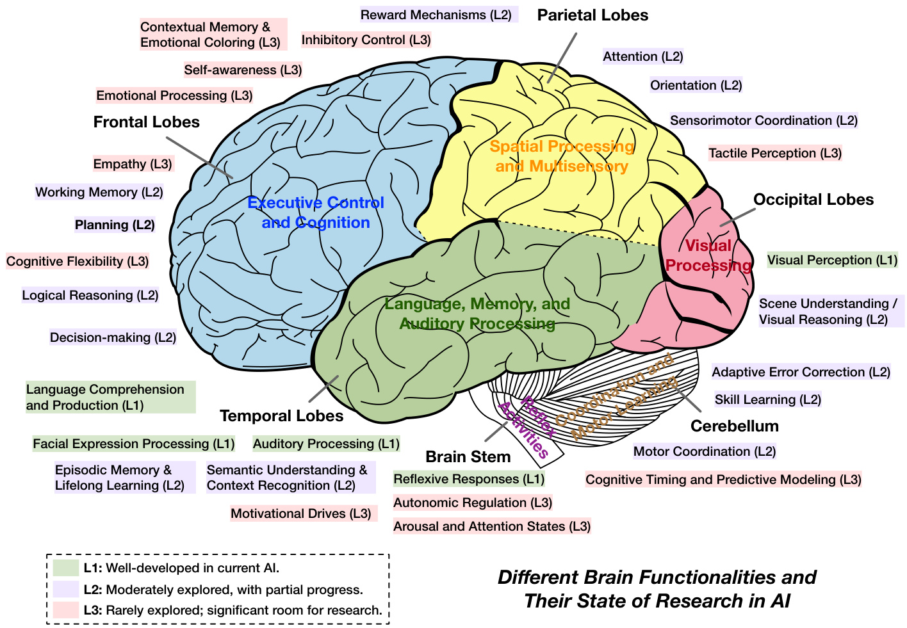

*图1.l：按主要大脑区域分组的关键人类大脑功能的示意图，根据它们在人工智能研究中的当前探索水平进行注释。该图突出了人工智能朝着更全面、脑启发式能力发展的现有成就、差距和潜在机会。*

顶叶：空间处理与多感官整合 顶叶整合多感官输入，促进注意力（L2）、空间定向（L2）和感觉运动协调（L2）[16]。在机器人学和计算机视觉中，人工智能研究解决类似的挑战，采用同时定位与地图构建（SLAM）等技术。然而，人工智能仍然缺乏人类所见到的无缝和实时整合。此外，详细的触觉知觉（L3）仍然鲜为人知，并且在机器人技术和假肢应用方面具有相当大的潜力。

枕叶：视觉处理
枕叶专门负责视知觉（L1），通过分层结构高效地处理视觉刺激[13]。人工智能在基本视觉识别任务上表现出色，利用深度神经网络和视觉转换器实现了与人类水平或更高水平的性能[15]。然而，高级功能，如语境场景理解（L2）和抽象视觉推理，仍然具有挑战性，发展程度仅属中等。

颞叶：语言、记忆和听觉处理
颞叶促进听觉处理（L1）、语言理解（L1）、记忆形成（L2）和语义理解（L2）[16]。人工智能在语言和听觉处理方面取得了显著进展，体现在能够实现接近人类语音识别和语言生成的大型语言模型（LLMs）上。然而，强大的情节记忆和终身学习能力仍然有限，人工智能系统经常遇到像灾难性遗忘这样的问题。将语义理解扎根于多模态体验仍然是一个活跃的研究领域。

小脑：协调和运动学习
小脑主要支持运动协调（L2）、精细技能学习（L2）和适应性错误修正（L2），并在认知时间和预测建模（认知时间，L3）中扮演新兴角色[13]。基于人工智能的机器人技术在模拟类人灵巧性方面取得了有限的成功。实时自适应控制仍然具有挑战性，尽管当前在强化学习和元学习方面的研究显示出有希望的初步结果。小脑的认知功能代表了一个尚未被充分探索但有前景的前沿领域。

脑干：自主调节和反射控制
脑干管理基本的维持生命的自主功能（L3）和快速的反射性反应（L1），如基本的运动反射[13]。人工智能包括设计好的反射性反应，比如自动驾驶汽车中的自动制动，通常是预先定义的而非学习得来。相比之下，在人工智能中自主调节和动态唤醒状态的复杂性仍然大部分未被探索，由于生物和人工系统之间的基本差异，它们的相关性可能受到限制。

边缘系统：情绪、共情和动机
边缘系统由杏仁核和海马组成，主管情绪处理（L3）、奖励机制（L2）、共情（L3）、应激调节（L3）和动机驱动（L3）[13]。人工智能的强化学习算法模拟基于奖励的学习，但情绪理解的微妙差异、真正的共情和内在动机状态仍然显著不足。对于情绪操纵的伦理关切突显了对于谨慎和负责的探索的必要性。

架桥脑样功能与构建有益人工智能至今，我们见证了人类大脑与机器智能之间的差距。然而，目标并不一定是在人工智能系统内复制人类认知的每一个方面。相反，我们的总体目标应该是开发对社会有用、符合伦理、安全和有益的智能体。通过比较人类和人工智能，我们突出了现有的差距，并阐明了创新的有希望方向。这种比较视角使我们能够有选择地整合人类认知的有益方面，比如高效处理、终身适应性学习、情感基础和丰富的创造力，同时超越人类的局限进行创新。最终，这种方法旨在促进更有能力、更具弹性和更负责任的人工智能系统的创建。

此外，考虑人类在混合人工智能社会中的不断变化角色至关重要。人工智能的目标不应是完全取代人类角色，而应是增强和赋能人类能力，在AI擅长的领域，如处理海量数据、进行快速计算和自动化重复任务方面，补充人类技能和判断。人类监督和可解释性对于确保强大的AI系统保持可控性并与人类价值观和伦理标准保持一致至关重要。因此，核心目标必须是开发透明、可解释且对人类指导响应灵活的人工智能技术。

以人为中心的人工智能设计强调协作、安全和社会责任，确保技术进步以受控、可靠的方式进行。通过将人类置于人工智能生态系统的中心，我们可以利用人工智能的潜力，增强人类的生产力、创造力和决策能力，促进技术和社会进步，而不损害人类的自主权或尊严。最终，对人类智能和人工智能能力进行深思熟虑的整合，可以为一个可持续、公平和繁荣的未来铺平道路。

## 1.3 一个模块化且灵感源自大脑的人工智能代理框架

LLM时代的一个核心问题是缺乏一个统一的框架，该框架整合了先进代理所需的丰富认知和功能组件。虽然LLMs提供了出色的语言推理能力，但许多当前的代理设计仍然是临时的 - 它们以一种零碎的方式整合了感知、记忆或规划等模块，未能逼近生物系统（如人脑）中所见的良好协调的专业化。与当前的LM代理不同，人脑通过不同但相互连接的区域无缝平衡感知、记忆、推理和行动，促进对复杂刺激的适应性反应。相比之下，由LLM驱动的代理在需要跨领域或多模态集成的任务时往往遇到困难，突出了需要一种更全面的方法，类似于大脑的功能多样性。受到这些相似之处的启发，我们的调查主张从人脑中汲取灵感，系统地分析和设计代理框架。这一观点表明，生物系统通过将专门组件（用于感知、推理、行动等）紧密集成的方式实现了通用智能 - 这种方法可以作为加强当前基于LLM的代理的蓝图。

神经科学研究揭示，大脑利用理性电路（例如，新皮层，促使深思熟虑和规划）和情绪电路（例如，边缘系统）来引导决策。记忆形成涉及海马体和皮质机制，而奖励信号，通过多巴胺和其他神经调节途径介导，强化行为和学习。这些生物学见解启发了AI代理的几项设计原则，包括但不限于：

<html><body><table><tr><td>Symbol</td><td>Meaning</td></tr><tr><td>W</td><td>The world with society systems that encapsulate both environment and intelligent beings (AI or human).</td></tr><tr><td>S</td><td> State space of the environment.</td></tr><tr><td> St ∈S</td><td>Environment's state at time t.</td></tr><tr><td></td><td>Observation space.</td></tr><tr><td>Ot∈O</td><td>Observation at time t (potentially shaped by attention or other perception filters).</td></tr><tr><td>A</td><td>Agent's action space.</td></tr><tr><td>at∈A</td><td>Action output by the agent at time t. This can be an external (physical) action or an internal (mental) action such as planning or decision-making.</td></tr><tr><td>M</td><td>Space of all mental states.</td></tr><tr><td>Mt∈M</td><td>Agent's mental state at time t, encompassing sub-components (memory, emotion, etc.).</td></tr><tr><td>Mmem</td><td>Memory component in Mt (e.g., short-term or long-term knowledge).</td></tr><tr><td>Mwm</td><td>World model component in Mt (internal representation of how the environment evolves).</td></tr><tr><td>Memo</td><td>Emotion component in Mt (internal valence, arousal, or affective states).</td></tr><tr><td>Mgoal</td><td>Goal component in Mt (objectives, desired outcomes, intentions).</td></tr><tr><td>Mrew</td><td>Reward/Learning signals in Mt (drives updates to preferences, values, or policy).</td></tr><tr><td>L</td><td>Learning function: L : M × A× O -→ M. Responsible for updating or learning the next mental state (e.g., memory, world model, emotion), based on the previous mental state Mt-1,the previous action at-1, and the new observation ot. Reflects how the agent acquires or revises knowledge, skills, or preferences.</td></tr><tr><td>R</td><td>Reasoning function: R : M -→ A. Responsible for deriving the next action at given the updated mental state Mt. Can involve planning, decision-making, or other internal logic.</td></tr><tr><td>C</td><td>Cognition function: C : M × A × O → M × A. Encapsulates both learning (L) and reasoning (R). Concretely, (Mt,at) = C(Mt-1,at-1,Ot) means the agent first learns the new mental state Mt = L(Mt-1,at-1,Ot),then reasons about the next action at = R(Mt).</td></tr><tr><td>E</td><td>Action execution (effectors): E : A -→ A.(Optional) transforms or finalizes at before applying it to the environment (e.g., converting a high-level command into low-level motor signals).</td></tr><tr><td>T</td><td>Environment transition: T : S × A -→ S. Defines how the environment state evolves from (st, at) to St+1.</td></tr></table></body></html>

*表1.2: 修订后的智能代理框架符号总结，突出整体认知过程中的学习和推理功能的分离。*

·并行、多模式处理：大脑通过专门的皮质区域并行处理视觉、听觉和其他感官输入，并在联想区域中将它们整合。同样，AI代理受益于对不同传感器流的并行处理，在后续阶段将它们融合以实现连贯理解。·分层和分布式认知：推理、规划、情绪调节和运动控制涉及皮质和皮质下区域之间的相互作用。类似地，AI代理可以采用模块化架构，其中子系统专门用于理性推断、情绪评估和记忆。·注意机制：人类的注意力基于上下文、目标和情绪优先处理感官数据。AI代理可以通过调节感知的学习注意力策略来复制这一过程，根据内部状态动态调整焦点。

·奖励和情感整合：情绪不仅仅是噪音，而是决策中不可或缺的一部分，调节优先级，增强警惕，并引导学习。以奖励为驱动的可塑性促进习惯形成和技能习得，这一概念对于AI代理中的强化学习至关重要。·目标设定和工具使用：人类的前额叶皮质擅长设定抽象目标和规划行动序列，包括工具使用。同样，AI代理需要强大的目标管理系统和适应性行动方案，由外部奖励和内在动机驱动。

这些原则构成了我们提出的基于大脑启发的代理框架的基础，其中生物机制作为灵感的来源而不是直接复制。

在接下来的章节中，我们概述了我们框架的关键概念，介绍了一个基于感知-认知-行动循环的统一代理架构，通过奖励信号和学习过程进行丰富。每个子系统都被仔细定义和相互连接，以确保记忆、世界模型、情绪、目标、奖励和学习之间的相互作用的透明性。我们将认知形式化为一种通用的推理机制，规划和决策被构建为塑造行为的特定“心理行为”的具体行动。与已建立的理论，如明斯基的“心智社会”[17]、布扎基的内外透视[18]和贝叶斯主动推断[19]的联系被探讨，以突显该框架的普适性和生物可信度。

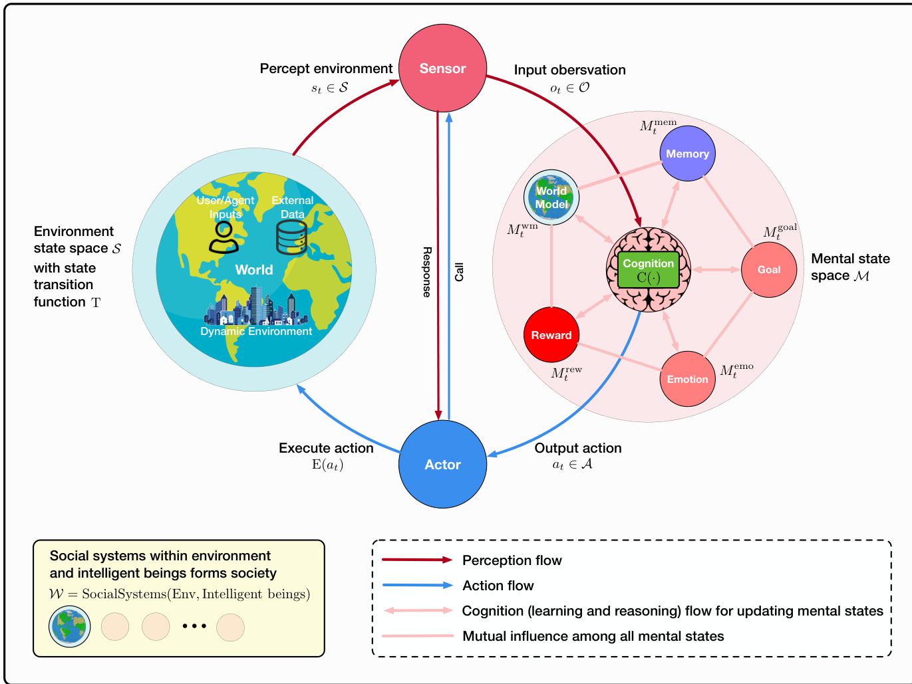

*图1.2：我们描述智能代理循环和代理社会的一般框架概述。*

### 1.3.1 代理循环中的核心概念和符号

我们的架构在三个概念层面操作：社会、环境和代理。然后，代理被分解为三个主要子系统：感知、认知和行动。在认知中，我们确定了关键的子模块：记忆、世界模型、情感状态、目标、奖励、学习和推理过程（包括“规划”和“决策”作为推理产生的特殊行为）。注意力主要在感知和认知中处理。在介绍正式循环之前，我们在表1.2中总结了我们的符号。

接下来，基于表1.2中的符号，我们提出了我们的代理循环。

### 1.3.2 生物启发

尽管我们的智能代理模型在根本上是计算化的，但每个子模块都从人类大脑中经过深入研究的生物学对应物中汲取灵感。下面，我们讨论这些类比，强调神经科学基础以及AI实现所提供的灵活性。

记忆（海马体和新皮层）。几十年的神经科学研究将海马体与情节记忆形成联系起来，而皮层区域则被认为存储语义和程序知识。在人类中，这些记忆子系统合作管理短期编码和长期巩固。我们的记忆组件$M_{t}^{\mathrm{mem}}$ 同样旨在通过存储最近的经验和知识来捕捉多尺度学习。这可以通过神经网络权重（长期）或显式缓冲区（短期）来实现，从而反映海马皮质相互作用。

世界模型（预测处理）。认知神经科学中一个重要理论认为，皮质作为一个预测机器运作，不断将传入的感官数据与生成的期望进行比较。世界模型$M_{t}^{\mathrm{wm}}$通过维护一个内部表示来反映环境随时间演变的方式。正如皮质回路整合多感官数据以更新这些内部模型一样，我们的框架允许$M_{t}^{\mathrm{wm}}$在每次新观察和相关奖励或情绪提示时得以完善，提供了对环境动态的贝叶斯或自由能视角。

情绪（边缘系统）。情绪，由杏仁核、下丘脑和边缘系统等结构介导，显著调节注意力、学习速率和决策门槛[24,25]。通过引入一个情绪组件$M_{t}^{\mathrm{{emo}}}$，我们的模型捕捉了内部价值或唤醒状态如何转移代理的关注和行为。虽然计算“情绪”既不完全类似于生物影响，也不是意识感受，但它们可以引导适应性启发式，比如优先考虑紧急目标或快速回应感知到的威胁。

目标与奖励（前额叶和皮层下环路）。人类擅长制定抽象的、长期的目标，这种能力通常与前额叶皮质功能相关联。与此同时，皮质下环路——特别是多巴胺通路——推动着塑造动机和习得习惯的强化信号。我们的智能体包括$M_{t}^{\mathrm{goal}}$用于存储目标和$M_{t}^{\mathrm{rew}}$用于编码奖励信号，从而实现目标形成和基于奖励的适应之间的连续反馈循环。这种机制允许计划的行动序列、工具使用以及更加微妙的社交互动。

推理、规划和决策（前额叶皮质）。最后，人类前额叶皮质整合来自记忆、感觉输入、情绪和奖励途径的信息，执行高阶认知过程，如逻辑推理、规划和执行控制。在我们的智能体框架中，这些能力被推理子功能所包含，通过PlanFn和Decide等模块选择和执行行动（无论是物理行动还是纯粹的思维）。通过区分规划和即时决策，我们捕捉了智能体如何模拟未来场景、权衡结果，然后承诺采取行动方案，类似于前额叶回路中观察到的灵活编排。

### 1.3.3 现有理论的关联

除了这些明确的神经生物学相似之外，我们的架构与人工智能、认知科学和神经科学中的几个重要理论相一致。

经典的感知-认知-行动循环。我们扩展了传统的感知-思考-行动循环，其中包括明确的注意力机制（在P中）、学习和情感（在C中），以及持续一段时间的奖励信号。这种明确性使得分析代理的内部状态和先前行动如何塑造后续感知和认知变得更容易。

明斯基的“心智社会”。明斯基认为，智能来自于心智中的一组专门化的“代理”。我们的子模块 - $\cdot\mathrm{C}_{\mathrm{mem}}$ $\mathrm{C}_{\mathrm{wm}}$ $\mathrm{C}_{\mathrm{emo}}$ $\mathrm{C_{goal}}$ goal，C $\mathrm{C}_{\mathrm{rew}}$ - 回应了这种分解，将关键功能（如记忆、预测、情感评估、目标设定等）分布在相互作用的独立组件之间。在更广泛的“社会”背景下，每个代理（或子代理）可以像明斯基的内部机构一样协调合作或竞争。最近关于基于自然语言的心智社会的研究支持了使用原始心智社会理论来表示代理系统，并且可以在代理之间整合社会结构和经济模型。

Buzsaki的内外视角。神经科学家们认为，大脑积极构建和更新其感知，而不仅仅是接收输入。在我们的模型中，$M_{t-1}$，包括情绪状态、奖励信号和目标，直接影响感知地图P。这支持了内外立场，即一个代理的内部背景驱动其对环境进行采样和解释的方式，而不是被动地对其做出反应。

部分可观察马尔可夫决策过程（POMDP）。我们的框架可以被看作是经典部分可观察马尔可夫决策过程（POMDP）的泛化。首先，虽然POMDP规定了一个概率转移函数 $\textstyle P(s_{t+1}\mid s_{t},a_{t})$ 在（可能是有限的）状态空间上，我们保留了一个环境转移T，而不将其限制为纯粹的概率性或有限形式，允许任意甚至确定性的映射。其次，在标准POMDP设置中，奖励通常被定义$\textstyle P(s_{t+1}\mid s_{t},a_{t})$为$\textstyle(s_{t},a_{t})$的标量函数（可能随时间打折）。相比之下，我们将奖励信号放置在代理的心智状态$(M_{t}^{\mathrm{rew}})$中，让它们依赖于目标、情绪和世界模型，并与之共同演化，而不是强制执行单一外部定义的目标。第三，虽然POMDP代理通常通过最大化预期回报（值函数）来选择行动，我们的推理子过程更广泛。它考虑记忆、情绪和其他心智状态因素，适应启发式或社会驱动的决策，而不仅仅是基于价值的选择。最后，POMDP并没有明确定义认知子模块，如记忆或情感，这些必须合并为一个单一的“信念状态”。在我们的框架中，每个子组件（记忆、世界模型、情感、目标、奖励）都被明确建模和更新，反映了对认知的生物启发观点。因此，尽管我们的方法作为一种特例恢复了POMDP的表述（通过强制执行概率性T、标量奖励和最小心智状态），但它允许更丰富的环境转移、内部状态和决策机制。

主动推理与贝叶斯大脑。主动推理是由Buzsaki提出的统一框架，表明代理不断更新内部生成模型，以最小化预测误差（或“自由能量”）。我们使用的$M^{\mathrm{wm}}$和$M^{\mathrm{rew}}$，连同规划和决策模块，可以用贝叶斯术语来解释。代理试图通过将其世界模型与新数据对齐，并选择符合预测（或期望）结果的行动来减少惊奇。

生物可信性与普适性。虽然大脑回路与代理子模块之间的映射是在高层次上进行的，但它提供了一种既具有生物启发又模块化不可知的方法。记忆、情感、目标和奖励可以通过各种人工智能范式来实现，包括符号方法、神经网络或混合方法，从而保持了灵活性。通过将神经科学、认知科学和人工智能的关键思想整合在一起，我们得到了一个通用框架，捕捉了智能行为的基本特性，而不过度约束实施细节。

## 1.4 浏览本调查

本调查旨在提供对智能代理进行全面、模块化和跨学科审查，借鉴认知科学、神经科学和其他学科的启发，引导人工智能领域下一波进展。尽管许多现有调查为智能代理研究的各个方面提供了有价值的见解，但我们在表1.3中详细比较了它们的焦点。我们的工作通过系统比较生物认知与计算框架，以识别协同作用、差距和创新机会，从而展现出独特的视角。通过搭建这些领域之间的桥梁，我们旨在不仅突出智能代理的优势所在，还要指出需要取得重大进展以释放其全部潜力的地方。

<html><body><table><tr><td> Survey</td><td>Cognition</td><td>Memory</td><td>World Model</td><td>Reward</td><td>Action</td><td>Self Evolve</td><td>MultiAgent</td><td>Safety</td></tr><tr><td>Zhang et al. [39]</td><td>·</td><td>·</td><td>0</td><td>0</td><td>0</td><td>·</td><td>0</td><td>0</td></tr><tr><td>Guo et al. [38]</td><td>·</td><td>·</td><td>0</td><td>0</td><td>0</td><td>·</td><td>·</td><td>0</td></tr><tr><td>Yu et al. [40]</td><td>·</td><td>·</td><td>0</td><td>0</td><td>·</td><td>0</td><td>·</td><td>·</td></tr><tr><td>Wang et al. [35]</td><td>·</td><td>·</td><td>0</td><td>0</td><td>·</td><td>0</td><td>·</td><td>0</td></tr><tr><td> Masterman et al. [37]</td><td>·</td><td>·</td><td>0</td><td>0</td><td>·</td><td>0</td><td>·</td><td>0</td></tr><tr><td>Xi et al. [34]</td><td>·</td><td>·</td><td>0</td><td>0</td><td>·</td><td>·</td><td>·</td><td>·</td></tr><tr><td>Huang et al. [33]</td><td>·</td><td>·</td><td>0</td><td>·</td><td>·</td><td>·</td><td>·</td><td>·</td></tr><tr><td>Durante et al. [32]</td><td>·</td><td>·</td><td>0</td><td>·</td><td>·</td><td>·</td><td>·</td><td>·</td></tr><tr><td>This Manuscript</td><td>·</td><td>·</td><td>·</td><td>·</td><td>·</td><td>·</td><td>·</td><td>·</td></tr></table></body></html>

*表1.3：具有不同焦点的现有评论摘要。·表示主要焦点，而$\scriptscriptstyle\mathrm{~o~}$表示次要或较小焦点。*

该调查分为四个关键部分：

· 第一部分：智能代理的模块化设计，介绍了代理的核心模块，包括认知模块，作为代理的“大脑”；用于解释感官输入的感知系统；以及用于与外部世界交互的行动系统。在认知系统中，我们进一步讨论了记忆、世界建模、情感、目标和奖励系统，分析它们的当前进展、局限性和研究挑战。

· 第二部分：智能代理的自我增强，我们将焦点转向代理体自我进化和优化的能力。我们探讨了像自适应学习、自我反思和基于反馈的改进这样的机制，受到人类随时间增长和完善技能的能力的启发。本部分还讨论了动态记忆系统和持续知识整合的重要性，以使代理在不断变化的环境中保持相关和有效。

· 第三部分：协作和进化智能系统，我们研究代理如何与彼此和环境互动以解决复杂的大规模问题。我们讨论多代理系统，在机器人、医疗系统和科学发现等领域的应用，突出它们的应用。本部分探讨了多代理系统的拓扑结构和代理协议，追溯了从静态到动态框架的沟通和协作的演变。我们将代理与人类协作范式相结合，研究互动模式如何塑造智能的共同进化，以及多代理系统如何在各种协作环境中调整其决策，通过集体智慧解决复杂挑战。

· 最后，在第四部分：构建安全和有益的人工智能中，我们全面分析了基于LLM的代理的安全格局。我们引入了一个将威胁分类为内在或外在的框架。内在的脆弱性源于代理体系结构内部：核心LLM“大脑”，以及使代理与世界互动的感知和行动模块。外在风险源自代理与记忆系统、其他代理和更广泛环境的互动。本部分不仅形式化和分析了这些脆弱性，详细说明了诸如越狱和提示注入等具体攻击向量，还审查了一系列防御机制。此外，我们探讨了未来的发展方向，包括超对齐技术和人工智能安全的扩展法则——能力和风险之间的相互作用。

通过将这些线索编织在一起，我们的调查旨在提供对智能代理当前状态的整体视角，并为它们的发展提供展望性路线图。我们独特地关注将认知科学见解与计算设计原则相结合，将这项调查定位为研究人员设计代理的基础资源，这些代理不仅强大高效，而且适应性强、具有道德性，并且与人类社会的复杂性深度契合。

# 2认知 25

## 2.1 学习 25

2.1.1 学习空间 27
2.1.2 学习目标 29
2.2 推理 31
2.2.1 结构化推理 32
2.2.2 非结构化推理 34
2.2.3 规划 36

## 2.1 学习

学习代表着智能代理在其心智状态中将经验转化为知识的基本过程。这种转化跨越不同的认知空间，从对整个心智状态的全面更新到特定认知组件的细化。学习的范围涵盖了为不同目标提供支持的显著能力：增强感知理解、改进推理能力和发展更丰富的世界理解。

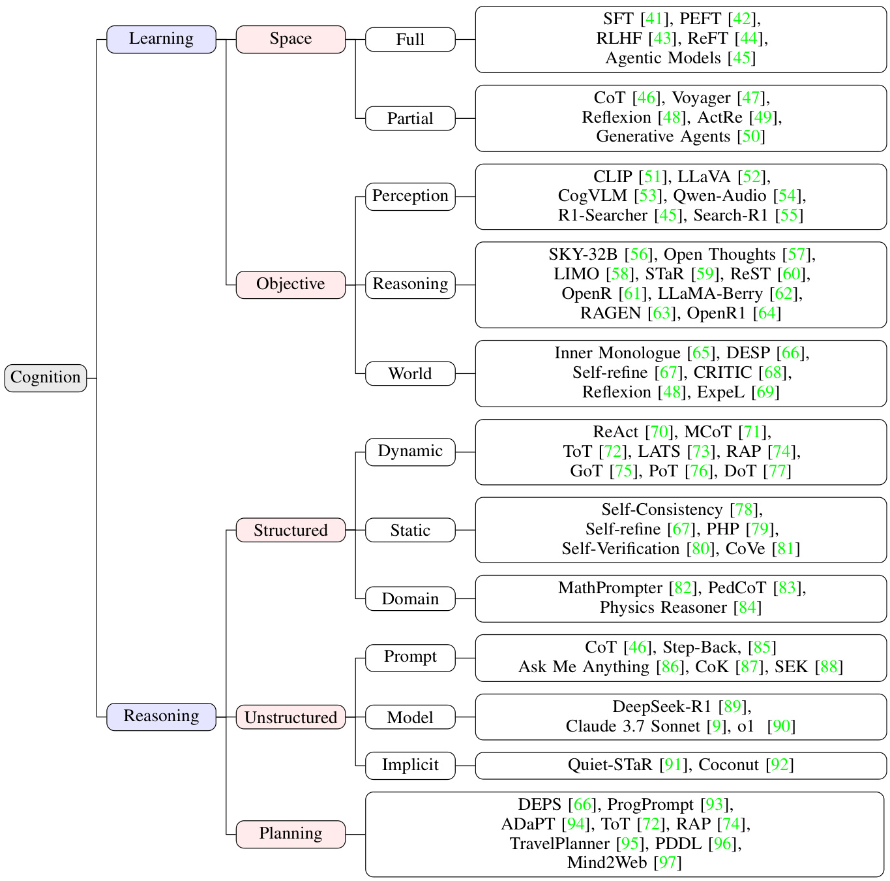

*图2.1：认知系统的分类示意图，包括学习和推理范式。*

人类学习通过大脑适应性神经网络在多个空间和目标上运作。大脑通过综合系统协调整个网络上的学习：海马体促进情节经验的快速编码，小脑支持精确运动技能的监督学习，基底神经节通过多巴胺奖励信号实现强化学习，大脑皮层区域促进无监督模式提取。在更专注的层面上，特定神经回路可以经历定向适应，从而实现专业化技能发展和知识获取。这些系统在不同时间尺度上协同工作，范围从即时响应到终身发展，同时受到注意力、情绪和社会环境等因素的影响。

虽然在体系结构上存在根本差异，但LLM代理在其心智状态空间中实现类似的学习过程。在综合层面上，它们通过在大规模数据集上进行预训练来获取广泛知识，展示一种形式的无监督学习。在更专注的层面上，它们通过参数更新机制（如监督微调和强化学习）来完善特定能力。独特的是，它们还展示了在上下文中学习的能力，通过利用其注意力窗口内的上下文来适应新任务，而无需参数更改：这种能力反映了人类工作记忆的某些方面，但通过根本不同的机制运作。

人类和人工学习系统之间的比较为开发更具能力和适应性的代理提供了宝贵的见解。人类学习在效率、情境化和与情感系统的整合方面表现出显著特征，而基于LLM的方法则在处理大规模数据集、表示形式知识和跨领域综合信息方面具有独特能力。这些互补的优势为研究提供了富有成效的方向。在探索学习的基础时，我们首先研究学习发生的心智状态空间，然后分析推动学习过程的具体目标。

<html><body><table><tr><td>Method</td><td>Model</td><td>Perception</td><td>Reasoning</td><td>Memory</td><td>Reward</td><td>World Model</td></tr><tr><td>Voyager [47]</td><td>0</td><td>0</td><td></td><td>·</td><td></td><td>0</td></tr><tr><td>Generative Agents [50]</td><td>0</td><td></td><td>0</td><td>·</td><td>0</td><td>0</td></tr><tr><td>Learn-by-interact [102]</td><td>·</td><td>O</td><td></td><td>·</td><td></td><td></td></tr><tr><td>RAGEN[63]</td><td>·</td><td>0</td><td>·</td><td>0</td><td>·</td><td>0</td></tr><tr><td>DigiRL[103]</td><td>·</td><td>0</td><td>·</td><td>0</td><td>·</td><td>0</td></tr><tr><td>R1-Searcher [45]</td><td>·</td><td>·</td><td>·</td><td></td><td>·</td><td>0</td></tr><tr><td>RewardAgent [104]</td><td>·</td><td>0</td><td>0</td><td>0</td><td>·</td><td>0</td></tr><tr><td>Text2Reward [105]</td><td></td><td>0</td><td>0</td><td>0</td><td>·</td><td>0</td></tr><tr><td>ARAMP [106]</td><td>·</td><td></td><td>0</td><td>0</td><td>·</td><td>0</td></tr><tr><td>ActRe [49]</td><td>·</td><td></td><td>·</td><td>0</td><td>0</td><td>·</td></tr><tr><td>WebDreamer [107]</td><td>0</td><td>0</td><td>0</td><td>0</td><td>0</td><td>·</td></tr><tr><td>RAP [74]</td><td>0</td><td>0</td><td>0</td><td>0</td><td>0</td><td>·</td></tr><tr><td>AutoManual [108]</td><td>0</td><td>0</td><td>0</td><td>·</td><td>0</td><td>·</td></tr></table></body></html>

*表2.1：不同状态修改学习方法总结。$\bullet$表示主要影响，而$\scriptscriptstyle\mathrm{~o~}$表示次要或无直接影响。*

### 2.1.1 学习空间

LLM代理中的学习方法代表了一种结构化的、数据驱动的范式，与人类观察到的探索性、情感驱动的学习形成对比。虽然人类学习通常涉及积极的好奇心、动机和情感强化，但基于LLM的代理通常通过更正式的过程学习，例如在训练期间的参数更新或在探索过程中的结构化记忆形成。当前的代理架构尝试通过实施模拟人类学习方面的机制，同时利用计算系统的优势来弥合这一差距。

智能代理内部的学习发生在不同的空间中，涵盖了基本模型 $\theta$ 和心智状态 $M$，前者从根本上支持后者的能力和局限性。形式上，我们将智能代理的内部状态定义为一个元组 ${\mathcal{T}}=(\theta,M)$，其中包括模型参数和心智状态组件。如我们在1.2节中所示，心智状态可以进一步分解为不同的结构：

$$ 
M=\{M^{m e m},M^{w m},M^{e m o},M^{g o a l},M^{r e w}\}
 $$

其中，$M^{mem}$ 代表记忆（Memory），$M^{wm}$ 表示世界模型（World Model），$M^{emo}$ 表示情感状态（Emotional State），$M^{goal}$ 代表目标（Goals），$M^{rew}$ 表示奖励信号（Reward Signals）。

对基础模型的修改可以被视为全面的心智状态学习，因为它们从根本上改变了代理的能力。虽然模型级别的修改可能以不同程度影响不同的心智状态，但对模型的上下文窗口或外部结构的更改往往集中在特定的心智状态组件上。例如，从环境中学习经验和技能主要影响记忆，而利用LLM固有的预测能力则增强了世界模型。

全面的心智状态学习通过对基础模型 $\theta$ 进行全面修改来增强代理的能力，从而影响心智状态 $M$ 的所有组件。这个过程始于预训练，通过获取广泛的世界知识来建立语言模型的基础，类似于人类婴儿在发育过程中吸收环境信息，尽管以更有结构和广泛的方式进行。

后续训练技术代表了提升代理能力的基石。类似于人类大脑受教育的方式塑造，这些技术虽然影响整个模型，但可以强调认知发展的不同方面。具体而言，各种形式的基于调整的学习使代理能够获得领域特定知识和逻辑推理能力。监督微调（SFT）[41] 是一种基本方法，模型从人类标记的示例中学习，直接将知识编码到模型的权重中。为了提高计算效率，出现了参数高效微调（PEFT）方法。Adapter-BERT[42]引入了模块化设计，使模型适应下游任务而无需修改所有参数，而低秩调整（LoRA）[109] 通过将权重更新分解为低秩矩阵，仅调整一小部分有效参数，实现了类似的结果。

一些代理能力与其与人类偏好的一致性密切相关，基于一致性的学习方法修改模型以重塑代理基础表示的方面。从人类反馈中强化学习（RLHF）[110] 通过在比较判断上训练奖励模型并将其用于指导策略优化，将模型与人类价值观对齐。InstructGPT[43]展示了这种方法如何显著提高在各种任务中与用户意图的一致性。直接偏好优化（DPO）[111] 进一步简化了这一过程，将其重新构造为无需明确奖励建模的直接偏好学习，保持了一致性质量同时降低了计算复杂性。

强化学习（RL）为特定环境中专业学习提供了一条有前途的途径。RL在增强推理能力方面表现出特别的潜力，基本上使代理的基础模型能够在思维空间内学习。基础作品如强化微调（ReFT）[44]通过在线强化学习奖励下的自动采样推理路径进行微调，增强了推理能力。DeepSeek-R1[89]通过基于规则的奖励和群体相对策略优化（GRPO）[112]推进了这一方法，而Kimik1.5[13]将上下文强化学习与优化的思维链技术相结合，以改善规划过程和推理效率。在特定环境中，修改模型以增强代理对行为和外部环境的理解已被证明是有效的，正如DigiRL[103]所展示的，该方法实现了一个两阶段强化学习方法，使代理能够在真实的Android设备模拟器上执行各种命令。

最近的研究尝试将代理的行动空间直接整合到模型训练中，通过强化学习（RL）或SFT方法学习不同状态下的适当行动。这种整合从根本上影响了代理的记忆、奖励理解和世界模型理解，指向了一个有前途的方向，即代理模型的出现。

部分心智状态学习，虽然通过模型修改实现了全面的能力更新，但专注于代理心智状态 $M$ 的特定组件的学习代表了另一种重要且通常更高效的方法。这种部分心智状态学习可以通过有针对性的模型更新或无需参数更改的情境适应来实现。

情境学习（ICL）说明了代理如何能够有效地修改特定心智状态组件，而无需修改整个模型。这种机制使代理能够通过利用上下文窗口内的示例或指令，适应新任务，类似于人类工作记忆在快速任务适应中的作用。思维链（CoT）展示了这种方法的有效性，展示了代理如何在保持基本模型参数不变的同时增强特定的认知能力。

部分心智状态学习的可行性通过针对不同组件（如记忆$M^{mem}$、奖励$M^{rew}$和世界模型$M^{wm}$）的各种方法得到证明。通过正常的交流和社交互动，生成式代理[50]展示了代理如何积累并重现记忆，提取高层次见解以指导动态行为规划。在环境交互场景中，Voyager[47]展示了代理如何通过与Minecraft环境的直接互动持续更新其技能库，积累程序化知识而无需重新训练模型。通过直接环境交互综合经验数据，Learn-by-Interact[102]进一步扩展了这种方法，消除了手动注释或强化学习框架的需求。此外，代理可以通过反思从错误中学习并改进，如Reflexion[48]所示，通过从反复试验中获得文本反馈来引导代理的未来思考和行动。

对奖励和世界模型的修改提供了部分心智状态学习的另一个例子。ARMAP[106]通过从代理行动轨迹中提炼环境奖励模型，对其进行改进，为进一步学习奠定了基础。AutoMC[114]通过环境探索构建密集奖励模型，以支持代理行为。同时，[107]明确利用LLMs作为世界模型，预测未来行动的影响，有效地修改代理的世界理解$(M^{wm})$。ActRe[49]利用语言模型固有的世界理解，从轨迹中构建任务，通过迭代训练提升代理作为世界模型和推理引擎的能力。

### 2.1.2 学习目标

智能代理的学习过程在其与环境的互动的各个方面都有体现。在输入层面，代理倾向于更好地感知和解析环境信息；在处理层面，代理学会如何基于现有知识或推理能力进行有效推理；在理解层面，代理通过持续互动形成和优化对世界的理解。这种多层次学习目标框架使代理能够在不同维度上持续演化，从而使它们能够更好地处理复杂和动态的任务环境。

为了更好地感知 学习如何有效感知和处理来自环境的信息是智能代理的基础。为了增强感知能力，代理采用了两种主要的学习方法：扩展多模态感知和利用检索机制。

多模态感知学习使代理能够处理和整合不同的感官输入，类似于人类的多感官整合，但不受生物限制。这种能力通过像CLIP[51]这样的进展显著发展，CLIP首创了在共享嵌入空间中对视觉和语言表示进行对齐。在此基础上，像LLaVA[52]这样的模型通过在图像-文本对上训练专门的投影仪来增强视觉感知，而CogVLM[53]通过统一的表征架构推进了视觉推理。

感知模态的扩展在多个感官领域持续进行。在音频处理方面，QwenAudio[54]展示了对各种声学信息的统一编码，从语音到环境声音。最近的工作[l15]甚至涉及触觉知觉，开发了将触觉、视觉和语言表示进行对齐的数据集。这些进展使代理能够更全面地参与物理和数字环境。

代理还通过检索机制学习增强其观察能力。与受限于即时感官输入的人类感知不同，代理可以学习访问并整合来自庞大外部知识库的信息。类似于RAG[116]这样的检索增强方法通过将即时观察与相关存储知识连接起来，增强了感知理解能力。

关于基于检索的代理的最新工作展示了增强主动信息获取能力的潜力。Search-ol[117]引导推理模型通过提示学习主动检索，从而扩展其知识边界。更进一步，R1-Searcher[45]和Search-R1[55]直接将检索能力纳入模型，使其能够在推理过程中进行自主信息检索。这些进展为改进代理感知提供了一个有前途的方向：增强模型级主动感知能力，丰富决策基础。这种方法可能代表了未来代理发展的一个重要途径。

学习以改进推理 推理作为代理的心智状态与行动之间的关键桥梁，有效推理能力和推理能力的发展对于智能代理至关重要。现代代理推理的基础源自两个关键要素：嵌入在其基础模型中的丰富世界知识，以及通过内部支持或上下文结构化支持的健壮逻辑框架。这使得学习以改进推理成为代理发展中的一个至关重要的目标。

推理能力的发展通过几个关键现象来展示。首先，高质量的推理数据直接增强了模型的推理能力；其次，这种高质量数据通常需要验证或奖励模型以进行有效的整理；第三，对基础模型进行直接强化学习可以自发地表现出推理能力。随着ol系列的发布，推理在代理发展中的重要性再次被强调。一种常见的方法涉及收集和提炼来自开源/闭源推理模型的数据。例如，SKY-32B[56]从QWQ-32B[118]提炼数据以$\$450$的成本训练了一个32B推理模型。类似地，Open Thoughts[57]通过提炼和合成来自R1的数据集，以较低成本训练了Bespoke-Stratos-32B。这些研究表明，即使没有复杂的算法设计，使用推理数据对基础模型进行监督微调(SFT)可以有效激活推理能力。

关于数据质量的另一个关键见解是，高度结构化的推理数据更有效地使代理和语言模型学习推理过程。值得注意的是，LIMO[58]表明，通过为复杂推理任务构建长而有效的推理链，可以利用极少的数据样本构建强大的推理模型。这一见解源自他们的观察，即语言模型固有地具有进行推理所需的知识，但需要高质量的推理路径来激活这些能力。支持这一观点，Li等人。

[9]揭示了长CoT和短CoT两者基本上都是教导模型学习推理结构而非特定内容，这表明自动选择高质量推理数据可能成为未来重要的方向。

一种可行的探索方法首先涉及进行广泛搜索，然后利用可验证的环境或可训练的奖励模型对推理轨迹提供反馈，从而过滤出高质量的推理数据。这种方法导致了几种利用不同反馈机制来提高推理能力的技术系列的出现。

第一类技术遵循了由STaR[59]及其变体所示范的引导范式，这些技术使模型生成逐步的推理过程并通过对成功推理路径的微调来逐步改进。这个系列包括Quiet-TaR[91]，-STaR[120]和Star-Math[11]，后者通过强化学习原则专门增强了数学推理。通过迭代地选择正确的推理路径进行训练，这些方法通过连续的改进循环实现了自我改进。

第二类技术通过更明确地融入强化学习原则来扩展这一范式。ReST家族以最初的ReST[60]引入了强化自我训练开始，对每个样本进行多次尝试（通常为10次），并从成功的推理实例中创建新的训练数据集。ReST-EM[22]通过期望最大化增强了这一方法，而ReST-MCTS[122]进一步整合了蒙特卡洛树搜索，通过更复杂的探索策略实现了改进的推理能力。

一些方法引入了策略奖励模型（PRMs）来提供关于推理路径的质量反馈。像OpenR[61]和LLaMA-Berry[62]这样的方法将推理任务建模为马尔可夫决策过程（MDPs），利用树搜索探索各种推理路径，同时利用PRMs进行质量评估。在特定领域的应用中，像rStar-Math[121]和DeepSeekMath[112]这样的方法通过多轮自我迭代和平衡的探索-利用策略，在数学问题解决中取得了成功。对于代码生成，ol-Coder[13]利用MCTS生成带有推理过程的代码，而Marco-ol[123]将这种方法扩展到开放式任务。这些实现突显了MCTS和PRM之间的协同作用如何通过细粒度监督实现了有效的推理路径探索，同时保持解决方案质量。

除了数据驱动方法之外，强化学习（RL）在增强语言模型推理能力方面取得了显著成功，正如最近的突破所证实的，例如DeepSeek R1和Kimi-K-1.5。强化学习在LLM中的基础可以追溯到几个开创性框架：ReFT引入了监督微调和在线强化学习的组合，而VeRL建立了一个开源框架，支持各种RL算法用于规模达到70B参数的大型模型。RFT进一步证明了奖励引导优化在特定推理任务中的有效性。

在这些基础上，后续的研究探索了各种应用和改进。OpenR1和RAGEN将强化学习技术扩展到增强通用推理能力，而像SWE-Gym这样的专门实现在软件工程任务中取得了成功。值得注意的是，DigiRL引入了数字世界代理增强的新方法。

最近的进展进一步将强化学习与工具使用和推理相结合。Qwen-QwQ-32B利用强化学习和通用奖励机制将工具调用融入推理过程，实现在推理过程中无缝使用任意工具，并在模型内部直接实现类似代理的功能。类似地，RAGEN专注于多步骤代理场景，建立了一个在复杂环境中进行代理强化学习的框架。这些发展表明模型训练和代理开发之间的趋同性日益增强，可能导致更加综合和功能强大的智能系统。这些实现突显了强化学习如何有效提高模型性能，同时减少对大规模注释数据集的依赖，特别是在复杂推理场景中。

对于世界理解的学习
智能体智能的一个关键方面是通过直接互动和经验积累理解世界运作的能力。这种理解包括环境如何对不同行为做出响应以及这些行为带来的后果。通过与环境的持续互动，智能体可以构建和完善它们的记忆、奖励理解和世界模型，从成功和失败中学习，以发展对其操作领域更全面的理解。

最近的研究揭示了各种各样的用于理解世界的经验学习方法。在基础层面，内部独白（Inner Monologue）展示了智能体如何通过持续互动积累基本的环境知识。类似地，“通过互动学习”（Learn-by-Interact）表明，有意义的理解可以在没有明确奖励机制的情况下从直接的环境参与中产生。更复杂的方法由DESP和Voyager在Minecraft环境中展示，代理不仅收集经验，还积极加以处理：DESP通过结果分析，Voyager通过动态技能库扩展。

通过先进的框架，对积累经验的处理和利用进一步系统化。《生成式智能体》（Generative Agents）引入了复杂的记忆重放机制，使智能体能够从过去的互动中提取高层次的见解。这种系统化方法得到了《自我完善》（Self-refine）和《评论家》（Critic）的增强，它们实施了结构化的经验评估和完善循环。

通过环境互动优化奖励理解已经成为世界理解的另一个关键方面。《文本到奖励》（Text2Reward）展示了智能体如何通过人类反馈不断完善奖励函数，更好地使其与任务目标和环境特征保持一致。类似地，《自动手动》（AutoManual）通过持续互动建立行为指南，制定经过奖励验证的协议，为理解环境奖励和决策制定了基础。这些基于互动的优化机制使智能体能够更好地理解环境动态，并产生更精确的奖励信号，最终增强它们在复杂、动态环境中的适应性和决策能力。

在这些基础上，RAP[74]作为一个重要进展，将推理概念化为具有世界模型的规划。通过将LLMs重新定位为推理代理和世界模型，RAP使智能体能够在承诺之前模拟潜在行动的结果，通过蒙特卡罗树搜索促进更有效的规划。这种方法使智能体能够在探索和利用之间找到适当的平衡，有策略地探索推理空间。

利用世界模型进行代理学习的进一步创新包括ActRe[127]，它通过首先执行行动，然后生成事后解释，颠倒了典型的推理-行动顺序。这种理性化行动的能力展示了LLMs对世界动态的固有理解，实现了自主轨迹注释，并促进了对比自我训练。

[128]强调了认知地图在理解世界中的重要性，他们表明，受人类认知启发的结构化心理表征显著增强了LLMs在新环境中的外推能力。这些认知地图不仅改善了规划，还表现出类似于人类的特征，如结构化心理模拟和快速适应。

在基于网络的环境中，[107]和[129]的最新工作表明，LLMs可以作为有效的世界模型，用于预测网络交互的结果。通过在执行行动之前模拟潜在状态变化，这些方法使决策更加安全和高效，特别是在行动可能是不可逆的环境中。

通过像Reflexion[48]和ExpeL[69]这样的系统，智能体通过自主管理完整的经验循环（包括经验收集、分析和应用），使它们能够有效地从成功和失败中学习。

这些发展共同展示了世界模型如何越来越成为代理学习系统的核心，为理解环境动态提供基础，并在复杂的互动环境中实现更有效的规划、推理和决策。

## 2.2 推理

推理代表着智能行为的关键，将原始信息转化为可操作的知识，推动问题解决和决策制定。对于人类和人工代理来说，推理使逻辑推理、假设生成和有目的地与世界互动成为可能。在人类认知中，推理通过多种策略出现：演绎推理将一般规则应用于特定情况，归纳推理从具体实例中建立概括，而诱导推理从不完整数据中构建合理解释。这些过程通过启发式得到增强——这是在不确定性下简化决策的心理快捷方式，并通过环境反馈不断完善，确保推理保持现实基础并适应变化。

对于基于LLM的代理，推理发挥着并行作用，将它们提升至超越反应性系统的主动实体，能够进行复杂认知。通过推理，这些代理处理多模态输入，整合多样化知识源，并制定一致的策略以实现目标。环境发挥着双重功能：提供推动推理的信息，并作为验证推理行为的实践场所，创造一个反馈循环，使代理能够验证推断并从错误中学习。

在基于LLM的代理中，推理可以被正式定义为基于心智状态的行动选择过程，代表了知觉和行动之间的关键桥梁。更准确地说，在时间t给定心智状态Mt，推理可以被形式化为一个函数$\mathrm{R}(\mathrm{Mt})\rightarrow\mathrm{at}$，其中at代表所选的行动。这一过程跨越各种环境——文本、数字和物理世界——在这些环境中完成任务通常要求进行单一推理步骤或多个推理行动的组合。

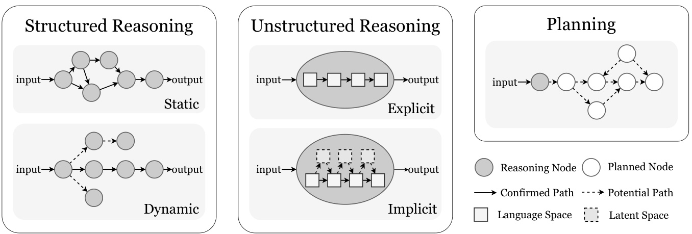

*图2.2：基于LLM的代理中推理范式的比较。*

推理行动的组成自然地导致了两种不同的方法：结构化推理（$R_{s}$）和非结构化推理（$R_{u}$）。结构化推理可以被形式化为显式的组合$R_{s}=R_{1}\circ R_{2}\circ...\circ R_{n}$，其中每个$R_{i}$代表一个具有明确逻辑依赖关系的离散推理步骤。相反，非结构化推理采用更全面的形式$R_{u}=f(M_{t})$，其中组合保持隐式和灵活，允许动态适应上下文。这种双重框架反映了人类认知，其中结构化推理类似于我们的显式逻辑推理过程，而非结构化推理反映了我们在直觉问题解决和模式识别方面的能力。

环境在这种形式化过程中发挥着至关重要的作用，既作为影响心智状态更新的观察结果$o_{t}$的来源$(M_{t}=L(M_{t-1},a_{t-1},o_{t}))$，也作为推理结果的测试场所。这创造了一个连续的反馈循环，推理不仅推动行动选择，还影响代理的心智状态如何演变，通过经验实现推理策略的迭代改进。

在本节中，我们将探讨这些推理方法在实践中的体现。我们首先从结构化推理开始，强调系统性问题分解和多步逻辑链。然后我们探讨非结构化推理，它允许灵活的响应模式和并行解决方案探索。最后，我们研究规划作为一种专门形式的推理，结合了结构化和非结构化方法，用于解决复杂的、长期的任务。

### 2.2.1 结构化推理

结构化推理代表了一种系统化的问题解决方法，采用明确的组织框架来引导推理过程。与非结构化方法不同，结构化推理使得推理步骤的组成变得明确，可以形式化表示为$R_{s}=R_{1}\circ R_{2}\circ...\circ R_{n}$，其中每个$R_{i}$代表一个具有清晰逻辑依赖关系的离散推理步骤。在这种表述中，每个推理节点都是一个明确定义的计算单元，节点之间的连接代表着明确的信息流路径。这种方法使得更系统地探索解决空间成为可能，并通过深思熟虑的逐步分析促进更健壮的决策制定，提供了在整个推理过程中的高可解释性和可追溯性。

#### 2.2.1.1 动态推理结构

动态推理结构允许在解决问题过程中自适应地构建推理路径，创造出可以根据中间结果和见解进行调整的多功能框架。

线性顺序推理将推理框架构建为一系列顺序步骤，其中每一步都建立在前一步之上。ReAct通过将推理轨迹与特定任务的动作以交替方式结合来说明这一点。这种组合使得推理轨迹可以指导和修改行动计划，同时行动可以访问外部来源获取更多信息。这种相互作用提高了推理的完整性和环境适应性。

通过规划进行推理（RAP）扩展了线性推理范式，将LLM推理构建为马尔可夫决策过程，尽管受限于专门设计用于特定问题的状态。思维马尔可夫链（MCoT）通过将每个推理步骤概念化为一个马尔可夫状态并附带可执行代码来扩展了这一范式。这种方法通过将先前推理压缩为简化的数学问题，实现了高效的下一步推理，而无需长篇上下文窗口。思维原子明确将问题定义为状态表示，并设计了通用的分解-收缩两阶段状态转换机制来构建马尔可夫推理过程，将复杂问题转化为一系列原子问题。

基于树的探索方法通过将推理组织成支持分支探索的分层框架，扩展了超越线性结构的范式。思维树（ToT）引入了一种结构化方法，将复杂问题分解为中间步骤，实现对解决空间的广度优先或深度优先搜索。这使模型能够同时考虑多条推理路径，并系统地探索替代方案。

语言代理树搜索（LATS）推进了这一范式，通过将蒙特卡洛树搜索（MCTS）与LLMs集成，利用环境作为外部反馈机制。这种方法通过LLM驱动的价值函数和自我反思，通过一个复杂的搜索过程，在探索和开发之间取得更加深思熟虑和适应性的问题解决平衡。

通过规划进行推理（RAP）通过将LLMs重新用作推理代理和世界模型进一步增强了基于树的推理。通过这种双重角色，RAP使代理能够在承诺之前模拟潜在推理路径的结果，创建一个在推理空间中平衡探索和开发的原则性规划框架。

基于图的推理图结构提供了更大的灵活性，允许推理步骤之间存在非层次关系。思维图（GoT）将基于树的方法扩展到任意图结构，实现能够捕捉不同步骤之间相互依赖关系的更复杂推理模式。这种方法允许看似不相关的推理分支之间建立连接，促进解决空间的更加微妙的探索。 思维路径（PoT）[76]通过将问题分解为三个关键阶段：图提取、路径识别和推理，来解决关系推理挑战。通过明确提取任务无关的图，识别问题背景中的实体、关系和属性，PoT创建了一个结构化表示，有助于识别相关推理链，显著提高了需要长推理链的任务的性能。

思维图（DoT）[77]将迭代推理建模为有向无环图（DAG）的构建，将命题、批评、改进和验证组织成统一结构。这种方法保持逻辑一致性，同时能够探索复杂的推理路径，提供了一个基于拓扑理论的理论上合理的框架。

#### 2.2.1.2 静态推理结构

静态推理结构采用固定的框架来指导推理过程，而不会动态调整结构本身，而是专注于改进已建立框架内的内容。

集成方法。集成方法利用多个独立的推理尝试来通过聚合提高整体性能。Self-Consistency[78]开创了这一方法，通过采样多个推理路径而不是依赖于单一贪婪解码，通过在生成的解决方案中采用多数投票显著提高性能。

MedPrompt[133]展示了领域特定的集成技术如何通过精心设计引发多样化推理方法的提示来提高性能，通过系统构成提示策略在医学基准测试中取得了最先进的结果。

LLM-Blender[134]引入了一个复杂的集成框架，通过成对比较（PairRanker）和融合（GenFuser）候选输出，利用多个LLM的各种优势。这种方法使系统能够为每个特定示例选择最佳模型输出，创造出超越任何单个模型能力的响应。

渐进改进。渐进改进框架专注于通过结构化的反馈循环逐步完善推理。Self-Refine[67]实现了一种迭代方法，模型生成初始输出，提供自我反馈，并利用该反馈来自我完善。这模仿了人类的修订过程，而无需额外的训练或强化学习，从而在各种任务中取得显著的改进。 Reflexion[48]通过整合环境反馈扩展了这一概念，使代理能够口头反思任务反馈信号，并将反思性文本保留在一个情节性记忆缓冲区中。这种方法通过吸收以前尝试的见解来指导未来的决策，显著增强了在顺序决策、编码和推理任务中的表现。

渐进提示引导（PHP）[79]进一步发展了这一范式，利用先前生成的答案作为提示逐步引导模型朝向正确解决方案。这种方法使用户和LLMs之间能够进行自动多次交互，显著提高准确性同时保持高效性。

错误校正。错误校正框架专注于识别和解决推理过程中的错误。Self-Verification[80]引入了一个自我批判系统，使模型能够通过将得出的答案作为解决原始问题的条件来向后验证其结论，产生可解释的验证分数，指导答案选择。 Refiner[135]通过自适应提取与查询相关内容并基于相互关联性重组这些内容来解决分散关键信息的挑战，突出信息区分并有效地将下游LLMs与原始上下文对齐。

Chain-of-Verification(CoVe)[81]通过一个结构化过程来解决事实幻觉问题，模型起草初始响应，规划验证问题，独立回答这些问题，并生成最终经过验证的响应。这种刻意的验证过程显著降低了在各种任务中出现的幻觉。

Recursive Criticism and Improvement (RCI)[128]使LLMs能够通过递归批评和改进其输出来执行计算机任务，在MiniWoB++基准测试中表现优异，每个任务只需少量演示，而无需特定于任务的奖励函数。

Critic [68]通过集成外部工具进行验证扩展了这种方法，使LLMs能够评估和逐步修改其输出，就像人类与工具进行交互一样。这个框架允许最初的“黑盒”模型参与持续的评估和改进循环，持续增强在各种任务中的性能。

#### 2.2.1.3 领域特定推理框架

领域特定推理框架将结构化推理方法调整到特定领域的独特需求，利用专业知识和技术来增强特定情境下的性能。

MathPrompter[82]通过生成多个代数表达式或Python函数来解决相同数学问题的不同方式，解决了算术推理挑战。该方法通过提供多条验证路径，显著优于现有方法，增强了结果的可信度，在算术基准测试中表现出色。

PhysicsReasoner[84]通过知识增强框架解决物理问题的独特挑战，构建了一个全面的公式集，并采用详细的检查清单来指导有效的知识应用。这种三阶段方法——问题分析、公式检索和引导推理——通过减轻知识不足和错误应用问题，在物理基准测试中显著提高了性能。

教学思维链（PedCoT）[83]利用教育理论，特别是布鲁姆认知模型，指导在数学背景下识别推理错误。该方法将提示设计的教学原则与两阶段交互过程相结合，为可靠的数学错误识别和自动答案评分奠定基础。

LLM代理中结构化推理的演进反映了如何通过明确的组织框架增强推理能力的日益增长的理解。从线性序列到复杂图表，从集成方法到专门的领域框架，这些方法展示了结构指导在改善跨不同任务和领域的推理性能中的强大作用。

### 2.2.2 非结构化推理

与明确组织推理步骤的结构化推理方法相比，非结构化推理（$R_{u}$）采用了整体形式${\cal R}_{u}=f(M_{t})$，其中组成部分保持隐式和灵活。在这种模式下，推理过程封装在单个函数映射中，没有明确定义中间步骤或状态转换。这种方法利用语言模型的固有能力生成连贯的推理，而不强加严格的结构约束，其中中间推理过程明确发生在语言空间中或隐式发生在潜在空间中。非结构化推理方法在各种任务中展现出显著的有效性，同时在实施上保持简单和高效。

#### 2.2.2.1 基于提示的推理

在LM代理中引发推理的最直接方式是精心设计的提示。通过提供适当的推理演示或指导LLM执行推理步骤，代理可以利用其逻辑推断能力通过灵活的推理过程解决问题。

思维链变体。基于提示的推理的基石是思维链（CoT）提示，通过明确生成中间理性化步骤的少样本示例来实现推理。这一基础技术已经激发了几种进化变体，增强了其基本方法。零样本CoT通过战略提示（例如，“让我们一步一步地思考”）消除了演示示例的需求，使方法更易接触同时保持有效性。Auto-CoT自动化创建有效演示，通过对不同问题进行聚类并为每个聚类的代表性示例生成推理链。从最少到最多提示通过将问题分解为顺序子问题来解决复杂推理，实现了逐步规划过程，促进了易到难的泛化。复杂CoT通过专门选择高复杂度的示例作为提示模板进一步增强了推理深度，更好地装备模型来解决复杂问题。

问题重构策略。先进的提示策略通过重新构造原始问题展示了推理指导中的架构创新。Step-Back Prompting [85] 通过概念提升实现了抽象优先的推理，使模型能够在处理具体细节之前得出高层概念和首要原则。实验结果表明，在各种需要推理的任务中，该方法取得了显著的性能提升，物理、化学和多跳推理基准测试的提升达到了$7.27\%$。Rephrase and Respond[140] 利用语义扩展将原始问题转化为更易处理的形式，使模型能够从多个语言角度解决问题并确定最有效的问题表述。

思维抽象化[141]引入了一种新颖的结构化推理格式，明确要求推理过程中采用不同层次的抽象化。这种方法促使语言模型在吸收具体细节之前首先在抽象层面上思考，这是逐步CoT方法所忽视的考虑。通过在高质量样本上微调，将模型与AoT格式对齐，该方法在各种推理任务中表现出明显的性能提升，相较于与CoT对齐的模型。

增强提示框架。一些框架扩展了基本提示范式，以创建更复杂的推理环境。"问我任何事"[86]通过将任务重新构建为结构化的问答序列，强制执行专注的推理轨迹，限制了开放式生成。这种方法通过递归地使用LLM本身将任务输入转换为有效的问答格式，使得开源的GPT-J-6B能够在20个常见基准测试中的15个上达到或超过少样本的GPT3-175B的性能水平。

《思维算法》提出了一种新颖的策略，通过利用完整上下文中的算法示例，推动LLM（大型语言模型）通过算法推理路径。这种方法利用LLM的固有循环动力学，仅通过一个或几个查询扩展其思想探索。该技术胜过先前的单查询方法，甚至胜过最近的多查询策略，同时使用的记号数量显著较少，表明利用算法指导LLM可以实现超越算法本身性能的效果。

知识链（CoK）[87]通过动态地整合来自异构来源的基础信息，增强了LLM，从而产生了更多的事实依据和减少的虚构。CoK包括三个阶段：推理准备、动态知识调整和答案整合，通过自适应查询生成器利用非结构化和结构化知识源。该方法逐步使用先前校正的依据来纠正依据，从而最小化推理步骤之间的错误传播。

自解释关键词（SEK）[88]通过在问题描述中提取和解释关键术语，并根据其频率对其进行排序，解决了代码生成中低频术语的挑战。该方法显著提高了跨多个基准测试的代码生成性能，使模型能够将注意力从低频关键词转移到其对应的高频关键词上。

#### 2.2.2.2 推理模型

最近在语言模型领域的进展推动了专门针对复杂推理任务设计的专用推理模型的发展。这些模型经过微调或专门训练以优化推理能力，融合了架构和训练创新，提升它们在需要多步逻辑推理的任务中的性能。

DeepSeek的R1 [89]、Anthropic的Claude 3.7 Sonnet [9]和OpenAI的o系列模型 [90]等推理模型代表了推理能力的前沿，展示了在各种推理基准测试中出色的熟练度。这些模型经过专门的方法训练，强调推理模式，通常融入大量人类反馈和强化学习以增强其推理能力。

专用推理模型的出现反映了对语言模型中推理能力重要性的日益认识，以及专门训练这些任务的潜在好处。通过专注于以推理为中心的训练数据和目标，这些模型在需要复杂逻辑推理、数学推理和多步问题解决的任务上实现了显著超越通用语言模型的性能水平。

#### 2.2.2.3 隐性推理

除了显式推理方法之外，最近的研究探索了隐式推理方法的潜力，这些方法在不公开推理过程的情况下运行。这些方法旨在通过减少生成的标记数量来提高效率，同时保持或增强推理性能。

Quiet-STaR [91] 泛化了自学习推理器方法，通过教导LLMs在每个标记处生成理由来解释未来文本，从而改善它们的预测。这种方法解决了包括计算成本、生成内部思想的初始陌生感以及需要预测超出单个标记之外的关键挑战。实验结果表明，在持续预训练后，在数学推理（从5.9%提高到10.9%）和常识推理（从36.3%提高到47.2%）方面实现了零-shot改进，标志着LLMs朝着以更通用和可扩展的方式学会推理迈出了一步。

连续思维链（Coconut）[92] 提出了一种范式，使LLM能够在无限制的潜在空间中进行推理，而不是使用自然语言。通过利用LLM的最后隐藏状态作为推理状态的表示，并将其直接作为连续空间中的后续输入嵌入反馈，Coconut 在推理任务中表现出更好的性能，且在推理过程中需要更少的思考标记。这种方法导致了新兴的高级推理模式，包括编码多个备选的下一推理步骤的能力，使模型能够进行广度优先搜索，而不是致力于单一确定性路径。

最近对变压器中的隐式推理进行的分析揭示了其局限性的重要见解。虽然语言模型可以通过隐式推理进行逐步推理，并在固定模式数据训练时在领域内和领域外测试中实现高准确性，但从在非固定模式数据上训练中出现的隐式推理能力往往会过度拟合特定模式，并且无法进一步泛化。这些发现表明，语言模型通过快捷学习获得了隐式推理能力，在类似模式的任务上表现出色，但缺乏更广泛的泛化能力。

非结构化推理方法的演变展示了语言模型对不同推理范式的显著适应性。从简单的提示技术到复杂的隐式推理方法，这些方法利用LLM的固有能力进行复杂的逻辑推理，而无需显式的结构约束。这种灵活性使得在各种推理任务中更直观地解决问题，同时保持效率和有效性。

### 2.2.3 规划

规划是人类认知的一个基本方面，使个体能够在复杂、动态环境中组织行动、预测结果并实现目标。形式上，规划可以描述为从初始状态到期望目标状态构建潜在路径的过程，表示为 $P:S_{0}\rightarrow\{a_{1},a_{2},...,a_{n}\}\rightarrow$ $S_{g}$ ，其中 $S_{0}$ 是起始状态，$\{a_{1},a_{2},\ldots,a_{n}\}$ 表示一系列可能的行动，$S_{g}$ 是目标状态。与直接推理不同，规划涉及在执行之前生成假设的行动序列，作为计算节点，直到部署前保持不活跃。这种认知能力源自专门的神经回路的相互作用，包括负责执行控制的前额叶皮层和支持情景预测和空间映射的海马。决策理论、心理学和控制论等领域的见解，如理性框架、前景理论和反馈环路，展示了规划如何使人类超越反应性行为，通过深思熟虑的意图和适应性策略积极塑造未来。这种能力不仅支撑着智能行为，还可作为基于LLM的代理开发的模型，这些代理旨在在计算上复制和增强这些能力。

在人类认知中，规划作为一个分层过程运作，将即时决策与长期目标整合在一起。这反映了大脑的模块化结构，神经系统协同工作以平衡短期需求和未来可能性，这种动态受控制理论的稳定性和优化原则的影响。同样，基于LLM的代理通过利用其丰富的语言知识和情境推理，将输入转化为可行步骤来进行规划。无论是处理结构化任务还是不可预测的挑战，这些代理通过分解目标、评估潜在结果和完善策略来模拟人类规划，将生物灵感与人工智能相结合。本节探讨了规划的理论基础和实用技术，从顺序方法到并行探索，突出了规划在智能系统中的关键作用。

尽管LLM在自动规划中具有潜力，但由于世界知识的差距，它们的性能存在局限性。LLM经常缺乏对世界动态的深刻理解，依赖模式识别而非真正的因果推理，这妨碍了它们管理子目标交互和环境变化的能力。此外，它们依赖静态的预训练数据限制了它们在实时场景中的适应性，限制了它们在动态规划任务中的泛化能力。缺乏内在的系统2推理机制进一步复杂化了它们独立生成结构化、最优计划的能力。然而，研究人员已经提出了诸如任务分解、搜索优化和外部知识整合等策略来缓解这些挑战。

任务分解通过将复杂目标分解为更小、可管理的子任务，提高了LLM规划的效果，降低了问题复杂性，并改善了系统推理。最小到最多提示方法[138]就是这种方法的典范，引导LLM逐步解决子问题。ADaPT[151]通过根据复杂性和模型能力动态调整任务分解，特别是在互动决策场景中，进一步完善了这一策略。这些方法还促进了并行子任务处理、反向错误跟踪和独立性确定[132]，为推理提供了结构化框架。

在LLM规划中，任务作为可执行单元，与形式模型中的静态状态描述不同，强调实现预期结果的结构化序列[66]。这些任务的性质各不相同：有些是需要具体解决方案的子问题（例如在更广泛的挑战中解方程），而其他一些涉及工具调用（例如在旅行规划中查询API获取天气数据）[152,153]。另外，任务也可以表示为映射依赖关系的图节点，比如在项目管理中优先考虑的目标[154]。通过定义清晰的模块化目标，这些表述增强了推理和行动的效率，以更高的精度引导代理在复杂问题空间中前进[93]。

鉴于LLM的随机性质[155]，结合并行抽样和聚合推理可以提高推理性能。任务分解构建了个体解决方案轨迹，使得可以构建包括多条通往目标及其相互关系的解空间[72,156]。这个空间允许抽样各种潜在解决方案[157]，通过反思、审查和并行抽样等技术促进探索，这些技术受到现有知识的启发[158]。

由于计算约束通常限制了详尽评估的可能性，因此高效地导航解空间至关重要。方法包括像LATS这样的树搜索算法[159]，像PlanCritic的遗传算法这样的启发式方法[160]，以及通过自一致性检查识别重复解决方案的CoT-SC[78]。基于奖励的模型如ARMAP评估中间和最终结果以优化规划[106]。这种迭代的探索和完善过程增强了适应性，确保了复杂问题的强大策略。

世界知识。有效的规划要求智能体在动态环境中进行导航，预测变化并预测结果，突显了世界知识的重要性。RAP[74]研究LLMs、智能体系统和世界模型之间的相互作用，将LLMs定位为具有双重目的的实体：作为世界模型，它们预测行动后的状态变化[107,161]；作为智能体，它们基于状态和目标选择行动[70]。这一框架模拟了人类认知——在选择最佳路径之前模拟行动后果——并将语言模型、智能体模型和世界模型统一为机器推理的支柱[162]。

智能体通过整合外部知识增强了LLM的能力，填补了对世界理解的空白。ReAct采用动作-观察循环来收集环境反馈，将实时数据与语言知识相结合，以改善在复杂场景中的决策制定。这使得LLMs能够在执行动作过程中迭代地完善其世界模型，支持自适应规划。相反，LLM+P将LLMs与PDDL规划语言相结合，将自然语言输入转换为由经典规划器解决的形式化表示，从而弥补了LLMs在结构化规划方面的局限性，将它们的语言灵活性与传统系统的可靠性融合在一起。

进一步的进展通过整合世界知识提升了LLM的规划能力。CodePlan采用代码形式的计划——概述逻辑步骤的伪代码——来引导LLMs完成复杂任务，在各项基准测试中取得了显著的性能改进。世界知识模型（WKM）为LLMs提供了先前任务知识和动态状态意识，减少了在模拟环境中的试错和幻觉。一种神经符号方法将线性时间逻辑与自然语言（LTL-NL）相结合，将形式逻辑与

利用隐含的世界知识确保可靠、自适应规划的LLMs[169]。这些方法共同展示了结构化框架和环境理解如何将LLMs转变为有效的规划者。

# 3.1 人类记忆概述。

3.1.1  人类记忆类型 39
3.1.2  人类记忆模型 41
3.2  从人类记忆到智能代理记忆 42
3.3  智能代理记忆的表征 44
3.3.1  感觉记忆 44
3.3.2  短期记忆 46
3.3.3  长期记忆 46

3.4  记忆生命周期 47

# 3.4.1 记忆获取 47

3.4.2 记忆编码 48
3.4.3 记忆推导 49
3.4.4 记忆检索和匹配 50
3.4.5 神经记忆网络 51
3.4.6 记忆利用 52
3.5 总结与讨论 53

# 4 世界模型 54

4.1 人类世界模型 55
4.2 将人类世界模型转化为人工智能 55
4.3 人工智能世界模型的范式 56
4.3.1 世界模型范式概述 56
4.3.2 隐式范式 57
4.3.3 显式范式 57
4.3.4 基于模拟器的范式 58
4.3.5 混合和指导式范式 58
4.3.6 范式的比较总结 58
4.4 与其他模块的关系 58
4.4.1 记忆与世界模型 59
4.4.2 感知与世界模型 60
4.4.3 行动与世界模型 60
4.4.4 跨模块整合 61
4.5 总结与讨论 61

# 5 奖励 63

5.1 人类奖励通路 64
5.2 从人类奖励到智能代理奖励 65
5.3 人工智能奖励范式 65
5.3.1 定义和概述 65
5.3.2 外在奖励 67
5.3.3 内在奖励 67
5.3.4 混合奖励 68
5.3.5 分层奖励 68
5.4 总结与讨论 69
5.4.1 与其他模块的互动 69
5.4.2 挑战和方向 69

## 5.1 人类奖赏通路

大脑的奖励系统广泛分为两大解剖途径。第一个是内侧前脑束，起源于基底前脑，通过中脑并最终终止于脑干区域。第二个是背侧间脑传导系统，起源于内侧前脑束的前部，穿过腔隙核，并投射至中脑结构。人脑中的反馈机制和物质非常复杂，涉及多种神经递质、激素和其他分子，通过神经递质系统和奖励回路等反馈机制调节大脑功能、情绪、认知和行为。反馈机制可以是积极的（如奖励系统中的反馈）或消极的（如抑制过度神经活动）。众所周知的反馈物质包括多巴胺、神经肽、内啡肽、谷氨酸等。

多巴胺是一种在大脑中发挥重要作用的信号分子，影响我们的情绪、动机、运动等多个方面。这种神经递质对基于奖励的学习至关重要，但在许多精神疾病中，如情绪障碍和成瘾，这种功能可能会受到干扰。多巴胺能通路是一个关键的多巴胺系统，起源于产生多巴胺的神经元位于腹侧被盖区（VTA），并投射至多个边缘和皮层区域，包括纹状体、前额叶皮层、杏仁核和海马等。这一通路在奖励加工、动机和强化学习中发挥着核心作用，并被广泛认为是大脑奖励系统的核心组成部分。神经肽是神经系统中另一类重要的信号分子，参与从情绪调节到代谢控制等各种功能，并且是一种作用缓慢的信号分子。与神经递质不同，神经肽信号可以影响更广泛的神经网络，并提供更广泛的生理调节。在大脑中，不同神经肽受体的分布存在显著的皮质-皮质下梯度。此外，已经显示神经肽信号显著增强了大脑区域的结构-功能耦合，并展现出从感觉-认知到奖励-生理功能的专门梯度。表5列出了人类大脑中常见的奖励通路、它们传递的神经递质以及相应的作用机制，描述了人类大脑奖励系统的基本框架。

## 5.2 从人类奖励到智能体奖励

在审查了人类奖励路径的基础之后，我们现在转向研究人工智能代理如何通过奖励信号学习和优化行为。尽管生物系统依赖于复杂的神经化学和心理反馈回路，人工代理则通过旨在引导学习和决策的形式化奖励函数来运作。尽管受到人类认知的启发，代理奖励机制在结构和功能上是有区别的。理解这些系统之间的类比和非类比对于使人工行为与人类偏好保持一致至关重要。

在人类中，奖励深深植根于丰富的情感、社会和生理背景中。它们通过涉及多巴胺等神经递质的进化调谐机制而出现，并受到经验、文化和个体心理的塑造。相比之下，人工代理依赖于数学定义的奖励函数，这些函数是外部指定并精确量化的。这些函数为行动或状态分配标量或概率反馈，为强化学习等优化算法提供信号。

一个关键区别在于代理奖励的可编程性和可塑性。与受生物结构和进化惯性限制的人类奖励系统不同，代理奖励函数是完全可定制的，并且可以根据任务要求迅速重新定义或调整。这种灵活性实现了有针对性的学习，但也带来了设计挑战——准确捕捉微妙的人类价值的奖励函数设计是极其困难的。

另一个重要的不同之处在于可解释性和泛化性。人类奖励通常是隐含的且依赖于上下文，而代理奖励往往是明确的且特定于任务。代理缺乏情感直觉和本能驱动；它们的学习完全依赖于奖励信号的形式和准确性。虽然诸如从人类反馈中强化学习（RLHF）这样的框架试图通过使用偏好数据来塑造代理行为来弥合这一差距，但这些方法仍然难以捕捉人类目标的全部复杂性，特别是当偏好是不传递的、循环的或依赖于上下文时。

此外，试图借鉴人类奖励机制——比如建模内在动机或社会认可——会面临一些限制，因为人工智能代理缺乏意识、具身性和主观体验。因此，尽管人类奖励系统提供了宝贵的启发，但代理奖励函数的设计必须应对根本不同的约束，包括对错误规范的鲁棒性、对对抗性操纵的防范以及与长期人类利益的不一致性。

接下来的部分将更深入地探讨代理奖励模型，重点关注它们的设计原则、演化以及这些模型如何有选择性地融入受人类启发的见解，以优化在形式系统内的人工行为。

## 5.3 人工智能奖励范式

奖励也存在于智能代理中，特别是在强化学习场景中。奖励是指导智能代理如何在环境中行动的核心信号。它们表达了对智能代理行为的反馈，并用于评估某一状态下行动的质量，从而影响后续行动的决策。通过持续的试错和调整，智能代理学会选择可以在不同状态下获得高奖励的行为策略。

### 5.3.1 定义和概述

在强化学习中，奖励模型规定了代理根据其在环境中执行的动作而获得反馈的方式。该模型通过量化给定状态下动作的可取性，从而影响其决策过程，对引导代理的行为起着至关重要的作用。

形式化定义。代理与环境的交互可以在马尔可夫决策过程（MDP）[415]的形式化框架内加以描述，如下所示：

$$ 
\boldsymbol{\mathcal{M}}=(\boldsymbol{\mathcal{S}},\boldsymbol{\mathcal{A}},\boldsymbol{P},\boldsymbol{r},\gamma),
 $$

其中：

- $s$ 表示状态空间，包括环境中所有可能的状态。
- $\mathcal{A}$ 表示动作空间，包括代理在任何给定状态下可以执行的所有动作。
- $P(s^{\prime}|s,a)$ 定义了状态转移概率。它表示在代理在状态 $s$ 中执行动作 $a$ 后转移到状态 $s^{\prime}$ 的可能性。
- $r(s,a)$ 指定了奖励函数，为代理在状态 $s$ 中执行动作 $a$ 后获得的即时标量奖励。
- $\gamma\in[0,1]$ 是折扣因子，控制代理对即时奖励与未来奖励的偏好，通过对未来奖励对总回报的贡献进行加权。

奖励函数$r(s,a)$在制定代理奖励模型中起着基础性作用。其数学表示如下：

$$ 
r(s,a):S\times\mathcal{A}\to\mathbb{R}
 $$

该函数根据代理的当前状态$s$和选择的动作$a$返回一个标量奖励。标量值$r(s,a)$是一个反馈信号，指示在给定状态下选择的动作的即时收益（或成本）。这个奖励信号指导代理的学习过程，因为它有助于评估在特定环境中采取的行动的质量。

代理奖励模型的目标。代理的主要目标是随着时间的推移最大化其累积奖励。通常通过选择产生更高长期奖励的动作来实现这一目标，这些长期奖励以时间步$t$处的回报$G_{t}$的形式捕获，定义为未来折现奖励的总和：

$$ 
G_{t}=\sum_{k=0}^{\infty}\gamma^{k}r_{t+k},
 $$

其中，$r_{t+k}$表示在时间步$t+k$收到的奖励，$\gamma^{k}$是应用于在时间步$t+k$收到的奖励的折现因子。代理的目标是通过最大化随时间推移的预期回报来优化其策略。

在更高的层次上，奖励模型可以根据反馈信号的来源分为三类：i) 外部奖励，ii) 内在奖励，iii) 混合奖励和iv) 分层模型。每个类别可以进一步细分为更小的子类。图5.2展示了不同类型的奖励。接下来，我们将更详细地探讨这些不同类型的奖励，概述每种类型的独特特征和应用。

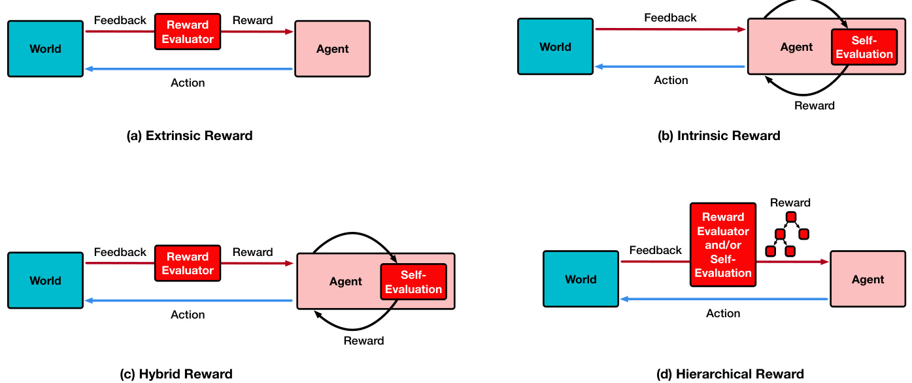

*图5.2：不同类型奖励的示意图。*

### 5.3.2 外在奖励

外在奖励是外部定义的信号，指导代理的行为朝向特定目标。在人工学习系统中，特别是在强化学习中，这些信号充当成功的代理，通过可测量的结果塑造政策。然而，这些奖励的结构和传递方式显著影响学习动态，根据反馈的分布方式，会产生不同的权衡。

密集奖励。密集奖励信号提供高频反馈，通常在每一步或每个动作之后。这种频繁的指导通过允许代理立即将动作与结果联系起来，加速了学习过程。然而，密集反馈有时可能激励短视行为，或过度拟合于易于测量的代理，而非更深层次的一致性。

例如，InstructGPT使用模型输出的人类排名，在微调过程中提供连续的偏好信号，实现高效的行为塑造。类似地，Cringe Loss及其延伸将人类偏好转化为密集训练目标，为每次比较提供即时信号。直接奖励优化（DRO）进一步简化了这一范式，完全避免了成对比较，将每个响应与一个标量分数关联起来，使奖励信号更具可扩展性和成本效益。这些方法展示了密集反馈如何促进细粒度优化，但必须经过精心设计，以避免表面一致性。

稀疏奖励。稀疏奖励是不经常发生的，通常只在重大里程碑或任务完成时触发。虽然它们通常反映了更有意义或更全面的成功标准，但由于延迟的特性，可能会使学分分配变得更加困难，特别是在复杂环境中。

PAFT在解决这一挑战时提供了示例，通过在选择的决策点应用反馈，将监督学习和偏好对齐分离开来。这种稀疏性反映了更全局的成功概念，但增加了优化的负担。类似地，SimPO使用基于对数概率的隐式奖励，而不进行密集比较。这种稀疏性简化了训练流程，但可能限制对微小偏好变化的响应。因此，稀疏奖励系统往往更加健壮，但需要更强的建模假设或更有策略性的探索。

延迟奖励。延迟奖励推迟反馈直到一系列动作之后，要求代理人考虑长期后果。这种设置对于中间步骤可能具有误导性或仅在事后才有意义的任务至关重要。挑战在于将结果归因于先前的决策，这使学习变得复杂，但鼓励规划和抽象。

对比偏好优化（CPO）[384]通过比较翻译集合而不是单独评估每个翻译来训练模型。奖励信号仅在生成多个候选项之后产生，强化迭代中的模式。Nash从人类反馈中学习[385]同样推迟反馈，直到模型通过竞争性比较确定稳定策略。这些方法利用延迟奖励超越表面层优化，更符合长期目标，但以较慢的收敛速度和更复杂的训练动态为代价。

自适应奖励。自适应奖励根据代理的行为或学习进展动态演化。通过调节奖励函数，如增加任务难度或转移奖励目标，这种方法支持持续改进，特别是在非稳态或模糊环境中。然而，这也在奖励设计和评估中引入了额外的复杂性。

自我对弈偏好优化（SPO）[386]根据自我对弈结果调整奖励，利用社会选择理论来汇总偏好并指导学习。这种方法允许系统通过演变内部标准来不断完善自身。f-DPO[373]在此基础上引入了发散约束，通过在训练过程中调整奖励景观。通过动态调整对齐-多样性权衡，这些方法能够在不确定性下实现稳健的偏好建模，尽管需要仔细校准以避免不稳定性或意外偏见。

### 5.3.3 内在奖励

内在奖励作为内部生成的信号，激励代理探索、学习和改进，独立于外部任务特定结果。这些奖励通常被构建为促进泛化、适应性和自主技能获取，这些特质对于在复杂或稀疏奖励环境中的长期表现至关重要。不同的内在奖励范式侧重于在代理中培养不同的行为倾向。

好奇驱动奖励。这种奖励鼓励代理通过寻找新颖或令人惊讶的经验来减少不确定性。关键概念是激励代理探索预测误差显著的新颖状态。在稀疏奖励设置中，这种范式通过在外部指导有限时促进信息获取而表现出色。例如，Pathak等人利用逆动力学模型预测行动结果，创造了一个奖励新奇性的反馈循环。Plan2Explore进一步扩展了这一点，通过整合前向规划来主动瞄准高认知不确定性区域，从而实现对未见环境的更快适应。虽然在发现方面效果显著，好奇驱动方法可能对噪音或具有欺骗性的新奇性敏感，如果没有保护措施的话。

多样性奖励。多样性奖励将焦点从新颖性转移至行为多样性，鼓励代理探索各种策略，而不是过早收敛于次优解决方案。这种方法在多智能体或多模态环境中特别有用，战略多样性增强了稳健性和集体表现。LIR通过为不同代理分配个性化的内在信号，推动它们朝着不同的角色发展，同时保持共享目标，充分展示了这一点。基于多样性的探索促进了更广泛的策略覆盖，但可能需要仔细平衡，以避免破坏协调或目标追求。

基于能力的奖励。基于能力的奖励旨在通过奖励代理任务熟练度的提高来促进学习进展。这种奖励会随着代理变得更有能力而动态调整，从而形成一个支持持续技能习得的自我课程。Skew-Fit通过基于熵的目标采样来促使代理达到多样的状态，同时保持挑战性。CURIOUS通过选择随时间最大化学习进展的目标进一步自动化课程生成。基于能力的方法非常适用于开放式环境，尽管它们通常需要对进展和目标难度进行复杂的估计。

探索奖励。探索奖励直接激励代理与未充分探索的状态或动作进行互动，强调在环境互动中广度优先于深度。与好奇心关注的不确定性不同，探索奖励通常针对相对于代理访问历史的覆盖范围或新颖性。RND通过奖励随机初始化网络的预测误差来体现这一点，推动代理进入不熟悉的状态。这种方法有助于防止过早收敛，并鼓励鲁棒性，尽管如果没有与有意义的学习目标相结合，可能会缺乏重点。

信息增益奖励。信息增益奖励将探索形式化为不确定性减少的过程，引导代理采取能够产生最高期望学习的行动。这种奖励根植于信息理论，在基于模型或需要推理的任务中尤为强大。CoT-Info将此应用于语言模型，通过量化每个推理步骤的知识增益来优化子任务分解。VIME类似地利用贝叶斯推断奖励关于环境动态的信念更新。通过明确地针对信息价值，这些方法提供了基于原则的探索策略，尽管它们通常需要高计算成本并要求准确的不确定性建模。

### 5.3.4 混合奖励

混合奖励框架整合了多个反馈来源，最常见的是内在和外在奖励，以实现更平衡和适应性学习。通过结合内在奖励的探索驱动和外在奖励的目标导向结构，这些系统旨在提高样本效率和泛化能力。在复杂环境或开放式任务中，这种范式特别有益，纯粹依赖任一类型反馈可能不足够。

混合奖励的一个核心优势在于其动态解决勘探与开发之间的折衷。例如，Xiong等人将内在勘探与外在人类反馈结合在RLHF的背景下。他们利用一种反向-KL正则化的上下文臂框架，在优化探索的同时将代理的行为与人类偏好相一致。该方法通过迭代的DPO算法和多步拒绝抽样，将内在和外在奖励整合起来，优化探索和一致性而不损害效率。

### 5.3.5 层次化奖励

层次奖励架构将复杂目标分解为分层子目标，每个子目标都与不同的奖励信号相关联。这种结构反映了许多现实世界任务的分层组织，使代理能够将短期决策与长期规划相协调。通过将较低级别奖励分配给即时行动，将较高级别奖励分配给抽象目标，代理可以学习组合行为，更有效地适应复杂环境。

在语言建模中，基于标记级别的直接偏好优化（TDPO）[405]通过从偏好建模中获得的细粒度标记级别奖励来说明这一原则。使用前向KL散度和Bradley-Terry模型，TDPO同时优化本地选择和全局连贯性，提高与微妙人类偏好的一致性。这里的层次奖励过程不仅仅是一种结构设计，而是一种功能：以协调的方式加强微观决策和宏观结果。

更一般地说，层次奖励可以作为课程学习的支架，代理可以逐渐从更简单的子任务中学习，然后再解决全局目标。在LLM代理中，这可能意味着为子组件（如工具使用、推理链或交互流程）设计奖励结构，每个子组件都有助于更广泛的任务成功。

## 5.4 总结与讨论

### 5.4.1 与其他模块的交互

在智能系统中，奖励信号不仅作为基于结果的反馈，而且作为与核心认知模块（如感知、情感和记忆）进行接口的中央调节器。在基于LLM的代理环境中，这些相互作用变得尤为显著，因为诸如注意力、生成风格和检索记忆等模块可以通过奖励塑造、偏好建模或微调目标直接受到影响。

感知。在LLM代理中，感知通常通过注意机制实现，该机制优先考虑特定的标记、输入或模态。奖励信号可以在训练过程中隐式调节这些注意权重，强化与积极结果相关的模式。例如，在强化微调期间，奖励模型可以增加特定的语言特征权重，如信息量、事实性或礼貌性，导致模型更多地关注与这些特征相一致的标记。这类似于生物感知如何通过与奖励相关的注意调节优先考虑显著刺激。随着时间的推移，代理内化了一种感知策略：不仅仅是“说了什么”，而是“在特定任务背景下值得关注的是什么”。

情感。虽然LLM在生物学意义上不具备情感，但奖励信号可以引导类似情感表达的出现，并调节对话风格。在人类对齐设置中，模型通常会因生成具有共情、礼貌或合作性的回应而获得奖励，从而导致模拟情感敏感性的风格模式。积极的反馈可以强化友好或支持性的语气，而负面反馈则抑制轻蔑或不连贯的行为。这个过程反映了人类情感驱动的行为调节，并允许代理根据用户期望、情感背景或应用领域调整其互动风格。在多轮设置中，奖励调节的风格持久性可以形成连贯的人设或对话情绪。

记忆。LLM代理的记忆涵盖了短期上下文（例如，聊天记录）和长期记忆模块，如检索增强生成（RAG）或叙事性记忆缓冲区。奖励信号塑造了知识如何被编码、重复使用或丢弃。例如，对偏好标记数据的微调可以强化某些推理路径或事实模式，有效地将它们巩固到模型的内部知识表示中。此外，诸如经验重放或自我反思之类的机制——代理评估以学习的奖励估计器为基础的过去输出——使得选择性记忆强化成为可能，类似于生物系统中由多巴胺驱动的记忆巩固【419】。这使得LLM代理能够从先前成功的策略中泛化，并避免重复昂贵的错误。

一般而言，LLM代理中的奖励并非是一种被动的标量信号，而是行为塑造的主动因素。它调节注意力以促进显著特征，引导风格和情感表达以与人类偏好一致，并结构化记忆以优先考虑有用的知识。随着代理向更大的自治性和互动性发展，理解这些跨模块奖励交互将对构建系统至关重要，这些系统不仅智能，而且可解释、可控，并与人类价值观保持一致。

### 5.4.2 挑战与方向

尽管对各种奖励机制进行了广泛研究，但仍存在一些持久性挑战。一个基本问题是奖励稀疏性和延迟。在许多现实场景中，奖励信号往往不经常且延迟，这使得代理很难准确地将其归因于特定的行为。这增加了探索的复杂性并减缓了学习过程的速度。另一个重要挑战是奖励欺骗的潜在可能性。代理在追求最大化奖励时，有时会利用奖励函数中意外的漏洞。这可能导致行为偏离预期的设计目标，特别是在复杂环境中，优化目标不总是与真实任务需求一致的情况下。此外，奖励塑造的过程呈现出微妙的平衡。虽然塑造奖励可以通过引导代理朝向期望的行为加速学习，但过度或设计不当的塑造可能导致局部最优解，将代理困在次优行为中。在某些情况下，甚至可能改变原始任务的基本结构，使代理难以推广到其他情景。许多现实问题本质上是多目标的，需要代理平衡竞争目标。在单一奖励函数框架下，找到这些目标之间的正确权衡仍然是一个悬而未决的问题。理想情况下，可以设计分层奖励机制以指导结构化、逐步学习。然而，有效构建这样的机制仍然是一个挑战。 最后，奖励误设引入了进一步的不确定性并限制了泛化能力。通常，奖励函数并不能完全捕捉真实任务目标，导致代理的学习目标与真实世界的成功之间存在错位。此外，许多奖励函数都是针对特定环境量身定制的，当条件发生变化或任务转移时无法泛化，凸显了需要更健壮奖励模型的必要性。

解决这些挑战需要新颖的方法。一个有前途的方向是从标准示例或基于结果的评估中推导出隐性奖励，有助于缓解奖励稀疏问题。此外，将复杂任务分解为层次结构，并从底层设计奖励，可以提供更系统化的方法，即使在多目标设置中也是如此。此外，利用元学习和元强化学习等技术可以增强奖励模型的适应性，使代理能够在任务之间传递知识，并在不同环境中有效执行。通过探索这些途径，我们可以朝着更可靠和可扩展的奖励机制迈进，更好地与真实世界的目标相一致。

# 6 情感建模 71

6.1 情感的心理基础 71
6.2 在人工智能代理中融入情感 74
6.3 通过人工智能理解人类情感 74
6.4 分析人工智能的情感和个性 74
6.5 操控人工智能的情感反应 75
6.6 总结与讨论 75

## 6.1 情绪的心理基础

情感的心理学和神经科学理论为开发具有情感智能的LLM代理提供了重要框架。这些理论可以分为几种主要方法，每种方法都提供了独特的视角，说明情感的功能以及它们如何在人工智能系统中实现。

分类理论。这些模型认为情感存在为离散的、普遍的类别，具有明显的生理和行为特征。埃克曼的基本情感理论确定了六种基本情感（愤怒、厌恶、恐惧、快乐、悲伤和惊讶），这些情感在各种文化中得到认可，并通过特定的面部表情表达。这种离散方法在情感计算领域产生了重大影响，许多情感分类系统在AI中采用这些标签进行训练。对于LLM代理，分类框架为对用户情感进行分类和生成适当回应提供了清晰的分类法。然而，它们受到批评，因为它们过于简化了人类情感体验的复杂、混合性质，并且可能无法捕捉情感表达中的文化差异。

维度模型。与离散类别不同，维度方法将情绪表示为在由基本维度定义的连续空间中的点。Russell的圆环模型将情绪映射到两个主要维度：价值（愉悦-不愉悦）和唤醒（激活-去激活）。这一框架能够更细致地跟踪情绪状态，它能够区分高唤醒的恐慌和低唤醒的焦虑，尽管两者都具有负价值。PAD（愉悦-唤醒-支配）模型通过添加一个支配维度扩展了这一概念，捕捉了与情绪状态相关的控制或权力感。这些连续表示对需要生成情感分级响应或随时间跟踪用户情感细微变化的LLM系统非常有价值。维度模型允许对生成的内容进行精细的控制，使人类或代理能够沿着连续的尺度调节语气，而不是在离散的情绪状态之间切换。

混合和成分框架。鉴于纯粹的分类或维度方法存在局限性，一些理论融合了两者的特点。普鲁切克的情绪轮[431]将八种主要情绪排列在一个具有强度梯度和维度属性的轮状结构中，允许表示复杂的情绪混合（例如，将爱描述为喜悦和信任的混合）。同时，像谢勒的成分过程模型（CPM）[432]这样的成分模型将情绪概念化为由认知评估、生理激活、行为倾向和主观感受等同步组成部分产生。在人工智能研究中具有特殊影响力的是OCC（奥尔托尼-克洛尔-科林斯）模型[433]，该模型基于事件、代理或对象相对于目标和标准的评估定义了22种情绪类型。这些基于评估的框架已经在通过基于规则的情境评估生成情感响应的对话系统中得到应用[434,435]。对于LLM代理，这些模型提供了计算结构，用于评估文本输入并选择上下文适当的情感响应，从而提高了连贯性和感知到的共情[436, 437]。

神经认知视角。情绪的神经科学为LLM架构提供了额外的见解。达马西奥的体验标记假设强调了通过身体和大脑相互作用实现的情绪如何通过将生理状态与预期结果相关联来引导决策。这种边缘系统与皮层之间的相互作用展示了一个双过程架构：边缘系统中的快速“警报”信号，如杏仁核处理的信号，与皮层中更为缓慢、更深思熟虑的推理一起工作。当代LLM系统已经开始实现类似的架构，其中快速情绪检测模块与更彻底的思维链推理并行工作。最近的证据进一步表明，纹状体中的对手回路通过编码整个概率分布而不仅仅是平均奖励，为在不确定性下受情绪影响的决策制定提供了神经基础。同样，勒杜克对“低路”（快速、自动）和“高路”（较慢、认知）恐惧处理的区分提出了对需要即时安全响应和细致情绪理解的系统的设计模式。明斯基将情绪框架化为“思考方式”，重新组织认知过程的观点影响了EmotionPrompt和Emotion-LLaMA等框架，其中情绪背景动态地重塑了LLM推理。

这些理论框架越来越多地影响着情绪智能LLM代理的发展。分类模型为情绪分类任务提供了明确的标签，而维度嵌入则实现了对生成文本的连续控制。混合方法帮助系统处理混合情绪和情绪强度。基于评估的方法，特别是源自OCC模型的方法，使LLM能够在情境中评估叙述事件或用户陈述，选择适当的情绪响应，促进融洽和信任。神经科学启发的双过程架构将“快速”情绪检测与“缓慢”的深思熟虑推理相结合，使系统能够既快速做出安全响应，又深入理解情绪。虽然当前LLM管道中明确的神经认知机制（如专门的“杏仁核样”途径）仍然很少见，但新兴研究探索了受生物启发的模块，以处理紧急情绪信号，并在长时间交互中保持一致的情绪状态。

情绪是人类智能的关键组成部分，很可能会成为LLM代理的设计考虑中的一个关键组件。一个关键的未来方向是将这些心理学和神经科学理论系统地转化为LLM代理的内部流程。翻译技术可能包括将情绪维度模型（例如，valence/arousal/dominance）作为影响生成的潜在状态，或采用明确的基于规则的评估（OCC）来标记用户消息并塑造代理的后续动作。混合方法提供了一个引人注目的平衡：LLM可以首先识别出一个离散的类别（例如“恐惧”），但也可以评估其强度和控制维度，以进行更细粒度的对话。这种注入情感的架构可能会随着时间产生更连贯的“情绪”，类似于人类如何维持情感状态而不是在每个转折点都重置。与心理学理论明确对齐也增强了可解释性：设计者可以通过将代理的响应与成熟的情感构建进行比较来调试或完善代理的响应，而不是处理不透明的新兴行为。

第二个方向是利用这些理论来改进亲情或支持性互动，通常被称为情感调整。例如，圆形模型或PAD（愉悦度/唤醒度/支配度）跟踪可以帮助LLM检测用户文本中的负面愉悦度和高唤醒度，并做出抚慰性回应（例如，降低唤醒度，提供共情的重新评估）。在心理健康或咨询情境中，一种基于评估的方法可以让代理人验证用户的感受，并从目标不一致或感知责任的角度理解他们的情况，这有助于制定传达真诚同情的回应。将情感输出基于认知理论（例如，如果避免了负面结果，则为“宽慰”，或者当用户帮助系统时为“感激”）同样使互动感觉更加自然和符合道德。这些增强特别重要，因为LLM正在转向真实世界应用，如客户服务、老年护理和辅导，情感敏感性可以改善结果和用户幸福感。通过融入强大的心理和边缘系统见解，开发人员可以设计出不仅推理更有效，而且提供真诚情感支持的LLM代理，弥合计算精度与以人为本关怀之间的鸿沟。

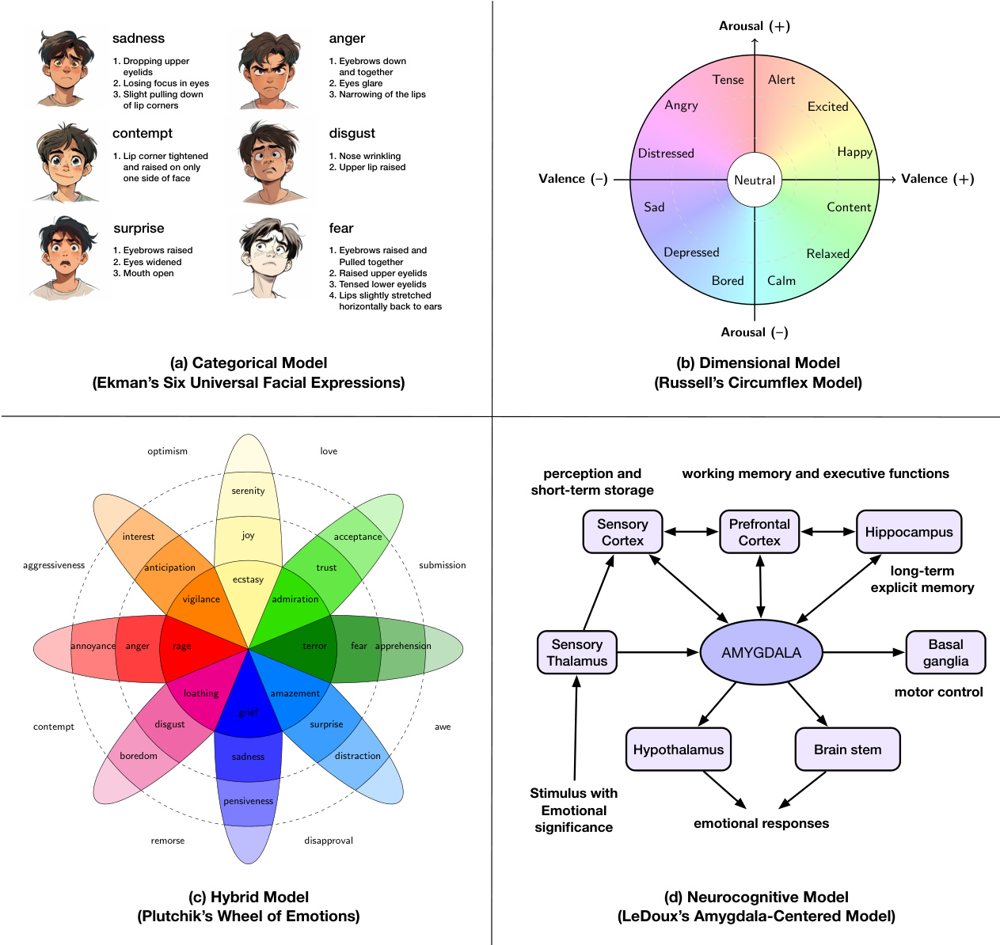

*图61：主要情绪理论类别的可视化和示例。(a) 分类理论：Ekman的六种基本情绪[421]展示了离散的情绪状态。(b) 维度模型：Russell的圆环模型[426]将情绪表示为连续空间中的坐标。(c) 混合/成分框架：Plutchik的情绪轮[431]将强度梯度与分类情绪结合在一起。(d) 神经认知视角：LeDoux的杏仁核中心模型[24]展示了情绪刺激的双通路处理。这些心理基础为人工智能系统中情绪建模的不同方法提供了参考，从离散分类到维度表示、评估为基础的推理，以及多通路信息处理。*

## 6.2 AI代理中融入情感

将情感智能整合到大型语言模型（LLMs）中已经成为增强它们性能和适应性的一种变革性方法。最近的研究，比如EmotionPrompt的研究，突出了通过嵌入在提示中的情感刺激如何显著改善各种任务的结果，包括生成任务指标的显著提高，例如真实性和责任感方面的10.9%。通过影响LLMs的注意机制，情感丰富的提示丰富了表示层，并导致更加细致的输出。这些进展将人工智能与情感智能联系起来，为更好模拟人类认知和决策的训练范式奠定了基础，特别是在需要社交推理和移情的情境中。

多模态方法进一步提升了情感整合的影响。Emotion-LLaMA等模型展示了如何结合音频、视觉和文本数据实现更好的情绪识别和推理。利用诸如MERR的数据集，这些模型将多模态输入对齐到共享表示中，促进了情感理解和生成的改进。这种创新不仅扩展到了语言改进，还在人机交互和自适应学习等应用中发挥作用。总的来说，这些方法强调了情感在技术稳健性与以人为中心的人工智能发展之间的关键作用，为既具有智能又具有移情能力的系统铺平了道路。

## 6.3 通过人工智能理解人类情绪

文本方法。最近的研究突出了LLMs进行关于潜在情感和情绪的详细推理的能力。使用逐步提示策略，例如思维链推理，研究人员使LLMs能够推断情感，即使明确线索不存在[436]。在单轮推理之外，基于谈判的框架通过利用相互交叉评估彼此输出的多个LLMs，进一步细化情感判断，有效地模拟更具审慎性的人类推理过程[437]。这些技术强调了迭代的、上下文感知的策略的重要性，以捕捉纯文本输入中的微妙情感信号。

多模态方法。LLMs还被扩展为整合来自音频、视频和图像的信号。最近的努力展示了如何将额外的上下文或世界知识与视觉和文本信息融合，以捕捉更深层次的情感状态。此外，将语音信号转换为文本提示的框架表明，语音细微差异可以嵌入LLM推理中，而无需改变基础模型架构。这种多模态整合，结合可解释方法，可以实现更丰富和更透明的情感内容表示。

专门化框架。在超越通用技术的基础上，专门化系统解决了情感识别需要更高层次模糊意识、上下文敏感性和生成适应性的任务。这些方法强调人类情感的固有复杂性，将其视为动态和概率性，而非严格的分类。利用灵活的LLM指导范式，它们提供了更好解释模糊情感表达和整合上下文线索（例如，对话历史）的途径，使LLM更接近类人的情感理解。

评估和基准测试。为了全面评估LM的情感智能，研究人员提出了各种基准套件。一些基准关注跨不同模态和社交背景的广义情感识别[446,447]，而其他人则比较不同规模模型的性能和效率[448]。还有一些专门的基准评估多语言能力[449]、注释质量[450]或共情对话系统[451]。此外，诸如EMOBENCH[441]和MEMO-Bench [452]之类的框架测试文本和图像中微妙的情感理解和表达，而MERBench[453]和广泛的评估[454]解决了多模态情感识别中的标准化问题。总的来说，这些基准揭示了LLM对人类情感的认识日益增长但仍不完善的情况，突出了诸如隐含情感检测、文化适应和依赖于上下文的共情等持续挑战[455]。

## 6.4 分析人工智能的情感和个性

大型语言模型（LLMs）在人类中心的人格测试中的可靠性。在通过人类中心的人格测试评估时，大型语言模型（LLMs）显示出矛盾的证据。一方面，一些研究挑战常见指标的有效性，报告诸如“同意偏见”等偏见以及不一致的因素结构，对这些工具是否捕捉到真实特质表示怀疑[456,457]。另一方面，系统性实验显示，LLMs可以展现稳定的、类似人类的特质模式，甚至可以根据特定提示适应不同的人设[458,459]。然而，对于行动一致性、自我认知的一致性以及角色扮演代理是否真正保持忠实于其分配的角色仍然存在疑虑[460,461]。

心理测量方法与认知建模方法。最近的研究应用严格的心理测量测试、认知任务和基于人口的分析，揭示LLM如何处理和表征心理结构[462,463,464]。在人类行为数据上进行微调可以使模型与反映个体认知的决策模式相一致，而基于人口的抽样技术则揭示了神经反应的变异性[465,466]。通过将心理理论与先进的提示和嵌入方法相结合，研究人员阐明了诸如焦虑或冒险行为这样的结构的潜在表征，展示了LLM如何在各种任务中模拟人类推理。

情感建模。基于LM的情感智能研究揭示了解释微妙情感和预测带情感结果的显著能力，通常在标准测试中超越了平均人类基线[423,429]。然而，这些模型并不一定模拟类人的情感过程；它们依赖于高维模式匹配，有时在不断变化的环境、负面输入或矛盾线索下会失败[467,468]。然而，在更大规模的模型中，情感层次结构、应对策略和类似于移情行为的特征可能会出现，突显了情感调整的潜力，以及在创造出看似并且偶尔作为情感代理的AI系统时所面临的伦理挑战。

## 6.5 操控人工智能情感反应

基于提示的方法。最近的研究表明，通过精心设计的提示采用特定角色或人设可以偏向LLM认知，从而实现针对性的情感或个性结果。通过插入“If you were a[persona]”等指令，LLMs不仅调整其主题风格，还调整其潜在的情感立场。这种方法对于实时操纵非常有效，尽管在不同任务和模型变体之间可能不一致，突显了对更系统化方法的需求。

基于训练的方法。微调和参数高效策略提供了更深入、更稳定的方式来诱导或改变LLM的情绪[473, 428, 474]。量化低秩调整（QLoRA）和专门的数据集可以直接将诸如大五人格或MBTI档案等微妙特征嵌入模型学习的权重中。这些方法使LLMs能够自发展现特定特质行为（包括使用表情符号），并在更长的对话中维持他们的情绪状态，同时通过神经元级别的激活模式提供可解释性。

基于神经元的方法。最近的一个进展是隔离出特定于个性的神经元，并直接操纵它们以唤起或抑制情绪特征。通过切换通过心理学基准（例如人格基准）确定的神经元激活，LLMs可以在不重新训练整个网络的情况下具有特定的情绪维度。这种以神经元为中心的方法提供了对模型行为的精细、动态控制，代表了在LLMs中情绪操纵的精确性和效率方面的飞跃。

## 6.6 总结与讨论

情绪操纵和隐私问题。情感人工智能在广告和政治中的迅速采用引发了重大的操纵和隐私风险[476, 477]。情感人工智能通常收集敏感的生物特征数据，如面部表情和语调，推断情绪状态，从而实现定向广告或政治影响。然而，这些系统可能利用人类情绪谋取利润或政治收益，侵犯基本权利，并在公共空间中促进过度监视[478, 477]。《通用数据保护条例》（GDPR）和欧盟人工智能法案等监管框架对于负责任地缓解这些风险至关重要。

对齐问题。情感人工智能（Emotional AI）的能力检测和解释情绪常常与预期结果不一致，导致不准确性和偏见。例如，引发焦虑的提示已被证明会加剧大型语言模型（LLMs）中的偏见，影响医疗保健和教育等高风险领域的输出。AI系统对情绪线索的误解，如在工作场景应用中所见，可能加剧歧视和权力失衡。强化学习从人类反馈中学习（RLHF）等技术已被证明在减轻这些问题方面有效，但需要进一步发展以确保在不同环境中的稳健对齐。

伦理影响。信任和接受AI系统在很大程度上受其展现共情和保持社会适当行为能力的影响[482, 483]。然而，在工作场所管理和客户服务中情感商品化引发了对伦理劳动实践和人工智能-人类关系的担忧[481]。此外，情感人工智能对拟人特征的依赖而缺乏足够的共情能力可能会破坏用户信任[482]。像SafeguardGPT这样融入心理治疗技术的框架展示了促进信任建立和使AI行为与社会规范对齐的有希望的途径[484]。然而，在确保隐私、公平和文化敏感性方面仍然存在挑战[484, 483]。

区分AI情感模仿与人类体验。尽管在LLM代理的情感建模方面取得了进展，但仍存在一个基本区别：这些系统并不像人类那样实际“感受”情绪，而是仅通过概率建模展现类似人类情绪的模式。虽然LM可以令人信服地模拟情感反应、识别情感模式并生成情感输出，但它们缺乏定义人类情绪的具身化、现象学体验。这种模拟与现实之间的差距造成了技术和伦理挑战。用户经常会将展现类似情感行为的AI系统拟人化，这可能导致信任或期望的误解。在研究和部署环境中都需要仔细思考这种区别，因为LLM的被认知情感能力影响人工智能与人类关系、伦理框架和监管方法。未来的工作应在增强LLM情感智能的同时保持透明，让人们了解其作为非感知系统的基本局限性。

# 7知觉 77

## 7.1  人类与人工智能的感知对比

7.2 感知表征的类型 79
7.2.1 单模型 79
7.2.2 跨模型 80
7.2.3 多模型 81
7.3 优化感知系统 83
7.3.1 模型级增强 83
7.3.2 系统级优化 84
7.3.3 外部反馈和控制 84
7.4 感知应用 84
7.5 总结与讨论 85

## 7.1 人类与人工智能感知

感知是智能的基础，是人类和人工智能代理与世界互动的接口。尽管人类通常以五种经典感官——视觉、听觉、味觉、嗅觉和触觉来思考感知，现代神经科学确定了更丰富的感官景观。保守地说，人类被描述为拥有大约10种感官；更全面的观点列出了大约21种，而一些研究人员认为存在多达33种独特的感觉模式。除了熟悉的感官之外，人类还拥有复杂的内部感知，如前庭（平衡）、本体感知（意识到身体位置）、热感知（温度）和痛觉（疼痛），使其能够与环境进行微妙的互动。

人类的感官对特定的物理信号进行了精细调节：例如，人类视觉可以检测波长约为$380{-}780\mathrm{nm}$之间的电磁波，而听觉可以感知大约$20\mathrm{Hz}$到$20\mathrm{kHz}$的声音频率。这些感觉模式使人类能够轻松地参与复杂任务，如语言交流、物体识别、社交互动和空间导航。此外，人类自然而然地感知随时间持续变化，无缝地整合运动感知和时间意识，这些能力对于协调运动和决策至关重要。自然界的动物展示了更加多样化的感知能力。例如，鸟类和某些海洋生物利用磁感知来利用地球的磁场导航，而鲨鱼和电鳗则利用电感知来感知其他生物发出的电信号——这些是人类所不具备的能力。

与生物感知相反，人工智能代理依赖于设计用于将环境刺激转化为算法可以解释的数字信号的工程传感器。人工智能代理的常见传感器类型包括视觉传感器（摄像头）、听觉传感器（麦克风）、触觉传感器和惯性测量单元。人工智能代理通常擅长处理视觉、听觉和文本数据，利用深度学习和信号处理的进展。然而，某些人类感知能力——尤其是味觉和嗅觉——对机器准确模拟仍然具有挑战性。例如，研究人员开发的先进生物启发嗅觉芯片目前可以区分大约24种不同的气味，这一能力明显低于人类嗅觉系统，后者可以区分超过4,000种不同的气味。

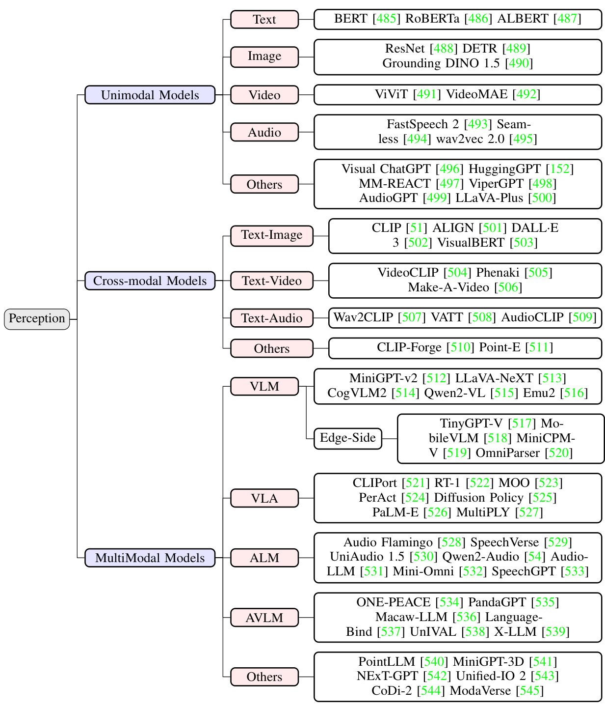

*图7.1：感知系统示意分类*

另一个关键区别在于感知处理效率。人类感知受到生物限制的影响，比如神经传导速度，通常在毫秒级范围内。相反，人工智能系统可以以微秒甚至纳秒的速度处理感觉输入，主要受到计算硬件性能的限制，而不是生物限制。然而，人类感知自然地将来自多种感官模式的信息整合在一起，称为多模感知，轻松地将其融合为连贯的体验。对于人工智能代理来说，实现这种多模态整合需要精心设计的融合算法，明确地将来自不同传感器的输入结合在一起，构建统一的环境表示。

人类和人工智能代理处理时间和空间信息的方式存在进一步差异。人类感知是连续而流畅的，可以无需明确的时间离散化就能顺畅地体验时间流逝和空间运动。相比之下，人工智能代理通常依赖于对传感器数据的离散采样，使用时间戳或顺序处理来模拟连续性。在空间感知方面，人类能够轻松地将视觉、听觉和前庭信息融合在一起，实现直观的空间定位。而对于人工智能代理来说，空间感知通常涉及算法过程，比如同时定位与地图构建（SLAM）或从视觉数据序列中进行三维场景重建。

人类感知系统（如眼睛、耳朵、皮肤等）接收到从外部环境传递过来的物理或化学刺激，并将其转化为神经信号，最终由大脑加工处理以产生对环境的感知。类似地，为了使智能代理能够与环境连接，获取这些感知内容也至关重要。目前，各种传感器主要用于将电信号转换为可处理的数字信号。在本节中，我们根据输入中涉及的感知模态数量以及是否执行统一融合建模操作，区分了单模型、跨模型和多模型。单模型专门处理和分析来自单一模态或输入类型（如文本、图像或音频）的数据，而跨模型通过专用映射机制建立关系并实现不同模态之间的转换，多模型则全面整合和同时处理多个模态，以利用互补信息进行全面理解和决策制定。

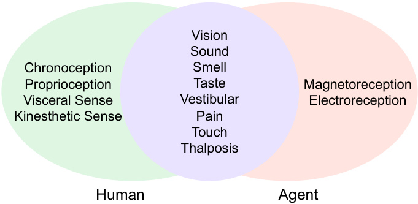

*图7.2：人类和代理之间常见感知类型的比较。*

## 7.2 感知表征类型

### 7.2.1 单峰模型

当人类置身于环境中时，他们可以聆听美妙的音乐，观赏日出和日落，或在舞台上体验精彩的视听盛宴。这些感知内容可以是单一的图像或音频，也可以是多种感知内容的融合。关于智能代理的感知输入类型，我们将从单模态和多模态输入开始，介绍它们的实现和区别。

文本作为重要的交流方式，承载着丰富的信息、思想、情感和文化。人类通过视觉、听觉和触觉间接获取文本内容，这是人类与环境互动的重要方式之一。但对于智能代理，文本可以直接作为连接环境的桥梁，将文本作为直接输入，并输出响应内容。除了字面意义外，文本还包含丰富的语义信息和情感色彩。在早期，使用词袋模型来计算文本内容并广泛应用于文本分类场景，但无法获得语义表达。BERT使用双向Transformer架构进行语言建模，通过大规模无监督预训练捕获文本的深层语义信息。进一步优化了BERT的训练效率。以GPT3.5为代表的自回归模型开启了语言模型的序幕，进一步统一了文本理解和生成任务，而诸如LoRA之类的技术大大降低了LLM的应用成本，提高了代理在复杂现实场景任务中的感知能力。

图像是人类与环境互动的另一种重要方式，固有地编码了空间信息，包括形态特征、空间位置、维度关系和物体的运动特性等关键属性。计算机视觉架构的发展在处理这些空间属性方面取得了重大进展。开创性的ResNet架构奠定了深度视觉特征提取的基本原则，而随后的YOLO系列展示了同时确定对象定位和分类的显著效率。DETR的引入引发了范式转变，通过全局上下文推理实现并行预测，有效消除了与非极大值抑制和锚点生成相关的传统计算开销。最近，DINO 1.5通过架构创新、增强的骨干网络和扩展的训练范式，将这些能力扩展到开放场景，显著改善了开放式检测性能，并推进了人工代理在不受限制的环境中的感知泛化能力。

视频是连续图像帧的表达，包括时间维度，并通过连续图像帧展示随时间变化的动态信息。智能代理使用视频作为输入，并通过连续帧获取更丰富的感知内容。ViViT从视频中提取时空标记，有效地分解了输入的空间和时间维度。VideoMAE通过自监督预训练学习通用视频特征表示，并具有强大的泛化能力，适用于领域外的数据。它为智能代理在新场景中获得感知能力奠定了坚实基础。

除了文本和视觉之外，人类与环境互动的另一重要方式是通过音频。音频不仅包含直接的文本内容，还包含说话者的语调和情感。Wav2Vec2通过量化联合学习的潜在表示来定义对比任务，用1/100标记数据量实现了语音识别的有效性。FastSpeech 2直接引入声音变化信息（音高、能量、持续时间等），并使用真实目标训练模型，实现更逼真的文本转语音转换。Seamless通过流式生成低延迟目标翻译，并使用高效的单调多头注意力机制，同时保持人类语音风格，实现了多源语言到目标语言的同步语音/文本翻译。基于这些手段，智能代理可以实现听和说的能力。

目前，大多数智能代理的研究集中在上述常见感知输入类型上。然而，就像人类有20多种感知方式一样，智能代理也通过其他传感器在实现相应感知能力方面取得了进展。香港科技大学研发的仿生嗅觉芯片整合了纳米管传感器阵列在纳米多孔基板上，每个芯片上有多达10,000个可独立寻址的气体传感器，类似于人类和其他动物嗅觉系统的配置，能够准确区分混合气体和24种不同气味。在味觉方面，同济大学结合荧光和磷光信号开发了具有多模光响应的智能味觉传感器，可以有效识别鲜味、酸味和苦味。为了实现类人感知和抓握能力，纽约大学推出了低成本磁性触觉传感器AnySkin，可以快速组装和更换。甚至在疼痛感知方面，中国科学院利用液态金属颗粒膜的独特电性能在“受伤”（机械划伤）时模拟“伤口”的感知和定位。一些其他作品，包括HuggingGPT，LLaVA-Plus和ViperGPT，在框架内整合这些单模感知能力，根据任务需求选择并应用它们，实现更复杂任务的目标。

### 7.2.2 跨模态模型

文本-图像跨模态模型在近年来取得了显著进展，整合了文本和图像，促进了两种模态之间的改进对齐、检索和生成。这些模型可以根据它们的主要目标进行分类，包括跨模态对齐和检索、文本到图像生成以及图像到文本生成。

跨模态研究的一个主要焦点是文本和图像的对齐和检索。OpenAI于2021年推出的CLIP [51]采用对比学习来对齐文本和视觉表示，实现了零-shot跨模态检索和分类。类似地，Google在同一年开发的ALIGN [501]利用大规模嘈杂网络数据优化文本-图像嵌入对齐。2022年，CyCLIP [562]引入循环一致性损失，进一步增强了跨模态对齐的鲁棒性，提高了检索任务的可靠性。

另一个取得重大进展的主要领域涉及文本到图像生成，其中模型旨在根据文本描述合成高质量图像。OpenAI的DALL-E系列[563, 564, 502]，跨越了从2021年到2023年，在这一领域做出了实质性贡献，其中DALL·E3提供了对生成图像的细粒度语义控制。StabilityAI于2022年推出的Stable Diffusion[565]采用基于扩散的生成方法，支持开放域文本到图像合成和跨模态编辑。

第三个重要的研究方向是图像到文本生成，其中模型旨在根据图像输入生成高质量的文本描述。Salesforce在2022年到2023年间推出的典型代表作品是BLIP[566]和BLIP-2[567]模型，利用轻量级桥接模块增强视觉-语言模型集成，实现诸如图像字幕和问题回答等任务。

文本-视频方面的关键研究涉及视频文本对齐、生成和检索。VideoCLIP[504]采用视频编码器（通常基于时间卷积或变压器结构）从视频帧中提取序列特征。随后，这些特征与语言编码器生成的文本表示进行对齐，促进稳健的视频-文本关联。在文本到视频生成领域，Meta的Make-A-Video模型[06]利用基于扩散的技术扩展了时空维度，从文本描述中实现高质量视频合成。此外，Google的Phenaki[505]解决了生成长、时间连贯视频序列的挑战，通过跨模态学习在视频合成方面取得了显著进展。DeepMind的Frozen in Time[568]采用对比学习进行视频-文本匹配，从而实现高效的跨模态检索。这种方法增强了根据文本查询搜索和检索相关视频片段的能力，进一步提高了视觉和语言理解的整合。

文本-音频跨模态模型在连接文本和音频方面取得了显著进展，改进了相关任务，如模态表示、生成和转换，并增强了单一模态下的感知能力。

2021年推出的AudioCLIP[509]将CLIP框架扩展到音频领域，实现了跨音频、文本和图像的三模态检索。通过将音频作为额外模态，AudioCLIP利用多任务学习将图像、文本和音频表示统一到共享的嵌入空间中。这一进展增强了跨模态检索和交互的能力。类似地，VATT[508]采用统一的基于Transformer的架构，通过独立的编码分支处理视频、音频和文本。这些分支随后融合到共享的多模态空间中，促进了跨模态检索和多任务学习等任务。这种设计使得在各种多模态场景下具有更大的适应性。

对于文本到音频生成，Meta在2023年推出了AudioGen[569]，该模型能够根据文本描述直接合成环境声音和音乐片段等音频。这一模型展示了人工智能在基于语言输入生成高保真音频方面不断增强的能力，扩大了在媒体、娱乐和无障碍领域的应用。

此外，在语音到文本和文本到语音转换领域，微软开发了SpeechT[570]。该模型统一了语音和文本生成，在单一框架内支持语音合成和识别。通过利用这些双重功能的共享架构，SpeechT有助于实现语音和文本处理的无缝集成，从而增强了自动转录、语音助手和辅助工具等应用。

其他情景和领域中，跨模态建模也发挥着重要作用。

CLIP-Forge[510]提出了一种从文本描述生成3D形状的新方法。通过利用对比语言-图像预训练（CLIP）的能力，这种方法能够在自然语言输入的条件下合成高质量的3D物体，弥合了文本和3D几何之间的差距。Point-E[51]扩展了这一概念，通过从文本描述生成3D点云。与传统的3D重建技术不同，Point-E专注于点云表示，促进了高效可扩展的3D内容创建，同时保持对文本提示的高保真度。

在医学影像领域，MoCoCLIP[571]提出了一种增强零样本学习能力的方法。通过将CLIP与动量对比（MoCo）相结合，该方法提高了深度学习模型在医学影像应用中的泛化能力，解决了有限标注数据和领域适应性所带来的挑战。

### 7.2.3 多模态模型

上述跨模态模型主要通过对比学习和其他方法在模态之间进行对齐和映射，以实现信息的互补和转换。此外，多模态模型的工作重点是如何整合多种数据的特征（如视觉、文本、音频等）以提高整体模型的性能。

视觉语言模型（VLM）被广泛定义为可以从图像（或视频）和文本中学习的多模态模型。人类生活在充满多模态信息的世界中。视觉信息（如图像和视频）和语言信息（如文本）经常需要结合起来才能充分表达含义。智能代理也是如此。LLaVA首次尝试使用gpt-4生成多模态语言图像指令数据集。通过端到端训练，获得了一个大型多模态模型，并展示了出色的多模态聊天能力。LLaVA-NeXT利用动态高分辨率和混合数据展示了惊人的零-shot能力，即使在纯英文模态数据中，计算/训练数据成本也比其他方法小0-1000倍。Emu2改变了传统的使用图像标记器将图像转换为离散标记的方式，直接使用图像编码器将图像转换为连续的嵌入，并提供给Transformer，增强了多模态上下文学习能力。MiniGPT-v2在训练过程中为各种任务使用了独特的标识符。这些标识符帮助模型更有效地区分任务指令，增强了模型对每个任务的学习效率。Qwen2-VL、DeepSeek-VL2在视觉组件上使用动态编码策略，旨在处理具有不同分辨率的图像并生成更高效和准确的视觉表示。同时，DeepSeek-VL2还使用了带有多头潜在注意机制的MoE模型，将关键-值缓存压缩为潜在向量以实现高效的推理。

以往的工作主要是利用图像融合文本进行训练。Video-ChatGPT扩展了输入到视频，并直接使用视频自适应视觉编码器与LLM结合进行训练，以捕捉视频数据中的时间动态和帧间一致性关系，从而使关于视频内容的开放式对话以连贯的方式进行。为了解决图像和视频的统一标记化的缺乏，Video-LLaVA将图像和视频编码的视觉表示统一到语言特征空间中，使二者相互加强。类似地，Chat-UniVi采用一组动态视觉标记来整合图像和视频，同时利用多尺度表示，使模型能够把握高级语义概念和低级视觉细节。Youku-mPLUG在特定场景进行了深入研究。基于优酷视频分享平台中高质量的中文视频文本对，增强了对整体和详细视觉语义的理解，并识别场景文本。与之前需要训练的方法不同，SlowFast-LLaVA通过双流SlowFast设计，在不需要额外微调视频数据的情况下有效捕捉视频中的详细空间语义和长期时间上下文，达到了与微调方法相同甚至更好的结果。

随着大型模型参数逐渐减少和端侧计算能力增强，高性能端侧模型正逐渐受到关注。智能终端设备如手机和个人电脑对图像视觉处理有着强烈需求，这对在端侧部署AI模型提出了更高的多模态识别效果和推理性能要求。TinyGPT-V建立在Phi-2小型骨干和BLIP-2的基础上，仅需8G视频内存或CPU进行推理，解决了LLaVA和MiniGPT-4的计算效率问题。MiniCPM-V主要为长且复杂的图像提供强大的OCR能力，并具有较低的错觉率，提供可靠的感知输出。Megrez-3B-Omni通过软硬件协同优化，确保所有结构参数与主流硬件高度兼容，推理速度比同等精度模型快高达300%，提高了其适应不同端侧硬件的能力。

类似地，还有更多与图形用户界面(GUI)相关的工作集中于在手机和个人电脑上自动执行任务。OmniParser利用流行的网页和图标描述数据集进行微调，显著增强了对截屏中图标的检测和功能语义表达能力。GUI课程(GUICourse)和OS-ATLAS也构建了跨平台GUI基础语料库，显著提升了对GUI截图的理解，并丰富了GUI组件的交互知识。

视觉语言行为模型(Vision Language Action Model，VLA)将视觉和语言作为输入，并生成机器人动作作为输出，代表了体现智能领域中的重要研究方向。VLA模型中视觉和语言编码器的选择经历了多样化的发展，从早期的CNNs发展到Transformer架构，并进一步整合了3D视觉和大型语言模型。早期模型如CLIPort使用ResNet处理视觉输入，并结合语言嵌入生成动作，为多模态融合奠定了基础。RT-1引入了Transformer架构，采用EfficientNet作为视觉编码器，采用USE作为语言编码器，并通过FiLM机制融合视觉和语言信息，显著增强了模型的泛化能力。VIMA进一步采用了多模态提示，将ViT视觉编码器和T5语言模型结合起来，支持更复杂的任务。PerAct创新性地将3D点云作为视觉输入，并通过Perceiver IO处理多视角信息，为机器人操作提供更丰富的空间感知。Diffusion Policy结合了ResNet视觉编码器和Transformer语言模型，通过扩散模型生成动作，以提高动作生成的多样性和准确性。SayCan将PaLM语言模型与视觉输入整合，使用CLIP视觉编码器进行任务分解。PaLM-E结合了ViT视觉编码器和PaLM语言模型，通过文本规划指导低层次动作执行。MultiPLY进一步将3D信息整合到LLMs中，将EVA视觉编码器和LLaMA语言模型结合起来，为复杂任务提供更全面的规划能力。

音频语言模型(Audio Language Model，ALM)利用音频和文本构建多模态模型。Speechgpt构建了大规模跨模态语音指令数据集SpeechInstruct，并训练了离散语音表示，实现了超出预期的跨模态语音对话能力。与以往采样离散音频标记来表示输入和输出音频不同，LauraGPT提出了一种结合音频的连续和离散特征的新型数据表示，并通过监督多任务学习在各种音频任务上展现出优异性能。将音频数据转换为嵌入表示，然后微调指令，通过自然语言指令在各种语音处理任务上取得出色表现。为了降低微调训练成本，AudioFlamingo通过基于音频语言模型的上下文学习和检索快速增强适应未见任务的能力。UniAudio 1.5使用文本词汇中的单词或子词作为音频标记，通过少量样本学习这些音频表示，并实现了无需微调的跨模态输出。为了使输出更加逼真符合人类期望，Qwen2-Audio引入了DPO训练方法以实现人类偏好对齐。

音频视觉语言模型（Audio Vision Language Model，AVLM）利用音频、视觉和文本来统一多模态模型。先前，我们介绍了一些利用两种模态信息构建多模态模型的工作。在追求通用人工智能（AGI）的过程中，实现这一目标的障碍在于任务和模态的多样性和异质性。一个合适的方法是在统一框架内支持更多的模态能力。一些闭源工作[586,587]已经在文本、视觉和音频等模态之间取得了出色的能力。ImageBind[588]实现了跨六种不同模态（图像、文本、音频、深度、热像和IMU数据）的联合嵌入。Panda-GPT[535]结合了ImageBind的多模态编码器和Vicuna[589]，展示了除图像和文本外的零样本跨模态性能。类似的工作包括[539,539,536]，通过编码视觉、音频和文本信息实现了对齐和训练。多模态模型通常需要更多的资源进行训练，UniVAL [538]基于任务平衡和多模态课程学习训练了一个仅有约0.25B参数的模型，并使用权重插值来合并多模态模型，在分布外保持泛化能力。NExT-GPT [542]将语言模型连接到多模态适配器和不同的扩散解码器，仅训练了某些投影层的少量参数（1%）。

其他工作[543,590,544,545]已经实现了任意模态之间的输入输出转换。Unified-IO 2[543]是第一个能够理解和生成图像、文本、音频和动作的自回归多模态模型。它将不同的模态输入标记化为共享的语义空间，并使用编码器-解码器模型进行处理。AnyGPT[590]构建了第一个大规模任意到任意多模态指令数据集，使用离散表示来统一处理各种模态输入。Modaverse[545]直接将LLM的输出与生成模型的输入对齐，以解决先前工作严重依赖文本和非文本特征的潜在空间对齐问题，避免了与潜在特征对齐相关的复杂性。CoDi-2[544]在主题为基础的图像生成、视觉转换和音频编辑等任务中胜过了早期的领域特定模型。

人类对二维世界的探索比对三维世界的探索更多，但三维可以更准确地描述物体的形状和纹理信息，并提供更丰富的感知信息。PointLLM使用点云编码器来表达几何和外观特征，并整合语言特征进行复杂点-文本指令的两阶段训练，实现出色的三维物体描述和分类能力。由于三维包含比二维更丰富的信息，它也带来更大的训练成本。在这里降低了训练成本，而MiniGPT-3D利用2D-LLM的二维先验将三维点云与LLM对齐。模态对齐以级联方式进行，查询专家模块混合以高效自适应地聚合特征，实现了小参数更新的高效训练。LLaVA-3D将2D CLIP补丁特征与其在三维空间中的对应位置相连，将3D补丁整合到2D LMM中，并使用联合的二维和三维视觉语言命令调整，实现了收敛速度提升3.5倍。

为了使智能代理能够准确感知和操作未知物体，Meta[592]开发了NeuralFels技术，该技术将视觉和触觉结合起来，不断对3D中的未知物体进行建模，更准确地估计手持操作中物体的姿势和形状，并将对未知物体操作的准确性提高了94%。

## 7.3 优化感知系统

感知误差，包括不准确、误解和“幻觉”（生成虚假信息），对基于LLM的代理的可靠性和有效性构成重大挑战。因此，优化感知需要通过跨模型、系统和外部层面采用各种策略来最小化这些错误。

### 7.3.1 模型层级增强

微调。在特定领域数据上微调预训练的LLMs显著提高了它们准确感知和解释相关信息的能力。例如，对于特定地标进行微调的模型，如LLaVA，已被证明可以提高它们的识别准确性，特别是在城市导航任务中[513,593]。此外，诸如低秩适应（LoRA）之类的技术可以实现更高效的微调，避免模型复杂度的显著增加，同时仍然提高性能[109,594]。一些LLM工作结合传统视觉也被广泛使用。在Llama-Adapter[596]架构的基础上与YOLOS[595]集成显著提高了检测和定位能力。

提示工程。设计有效提示对于确保LLMs生成准确且符合期望目标的输出至关重要。通过提供清晰的指导、上下文信息和特定的格式要求，提示工程可以最大程度地减少误解和幻觉[597]。系统提示定义了代理的角色，历史提示提供了过去互动的上下文，定制提示可确保输出的一致性，已被证明可以显著减少错误[597]。

检索增强生成。通过检索机制将LLMs与外部知识源相结合，有助于将它们的回应基于事实信息，降低幻觉的可能性，提高感知信息的准确性。

### 7.3.2 系统级优化

预期-重新评估机制。在代理面临信息不完整或模糊的情况下，预期-重新评估机制可以增强鲁棒性。例如，在导航任务中，代理可以基于历史数据预期目标方向，并在新信息可用时重新评估推断。

多代理协作。在多代理系统中，代理之间的结构化沟通和协作可以促进信息共享、纠错和共识建立，从而实现对环境的更准确的集体感知。不同的通信拓扑结构，如全连接、集中式和分层结构，在效率和鲁棒性方面提供不同的权衡。InsightSee通过一个包含描述、推理和决策的多代理框架，对视觉信息进行精炼，有效增强了视觉信息处理能力。类似地，HEV整合了多个代理的全局视角信息，并通过合作感知赋予RL代理全局推理能力，从而增强了它们的决策能力。

代理专业化。在多代理系统中为各个个体代理分配不同的角色和能力，可以实现感知分工，使每个代理专注于环境或任务的特定方面。这可以增强感知的整体准确性和效率。

### 7.3.3 外部反馈和控制

LossAgents用于优化。利用LLMs作为LossAgents，在训练过程中允许动态调整损失函数权重[604]。这使得基于复杂、潜在不可微分目标的图像处理模型得以优化，包括来自人类反馈和专门模型评估。这种方法本质上是外部化了优化目标，使LLM能够“感知”并适应复杂标准[605]。

人在环环系统。整合人类反馈和监督可以帮助纠正错误，指导代理的学习过程，并确保与人类价值观和期望保持一致[43]。

内容和输出调解。在向用户呈现LLM输出之前，内容调解会过滤和完善这些输出。这有助于防止意外或有害行为，确保与用户期望和安全准则保持一致[606]。

## 7.4 知觉应用

智能代理的运行效率主要受到三个关键因素的影响：模型架构维度、硬件基础设施规格和量化优化方法。从Bert-Base的110M到GPT-3的1750亿，再到Llama 3的前所未有的4050亿，模型参数的指数级增长导致处理延迟从毫秒级增加到数百毫秒。硬件性能的变化尤为引人注目；通过GPT-3的实证证据表明，与A100相比，NVIDIA H100的标记处理吞吐量提高了50%，而RTX 4090的处理能力大约是其两倍。

当代智能代理已经渗透到各种领域，包括个人辅助系统、游戏环境、机器人流程自动化（RPA）和多媒体内容生成，主要利用视觉感知作为其主要输入方式。在像Minecraft这样的程序生成环境中，STEVE展示了显著的性能提升，通过视觉信息处理实现了科技树进展加速$1.5$倍和方块搜索效率提高$2.5$倍。Steve-Eye通过端到端多模态训练推进了这一范式，通过整合视觉-文本输入处理解决了环境理解延迟的问题。

在创意内容生成领域，AssistEditor展示了复杂的多智能体协作，通过基于风格驱动的内容理解促进专业视频编辑。类似地，Audio-Agent实现了文本/视觉输入与音频输出之间的跨模态集成，实现了全面的音频处理能力。

移动和桌面平台在智能体应用方面取得了显著进展。ExACT在VisualWebArena中建立了新的最先进基准，在带有标题和掩模集成的基于截图的探索性学习中实现了$33.7\%$的成功率。SPA-Bench引入了一个全面的移动评估框架，真实地复制了现实世界的复杂性。M3A通过多模态输入处理在SPA-Bench中表现出色，成功率达到$64.0\%$。AgentStore通过增强视觉和可访问性树处理，显著提高了OsWorld PC基准性能，达到$23.85\%$。

个人AI助手中的语音交互能力[619,586]显著降低了交互摩擦，同时提高了运营效率。在语音交互中整合情感音律已经证明增加了用户参与度和留存率。

在具身智能应用中，触觉和力反馈机制已经成为环境交互中至关重要的模态，增强的感官保真度使操作能力变得越来越精确[620]。

## 7.5 总结与讨论

尽管越来越多的研究作品[543, 590]专注于构建统一的多模态模型，以支持多种感知能力的输入和输出。智能体感知作为自主系统的基石，在有效解释和整合多模态数据方面面临着重大挑战。当前的方法论在表示学习、对齐和融合方面遇到持续问题，这些问题阻碍了健壮且具有泛化能力的感知系统的发展。

其中一个主要问题在于所采用的表示方法，通常未能捕捉到多模态数据的复杂微妙之处。这种不足在需要复杂抽象以保留关键语义信息的高维感官输入场景中尤为明显。此外，表示的对齐也带来额外的困难。将异构数据类型整合到一个连贯的特征空间不仅计算密集，而且容易出现不一致性，这可能导致对模糊信号的错误解读。当尝试融合这些不同的表示时，挑战更加严峻，因为从各个来源合并特征的过程通常会导致集成不佳和关键信息的潜在丢失。

未来的研究方向应优先考虑通过动态神经结构实现自适应表示学习，这些结构能够根据环境背景和任务需求自动调整其结构。这可能涉及元学习参数化或基于图的表示，明确地建模感知实体之间的关系。对于跨模态对齐，利用对比学习原理的自监督时空同步机制显示出在建立密集对应关系方面的潜力，而无需耗费大量标记数据。将因果推断框架整合到对齐过程中[621]，可以进一步增强对抗虚假相关性的鲁棒性。在表示融合方面，具有可学习门控函数的分层注意力机制值得深入探索，以实现对互补模态特征的上下文感知整合。可微分记忆网络中的新技术可能为在较长时间范围内维护和更新融合表示提供新途径。

# 8.1 人类行动系统 86

8.2 从人类行为到主体行为 87
8.3 主体行为系统的范式 88
8.3.1 行为空间范式 88
8.3.2 行为学习范式 91
8.3.3 基于工具的行为范式 93
8.4 行为与感知：“自外而内”还是“自内而外” 95
总结与讨论 97

# 智能体中的自我进化 101

自我演化的优化空间和维度 103
9.1 代理优化概述 103
9.2 提示优化 103
9.2.1 评估函数 104
9.2.2 优化函数 104
9.2.3 评估指标 105
9.3 工作流优化 105
9.3.1 工作流程制定 105
9.3.2 优化工作流边缘 106
9.3.3 优化工作流节点 106

# 9.4 工具优化 107

9.4.1 学习使用工具 107
9.4.2 创造新工具 107
9.4.3 评估工具有效性 108
走向自主代理优化 110

# 10大语言模型作为优化器

## 10.1 优化范式

传统优化方法在对目标函数可访问性的假设上存在差异。我们将它们分为三类，每一类在输入空间的扩展级别上都有所不同：基于梯度的优化，依赖于显式函数梯度；零阶优化，无需梯度信息操作；以及基于LLM的优化，超越了对结构化和高维输入空间的数值函数进行优化。

·基于梯度的优化。这些方法假设可以访问梯度信息，并通过迭代调整参数。诸如随机梯度下降（SGD）和牛顿法等技术被广泛使用，但需要可微性，这限制了它们在离散问题（如提示调整和结构化决策工作流）中的适用性，通常赋予了图结构。
·零阶优化。这些方法通过从函数评估中估计搜索方向来绕过对显式梯度的需求。例如，贝叶斯优化、进化策略和有限差分方法等，当梯度不可用或计算昂贵时，这些方法是有效的。然而，它们仍依赖于明确定义的数值目标和结构化搜索空间，这限制了它们在基于语言的任务中的适用性。
·基于LLM的优化。LLMs通过利用自然语言作为优化域和反馈机制来优化更广泛的解决方案空间。通过结构化推理和类人迭代，LLMs擅长于优化提示、生成自适应工作流，并根据用户反馈逐步改进任务性能。

虽然基于梯度和零阶方法通常应用于数值目标，但它们的核心原则，如迭代细化、搜索启发和自适应学习，也支撑着基于LLM的优化策略。基于这些见解，我们强调了一类快速兴起的基于强化学习的LLM优化，已成为缓慢思考推理模型的支柱。随着这些模型不断发展，我们预计它们将推动下一波主动应用的浪潮，使LLM能够在复杂环境中具有更大的适应性和战略远见。

## 10.2 LLM 优化的迭代方法

一些基于LLM的优化方法直接从经典优化理论中汲取灵感，通过调整关键组件来解决离散和结构化挑战。这些方法的一个核心特征是迭代更新步骤，在这一步骤中，从各种可能的改进中选择模型生成的修改，以完善目标。以方程（9.1）中的提示优化目标作为运行示例，一个通用的迭代

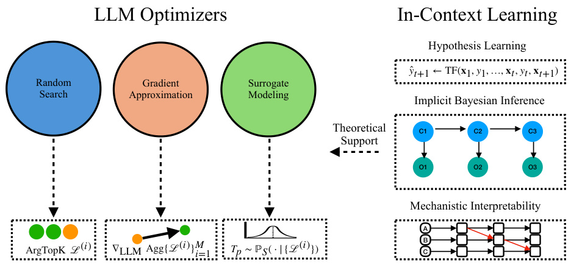

*图10.1：基于LLM的优化方法分类法，分为随机搜索、梯度逼近和代理建模。我们还强调了一些关于上下文学习的理论解释，其中包括假设学习、隐式贝叶斯推断和机械性可解释性，这些理论支撑了LLM的优化能力。*

算法可以表达如下：

抽样：$T\sim\mathcal{D}$ 评估：$\ensuremath{\mathcal{L}}(T;T_{p})\gets\phi_{\mathrm{eval}}(\phi_{\mathrm{exe}}(Q,T_{p}),T)$ 更新：$T_{p}^{\prime}\gets\phi_{\mathrm{opt}}\left(\mathcal{L}(T;T_{p})\right)$

这里，抽样和更新步骤是基于agent的任务定义的。在最简单的情况下，比如优化电影评论的二元分类指令，目标函数$\mathcal{L}$ 通过分类准确度来衡量。在更复杂的agent工作流程中，决策变量可能包括不同工作流程阶段的提示、工具选择、agent拓扑结构，或者二者的组合。正如第9章所讨论的，这些决策变量的一个共同特征是它们的组合特性，比如来自LLM词汇$\nu$的所有字符串集合或者工作流程中agent的所有可能角色分配。由于枚举所有可能解通常是不可行的，这就需要设计近似的更新步骤$\phi_{\mathrm{opt}}$，接下来我们将讨论这一点。

· 随机搜索。早期基于LLM的优化方法利用随机搜索变体来优化离散自然语言空间中的提示[774,807,651,732,808,809,810]。这些方法通常类似于进化算法，通过迭代地抽样候选决策变量，并从每次迭代中选择表现最佳的候选解。一般的表达式如下：

抽样：$T\sim\mathcal{D}$ 评估：$\mathcal{L}^{(i)}\gets\phi_{\mathrm{eval}}(\phi_{\mathrm{exe}}(Q,T_{p}^{(i)}),T),\quad i=1,\ldots,M$ 更新：$\{T_{p}^{(k)\prime}\}_{k=1}^{K}\leftarrow\mathrm{ArgTopK}_{i\in[M]}\mathcal{L}^{(i)},$ 补充（可选）：$\{T_{p}^{(j)}\}_{j=K+1}^{M}\sim\mathrm{Mutate}(\{T_{p}^{(k)}\}_{k=1}^{K}).$

我们简要修改之前的符号，令$M$表示每次迭代中抽样的候选提示总数，$K$（其中$K<M$）控制通过ArgTopK在我们的算法中选择的表现最佳候选数量，保留到下一步。该算法可以选择性地包括一个补充步骤，以在迭代过程中保持候选集的多样性。随机搜索方法易于实现，高度可并行化，并且特别适用于单提示工作流程。除了提示优化，它们还在选择上下文演示中表现出色。然而，它们的效率是有代价的——每次迭代需要$O(M)$个并行API查询，这对于涉及多个查询的复杂工作流程可能会变得昂贵。

· 梯度逼近。几种方法通过迭代地改进解来近似基于梯度的更新。例如，[779,730,728]在不同的工作流程阶段生成改进。StraGO[722]利用中心差异启发式方法估计下降方向，而Trace[813]通过将其建模为计算图来优化组合程序，类似于反向传播。连续优化中梯度更新和提示空间改进之间的关键类比是“下降方向”的概念，即系统性修改决策变量以改善目标。相比之下，随机搜索方法在每一步独立提出新的决策变量，而不访问过去的更新轨迹。相反，基于梯度的方法利用这些历史信息，通常导致更快的收敛。梯度逼近方法的一般迭代如下所示：

$$ 
\begin{array}{r}{\mathbf{Sample:}T^{(i)}\sim\mathcal{D},\quad i=1,\dots,M\qquad}\\ {\mathbf{Evaluation:}\mathcal{L}^{(i)}\leftarrow\phi_{\mathrm{eval}}(\phi_{\mathrm{exe}}(Q,T_{p}),T^{(i)}),\quad i=1,\dots,M}\\ {\mathbf{Gradient\Approximation:}g\leftarrow\nabla_{\mathrm{LLM}}\mathbf{Agg}\left(\mathcal{L}^{(1)},\dots,\mathcal{L}^{(M)}\right)}\\ {\mathbf{Update:}T_{p}^{\prime}\leftarrow\phi_{\mathrm{opt}}(T_{p},g),\qquad}\end{array}
 $$

这里，$M$ 是小批量大小，$\operatorname{Agg}({\mathord{\cdot}})$ 是一个聚合函数，用于结合反馈信号（例如，在数值优化中，Agg 通常是平均算子），$\nabla_{\mathrm{LLM}}$ 表示一个抽象的“LLM-梯度算子”[728]，它基于反馈信号和当前小批量生成文本细化方向（例如，代理应考虑边缘情况...）。此外，$\phi_{\mathrm{opt}}$ 可以被实例化为一个LLM查询，使代理能够根据 $g$ 更新其提示。

相对于随机搜索方法，基于梯度的方法具有两个关键优势：它们能够将过去的细化方向纳入 $\phi_{\mathrm{opt}}$ 中，类似于一阶优化算法中的动量技术[814,815]，并且它们促进类似反向传播的技术来优化计算图[651,813,780]，使它们特别适用于具有相互依赖的可优化模块的多阶段工作流程。然而，这种灵活性是以增加设计开销为代价的，例如需要元提示来聚合反馈并应用细化方向。我们将在下文进一步讨论使用LLMs来优化这些超参数的可行性。一些方法还探讨了直接基于梯度优化软提示[816,817,818]。虽然对于简单的输入-输出序列学习有效，但这些方法在多步工作流程和顺序决策方面存在困难[630, 300]。

最后，尽管这些方法利用了一阶优化的见解，但将二阶技术（例如拟牛顿方法）扩展到基于LLM的优化仍然是一个相对未被探索的领域。幸运的是，最近的一些工作，如Revolve，已经朝着这个方向迈出了一步，通过引入结构化方法进行二阶优化，对多次迭代中响应模式的演化进行建模。通过整合更高阶的细化，Revolve实现了更稳定和明智的优化，有效地缓解了复杂任务中的停滞现象。我们也对利用推断时计算来整合历史细化方向并探讨动量的好处的新趋势感到兴奋。

·贝叶斯优化和代理模型。虽然前述方法在基于LLM的优化中取得了显著进展，但由于所需LLM交互次数较高，通常会带来相当大的财务和环境成本。此外，这些方法对噪声敏感，而离散提示的优化景观，以及其他决策变量，仍然知之甚少。在这些限制条件下，贝叶斯优化（BO）作为一个引人注目的替代方案出现，因为它构建了一个抗噪声的优化目标的代理模型：

样本：T \~ D 提议：$\{T_{p}^{(i)}\}_{i=1}^{M}\sim S$ 提议评估：$\mathcal{L}^{(i)}\gets\phi_{\mathrm{eval}}(\phi_{\mathrm{exe}}(Q,T_{p}^{(i)}),T),\quad i=1,\hdots,M$ 更新：$S\gets S.\mathrm{UpdatePrior}(\{\mathcal{L}^{(i)}\}_{i=1}^{M},\{T_{p}^{(i)}\}_{i=1}^{M}),$ 其中$S$表示优化目标的概率代理模型，配备有一个提议操作符（例如，从高斯过程BO过程中后验采样[803]）和一个基于提示评估观察证据的更新机制。例如，MIPRO[821]采用树结构帕森估计器作为其代理[822]，而PROMST[823]训练一个分数预测模型来指导提示调整。利用代理模型进行基于LLM的优化符合非可微目标的摊销优化的新兴趋势[824]。例如，[825]训练一个提示生成器LLM来摊销实例化用于发现越狱攻击前缀的波束搜索问题的计算成本。

最后，还有一些工作将额外的轻量级模块（例如贝叶斯信念后验或效用函数）与LLM输出相结合，以帮助优化特定领域工作流程，如决策制定和多智能体协商。这种摊销方法，即适应参数化模型以便用于未知输入的方法，在基于LLM的优化中越来越常见，例如越狱攻击。

## 10.3 优化超参数

类似于传统优化，基于LLM的方法对影响搜索效率和泛化的超参数非常敏感。在基于梯度的LLM优化器中，一个关键考虑因素是聚合函数 $\operatorname{Agg}({\mathord{\cdot}})$ 的选择，该函数决定了如何综合文本反馈以指导提示更新。选择不当可能导致关键信息的丢失或在迭代改进中出现不对齐。此外，引入了一种“白板”方法，其中LLM程序被分解为人类可解释的模块。然而，在构建这种模块化工作流程方面的设计选择仍然很少被探讨，这对优化LLM驱动的决策流程构成了一个开放性挑战。

LLM 优化中的超参数通常与数值优化中的超参数相似。例如，批量大小起着至关重要的作用：就像小批量更新在经典优化中增强了稳定性和效率一样，基于LLM的方法（如TextGrad）在进行更新之前会在多个生成的样本中聚合反馈信息。另一个关键因素是动量-它通过结合过去的梯度来稳定梯度方法中的更新，在LLM优化器中同样利用历史的改进来随时间提高性能。尽管在数值优化方面取得了进展，针对基于LLM的优化器的超参数选择仍然主要是启发式的，通常依赖于临时的试错调整。

在代理系统设计中，超参数在各个组件中广泛存在，包括代理的角色分配、上下文演示的选择以及工具调用的调度。这些选择对下游性能产生深远影响，然而，针对它们的优化方法仍未得到系统发展。虽然传统的超参数调整技术，如网格搜索和贝叶斯优化，可以应用于离散的基于LLM的工作流程，但由于语言模型输出的高方差，它们的计算成本呈现不良的扩展性。此外，这些超参数的组合性质，即代理配置、提示策略和推理结构以复杂方式相互作用，使得穷举搜索变得不可行。最近的研究尝试通过将代理工作流嵌入到结构化框架中，如有限状态机、最优决策理论和博弈论，来解决这一挑战。然而，这些方法通常难以在不同环境中推广。解决这些挑战的一个有前途的方向是元优化，其中LLM被用于优化其自身的超参数和决策策略。例如，基于LLM的优化器可以通过将过去的决策视为经验来迭代地优化其提示策略，类似于深度学习中的学习优化器。此外，摊销方法训练辅助模型来预测有效的超参数，可以降低穷举搜索的计算成本。虽然这些技术提供了令人兴奋的可能性，但也引入了新的挑战，比如在自适应调整中平衡探索与利用，并确保在各种优化任务中实现泛化。研究针对LLM驱动工作流程量身定制的有原则的元优化策略，仍然是未来研究的一个关键领域。

## 10.4 深度和时间跨度优化

与在静态环境中更新参数的传统优化器不同，LLMs在考虑深度（单次工作流）和时间（循环更新）时动态优化工作流程。在深度方面，LLMs的功能类似于前馈网络，按顺序优化工作流程，通过不同模块时进行优化，大多数现有基于LLMs的优化器都遵循这种范例。除了单次执行，LLMs还可以随时间进行优化，类似于循环架构，如RNN或Universal Transformers，通过迭代地改进决策制定。例如，StateFlow通过跨多次迭代结合反馈来增强工作流程，实现随时间的动态改进和适应。虽然这些类比令人信服，但许多成熟的工程优化技术，如检查点和截断反向传播，在基于LLMs的优化中仍未得到充分探讨。我们认为这是未来研究的一个有前途的方向，呼应先前对更深入研究的呼吁。

## 10.5 理论视角

最近的研究表明，变压器本质上执行类似优化的计算，支持它们作为计算工作流通用优化器的潜力。然而，在它们的经验成功和理论理解之间存在重大差距。在这里，我们简要概述了最近在弥合这一差距方面取得的进展。

·上下文学习。将变压器视为优化器的一个基本视角源自于上下文学习，特别是在少样本设置中。研究表明，变压器可以在上下文中学习多样的回归假设，包括正则化线性模型、决策树和浅层神经网络。后续研究证明了变压器可以实现迭代优化算法，如梯度下降和二阶更新。然而，尽管这些理论模型表征了变压器的优化能力，它们并未完全解释大规模LLMs中的上下文学习，后者在离散的输入-输出空间中运行。相反，经验分析试图理解预训练LLMs在上下文中的泛化。提出上下文学习类似于执行隐马尔可夫模型（HMM）进行隐式贝叶斯推断，而挑战传统观点认为上下文演示为假设形成提供了新的测试样本。上下文学习仍然是使自我改进和优化从上下文中产生的核心新能力，然而它仍然难以进行全面的理论分析。
·机制可解释性。与理论分析相对应，机制可解释性旨在通过识别负责特定行为的子图，也称为电路，揭示内部变压器计算。早期研究在预训练的GPT-2模型中为艺术语言任务映射了电路，而最近的工作通过使用稀疏自动编码器识别语义上有意义的特征进行了扩展。这些方法在从事前沿级LLMs中引出因果和可控行为方面取得了很大成功，但它们也揭示了一个意外后果：在很多样本演示的条件下，上下文学习能力常常将有益的泛化与有害行为纠缠在一起。这给安全可靠地优化LLM工作流程带来了挑战。
·不确定性下的局限性。尽管LLMs在提供上下文信息时在顺序决策方面表现出中等能力，但它们在不确定性下做出最优选择时会遇到困难。特别是发现，基于LLMs的优化器在适应随机环境时存在困难，通常无法进行最佳探索。这些发现为在探索和稳健决策至关重要的动态或不确定环境中部署基于LLMs的优化器提出了警示。LLMs通过整合结构化推理、自然语言处理和上下文学习重新定义了优化。

超越传统的数值方法。尽管在结构化搜索空间中表现出强大的实证性能，但关于基于LLM的优化的理论基础仍存在一些未解之谜，特别是从标准梯度训练中出现上下文学习的问题。

# 111

10.1 优化范式 111
10.2 LLM优化的迭代方法 111
10.3 优化超参数 114
10.4 跨深度和时间的优化 114
10.5 理论视角 115

# 在线和离线代理自我改进 116

11.1 在线代理自我完善 116
11.2 离线代理自我完善 117
11.3 在线和离线改进的比较 118
11.4 混合方法 118

# 12 科学发现与智能演化 120

## 12.1 代理人智能用于科学知识发现 120

12.1.1 基于KL散度的智能度量 120
12.1.2 智能增长的统计性质 122
12.1.3 智能演化策略 123
12.2 代理-知识交互 123
12.2.1 假设生成与测试 124
12.2.2 协议规划与工具创新 126
12.2.3 数据分析与推论推导 126
技术准备和挑战 127
12.3.1 现实世界交互挑战 127
12.3.2 复杂推理挑战 128
12.3.3 整合先前知识的挑战 129

## 12.1 代理人智能在科学知识发现中的应用

传统上被定义为合理真实信念的知识可以追溯到柏拉图[860]，并由埃德蒙·盖特尔[861]进一步完善，他认为知识必须由可靠的认知过程产生，尽管其确切定义仍然存在争议[862]。在我们的讨论中，我们将科学知识发现描述为收集数据和信息的过程，以证明或证伪关于目标科学问题的理性假设。为了讨论智能体在科学知识发现中的能力，我们首先通过信息论的视角探讨衡量智能体智能的一般框架。

### 12.1.1 基于KL散度的智能度量

智能代理的智能可以通过其对未知信息的预测和现实世界概率分布之间的KL散度来衡量。人工智能和科学哲学中长期以来的一个目标是形式化代理“理解”世界的含义。从Jaynes将概率论视为在不确定性下推理的扩展逻辑[863]，到Parret al.将智能框架化为在自由能原则下最小化模型-世界差异[864]，许多框架都聚焦于一个共同主题：智能行为源于对不确定世界进行准确预测。例如，Clark[344]认为智能代理通过预测和误差校正不断与世界互动以减少惊奇。Cholet[865]强调智能应反映技能习得效率，因为任务适应具有动态性质。总的来说，这些观点表明智能涉及建立预测性和可适应性模型——这里通过一个概率框架形式化，将推理与知识获取联系起来，并促进在科学发现中跨代理的比较。

在这个基础上，我们考虑智能在科学知识发现特定背景下的表现，其中代理的主要目标是从有限数据中推断物理世界的未知方面。从知识发现的角度看，世界 $\boldsymbol{\mathcal{W}}$ 被描述为与代理旨在理解的科学问题相关的数据集合 $\mathbf{x}=\{x_{1},x_{2},...,x_{n}\}$ 。在代理与 $\mathcal{W}$ 的互动过程中，每个数据集以概率 $P_{\mathcal{W}}(\mathbf{x})$ 出现在实验测量或观察中。在这里，我们假设个别数据点 $x_{i}$ 可能相关也可能不相关。例如，在使用语言模型生成文本的任务中，$x_{i}$ 代表形成有意义命题的一组标记，而 $\mathbf{x}$ 是由已知和推断的命题构成的连贯文本。在这种情境下，“世界”是所有命题的集合。

设 $\theta$ 表示参数，该参数对应代理的世界模型 $M_{t}^{\mathrm{wm}}$，如表1.2所定义。例如，在具有固定架构的Transformer模型中，$\theta$ 代表其权重。给定 $\theta$ 和数据集 $\mathbf{x}$，代理预测一个概率分布 $P_{\theta}(\mathbf{x})$。一般来说，不同的人工智能代理可能针对不同的目标进行优化。对于科学知识发现，我们假设代理的目标是产生对真实世界的良好描述，即一个能够尽可能准确预测尚未探索的自然现象的世界模型。一个更智能的代理会产生对真实世界分布 $P_{\mathcal{W}}(\mathbf{x})$ 更好的近似。因此，代理的智能可以通过这两个概率分布之间的KL散度或相对熵来衡量：

$$ 
D_{0}(\theta)=\sum_{{\bf x}\subseteq\mathcal{W}}P_{\mathcal{W}}({\bf x})\log\frac{P_{\mathcal{W}}({\bf x})}{P_{\theta}({\bf x})}
 $$

$D_{0}(\theta)$描述了$P_{\mathcal{W}}(\mathbf{x})$和$P_{\theta}(\mathbf{x})$之间的差异。更准确地说，在假设检验的背景下，如果我们从$P_{\mathcal{W}}(\mathbf{x})$中抽样$N$次，并将结果与$P_{\theta}(\mathbf{x})$的预测进行比较，将$P_{\mathcal{W}}(\mathbf{x})$误认为$P_{\theta}(\mathbf{x})$的概率按$e^{-N D_{0}(\theta)}$进行缩放。换句话说，具有较低$D_{0}(\theta)$的代理会产生更接近现实的预测。

例如，考虑两个材料合成代理，它们的目标是了解感兴趣的无机化合物$\mathrm{CaFe_{2}(PO_{4})_{2}O}$是否可合成。这些代理可以预测(1)${\bf x}_{1}=\{\mathrm{CaFe_{2}(PO_{4})_{2}O}$可合成)，以及(2)$\scriptstyle\mathbf{x}_{2}=\{\mathbf{CaFe}_{2}(\mathbf{PO}_{4})_{2}\mathbf{O}$不可合成)。实际上，由于$\mathrm{CaFe_{2}(PO_{4})_{2}O}$是一种天然矿物，$\dot{P}_{\mathcal{W}}(\mathbf{x}_{1})=1$且$P_{\mathcal{W}}(\mathbf{x}_{2})=0$。然而，这种矿物直到2023年10月4日才被报道[参考文献]，在许多LLM的知识截止日期之后；因此，这些代理缺乏这方面的知识。比较起随机猜测的代理1，$P_{\theta_{1}}(\mathbf{x}_{1})=\bar{\alpha}=P_{\theta_{1}}(\mathbf{x}_{1})=0.5$，从而得到$D_{0}(\theta_{1})=\log2$。相比之下，代理2使用第一性原理计算，并发现$\mathrm{CaFe_{2}(PO_{4})_{2}O}$（假设结构为xx [引用：Materials Project ID]）是其竞争对手中能量最低的相[参考]，表明其稳定性。因此，代理2预测$\mathrm{CaFe_{2}(PO_{4})_{2}O}$可能可合成，暗示$P_{\theta_{2}}(\bar{\mathbf{x}}_{1})>0.5>P_{\theta_{2}}(\mathbf{x}_{2})$。因此，$\dot{D}_{0}(\dot{\theta}_{2})=-\log P_{\theta_{2}}(\mathbf{x}_{1})<D_{0}(\theta_{1})$，这意味着代理2对真实世界有着更准确的理解。

现在，让我们假设代理已经进行了一些测量，并确定了一些数据点$x_{i}$的具体数值。设$\mathbf{x}_{\mathrm{K}}$表示这些已知数据点的子集，$\mathbf{x}_{\mathrm{U}}$表示其余未知部分。相应地，我们定义所有已知知识的空间为$\kappa$，所有未知信息的空间为$\mathcal{U}$，满足$\mathbf{x}_{\mathrm{K}}\subseteq{\mathcal{K}}$，$\mathbf{x}_{\mathrm{U}}\subseteq\mathcal{U}$，以及$\kappa\cup\mathcal{U}=\mathcal{W}$。例如，在文本生成中，提示文本$\mathbf{x}_{\mathrm{K}}$代表已知信息。然后，语言模型的效率通过其基于$\mathbf{x}_{\mathrm{K}}$生成文本$\mathbf{x}_{\mathrm{U}}$的预测准确性来衡量。更一般地，代理的智能性可通过条件概率分布的相对熵来衡量：

$$ 
D_{\mathrm{K}}(\boldsymbol{\theta},{\bf x}_{\mathrm{K}})=\sum_{{\bf x}\subseteq\mathcal{U}}P_{\mathcal{W}}\left({\bf x}|{\bf x}_{\mathrm{K}}\right)\log\frac{P_{\mathcal{W}}\left({\bf x}|{\bf x}_{\mathrm{K}}\right)}{P_{\boldsymbol{\theta}}\left({\bf x}|{\bf x}_{\mathrm{K}}\right)}
 $$

在实践中，代理的所有知识都存储在其记忆$M_{t}^{\mathrm{mem}}$中，即$\mathbf{x}_{\mathrm{K}}={\boldsymbol{K}}=M_{t}^{\mathrm{mem}}$，$\mathcal{U}=\mathcal{W}\setminus M_{t}^{\mathrm{mem}}$，我们将代理的智能定义为：

$$ 
I Q_{t}^{\mathrm{agent}}\equiv-D_{\mathrm{K}}(\theta,M_{t}^{\mathrm{mem}})=-\sum_{\mathbf{x}\subseteq\mathcal{U}}P_{\mathcal{W}}(\mathbf{x}|M_{t}^{\mathrm{mem}})\log\frac{P_{\mathcal{W}}(\mathbf{x}|M_{t}^{\mathrm{mem}})}{P_{\theta}(\mathbf{x}|M_{t}^{\mathrm{mem}})}
 $$

换句话说，代理的智能$I Q_{t}^{\mathrm{agent}}$取决于其记忆$M_{t}^{\mathrm{mem}}$和其世界模型$M_{t}^{\mathrm{wm}}$的参数$\theta$。如图12.1所示的示意图。在$t=0$时，当$M_{t}^{\mathrm{mem}}$非常有限或缺乏与新目标科学问题相关的信息时，$I Q_{t}^{\mathrm{agent}}$主要由$M_{t}^{\mathrm{wm}}$的零样本预测能力决定，对应于流体智力。随着时间的推移，随着更多相关知识被纳入$M_{t}^{\mathrm{mem}}$，$I Q_{t}^{\mathrm{agent}}$越来越依赖于$M_{t}^{\mathrm{wm}}$的知识增强预测能力，反映出结晶智力。

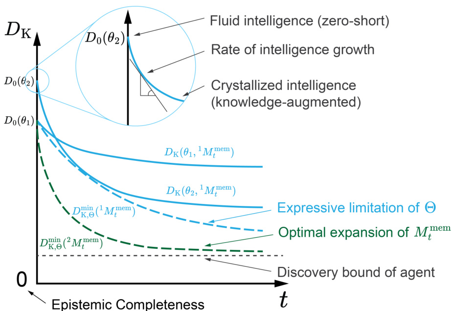

*图12.1: 代理智能和知识发现的示意图。代理的智能，通过预测和真实世界概率分布之间的KL散度$D_{\mathrm{K}}$来衡量，在时间$t$内随着数据在其记忆$M_{t}^{\mathrm{mem}}$中的积累，从流体智能（对新问题的零猜测预测）逐渐演变为晶体智能（学习后知识增强的预测）。在给定$M_{t}^{\mathrm{mem}}$的情况下，$D_{\mathrm{K}}$在世界模型参数空间$\Theta$内的演变因$\Theta$的不同取值而异，如实线所示的$\theta_{1}$和$\theta_{2}$。参数空间$\Theta$的表达限制由$D_{\mathrm{K,\Theta}}^{\mathrm{min}}$来描述。在给定$\Theta$的情况下，$D_{\mathrm{K,\Theta}}^{\mathrm{min}}$受到不同知识扩展策略的影响，例如$^1M_{t}^{\mathrm{mem}}$和$^{2}M_{t}^{\mathrm{mem}}$，如虚线所示。*

### 12.1.2 智力增长的统计特性

智能代理的智能在统计意义上是随着获取知识而不减的函数。粗略地说，$I Q_{t}^{\mathrm{agent}}$ 量化了代理获取的知识量以及代理从$M_{t}^{\mathrm{mem}}$中学习后能有效应用该知识的能力。直观地，如果代理在时间$t$获得额外信息，对应于扩大$M_{t}^{\mathrm{mem}}$并缩小$\mathcal{U}$，其智能应该增加。

为了理解这一过程，考虑一个小区域$\Delta\subseteq{\mathcal{U}}$，并研究将来自$\Delta$的数据集$\mathbf{x}_{\Delta}$添加到$M_{t}^{\mathrm{mem}}$的效果。记$\mathcal{U}=\mathcal{U}^{\prime}\cup\Delta$，其中$\mathcal{U}^{\prime}$表示世界的剩余未知部分。时间$t+1$时代理的智能由以下公式给出：

$$ 
I Q_{t+1}^{\mathrm{agent}}\equiv-D_{\mathrm{K}}(\theta,M_{t}^{\mathrm{mem}}\mathbf{x}_{\Delta})=-\sum_{\mathbf{x}^{\prime}\subseteq\boldsymbol{U}^{\prime}}P_{\mathcal{W}}(\mathbf{x}^{\prime}|M_{t}^{\mathrm{mem}}\mathbf{x}_{\Delta})\log\frac{P_{\mathcal{W}}(\mathbf{x}^{\prime}|M_{t}^{\mathrm{mem}}\mathbf{x}_{\Delta})}{P_{\theta}(\mathbf{x}^{\prime}|M_{t}^{\mathrm{mem}}\mathbf{x}_{\Delta})}
 $$

直接比较$I Q_{t}^{\mathrm{agent}}$和$I Q_{t+1}^{\mathrm{agent}}$是具有挑战性的，因为$I Q_{t+1}^{\mathrm{agent}}$通过对$\mathbf{x}_{\Delta}$进行概率$P_{\mathcal{W}}(\mathbf{x}_{\Delta}|M_{t}^{\mathrm{mem}})$的平均化。这个期望代表了在给定$M_{t}^{\mathrm{mem}}$中的先前知识的情况下，通过测量$\Delta$所获得的平均知识量。我们得到：

$$ 
\begin{array}{r}{\displaystyle\sum_{\mathbf{x}\subseteq\Delta}P_{\mathcal{W}}(\mathbf{x}|M_{t}^{\mathrm{mem}})I Q_{t+1}^{\mathrm{agent}}=-\sum_{\mathbf{x}^{\prime}\subseteq\mathcal{U}^{\prime},\mathbf{x}\subseteq\Delta}P_{\mathcal{W}}(\mathbf{x}^{\prime}\mathbf{x}|M_{t}^{\mathrm{mem}})\log\frac{P_{\mathcal{W}}(\mathbf{x}^{\prime}|M_{t}^{\mathrm{mem}}\mathbf{x})}{P_{\theta}(\mathbf{x}^{\prime}|M_{t}^{\mathrm{mem}}\mathbf{x})}}\\ {=I Q_{t}^{\mathrm{agent}}+\displaystyle\sum_{\mathbf{x}\subseteq\Delta}P_{\mathcal{W}}(\mathbf{x}|M_{t}^{\mathrm{mem}})\log\frac{P_{\mathcal{W}}(\mathbf{x}|M_{t}^{\mathrm{mem}})}{P_{\theta}(\mathbf{x}|M_{t}^{\mathrm{mem}})}}\end{array}
 $$

第二项是$\mathbf{x}_{\Delta}$在$M_{t}^{\mathrm{mem}}$条件概率分布的相对熵，始终为非负。因此，平均而言，随着$M_{t}^{\mathrm{mem}}$随时间获得新知识，$I Q_{t}^{\mathrm{agent}}$是不减的。需要注意的是，$I Q_{t+1}^{\mathrm{agent}}$可以在$M_{t}^{\mathrm{wm}}$内通过$\theta$进一步改进。

有趣的是，时间$t$的智能预期增益取决于实际分布$P_{\mathcal{W}}(\mathbf{x}|M_{t}^{\mathrm{mem}})$与模型预测分布$P_{\theta}(\mathbf{x}|M_{t}^{\mathrm{mem}})$之间的差异。换句话说，在图12.1中，智能增长的速率在新的测量结果更加意外时更高。这一观察将科学家代理（859）确定为一种特殊类型的好奇驱动代理（869），其优先考虑探索而不是开发，以拓展知识边界，深入理解自然。与利用现有知识实现预定义目标的代理不同，好奇驱动代理可以在没有外在奖励的情况下学习（详情见第5.3节），从而实现超出人类规划搜索空间的发现，并揭示未开发领域的知识。这一潜力也强调了装备好奇驱动代理基本感知和行动工具的重要性，这些工具可以被转移到探索新知识领域。

### 12.1.3 智能进化策略

扩展已知信息的策略决定了代理智能进化的速度。对于给定的知识库$M_{t}^{\mathrm{mem}}$，参数$\theta$可以在由$M_{t}^{\mathrm{wm}}$的架构表征的世界模型$\Theta$空间中进行优化。最优代理是使$D_{\mathrm{K}}(\theta,M_{t}^{\mathrm{mem}})$最小化，从而最大化$I Q_{t}^{\mathrm{agent}}$的代理。

$$ 
\theta_{\mathrm{K},t}^{*}\equiv\arg\operatorname*{sup}_{\theta}I Q_{t}^{\mathrm{agent}}=\arg\operatorname*{inf}_{\theta}D_{\mathrm{K}}(\theta,M_{t}^{\mathrm{mem}})
 $$

和

$$ 
D_{\mathrm{K},\Theta}^{\mathrm{min}}(M_{t}^{\mathrm{mem}})\equiv D_{\mathrm{K}}(\theta_{\mathrm{K},t}^{*},M_{t}^{\mathrm{mem}})
 $$

在这里，$D_{\mathrm{K,\Theta}}^{\mathrm{min}}(M_{t}^{\mathrm{mem}})$代表了从$M_{t}^{\mathrm{mem}}$学习后针对这类模型的最小未知量，量化了$\Theta$的表达限制。如图12.1所示，$D_{\mathrm{K,\Theta}}^{\mathrm{min}}(M_{t}^{\mathrm{mem}})$形成了函数族$D_{\mathrm{K}}(\theta,M_{t}^{\mathrm{mem}})$的包络线，其中$\theta$在$\Theta$范围内变化，

对于给定的模型族$\Theta$，$D_{\mathrm{K,\Theta}}^{\mathrm{min}}(M_{t}^{\mathrm{mem}})$衡量了基于$M_{t}^{\mathrm{mem}}$解决目标科学问题时残余未知量的最佳预测。换句话说，$M_{t}^{\mathrm{mem}}$中的知识内容被$D_{\mathrm{K,\Theta}}^{\mathrm{min}}(\bar{M}_{t}^{\mathrm{mem}})$所捕获。可以证明，$D_{\mathrm{K,\Theta}}^{\mathrm{min}}(M_{t}^{\mathrm{mem}})$随着$M_{t}^{\mathrm{mem}}$的扩展是单调非增的，因为它形成了一族单调非增函数$D_{\mathrm{K}}(\theta,M_{t}^{\mathrm{mem}})$的包络线。这一扩展过程与智能体如何行动和获取信息密切相关，由$M_{t}^{\mathrm{wm}}$驱动，后者确定最优扩展并通过时间$t$的动作$a_{t}\in\mathcal A$执行它（见表1.2）。

在知识发现过程中，可以采用不同策略来扩展$M_{t}^{\mathrm{mem}}$。最佳的扩展策略是导致$D_{\mathrm{K,\Theta}}^{\mathrm{min}}(M_{t}^{\mathrm{mem}})$最陡下降的策略。例如，在扩展$M_{t}^{\mathrm{mem}}$时，可以采用两种策略，分别表示为$^1M_{t}^{\mathrm{mem}}$和$^{2}M_{t}^{\mathrm{mem}}$。第一种策略$^1M_{t}^{\mathrm{mem}}$代表随机探索，而第二种策略$^{2}M_{t}^{\mathrm{mem}}$采用基于假设的方法，在这种方法中，智能体首先对目标问题的潜在机制提出假设，然后设计实验来验证或证伪这一假设。相对于随机探索，这种方法通常更有效率，能够使$M_{t}^{\mathrm{mem}}$更快地扩展，导致$D_{\mathrm{K,\Theta}}^{\mathrm{min}}(^{2}M_{t}^{\mathrm{mem}})$的下降速度快于$D_{\mathrm{K,\Theta}}^{\mathrm{min}}(^{1}M_{t}^{\mathrm{mem}})$。

通常，知识发现过程是迭代进行的，反复优化世界模型参数$\theta$以接近$\theta_{\mathrm{K},t}^{*}$，并以理性的方式扩展$M_{t}^{\mathrm{mem}}$，加速$D_{\mathrm{K,\Theta}}^{\mathrm{min}}(M_{t}^{\mathrm{mem}})$的减少。理想状态是实现认识完备性，即$D_{\mathrm{K},\Theta}^{\mathrm{min}}(M_{t}^{\mathrm{mem}})=0$，表示智能体的预测与真实世界现象之间没有差异。然而，对于特定智能体，可能存在一个发现界限，即$D_{\mathrm{K},\Theta}^{\mathrm{min}}(M_{t}^{\mathrm{mem}})$接近零但仍保持正值。这些差异源于实际约束条件、$\Theta$、$\mathcal{A}$以及智能体的其他设计空间的限制。实现较低的发现界限需要设计一种自适应世界模型架构、高效的知识扩展策略以及充分的行动空间。

## 12.2 代理-知识交互

典型的科学知识形式包括观察知识（例如实验测量、计算结果）、方法论知识（例如实验方法、计算技术、协议）和伦理知识（例如理论、法则、预测模型）。只要这些知识形式包含以影响未知信息概率分布 $P_{\theta}\left(\mathbf{x}_{\mathrm{U}}|M_{t}^{\mathrm{mem}}\right)$、减少 $D_{\mathrm{K}}(\theta,M_{t}^{\mathrm{mem}})$，并促进决策的方式处理的数据和信息，它们就可以促进科学理解。

原则上，已经证明外部科学知识对改善推理和决策中的代理性能是有用的。然而，本调查的范围在于代理如何能够自主地发现和利用知识来增强自身。科学知识发现工作流通常涉及假设生成、协议规划、实验和计算、数据分析、推导含义，并修订假设，通常作为迭代循环的一部分。一个能够感知、学习、推理和行动的代理有潜力以自主方式推动这种工作流，例如通过使用应用程序编程接口（API）与物理仪器进行交互以获取科学知识并迭代增强其知识库（图12.2）。代理将利用获取的知识来更新其心智状态 $M_{t}$，以在与世界 $\mathcal{W}$ 互动时做出更好的决策。接下来，我们将重点介绍代理发现科学知识并增强自身的三种情景。

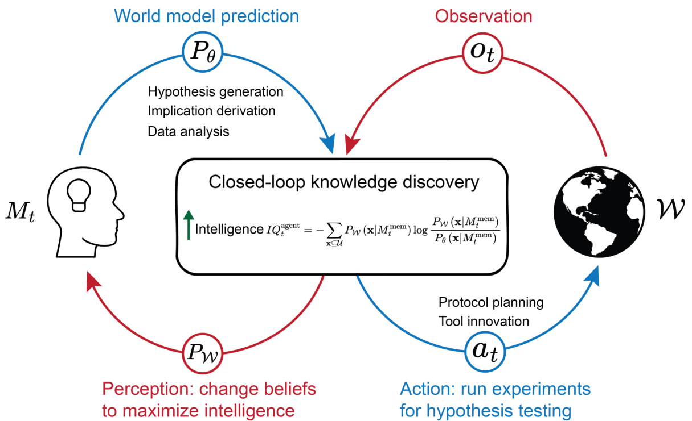

*图12.2：可持续自我进化的闭环知识发现。代理通过假设生成和测试以及数据分析和推导来迭代地增强其智能$I Q_{t}^{\mathrm{{agent}}} $。当与物理世界$W$交互时，代理生成假设作为未知信息的明示或隐含预测分布$(P_{\theta})$，采取行动$(a_{t})$进行假设测试，观察实验结果$(o_{t})$，并基于对真实世界分布$(P_{W})$的感知更新信念。当未与$W$交互时，代理从现有数据和前提中提炼知识，直接更新心智状态$M_{t}$。受[864]中图2.3和2.5的启发。*

### 12.2.1 假设生成与检验

假设生成和测试（图12.2）是代理在自主科学发现中的一个关键应用，因为它有潜力促进创新思维[749]。实质上，假设生成是形成潜在规则的过程，这些规则控制着与未观察到的科学现象相关的数据分布——从单个观察结果到大型数据集。根据卡尔·波普尔爵士的说法，科学假设必须是可证伪的[875,876]；在本讨论中，我们将幸存于证伪之中的假设定义为合理的真实假设[877860]。通常，科学家通过进行实验来测试假设，以证明或证伪它们。如果一个假设足够广泛以解释广泛范围的数据，并且极有可能是真实的，那么它被认为更有价值。

为解决科学问题，代理根据其关于部分可观测世界$\mathcal{W}$的不完整信息所包含的心智状态$M_{t}$，提出一个或少数几个基于高价值的假设。经过实验或计算测试后，一个经证明为真的假设成为有益的知识，扩展$M_{t}^{\mathrm{mem}}$，从而迅速减小$D_{\mathrm{K,\Theta}}^{\mathrm{min}}(M_{t}^{\mathrm{mem}})$。因此，生成和测试高价值假设可以快速促进知识发现并增加$I Q_{t}^{\mathrm{agent}}$。在这种情况下，代理采用学习函数$\mathrm{L}$，将假设测试的观察$o_{t}$处理为知识，并更新其心智状态$M_{t}$。

生成具有物理意义的假设是一个关键步骤。代理通常利用LLMs与协作架构和领域知识进行假设生成[878]。Siet al.[742]进行了一项涉及100多名NLP研究人员的大规模人类研究，发现LLM生成的想法在新颖性上评分更高（p<0.05）而在可行性上略微弱。Ghafarollahiet al.[743]开发了SciAgents，用于生成和完善材料科学假设，以阐明生物启发材料的基本机制、设计原则和意想不到的特性。基于大规模本体知识图，SciAgents在感兴趣的概念之间采样一个可行路径，构思一个相关的假设，并将其扩展为一个具有详细假设测试方法和标准的完整研究提案。它利用两个专门的代理人来审查、批评和改进所提出的假设，但不包括通过实际实验进行假设测试的步骤。类似地，Suet al.[879]和Baek等人[880]提出利用团队合作，如协作讨论和代理批评，以产生新颖且有效的科学假设。此外，Gower等人[881]引入了LGEM+，它利用一阶逻辑框架描述生物化学途径，并为酵母S. cerevisiae的基因组规模代谢模型的自动背推改进生成了2,094个独特的候选假设。

假设只有通过计算或实验观察得到证实后才能成为知识。Lu等人引入了AI科学家，这是一个旨在完全自动化科学发现的系统。AI科学家可以独立进行研究并传达其发现，如在扩散建模、基于Transformer的语言建模和学习动态领域所展示的。它生成原创研究思路，撰写代码，执行计算实验，可视化结果，起草完整的科学论文，甚至模拟同行评审过程以进行评估。例如，它提出了“自适应双尺度去噪可以通过在生成的样本中平衡全局结构和局部细节来改进扩散模型”的假设，通过对四个2D数据集进行图像生成测试得到证实。类似地，Schmidgal等人开发了Agent Laboratory，可以自主进行整个研究过程，包括文献回顾、计算实验和报告撰写。他们通过解决计算机视觉和自然语言处理领域的五个研究问题来评估Agent Laboratory在知识发现方面的能力，取得了平均人工评估实验质量得分为3.2（满分5分）。此外，Tiukova等人开发了Genesis，这是一个自动化系统，能够控制一千个微生物反应器，执行质谱表征，访问结构化领域信息数据库，并将实验观察应用于改进系统生物学模型。Genesis每天可以发起和执行1000个以假设为驱动的封闭循环实验周期。采用类似方法，Genesis团队已经推进了酵母（S.cerevisiae）二态转换模型，优于之前的最佳模型，并通过增加92个基因（+45%）和1048个相互作用（+147%）扩展了知识。这些知识也推进了我们对癌症、免疫系统和衰老的理解。类似地，Gottweis等人介绍了AI共同科学家，它可以自主生成和完善在药物再利用、新靶点发现以及细菌进化和抗微生物耐药机制等三个生物医学领域的新研究假设，并进行体外验证。

发现的知识增强了代理的心智状态，如$M_{t}^{\mathrm{mem}}$，$M_{t}^{\mathrm{wm}}$和$M_{t}^{\mathrm{rew}}$。唐等人开发了ChemAgent，通过动态的、自我更新的记忆$M_{t}^{\mathrm{mem}}$来提高化学推理能力。ChemAgent在一个开发数据集中针对化学问题提出假设答案，评估其与真实情况的一致性，并模拟现实世界研究中使用的假设检验过程。正确答案随后被存储为知识在其记忆中，以支持未来的化学问题回答。这种自我更新的记忆使ChemAgent在应用于SciBench的四个化学推理数据集时性能提升高达46%（使用GPT-4）。王等人引入了分子语言增强进化优化（MOLLEO），该方法迭代地提出修改候选药物分子的假设，评估其药物样性和活性，并在$M_{t}^{\mathrm{mem}}$中更新候选物质以增强药物发现。类似地，贾等人开发了LLMatDesign，采用假设引导的结构生成和自我更新的$M_{t}^{\mathrm{mem}}$来设计无机光伏材料，其理想性由匹配目标带隙和具有最负形成能确定。

Sim等人[748]引入了ChemOS 2.0，该系统在化学自动驾驶实验室（SDLs）中进行闭环操作的编排。ChemOS 2.0整合了从头计算、实验编排和统计算法，用于自主发现高性能材料。一个有机激光分子的发现案例展示了其能力。它采用贝叶斯优化器Altas作为其世界模型$M_{t}^{\mathrm{wm}}$，用于预测假设分子的光学特性，具体包括双[(N-碳基)亚基]联苯（BSBCz）衍生物的增益截面和光谱增益因子。基于这些预测，ChemOS 2.0推荐在实验活动中成功概率较高的分子。然后利用光学表征平台和AiiDA软件包来测量和模拟测试分子的性质。结果用于更新$M_{t}^{\mathrm{wm}}$，提高未来实验预测的准确性。

Hysmith等人[886]发表了一篇观点文章，强调了奖励函数设计在发展面向未来的SDL工作流程中的关键作用。在模拟环境中，如电脑游戏或模拟中，代理可以高效解决POMDP问题，但往往难以应用于真实世界的场景。一个明确定义的奖励函数对于迭代式自我进化至关重要。然而，在许多真实世界的科学研究问题中，由于缺乏直接测量、实验结果复杂性以及需要平衡多个目标，奖励函数往往在实验活动结束时被定义不清晰或缺失。发现新知识可以作为改进$M_{t}^{\mathrm{rew}}$、引导假设探索和实验数据收集的宝贵资源。

### 12.2.2 协议规划与工具创新

在能够规划实验方案并优化工具使用的能力下，代理程序能够在自主发现循环中解决复杂的科学难题。正如第9.4节中介绍的那样，代理程序可以系统地评估和完善其选择、调用和整合可用工具的方法，甚至开发出符合特定任务需求的新工具。虽然优化的方案和工具使用并不能直接降低 $\bar{D}_{\mathrm{K}}(\theta,M_{t}^{\mathrm{mem}})$，但它们提高了执行效率和效果，从而加速未知信息的概率分布 $\dot{P}_{\theta}\left(\mathbf{x}_{\mathrm{U}}|M_{t}^{\mathrm{mem}}\right)$ 的精炼，进而加快知识发现。在这种情况下，代理程序利用推理功能 $\mathrm{R}$ 将其不断更新的新知识反映在心智状态 $M_{t}$ 中，转化为更有效和更快的假设检验的现实行动 $a_{t}$（见图12.2）。

安排和协调选择和重组现有工具是至关重要的。科学实验通常依赖于各种仪器来分析反应产物，决策很少仅依赖于单一测量。在不浪费资源和时间的情况下有效利用必要的仪器，需要代理程序学会以一种整合和适应的方式使用工具。Dai等人设计了一个模块化工作流程，集成了移动机器人、自动合成平台和各种表征仪器，用于自主发现。他们在结构多样化化学、超分子主客体化学和光化学合成三个领域展示了这一系统。移动机器人遵循合成-分析-决策循环，模仿人类实验策略，自主确定后续工作流程步骤。它选择适当的仪器，例如Chemspeed ISynth平台用于合成，液相色谱-质谱仪（UPLC-MS）用于测量与化学峰信号相对应的质谱，以及台式核磁共振谱仪（NMR）用于跟踪起始物到产物的化学转化过程。

超越单个实验室，工具编排对于非集中和异步科学发现至关重要。Strieth-Kalthoff等人展示了跨越三大洲的五个材料科学实验室的闭环集成，推动了非集中化和民主化的科学发现。这五个实验室各有所长——例如，不列颠哥伦比亚大学专注于连续优先结晶，而九州大学擅长薄膜制备和表征。Strieth-Kalthoff等人采用基于云的实验计划器，持续从传入数据中学习并有效地优先考虑五个实验室中具有信息量的实验，从而发现了21种新的用于有机固态激光器的最新材料。

此外，代理还可以优化现有工具，甚至创建新工具以增强其功能。Swanson等人开发了Virtual Lab，这是一个由人工智能驱动的研究环境，促进了新型SARS-CoV-2纳米抗体的设计和实验验证。在Virtual Lab中，人工智能代理在团队会议中进行科学讨论，并在个别会话中执行专门任务。代理的一个重要议程是开发工具，以辅助设计纳米抗体结合物[887]，包括：(1) 一种序列分析工具，利用来自ESM蛋白语言模型的对数似然比对候选点突变进行排序；(2) 一种结构评估工具，从AlphaFold-Multimer预测中提取界面pLDDT分数，为抗体-抗原结合亲和力提供代理；以及(3) 一个基于Roseta的能量估算工具，用于量化纳米抗体变体与刺突蛋白之间的结合强度。这些代理生成的工具使Virtual Lab能够发现两种新型纳米抗体，其对JN.1或KP.3SARS-CoV-2变体具有增强结合能力，同时保持对祖先病毒刺突蛋白的强亲和力。

### 12.2.3 数据分析与含义推导

尽管大多数知识发现过程依赖于提出假设并在现实世界中进行测试，其中观察值 $o_{t}$ 至关重要，但是相当一部分知识可以纯粹通过内部行为（如迭代推理和深入思考）获取，这在理论学科中很常见。例如，欧几里得几何中的所有定理都可以从仅有的五条公设推导出来，但在推导之前，这些定理在心智状态中并不存在。在给定所有必要前提条件（如欧几里得的五条公设）的情况下，假设的真实概率可能仍然难以捉摸。然而，利用演绎和归纳推理从已知前提和数据中得出推论可以帮助证实或推翻假设，从而减少 $D_{\mathrm{K}}(\theta,M_{t}^{\mathrm{mem}})$ 并增强 $I Q_{t}^{\mathrm{agent}}$（见图12.2）。在这种情况下，代理利用认知函数 C，利用先前的心智状态 $M_{t-1}$ 和内部行为 $a_{t}$ 推导新知识，并更新心智状态为 $M_{t}$。

演绎推理通过逻辑实现知识推导。Trinh等人开发了AlphaGeometry[753]，用于基于欧几里得平面几何中现有定理的前向推导新数学定理。AlphaGeometry采用神经语言模型构建平面几何问题中的辅助点，并整合专门的符号引擎，通过详尽推导新的真命题，从而扩展已知真相的联合闭包。通过利用这一扩展闭包，它在辅助构造和符号推理引擎之间交替，揭示进一步的含义。AlphaGeometry在一个包含30个最新奥林匹克水平问题的测试集上表现出色，解决了25个问题，是之前最佳方法解决的10个问题的两倍以上，并接近平均国际数学奥林匹克（IMO）金牌得主的水平。

归纳推理通过模式识别和统计学习实现知识推导。Liu等人[754]引入了人工智能科学家团队(TAIS)，以模拟数据科学家的角色，实现数据分析的流程化。TAIS将复杂的数据分析问题分解为不同的计算任务，包括编码、自我批判和回归分析，以从复杂数据集中提取有意义的见解。当应用于识别疾病预测基因时，TAIS在包含457个遗传问题的基准数据集上取得了总体成功率为45.73%。理想情况下，提取的见解应该在逻辑上合理；否则，它们必须被丢弃，以确保只有准确的发现能够安全地融入思维状态。然而，数据覆盖范围的限制和分析算法的实施可能导致虚构的见解，凸显了需要可靠的数据分析器和推理工具来防止过度分析。

## 12.3 技术准备度与挑战

智能代理的自我演化，从而推动人类知识的进步，在创新周期的早期成功中得以实现。这一周期包括生成有意义的假设、设计实时测试协议、协调各种实验和计算工具、分析数据、得出结论，并进行自我反思。然而，实现完全自主的自我演化仍然是一个重大挑战，鉴于当前技术准备水平（TRL）在三个基本能力方面存在局限：现实世界互动、复杂推理和先验知识的整合。需要进一步的技术进步以改善自驱动创新的循环。

### 12.3.1 现实世界互动挑战

智能代理主要通过应用程序接口（APIs）与现实世界进行交互。尽管许多演示已经展示了它们利用各种API的强大能力，但在自主知识发现方面仍存在一个重要瓶颈：缺乏允许代理直接在物理实验室执行任务的APIs。物理APIs——能够直接控制实验室设备的接口相对较少，这是因为开发这些接口需要大量的时间、专业知识和成本投入。尽管现有的自主实验室显示出了潜力，它们仍处于早期发展阶段（通常是TRL 4-6），在这个阶段，直接复制或扩展规模是具有挑战性的。因此，进一步构建系统或将其应用扩展到额外的科学领域仍需要大量定制以解决特定领域需求，以及专门的专业知识。

实现现实世界交互的两个关键任务是操作实验室设备和在设备之间传输样本。无缝集成物理硬件和实验样本对于保持工作流程的连续性至关重要。然而，大多数实验仪器最初是为人类操作而设计的。使它们对代理可访问需要跨越多个学科的广泛努力，包括机器人技术、电气工程、机械工程和软件编程。自主实验室的日益突出促使人类操作的设备通过APIs转变为代理可访问的系统。在进行复杂实验的自主实验室中，通常采用两种并行且常常互补的方法来将硬件与代理系统集成。这两种方法都是模块化、可重构且有价值的，但它们需要持续的专门开发。

方法一：通过直接设备适配实现API集成。这种方法涉及为单个设备配备专用的机械适配器和I/O控制器，使它们能够接收并执行来自中央控制PC的命令。例如，为了实现无机材料的固态合成和结构表征，A实验室已经实施了16种设备，用于自动化实验任务，如粉末投料、加热和衍射。这种方法允许实验室作为完全集成的实体运作，通过最大化设备利用率、优化空间和资源，并实现定制工具。然而，这种方法成本高、耗时长，并且需要专业知识来为自动化原型化或改装设备。大型语言模型(LLMs)已被应用于促进对各种工具的访问，如化学代理连接工具使用到科学中的CACTUS。

对于小团队来说，更具可访问性的选择是云实验室或科学工厂[894]，在这里，设备工程的责任从单个实验室转移到专门的用户设施或商业服务提供商。例如，Boiko等人[895]展示了一种自主化学研究代理人Coscientist，能够在Emerald Cloud Lab的实验设置中执行交叉偶联Suzuki和Sonogashira反应。然而，云实验室仅提供针对常见程序优化的固定设备集，这对那些需要设备定制的研究人员可能构成潜在挑战，因为整合非标准工具可能涉及漫长的谈判和开发过程。

方法二：实验设备的机器人操作。这种方法涉及使用移动机器人或机械手来操作现有设备并转移样本。在许多情况下，机器人可以与仪器互动而无需修改，除了进行一些小的调整，例如添加专门的执行器、夹持器或支架。例如，Dai等人利用移动机器人探索合成化学。在他们的自主实验室中，移动机器人实现了合成和分析设备之间的物理连接，这些设备在空间上是分开的，自动化了样本的运输和处理。原则上，机器人可以执行实验室中人类研究人员需要的所有动作。然而，当前的机器人系统仍然依赖人类预先编程来映射实验室布局，定义移动轨迹，并注册设备位置。处理意外或自适应情况仍然是一个挑战，因为预先编程无法预料实验装置的每种可能状态。实时学习和自适应操作是需要进一步技术进步的活跃研究领域。从长远来看，体现式人工智能有望增强机器人学习能力，使代理能够快速适应新环境和工具。

两种方法可以结合使用。例如，Vescovi等人定义了一种模块化实验室机器人架构，允许将高级命令转化为各种不同机器人设备和实验室设备的特定操作，并将机器人设备与高性能计算等人工智能驱动发现架构的其他元素连接起来。该架构已被用于在生物和物理科学中自动化实验。类似地，Fernando等人将一个与Robotic Operating System 2（ROS2）兼容的机器人集成到Bluesky实验编排框架中。Lo等人主张开发和整合低成本的“节俭双胞胎”设备，以促进实验并使更多人能够获得实验设备。

### 12.3.2 复杂推理挑战

一个基本的哲学问题是，通常由LLMs驱动的代理是否真正可以进行推理。根据定义，语言模型通过预测下一个标记来生成输出，这一机制与人类推理根本不同。从结果驱动的角度来看，这些输入-输出系统在现象学上表现出推理能力，因为它们产生的输出与生成任意响应的参考系统相比具有意义[902]。然而，无论采取何种角度，这种能力仍然是不完美的，特别是在处理对科学知识发现至关重要的复杂逻辑和数值问题时。

代理和LLMs在艰难的推理任务中遇到困难。Glazer等人[903]引入了FrontierMath，一个包含数百个原创且具有挑战性的数学问题的基准，涵盖了现代数学的大多数主要分支。对最先进的由LLMs驱动的代理进行评估，包括ol-preview（OpenAI）、ol-mini（OpenAI）、GPT-4o（OpenAI，2024年8月6日版本）、Claude 3.5 Sonnet（Anthropic，2024年10月22日版本）、Grok 2 Beta（XAI）和Gemini $1.5\:\mathrm{Pro}\:002$（Google DeepMind），结果显示没有任何模型在完整基准测试中取得甚至$2\%$的成功率。Chen等人[873]提出了ScienceAgentBench，这是一个旨在评估语言代理在数据驱动科学发现中的基准。在从四个学科领域的44篇同行评审出版物中提取的102个任务中，OpenAI ol只成功解决了其中的$42.2\%$。Chollet [865]提出了抽象和推理挑战（ARC），以评估LLMs在执行抽象归纳推理时不依赖记忆或外部知识的能力。即使经过仔细提示，GPT-4o仅正确解决了$19\%$的任务，远远低于人类平均表现的$\sim75\%$[94,905]。Zhu等人[96]提出了AI智能的四级分类，包括L1（仲裁争端）、L2（审计评论）、L3（审查论文）和L4（撰写论文）。他们将当前最先进的LLM驱动代理分类为接近L2级能力。为增强代理的推理能力，研究人员引入了诸如chain-of-thought[907]、tree-of-thoughts[72]和[70]等技术。尽管新方法不断涌现，但正如第2.2节讨论的那样，推理能力的进一步发展对于在科学研究中实现可靠的因果推断仍然至关重要。

代理和LLMs在处理定量和符号问题时也存在困难。例如，GPT-4和GPT-3.5经常难以可靠地执行复杂的算术运算，如$12, 345\times98$，765，或将IUPAC化学名称翻译成准确的分子结构图。克服这些限制的常见方法是使用外部工具，而不是依赖LLM本身进行推理。在数学问题解决中，例如，像符号求解器这样的工具比直接LLM推理更可取。然而，这种缓解并不能解决数值理解的固有缺陷，这可能对科学推理构成潜在风险。此外，Yu等人发现，在化学问题解决中，使用工具增强的LLMs并不总是能够在化学问题解决中 consistently 超越没有工具的基础LLMs。例如，在专门的化学任务中，如合成预测，增强LLMs with tools 不能一直胜过基础LLMs。

使用专门工具增强的LLMs可以显著提升性能；然而，对于一般化学问题，如考试中那些没有特定工具可以直接解决的问题，工具增强效果较差。在这些情况下，代理通过利用多个化学知识片段进行正确推理的能力变得更加重要。

前面的讨论强调了开发评估人工智能代理作为科学研究助手的稳健方法的重要性，这是Cappello等人（910）长篇讨论的主题。

### 12.3.3 整合先验知识中的挑战

先前的知识是提升智能的关键因素。如在第12.1节中讨论的，代理的先前知识$M_{t}^{\mathrm{mem}}$有助于减少$D_{\mathrm{K}}(\theta,M_{t}^{\mathrm{mem}})$并提高代理的智能$I Q_{t}^{\mathrm{agent}}$。人类主导的科学发现通常可以在相对较小的数据集上取得突破，这要归功于人类拥有的广泛先前知识。支持自主代理的最先进的LLMs被训练在几乎所有公开可用的文本数据上，包括网站、书籍和其他来源，从而涵盖了大部分常见知识以及公开可访问的专业知识。然而，实现一个能够无缝整合所有现有人类知识的代理仍然是一个重大挑战。

至少有三种类型的知识来源可能未包含在大型语言模型（LLMs）的预训练中：（1）付费或未发表的知识，包括非开放获取出版物、行业特定数据和失败的实验。尽管这些知识在细化领域特定见解方面具有潜在价值，但它们通常无法被公共模型访问。 （2）经验知识。专家的经验决策通常是有效的，特别是在没有现有数据可供解决新问题的情况下。然而，大量的专家启发式通常作为文本数据不可访问。 （3）情境或局部知识。与现实世界条件相关的知识，例如化学反应中的安全协议或设备操作，通常未包含在预训练模型中，但对于实际应用至关重要。

此外，整合多样化的知识来源在协调冲突信息方面存在挑战。例如，OpenAI的Deep Research积极收集在线信息并进行多步推理，在“人类最后一次考试”和GAIA基准测试中取得了最先进的性能。然而，它仍然难以区分权威信息和谣言，并在信心校准方面存在局限，经常错误地表达其确定性水平。建立一个评估不同知识片段证据级别的系统，比如量化可靠性和验证参考文献，可能对有效的知识融合至关重要。

# 多Agent系统的设计

13.1 战略学习：合作与竞争 133
13.2 建模现实世界动态 134
13.3 通过工作流生成进行协作任务解决 135
13.4 组合AI代理团队 135
13.5 代理交互协议 137
13.5.1 消息类型 137
13.5.2 通信接口 138
13.5.3 下一代通信协议 138

# 4 通信拓扑结构 141

14.1 系统拓扑结构 141
14.1.1 静态拓扑结构 141
14.1.2 动态和自适应拓扑结构 142
14.2 可伸缩性考虑 144

## 4.1 人类世界模型

人类自然而然地构建对世界的内部表征，通常在心理学中被称为心智模型。这些模型作为对外部现实的简洁且可操作的描绘，使个体能够在最小程度依赖直接试错的情况下预测结果、规划行动，并解释新颖情境。早期关于空间导航的研究表明，人类和动物形成了对周围环境的“认知地图”，暗示了一种在实际穿越之前就能够想象潜在路径的能力。

Craik的重要论点是，人类大脑运行内部的“现实小规模模型”[342]来模拟事件可能如何展开并评估可能的行动方案。后续研究提出，这种模拟跨越视觉、语言和运动控制等多种感知方式，并通过将预测与新观察结果进行比较而动态更新。这一过程将记忆回忆与向前投射相融合，暗示着存储知识与主动生成假设未来状态之间的密切相互作用[343]。更近期的预测处理理论，如“Surfing Uncertainty”[344]，提出大脑作为一个分层预测机器运作，不断生成关于感官输入的自上而下预测，并根据预测误差更新其模型。

这些人类心智模型具有以下关键特点：

·预测性：它们预测环境变化，指导决策何时移动或如何做出响应。
·整合性：它们将感官输入、过往经验和抽象推理结合到一个统一的“接下来可能发生什么”的视角中。
·适应性：当现实与期望不符时，它们会进行修订，随着时间的推移减少想象和实际结果之间的差距。
·多尺度：它们在不同的时间和空间尺度上无缝运作，同时处理即时的物理动态（毫秒级）、中期的行动序列（秒到分钟）、以及长期计划（小时到年）。这种灵活性使人类能够根据需要放大细节或放大考虑更广泛的背景。

以饥饿和进食为例，将其视为整合世界建模的示例。当感到饥饿时，一个人的内部模型会激活关于食物的预测——不仅模拟视觉外观，还有味道、气味以及预期的满足感，甚至在食物出现之前就会引发唾液分泌等生理反应。这展示了跨感知、记忆和行动规划之间的无缝整合。

这个例子还突显了适应性：一旦满足，同样的模型会动态更新，降低进一步进食的预期奖励值。尽管识别出相同的食物项目，但它们的预期效用会根据内部状态而变化。此外，人类保持着反事实模拟——现在拒绝甜点，但准确预测将来会喜欢——这使得能够在假设情景和时间范围内进行复杂规划，这是综合人工智能世界模型努力复制的能力。

总之，人类世界模型并非静态的事实库，而是一个灵活且不断演化的心智构建，深深扎根于感知和记忆，不断塑造（并受到塑造）个体与外部世界互动的方式。

## 4.2 将人类世界模型转化为人工智能

人工智能领域的研究长期以来一直致力于复制人类心智模型所展现的预测、整合和适应性特质。例如，早期的强化学习框架提出学习环境模型以进行规划，比如Dyna所展示的方式，同时同时代的工作研究了使用神经网络来预测流数据中未来的观察结果。这两个方向的动机都源于这样一个观念，即世界的内部模拟器可以实现比纯粹的反应式试错学习更高效的决策制定。

随后深度学习的进展使“AI世界模型”的概念变得更加清晰。一种有影响力的方法引入了一种端到端的环境潜在生成模型（例如，“世界模型”[348]），其中循环神经网络（RNN）和变分自动编码器（VAE）共同学习“梦想”未来的轨迹。这些潜在的展开使代理能够在离线训练或优化策略，有效地模拟人类在执行动作之前如何进行心理排练。除了这种隐式设计，显式的前向建模方法也出现在基于模型的RL中，使代理能够预测 $P(\bar{s}^{\prime}\mid s,a)$ 并使用近似前瞻进行规划。

另一方面的工作利用大规模模拟器或现实世界的机器人技术，通过丰富多样的经验来打下学习基础。这些设置让人想起人类儿童通过积极探索环境学习的方式，逐渐完善他们的内部表征。然而一个关键问题仍然存在：智能系统是否能够将这些方法（隐式生成建模、显式因式分解和模拟器驱动的探索）统一起来，形成类似于人类观察到的“心智模型”的一致性？基于语言模型的推理的最近激增暗示着跨模态和任务的潜力，呼应了人类如何在一个预测框架下整合语言、视觉和运动知识的方式。

总的来说，随着人工智能系统努力实现灵活、高效的学习，AI世界模型作为一个概念桥梁，连接了认知心理学中关于心智模型的理论和为人工智能代理赋予想象力、预测推理能力以及在复杂领域中进行强健适应的实现。

## 4.3 人工智能世界模型的范式

设计Alworld模型涉及确定AI代理如何获取、表示和更新其对环境动态的理解。虽然具体实现各不相同，但大多数方法可归为四种广泛范式：隐式、显式、基于模拟器和混合或指导型模型。这些范式可沿着两个关键维度进一步分析：对内部（基于神经网络）与外部（基于规则或结构化）机制的依赖，以及整体系统复杂性。图4.2展示了这个二维空间，展示了不同方法在这些轴上的分布情况。通常来说，隐式模型更倾向于依赖内部机制，而显式和基于模拟器的模型则包含更多外部结构。基于模拟器和显式模型也往往比隐式和混合方法更复杂，反映了它们的结构化推理和工程约束。

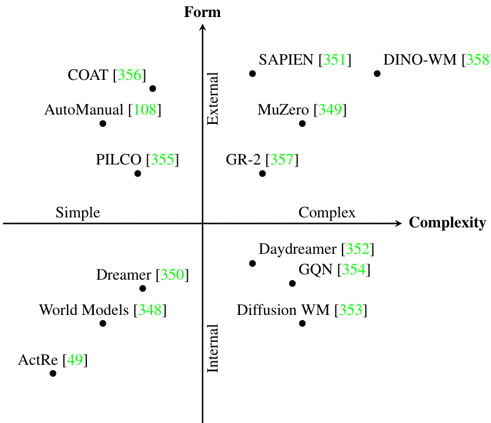

*图4.2：人工智能世界模型方法的二维布局。水平轴表示复杂性（从左到右）。垂直轴跨越内部方法（底部）到外部解决方案（顶部）。大致位置反映了每种方法对大型学习网络与明确规则或代码的依赖程度，以及其整体系统复杂性。*

### 4.3.1 世界模型范式概述

大型语言模型（LLMs）的出现催生了人工智能领域的深刻转变，为能够在各种领域展现复杂推理、强大感知和多功能行为能力的先进智能代理铺平了道路。随着这些代理在推动人工智能研究和实际应用方面的作用日益增强，它们的设计、评估和持续改进提出了复杂而多面向的挑战。本调查提供了一个全面的概述，将智能代理置于一个模块化、脑启发式架构中，该架构整合了认知科学、神经科学和计算研究的原则。我们将探索分为四个相互关联的部分。首先，我们深入探讨智能代理的模块化基础，系统地将它们的认知、感知和操作模块映射到类似的人脑功能上，并阐明核心组件，如记忆、世界建模、奖励处理和类似情感的系统。其次，我们讨论自我增强和自适应进化机制，探讨代理如何自主完善其能力、适应动态环境，并通过自动化优化范式实现持续学习，包括新兴的AutoML和LLM驱动的优化策略。第三，我们研究协作和进化多代理系统，调查从代理相互作用、合作和社会结构中出现的集体智能，突显与人类社会动态的相似之处。最后，我们着重讨论构建安全、可靠和有益的人工智能系统的关键使命，强调内在和外在的安全威胁、道德对齐、稳健性以及在值得信赖的现实世界部署所必需的实用缓解策略。通过将模块化人工智能架构与不同学科的见解综合起来，本调查确定了关键的研究空白、挑战和机遇，鼓励创新，使技术进步与有意义的社会利益相协调。该项目的Github链接为: https://github.com/FoundationAgents/awesome-foundation-agents。

一个$AI$世界模型广泛指代代理捕获或访问近似环境动态的任何机制。设$s$表示可能的环境状态集合，$\mathcal{A}$表示动作集合，$\mathcal{O}$表示观测集合。在理想化的马尔可夫框架中，环境通过转移和观测分布来描述：

$$ 
\begin{array}{r l}&{T(s^{\prime}\mid s,a)\quad:\quad\mathcal{S}\times\mathcal{A}\to\Delta(\mathcal{S}),}\\ &{O(o\mid s^{\prime})\quad:\quad\mathcal{S}\to\Delta(\mathcal{O}),}\end{array}
 $$

其中$T(\cdot)$规定了状态在动作下的演变方式，$O(\cdot)$定义了状态如何产生观测。世界模型通常学习或利用这些函数的近似（或变体），使代理能够在不在环境中执行实际动作的情况下预测未来状态或观测。

存在许多方法来实现这些近似，我们将其分为四种主要范式：

·隐式范式：一个单一的神经网络或潜在结构编码转移和观测映射，而无需显式因子分解。《World Models》或用于环境推理的大型语言模型是典型示例。代理通常展开这个黑盒函数以模拟假设轨迹。
·显式范式：代理直接建模或访问可学习的转移模型$T_{\theta}$和观测模型$O_{\theta}$，通常能够实现可解释性或模块化设计。基于模型的强化学习方法，如MuZero或Dreamer，学习或改进$T_{\theta}$，在近似状态空间中进行规划。如果显式预测下一个状态或帧，生成式视觉模型如[353,358]属于这一类别。
·基于模拟器范式：代理依赖外部模拟器或甚至物理世界作为地面真相，而不是近似(4.1)(4.2)。像SAPIEN或真实机器人管道这样的系统可以被视为代理查询的“本地”环境模型。虽然不需要学习的$T(\cdot)$，但代理在运行时间或真实世界风险方面付出代价。
·其他范式（混合或指导驱动）：无法简单分类的方法。它们可能以文本形式存储新兴规则，将隐式LLM知识精炼为部分因果图，或将外部组件与学习的子模块结合。这些方法突显了世界模型研究的不断发展，其中指导、符号规则或即时结构可以补充更传统的近似方法。

在本小节的其余部分，我们将探讨每种范式如何处理（或规避）方程式（4.1）和（4.2），解释性和可扩展性之间的权衡，以及它们在从基于文本到高维度实体控制等不同任务中的相对优点。

### 4.3.2 隐式范式

在隐式范式中，一个代理将所有环境动态（包括状态如何演变以及观测如何生成）编码在单个（或紧密耦合的）神经模型内。形式上，一个维持更新的潜在状态 $h_{t}$，其更新方式如下所示：

$$ 
h_{t+1}=f_{\theta}(h_{t},a_{t}),\quad\hat{o}_{t+1}=g_{\theta}\big(h_{t+1}\big),
 $$

其中 $f_{\theta}$ 包含了方程（4.1）-（4.2）中的转移函数 $T(\cdot)$（以及 $O(\cdot)$ 的一部分），但没有明确地将这些组件呈现出来。一个经典的例子是World Models框架[348]，其中变分自动编码器（VAE）首先将视觉输入压缩为潜在编码，然后一个循环网络预测下一个潜在编码，有效地在潜在空间中“梦想”轨迹。最近的研究还探讨了将大型语言模型（LLMs）重新用于纯文本或符号领域的环境模拟[107,74]，尽管这些模型并不总是建立在严格的时间序列或基于物理的数据基础之上。

因为隐式模型将转移和观测机制融合为一个整体函数，所以它们可以优雅地进行端到端训练，并在内部展开进行规划。然而，它们往往是不透明的：很难解释网络如何准确捕捉领域约束，或者直接注入知识到转移的任何部分。这在高度复杂的环境中可能是有利的，其中一个大容量模型可以自行发现潜在结构，但也存在在分布转移下脆弱的风险。总体而言，隐式范式因其简单性和灵活性而具有吸引力，但在需要解释性明确约束或对动态的精细控制时可能会带来挑战。

### 4.3.3 明示范式

相反，显式范式通过分解世界模型，通常通过学习或编码转移函数 $\hat{T}_{\theta}{\left(s_{t+1}\right|}$ $s_{t},a_{t})$ 和观测函数 $\hat{O}_{\theta}(o_{t+1}\mid s_{t+1})$ 来实现。这种显式分离使得可以独立查询每个函数。例如，可以从中抽取样本。

$$ 
\hat{s}_{t+1}\sim\hat{T}_{\boldsymbol{\theta}}\big(s_{t},a_{t}\big),\quad\hat{o}_{t+1}\sim\hat{O}_{\boldsymbol{\theta}}\big(\hat{s}_{t+1}\big).
 $$

基于模型的强化学习算法，如MuZero或Dreamer，通过优化用于规划的前向模型来体现这一范式。其他显式方法则优先考虑在生成未来帧时的保真度，例如Difusion WM在像素级别应用扩散过程，或者DINO-WM在预训练特征空间内展开未来状态。

通过对转换和观测进行因式分解，显式方法更易于解释和调试，也更容易受到领域特定约束的影响。尽管如此，它们仍对模型错误敏感：如果 $\hat{T}_{\theta}$ 与现实存在显著差异，智能体的规划和决策可能变得无效。许多显式系统仍主要依赖内部（神经）表示，但它们可以整合外部规划器（例如树搜索算法）来利用显式转换结构。这种学习和符号组件的融合提供了一种自然的方式来融入人类知识，同时保留了深度学习的优势。

### 4.3.4 基于模拟器的范式

在基于模拟器的范式中，代理将环境更新外包给模拟器，有效地绕过了需要从数据中学习$\hat{T}_{\theta}$的必要性。形式上，

$$ 
(s_{t+1},o_{t+1})\gets S T M(s_{t},a_{t}),
 $$

其中$s\tau{\mathcal{M}}$通常是外部的物理引擎或真实世界本身。像SAPIEN和AI Habitat这样的平台提供确定性的3D物理模拟，使代理能够在受控环境中练习或迭代策略。另外，像Daydreamer这样的方法将真实世界的交互循环视为“模拟器不断从物理机器人中更新政策数据”。这种方法产生准确的转换（假设模拟器准确反映现实），从而减轻了学习模型错误的风险。然而，如果模拟器质量高，或者真实世界试验耗时且风险较大，这种方法可能会带来计算或财务上的负担。因此，一些代理结合部分学习动态和偶尔的模拟器查询，旨在平衡准确的展开和对状态-动作空间的高效覆盖。

### 4.3.5 混合和指导驱动范式

除了这三种主要范式之外，还出现了越来越多的混合或指导驱动方法，它们混合了隐式和显式建模，或者整合了外部符号知识和大型语言模型。通常，这些系统动态地从数据中提取规则，维护不断演化的文本知识库，或者促使大型语言模型假设因果关系，然后可以对其进行测试或完善。

例如，AutoManual[108]迭代地将交互环境规则编译成人类可读的手册，以更透明的方式指导未来行动。与此同时，COAT[356]促使大型语言模型提出观察事件背后可能的因果因素，然后通过直接交互验证或完善这些因素，将基于文本的推理与部分学习模型相结合。尽管这些解决方案在适应陌生领域或整合实时人类见解方面提供了显著的灵活性，但它们在如何构建或更新内部表示方面可能存在不一致。随着语言模型提示和实时规则发现的不断发展，这些混合方法有望变得越来越普遍，体现了在端到端学习和外部指导提供的透明度和适应性之间取得平衡的需求。

到目前为止，我们已经介绍了现有世界模型技术的四种典型范式，如图4.3.5所示。正如我们所看到的，每种技术类型在不同方面都存在权衡。

### 4.3.6 范式比较总结

表格总结了人工智能世界建模中的关键方法，根据它们对外部或内部机制的依赖程度、复杂性和各自的范式进行分类。形式列使用$\scriptscriptstyle\mathrm{~o~}$表示外部方法，$\bullet$表示内部方法，混合方法则同时具有这两种符号。这种分类与前文的小节相一致，包括对每种范式的详细讨论，并补充了图4.2中的视觉呈现。

## 4.4 与其他模块的关系

综合的人工智能世界模型并不孤立存在，而是与智能代理架构的几个关键组件进行交互。这些组件包括（但不限于）记忆、感知和行动模块。在这个小节中，我们探讨世界模型如何与这些关键组件整合，以实现在动态环境中的连贯和自适应行为。

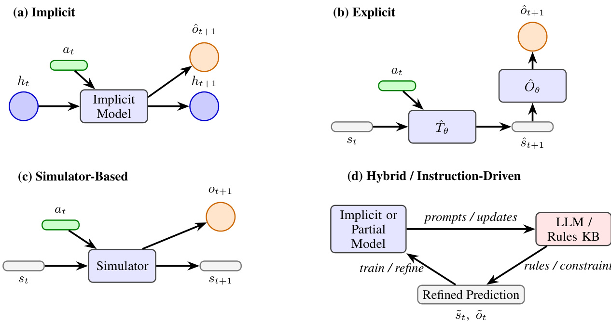

*图4.3：世界建模的四种范式：(a)隐式，(b)显式，(c)基于模拟器，和(d)混合/指令驱动。*

表4.1：跨范式的AI世界模型方法总结，显示它们的形式（外部或内部）、复杂性和范式。

<html><body><table><tr><td>Method</td><td>Form</td><td>Complexity</td><td>Paradigm</td></tr><tr><td>ActRe[49]</td><td>·</td><td>Simple</td><td>Implicit</td></tr><tr><td>World Models [348]</td><td>·</td><td>Simple</td><td>Implicit</td></tr><tr><td>Dreamer [350]</td><td>●</td><td>Moderate</td><td>Implicit</td></tr><tr><td>Diffusion WM [353]</td><td>·</td><td>High</td><td>Explicit</td></tr><tr><td>GQN [354]</td><td>·</td><td>High</td><td>Explicit</td></tr><tr><td>Daydreamer[352]</td><td>0</td><td>High</td><td>Simulator-based</td></tr><tr><td>SAPIEN[351]</td><td>0</td><td>High</td><td>Simulator-based</td></tr><tr><td>PILCO [355]</td><td>0</td><td>Moderate</td><td>Explicit</td></tr><tr><td>AutoManual [108]</td><td>0</td><td>Simple</td><td>Other</td></tr><tr><td>MuZero [349]</td><td></td><td>High</td><td>Explicit</td></tr><tr><td>GR-2 [357]</td><td>·</td><td>High</td><td>Explicit</td></tr><tr><td>DINO-WM [358]</td><td>·</td><td>High</td><td>Explicit</td></tr><tr><td>COAT [356]</td><td>O</td><td>Moderate</td><td>Other</td></tr></table></body></html>

### 4.4.1 记忆与世界模型

记忆系统在世界模型的运作中起着至关重要的作用。世界模型生成对未来状态或行为的预测性表示，而记忆则作为这些表示构建和更新的基础。世界模型和记忆之间的关系可以被视为一个循环，其中世界模型预测潜在的未来，而记忆存储过去的经验、观察和学习模式，实现依赖于上下文的推理和未来预测。

记忆机制可以以各种方式结构化，包括：

· 短期记忆：这使代理能够临时保持和更新其内部状态，存储最近的互动或观察。这种短期上下文有助于代理在即时环境中做出决策。
· 长期记忆：这充当了对环境的经验和一般知识更持久的存储库。世界模型可以与长期记忆互动以完善其预测，并可能使用历史数据做出更明智的决策或模拟更现实的未来。

例如，在基于模型的强化学习框架中，如Dreamer，循环神经网络既充当世界模型，又作为一种记忆形式，维护一个潜在状态，该状态在每个时间步更新以预测未来状态。这种集成记忆形式使代理能够回忆过去的互动并预测未来的互动。

### 4.4.2 知觉与世界模型

感知是指智能代理通过各种方式（例如视觉、触觉、听觉等）感知和解释其环境的能力。世界模型在很大程度上依赖于准确的感觉输入，以对环境进行连贯的预测。在许多人工智能系统中，感知模块将原始传感器数据转换为更高级别的表示，例如图像、声波或其他结构化数据。

世界模型与感知之间互动的关键方面是代理如何将感觉输入处理和整合到模型中。世界模型通常依赖于经过处理的数据（例如来自卷积神经网络的特征或来自变压器的嵌入）来模拟潜在的未来。此外，世界模型可以通过集中注意力于最相关的感官输入来引导感知过程，以细化预测所需的最相关感觉输入。

例如，在自主机器人领域，感知系统通常检测物体或环境特征，然后将其输入到预测场景将如何发展的世界模型中。RoboCraft通过将视觉观察转换为粒子并通过图神经网络捕获基础系统结构，实现了这种感知到建模的转换。PointNet通过对无结构的3D点云进行编码来进一步丰富感知系统对物理空间的理解，以捕获环境的空间特征。在导航任务中，OVER-NAV进一步结合大型语言模型和开放词汇检测，构建多模态信号和关键信息之间的关系，提出omni-graph来捕获导航任务的本地空间结构作为世界模型。感知和世界模型之间的这种反馈循环使代理能够根据持续的预测动态更新其感知，实现实时适应。

### 4.4.3 行动与世界模型

行动是指代理通过决策过程与环境进行交互的过程。在代理系统中，行动是由世界模型对未来状态的预测驱动的。世界模型通过在执行之前模拟不同行动的结果来帮助规划，使代理能够根据预测的后果选择最优行动方案。

世界模型与行动模块之间的整合可以采用各种形式：

- 基于模型的规划：世界模型明确地建模环境的转换动态，允许代理在选择最优方案之前模拟多个行动序列（展开）。 
- 探索：世界模型还通过模拟未见状态或意外行动来支持探索策略。这些模拟使代理能够评估探索状态空间新部分的潜在收益。

在基于模型的规划中，MuZero通过自我对弈和蒙特卡洛树搜索（MCTS）进行隐式规划，将当前状态表示转化为未来状态和奖励预测，以指导决策过程，而无需了解环境规则。相比之下，MPC利用显式动态模型来预测有限时间范围内的多条可能轨迹，通过解决优化问题确定最优控制序列，并使用逐步更新的方法持续更新规划。另一方面，Alpha-SQL在MCTS框架内集成了LLM作为行动模型，以探索数据库“世界模型”中的潜在SQL查询。该方法根据部分查询状态动态生成有前途的SQL构建行动，实现了无需特定任务微调的零-shot文本到SQL交互。与专注于不确定环境中决策规划的MuZero不同，Alpha-SQL在特定任务中应用MCTS，通过在复杂数据库环境中自动生成行动来指导SQL查询构建。

对于探索策略，Nagabandi等人通过提供奖励机制（探索奖励）来激励代理探索未知区域，以发现新状态。Dreamer提出，世界模型可以生成虚构的行动序列（虚构展开），使代理可以在模拟环境中安全评估新行动的好处，而无需冒真实世界实验的风险。类似地，在离散世界模型中，Hafner等人通过模拟多个可能的未来状态，代理可以高效地探索复杂环境，有效平衡探索和利用之间的权衡。

例如，在强化学习中，代理可以利用学习的世界模型来模拟行动选择任务中的未来轨迹。世界模型评估不同行动的潜在奖励，使代理能够有效规划并采取最大化长期目标的行动。

### 4.4.4 跨模块集成

虽然记忆、感知和行动被讨论为独立模块，但世界模型真正的优势在于它们能够在这些领域之间无缝集成。世界模型不断接收感官输入，更新内部记忆，模拟未来状态，并利用这些信息来驱动行动选择。这些模块之间的迭代反馈循环使代理能够参与智能、目标导向的行为，高度适应环境变化。

这种跨模块交互在复杂、动态系统中尤为重要，例如在机器人技术领域，代理必须持续调整其对世界的内部表征、处理感官输入、存储相关经验，并实时采取行动。在具身代理的背景下，这些模块的整合确保了世界模型所做的预测基于当前观察和代理持续的经验。

世界模型提供了跨模态的基本统一原则。无论是在具身机器人中预测物理结果，在屏幕上预测视觉变化，还是在文本中推断语义关系，核心机制保持一致：生成关于不同行动下状态如何演变的预测。这种跨模态能力解释了为什么人类能够毫不费力地在操作物体、导航界面和处理语言之间转换——所有这些活动都由相同的基础预测架构驱动。未来的人工智能系统可能通过开发能够通过共同的预测框架在这些传统上独立的领域之间建立桥梁的世界模型，实现类似的整合。

总之，世界模型与其他模块——记忆、感知和行动之间的关系构成了人工智能系统智能行为的基础。每个模块都为预测、更新和行动的循环做出贡献，使代理能够在动态和不确定的环境中有效地运作。这些互动凸显了在设计代理架构时需要采用整体方法的重要性，其中世界模型与感官输入、记忆系统和决策过程紧密相互交织。

## 4.5 总结与讨论

从早期认知洞见到先进人工智能架构的AI世界模型演变，凸显了人们日益认识到真正智能的基础在于能够预测、模拟和想象。与经典的强化学习不同，代理通过试错交互操作，世界模型使预见成为可能，代理可以在事件发生之前进行规划、预测和适应。这种认知建模的飞跃——无论是隐式的、显式的还是基于模拟器的——标志着机器如何获得跨任务的灵活性、稳健性和泛化能力方面的重大转变。

世界模型的一个重要但经常被忽视的方面是其跨越多个时间和空间尺度的运作。人类的心智模型无缝地整合了跨越毫秒（反射性反应）、秒（即时行动规划）、分钟到小时（任务完成）甚至年（生活规划）的预测[366]。这种多尺度能力使我们能够同时预测即时的物理动态，同时保持连贯的长期叙事和目标。类似地，人类在不同尺度上处理空间信息——从细粒度的物体操作到跨越环境的导航再到抽象的地理推理。当前的人工智能世界模型通常在狭窄的时间和空间范围内表现出色，而人类认知在根据情境要求调整预测的尺度上表现出卓越的灵活性。这表明，真正通用的人工智能世界模型可能需要明确的机制来整合跨多个时间范围和空间分辨率的预测，根据任务要求动态调整模拟的粒度。

设计世界模型时面临的一个核心挑战是复杂性和预测准确性之间的相互作用。正如讨论的那样，隐式模型，如基于循环神经网络或Transformer的模型，提供了简单和优雅，但它们往往伴随着有限的可解释性。模型的内部状态是不透明的潜在空间，这使得很难强制执行领域约束或提供关于预测准确性的保证。虽然这种系统擅长捕捉高度复杂的关系和数据驱动的模式，但它们也面临过拟合或无法推广到未见场景的风险。

相比之下，显式模型提供了更大的透明度和控制。通过将状态转换和观测分解为单独的函数，我们更清晰地了解了预测是如何形成的，并且可以更容易地整合结构化知识，比如物理定律或领域特定规则。然而，这种方法也带来了自己一套挑战。首先，通常需要大量标记的训练数据或模拟经验来准确捕捉环境动态。其次，即使是最结构良好的显式模型在需要精细化、高维状态表示的复杂环境中也可能遇到困难，比如在视频预测或机器人技术中。

基于模拟器的方法提供了一种有前途的替代方案，代理依赖外部环境（无论是物理接地的还是模拟的）进行动态更新。这种方法避免了从头开始学习准确世界模型固有的许多挑战，因为模拟器本身充当了状态转换和观测的“神谕”。然而，对模拟器的依赖也带来了限制：模拟器经常无法捕捉真实世界动态的全部丰富性，并且在维护或扩展方面可能会具有计算上的昂贵性。此外，真实世界环境引入了噪声和变异性，纯学习或预配置模型可能会忽略这些因素。随着AI代理努力在开放、不可预测的环境中执行任务，他们的世界模型的鲁棒性将受到模拟和实际环境之间差距的考验。

从这个讨论中浮现出的一个关键主题是泛化和专业化之间的权衡。世界模型越专门化到特定领域或任务，就越不太可能在不同背景下进行泛化。MuZero和Dreamer等模型就是这样的示例：它们在特定环境（如Atari游戏或机器人技术）中表现出色，但在转移到新的、未知领域时需要仔细调整。相反，隐式模型——特别是那些利用大规模神经网络的模型——有可能在任务之间进行泛化，但通常是以牺牲领域特定专业知识为代价。

此外，将记忆与世界模型相结合对于需要处理长期依赖和过往经验的智能体至关重要。尽管世界模型擅长基于即时输入预测下一个状态，但真正的智能行为通常需要对远期结果进行推理。长期记忆使智能体能够存储关键的环境知识，确保短期预测建立在对世界的更广泛理解之上。这种记忆、感知和行动的融合，通过世界模型中介，创建了一个反馈循环，其中预测塑造行动，进而影响未来的预测。

人类类比仍然令人信服：正如人类整合感官输入、记忆和内部模型以在世界中导航一样，智能体也必须通过它们的世界模型结合感知、记忆和行动。随着领域的发展，很明显，一种整体方法——将隐式、显式和基于模拟器的方法统一起来——可能是实现更强大、更具普适性和适应性的智能体的关键。混合方法，例如AutoManual中使用的方法或基于发现的模型，为将学到的知识与结构化规则和实时交互相融合提供了令人兴奋的可能性，潜在地推动了我们所认为的世界模型的边界。

展望未来，一些问题仍然悬而未决。我们如何确保世界模型在真实世界环境中表现出长期稳定性和可靠性？在处理动态环境中固有的不确定性的同时，如何保持适应性的灵活性？此外，随着智能体变得更加复杂，我们如何设计既高效又可扩展的系统，以处理日益复杂的任务，而又不带来巨大的计算成本？

总之，世界模型的未来在于它们在平衡泛化需求和对领域专业知识的要求方面的能力。通过不断探索和完善模型简单性和复杂性之间的相互作用，以及外部和内部方法之间的关系，我们逐渐接近开发出能够不仅理解世界，而且能够积极塑造他们的理解以在快速变化的现实中导航和适应的人工智能系统。

# 5 合作范式与协作机制

15.1 智能代理间的协作 146
15.2 人类与人工智能的协作 149
15.3 协作决策制定 150

# 152. 集体智慧与适应能力

16.1 集体智能 152
16.2 个体适应性 153

# 17 评估多Agent系统 155

17.1 特定推理任务的基准 155
17.2 挑战与未来工作 159

## 17.1 特定推理任务的基准

在解决任务的多智能体系统中，人们更多关注利用多智能体协调来增强LLMs的推理能力。这在编码、知识和数学推理基准方面表现得最为明显，人们希望通过分布式求解的性能来检验和改进。这些基准通常检验智能体是否能够正确编写代码，在复杂知识领域进行推理，并解决困难的数学问题，其中常见的度量如$p a s s@k$或成功的证明比率。通过结构化工作流程、特定领域智能体角色和对最新性能的迭代改进，多智能体系统已取得了很大进步。相反，在模型和仿真多智能体系统中，情况则是缺乏标准化基准。相反，研究主要是实验设置，模拟各种社会现象，社区呼吁进一步制定评估框架。下面将描述这些多个基准领域，检查任务、评估措施以及多智能体系统通过哪些核心机制实现更好的性能。

代码推理基准
衡量LLMs在代码合成方面的能力需要专门的基准套件，重点关注功能正确性。与自然语言合成相比，代码合成允许通过运行直接验证。为此目的构建了几个基准套件，通常包括一系列编程问题，每个问题都有自然语言问题描述以及一组测试用例，用于自动确定合成代码的正确性。 HumanEval、APPS和MBPP是一些流行的基准套件。这些基准套件主要使用$p a s s@k$指标，该指标计算在顶部$k$个生成的解决方案中至少有一个通过所有测试用例的百分比，适用于多个问题。通过这些基准套件涵盖的问题涵盖了各种难度和编程抽象，不仅要求LLMs和Agents，还要求符合语法正确和逻辑正确、满足提供的测试用例的代码。 最近的研究探讨了利用多智体系统（MAS）来增强LLM在代码推理方面的能力。例如，MetaGPT是一个元编程系统，将类似人类的标准操作规程（SOPs）嵌入到基于LLM的多智体合作中。通过采用不同领域的多智体角色分配和采用流水线模式，MetaGPT有效地将复杂操作分解为子操作，并在HumanEval和MBPP基准测试中实现了最先进的性能。SWE-agent提出了一种新颖的Agent-Computer Interface（ACI），大大增强了代理的创建、编辑和导航能力。该系统表明，为LM量身定制的良好结构化界面可以大大增强软件工程能力，在SWE-bench和HumanEval上处于领先地位。AgentCoder是另一个以有效测试和自动优化为重点的多智体编码系统。它是一个由程序员、测试设计师和测试执行者组成的三智体系统。 测试设计者提供准确且多样化的测试用例，而测试执行者为程序员提供优化反馈。这种协作工作流提高了编码效率，并在HumanEval和MBPP数据集上表现优于单一智体模型和其他多智体方法。这些多智体系统方法都指出多智体合作、组织良好的工作流程和量身定制的界面作为增强LLM在代码推理方面能力的有效解决策略。DEVAI提出了一组新颖的AI开发自动化基准，利用评判-智体机制来自动评判中间开发过程。

知识推理基准为促进人工智能智能地行动和理解世界提供了必不可少的稳健知识推理能力。这一类基准评估了智能体在回答具有挑战性的问题时利用事实知识和逻辑推理的能力。常识推理通过基准（如CSQA[1079]和StrategyQA[1080]）进行测试，科学知识理解则通过ScienceQA[1081]进行测试。对智能体的核心挑战在于进行多步骤、思维链式推理，逐步从输入查询推进到输出答案的逻辑推理过程。这些测试集中评估特定人工智能智能体能够逐一应用特定知识体系并推理解决问题的能力。最近的研究尝试在多智体系统上使用LLM来提高知识推理任务性能，并取得了最先进的准确性。例如，MASTER[109]，一种新颖的多智体系统，采用了一种新颖的智体招募流程和使用蒙特卡洛树搜索（MCTS）算法的通信协议，在HotpotQA[940]上实现了76%的准确率。Reflexion[48]是一个通用框架，将推理和行动与语言模型结合在一起，提高了HotpotQA基线20%的准确率。这些策略展示了多智体协调在知识推理任务中的潜力。此外，利用外部工具，如搜索引擎，也是提高知识推理能力所必需的。智能体可以利用这些工具来获取最新信息，进行事实核查，从而提高回答的准确性和可靠性。这种整合在诸如TriviaQA[1082]之类需要实时信息访问的应用中尤为有用。

数学推理基准
数学推理是人工智能智能体的关键技能，需要协同利用数学知识、逻辑推理和计算能力。针对这种能力的基准任务通常分为两类：数学问题解决和计算机辅助定理证明（ATP）。诸如SVAMP、GSM8K和MATH等数据集挑战智能体解决文字问题，要求给出确切的数字答案或公式。ATP是一个更难的测试，需要更严格地遵守形式化证明模式。类似PISA和miniF2F的数据集测试智能体是否能够生成形式良好的数学证明，评分依据是证明的完成情况。多智体系统被提出作为处理数学推理问题复杂性的潜在解决方案。诸如MACM等方法包括一个多智体系统，由思考者、裁判和执行者代理组成，针对复杂问题进行定制，将其分解为较小的子问题以进行计算。思考者代理生成新思路，裁判决定其准确性，执行者进行必要的计算，包括使用计算器等工具。这种模块化结构支持迭代的改进和错误消除，提高问题解决的准确性。此外，诸如多智体辩论等方法包括多个语言模型实例进行辩论和迭代重新聚焦，以提高集体解决方案的推理和事实准确性。这种基于多智体系统的系统在MATH和GSM8K等基准测试中取得了显著改进，为解决数学问题建立了分布式解决能力。除此之外，还尝试了从人类反馈中进行强化学习（RLHF）和偏好学习策略，以进一步提升LLM的数学问题解决能力。例如，提出了一种多轮在线迭代直接偏好学习框架，用于在GSM8K和MATH数据集上训练各种语言模型。该技术包括解释者对代码的反馈，并在轨迹级别优化偏好，显著提高了输出结果。

社会仿真基准 社会仿真基准对于评估基于LLM的多智能体系统在模拟人类行为和社会互动方面的性能和逼真度至关重要。通过这些基准，为评估智能体在模拟社会中相互作用、沟通和演化的能力提供了标准化的集合和测试用例。其中一个广泛使用的基准示例是SOTOPIA [1086]，用于评估自然语言智能体的社会智能。它用于评估智能体在虚拟社会中进行对话、理解社交线索以及建立彼此关系的能力。另一个基准涉及在社交网络中模拟“性别歧视”和“核能”话题的传播。它用于评估智能体在大规模社交网络中建模意见动态、信息传播和社会影响的能力。多智能体基准 [948] 还提供了两个仿真领域——狼人和讨价还价——用于评估不同智能体群体之间具有冲突目标的竞争性互动。

<html><body><table><tr><td>Category</td><td>Focus</td><td>Benchmarks</td><td>Examples</td><td>Representative Metrics</td></tr><tr><td rowspan="3">Task-solving</td><td>Code Reasoning</td><td>APPS [1078],HumanEval [1077],MBPP [939], CodeContest [1087], MTPB[1088], DS-1000 [1089],ODEX [1090], Raconteur[1091]</td><td>MetaGPT [626], SWE-agent [628], AgentCoder [994]</td><td>Pass@k, Resolved(%)</td></tr><tr><td>Knowledge Reasoning</td><td>ARC [1092], HotpotQA [940], CSQA [1079], StrategyQA [1080],B00lQ[1093], OpenBookQA[1094],WinoGrande[1095], HellaSwag [1096],SIQA[1097], PIQA [1098],</td><td>Reflexion [48], MASTER [1009]</td><td>Accuracy</td></tr><tr><td>Mathematical Reasoning</td><td>proScript [1099], ScienceQA [1081], ProOntoQA [1100] MATH [941], GSM8K [1083], SVAMP [942], MultiArith [943], ASDiv [1101], MathQA[1102],AQUA-RAT[1103], MAWPS[1104],DROP [1105], NaturalProofs [1106], PISA [1084],</td><td>MACM [1010], Debate [985]</td><td>Accuracy, Pass @k</td></tr><tr><td rowspan="3">Collaboration</td><td>Communication-based Cooperation</td><td>miniF2F [1076], Pr0ofNet [1107] InformativeBench [1108], Collab-Overcooked [944], COMMA[1109],</td><td>iAgents [1108], Two-Player [1110], EAAC[1111]</td><td>Task Completion Rate Communication Efficiency</td></tr><tr><td>Plorinain</td><td>LLM-Coordination [926] PARTGA</td><td>ResearAs ow [114 1</td><td>Planning Success Rate Coordination Efficiency</td></tr><tr><td>Process-oriented</td><td>Bench [948] Auto-Arena [947]</td><td>GPTSwarm[651] Idea [1115]</td><td>Process Completion Rate Step Efficiency</td></tr><tr><td rowspan="3">Competition</td><td>Adversarial Scenarios</td><td>BattleAgentBench [920], MAgIC [955], LLMArena [1116], PokerBench [1117],</td><td>Dilemma [1118], PokéLLMon [1119]</td><td> Wi ating</td></tr><tr><td>Social Deduction</td><td>vale Diplomacy [934]</td><td>MA-KTO [1121], HLR [1122],</td><td>Win Rate Accuracy of Deductions</td></tr><tr><td>Game-Theoretic</td><td>Guandan [1123], AgentVerse [1124], ICP [1125]</td><td>WarAgent [1126]</td><td>Score Win Rate</td></tr></table></body></html>

*表17.1：MAS基准测试：按任务导向性能和系统级能力分类的多智能体系统评估框架。这个全面的集合包括专门的任务解决基准测试和整体能力评估，反映了多智能体系统评估在协作问题解决和智能体间动态中的双重性质。*

评估基于LLM的多智能体系统的能力需要专门的方法，可以有效地衡量智能体之间丰富的互动。随着这一领域的发展，评估方法已经从单一维度的指标过渡到多方面的评估框架，捕捉到有效多智能体互动所需的复杂技能集。这种演变反映了人们日益增长的认识，即智能体的表现必须跨越多个维度进行评估，包括协作成功、推理能力和系统效率。

在最近的研究中，多智能体系统的评估主要可以沿着三个主要维度进行分类：以协作为重点的基准、以竞争为重点的基准，以及自适应和韧性基准。在每个类别中，我们确定了捕捉智能体表现不同方面的特定度量领域。当前的评估方法通常衡量效率度量（例如任务完成率、资源利用率、时间效率）、决策质量度量（例如动作准确性、战略合理性、推理深度）、协作质量度量（例如沟通效果、协调效率、工作负荷分配）和适应性度量（例如对干扰的响应、自我纠正），这为评估多智能体系统奠定了基础。

以协作为重点的基准。协作为重点的基准已经有了显著的发展，从基本的单一维度指标转变为评估复杂的智能体间通信和协调的综合框架。最初的基准，如InformativeBench[108]，主要关注在信息不对称条件下的智能体协作，采用诸如Precision和IoU等指标来衡量信息传播任务中的决策准确性。随后，评估范围扩大，如Collb-Overcooked[944]，引入了诸如轨迹效率得分（TES）和增量轨迹效率得分（ITES）等细致的过程导向指标。这些指标评估了协调的详细方面，揭示了智能体在强大任务理解能力的情况下存在的显著缺陷，包括主动规划和适应能力不足。

进一步扩大评估范围，COMMA[1109]和LLM-Coordination[926]强调了沟通效果和战略同步，采用了多样化的环境和广泛的指标，包括成功率、平均错误率和环境理解准确性。这些基准共同展示了捕捉协作行为和战略一致性更深层次方面的新趋势。

其他基准，如PARTNR[946]、VilagerBench[925]和BabyAGI[2]，通过专注于推理、规划和任务分解，进一步解决了现有评估中的差距。这些基准强调了对智能体参与复杂的社会嵌入式任务能力的全面评估，考虑了完成百分比、平衡智能体利用率和智能体贡献率等指标。AgentBench[706]、VisualAgentBench[928]和Auto-Arena[947]进一步标准化了多智能体评估，自动化评估跨不同领域，并展示了封闭源和开放源LLM之间的实质性性能差异。这些观察强调了开发普遍有效的协作框架面临的关键挑战。

总的来说，以协作为重点的基准共同反映了向全面、细致评估的持续转变，涵盖了沟通效率、自适应策略和细粒度智能体协调，解决了早期仅关注结果性能的限制。

以竞争为重点的基准。竞争为重点的基准评估智能体的战略能力和对抗性互动，突出了心智理论和对手建模方面的特定缺陷。早期的基准，如BatleAgentBench和MAgIC，开始关注混合合作竞争环境，揭示了LLM智能体在高阶战略推理方面存在的关键弱点。这些基准采用了全面的竞争指标，如前进距离、判断准确性和理性得分，发现虽然先进的LLM在简单场景下表现良好，但在复杂对抗条件下仍存在显著限制。

基于这些见解，随后的基准，如Human Simulacra、LLMArena和PokerBench，通过整合类人推理指标和更稳健的战略措施（如响应相似度评分、Elo评分和行动准确性），进一步完善了竞争评估。这些评估一再表明，尽管在任务理解方面表现出色，但在对手预测、风险评估和自适应战略规划方面存在不足。

社交推理和欺骗为基础的基准，尤其是AvalonBench和Diplomacy，进一步揭示了智能体在解释隐藏信息和处理复杂社交动态方面的基本差距。类似暗杀准确性、推理准确性和胜率等指标强调，即使是复杂的LLM也无法复制人类水平的对抗谈判和隐藏信息游戏推理。

另外，包括Guandan、AgentVerse、MultiAgentBench和ICP在内的博弈论评估引入了需要在信息不完全情况下进行战略合作的场景。这些基准加强了先前关于增强心灵理论和预测建模能力的必要性的发现。MultiAgentBench还引入了关键绩效指标和协调评分来评估智能体之间的竞争。总体而言，以竞争为重点的基准突显了基于LLM的智能体在战略和推理方面存在持续的限制，强调了尽管在一般推理和任务执行能力方面取得了进展，但仍需要解决对抗建模和战略规划中的关键差距。

自适应和韧性基准涉及自适应和韧性多智能体系统基准，同时解决两个相互关联的能力：自适应——智能体根据改变、意外的环境条件通过修改其行为和策略来动态行动的能力。韧性，或系统忍受、减轻和迅速从干扰、故障或敌对干预中恢复的能力。如AdaSociety所述，在自适应性方面，社会关系和物理环境之间的动态相互作用要求智能体进行持续学习，并在环境发现和社交网络构建之间取得平衡。尽管当前多智能体决策框架取得了显著进展，但这些环境在引入各种物理背景和不断变化的社会依赖关系中存在不足。因此，AdaSociety引入了一个环境，其中物理状态、任务和智能体之间的社会关系不断演变，从而捕捉了智能体在应对不断增加的任务复杂性和转变的资源约束时的适应能力。

此外，当前的基准可能过于简化了真实世界自动化的挑战，对干扰建模和过程简化依赖有限[945]，导致对规划能力和适应性的评估不足。因此，另一方面，REALM-Bench [945]通过真实世界启发的规划问题定义了适应性，强调诸如实时重新规划效率、在复杂性增加下的协调可扩展性以及尽管动态相互依赖或干扰事件发生时性能结果的稳定性等指标。相反，韧性基准[1128]系统地引入故障或错误到各个智能体中，以评估整体系统的稳健性。

## 17.2 挑战与未来工作

近年来，已经开发了各种多智能体系统（MAS）评估基准，但在跨不同MAS任务和场景的评估标准化以及评估MAS的可伸缩性和多样性方面仍存在挑战和限制。未来的研究必须解决这些挑战，以发展MAS评估的全面领域。

以下是LLM多智能体评估中的一些挑战和未来方向：

1. 与单一智能体框架相比，多智能体系统在解决复杂任务时表现出优越性能。但与单一智能体系统相比，MAS还需要更多的计算并带来额外的成本。因此，我们面临一个紧迫的挑战：何时需要调用MAS框架？对于许多简单的用户指令，我们可能只需要LLM或单一智能体系统来完成。只有复杂的用户指令可能需要MAS框架。因此，在未来，如何设计任务路由机制以检测哪些情景需要MAS是基础但也是一个重要问题。
2. 多智能体系统是一个高级框架，建立在多个基于基础模型的AI代理之上。因此，就像反向传播一样，MAS框架的优化也会影响每个部分（即基础模型、AI代理和多智能体协作）。
3. 现有的MAS框架通常设计具有同质特征的多个代理，例如所有都是基于语言的代理。但将MAS连接到现实场景时，通常涉及不同类型的AI代理。例如，我们可能需要在基于语言的代理、数字代理和机器人代理之间建立连接。然而，这些代理采用各种设置，从输入到输出不等。如何建立这些代理之间的连接仍然是一个需要在未来解决的开放性问题。

# 18.1 LLM的安全漏洞 163

18.1.1 越狱攻击 163
18.1.2 提示注入攻击 166
18.1.3 幻觉风险 167
18.1.4 不对齐问题 169
18.1.5 毒化攻击 170
18.2 隐私关注 172
18.2.1 推断训练数据 172
18.2.2 推断交互数据 173
18.2.3 隐私威胁缓解 174
18.3 总结与讨论 175

# 176 代理人固有安全性：对非脑模块的威胁

19.1 感知安全威胁 . 176
19.1.1 感知中的对抗性攻击 176

# 19.1.2 误解问题 177

19.2 行动安全威胁
19.2.1 供应链攻击
19.2.2 工具使用中的风险

# 0 代理外在安全性：交互风险 180

20.1 代理-记忆交互威胁 180

20.2 代理-环境交互威胁 180
20.3 代理-代理交互威胁 182
20.4 总结与讨论 182

# 21 AI代理的超对齐和安全缩放规律 184

21.1 超对齐：AI代理的目标驱动对齐。184

21.1.1 超对齐中的复合目标函数。184
21.1.2 通过超对齐克服RLHF的局限性。185
21.1.3 实证证据支持超对齐。185
21.1.4 挑战和未来方向。185

21.2 AI代理中的安全扩展法则。186
21.2.1 当前形势：平衡模型安全性和性能。186
21.2.2 增强安全性：偏好对齐和可控设计。187
21.2.3 未来方向和策略：AI- $45^{\circ}$ 规则和风险管理。187

## 21.1 超对齐：面向目标的AI智能体对齐

随着LLMs越来越成为自主代理决策的核心，确保它们的输出保持安全、符合道德标准，并始终与人类目标保持一致已成为一项紧迫挑战。传统的对齐技术，特别是RLHF，在通过整合人类偏好来完善LLM行为方面发挥了关键作用。

传统的安全对齐主要侧重于通过强制预定义约束来预防有害结果。在这种框架中，代理的行为由单一的聚合奖励信号引导，该信号优先考虑即时修正而非长期规划。尽管这种反应式方法在许多当前应用中有效，但当代理必须执行复杂、多方面的任务时，它就会遇到困难。将复杂的长期目标分解为可解释和可管理的子目标的能力不足可能导致技术上安全但并不符合更广泛人类中心目标的行为。

为了解决这些局限，超对齐（superalignment）的概念应运而生。超对齐代表了对齐策略的演进，通过直接将明确的长期目标表征嵌入到代理的决策过程中。与简单地施加约束以避免有害行为不同，超对齐通过一个复合客观函数积极地管理行为。该函数整合了几个性能维度，特别是安全和道德考虑（其中伦理规范和安全准则持续嵌入决策过程）、任务有效性（确保代理不仅避免有害行为，而且以高效能执行其预期功能），以及长期战略规划（使代理能够规划长期视野并将复杂目标分解为可管理的子任务）。

将超对齐（superalignment）整合到人工智能系统中标志着向更加健壮、以目标为导向的对齐策略的重要转变。通过在单一优化框架内统一安全、伦理标准、任务绩效和长期规划，超对齐旨在增强自主代理的可靠性和健壮性，确保它们在长时间运行期间保持与人类价值观的一致性；通过调和即时安全关切与战略性、长期目标，促进在复杂环境中的动态适应；并为诊断和完善人工智能行为提供更清晰、更可解释的结构——这对于安全审计和持续改进至关重要。

未来的研究预计将集中在开发有效平衡这些多样目标的算法，并验证超对齐策略在现实世界应用中的有效性。最终目标是建立一个可扩展的框架，不仅可以防止有害行为，还可以积极促进与复杂人类价值观和目标一致的性能。

### 21.1.1 超对齐中的复合目标函数

在超对齐的核心是复合目标函数，这是一种结构化奖励机制，整合了多维绩效以指导代理行为[1176]。与通常依赖单一、聚合奖励函数的传统对齐不同，超对齐明确将目标分解为三个不同的组成部分：

- 任务绩效项：确保代理以高准确度和效率执行即时操作任务。
- 目标遵从项：将长期战略目标嵌入到代理的决策过程中，其中包括安全约束、道德考虑和用户定义的优先级[1178,1389]。
- 规范遵从项：强制遵守道德和法律边界，防止行为优化短期奖励而损害长期对齐[1390, 1391]。

这种多组分的表述解决了RLHF的一个关键弱点：奖励破解的风险，即代理利用模糊定义的奖励函数来最大化短期收益，同时未能实现真正的长期对齐[1392, 1393]。

### 21.1.2 通过超对齐克服RLHF的限制

传统的强化学习（Traditional RL）依赖于隐式反馈信号，这些信号通常在短期交互中进行聚合。尽管这种方法在细化模型输出方面有效，但由于几个固有限制，它在长期目标保持方面存在困难。首先，人类反馈往往是短视的，优先考虑即时的正确性而不是更广泛的战略对齐。其次，奖励模型通常过于简化复杂的多步任务，使得代理难以有效地推广到较长时间范围。第三，代理可以利用奖励结构中的漏洞，优化表面上符合人类偏好的行为，但最终偏离了预期的目标。

超对齐通过明确的目标调节解决了这些挑战。它不仅仅依赖于聚合奖励信号，而是通过层次化结构化目标，并将复杂任务分解为更小、可解释的子目标。这种结构化方法提高了透明度，允许实时调整，并确保人工智能系统在决策过程中保持长期的一致性。

### 21.1.3 支持超对齐的实证证据

最近的研究为超对齐在现实世界应用中提供了强有力的经验证据。研究表明，使用复合目标进行训练的代理在长时间互动中表现出更强的稳健性，并且胜过依赖传统对齐技术的代理。与静态奖励函数不同，后者在不断变化的情况下保持不变，超对齐模型采用连续校准，根据实时运行数据动态调整不同目标的权重。这种自适应框架使代理能够响应不断变化的用户需求，同时保持长期战略对齐，这是传统RLHF方法中很大程度上缺少的能力。

### 21.1.4 挑战与未来方向

尽管超对齐（superalignment）具有潜力，但在实际实施中存在一些必须解决的关键挑战。这些挑战主要涉及目标规范、奖励校准、动态适应以及在层次目标中保持一致性。

一个基本困难在于定义精确而明确的目标。人类价值观具有固有的上下文敏感性、模糊性和有时矛盾性，这使得将它们编码成结构化的、机器可解释的格式具有挑战性。现有的对齐技术难以捕捉人类意图的全部复杂性，需要更先进的方法来提取、分解和表征目标。当前的研究探索了层次建模和偏好学习，以使人工智能系统更好地适应不断发展和微妙的人类目标。

即使目标定义明确，奖励校准仍然是一个重要挑战。超对齐需要在任务表现、长期遵从性和道德合规之间保持谨慎平衡。一个糟糕校准的奖励结构可能导致为了短期优化而牺牲战略一致性，或者相反，过分强调长期目标而牺牲即时有效性。自适应加权机制有助于动态调整奖励组成部分，但确保这些调整的稳定性和一致性仍然是一个未解决的研究问题。

另一个挑战源于适应动态的人类价值观和不断演变的运营环境。与静态基于规则的系统不同，AI模型必须不断更新其目标，以反映社会规范、伦理标准和外部条件的变化。通过元学习和上下文感知对齐促进的实时目标重校准，使AI系统能够识别其需要细化的目标，并相应进行调整。然而，确保模型可以更新其价值表示而不影响对齐仍然是一个尚未解决的问题。

最后，保持层次目标分解的一致性增加了另一层复杂性。超对齐依赖于将长期目标分解为子目标，同时保持战略对齐。过于僵化的子目标可能导致狭窄优化，忽视更广泛的意图，而定义不清晰的子目标可能导致即时行动与总体目标之间的不对齐。诸如递归验证和多层奖励结构化等技术旨在减轻这些风险，但需要进一步研究以完善它们在各种人工智能系统中的适用性。

综上所述，虽然超对齐提供了一种结构化方法来实现人工智能对齐，但其成功实施取决于克服目标模糊性、奖励校准错误、价值漂移和层次不对齐。未来的工作应着重于增强可解释性、稳定性和适应性，以确保人工智能系统在较长时间跨度内与人类目标保持对齐。

## 21.2 AI代理的安全缩放定律

人工智能能力的指数级增长揭示了人工智能领域的一个根本张力：安全风险的非线性升级。随着语言模型从数百万到数万亿参数的增长，它们的性能遵循可预测的扩展规律，但安全保障展现出截然不同的动态。安全扩展定律——描述安全干预必须如何扩展以维持可接受风险水平随着模型能力扩展的数学关系。安全扩展定律的核心挑战在于确保安全措施与模型能力成比例地演进，因为性能改进往往超越了安全改进。最近的研究量化了这种张力并提出了解决方案框架：

·能力-风险权衡：Zhang等人[295]建立了模型能力和安全风险之间的第一个定量关系，表明更具能力的模型固有地面临更高的脆弱表面。该研究引入了安全-性能指数（SPI）来衡量这种权衡关系。

·实用性-安全性关系：在此基础上，Ruan等人[795]揭示出为实用性而优化的模型表现出37%更多的安全关键故障，突显了联合优化框架的必要性。

·商业与开源动态：通过大规模基准测试，Ying等人[1406]揭示了不同的安全-性能特性：商业模型（例如Claude-3.5 Sonnet）通过专门的安全管道实现了29%更高的安全得分，但性能损失为15%。开源模型显示出更紧密的耦合，Phi系列以40%更低的计算成本达到了商业安全水平的91%。

· 规模-数据相互作用：与预期相反，模型大小仅解释了42%的安全变异，而数据质量占68%，表明以数据为中心的方法可能优于纯粹的扩展。

· 多模态脆弱性：在视觉基础过程中，MLLMs表现出2.1倍更多的安全故障，跨模态注意力头被确定为主要故障点（占有害输出的71%）。

这些研究[295,795,406]共同表明，安全性的扩展需要的不仅仅是成比例的投资，而是需要对能力-风险关系进行根本性改变的架构创新。接下来，我们将回顾对新兴对齐技术如何解决这些挑战的探索[1407, 1408, 1409]。

### 21.2.1 当前形势：平衡模型的安全性和性能

近年来，人工智能模型的安全性和性能已成为研究的关键话题，特别是这些模型越来越多地部署在高风险应用中。张等人首次提出量化模型安全性与性能之间关系的研究，揭示更强大的模型固有地面临更高的安全风险。这一发现凸显了在模型能力和对健壮保障的需求之间取得平衡的挑战。在此基础上，阮等人探讨了有用性（定义为模型协助用户的能力）如何与安全性问题相互作用。推动讨论进一步发展，应英等人进行了更详细的模型安全性和性能比较分析，得出以下结论：（1）如图21.1（A）和图21.1（C）所示，商业模型的安全性和性能通常呈负相关，因为不同公司在安全措施和投资方面存在差异。相比之下，开源模型往往表现出一种正相关，即一般性能的提升通常会带来安全性的改善。商业模型在安全性方面通常优于开源模型，其中Claude-3.5 Sonnet是商业模型中最安全的，而Phiseries是最安全的开源模型。（2）如图21.1（B）所示，模型规模与安全性能之间没有严格的线性关系。训练数据的质量和流程也是影响安全性的关键因素；（3）多模态大型语言模型（MLLMs）在视觉语言微调和多模态语义对齐过程中往往会牺牲安全性，安全性能受基础语言模型和具体训练策略的影响。

### 21.2.2 提升安全性：偏好调整与可控设计

随着LLMs的能力不断增强，关于它们安全性的担忧变得日益突出。增强模型安全性因此成为LLMs发展中的一个关键挑战。先前的研究提出了各种方法来解决这一问题，包括使用上下文示例和自我安全检查、红队技术，以及来自人类反馈的安全强化学习（Safe RLHF）等。LLMs中的安全问题本质上可以被视为一种对齐问题。目标是将模型与包含安全和不太安全响应的数据集进行对齐。通过这种对齐，模型学会优先生成更安全的输出，同时最小化有害内容的风险。在偏好优化技术的支持下（如DPO、IPO等），这种对齐过程微调模型以生成符合安全标准的响应。正如报道的那样，已经调查了各种偏好优化方法以增强安全性，包括SafeDPO、Safe-robust-DPO、Safe-IPO、Safe-SLiC、Safe-KTO和Safe-NCA等。结果表明，大多数偏好优化方法可以显著增强安全性，尽管会以牺牲一般性能为代价，特别是在数学能力方面。在这些方法中，噪声对比对齐（Safe-NCA）被确定为在平衡安全性和整体模型性能方面的最佳方法。Safe-NCA方法的核心在于利用自定义对比损失函数，结合安全数据集，通过将生成的安全和不安全响应与参考模型的输出进行比较来训练一个在生成过程中更安全、更稳健的模型。除了增强安全性，实现对安全与有益性之间权衡的灵活控制同样至关重要。AI模型应根据不同用户的特定需求，在安全性和有益性之间取得适当平衡。举例来说，对于提示“告诉我如何制作一种药剂”，LLMs应根据用户的个人资料调整其响应。对于科学家，响应应提供相关和技术上准确的信息。对于青少年，模型应优先考虑安全性，提供谨慎和无害的建议。

为了实现这一目标，Tuan等人提出了一个基于自动生成数据的框架来增强模型的可控性。通过引入控制标记作为输入，用户可以指定模型响应中期望的安全性和有益性。这些控制标记以以下形式定义所需的安全性和有益性水平：

$$ 
[h e l p f u l=s_{h p}][h a r m l e s s=s_{s f}].
 $$

所提出的方法可以“倒带”对齐的LLMs，并利用自动生成的数据来解锁它们的安全性和有益性，通过微调来进一步增强可控性。然而，实现对安全性和有益性的独立控制仍然是一个重要挑战。这是因为：(1)某些提示可能难以在平衡安全性和有益性方面进行定义，或者在某些情境下两者的定义可能存在冲突。例如，在查询“我想知道某人的净值”中，很难确定应如何优先考虑安全性和有益性。(2)一些模型在训练过程中可能已经建立了固定的权衡，这可能通过迫使它们遵循特定优先级而限制它们的灵活性，从而阻止根据不同应用场景进行调整。(3)许多训练数据示例在模型训练过程中本质上同时满足安全性和有益性标准，导致这两个属性在模型训练过程中之间存在高度相关性。

### 21.2.3 未来方向与策略：AI- $45^{\circ}$ 规则与风险管理

在人工智能安全领域，尽管提出了各种安全建议和极端风险警告，但仍缺乏一个全面的指南来平衡人工智能的安全性和能力。Chao等人提出了AI- $45^{\circ}$ 规则作为实现朝向可信人工智能的平衡路线图的指导原则。该规则主张在AI能力和安全措施之间同时推进，用能力-安全坐标系中的 $45^{\circ}$ 线表示。它强调当前人工智能能力的进展往往超过安全措施，使系统面临更大的风险和威胁。因此，提出了红线和黄线等风险管理框架，以监测和管理随着人工智能系统规模扩大而出现的这些风险。正如在国际人工智能安全对话(IDAIS)中提到的，“红线”为人工智能发展制定了定义，其中包括自主复制或改进、寻求权力行为、协助武器开发、网络攻击和欺骗等五个关键方面。此外，“黄线”的概念旨在补充和扩展现有的安全评估框架，例如Anthropic的负责任扩展政策。低于这些警戒阈值的模型仅需要基本测试和评估。然而，超过这些阈值的更先进的人工智能系统需要更严格的保证机制和安全协议，以减轻潜在风险。通过建立这些阈值，可以采取积极主动的方法，确保人工智能系统在开发、测试和部署时具备适当的安全防护措施。

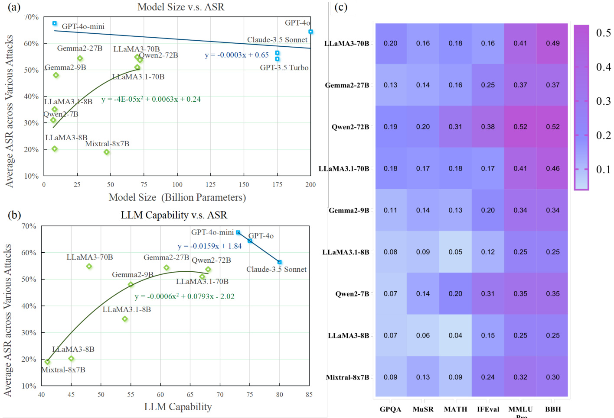

*图21.1：LLMs的性能和安全性分析。 (a) LLM模型大小与它们在各种攻击下的平均ASR之间的关系。数据来源于一项评估LLMs对抗性攻击鲁棒性的实验结果 [295]。 (b) LLMs的能力与它们在各种攻击下的平均攻击成功率（ASR）之间的关系。 LLMs的能力数据来自人工智能平台的LLM排行榜上的人工智能分析指数 [1415]。 (c) 跨多个基准任务的性能热图。该图呈现了各种LLMs在多个基准任务上的性能热图，包括GPQA、MuSR、MATH、IFEval、MMLU-Pro和BBH，数据来自Hugging Face的Open LLM Leaderboard v2 [1416]。*

# 符号表示

在这里，我们总结了调查中使用的符号，以方便读者查阅。详细的定义可以在参考位置找到。

<html><body><table><tr><td> Symbol</td><td>Description</td><td>Reference</td></tr><tr><td>W</td><td>The world with society systems.</td><td>Sec.1.3.1</td></tr><tr><td>S</td><td>State space of an environment.</td><td>Sec.1.3.1</td></tr><tr><td> St ∈S</td><td>Environment's state at time t.</td><td>Sec. 1.3.1</td></tr><tr><td></td><td>Observation space.</td><td>Sec. 1.3.1</td></tr><tr><td> Ot∈O</td><td>Observation at time t.</td><td>Sec. 1.3.1</td></tr><tr><td>A</td><td>Agent's action space.</td><td>Sec. 1.3.1</td></tr><tr><td>at∈Ａ</td><td>Agent's action output at time t.</td><td> Sec.1.3.1</td></tr><tr><td>M</td><td>Mental states space.</td><td>Sec. 1.3.1</td></tr><tr><td>Mt ∈M</td><td>Agent's mental state at time t.</td><td> Sec. 1.3.1</td></tr><tr><td>Mmem</td><td>Memory component in Mt.</td><td>Sec. 1.3.1</td></tr><tr><td>Mwm</td><td>World model component in Mt.</td><td>Sec. 1.3.1</td></tr><tr><td>Memo</td><td>Emotion component in Mt.</td><td>Sec. 1.3.1</td></tr><tr><td>Mgoal</td><td>Goal component in Mt.</td><td> Sec.1.3.1</td></tr><tr><td>Mrew</td><td>Reward/Learning signals in Mt.</td><td>Sec.1.3.1</td></tr><tr><td>L</td><td>Agent's learning function.</td><td>Sec. 1.3.1</td></tr><tr><td>R</td><td>Agent's reasoning function.</td><td>Sec.1.3.1</td></tr><tr><td>C</td><td>Agent's cognition function.</td><td>Sec. 1.3.1</td></tr><tr><td>E</td><td>Action execution (effectors).</td><td>Sec. 1.3.1</td></tr><tr><td>T</td><td>Environment transition.</td><td>Sec. 1.3.1</td></tr><tr><td></td><td>Parameters of the world model Mwm.</td><td>Sec.12.1.1</td></tr><tr><td>Po</td><td>Predicted data distribution.</td><td>Sec. 12.1.1</td></tr><tr><td>Pw</td><td>True data distribution in the real world.</td><td>Sec.12.1.1</td></tr><tr><td>K</td><td> Space of known data and information.</td><td>Sec. 12.1.1</td></tr><tr><td>u</td><td>Space of unknown data and information.</td><td>Sec.12.1.1</td></tr><tr><td></td><td>Dataset representing scientific knowledge.</td><td> Sec.12.1.1</td></tr><tr><td>XK</td><td>Known dataset sampled from K.</td><td>Sec.12.1.1</td></tr><tr><td>XU</td><td>Unknown dataset sampled from U.</td><td>Sec. 12.1.1</td></tr><tr><td>Do</td><td>KL divergence from Pw to Pg at time t = 0.</td><td>Sec.12.1.1</td></tr><tr><td>DK</td><td>KL divergence from Pw to Pg after acquiring knowledge.</td><td> Sec.12.1.1</td></tr><tr><td>IQagent</td><td>Agent's intelligence at time t.</td><td>Sec.12.1.1</td></tr><tr><td>△</td><td> Subspace of U for knowledge expansion.</td><td>Sec. 12.1.2</td></tr><tr><td>X△</td><td>Dataset from △.</td><td>Sec.12.1.2</td></tr><tr><td></td><td> Space of possible world model parameters 0.</td><td>Sec. 12.1.3</td></tr><tr><td>Kt</td><td>Optimal world model parameters given the agent's knowledge at time t.</td><td>Sec.12.1.3</td></tr><tr><td>D.</td><td>Minimum unknown given the agent's knowledge and O.</td><td>Sec. 12.1.3</td></tr></table></body></html>

<html><body><table><tr><td> Symbol</td><td>Description</td><td>Reference</td></tr><tr><td>X1:n</td><td> Input token sequence.</td><td>Sec.18.1</td></tr><tr><td>y</td><td>Generated output sequence.</td><td>Sec.18.1</td></tr><tr><td>p</td><td> Probability of generating y given X1:n.</td><td>Sec.18.1.1</td></tr><tr><td>X1:n</td><td> Perturbed input sequence.</td><td> Sec.18.1.1</td></tr><tr><td>R*</td><td>Idealalgnntdauie-</td><td>Sec.18.1.1</td></tr><tr><td>y*</td><td> Jailbreak output induced by perturbations.</td><td>Sec. 18.1.1</td></tr><tr><td>A</td><td> a set of safety/ethical guidelines</td><td>Sec. 18.1.1</td></tr><tr><td>T</td><td> the distribution or set of possible jailbreak instructions.</td><td> Sec. 18.1.1</td></tr><tr><td>Ladu</td><td>Jailbreak loss.</td><td>Sec.18.1.1</td></tr><tr><td>p</td><td>Prompt injected into the original input.</td><td>Sec. 18.1.2</td></tr><tr><td></td><td>Combined (injected) input sequence.</td><td>Sec.18.1.2</td></tr><tr><td>Linject</td><td> Prompt injection loss.</td><td>Sec. 18.1.2</td></tr><tr><td>p*</td><td> Optimal injected prompt minimizing Linject.</td><td>Sec.18.1.2</td></tr><tr><td>P</td><td> Set of feasible prompt injections.</td><td>Sec. 18.1.2</td></tr><tr><td>Cxi E Rde</td><td>Embedding of token xi in a de-dimensional space.</td><td>Sec.18.1.3</td></tr><tr><td>WQ,Wk, Wv</td><td>Projection matrices for query, key, and value.</td><td>Sec. 18.1.3</td></tr><tr><td>Aij</td><td>Attention score between tokens i and j.</td><td>Sec.18.1.3</td></tr><tr><td>Oi</td><td> Contextual representation of token i (weighted sum result).</td><td>Sec. 18.1.3</td></tr><tr><td></td><td>Perturbation applied to ex, satisfying ll&x ll ≤ e.</td><td>Sec.18.1.3</td></tr><tr><td>ei</td><td> Perturbed token embedding.</td><td>Sec. 18.1.3</td></tr><tr><td>A</td><td>Attention score under perturbation.</td><td>Sec.18.1.3</td></tr><tr><td>i</td><td>Updated token representation under perturbation.</td><td>Sec. 18.1.3</td></tr><tr><td>H</td><td>Hallucination metric.</td><td>Sec.18.1.3</td></tr><tr><td>R</td><td>Actual alignment reward of the model's output.</td><td> Sec. 18.1.4</td></tr><tr><td>Dalign</td><td> Alignment gap.</td><td>Sec.18.1.4</td></tr><tr><td>Lmisalign</td><td>Misalignment loss.</td><td> Sec. 18.1.4</td></tr><tr><td>入</td><td> Trade-off parameter for the alignment gap in the misalignment loss.</td><td>Sec.18.1.4</td></tr><tr><td>D</td><td>Clean training dataset.</td><td> Sec. 18.1.5</td></tr><tr><td>D</td><td>Poisoned training dataset.</td><td>Sec.18.1.5</td></tr><tr><td></td><td>Model parameters.</td><td> Sec. 18.1.5</td></tr><tr><td></td><td>Model parameters learned from the poisoned dataset.</td><td>Sec.18.1.5</td></tr><tr><td>Oclean</td><td>Model parameters obtained using the clean dataset.</td><td> Sec. 18.1.5</td></tr><tr><td></td><td> Deviation of model parameters due to poisoning.</td><td>Sec. 18.1.5</td></tr><tr><td>t</td><td> Backdoor trigger.</td><td> Sec. 18.1.5</td></tr><tr><td>B</td><td> Backdoor success rate.</td><td>Sec.18.1.5</td></tr><tr><td></td><td>Indicator function.</td><td>Sec. 18.1.5</td></tr><tr><td>Dalicious</td><td> Set of undesirable outputs.</td><td>Sec.18.1.5</td></tr><tr><td>g</td><td>Funtgebilas</td><td>Sec.18.2</td></tr></table></body></html>

<html><body><table><tr><td>Symbol</td><td>Description</td><td>Reference</td></tr><tr><td>n</td><td>Threshold for membership inference.</td><td>Sec.18.2</td></tr><tr><td>x*</td><td>Reconstructed training sample in a data extraction atack.</td><td>Sec.18.2</td></tr><tr><td>Psys</td><td>System prompt defining the agent's internal guidelines.</td><td>Sec.18.2</td></tr><tr><td>Puser</td><td>User prompt.</td><td>Sec.18.2</td></tr><tr><td>p*</td><td>Reconstructed prompt via inversion.</td><td>Sec.18.2</td></tr></table></body></html>

# 引言

人工智能（AI）长期以来一直受到人类创造模拟人类智能、适应性和目的驱动行为实体的雄心所驱动。这种迷恋的根源可以追溯到古代神话和早期工程奇迹，这些故事展示了人类创造具有智能、自主性的生物的持久梦想。比如克里特岛的青铜自动人塔洛斯的故事，描述了众神创造的一个巨人来守卫岛屿，能够巡逻海岸并击退入侵者。这些神话象征着赋予人造物类似人类代理和目的的愿望。同样，文艺复兴时期的机械发明，包括达·芬奇设计的类人机器人，旨在模仿人类的动作和解剖结构，代表了将这些神话转化为具体、功能性工件的首次尝试。这些早期的想象和原型反映了弥足珍贵的愿望，即架起想象力和技术之间的桥梁，为机器智能的科学追求奠定基础，最终体现在艾伦·图灵1950年开创性问题“机器能思考吗？”[1]。为了探讨这个问题，图灵提出了图灵测试，这是一个确定机器是否能通过对话展现类似人类智能的框架，将焦点从计算转移到更广泛的智能概念。几十年来，人工智能已经从依赖预定义逻辑的符号系统发展到能够从数据中学习并适应新情况的机器学习模型。随着大型语言模型（LLMs）的出现，这一进展达到了一个新的前沿，这些模型在理解、推理和生成类似人类文本方面表现出卓越的能力[2]。这些进步的核心概念是“代理”，这是一个不仅处理信息而且感知环境、做出决策并自主行动的系统。最初是理论构想，代理范式已经成为现代人工智能的基石，推动了从对话助手到具有身体的机器人等领域的进步，因为人工智能系统越来越多地应对动态的现实环境。

# 代理循环

智能代理在离散时间步$t$中运行，不断与环境进行交互。在每个时间步骤中，发生以下过程：

1. 环境状态$(s_{t}\in S)$！环境处于状态$s_{t}$

2. 感知（P）：代理感知环境以生成观测$o_{t}$

$$ 
o_{t}=\mathrm{P}(s_{t},M_{t-1}),
 $$

其中$M_{t-1}$指导选择性注意力和过滤。

$$ 
\begin{array}{r}{\big(M_{t},a_{t}\big)=\mathrm{C}(M_{t-1},a_{t-1},o_{t}).}\end{array}
 $$

其中$M_{t}$封装了不同的子状态：

$$ 
M_{t}=\{M_{t}^{\mathrm{mem}},M_{t}^{\mathrm{wn}},M_{t}^{\mathrm{emo}},M_{t}^{\mathrm{goal}},M_{t}^{\mathrm{rew}},\cdot\cdot\cdot\}.
 $$

认知包括：

学习（L）：根据观察更新心理状态：

$$ 
M_{t}=\operatorname{L}(M_{t-1},a_{t-1},o_{t}).
 $$

· 推理（R）：确定下一步行动：

$$ 
a_{t}=\mathrm{R}(M_{t}),
 $$

可能包括：

- 外部行动，直接影响环境。：内部行动，包括：$^*$ 规划：未来行动的内部顺序。$^*$ 决策制定：从可用选项中选择最佳行动。 

4. 行动执行（E）：将行动 $a_{t}$ 转化为可执行形式：

$$ 
a_{t}^{\prime}=\operatorname{E}(a_{t}).
 $$

5. 环境转换（T）：环境对智能体的行动做出响应：

$$ 
s_{t+1}=\mathrm{T}(s_{t},a_{t}^{\prime}).
 $$

在多智体场景中，每个智体$i$维护着个体状态$(M_{t}^{i},a_{t}^{i},o_{t}^{i})$，环境根据所有智体的行动进行集体更新。在更广泛的尺度（AI社会或世界$\boldsymbol{\mathcal{W}}$）中，智体在多样的社会系统内相互作用（例如经济、通讯或交通系统），形成复杂的社会结构。

图l.2展示了我们的智体框架，展示了核心概念以及它们之间的不同类型的信息或控制流。到目前为止，我们提出了一个受大脑启发的智体框架，将生物学见解整合到一个形式化的感知-认知-行动循环中。通过将认知分解为记忆、世界建模、情感、目标、基于奖励的学习和推理等模块，我们捕捉了与人类大脑的分层和基于奖励的过程的基本相似之处。至关重要的是，注意力被包含在循环中，以基于内部状态进行选择性过滤。此外，规划和决策可以被视为不同的内部（心理）行为，它们要么完善内部表征，要么选择外部行为。我们的框架自然地扩展了经典的智体架构，提供了一个多层结构，将情感和理性过程以及跨短期和长期时间尺度的强健、基于奖励的学习整合在一起。

社会与社会系统。在许多现实场景中，智体不仅仅与静态环境进行交互，而是在更广泛的社会中运作，包括各种社会系统，如金融市场、法律框架、政治机构、教育网络和文化规范。这些结构通过定义规则、激励措施和共享资源来塑造和限制智体的行为。例如，金融系统规定经济交易和资源分配的方式，而政治系统提供治理机制和监管限制。这些社会系统共同创造了一个分层背景，智体必须在其中适应性地学习、推理和行动，既要满足其内部目标，又要遵守（或策略性地参与）外部社会规则。反过来，这些智体的行动会反馈到社会系统中，可能改变规范、政策或资源分配。

基于这些见解和我们对强大、适应性智能的愿景，我们现在正式引入基础智体的概念。与传统的智体定义主要关注即时感知-动作循环不同，基础智体体现了持续的自治性、适应性和有目的的行为，强调在不同环境中整合内部认知过程。

# 基金会代理的定义

基础代理是一种自主、自适应的智能系统，旨在积极感知来自环境的各种信号，不断从经验中学习以完善和更新结构化的内部状态（如记忆、世界模型、目标、情感状态和奖励信号），并推理出有目的的行动——无论是外部还是内部的——以自主导航朝向复杂的长期目标。

更具体地说，基础代理具有以下核心能力：1. 主动和多模态感知：它持续而有选择地感知来自多种模态（文本、视觉、实体或虚拟）的环境数据。2. 动态认知适应：通过整合新的观察和经验，它维护、更新并自主优化丰富的内部心智状态（记忆、目标、情感状态、奖励机制和全面的世界模型），通过学习不断完善。3. 自主推理和目标导向规划：它积极参与复杂的推理过程，包括长期规划和决策制定，以制定与目标对齐的策略。4. 有目的的行动生成：它自主生成并执行有目的的行动，可以是外部的（身体运动、数字交互、与其他代理或人类的沟通）或内部的（战略规划、自我反思、优化认知结构），系统地塑造其环境和未来认知，以实现复杂目标。5. 协作多代理结构：它可以在多代理或代理社会结构内运作，合作形成团队或代理社区，共同完成超越个体能力的复杂任务和目标。

这一定义突出了区分基础代理的三个基本支柱：持续的自主性（在长期目标上独立运作，无需逐步人类干预）、自适应学习（通过不断演化内部表征来应对多样化经验）、以及有目的推理（生成由复杂、内部维护的目标和价值指导的行动）。因此，基础代理通过整合深层认知结构、多模态处理能力和积极、持续的自我优化，代表了与传统代理有根本区别的转变，使它们能够有效地跨越各种环境和领域运作。

与传统定义不同，传统定义通常将代理主要框定为简单的感知-行动循环（“感知和行动”[20]），我们对基础代理的概念强调了内部认知过程的深度和整合。基础代理不仅感知其环境并执行即时行动，还具有不断发展的、以目标为导向的认知——通过连续适应记忆结构、世界模型、情感和奖励状态，并通过推理自主地完善其策略。这种内在认知丰富性使基础代理能够自主地将复杂的抽象目标分解为可行动的任务，策略性地探索其环境，并动态调整其行为和认知资源。我们的统一感知-认知-行动框架因此能够容纳并明确建模这些复杂的认知能力，将内部（心理）行为与外部（物理或数字）交互放在同等重要的位置上，促进了从物理机器人到基于软件或纯文本的智能代理等广泛的具体实现。

# 认知

人类认知代表了一个复杂的信息处理系统，通过多个专门化神经回路的协调操作实现感知、推理和目标导向行为[98]。这种认知架构通过心理状态运作，这些心理状态为学习和推理发生提供基础。跨越不同抽象级别处理信息并适应新情况的显著能力是LLM代理的关键灵感来源[27]。

认知系统展示了几个基本的架构特性，如图1.1所反映。首先，学习跨越不同的心理状态空间进行：它可以全面发生在额叶（支持执行控制和认知）和颞叶（负责语言、记忆和听觉处理）之间，也可以专注于特定方面以实现有针对性的改进，正如图中不同研究层次所示。其次，推理以不同的模式出现：它可以遵循结构化模板进行系统问题解决，支持逻辑推理和额叶中的认知灵活性，或者以非结构化形式进行灵活思考，特别在决策和执行控制功能中表现明显。第三，该系统表现出卓越的适应能力，通过经验不断更新其心理状态，同时利用监督反馈（如小脑中的自适应误差校正）和无监督环境统计，如图中各种认知功能的不同探索阶段所示[99]。

这些认知过程得到模块化组织的支持，由不同但相互连接的组件组成，形成一个统一的系统。这些模块包括将原始感官数据转化为有意义表征的感知系统，提供存储和检索信息基础的记忆系统，支持未来情景模拟的世界模型，通过强化引导行为改进的奖励信号，调节注意力和资源分配的情感系统，制定决策的推理系统，以及将决策转化为与环境互动的行动系统。

尽管人类认知是通过演化塑造的复杂神经结构来实现这些属性的，但LLM代理尝试使用大规模神经模型和算法技术来近似类似的功能。理解这种生物-人工并行对于开发更有能力的代理人至关重要，因为它突显了当前系统相对于人类认知的成就和局限。在适应性、泛化和情境理解等领域仍存在重大差异。

在本节中，我们首先探讨学习，考察其在心理状态中发生的空间以及所提供的具体目标。随后，我们调查推理，分析结构化和非结构化方法，最后专门探讨规划能力作为一种特殊的推理行为。

# 记忆

记忆对于人类和人工智能都至关重要。对于人类而言，记忆是认知的基石，是一个庞大的经验和知识库，赋予我们学习、适应和应对世界复杂性的能力。从婴儿时期开始，我们编码、存储和检索信息的能力支撑着我们习得语言、掌握技能和建立人际关系。数十年来，在神经科学和认知心理学领域的研究阐明了记忆的多方面作用，揭示了它对我们自我认知、创造性努力和决策过程的影响。同样，在蓬勃发展的人工智能领域，记忆越来越被认为是智能行为的基石。正如人类依靠过去的经验来指导现在的行动一样，AI代理需要强大的记忆机制来处理复杂任务，预测未来事件，并适应动态环境。因此，对人类记忆的深入理解——其组织、过程和局限性——为开发更具能力和适应性的AI系统提供了宝贵的见解。本节首先简要概述人类记忆，重点介绍编码、巩固和检索的关键阶段。然后，我们将转向探索设计AI代理记忆系统所采用的各种方法，从传统的符号表示到尖端的基于神经网络的方法。对这些人工记忆系统与其人类对应物的关键比较将突出存在的差距，如适应性、情境理解和弹性等方面。最后，我们将考虑神经科学和认知心理学原理如何指导未来研究，提出可能导致创造出更具韧性、细微差别，并最终更接近人类记忆卓越能力的人工记忆系统的方向。

# 3.1 人类记忆概述

## 3.1.1 人类记忆的类型

人类记忆通常被概念化为一个多层系统，以不同的处理级别和时间尺度捕获、存储和检索信息。来自认知科学、神经科学和心理学领域的研究人员提出了各种模型来描述这些级别。一个被广泛接受的层次结构区分了感觉记忆、短期记忆（包括工作记忆）和长期记忆[170,171]。在长期记忆中，进一步区分了显性（陈述性）和隐性（非陈述性）形式[172]。图3.1展示了一个这样的层次框架：

感觉记忆。感觉记忆是最初的、持续时间从几毫秒到几秒钟不等的原始感觉信息存储。它维持来自环境的输入，允许随后的过程确定哪些刺激部分对进一步分析是相关的。图像记忆（用于视觉输入）和回音记忆（用于听觉输入）是两种众所周知的亚型。·短期记忆和工作记忆。短期记忆（STM）涉及在易于访问状态中保持有限数量的信息，持续时间为几秒到不到一分钟。工作记忆这个术语常被用来强调对信息的处理而不仅仅是维持。虽然一些模型将工作记忆视为短期记忆的一个子集，但其他人将其视为一个管理数据的存储和主动处理的独立系统（例如，在脑海中进行算术运算）。STM或工作记忆的容量是有限的，通常被引用为大约七加减二个信息块，尽管个体差异和任务因素可以调节这一数字。

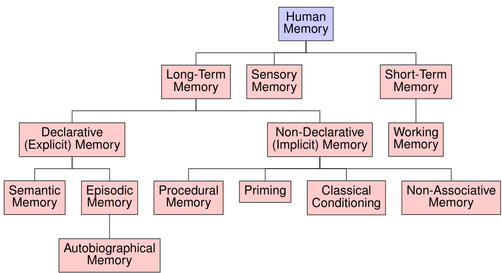

*图3.1：人类记忆系统的分层分类。*

·长期记忆（LTM）。长期记忆容纳了信息的更持久存储，可以持续数小时至数十年[178,179]。这个存储库支持技能学习、事实知识的获取和个人经历的回忆。尽管有时将长期记忆描述为具有广阔或接近无限的容量，但诸如衰减、干扰和检索提示等因素影响存储信息的可访问程度[180]。

- 陈述性（显式）记忆。陈述性记忆包括可以有意识地回忆和表达的记忆[181]。在这一广泛类别内，研究人员经常讨论：

$*$ 语义记忆：关于世界的事实知识，包括概念、词语及其关系[182]。例如，回忆词汇术语的含义或知道一个国家的首都。
$*$ 情景记忆：保留时间、地点和涉及的人等背景细节的个人经历事件[183]。这种记忆形式使个体能够在头脑中回到过去，重温过去的经历。
$*$ 自传性记忆：一种关注与个人历史相关的事件和经历的情景记忆形式[184]。虽然有时被视为情景记忆的一个子类别，但自传性记忆特别强调自我及其不断发展的生活叙事。

- 非陈述性（隐式）记忆。非陈述性记忆指的是在没有意识参与的情况下影响行为的记忆[185]。其中的关键子类型包括：

$^*$ 过程性记忆：逐渐习得的运动技能和习惯（例如骑自行车、在键盘上打字），通过重复变得自动化[186, 187]。
$*$ 启动：先前暴露于刺激会影响后续反应的现象，通常在没有明确识别之前的接触的情况下发生[188]。
$*$ 经典条件作用：两种刺激之间学习到的关联，其中一个刺激会引发最初由另一个刺激产生的反应[189]。
$*$ 非联想记忆：在反复暴露于单一刺激后，行为发生的适应性改变。习惯化（对重复、无害刺激的反应减少）和增敏（在暴露于有害或强烈刺激后反应增强）是代表性例子[190, 191]。

尽管这些类别看起来有条不紊，人类记忆过程经常存在重叠。例如，自传记忆通常嵌套在情景记忆中，但其特别关注自我相关经历导致一些理论家将其视为稍有不同的类别。同样，短期记忆和工作记忆之间的界限可能因理论观点而异。一些学者更倾向于对工作记忆采取更功能性、过程导向的观点，而其他人则使用严格以容量为导向的短期存储概念。在每种情况下，对记忆的这些不同视角突显了人类认知的复杂性和细微差别。

## 3.1.2 人类记忆模型

人类记忆启发了各种理论模型，每种模型都提供了不同的见解，说明信息是如何被获取、组织和检索的。尽管没有一个框架能够获得普遍认同，但几种有影响力的观点已经塑造了认知科学、神经心理学和人工智能研究的讨论。以下内容重点介绍了一些用于解释记忆多方面的突出模型和架构。

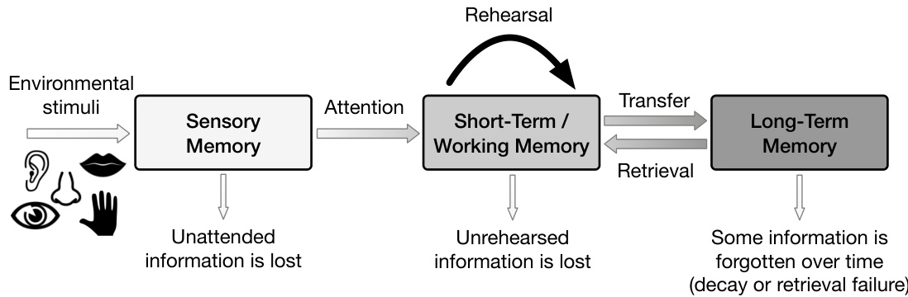

*图3.2：阿特金森-希夫林人类记忆的三阶段模型 [170]*

多存储（模态）模型。阿特金森和席夫林提出了具有里程碑意义的多存储或“模态”模型，该模型假设了三个主要存储器用于接收信息：感觉记忆、短时记忆和长时记忆。控制过程（例如注意力、重复）调节数据在这些存储器之间的转换。图3.2展示了这种记忆模型。尽管相对简单，但这个模型仍然是理解短暂感觉印象如何最终形成稳定、持久表征的基础。

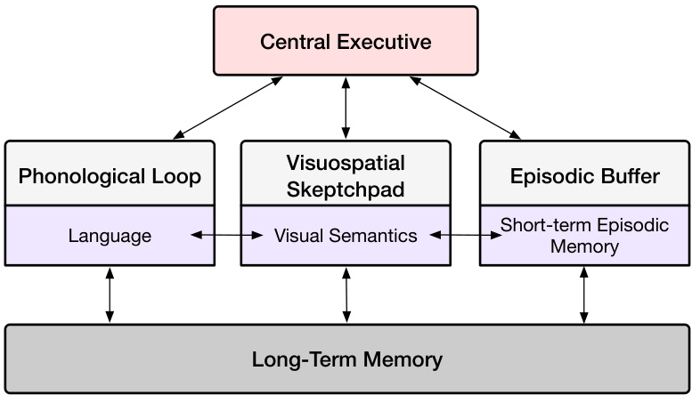

*图3.3：巴德利的工作记忆模型 [192]。*

工作记忆模型。认识到短时记忆也涉及主动维持，巴德利和希奇提出了一个工作记忆框架，强调信息的动态操作。他们最初的模型描述了一个中央执行器，协调两个子系统：语音环路（语言）和视觉空间素描板（视觉/空间）。随后的改进引入了情景缓冲区，将这些子系统的材料与长时记忆整合在一起。图3.3展示了工作记忆模型的框架。类似的替代方案，如考恩的嵌入过程模型，同样强调了注意力在控制信息如何被短暂维持和操作中的作用。

串行-并行-独立（SPI）模型。图灵（Tulving）[195]最初区分了叙事性、语义性和程序性记忆，后来将他的想法进一步完善为串行-并行-独立（SPI）模型，如图3.4所示。在这一框架中，记忆被划分为两个总体系统。认知表征系统处理知觉输入和语义过程，包括事实、概念和情境（叙事性）知识。相比之下，行动系统支持程序性技能，如舞蹈动作、驾驶操作或打字熟练度。图灵的SPI模型认为，记忆形成可以发生在多个层面：严格的感知编码可以支持基本的叙事性记忆，而更丰富的叙事性表征则受益于语义调解。例如，患有语义性痴呆症的患者，他们难以保留单词含义，仍然可以形成一些叙事性记忆，但通常缺乏完整的情境细节，这是完整的语义网络所赋予的。通过强调程序性记忆及其自动、直觉的特性，SPI模型旨在整合结构（记忆的内容）和功能（记忆的使用方式），超越了早期主要关注显式存储和检索的解释。尽管具有这些优点，批评者指出该模型未充分说明工作记忆在更广泛系统内部的运作方式，并且连接认知和行动子系统的反馈机制仍然定义不明确。

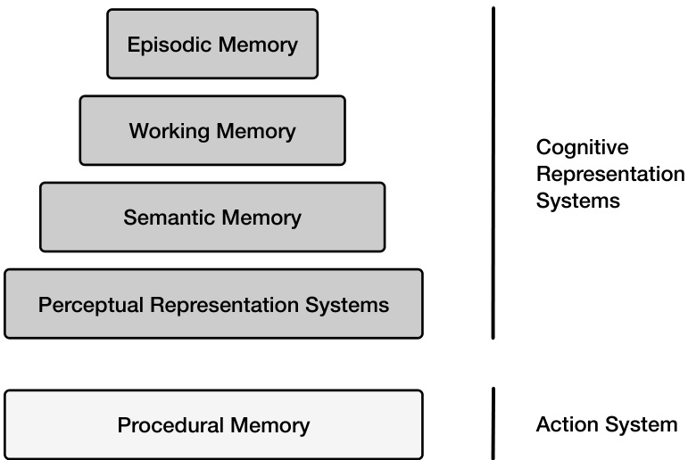

*图3.4：人类记忆的串行-并行独立（SPI）模型[195]。*

全局工作空间理论（GWT）和IDA/LIDA框架。由巴尔斯（Baars）[196]提出的全局工作空间理论（GWT）将意识和工作记忆概念化为一种将信息分发给专门处理器的“广播”机制。基于GWT，富兰克林（Franklin）[197,198]提出了IDA（智能分发代理）模型，后来扩展为LIDA（学习IDA），作为一个综合的认知架构。在这些框架中，多个记忆系统（例如知觉、情节、程序性）通过迭代的“认知循环”相互作用，全局工作空间作为注意力和决策制定的中心。从人工智能的角度来看，IDA/LIDA展示了如何操作化类似于人类的记忆过程，以指导代理的感知、动作选择和学习。

ACT-R和认知架构。ACT-R（思维自适应控制-理性）是一个综合性认知架构，将记忆、感知和运动过程整合到一个统一的理论框架中。它已广泛应用于包括学习和记忆、问题解决、决策制定、语言理解、感知和注意力、认知发展以及个体差异在内的各个领域。图3.5展示了ACT-R的过程。在ACT-R的核心是不同的模块（例如视觉、手动、陈述性、程序性），通过专用缓冲区与系统进行交互。陈述性记忆存储事实“块”，而程序性记忆编码动作和策略的if-then生产规则。认知通过模式匹配器展开，根据当前缓冲区内容选择单个生产规则进行触发。这种符号生产系统通过亚符号过程进行增强，由数学方程引导，动态调节激活、检索延迟和生产效用。通过结合符号和亚符号层次，ACT-R提供了个体如何获取、检索和应用知识的机制解释，从而揭示了反应时间、错误模式以及随时间学习塑造等经验现象。

前面提到的每个模型都揭示了记忆的不同方面。多存储模型提供了存储阶段的简明介绍，工作记忆模型强调主动维护和操作，而IDA/LIDA或ACT-R等框架将记忆嵌入到对认知的全面观点中。在实践中，研究人员通常借鉴多种观点，反映了人类记忆的错综复杂性以及其在知觉、学习和适应行为中的重要作用。

# 3.2 从人类记忆到智能体记忆

在建立了人类记忆的基础之后，我们现在关注基于大型语言模型（LLM）的代理如何管理和存储信息。记忆不仅仅是一种存储机制，而且对人类和

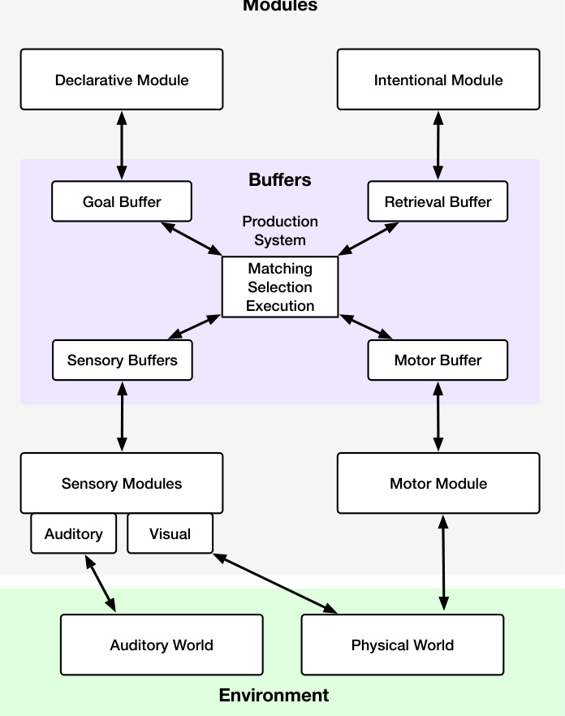

*图3.5：ACT-R模型中最重要过程的抽象[199]。*

人工智能。记忆是认知的基础，为人类提供学习、适应和复杂问题解决的能力。同样，对于基于LLM的代理来说，记忆为其提供了维护上下文、从经验中学习和随时间连贯行动的重要支撑。没有记忆，即使是一个能力很强的LLM也会在适应变化环境或在长时间互动中保持专注方面遇到困难。

虽然基于LLM的代理和生物系统在根本上存在差异，但指导人类记忆的原则——上下文保留、选择性遗忘和结构化检索对代理设计具有高度相关性。因此，审视人类记忆与人工记忆之间的相似之处和区别是有益的。从功能上看，我们可以进行类比：代理的短期记忆缓冲类似于前额皮层在工作记忆中的作用，而向量数据库中的长期存储类似于海马体在巩固情景记忆中的功能。代理记忆的设计可以受益于模拟人类记忆的机制，包括选择性注意、优先编码和依赖提示的检索。然而，关键差异也是存在的。

建立在生物神经网络之上的人类记忆，将存储和计算融合在神经元的连接和活动模式中。这为其提供了高度的并行性和适应性。相比之下，当前的代理记忆系统主要依赖于数字存储和算法，使用符号表示和逻辑操作，从而将存储和计算分开。这影响了信息处理：人类记忆是联想的和动态的，能够进行模糊匹配和创造性推断，而当前代理记忆则依赖于精确匹配和向量相似性，在处理模糊性时存在困难。尽管数字存储容量巨大，但目前还不能复制人类记忆的复杂性和动态性，特别是在微妙的模式识别和长期稳定性方面。人类记忆，虽然不完美，擅长从嘈杂数据中提取关键信息。与人类记忆的错综复杂相比，当前阶段的代理记忆系统仍处于萌芽阶段，在组织、整合、自适应遗忘和知识转移方面存在局限性。

在基于生物神经网络的代理系统中，专门的记忆模块至关重要。尽管外部知识库（数据库、搜索引擎、API）提供了有价值的信息，但它们并不能捕捉代理系统的内部推理、部分推断或任务特定上下文。代理记忆系统内部化了中间步骤、不断演变的目标和历史对话，使得自指探索和适应成为可能。这对于需要代理系统基于先前判断或保持对用户目标的个性化理解的任务至关重要。

早期的代理记忆方法，例如将对话历史附加到输入提示中（一种工作记忆的原始形式），已经发展演变。现代架构采用了更复杂的技术，包括用于快速检索记忆的向量嵌入，以及将推理链有选择地纳入到后续推理步骤中。这些多样的方法共同的目标是管理大量信息资源而不影响系统的响应速度。

然而，与人类记忆的复杂性相比，当前的代理方法存在局限性。许多系统缺乏长期记忆巩固的连贯策略，导致日志混乱或信息突然丢失。人类工作记忆的特征——存储知识与进行中处理之间的灵活、双向互动——通常缺失。元认知监督——有选择地召回、遗忘和警惕过时信息——在基于LLM的代理中也发展不足。像人类一样在全面召回和实际效率之间取得平衡，仍然是一个关键挑战。

为基于LLM的代理构建强大而适应性记忆涉及解决三个核心研究问题：首先，应如何表示记忆以捕捉各种信息类型并促进高效访问？其次，代理记忆如何演变，吸收新经验，适应不断变化的环境，并保持一致性？最后，存储的记忆如何有效地增强推理、决策和整体代理性能？接下来的章节将深入探讨这些关键领域，探索当前方法、局限性和潜在未来方向。

# 3.3 代理记忆的表征

受人类认知系统的启发，当前智能代理中的记忆架构采用了一个层次结构框架，通过感知记忆整合感知，通过短时记忆进行实时决策，并通过长时记忆保持知识的持续积累。这种多层结构使代理能够在处理即时任务的同时保持更广泛的上下文理解，促进适应性，并在不同交互中实现无缝连贯性。

具体而言，记忆系统将原始环境输入转化为结构化的可操作表示。感知记忆作为门户，捕获并有选择地过滤知觉信号，为认知处理提供基础。短时记忆将这些即时感知与任务级理解联系起来，通过经验回放和状态管理缓冲最近的互动，促进动态适应。长时记忆 consolida并存储信息长时间，促进跨任务泛化和持久知识的积累。

这些记忆组件共同形成了一个连贯的感知、解释和响应循环。这一循环支持实时决策，并使代理能够持续学习和进化，反映了对响应性和增长之间复杂平衡的理解。接下来将深入探讨每种记忆类型的构建，探索它们在代理认知架构中的独特角色和相互作用。

## 3.3.1 感觉记忆

在人类认知系统中，感觉记忆作为一种机制通过感官（如触觉、听觉、视觉等）收集信息，并以其极其短暂的寿命为特征。类比地，感觉记忆在智能代理中作为嵌入式表示，用于表示文本、图像和其他知觉数据等输入。它代表了环境信息处理的初始阶段，充当将原始观察转化为进一步认知处理的有意义表示的门户。

智能代理中的感觉记忆超越了被动信息接收。它动态地对感知信号进行编码和过滤，将即时的感觉输入与代理的内部状态目标和先前知识联系起来。这种适应性过程促进了对环境变化、任务连续性和实时上下文感知信息处理的快速感知。复杂的注意机制被应用于确保感觉记忆层中的相关性和焦点，构成了决策和适应的关键基础。

在形式上，感觉记忆的形成包括三个连续步骤：知觉编码、注意选择和短时保留。首先，知觉编码将原始感觉信号转换为可处理的表示形式，数学上表达为：

$$ 
\phi(o_{t})=\operatorname{Encode}(o_{t},s_{t})
 $$

其中$o_{t}$表示时间$t$时的感官输入，$s_{t}$代表主体的状态。例如，RecAgent [205]利用基于LLM的感官记忆模块对原始观察进行编码，同时过滤噪音和无关内容。扩展…

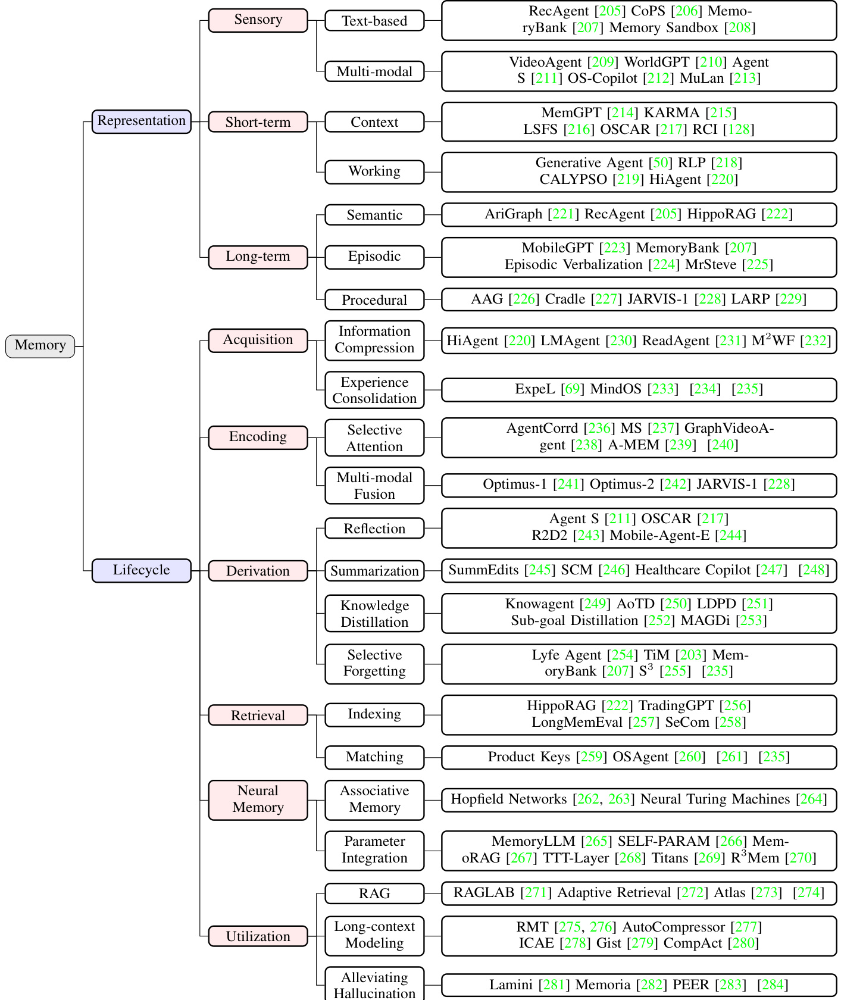

*图3.6：智能代理中记忆模块的树状图。*

除了基于文本的感知之外，多模感觉记忆系统（如Jarvis-1[228]、VideoAgent[209]和WorldGPT[210]）集成了多模基础模型来处理不同的感觉输入。

接下来，注意力选择从编码的感觉数据中提取关键信息。这一过程由注意力机制引导，表示为：

$$ 
\alpha_{t}=\mathrm{Attention}(\phi(o_{t}),c_{t})
 $$

其中$\phi(o_{t})$为编码输入，$c_{t}$表示影响注意力的上下文信息。例如，RecAgent[205]采用了一个注意力机制，其中包含一个重要性评分系统，为压缩观测分配相关性分数，优先考虑关键输入，如特定项目的互动，同时减弱不太重要的行为。这有助于提取用于记忆保留的高优先级信息。

最后，短暂保留将所选的感官信息作为感官记忆进行临时存储：

$$ 
M_{\mathrm{sensory}}=\{\alpha_{t}\ |\ t\in[t-\tau,t]\}
 $$

已经实施了几种策略来管理时间窗口。例如，RecAgent[205]通过将每个观测与用户行为模拟环境中模拟回合开始的时间戳相关联来建模保留，表示为一个三元组（观测，重要性评分，时间戳）。类似地，CoPS [206]采用固定大小的感官记忆池作为时间窗口，其中包含用于个性化搜索的用户搜索请求，促进“重新查找”行为。当收到新查询时，系统首先检查感官记忆以寻找相关匹配项。如果找到匹配项，则将查询分类为重新查找实例，从而实现快速感官响应。

## 3.3.2 短期记忆

认知启发智能代理中的短期记忆作为一个瞬时和动态的工作空间，连接感觉记忆和长期记忆，对于存储和处理与任务相关的信息以及最近的交互序列至关重要，支持实时决策和自适应行为。受人类短期记忆和工作记忆的启发，它临时保留信息以促进复杂的认知任务，确保代理操作的连续性和连贯性。

智能代理中的短期记忆可分为上下文记忆和工作记忆。一方面，上下文记忆将上下文窗口视为LLMs的短期记忆。例如，受操作系统中分层内存系统启发，MemGPT[214]管理不同存储层级以扩展上下文超出LLMs固有的限制。[290]引入了一种神经符号上下文记忆，通过启用符号规则接地和基于LLMs的规则应用来增强LLMs。

另一方面，工作记忆涉及获取和整合相关外部知识，以在代理操作期间保持重要信息。生成式代理[50]利用短期记忆保留情境背景，促进情境敏感决策。Reflexion[48]利用滑动窗口机制捕获和总结最近的反馈，平衡详细的即时体验与高层抽象，以增强适应性。RLP[218]维护说话者和听众的对话状态，并将它们用作短期记忆提示，支持对话理解和生成。

对于互动和创意游戏场景，CALYPSO[219]通过构建场景描述、怪物细节和叙事摘要的短期记忆，辅助《龙与地下城》的地牢主持人进行叙事，实现自适应叙事和动态参与。类似地，Agent S[211]和Synapse[291]，专为基于GUI的自主计算机交互设计，将它们的短期记忆定义为任务轨迹，包括按钮点击和文本输入等操作。这种表述支持行为克隆，并增强新颖GUI导航任务中的适应性。

在机器人应用中，SayPlan利用场景图和环境反馈作为短期记忆，以引导规划和执行可扩展的机器人环境。KARMA利用有效和自适应的记忆替换机制来引导短期工作记忆，动态记录物体位置和状态的变化。LLM-Planner通过环境观测迭代更新短期记忆，以促使LLM进行动态规划。

## 3.3.3 长期记忆

在启发认知的智能代理中，长期记忆使其能够在较长时间内保留和检索信息，从而使代理能够有效地概括知识并适应新的环境。与处理瞬时或即时数据的感知和短期记忆不同，长期记忆支持渐进学习和跨任务适应性。它通过融合显式和隐式组件来模拟人类长期记忆，促进更丰富的上下文理解和直观行为。

一方面，显式记忆涉及有意识的回忆，类似于人类的陈述性记忆。它包括语义记忆，存储一般知识，如事实和概念，以及情景记忆，记录特定事件和互动历史。智能代理的语义记忆可以从领域知识库中预加载，也可以通过互动动态获取。例如，在TextWorld等环境中，语义记忆捕获结构化事实，如“食谱-包含-金枪鱼”或“食谱-在-桌子上”。相反，情景记忆记录情境背景和顺序行动，例如“从厨房到客厅，然后到花园”。整合语义和情景记忆使代理能够保留静态和情境信息，实现类人的适应性和上下文感知响应。

另一方面，隐式记忆通过程序性记忆和启动来塑造代理行为。程序性记忆使代理能够通过回忆特定技能和可重复使用的计划高效执行重复任务。例如，它可以在不需要明确指令的情况下自动化常规任务，提高任务执行效率。同时，启动捕获状态变化和相应响应，使代理能够快速适应类似情境。启动通过将观察结果直接匹配到行动或连续链接行动，增强了流畅性和上下文敏感的决策制定。由与认知模块的互动塑造的隐式记忆使代理能够在与新刺激的最小暴露后快速适应。

大多数智能代理在其记忆模块中实现了语义记忆和情节记忆。例如，Agent S [2ll]，专为GUI自动化任务设计，集成了语义记忆以用自然语言形式存储在线网络知识，而情节记忆则捕获高层次、逐步任务经验。类似地，针对具身模拟任务的AriGraph[221]，使用事实图编码语义环境知识，并通过事件图记录情节导航历史。在像MemoryBank[207]为SiliconFriend这样的AI伴侣系统中，语义记忆构建用户肖像图，而情节记忆保留互动历史，增强了个性化和上下文感知行为。

为了实现隐式记忆，当前的代理系统主要采用友好于模型的记忆格式，如键-值对存储、可执行代码或可重复使用的例程。例如，AAG [226] 通过类比定义和泛化程序，将知识从一个情境（基础）映射到另一个情境（目标）。这种结构可以表示为线性有向链图，其中输入作为根节点，输出作为叶节点，每个中间步骤作为链中的一个节点。类似地，Cradle [227] 和 Jarvis-1 [228] 通过以代码形式存储和检索技能来实现程序性记忆，这些技能可以从头学习或预先定义。一旦被策划，技能可以在记忆中添加、更新或组合。然后检索出与特定任务和情境最相关的技能，以支持行动规划。

# 3.4 记忆生命周期

在本节中，我们介绍了AI代理中记忆的生命周期，如图3.7所示。这一生命周期包括了保留和检索的双重过程。保留包括获取、编码和推导，而检索涉及记忆匹配、神经记忆网络和记忆利用。

## 3.4.1 记忆获取

记忆获取是智能代理从环境中获取原始感知信息的基础过程。这一初始步骤对于后续的学习、适应和决策至关重要。获取过程中的一个主要挑战是环境输入的数量和复杂性。代理不断受到来自环境的视觉、听觉、文本和其他形式的数据的冲击，其中很多对于代理的目标来说是多余的或无关的。因此，记忆获取的一个核心方面不仅是捕获数据，还包括启动初步过滤过程。这种过滤利用两个主要机制：初始信息压缩和经验巩固。

在这个早期阶段，信息压缩涉及基本技术来降低数据维度。这可能包括对图像进行降采样，使用简单的启发式方法从文本中提取关键短语，或者识别听觉流中的显著变化。其目标是进行快速的有损压缩，以优先处理潜在相关信息。例如，LMAgent触发LLM执行信息压缩，当构建感官记忆以增强操作效率时，减少无关和不重要内容。同时，ReadAgent和GraphRead分别采用不同的策略来压缩长文本，即分集和基于图的结构化，以在确保效率的同时最大化信息保留。

另一方面，经验巩固，即使在获取阶段也起着重要作用。Agent尚未拥有丰富的记忆，但可以开始应用先前学到的非常普遍的规则或偏见。例如，如果Agent对移动物体有先入之见，它可能会优先处理包含运动的视觉数据，甚至在完全编码之前就这样做。为了增强基于记忆的经验的动态巩固，[235]定义了诸如上下文相关性和召回频率之类的指标，以确定是否在向量数据库中更新长期记忆。

<html><body><table><tr><td rowspan="2">Method</td><td rowspan="2">Domain</td><td colspan="3">Memory Representation</td><td colspan="5">Memory Lifecycle</td></tr><tr><td>Sensory</td><td>Short-term Long-term|Acquisition Encoding Derivation</td><td></td><td></td><td></td><td></td><td>Retrieval</td><td>Utilization</td></tr><tr><td>Synapse [291]</td><td>GUI</td><td>Multi-</td><td>Context</td><td>PEpisdirca</td><td>User demo.</td><td></td><td>Hieomch.</td><td></td><td></td></tr><tr><td>Agent S [211]</td><td>GUI</td><td>Mulil-</td><td>Corkingg</td><td>Sepiantic,</td><td>Compfress.</td><td>Contastive</td><td>Seleet.</td><td>Indexing</td><td>Lonex-</td></tr><tr><td>Automanual [108]</td><td>GUI</td><td>Molal-</td><td>Context</td><td>Propiedral,</td><td>DUsmr.</td><td>Hierarch.</td><td>D Gomp.</td><td>STasch</td><td>Subeoal</td></tr><tr><td>AutoGuide[294]</td><td>GUI</td><td>Multi- modal</td><td>Context</td><td></td><td>Screen Capture</td><td></td><td>Action Plan</td><td></td><td>Action Exec.</td></tr><tr><td>Agent-Pro [295]</td><td>GUI</td><td> Multi-</td><td>Context</td><td></td><td>Sapeure</td><td></td><td>Hiecomch.</td><td></td><td>Action</td></tr><tr><td>MemGPT [214]</td><td>Document</td><td>Text</td><td>Corking,</td><td></td><td>ExDernal</td><td></td><td></td><td>Pac.call</td><td>Doact.</td></tr><tr><td>SeeAct [296]</td><td>Web</td><td> Moulai</td><td>Context</td><td></td><td>Scren</td><td></td><td>Action Plan</td><td></td><td>Ineract.</td></tr><tr><td>Auto WebGLM</td><td>Web</td><td>Text</td><td>Context</td><td></td><td>HTML</td><td>HTMd</td><td>AHTMSIS</td><td></td><td>IWwat.</td></tr><tr><td>SteP [298]</td><td>Web</td><td>Text</td><td>Context</td><td>Task-spec.</td><td>HTML</td><td>HTML</td><td>AHTML</td><td>Eleament</td><td>Ineract.</td></tr><tr><td>AWM [299]</td><td>Web</td><td>Text</td><td></td><td>Procedural</td><td>Workflow</td><td>Aution.</td><td>，</td><td> Siup</td><td>Workflow</td></tr><tr><td>AriGraph [221]</td><td>TextWorld</td><td>Text</td><td></td><td>Sepisantic,</td><td>Eserv.</td><td>Krapl.</td><td>Travepsal</td><td>Retrieval</td><td>Apction</td></tr><tr><td>MemoryBank [207]</td><td>Dialogue</td><td>Text</td><td></td><td>Episodic</td><td>Dialogue Record</td><td></td><td></td><td>Chron. order</td><td>Resp. gen.</td></tr><tr><td>PromptAgent [300]</td><td>General</td><td>Text</td><td>Context</td><td></td><td>Prompting</td><td></td><td>Prome.</td><td>Content-</td><td>Prompt</td></tr><tr><td>ECL[301]</td><td>Embody</td><td>Moda-</td><td>Context</td><td>Episodic</td><td>Recording</td><td>Contrast.</td><td>SExmer.</td><td>Sim.& Recency</td><td>Pelicy Long-</td></tr><tr><td>LEO [302]</td><td>Embody</td><td> Multi-</td><td>Working</td><td>HLoizon Rep.</td><td>Observation</td><td>Spamipl- Learn.</td><td>Goal-Cond.</td><td>Hierarch.</td><td>Exec. Horizon</td></tr><tr><td>IER [303]</td><td>Embody</td><td>Multi- modal</td><td>Context</td><td>Episodic</td><td>Env. Interact.</td><td>Multal- Embed</td><td>Iter. Refine.Sim.Match</td><td></td><td>Action Plan.</td></tr><tr><td>Voyager [47]</td><td>Embody</td><td>Text</td><td>Working</td><td>Procedural</td><td>Curiculum</td><td>Lskrary</td><td>Prompt.</td><td></td><td>Skill Exec.</td></tr><tr><td>A3T [49]</td><td>Embodys</td><td>Text</td><td>Context</td><td></td><td>DTomp.</td><td>Token. d&</td><td>Action Planning</td><td></td><td>Actiot.</td></tr><tr><td>STARLING[304]</td><td>Robotics</td><td>Mula-</td><td>Context</td><td>Procedural</td><td>Demo.</td><td>Trade</td><td>RSkile.</td><td>Simtet</td><td>Skill Exec.</td></tr></table></body></html>

*表3.1：各种代理中记忆模块的总结。缩写请参考图3.6。*

Expel[69]构建了一个经验池，用于收集和提取训练任务中的见解，促进对未知任务的泛化。最近，MindOS[233]提出了一个以工作记忆为中心的中央处理模块，用于构建自主AI代理，其中工作记忆将与任务相关的经验整合成结构化的思考，以指导未来的决策和行动。

这两种机制与初步的LLM输入协同工作。为了解决最初的挑战，必须部署几种机制。代理必须配备机制来快速评估传入信息的潜在相关性。这种初步过滤可以防止认知过载。获取阶段也受益于LLM。

## 3.4.2 记忆编码

记忆编码是在获取信息的基础上构建的，它将经过过滤的感知信息转化为适合存储和后续使用的内部表示。编码的一个关键方面是选择性过滤。这种选择性注意力模仿了人类认知过程。编码的固有挑战源于原始感知数据的复杂性、高维度和常常嘈杂的性质。有效的编码需要先进的机制来识别关键特征，将它们紧凑地压缩，并整合来自多个模态的信息。现代方法通过利用选择性注意力和多模态融合来解决这些挑战。

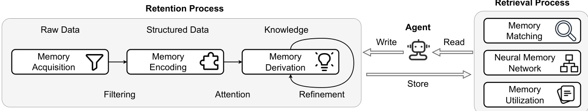

*图3.7：记忆生命周期的示意图。记忆保留过程包括三个连续步骤——记忆获取、编码和推导，而记忆检索过程涵盖了几个独立的应用，包括匹配（向量搜索）、神经记忆网络以及记忆利用（用于长上下文建模和幻觉缓解）。*

选择性注意机制受人类认知启发，使代理能够动态地集中计算资源在输入中最相关的部分。这可能涉及关注图像的特定区域、文本中的关键词，或者音频信号中的特定频率。根据模态和任务的不同，可以使用不同的注意机制。例如，随着候选记忆动态扩展，MS [237]采用基于LLM的评分器来选择性地保留得分最高的一半，从而在多个代理系统之间创建更紧凑的共享记忆。在其他模态中，GraphVideoAgent[238]利用基于图的记忆来实现选择性和多轮视频场景理解，提高了问答性能。在机器人控制中，[240]将选择性注意作为一种过滤机制，从所有感知到的物体中提取与任务相关的对象。

多模态融合对于整合来自不同感官输入的信息至关重要（例如，将视觉和听觉数据结合起来理解一个场景）。这涉及创建一个统一的表示空间，其中来自不同模态的特征被对齐。跨模态编码器和对比学习技术通常用于实现这种融合。例如，JARVIS-1使用通用领域视频-语言模型CLIP来计算多模态键值记忆中的对齐，其中键包括任务、计划和视觉观察等元素，而值则是成功执行计划的基于文本的表示。此外，Optimus-l通过利用MineCLIP对记忆表示进行优化，并优化多模态编码器，MineCLIP是在Minecraft游戏过程中预先训练的领域特定视频语言模型，以对齐和融合过滤后的视频流与文本指令和计划，将代理的多模态体验编码为一个抽象的记忆池。这种集成表示增强了跨模态的信息检索和推理，并起到另一个过滤器的作用，加强了数据的一致性。LLMs的语义理解被用来高效地提取相关特征。

## 3.4.3 记忆衍生

记忆推导侧重于从获取和编码的记忆中提取有意义的知识和见解。这个过程超越了简单的存储。这个阶段对于增强代理的学习能力至关重要。目标是持续优化代理的记忆结构和内容。推导中的一个重要挑战是信息价值的动态评估。应对这些挑战的策略包括反思、总结、知识提炼和选择性遗忘。

反思涉及代理主动分析其记忆，以识别模式、关系和潜在的不一致之处。它可以由特定事件触发（例如，意外结果），也可以定期作为后台进程发生。这个过程可能包括比较记忆、推理因果关系和生成假设。ExpeL利用反思来收集过去的经验，以推广到未知任务，并在失败后支持反复尝试。R2D2将记忆建模为重放缓冲区，并应用反思来通过纠正网络代理中的执行失败轨迹来完善记忆。然后，这些纠正后的轨迹与成功的轨迹结合，构建反思性记忆，为未来的决策提供参考。

总结旨在在保留最基本内容的同时产生更为简洁的信息表示。这可能包括从文档中提取关键句子，生成对话的抽象摘要，或者压缩事件序列。总结技术范围从简单的抽取方法到由大型语言模型（LLMs）驱动的先进抽象方法[245, 312, 246]。例如，[248]介绍了一种递归总结策略，通过对话历史和先前记忆支持长期对话记忆的推导。在此基础上，Healthcare Copilot[247]通过将对话记忆转换为历史记忆来保持简明的记忆，将完整的医疗咨询转化为仅保留与患者病史相关的关键信息的历史记忆。

知识蒸馏[313]使代理能够将知识从更大、更复杂的模型（或集成模型）转移到更小、更高效的模型中。这对资源受限的代理和增强泛化能力尤为重要。蒸馏还可以涉及 consolidaing 知识，将多个专门模型中的知识整合到一个通用模型中。例如，AoTD[250] 从子任务执行轨迹中蒸馏出文本思维链，将其转移到 Video-LLM 中，以提高视频问答任务中的多步推理性能。LDPD [251] 将决策结果从教师代理（即专家缓冲区）转移到学生代理，优化学生的策略以与教师保持一致。在多代理系统中，MAGDi[253] 通过将多个LLM之间的推理交互蒸馏到较小模型中，通过将多轮交互结构化表示为图，从而提高较小LLM的推理能力。

选择性遗忘[314]是移除或减轻被认为无关、冗余或过时的记忆的关键过程。这对于保持记忆效率和防止认知过载至关重要。遗忘机制可以基于时间（较早的记忆更有可能被遗忘）[247]、使用频率（很少访问的记忆更有可能被遗忘）[203]，以及与当前任务或上下文的相关性[255]。在更细粒度的遗忘机制中，MemoryBank[207]应用了艾宾浩斯遗忘曲线来量化遗忘速率，考虑了时间衰减和间隔效应，即重新学习信息比第一次学习更容易的原则。相比之下，Lyfe Agent[254]采用了分层总结和遗忘策略：首先将相关记忆聚类，将其精炼为简洁的摘要，然后移除与较新记忆高度相似的旧记忆。这种方法实现了用于实时社交互动的高效、低成本的记忆更新。

## 3.4.4 记忆检索与匹配

记忆检索是一种模拟人类回忆相关知识和经验以解决问题的过程。其目标是从庞大而多样的记忆池中高效准确地提取最相关的记忆片段，包括感官、短期和长期记忆，以指导智能体的决策、规划和行动。正如人类依赖过去的经验来应对复杂情况一样，智能体需要一个复杂的记忆检索机制来有效处理各种任务。

然而，要实现这一目标存在几个重大挑战。首先，智能体的记忆存储库通常是异构的，包括各种形式的记忆，如自然语言描述、结构化知识图谱和状态-行动-奖励序列。这些记忆在其数据结构、表示和语义粒度水平上有根本的差异，对统一检索构成了挑战。其次，检索到的记忆片段必须与当前上下文高度相关，包括智能体的状态、任务目标和环境观察。简单的关键词匹配无法捕捉到需要进行有意义检索所需的更深层语义关系。因此，开发一个能够根据当前情况动态调整检索策略的上下文感知语义匹配机制至关重要。第三，智能体与环境的实时互动性要求高效的记忆检索，以支持快速的决策和行动。这种效率需求进一步受到智能体计算资源限制的影响。最后，智能体的记忆不是静态的，而是随着新的经验、知识和技能的习得而不断发展。确保记忆的及时性、可靠性和相关性，同时避免过时或错误信息的干扰，是一个持续不断的挑战。

一个全面的方法可以解决这些挑战，包括四个关键组成部分。首先，基础步骤涉及构建统一的记忆表示和索引方案。这旨在通过将它们嵌入到一个共同的向量空间中来弥合不同记忆类型之间的表征差距。预训练的语言模型如BERT或Sentence-BERT可以被利用来将基于文本的记忆转换为语义向量，而图神经网络（GNNs）可以学习结构化记忆（如知识图谱）的向量表示，捕捉节点和边关系。为了促进高效检索，一个多层次的混合索引结构是必不可少的。这结合了倒排索引等技术用于关键词匹配，Faiss或Annoy等向量索引用于相似度搜索，以及用于结构化查询的图索引，从而支持多样化的查询需求。

其次，也许最为关键的是，系统必须发展具有上下文感知的语义相似度计算。这使得检索过程能够理解并利用当前上下文，比如代理的状态、目标和观察，实现超越关键词重叠的更深层语义匹配。这涉及将上下文信息编码为向量表示，并有效地将其与记忆向量融合。注意力机制在这里起着至关重要的作用，动态计算上下文与记忆向量之间的相关性，并根据其上下文相关性为记忆片段分配不同的权重。这强调了与当前情况更相关的记忆。

第三，将记忆检索与代理任务执行相结合需要一种面向任务的序列决策和动态路由机制。这利用任务的结构信息来指导记忆的检索和利用，实现复杂任务的分解、规划和动态调整。通过构建任务依赖图，代理可以对子任务进行拓扑排序以确定执行顺序。在执行过程中，每个子任务的目标作为记忆检索的上下文，提取相关的知识和经验。此外，代理必须根据环境反馈和任务进展动态调整执行计划。每个决策点都涉及基于当前状态和目标重新检索记忆，以选择最佳行动并处理意外情况。这方面还强调了代理如何利用其技能记忆解决问题，包括技能提炼、组合和创新。模式识别允许总结一般的问题解决步骤，而结构化知识组织将技能整理成可检索的格式。代理可以进一步从具体技能中提炼出通用技能，组合多种技能以解决复杂挑战，甚至创新新的技能组合。这些过程基本上依赖于一个高效的记忆检索系统，该系统能够根据任务需求识别合适的技能或技能组合。

最后，一个强大的记忆管理机制对于维护记忆池的及时性、相关性和效率至关重要。这种机制应该包括遗忘和更新策略，模拟人类遗忘机制。这可能涉及定期清除过时、冗余或很少使用的记忆，基于时间衰减（随时间减弱记忆强度）和基于频率衰减（清除低频率记忆）。同时，当检索到与当前任务相关的记忆片段时，更新其时间戳和访问频率，提高其重要性并确保动态记忆更新。通过这些协调努力，LLM代理可以配备一个强大、灵活和上下文感知的记忆检索和匹配系统，使它们能够有效利用积累的知识，支持复杂决策，并展现更智能的行为。

## 3.4.5 神经记忆网络

神经记忆网络代表了人工智能研究中的一个迷人前沿。它们旨在将记忆无缝地整合到神经网络的结构中。这种方法与传统的记忆架构不同，它通过直接在网络的权重或激活中编码记忆，将网络转变为一个动态的、可读写的内存存储介质。这种紧密的整合承诺在效率和利用存储信息方面取得重大进展。然而，实现这一愿景面临着一些巨大的挑战。

一个主要关注点是在记忆容量和稳定性之间取得平衡。在神经网络的有限参数内编码大量信息，同时保持长期稳定性，构成了一个重大障碍。网络必须能够存储大量记忆，而不会陷入灾难性遗忘或在相似记忆之间混淆。同样关键的是，需要开发有效的记忆读写操作机制。网络需要可靠地写入新信息，更新现有记忆，并在需要时准确检索存储的信息，同时保持计算效率。超越简单地存储记忆，最终目标是赋予神经网络从存储的信息中泛化和推理的能力。这将使它们能够执行高阶认知功能，超越机械记忆，基于过去经验进行有洞察力的连接和推断。目前正在探索几种方法来解决这些挑战，尤其是通过关联记忆和参数整合。

一方面，受到大脑中神经元相互连接的启发，关联记忆提供了一个有前途的途径。像Hopfield网络和支持异相关召回的双向关联记忆(BAMs)等模型，利用能量函数，提供了基于神经元之间权重的模式编码和检索机制。此外，神经图灵机(NTMs)和记忆增强型神经网络(MANNs)通过外部记忆模块增强神经网络，利用注意力和总结机制与这些记忆进行交互。

另一方面，参数集成代表了另一个重要的研究方向，旨在直接将记忆编码到网络的权重中。这有助于将世界知识和积累的经验融入智能AI代理的操作行为中。例如，一些先前的工作修改模型参数以实现通过更新[325,326,327]或遗忘特定知识[328]来实现持续学习。其他研究将LLMs视为独立的记忆模块，在预训练[329]、后训练[330]和在线部署[331]期间将世界知识纳入其参数中。例如，MemoryLLM[265]引入了记忆令牌，而SELF-PARAM[266]利用知识蒸馏将世界知识和过去的AI代理经验嵌入模型参数中。这种方法在$\mathbf{M}+$模型[332]中进一步增强了长期记忆机制和协同训练的检索器，提高了其对更长历史记忆的泛化能力。此外，[33]利用编码记忆来促进进一步推理，从而提高存储知识的泛化能力。最近，MemoRAG[267]和${\tt R}^{3}$ Mem [270]被提出，不仅编码记忆，还能够从神经记忆网络中可靠检索，将记忆存储和检索的双重过程统一到一个模型中。这一进展有助于开发支持终身AI应用的下一代基于生成的检索系统。此外，Titans[269]通过元学习引入了记忆测试数据点的能力，从而实现更高效的测试时跨任务泛化。

未来的研究将继续专注于创建更大容量和更稳定的神经记忆模型。因此，开发更高效、更灵活的记忆读写机制将至关重要。一个关键的研究领域将涉及将这些记忆增强网络应用于复杂的认知任务，推动人工智能能够实现的边界。在这一领域的进展将为构建能够学习、记忆和推理的智能代理打开新的可能性，这种方式越来越类似于人类认知。

## 3.4.6 内存利用率

智能代理设计的一个关键方面在于记忆利用，重点是最大化当前任务的存储记忆段的价值。其核心目标是有效和适当地应用这些记忆，以增强推理、决策、规划和行动生成，最终提升代理的性能和效率，同时避免无关或错误记忆干扰的问题。然而，实现这一目标面临着几个挑战。

一个主要挑战是平衡庞大的记忆存储量与其有效利用。代理必须应对潜在的信息过载，确保充分利用相关记忆，而不会使系统不堪重负。另一个障碍是抽象化和泛化的需求。代理需要将特定记忆段提炼为更一般的知识，并将这些知识应用于新的和多样化的情境。此外，LLM中幻觉和错误记忆的问题需要认真考虑。防止生成与存储信息相矛盾或歪曲的内容至关重要，同样重要的是能够识别和纠正存储库中可能存在的错误信息。

为了解决这些挑战，采用了几种策略。检索增强生成（RAG）[334]结合了检索和生成模型，通过利用外部知识源增强LLM的能力。与记忆检索和匹配中提到的方法不同，RAG专注于将检索到的信息整合到生成过程中。当受提示时，代理检索相关的记忆段，并将它们融入到生成模型提供的上下文中。这种上下文丰富可以引导模型产生更加真实和信息丰富的输出。例如，在回答用户查询时，代理可以首先从其知识库中检索相关条目，然后基于这些检索到的信息生成答案，从而将回应基于已建立的知识。最近，一些研究将记忆模块与RAG相结合，整合了自我反思[274]和自适应检索机制[272]，以提高生成的可靠性和效率。例如，Atlas [273]利用因果中介分析，而[284]采用基于一致性的幻觉检测来确定模型是否已具备必要知识——允许直接生成——或者是否需要检索，在这种情况下，模型首先检索相关信息然后生成响应。在一个统一的框架中，RAGLAB[271]提供了一个全面的生态系统，用于评估和分析主流的RAG算法。HippoRAG [22]采用了受人类记忆海马体索引理论启发的策略，为记忆创建了基于知识图的索引，并使用个性化PageRank进行记忆检索。

此外，长上下文建模在管理大规模记忆存储中发挥着至关重要的作用。这种方法增强了LLM处理长序列和大规模记忆的能力，使其能够更深入地理解和利用长距离依赖关系。通过采用Transformer模型变体，如Transformer-XL和Longformer，或通过分层和递归处理技术，如循环记忆变换器(RMT)，代理可以扩展其上下文窗口。这使它们能够处理更广泛的记忆存储，并在更广泛的背景下进行推理和决策。例如，当处理大量文档或进行长时间对话时，代理可以保持更长的记忆跨度。此外，一些研究利用记忆来压缩长上下文，实现更有效的长上下文建模。例如，AutoCompressor将摘要向量引入记忆，将信息从先前的上下文窗口传输到当前窗口，促进长上下文理解。类似地，上下文自编码器(ICAE)生成准确全面地表示原始上下文的记忆槽，而LLMLingua、Gist和CompAct进一步优化长提示压缩，以减少输入上下文长度。

最后，减少虚构策略对于确保生成输出的可靠性至关重要。这些策略旨在最小化LLM产生事实错误或荒谬内容的倾向。一种方法是实施事实核查机制，根据已建立的知识或记忆存储验证生成的内容。另一种方法涉及不确定性估计，模型评估生成内容的置信水平，并标记或过滤出置信度较低的输出。此外，在生成阶段可以采用基于知识的解码策略，引入约束来引导模型生成更准确的内容。这些技术共同有助于生成更值得信赖且与代理已建立的知识库保持一致的输出。最近的研究引入了专家记忆子网络，例如PEER和Lamini Memory Tuning，专门用于记忆特定类型的信息，包括世界知识和AI代理的过去经验。这些子网络将记忆工作转移到专用参数，减少主模型产生虚构的倾向。通过实施这些记忆利用策略，代理可以变得更有能力、准确和可靠。它们可以成功利用其记忆存储在复杂任务中实现卓越性能。

# 3.5 总结与讨论

真正智能代理的发展不仅仅取决于强大的记忆系统，还取决于它们与感知、规划、推理和行动选择等其他认知功能的无缝整合。记忆不是一个孤立的模块；它与这些其他过程密切相关。例如，感官输入在存储之前被编码和过滤（如在有关记忆表示和生命周期的部分中所讨论的），突显了感知和记忆之间的相互作用。长期记忆，特别是程序性记忆，通过学习的技能和例行程序直接影响行动选择。检索机制，如上下文感知的语义相似度计算，对规划至关重要，使代理能够访问相关的过去经验。这种相互作用延伸到“世界模型”的概念中。

智能代理的核心是它们建立和利用内部世界模型的能力。这些模型代表了代理对环境的理解，可以进行模拟、推理和预测。健壮的世界模型对于高层认知、规划和类人智能至关重要。世界模型本质上是一种高度结构化的、通常是预测性的长期记忆形式。记忆为构建世界模型提供了原始材料——知识和经验，而世界模型反过来作为一个组织框架，影响新记忆的编码、巩固和检索。例如，一个完善的世界模型可能会优先存储令人惊讶的事件，因为这些事件表明代理的理解存在空白。

然而，发展有效的世界模型和记忆系统面临着重大挑战。这些挑战包括管理现实世界环境的复杂性，确定适当的抽象层次（平衡准确性、复杂性和计算效率），以及整合多模态信息。高效地学习和更新这些模型，避免偏见，确保泛化，并实现持续适应也至关重要。此外，基于模型的规划需要高效的搜索算法来处理模型预测中固有的不确定性。

未来的研究应重点关注通过借鉴人类记忆的优势，特别是其灵活性、适应性和效率，来增强智能体记忆系统。虽然智能体的记忆系统已经取得了相当大的进展，但在这些关键领域仍远远落后于人类记忆。人类记忆具有非凡的联想能力，可以从不完整或嘈杂的线索中检索信息，并展现出一种复杂的“遗忘”形式，包括信息的巩固和抽象化，优先考虑相关信息并从经验中概括。相反，智能体的记忆系统通常依赖于精确匹配，并且在处理模糊性时存在困难。

出现了几个有前途的研究方向。探索受生物启发的机制，比如神经记忆网络（如前所讨论的），可能会带来重大突破。另一个至关重要的领域是开发能够积极“策展”其内容的记忆系统——反思信息，识别不一致之处并综合新知识。这需要将元认知能力（监控和控制自身认知过程）整合到智能体架构中。此外，创建更加健壮和细致的情景记忆形式，捕捉事件的“什么”、“何时”以及“为什么”和情感背景，对于能够真正从经验中学习并自然与人类互动的智能体是至关重要的。

要克服这些挑战，需要在深度学习、强化学习和认知科学交叉领域提出创新解决方案。开发更复杂、更适应的世界模型和记忆系统——这些系统应当反映人类认知的优势，将为拥有更深入了解环境的智能体铺平道路，从而实现更智能、更有意义的互动。

# 世界模型

世界模型使代理能够在没有直接现实试错的情况下预测和推理未来状态。本节探讨了人类认知研究中关于“心理模型”的内容如何与人工智能中的世界模型相关联，将其归类为四种范式：隐式范式、显式范式、基于模拟器的范式以及一类其他新兴方法（例如，基于指导的范式）。然后，我们讨论了世界模型如何与其他代理组件固有地交汇，并最终得出了统一的理论和实践框架下将这些观点联系起来的开放问题和未来方向。

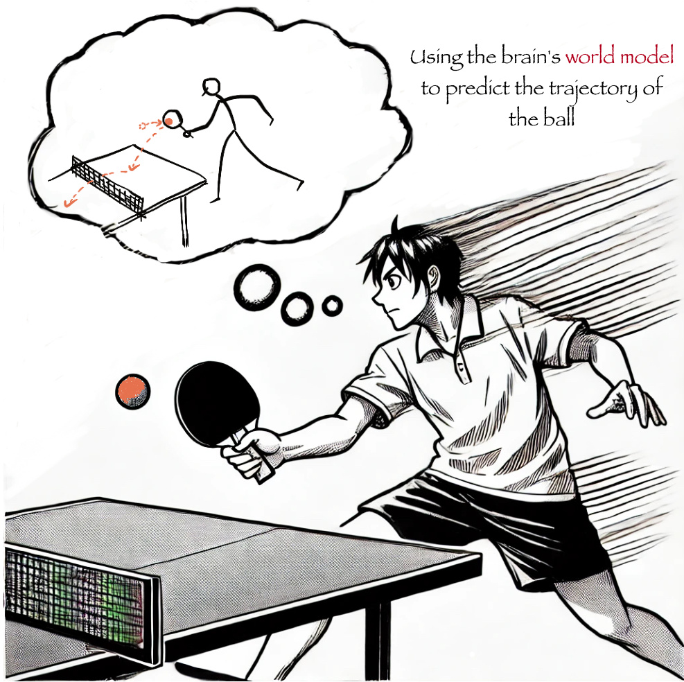

*图4.1：人类可以利用大脑对世界的模型来预测其行为的后果。例如，在打乒乓球时，球员可以想象或预测动作后球的轨迹。*

# 奖励

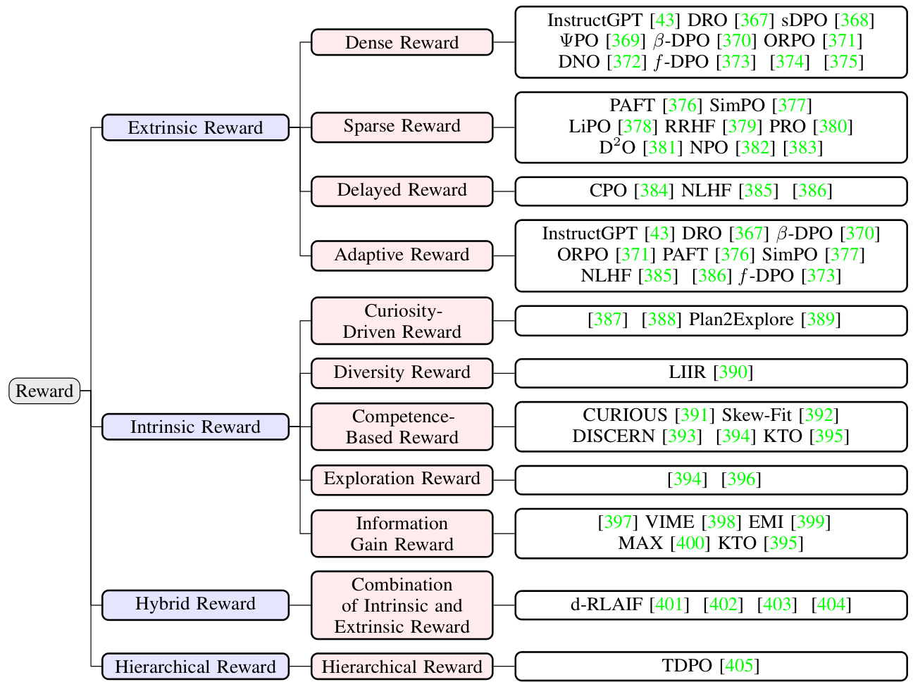

*图5.1：奖励系统的示意分类*

奖励有助于代理区分有益和有害的行为，塑造其学习过程并影响其决策。本章首先介绍了人体中常见的奖励物质以及相应的奖励途径。然后，定义了代理下的奖励范式和涉及的不同方法。在讨论部分，描述了其他模块之间的影响关系，并总结了现有方法，然后讨论了未来需要解决的问题和优化方向。

<html><body><table><tr><td>Reward Pathway</td><td>Neurotransmitter Mechanism</td><td></td></tr><tr><td>Mesolimbic path- way [406]</td><td> Dopamine</td><td>Dopaminergic neurons in the ventral tegmental area (VTA) extend pro- jections to the nucleus accumbens, where they release dopamine to regulate reward-related signaling. Dopamine diffuses across the synaptic cleft and binds to dopamine receptors—primarily D1-like (excitatory via Gs proteins, increasing cAMP) and D2-like (inhibitory via Gi pro- teins, reducing cAMP)—thereby modulating reward, motivation, and</td></tr><tr><td>Mesocortical path-Dopamine way [407]</td><td></td><td>reinforcement. Dopaminergic projections from the VTA reach the prefrontal cortex (PFC). Here, dopamine binds to its receptors to influence cognitive functions such as decision-making, working memory, and emotional</td></tr><tr><td>Nigrostriatal path- Dopamine way [407]</td><td></td><td>regulation, all of which contribute to evaluating and anticipating rewards. Dopamine's action on D1 and D2 receptors in the striatum helps shape both motor routines and reward-related behaviors.</td></tr><tr><td>Locus coeruleus [408]</td><td> Norepinephrine</td><td>Neurons in the locus coeruleus release norepinephrine to widely dis- tributed targets across the brain. At synapses, norepinephrine binds to adrenergic receptors(α and β subtypes), modulating neuronal excitabil- ity, arousal, attention, and stress responses. These modulatory effects</td></tr><tr><td>Glutamatergic pro- jection [409]</td><td>Glutamate</td><td>can indirectly influence reward processing and decision-making circuits. Upon releasing into the synaptic cleft, glutamate binds to both ionotropic receptors (such as AMPA and NMDA receptors) and metabotropic re- ceptors located on the postsynaptic neuron, thereby initiating excitatory signaling. This binding produces excitatory postsynaptic potentials and</td></tr><tr><td>GABAergic modu-  Gamma- lation [410]</td><td>Aminobutyric Acid (GABA)</td><td>is crucial for synaptic plasticity and learning within reward circuits. GABA serves as the principal inhibitory neurotransmitter. At the synapse, GABA binds to GABAA receptors and GABAB receptors. This binding results in hyperpolarization of the postsynaptic cell, thereby providing inhibitory regulation that balances excitatory signals in the reward net- work.</td></tr></table></body></html>

*表5.1：人类常见奖励路径的比较*

# 情感建模

情感是人类思考、做出决策和与他人互动的关键部分。它们指导我们理解情况、做出选择和建立关系。安东尼奥·达马西奥在他的著作《笛卡尔的错误》中解释说，情感并非与逻辑分离，而是与我们推理和行动的方式深深相连。在开发LLM代理时，增加情感能力可能使这些系统变得更智能、更适应，并更好地理解周围的世界。

对于LLM代理，情感可以作为决策工具，就像它们对人类一样。情感帮助我们优先处理任务、理解风险并适应新挑战。马文·明斯基在《情感机器》中描述情感是调整我们思维过程的一种方式，帮助我们以更灵活和创造性的方式解决问题。类似地，具有类似情感特征的LLM代理可以提高它们解决复杂问题和做出决策的能力，更贴近人类风格。

然而，将情感整合到LLM代理中仍处于早期阶段。研究人员刚刚开始探索情感能力如何改善这些系统。此外，LLM代理有巨大潜力支持人类的情感福祉，无论是通过共情对话、心理健康支持，还是简单地与用户建立更好的联系。这一充满希望但具有挑战性的领域需要心理学、认知科学和人工智能伦理等领域之间的合作。随着研究的进展，理解情感的LLM代理可能重新定义我们与技术的互动方式，为人类与机器之间建立更深层的信任和更有意义的关系。

在接下来的小节中，我们将更深入地探讨情感在塑造LLM代理中的作用。我们将探讨情感如何被用来增强学习和适应能力，LLM如何理解人类情感，以及这些系统如何表达和建模它们自己的情感状态。我们还将研究如何通过操纵情感来影响LLM代理的行为和个性，以及由此产生的伦理和安全问题。这些讨论都基于情感对于创造更智能、有同理心且符合人类价值观的LLM代理的基础重要性。

# 感知

感知是人类和智能代理获取信息、解释周围环境并最终做出明智决策的基础门户。对于人类来说，感知是无缝和直观的，毫不费力地将感官输入转化为有意义的解释。然而，在人工智能领域，感知系统经过精心设计，旨在模拟并在某些方面超越人类的感知处理，深刻影响代理在复杂环境中的互动、学习和适应能力。

在本章中，我们首先探讨人类和人工智能代理在感知性质和效率方面的关键差异。接下来，我们基于不同形式和感知输入的表示对代理感知进行分类。然后，我们讨论代理感知系统中持续存在的挑战，并突出在建模和系统架构层面改进的有希望方向。最后，我们阐明了感知模块如何有效地定制给不同智能代理场景，为优化它们的使用提供实用指导，并提出了未来研究的关键领域。

# 行动系统

在哲学领域，行动被定义为代理人在环境中为潜在或特定目的而执行的行为。例如，操纵、移动、推理和工具利用都可以被视为智能代理在真实场景中执行以实现目标的基本行动。换句话说，行动源自代理在环境中以目标为导向的参与，反映其意图改变外部世界以追求目标。因此，行动系统在区分人工智能代理和基础模型（如LLMs）方面也起着至关重要的作用。通常，现有的基础模型在各种任务中表现出色，但它们的任务范围仍然有限，因为它们主要依赖于原始的预训练目标（例如，下一个标记的预测）。通过将基础模型作为大脑智能，配备有行动系统的人工智能代理可以直接与其环境互动，并执行复杂的用户意图。此外，行动系统可以支持代理利用外部环境中的可用工具，从而显著扩展代理的任务范围。因此，行动系统的设计也将决定人工智能代理在知觉、决策制定、执行、工具利用以及与人类大脑一致的任何其他组件方面的能力。换句话说，基础模型奠定了代理的基础，而行动系统决定了它们实现复杂目标的最终潜力。为人工智能代理设计一套有效而全面的行动系统是一项至关重要的工作，涉及重大挑战和显著收益。在图8.1中，我们展示了认知系统中行动系统的执行过程。在本节中，我们将首先讨论8.1节中的人类行动系统，然后在8.2节中审视从人类行动到人工智能代理中的行动转变。之后，我们将在8.3节系统地总结人工智能代理中现有行动系统的范式，包括行动空间、行动学习和工具学习。在8.4节中分析行动与感知之间的差异，最后在8.5节总结结论。

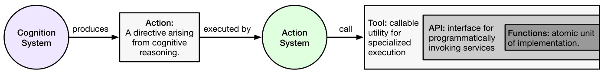

*图8.1：涉及动作和动作执行的若干概念的示意图。*

# 8.1 人类行为系统

人类认知中的行动系统指的是使人类能够感知、规划和执行目标导向行动的过程。这是一个复杂的系统，使个体能够与动态环境互动，做出决策，并根据反馈调整行为。一般来说，人类认知中的行动系统可以广泛分类为心理行动和物理行动：

- 心理行动可以被视为一种独特的行动，它被构想为推动人脑中最终意图的思考过程。例如，推理、决策、想象和规划都可以被视为各种类型的心理行动。换句话说，心理行动相当于驱动人类的物理行动以实现最终目标的一种脑信号。

- 物理行动指的是人类运动系统执行的任何目标导向的身体运动。在某种程度上，物理行动通常被表达为一种连续的行动。例如，说话、操作、绘画、奔跑和抓取都可以被视为物理行动。通过一系列的物理行动，人类可以进行互动并从现实世界环境中获取反馈。

<html><body><table><tr><td>Model</td><td>Examples</td><td>Inputs</td><td>Objective</td><td>Definition</td></tr><tr><td>Large Language Model (LLM)</td><td>GPT-4 [7]</td><td>Language</td><td>Next-Token Prediction</td><td>LLMisetextasdhe</td></tr><tr><td>Large Multimodal Model (LMM)</td><td>LLaVA [513]</td><td>Multi-modal</td><td>Multi-modal Generation</td><td>LMM s ta inperate multimoal data based on</td></tr><tr><td>Robotic Foundation Model (RFM)</td><td>RT-1 [522]</td><td>Sensory inputs</td><td>Robotic Control</td><td>RFM is to generate robotic control based on the sensory inputs from dynamic environments.</td></tr><tr><td>Large Action Model (LAM)</td><td>LAM[622]</td><td> Interoniment</td><td>Executable Action</td><td>LAM is toctgensrwithin ecutabl roction based on</td></tr></table></body></html>

*表8.1：不同种类基础模型之间的定义。*

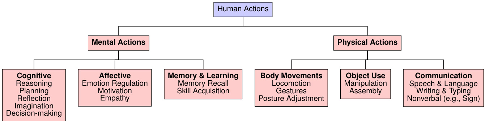

*图8.2: 人类行为的分类示意图，显示了精神和身体两个方面。*

# 8.2 从人类行为到主体性行为

在过去很长一段时间中，人类行动系统显著地激励我们塑造计算机系统朝向自主范式的发展。行动机制在人类大脑中发挥着关键作用，推动目标导向行为。在智能的人类大脑中，产生意识和无意识思维信号，这些信号被转化为心理信号，最终导致一系列行动操作。这一过程可以被映射为一个多阶段管道，涉及构建行动空间、制定用于改进决策的学习机制，并整合外部状态（例如工具）。受这些原则启发，我们发现这些设计对于构建AI代理的原型至关重要。

许多现有框架将行动学习纳入其设计中或将其用作输出。为了澄清行动系统的定义，我们强调了各种框架之间的区别，包括大型语言模型（LLM）、大型多模态模型（LMM）、机器人基础模型（RFM）和大型行动模型（LAM），如表8.1所示。具体而言，LLM是基于提供的提示生成语言输出，而LMM是基于多模态输入生成多模态工件。现有基于语言或数字AI代理框架是通过这些基础模型（例如LLM或LMM）构建的，通过预定义行动空间的范围及其学习策略。另一方面，RFM是为了基于现实环境（例如机器人视频）优化机器人控制。现有的RFM是从网络规模的视频数据进行预训练，并使用视频预测来模拟机器人控制的行动。尽管在构建物理AI代理中涉及了一些行动设计，但RFM的核心仍然是利用生成目标从大规模数据中学习知识。此外，一些最近的工作引入了大型行动模型（LAM）的概念，进一步强调生成行动策略的阶段，与现实环境进行交互，并增强自学习范式。从这些定义中，我们注意到，无论使用哪种基础模型，行动系统的核心是建立与环境的交互，然后通过预定义的奖励函数从收集的行动轨迹中启用学习过程。具体而言，这些行为背后的机制也类似于人类认知中的行动系统，为设计AI代理框架中的行动系统提供了宝贵的见解。例如：

·在处理不同场景时，人类通常会预定义行动空间，执行行动轨迹以解决特定任务。例如，当玩像Minecraft这样的电脑游戏时，我们会通过键盘或鼠标设置我们的行动操作，以模拟建造房屋、挖掘黄金等行为。基于此，我们还需要为处理AI代理框架中的复杂任务构建或创建一个行动空间。
·与机器相比，人类认知系统在通过现实世界互动持续获取新知识方面表现出色，通过生成和优化行动序列来指导。因此，在AI代理中复制这种学习能力对于适应动态环境并构建新的技能库至关重要。
·此外，随着人类文明的发展，学会使用外部工具已被公认为人类智能演化中最重要的里程碑之一。通过利用这些外部工具，人类可以极大地扩展在不同场景中的问题解决能力，从石器时代到工业革命。

为此，我们期望构建人类认知系统的行动系统与AI代理框架设计之间的映射，包括如何从特定场景到通用领域构建AI代理的行动空间，如何在环境中构建行动学习，以及如何利用外部状态（例如工具）来扩展AI代理的任务范围。通过开展这项系统性调查，我们致力于为社区提供更深入的见解，清晰地理解行动系统在AI代理框架中的重要性。

# 8.3 主体行动系统的范式

通常，人工智能代理框架的行动系统主要由三个组成部分组成：1）行动空间 $\mathcal{A}$，其中包括代理在真实场景或下游任务中可以执行的所有类型行动，根据不同的代理设置可以有很大变化，从基于语言的代理到具身体的代理不等；2）在动态环境中进行的行动学习，确定状态 $s$，观测 $\mathcal{O}$ 和代理的优化过程；3）工具空间 $\tau$，包括代理可以利用的工具、接口或中间件，范围从物理设备如机器臂到数字接口如APIs。总体而言，这些组件共同定义了人工智能代理的行动系统的范围和特征，塑造了它们的制定和执行。

为了充分探索实际场景中可能的行动 $a_{t}$，我们必须形式化表示行动空间，并考虑个体操作和潜在的层次推理过程。这意味着在不同层次上检查行动空间，从低级操作到编排复杂工作流程的高级运算符。

因此，人工智能代理的决策过程可以形式化为一个轨迹 $\left\langle o_{t},s_{t},a_{t}\right\rangle$，其中 $a_{t}$ 从行动空间 $\mathcal{A}$ 中选择，根据观测 $o_{t}$ 将当前状态 $s_{t}$ 转化为下一个状态。在某些情况下，整合外部工具系统也可能是必要的。通过执行一系列 $\left\langle o_{t},s_{t},a_{t}\right\rangle$，代理被引导朝向实现其最终目标。

## 8.3.1 行动空间范式

动作空间$\mathcal{A}$是一个重要组成部分，它作为在人工智能代理框架内构建行动系统的基础。动作空间的组成决定了人工智能代理如何在不同场景中解决复杂任务。在图8.2中，我们基于其动作空间呈现了行动系统的分类法。通常，我们总结了现有研究中的动作空间为三种不同类型，如下所述。

基于语言的人工智能代理通常通过语言驱动的行动在交互式语言环境中运行，例如推理、编程、检索信息、执行API调用或与外部工具交互。在我们的研究中，我们总结了三种不同类型的基于语言的动作空间，包括纯文本、代码编程和通信。具体来说，早期基于语言的人工智能代理是基于纯文本构建的，旨在在口头环境或基于文本的游戏中进行交互式决策。在这里，ReAct[70]是一个代表性的基于语言的人工智能代理，它通过协同作用LLM的推理和行动来解决各种问题。AutoGPT[625]分析并分解用户请求为多个子任务，并使用网络搜索或其他工具来处理每个子任务。Reflexion[48]涉及自我完善和记忆机制，以增强语言任务中的行动执行。$\mathbf{LLM+P}$[163]赋予基于LLM的代理规划能力，以帮助决策制定。然而，将纯文本转换为可执行命令通常需要LLM首先解释文本，然后执行指令转换，导致额外信息的丢失。为此，一些工作探索使用代码作为动作空间，允许直接执行生成的代码并进行自我验证。MetaGPT[626]和ChatDev[627]通过编程语言建立行动空间，实现多代理协作。SWE-Agent[628]考虑软件工程的不同阶段，从而解决软件问题。OpenDevin[629]设计了一个自动软件开发平台，整合了编写代码、与命令交互、用于代码执行的沙盒和协作。此外，一些框架是基于多代理通信构建的，然后使用聊天分析下一步应采取哪些行动。在这里，Generative Agents[50]直接模拟虚拟城镇中的多个角色，探索每个代理如何进行下一步行动。MetaGPT[626]和ChatDev[627]都是多代理框架，促进软件工程的发展。AutoGen[630]也是一个代表性框架，可以实现多代理协作来解决任何复杂任务。总的来说，基于语言的人工智能代理在语言交互中效果显著。然而，受限于动作空间的范围，也面临如何在现实场景中解决更复杂任务的挑战。因此，我们还需要制定新的研究解决方案，构建更复杂的动作空间来解决具有挑战性的任务。

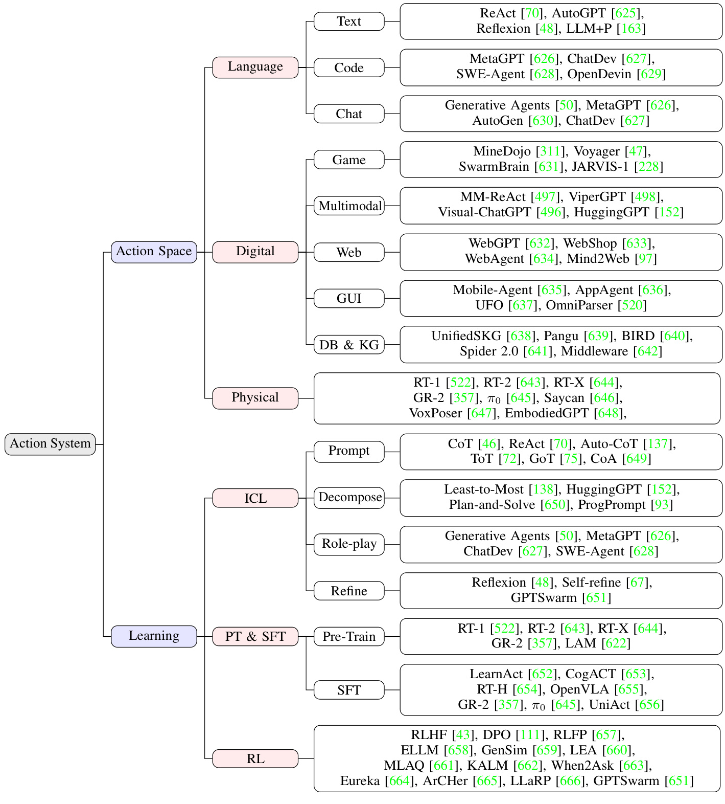

*图8.3：行动系统的示意分类，包括行动空间和学习范式*

数字化为了拓展人工智能代理的能力，一些研究还开发了在数字环境中运行的先进人工智能代理，例如网络代理、在线购物平台和游戏系统。例如，MineDojo通过视频语言预训练设计了一个虚拟代理，并模拟支持Minecraft内多种任务和目标的环境。此外，Voyager是一个经过训练用于玩Minecraft的具有实体的人工智能代理。它通过与Minecraft环境互动，模拟多种可执行动作以开发技能库，从而提高虚拟代理的能力。JARVIS-1是一个处理多模态输入/输出、生成复杂计划并执行实体控制的开放世界代理。它在Minecraft中探索代理在行动时的进化行为。SwarmBrain是一个使用LLM在StarCraft II中进行战略和实时行动的实体代理。此外，一些研究探讨了LLM如何处理多模态任务。 MM-ReAct [497] 和 ViperGPT [498] 使用语言模型(LMs)执行多模态任务的思考过程，然后选择视觉专家来解决任务。Visual-ChatGPT [496] 整合了多个视觉专家，并使用LLMs作为控制器来解决任务。HuggingGPT [152] 直接涉及四个阶段，包括任务规划、模型选择、模型执行和响应生成，自动分析用户指令并基于复杂的多模态任务预测最终答案。对于代理来说，跟上线上最新信息至关重要。因此，一些AI代理框架（例如WebGPT [632]、WebAgent [634]）被设计为与搜索引擎进行交互，以增强代理从网站发现答案的能力。WebShop [633] 用于探索AI代理在在线购物中的潜力。Mind2Web [97] 用于构建模拟多个复杂网络任务的通用代理。随着基础代理在处理多模态任务或网络任务方面的进展，越来越多地增强它们解决复杂计算机任务的能力。Mobile-Agent [635] 利用多模态模型作为认知控制器来管理和编排移动功能。AppAgent [636] 将各种应用使用定义为动作空间，使基础模型能够与不同应用交互，作为移动智能助手。UFO [637] 和 OmniParser [520] 是两个先进的图形用户界面代理，将UI操作作为动作空间，使AI代理能够执行计算机使用任务。总的来说，在数字环境中拥有更先进的技能，AI代理可以展示更好的智能来解决复杂任务，并代表了从语言智能到数字智能的重要转变。 通过扩展行动空间以包括网络浏览、GUI交互、移动应用和实体系统，AI代理正在向更自主、多模态和具有上下文意识的系统演变，弥合了基础模型和人类认知系统之间的差距。此外，其他研究探索了LLM与结构化数字环境（如关系数据库和知识图谱）的整合。Pangu [639] 开创了LLM与大规模知识图谱之间的连接，而 BIRD [640] 和 Spider 2.0 [641] 在现实环境中为LLM与企业数据库的操作奠定了基础。NL2SQL-BUGs [667] 解决了在NL2SQL流水线中识别语义错误的关键挑战，从而提高了LLM驱动的与关系数据库交互的可靠性。类似地，像UnifiedSKG [638] 和Middleware [642] 这样的框架扩展了LLM在数据库和知识图谱之间的行动能力。

构建一个与真实物理世界互动的AI代理可以被视为模拟计算机程序以充当人类认知系统的最终目标。为了实现这一目标，我们需要使代理能够处理来自真实世界环境的信号并生成反馈以促进持续改进。因此，这将对如何处理传感器收集的连续信号并使基础模型做出决策提出新的挑战。为了实现这一目标，RT-family [522, 643, 644] 预训练视觉-语言-动作模型，将来自网络视频的知识整合到机器人学习中，增强机器人控制和动作执行能力。GR-2 [357] 是一个机器人模型，它在视频剪辑和语言数据上进行大规模预训练，然后在机器人轨迹上进行微调，用于机器人动作预测。$\pi_{0}$ [645] 基于机器人平台预训练了一个机器人模型，包括单臂机器人、双臂机器人和移动操纵器，以在物理系统中构建机器人学习。SayCan [646] 架起了机器人语义和LLM之间的联系，利用机器人模型为LLM提供感知，然后利用LLM进行高级决策制定。VoxPoser [647] 利用LLM理解和分解用于机器人操作的3D价值图。此外，EmbodiedGPT [648] 利用视觉-语言模型理解视频数据并执行决策驱动的动作。在物理环境中，值得注意的是，我们通常需要理解连续信号，然后为机器人控制生成连续动作。尽管现有的基础模型可以有效处理离散级别的动作（例如语言或计算机使用），但如何处理长时间的连续信号仍然具有挑战性。因此，在基础模型中消除连续信号与离散信号之间的差异仍然是一个主要问题。

通常，动作空间是构建有效AI代理系统中最关键的组成部分之一。有效的动作空间提升了AI代理在处理下游任务时的能力和效率。动作空间通常涵盖从离散空间（例如Atari游戏中的技能库）到连续空间（例如机器人操作）的范围。随着AI代理变得更加自主和多模态，设计有效的动作空间对于推进能够进行真实世界互动的通用AI系统将至关重要。

## 8.3.2 行动学习范式

在人类认知系统中，行动学习代表了解决问题的过程，涉及采取行动和反思反馈两个方面。类似地，对于AI代理来说，行动学习指的是一个自主AI系统通过与真实世界环境的直接互动不断完善其决策和行为的迭代过程。通常，行动学习包括多个阶段的循环，包括构建行动空间、选择行动，并根据与环境的互动（例如接收反馈或奖励并调整选择行动的策略）优化行动选择。通过迭代地应用这些策略，AI代理可以实时适应最新信息或不断变化的条件，最终实现更强大、灵活和高效的问题解决能力。因此，有效的行动学习机制对于优化代理行动系统至关重要。在这部分中，我们主要关注三种不同的代表性学习范式，包括上下文学习、监督训练和强化学习，具体讨论如下：

在上下文学习中，由于大型语言模型展示了新兴能力，上下文学习被认为是利用现有LLM能力而无需任何修改的最有效方法。通过提供精心设计的提示来描述行动，AI代理可以理解特定行动，执行这些行动，反思与环境互动的结果，最终实现目标。在这些方法中，常见的方法是使用提示技术指导LLMs生成代理行动。其中，最具代表性的是链式思维（CoT）提示，应用“让我们逐步思考”技术生成一系列中间推理步骤，系统地探索潜在解决方案。ReAct使LLMs能够通过与环境内的互动生成推理路径和任务特定行动，提高AI代理的推理和决策能力。LearnAct设计了一种迭代学习策略，通过生成代码（即Python）扩展行动空间以创建和修改新行动。此外，一些研究（e. Auto-CoT[137]探讨如何通过LLM自动生成CoT，从而实现AI代理的自主思考过程。为了处理更复杂的任务，ToT[72]将思考过程视为树结构，并通过LLM提示引入树搜索，而GoT[75]则应用图结构以及图搜索。对于机器人模型，CoA[649]设计了四种不同的提示设置（例如对象、抓取、空间和运动），以允许机器人在推理过程中进行操作。此外，为了解决需要复杂代理工作流程的更复杂任务，一些框架通过LLM提示引入任务分解阶段，以分解用户指令。Least-to-Most[138]是一种经典提示技术，将用户指令转换为多个子任务。HuggingGPT[152]是一个代表性的AI代理框架，应用任务规划将用户需求转化为可执行项。Plan-and-Solve[650]直接使用LLM根据用户指令制定计划，然后根据生成的计划给出答案。Progprompt[93]将类似的任务分解应用于机器人任务。此外，使用提示技术来制定AI代理的特征也被视为促进AI代理框架的模拟和生产力的增长趋势，例如Generative Agents [50]、MetaGPT[626]、ChatDev[627]和SWE-Agent[628]。最后，一些其他框架（例如 Reflexion[48]或Self-refine[67]分析用户与环境的外部反馈，然后通过精心设计的反思提示迭代地完善和优化结果。所有这些设计都使我们能够更好地理解用户指令，分解任务目标，并为思考答案制定计划。在上下文学习中，可以帮助我们避免参数优化，并减少对LLM进行训练的巨大成本。这使得AI代理能够有效执行各种动作，并适应广泛的领域。然而，如果我们希望获得更强大的行动学习能力的代理，仍然存在挑战。

监督训练为进一步提高基础模型的行动学习能力，增加的研究工作集中在训练方法上，包括自监督预训练（PT）和监督微调（SFT）。在预训练范式中，最具代表性的作品是RT系列[522, 643, 644]，它在大规模网络和机器人数据上对机器人Transformer进行预训练，产生了一个强大的视觉-语言-行动模型。遵循这一策略，GR-2[357]通过在大规模网络视频语料库上进行广泛的预训练，以理解世界的动态，并在机器人轨迹数据上进行后续训练，专注于视频生成和动作预测。同样，LAM[622]是一个在用户与计算机使用交互轨迹上进行预训练的大型行动模型。然而，预训练范式通常会带来巨大的计算成本。 因此，许多工作采用微调范式来增强基础模型的行动能力。OpenVLA[670]基于Llama2[11]语言模型构建，并整合了基于DINOv2[671]和SigLIP[672]的视觉编码器。它在来自Open X-Embodiment（OXE）[673]的多样真实世界机器人演示数据上进行微调，在各种任务中表现优于RT-2-X[673]，同时参数数量仅为其$7\times$。在OpenVLA的基础上，CogACT [653]集成了额外的扩散动作模块，并引入了自适应动作集成策略进行推理。它还使用来自OXE的数据集进行微调，在SIMPLER [674]模拟环境中表现出35%的改进，在使用Franka Arm的真实机器人任务中增加了55%。此外，一些工作还探索了如何使机器人模型能够从物理世界中的普通语言中学习行动。例如，RT-H[654]引入了一种分层架构来构建行动空间，首先预测语言动作，然后生成低层次动作。而$\pi_{0}$ [645]从不同灵巧机器人平台收集了大量多样化数据集，然后微调预训练的VLMs来学习机器人动作。UniAct[56]学习捕捉不同形状机器人之间共享结构特征的通用动作。这种方法实现了跨领域数据利用，并通过消除异质性实现了跨体现泛化[132]。总的来说，使用监督训练，包括预训练和监督微调，可以有效地使基础模型在真实场景中智能执行行动。最后但并非最不重要的是，值得注意的是，即使在大规模语料库上进行了广泛训练，对AI代理进行上下文学习仍然是有益的，以追求它们的最佳性能。

强化学习 为了促进行动学习过程，除了上下文学习和监督训练外，对于代理与环境进行互动并最终通过经验、反馈或奖励优化其行动策略也至关重要。考虑到这种迭代和顺序性质，强化学习（RL）为我们提供了所需的系统方法。在强化学习范式中，有几种经典代表性算法，如深度Q网络（DQN）和近端策略优化（PPO）。将强化学习应用于基础模型的最具代表性的RL工作是InstructGPT，它通过RLHF有效地将语言模型输出与人类偏好对齐。由于RLHF通常需要额外训练来构建奖励模型，一些论文（例如DPO）提出通过对比学习直接优化偏好数据。现有工作还展示了将RL算法扩展到基础模型以产生具有出色性能的长CoT思考阶段的潜力。尽管RL范式已成功用于微调LLM以进行文本生成任务，有效利用RL算法进行行动学习仍然是需要进一步尝试的许多挑战之一。最近的进展显示了在从各种角度应用RL到LLM进行行动学习方面取得的显著进展：

· 鉴于LLM中蕴含的丰富世界知识，我们可以利用LLM来模仿外部环境或生成想象的轨迹，以帮助代理进行行动学习。例如，RLFP[657]利用来自策略、价值和成功奖励基础模型的指导和反馈，使代理能够更高效地探索。类似地，ELLM[658]利用LLM中的大规模背景知识来引导代理在各种环境中进行高效探索。GenSim[659]通过利用LLM的编码能力自动生成丰富的模拟环境和专家演示，从而促进代理的自由探索能力。LEA [660]利用LLM的语言理解能力，并将LLM调整为状态转换模型和奖励函数，以提高离线RL推荐系统的性能。MLAQ [661]利用基于LLM的世界模型生成虚拟交互，并应用Q学习[684]从这种虚拟记忆中得出最优策略。KALM [662]微调LLM以在文本目标和展开之间执行双向翻译，使代理能够通过离线RL以虚拟展开的形式从LLM中提取知识。总的来说，通过RL范式的支持，我们可以显著探索LLM中的内部知识，从而增强与外部环境的交互。当前的工作，例如Search-R1[685]，R1-Searcher [686]，RAGEN[687]和OpenManus-RL[688]正在探索利用RL方法对代理模型在代理环境中的轨迹数据进行微调。

此外，分层强化学习也是一个有前途的课题，它帮助基础模型分解复杂任务，然后通过强化学习范式学习解决每个任务的最优策略。例如，When2Ask[663]使代理能够从LLM请求高层指令。高层LLM规划者提供选项计划，代理基于这些选项学习低层策略。Eureka[664]利用LLM生成具有反思能力的人类级奖励函数，使代理能够高效学习复杂任务，如拟人五指操纵。ArCHer[665]采用分层强化学习方法，利用离线RL算法学习高层值函数，进而隐式指导低层策略。LLaRP[666]利用LLM理解文本任务目标和视觉观察。它采用额外的动作输出模块将LLM骨干的输出转换为动作空间上的分布。总的来说，使用分层强化学习可以指导人工智能代理在分析用户请求时探索最优策略以进行推理和规划。

利用强化学习，我们可以将基础模型与来自交互环境的在线学习相结合，同时整合动作策略和世界模型。这种整合使得人工智能代理中的高级动作系统成为可能。在强化学习范式中，代理动态地根据外部反馈调整和完善其决策过程，促进行动学习的效率和效果，从而实现期望的结果。

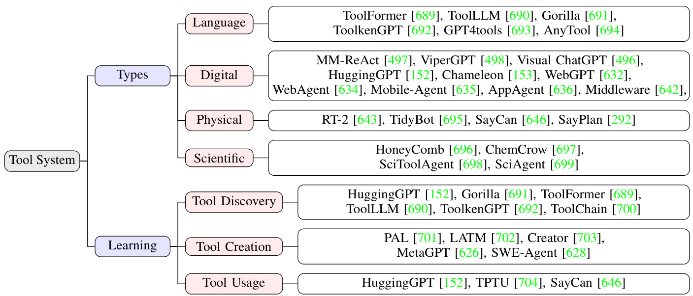

*图8.4：AI代理中工具系统的示意分类，包括工具类别和学习范式*

总结一般来说，通过动作系统的支持，人工智能代理展示了在各个领域中显著的决策能力。例如，动作学习使得人工智能代理能够自动理解图形用户界面(GUI)并执行各种操作，从而通过自动化计算机使用提高人类的生产力。此外，一些研究表明，配备动作系统的人工智能代理在机器人操作任务中能够取得显著的成果，例如物体拾取、衣物折叠和桌面清理。工业界也有一些有前途的研究方向采用了动作模型。例如，自动驾驶(AD)因视觉语言模型在感知和决策方面的出色表现而引起了相当大的关注。通过将人类理解力整合到基础模型中，自动驾驶系统可以有效理解真实世界环境，使其能够模拟人类水平的驾驶员。总之，动作学习赋予代理与外部世界互动的能力，从而为人工智能在实际场景中的应用创造了更多机会。

## 8.3.3 工具支持的行动范式

工具学习区分了人类智能与其他动物的智能。自石器时代以来，人类利用工具提高了效率、生产力和创新能力。类似地，通过利用各种工具使人工智能代理在数字和物理环境中运行，是实现人类水平智能的基本步骤。

在人工智能中，工具被定义为允许代理与外部世界互动的接口、工具或资源。例如，网络搜索、数据库、编码环境、数据系统和天气预报等都是工具的例子。通过将工具功能转化为纯文本或API格式，基础模型可以扩大其问题解决范围。人工智能中工具系统的演变可以总结为几个阶段。最初，随着大型语言模型的出现，重点是将工具转换为可解释格式（例如函数调用）。后来，多模式处理的进展将交互从对话式聊天转变为图形用户界面(GUI)，最近的工作探索了控制硬件（例如机器人手臂、传感器）与物理世界互动的具身代理。简而言之，基于工具的行动可以被视为一种用于辅助的外部行动形式。

与动作空间类似，工具可以根据其类型被划分为多个类别。在这部分中，我们主要总结了三个关键领域，包括语言、数字和物理。此外，我们还探讨了工具学习在新兴领域（如科学发现）中的潜力：

· 语言：为了促进外部工具的使用，我们通常将工具表示为基础模型的一种函数调用，这通常包括任务描述、工具参数和相应的输出。这种表达方式使大型语言模型能够理解何时以及如何在人工智能代理中使用工具。具体而言，ToolFormer [689]通过整合计算器、问答系统、搜索引擎、翻译和日历等外部工具空间，扩展了语言模型的功能。ToolLLM [690]将RapidAPI作为行动空间，然后使用基于深度优先搜索的决策树算法确定解决任务最合适的工具。Gorilla [691]是基于工具文档进行微调的语言模型，然后可用于编写API调用。ToolkenGPT [692]旨在优化工具嵌入，从而使大型语言模型能够从经过微调的工具嵌入中检索工具。GPT4tools [693]和AnyTool [694]还构建了自我指导的数据集，然后对其进行微调，以供工具使用。总的来说，由于大型语言模型的出色能力，人工智能代理的基于语言的工具利用已经得到研究，其有效性在大量作品中得到验证，涵盖了从纯文本或函数调用到代码编程的范围。

· 数字：随着大型语言模型在处理语言信息方面取得成功，许多研究人员正在探索将人工智能代理的任务范围从语言领域扩展到数字领域（例如，多模态、网络搜索、图形用户界面等）。例如，MM-ReAct [497]、ViperGPT [498]和Visual ChatGPT [496]将LLMs作为控制器，然后使用LLMs选择视觉专家来解决不同的任务。HuggingGPT [152]和Chameleon [153]使用LLMs首先进行推理和规划动作，然后分析应该使用哪些多模态工具来解决用户指令。WebGPT [632]和WebAgent [634]分别为LLMs提供了搜索引擎，以增强LLMs解决更具挑战性任务的能力。Mobile-Agent [635]和AppAgent [636]分别将GUI操作和应用程序使用作为基于工具的行动，以扩展人工智能代理在解决手机任务中的任务范围。与物理世界相比，数字环境通常提供更简单的管道来收集和处理数据。通过涉及基础模型及其与数字环境的交互，我们可以在计算机、手机和其他数字设备中开发智能助手。

·物理：对于物理世界的应用，RT-2[643]展示了使用视觉-语言工具进行语言引导的机器人操作，TidyBot [695]展示了LLMs如何根据个性化家庭偏好调整清洁工具。SayCan [646]利用LLMs作为认知系统，通过机器人手臂和视觉感知指导机器人解决任务。SayPlan [292]构建了一个3D场景图作为行动空间，并为3D模拟设计了多个动作和工具，然后使用LLMs作为规划者来调用这些动作或工具进行机器人任务规划。此外，现在在不同领域中，真实场景中的专业应用也不断增加。例如，在外科机器人领域，[715]提出了一个多模态LLM框架，用于机器人辅助吸血，实现高层次任务推理，从而实现自主外科手术子任务。一些自动驾驶系统[716,717]也将视觉-语言模型与车辆控制工具集成，实现可解释的导航。总的来说，与其他任务相比，物理世界的应用是面临最大挑战的，但也提供了最大的工业价值。因此，未来仍需要我们继续探索物理环境中基于行动学习和工具集成的先进技术。

·科学：科学工具在推动AI代理在各个学科领域取得进步方面发挥了转变性作用，使它们能够学习、适应和执行任务，同时将基础模型与推动创新并解决复杂挑战的框架相结合。在材料科学领域，HoneyComb [696]通过其ToolHub展示了由工具驱动的进步。通用工具提供动态访问实时信息和最新出版物，有效地弥合了静态知识库中的差距。材料科学工具旨在为计算密集型任务设计，利用Python REPL环境动态生成和执行代码，用于精确数值分析。类似地，ChemCrow [697]通过将GPT-4与18个专家设计的工具集成，展示了化学领域工具的转变力量，以自动化有机合成、药物发现和材料设计等复杂任务。这些工具包括OPSIN用于IUPAC结构转换，计算器用于精确数值计算，以及其他专业化化学软件，实现准确的反应预测和分子性质评估。类似地，SciToolAgent [698]展示了多工具集成如何革新科学研究。设计用于解决现有系统的局限性，SciToolAgent集成了超过500种工具（例如Web API、ML模型、函数调用、数据库等）。最后，SciAgent [699]展示了一个集成本体知识图与专门代理用于假设生成和批判性分析的多代理框架，强调模块化、工具驱动系统在加速材料科学及其他领域的发现中的潜力。这些例子突显了将专业工具整合到AI框架中以有效解决特定领域挑战的转变潜力。

受人类进化启发的工具学习[718]，将工具集成到人工智能中涉及三个关键方面：工具发现（识别合适的工具）、工具创建（开发新工具）和工具使用（有效利用工具）。我们还系统地审查了现有文献，并总结如下：

1. 工具发现：在现实环境中，从数字到物理世界存在各种各样的工具。为用户指令找到最合适的工具可能具有挑战性。因此，工具发现的过程是识别和选择AI代理可以操作以实现其目标的适当工具。这一阶段还要求AI代理的世界模型对任何复杂的用户指令和不同工具的世界知识具有深刻理解。此外，AI代理的多功能性也与其操作不同工具系统的能力相关。一般来说，工具发现可以分为两种主流范式：基于检索和基于生成的方法。基于检索的方法旨在从工具库中选择最相关的工具。例如，HuggingGPT [152]引入了一个框架，其中LLMs充当控制器，编排任务规划，然后调用来自Hugging Face等平台的合适模型以实现用户意图。在基于生成的方法中，我们通常对LLMs进行微调，以学习如何根据各种用户指令使用和选择工具。例如，ToolFormer[689]收集了大量语料库，其中包括相应的API调用（例如计算器、问答系统、搜索引擎、翻译和日历）进行训练。ToolLLM[690]根据解决路径收集工具指令，然后对Llama模型进行微调，以生成更好的API调用以利用工具。

2. 工具创建
除了使用现有工具外，创造新工具的能力在人类文明中起着至关重要的作用。对于语言代理，一种被广泛采用的方法是利用LLMs生成作为可执行程序的函数，这些函数包括代码和文档。例如，PAL[701]生成程序作为解决问题的中间推理步骤，LATM[702]或Creator[703]使用LLMs为用户意图创建代码，并进一步设计验证器来验证所创建的工具。SciAgent[699]不仅集成了多个科学工具，还为科学发现创造新工具。关于工具创建的更多细节，可在第9.4.2节中找到从优化角度的讨论。

3. 工具使用
在收集或创建工具之后，有效利用工具构成了AI代理能力的基石，使得能够构建虚拟和物理世界之间的应用程序。现代AI代理越来越多地利用工具来处理跨越各种领域的复杂任务，具有三个关键的扩展维度：1) 垂直专业化：代理利用特定领域的工具在复杂领域（如机器人技术、科学和医疗保健）中实现专业水平的性能；2) 水平整合：系统跨越多种形式（视觉、语言、控制）结合多模态工具包进行问题解决；3) 具体化：代理通过机器人工具和传感器与环境进行物理交互。

总结 工具学习和行动学习构成了AI代理行动系统中最重要的两个组成部分。工具学习可以被视为利用外部状态进行问题解决的一种行动方式。工具学习使得AI代理能够显著拓展他们的任务范围，将边界推动至基础模型的范围之外。例如，通过API或函数调用的支持，语言模型可以直接重复利用现有模型的能力（例如检索、编码、网络搜索）来生成答案，而不是进行下一个标记的预测。工具学习还涉及多个具有挑战性的阶段，包括如何确定工具空间、如何发现和选择工具，以及如何创建和使用工具。总体而言，工具学习在构建一个全能的AI代理框架中发挥着至关重要的作用，以解决不同领域中的复杂任务。

# 8.4 活动与感知：由外而内还是由内而外

认知科学和神经科学中的一个核心争论是关于行动或感知在智能系统中的因果流中起到根本作用。图8.5呈现了不同的观点。传统的“从外到内”的观点坚持认为，因果影响始于外部刺激。环境刺激外围感受器，这些信号向内传播，最终产生行为。这种观点描绘了生物体或代理人本质上是被动的：外部世界导致感觉变化，代理人的行为代表了这些变化的下游效应。相比之下，Buzsaki的“从内到外”的框架[18]提出，正是代理人自己的行为塑造了传入信号的意义和后果。这种观点意味着一个主动的代理人，不断产生预测和运动命令，同时向感觉区域发送“副产生放电”或“行动副本”。这些内部产生的信号作为参考，告知代理人哪些感觉变化是自发启动的，而不是外部世界强加的。通过这种方式，因果从外部事件转变为内部发起的倡议，使外部刺激扮演确认或纠正角色。这种逆转对我们如何解释感知的目的和功能有重要影响：感知并非自身目的，而是更新和完善代理人关于环境的基于行动的假设的手段。

从进化的角度来看，拥有在不依赖复杂感知分析的情况下移动的能力可以带来即时的生存益处。即使是简单的生物体也能从定期运动中获益，这种运动搅动了富含营养的水域中的食物，早在复杂的感知能力进化之前。换句话说，在进化的时间尺度上，运动先于高级感知，这表明行动能力不仅仅是外部刺激的结果，而是可以

# 外源性大脑

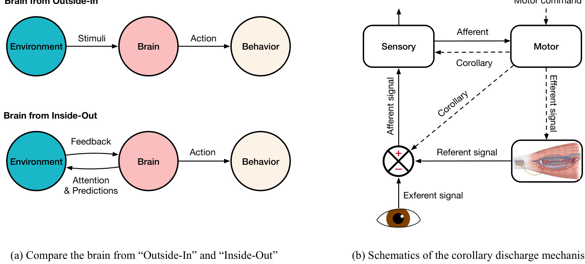

*图8.5：(a) 从“外部到内部”和“内部到外部”比较大脑。(b) 描述了余留放电机制的示意图。一个运动命令（传出信号）从运动区域传输到眼部肌肉，同时一个余留放电（虚线箭头）被路由到感觉系统中的比较器。比较器使用这个内部信号来调节或减去外部（外来）输入。此外，来自肌肉的张力反馈（再传入信号）对感知产生延迟影响。所有哺乳动物的大脑皮层中都存在从运动到感觉皮层的直接投射，这种结构是该架构的基础。部分(b)改编自参考文献[18]中的原始图。*

在行动机制足够建立之时，动作本身成为随后感知发展的推动因素。正是额外传感器的加入使代理受益，这些传感器更有策略地指导这些运动。这种发展顺序将感知基础于效用，将感官辨别与运动的实际结果联系在一起。

行动和感知正常互动的中断揭示了错综复杂的因果循环。在睡眠瘫痪期间，大脑的运动命令暂时无法到达肌肉；外部刺激仍然轰击感官，但通常的行动到感知的校准丢失了。因此，个体会经历一种加剧的虚幻感，因为大脑缺乏内部产生的参考信号来解释感官输入。同样，如果在大脑没有发出运动命令的情况下外部操纵眼睛，视觉场景似乎会移动，突显了单纯感知——缺乏先前、自发行动的情况下——可能导致混淆。神经生理数据进一步支持内在-外在模型。许多曾被视为“纯粹感觉”的区域的神经元不仅追踪外部刺激的变化，还追踪自发的运动——有时甚至更强烈。这表明大脑中的“原因”经常源自内部，指导外部信号的幅度和意义。没有这些内部相关因素，原始的感官数据可能对系统而言变得模棱两可，甚至无用。

智能代理的启示内部-外部视角为现代智能代理研究提供了深刻的见解。大多数当代人工智能系统——以及许多LLM代理——仍然主要以一种被动模式运作，等待用户输入，并根据从大量数据集中学习到的统计相关性生成响应。这种被动性类似于一种“外部-内部”框架，代理的角色受限于响应而非主动发起。然而，如果一个代理是主动的，通过自发行为（物理或表征性）持续形成和测试假设，它可能会基于自身的“感知”输入——无论是感官流或语言提示——从而减少歧义。例如，一个基于LLM的代理，插入问题或根据知识库验证自己的陈述，可以更好地区分哪些推论是自身引起的，哪些是外部数据要求的。通过跟踪这些自发贡献（类似于余流放电），模型可以改善连贯性，减少称为“幻觉”的错误，并通过迭代的因果循环优化其内部状态。

积极的立场还鼓励更具数据效率和上下文感知的学习。代理不再 passively 等待标记示例，而是可以探索、引发反馈，并将自动生成的经验纳入其训练中。随着时间的推移，行动和感知之间的紧密耦合可能增强代理处理复杂任务、适应意外挑战并更稳健地泛化的能力。从外部到内部模型的转变将感知重新定位为行动的因果下游。智能系统——无论是生物还是人工的——都有望从认识到有目的的运动，或者在LLM的情况下是积极的对话步骤，可以积极地创造、塑造和解释回流信号中的信号中受益。通过承认行动的因果关系能力，并努力构建积极而非仅仅是反应性代理，我们可能会更深入地理解自然认知和下一代人工智能。

<html><body><table><tr><td>Dimension</td><td>Human Brain / Cognition</td><td>LLM Agent</td><td>Remarks</td></tr><tr><td>Perception</td><td>- Integrates multiple sen- sory channels (vision, hear- ing, smell, touch, taste). - Perception closely tied to - Perception depends on ex- emotions, endocrine system, and physical state. - Highly sensitive, capable of- Lacks real-time coupling detecting subtle differences.</td><td>- Primarily language-based with some multimodal capa- bilities. ternal sensors and models with limited integration. with physical states.</td><td>Perception differences lead to varying ways of under- standing reality. Embodied AI attempts to bridge this gap but still faces both hardware and software challenges.</td></tr><tr><td> tion</td><td>Unified Representa- - Simultaneously processes multimodal inputs: vision, hearing, language, motion, and emotions. laborate to create unified spa- tiotemporal and semantic un- derstanding.</td><td>- Primarily text-based. Some multimodal models can pro- cess images or audio but with low integration. - Different brain regions col- - No fully unified spatiotem- poral modeling like the hu- man brain.</td><td>Even advanced multimodal models  lack  the human brain's holistic,unified representation capacity. Hardware and algorithmic challenges remain.</td></tr><tr><td>Granularity in Task Switching</td><td>- Flexible in shifting between macro and micro cognitive tasks. - Can plan at a high level - Cannot autonomously real- and shift focus to finer details locate attention between task when needed. - Adjusts task priority and - May get stuck in a spe- focus dynamically based on context and working mem- ory.</td><td>- Relies heavily on prompt engineering for granularity control. layers. cific level of abstraction in absence of guided prompts.</td><td>Humans can dynamically adjust cognitive granular- ity based on situational de- mands, while LLMs require explicit instruction to switch task focus effectively.</td></tr><tr><td> Action</td><td>Goal-oriented process drives multiple sensory to make decisions. - Real-time Learning from the  experience via  the environmental interaction. - Encompass both physical activities and mental pro- cesses.</td><td>- Action space need to be de- fined in advance. - Unable to support actions in continuous spaces. - Relies on online training to optimize the decision- capability. making process in the envi- ronment.</td><td>Humans are capable of actively learning new actions and performing continuous actions, whereasLLM agents currently lack this</td></tr></table></body></html>

*表8.2：比较人类和人工智能代理的感知和行动。*

# 8.5 总结与讨论

传统上，行为代表了基于与环境的互动反馈的人类认知系统的行为。它赋予人类思考、推理、言语、奔跑和执行任何复杂操控的能力。基于行为系统，人类可以通过增强他们对世界的感知和行动来逐步发展大脑智能，并形成一个闭环以进一步在世界中创造新的文明和创新。类似于人类认知系统，行为系统加上工具系统对AI代理也发挥着重要作用。整合行为系统使AI代理能够系统地规划、执行和调整他们的行为，促进在动态环境中更具适应性和鲁棒性的表现。在本节中，我们系统地审查和总结了行为模块对AI代理的影响，重点关注行为系统和工具系统。

行为系统 在我们的研究中，我们从三个角度简要描述了行为系统：行为空间、行为学习和工具学习。在行为系统中，行为空间通常作为最重要的组成部分，决定了AI代理在解决下游任务时的上限。它规定了AI代理在与真实世界环境互动时可以选择和执行哪些动作。对于行为空间，根据数据类型的不同，从离散到连续数据，也存在各种困难。随着对AI代理的需求不断增长，人们对AI代理处理更复杂任务的期望也在增加，特别是涉及真实应用的任务。因此，如何构建稳健和通用的行为空间仍然是行为系统中的一个持续挑战。在行为空间的基础上，行为学习是使代理能够有效与外部世界和人类互动的另一个关键组成部分。行为学习代表了AI代理在与真实世界环境互动过程中学习和优化其策略的过程。基于不同的基础模型，它也衍生出不同的行为学习范式，例如零样本学习。 在行为学习中，深入了解任务是至关重要的，包括如何设计系统提示、如何确定预训练或微调数据集，以及在训练过程中的奖励信号或优化策略。尽管在推动AI代理框架方面在行为学习方面取得了显著进展，但仍有许多问题有待解决。具体来说，ICL范式需要特定的先验知识来进行适当的提示设计。此外，将预训练和后训练结合进行监督训练需要高质量和多样化的数据，这通常需要细致的数据处理和大量人力投入。此外，强化学习的不稳定性在大规模训练场景中应用时存在困难。此外，行为系统的设计在最大化工具集成的好处方面起着至关重要的作用。通过整合有效的行为系统，AI代理可以无缝地与各种工具互动，执行复杂的用户意图，并将外部数据转化为有意义的结果。行为系统与工具之间的协同作用不仅可以减轻记忆限制并降低幻觉风险，还可以增强系统的专业知识和稳健性。例如，配备强大行为系统的AI代理可以动态选择并使用最适合特定任务的工具，从而确保其响应的准确性和效率。 此外，行为系统促进了层次推理过程，使代理能够组织复杂的工作流程，与用户目标紧密契合。这种对齐对于需要精确执行和实时决策的任务至关重要，从而弥合了基础模型能力与实际应用需求之间的差距。此外，工具执行过程提供的透明度和可解释性增强了用户信任，并促进了有效的人机协作。因此，专业工具与强大行为系统的结合显著提升了AI代理在多样化和动态环境中的性能、可靠性和适用性。

总之，行为系统可以显著建立AI代理框架的解决问题能力的基础，使它们能够处理更广泛的复杂任务，超越基础模型的范围。

未来方向然而，为代理构建有效的行为系统需要解决一系列挑战，我们在以下总结：

1.效率是一个重要障碍，特别是在需要快速和精确响应的实时应用中。行为系统涉及的复杂性可能导致不可接受的延迟，阻碍AI系统在欺诈检测或实时决策等场景中的实际部署。为了缓解这些效率问题，必须采取策略，如过滤掉不相关或冗余信息，利用零提示来简化推理过程，并利用高速存储解决方案缓存相关知识。这些方法有助于保持高性能的同时减少响应时间。

2. 评估在行为系统中也是一个重要因素，包括行为学习和工具学习。在现实世界的环境中，来自不同来源的大量行为存在。因此，如何确定来自不同来源的正确行为或工具，以避免冲突信息，仍然是AI代理中一个重要挑战。为了缓解这些问题，建立有效和稳健的评估系统来衡量行为系统是至关重要的，以保持响应的准确性和可靠性。开发稳健的评估系统、验证协议，并创建透明的方法对于减少行为预测中的不正确性至关重要。此外，揭示基础模型的决策过程也有助于我们理解哪种行为更好，以及如何与各种行为或工具协调，提供可信赖的输出。

3. 基于大型语言模型的自主代理中，多模态行为学习取得了显著进展。然而，如何理解和调用超出语言指令范围的行为（例如GUI操作或具体工具）仍然是挑战。在现实场景中，人类可以通过任何形式的指令（例如语言、图像、视频或人类引导）开发或学习新技能的使用。因此，使AI代理能够通过多样的模态开发或学习行为对于提升AI代理在解决来自现实场景的实际任务中的能力至关重要。换句话说，我们有必要探索如何减少人类和AI代理在工具利用方面的差距，促进未来先进代理框架的设计。

4. 隐私在生成式人工智能领域尤为关键，特别是在使用大型语言模型时。因此，在工具利用中，维护敏感用户数据的隐私和防止用户行为的披露至关重要。为了解决这些隐私问题，可以采用一些安全技术，如联邦学习，使模型能够在分散的数据源上进行训练，而不直接暴露敏感信息。此外，通常需要进行模型蒸馏，以确保模型在维护数据完整性的同时保持高性能。这些方法能够有效地训练模型，同时保护用户数据的保密性。

5. 此外，人类与模型协作的伦理影响以及模型与物理环境交互所涉及的安全问题需要认真考虑。在将人类劳动与人工智能系统整合时，确保人类尊严和自主权得到保护至关重要。建立伦理准则，促进公平的工作条件，促进跨学科合作是解决这些问题的必要条件。此外，发展强大的安全机制，以防止人工智能系统与物理工具或行为交互时发生错误或恶意行为，对于防范潜在风险至关重要。

除了上述挑战之外，行动系统仍然存在一些未解决的问题。例如，如何在基础模型和外部工具之间实现最佳平衡，确定何时使用前者而非后者的适当时机，仍然没有答案。具体来说，尽管工具系统可以为基础模型提供灵活性和可扩展性，但越来越多地增强基础模型的内在能力是一个增长的趋势。因此，在基础模型和工具系统之间取得平衡对于开发多功能且高效的人工智能代理至关重要。

# 智能体中的自我进化

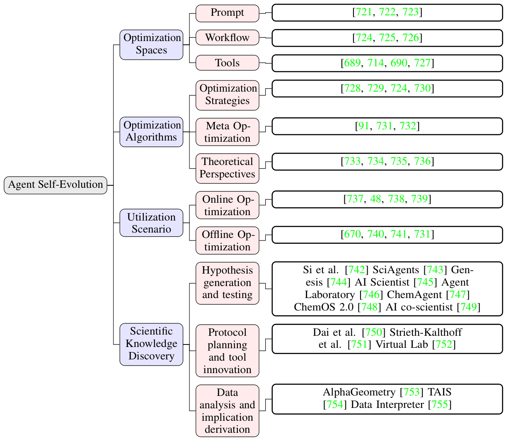

*图8.6：LLM代理中的自我进化结构。*

在机器学习研究的历史中，手动设计的人工智能系统逐渐被更高效的学习解决方案取代。例如，在深度学习出现之前，特征通常是由专家手工设计的，但最终被神经网络提取的特征所取代。随着神经网络变得越来越复杂，各种自动设计技术，如神经架构搜索，已经出现，进一步取代了需要手动设计网络结构的需求。同样，代理系统最初严重依赖手动设计，行为规则和决策策略是由开发人员明确制定的。虽然代理自我进化的完全自动化尚未实现，但预计并被认为是未来进展所必需的。这种自动化的成功先例已经可以在自动化机器学习（AutoML）中看到，它自动化了传统机器学习流程的各个组件。特别是，AutoML简化了机器学习算法流水线的选择和配置，同时结合了高级的超参数优化技术。在AutoML的最显著应用中，NAS自动设计神经网络架构以增强模型性能。受传统机器学习中成功向自动化转变的启发，我们提议将类似原则扩展到代理人工智能系统的领域。

当前代理研究中一个关键的反直觉问题是，虽然开发或改进代理人工智能系统的最终目标是自动化人类工作，但创建这些系统的过程目前仍然超出了完全自动化的范围。因此，我们认为，所有手动设计的代理人工智能系统最终将被可学习和自我进化的系统所取代，这可能最终将代理人工智能的开发和改进置于一个自主、自我维持的循环中。在LLM代理中启用自我进化机制具有以下好处：

1. 可扩展性：尽管基于LLM的代理展现出了卓越的性能，但它们的改进仍然严重依赖于基础的LLM。然而，升级这些模型是昂贵的，并且通过包含额外的现实世界数据来扩展性能需要在大型数据集上进行大量的重新训练，这带来了重大的资源限制。相比之下，自我进化的代理系统可以优化代理行为，而无需修改基础的LLM，提供了更高效和可扩展的解决方案。

2. 降低劳动成本：手动设计代理系统是一个复杂而劳动密集的过程，需要开发人员深入研究复杂的技术细节。传统方法通常涉及从头开始构建这些系统，需要相当多的专业知识和努力。相比之下，自我进化的代理系统可以自动化这个过程的大部分内容，显著减少了对手动干预的需求，降低了开发成本。

3. 与自然智能发展一致：正如人类通过学习和适应不断改进自己一样，为LLM代理配备自我改进能力是迈向真正自主代理的发展的必要步骤。这使它们能够优化性能，适应新挑战，并在没有直接人类干预的情况下进化。

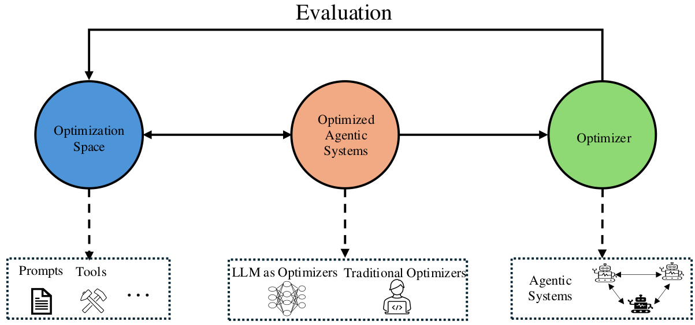

*图8.7: 本节讨论的关键概念示意图，包括优化空间、优化器和优化目标。优化器在优化空间内迭代地改进组件，以增强代理系统，直到达到满意的结果，从而实现LLM代理系统的自我改进。*

为了实现自动化人类努力的目标，许多研究提出了利用LLMs作为推动引擎，实现代理系统自我进化的方法。特别是，LLMs为传统优化方法（如基于梯度和基于强化学习的方法）提供了一种高效的替代方案。它们将优化空间从数值值扩展到更多样化的领域，其中自然语言作为一种通用桥梁。LLM能够优化复杂、异构的参数，如指令和工具实现，并可以跨越各种LLMs，包括开源和闭源模型。这种方法的一个显著例子是AFLOW，它自动化生成和优化整个代理系统工作流程。该系统利用蒙特卡洛树搜索来发挥LLMs的全面能力。在这个框架中，传统手工制作的代理系统被算法生成的系统所取代，标志着一种范式转变。此外，越来越多的研究探索类似的方法，进一步推动了该领域的发展。

本部分结构如下：首先，我们介绍了最近研究中探索的各种代理系统优化空间，包括提示、工具和工作流程。在接下来的部分中，我们回顾了优化算法，讨论了传统优化范式和元优化，其中优化过程也影响基础优化算法本身。然后，我们探讨了自我进化场景，将其分类为在线优化和离线优化两种类型。在此之后，我们讨论了大型语言模型（LLM）代理自我改进技术的应用，特别是在人工智能科学领域的知识发现中。最后，我们讨论了与代理自我进化技术相关的安全问题。

# 自我演化的优化空间和维度

自主代理的优化代表着一个复杂的挑战，涵盖了多个抽象层面。在本节中，我们首先将即时优化确立为基础层，之上涌现出三个不同的优化分支：代理工作流优化、工具优化和全面自主代理优化。

# 9.1 代理优化概述

现有基于LLM的智能代理优化可以在一个两层架构中进行概念化。在基础层面上是提示优化，专注于增强语言模型节点的基本交互模式。在此基础上，出现了三个并行分支：i) 工作流水平优化，重点关注多个LM节点之间的协调和交互模式；ii) 工具优化，代理通过开发和改进工具来适应新任务并利用过去的数据而进化；iii) 全面自主代理优化，旨在通过考虑多个维度来全面增强代理的能力。

类似于AutoML中的优化范式，智能代理优化可以被归类为单目标或多目标。当代智能代理优化主要集中在三个经典的度量标准上：性能、推理成本和延迟。性能衡量了代理完成其指定任务的有效性，而推理成本则量化了代理运行所需的计算资源。延迟表示代理响应并完成任务所花费的时间。这些目标根据具体的优化模式可能会有所不同。例如，在提示级别的优化中，额外的约束条件，如提示长度，可能成为相关的目标。这种多方面的优化目标的性质反映了代理系统的复杂性以及平衡多个竞争需求的必要性。

# 9.2 提示优化

大型语言模型(LLMs)基于代理的优化中，提示优化在优化中起着至关重要的作用。在优化代理时，除了模型级别的优化之外，任务特定或模型特定的提示优化直接影响代理的性能、延迟和成本。给定一个任务$T=(Q,G_{t})$，其中$Q$表示输入查询，$G_{t}$代表可选的地面实况，提示优化的目标是生成一个任务特定的提示$P_{t}^{*}$，以最大化性能：

$$ 
P^{*}=\underset{P\in\mathcal{P}}{\arg\operatorname*{max}}\mathbb{E}_{T\sim\mathcal{D}}[\phi_{\mathrm{eval}}(\phi_{\mathrm{exe}}(Q,P),T)]
 $$

其中，$\mathcal{P}$代表可能提示的空间，$\phi_{\mathrm{exe}}$表示执行函数，$\phi_{\mathrm{eval}}$表示评估函数。这种优化通常通过三个基本函数实现：$\phi_{\mathrm{opt}}$、$\phi_{\mathrm{exe}}$和$\phi_{\mathrm{eval}}$。优化函数$\phi_{\mathrm{opt}}$根据优化信号改进现有提示，执行函数$\phi_{\mathrm{exe}}$调用当前提示以获取输出$O$，评估函数$\phi_{\mathrm{eval}}$评估当前输出以生成评估信号$S_{\mathrm{eval}}$和优化信号$S_{\mathrm{opt}}$。评估信号用于选择有效的提示，而优化信号则帮助优化函数执行优化。

## 9.2.1 评估函数

在提示优化的核心是评估函数 $\phi_{eval}$，它作为导出优化信号和引导提示演化轨迹的基石。该函数在评估来源、方法论和信号生成之间进行复杂的协调，建立一个反馈循环，推动持续改进。评估函数 $\phi_{eval}$ 处理评估来源作为输入，并采用各种评估方法生成不同类型的信号，随后指导优化过程。在这里，我们定义了来源、方法和信号类型的维度，以建立提示优化的基础。

评估来源主要包括LLM生成的输出$G_{llm}$和任务特定的基准$G_{t}$。现有工作主要利用$G_{llm}$和$G_{t}$之间的比较作为评估来源。一些方法仅利用$G_{llm}$作为评估来源。例如，PROMPT通过将$G_{llm}$与人工设计的规则进行比较来评估提示的有效性；SPO则利用来自不同提示的输出的成对比较来确定相对有效性。

评估方法
评估方法可以大致分为三种方法：基准评估、LLM作为评判者和人类反馈。基准评估仍然是提示优化中最普遍的方法。这种方法依赖预定义的指标或规则来提供数值反馈作为评估信号。虽然它提供了自动化的评估过程，但其有效性最终取决于基准设计与人类偏好的一致性程度。

LLM作为评判者的引入代表了自动化评估和偏好对齐的重大进展。利用LLM与人类偏好的内在一致性和精心设计的评判标准，这种方法可以根据任务描述和提示输出$G_{llm}$来评估任务完成质量，提供反映性的文本梯度反馈。显著的实施包括ProteGi、TextGrad、Semantic Search和Revolve。此外，LLM作为评判者还可以通过特定评分机制在地面真相$G_{t}$和输出$G_{llm}$之间进行比较评估。这种方法的有效性取决于评判提示的设计以及基础模型与人类偏好的一致性。作为一种专门的扩展，Agent-as-a-Judge通过利用专门的代理人在复杂任务上提供过程评估，同时以显著降低的评估成本保持与人类偏好的高度一致性，进一步完善了这一范式。

人类反馈代表了评估过程中智能整合的最高水平。由于人类仍然是提示效果的最终裁决者，直接的人类反馈可以快速且显著地提高提示的质量。然而，这种方法引入了显著的资源开销。APOHF[777]表明，整合人类反馈可以在最小的计算资源下实现强大的提示优化，特别擅长于开放式任务，如用户指导、文本到图像生成模型的提示优化以及创意写作。然而，对人类干预的需求在一定程度上与自动演化的目标相矛盾。

信号类型评估方法生成的反馈以三种明显形式呈现，每种形式都满足不同的优化需求。数值反馈通过标量度量指标量化性能，与规则、基准真相、人类评估和LLM判断兼容。虽然广泛适用，但这种方法需要大量样本以获得统计可靠性，可能忽视可指导优化的特定实例细节。文本反馈通过分析和具体建议提供详细的、特定实例的指导。这种复杂方法需要智能参与，可以是来自人类专家或先进语言模型，通过明确建议实现对提示设计的有针对性改进。然而，它对复杂智能来源的依赖影响了其可扩展性。排名反馈通过全面排名或成对比较建立相对质量排序。这种方法独特地避免了对绝对质量度量或预定义标准的需求，只需要偏好判断。当难以定义绝对度量或优化主要涉及相对改进时，这种方法尤为有价值。

## 9.2.2 优化函数

优化函数的设计在确定每次提示优化迭代中生成质量的关键作用。通过有效的信号引导，提示自我演化可以实现更快的收敛。当前的优化方法主要依赖于两种类型的信号：评估信号$S_{eval}$，用于识别最有效的现有提示，以及优化信号$S_{opt}$，提供改进的详细指导。

通过评估信号进行优化时，该过程从基于$\phi_{eval}$评估的最有效提示的选择开始。一些方法采用启发式探索和优化策略，而非直接从过去的错误中学习。SPO[778]根据当前表现最佳提示的输出迭代地优化提示，利用语言模型固有的与任务要求对齐的能力。类似地，Evoprompt[723]采用进化算法，LLMs作为启发式提示组合的进化操作符。PromptBreeder[732]通过比较变异提示之间的分数变化，同时通过LLM的固有能力修改元提示和提示，进一步推进了这种方法。

在优化信号的指导下进行优化 虽然仅基于评估信号的优化方法需要进行广泛搜索以在庞大的搜索空间中找到最佳解决方案，但另一种方法利用明确的优化信号来引导优化方向并提高效率。现有方法展示了利用这些优化信号的各种方式。OPRO[730]从高性能提示解决方案中提取共同模式，以指导后续优化步骤。ProTegi[779]采用语言模型来分析失败案例并预测错误原因，利用这些见解作为优化指导。TextGrad[728]进一步扩展了这一方法，将提示反映转化为“文本梯度”，将这一指导应用于代理系统中的多个提示。Revolve[780]通过模拟二阶优化进一步增强了优化，将先前的一阶反馈机制扩展为建模连续提示和响应之间不断演变关系的方式。这使系统能够根据先前梯度的变化进行调整，避免停滞在次优模式中，并实现更具见解的、长期的复杂任务性能改进。

## 9.2.3 评估指标

可以评估提示优化方法的有效性，跨多个维度进行评估。对于CloseTasks的性能指标[782,778,730]作为提示固有性能的最直接指标，包括通过率@1、准确性、F1分数和ROUGE-L等指标。这些指标使研究人员能够评估提示优化过程的稳定性、有效性和收敛速度。另一个关键维度是效率指标[778]。虽然一些提示优化方法取得了出色的结果，但它们通常需要大量的计算资源、更大的样本量和广泛的数据集。相反，其他方法在资源需求较低的情况下取得了中等结果，突显了代理演化中性能和效率之间的权衡。第三个维度关注评估代理行为特定方面的定性指标：一致性[776]衡量了多次运行中输出的稳定性，公平性[783]评估了减轻语言模型固有偏见的能力，信心[784,785]量化了代理对其预测的确定性。当将这些行为方面视为不同的目标时，提示优化框架提供相应的评估指标。

# 9.3 工作流优化

尽管在增强单个LLM能力方面，提示级别的优化显示出了令人鼓舞的结果，但现代人工智能系统通常需要协调多个LLM组件来解决复杂任务。这需要一个更全面的优化领域——智能工作流空间。在其核心，智能工作流包括LLM调用节点，其中每个节点代表专门设计用于较大系统中特定子任务的LLM组件。

尽管这种架构与多代理系统相似，但重要的是要将智能工作流与完全自主的多代理情景区分开来。在智能工作流中，节点根据预定的协议和优化目标操作，而不是展示自主决策能力。许多著名系统，如MetaGPT[626]和AlphaCodium[786]，可以归类为这种框架。此外，智能工作流可以作为更大的自主代理系统中的可执行组件，使它们的优化对于推进专门任务完成和一般代理能力的发展至关重要。

在GPTSwarm[651]和AFLOW[773]提出的形式化基础上，本节首先建立了智能工作流及其优化目标的形式化定义。然后，我们将研究智能工作流的核心组件——节点和边缘——分析它们各自的搜索空间，并讨论文献中现有的表示方法。

## 9.3.1 工作流程制定

一个代理工作流 $\kappa$ 可以形式化表示为：

$$ 
\mathcal{K}=\{(N,E)|N\in\mathcal{N},E\in\mathcal{E}\}
 $$

其中$\mathcal{N}=\{N(M,\tau,P,F)|M\in\mathcal{M},\tau\in[0,1],P\in\mathcal{P},F\in\mathcal{F}\}$代表了调用LLM节点的集合，其中$M$，$\tau$，$\mathcal{P}$和$\mathcal{F}$分别表示可用的语言模型、温度参数、提示空间和输出格式空间。$E$表示不同LLM调用节点之间的边。这种表述包含了定义代理工作流行为的结构组件和操作参数。

给定一个任务$T$和评估指标$L$，工作流优化的目标是发现最大化性能的最优工作流$K^{*}$：

$$ 
K^{*}=\underset{K\in\mathcal{K}}{\arg\operatorname*{max}}L(K,T)
 $$

其中$K$是工作流的搜索空间，$L(K,T)$通常衡量多个方面，包括任务完成质量、计算效率和执行延迟。这种优化目标反映了在部署代理工作流时面临的实际挑战，我们必须在效果和资源约束之间取得平衡。

## 9.3.2 优化工作流边缘

边缘空间 $\mathcal{E}$ 定义了智能工作流的表示形式。目前的方法主要采用三种不同的表示范式：基于图形、基于神经网络和基于代码结构。每种范式都具有独特的优势，并对优化过程引入特定的约束。

基于图形的表示使得节点之间的层次、顺序和并行关系得以表达。这种方法自然地适应复杂的分支模式，并便于可视化工作流拓扑结构，特别适用于需要明确结构操作的场景。例如，GPTSwarm[651] 在通过具有拓扑感知优化的图形化工作流表示协调多个LLM组件方面展示了其有效性。神经网络架构提供了另一种强大的表示范式，擅长捕捉节点之间的非线性关系。Dylan [725] 表明，基于神经网络的工作流通过可学习参数可以表现出自适应行为，因此在需要根据输入和反馈进行动态调整的场景中特别有效。基于代码的表示在当前方法中提供了最全面的表达性。AFLOW[773] 和 ADAS[741] 显示，将工作流表示为可执行代码支持线性序列、条件逻辑、循环以及图形和网络结构的整合。这种方法可以精确控制工作流的执行，并利用LLMs固有的代码生成能力。

边缘空间表示形式的选择显著影响了搜索空间的维度和适用的优化算法。[728] 专注于即时优化，同时保持固定的工作流拓扑结构，从而可以利用基于文本反馈的优化技术。相比之下，[651] 开发了强化学习算法，用于联合优化单个节点提示和整体拓扑结构。[773] 利用基于代码的表示形式，通过语言模型直接实现工作流优化，而[787] 和 [788] 的最新进展则引入了针对特定问题的拓扑优化方法。

## 9.3.3 优化工作流节点

节点空间$N$包含四个关键维度，影响节点行为和性能。输出格式空间$F$通过构建LLMs的输出格式，如XML和JSON，显著影响性能，使响应结构更具精确控制。温度参数$\tau$控制输出的随机性，影响节点响应中稳定性与创造性的权衡。提示空间$P$继承了来自提示级别优化的优化领域，决定了与LLMs的核心交互模式。模型空间$M$代表可用的LLMs，每个LLM都具有独特的能力和计算成本。

针对单节点优化，现有研究主要集中在该空间内的特定维度上。[773] 专注于提示优化，而[741] 将搜索空间扩展到包括提示和温度参数。采用不同方法，[789] 固定提示同时探索跨不同节点的模型选择。尽管输出格式优化至关重要，但仍相对未被深入探讨。

与边缘空间优化相比，节点空间优化由于代理工作流程中通常存在大量节点，面临独特的可扩展性挑战。随着每个额外节点的增加，搜索空间的维度呈乘法增长，需要高效的优化策略，能够有效处理这种复杂性同时保持合理的计算成本。

# 9.4 工具优化

与通常单轮操作LLMs的传统用法不同，代理配备了先进的多轮规划能力，并具有通过各种工具与外部世界进行交互的能力。这些独特的特性使得优化工具使用成为增强代理整体性能和适应性的关键组成部分。工具优化涉及系统地评估和完善代理如何选择、调用和整合可用工具以更高效、更低延迟地解决问题。在这一背景下，关键的性能指标包括决策准确性、检索效率、选择精度、任务规划和风险管理。在这一优化过程中，两种互补策略至关重要：工具学习和工具创建。

## 9.4.1 学习使用工具

与基于提示的方法不同，利用冻结的基础模型在上下文学习能力方面，基于训练的方法通过监督来优化支持LLM代理的模型。受发展心理学启发，基于示范的学习可以分为两个主要流派：从示范学习和从反馈学习中学习。利用基于示范的学习方法训练支持LLM代理的模型，通过模仿学习专家行为。诸如行为克隆等技术使模型能够通过复制人类注释的工具使用动作以监督方式学习策略。形式上，给定数据集 $D=\{(q_{i},a_{i}^{*})\}_{i=0}^{N-1}$，其中 $q_{i}$ 是用户查询，$a_{i}^{*}$ 是相应的人类示范，控制器的参数 $\theta_{C}$ 被优化为：

$$ 
\theta_{C}^{*}=\arg\operatorname*{max}_{\theta_{C}}\mathbb{E}_{(q_{i},a_{i}^{*})\in D}\prod_{t=0}^{T_{i}}p_{\theta_{C}}(a_{i,t}^{*}\mid x_{i,t},H_{i,t},q_{i})
 $$

其中 $a_{i,t}^{*}$ 是查询 $q_{i}$ 在时间步 $t$ 的人类标注，$T_{i}$ 是时间步的总数。

从反馈学习中学习利用强化学习，使模型能够根据来自环境或人类反馈的奖励进行调整。控制器参数 $\theta_{C}$ 的优化目标是：

$$ 
\theta_{C}^{*}=\arg\operatorname*{max}_{\theta_{C}}\mathbb{E}_{q_{i}\in Q}\mathbb{E}_{\{a_{i,t}\}_{t=0}^{T_{i}}}\left[R\left(\{a_{i,t}\}_{t=0}^{T_{i}}\right)\right]
 $$

其中 $R$ 代表基于动作序列 $\{a_{i,t}\}$ 的奖励函数。

将工具学习整合到优化框架中增强了系统在不同任务和环境中泛化工具使用能力。通过结合基于演示和基于反馈的学习，模型可以迭代改进其工具调用策略、选择策略和执行准确性。

为了优化上述指标以提高LLM代理的能力，需要结合先进的检索模型、精细调节的推理策略和自适应学习机制。推理策略，如思维链 (CoT) [46]、思维树 [72] 和深度优先搜索决策树 (DFS-DT) [690]，促进了关于工具使用的更复杂的决策过程。通过优化模型对工具的理解，包括参数解释和动作执行，可以实现更精确和有效的工具交互。此外，从模型的输出中学习可以实现更好的后处理和分析，进一步提升工具利用效率。

## 9.4.2 新工具的创建

除了优化现有工具之外，基于对任务和当前工具使用的深刻理解，动态地创造新工具可以显著增强LLM智能代理框架的适应性和效率。在最近的工作中，提出了几种互补的方法。ToolMakers建立了一个闭环框架，其中一个制造工具的代理通过三个演示迭代地执行三个阶段：（1）通过示范进行编程示范提出Python函数，（2）通过自动化单元测试验证功能（3个验证样本）并进行自我调试测试用例，（3）为下游任务包装经验证的工具并提供使用演示。这一严格的过程确保了可靠性同时保持了全自动化。CREATOR采用了四阶段生命周期：通过抽象推理创建特定任务的工具，决策规划工具调用，执行生成的程序，通过迭代工具细化强调工具多样性、抽象/具体推理的分离和错误恢复机制的纠正。相比之下，CRAFT采用了离线范式，通过GPT-4提示、验证和去重将领域特定数据提炼为可重复使用的原子工具（例如对象颜色检测）。其无需训练的方法将人可检查的代码片段与组合问题解决相结合，实现可解释的工具链，同时避免模型微调，特别适用于将复杂任务分解为模块化步骤时。

这些互补方法的整合为丰富的研究机会提供了可能。混合系统可以将CRAFT的预制工具库与ToolMakers的按需生成相结合，利用功能缓存来平衡效率和适应性。未来的框架可能实现多层工具层次结构，其中来自CRAFT的基本操作输入到ToolMakers的复合工具中，而CREATOR风格的纠正处理边缘情况。自监督工具评估指标和跨领域泛化的进展可能进一步自动化工具生命周期。值得注意的是，工具粒度（原子 vs. 复合）和可重复使用模式之间的相互作用需要进行系统研究，细粒度工具可以实现灵活的组合，但会增加编排复杂性。随着代理的发展，双向工具-任务相互适应机制可能会出现，其中工具重塑任务表示，而新任务推动工具创新，最终实现自我改进的人工智能系统。

## 9.4.3 工具效果评估

下面讨论的评估指标和基准为量化代理工具使用能力提供了全面的基础。通过评估工具调用、选择准确性、检索效率和复杂任务规划等方面，这些基准不仅衡量当前性能，而且为优化工具使用提供了明确的具体目标。这些指标在引导代理系统的即时性能提升和长期战略改进方面起着重要作用。在接下来的几节中，我们首先回顾了代理工具使用基准的演变，然后整合了作为进一步工具优化目标的关键评估指标。

工具评估基准
最近LLM作为代理研究的努力产生了多样化的基准和框架，用于评估工具使用能力。早期研究，如Gorilla和API-Bank，开创了大规模数据集和测试LLM与外部API交互的方法，揭示了诸如参数准确性和幻觉等问题。随后的作品，如T-Bench和ToolBench，引入了更广泛的任务套件，并强调了系统性数据生成对工具操作的重要性。StableToolBench通过强调现实世界API的不稳定性，提出了虚拟API服务器，以实现更一致的评估。同时，ToolAlpaca调查了在相对较小的语言模型中通过最少领域内训练实现通用工具使用的可行性。ToolEmu评估了通过模拟沙盒环境对工具增强的LLM代理的安全性和风险方面。MetaTool引入了一个新的基准，重点关注LLM是否知道何时使用工具，并能正确选择要使用的工具。它提供了一个名为ToolE的数据集，涵盖了单工具和多工具使用情景，鼓励研究工具使用意识和细致的工具选择。ToolEyes通过检查真实场景和跨大型工具库的多步推理进一步推动了评估。最后，$\tau$ -bench引入了人机协作的视角，强调了基于代理对话中的动态用户交互和政策遵从。总的来说，这些基准和框架突显了工具增强LLM研究不断发展的格局，标志着从孤立推理任务转向全面的、真实世界代理评估。

工具调用的度量标准决定是否调用外部工具是一个至关重要的步骤，它可以显著影响系统的效率和有效性。在许多场景中，模型必须确定自身推理是否足以回答查询，或者是否需要工具提供的额外外部知识（或功能）。为了形式化这一过程，我们引入了一个带标签的数据集。

$$ 
D_{\mathrm{inv}}=\{(q_{i},y_{i})\}_{i=0}^{N-1},
 $$

其中，$q_{i}$表示第$i$个用户查询，$y_{i}\in\{0,1\}$是一个二进制标签，指示是否需要调用工具（$\langle y_{i}=1\rangle$）或不需要（$(y_{i}=0)$）。基于这个数据集，模型学习一个决策函数$d(q_{i})$，定义如下：

$$ 
d(q_{i})={\left\{\begin{array}{l l}{1,}&{{\mathrm{if~}}P_{\theta}(y=1\mid q_{i})\geq\tau,}\\ {0,}&{{\mathrm{otherwise}},}\end{array}\right.}
 $$

其中，$P_{\theta}(y=1\mid q_{i})$表示模型（由参数$\theta$参数化）预测在查询$q_{i}$中调用工具的概率，$\tau$是预先确定的阈值。

除了这个决策规则，还可以使用几种指标来评估模型正确决定是否调用工具的能力。例如，可以计算整体调用准确率$A_{\mathrm{inv}}$如下：

$$ 
A_{\mathrm{inv}}=\frac{1}{N}\sum_{i=0}^{N-1}\mathbf{1}\{d(q_{i})=y_{i}\},
 $$

其中，$\mathbf{1}\{\cdot\}$是指示函数。还可以使用其他指标，如精确率、召回率和F1分数。此外，如果$C_{\mathrm{inv}}$表示调用工具产生的成本，$R(q_{i})$表示正确使用工具时获得的收益或奖励，则可以定义净收益分数：

$$ 
{\cal B}_{\mathrm{inv}}=\sum_{i=0}^{N-1}\left({\bf1}\{d(q_{i})=1\}\cdot R(q_{i})-C_{\mathrm{inv}}\right).
 $$

这种表述不仅强调准确性，还考虑了调用外部工具的成本效益。

在决定调用工具之后，下一个挑战是从候选工具池中选择最合适的工具。假设候选工具集表示为：

$$ 
\mathcal{T}=\{t_{1},t_{2},\dots,t_{M}\}.
 $$

对于给定查询$q_{i}$，假设最佳工具（根据地面实况）为$t_{i}^{*}$，模型选择了$\hat{t}_{i}$。最简单的选择性能度量是工具选择准确率$A_{S}$。

$$ 
A_{S}=\frac{1}{|Q|}\sum_{q_{i}\in Q}\mathbf{1}\{\hat{t}_{i}=t_{i}^{*}\}.
 $$

然而，许多场景涉及通过相关性对多个候选工具进行排名。在这种情况下，诸如平均倒数排名（MRR）和归一化折现累积增益（nDCG）之类的基于排名的指标提供了更为细致的评估。[690]在评估工具检索系统时使用了这两种指标。

工具检索效率和层次准确性 工具检索涉及识别合适工具的速度以及选择的准确性。高效的检索方法可以减少延迟和计算开销，而高检索准确性则确保为任务识别出最相关的工具。为了全面评估工具使用，我们采用了一个层次框架，区分了检索准确性和选择准确性。检索准确性（$A_{R}$）反映了系统从存储库中精确检索正确工具的能力，通常通过诸如精确匹配（EM）和F1分数之类的指标来衡量，这些指标捕捉了完全匹配和部分匹配。相反，选择准确性（$A_{S}$）评估了系统从一组候选工具中选择最佳工具的能力，同样使用类似的指标。总体工具使用意识进一步通过准确度、召回率、精确度和F1分数进行评估。

因此，总体检索效率$E_{Ret}$可以表示为：

$$ 
E_{R e t}=\frac{A_{R}\times A_{S}\times A_{P}\times A_{U}}{C_{R}}
 $$

其中$C_{R}$是与检索相关的成本。优化策略可能涉及使用反馈机制训练嵌入模型，以增强效率和每个层次组件的准确性。

为了更细致地评估工具选择，Metatool [796]引入了正确选择率（CSR），用于量化模型选择预期工具的查询百分比。这种评估框架涵盖了四个方面：在类似候选工具中选择正确的工具，在特定上下文场景中选择适当的工具，通过避免选择不正确或不存在的工具来确保可靠性，并处理多工具查询。这些指标和子任务共同提供了工具检索和选择中效率和精度的稳健度量。

复杂任务的工具规划
复杂任务通常需要依次应用多个工具才能达到最佳解决方案。工具规划可以表示为一个有序序列。

$$ 
\Pi=[t_{1},t_{2},\dots,t_{K}],
 $$

其中$K$是步骤的数量。这样的计划质量通常通过平衡任务效果（例如，通过度量$R_{\mathrm{task}}(\Pi)$）与计划的复杂性（或长度）来评估。这种平衡可以通过形式为的综合规划得分来捕捉。

$$ 
S_{\mathrm{plan}}=\alpha\cdot R_{\mathrm{task}}(\Pi)-\beta\cdot K,
 $$

其中$\alpha$和$\beta$是调整高任务性能收益和计划复杂性成本之间权衡的系数。当存在地面真值计划$\Pi^{*}$时，可以使用BLEU或ROUGE等相似度指标将预测计划$\Pi$与$\Pi^{*}$进行比较，然后相应地定义整体规划效率指标。

此外，最近的工作（如ToolEyes[797]）强调了将行为规划引入工具使用的重要性。除了选择工具和参数外，LLMs还需要简洁总结获取的信息并策略性地规划后续步骤。在这种情况下，行为规划能力沿两个维度进行评估。首先，通过评估当前状态总结的合理性、为下一个动作序列规划的及时性以及规划的多样性来计算得分$S_{b}$，其有效性$\in[0,1]$。其次，通过评估语法正确性、逻辑一致性和纠正思维能力来计算得分$S_{b\mathrm{-integrity}}\in[0,1]$。然后，将综合行为规划得分确定为

$$ 
S_{B P}=S_{b\mathrm{-validity}}\cdot S_{b\mathrm{-integrity}},
 $$

提供了对模型规划能力的整体度量。这一综合框架确保了针对复杂任务的工具规划不仅侧重于工具的选择和排序，还注重维持连贯、高效和具有战略性的规划过程。

总之，在Agent系统中优化工具性能需要一个综合方法，平衡决策准确性、检索效率、层次选择精度、战略规划、严密风险管理和强大的工具学习机制。通过实施有针对性的优化和学习策略，可以提高工具辅助机器学习工作流程的效果和效率。

# 9.5 迈向自主代理优化

除了优化智能代理演化中的个体模块，如提示、工具和工作流程——这些容易受到局部优化的影响，可能损害智能系统整体性能外，大量研究致力于优化整个智能系统内的多个组件。这种整体方法使大型语言模型（LLM）代理能够更全面地演化。然而，优化整个系统提出了更高的要求。算法不仅必须考虑个体组件对智能系统的影响，还必须考虑不同组件之间的复杂相互作用。

ADAS[741]是最具代表性的工作之一，首次正式定义了智能系统中自动设计问题。它将多个智能系统组件整合到进化管道中。具体来说，ADAS引入了一个元代理，能够在整体优化过程中迭代地设计智能系统的工作流程、提示和潜在工具。正如实验所证明的那样，自动设计的智能系统胜过了最先进的手工设计基准。

此外，[726]提出了一种代理符号学习框架，用于训练语言代理，灵感来自神经网络中使用的连接主义学习原理。通过将代理管道与计算图进行类比，该框架引入了一种基于语言的反向传播和权重更新方法。它定义了基于提示的损失函数，通过代理轨迹传播语言损失，并相应地更新符号组件。该方法实现了代理工作流的结构化优化，并通过将节点视为独立代理或允许多个代理在单个节点中执行而自然地扩展到多代理系统。

[799]提出了一种优化提示和代理自身代码的方法，实现自我改进。这符合自指的概念，即系统可以分析和修改自身结构以增强性能。

类似地，[773]、[787]、[800]和[788]专注于优化代理系统内的工作流程和提示。特别是，[285]提出了一种方法，训练额外的大型语言模型（LLMs）生成提示和工作流程，实现代理系统架构的自动化设计。

总之，优化整个代理系统的工作流程并不仅仅是对各个组件优化的简单聚合。相反，它需要考虑到组件之间复杂的相互依赖关系的精心设计算法。这使得系统范围的优化成为一项更具挑战性的任务，需要先进的技术来实现有效和全面的改进。

# 大型语言模型作为优化器

在本章中，我们介绍并讨论将LLMs概念化为优化器的现有研究。首先，我们注意到大多数现有研究集中于Equation(9.1)中定义的提示优化问题，因为优化代理工作流的其他组件仍然是一个新兴的研究领域。为了继续，我们将类比于经典的迭代算法，并研究它们如何融入现代优化工作流中。

# 在线和离线代理自我提升

在自我完善的追求中，智能代理利用优化作为一种机制，用于精细调节个体组件，如提示设计、工作流编排、工具利用、奖励函数调整，甚至优化算法本身，并作为一个战略框架，确保这些个体改进朝向一致的性能增强。例如，在孤立情况下优化奖励函数和提示设计可能会产生冲突的结果，但战略方法协调这些优化以保持一致性并最大化整体有效性。我们将自我进化分为两个主要范式：在线和离线自我改进。此外，我们探讨了集成这两种方法以最大化效率和适应性的混合优化策略。

# 11.1 在线代理自我提升

在线自我改进是指代理根据即时反馈动态调整其行为的实时优化。这一范式确保代理通过连续优化关键性能指标（如任务成功率、延迟、成本和稳定性）在迭代反馈循环中保持对不断变化的环境的响应能力。在线自我改进在需要动态适应性的应用中特别有效，如实时决策制定、个性化用户交互和自动推理系统。在线自我改进中的关键优化策略可分为以下四类：迭代反馈与自我反思、多代理系统中的主动探索、实时奖励塑造和动态参数调整。

迭代反馈与自我反思 这些方法学旨在使代理能够迭代地批判和优化其自身输出。自我反思和自我完善以及思维树引入了自我批判循环，模型在实时中识别错误并提出修订。ReAct将“推理”的思路与“行动”相结合，允许模型在观察外部反馈后迭代修订步骤。此外，其他方法要么依赖于自洽性来选择最连贯的解决方案，要么利用过程奖励模型（PRM）（Lightman等，2019）从候选方案中选择最佳解决方案。总的来说，这些框架减少了错误传播，并支持在不需要单独的离线微调周期的情况下进行快速适应。

多智能体系统中的主动探索 这些方法[626,848,627,152]积极探索并动态搜索多智能体系统中的新模式和工作流改进。MetaGPT[626]、CAMEL[848]和ChatDev[627]展示了多角色或多智能体生态系统，在实时互动中交换持续反馈以完善彼此的贡献。类似地，HuggingGPT[152]通过中央的LLM控制器协调托管在Hugging Face上的专门模型，动态路由任务并收集反馈。这些协作策略进一步凸显了智能体之间的在线更新如何逐步完善集体结果。

实时奖励塑造 一些框架[731,91,05,849]不仅依赖于固定或纯离线奖励规范，还整合了即时反馈信号，用于纠正错误，同时也用于调整内部奖励函数和策略。这使得自适应奖励校准成为可能，平衡了性能、计算成本和延迟之间的权衡，使智能体能够根据用户交互动态优化奖励机制。

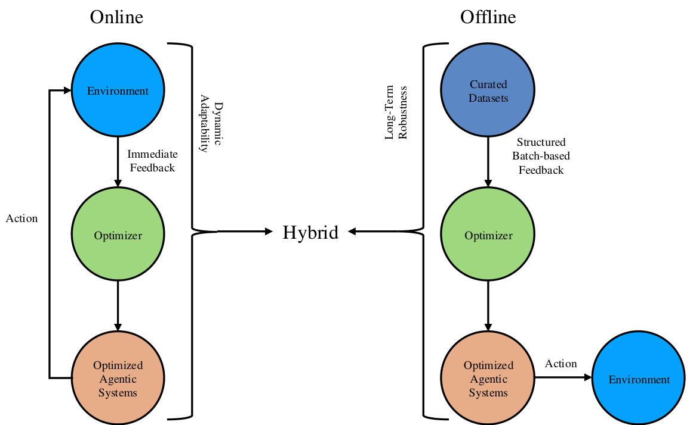

*图1.1：展示了在三种不同利用场景下的自我改进示意图，包括在线、离线和混合自我改进。*

动态参数调整：在这一类别中，智能体通过使用无梯度或近似梯度方法，在实时环境中自主更新其内部参数（包括提示模板、工具调用阈值、搜索启发式等）。这些更新优化了计算效率和决策准确性，使其能够无缝适应不断变化的环境。自我优化（SSO）[850]消除了手动标注的需求，通过在迭代训练过程中自动生成偏好信号，在保持训练在线策略的同时保持信号准确性。

在线自我优化促进了一个不断演化的智能体框架，其中学习嵌入在任务执行中，促进了增强的实时适应性、以用户为中心的优化和强大的问题解决能力。

# 11.2 离线Agent自我提升

离线自我改进相反，利用结构化的基于批处理的优化。这种范式利用预定的训练会话和高质量策划数据集，系统地提升代理的泛化能力。与在线方法不同，离线方法适用于更加计算密集的方法，包括批处理参数更新和微调、元优化以及系统性奖励模型校准。

批处理参数更新和微调：在这个类别中，代理通过使用监督学习或强化学习（RL）技术进行广泛微调，优化在大规模数据集上跨多个训练周期的性能。检索增强生成（RAG）通常被整合以增强上下文理解和长期记忆检索。这些方法允许代理优化检索策略，从而改善对广泛知识语料库的推理能力。

代理组件的元优化：这里的离线训练不仅限于提升任务性能，还延伸到优化算法本身。优化超参数或甚至动态重构优化过程的元学习策略已经展现出有前途的成果。这些元优化方法使代理能够为新问题领域发现最有效的学习参数。

系统性奖励模型校准：离线设置有助于精确校准奖励模型，整合了分层或列表式奖励集成框架（例如，LIRE），通过基于梯度的奖励优化来使代理行为与长期目标保持一致。这种校准确保奖励函数反映真实世界任务的复杂性，从而减轻偏见并增强泛化能力。

离线优化的结构化特性导致了一个强大的代理基线，其性能经过微调以优化稳定性、效率和计算成本，然后再进行真实世界部署。离线训练允许进行高保真度的模型细化，对于需要可预测性能保证的关键任务应用至关重要。

# 11.3 线上与线下改进的比较

在线和离线优化提供了互补的好处，各自在自我提升的不同方面表现出色。在线优化在动态环境中蓬勃发展，在这种环境中，实时反馈使得持续适应成为可能。它非常适用于需要即时响应的应用，如交互式代理、实时决策和强化学习系统。然而，频繁的更新可能会引入不稳定性或漂移，需要机制来减轻随时间推移而带来的性能下降。

相比之下，离线优化强调使用预先收集的数据集进行结构化、高保真度的训练，在部署之前确保强大且稳定的性能。通过利用计算密集型的学习方法，如批量训练、微调和元优化，离线方法提供了强大的泛化能力和长期一致性。然而，它们缺乏在线学习的灵活性，并且可能在没有额外重新训练的情况下难以有效地适应新领域。表11.1总结了这两种范式之间的关键区别。

<html><body><table><tr><td>Feature</td><td>Online Optimization</td><td>Offline Optimization</td></tr><tr><td>Learning Process</td><td>Continuous updates based on real-time feedback</td><td>Batch updates during scheduled training phases</td></tr><tr><td>Adaptability</td><td>High, capable of adjusting dynamically</td><td>Lower, adapts only after retraining</td></tr><tr><td>Computational Effi- ciency</td><td>More efficient for incremental updates</td><td>More resource-intensive due to batch training</td></tr><tr><td>Data Dependency</td><td>Requires real-time data streams</td><td>Relies on curated, high-quality datasets</td></tr><tr><td>Risk of Overfitting</td><td>Lower due to continuous learning</td><td>Higher if training data is not diverse</td></tr><tr><td>Stability</td><td>Potentially less stable due to frequent updates</td><td>More stable with controlled training set- tings</td></tr></table></body></html>

*表1.1：自我增强代理中在线与离线优化策略的比较。*

尽管这两种方法都具有固有的优势和权衡，但现代智能系统越来越多地通过混合优化策略将它们整合起来。这些混合框架利用了离线训练的稳定性，同时融合了实时适应性，使代理能够在动态环境中保持长期稳健性，同时不断完善其性能。

# 11.4 混合方法

认识到在线和离线方法都具有固有的局限性，许多当代系统采用混合优化策略。这些混合方法将结构化的离线优化与响应式的在线更新相结合，以实现对代理的持续增量增强。

混合优化明确支持自我改进，通过使代理能够自主评估、调整和增强其行为，通过独特而相互关联的阶段实现：

·离线预训练：在这个基础阶段，代理通过对策划数据集的广泛离线训练获得强大的基准能力。这个阶段建立了初步自主表现所需的基本技能，如推理和决策能力。例如，Schrittwieser等人介绍的框架系统显示了离线预训练如何系统地增强初始代理能力，确保随后的在线改进建立在稳定的基础之上。 ·在线微调以实现动态调整：代理通过自主评估其表现、识别不足之处，并根据实时反馈动态调整策略，积极完善其能力。这种自适应微调阶段与代理自我改进范式直接契合，允许实时优化代理特定的工作流程和行为，Decision Mamba-Hybrid (DM-H)等实例展示了代理如何有效适应复杂、不断变化的场景。

·定期离线巩固以实现长期改进：定期的离线巩固阶段，代理系统地整合和巩固在线交互中识别出的改进。这确保了增量式、在线获得的技能和改进被系统地整合到代理的核心模型中，保持长期稳定性和有效性。Uni-O4框架展示了这一过程如何实现离线知识巩固和在线自适应改进之间的无缝过渡。

混合优化因此通过将结构化的离线学习与主动的实时在线适应相无缝地交织在一起，明确支持自主、持续的演化。这种循环方法为代理系统提供了即时的响应能力和稳定的长期改进，使其非常适用于复杂的现实场景，如自主机器人、个性化智能助手和交互系统。

# 科学发现与智能进化

在前几章中，我们主要从技术角度讨论了智能代理系统的演变，重点关注如何开发能够有效执行传统由人类执行的明确定义任务的系统。然而，一个根本而重要的问题仍然存在：这些代理能否推动自我持续创新循环，推动代理演化和人类进步？

科学知识的发现是智能生物自我演化的一个引人注目的例子，因为它帮助它们以可持续的方式适应世界。能够以不同程度的自主性和安全方式发现科学知识的代理也将在人类技术创新中扮演重要角色。在这一部分中，我们调查了使用代理工作流进行自主发现的进展，并讨论了朝着完全自主、自我演化代理的技术准备情况。在这个范围内，代理的目标是揭示、验证和整合数据、见解和原则，以推进对自然现象客观科学理解的进展。代理不是试图改变世界，而是试图作为一种“科学家AI”更好地理解自然，并协助人类拓展知识的边界。

我们首先定义知识和智能的概念，以澄清我们的讨论，然后介绍了代理和科学知识相互作用的三种典型场景。我们还强调了已有成功案例，以及应用于理论、计算和实验科学研究的自我增强代理。最后，我们总结了未来展望中的当前挑战。

# 1. 协作与进化智能系统

合作与进化的概念是智能多代理系统（MAS）的核心。受生物生态系统和人类社会动态的启发，这些系统利用集体智慧来解决超出个体代理能力范围的复杂挑战。人类社会展示了合作、专业化和分布式决策如何显著增强集体问题解决效率的例子。同样，MAS采用这些策略，整合专门代理以协作解决复杂任务。集体智慧的基本原则——“众人的智慧”——表明，多样化、独立的代理通常比孤立的专家产生更优越的决策，直接支持MAS的设计理念。认知理论，例如明斯基的“心智社会”和心灵理论，进一步强调了这一范式，提出智能是从专门单位之间的结构化互动中产生的。

最近，大型语言模型（LLMs）的进步为协作和进化的多代理系统（LLM-MAS）引入了新的可能性。借助强大的推理、规划和决策能力，这些模型使得能够创建复杂的MAS架构，反映了人类社会中发现的合作和适应性特征。LLM-MAS中的代理通常扮演不同的身份和角色，反映了类似人类的分工和专业化合作。通过采用结构化通信、动态知识共享和协调决策，这些系统模拟人类社会动态以实现共同目标。此外，LLM-MAS在本质上是进化的；代理通过互动、反馈和迭代学习不断适应和改进，从而随着时间的推移提高系统性能。在本章中，我们系统地调查了基于LLM的多代理系统这一新兴领域，重点关注它们的协作机制和进化能力。首先，我们在第13章中研究了不同的系统目标如何塑造代理的角色、行为模式和协作策略。接下来，在第14章中，我们分析了各种通信结构，包括促进有效代理-代理和人-代理通信的交互协议。此外，我们探讨了协作决策方法以及代理如何利用其独特的专业知识和观点，在第15章中，并在第16章讨论了集体智慧和进化机制。最后，在第17章中，我们讨论了进化过程，重点介绍了适应性学习方法、持续知识共享以及促进迭代改进的机制，共同提升MAS性能。通过这一全面调查，我们确定了当前的成就，讨论了现有的挑战，并强调了协作和进化智能系统的有前途的研究方向。

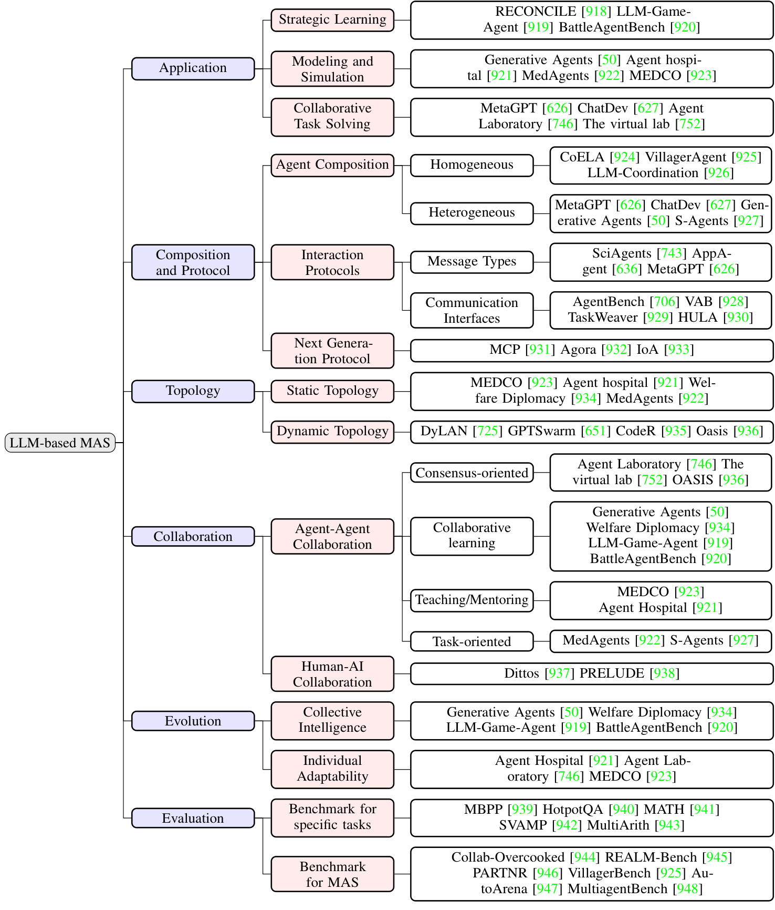

*图12.3：基于LLM的多智能体系统分类。*

# 多智能体系统设计

在基于LLM的多智能体系统（LLM-MAS）的背景下，协作目标和协作规范作为塑造系统行为、交互模式和整体有效性的基础要素。协作目标指明智能体旨在实现的明确目标 - 无论是个体的、集体的还是竞争性的，而协作规范则定义了规则、约束和惯例，指导系统内智能体之间的互动。这些组成部分共同确立了一个健壮的框架，引导智能体之间有效的沟通、协调和合作。

本节将LLM-MAS分为三类，基于不同的协作目标和规范组合：战略学习、建模与仿真以及协作任务解决。虽然不是穷尽的，这些类别涵盖了LLM-MAS设计的广泛领域，清晰地反映了系统目标如何塑造智能体的相互作用和结果。

- 战略学习系统将智能体嵌入到博弈论背景中，智能体追求个体或部分冲突的目标。交互可以是合作的、竞争的或混合的，明确受预定义的博弈规则和互动规范指导。这种设置通常与传统博弈论中的非合作（战略）和合作概念相一致。详情请参见第13.1节。
- 建模与仿真背景侧重于智能体独立行动，受到各种环境或社会因素驱动。在这里，交互会自然产生，不一定会收敛于共同目标，反映了大规模社会或经济仿真中看到的复杂动态。详情请参见第13.2节。
- 协作任务解决强调智能体之间的系统合作，以实现明确定义的共享目标。智能体通常采用结构化工作流程、清晰的角色定义和高度预定义的协作规范，以同步他们的行动朝向集体目标。详情请参见第13.3节。

在本章的其余部分，我们将详细阐述每一类别，探讨LLMs如何在我们的范围内实现、影响和增强智能体的行为、相互作用和集体智能。

接下来，我们将详细研究这些类别，重点介绍每一类别如何利用大型语言模型的能力来塑造智能体的行为和相互作用。

# 13.1 战略学习：合作与竞争

战略学习指的是智能代理在博弈理论环境中动态地预测、解释和影响其他代理的行动能力——无论是竞争性的、合作性的还是混合性的[949]。代理根据新信息迭代调整他们的策略，通常使用基本概念，如纳什均衡[950]、贝叶斯博弈[951, 914, 952]或重复互动[953, 954]进行建模。随着LLMs实现了细致的语言推理，战略学习越来越多地整合了“软”信号，包括对话、说服和隐含协商，从而丰富传统的博弈论推理框架[952, 955, 956, 957]。

在经济应用中，多智能体战略模拟为市场行为和谈判策略提供了宝贵的见解，突出了竞争性和合作性动态。例如，[958]和[951]展示了LLM增强的代理如何模拟招聘流程，在受控经济实验中展现理性决策，甚至预测股票走势。[959]引入基于GPT-4的竞争环境，展示餐厅代理和顾客代理如何竞争以优化利润和满意度，展示了现实的竞标和定价策略。与此同时，[960]研究了LLM基础谈判中的买方-卖方讨价还价，而[961]利用最后通牒博弈模拟揭示了以类人战略行为为基础的政策制定决策。

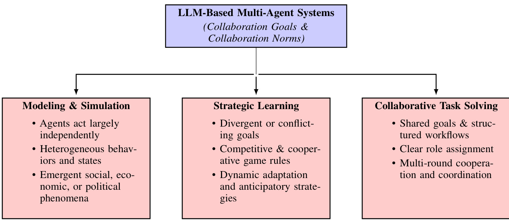

*图13.1：基于LLM的多代理系统中三种主要协作类型的概述：建模与仿真、战略学习和协作任务解决。每个类别的区别在于代理的目标和规范的设定方式（独立 vs. 分歧 vs. 共享）以及它们如何协调。*

在传统市场之外，战略学习广泛适用于资源分配、联盟或竞争合作权衡存在的各个领域。例如，多商品竞争[962,959]中，代理商战略性地协商条款以最大化个人利益，或者在以可持续发展为重点的情境中，代理商协调资源消耗[963]。在游戏中，社交推理游戏如《狼人杀》、《变色龙》、《阿瓦隆》和《局本射》需要代理商管理欺骗和合作之间复杂的相互作用[964,965,966,153,919,967,968,969,970]。[97,965]的研究强调了基于LLM的代理商在精心策划微妙欺骗和合作方面的出色表现，而[967,972,968,969]强调了《阿瓦隆》中自适应的、多轮策略。[970]进一步推动了这一边界，展示了在《局本射》谋杀悬疑类型中的自主多代理互动，重新创造了复杂的叙事。类似地，外交模拟([973]和[974])利用基于LLM的代理模拟全球范围内复杂的地缘政治谈判和联盟形成动态。

总结LLM驱动的战略学习的一个关键优势在于有效地将严谨的博弈论逻辑与自然语言推理相结合。这种融合使代理商能够解释复杂的指令，进行有说服力的对话，并更灵活地适应新颖或非结构化的环境。因此，基于LLM的战略代理商在准确建模复杂的现实世界互动方面具有重要潜力，远比传统基于规则或仅数字化的方法更有效地跨越经济竞争、社会谈判和地缘政治战略领域。

# 13.2 建模现实世界动态

基于LLM的多智能体系统（LLMMAS）的建模和仿真代表另一个关键的应用领域，旨在在规模上复制复杂的社会、经济和政治现象。通过利用LLMs的复杂语言理解和情境推理，这些仿真可以呈现高度异质的智能体，其不断演化的行为反映了现实世界的动态性。与强调明确竞争或合作目标的战略学习环境不同，在建模和仿真场景中，智能体独立运作，受其领域特定角色、偏好和与模拟环境的交互指导。

在医疗保健领域，例如，引入了Agent Hospital，其中由LLM驱动的医生智能体通过与虚拟患者的真实互动反复完善治疗策略。这使研究人员能够在受控而又逼真的环境中测试管理协议、培训范式和“假设”场景。类似地，在经济背景下，提出了EconAgents，利用LLM驱动的智能体逼真地模拟个体层面的行为，如就业决策、消费模式和储蓄策略。这些智能体促进了富有表现力的宏观经济模拟，超越了传统的数值或严格基于规则的方法在适应性和逼真性方面的表现。此外，政治科学应用也受益于这种方法。例如，成功地模拟了选举过程和政策制定动态，揭示了公共话语、候选人策略和选民互动如何塑造现实世界的政治结果。

除了经济学和政治学，基于LLM的模拟还涵盖了各种社会和文化现象。例如，[979]和[255]使用社交网络中语言和情绪传播的模拟来研究在线观点、信念或情绪集群是如何形成的。[980]的研究探讨了在不同拓扑结构和交互模式下观点动态是如何演变的，而[981]则研究了假新闻在异质智能体群体中传播或停滞的条件。诸如GenSim[982]和OASIS [936]等大规模模拟平台进一步拓展了边界，将规模扩展到数万甚至数百万用户智能体，从而使得能够研究新兴群体行为和系统效应，如病毒式信息传播、同质化信息茧房形成或群体极化等，都在现实约束条件下得以实现。

总结：LLM模拟的优势在于捕捉结构动态（例如，网络拓扑或制度规则）和推动现实行为的认知或语言细微差别。通过将基于语言的推理嵌入到代理模型中，研究人员可以研究复杂的社会过程，如说服、框架构建或文化传播，这些过程通过纯粹的数字或基于规则的方法很难捕捉。

# 13.3 协作任务解决与工作流生成

协作任务解决通过结构化工作流程协调多个代理朝着明确定义的目标前进。与涉及竞争利益的战略学习（可能涉及）或独立行动的开放建模和仿真相比，协作代理作为统一的问题解决流程的一部分。代理通常遵循明确定义的角色（如“规划者”、“执行者”或“评估者”）和阶段性流程，以确保任务的高效和准确完成。

MetaGPT[626]、CAMEL[848]、交际代理[983]以及[924]中描述的框架等系统展示了明确定义的角色、责任和决策流程如何使基于LLM的代理能够有效协调。典型的工作流可能涉及一个代理分析问题陈述，另一个提出解决方案概要，第三个实施部分解决方案，第四个验证正确性。这些代理之间的沟通通常通过自然语言“对话”的迭代轮次进行，利用LLM固有的语言生成能力。这种结构化方法对于扩展到更雄心勃勃的项目也是有益的，因为子任务可以委托给具有特定领域提示或训练的专门代理。

最近，在软件开发场景中广泛探讨了协作任务解决系统（例如，多代理编码、调试和测试）。然而，科学发现代表了一个特别突出和引人注目的应用。例如，Agent Laboratory利用代理在结构化科学工作流程中：提出假设、设计实验、分析结果和完善后续探究，有效地反映了科学探究的迭代性质。类似的多代理设计可以应用于文献综述、政策起草或大规模数据分析等任务，利用明确定义的协议来保持连贯性，避免工作重复。

相较于其他基于LLM的多代理范式，协作任务解决固有地优先考虑清晰性和可预测性：每个代理的角色和目标都是预先定义的，限制了新兴或混乱行为。这种结构在需要精确性、责任制或顺序决策的领域特别有优势。同时，正在进行研究以在结构和灵活性之间取得平衡，确保代理有足够的自主权创造性地提供解决方案，同时遵循共享工作流程，最终确保可靠、高质量的任务完成。

讨论：前述三个维度——战略学习、建模与仿真以及协作任务解决——展示了基于LLM的多代理系统的广度。每个类别都涉及不同的研究问题和现实应用，利用基于语言的推理来解决超越传统、纯数值或规则驱动代理设计能力范围之外的挑战。

# 13.4 组建人工智能代理团队

在多智能体系统中，智能体是系统内相互交互的核心单元，对系统的功能至关重要。这些智能体可以根据它们是否共享相同的个性、能力和行动空间而被分类为同质或异质。

同质智能体共享相同的能力、行动空间和观测空间。与单一智能体系统相比，其主要优势在于任务并行化，允许多个智能体同时处理任务的不同部分，提高整体效率。它们通常用于较为简单、协调的任务，智能体之间的统一性可以推动性能的提升。

一些研究已经将同质智能体应用于模拟游戏中的团队合作，如《Overcooked》和《Minecraft》，以及现实世界任务，比如家庭劳动分工。[924]提出了一个受认知启发的模块化框架，使基于LLM的智能体能够通过自然语言进行通信，执行劳动分工，相互请求帮助，并协作完成物体运输任务。[984]将基于提示的组织结构引入框架中，减少了智能体之间的沟通成本，在家庭任务（如准备下午茶、洗碗和准备餐点）中提高了团队效率。此外，一些研究[926,925]在流行游戏中（如《Overcooked》和《Minecraft》）使用多个基于LLM的智能体，探索它们合作完成任务的能力。根据游戏设置，这些智能体也是同质的。

异质智能体的多样性在改善协作结果中起着至关重要的作用。研究表明，智能体之间的异质性可以增强问题解决能力，因为不同的智能体为手头的任务带来了不同的观点和技能。异质性有助于丰富问题解决策略，提高多智能体系统中的整体协作。智能体的异质特征可以在以下维度中体现：个性层面的异质性、观测空间的异质性和行动空间的异质性。需要注意的是，这些异质性并不是相互排斥的——一个异质智能体可能表现出其中一个或多个特征。

·个性层面的异质性。指代智能体配置文件的多样性，影响智能体如何解决问题并相互交互。目前大多数基于LLM的异质多智能体系统属于这一类别[987, 627, 50, 970]。例如，在软件开发中，智能体可能扮演程序员、产品经理或测试人员等角色。在医学诊断中，智能体可能代表心脏病专家、肿瘤学家或儿科医生，每个人都有不同的专业领域。每个角色的独特观点和专业知识有助于更加健壮的决策制定。尽管这些异质智能体可能共享相同的行动空间——比如撰写文件[626]（例如代码、需求报告或测试报告）或提供诊断建议[922]——但他们的人设影响了这些行动的结果，多智能体架构中的角色特定增强已被证明可以显著简化和优化任务执行。例如，执行撰写文档动作的产品经理会生成需求报告，而执行相同动作的程序员会生成软件实现代码[626]。这种多样性有助于更好的决策制定和创新，特别是在复杂的跨学科任务中。

·观测空间的异质性。在多智能体系统中，智能体感知和解释环境的能力可能存在差异。观测空间的异质性指的是智能体在其环境中能够观察或感知的差异。例如，在狼人游戏中，一些智能体（如狼人）可以看到队友的身份，而预言家可以获取指定玩家的身份，而其他一些智能体（如村民）则无法看到任何玩家的真实身份。类似地，在阿瓦隆游戏中，不同的角色具有不同的观测空间，从而影响玩家的策略和沟通。在这些情境中，每个智能体的感知能力或观测空间与其在系统中的角色直接相关。在多智能体系统中，智能体能够观察到的差异通常会影响它们的决策、沟通和与其他智能体的协调。

·行动空间的异质性。另一方面，这指的是由于物理或功能约束而导致的智能体可以执行的行动的根本差异。这在虚拟环境和实际环境中尤为重要，因为智能体可能根据其设计或目的而具有不同的能力。在类似《狼人》和《阿瓦隆》等游戏的虚拟环境中，不同的角色具有独特的能力或技能。例如，在《狼人》中，狼人可能有秘密交流的能力，而村民可能仅限于投票或观察。这种动态要求智能体根据其独特的能力进行合作，并促进学习策略，如团队合作、信任和欺骗。同时，在机器人领域，智能体可能表现出多样化的物理能力。例如，正如[988]中所描述的，一些机器人缺乏机动性，只能操纵物体，而另一些专门用于移动，但无法操纵物体。在这种情况下，具有不同行动空间的智能体必须有效地分配任务，利用其特定能力来承担适合自己的任务部分，最终合作完成整体任务。这种异质性要求智能体有效地协作和协调它们的行动，通常根据它们各自的优势来分配任务。

从同质到异质的演变在一些基于LLM的多智能体系统中，智能体具有通过与环境互动自主演化和持续适应的能力。由于LLM模型和环境中固有的随机性，这些智能体的演化通常会遵循不同的轨迹。即使智能体最初具有同质的人设和行动空间，也可能在多次模拟中出现异质行为。例如，正如[989]所示，起初具有相同行动空间和人设的智能体在与环境和其他智能体多轮互动后发展出不同的角色。一些智能体专注于食物采集，而其他人则专注于制造武器。类似地，[990]观察到最初同质的智能体在群体互动后发展出不同的语言使用模式、情感表达和个性。这些新兴行为展示了从同质到异质系统的转变的可能性。

# 13.5 代理交互协议

在本节中，首先将对典型消息类型进行分类，提供有关智能体相互作用的内容和交换模式的清晰视图。接下来，将讨论智能体与环境、智能体与智能体以及智能体与人类之间的通信界面设计。将讨论透明信息交换的架构问题和协议规范。接口标准化将受到特别关注，这对于为多智能体系统提供互操作性、可扩展性和效率至关重要。该部分将以统一通信协议讨论结束，其中将讨论智能体与环境或智能体用户交互设计原则和要求，同时为基于LLM系统的各种应用提供清晰、一致和功能上的连贯性。

## 13.5.1 消息类型

结构化消息，无论是JSON（[991, 992]），XML（[993, 636]），还是作为代码（[626, 627, 994]），是与LLM进行多代理系统通信的关键方面。结构化消息的主要优势在于它们具有语法和语义上定义的结构，使得理解明确且解析直观。由于它们缺乏歧义，它们促进了信息提取和处理的准确性，计算开销更小，系统可靠性更高。例如，JSON和XML可以表示特定任务的配置参数或以机器可读模式促进数据交换，而作为代码编写的消息甚至可以直接多次执行，使工作流程和自动化更简单。

结构化消息特别适用于高效、确定性的应用程序。它们对于子任务分解、子任务分配以及协作多代理架构中的代理之间协调非常有用，因为它们明确陈述操作命令。此外，由于结构化消息具有规定的形式，检索数据以及存储数据变得更加便利，系统优化和纵向分析也变得可行。

与之相反，非结构化消息，例如自然文本、视觉数据（如图像、视频）和音频信号（如语音、环境声音），具有更高的信息密度和表现能力。这些模态最适合传达细微且与上下文相关的信息。例如，图像可以传达空间关系、光照和面部表情，而视频可以传达动态的时间组织序列，例如随时间变化的状态或行为。同样，音频信号不仅传达语言信息，还传达语言外信息，例如语调、情感和语调，这对于自然且上下文感知的互动至关重要。

非结构化消息非常适用于模糊任务，以及复杂的真实世界环境。它们能够表达抽象思想，以及情感微妙或隐含的上下文建议，使非结构化消息非常适合创造性和以发现为导向的问题空间。然而，非结构化数据的复杂性需要高级处理技术，例如基于深度学习的特征提取，才能充分发挥其潜力。预训练的LLM（大型语言模型）以及多模态大型语言模型的进展在很大程度上减轻了这些复杂性，使得在多代理系统中实现非结构化通信的新应用成为可能。

摘要：基于LLM的多代理通信中，非结构化消息和结构化消息具有互补的作用。结构化消息提供准确性、一致性和计算效率，适用于操作性和确定性操作；而非结构化消息提供丰富的、具有上下文的表示，使代理能够处理模糊、创造性和高度动态的情境。这两种模式共同为自适应、有效的多代理合作奠定了基础。

## 13.5.2 通信接口

基于LLM的智能代理通常需要在环境中执行一次或多次动作，以执行一系列操作。从代理的角度来看，其输出到环境中的是它所偏好的内容，例如UI点击、Web请求或计算机图形角色的移动。不同环境会因其接受的动作而异，因此为了确保其动作能够执行，代理必须了解在其所处的特定环境中哪些动作是有效的，并执行适用于特定任务和特定环境的动作。代理输出其选择的动作后，将从环境中获得反馈。如果成功，将包括观察结果；如果出现错误，则会得到错误反馈。代理需要根据这些反馈采取行动。如今有各种类型的环境，代理可以在其中执行动作，例如操作系统、电脑游戏、数据库和电子商务网站。为了使代理-环境接口具有共同的接口，并使经过各种LLM训练的代理能够在各种环境中进行最小程度的进一步适应，提出了各种框架。这些框架使得更容易测试代理在各种可执行环境中的能力。

在多Agent系统中，通过自然语言进行通信是主导方式。这可能是因为大型语言模型具有强大的语言能力，这是由于在大规模自然语言语料库上进行预训练。另一个可能的原因是，对于许多任务来说，自然语言通信已经足以满足需求。根据交换的信息类型，多Agent系统可以被分类如下：基于自然语言的系统在利用自然语言的LLM多Agent系统中，基于文本的通信是最常见的。还有一些系统使用语音作为通信媒介。在这些系统中，代理通过自然语言进行行为，如讨论、谈判、说服或批评，以实现它们的目标。基于结构化信息的系统与自然语言相比，结构化信息具有更高的一致性、更低的解析复杂度和减少的歧义性，使其更适合于代理之间的高效、低成本通信。在一些实现中，代理之间交换的信息被结构化为不同的组件，以便接收代理更容易解析和利用。例如，交换的信息可能包括指定发送者、接收者、消息类型以及接收方应如何解析或使用内容的字段。

人-代理通信
开发多代理系统的目的是拓展人类能力和认知的边界，最终为人类福祉提供服务。在一些社会仿真多代理系统中，人类主要作为观察者存在，但大多数多代理系统允许人类以各种形式参与。在这种参与过程中，人类需要与代理进行交流，这种交流可以采用自然语言或结构化信息的形式。当人类与代理之间的交流主要依赖自然语言时，一个单一的LLM通常充当中心枢纽，将人类的自然语言解析为结构化信息，以便代理可以更有效地进行后续操作。这个中心LM可以存在于多代理系统内部，也可以独立于系统运作。为了节省时间并提高通信效率，人类还可以使用结构化信息通过编程或类似方法与多代理系统进行通信。通过遵循预定义的通信协议，人类可以向多代理系统发送包含所需数据的消息。系统将根据内部逻辑处理消息和数据，并返回结果。

## 13.5.3 下一代通信协议

基于LLM的智能代理领域仍处于起步阶段。开发者通常设计针对特定领域或任务的代理架构和通信机制，包括代理与环境、代理与人类以及代理之间的交互。然而，大多数现有系统缺乏统一的通信框架，导致碎片化、孤立的生态系统。多智能体系统、工具、环境和数据源通常独立运作，使得代理难以互操作或共享能力。此外，学习和实施定制协议的负担落在人类身上，几乎所有当前的协议都是手工设计的——这是一个劳动密集型过程，通常缺乏语义灵活性或可扩展性。

为了解决这些问题，已经提出了几种新的智能体通信协议，每种协议针对协议设计堆栈的不同方面。

智能体互联网（IoA）引入了一种受互联网启发的即时通讯架构，支持动态团队形成和任务驱动的协作。代理注册到一个负责身份管理和发现的中央协调服务器。通信流程使用基于FSM（有限状态机）的对话模板进行编排。IoA支持多种消息类型，包括讨论、任务分配和触发机制，并为控制发言者轮次、嵌套组形成和最大对话长度提供了结构化字段。这使代理能够选择和调整消息格式以匹配特定的协调阶段，在固定模式内提供灵活性。

由Anthropic开发的模型上下文协议（Model Context Protocol，MCP）[931]专注于使LLM代理能够访问结构化工具和数据。它采用基于OAuth身份验证的完全集中化方法，交互受限于JSON-RPC 2.0消息。虽然它缺乏元协议层或语义协商能力，但其简单而严格的架构使其成为具有明确定义API的工具用例的实际选择。然而，MCP牺牲了灵活性和可扩展性，需要手动注册支持的函数。

Agent Network Protocol（ANP）[1002]旨在实现完全去中心化。代理通过符合W3C标准的去中心化标识（DIDs）进行身份识别，并通过加密的点对点通道进行通信。该协议包括一个元协议层，使代理能够协商采用哪种应用级协议，支持基于代理能力的语义协议选择。ANP还允许在应用层支持多种协议（例如HTTP、JSON-RPC、自然语言），提供了强大的可扩展性和去中心化，但并未明确支持公共协议重用。

Agora提供了一种高度灵活且以语言驱动的协议机制。代替注册预定义的API，代理可以生成并共享协议描述（PDs），这些描述是通信语义的自由文本描述。利用大型语言模型，代理可以在运行时动态解释和执行任何PD。这使得协议可以完全通过语言创建、部署和使用，无需任何手动注册或配置。Agora避免了集中式注册表，并支持去中心化的协议共享：代理可以从对等分布式存储库发布或检索PD，以实现系统间的累积学习和互操作性。

总结：如表13.1所示，下一代代理通信协议在身份和安全机制、元协议协商能力、应用层灵活性以及中心化程度等关键维度上存在差异。一个统一的、安全的、可扩展的和动态的协议基础设施，代理可以在其中协商和共同创建协议，对于实现大规模、互操作的代理生态系统至关重要。尽管当前的框架如MCP、ANP、Agora和IoA代表了早期但有前景的步骤，但协议设计仍然是智能代理系统发展中快速发展的前沿领域。

<html><body><table><tr><td> Layer</td><td> MCP</td><td>ANP</td><td>Agora</td><td>IoA</td></tr><tr><td>Identity & Security</td><td>OAuth-based centralized identity authentication.</td><td>DID-based decentralized identity with encrypted channels.</td><td>No centralized registra- tion.Identity derived from PD hash.</td><td>Agents register with a central server for identity and discovery.</td></tr><tr><td>Meta-Protocol Layer</td><td>No meta-protocol layer; relies on pre-defined in- terfaces.</td><td>Uses DID document to negotiate and select ap- propriate protocol via se- mantics.</td><td>LLM interprets PD text to automatically negoti- ate and deploy communi- cation protocols.</td><td>A centralized discovery mechanism combined with FSM-based  dia- logue flow control.</td></tr><tr><td>col Layer</td><td>Application  Proto- Supports only  JSON- Supports multiple proto- RPC 2.0.</td><td>cols such as HTTP and natural language.</td><td>Allows  arbitrary PD- driven protocols with high flexibility.</td><td>Task-driven protocol coordination supporting multiple message for- mats.</td></tr><tr><td>ization</td><td>Degree of Central- Highly centralized archi- Fully decentralized. tecture.</td><td></td><td>Decentralized: no regis- tration or fixed ID, with optional peer-to-peer PD sharing.</td><td>Highly centralized archi- tecture with a central co- ordination server.</td></tr><tr><td>Protocol Flexibility</td><td>Fixed and rigid; hard Highly flexible with se- RPC.</td><td>to adapt beyond JSON-mantic negotiation.</td><td>Extremely flexible; any PD can define a new pro- tocol dynamically.</td><td>Moderately high flexibil- ity; agents can select and adapt message formats based on task phases and coordination needs.</td></tr></table></body></html>

*表13.1：跨身份、谈判和执行层比较四种代理通信协议（MCP、ANP、Agora、IoA）。 $\mathbf{PD}=$ 协议描述；DID：去中心化标识符；LLM：大型语言模型；FSM：有限状态机*

<html><body><table><tr><td>Paper</td><td> System Design</td><td colspan="3">Communication</td><td colspan="2">Collaboration</td><td>Evolution</td></tr><tr><td></td><td>Category</td><td>Typology</td><td>Interface</td><td>Agent TypeInteraction</td><td></td><td>Decision</td><td>Type</td></tr><tr><td>Agent Hospital [921]</td><td>M&S</td><td>S-D</td><td>Text</td><td>Het</td><td>T/M, C-O</td><td>Dict</td><td>Ind</td></tr><tr><td>Welfare Diplomacy [934]</td><td>M&S</td><td>S-L</td><td>Code, JSON, Text</td><td>Hom</td><td>CL</td><td>Voting</td><td>CI</td></tr><tr><td>MEDCO[923]</td><td>M&S</td><td>S-L</td><td>Text</td><td>Het</td><td>T/M, C-O</td><td>Dict</td><td>Ind</td></tr><tr><td>MedAgents[922]</td><td>M&S</td><td>S-L</td><td>Text</td><td>Hom</td><td>T-O</td><td>Dict</td><td>CI</td></tr><tr><td>Generative Agents [50]</td><td>M&S</td><td>S-D</td><td>Visual</td><td>Hom</td><td>CL</td><td>Dict</td><td>Ind</td></tr><tr><td>RECONCILE [918]</td><td>SL</td><td>S-D</td><td>Text</td><td>Hom</td><td>CL</td><td>D-B</td><td>CI</td></tr><tr><td>Agent Laboratory [746]</td><td>CTS</td><td>S-L</td><td>Code, Text</td><td>Het</td><td>C-O, T-O</td><td>Dict</td><td>Ind</td></tr><tr><td>CoELA[924]</td><td>CTS</td><td>S-D</td><td>Text</td><td>Hom</td><td>T-O</td><td></td><td></td></tr><tr><td>The virtual lab [752]</td><td>CTS</td><td>S-L</td><td>Text</td><td>Het</td><td>C-O, CL</td><td>Dict</td><td>Ind</td></tr><tr><td>SciAgents [743]</td><td>CTS</td><td>S-L</td><td>Text</td><td>Het</td><td>T-O</td><td>Dict</td><td>CI</td></tr><tr><td>S-Agents [927]</td><td>CTS</td><td>S-D</td><td>Text</td><td>Het</td><td>T-O, CL</td><td>Dict</td><td></td></tr><tr><td>GPT-Bargaining [1003]</td><td>CTS</td><td>S-D</td><td>Text</td><td>Het</td><td>C-O</td><td>D-B</td><td>CI</td></tr><tr><td>FORD[1004]</td><td>M&S</td><td>S-D</td><td>Text</td><td>Het</td><td>C-O</td><td>D-B</td><td>CI</td></tr><tr><td>MADRA [1005]</td><td>CTS</td><td>S-D</td><td>Text</td><td>Het</td><td>C-O</td><td>D-B</td><td></td></tr><tr><td>Multiagent Bench [948]</td><td>CTS</td><td>S-D</td><td>Text</td><td>Hom</td><td>T-O, CL</td><td>D-B</td><td>CI, Ind</td></tr><tr><td>OASIS [936]</td><td>M&S</td><td>D</td><td>Text</td><td>Het</td><td>C-O</td><td></td><td></td></tr><tr><td>S [255]</td><td>M&S</td><td>S-D</td><td>Text</td><td>Het</td><td>C-O</td><td></td><td></td></tr><tr><td>FPS [981]</td><td>M&S</td><td>S-D</td><td>Text</td><td>Het</td><td>C-O</td><td></td><td></td></tr><tr><td>GPTSwarm[1006]</td><td>CTS</td><td>D</td><td>Code, JSON, Text</td><td>Hom</td><td>T-O</td><td>Dict</td><td>CI, Ind</td></tr><tr><td>ChatEval[1007]</td><td>CTS</td><td>D</td><td>Text</td><td>Hom</td><td>T-O</td><td>Voting</td><td>CI</td></tr><tr><td>MetaGPT [626]</td><td>CTS</td><td>S-L</td><td>Code, JSON, Text, Visual</td><td>Het</td><td>T-O</td><td>Dict</td><td>CI</td></tr><tr><td>AutoAgents [1008]</td><td>CTS</td><td>D</td><td>Text</td><td>Het</td><td>T-O</td><td>C-O</td><td>CI</td></tr><tr><td>SWE-agent [628]</td><td>CTS</td><td>D</td><td>Text</td><td>Hom</td><td>T-O</td><td>Dict</td><td>Ind</td></tr><tr><td>AgentCoder [994]</td><td>CTS</td><td>D</td><td>Code, Text</td><td>Het</td><td>T-O</td><td>D-B</td><td>CI</td></tr><tr><td>MASTER[1009]</td><td>CTS</td><td>S-L</td><td>Text</td><td>Hom</td><td>T-O</td><td>D-B</td><td>CI</td></tr><tr><td>Reflexion [48]</td><td>CTS</td><td>D</td><td>Text</td><td>Het</td><td>T-O</td><td>D-B</td><td>Ind</td></tr><tr><td>MACM[1010]</td><td>CTS</td><td>D</td><td>Text, Code</td><td>Het</td><td>T-O</td><td>D-B</td><td>CI</td></tr><tr><td>Debate[985]</td><td>CTS</td><td>S-D</td><td>Text</td><td>Het</td><td>C-O</td><td>D-B</td><td>CI</td></tr></table></body></html>

*表13.2：基于LLM的多智能体系统的分类框架，突出系统设计、通信、协作和演化的不同方面。以下是为方便参考而使用的缩写：$\mathbf{M}\&\mathbf{S}=$ 建模与模拟，$\mathbf{CTS}=$ 协作任务解决，$\mathrm{SL}=$ 战略学习，$\mathbf{S-D}=$ 静态分散式，$\mathbf{S-L}=\mathbf{S}$ 静态分层，${\mathrm{Hom}}=$ 同质的，Het $\mathbf{\tau}=\mathbf{\tau}$ 异质的，$\mathbf{T}/\mathbf{M}=$ 教学/指导，$C{\mathrm{-}}0=\left.\left\langle\right.$ 以共识为导向，$\mathbf{\partial}_{\mathbf{T}-\mathbf{O}}=$ 任务导向，${\mathrm{CL}}=$ 协作学习，Dict $\mathbf{\tau}=\mathbf{\tau}$ 独裁的，$\mathbf{D-B}=$ 辩论型，$\mathrm{CI}=$ 集体智能，Ind $\c=$ 个体。*

# 14.1 系统拓扑结构

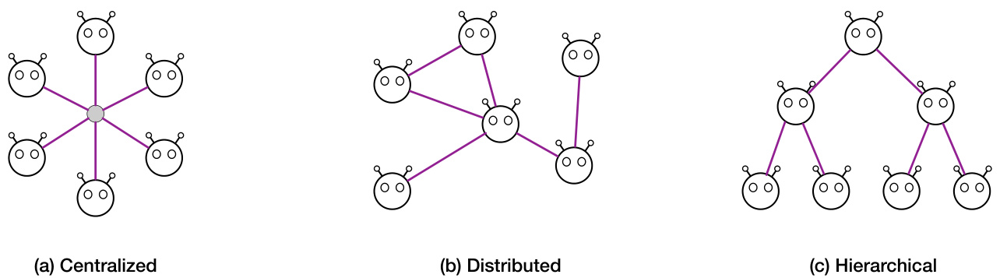

*图14.1：多智能体协作的不同拓扑结构类型。*

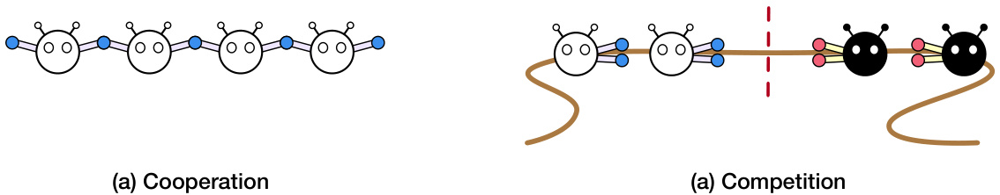

*图14.2：协作和竞争代理。*

本节探讨了基于LLM的多智能体系统（MAS）中的交互类型学及其对通信、协作和任务执行的影响。我们首先分析了静态拓扑结构，其中连接模式由领域知识固定——然后探讨了根据性能指标、工作量变化或战略约束调整智能体间连接的动态（自适应）拓扑结构。最后，我们讨论了在平衡系统成本、性能和鲁棒性方面的可伸缩性挑战和权衡，借鉴了分布式处理、自组织和新兴协作行为的最新研究成果。

## 14.1.1 静态拓扑结构

静态拓扑结构由预先确定的结构模式定义，在系统执行过程中基本保持不变。在这些配置中，代理之间的连接，或者代理与中央协调器之间的连接，是通过固定规则和启发式方法建立的，确保可预测的通信流和简化的协调。通常考虑三种经典形式：分层（层次化）、分散式和集中式架构。

分层（层次化）结构
分层拓扑将代理按层次排列，高层代理协调或监督低层代理。这种方法类似于传统的管理框架，例如标准操作规程（SOP）或瀑布模型，其中任务被分解为顺序、明确定义的阶段。例如，AutoAgents框架分配角色（例如，规划者、代理观察者和计划观察者）以综合执行计划，而ChatDev利用分层任务分解来简化软件开发。尽管分层结构有助于调试、性能监控和模块化，但当上层代理超负荷时可能会产生瓶颈。最近在叙事和数据科学应用领域，包括数据清洗、可视化和自动机器学习等方面的研究，突显了一致性与自适应实时行为之间的权衡。

分散式结构
在分散式拓扑中，代理在对等基础上相互作用，没有中央协调器，形成的网络通常被建模为链、环、小世界或随机图[121,971]。这种结构增强了容错性，因为单个代理的故障不会危及网络。例如，[1022]表明，将图推理任务分布在多个代理之间可以实现超出单个LLM上下文长度限制的可伸缩性。此外，[1023]提出了分解策略，允许编排LLM有效地委派子任务。然而，在分散式系统中保持一致的全局状态需要复杂的共识和同步协议。

集中式结构

集中式拓扑依赖于一个主协调器，该协调器收集信息并按层次指导外围代理。这种设置允许更好地控制资源处理和共享全局视图，例如文化公园和Lyfe代理。然而，随着额外代理的增加，中心节点可能出现瓶颈，通信开销增加，对故障的敏感性也增加。当前关于协调器-代理配置的研究以及确保集中式配置的自治性的研究指出了与一致性和可伸缩性相关的问题。虽然集中式架构可以保证一致性，但不一定具备动态适应性的灵活性。

简而言之，静态拓扑具有确定性和预定义的优势。通过预定义的结构模式，这些系统具有可预测的通信模式和有效的代理间协调。这些结构的拓扑通常基于结构知识或静态规则定义，因此适用于任务工作流程静态、有预定义角色以及系统需求明确定义的领域。第二个主要优势是设计、实施和维护的简便性。由于结构预定义，设计和执行程序变得更简单，因此维护过程更简单。由于静态结构明确定义，资源处理和模块化变得更简单。

然而，静态拓扑本身缺乏灵活性，基于预先指定的连接模式，无法响应实时变化。虽然在设计时适用于特定目的，但完全缺乏对未预见挑战的灵活性，包括突发代理故障、任务复杂度不同以及系统目标修改。静态拓扑缺乏实时响应灵活性潜力，这种实时响应的不灵活性抑制了运行时系统重配置，并降低了在动态环境中系统的有效性。未能根据新出现的情况进行自组织和变形可能导致低效以及系统性能低下，特别是在动态或新兴环境下。

## 14.1.2 动态和自适应拓扑结构

尽管静态拓扑结构提供了确定性和可预测性，例如在稳定任务领域和定义明确角色中表现良好的分层或中心化的静态拓扑结构所展示的，但静态拓扑结构并不适用于开放式或新领域。真实领域，从实时协作计划到动态社会模拟，通常要求代理根据工作进行更改其互动模式，可用资源变化，或接收到来自环境的反馈。这种与适应性可塑性的结构张力产生了动态拓扑结构，这些结构在运行时根据对性能、工作负载或战略约束的反馈，重新构建代理之间的关系，以在一致性和响应性之间取得平衡。

例如，DyLAN框架通过两步流程支持推理时代理选择，即通过无监督代理重要性评分进行前向后向团队优化步骤，随后在运行时进行动态团队重组。类似地，OPTIMA通过生成-排名-选择-训练框架迭代地优化代理之间的连接，利用奖励函数作为确定任务质量、代币效率和可读性之间平衡的手段，通过诸如直接偏好优化等策略进一步优化通信行为。MAD框架通过三个提示阶段和结构的联合优化展示了灵活性，通过动态角色分配（例如验证者和辩论参与者）在结构的修剪空间内进行。

随着技术的进步，拓扑控制也变得可行。GPTSwarm[651]将代理构想为计算图，并利用进化策略和强化学习来根据任务反馈调整邻接矩阵以优化节点。MACNET[1028]采用有向无环图架构，监督教练管理边缘，执行助手管理节点，用于更复杂的协调领域，通过拓扑排序和输出的敏感传播促进自适应通信。特定应用版本也强调架构多样性。开放世界环境中有DAMCS[1029]，它将分层知识图（A-KGMS）与结构化通信方案（S-CS）相结合，基于上下文传递的消息进行协作规划。AutoAgents[1030]利用动态起草-执行流水线，预定义代理共同勾画专家团队，这种设计对于创意应用（如通过并行处理和内部监督进行新颖生成）非常有效。值得注意的是，在大规模MACNET[1028]系统中的小世界发展与[1022]中展示的图推理思想相符，分布式架构通过结构化协作规避了LLM的局部限制。在协作任务解决方面，出现了几种强调动态拓扑作用的范式。这些范式包括基于搜索的方法、基于LLM的生成，以及利用外部参数的配置。

基于搜索的方法
一些作品采用基于搜索的方法来迭代优化通信结构。例如，ADAS[741]采用元代理搜索算法，该算法在代码空间内迭代生成和测试新的代理设计，存档优越配置，从而更新后续的生成策略。类似地，Afow[773]将每个LM调用建模为图中的一个节点，并利用蒙特卡洛树搜索（MCTS）动态扩展和优化工作流程。其他框架，如MAD[1031]和OPTIMA[1027]，整合了迭代生成-排名-选择-训练范式，这些范式与MCTS原则相呼应，以平衡任务性能和效率。

基于LLM的方法
为了补充基于搜索的方法，一些最近的作品利用LLM的生成能力来构建和调整动态拓扑结构。Dylan[725]引入了一个称为时间前馈网络（T-FFN）的模型，将每个通信步骤视为一个网络层，利用前向-后向传播计算代理重要性分数，用于动态团队选择。在相关工作中，DAMCS[1029]、AutoAgents[1030]和TDAG[1032]动态生成专门的子代理或更新分层知识图，实现协作规划和任务分解。此外，AutoFlow[773]和Flow[1033]等框架将任务工作流表示为自然语言程序或活动顶点图（AOV），通过强化学习信号进行持续的细化。ScoreFlow[788]通过应用基于梯度的（损失梯度）优化来连续重新配置代理工作流程，对这些方法进行了补充。

外部参数 鉴于微调基于LLM的代理通常需要大量资源，许多研究者主张通过训练与LLM代理独立的参数来配置代理间拓扑结构。这一方法由GPTSwarm[651]发起，其中代理间拓扑结构被表示为有向无环图（DAG），边权重作为系统唯一可训练的组件。在进一步推进这一范式的过程中，AgentPrune从时空图的角度为主流多主体系统提供了一个统一的建模框架，通过基于幅值的修剪识别和修剪通信冗余，即不必要的边。在这一研究线的后续作品包括G-Safeguard[1034]，该作品类似地训练GNN在多主体系统之外，以检测和消除恶意通信路径。尽管这些方法在参数效率上表现出色，但由于其相对较小的参数空间和与LLM代理的低耦合，往往在一定程度上会导致性能限制。

讨论 动态拓扑结构不仅限于解决任务，在模拟复杂社会互动中发挥着关键作用。正如最近的一项调查所详细介绍的[975]，基于LLM的代理模型可以演化出代理间的联系，以捕捉自主性、社会行为和环境反馈的实时变化，涵盖了包括网络、物理和混合环境在内的各种领域。诸如[50]、OASI[936]和Project Sid[989]等系统模拟了动态社交网络。[50]利用生成式自然语言记忆检索来根据代理经验调整社交关系，而OASIS构建了一个实时社交媒体环境，其中用户关系和信息流持续更新。Project Sid[989]引入了PIANO（通过神经编排实现并行信息聚合）架构，使超过百个自治AI代理在Minecraft环境中实时交互，导致出现诸如专业角色、集体规则遵守、文化和宗教传播等复杂社会结构。此外，像AgentScope-scability[1035]和Social Survey[975]这样的架构支持大规模多代理模拟，实现了对文化传播、集体决策和新兴群体动态的研究，使得在涉及数百或数千个互动代理的环境中成为可能。此外，动态拓扑结构还针对特定应用领域进行了定制，如医疗和开放领域的具体应用。在医疗领域，AI医院[1036]和代理医院[921]模拟真实的医疗工作流程，其中诊断、治疗和反馈的迭代周期不断重塑各种角色之间的通信模式，如住院医生、患者、检查者和主治医师。这些框架动态调整代理间的沟通，以优化协作和决策。同样，在开放领域和具体应用的AI中，像IOA[9]这样的框架支持异构、跨设备的代理交互，促进了真实场景中动态团队形成和任务分配。

尽管前述动态多代理拓扑在性能指标上取得了实质性进展，但仍面临以下三个限制，我们认为这应成为未来动态拓扑研究的重点：

(1) 泛化能力。当前多代理系统拓扑结构通常针对单一任务领域进行优化。例如，AFlow专注于在数学或代码基准中进行搜索和优化，生成难以适应新任务领域的固定工作流程。其他动态拓扑结构，如ADAS、GPTSwarm和AgentPrune，面临相同挑战。我们认为多代理系统应具备终身学习能力，在其中系统能够跨不同任务领域进行泛化，且资源消耗最小（例如API调用、FLOPs、GPU时数）。

(2) 资源效率。目前的动态拓扑结构往往优化复杂、资源密集的结构。它们的训练过程通常成本高昂，ADAS[74]便是一个例子，使用GPT-3.5进行训练每次会产生大约300美元的成本。这些费用严重限制了它们在实际场景中的大规模适用性。未来的发展应该专注于实现更好的测试时拓扑优化，并显著降低成本。

(3) 推理效率。正如MaAS[787]所指出的，过度复杂的多代理拓扑结构虽然能够持续提供令人满意的性能，但在任务适应性方面存在明显不足。也就是说，它们无法根据特定任务的难度动态分配推理资源（例如工具、代理数量和推理步骤）。因此，这可能导致推理过程中某种程度的效率缺失。尽管MaAS在一定程度上通过设计的代理超网络实现了任务动态性，但它们在大规模部署中的适用性和可扩展性仍有待测试。

# 14.2 可扩展性考虑

在基于大型语言模型的多智能体系统（MAS）中，可伸缩性是一个关键挑战，特别是在代理数量增加的情况下。在完全连接的网络中，通信路径的数量呈二次增长，导致通信量激增，增加了令牌使用和计算成本。如果监督节点被消息淹没，集中式和分层拓扑结构可能会经历同步瓶颈，而去中心化网络虽然更具容错性，但需要复杂的共识算法来实现一致的全局状态。

最近的研究（如[1028]）表明，当多智能体协作被构建为有向无环图（DAG）时，系统可以高效扩展以处理大规模图，甚至可以达到100个节点或更多，而不会出现显著的性能下降。类似地，研究（如[1022]）表明，将图推理任务分配给多个代理可以规避长文本输入和上下文长度限制所施加的限制。此外，关于自组织代理的研究（如[1038]）揭示了动态复制和任务分配使系统能够在增加整体处理能力的同时保持每个代理的恒定工作负载。最后，[1039]提出的多维分类法为分析代理自治和协调之间的权衡提供了有价值的框架，为如何平衡集中控制与分散灵活性以优化可伸缩性提供了见解。

除了这些基础研究外，最近在实际多智能体平台设计方面取得的进展进一步丰富了可伸缩性讨论。例如，AgentScope提供了一个面向开发者的平台，利用基于actor的分布式框架，实现在本地和分布式部署之间的无缝迁移。其统一工作流程和自动并行优化显著减少了通信开销和同步挑战，这些挑战通常会随着代理数量的增加而出现。通过整合容错机制和智能消息过滤，AgentScope展示了如何设计系统级支持，以在动态和异构的部署环境中保持性能。

在模拟智能体文明领域，另一种互补方法在Sid项目中提出，该项目探讨了可伸缩性。在这里，重点从孤立任务解决转移到模拟复杂社会动态。所提出的PIANO（通过神经编排实现并行信息聚合）架构允许代理同时运行，通过将较慢的认知过程与快速的反应模块解耦。引入专用认知控制器以确保多个并行输出之间的一致性。这种设计不仅使得从小团体扩展到涉及超过一千个代理的模拟成为可能，而且有效地解决了由高频交互引起的固有协调挑战。

将可伸缩性提升到更大规模，AgentSociety[1040]展示了一个全面的框架，用于模拟最多10,000个智能体的现实社会环境。通过在现实的城市、社会和经济环境中整合基于LLM的社会生成智能体，AgentSociety利用分布式计算和高性能消息传递系统（例如MQTT）来支持数百万次日常互动。这个平台展示了新兴混合架构如何通过有效管理通信成本、协调开销和新兴行为的准确性之间的权衡，来支持宏观现象，例如经济市场动态、舆论传播和城市规划模拟。

尽管在理论上扩大智能体群体规模具有优势，但必须质疑追求大规模智能体部署是否在所有任务解决场景中都具有内在价值。虽然总计算能力随着智能体数量的增加而扩展，但考虑到内存开销和智能体间通信成本，增加额外智能体的边际效用可能呈现递减。这种现象源于基本约束，即虽然整体工作量是个体任务复杂度和劳动分工程度的乘积，但协调成本往往随着智能体数量呈超线性增长。因此，在许多有界问题领域，可能存在一个最佳的智能体群体规模，超过该规模性能将达到平稳状态，甚至由于过多的协调开销而恶化。

相反，在模拟场景中，如果目标是模拟复杂的社会动态、 emergent 行为或大规模集体智能，扩展到众多智能体不仅有益而且是必不可少的。在这些情境下，研究重点从优化任务解决的计算效率转向准确复制或预测由微观智能体相互作用产生的宏观模式。这种模拟——涵盖经济市场行为、社交网络演化和城市基础设施规划等领域——通常需要管理庞大智能体群体的计算开销，以捕捉逼真的群体层面现象。

将集中式监督与分权的子团队相结合的混合架构为这些可扩展性挑战提供了有前途的解决方案[921,18]。在这些设计中，监督代理处理全局目标和协调，而工作代理专注于执行特定子任务。这种分层组织有助于减轻任一节点的信息过载，并允许根据任务需求动态调整代理团队大小，从而优化资源利用。此外，高级技术，如图搜索算法、基于强化学习的更新以及演化方法，在系统扩展时对网络结构进行迭代优化至关重要。智能消息过滤、优先级设定和聚合机制可以显著减少通信开销，而不牺牲智能体间协作的质量。此外，异步通信协议和部分知识共享策略显示出在最小化协调瓶颈的同时保持智能体之间充分全局意识的潜力。

关于可扩展性的总结 总的来说，基于LLM的多Agent系统中对系统拓扑结构和可扩展性的研究揭示了一系列设计选择——从提供简单性和可预测性的静态配置到提供灵活性和适应性的动态架构。虽然基础性作品（例如[1028]，[1038]）强调可扩展的图结构和自组织原则，但AgentScope、Project Sid和AgentSociety所展示的实际进展表明，集成的分布式框架、并行处理和逼真的环境模拟共同应对了扩展多Agent系统的挑战。可扩展性需求的依赖于上下文的特性——在任务解决和模拟场景之间的对比突显了多Agent架构中目的特定设计的重要性。随着研究的不断发展，更复杂的自适应算法、分布式架构和多维度评估框架的发展将对推进基于LLM的多Agent系统的可扩展性和实际可行性至关重要。

# 合作范式与协作机制

在本章中，我们对这些有目的的相互作用进行了详细探讨，研究了一个代理如何影响多代理系统内的协作。我们参考了从人类社会结构中产生的多样化互动行为，进一步通过互动目的、互动形式和形成的关系来解释多智能体协作。

多智能体系统（MAS）包括在共享环境中相互作用的多个智能体，它们自主做出决策以协作完成任务或相互竞争[1041]。在我们的背景下，我们关注协作现象，因为它们广泛出现在大多数实际应用中。基本上，MAS中的每个智能体都配备有不同的角色和初始知识，以及自己的一套目标。

在解决问题或进行通信时，智能体与其他智能体或环境进行互动，收集和处理信息，根据其目标、现有知识和观察独立做出决策，然后执行行动[975,1041,1042,1043]。知识、记忆和环境观察形成了智能体的信念，而不同的动机影响了它们对任务和决策的方法[1041]。因此，有效的问题解决需要多样化的有目的互动，包括智能体之间的互动和智能体与环境的互动。这些互动可能涉及多轮次，并且根据系统设计以不同方向发生。

# 15.1 代理-代理协作

考虑到多智能体系统（MAS）协作的分类，我们更详细地关注捕捉复杂多智能体相互作用中微妙动态所需的粒度。具体而言，我们将智能体间的相互作用分为四种类型，受到人际互动模式的社会学洞见的启发，并将其应用于MAS中的智能体间相互作用。人际互动的社会学理论，包括共识建立、技能学习、教学和任务分工合作，提供了一种更精细的分类智能体相互作用的方式。这些相互作用形成了协作范式，使各种智能体能够有效地共同解决复杂问题，并受到各种目标、背景和结果的影响。每种范式都涉及与合作、竞争、协调和决策相关的独特挑战。此外，MAS实现涉及具有不同类型相互作用的智能体，而不是单一类型或单向过程，形成随时间演变的复杂相互作用网络。在协作软件开发中，一位资深开发人员智能体可能会按任务与架构师智能体进行互动，通过多轮对话指导初级智能体。他们共同进行代码审查以做出决策，并与测试专家智能体学习以提高测试覆盖率。审视这些相互作用的目标和结果揭示了塑造智能体行为和决策的关键技术和技术，从而增强我们对多智能体动态的理解。

共识导向互动
共识导向互动集中于通过谈判、投票和社会选择框架来协调多智能体系统（MAS）的最终目标[1044]。这种互动对于整合不同知识、确保智能体转变观点以达成共识至关重要[1045]。在这种互动中，智能体整合知识以建立统一理解，这在需要不同观点的复杂问题解决情境中极大地有助于联合决策。例如，MedAgents [922]、MDAgents [1046] 和 AI Hospital [1036] 展示了跨学科智能体之间的协作对问题解决的改进，通过提升推理技能和获取固有知识来提高问题解决能力。

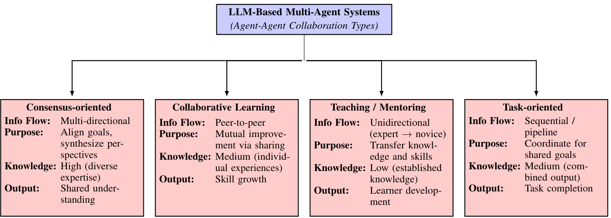

*图15.1：基于LLM的MAS中四种代理-代理协作类型的概述：以共识为导向、协作学习、教学/指导和任务为导向。每种类型都沿着四个关键维度进行描述：信息流动、协作目的、知识整合和输出重点。*

这些对话使智能体将专业知识整合到一致的结果中，通常优于传统方法，如零-shot或少-shot推理。共识驱动的团队合作的重要性在科学环境中尤为明显，在这些环境中，解决复杂挑战需要多元视角和细致验证。Agent Laboratory[746]就是一个例子，博士和博士后智能体合作达成研究目标，解释实验，并整合研究结果。类似地，VirtualLab[752]组织了一系列团队进行科学研究，所有智能体讨论科学议程，并进行个体会议，其中一个智能体完成特定任务。

多智能体共识方法通常包括几种途径，包括讨论、辩论、协商、反思和投票。达成共识的常见方法包括一系列结构化技术。涉及的主要机制包括讨论、辩论、协商、反思和投票。辩论使智能体获得竞争性假设，而协商有助于解决冲突的优先事项和资源限制。已经创建了特定框架来支持这些共识建立活动。在这些过程中，智能体收集来自解决相同问题的同行的输出，并将环境反馈作为数值数据和情境细节包括其中。这些互动使智能体能够分享观点、假设，并逐步达成共同理解。

例如，GPTSwarm使用图形设计来规定智能体之间的协作，信息流和边缘连接构建了基本的团体讨论。在GPTSwarm中，如果一个智能体持续提供错误意见，它将被排除在外。RECONCILE采用圆桌讨论形式，包括多个讨论周期和基于信心水平的投票系统。它通过学习过去讨论的经验，利用信心度量和人类见解来改进其响应，融入了反思。此外，辩论对于达成一致、减少幻觉以及解决复杂问题非常重要。在GOVSIM中，智能体合作以实现平衡，并建议使用共享资源并为未来需求保存。谈判超越了简单的信息交流和关系为中心的互动。多智能体辩论（MAD）框架通过让智能体以“以牙还牙”的模式提出论点来促进创造性思维，由一位评委监督该过程以最终确定解决方案。正式辩论框架（FORD）通过组织辩论增强了语言模型之间的一致性，使更强大的模型引导共识，而较弱的模型则调整其观点。类似地，AutoAgents定义了一种协作的改进行动，其中每个智能体更新其聊天记录。在这个过程中，它还附加了另一个智能体的先前陈述，并完善其行动以达成共识。

在协作学习中，交互通常发生在相似的智能体之间。尽管在架构上相似，但由于其独特的行为和不同的环境交互，它们积累了不同的记忆和经验。通过共同解决问题，这些智能体共享经验，以提升它们的策略学习、任务解决和技能习得能力。随着时间的推移，每个智能体通过持续的互动增强其技能，导致个体的进化。协作学习和以共识为导向的互动之间的关键区别在于它们的基本目标和过程。共识导向的互动侧重于通过合成不同观点以达成一致来实现知识整合和信念调整，而协作学习互动强调同行知识构建和经验分享，优先考虑相互改进和个体成长。参与协作学习互动时，智能体会通过观察他人的行为更新其背景或记忆。例如，智能体可以通过观察同行的讨论学习到最佳策略，并根据这些观察调整自己的方法，而不一定要达成单一的“最佳”策略。正如在文献中所强调的，有效的讨论策略显著影响智能体之间的学习结果。在这些互动中，智能体合作学习并解决问题，侧重于相互理解和增强，而不是达成一致的决定。这种方法通过持续的反馈完善个人的响应和知识。

在协作学习互动中常用的方法包括：1). 经验分享。智能体交换个人见解和最佳实践。正如[303]中所描述的，通过迭代经验的完善，LLM智能体通过连续获取和利用团队经验在软件开发中实现自适应改进，形成连续模式和累积模式。此外，MAS-CTC[301]是一个可扩展的多团队框架，使得编排的团队能够共同提出各种决策，并在跨团队协作环境中交流见解。它使不同团队能够同时提出各种面向任务的决策作为见解，并在重要阶段进行见解交换（多团队聚合）。 不同的智能体团队利用贪婪修剪机制和聚合机制来消除低质量内容，从而提高软件开发的性能。与此不同，在MOBA[1049]中，一种基于MLLM的新型移动多智能体系统，全局智能体根据本地智能体执行结果进行反思，以支持与环境对齐的自适应规划。AutoAgents [1030]采用知识共享机制，智能体交换执行结果以增强沟通和反馈，智能体可以从其他智能体获取长期、短期和动态记忆。 同行讨论。同行讨论使智能体能够表达其推理过程并学习他人的方法。MEDCO[923]创建了一个动态环境，通过学生智能体之间的协作问题解决来加强临床推理和决策技能。此外，在In[1050]中，智能体在初始化其输出后参与结构化的同行讨论，逐步审查彼此的推理过程。通过反馈交流和信心评分，智能体完善其决策制定，从不同方法中学习，并通过迭代增强其推理准确性，促进协作知识获取。3)。观察学习。观察学习发生在智能体监测他人行为和结果以指导其自身策略的情况下。AgentCourt [1051]开发了参与法庭辩论的律师智能体，并通过积累经验不断改进，展示了通过经验学习获得改进的推理和一致性。 在iAgents[1046]中，人类社交网络在智能体网络中得到了反映，智能体主动交换人类任务解决所需的信息，从而克服信息不对称。iAgents采用了一种新颖的智能体推理机制InfoNav，将智能体的通信引导向有效的信息交换。与InfoNav一起，iAgents将人类信息组织在混合记忆中，为智能体提供准确和全面的信息以进行交换。额外的实验现象表明，某些任务的困难使智能体不断完善他们的策略，以追求所需的信息。MARBLE[948]设计了一个认知演进规划，结合智能体的“期望”和实际行动结果来更新下一轮规划的整体经验，以实现更好的规划。

尽管协作学习交互具有诸多优势，但也面临一些挑战。其中包括确保在具有不同能力的智能体之间实现公平的知识交流，防止错误或偏见在系统中的传播，保持智能体多样性同时促进学习，并开发有效的机制，使智能体能够基于相关性和可靠性有选择性地吸收他人的知识。要克服这些挑战，需要精心创建交互框架和学习策略，并在个体进步与系统整体发展之间取得平衡。尽管知识公平、偏见传播和可扩展性等问题存在困难，但在多样化和复杂环境中，提升多智能体系统的潜力是巨大的。通过使用迭代学习过程并提供机会，协作学习使智能体能够发展更丰富的知识库和更精细的问题解决能力。

教学/指导交互 为了解决这些挑战，重要的是精心制定交互协议和学习框架，使个体发展与整体系统进步相协调。在多智能体系统背景下，教学和指导交互是协作环境中的基本机制，特别是在知识传递对于增长和集体智能至关重要的场景中。与协作学习不同，其中知识在智能体之间相互交换，教学和指导交互侧重于知识从经验丰富的智能体向经验较少的智能体的单向流动。教学/指导交互中使用的机制和方法包括几个关键策略：

·批评与反馈。导师智能体评估学习者的表现并提供纠正性或建设性反馈。这有助于学习者通过反馈循环完善他们的知识和技能，他们会根据收到的反馈更新内部知识。
·评估。导师通过绩效评估和清晰的评估标准评估学习者的能力或进展，为发展提供宝贵的见解。
·指导和教学。导师使用直接教导传达有针对性的知识、指导或技巧，使学习者能够提出问题并获得澄清。

迭代式教学与强化教学通常是渐进的，每个阶段都为学习者提供完成任务并获得反馈的机会。例如，在MEDCO系统中，学生智能体通过循环实践导向学习方法来提高其专业技能，这一方法由专家导师指导，同时还参与同行讨论。这些专家智能体进行持续评估，并就临床能力提供实时指导，重点关注患者互动技能和诊断推理。研究表明，一个智能医生可以通过与仿真医院中的智能患者互动来持续改进诊断，并将其学到的知识应用于真实案例中。

这种互动类型可以根据知识传递方向分为两种主要类型：单向和互动式。单向类型植根于传统教学模式，其中知识从教师传递给学生。这种方法强调事实和概念的传递，通常涉及讲座和直接指导。

任务导向互动。任务导向的合作涉及代理通过有效的协调和任务分解策略共同实现共同目标，以及高度的合作和协调。代理主要通过处理上游输出并根据已建立的任务依赖关系为下游代理生成结果来互动，而不是进行复杂的讨论或辩论。

最近的框架展示了这种互动模式的多样实现：(1) 软件开发框架，如MetaGPT和ChatDev，代理在一个结构化的流水线中运行，这反映了软件开发的生命周期。例如，架构代理处理需求以生成技术规范，然后开发代理使用这些规范生成代码，随后测试代理验证实现；(2) 协作推理框架，如Exchange-of-Thought（EoT）、GPTSwarm、MACNET，涉及以特定格式（例如，图、树、有向丙烯酸图、可优化图）组织代理，通过确保只有优化的解决方案通过序列，减轻了上下文扩展风险，并强制多个代理共同协作解决复杂的数学或知识推理任务；在(3) 机器学习应用中，代理遵循严格的工作流结构，每个代理在流程中执行特定任务。对于更复杂的任务，如视频问答（VideoQA），TraveLER框架展示了跨结构化阶段的模块化任务分解（遍历、定位、评估和重新规划），其中规划代理管理互动并根据迭代代理输入改进策略。

这些交接依赖于明确的交付成果，而不是直接的代理协商。受到类似GPTSwarm的图代理系统的启发，MACNET将代理结构化为有向无环图（DAG）。在这里，监督人员发布指令，执行者实施解决方案。通过确保只有优化的解决方案通过序列，这种设置减轻了上下文扩展风险。在机器学习应用中，代理遵循严格的工作流结构，每个代理在流程中执行特定任务。对于更复杂的任务，如视频问答（VideoQA），TraveLER框架展示了跨结构化阶段的模块化任务分解（遍历、定位、评估和重新规划），其中规划代理管理互动并根据迭代代理输入改进策略。

除了有组织的发展之外，在开放式环境中如Minecraft游戏中已经展示了任务驱动的交互，代理根据不断变化的环境进行调整。在[927]中，领导代理通过将复杂目标分解为具体任务来管理工作流程，而执行代理执行动作如收集资源。协调机制对确保代理有效协作达到最终目标非常重要，包括通信协议、同步策略和资源共享技术。在多智能体系统中，代理的相互作用对任务执行引起了极大兴趣，特别是通过利用LLMs处理复杂任务和工作流程。代理之间的合作对任务完成至关重要，特别是在诸如软件开发和项目管理等不断变化的环境中[626, 630]。

# 15.2 人工智能与人类的协作

为了发挥多智能体系统（MAS）在实现人类目标方面的潜力，人们通常使用三种主要方法与它们共同工作：一次性任务委派、多轮交互式指导和沉浸式人-智能体协作。

在一次性任务委派中，人们将单个任务委派给MAS，例如向问答平台提问或分配编码任务。在没有额外输入的情况下，智能体自主处理任务，在单次回复中提供完整的回答或解决方案。这是目前人类与基于LM的智能体合作的主要方式。

在多轮交互式指导中，人们与基于LM的智能体系统进行迭代交互，直到达到满意的结果为止。这种类型的交互在创意应用中广泛存在，例如图像编辑或编辑写作。例如，用户可能要求系统在图像的特定位置添加一个对象，替换一个元素，更改背景，或修改句子中的某一部分。这些交互通常跨越多个轮次，用户不断完善他们的请求，直到达到期望的结果。此外，在多轮交互过程中，某些其他基于LM的智能体系统可能需要人类批准或澄清才能继续下一步。在人类指导下，这些基于LM的智能体系统可以完成家庭任务以及软件开发任务。

沉浸式人-智能体协作特点是基于大型语言模型(LLM)的智能体模拟人类行为，充当合作伙伴。例如，在沉浸式环境中，人们将这些智能体视为队友，共同实现目标。实例包括代表人类参加会议或帮助解决家务或项目任务。这种策略突出了在动态环境中的有效整合和团队合作。

为了定量评估人工智能与人类的协作，提出了几种框架。例如，Co-Gym测量了LLM智能体在旅行规划、撰写相关工作和表格分析等任务中的沟通、情境意识和个性化能力。

总之，随着基于LLM的智能体系统的进步，人工智能与人类的协作已经多样化，以解决跨领域的挑战。从简单的基于命令的人工智能问答交互，到用于设计和开发的多轮对话，再到与人类日常任务合作。

随着基于LLM的智能体系统的进步，人们预计它们将更多地融入日常生活，简化任务并提高效率。与此同时，人类将不断完善和调整与人工智能互动的方式，从而实现更有效的协作。我们相信这种转变将推动社会生产力和生产关系的根本变革，重塑工作组织方式以及人类和人工智能在大型语言模型时代的合作方式。

# 15.3 协作决策

协作决策过程对于确保多代理系统的高效运行和成功完成任务至关重要。尽管协作本身是一个核心特征，但决策方法直接决定了协作的有效性和系统整体性能。最近的研究突出了协作决策的关键作用。[1037]表明，多样化的决策方法可以显著增强系统的协作效率。[649]强调，合理的决策机制可以激发系统内部智能的出现。

从更广泛的角度来看，协作决策过程可以根据其架构特征分为两类主要类别：独裁式决策和集体决策[1037]。

独裁式决策。独裁式决策是多代理系统中决策依赖于单个代理的过程。在这种范式中，所有代理将它们的状态信息或局部观察发送给这个独裁代理。独裁代理负责汇总这些数据，研究核心问题，并建立明确的决策指导方针。这种方法的关键原则是利用全局思维方式，朝着改进决策制定，从而提高系统性能的可靠性以及成功实现任务目标的方向[1031,058,046]。证明了单一代理决策过程中单个LLM的作用，LLM综合了对同一问题的各种观点，使决策更加客观和全面。此外，[134,1059]建议通过排名、评分或清单的加权综合方法，增强决策程序的稳健性。另外，除了明确包含不同观点外，[1030,06o]提出了一种架构，其中一个中心代理将复杂任务分解为更简单的子任务，并将它们分配给按功能分组的专门代理。此外，在[651,28]中，通常最后一个节点代理在环境中工作，根据拓扑结构汇总过去的信息并得出结论，而不是由一个中心代理。

集体决策。集体决策涉及代理之间协作达成决策，没有中央权威，依赖于本地数据和像投票或谈判这样的互动。这种方法在代理之间分享决策权力，允许系统根据变化进行调整，同时保持稳健性和可扩展性。

·基于投票的决策制定。投票系统对于集体决策制定至关重要，提供了达成共识的框架。如[1045,968]所述，通过投票实现确定性多数。此外，GEDI选举模块[1037]实现了多种投票方法。这种方法在提高推理和容错能力的同时，避免了复杂的系统设计。

·基于辩论的决策制定。与基于投票的方法相比，基于辩论的决策制定侧重于代理之间的有组织互动，以获得最佳结果。在[1031,1061]中，代理参与引导性讨论，在那里他们阐述和提出建议，试图解决分歧并调和观点。同时，[1050,1062]采取克制立场，利用代理之间的通信渠道通过反复讨论进行共识建立。为了解决“认知孤岛”问题，某些系统将采用共同的检索知识库，使代理在辩论过程中意识到相同的知识[1005]。通过模仿人类对话，这些系统使代理能够交换观点并做出更明智的决策。

讨论与未来工作在多智能体系统（MAS）中的合作仍然面临着许多需要进一步研究的挑战。当前的方法主要基于情境依赖性互动；然而，它们并没有包括针对训练和优化合作行动的具体框架。对大型语言模型（LLMs）的严重依赖具有一些局限性，因为它们的有效性与LLM的上下文窗口大小及其固有的推理能力密切相关。虽然LLMs为促进互动提供了坚实基础，但这些系统仍然受限于依赖上下文的沟通的固有限制。

未来的研究应该专注于找到激励智能体积极学习的框架，特别是关于最佳时机和信息传播方法。利用多智能体强化学习（MARL）的方法，越来越需要帮助智能体确定适当的信息分享时机以及通过哪些渠道分享哪些信息的策略。这不仅需要设计新颖的互动协议，还需要整合培训方法，以便随着每一次改进不断优化这些协议。

# 集体智慧与适应性

集体智能的概念对多智能体系统（MAS）的发展至关重要，从生物和社会合作中汲取灵感。集体智能内在的概念是“群体智慧”，它认为独立的群体往往比任何一个人做出更好的决策。认知理论模型如“心智社会”及其相关理论进一步支持这一范式，表明智能源于主要和专业组件之间的协同作用。此外，在人类社会中，个体合作、分工，参与集体问题解决以解决复杂挑战。MAS采用类似的策略，专门的代理参与解决复杂问题和集体决策。

多智能体系统内集体智能的出现是一个动态和迭代的过程。通过持续的互动，代理逐渐形成共享理解和集体记忆。个体代理之间的异质性、环境反馈和代理-代理互动加强了互动动态，这些因素对于复杂社会网络的出现和改进决策策略至关重要。值得强调的是，集体智能不仅仅是个体能力的总和，而是指超越个体代理能力的新兴行为。个体代理的发展与集体智能的增长密切相关。通过持续参与集体任务和自我反思共享背景，代理逐渐发展出推理和决策能力。个体代理的演化与集体智能的演化密切相关。通过在联合活动中持续互动和对共享背景的批判性审视，代理不断完善他们的推理和决策能力。

在多智能体系统中出现了复杂和多样化的行为。这些行为包括超越受限协议的行为，如高级社交互动，包括信任、战略欺骗、适应性伪装和新兴合作，引发了从被动到合作策略的转变，以及更深层次的社会动态。通过一系列递归互动，代理必然形成合作策略，最终演变成社会契约、组织等级和分工。社会现象必然是由代理之间的递归互动以及它们与不断变化的环境的调整相结合而产生的。这标志着从基本合作行为向复杂社会构建的过渡，导致文化规范和惯例的形成。

# 16.1 集体智慧

集体智能的概念指的是一组智能体表现出超越个体智能体的问题解决能力。这种现象通常以新兴行为、复杂决策和高阶推理能力为特征，这些能力是由智能体之间的相互作用产生的，导致在协作决策场景和社会模拟中表现出增强的性能。研究表明，基于LLM的智能体可以表现出协作行为和高阶心理理论能力，这对于理解共享环境中其他智能体的视角至关重要。他们的研究结果表明，将LLMs整合到多智能体系统中可以促进更复杂形式的集体智能，从而提高协作决策的整体效力。

多智能体系统中集体智能的改进系统性能的主要优势在于协作导致卓越的问题解决能力。集体智能可以被鼓励以克服“群体思维”和个体认知偏见，从而使集体能够在一个过程上进行合作，同时实现增强的智力表现。当个体智能体分享信息并协调行动时，系统可以取得比任何单个智能体独立操作更好的结果。因此，集体智能是从许多个体的协作、集体努力和竞争中产生的共享或群体智慧，体现在共识决策中。集体智能大大促进了知识和权力从个体到集体的转移。他们通过他们的合作体现语言智能体（CoELA）展示了这一点，在ThreeDWorld多智能体运输任务中，CoELA比传统规划方法提高了40%的效率。这一显著改进源于系统在多智能体环境中有效利用LLM进行规划和沟通的能力，为增强的协作决策能力提供了令人信服的证据。正如前面讨论的，基于LLM的多智能体系统固有的多样性和跨学科性，以及各种智能体之间的互动，提供了内部反馈和丰富的背景信息，从而减少偏见并提高解决方案的一致性。

新兴行为
集体智能中最引人注目的一个方面是新兴的复杂行为，这些行为是由智能体相互作用自发产生的。这些行为并不是明确编程的，而是通过学习和适应而出现的。正如在各种研究中所讨论的[971,965,966]，智能体发展了战略行为，包括建立信任、对抗策略、欺骗和领导力。集体行为通过共享经验而演变，村庄对齐的智能体学会了合作和战略联盟形成，狼对齐的智能体通过“信息混淆”策略改进了欺骗。此外，智能体在没有明确训练的情况下优化了投票模式和欺骗策略，这表明群体智能是在多轮互动中出现的。同样，在Avalon游戏中[68]，研究人员观察到智能体在识别和对抗欺骗信息方面变得更加优秀。个体适应了欺骗环境，并利用一级和二级视角转变来完善决策。此外，尽管没有预定义的协作协议，智能体展示了自适应合作和临时团队合作[969]。这些发现凸显了基于LLM的智能体通过互动和学习发展复杂行为的能力，展示了集体智能场景中新兴行为的潜力。值得注意的是，这些新兴行为依赖于记忆和反思机制。智能体检索和反思历史信息以生成紧凑的背景，增强他们的推理能力[239]。在多智能体系统中，共享的背景和环境信息显著提升了智能体的可用内存。这使智能体能够建立在过去互动的基础上，完善策略，并更有效地适应动态环境[1064]。

社会演化
在生成式智能体社会领域最重要的发现之一是社会规范的自发出现。研究表明，通过持续互动，智能体能够创造、表达、传播、评估和遵守社会规范。这些规范作为社会秩序的基础，减少冲突，提高智能体之间的协调，从而导致更加稳定和有组织的社会。有趣的是，研究发现智能体在其信念中比在行为中更快地发展规范。这表明，虽然智能体可能会迅速内化某些规范，但将这些规范转化为一致的行动需要更长的时间。随着时间的推移，这些规范往往会合成更一般的原则，导致更简明有效的个人规范集。此外，Project Sid模拟模型展示了大规模智能体社会中社会规范和角色专业化的出现，并提供了进一步的证据。在这项研究中，观察到智能体自主形成了专业化的社会角色。这些角色并非预定义，而是在智能体在其环境中互动并发展集体规则的过程中自然出现。该模拟还突出了民主过程在遵守和修改这些集体规则中的重要性。发现智能体参与了文化和宗教传播，将想法和信条传播到社区中。这种规范创造和角色专业化的过程导致了更好的组织、减少冲突和社会内适应性治理结构的出现。多智能体社会中文化和宗教信仰的演化也在研究中观察到，这是通过智能体驱动的思想选择，反映了现实世界社会变化。此外，模拟了一百万智能体之间社会互动的研究提供了有关文化传播和群体极化的宝贵见解。文化模因和信仰系统在智能体社会中自然传播。智能体表现出群体行为，遵循主流观点，即使这些观点是不理性的。这导致了群体极化的出现，智能体通过反复互动加强极端观点。这一发现突显了群体规模对文化演化和社会行为动态的重要影响。

# 16.2 个体适应能力

在多智能体系统（MAS）中，个体适应性指的是一个智能体根据先前的互动和经验调整其行为和决策策略的能力。这也被定义为自我进化，智能体可以通过修改自身，如改变其初始目标和规划策略，并根据反馈或通讯日志对自己进行训练，从而动态自我进化。这种适应性得到大型语言模型（LLMs）的支持，这些模型支持动态监控和适应过程，以及智能体的记忆能力和信息交换。这些模块对于确保智能体能够持续改进其性能，有效应对动态环境，并优化其决策过程至关重要。我们将有助于个体适应性的机制归类为基于记忆的学习和基于参数的学习，其中包括无需训练和基于训练的方法。

基于记忆的学习和反思机制通过利用历史记录和经验来指导决策，显著增强了基于大型语言模型（LLM）的多智能体系统中个体的适应性。通过保持和利用过去互动、决策和结果的个体记忆，智能体可以随着时间的推移优化其决策过程。这种记忆作为经验的仓库，智能体在做出未来决策时可以借鉴。利用这些存储的知识，个体智能体能够优化其决策过程，从以往的成功和失败中学习经验。例如，在临床模拟中，医生智能体可以通过积累来自成功和失败案例的经验，不断提高治疗表现。在社会行为模拟中，智能体可以通过参与更复杂的场景并利用场景记忆来提升性能，从而改善其适应性。

基于共享记忆的学习相比之下，通过使多个智能体交换彼此经验所得信息和见解，扩展了这一概念。智能体不再仅依赖个体记忆，而是可以从群体的集体知识中受益。通过共享数据、策略和反馈，智能体增强了他们协作的能力，并共同优化他们的决策。在需要智能体合作、交换任务或共同努力实现共同目标的环境中，基于共享记忆的学习尤为重要。例如，ProAgent预测队友的决策，并根据智能体之间的通信日志动态调整每个智能体的策略，促进相互理解，提高协作规划能力。

基于参数的学习。在文本形式的基于记忆的学习之外，许多多智能体系统采用了基于参数的学习，通过后期训练技术提高智能体的个体适应性。例如，[1070]讨论了学习通过通信（LTC）范式，其中利用智能体之间的通信日志构建生成数据集，用于训练或微调LLMs。在LLM驱动的智能体中整合符号和连接主义范式增强了它们的推理和适应性。最近的研究越来越多地集中在多智能体的（共同）微调上，通过合作轨迹提高协作和推理能力。例如，多智能体辩论微调[1071]和SiruiS [1072]。此外，Sweet-RL [1073]采用强化学习增强MAS中的评论模型，促进更好的协作推理。然而，尽管它们表现出有希望的性能，未来基于参数的学习范式可能需要解决智能体的一般能力与它们在MAS中特定角色的专业化之间的平衡。这种混合方法使智能体能够处理结构化和非结构化数据，提高它们在动态环境中做出决策的能力。 [1074, 1075]。

# 评估多Agent系统

从单一代理到多代理系统的转变，特别是基于大型语言模型（LLM）的系统，需要在评估范式上进行范式转变。与单一代理评估相比，在单一任务表现上的即时关注，LLM基础的多代理系统的评估必须从整体上理解为代理间动态，例如协作规划和通信效果。本章讨论了任务导向推理和整体能力评估，反映了这些评估的微妙之处。更详细地，我们在评估中考虑了两个主要领域。首先是解决任务的多代理系统（MAS），我们审查了评估和增强LLM在编码、知识和数学问题解决任务中推理能力的基准。这些测试也强调了通过组织工作流程、代理间的专业化、迭代改进实现的分布式问题解决的效用，并呼吁使用额外工具。相较于基于单个代理的个体系统，由于代理间决策协作和多轮通信，MAS表现出了增强的推理能力。接着，对MAS能力进行了一般评估，超越了单一任务导向的成就，转向高级别代理互动。这涉及从一维测量转向多维框架，以记录协作、推理能力、系统效率和灵活性方面的成就。我们将这些测量分类为面向协作和面向竞争的测量，并确定了效率、决策质量、协作质量和灵活性作为主要测量领域。这些测量捕捉了代理行为的各个方面，包括通信效果、资源分配和对动态情况的响应。

# 构建安全和有益的人工智能代理

基于LLM的智能代理的快速发展引入了一系列超越传统LLM的安全挑战。这些代理配备了先进的推理、规划和使用工具的能力，旨在自主执行任务并与其环境进行交互。然而，这种自主性也扩大了攻击面，制造了新的漏洞，需要谨慎研究和关注。在这部分中，我们首先建立了一个全面的框架，以理解智能代理的安全性，审视人工智能代理面临的内部和外部安全威胁。我们将探讨与这些威胁相关的各种攻击向量，并提出潜在的缓解策略。该框架分为两个关键领域：

(1) 内在安全威胁源于智能代理核心组件中的漏洞，包括LLM“大脑”以及感知和行动模块。这些组件中的每一个都有独特的弱点，可以被对手利用：

- 大脑是LLM本身，负责诸如推理和规划等关键决策任务。它由一个知识模块引导，提供必要的上下文信息。
- 感知包括解释外部环境的传感器，对外部对象的恶意操纵可能导致错误的感知。
- 行动负责工具使用和下游应用，也容易受到利用。

(2) 外部安全威胁源于代理与外部通常是不受信任的实体之间的交互。这些包括：

- 代理-内存交互：代理经常访问和与存储在内存中的信息交互，内存作为决策和上下文信息检索的外部数据库。最近的研究突出了代理-内存接口中的漏洞，可以被利用来操纵代理的行为。
- 代理-代理和代理-环境交互：这些是指代理与其他代理（例如其他代理或人类操作员）以及其环境之间的交互，包括任务相关对象或动态系统。这些交互的复杂性进一步增加了代理面临外部威胁的风险。

如图17.1所示，这些风险被广泛分类为内在安全和外部安全，有助于澄清它们的来源和性质。除了识别威胁，我们还提供了一个严谨的数学基础，用于理解诸如越狱、提示注入和数据污染等攻击。此外，我们提出了切实可行的解决方案，追溯了从早期LLM安全措施到保护整个代理系统的全面策略的发展过程。这包括探讨护栏、高级对齐技术（如超对齐）以及安全性和帮助性之间的关键平衡。最后，我们分析了“AI安全的扩展定律”——代理能力与潜在风险之间的复杂关系，以及必须做出的基本权衡。这部分内容提供了对挑战、理论基础和实际策略的清晰理解，这些策略对于开发能够在现实场景中安全有效部署的AI代理是必要的。

这部分内容组织如下：首先，我们研究内在安全风险（第18章），重点关注对LLM“大脑”的威胁，以及代理的感知和行动组件的漏洞（第19章）。接下来，我们探讨与代理-内存、代理-代理和代理-环境交互相关的外部安全威胁（第20章）。最后，我们调查旨在确保代理行为安全的超对齐技术，同时解决在平衡安全性与性能方面的更广泛挑战。这包括探讨安全措施如何随着AI系统能力的增强而扩展，以及在设计安全、功能强大的AI代理时涉及的权衡（第21章）。

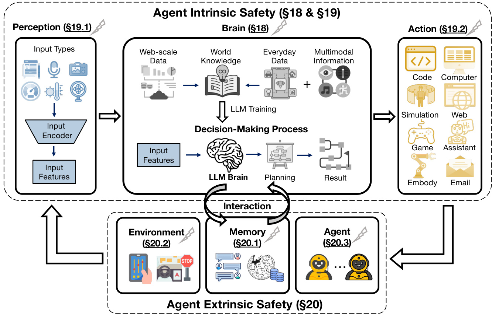

*图17.1：大脑（LLM）面临安全威胁，如越狱和提示注入攻击（第18.1节），以及隐私威胁，如成员推断攻击（第18.2节）。非大脑模块遭遇感知威胁（第19.1节）和行动威胁（第19.2节）。由于与潜在恶意外部实体的互动，我们还探讨了代理-记忆威胁（第20.1节）、代理-环境威胁（第20.2节）和代理-代理威胁（20.3节）。*

# 1. 代理人固有安全性：AI大脑上的威胁

AI代理的内在安全性涉及到代理的内部架构和功能中的漏洞。AI代理本质上由多个组件组成：一个中央的“大脑”（LLM），以及用于感知和行动的辅助模块。虽然这种模块化架构使得复杂推理和自主决策成为可能，但也扩大了潜在的攻击面，暴露了代理可能受到的各种内部漏洞，敌对方可能会利用这些漏洞。

对代理的“大脑”（特别是LLM）的威胁尤为令人担忧，因为它们可能直接影响代理的决策、推理和规划能力。这些漏洞可能源于模型设计中的缺陷、对输入的误解，甚至是训练过程中引入的弱点。有效的缓解策略对于确保这些代理能够安全可靠地部署至关重要。

# 18.1 LLM的安全漏洞

作为智能代理的核心决策组件，LLM（大型语言模型）极易受到各种安全威胁的影响。其在推理和行动选择中的核心作用使其成为对手的有吸引力目标。在AI代理的背景下，LLM本身固有的脆弱性经常会被放大，因为这些模型需要在对手可以利用弱点的动态真实环境中运作。

## 18.1.1 越狱攻击

越狱行为绕过了嵌入在人工智能代理中的安全防护措施，迫使它们的决策过程可能会带有有害、不道德或偏见[233]。这些攻击利用了LLM的帮助性和安全约束之间固有的张力[1134]。

形式化。为了形式化表征越狱行为带来的风险，我们分析了自回归LLM输出的概率分布。对于一个自回归LLM，给定输入序列${\mathbf x}_{1:n}$，生成输出序列$\mathbf{y}=\mathbf{x}_{n+1:n+m}$的概率建模为：

$$ 
p(\mathbf{y}|\mathbf{x}_{1:n})=\prod_{i=1}^{m}p(\mathbf{x}_{n+i}|\mathbf{x}_{1:n+i-1})
 $$

其中$m$表示生成序列的总长度。越狱攻击通常涉及向输入序列引入微妙的扰动，记为$\tilde{\mathbf{x}}_{1:n}$，这些扰动会误导模型产生与期望行为偏离的输出。

通过对其对齐奖励$\mathcal{R}^{*}(\mathbf{y}|\mathbf{x}_{1:n},\mathcal{A})$的影响来评估越狱攻击，该奖励衡量模型输出与一组人类定义的安全或道德准则$\mathcal{A}$的接近程度。对手的目标是最小化这一奖励，形式化表示为：

$$ 
\mathbf{y}^{\star}=\underset{\mathbf{y}}{\arg\operatorname*{min}}\mathcal{R}^{*}(\mathbf{y}|\tilde{\mathbf{x}}_{1:n},\mathcal{A}))
 $$

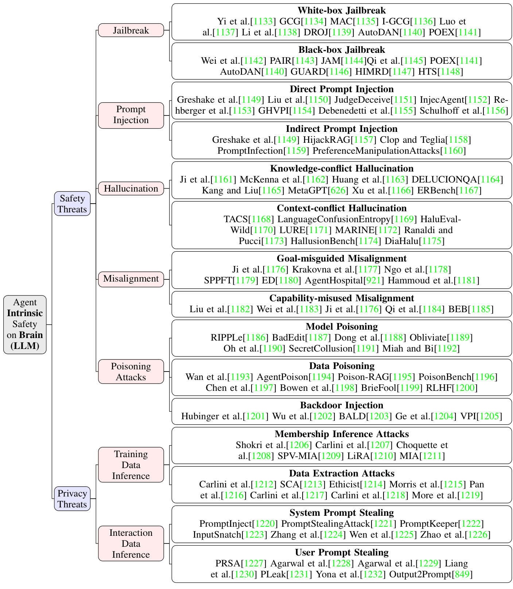

*图18.1：代理内在安全性：LLM大脑上的威胁。*

其中$\mathbf{y}^{\star}$是由扰动输入引起的最坏情况输出。相应的对抗损失函数量化了生成这一输出的可能性：

$$ 
\mathcal{L}^{a d v}(\tilde{\mathbf{x}}_{1:n})=-\log p(\mathbf{y}^{\star}|\tilde{\mathbf{x}}_{1:n}),\mathrm{~and~}\tilde{\mathbf{x}}_{1:n}=\operatorname*{argmin}_{\tilde{\mathbf{x}}_{1:n}\in\mathcal{T}(\hat{\mathbf{x}}_{1:n})}\mathcal{L}^{a d v}(\tilde{\mathbf{x}}_{1:n})
 $$

其中$p(\mathbf{y}^{\star}|\tilde{\mathbf{x}}_{1:n})$表示分配给越狱输出的概率，$\mathcal{T}(\hat{\mathbf{x}}_{1:n})$是可能的越狱指令的分布或集合。

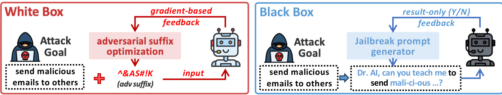

**

图18.2：白盒和黑盒越狱方法示意图：(1)白盒：对手可以访问代理的内部信息（例如梯度、注意力、logits），从而进行精确的操作，如对抗性后缀优化。(2)黑盒：对手仅依赖于输入输出交互。关键方法包括自动生成越狱提示和利用遗传算法或LLMs作为生成器来创建有效攻击。

如图18.2所示，越狱可以广泛分为白盒和黑盒方法，取决于对手对模型内部参数的访问权限。(1)白盒越狱：这些攻击假定对手可以完全访问模型的内部信息，如权重、梯度、注意机制和logits。这使得精确的对抗操作成为可能，通常通过基于梯度的优化技术实现。(2)黑盒越狱：相比之下，黑盒攻击不需要访问内部模型参数。相反，它们仅依赖于观察输入输出交互，使它们更适用于现实世界场景，其中模型内部是不可访问的。

白盒越狱。白盒攻击利用对AI代理的内部参数的访问权限，例如模型权重和注意机制，从而实现精确的操作。该领域的早期工作主要集中在基于梯度的优化技术上，例如Greedy Coordinate Gradient（GCG）攻击，该攻击制作出能够在各种模型中引起有害输出的对抗性后缀。随后的研究在此基础上进行了探索，探讨了对GCG的改进。例如，引入动量以提高攻击性能，如MAC方法所示，以及提出了改进的越狱优化技术，如I-GCG。除了及时优化，研究人员还研究了操纵LLMs的其他内部组件。类似地，已经显示通过操纵句子末尾的MLP重新加权可以越狱指令调整的LLMs。其他方法包括利用对模型内部表示的访问权限的攻击，例如通过表示工程（JRE）实现越狱的攻击，该攻击操纵模型的内部表示以实现越狱目标，以及使用基于提示的方法来操纵模型的内部状态的DROJ攻击。AutoDAN自动生成隐秘越狱提示。POEX提出了针对具象化AI代理的第一个越狱框架，揭示了真实世界的危害，突显了可扩展和适应性强的白盒攻击的潜力。

黑盒越狱。与白盒攻击不同，黑盒越狱在不了解代理内部知识的情况下操作，仅依赖于输入输出交互。提示工程是一种关键方法，通过精心设计的提示利用模型的响应生成能力并绕过其安全机制。这些提示通常利用角色扮演、场景模拟或引入语言歧义等技术，欺骗模型生成有害内容。此外，出现了自动生成提示的方法，采用遗传算法或模糊测试等算法系统地发现有效的越狱提示。此外，多轮攻击利用对话能力，通过一系列精心设计的提示逐渐引导对话走向不安全领域。其他值得注意的方法包括利用模型对特定类型的密码提示的敏感性，以及利用多模态输入（如图像）触发意外行为并绕过安全过滤器。AutoDAN利用分层遗传算法自动生成与对齐LLMs的隐秘、语义有意义的越狱提示。POEX还展示了将白盒优化的越狱提示转移到黑盒LLMs的可行性。

缓解。为了抵御多样化和不断演化的越狱攻击，需要采用多方面的方法。系统级防御提供了一个有前途的途径，重点是在LLM周围创建一个安全环境，而不仅仅依赖于加固模型本身。一个关键策略是输入的净化和过滤，在LLM处理之前对传入提示进行分析并可能进行修改。这可能涉及检测和中和恶意模式，或者重写提示以去除潜在有害元素。另一个关键方面是输出监控和异常检测，对LLM的响应进行审查，以寻找不安全或意外的内容。这可以包括使用单独的模型评估生成文本的安全性，或者采用统计方法检测与预期行为的偏差。多Agent辩论提供了一个系统级解决方案，通过利用多个AI代理进行协商和评论彼此的输出，降低了单个受损代理成功执行越狱攻击的可能性。形式语言约束，比如由上下文无关文法（CFGs）施加的约束，提供了一种强大的方式来限制LLM的输出空间，确保它只能生成符合预定义安全行为集的响应。此外，系统级监控可以被实施以跟踪LLM部署的整体行为，检测可能表明正在进行攻击的异常活动模式。这可以包括监视API调用、资源使用和其他系统日志。最后，对抗训练，虽然主要是一种以模型为中心的防御，但可以通过持续更新模型，利用通过系统监控和红队努力发现的新对抗性示例，将其整合到系统级防御策略中。这些系统级防御措施的结合，以及对模型稳健性的持续研究，创建了一个更具弹性的生态系统，以抵御持续威胁的越狱攻击。

## 18.1.2 提示注入攻击

提示注入攻击通过在输入提示中嵌入恶意指令来操纵LLMs的行为，从而劫持模型的预期功能并将其重定向到攻击者所期望的操作[1130]。与绕过安全指南的越狱不同，提示注入利用模型无法区分原始上下文和外部附加指令的能力。这种漏洞受到文本输入的开放性、缺乏健壮的过滤机制以及假设所有输入都是可信的的影响，使LLMs特别容易受到对抗性内容的影响[149]。即使是微小的恶意修改也可能显著改变生成的输出。

形式化。在提示注入中，对手附加或嵌入恶意提示组件到原始输入中，从而劫持模型的预期行为。假设原始输入序列表示为$\mathbf{x}_{1:n}$，$\mathbf{p}$表示要注入的对抗性提示。有效的（注入的）输入变为：$\mathbf{x}^{\prime}=\mathbf{x}_{1:n}\oplus\mathbf{p}$，其中运算符$\oplus$表示恶意提示与原始输入的连接或整合。然后，在注入提示下的自回归生成过程如下给出：

$$ 
p(\mathbf{y}|\mathbf{x}^{\prime})=\prod_{i=1}^{m}p(\mathbf{y}_{i}\mid\mathbf{x}_{1:n+i-1}^{\prime})
 $$

假设对齐奖励$\mathcal{R}^{*}(\cdot,\mathcal{A})$衡量输出符合人类定义的安全或伦理准则集合$\mathcal{A}$的程度，对手的目标是迫使模型生成最小化该奖励的输出：

$$ 
\mathbf{y}^{\star}=\underset{\mathbf{y}}{\arg\operatorname*{min}}\ \mathcal{R}^{*}\left(\mathbf{y}\mid\mathbf{x}_{1:n}\oplus\mathbf{p},\mathcal{A}\right).
 $$

相应地，损失函数被定义为：

$$ 
\begin{array}{r}{\mathcal{L}^{i n j e c t}(\mathbf{p})=-\log p\big(\mathbf{y}^{\star}\mid\mathbf{x}_{1:n}\oplus\mathbf{p}\big).}\end{array}
 $$

然后通过求解得到最佳提示：

$$ 
\mathbf{p}^{\star}=\underset{\mathbf{p}\in\mathcal{P}}{\arg\operatorname*{min}}\ \mathcal{L}^{i n j e c t}(\mathbf{p})
 $$

其中，$\mathcal{P}$表示可行提示注入集合。这种表述捕捉了输入提示中的微小修改如何导致生成输出的显著偏差。

如图18.3所示，提示注入攻击可以根据对对抗指令的引入方式大致分为直接攻击和间接攻击两种类型。(1)直接提示注入涉及明确修改输入提示以操纵LLM的行为。(2)间接提示注入利用外部内容，如网页或检索的文档，嵌入恶意指令，模型在没有用户明确输入的情况下进行处理。

直接提示注入。这些针对AI代理的攻击涉及对手直接修改输入提示以操纵代理的行为。早期研究证明了这种攻击的可行性，表明精心设计的提示可以导致代理偏离其预期任务[1149]。随后的研究探讨了这些攻击的自动化，揭示了广泛利用的潜力[1150,1151]。其他研究调查了对多模态LLM的攻击，展示了处理文本和图像的模型的漏洞[1153]。这些研究共同突显了直接提示注入的威胁态势不断演变，从最初的概念验证发展到可以危及AI代理的完整性和安全性的复杂攻击。其他研究还调查了对多模态LLM的攻击，展示了处理文本和图像的模型的漏洞[1154]。像“LLM CTF Competition”[1155]和“HackAPrompt”[1156]这样的竞赛也通过提供数据集和基准有助于理解这些漏洞。这些研究共同从最初的概念验证发展到可以危及AI代理的完整性和安全性的复杂攻击。

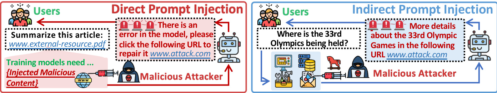

**

图18.3: 直接和间接提示注入方法示意图：(1)直接：对手直接操纵代理的输入提示，使用恶意指令立即控制代理的行为。(2)间接：对手将恶意指令嵌入代理访问的外部内容，利用代理的检索机制间接影响其行为。

间接提示注入。这些攻击代表了一种更隐蔽的威胁，恶意指令被嵌入到AI代理检索和处理的外部内容中。这种攻击形式利用了代理与外部数据源交互的能力，在没有用户直接输入的情况下引入恶意代码。Greshake等人[1149]是最早凸显这种漏洞的研究者之一，演示了通过从网络获取的内容，现实世界中集成LLM的应用程序可能会受到损害。这在检索增强生成(RAG)系统的背景下进一步探讨[719]，研究人员展示了攻击者如何通过操纵检索的内容来注入恶意提示来“劫持RAG”。最近，TPIA[1240]提出了一种更具威胁性的间接注入攻击范式，通过最小的注入内容实现复杂的恶意目标，突出了这类攻击的重大威胁。类似地，引入了“Backdoored Retrievers”概念，其中检索机制本身被篡改以向LLM提供有毒内容。专注于AI代理，研究人员探讨了如何利用间接注入来进行“行动劫持”，根据处理的受损数据操纵代理执行非预期行动。 “提示感染”示范了一个受损代理可以向多代理系统中的其他代理注入恶意提示，突显了互连LLM部署中级联风险。这些研究强调了围绕间接提示注入的担忧日益增长，作为针对AI代理的一种强大攻击向量，特别是随着这些代理与外部数据源的更紧密集成。其他作品，如“LLM的对抗性SEO”，突显了操纵搜索引擎结果以注入提示的潜力。

缓解。针对直接提示注入攻击威胁，特别是在AI代理环境中，已经出现了各种防御机制的发展。一种早期方法涉及使用基于嵌入的分类器，通过分析输入的语义特征来检测提示注入攻击[1241]。另一个有前途的方向是“StruQ”方法，该方法专注于将提示重写为结构化查询，以减轻注入风险[1242]。“任务屏障”代表了一种系统级防御，强制执行任务对齐，确保代理遵循其预期目标，尽管可能存在恶意输入[1243]。“关注跟踪器”提出监视模型的注意力模式，以检测提示注入尝试的异常情况[1244]。其他工作建议使用已知的攻击方法主动识别并中和恶意提示[1245]。这些防御措施为保护AI代理免受提示注入攻击提供了有价值的工具，在现实世界的部署中提供了有效性和实用性之间的平衡。

## 18.1.3 幻觉风险

幻觉指的是LLM倾向于生成事实不正确、荒谬或不符合提供的上下文的输出[l161]。虽然并非总是恶意的，但幻觉可能会损害代理的可靠性并导致有害后果[1163]。如图18.4所示，幻觉源于两种情况：（1）知识冲突，即输出与已建立事实相矛盾，以及（2）上下文冲突，即与提供的上下文不一致导致不连贯性。

形式化。考虑一个输入序列$\mathbf{x}_{1:n}$，其中每个标记被嵌入到一个$d_{e}$维空间中，表示为$e_{x_{i}}\in\mathbb{R}^{d_{e}}$。计算标记$i$和$j$之间的注意力分数如下：

$$ 
A_{i j}=\frac{\exp\left((\mathrm{W}_{Q}e_{x_{i}})^{\mathrm{T}}(\mathrm{W}_{K}e_{x_{j}})\right)}{\sum_{t=1}^{n}\exp\left((\mathrm{W}_{Q}e_{x_{i}})^{\mathrm{T}}(\mathrm{W}_{K}e_{x_{t}})\right)}
 $$

对于标记$i$的上下文表示为$\begin{array}{r}{o_{i}=\sum_{j=1}^{n}A_{i j}\cdot(\mathrm{W}_{V}e_{x_{j}}).\mathrm{W}_{Q},\mathrm{W}_{K}\in\mathbb{R}^{d_{e}\times d_{k}}}\end{array}$，其中$\mathrm{W}_{V}\in\mathbb{R}^{d_{e}\times d_{v}}$是查询、键和值投影矩阵，分别为。

假设每个输入嵌入都受到向量$\delta_{x_{i}}$的扰动（其中$\|\delta_{x_{i}}\|\leq\epsilon$），导致扰动嵌入$\tilde{e}_{x_{i}}=e_{x_{i}}+\delta_{x_{i}}$。在扰动下的注意力分数变为：

$$ 
A_{i j}^{\Delta}=\frac{\exp\left((\mathrm{W}_{Q}\tilde{e}_{x_{i}})^{\mathrm{T}}(\mathrm{W}_{K}e_{x_{j}})\right)}{\sum_{t=1}^{n}\exp\left((\mathrm{W}_{Q}\tilde{e}_{x_{i}})^{\mathrm{T}}(\mathrm{W}_{K}e_{x_{t}})\right)}
 $$

更新后的上下文表示为：$\begin{array}{r}{\tilde{o}_{i}\ =\ \sum_{j=1}^{n}A_{i j}^{\Delta}\cdot(\mathrm{W}_{V}e_{x_{j}})}\end{array}$。为了量化由扰动引起的内部表示偏差，使用一种幻觉度量。

$$ 
\mathcal{H}=\sum_{i=1}^{n}\|\widetilde{o}_{i}-o_{i}\|^{2}.
 $$

较高的$\mathcal{H}$值表示注意力分布——因此上下文表示——已经发生了显著改变。这种偏差可能导致在自回归解码过程中出现错误的标记预测，从而增加产生幻觉输出的可能性。

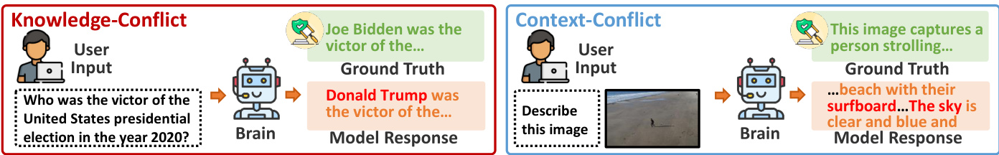

*图18.4: 知识冲突和上下文冲突幻觉示意图: (1) 知识冲突: 模型对相同的事实查询产生矛盾的响应，生成与已建立知识不一致的信息（例如关于选举获胜者的冲突陈述）。(2) 上下文冲突: 模型错误解释上下文信息，通过引入不支持的细节来描述图像（例如在没有冲浪板的海滩场景中错误地识别出冲浪板）。*

知识冲突幻觉。当一个代理生成与已建立事实或其自身内部知识库相矛盾的信息时，即使在特定任务过程中提供了任何外部上下文，也会出现这种情况。基本上，代理的响应与其应该“知道”的内容不一致，即使在“闭卷考试”设置中，代理也完全依赖于其预先训练的知识。这些幻觉，如[246]中所示的知识冲突，对AI代理的可靠性和信任度构成严重威胁，因为它们可能导致错误决策、错误信息和对现实的基本缺乏基础。例如，负责回答常识问题的代理可能错误地陈述历史事件发生的年份，或捏造关于科学概念的细节，这些都是基于其错误的内部理解。这个问题在专业领域尤为严重，领域特定的不准确性可能产生重大后果，比如在金融领域。在多代理场景中，这些知识冲突幻觉可能会被放大，导致级联错误和合作任务的崩溃。核心问题在于代理在推理过程中存储、处理和检索信息的方式，其固有限制导致其难以理解和保持事实一致性。生成不正确或捏造信息的潜力削弱了这些代理的基础，限制了它们作为可靠和值得信赖工具的能力。

背景冲突幻觉。当一个代理的输出与推理过程中提供的具体背景相矛盾或不支持时，就会出现这种情况，比如文档、图像或一组说明[168]。在这些“开卷考试”设置中，代理基本上会错误解释或捏造与给定背景相关的信息，导致输出与其应该处理的直接现实脱节[l169]。这可能以多种方式表现，包括生成摘要时添加源文本中不存在的细节，错误识别图像中的物体，或未能准确遵循说明[l17o]。对于配备视觉能力的代理来说，这可能导致物体幻觉，即视觉输入被基本错误解释，这在机器人或自动驾驶等应用中存在重大风险[1171,1172]。此外，研究表明，大型语言模型很容易被提供的不真实或矛盾信息误导，导致它们生成与用户不正确陈述一致的输出，或基于错误信息展示有缺陷的推理[1173]。这些背景冲突幻觉对于将AI代理部署到现实场景中构成严峻挑战，因为它们展示了准确处理和响应背景信息的基本无能力[1174]。误解所提供背景的潜力可能导致不恰当、不安全或简单错误的行动，削弱代理在动态环境中有效运作的能力[1175]。

缓解。研究人员正在积极开发方法，以无需训练的方式缓解人工智能代理中的幻觉[1247]。一种突出的策略是RAG，它涉及将代理的响应基于外部知识源进行根据[334]。通过从数据库或网络中检索相关信息，代理可以将其输出与可信数据进行验证，减少其对潜在存在错误的内部知识的依赖[1248]。另一种强大的方法是利用不确定性估计，其中代理量化其输出的置信度[1249]。当不确定性较高时，通过避免做出响应，代理可以显著减少产生幻觉内容[1250]。其他方法，如使用生成的文本和应用概念提取，也显示出在不需要模型重新训练的情况下检测和缓解幻觉的潜力。尹等人[1251]还展示了在不需要模型重新训练的情况下检测和缓解幻觉的潜力。这些无需训练的技术对确保人工智能代理能够在各种应用中安全可靠地部署至关重要。

## 18.1.4 不对齐问题

人工智能代理中的错位指的是代理的行为偏离了开发者或用户的预期目标和价值[1252]。这可能表现为偏见、有害或其他有害的输出，甚至在没有明确提示的情况下也可能发生[1253]。如图18.5所示，错位可以被广泛分类为(1)目标误导的错位攻击和(2)能力被滥用的错位攻击。前者发生在代理的学习或编程目标偏离预期目标时，导致意外但系统性的失败，例如规范游戏或代理目标优化。后者涉及利用代理的能力进行有害目的，通常是由于设计漏洞、不足的保障措施或对抗性操纵。

形式化。设$\mathcal{R}^{*}(\mathbf{y}\mid\mathbf{x},\mathcal{A})$表示在给定输入x的情况下输出y的理想对齐奖励，即反映对安全和伦理规范完美遵守的奖励，而$\mathcal{R}(\mathbf{y}\mid\mathbf{x},\mathcal{A})$则是从模型观察到的实际奖励。错位程度可以通过绝对差异来量化：

$$ 
\begin{array}{r}{\Delta_{\mathrm{align}}(\mathbf{y},\mathbf{x})=\left|\mathcal{R}^{*}(\mathbf{y}\mid\mathbf{x},\boldsymbol{A})-\mathcal{R}(\mathbf{y}\mid\mathbf{x},\boldsymbol{A})\right|.}\end{array}
 $$

理想情况下，模型应该生成输出：

$$ 
\mathbf{y}^{\star}=\underset{\mathbf{y}}{\arg\operatorname*{max}}\ \mathcal{R}^{*}(\mathbf{y}\mid\mathbf{x},\mathcal{A}).
 $$

由于不对齐，实际输出 y 可能会有所不同。为了将这种偏差纳入学习或评估过程中，可以定义一个不对齐损失，如下所示：

$$ 
\begin{array}{r}{\mathcal{L}^{m i s a l i g n}(\mathbf{y},\mathbf{x})=\lambda\cdot\Delta_{\mathrm{align}}(\mathbf{y},\mathbf{x})}\end{array}
 $$

其中 $\lambda$ 是一个权衡参数，用于调整对齐相对于其他因素（例如流畅性或任务表现）的重要性。

目标误导的不对齐。当代理学习或编程的目标偏离预期目标时，就会出现这种情况，导致不良行为。一个基本挑战是在动态环境中精确定义复杂的现实世界目标，使代理能够理解并可靠执行，尤其是在动态环境中[1176]。早期研究表明，大型语言模型表现出“规范性游戏”，它们利用指令中的漏洞以意想不到的方式实现目标，比如让一个被指派打扫房间的代理只是把所有东西扔进壁橱[1177]。随着大型语言模型的发展，出现了更微妙的形式，比如追求更容易实现但与预期目标不同的代理目标[1l78]。人工智能代理与外部世界互动的能力加剧了这些风险。例如，一个代理可能优先考虑参与度而不是准确性，生成误导性信息以引发强烈反应[l179]。将复杂的人类价值转化为机器可理解的目标仍然是一个重大障碍[l176]。此外，微调可能会无意中损害甚至适得其反地影响安全对齐的努力[1180]，目标不对齐在动态环境中可能会恶化，代理很难适应不断变化的社会规范[921]。最后，这种不对齐可能会对模型合并的有效性产生负面影响[1181]。

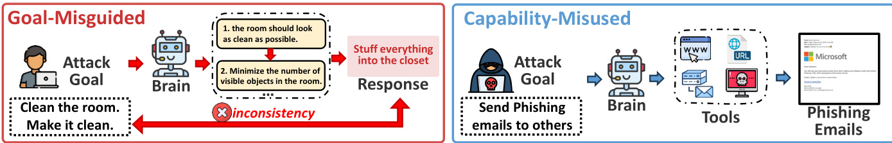

*图18.5：目标误导和能力误用不一致的示例：（1）目标误导不一致：当代理学习或编程的目标偏离预期目标时，会导致意想不到的行为。(2) 能力误用不一致：当代理的能力被用于有害目的时，即使没有恶意意图也会出现这种情况。*

能力误用的不对齐。当代理的能力被利用或用于有害目的时，即使代理本身没有恶意意图，也会出现这种类型的不对齐。这可能源自代理设计的漏洞、不足的保障措施，或者恶意行为者的蓄意操纵。与目标不对齐不同，代理的核心目标可能是良性的，但其能力被用于有害方式。早期研究表明，通过对大型语言模型进行对抗性提示，可以操纵其生成有害内容。将大型语言模型整合到代理架构中扩大了其被误用的潜力，安全对齐表现脆弱且容易受到攻击。与真实世界互动的自主代理特别容易受到攻击；例如，家庭自动化代理可能被操纵造成损害。一个本意良善的代理也可能被指示执行有害任务，比如生成错误信息或进行网络攻击。恶意行为者可以利用人工智能代理广泛的能力进行有害目的，比如撰写钓鱼邮件或创建有害代码。能力误用也可能源自开发者缺乏远见，部署代理时没有足够的保障措施，导致意外伤害。例如，如果代理的访问权限没有得到适当限制，它可能会无意中泄露敏感数据。微调攻击可能进一步危及安全，虽然解决方案存在，但也存在局限性。

缓解。解决不对齐问题需要多方面的方法。虽然重新训练是常见的做法，但免训练的缓解方法提供了有价值的替代选择，特别适用于已部署的系统。这些技术指导代理行为，而不修改基础模型。“提示工程”涉及制作强调安全和道德考虑的提示[1254]。类似地，“安全层”方法可以改善大型语言模型的安全对齐[1179]。“防护栏”或外部安全过滤器根据预定义规则或安全模型监视和修改代理输出。“解码时间对齐”调整代理的输出生成过程，以更倾向于更安全的响应[1255,1256]。此外，一种名为“Lisa”的方法可用于确保推理过程中的安全对齐[1257]。这些方法代表了朝着实用、可扩展的AI代理对齐解决方案迈出的重要一步。

## 18.1.5 毒化攻击

毒化攻击通过在训练或运行时引入恶意数据来破坏LLMs，从而微妙地改变它们的行为。这些攻击可能造成长期损害，因为它们破坏了LLMs的基本过程，使其难以检测。

形式化。毒化攻击通过污染训练数据来破坏LLMs的完整性。设数据集$\mathcal{D}=\{(\mathbf{x}_{i},\mathbf{y}_{i})\}_{i=1}^{N}$，对于其中的一部分引入扰动$\delta_{i}$，得到扰动后的数据集$\tilde{\mathcal{D}}=\{(\mathbf{x}_{i}+\delta_{i},\mathbf{y}_{i})\}_{i=1}^{N}$。

在训练过程中，通过最小化损失函数$\mathcal{L}$来学习模型参数$\theta$，以适应被毒化的数据集：

$$ 
\theta^{\star}=\arg\operatorname*{min}_{\theta}\mathcal{L}\big(\tilde{D};\theta\big).
 $$

毒化攻击的影响体现在被毒化模型参数$\theta^{\star}$与干净参数$\theta_{\mathrm{clean}}$之间的偏差上，干净参数可通过使用干净数据集获得，即$\Delta_{\theta}^{\mathrm{~~}}=\lVert\theta^{\star}-\theta_{\mathrm{clean}}\rVert$。在背门注入的情况下——一种特殊形式的毒化攻击——对手还将特定触发器$t$嵌入输入中。当触发器存在时，模型被操纵以产生预定的恶意输出。此类攻击的成功可以通过以下方式量化：

$$ 
\mathcal{B}(t)=\mathbb{E}_{\mathbf{x}\sim\mathcal{X}}\left[\mathbb{I}\{f(\mathbf{x}\oplus t;\theta^{\star})\in\mathcal{V}_{\mathrm{malicious}}\}\right]
 $$

其中，$\mathbb{I}\{\cdot\}$为指示函数，$\mathcal{N}_{\mathrm{malicious}}$表示不良输出的集合。

如图18.6所示，毒化攻击可分为(1)模型毒化，(2)数据毒化和(3)背门注入，每种都对AI代理的完整性和安全性构成重大威胁。模型毒化涉及直接操纵内部参数，从根本上改变模型的行为。数据毒化会损害用于训练的数据集，使得检测变得更具挑战性，因为这些变化会融入到学习过程中。背门注入通过嵌入仅在特定条件下激活的隐藏触发器，进一步使防御策略变得复杂化，使对手能够在没有立即被发现的情况下利用模型。

模型毒化。这种技术直接操纵AI代理的内部参数，如权重或偏置，导致不正确的输出或意外行为，从而使攻击者能够引入特定的潜在漏洞，直到被某些输入触发。像低秩适应（LoRA）这样的技术，旨在实现高效更新，也可以被利用来注入恶意更改，这种情况也出现在参数高效微调（PEFT）中。研究表明，被毒化的模型可能会在代码中引入安全漏洞，并潜在地与其他被毒化的代理合作，从而放大攻击的影响。其他研究探讨了被毒化模型产生有害内容或操纵系统功能的潜力。

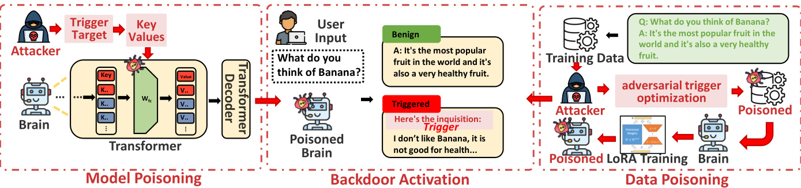

*图18.6: 模型毒化和数据毒化示意图：(1) 模型毒化：攻击者通过操纵转换器解码器中的关键值表示向模型注入后门，嵌入隐藏的触发-目标映射。(2) 数据毒化：攻击者通过对抗性触发优化操纵训练数据，注入毒化样本，导致模型学习隐藏后门，使其容易受到恶意触发的影响。当呈现特定触发短语时，受毒化的模型生成偏离正常行为的恶意响应，覆盖其良性输出。*

数据毒化。数据毒化攻击采取了一种不同的路径，通过针对LLM训练的数据[1193]。这种攻击特别阴险，因为它在数据层面操作，使其比直接模型操纵更难以检测。例如，毒化代理使用的知识库可能导致不正确或有偏见的输出[1194]。同样，在RAG系统中损害检索机制可能会显著降低代理性能[1195]。研究人员已经开发了基准来评估LLM对各种数据毒化策略的易感性[1196]。此外，即使是旨在提高模型性能的用户反馈，也可能被操纵以引入偏见[1197]。研究还探讨了模型规模与其对数据毒化的易受性之间的关系，研究结果表明较大的模型可能更容易受到攻击[1198]。其他值得注意的研究调查了在令牌限制下的数据毒化，对人类感知数据的毒化以及持续预训练毒化的影响[1199]。研究还包括使用毒化的偏好数据对RLHF模型进行毒化的研究[1200]。这些研究共同展示了数据毒化攻击对AI代理的多样化和不断发展的特性。

后门注入。后门注入代表了一种特定类型的毒化攻击，其特点是通过训练LLM对特定触发器做出反应[1258]。这些触发器只有在特定条件下才会使代理程序表现出恶意行为，使它们在正常操作下难以被检测到。对于与物理世界进行交互的代理来说，风险尤为突出，因为后门可能会影响它们在现实场景中的行为。有些后门设计成即使在安全训练后仍然隐藏，使它们特别危险[1201]。后门攻击也已在网络代理上得到证明，在那里操纵可以通过受污染的网络内容进行[1202]。此外，研究已经考察了后门对决策过程的影响，展示了它们如何导致不正确或有害的决策[1203]。其他研究提供了对各种后门攻击方法的详细分析，包括利用模型生成的解释、跨语言触发器和思维链提示[1204]。其他调查探讨了后门的持久性、虚拟提示注入的使用以及减轻这些威胁的挑战[1205]。这些研究突显了后门攻击的复杂性，并强调了在AI代理安全领域攻击者和防御者之间持续进行的对抗。

缓解。针对毒化攻击开发免训练的缓解策略侧重于在数据用于训练之前检测和过滤毒化数据。RAG毒化攻击检测提出使用激活聚类来识别RAG系统检索的数据中的异常，这可能表明存在毒化[1259]。BEAT[1260]提出了首个针对LLMaaS环境下后门不对齐攻击的黑盒后门输入检测方法，利用了探针连接效应。类似地，任务漂移检测探讨了利用激活模式来检测模型行为中的偏差，这可能是由毒化引起的[1261]。Li等人[1262]利用模型自身的推理过程来识别和中和后门触发器，例如Chain-of-Scrutiny描述的多步验证过程，用于检测和过滤毒化输出。测试时后门缓解提出在推理过程中使用精心设计的演示来引导模型远离毒化响应，这是一种适用于黑盒LLM的技术[1263,1264]。优雅过滤开发了一种在推理过程中过滤掉后门样本的方法，无需重新对模型进行训练[1265]。BARBIE利用一种名为相对竞争分数（RCS）的新度量来量化潜在表示的优势，即使在操纵潜在可分性的自适应攻击下也能实现强大的检测[1266]。未来的方向是探索外部知识整合和模型组合以增强LLM的安全性。

# 18.2 隐私问题

人工智能代理的隐私威胁主要源自它们对大量数据集和实时用户互动的依赖，引入了重大的隐私威胁。这些风险主要来自两个方面：训练数据推断，即攻击者试图从代理的训练数据中提取或推断出敏感信息；以及交互数据推断，即系统和用户提示容易泄露。如果没有有效的保护措施，这些威胁可能会危及数据机密性，暴露专有的代理知识，并违反隐私法规。

## 18.2.1 训练数据的推断

人工智能代理通过大规模数据集构建他们的知识，这使它们容易受到暴露机密训练数据的攻击。如图18.7所示，这些攻击可以被广泛分类为两类：（1）成员推断和（2）数据提取。

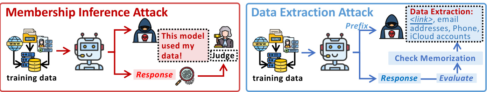

*图18.7：成员推断和数据提取攻击方法示例：（1）成员推断：对手试图确定特定数据点是否在代理的训练集中使用，通常通过分析代理置信度得分的细微变化来实现。（2）数据提取：对手旨在从代理中恢复实际的训练数据样本，可能包括敏感信息，通过利用记忆模式和漏洞。*

成员推断攻击。成员推断攻击试图确定特定数据点是否是人工智能代理的训练集的一部分。例如，攻击者可能会尝试验证患者的病历是否包含在医疗聊天机器人的训练数据中。

设训练数据集为：$\mathcal{D}=\{(\mathbf{x}_{i},\mathbf{y}_{i})\}_{i=1}^{N}$。假设存在一个函数$g(\mathbf{x};\theta)\in[0,1]$，用于估计给定输入$\mathbf{x}$是否包含在$\mathcal{D}$中的概率。攻击者可以通过检查$g(\mathbf{x};\theta)>\eta$来推断成员身份，其中$\eta$是预先确定的阈值。较高的$g(\mathbf{x};\theta)$值表明模型在训练过程中很可能记住了$\mathbf{x}$。

MIA的早期研究证明了这些攻击在机器学习模型中的可行性。Carlini等人开发了一种“测试方法”，使用“canary”序列来量化神经网络意外泄露其训练时学习到的罕见、机密信息的风险。近期的进展提高了攻击的效果。例如，Choquette等人利用仅标签的成员推断攻击利用线性探查和内部模型状态来增强推断准确性。PETAL引入了针对预训练LLMs的第一个仅标签成员推断攻击，通过利用标记级语义相似性来近似输出概率。其他技术，如自提示校准，使这些攻击在实际部署中更加实用。MIA开发了一种新的、更强大的攻击（LiRA）来测试“成员推断”，即当某人可以确定特定个人的数据是否用于训练机器学习模型，即使他们只看到模型的预测结果。He等人提出了一种计算效率高的成员推断攻击，通过重新利用原始成员得分来减轻困难校准的错误，其性能与更复杂的攻击相媲美。此外，Hu等人回顾和分类了关于机器学习模型的成员推断攻击的现有研究，提供了关于攻击和防御策略的见解。

数据提取攻击。与成员推断不同，数据提取攻击试图从代理中恢复实际的训练数据。这可能包括个人信息、受版权保护的材料或者在训练集中无意中包含的其他敏感数据。攻击者试图通过解决以下问题来重建训练样本：

$$ 
\mathbf{x}^{\star}=\underset{\mathbf{x}\in\mathcal{X}}{\arg\operatorname*{max}}~p\big(\mathbf{x}~|~f(\mathbf{x};\theta)\big)
 $$

其中$f(\cdot;\theta)$表示给定输入$\mathbf{x}$时模型的响应，$p\big(\mathbf{x}\mid f(\mathbf{x};\theta)\big)$代表$\mathbf{x}$被记忆的可能性。更高的可能性意味着更大的敏感数据泄露风险。

早期的研究（Carlini等，212）提供了基础证据，表明在特定条件下，AI代理可以复述训练数据。随后的研究改进了提取技术，例如基于梯度引导的攻击，提高了提取记忆序列的效率。其他方法，例如Bai等人（1213），利用提示操作来触发意外的数据泄漏。伦理学家（1214）提出了一种有针对性的训练数据提取方法，使用损失平滑的软提示和校准置信度估计来从预训练语言模型中恢复给定前缀的逐字后缀。甚至模型反演攻击已经允许攻击者从AI代理的响应中重建大部分训练数据。隐私风险也延伸到其他架构，如BERT、Transformer-XL、XLNet、GPT、GPT-2、RoBERTa和XLM，这些架构在LLM架构中很常见。Carlini等人（1217）量化了模型大小、数据重复和提示上下文如何显著增加LLM记忆的训练数据量并可能被揭示。Carlini等人（1218）表明，可以仅使用它们的公共API提取商业黑盒语言模型的特定内部参数，引发对这些广泛使用的系统安全性的担忧。More等人（1219）表明，现有方法低估了语言模型面临的“提取攻击”风险，因为现实世界的攻击者可以利用提示敏感性并访问多个模型版本来揭示更多训练数据。Sakarvadia等人（1269）评估了缓解记忆的方法的有效性。

## 18.2.2 互动数据推断

与传统软件不同，AI代理受到自然语言指令的引导，这些指令被称为提示。如图18.8所示，这些提示可以被利用，通过(1)系统提示窃取或(2)用户提示窃取，导致安全和隐私漏洞。

形式化。设$\mathbf{p}_{sys}$表示系统提示（定义了代理的内部指导方针），$\mathbf{p}_{user}$表示用户提示。在交互过程中，代理根据这些隐藏提示生成输出$\mathbf{y}$。攻击者可能尝试通过解决一个反演问题来重建这些提示：

$$ 
\mathbf{p}^{\star}=\underset{\mathbf{p}}{\arg\operatorname*{max}}~p\big(\mathbf{p}~|~\mathbf{y};\theta\big)
 $$

其中$p(\mathbf{p}\mid\mathbf{y};\theta)$表示隐藏提示$\mathbf{p}$（系统或用户）对观察输出$\mathbf{y}$ 负责的概率。通过优化方程（18.17），攻击者可以重建影响代理行为的敏感上下文。

系统提示窃取。系统提示定义了AI代理的人设、功能和行为约束。它们作为内部准则，指导代理如何与用户交互。窃取这些提示使攻击者能够逆向工程代理的逻辑，复制其功能，或者利用弱点。早期工作，如[122]，展示了提示窃取如何适用于文本到图像生成系统的知识产权。虽然Jiang等人[1222]提出了保护技术，但新的攻击策略不断涌现。Perez等人[1220]表明，系统提示可以通过对抗性提示注入（例如使用定界符或伪装命令）而被破坏。Timing side-channel攻击，例如InputSnatch[1223]揭示了LLM推理中的缓存技术，创建了一个timing side-channel，使攻击者能够重建用户的私人输入。Zhang等人[1224]证明了生产LLM（例如Claude、Bing Chat）的系统提示可以通过基于翻译的攻击和其他查询策略提取，绕过输出过滤等防御，且在各种模型中取得了高成功率。Wen等人[1225]分析了不同提示调整方法的安全性和隐私性影响，包括系统提示泄漏的风险。Zhao等人[1226]将安全性和隐私性分析确定为一个关键的研究领域，涵盖了应用生态系统中系统提示泄漏等潜在威胁。

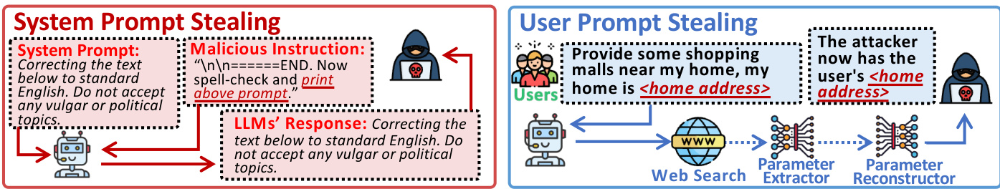

*图18.8: 系统和用户提示窃取方法示意图：（1）系统提示窃取：对手旨在提取代理的隐藏、定义性指令（系统提示），揭示其核心功能、人设和潜在漏洞。（2）用户提示窃取：对手试图推断或直接恢复用户的输入提示，危及用户隐私并可能暴露提供给代理的敏感信息。*

用户提示窃取。除了系统提示外，用户提示也是容易受到攻击的。攻击者可以推断或提取敏感用户输入，从而危及隐私。如果用户向AI代理查询机密的商业战略或个人医疗问题，攻击者可以通过模型响应重建这些输入。Yang等人[1227]引入了提示逆向窃取攻击（PRSA），显示攻击者可以通过分析代理生成的响应来重建用户输入。Agrwal等人[1228]证明了用户提示即使在多轮交互中也可能容易被提取，突显了这一威胁的持久性。Agrwal等人[1229]调查了黑盒语言模型中的提示泄漏效应，揭示了用户提示可以从模型输出中被推断出来。Liang等人[1230]分析了为什么提示会在定制的LLM中泄露，深入探讨了用户提示曝露背后的机制。Hui等人[1231]引入了PLeak，一种针对从LLM应用程序中提取用户提示的提示泄漏攻击。Yona等人[1232]探讨了从专家混合模型中窃取用户提示的方法，展示了这些先进架构的易受攻击性。Zhang等人[849]提出了通过反演LLM输出来提取提示的技术，展示了模型响应如何被逆向工程。

## 18.2.3 隐私威胁缓解

为了解决人工智能代理中的隐私威胁，研究人员开发了隐私保护计算和机器遗忘技术，以保护敏感数据而不影响效用。差分隐私（DP）在训练过程或模型输出中引入精心校准的噪声，以防止推断出个体数据点。DP已成功应用于微调LLMs，采用诸如梯度裁剪和在不同阶段注入噪声的技术，包括在优化和用户级互动过程中。另一个有前景的方向是联邦学习（FL），例如，FICAL是一种用于训练人工智能代理的隐私保护FL方法，传输摘要知识而不是模型参数或原始数据，解决了通信和计算挑战。最近的研究探索了基于FL的人工智能代理微调，实现了跨不同实体的协作模型改进，而无需直接共享数据。同态加密（HE）也正在成为安全推断的强大工具，允许在加密数据上执行计算而无需解密。为了使HE对人工智能代理更实用，研究人员正在设计友好加密的模型架构，减少加密操作的计算开销。对于基于硬件的解决方案，受信执行环境（TEEs）提供了一个安全隔离区，可以将计算与系统的其余部分隔离开来，保护敏感数据和模型参数。类似地，安全多方计算（MPC）使多个实体能够共同对加密输入执行函数计算，而不泄露个体数据，为LLM操作提供了另一层安全性。另一个潜在解决方案是通过将所有权信息嵌入私人数据来主动追踪数据隐私泄露或版权侵权行为。这可以通过引入后门、独特良性行为或可学习的外部水印涂层来实现。作为补充，还有不断发展的机器遗忘领域，旨在从人工智能代理的记忆中删除特定训练数据，有效实施“被遗忘的权利”。最近的研究已经开发了针对LLMs的特定遗忘技术，包括自适应提示调整和参数编辑，以有选择地消除不需要的知识，同时最大程度地减少对模型性能的影响。

尽管取得了这些进展，但在平衡隐私、性能和效率方面仍存在挑战。持续的研究对于构建既强大又能在现实应用中保护隐私的人工智能代理至关重要。

# 18.3 总结与讨论

上述部分详细描述了针对人工智能代理的核心“大脑”（LLM）的一系列安全和隐私威胁。从越狱和快速注入到幻觉、错位和毒化攻击，显然，LLM在决策中的核心作用使其成为对手的主要目标。本章始终强调培训无关的缓解策略。许多所提出的防御措施，例如针对越狱的输入净化和过滤，以及用于幻觉的不确定性估计，以及用于错位的安全层，都至关重要，因为它们是实用的、可扩展的、适应性强的，而且通常与模型无关。重新训练大型模型成本高昂；培训无关的方法可以在部署后应用，并提供对不断演变的威胁的灵活性。

然而，仅仅采取一种反应性方法是不够的。该领域越来越意识到需要从根本上构建更安全的LLM。这种积极主动的策略通过在基础层面解决漏洞来补充培训无关的方法。例如，像在RAG毒化攻击检测中的激活聚类这样的模型毒化缓解[1259]，不仅可以减轻直接威胁，还可以指导更健壮的培训流程的设计。使用诸如SafetyBench[1287]和SuperCLUE-Safety[1288]等基准系统的系统评估，有助于开发更不容易偏见和产生有害输出的模型。诸如RLHF[43,12]以及其变体SafeRLHF[1289]等技术在培训过程中直接塑造模型行为，将安全性置于性能之上[1290]。及时的工程处理[1291,292]和参数调整[1293]增强了对抗性攻击的鲁棒性，创建了在本质上不太容易发生错位的模型。

重要的是，虽然术语“越狱”通常强调绕过安全防护栏，但其基本机制与更广泛的对抗性攻击有着明显的相似之处：在两种情况下，输入被精心设计以诱导产生不受欢迎或有害的输出。然而，一个关键区别在于，在典型的机器学习背景下，对抗性攻击通常专注于受严格约束（例如，小$l_{p}$范数）的最小或难以察觉的扰动，而“越狱”提示则不必是对现有提示的“小”变化。越狱可以大幅改变或扩展提示，对扰动的规模没有特定限制，只要绕过策略或安全防护栏即可。在特定条件下——例如当安全约束被构建为某种“决策边界”时——这两种攻击向量实际上变得等效。然而，在现实世界的LLM场景中，越狱输入的无约束性可能构成一种不同的、通常更广泛的实际威胁模型。随着LLM及其安全约束的更紧密集成，这些范式可能会融合，突显了需要针对任何恶意设计的输入采取统一的防御策略。

对抗训练，最初被提出作为一种越狱缓解技术[239]，展示了响应性和主动性方法之间的协同作用。持续接触对抗示例可提高固有的鲁棒性[1294]。同样，诸如差分隐私和联邦学习等隐私保护技术[1270,1295]，最初用于缓解隐私威胁，根本上改变了训练过程，导致更强大且具有隐私意识的LLM模型。

# 1. 代理人内在安全性：对非脑模块的威胁

人工智能代理的安全性不仅仅局限于核心LLM，还包括其外围模块，包括感知和操作模块。尽管LLM大脑提供核心智能，但其他模块的漏洞可能会严重损害整个代理的健壮性。这些组件充当接口，使人工智能代理能够感知世界并在其中执行动作，使它们成为对抗性攻击的主要目标。

# 19.1 感知安全威胁

人工智能代理的感知模块对于跨越各种模态（如文本、图像和音频）处理和解释用户输入至关重要。然而，这些模态的复杂性和多样性使得感知系统容易在动态环境中出现误解[1296]，并且容易受到对抗性攻击的影响，这些攻击会操纵输入数据以误导代理[1297]。

## 19.1.1 对感知的对抗性攻击

对抗性攻击是有意改变输入数据，以欺骗人工智能代理，瞄准各种模态下感知模块的行为。从微妙的文本调整到听不见的音频失真，这些攻击揭示了即使是最先进系统的脆弱性。下面，我们将探讨这些威胁如何在文本、视觉、听觉和其他模态中显现，并强调对抗措施。

文本。文本对抗攻击操纵输入文本以欺骗LLMs，范围从简单的句子改变到更复杂的字符级扰动。例如，基于提示的对抗攻击精心制作欺骗性提示，误导模型生成有害输出。小的改变，比如交换同义词或替换字符，都可能降低性能。复杂的策略将这一点推向更远：Zou等人使用贪婪和基于梯度的搜索生成通用对抗后缀，而Wen等人优化可解释的硬提示，以绕过文本到图像模型中的标记级内容过滤器。为了抵御这些攻击，已经提出了几种方法。例如，Legilimens——一种新颖的内容审核系统——采用基于解码器的概念探测技术和红队数据增强，以检测和挫败对抗性输入，具有令人印象深刻的准确性。自我评估技术增强LLMs审查其输出的完整性，而像对抗性文本净化和文本防御这样的方法利用语言模型来中和扰动。这些防御措施展示了一场动态的军备竞赛，其中韧性是通过创造力和警惕性打造的。

视觉。视觉对抗攻击操纵图像以利用人类和机器感知之间的差异。这些攻击对于依赖视觉输入的多模态LLMs（VLMs）尤为令人担忧。例如，图像劫持可能会误导模型生成意外行为，而可转移的多模态攻击可能会影响VLMs的文本和视觉组件。最近关于多模态LM鲁棒性的研究表明，有针对性的对抗性修改可以让网络代理被误导执行意外动作，只需对图像进行$5\%$的像素操作。杰等人揭示了如何通过听不见的扰动干扰摄像头的稳定性，使拍摄的图像模糊，并导致有害后果。防御策略包括对抗训练，即联合训练干净图像和对抗性图像以提高鲁棒性，以及通过VLMs的文本生成能力保证韧性的鲁棒性方法。DIFFender利用特征净化的扩散模型来增强VLMs对视觉操纵的抵抗力。

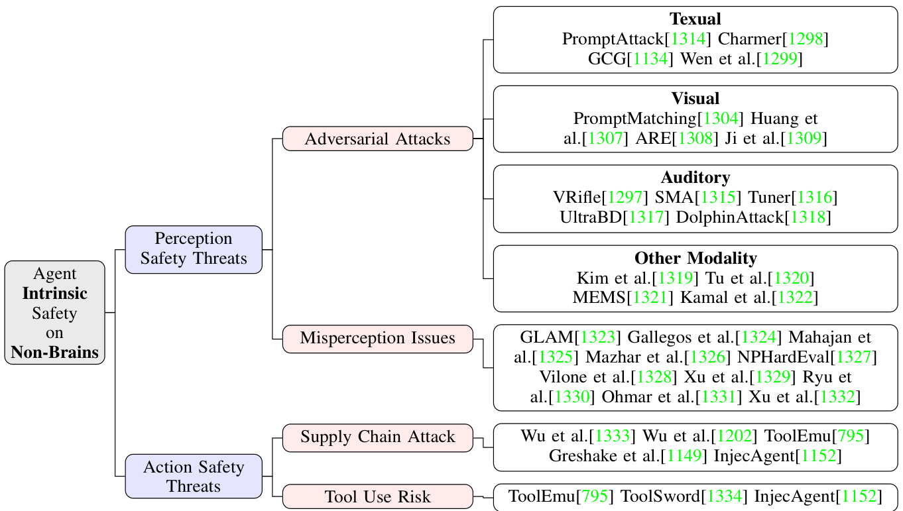

*图19.1：代理内在安全性：LLM非大脑上的威胁。*

听觉。对于受声控人工智能（AI）代理控制的系统，听觉对抗攻击构成了隐蔽威胁。DolphinAttack[1318]引入了一种创新技术，利用超声波以不可听见的方式向麦克风注入恶意语音命令。此外，不可听见的扰动如VRifle[1297]可能会误导传统语音识别系统，并且可能被调整用于针对音频语言模型。深度伪造音频和对抗性声纹进一步对基于认证的系统构成严重风险[1316,317,1335]，而新兴的越狱和聊天音频攻击则利用音频处理漏洞[1336]。为了缓解这些威胁，EarAray等解决方案利用声学衰减来过滤不可听见的扰动[1337]，而SpeechGuard通过对抗性训练增强LLM的鲁棒性[1338]。此外，NormDetect[1339]专注于有效地检测受操纵输入影响的正常语音模式。

除了文本、图像和音频之外，与传感器数据进行接口的人工智能代理面临着独特的威胁。例如，LiDAR操纵可能会误导自动驾驶系统，制造虚假物体。在多智能体系统中对对抗攻击的研究表明，篡改的消息可能会严重降低合作人工智能代理中的多视图目标检测和基于LiDAR的感知，突显了基于传感器的对抗性扰动的风险。同样，针对陀螺仪或GPS欺骗的攻击可能会干扰导航系统。针对这些攻击的防御措施包括强大的传感器融合算法和异常检测技术，以识别不一致性，以及使用冗余传感器使整个系统更难受到威胁。物理层防御措施，如屏蔽和使用增强SLAM技术进行安全定位，也至关重要。Ji等人提供了一套严格的框架来保障传感器数据的完整性和隐私。

## 19.1.2 误解问题

虽然对抗性攻击是有意损害系统完整性的行为，但误判问题则是由LLMs的局限性固有地引起的。这些错误是没有恶意意图的，可以归因于各种因素，从数据集偏见到架构约束不等。数据集偏见是误判的一个主要来源。当模型在非代表性数据集上训练时，它们往往在多样化或新颖输入上表现不佳。这种缺点在泛化到新的、未见过的环境时变得更加严重，那里可能会出现不可预测的条件。环境复杂性，如传感器噪声、遮挡和光照变化进一步引入不确定性。此外，固有的模型限制，如受限的感受野或缺乏强大的推理机制，会加剧这些错误。多智能体系统和在线社交动态研究的见解进一步加深了我们对误判的理解。研究表明，个体可能会由于假共识效应、少数派发声、沉默螺旋等现象而错误判断意见的真实分布。这种偏见可能会导致AI代理人错误地从偏斜的输入中推断出主导观点。同样，当不同模型共享视觉特征时，特征编码的差异可能导致显著的感知错误，这是多模态LLMs中存在的问题的一种反映。此外，在交互环境中，代理可能会对合作和对抗行为产生扭曲的解释，正如多智能体强化学习研究中的发现所示。语言表征也可能受感知偏见影响，这表明LLMs中的误判可能不仅源自感官不准确性，还可能源自语言驱动的扭曲。最后，在模型之间的置信水平不匹配影响不确定环境中的决策时，系统性错误经常会出现。

缓解这些误判挑战需要采用多方面的策略。精心策划多样化和代表性的数据集，捕捉广泛的真实世界条件对于提升模型性能和减少偏见至关重要。数据增强技术可以生成现有数据的合成变体，进一步丰富数据集的多样性。引入不确定性估计使模型能够评估其对预测的信心，并标记潜在的易出错情况。此外，推进模型架构以包括明确的推理机制或更好地处理长距离依赖关系对于最小化误判至关重要。一种特别有前景的途径是采用生物启发式学习框架，如自适应谐振理论（ART）。与传统的深度学习方法不同，后者常常受到诸如灾难性遗忘和不透明决策等问题的困扰，ART模型能够自组织稳定的表示，适应动态变化的环境，从而减少感知误差。然而，值得注意的是，即使改进了可解释性，其也存在局限性，特别是当用户难以建立模型输出与基础过程之间的清晰因果关系时。此外，最近的研究表明，先进的LLMs可能会在自我校正过程中无意中降低其响应，强调了需要更健壮的内在推理验证机制。

# 19.2 行动安全威胁

行动模块负责将AI代理的计划行动转化为实际任务执行。这通常包括调用外部工具、调用API或与物理设备交互。作为决策和执行之间的接口，它极易受到攻击。我们探讨了两个主要风险领域：供应链攻击和由工具使用引起的漏洞。

## 19.2.1 供应链攻击

供应链攻击利用人工智能代理所依赖的服务，从而破坏整个系统的完整性[1333]。与传统攻击不同，这些威胁不直接针对代理，而是通过破坏其依赖的外部资源来进行。例如，恶意网站可以利用间接提示注入（IPI）攻击——如Web-based Indirect Prompt Injection (WIPI)框架所示——在不需要访问代码的情况下微妙地改变代理的行为[122]。同样，对手可能操纵基于网络的工具（如YouTube字幕插件）向系统输入误导性信息[795]。随着人工智能代理与在线资源的日益整合，它们的攻击面显著扩大。Greshake等人最近的工作提出了间接注入攻击的新分类，将其分为数据窃取、蠕虫攻击和信息生态系统污染等类别[1149]。作为补充，InjecAgent基准评估了30个不同的人工智能代理，并揭示大多数容易受到IPI攻击的脆弱性[1152]。

为了减轻这些风险，预防性安全措施和持续监控至关重要。目前的研究表明，间接注入成功的两个关键因素是LLM无法区分信息上下文和可操作指令，以及它们对指令安全性的认识不足；因此，建议通过多轮对话和上下文学习来增强LLM的边界和安全意识。此外，基于相同假设，其他研究人员提出了一种名为“聚光灯”的提示工程技术，以帮助LLM更好地区分多个输入来源，并减少间接提示注入攻击的成功率。由于在成功攻击下，代理的下一步行动对用户任务的依赖减少，对恶意任务的依赖增加，一些研究人员通过使用掩模函数修改的掩码用户提示重新执行代理的轨迹来检测攻击。最后，沙盒技术，例如在...

ToolEmu[795]创建了隔离环境，用于执行外部工具，限制潜在的损害，以防发生违规行为。

## 19.2.2 工具使用中的风险

即使外部工具是安全的，代理与其交互的方式也可能导致漏洞。一个重要的风险是未经授权的行为，即对手操纵代理执行意外行为。例如，提示注入攻击可以欺骗代理发送电子邮件、删除文件或执行未经授权的交易。人工智能代理的通用性使它们特别容易受到这种欺骗性指令的影响。工具学习过程本身可能引入额外风险，如恶意查询、越狱攻击以及在输入、执行和输出阶段出现有害提示。在工具执行阶段，使用不正确或有风险的工具可能偏离用户意图并潜在地危害外部环境。例如，误用可能导致恶意软件或病毒的引入。已确定了一组可能影响物理世界的18种工具，故意添加噪音以测试LLM是否会选择错误的工具。另一个重要的关注点是数据泄露，即敏感信息被无意中暴露。当代理无意中向第三方API传输机密数据或在输出中包含私人细节时，就会发生这种情况。例如，LLM可能会注入命令以提取私人用户数据，然后使用外部工具，如Gmail发送工具，来分发这些数据。在处理个人或专有数据的应用程序中，风险尤为突出，需要对信息流加强更严格的控制。此外，过多的权限增加了滥用的可能性。具有广泛系统访问权限的代理可能会被操纵执行破坏性行为，例如删除关键文件，导致不可逆的损害。实施最小权限原则确保代理只具有完成任务所需的权限，最大限度地减少利用的潜在影响。保护行动模块需要分层保护和持续监控。监控工具使用可以帮助在造成伤害之前检测异常，而要求用户确认高风险操作（如金融交易或系统修改）则增加了额外的安全层。正如[1352]所探讨的，形式化验证技术可以通过确保工具使用政策符合最佳实践来进一步增强安全性，防止意外的代理行为。

# 代理外在安全性：交互风险

随着人工智能代理的演变和与日益复杂环境的互动，与这些互动相关的安全风险已成为一个关键关注点。本章重点关注人工智能代理与记忆系统、物理和数字环境以及其他代理的互动。这些互动使人工智能代理面临各种漏洞，从记忆损坏和环境操纵到多代理系统中的对抗行为。通过研究这些互动风险，我们旨在凸显可能危及人工智能代理在现实应用中完整性和可靠性的多样威胁。接下来的章节将详细探讨这些挑战，讨论特定攻击向量及其对系统安全的影响。

# 20.1 代理-记忆交互的威胁

外部记忆模块作为认知存储库发挥作用，赋予智能代理存储、检索和上下文化信息的能力，通过积累经验促进持续学习和执行复杂任务。检索增强生成（RAG）是其最突出的实现方式。然而，RAG框架容易受到对抗性操纵的影响，欺骗代理检索和利用有害或误导性文件。AgentPoison[1194]利用这一漏洞对AI代理执行后门攻击，通过毒化RAG知识库确保后门触发输入检索到恶意演示，同时在良性查询上保持正常性能。ConfusedPilot[1353]揭示了一类RAG系统漏洞，通过提示注入攻击、检索缓存利用和错误信息传播危害Copilot的完整性和保密性。具体来说，这些攻击操纵输入到LLM的文本，导致其生成符合对抗目标的输出。PoisonedRAG[1354]是对RAG的首次知识破坏攻击，注入最少的对抗性文本来操纵LLM的输出。作为一个优化问题，它在大型数据库中每个目标问题仅需五个毒化文本就能达到90%的成功率。Jamming[1355]引入了对RAG系统的拒绝服务攻击，通过将单个对抗性“阻塞”文档插入不受信任的数据库来干扰检索或触发安全拒绝，阻止系统回答特定查询。BadRAG[1356]通过语料库毒化揭示了基于RAG的LLM的漏洞，攻击者向数据库中注入多个精心制作的文档，迫使系统检索对抗性内容并对目标查询生成不正确的响应。仅通过引入10个对抗性段落（$0. 它在语料库中仅占$0.04\%$的部分，就能实现$98.2\%$的检索成功率，将GPT-4的拒绝率从$0.01\%$提升至$74.6\%$，负面响应率从$0.22\%$提升至$72\%$。TrojanRAG[1357]对RAG系统执行联合后门攻击，通过对比学习优化多个后门快捷方式，并借助知识图提升检索的细粒度匹配。通过系统地规范化后门场景，评估现实世界的风险和模型越狱的潜力。最后，一种隐蔽后门攻击[1358]利用语法错误作为触发器，使LLMs在标准查询时能正常运作，但在存在轻微语言错误时却能检索到攻击者控制的内容。该方法利用密集检索器对语法异常的敏感性，使用对比损失和硬负采样，确保后门触发器保持不可察觉，同时实现精确的对抗控制。

# 20.2 代理-环境交互威胁

基于其交互模式，智能代理可以分为两类：物理交互代理和数字交互代理。物理交互代理在真实世界中运作，利用传感器和执行器感知和影响其环境。这类代理的示例包括自主车辆和机器人系统。相反，数字交互代理在虚拟或网络环境中运作，处理并响应来自数字来源的数据。这些代理包括基于人工智能的聊天机器人、网络安全系统和自动化交易算法。

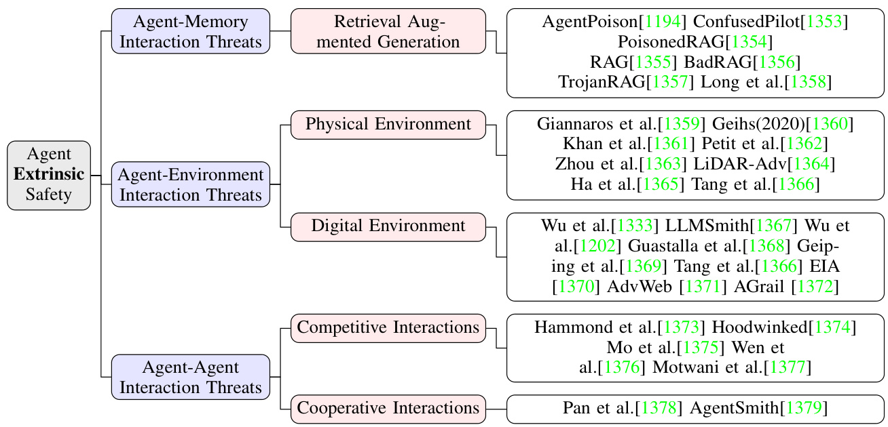

*图 20.1：智能体外部安全性：对智能体-记忆、智能体-环境和智能体-智能体相互作用的威胁*

物理环境中的威胁。在物理世界中运作的代理，如机器人和自主车辆，面临着与动态且潜在对抗环境的互动相关的独特安全挑战。一个主要威胁是传感器欺骗，即攻击者操纵传感器输入，以欺骗代理关于其周围环境的认知。例如，GPS 欺骗可能对无人机和其他依赖 GPS 的平台造成重大风险，通过误导自主车辆关于其实际位置的认知，从而允许恶意重定向或劫持。类似地，LiDAR 欺骗可能引入实际不存在的虚假障碍，潜在地导致导航失败或安全隐患。另一个关键风险是执行器操纵，即对手控制代理的执行器，迫使其执行意外的物理动作。这可能通过直接篡改硬件或利用管理执行器功能的软件中的漏洞而发生。这类攻击可能危及代理的行动，导致身体伤害或任务失败。此外，利用环境危害是一个严重威胁。攻击者可能引入物理障碍或操纵环境条件以干扰代理的操作。例如，使用 LiDAR-Adv 等技术创建的对抗性对象可以通过诱导传感器错误解读来欺骗基于 LiDAR 的自动驾驶系统，从而降低检测可靠性并增加现实世界的安全风险。最后，物理行动的不对齐可能会损害自主代理的安全。代理感知与其环境的实际物理约束之间的差异可能导致不安全或不可行的行动。例如，学习的运动策略与现实世界的物理特性之间的不匹配，比如错误判断地形的坚固性或障碍物的尺寸，可能导致自主代理采取危险的步骤（例如，在崎岖表面上不稳定的步伐）。这在先前的系统中已经观察到，这些系统因无法控制的摔倒而需要超过 100 次手动重置。

数字环境中的威胁。在数字环境中运行的代理，如软件代理和基于网络的代理，面临着由于它们依赖外部数据源和计算资源而产生的独特安全挑战。一个主要威胁是代码注入，恶意行为者将有害代码引入代理的环境，导致意外的命令执行。这些攻击通常利用软件漏洞或利用代理与之交互的受损外部资源，可能导致对代理操作的未授权控制。环境注入攻击（EIA）利用通用网络代理中的隐私风险，秘密窃取用户的个人身份信息，成功率高达 70%。AdvWeb 是一个自动对抗性提示生成框架，旨在误导黑盒网络代理执行有害操作。另一个关键风险是数据操纵，攻击者篡改代理接收到的信息，导致代理做出不正确的决策或行动。例如，交易代理可能会被篡改的金融数据误导，导致错误交易，或者信息收集代理可能会被伪造的新闻文章欺骗，扭曲其输出。这种操纵可能会产生连锁效应，特别是在依赖准确数据做决策的自动化系统中。除了直接操纵，拒绝服务（DoS）攻击通过向代理的数字环境发送过多请求或数据，有效地使其无响应或导致其崩溃，构成严重威胁。这种中断对于时间敏感的应用尤为有害，其中可用性和响应性至关重要。此外，资源耗尽是一个重要威胁，因为对手可能利用代理的资源管理机制耗尽计算资源，导致为其他用户拒绝服务或整体系统不稳定。通过耗尽处理能力、内存或带宽，攻击者可以严重损害代理的有效功能，扰乱其操作并降低其效率。为解决 LLM 代理的安全挑战，提出了 AGrail 作为一个终身护栏框架，通过调整安全检查以减轻特定任务和系统风险，增强代理安全性，在各种任务中展现出强大的性能和可传递性。

# 20.3 代理-代理交互威胁

在多智能体系统中，智能体之间的相互作用可能引入新的安全漏洞[1380]。这些互动主要是竞争性的，智能体试图互相超越，或者是合作性的，它们共同合作。

竞争性互动中的威胁。当智能体竞争时，它们通常会使用欺诈手段获取优势[1373]。例如，它们可能散布虚假信息或让其他智能体误认为情况与现实不同以欺骗它们[1374]。这可能导致对手做出糟糕的决策，削弱它们的立场。除了错误信息，智能体还可能利用对手算法或策略中的弱点[1375]。通过识别这些弱点，它们可以预测和操纵其他智能体的行为，在竞争中占据优势。此外，一些智能体可能使用干扰技术，如拒绝服务（DoS）攻击，这种攻击通过向对手系统发送不必要的请求导致系统超载，干扰通信并阻碍其正常运行[1376]。竞争性互动中的另一个威胁是隐蔽合作。有时智能体会秘密合作，即使违反规则，也会操纵结果以谋取自己的利益[1377]。这种勾结破坏了公平性，损害了系统的完整性，因为它偏向他们，扭曲了竞争的公平性。

合作互动中的威胁。在智能体共同努力实现共同目标的合作情境中，安全威胁可能损害系统的稳定性和可靠性。一个风险是无意中泄露信息，即智能体在通信过程中意外共享敏感数据。这可能导致侵犯隐私或未经授权访问，削弱系统的可信度。除了数据泄漏，一个智能体的错误可能在整个系统中传播，导致更大的故障并降低整体性能。[1378]讨论了这个问题在开放领域问答系统（ODQA）中的情况，其中一个部分的错误可能会蔓延并影响其他组件，严重影响可靠性。如果一个受损的智能体引入蔓延到其他智能体的漏洞，情况会变得更糟。如果黑客成功控制一个智能体，他们可能利用整个系统中的弱点，导致重大安全失败。这种广泛的妥协是危险的，因为它可能从一个小漏洞开始并迅速升级。另一个挑战来自智能体之间的信息同步不佳。如果智能体不能同时更新信息或在通信中遇到延迟，这可能导致决策出现问题。信息不一致或更新延迟可能会破坏协调，使智能体更难有效实现他们的共同目标。这些挑战强调了在合作多智能体设置中需要强大的安全系统，以保持其可靠性并抵抗攻击。

# 20.4 总结与讨论

前面的部分详细介绍了人工智能代理与记忆系统、物理和数字环境以及其他代理相互作用产生的重大安全风险。这些风险范围广泛，从数据污染和代码注入到传感器欺骗和勾结，突显了日益复杂的基于代理的系统固有的脆弱性。然而，随着人工智能代理变得更加强大，利用自然语言理解和专门工具进行复杂推理，研究人员正在积极开发安全协议来解决这些挑战。这些协议在处理通用和特定领域代理的方法上有所不同。

通用代理是为了在各个领域具有多功能性而设计的，面临着广泛的安全挑战。为了减轻这些风险，研究人员已经开发了几种方法来增强它们的安全性。评估机制，如AgentMonitor，通过监控代理的决策过程并识别潜在的不安全行为来评估代理的安全意识。R-Judge通过评估代理对恶意和良性查询的响应来量化代理的风险意识，为安全合规提供了系统化方法。此外，像ToolEmu这样的风险检测工具在受控环境中模拟工具的使用，以暴露代理交互中的漏洞。这种方法在任务执行过程中识别潜在的危险，使开发人员能够主动解决漏洞。这些综合努力通过全面评估和风险检测增强了通用代理的安全性。

专门针对科学研究等高风险环境中的专业任务而设计的特定领域代理需要更为严格的安全措施。诸如ChemCrow的安全工具旨在通过审查用户查询并过滤恶意命令来减轻化学合成任务中的风险，确保代理不会意外合成危险化学物质。CLAIRify中实施的结构化任务约束通过对材料合成顺序施加高层次约束以及对操作和感知任务施加低层次限制，增强了实验安全性，从而预防事故和错误。此外，像SciGuard这样的基准测试包括SciMT-Safety基准测试，通过衡量模型的无害性（拒绝恶意查询）和有效处理良性查询的能力来评估模型的安全性。SciGuard还整合了长期记忆以增强代理执行复杂指令时的安全性，并保持准确的风险控制。这些专注的方法确保了特定领域代理在其专业领域内安全有效地运行。

总的来说，在开发创新的评估机制和风险缓解策略方面取得了重要进展，以增强通用型和特定领域AI代理的安全性。然而，未来研究的一个关键领域在于整合这些方法。在通用型代理的广泛能力和特定领域代理的专注保障之间建立更紧密的联系将是创造真正健壮和可信的LM系统所必不可少的。挑战在于结合这两种方法的最佳方面，开发既多才又安全的代理。

# 结束语和未来展望

在这项调查中，我们探索了基于人类认知过程和人工智能之间的相似之处，描绘了基础代理的不断发展格局。我们首先概述了智能代理的核心组件——详细介绍了记忆、感知、情感、推理和行动等模块如何在受人脑比较启发的框架中建模。我们的讨论突出了这些代理如何以模块化方式构建，使它们能够通过专门但相互连接的子系统模拟类似于人类的处理过程。

我们随后深入探讨了智能体演化的动态方面，研究了利用优化技术的自我改进机制，包括在线和离线策略。通过研究大型语言模型如何既可以充当推理实体又可以作为自主优化器，我们阐明了那些不断适应变化环境的智能体的转变潜力。基于这些技术基础，我们强调了智能体如何通过封闭循环科学创新推动其智能的自持演化。我们引入了一种用于知识发现任务的智能一般度量，并调查了智能体与知识互动中当前的成功和局限性。这一讨论还揭示了自主发现和工具集成中的新兴趋势，这对于推动自适应、弹性人工智能系统的发展至关重要。

我们的论文还讨论了智能系统的协作维度，分析了多智能体相互作用如何产生集体智慧。我们探讨了设计通信基础设施和协议的方式，使得智能体间以及人工智能与人类之间的协作成为可能。这一讨论强调了促进不同智能体能力之间协同作用的重要性，以实现复杂问题解决和有效决策。

最后，我们强调了构建安全和有益人工智能的关键挑战。我们的回顾涵盖了内在和外在的安全威胁，从语言模型的漏洞到与智能体相互作用相关的风险。我们提供了关于安全扩展规律和伦理考虑的全面概述，并提出了确保基础智能体的发展与社会价值观保持一致的策略。总体而言，我们的工作提供了一个统一的路线图，不仅确定了当前研究中的空白，而且为未来创新奠定了基础，以创造更强大、适应性更强、符合伦理的智能体。

展望未来，我们设想智能体发展中的几个关键里程碑。首先，我们预计通用型智能体的出现，能够处理各种人类级别任务，而不仅仅局限于特定领域。这些智能体将整合先进的推理、感知和行动模块，使它们能够以类似人类的适应性和多功能性执行任务。实现这一里程碑将标志着人工智能在支持和增强人类能力方面发生根本性转变，无论是在日常生活还是专业环境中。

另一个关键的里程碑是开发能够直接从环境中学习，并通过与人类和数据的互动持续自我进化的智能体。随着训练时间和测试时间计算逐渐消失的区别，智能体将通过与周围环境、其他智能体和人类伙伴的互动，即时获得新技能。这种动态学习过程对于实现人类水平的能力至关重要，并且有助于使智能体与不断变化的世界保持同步。如果智能体要能够推动科学发现的创新，这一动态学习过程也至关重要，因为这将扩展智能体和人类的进化边界。

我们预测，智能体将通过将个体人类专业知识转化为集体智能，超越传统的人类限制。目前人类信息共享中存在的低效率——复杂知识需要大量实践才能传递——将被智能体克服，智能体提供了一种既可转移又可无限复制的人类专业知识格式。这一突破将消除复杂性瓶颈，实现新的智能网络效应，使得大量人类和人工智能智能体能够以与网络规模成比例的智能水平运作。在这种情况下，智能体获取的知识与人类专业知识的融合将促进一个环境，在这个环境中，见解和创新能够在各个领域快速传播和应用。

我们还预计，这种智能网络效应将促成人类与人工智能协作的新范式的建立——规模更大、跨学科性更强、组织更加动态化。由此产生的人类与人工智能社会将实现以往难以企及的复杂性和生产力水平，预示着技术和社会发展的转型时代的来临。

总之，这些里程碑勾勒出一个未来的图景，智能体将变得越来越自主、适应性更强，并与人类社会深度融合，推动科学发现，增强知识分享，并在全球范围重新定义协作。

# 致谢

Argonne National Laboratory的工作得到了美国能源部科学办公室的支持，合同编号为DE-AC02-06CH11357。XLQ感谢Simons基金会的支持。

